# 第1课时：Transformer 核心与 Self-Attention 深度剖析

## 1. Transformer基础入门

在聊 Transformer 之前，先想象一下：如果没有它，现代大语言模型就像一支乐队，没有指挥，每个乐器都各自为战，节奏混乱。Transformer 就是那位聪明的指挥，让模型能够同时关注每个词的位置和关系，从而谱出连贯的“语言交响曲”。

### 1.1 Transformer的诞生与核心思想

2017 年，Google 在论文 [《Attention Is All You Need》](https://arxiv.org/abs/1706.03762) 中提出了 Transformer 结构，这一设计彻底改变了自然语言处理（NLP）的发展方向。

在此之前，主流方法仍依赖循环神经网络（RNN）或长短期记忆网络（LSTM）来处理文本序列。这些模型虽然擅长捕捉时间顺序，但在处理长文本时效率低、训练困难，且无法并行化。

Transformer 的出现打破了这一瓶颈。

它完全摒弃了循环结构，改用一种名为自注意力机制（Self-Attention） 的方法，使模型能够在同一时间关注输入序列中所有位置的词，从而理解词与词之间的关系。

这种机制让模型在捕捉上下文关联时更灵活、更高效，也让训练速度实现了质的飞跃。

几乎在同一时间，FastAI 团队在论文 [《Universal Language Model Fine-tuning for Text Classification (ULMFiT)》](https://arxiv.org/abs/1801.06146) 中提出了另一项重要思路：迁移学习 (Transfer Learning)。

它展示了如何将一个在大规模数据上训练好的语言模型，迁移到下游任务（如文本分类）上，只需少量标注数据就能达到优秀效果。

这两项工作共同奠定了现代大模型的基础。

Google 的 Transformer 提供了强大的结构框架，FastAI 的 ULMFiT 则证明了“预训练 + 微调”的可行性。

二者结合，促成了两种经典模型的诞生：

* GPT（Generative Pre-trained Transformer）：基于 Transformer Decoder，用于自回归语言建模；
* BERT（Bidirectional Encoder Representations from Transformers）：基于 Transformer Encoder，用于双向上下文建模。

自此以后，NLP 进入了以 Transformer 为核心的新时代。

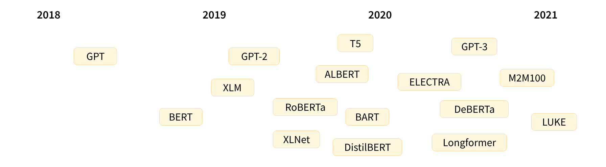

然而，Transformer 模型真正的突破，不仅在于结构的创新，更在于它采用了自监督学习（Self-supervised Learning） 作为训练方式。

这种方法不依赖人工标注数据，而是通过输入文本本身构造训练目标，让模型在海量语料中自主学习语言规律。

常见的两种预训练任务包括：因果语言建模（Causal Language Modeling, CLM）和遮盖语言建模（Masked Language Modeling, MLM）。这两种任务让模型在无标注环境下形成语言统计和语义理解能力，相当于“自学成才”。

不过，这种通用语言能力仍然偏向于理解层面，若要在具体任务上表现出色，还需要进一步的迁移学习与微调（Fine-tuning），即在特定任务数据上调整模型参数，使其更契合目标场景。

从结构到方法，Transformer 的核心思想可以总结为：

> **用自注意力理解上下文，用自监督学习掌握语言。**
> 这正是现代大语言模型的技术起点，也是预训练范式能够不断延展至多模态与通用智能的根基。

模型不再依赖人工特征或独立任务训练，而是通过在大规模语料上的自监督预训练，获取通用语言能力。

这一范式的成功，让“通用语言理解”真正成为可能，也为后续大模型（如 T5、GPT-3、ChatGPT）的出现奠定了技术基础。

### 1.2 Encoder与Decoder的区别与应用

要真正理解 Transformer，就必须先搞清楚它的两个主角 —— Encoder（编码器） 和 Decoder（解码器）。

原始的 Transformer 模型结构如下图所示，Encoder 在左，Decoder 在右。


它们的关系有点像一场对话中的两种角色：

* Encoder 是那个“听懂别人说话的人”，
* 而 Decoder 是那个“把意思说出来的人”。

**Encoder：理解输入的“听者”**

Encoder 模块的任务是理解输入文本的含义。

它会把输入的每个词转换成向量，然后通过一层层的自注意力机制，让这些词互相“看见”彼此，从而捕捉上下文语义。

简单来说，Encoder 不只是逐词阅读，而是能在读到 “猫坐在垫子上” 时意识到：

* “猫” 是主语，
* “坐” 是动作，
* “垫子” 是宾语。

这就是 Transformer 最厉害的地方——它能同时关注整个句子。

而且因为它是双向注意力（Bidirectional Attention），Encoder 可以同时看到词前后的信息，因此非常适合需要“理解语义”的任务，比如：

* 文本分类（情感分析、主题识别）
* 命名实体识别（NER）
* 相似度匹配（句子对判断）

代表模型：BERT、RoBERTa、ELECTRA、DeBERTa 等。

Decoder：生成输出的“说者”

Decoder 的任务刚好相反——它负责根据已有信息生成新的文本。

它的输入通常是上一步已经生成的内容，而输出则是下一个要生成的词。

比如，当 Decoder 已经生成了“我今天”，它会尝试预测接下来该输出什么：

> “我今天 ​**很开心**​。”

与 Encoder 不同，Decoder 使用的是自回归注意力（Auto-regressive Attention）：

它只能“看到”自己前面生成的词，而不能偷看未来的内容。

在训练时，为了防止“作弊”，我们会用一个叫 Mask（遮盖） 的机制，把未来词的信息挡住，让模型只能依靠历史内容生成下一步。

这种逐词生成的方式让 Decoder 特别适合生成类任务，比如：

* 文本续写、故事生成
* 摘要生成
* 对话回复
* 代码补全

代表模型：GPT、GPT-2、GPT-3、LLaMA、Qwen、ChatGPT 等。

**Encoder-Decoder：理解 + 生成的“翻译官”**

原始的 Transformer（2017）其实是为机器翻译设计的，因此它同时拥有 Encoder 和 Decoder 两部分。

工作原理非常直观：

* Encoder 负责理解源语言（比如英文）；
* Decoder 负责在另一种语言中生成对应句子（比如中文）。

举个例子：

输入句子 “I love apples.”

Encoder 理解到这句话的语义是 “我喜欢苹果”，

Decoder 结合上下文生成 “我喜欢苹果”。

这种架构也被称为 Seq2Seq（Sequence-to-Sequence）模型，

是连接理解与生成的桥梁，非常适合需要“输入→输出”的任务：

* 机器翻译（Translate English → Chinese）
* 文本摘要（长文 → 短摘要）
* 生成式问答（Question → Answer）

代表模型：T5、BART、FLAN-T5、M2M-100 等。

> 💡 Tips
> Transformer 的威力，不仅在于注意力机制，更在于它灵活的结构组合。 你可以只用 Encoder 来做“理解型任务”， 也可以只用 Decoder 来做“生成型任务”， 或者用 Encoder-Decoder 来同时理解输入并生成输出。  一句话总结就是： Encoder 让模型听懂人话，Decoder 让模型说出人话。 这也是所有现代大语言模型的基本结构蓝图。

### 1.3 Transformer 层级结构

要真正理解 Transformer 的工作原理，就必须走进它的内部结构，看清楚一层 Layer 是如何把输入一步步加工成更深的语义表示。

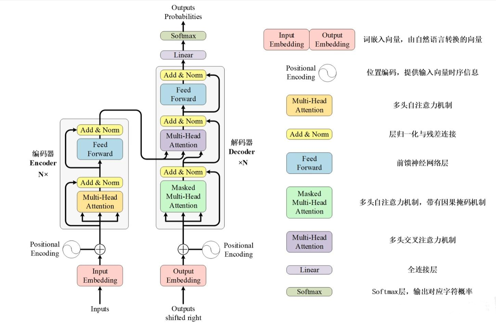

**每一层由什么组成？**

下面将依次介绍每个核心组件的作用、必要性及基本工作方式，包括输入/输出嵌入、注意力机制、多头结构、残差连接、层归一化等。

**Input/Output Embedding**

在进入 Transformer 的各层计算之前，模型首先需要将离散的文本符号转换成可计算的连续向量，这一过程由 Embedding 层完成。Embedding 的作用是把输入序列中的每个 token 映射为一个固定维度的向量，作为后续 Self-Attention 和前馈网络（FFN）的输入基础。由于模型无法直接理解 “apple”“banana” 这样的字符串，Embedding 会依据词表中每个 token 的唯一索引，从一个大小为 [词表大小 × 模型维度] 的矩阵中取出对应行向量。

例如，当模型维度为 512、词表包含 50,000 个词时，Embedding 矩阵的形状即为 50,000×512。输入 token 的索引（如 10）会直接选取该矩阵的第 10 行，得到其 d 维的连续表示。随后，这些嵌入向量与位置编码相加，形成 Transformer 第一层注意力机制的初始输入。

**Positional Encoding**

在得到每个 token 的嵌入向量后，Transformer 还需要补充一个关键要素：序列的位置信息。由于自注意力机制天然不关心顺序，它把整句话视作一个“同时可见”的集合，因此模型无法仅凭注意力机制判断 “我爱吃苹果” 和 “苹果爱吃我” 的语序差异。为了解决这一问题，Transformer 在嵌入向量上叠加了 位置编码（Positional Encoding）。位置编码与词向量具有相同的维度（如 512），但其取值完全由 token 在句子中的位置决定。对于每个位置 𝑖 ，模型会生成对应的位置向量 𝑝𝑖，并与词嵌入向量 𝑒𝑖 进行逐元素相加：

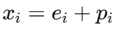

得到的向量 $𝑥_𝑖$ 同时包含“词语语义”和“词语所处位置”两类信息，并作为 Transformer 每一层 Attention 的输入，使模型能够有效捕捉顺序结构。

**Self-Attention**

Self-Attention（自注意力机制）让模型在处理任意一个 token 时，都能同时参考整句中所有其他 token 的信息，从而在全局范围内捕捉上下文关系。相比 RNN 的逐步传递和 CNN 的局部卷积，自注意力不受距离限制，使模型能够轻松建立长距离依赖。具体来说，每个 token 会生成三个向量：Query（我要找什么）、Key（我能提供什么）、Value（我的实际信息）。模型通过计算当前 token 的 Query 与所有 token 的 Key 的相似度，得到一组注意力分数，并经过 softmax 转成注意力权重。最后，这些权重会对所有 Value 向量进行加权求和，形成当前 token 的输出表示。

因此，Self-Attention 的输出可以被看作“来自全句的信息混合”，但每个 token 根据语义需求分配不同的关注比例。正是这种灵活、全局、可学习的注意力机制，使得 Transformer 能够捕捉丰富的依赖关系，在多种任务中取得优异表现。

**Multi-Head Attention**

Multi-Head Attention 的设计初衷，是为了解决单一自注意力在一次计算中容易把不同类型的信息“混在一起”的局限。自注意力虽然强大，但它在同一组 Query/Key/Value 上只形成一种关注模式，容易导致复杂语义被平均化。例如在句子“苹果公司发布了新款苹果手机”中，“苹果”既可能表示公司，也可能表示水果，而单一注意力头往往难以同时捕捉这两类截然不同的语义关系。Multi-Head Attention 的做法是：把注意力分成多个并行的头，让每个头独立关注不同类型的模式，相当于“不要把所有鸡蛋放在一个篮子里”，从多个视角同时理解句子，从而获得更丰富、更精细的语义表示。工作方式如下：

1. 分割与投影（Split & Project）

模型会将每个 token 的原始 Query、Key、Value（例如维度为 d\_model = 512）分别通过多组线性变换，投影到多个更低维度的子空间中。如果有 8 个注意力头，那么每个头的维度就是 $d_k = d_v = 512 / 8 = 64$ 。

这意味着每个头都拥有独立的一套 Q/K/V 投影矩阵，从而学到不同的关注模式。

2. 并行计算（Parallel Attention）

在每个子空间中，每个头会独立完成一整套自注意力计算。由于不同头有不同的参数，它们会从不同角度理解当前序列，捕捉不同的语义特征与关系。

3. 拼接与融合（Concat & Output Projection）

8 个注意力头分别输出 8 个维度为 64 的向量，这些向量会被拼接成 8 × 64 = 512 维的长向量。随后，模型会使用一个线性变换将这一拼接后的表示映射回 $d_model$（通常仍为 512），以综合所有注意力头的信息，形成最终输出。

**Masked Multi-Head Attention**

Masked Multi-Head Attention（多头注意力 + 因果掩码）用于解码器中，确保模型在预测当前位置的单词时只能关注到该位置左侧已出现的单词，而不能“偷看”未来，从而保持自回归生成的正确性。它的必要性体现在三个方面：首先，为了维持自回归生成，模型在预测第 t 个词时只能依赖前 t-1 个词，否则会在训练中看到整个目标序列，导致训练与推理条件不一致；其次，为了保证推理一致性，真实生成过程中模型确实只能看到历史信息，因此训练阶段必须使用掩码来模拟这一条件；最后，为了防止信息泄漏，掩码会阻止模型在计算注意力时访问未来位置（如 t+1、t+2 等），否则标签信息会被提前暴露，使模型无法学习真正的语言建模能力。Masked Multi-Head Attention 在标准多头注意力的基础上，增加了一个掩码操作。其工作方式如下：

1. 计算注意力分数

首先，像标准的多头注意力一样，为每个位置计算 Query 与所有位置的 Key 的点积，得到注意力分数矩阵。这个矩阵的每个元素 `score[i][j]` 表示第 i 个位置对第 j 个位置的关注程度。

2. 应用因果掩码

在将注意力分数送入 Softmax 之前，会应用一个严格的下三角掩码矩阵：

* 主对角线及其左下区域保留为 0（允许关注），
* 主对角线右上方的位置被设置为负无穷（禁止关注未来 token）。

这一步确保模型在生成第 i 个 token 时只能看到历史信息。

3. Softmax 归一化

将掩码后的注意力分数输入 Softmax 函数。由于被掩码的位置是负无穷，经过 Softmax 后这些位置的权重会变为 0，从而确保每个位置只对当前位置及之前的位置产生有效的注意力权重。

4. 加权求和

最后，使用掩码后的注意力权重对所有 Value 向量进行加权求和，得到每个位置的输出表示，实现因果约束下的多头注意力计算。

**Add**

残差连接的作用是将某一层的输入向量与该层的输出向量相加。它主要有两个目的：一是缓解梯度消失问题。由于 Transformer 通常非常深（编码器和解码器各 6 层或更多），在深层网络中，梯度在反向传播时可能会变得很小，使得较早的层难以有效更新。残差连接为梯度提供了一条“高速公路”，允许梯度直接流回较早层，从而减轻梯度消失。二是保护原始信息。在没有残差连接的情况下，每层必须学习完整的变换，可能导致模型“忘记”输入的重要信息。残差连接让模型只需学习输出与输入之间的变化量，既便于训练，又能保证信息的持久性。

数学上非常简单：


其中 Layer 可以是自注意力层或前馈神经网络层。具体操作是，输入向量（例如词嵌入向量 + 位置编码）进入子层计算后，得到的输出立即与该子层的原始输入逐元素相加，形成最终输出。

**Norm**

层归一化的作用是对向量序列中每个样本的所有特征维度进行归一化，使其均值为 0，方差为 1。它主要有三个好处：首先，稳定训练过程。深度学习模型对每一层输入的分布非常敏感，如果输入均值和方差发生剧烈变化（内部协变量偏移），后续层需要不断适应，训练容易不稳定且收敛变慢。归一化通过调整分布，使每层输入保持稳定。其次，它允许使用更高的学习率。未经归一化的网络通常需较小学习率以防训练发散，而归一化后训练更平滑，可使用更大学习率加快收敛。最后，归一化过程引入的微小噪声还能提供轻微正则化效果，有助于防止过拟合。层归一化作用于单个样本（例如，一个词对应的向量），而不是整个批次。具体步骤如下：

1. 计算均值和方差

对于输入向量 x（例如，经过残差连接后的 512 维向量），计算该向量所有维度的均值 $\mu$ 和方差 $\sigma^2$ 。

2. 归一化

用均值和方差对向量进行归一化：

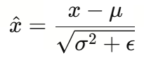

其中 ϵ 是一个很小的数（如 1e-5），用于防止除以零。

3. 仿射变换

对归一化后的向量进行可学习的线性变换：

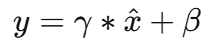

其中 γ 和 β 是可学习的参数向量，分别用于缩放和平移。这一步非常关键，因为它允许网络恢复归一化可能“抹去”的重要特征模式。如果归一化对某些特征不利，网络可以通过学习 γ 和 β 来近似还原原始分布，从而保留有用信息。

**Feed-Forward Network**

前馈神经网络层（Feed Forward）对自注意力输出的每个位置进行独立的非线性变换，从而增强模型的表示能力。由于自注意力机制本质上主要由线性变换和 Softmax 组成，非线性有限，前馈网络通过激活函数（如 ReLU）补充了关键的非线性能力，使模型能够拟合更复杂的函数形式。它对序列中的每个词向量独立处理、互不干扰，并可完全并行，从而对每个位置进行更深层次的特征加工。此外，前馈层通常拥有较大的中间维度，因此包含了 Transformer 中最多的参数，能够更充分地提炼自注意力聚合的上下文信息，进一步提升模型整体的表达能力。前馈网络是一个简单的两层神经网络，它对序列中每个位置的向量进行独立且相同的处理。其经典结构如下：

1. 第一层（升维 + 非线性）

这一层接收来自自注意力模块的向量（例如 d\_model = 512），并首先通过线性变换将其维度扩展到更大的中间维度 d\_ff = 2048，相当于将表示能力放大四倍。随后通过 ReLU 或 GELU 等激活函数引入必要的非线性，使模型能够学习更复杂的映射关系。其计算形式为：hidden = ReLU(x · W1 + b1)，其中 W1 的尺寸为 `[d_model, d_ff]`。

2. 第二层（降维 + 输出）

一层将第一层产生的高维 hidden 表示（2048 维）再通过一个线性层映射回原始的模型维度（512 维），以便与其他网络组件保持一致。其计算形式为：output = hidden · W2 + b2，其中 W2 的尺寸为 `[d_ff, d_model]`，负责将扩展后的表示重新压缩为最终输出。

**Linear**

Linear（全连接层）的作用是将解码器输出的高维向量映射到词汇表大小的维度，为每个位置生成在所有可能单词上的原始分数（logits），以便后续通过 Softmax 得到单词概率分布。之所以需要这一层，是因为解码器输出通常是 $d_{model}$（如 512 维），而真正的生成任务需要从数万词的词汇表中选出一个单词，线性层因此承担了将模型内部表示映射到词汇表空间的“桥梁”角色。同时，它还负责为词汇表中的每个候选词生成一个分数，表示该词作为下一个输出的可能性。此外，这个线性层本质上是一个可学习的分类器，它通过训练逐渐建立起内部表示与具体词语之间的对应关系，例如当模型生成某种语义模式时，会让“apple”的得分更高，而让无关词的得分更低。其工作方式如下：

1. 输入

接收解码器的最终输出，形状为 `[batch_size, seq_len, d_model]`。例如 `[2, 10, 512]` 表示 2 个句子，每个句子 10 个单词，每个单词用 512 维向量表示。

2. 线性变换

过一个权重矩阵 `W` 进行线性变换，其中 `W` 的形状为 `[d_model, vocab_size]`

3. 输出

输出称为 logits（原始分数），形状为 `[batch_size, seq_len, vocab_size]`

**Softmax**

Softmax 的作用是将线性层输出的原始分数（logits）转换为一个有效的概率分布，使每个位置上所有词的概率之和为 1，从而直观表示各候选词作为下一个输出单词的可能性。由于 logits 可能为任意实数，无法直接作为概率解释，Softmax 将其规范化为 0～1 范围的概率值，并确保总和为 1，使结果具有明确的概率意义。在训练中，Softmax 输出还用于计算交叉熵损失，因此提供有效概率分布是必要条件；在推理阶段，模型也依赖 Softmax 生成的概率来选择下一个单词，无论使用贪心策略还是束搜索，最终决策都基于这一概率分布完成。其工作方式很直接：

1. 输入

接收线性层输出的 logits，形状为 `[batch_size, seq_len, vocab_size]`。对于每个位置，都有一个包含词汇表中所有单词分数的向量。

2. 输出

输出一个概率分布，形状与输入相同 `[batch_size, seq_len, vocab_size]。`

**自注意力机制完整推导**

（Q、K、V 怎么来？怎么算？为什么能 “注意”）

从每个编码器的输入向量（每个单词的词向量，即 Embedding，可以是任意形式的词向量，如 word2vec、GloVe、one-hot 编码）中生成三个向量：查询向量 Q、键向量 K）和值向量 V。这三个向量由词嵌入分别与权重矩阵 $W_Q$、$W_K$、$W_V$ 相乘得到。它们的维度通常比原始词向量更低（例如从 512 降到 64）。

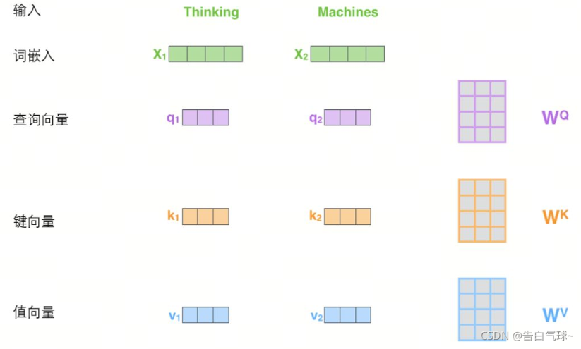

更一般地，将所有位置得到的查询、键、值组合起来，即形成 Query、Keys、Values 三个矩阵。


计算自注意力的**第二步**是计算得分。例如，当为句子中第一个词 “Thinking” 计算自注意力时，需要让输入句子中每个单词对 “Thinking” 打分，这些分数由所有单词的键向量与该位置的查询向量进行点积得到。


**第三步**和**第四步**是将分数除以 8（键向量维度 64 的平方根），这一缩放操作可使梯度更稳定，避免内积过大。随后将缩放后的得分输入 softmax，使得模型在处理序列时能根据上下文分配注意力权重。softmax 将所有分数归一化为正值，且总和为 1。


这些 softmax 分数决定了每个单词对当前位置（如 “Thinking”）的贡献。通常当前词本身的 softmax 值最大。

**第五步**是将每个值向量与对应的 softmax 权重相乘，以突出语义相关的单词，弱化无关单词（例如被乘上一个非常小的系数）。

Softmax 函数：或称为归一化指数函数，它将每个元素压缩到 (0,1) 范围，并保证所有元素之和为 1。

**第六步**是将加权后的值向量求和，得到该位置的自注意力输出。整体计算如图所示。最终得到的自注意力输出会传入后续的前馈神经网络。


上述第二至第六步可合并为自注意力层的一条公式表达：

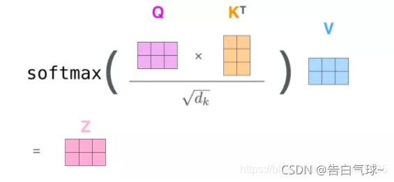

**自注意力层的完善 —— “多头”注意力机制**

对应整体结构图中的 Multi-Head Attention。主要区别在于：

1. 扩展了模型关注不同位置的能力。  
2. 多头注意力使用多组查询 / 键 / 值的权重矩阵（Transformer 经典实现中为 8 头），每组参数独立初始化。与普通 self-attention 相同，每组通过 $X$ 乘以 $W_Q$、$W_K$、$W_V$ 生成各自的 Query、Key、Value。  
3. Self-attention 使用一组 $W_Q$、$W_K$、$W_V$ 来生成查询、键和值，而 Multi-Head Attention 使用多组矩阵并行生成多组 $Q / K / V$，每组独立计算注意力并得到一个 $Z$ 矩阵。

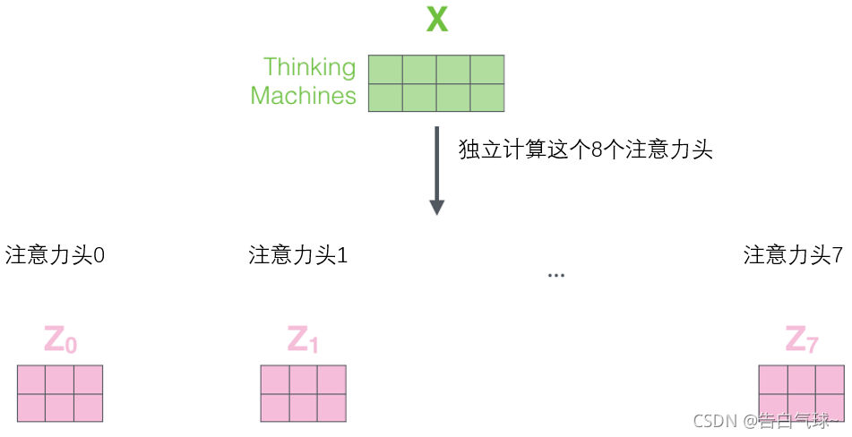

前馈层只需要一个矩阵，因此会将 8 个头得到的 Z 矩阵拼接起来，再通过一个额外的权重矩阵 $W_O$（用于把多头拼接后的向量重新映射回模型的原始维度）进行线性变换。


整体流程如下图所示：

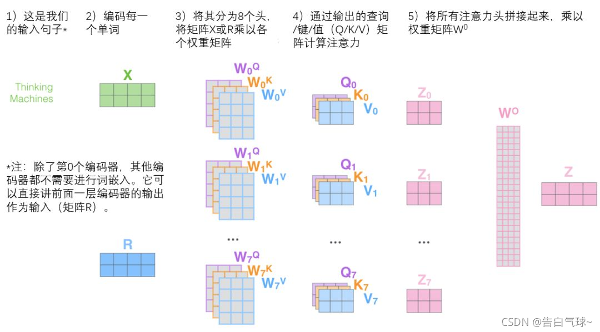

例如，在编码 “it” 这个词时，不同注意力头会关注不同的上下文。图中展示了两个注意力头：

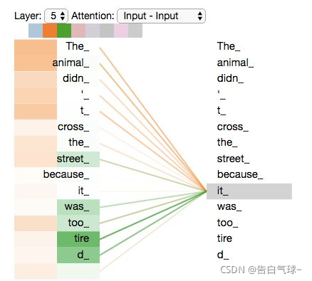

* 一个注意力头关注 “The animal”
* 另一个注意力头关注 “tire”

这说明通过不同注意力头，模型可以捕捉 “it” 分别可能指代 animal 或 tire。

### 1.4 三大模型类型：BERT、GPT、T5

> **BERT 读懂世界，GPT 创造世界，T5 在理解与创造之间架起桥梁。**

在前面，我们了解了 Transformer 的两大基本结构——Encoder（理解） 和 Decoder（生成）。

接下来，就该看看这两种模块是如何在现实中“组装成模型”的。

目前所有的大语言模型，几乎都可以归入三种类型：

* BERT 系列：理解专家
* GPT 系列：生成大师
* T5 系列：全能选手

可以把它们想象成 Transformer 家族的“三兄弟”，一个擅长听懂人话，一个擅长说人话，还有一个两者兼顾。

**BERT：理解语言的专家（Encoder-only）**

BERT 的全称是 Bidirectional Encoder Representations from Transformers。听起来有点拗口，其实意思很简单：它是一个只使用 Encoder 结构的模型。


也就是说，它专注于“理解”输入文本的语义，而不负责生成内容。BERT 在训练时采用了一种叫 遮盖语言建模（Masked Language Modeling, MLM） 的方法。它会随机把句子中的部分词语用 `[MASK]` 遮住，然后让模型去猜被遮掉的词是什么。例如：

> 输入：我今天去 **𝑀𝐴𝑆𝐾** 吃午饭。
> 
> 模型预测：我今天去 **学校** 吃午饭。

这种方式让模型能理解句子中词与词之间的关系，从而学会“语言的统计规律”。

这也是为什么 BERT 在文本分类、情感分析、实体识别、相似度匹配等任务上表现极好。

📍代表模型：

BERT、RoBERTa、ELECTRA、DeBERTa、ALBERT

📍典型任务：

情感分类、句子匹配、问答抽取（SQuAD）

**GPT：生成语言的大师（Decoder-only）**

GPT 的全称是 Generative Pre-trained Transformer。它只使用 Transformer 的 Decoder 结构，目标是生成下一个词。

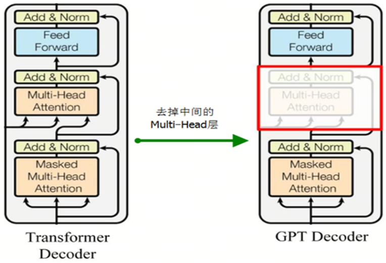

它的训练方式叫 自回归语言建模（Causal Language Modeling, CLM）。举个例子：

> 输入：我今天去学校
> 
> 模型预测下一个词：上课。

GPT 通过不断地预测下一个词，逐步生成整句文本。也正因为这种方式，它非常擅长故事续写、对话生成、代码编写等任务。最早的 GPT（2018）只是在小规模数据上预训练，但从 GPT-2、GPT-3 到 ChatGPT，一路狂飙：

* 模型参数从 1 亿增长到上千亿；
* 数据量从几 GB 扩展到数万亿 token；
* 能力从语言生成拓展到推理、编程、对话、图像生成等多模态场景。

📍代表模型：

GPT、GPT-2、GPT-3、GPT-4、LLaMA、Qwen、ChatGPT

📍典型任务：

文本续写、对话、代码生成、创意写作

**T5：理解 + 生成的全能选手（Encoder-Decoder）**

T5 的全称是 Text-to-Text Transfer Transformer，它是 Transformer 世界的“通才型选手”。它采用了完整的 Encoder-Decoder 结构，能同时理解输入、生成输出。


它的最大创新在于：

把所有的 NLP 任务都统一成“文本 → 文本”的形式。

比如：

* 分类任务：输入 “句子：我今天很开心。任务：判断情感。” → 输出 “积极”；
* 翻译任务：输入 “translate English to Chinese: I love apples.” → 输出 “我喜欢苹果”；
* 摘要任务：输入 “summarize: …长文…” → 输出 “一句话总结”。

无论任务类型如何，T5 都用同样的接口形式进行训练，这让模型能共享知识，具备极高的泛化能力。

📍代表模型：

T5、FLAN-T5、mT5、BART、UL2

📍典型任务：

翻译、摘要、问答、指令生成、代码任务

### 1.5 模型结构选型：BERT、GPT、T5 谁更合适

在准备预训练或选择微调基础模型之前，一个关键问题是：到底选哪一种 Transformer 架构？

常见选项包括：

- BERT（Bidirectional Encoder Representations from Transformers）
- GPT（Generative Pre-trained Transformer）
- T5（Text-to-Text Transfer Transformer）

三者都基于 Transformer 架构，但在用途、训练目标、结构设计上各有千秋。接下来，我们一起看看它们的“优劣势 + 适用场景”，帮你为自己的项目选出最合适的“起点”。

#### BERT：专注理解的编码器

BERT 是 “只编码器（encoder-only）” 的 Transformer 架构，能够从左到右、右到左同时“看”文本，这就使它在理解任务上极具优势。

- 优点：强大的文本理解能力，适合分类、命名实体识别、问答 (QA) 等任务。
- 劣势：因为不专门用于生成（回文、续写、长对话），它在“生成型”任务上并不是最优选择。
- 适用场景：当你的任务是“理解”更多、而生成需求较低时，比如文本分类、情感分析、实体提取、问答系统的理解模块。

#### GPT：专注生成的解码器

GPT 系列是“只解码器（decoder-only）”的架构，通常采用自回归方式（左到右地生成下一个 token），擅长“从无开始”生成连贯、高质量的文字。

- 优点：生成能力强，擅长对话、故事、代码、聊天机器人等应用场景。
- 劣势：因为只单向（从前往后）看文本，它在理解上下文、捕捉全局结构上可能比双向模型弱一些。
- 适用场景：如果你的任务是“生成”型的，例如客服机器人、写作辅助、代码生成、对话系统，那么 GPT 会更合适。

#### T5：灵活的编码-解码（encoder-decoder）全能选手

T5 采用的是“编码器 + 解码器”结构，把各种 NLP 任务都统一成 “输入文本 → 输出文本” 的形式（text-to-text）——不管你的任务是翻译、摘要、问答还是分类，统统都变成「给定一句话 → 输出一句话」。

- 优点：极高的灵活性，可以同时覆盖理解 + 生成任务，适合多任务或任务切换频繁的场景。
- 劣势：结构更复杂、参数更大、训练资源更高；如果只做一个简单理解任务，可能“食材太奢侈”。
- 适用场景：当你希望模型“理解 + 输出”能力都具备，或者希望用一个模型覆盖多种任务（如摘要、翻译 + 问答 + 对话）时，T5 是一个强有力的选择。

#### 《小贴士：资源消耗差异》

| 模型结构 | 参数量（相同规模下） | 显存占用 | 训练速度 | 原因说明 |
|---------|------------------|---------|---------|---------|
| BERT（Encoder-only） | 较小（无解码器） | 较低 | 较快 | 单塔结构、仅做 MLM，不需要自回归 |
| GPT（Decoder-only） | 中等 | 中等 | 中等偏慢 | 自回归训练开销较大 |
| T5（Encoder–Decoder） | 最大 | 最高 | 最慢 | 双塔结构 + Seq2Seq 训练本身更重 |


### 1.6 模型的记忆边界：位置编码的作用

在 Transformer 出现之前，循环神经网络（RNN）和 LSTM 天然就能“记住顺序”。

它们一边读输入、一边传递状态，像在按时间顺序听故事。

而 Transformer 呢？它一次性把整段文字塞进模型里，所有词是并行处理的——

这就带来了一个问题：

如果所有词一起看，模型怎么知道“谁在前，谁在后”？

这，就是位置编码（Positional Encoding）存在的意义。

**为什么要告诉模型“顺序”**

举个例子：

> “猫咬狗” 和 “狗咬猫”

如果不告诉模型哪个词先出现，它看到的只是同样的两个单词：猫、狗。

但这两句话的意思完全相反——

所以，模型必须要知道：

> 词语不仅是什么，还要知道它在句子里的​**位置**​。

这时，我们会给每个词加上一个“位置信息向量”，

让模型在注意力计算时同时考虑“词的语义”和“它出现的顺序”。

位置编码是怎么加进去的

Transformer 的输入向量其实是两部分的叠加：

**输入向量 = 词向量（Token Embedding） + 位置向量（Positional Encoding）**

这就像给每个词贴上一个标签：

> “我不仅是‘猫’，我还是第 1 个词。”
> 
> “我不仅是‘咬’，我还是第 2 个词。”

这样一来，模型在注意力计算中，就能理解到“第 1 个词可能修饰第 2 个词”，

从而在没有循环结构的情况下，也能学到语序关系。

两种主流位置编码方式

目前，位置编码大致分为两种思路：

**（1）固定位置编码（Sinusoidal Positional Encoding）**

这是最早出现在[《Attention Is All You Need》](https://arxiv.org/pdf/1706.03762)论文中的方式。

它用一组正弦（sin）和余弦（cos）函数来生成不同频率的波形，让每个位置的向量都独一无二。对于位置 `pos`（第 pos 个 token）和隐藏维度 `d`，位置编码常写为（以偶、奇维配对表示）：

* 第 `2k` 维：

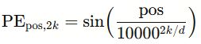

* 第 `2k+1` 维：

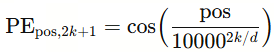

其中：

* `pos`：表示 token 在序列中的位置索引（常从 0 或 1 开始）。比如句子里第 5 个词，则 pos=4（如果从 0 开始）或 pos=5（如果从 1 开始）。
* `i` / `2k` / `2k+1`：表示向量的第 i 个维度。因为公式以每两维为一组给出（一个 sin、一个 cos），所以通常把维度按对编号为 k=0,1,2,...，每组对应一个不同的频率。d 是向量总维度（embedding/hidden size），决定总共有多少对（d/2 对）。

利用三角恒等式（角和公式），可以把“位置向右移动 k”写成原来 sin/cos 的线性组合——也就是说：

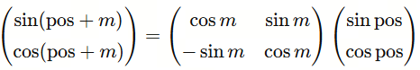

因此，对任意固定偏移 𝑚 （比如相对位置差），位置编码在同一对维度上的新向量可以由原向量通过一个固定的线性变换矩阵得到——这就是所说的“PEpos+m 可以由 PEpos 的线性函数表示”的直观来源，也解释了为什么 sin/cos 编码有利于学习相对位置信息。

**举个小例子**

假设我们有句子：

**“I love natural language processing.”**

Token 化后变成 6 个词：

**[I | love | natural | language | processing | .]**

我们来计算 "`natural`" 的位置编码。它的 token index 是：`pos=2`。Transformer embedding 维度假设为 `d = 8`（仅用于演示；实际模型通常是 768、1024、4096 等），则：

**d=8 → 一共有 d/2 = 4 对 sin/cos 频率维度。**

因此 `k = 0, 1, 2, 3`。现在计算每对 `(sin, cos)`：

① 第 0 对维度（k = 0 → i = 0 和 1）

* 计算分母：

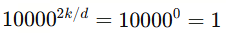

* 带入 pos=2：

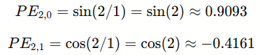

② 第 1 对维度（k = 1 → i = 2 和 3）

* 计算分母：

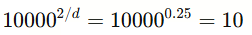

* 带入 pos=2：

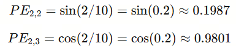

③ 第 2 对维度（k = 2 → i = 4 和 5）

* 计算分母：

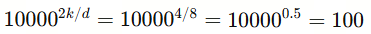

* 带入 pos=2：

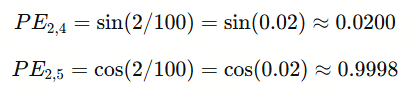

④ 第 3 对维度（k = 3 → i = 6 和 7）

* 计算分母：

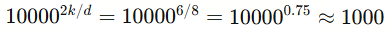

* 带入 pos=2：

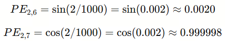

最终 `pos=2` 的位置向量（按维度 0→7 排列）：

```
[
 0.9093,     -0.4161, 
 0.1987,      0.9801,
 0.0200,      0.9998,
 0.0020,      0.999998
]
```

在正弦位置编码中，一个 token 的位置会被拆成多对不同频率的 sin / cos 信号，就像给它配上“低频—中频—高频”三种节奏（对应于上面示例中的分母的大小）：低频波动慢，用来捕捉长距离位置；高频变化快，区分相邻 token 很敏锐；中频则填补中间层次。以上面的 “natural” 的位置 pos=2 为例，它的 8 维向量就是由 **4 对不同波长的正弦 / 余弦** 叠加而成：第 0 对维度使用最长的波长（变化最慢），后面的几对维度波长逐渐缩短、频率逐级提升，从而让模型既能看到远处关系，又能精细地区分近邻位置。正是这种“多频率混合”的设计，让模型能在一个向量里同时表达全局与局部的位置信息。

这种基于多频率波形叠加的正弦位置编码有个明显的好处：它完全不需要额外训练参数，先天就能推广到比训练时更长的序列，因此被 Transformer 早期大量采用。但它也有天然的局限——这些位置向量一旦生成就是“写死”的，模型无法根据任务自动调整或学习更复杂的顺序结构。所以虽然它简单、优雅、好计算，却缺乏灵活性。

**（2）可学习位置编码（Learnable Position Embedding）**

后来，BERT、GPT 等模型换用了一种更灵活的方法——**让位置编码和词向量一样“可训练”**。也就是说，模型不用数学公式来计算位置，而是直接为每个位置学一个向量，训练久了自然就“知道”1号、2号、3号……这些位置分别意味着什么。

这种方法的好处是显而易见的：模型能根据任务需求，自由学习更适合的位置信息，而不是被正弦波“写死规则”。

但它也有个天然限制：

**模型只会为训练中出现过的位置学参数，没学过的就没有向量。**

换句话说：如果训练时只见过最多 2048 个 token 的句子，那么模型的“位置词典”也只有 2048 格。超过这个长度的位置，它根本没有学过，就无法正常表示。这就是我们常说的上下文长度限制（Context Window Limit）**​。​**不是记忆不好，而是压根没“学”到那一段的位置编码。

“记忆边界”从哪里来？

以 GPT 为例，如果它的最大上下文长度是 4096 tokens，

那意味着模型一次最多只能看 4096 个词。

如果你输入的文本更长——

它会“忘掉”最前面的部分，就像人看完一部长篇小说后只记得结尾一样。

这就是 Transformer 的“记忆边界”。

它既来自注意力机制的计算成本（O(n²)），也来自位置编码方式的限制。

RoPE：让模型更聪明地记住位置

为了突破固定位置带来的限制，后来出现了更高级的方案，比如 旋转位置编码（RoPE, Rotary Position Embedding）。

它不再简单地相加位置向量，而是用旋转变换的方式，把“顺序感”直接融入注意力计算中。

通俗地说，RoPE 让模型能更自然地理解：

* 哪个词离目标词更近；
* 词序变化对语义的影响；
* 甚至能在更长文本中维持位置关系的连贯性。

这也是后来实现 长上下文模型（10万 tokens 级别） 的关键技术之一。我们会在第 6 章详细讲到 RoPE 的延伸与插值。

### 1.7 必备术语轻松掌握

在正式进入预训练和微调之前，还有一些常见术语必须搞清楚。以下是一些核心术语的简要介绍：

* **Transformer**：一种基于自注意力机制的神经网络结构，用于处理序列数据，是所有现代大模型的核心架构。它能同时关注输入序列中的所有词，因此既高效又擅长捕捉上下文关系。Transformer 由两部分组成：Encoder（理解）和 Decoder（生成），是 BERT、GPT、T5 等所有现代大模型的共同基础。
* **自监督学习（Self-supervised Learning）**：不依赖人工标签，模型用输入数据本身构造预测任务，如填空或预测下一个词。这种方式让模型能在大规模语料上自学语言规律。
* **预训练（Pre-training）**：让模型先在海量未标注文本上学习语言规律，相当于“打基础”。目标是让模型掌握语法、常识和语义能力，为后续特定任务做准备。可以理解为：先上“通识课”。
* **微调（Fine-tuning）**：在预训练模型的基础上，用带标签的数据继续训练，使模型掌握特定任务的能力。例如，把一个能理解文本的通用模型，训练成“客服机器人”或“法律问答助手”。可以理解为：让模型在“通识课”后，再上“专业课”。
* **SFT（Supervised Fine-tuning）**：是微调的一种更具体、更“人类化”的形式。它通过高质量的指令—回答数据教模型如何与人交流。这是模型从“能说话”到“会对话”的关键一步。例如：输入“解释一下 Transformer 是什么”，模型学会用自然语言、符合人类习惯的方式进行解释。
* **TGS（Token Generation Step）**：逐 token 生成步骤。在大模型领域，TGS 通常指 Token Generation Step，也就是模型在生成文本时「想下一词」的每一次内部计算过程。一句话是由多个 TGS 连续拼接而成的。可以把它理解为大模型生成过程的“心跳”或“最小思考单元”，每个 token 的出现，都对应模型完整执行了一次推理步骤。
* **Token**：模型理解文本的最小单位，可以是词、子词，甚至是标点符号。例如句子“我爱自然语言处理”，可能被拆成：[我] [爱] [自然] [语言] [处理]。模型并不直接看到文字，而是看到这些 Token 对应的数字 ID。
* **Embedding**：把文字变成模型能理解的“向量表示”。每个 Token 都被映射到一个向量空间中，相似的词（如“猫”“狗”）在空间中的距离也更近。可以理解为：把词变成数学意义上的“点”。
* **RoPE（Rotary Position Embedding）**：旋转位置编码，让模型在长文本中保持顺序感，是长上下文模型的关键。相比传统位置编码，RoPE 能在长文本上保持更好的顺序感，是长上下文模型（如 LLaMA、Mistral）的关键技术之一。
* **上下文长度（Context Length）**：模型一次能“看到”的最大 Token 数，超过就会遗忘前文。比如 GPT-3 的上下文长度是 4096，意思是它一次最多能看 4096 个 Token。超过这个范围，前面的内容就会被“遗忘”。
* **FLOPs（Floating Point Operations）**：计算量指标，表示模型完成任务需要多少次浮点运算。FLOPs 越多，模型算得越多、越复杂，也越吃显卡。
* **Throughput（吞吐量）**：模型每秒能处理的 Token 数，用于衡量训练和推理效率。Throughput 越高，说明显卡利用率越好。
* **混合精度（Mixed Precision）**：训练时使用低精度（如 FP16 或 BF16）进行计算，既能节省显存，又能加快训练速度。这是现代大模型训练中的标准技巧。
