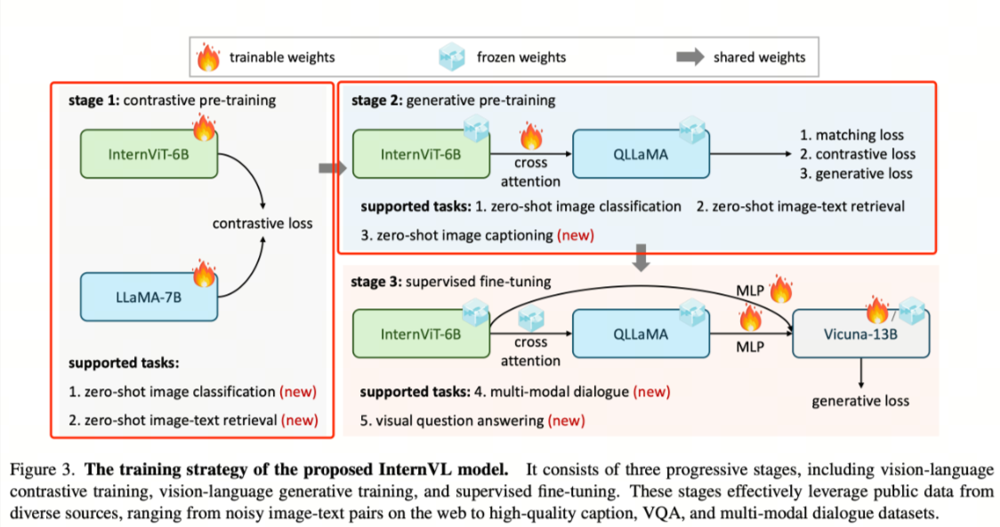
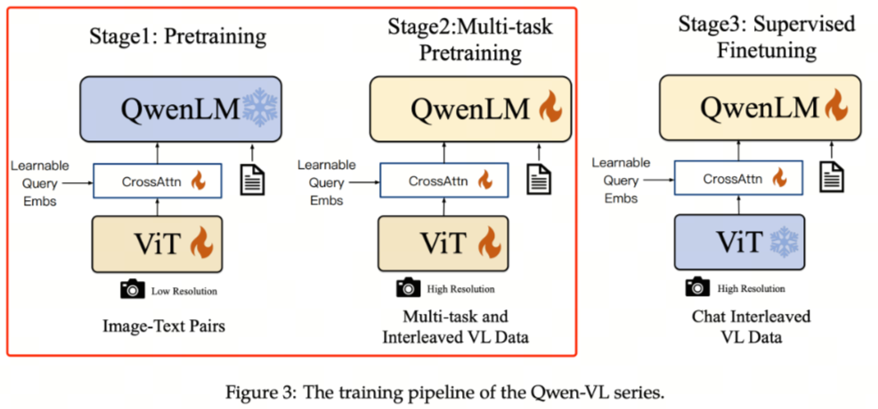

# 第10课时：多模态 LLM 架构与预训练实战

在前面几讲里，我们主要讨论了“大模型如何学语言”——从文本清洗、分词、模型结构到训练策略，几乎所有步骤都围绕文字世界展开。但现实世界可不止有文本。我们获取信息的方式远比这复杂：看图、看视频、听声音、读图表、识别操作界面……语言只是其中的一部分。

于是一个自然的问题出现了：  
如果大模型只看过文字，它真的能理解我们真实世界的表达方式吗？

答案显然是不够的。于是多模态大模型（MLLM, Multimodal Large Language Model）就成了必然的发展方向。

## 1. 为什么需要多模态模型

要理解为什么“多模态”如此重要，不妨从三个角度来看：信息量来自哪里、任务需求来自哪里、智能能力边界在哪里。

### 现实世界的信息不是纯文本

人类从视觉中获得的信息量远大于语言本身：  
我们看一眼图片，就能理解场景结构、物体关系、人物情绪、时间环境等丰富信号。但如果你只能看到一句文字描述，比如“一个小女孩在公园跑”，信息量就明显缩水。

现代应用也越来越依赖视觉信号：

1. 医学影像诊断（X-ray、CT）  
1. 自动驾驶场景理解  
1. 产品推荐中的商品图理解  
1. 教育内容中的图表、板书解析  
1. 多媒体检索与生成  

仅靠文本模型很难覆盖这些需求。

### 很多任务本质上就是多模态的

🌰 举几个典型例子：

1. 你给我分析一张图里的对象是什么 → 图像理解  
1. 生成一张图对应的文案或标题 → 图文对齐  
1. 看图写文章、图生图、图生视频 → 创作类任务  
1. 在 UI 截图或 PDF 中执行操作 → 智能体交互  
1. 给出一张仪表盘截图，让模型总结趋势 → 数据分析任务  

随着视觉生成和场景操作的需求增加，多模态能力已不再是“加分项”，而是基础能力。

换句话说：  
如果说纯文本 LLM 是一位“语言专家”，  
那 MLLM 才是一位“懂场景、会操作、能理解世界的通才智能”。

### 多模态是通向“通用人工智能”的必经之路

从更宏观的角度来看，人与世界的交互天然是多模态的，而 AGI（通用人工智能）的定义中也包含对现实环境的理解与推理。

只有模型同时具备：

1. 视觉理解  
1. 文本推理  
1. 动作规划（如 Agent 的 UI 控制）  
1. 多领域表达  

才有可能形成真正的“世界模型（World Model）”。

因此，当前多模态模型的发展路线，几乎都以 “让大模型掌握世界的更多维度” 为方向，比如：

1. LLaVA：从图像到对话  
1. InternVL：加强跨模态对齐  
1. Qwen-VL：强化 OCR、表格、图表理解  
1. Gemini / GPT-4o：统一多模态输入输出  

这些趋势都指向一个结论：  
未来的大模型不会再是“语言模型”，而是“理解与生成世界的模型”。

> 多模态模型之所以重要，并不是为了在“图上玩花活”，而是为了让模型的能力真正从文本空间扩展到 **现实世界的表达方式**。从图像识别、读图推理到 UI 操作、视频理解，多模态能力正在成为新一代大模型的“基础素质”。

## 2. 图文数据该怎么构建？

如果说预训练是“吃大数据长本事”，那多模态预训练就是“吃得更杂、长得更聪明”。

相比纯文本模型，多模态模型不仅要看懂文字，还要理解图片里的结构、场景、物体关系和视觉细节。

因此，“图文数据怎么做”几乎决定了模型未来能达到的天花板。

本节我们就从数据来源、清洗方式、配对策略，再到负样本构造，一步步拆解图文数据是如何炼成的。

### 图文数据从哪里来？

多模态数据的来源大致分为三类，从“免费但脏”到“贵但香”：

#### ① 网抓数据（Web-crawled）

量大便宜，但需要大量清洗。典型例子：LAION、CC12M

1. 优点：规模大，上亿级轻轻松松；覆盖的视觉类型极其丰富。  
1. 缺点：噪声多、描述不准确、图文错配比例高；需要大量筛选、过滤和质量评估。

这一类适合作为模型视觉“启蒙”阶段的大型粗粒度语料。

#### ② 人工标注数据（Human-annotated）

贵，但质量高。比如 COCO Caption、Flickr30k、GQA、RefCOCO、Visual Genome 等。

1. 优点：高质量、结构化、语义相对准确。  
1. 缺点：数量明显不足，几万到几十万不等。

多用于模型的精细识别能力训练、特定能力强化（如区域理解、视觉推理）。

#### ③ 模型生成数据（Synthetic）

质量与成本之间的新选择。例如：使用 GPT-4V、Gemini、Qwen-VL 等大模型自动生成描述。

1. 优点：成本低、可控制风格、可按需构建复杂任务（如 OCR + reasoning 的 captions）。  
1. 缺点：会带入模型偏差（hallucination），需要人工或规则校验。

这一类数据已经成为当下各家 MLLM 的主力数据来源之一。

### 图文对齐：模型真正“看懂”的关键

多模态模型并不是只要“图 + 文”就能学会理解。  
它学的是“视觉与语言的对应关系”。

因此，**图文对齐**（Alignment）是数据构建最关键的一步。

主流的图文对齐方式如下：

#### ① Caption 对齐（Image → Text）

一张图对应一句或多句自然语言描述。

1. 单句 caption：用于基础视觉理解  
1. 多句 caption：适用于生成更丰富的视觉表征  
1. 区域 caption（如 Visual Genome）：强化模型局部理解能力  

#### ② 指令式对齐（Instruction-style）

例如：

1. “请描述图片中的主要物体。”  
1. “回答：图中男人在做什么？”  

这类更接近日后的 SFT/对齐阶段，能让模型具备“对话式”视觉理解能力。

#### ③ 区域标注 Box 对齐（Region–Text）

如对象检测标签、OCR 文本框、布局框等。

它能提升模型的结构化理解能力，例如：

1. 读取海报中的文字  
1. 分析表格中的区域  
1. 理解 UI 截图的组件位置  

### 数据质量：比数量更重要

大多数多模态模型的问题不是“数据不够多”，而是“数据不够干净”。

常见质量检查包括：

#### ① 图文相关性过滤

常用策略：

1. CLIP 得分过滤  
1. 视觉/文本 embedding 相似度阈值  
1. 多模型投票“看图猜 caption”  

#### ② 图片质量过滤

主要去除：

1. 纯色图  
1. 过度压缩图  
1. 过暗/过亮图  
1. 包含水印、色情、暴力、隐私的内容  

#### ③ 文本质量过滤

需要过滤的典型情况：

1. 无意义字符、乱码  
1. 翻译机风格污染  
1. 过长或过短（如只有“img_00123”）  
1. 含敏感隐私信息（姓名、手机号、身份证）  

### 负样本构造：让模型学会“不匹配就是不对”

一个优秀的多模态模型，不仅要知道什么是对的，还要知道什么是错的。

方法包括：

#### ① 随机错配（Random mismatching）

随机给图片配一段无关文本。简单粗暴，但有效。

#### ② 主题错配（Semantic mismatching）

图片里是“猫”，文本是“狗”。  
用于提升模型对视觉语义的敏感性。

#### ③ 细粒度错配（Fine-grained mismatching）

文本描述与图片含义接近但不完全相符：  
“一个男孩在踢足球” vs “一个男人在踢足球”  
用于提升模型对细节差异的判断能力。

### 图文数据构建的常见流水线

你可以把它理解为“多模态数据工厂”的标准化流程：

1. 数据获取：网抓 / 合集 / 标注 / 合成  
1. 格式规范化：统一为 JSON / Parquet / WebDataset  
1. 图文匹配过滤：CLIP、SigLIP 筛选  
1. 文本清洗与规范化  
1. 图像质量评估  
1. 对齐方式增强（caption、region caption、OCR、指令）  
1. 负样本构建  
1. 混合与分配（粗粒度 vs 细粒度）  
1. 样本审查（审美、内容安全、隐私过滤）  
1. 最终打包成训练集  

这个流程几乎被所有大模型采用，如 LLaVA、Qwen-VL、InternVL、MiniGPT-4 等。

## 3. 常见多模态预训练数据集与特征

在多模态模型训练中，选择合适的数据集和了解数据特性至关重要。图文数据的数量、质量、覆盖领域、文本长度和图像分辨率都会直接影响模型的表现和泛化能力。本节将带你了解当前常用的多模态预训练数据集，并分析它们的特点和适用场景。

### 开放获取的图文数据集

#### ① LAION 系列

1. 规模与特点：LAION-400M、LAION-5B 等，包含亿级网页图文对，典型来源是 Common Crawl。  
1. 特点：规模庞大，图文匹配粗略但覆盖广泛，涵盖自然、艺术、产品等多种场景。  
1. 适用场景：粗粒度预训练，提升模型的视觉基础表征能力。  
1. 注意点：噪声较多，需要使用 CLIP 得分或其他图文相关性过滤策略进行筛选。

#### ② COCO / Flickr 系列

1. COCO Caption：约 12 万张图片，每张图片配有 5 条自然语言描述。  
1. Flickr30k：约 3 万张图片，每张图片也有 5 条 caption。  
1. 特点：高质量标注、语义明确，文本长度适中。  
1. 适用场景：模型的中级微调、图像描述生成、区域-文本理解等任务。  
1. 优劣势：数量有限，不适合大规模预训练，但非常适合作为验证集或精细训练数据。

#### ③ Visual Genome

1. 规模与特点：约 10 万张图片，每张图片配有对象标注、属性标注、关系描述和区域 caption。  
1. 特点：细粒度、结构化、强调局部理解能力。  
1. 适用场景：对象检测、视觉推理、关系理解训练，强化模型对图像内部结构的把握。

#### ④ 多语种与跨文化数据集

1. CC12M / WIT / CC100-Image：包含多语种图文对，有助于训练多语言或跨文化多模态模型。  
1. 特点：跨语言对齐、覆盖广泛文化背景，但质量不一，需要过滤。  
1. 适用场景：训练跨语种图文理解能力或多语言多模态任务。

### 模型生成的合成数据集

近年来，LLM 和 VLM（Vision-Language Model）的生成能力被用于构建图文数据集，例如：

1. GPT-4V / Qwen-VL 生成 caption：给定图片生成详细描述，甚至支持指令式任务。  
1. 特点：可控风格、多样化、可扩展性强。  
1. 注意点：可能引入模型偏差或“幻觉”，仍需要人工或规则校验。

这种方式已成为大规模多模态预训练的重要补充来源。

### 多模态数据的关键特征

无论是网抓、标注还是合成数据，理解其特征对训练策略至关重要：

#### ① 图像特征

1. 分辨率：影响视觉编码器的输入大小和显存消耗。  
1. 场景复杂度：自然风景、室内布局、人物动作等。  
1. 质量控制：去除水印、重复图像、模糊图像、敏感内容。

#### ② 文本特征

1. 长度：短 caption 更适合基础视觉理解，长文本利于多步推理。  
1. 语言：单语、多语或混合语种。  
1. 风格：自然语言描述 vs 指令式文本（Instruction-style）。

#### ③ 图文匹配质量

1. 精确匹配：高质量标注数据（如 COCO）  
1. 粗匹配：网络抓取数据，需后续评分过滤（CLIP、embedding similarity）  
1. 对齐粒度：句子级、区域级、指令级

### 选择数据集的思路

1. 基础能力训练：优先大规模、覆盖面广的粗粒度图文数据（LAION、CC12M）。  
1. 精细理解能力：加入高质量人工标注数据（COCO、Flickr30k、Visual Genome）。  
1. 跨语言或跨文化能力：适当引入多语种数据集（CC100-Image、WIT）。  
1. 模型能力拓展：利用 LLM / VLM 生成的合成图文增强数据多样性。

## 4. 实例解析：InternVL / Qwen-VL 的三阶段训练

在多模态预训练中，三阶段训练策略已经成为主流做法。通过分阶段处理不同任务和数据类型，模型可以逐步学习视觉和语言的表征能力，同时保证生成能力和指令理解能力。下面我们以 InternVL 和 Qwen-VL 为例，解析它们的训练流程与数据策略。

### InternVL 三阶段训练

#### 阶段一：视觉-语言对比训练（Vision-Language Contrastive Training）

在这一阶段，核心目标是对齐视觉编码器与语言模型的特征空间。InternViT-6B 与多语言 LLaMA-7B 在大规模、嘈杂的图文对（noisy image-text pairs）上进行对比学习。

通过对比学习，模型能够学会将图像与其对应文本在嵌入空间中靠近，而无关的图文对保持距离，从而为后续生成和推理任务打下基础。

#### 阶段二：视觉-语言生成训练（Vision-Language Generative Training）

在继承了 LLaMA-7B 权重的 QLLaMA 上，保留 InternViT-6B 和 QLLaMA 的原始权重冻结，仅训练新添加的可学习查询（learnable queries）和交叉注意力层（cross-attention layers）。

这一阶段的核心目的是增强视觉信息对语言生成的影响，使模型能够根据图像内容生成连贯、语义准确的文本。

#### 阶段三：有监督微调（Supervised Fine-Tuning）

为了强化对话和问答能力，InternVL 将视觉-语言模块通过 MLP 层与现有 LLM 解码器（如 Vicuna 或 InternLM）连接，并使用监督数据进行微调。

该阶段主要目标是提升模型在多轮对话、问答以及复杂指令任务上的表现，同时保持视觉信息的准确映射。

其使用的各阶段数据如下图所示：

### Qwen-VL 三阶段训练

#### 阶段一：图文对齐预训练（Pretraining）

目标是使用大量图文 Pair 对对视觉模块和 LLM 特征进行对齐。在这一阶段，LLM 模块的参数保持冻结，主要训练视觉编码器与交叉模块，使视觉特征能够有效映射到语言嵌入空间。

#### 阶段二：多任务预训练（Multi-Task Pretraining）

使用更高质量的图文多任务数据，这些数据主要来源于开源视觉语言任务（VL tasks），也包含部分自建数据集。

- 输入图片像素更高，增强模型对细节的捕捉能力  
- 全参数训练，视觉编码器与语言模块同时更新  

这一阶段的核心是让模型在多种视觉语言任务中建立泛化能力，例如图像描述、区域识别、问答等。

#### 阶段三：指令微调（Instruction Tuning）

这一阶段冻结视觉编码器模块，重点提升模型的指令遵循能力和多轮对话能力。

1. 数据主要来源于大模型 Self-Instruction 自动生成  
1. 通过指令数据，模型学习如何根据用户输入生成合理、连贯、指令符合的输出  
1. 强化多轮交互和复杂任务处理能力  

其使用的预训练数据如下图所示：  

其使用的多任务训练数据如下图所示：

