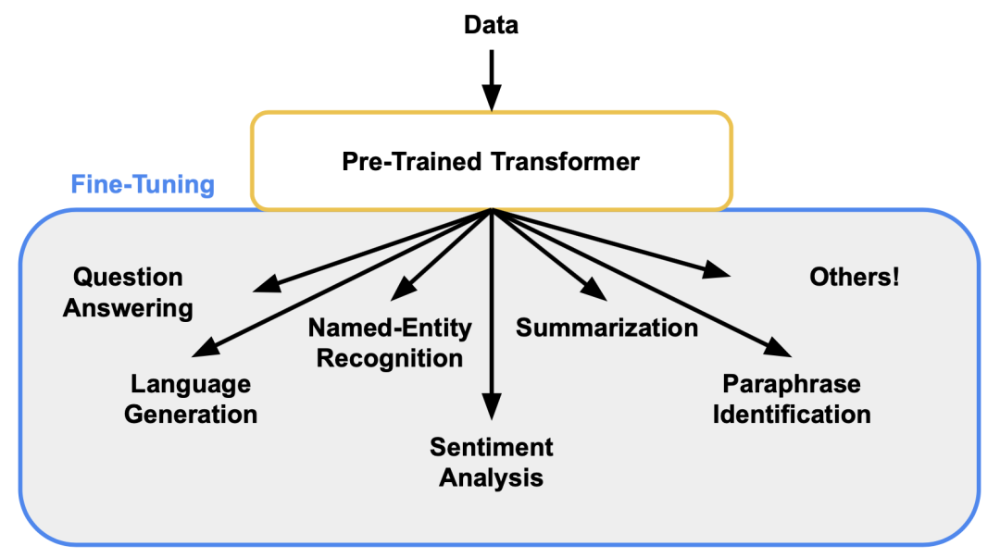
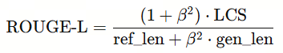
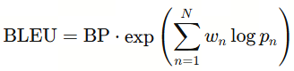
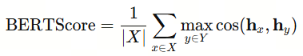
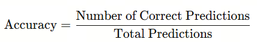
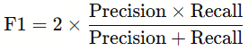
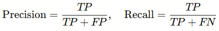
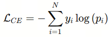

# 第11课时：指令微调 (Instruction Tuning) 原理与策略
## 1. SFT（监督微调）：让模型“听懂人话”

完成大规模预训练后，模型已经积累了丰富的通用语言知识，能够理解和生成自然语言。它可以读懂句子结构、学习词语关联、捕捉长距离依赖，甚至对一些常识性问题给出合理回答。但这并不意味着它能直接胜任具体任务——预训练让模型“懂语言规则”，却不保证它能理解用户意图或按期望方式回应问题。

### 1.1 什么是 SFT，为什么 SFT决定模型好不好用

为了让模型在实际应用中真正可用、听得懂人类指令，我们需要进入下一阶段——监督微调（Supervised Fine-Tuning, SFT）。在这一阶段，模型通过训练学习如何适应特定任务，如文本分类、情感分析、问答系统或对话助手，从而提升在下游任务中的性能和准确性。



预训练提供通用语言能力，而 SFT 将这种能力映射到具体任务，使模型既懂得语言规则，又能按需求输出答案。

SFT 的核心概念其实很简单：通过提供大量带标签的示例（通常是指令-响应、问答或对话样本），让模型学会按照人类期望生成输出。可以把它理解为“教模型如何用人类习惯的方式表达”，将通用语言能力转化为可直接应用的功能。

**为什么 SFT 关键？**

1. 直接影响模型可用性

再大的预训练模型，如果没有经过 SFT，可能生成内容偏离问题、答非所问或者语气怪异；经过 SFT，模型能够理解问题意图，输出更精准、自然、符合场景需求的回答。

2. 桥接通用能力与具体任务

预训练提供了广泛的语言理解和知识储备，而 SFT 将这种通用能力映射到具体任务或应用场景，使模型既懂语言规则，又能按需求输出答案。

3. 决定模型风格和安全性

SFT 不仅塑造模型的答题能力，还可以通过精心设计的数据控制输出风格、礼貌程度，并减少冒犯、误导或不合规内容的生成。

总的来说，SFT 是从“懂语言”到“懂人话”的关键一步。没有它，即便拥有上百亿参数的模型，也可能在实际应用中表现平平；而经过高质量 SFT 的模型，则能在问答、对话、写作辅助等多种场景中脱颖而出，真正成为“会听话”的智能助手。


### 1.2 微调策略：全参数与参数高效微调（PEFT）

在监督微调（SFT）阶段，模型参数的更新方式直接影响训练效率、显存占用以及最终模型在下游任务上的表现。选择合适的微调策略，不仅关系到资源消耗，也关系到模型能否快速适应新任务。

根据参数更新范围和训练成本的不同，常用微调方法可分为几类：

| **方法**                 | **参数更新范围**                       | **显存占用** | **训练成本** | **适用场景**       | **特点**                                           |
| -------------------------------- | ---------------------------------------------- | -------------------- | -------------------- | -------------------------- | ---------------------------------------------------------- |
| 全参数微调（Full Fine-tuning） | 更新所有参数                                 | 高                 | 高                 | 大规模任务、模型深度优化 | 学习能力最强，但成本昂贵，需要完整保存权重               |
| LoRA（Low-Rank Adaptation）    | 在权重矩阵中插入低秩适配层                   | 低                 | 低                 | 中小规模微调、指令任务   | 性能接近全参数微调，显存占用低，参数可复用，当前主流方案 |
| Adapter                        | 在每层 Transformer 中插入小型瓶颈层          | 中                 | 中                 | 多任务学习、持续训练     | 模块化设计，方便增量扩展和多任务适配                     |
| Prompt-tuning / Prefix-tuning  | 仅训练前置或中间虚拟向量（prompt embedding） | 极低               | 极低               | 特定任务快速适配         | 训练速度快，但泛化能力有限，适合轻量级快速实验           |

从总体趋势来看，​**LoRA ​是当前最主流的参数高效微调方式**​，在保持接近全参数微调性能的同时，大幅降低了显存与计算资源需求。其核心思想是将大型权重矩阵 分解为两个低秩矩阵：

 $\Delta W = A B, \quad A \in \mathbb{R}^{d \times r},  B \in \mathbb{R}^{r \times k}, r \ll \min(d, k)$


其中 A 与 B 是可训练参数，而原始权重 W 保持冻结状态。微调时仅更新低秩矩阵部分，使得更新参数数量大幅减少（通常不到原始模型的 1%）。

### 1.3 训练配置与超参数

在 SFT 训练过程中，训练配置与超参数直接决定模型的学习效率、收敛速度以及最终效果。即使数据质量高、微调方式合理，如果训练超参数设置不当，也可能导致模型不收敛、过拟合或出现“训崩”现象。因此，合理配置训练参数是 SFT 阶段的核心步骤之一。

本节将围绕学习率策略、batch size、序列长度、优化器设置、训练时长与稳定性技巧等方面展开介绍。

#### 1. 学习率（Learning Rate）

学习率是最关键的超参数之一。对于大模型，学习率过大容易导致梯度不稳定；学习率过小可能导致训练停滞。

推荐设置：

* 全参数微调：1e-5 \~ 2e-5
* LoRA 微调：1e-4 \~ 3e-4
* Prompt/Prefix-tuning：5e-4 \~ 1e-3

一般遵循两条原则：

  1. 模型越大，学习率越小
  2. 训练模块越少（如 LoRA），学习率可适当更大

为了进一步提升稳定性，通常会使用 ​**warmup（预热）策略**​：

* warmup ratio：0.01 \~ 0.05

  在训练初期缓慢增大学习率，可以避免梯度爆炸。

#### 2. Batch Size 与梯度累积（Gradient Accumulation）

  Batch size 决定了训练的稳定性与收敛速度。大 batch 更稳定，但显存要求高；小 batch 则需配合梯度累积。

推荐配置：

* 有效 batch size：128 \~ 1024（取决于模型规模与任务难度）
* 单卡 batch size：4 \~ 16（常见）
* 梯度累积步数：根据显存自动调整，以达到目标有效 batch size

常见实践：

如果单卡只能放下 batch=4，而想达到有效 batch=512，则设置：

```
gradient_accumulation_steps = 128
```

#### 3. 最大序列长度（Max Sequence Length）

SFT 训练中，输入序列长度影响训练成本与任务适配能力。

建议设置：

| 任务类型               | 建议序列长度                       |
| ------------------------ | ------------------------------------ |
| 简单单轮指令任务       | 512 \~ 1024                        |
| 文本生成、文章总结     | 1024 \~ 2048                       |
| 多轮对话、长上下文任务 | 2048 \~ 4096（或根据模型支持扩展） |

>注意：序列长度越长，显存占用近似​**线性增长**​。

如需训练长上下文模型，可搭配：

* FlashAttention
* Gradient Checkpointing
* 分布式训练策略（如 ZeRO）

#### 4. 优化器（Optimizer）与权重衰减（Weight Decay）

大模型常用优化器包括：

* **AdamW（主流）**
  
  * β1 = 0.9
  * β2 = 0.95 或 0.999
  * weight decay = 0.01
* **Adam（较早方式）**
  * 不推荐用于大模型 SFT
* **Adafactor**
  * 权重占用少，更适合大规模模型
  * 常用于资源有限的场景

如果使用 LoRA 或 Adapter，AdamW 几乎是默认选择。

#### 1. 训练轮数（Epoch）与停止策略

与预训练不同，SFT 数据通常规模较小，因此 epoch 数不能过大，否则容易过拟合。

建议设置：

* 小数据集（< 5 万条）：3\~6 epoch
* 中等规模（10\~50 万条）：13 epoch
* 大规模数据（> 100 万条）：0.5\~1 epoch

实践中常用 **step-based** 而非 epoch-based 调度，即为训练设定固定 step 数，例如：

* 3k \~ 50k steps（取决于数据规模）

训练早停策略：

* 使用 **validation loss early stopping**
* patience：200 \~ 1000 steps

#### 6. 稳定训练的小技巧

为了避免损失值震荡、梯度爆炸等问题，可以启用以下策略：

（1）梯度裁剪（Gradient Clipping）

* `clip_norm = 1.0`

  减少梯度爆炸风险，增强稳定性。

（2）BF16 / FP16 混合精度训练

* BF16 优先：稳定性强、能够满足大模型训练
* FP16 在部分显卡上可能导致 gradient overflow，需要 careful tuning

（3）Gradient Checkpointing

减少显存消耗，让你在低显存设备上训练更大模型，代价是计算量会略微增加。

（4）Dropout

适度使用 dropout（0.0\~0.1）可以增加模型泛化能力。

#### 7. LoRA 单独的推荐配置（常用）

如果使用的是 LoRA 微调（当前最常见策略），一般推荐以下配置：

```
lora_r: 8 或 16
lora_alpha: 16 ~ 32
lora_dropout: 0.05 ~ 0.1
target_modules: ["q_proj", "v_proj"]（或模型专用模块）
learning_rate: 1e-4 ~ 3e-4
```

其中 **q\_proj 和 v\_proj** 是大模型中最敏感的权重更新模块，效果稳定。

* **`q_proj`（Value Projection）**：告诉模型“你应该关注什么”
* **`v_proj`（Value Projection）**：告诉模型“你要从哪里取信息”

### 1.4 评测指标与验证

在监督微调（SFT）阶段，评估模型的核心目的，不再是检测它“懂多少语言知识”（那是预训练阶段的重点），而是判断：

>模型是否真正学会了听懂指令、遵循任务要求，并给出可靠、有用、自然的回答。

因此，SFT 的评测体系主要围绕：**模型对任务的理解能力、输出质量、稳定性与安全性**四方面展开。

#### 1. 核心指标：模型输出质量是否提升？

SFT 的任务类型通常包括摘要、问答、翻译、信息抽取等，因此评测也以文本生成指标为主。

**① ROUGE / BLEU —— 文本重叠类指标**

* ​**ROUGE**​：更适合摘要类任务，关注生成内容与参考答案的相似度，常用 ROUGE-L 的最长公共子序列（LCS）计算方式：



* ​**BLEU**​：更适合翻译、回复类任务，关注 n-gram 级别的匹配情况，其核心公式为：


其中 pn​ 为 n-gram 精确率，wn​ 为权重，BP 为长度惩罚系数。

虽然这两个指标简单且可量化，但缺点是无法真实反映语义质量，可能出现“词对了但语气不对”的情况。

**② BERTScore —— 语义相似度指标**

基于预训练模型的向量相似度评估生成内容的语义接近程度，比 ROUGE 更贴近人类判断。其核心思想是计算候选文本与参考文本在向量空间中的匹配程度，常用公式为：


其中 X 为生成文本的 token 集合，Y 为参考文本的 token 集合，hx，hy​ 为对应的 BERT 隐层向量。适用于：摘要、文本改写、开放问答等任务。

**③ 任务型指标（Accuracy / F1）**

适用于分类、抽取类任务，如：

* 情感分类
* 信息抽取（如实体识别）
* 简单问答（标准答案唯一）

常用的两个核心评价公式为：

**Accuracy：整体预测正确率**


**F1 值：综合考虑 Precision 与 Recall 的调和平均**


其中：


#### 2. 训练监控指标：模型是否稳定学习？

即使是 SFT，也需要关注几个基础训练信号，以确认模型没有“崩掉”：

**① Loss（交叉熵损失）**

最常见、最重要的训练指标，越低代表模型越能准确生成目标输出。

典型公式（分类 / 语言建模常用）为：


其中

* yi：真实标签（one-hot）
* pi：模型预测的概率
* N：类别或词汇表大小

若 **loss 不下降或大幅震荡** → 通常需要检查：

* 学习率是否过高/过低
* batch size 是否过小
* 数据质量是否存在噪声或标签问题

**② 验证集 Loss 曲线**

* 检测是否出现过拟合
* 若训练 loss 下降但验证 loss 上升 → 数据过度单一或训练步骤过长

>💡SFT 最常见的问题是模型“记住训练数据”，导致回答生硬或模板化，验证集 loss 可用于及时发现问题。

#### 3. 多轮对话评估：模型是否能保持上下文逻辑？

针对对话型 SFT（客服、助手、聊天机器人），验证重点包括：

* ​**上下文一致性**​：模型是否记得前几轮的内容？
* ​**逻辑连贯性**​：对话是否自然、顺畅？
* ​**礼貌性/风格稳定性**​：回答是否符合预期语气？

常用方式：

* 多轮对话验证集（人工或半自动生成）
* 人工评估（最直接、最可靠）
* 基于 GPT 的自动评分（Consistency / Helpfulness / Safety）

#### 4. 数据质量验证：训练数据有没有污染模型？

SFT 依赖大量指令数据，因此需要验证：

* 是否出现重复或模式坍塌（回答都很机械）
* 是否包含事实性错误（尤其是问答数据）
* 是否存在敏感信息泄漏风险
* 是否导致模型偏见增加

这些问题通常通过以下方式发现：

* 人工随机抽检
* 自动一致性检查（GPT-based Consistency）
* 参考答案比对（适用于 QA 数据）
* 安全审查（敏感词检测、偏见样本测试）

#### 5. 离线评测与在线验证

**① 离线评测（Offline Evaluation）**

适用于模型开发阶段：

* 使用 Holdout 验证集测试不同任务表现
* 梳理模型在摘要、问答、指令跟随等任务的整体能力
* 对比不同版本的 SFT 结果（如加入行业数据后的变化）

离线评测更适合：​**模型质量回归测试**​、​**微调参数选择**​、​**数据质量对比**​。

**② 在线评估（Online Evaluation）**

适用于部署阶段：

* A/B 测试：验证两个版本模型的实际表现
* 用户反馈：记录满意度、错误率、拒答率
* 自动监控：响应长度、输出异常、敏感词触发等

在线评测能发现许多离线评测无法捕捉的问题，例如：

* 实际用户提问更口语、更噪声
* 用户需求多样、边界模糊
* 安全和稳定性风险更突出

---
