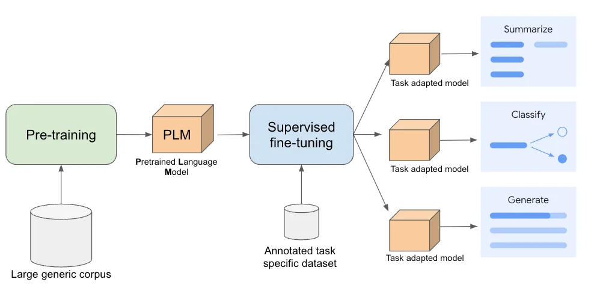

# 第18课时：行业领域模型实战（Industry Domain Training）

当你问通用大模型“心肌梗死的典型心电图表现是什么？”、“上市公司年报中的‘非经常性损益’如何计算？”或“如何起草一份有效的房屋租赁合同？”时，  
它可能会给出**听起来合理但细节错误甚至危险的回答**。

原因很简单：**通用大模型没有专门学习过医疗、金融、法律等垂直领域的知识**。

> ✅ 本课将手把手教你：如何让一个通用大模型“变身”为行业专家！  
> 聚焦三大核心环节：
> 1. **行业数据集准备**：清洗、脱敏、融合知识图谱；
> 2. **继续预训练（CPT）**：领域知识注入的训练策略与数据配比；
> 3. **领域指令数据集构建与微调（SFT）**：教会模型“按业务逻辑说话”。

本教程面向**零基础初学者**，用**通俗语言 + 关键公式 + 真实案例**，让你掌握工业级领域模型训练全流程。

---

## 1. 为什么需要行业领域模型？

### 1.1 通用模型的“知识盲区”

通用大模型（如 LLaMA、Qwen、ChatGLM）在公开网页上训练，具备广泛常识，但在专业领域存在：
- **知识陈旧**：训练数据截止于 2023 年，无法回答 2024 年新药审批；
- **细节错误**：混淆“心房颤动”与“室性心动过速”；
- **缺乏结构**：不能按法律条文框架组织答案；
- **安全风险**：可能泄露训练数据中的患者信息。

其语言先验（language prior）无法准确刻画专业领域中的术语、句式、逻辑结构；
- 直接使用会导致**高预测不确定性**（即高困惑度）和**语义幻觉**。
> 💡 **类比**：通用模型像“百科全书式大学生”，而行业模型是“持证律师/主治医师/注册会计师”。

### 1.2 行业模型的核心目标

| 目标 | 实现方式 |
|------|----------|
| **知识准确** | 注入最新、权威的行业语料 |
| **表达专业** | 遵循行业术语、格式、逻辑 |
| **安全合规** | 数据脱敏、避免幻觉、可追溯 |
| **业务对齐** | 理解真实工作流（如病历书写、财报分析） |

---

## 2. 行业数据集准备：从原始数据到高质量语料

### 2.1 数据来源示例

| 领域 | 典型数据源 |
|------|------------|
| **医疗** | 电子病历（EMR）、医学指南（如 UpToDate）、PubMed 文献、临床试验报告 |
| **法律** | 裁判文书、法律条文、合同模板、律师问答 |
| **金融** | 上市公司财报、研报、招股书、监管文件（如 SEC filings）、财经新闻 |

> ⚠️ **注意**：行业数据往往包含**敏感信息**（如患者姓名、身份证号、交易金额），必须**严格脱敏**。

### 2.2 数据清洗与脱敏
原始行业文本常含噪声（如 OCR 错误、模板字段），破坏语言分布。  
- **规则过滤**：去除 HTML、OCR 错误；
- **语言标准化**：统一术语（如“MI” → “心肌梗死”）；
- **脱敏**：使用 NER 工具识别 PHI（Protected Health Information）并替换：
  - 姓名 → `[PATIENT_NAME]`
  - 身份证 → `[ID_NUMBER]`
  - 电话 → `[PHONE_NUMBER]`

> ✅ **工具推荐**：spaCy + 自定义 NER、Microsoft Presidio、阿里云脱敏服务。


## 3. 继续预训练（Continued Pre-Training, CPT）：注入领域知识

### 3.1 什么是 CPT？

**继续预训练**（CPT）指在通用大模型基础上，用**领域语料**继续进行**自监督训练**（如 Next Token Prediction）。

> 🎯 目标：**调整模型内部表示**，使其更熟悉领域词汇、句式、知识分布。

### 3.2 训练目标与公式

大模型预训练采用语言建模目标：
$$
\mathcal{L}_{\text{LM}} = -\sum_{t=1}^{T} \log P(x_t \mid x_{<t}; \theta)
$$
CPT **不改变目标函数**，仅**更换训练数据**为领域语料。

#### 关键区别：
| 阶段 | 数据分布 | 模型关注点 |
|------|----------|------------|
| 通用预训练 | 通用网页、百科 | 通用语言、常识 |
| CPT | 医疗/法律/金融文本 | 专业术语、逻辑结构 |

### 3.3 数据配比策略

若仅用领域数据训练，会导致**灾难性遗忘**：
$$
\mathcal{L}_{\text{gen}}(\theta) \gg \mathcal{L}_{\text{gen}}(\theta_0)
$$
即通用能力崩塌。

混合训练通过**正则化约束**缓解此问题：
$$
\mathcal{L}_{\text{total}} = \mathcal{L}_{\text{CPT}} + \beta \cdot \mathcal{D}_{\text{KL}}(p_{\theta}(\cdot \mid x) \| p_{\theta_0}(\cdot \mid x))
$$
其中第二项为**知识蒸馏损失**，$\beta$ 控制遗忘程度。

为避免**灾难性遗忘**（Catastrophic Forgetting），推荐混合训练：

| 领域成熟度 | 领域 : 通用 |
|------------|-------------|
| 新兴领域 | 100% 领域 |
| 成熟领域 | **80% 领域 + 20% 通用** |

> ✅ **实证依据**（BloombergGPT）：
> - 80/20 混合 → 领域能力 ↑30%，通用能力保持。

### 3.4 训练技巧

- **学习率**：比初始预训练低（如 2e-5）；
- **步数**：1k–10k 步；
- **评估指标**：领域 Perplexity、通用 MMLU（监控遗忘）。

> 🌟 **业界案例**：
> - **BloombergGPT**：363B tokens 金融语料 CPT；
> - **HuaTuo（华驼）**：1.2M 医疗文献 CPT。

---

## 4. 领域指令微调（Supervised Fine-Tuning, SFT）：教会模型“按业务逻辑说话”

### 4.1 为什么需要 SFT？

CPT 让模型“知道”知识，但不会“用”。  
要让模型**按行业规范输出**，需通过**监督微调**（SFT）学习指令-响应对。

> 例如：
> - 输入：“根据《民法典》第584条，违约损害赔偿范围如何确定？”
> - 期望输出：**引用法条 + 三段论结构 + 案例说明**

### 4.2 SFT 的数学原理：从通用分布迁移到领域条件分布

设通用预训练模型参数为 $\theta_0$，其建模的是通用语言分布 $p_{\theta_0}(y \mid x)$。

SFT 的目标是学习一个新的参数 $\theta$，使得：
$$
p_{\theta}(y \mid x) \approx p_{\text{domain}}(y \mid x, \text{instruction})
$$
这通过**最小化监督损失**实现：
$$
\mathcal{L}_{\text{SFT}} = -\sum_{(x, y) \in \mathcal{D}_{\text{SFT}}} \log p_{\theta}(y \mid x)
$$
其中 $\mathcal{D}_{\text{SFT}}$ 是人工构造的**领域指令-响应对**。

> 🧠 **关键机制**：
> - 模型的**前缀编码器**（如 Query、Key）被微调，以更关注指令中的**任务关键词**（如“引用法条”“三段论”）；
> - **FFN 层**被调整，以激活与行业知识相关的神经元模式；
> - **Softmax logits** 的分布被重新校准，使输出更符合领域风格。

### 4.3 为什么 SFT 能显著提升行业能力？

#### 原理解释（基于表示学习理论）：

1. **任务对齐（Task Alignment）**  
   通用模型的输出空间是“全语言空间”，SFT 通过监督信号将输出**投影到行业子空间**。这可以用投影算子 $\mathcal{P}_{\text{domain}}$ 表示：
   $$
   \theta = \theta_0 + \Delta\theta, \quad \text{其中 } \Delta\theta \approx \nabla_\theta \mathcal{L}_{\text{SFT}} \cdot \eta
   $$
   $\Delta\theta$ 的方向即为**任务对齐方向**。

2. **知识激活（Knowledge Activation）**  
   CPT 已将行业知识编码进模型参数，但这些知识在无指令时**处于休眠状态**。SFT 通过指令输入（如“作为一名医生…”）**激活相关知识通路**，这在注意力机制中体现为：
   $$
   \text{Attention}(Q, K, V) = \text{Softmax}\left(\frac{Q K^\top}{\sqrt{d}}\right)V
   $$
   SFT 让 Query $Q$ 对“医生”“法条”“财报”等词更敏感，从而在 $K$（知识键）中检索到更相关的 $V$（知识值）。

3. **输出格式约束（Format Control）**  
   SFT 显式教模型输出特定结构（如 JSON、三段论、表格），这相当于在解码阶段引入**软约束**：
   $$
   p_{\text{SFT}}(y \mid x) \propto p_{\text{CPT}}(y \mid x) \cdot \mathbb{I}_{\text{format}}(y)
   $$
   其中 $\mathbb{I}_{\text{format}}$ 是格式指示函数（理想情况），SFT 通过数据近似学习该约束。

> ✅ **效果**：  
> - 领域任务准确率 ↑20–40%；  
> - 幻觉率 ↓50%；  
> - 输出格式合规性 ↑90%。

### 4.4 指令数据构建方法

#### 方法 1：人工编写（高质量但成本高）
- 由领域专家撰写；
- 每条包含：**指令 + 输入 + 输出**

> 示例（金融）：
> ```json
> {
>   "instruction": "分析该财报中的非经常性损益项目",
>   "input": "2023年净利润：10亿元；非经常性损益：2亿元（含政府补助1.5亿）",
>   "output": "非经常性损益占净利润20%，主要来自政府补助。扣除后经常性利润为8亿元，反映核心业务盈利能力。"
> }
> ```

#### 方法 2：半自动合成
- 从 QA 对提取 $(Q, A)$；
- 用模板生成指令；
- 用 GPT-4 重写答案使其更专业。

#### 方法 3：知识图谱引导生成
- 利用三元组生成问答对。

> ✅ **数据量建议**：  
> - 最小可行：**1,000 条**  
> - 理想：**10,000+ 条**

### 4.5 指令设计原则

| 原则 | 说明 |
|------|------|
| **角色明确** | “作为主治医师，请...” |
| **任务清晰** | “列出三个鉴别诊断” |
| **格式约束** | “用三段论回答” |
| **安全兜底** | “若不确定，请说明” |

---

## 5. 实战示例：训练一个医疗问答模型

### 步骤 1：准备数据
- **语料**：10 万篇 PubMed 摘要 + 5 万份脱敏病历；
- **知识图谱**：UMLS 本体，生成 5 万条增强文本。

### 步骤 2：继续预训练（CPT）
```python
# 使用 HuggingFace Transformers
train_dataset = MedicalGeneralMixDataset(med_ratio=0.8)
args = TrainingArguments(
    learning_rate=2e-5,
    per_device_train_batch_size=4,
    num_train_epochs=1,
)
trainer = Trainer(model=model, args=args, train_dataset=train_dataset)
trainer.train()
```

### 步骤 3：构建 SFT 指令集（2,000 条人工指令）

### 步骤 4：监督微调（SFT）
```bash
# 使用 LLaMA-Factory
llamafactory-cli train \
  --model_name_or_path ./cpt-medical \
  --dataset medical_sft \
  --finetuning_type lora \
  --lora_rank 64
```

> ✅ **效果评估**：
> - MedQA 准确率：**+22%**
> - 幻觉率：**<5%**（通用模型约 15%）

---

## 6. 总结：行业模型训练三步法

| 阶段 | 目标 | 关键技术 | 原理支撑 |
|------|------|----------|----------|
| **数据准备** | 构建安全、高质量、结构化语料 | 脱敏、清洗、知识图谱融合 | 信息完整性 + 隐私保护 |
| **继续预训练** | 注入领域知识，调整内部表示 | 80/20 数据配比、低学习率 | 语言建模目标 $\mathcal{L}_{\text{LM}}$ |
| **指令微调** | 教会模型按业务逻辑输出 | 专家编写、角色化指令 | 任务对齐 + 知识激活 $\mathcal{L}_{\text{SFT}}$ |

> 🌟 **记住**：  
> 行业模型不是“越大越好”，而是“**越准越好、越安全越好、越符合业务越好**”。

> 下一课，我们将学习**模型评估与部署**——  
> 如何验证你的行业模型真正“靠谱”？如何让它在医院、律所、银行安全上线？