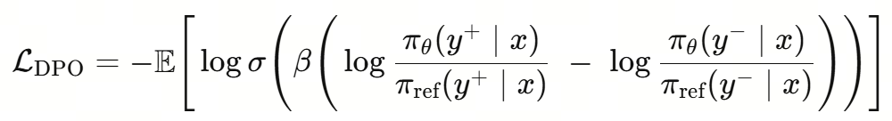

# 第2课时：LLM 训练范式与数据工程全景

## 1. LLM 训练范式全流程概览

大语言模型的训练，并不是“一次性把模型喂大”这么简单，而是一条**由能力学习到行为对齐的渐进式路径**。从最初的无监督预训练，到面向任务与人类偏好的对齐训练，每一个阶段解决的问题都不一样，也各自承担着不可替代的角色。理解这一整条训练链路，是理解现代 LLM 能力来源的关键。

整体来看，主流的大模型训练流程可以抽象为三大阶段：

> **Pre-training → Supervised Fine-Tuning（SFT）→ 对齐训练（RLHF / DPO / GRPO 等）**

这条路径的本质，是让模型先学会“语言本身”，再学会“如何按要求回答”，最后学会“怎样的回答更符合人类偏好”。

### 1.1 从 Pre-training 到对齐训练的整体路径

**（1）Pre-training：语言能力的“打地基”阶段**

预训练阶段的目标非常纯粹：  
> **让模型学会自然语言的统计规律与结构模式。**

在这一阶段，模型通常使用海量的无标注文本数据，通过自回归或掩码语言模型目标进行训练。以自回归模型为例，其核心目标函数可以写为：

$$
\mathcal{L}_{\text{pretrain}} = - \mathbb{E}_{x \sim \mathcal{D}} \sum_{t=1}^{T} \log p(x_t \mid x_{<t})
$$

模型并不知道什么是“好回答”或“坏回答”，它只是在反复学习：  
> **在给定上下文的情况下，下一个 token 最可能是什么。**

这个阶段决定了模型的**知识广度、语言流畅度和基础推理潜力**。如果把模型类比为一个人，Pre-training 更像是“读遍图书馆”的过程——知识很多，但并不一定会按要求说话。

**（2）SFT：让模型“听懂指令”**

仅有预训练是不够的。一个只经过 Pre-training 的模型，往往会出现以下问题：

- 不知道什么时候该回答、什么时候该拒绝  
- 容易答非所问  
- 对“指令”缺乏明确响应意识  

**Supervised Fine-Tuning（SFT）** 的目标，就是通过人工标注的指令-回答数据，让模型学会“如何按人类期望的格式与方式作答”。

其训练目标与预训练类似，但数据分布发生了显著变化：

$$
\mathcal{L}_{\text{SFT}} = - \mathbb{E}_{(x,y) \sim \mathcal{D}_{\text{inst}}} \sum_{t=1}^{|y|} \log p(y_t \mid x, y_{<t})
$$

在这一阶段，模型逐渐形成“助手人格”：  
> 看到问题就回答，语气更稳定，结构更清晰。

但需要注意的是，**SFT 只能教“标准答案”，很难教“偏好”**。模型知道“能回答什么”，却未必知道“哪种回答更好”。

**（3）对齐训练：从“能答”到“答得好”**

为了进一步贴近人类偏好，引入了对齐训练阶段，典型代表包括：

- **RLHF（Reinforcement Learning from Human Feedback）**
- **PPO / DPO / GRPO 等优化变体**

这一阶段的核心思想是：  
> **不再只告诉模型“正确答案是什么”，而是告诉它“哪个回答更受人类喜欢”。**

以 RLHF 为例，流程通常包括：

1. 人类对多个回答进行偏好排序  
2. 训练一个奖励模型 $R(x, y)$  
3. 使用强化学习最大化期望奖励：

$$
\max_{\theta} \; \mathbb{E}_{y \sim \pi_\theta(\cdot \mid x)} [ R(x, y) ]
$$

相比之下，DPO 等方法直接在概率空间中对“好回答”和“差回答”进行对比优化，避免了复杂的 RL 过程，但目标本质是一致的：  
> **让模型在多个“合理回答”中，倾向于更符合人类价值与偏好的那一个。**

**（4）整体视角：三阶段各自解决什么问题？**

从全流程视角看，这三步并不是冗余叠加，而是层层递进：

- **Pre-training**：解决“会不会说话”  
- **SFT**：解决“听不听得懂你在问什么”  
- **对齐训练**：解决“说的话你喜不喜欢、信不信任”  

如果缺少前面的地基，后续对齐几乎无从谈起；  
而如果没有对齐，模型能力再强，也可能“说得多、说得乱、说得不合时宜”。

这正是现代 LLM 训练范式的核心逻辑所在：  
> **能力来自预训练，行为来自对齐，而效果取决于二者的协同。**
径

### 1.2 SFT：让模型“学会听话”的关键一步

如果说预训练（Pre-training）解决的是“**模型有没有语言能力**”，那么监督微调（Supervised Fine-Tuning, SFT）解决的就是一个更现实的问题：**模型能不能按照人的要求来回答问题**。在这一阶段，大模型第一次真正开始“对齐人类意图”，也正是在这里，它从一个只会续写文本的语言模型，逐步转变为一个可交互、可指令化的助手。

从形式上看，SFT 的训练目标并不复杂。本质上，它仍然是在做条件语言建模，只不过条件不再是“前文 token”，而是被明确区分为 *指令（Instruction）*、*上下文（Context）* 与 *期望输出（Response）*。模型被要求在给定指令和上下文的前提下，最大化正确回答的似然概率：

$$
\mathcal{L}_{\text{SFT}} = - \mathbb{E}_{(x, y) \sim \mathcal{D}} \left[ \log P_\theta(y \mid x) \right]
$$

其中，$x$ 表示指令或多轮对话历史，$y$ 表示人类标注的理想回答。这一目标函数本身并不新颖，但**数据分布的变化**却带来了质的飞跃：模型第一次被系统性地暴露在“人类希望看到的回答”上，而不是互联网上自然产生的文本碎片。

从能力层面来看，SFT 至少在三个方面重塑了模型行为。第一，它让模型学会了**区分角色与边界**。在预训练阶段，模型并不知道“问题”和“回答”的区别，而 SFT 明确告诉模型：什么是用户输入，什么是你应该生成的内容，这直接决定了模型是否会胡乱续写、跑题，或者把用户输入当成待补全的文本。第二，SFT 强化了**任务跟随能力**，例如“请总结”“请翻译”“请给出步骤”“只输出 JSON”等，这些在语言建模意义上并不天然，却在指令数据中被反复强调。第三，SFT 开始塑造模型的**基本价值取向与风格偏好**，比如更礼貌、更克制、更结构化的表达方式。

一个很形象的比喻是：预训练阶段，模型像是“读遍天下书的学生”；而 SFT 阶段，则像是第一次有人坐下来，认真地教它——**“别人提问时，你应该怎么回答，什么样的回答算是好回答”**。没有这一步，模型的知识再多，也很难稳定地服务于真实用户。

但 SFT 也有非常清晰的边界。它高度依赖高质量人工标注数据，而这类数据成本极高、规模有限，决定了 SFT 不可能像预训练那样无限扩展。更重要的是，SFT 只能教会模型“**在给定示例附近做得像人**”，却很难精细地表达“哪些回答更好、哪些虽然看起来合理但不应该给出”。这也是为什么在 SFT 之后，业界普遍还需要引入 RLHF、DPO 等对齐方法，对模型行为进行更细粒度的偏好塑形。

因此，可以把 SFT 看作整个对齐训练中的**基石阶段**：它不追求极致的安全性或偏好最优，而是先解决一个最基本、却最关键的问题——让模型真正“听得懂话、答得像人”。没有这一层，后续所有复杂的对齐算法，都会失去落脚点。

### 1.3 RLHF / PPO / DPO / GRPO：对齐方法的演进与差异

在完成大规模预训练与 SFT 之后，模型已经“会说话、能办事”，但距离“说得合适、办得让人放心”仍有不小差距。现实中的用户关心的不只是“答案是否可能正确”，还包括是否**有用、礼貌、安全、符合人类偏好**。这正是对齐（Alignment）阶段存在的意义，而 RLHF 及其后续方法，正是围绕这一目标逐步演化而来的一整套技术路线。

最早被广泛采用的是 **RLHF（Reinforcement Learning from Human Feedback）**。它的核心思想并不复杂：先让人类对模型生成的多个回答进行偏好排序，再用这些排序数据训练一个**奖励模型（Reward Model, RM）**，最后把语言模型当作策略，用强化学习的方式去最大化奖励模型给出的分数。形式上，我们希望优化的目标可以写成：

$$
\max_\pi \; \mathbb{E}_{x \sim \mathcal{D},\; y \sim \pi(\cdot|x)} \left[ r_\phi(x, y) \right]
$$

其中 $\pi$ 是当前语言模型策略，$r_\phi$ 是由人类偏好数据训练得到的奖励模型。直观理解就是：**让模型多输出那些“人类更喜欢”的回答，少输出让人皱眉的内容**。

在工程实现上，RLHF 通常依赖 **PPO（Proximal Policy Optimization）** 作为优化算法。PPO 的关键在于“别一步走太猛”，它通过引入裁剪（clipping）机制，限制新策略与旧策略之间的变化幅度，目标函数形式为：

$$
\mathcal{L}_{\text{PPO}} = \mathbb{E}\left[
\min \left(
r_t(\theta) A_t,\;
\text{clip}(r_t(\theta), 1-\epsilon, 1+\epsilon) A_t
\right)
\right]
$$

这里的 $r_t(\theta)$ 表示新旧策略概率比，$A_t$ 是优势函数。它的工程含义很朴素：**模型可以学，但不要“学歪”或“学炸”**。也正因如此，PPO+RLHF 成为了 GPT-3.5、GPT-4 等模型对齐阶段的核心技术路线。

然而，RLHF 的代价同样明显：它需要训练并维护一个额外的奖励模型，引入复杂的强化学习系统，训练过程不稳定、调参成本高、算力消耗大。这些问题直接推动了下一阶段方法的出现——**DPO（Direct Preference Optimization）**。

DPO 的一个关键洞察是：**其实没必要显式训练奖励模型，也不一定非得做强化学习**。只要我们有“同一个 prompt 下，哪个回答更好”的偏好对 $(y^+, y^-)$，就可以直接在概率空间中优化模型，使其对优选回答赋予更高概率。DPO 的目标函数可以写为：

其中 $\pi_{\text{ref}}$ 是参考模型（通常是 SFT 模型），$\beta$ 控制偏好强度。它的直觉非常直接：**让模型在“好答案”和“坏答案”之间拉开概率差距，同时不要偏离原始模型太远**。相比 RLHF，DPO 训练流程更简单、稳定性更好，也更容易大规模复现，因此在开源社区中迅速流行。

在 DPO 之后，又出现了一些更强调工程友好性与稳定性的变体，其中一个代表是 **GRPO（Grouped / Generalized Reward Preference Optimization）**。GRPO 的思想可以理解为对“单一偏好对”的进一步推广：不再只比较一好一坏，而是**在一个候选集合中进行分组或排序式优化**，通过组内相对优势来更新模型。这种方式在多候选生成、采样式对齐和低噪声偏好数据场景下表现更稳定，也更符合实际生产中“多答案竞争”的设定。

从整体演进脉络来看，这条路线非常清晰：

- **RLHF + PPO**：理论完整，但系统复杂、成本高；
- **DPO**：去掉奖励模型和 RL，直接优化偏好，简单高效；
- **GRPO 及其变体**：进一步适配多样化偏好结构，增强稳定性与工程可控性。

如果用一句话总结这一演进趋势，那就是：**从“强化学习驱动的对齐”，逐步走向“概率建模驱动的对齐”**。模型不再被当作需要精细操控的 RL 智能体，而是被视为一个可以通过偏好分布直接塑形的生成模型。这一转变，正在深刻影响当前大模型对齐阶段的主流实践。

## 2. 训练规模与 Chinchilla 法则

### 2.1 参数规模、数据规模与算力的三角关系

在大模型训练中，“把模型做大”曾一度被视为性能提升的最直接路径。参数规模从亿级、百亿级一路推到千亿、万亿，看起来似乎只要显存和算力允许，模型就能不断变强。但很快，业界发现一个现实问题：**模型并不是越大越好，至少在给定算力预算下不是这样**。真正决定性能上限的，并非单一维度的“参数量”，而是参数规模、数据规模与计算量三者之间的平衡关系。

从训练过程来看，模型学习的本质是：用有限的参数去“吸收”有限的数据，在有限的计算步数内逼近最优解。参数规模 $N$ 决定了模型的表达能力上限，训练数据 token 数 $D$ 决定了模型能看到多少世界，而总计算量 $C$ 则决定了模型能在多大程度上反复打磨这些知识。三者之间并不是独立的，而是被紧密耦合在一起，近似满足关系：
$$
C \propto N \times D
$$
也就是说，在给定算力预算 $C$ 的前提下，如果一味增大参数规模 $N$，势必压缩可用于训练的数据量 $D$；反之亦然。这正是许多“参数很大但效果不如预期”的模型背后的根本原因。

Chinchilla 法则正是在这样的背景下提出的。DeepMind 在系统性实验中发现：**在固定计算预算下，许多模型都处于“参数过多、数据不足”的欠训练状态**。换句话说，它们的容量很大，但并没有被足够多的高质量 token 喂饱。Chinchilla 给出的核心结论是一个经验最优配比：当训练损失最小化时，参数规模与数据规模应大致满足
$$
D \approx k \cdot N
$$
其中 $k$ 是一个常数（在原始结论中量级约为 20）。这意味着，一个 100B 参数模型，理想情况下需要看到数量级为数万亿 token 的训练数据，而不是传统做法中的“几千亿 token 就草草收工”。

这一结论对业界影响极大。它直接推动了训练策略从“堆参数”向“堆数据”的转向，也解释了为什么后续一批模型（如 LLaMA 系列）在参数规模明显小于 GPT-3 的情况下，却能在下游任务上表现出更强的泛化能力——不是模型更聪明了，而是**训练得更充分了**。在算力受限的现实条件下，用更多数据去训练一个稍小的模型，往往比训练一个“吃不饱”的巨型模型更划算。

更重要的是，这个三角关系也重新定义了“规模扩展”的工程边界。算力预算 $C$ 通常是最硬的约束，参数规模 $N$ 决定了显存与并行策略，而数据规模 $D$ 则牵涉到数据采集、清洗与治理的长期成本。Chinchilla 法则并不是一个精确公式，而是一种**资源配置的思维方式**：每一次扩大模型规模之前，都必须同时思考数据是否足够、算力是否匹配，否则扩展只会带来效率下降，而非能力跃迁。

从这个角度看，大模型训练早已不再是“模型架构”的单点问题，而是一场关于算力、数据与参数协同演化的系统工程。理解这三者的平衡关系，是走向高性价比、高可持续训练范式的第一步。

### 2.2 Chinchilla 法则的核心结论

在大模型发展早期，一个几乎“写进共识”的判断是：**模型越大越好**。参数规模被当作性能的直接代名词，从几十亿、上百亿一路卷到千亿、万亿，仿佛只要参数数目足够大，模型自然会变聪明。但 Chinchilla 法则的出现，第一次系统性地挑战了这一“唯参数论”的直觉。

Chinchilla 法则并不是一个复杂的新算法，而是一次**对训练规模分配方式的重新审视**。DeepMind 在对大量 Transformer 语言模型的实验中发现：在固定计算预算（FLOPs）的前提下，许多当时的主流模型都存在一个共同问题——**参数太多，数据太少**。模型并不是被“参数容量”限制住的，而是被“见过的 token 数量”限制住的。

从形式上看，一个标准 Transformer 语言模型的训练计算量可以近似写为：

$$
\text{Compute} \propto N \cdot D
$$

其中 $N$ 表示模型参数规模，$D$ 表示训练中使用的 token 总数。在算力预算固定的情况下，$N$ 和 $D$ 并不能同时无限增大，问题的关键变成：**算力应该更倾向于用在“更大的模型”，还是“更多的数据”上？**

Chinchilla 的核心结论非常直接，也非常反直觉：  
> 在给定计算预算下，**最优模型并不是参数尽可能大，而是参数规模与数据规模成近似线性比例增长**。

更具体地说，实验表明在最优区域内，应当满足：

$$
D \propto N
$$

也就是说，参数翻一倍，训练 token 也应该翻一倍，而不是像过去那样“参数指数级膨胀、数据小幅增长”。如果数据跟不上，模型就会进入**严重欠训练（under-trained）**状态——看起来模型很大，但实际上每个参数“学到的东西”非常有限。

为了让这个结论更直观，可以想象一个极端但贴切的类比：  
一个学生拿到了一本包含一万页知识点的超级厚教材（对应超大参数模型），但老师只讲了前两章（对应有限的数据）。结果并不会是“学生掌握了更多知识”，而是“学生对前两章学得稍微细一点”，后面的内容依然一无所知。模型也是如此：参数数量增加了，但数据没有覆盖足够多的模式，新增参数并没有被有效利用。

Chinchilla 法则进一步指出，在当时流行的一些模型（例如早期 GPT-3 规模的模型）中，**如果保持算力不变，适当减小参数规模、同时显著增加训练 token 数量，模型性能反而会更好**。这意味着，许多模型并不是“算力不够”，而是“算力用错了地方”。

这条结论直接改变了后续大模型训练的工程策略。越来越多团队开始意识到：  
- **数据不再只是“够用就行”的配角，而是与参数同等重要的主角**  
- 清洗干净、分布合理、高覆盖度的数据，往往比盲目堆参数更有价值  
- 在算力有限的现实条件下，“中等规模模型 + 海量高质量 token”可能比“超大模型 + 少量数据”更具性价比

这也是为什么在 Chinchilla 之后，业界开始频繁看到一些“参数规模看起来没那么夸张，但训练 token 数量极其庞大”的模型配置。模型参数不再一味追求极限，而是更强调**参数—数据—算力三者之间的平衡**。

需要强调的是，Chinchilla 法则并不是否定“大模型”的价值，而是给“大模型训练”设定了一条更理性的准绳：  
> **规模扩展本身并不是问题，失衡的规模扩展才是问题。**

当参数规模、数据规模和计算预算三者处在一个协调的区间内，模型的每一份算力投入，才能真正转化为可泛化的能力。这种从“参数崇拜”走向“效率与平衡”的转变，也正是当前 LLM 训练范式成熟化的重要标志之一。

### 2.3 对实际模型训练策略的影响

Chinchilla 法则真正改变行业的地方，并不在于那条看似简单的比例关系本身，而在于它**系统性地推翻了“参数越大越好”的直觉训练范式**，迫使研究者和工程团队重新思考：在有限算力预算下，模型究竟该“长脑子”，还是该“多读书”。

在 Chinchilla 之前，大模型训练往往遵循一种近乎本能的策略：**先把模型堆大，再尽量喂数据**。但现实是，数据准备远比模型扩容困难得多——高质量语料稀缺、清洗成本高、分布控制复杂，于是很多模型在“数据吃不饱”的状态下被迫提前收敛。Chinchilla 的核心结论直接点破了这一问题：**大量模型其实是“算力过度用在参数上，而不是用在训练步数上”**。换句话说，这些模型不是不够聪明，而是“读书太少”。

这一结论对训练策略的第一层影响，是**参数规模的理性收缩**。在给定 FLOPs 预算 $C$ 的前提下，如果继续盲目扩大参数量 $N$，模型能够经历的有效训练 token 数 $D$ 必然被压缩，导致模型停留在欠训练（under-trained）区间。实践中，这意味着：与其训练一个 1T 参数、只跑几百亿 token 的模型，不如训练一个 200B～300B 参数、但完整跑完数万亿 token 的模型，后者在泛化、稳定性和下游任务迁移上往往更具优势。

第二层影响体现在**数据工程地位的显著上升**。当最优训练策略要求 $D \gg N$ 时，数据不再是“模型训练的燃料”，而是“模型能力的上限决定因素”。这直接推动了 Data-Centric AI 思想在大模型领域的落地：团队开始花更多精力在数据采集、过滤、去重、质量分层与配比设计上，而不是仅仅关注模型结构是否足够复杂。很多头部模型的性能提升，实际上并不是来自架构突破，而是来自更干净、更均衡、更多样的数据分布。

进一步来看，Chinchilla 法则也深刻影响了**训练阶段的资源分配策略**。在算力固定的情况下，团队必须在“更大的 batch、更长的序列、更深的模型、更长的训练时间”之间做取舍。Chinchilla 给出的隐含建议是：**优先保证训练步数与 token 覆盖率，其次才是模型宽度和深度**。这也是为什么近年来大量模型选择在参数规模相对克制的前提下，显著拉长训练周期，甚至通过 curriculum learning 或数据分阶段注入的方式，让模型“慢慢学”。

在工程实践中，这种转变还带来了一个非常现实的好处：**训练稳定性显著提升**。欠训练的大模型往往对初始化、学习率和优化器极其敏感，稍有不慎就会出现 loss 震荡、梯度爆炸或能力坍缩。而在 Chinchilla 建议的“数据充足区间”内训练的模型，由于梯度统计更加充分，往往更容易收敛，对超参数的容忍度也更高。这一点在超大规模分布式训练中尤为重要，因为稳定性本身就是一种隐性成本。

另一个容易被忽视但极其关键的影响，是**对“模型复用与迭代节奏”的改变**。当训练一个超大参数模型的边际收益降低后，更合理的策略往往是：在同一参数规模下反复打磨数据与训练流程，而不是频繁推翻重来。这也是为什么许多模型家族（如 LLaMA、Qwen、Mistral 系列）会选择在相对稳定的参数规模区间内，通过多代数据升级与训练策略调整来持续提升性能。Chinchilla 从理论上为这种“稳态演进”提供了坚实支撑。

从更宏观的角度看，Chinchilla 法则还重塑了**学术研究与工业落地之间的关系**。在学术环境中，算力与数据通常受限，参数扩张曾是最直观的性能提升路径；而在工业环境中，数据规模和系统工程能力反而是核心壁垒。Chinchilla 明确指出：**真正能长期提升模型能力的，是系统性的数据与训练设计能力，而不是一次性的参数豪赌**。这也解释了为什么近年来真正具有竞争力的大模型，往往来自拥有稳定数据管线和持续训练能力的团队。

最后需要强调的是，Chinchilla 法则并不是一条“万能公式”，而是一种**资源最优分配的指导思想**。它并不否认更大模型的潜力，而是提醒我们：在任何给定预算下，都存在一个更理性的参数–数据–算力平衡点。真正成熟的训练策略，不是简单地追求“更大”，而是清楚地知道：**在什么条件下，应该让模型长大；在什么条件下，应该让模型多学。**

从这个意义上说，Chinchilla 不只是一次经验规律的总结，而是大模型训练范式走向工程理性的重要标志。

## 3. Data-Centric AI：以数据为中心的训练范式

### 3.1 从 Model-Centric 到 Data-Centric 的转变

在早期的人工智能发展阶段，模型的能力几乎完全依赖于算法创新与网络架构的优化。这种“Model-Centric”思路强调提升模型复杂度、增加参数量、设计更深更宽的网络，以及精心调节学习率、优化器和正则化策略。工程师和研究者的注意力几乎全部聚焦在模型的性能提升上，而数据往往只是简单清洗或随机采样后直接用于训练。

然而，随着大规模语言模型（LLM）时代的到来，这种以模型为中心的思路逐渐显示出瓶颈。参数数量的扩张虽能短期提升性能，但对数据的依赖呈现出更为严格的要求：模型越大，数据的覆盖和质量对最终表现的影响就越显著。经验表明，即使是最先进的架构，如果训练数据不够丰富或存在系统性偏差，也难以达到预期的效果。Data-Centric AI 的理念应运而生，它主张**提升数据质量和结构，而不仅仅盯着模型参数**。

从实践角度看，Data-Centric AI 包括对数据进行精细化管理和优化，使数据本身成为性能提升的关键因素。例如，在对话型模型训练中，单纯增加模型层数和隐藏维度可能会让模型“学会更多的模式”，但如果训练语料存在偏差或重复信息，模型输出往往会反映出这些缺陷——生成的文本可能重复、偏颇或者缺乏连贯性。相比之下，通过数据清洗、去重、覆盖不足领域的扩展，以及平衡不同标签或主题的分布，模型在相同参数量下的表现往往能显著提升。

这一转变不仅体现在概念上，也反映在实际训练流程中。以传统的 Model-Centric 流程为例，训练步骤主要关注：

- 设计网络架构：选择 Transformer、LSTM 或其他结构；
- 调整优化器和超参数：如学习率、权重衰减、梯度裁剪等；
- 批量训练：增加 batch size 或迭代次数以提高模型收敛。

而 Data-Centric 思路下，训练流程更多关注数据本身的生命周期管理，核心环节包括：

1. **数据采集**：不仅追求量，更注重覆盖面和多样性。例如，在法律文本模型中，需要平衡判例、法规、合同等不同类型的数据来源；
2. **数据清洗与过滤**：去除重复、低质量或噪声样本，保证模型学习到的模式是真实可靠的；
3. **数据扩展与合成**：针对稀缺类型或长尾场景，人工生成或算法合成样本，确保模型具备泛化能力；
4. **数据去重与评估**：检查训练集与验证集是否存在泄漏，同时评估数据覆盖的完整性和均衡性；
5. **数据配比**：根据任务需求调整不同类型数据的比例，使模型不会偏向特定领域或风格。

通过这些环节，Data-Centric AI 将数据本身的质量提升到与模型设计同等重要的位置。这种方式不仅能在有限算力和参数规模下获得更高效的训练结果，还能在实际应用中减少偏差和不一致性。例如，在医学问答模型中，精准的病历语料和药物说明文本能够显著提升模型在诊疗场景下的可靠性，即使模型参数相对有限，也能生成更专业、更贴合用户需求的回答。

Data-Centric 的思路也带来了工程和科研方法上的改变。团队不再只是“堆模型”，而是更注重：

- **持续迭代数据**：每一次训练或微调都伴随对数据质量的评估和优化；
- **数据质量指标化**：引入覆盖率、标签一致性、信息熵等指标量化数据价值；
- **人机协作数据打磨**：利用标注专家、规则系统和自动化工具共同提升数据质量。

在 LLM 训练中，这种转变带来的效果是立竿见影的。模型在面对新任务时，依赖高质量、多样化的数据能够比单纯增加参数量获得更稳健的表现；在低资源场景下，通过精心设计和优化数据集，模型也能发挥出接近大规模模型的性能。这种理念进一步延伸到数据驱动的对齐训练、强化学习和微调策略，使整个训练流程从单纯追求算力消耗，变成一个**数据质量与模型能力协同优化的闭环**。

总的来说，Data-Centric AI 并不是否定模型创新，而是强调“好模型+好数据”才是长远可持续的提升路径。它让训练不再是冷冰冰的数字游戏，而是一个不断打磨数据、观察模型反应、再调整数据的动态过程。这种方法不仅提高了训练效率，也让模型输出更可靠、贴近真实世界需求，同时为后续的 SFT 和 RLHF 提供了坚实的数据基础。

### 3.2 高质量数据为何比更大的模型更重要

在大模型训练的实践中，一个不断被验证的经验法则是：**模型再大，如果数据质量不够，性能提升是有限的，甚至可能带来负面效应**。这与早期 AI 研究中普遍关注模型架构不同，Data-Centric AI 强调用高质量的数据去驱动模型能力的释放。为了理解这个现象，可以从几个角度来分析。

首先，高质量数据能够提供更清晰的信号，让模型学到真正有用的模式。假设我们有一个语言理解任务，需要训练一个问答模型。如果训练集里存在大量的拼写错误、重复样本、无关或偏颇内容，模型就会学习到这些噪声，导致在实际应用中输出不准确或不连贯的答案。即便我们将模型参数翻倍，增加数十亿的权重，也无法彻底消除这种噪声的影响，因为模型没有办法自动辨别哪些数据是可靠的，哪些是误导信息。这种情况下，数据质量的瓶颈直接限制了模型的性能上限。

高质量数据的另一个优势是**覆盖度和多样性**。在语言模型训练中，模型需要学习词汇、句法、语义、常识和领域知识的多层次信息。如果训练数据覆盖不全面，模型在长尾场景下会表现不佳。例如，一个医学问答模型如果训练数据中只包含普通健康知识，而缺少针对罕见病症或药物交互的高质量文本，模型在遇到这些问题时就会产生错误甚至危险的回答。相比之下，通过数据扩展、领域采集和精细标注，我们可以让模型在相对较小的参数规模下，也能获得较强的泛化能力。

数据质量的重要性还体现在**模型训练的效率**上。Chinchilla 法则指出，在固定计算预算下，训练数据和模型参数的比例对最终性能至关重要。公式上可以表示为：

$$
\text{Optimal Data Tokens} \propto \text{Model Parameters}^{0.5}
$$

这意味着，为了充分发挥大模型能力，训练数据必须足够丰富，覆盖模型可以学习的模式空间。如果数据质量低，即使模型参数再多，也无法充分利用这些参数的表达能力。换句话说，增加模型大小只是“增加容量”，而没有高质量数据，模型容量就像空房间，空洞而无法承载知识。

高质量数据还对下游微调（SFT）和对齐训练（RLHF/PPO/DPO）产生直接影响。在 SFT 阶段，模型通过人工标注的指令数据学会执行特定任务或“听话”。如果指令数据质量不高，模型学到的行为模式会出现偏差或不一致。在 RLHF 阶段，奖励模型（Reward Model, RM）依赖对比高低质量输出的训练数据，如果训练 RM 的数据存在噪声，整个强化学习流程可能偏离预期，导致模型学到错误的优化方向。这些链式影响再次凸显了高质量数据对整个训练流程的根本性作用。

为了更直观地理解这个问题，可以考虑一个类比：训练大模型就像建造一座高楼，模型参数是钢筋混凝土，而数据就是设计图纸。如果设计图纸混乱或缺失，钢筋再多也无法建成坚固的楼宇，甚至可能出现结构不稳的问题。相比之下，一份完整、精准的设计图可以让较少的钢筋就建成高楼，而且更加稳固和安全。

在实际工程中，高质量数据通常具有以下特征：

- **准确性**：数据本身信息正确、标签无误；
- **一致性**：同类样本之间标注规范统一，减少歧义；
- **多样性**：覆盖不同领域、不同风格、不同难度的样本，避免模型偏向单一模式；
- **代表性**：能够反映真实使用场景和边缘情况，提升泛化能力；
- **去噪声**：剔除重复、低质量或错误信息，减少模型学习的误导信号。

从工程操作角度，构建高质量数据通常涉及几个环节：数据采集、清洗、过滤、去重、扩展、评估和配比。每个环节都可能对最终模型性能产生显著影响。例如，在数据扩展阶段，通过合成样本或使用外部知识源补充训练集，可以有效弥补稀缺领域的覆盖不足；在评估环节，通过定量指标和人工审查，确保数据覆盖广泛且质量可靠。

高质量数据的重要性也体现在**训练成本优化**上。相比于盲目增加模型参数，投入时间和资源去优化数据质量，往往能在相同计算预算下获得更高的性能收益。这不仅节约了算力和存储资源，也降低了训练失败或模型输出不可控的风险。例如，对于一个 10 亿参数的模型，通过增加 20%-30% 高质量训练数据，其在下游任务的表现提升可能超过单纯增加 50% 参数所带来的收益。

综合来看，高质量数据是大模型训练的根基。它不仅影响模型的基本理解能力，还决定了模型在特定任务、长尾场景和对齐训练中的可靠性。即便面对参数爆炸的 GPT-3、Llama、Mistral 或 Qwen3，如果训练数据没有精心设计和筛选，模型的能力也可能远远低于预期。Data-Centric AI 的理念正是基于这一点：在追求更大模型的同时，更要回头打磨数据，使模型真正学会理解、表达和应用知识，而不是仅仅“记住更多参数”。

### 3.3 数据分布、噪声与偏差问题

在大模型训练中，数据的分布特性、噪声含量以及潜在偏差是决定模型表现的隐形因素。即便拥有海量数据，如果这些因素处理不当，模型最终输出仍可能出现不可预测的偏差、低质量回答，甚至放大社会不公平现象。因此，理解和管理数据分布、噪声与偏差，是构建稳健、高效 LLM 的关键一环。

首先，数据分布的偏斜问题十分常见。在现实世界中，自然语言数据往往呈现长尾分布——少数高频词或主题占据了大部分数据，而大量低频或边缘案例分布稀疏。例如，在新闻语料库中，“政治”类文章数量远高于“环境科学”或“少数族群文化”类文章。训练模型时，如果不进行平衡处理，模型容易倾向于高频类别，输出的回答可能缺乏多样性和公平性。数学上，可以用概率分布 $P(x)$ 描述训练数据的类别或样本分布，模型的优化目标通常是最大化对 $P(x)$ 下数据的拟合。然而，当 $P(x)$ 过度集中在部分类别时，模型在低频类别上的泛化能力会明显下降。

其次，噪声数据是大模型训练的常见“隐形杀手”。噪声可以来源于标注错误、自动爬取数据的质量问题、重复样本、格式错误或语义不一致等。设训练样本为 $(x_i, y_i)$，其中 $y_i$ 是标注或目标输出，如果存在一部分 $y_i$ 与真实分布 $P^*(y|x_i)$ 偏离严重，模型在学习过程中就可能被误导，使梯度更新偏向错误方向。噪声的影响不仅降低收敛速度，还可能引入系统性偏差，使模型对特定输入产生稳定错误的输出。在问答任务中，一个典型的例子是网络爬取的百科数据中存在过时或不准确的事实，如果不经过清洗，这些错误信息可能被模型吸收，导致生成结果错误甚至误导用户。

数据偏差问题则更加隐蔽且复杂。偏差可能来自于训练数据本身的社会、文化或语言习惯，也可能源于采样策略。举例来说，如果训练语料中存在性别、种族或地域上的偏向，模型在生成文本或回答问题时，往往会沿用这些偏向模式，从而在输出中体现出不公平或歧视性倾向。统计上，可以用条件分布差异度 $D_{KL}(P_{\text{train}} || P_{\text{real}})$ 来衡量训练数据与真实场景分布的偏离程度，其中 $P_{\text{train}}$ 为训练集分布，$P_{\text{real}}$ 为实际使用环境分布。偏离度越大，模型在实际应用中的风险和不可控性越高。

处理这些问题的策略主要包括以下几个方面：

1. **数据重采样与平衡**：对低频类别进行过采样或对高频类别进行欠采样，使数据分布更均匀，从而提升模型在长尾样本上的泛化能力。例如，在医学问答中，如果罕见疾病的语料占比不足，可以通过扩充数据或合成样本来平衡分布。

2. **噪声检测与过滤**：通过规则、统计或模型辅助方法识别异常样本，如语义冲突、重复、格式错误等，并将其剔除或修正。举例来说，利用嵌入相似度检测重复文本，或通过分类模型判断文本是否偏离预期主题，都是常用手段。

3. **偏差分析与调整**：通过量化指标评估数据偏差，如类别分布、语言风格、性别/种族/地域特征等，必要时采用加权或重标注方法进行校正，使训练数据更贴近目标应用场景。对于多语言或跨文化任务，可以对不同语种或地域样本进行平衡，以减少偏向单一文化或语境的输出。

4. **多阶段数据策略**：结合高质量人工标注数据与大规模自动收集数据，分阶段训练模型。高质量标注数据可用来校正模型的偏差和噪声引导，而大规模自动数据则提供覆盖范围和知识量。公式上，可以将总训练数据表示为：
$$
D_{\text{train}} = \alpha D_{\text{human}} + (1-\alpha) D_{\text{auto}}
$$
其中 $\alpha$ 是权重系数，用于平衡人工数据与自动采集数据的比例，从而在保留规模优势的同时控制噪声和偏差。

总的来说，数据分布、噪声与偏差是大模型性能和可靠性的隐性瓶颈。忽视这些因素，模型即便参数再大，也可能在长尾、低资源或敏感场景中表现不佳。通过系统化的数据分析、清洗、平衡与校正，能够有效提升模型稳定性和输出质量，使其在实际应用中更加可靠和可控。这也是 Data-Centric AI 核心理念的重要体现：关注数据本身的价值和质量，远比单纯追求模型参数扩张来得更有实效。

## 4. 数据工程全生命周期管理

在现代大模型训练中，数据的角色已经从“支撑模型训练的原材料”提升为核心战略资源。数据工程不仅涵盖数据的采集、清洗、去重、扩展等技术操作，更涉及如何通过科学管理和策略优化，确保数据在训练过程中发挥最大价值。整个生命周期管理贯穿模型开发的始终，从源头控制数据质量，到训练阶段优化数据分布，再到后续评估和迭代，都是为了让模型在面对复杂任务时能够更加稳健和可靠。以下章节将系统梳理数据从采集到课程学习的全流程，并结合实践中的方法与经验，帮助理解大模型训练背后的数据工程逻辑。

### 4.1 数据采集与清洗：输入质量的第一道关

在大模型训练的全生命周期中，数据采集与清洗环节是基础中的基础，却也是最容易被忽视的关键环节。数据的质量直接决定了模型能够学到什么、学得多好以及能否在下游任务中稳定表现。无论是 Pre-training 阶段还是 SFT 与 RLHF 阶段，如果输入数据本身存在偏差、噪声或冗余信息，整个训练流程都可能受到严重影响。

数据采集的首要任务是**确保多样性与覆盖度**。语言模型需要处理各种词汇、句法结构、语义表达和领域知识。如果训练语料只来自单一来源，如新闻网站或维基百科，模型在特定领域或非主流表达上的能力将明显不足。因此，现代 LLM 工程通常采用多源采集策略，包括网络爬取、公开数据集、专业领域文档、问答对话、代码库以及多语种文本。采集时，需要对每个来源的数据规模、质量、版权和适用性进行评估，以保证训练语料既丰富又合法。

在采集完成后，清洗工作成为必不可少的环节。清洗不仅仅是去掉空行或格式错误，更关键的是**识别和处理噪声、重复和异常样本**。在自然语言文本中，噪声可能来自拼写错误、乱码、自动生成内容或标注错误。重复样本会导致模型过拟合某些表达模式，而异常样本则可能使模型学到错误的知识。一个典型的清洗流程可能包括以下步骤：

1. **格式标准化**：统一编码格式（如 UTF-8）、统一标点符号、移除不可打印字符。
2. **去重与相似度过滤**：利用文本哈希或嵌入向量相似度计算，剔除完全重复或高度相似的句子。例如，利用余弦相似度 $\cos(\mathbf{v}_i, \mathbf{v}_j)$ 判断两个文本向量 $\mathbf{v}_i, \mathbf{v}_j$ 是否超过阈值 $\tau$，如果 $\cos(\mathbf{v}_i, \mathbf{v}_j) > \tau$ 则认为重复。
3. **噪声检测**：通过正则表达式、规则或模型检测异常文本，如无意义字符堆、明显的拼写错误、URL 堆积或乱码文本。
4. **语义筛选**：针对特定任务或领域，剔除无关内容。例如，训练医学问答模型时，必须去掉娱乐或财经内容，确保模型专注于目标知识域。

数据清洗也需要考虑**统计分布的一致性**。采集的数据往往在词频、句长、主题类别上存在偏差，如果不进行校正，模型容易偏向高频样本而忽略长尾知识。可以通过重采样或加权方式调整训练样本的比例，使模型在各种场景下都能获得均衡训练。例如，对于类别 $c_i$ 的样本，设其数量为 $N_i$，可以定义采样权重为：

$$
w_i = \frac{1}{N_i^\alpha}, \quad \alpha \in [0,1]
$$

其中 $\alpha$ 控制平衡程度，权重越大，模型越倾向学习该类别，从而在长尾类别上得到更好的表现。

在清洗过程中，还需要特别关注**隐性偏差**。采集的文本可能反映出社会、文化或语言使用上的偏差，例如性别刻板印象、地域文化倾向或特定群体语言习惯。如果不加处理，模型可能学习并放大这些偏差。处理方式可以包括人工审核、偏差检测指标评估以及针对性数据增强。

一个生动的例子是对话数据集的清洗。假设模型训练包含大量论坛和社交平台的对话文本，如果不去掉攻击性语言或不恰当言论，模型在生成对话时可能出现攻击性或不礼貌回答。这不仅影响模型质量，也可能带来伦理和法律风险。因此，数据清洗不仅是技术工作，更是保障模型可靠性和安全性的重要措施。

总的来说，数据采集与清洗是输入质量的第一道关。一个精心设计、广泛覆盖并经过严格清洗的数据集，能够为大模型训练奠定坚实的基础，让模型在学习过程中更专注于有价值的知识，减少噪声干扰，同时降低训练过程中的不稳定性。无论模型多大、多复杂，如果数据质量不过关，其性能和可靠性都无法达到预期水平。因此，花时间打磨数据，等于为模型的成功铺路，是每个 LLM 工程师必须重视的核心环节。

### 4.2 数据过滤、去重与质量评估

在大模型训练的数据工程流程中，数据过滤、去重以及质量评估是继采集和清洗之后的重要环节，它直接决定了模型训练的稳定性、效率以及最终输出的可靠性。大量未经处理的数据往往包含噪声、重复样本、格式异常或偏离目标任务的内容，如果直接用于训练，不仅浪费算力，还可能对模型性能产生不可逆的负面影响。

数据过滤的核心目的是剔除无关或低质量样本，让训练数据更纯净、更符合模型训练目标。过滤策略通常分为以下几类：  

1. **规则型过滤**：通过正则表达式、文本长度、字符集、标点符号比例等指标剔除异常文本。例如，可以设置规则剔除连续超过 50 个相同字符的文本，或者文本长度小于 5 个 token 的无意义片段。这类方法计算效率高，适合快速清理大规模数据，但容易漏掉语义噪声，需要结合其他策略。  

2. **语义过滤**：利用嵌入向量和相似度计算，识别与目标任务语义不相关的样本。假设我们将每条文本编码为向量 $\mathbf{v}_i$，通过计算与目标领域中心向量 $\mathbf{v}_{\text{center}}$ 的余弦相似度：

$$
\cos(\mathbf{v}_i, \mathbf{v}_{\text{center}}) = \frac{\mathbf{v}_i \cdot \mathbf{v}_{\text{center}}}{\|\mathbf{v}_i\| \|\mathbf{v}_{\text{center}}\|}
$$

当 $\cos(\mathbf{v}_i, \mathbf{v}_{\text{center}})$ 小于阈值 $\tau$ 时，可以认为该样本偏离主题，需要过滤。语义过滤可以帮助模型聚焦核心领域知识，同时降低训练过程中的干扰信号。

去重是数据工程中另一项关键操作。重复样本在训练中可能导致模型对某些信息过度记忆，从而降低泛化能力。例如，如果某篇文章在训练集中出现了十次以上，模型可能倾向于重复其内容，而忽视长尾信息。去重方法通常包括：

1. **精确去重**：基于文本哈希或字符串匹配，剔除完全一致的样本。对于大规模语料，可以采用 MinHash 或 Bloom Filter 来高效检测重复。  
2. **近似去重**：利用向量相似度或局部敏感哈希（LSH）检测语义接近的文本，将重复或高度相似样本合并或剔除。例如，通过计算两条文本向量 $\mathbf{v}_i$ 和 $\mathbf{v}_j$ 的余弦相似度，如果满足：

$$
\cos(\mathbf{v}_i, \mathbf{v}_j) > 0.95
$$

则可以认为这两条文本内容高度重复，只保留一条。近似去重能够处理同义改写或轻微修改的重复内容，是保证训练数据多样性的重要手段。

质量评估则是对过滤和去重后的数据进行整体把控，确保数据既干净又有价值。常见方法包括：

1. **统计指标评估**：包括词频分布、句长分布、主题覆盖度、多样性指标等。例如，模型训练前可以计算词汇表覆盖率 $V/N$，其中 $V$ 是训练语料中的独立词数，$N$ 是总 token 数，评估词汇丰富度。  

2. **噪声检测指标**：如标注错误率、语法异常率或逻辑冲突比例。对于分类或问答数据，可以通过小规模人工审查或校验模型输出，估算噪声比例，并对高噪声源进行加权或剔除。  

3. **领域适配性评估**：衡量数据是否贴近目标任务或应用场景。通过语义嵌入或主题模型，分析训练数据与目标任务分布的距离。例如，利用 KL 散度衡量数据分布偏离：

$$
D_{KL}(P_{\text{train}} \| P_{\text{target}}) = \sum_i P_{\text{train}}(i) \log \frac{P_{\text{train}}(i)}{P_{\text{target}}(i)}
$$

KL 散度越小，说明训练数据越接近实际应用场景，模型泛化能力越强。

一个生动例子是对话生成模型的训练。如果直接使用爬取的社交媒体数据，可能存在大量无意义短句、重复评论、甚至攻击性言论。通过过滤去除长度小于 5 token 的文本、去重重复内容，并利用语义嵌入筛选与目标对话场景相关的文本，模型训练时能够更快速收敛，同时生成回答更加合理、连贯和安全。

现代 LLM 工程中，过滤、去重和质量评估往往不是一次性操作，而是一个迭代闭环。初始清洗后，可以在小规模模型上进行预训练试验，通过模型输出评估数据质量，发现问题后返回数据层面调整。例如，发现模型生成中频繁出现特定错误信息，可以追溯到原始数据的噪声样本，通过进一步过滤或修正改善模型表现。

总的来说，数据过滤、去重和质量评估是训练高质量大模型的保障。它不仅减少噪声和冗余，提高训练效率，更为模型的稳健性、泛化能力和输出可靠性打下基础。通过科学的指标体系和迭代流程，工程师可以确保训练数据既干净又多样，为后续的扩展、合成和课程学习阶段奠定坚实基础。

### 4.3 数据扩展、合成与配比策略

在大模型训练的数据工程流程中，清洗和去重后的数据往往仍然存在分布不均、领域覆盖不足或长尾知识缺失的问题。为了让模型在各类任务中表现更稳定、生成能力更丰富，数据扩展（Data Augmentation）、数据合成（Data Synthesis）以及合理的配比策略成为必不可少的手段。它们不仅可以增加训练数据的多样性，还能在有限数据资源下显著提高模型的泛化能力。

数据扩展的核心思想是**在保持语义一致的前提下生成多样化的表达**。在文本领域，常用方法包括同义词替换、语序调整、模板填充、回译（Back Translation）等。例如，对于句子“我喜欢自然语言处理”，同义词替换可以得到“我热爱自然语言处理”；回译方法先将其翻译成英文“ I love natural language processing”，再翻译回中文，可能得到“我对自然语言处理很感兴趣”。这些方法能够在不改变原始语义的情况下，丰富训练数据，让模型学到更多表达方式。

文本数据合成则更倾向于**生成新的、未在原始数据中出现的样本**。随着大模型生成能力的发展，使用模型自动生成任务相关文本成为主流实践。例如，可以利用小模型生成对话样本或问答对，通过人工或模型质量评估筛选合格样本加入训练集。这种方式尤其适合在低资源场景下扩充数据。例如，在医学问答场景中，如果现有语料中只有有限的病例描述和医生问答，可以让小模型基于真实案例生成更多症状描述和问答组合，然后进行筛选和标注。生成数据的核心目标是**覆盖原始数据难以涵盖的长尾知识**，减少模型对高频模式的过度依赖。

为了控制数据分布与质量，数据配比策略成为关键环节。在多源、多类别、多任务数据混合训练中，如果不进行合理配比，模型可能被大数据源或高频样本“主导”，忽略低频、专业或长尾信息。假设训练集中包含 $N$ 个类别，每个类别的样本数量为 $n_i$，为了在训练中保证均衡学习，可以定义类别采样权重为：

$$
w_i = \frac{1}{n_i^\alpha}, \quad \alpha \in [0,1]
$$

其中 $\alpha$ 控制平衡程度。当 $\alpha = 0$ 时，所有类别权重相等；当 $\alpha = 1$ 时，完全按类别样本倒数进行采样，使低频类别被过采样，提高模型对稀有类别的敏感度。在多任务场景中，可以通过任务权重调整不同任务数据在训练中的比例，确保模型在各个任务上都有均衡表现。

数据扩展、合成与配比的实施通常结合质量评估和迭代策略。例如，扩展生成的数据在加入训练集前，需要进行自动或人工评估，确保语义准确、表达自然、逻辑合理。可以利用小模型生成候选样本，然后通过大模型或人工进行打分，保留高质量样本。这种“生成—评估—筛选”闭环能够有效保证数据多样性同时不牺牲质量。

一个生动的例子是在对话生成模型的训练中。原始数据中可能包含大量日常闲聊样本，但专业领域知识不足。通过数据扩展，可以增加同义表达的闲聊文本；通过数据合成，可以生成专业问题和回答样本，如法律或医学问答。通过合理配比，将日常对话和专业问答按设定比例混合，模型在生成时既能流畅聊天，又能回答专业问题，表现出多领域能力。

在多语种训练场景中，数据扩展和配比同样关键。高资源语言的数据量远超低资源语言，如果直接混合训练，模型容易倾向高资源语言。此时，可以采用低资源语言过采样、翻译生成以及多语种配比策略，使模型在各语种上都有较均衡的能力。例如，对低资源藏语，可以使用已标注的藏语语料进行回译生成扩展样本，同时通过嵌入相似度筛选与高质量语料匹配的内容，确保扩展数据语义准确。

此外，扩展和合成数据时还需要注意**标签一致性与质量控制**。生成数据可能带来标签噪声，如果不加控制，模型可能学习错误的模式。例如，情感分类任务中，生成文本的正负情绪标签必须严格对应，否则模型在训练时容易混淆。解决方法包括模型自身评分、人工抽样校验以及自动化规则检查。

数据扩展、合成和配比策略的有效组合，能够让大模型在有限原始数据下获得更广泛的知识覆盖，同时保持数据质量和多样性。在实际训练中，工程师往往会将这一环节视为可迭代优化的过程：先生成初步扩展样本，进行质量评估和筛选，再根据模型表现调整配比和生成策略，形成一个动态优化闭环，确保模型在多样性、专业性和泛化能力之间取得平衡。

### 4.4 课程学习（Curriculum Learning）与训练稳定性

在大模型训练过程中，数据不仅仅是静态的输入，它的组织方式直接影响模型学习的效率和稳定性。课程学习（Curriculum Learning, CL）就是通过**合理安排训练样本顺序**，帮助模型逐步掌握复杂任务的一种策略。其核心理念源自人类学习经验：先掌握简单知识，再逐步过渡到复杂概念。这种方法能够缓解训练初期梯度波动过大、模型难以收敛等问题，提升训练稳定性和最终性能。

课程学习可以从多个维度设计，例如难度分层、知识粒度分层、任务复杂度分层等。对于文本生成模型，可以根据文本长度、语法复杂度、信息密度或领域专业性来划分训练阶段。例如，短句或基础对话可以作为初始阶段，让模型先学习基本语言结构和常见语义关系；中等长度文本、跨句逻辑推理或多轮对话则安排在中期阶段；高度专业或长篇篇章则放在后期阶段。数学上可以定义训练样本集合 $D$，按难度指标 $f(x)$ 排序得到课程序列：

$$
D = \{x_1, x_2, ..., x_N\}, \quad f(x_1) \le f(x_2) \le ... \le f(x_N)
$$

在训练过程中，模型从低难度样本开始逐步过渡到高难度样本，可以显著降低训练初期的损失波动 $ \mathcal{L} $，提高梯度稳定性：

$$
\mathcal{L} = \mathbb{E}_{x \sim D}[\ell(\theta; x)]
$$

其中 $\ell(\theta; x)$ 表示模型在样本 $x$ 上的损失函数，$\theta$ 为模型参数。通过课程学习，损失函数的期望曲线更加平滑，训练过程更可控。

课程学习不仅仅是“简单到复杂”的线性顺序，还可以结合**动态难度调整（Dynamic Curriculum）**策略。根据模型训练状态，动态评估哪些样本对于当前模型更具挑战性，并将其优先加入训练。例如，可以利用模型预测概率 $p_\theta(y|x)$ 作为难度指标，低置信度样本被认为难度较大，而高置信度样本被视为易学：

$$
f_{\text{difficulty}}(x) = 1 - \max_y p_\theta(y|x)
$$

这种动态调整可以避免模型在初期阶段接触过多复杂样本导致梯度爆炸，同时在中后期针对弱项进行针对性强化训练，从而提高模型对长尾和稀有模式的适应能力。

训练稳定性还涉及**梯度累积与批次设计**。在课程学习框架下，可以对不同难度样本设计不同的批次大小 $B$ 和学习率 $\eta$，低难度样本使用较大批次和较高学习率快速收敛，高难度样本则使用小批次和较低学习率，减少梯度震荡。例如：

$$
\eta(x) = \eta_0 \cdot \frac{1}{1 + f_{\text{difficulty}}(x)}
$$

这种设计能够在保证学习效率的同时，降低训练初期的梯度波动。

在多任务或多模态训练场景下，课程学习也能够优化任务或模态间的平衡。假设模型同时训练文本生成任务 $T_1$ 和图像理解任务 $T_2$，初期可以先重点训练文本任务，让模型先掌握语言基础，再引入图像任务的跨模态关联，逐步提升模型对复杂任务的处理能力。通过设计任务权重 $w_{T_i}$ 随训练进度变化，也是一种课程学习策略：

$$
w_{T_i}(t) = \frac{\text{progress}(t)}{\sum_j \text{progress}(t)}
$$

一个生动例子是在对话生成模型的训练中。初期阶段只使用短句对话让模型学会基本回复模式，中期加入多轮对话增强上下文理解，后期加入专业问答和长篇信息摘要，最终模型不仅生成流畅自然的对话，还能处理复杂的推理任务。课程学习通过循序渐进的训练，让模型逐步构建起知识体系，而不是被海量数据直接“淹没”，有效提升训练稳定性和最终性能。

课程学习的实践还常结合数据配比策略。低难度、高频样本与高难度、低频样本按照一定比例混合训练，可以进一步提升模型的泛化能力。例如，将训练数据分为三类：易学 $D_{\text{easy}}$、中等 $D_{\text{medium}}$、难 $D_{\text{hard}}$，每个训练阶段采样比例为 $[p_{\text{easy}}, p_{\text{medium}}, p_{\text{hard}}]$，随着训练进度动态调整比例，模型能够在不同难度下均衡学习。  

通过课程学习，模型训练从盲目堆数据、暴力迭代，转变为更有策略、逐步递进的优化路径，使大模型在面对复杂任务时更加稳健，梯度震荡更少，同时也能更有效利用稀缺或难获得的高质量数据。
