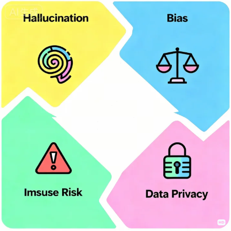

# 第21课时：模型风险、合规与伦理 (Risk, Compliance & Ethics)
## 1. 模型风险、合规与伦理原则
在深入理解预训练与微调原理之后，我们也需要了解 AI 模型背后的风险与合规要求，这是负责任地使用与部署大模型的关键。
### 1.1 模型风险概念

当我们谈论大模型的强大能力时，也必须承认——能力越大，责任越大。

预训练和微调让模型学会了语言、逻辑和对话，但与此同时，也带来了新的风险。

这些风险并非源自恶意设计，而是模型在学习过程中**不可避免的副产物**。

理解它们，是我们成为负责任开发者的第一步。

#### 🌀 模型幻觉（Hallucination）

幻觉指的是模型生成了看似合理、却不真实的内容。

例如，当你问模型“爱因斯坦是哪一年得的诺贝尔文学奖”，它可能会一本正经地回答“1921 年”，尽管那根本不存在。

这类错误往往源于：

* 模型在训练数据中“拼凑”出似是而非的模式；
* 缺乏事实核验机制；
* 过度自信地补全缺失信息。

幻觉是生成式模型的通病。

目前的解决思路包括检索增强（RAG）、事实约束生成、以及后验验证机制等。

简单来说，就是让模型“查证后再回答”。

#### ⚖️ 偏见（Bias）

偏见来自训练数据的不平衡。

如果模型学习到的数据中，某些性别、地区或群体出现得更频繁，

它就可能在回答时反映出类似的倾向，甚至放大这些偏差。

例如：

* 生成的职业示例中，“护士”更容易对应女性；
* 面试文本中，“领导”更容易对应男性。

这些隐性偏见可能在现实应用中造成歧视性结果。

因此，开发者需要在数据收集与评估环节引入公平性审查与偏差检测机制。

#### 🚫 滥用风险（Misuse Risk）

模型本身没有“恶意”，但它可能被用在不当场景中。

例如：

* 生成虚假新闻或诈骗信息；
* 编写恶意代码或攻击脚本；
* 侵犯他人隐私或知识产权。

防范滥用风险的关键是使用约束：

* 在接口层面加入敏感词过滤与行为限制；
* 明确服务条款与合规边界；
* 为安全场景预设“拒答机制”。

让模型知道“哪些问题不能答”，往往比“回答得更聪明”更重要。

#### 🔒 数据隐私风险（Data Privacy Risk）

最后一个重要风险，是隐私泄露。

如果预训练语料中包含个人信息、公司机密或版权内容，

模型可能在生成时“复述”出这些隐私片段。

典型例子包括：

* 模型生成了真实邮箱、身份证号、聊天记录；
* 训练语料中混入了受版权保护的书籍或文章。

防范这类风险的核心在于数据治理：

* 在训练前对语料进行脱敏与清洗；
* 在部署后监控输出内容；
* 建立可追溯的数据使用链路。

### 1.2 合规与政策框架

理解风险只是第一步，更关键的是：**如何合规地开发与使用大模型**。

随着生成式 AI 技术的快速普及，全球各国都在尝试用政策和制度，

为这项强大的技术划出清晰的“安全边界”。

这一节，我们从政策、数据合规和模型审查三个角度来看看这条底线在哪里。

#### 🌐​ 国内外 AI 监管政策概览

过去几年，AI 的治理从“倡议”逐步走向“立法”。

在中国，《生成式人工智能服务管理暂行办法》 已于 2023 年正式实施，

它明确提出了三项核心原则：

* 模型输出要符合社会主义核心价值观；
* 不得生成虚假、违法或侵权内容；
* 训练数据来源应合法、正当、必要，并遵守个人信息保护要求。

简单来说，就是——

>“数据要干净，输出要安全，责任要明确。”

而在国际范围：

* 欧盟的《AI Act》（人工智能法案）是目前最完整的监管框架，按风险等级对不同 AI 应用分层监管，高风险模型必须通过严格审查与透明披露。
* 美国则以行业指导和标准为主，强调企业的自我合规与责任机制；
* 日本、韩国 等国家则更多依靠道德准则和行业共识，鼓励“可信 AI”发展。

这些政策虽然表述不同，但目标一致：

>让 AI 的创新不偏离安全与社会价值的轨道。

#### 🧾 数据合规要求：从源头守住红线

大模型训练离不开海量数据，但并非“有数据就能用”。

合规的数据使用，必须满足以下三点：

* 版权合法：不能直接使用受版权保护的书籍、论文、图片等内容；
* 隐私合规：需去除个人敏感信息（如姓名、身份证号、通讯信息）；
* 敏感内容过滤：不得包含暴力、色情、歧视、政治敏感或违法内容。

在实际项目中，常见做法包括：

* 对数据源进行许可审查（license check）；
* 使用开源可商用数据集（如 CC-BY 或 Apache 协议）；
* 在清洗阶段加入正则过滤与人工抽检机制。

一句话总结：

>“数据进模型前，必须过一遍‘法律洗’。”

#### 🧰​ 模型部署前的安全审查与内容过滤

即便训练过程合规，模型在上线部署前仍需经过安全检测。

这一环节的目标，是确保模型输出不会违反法律或伦理。

常见措施包括：

* 内容过滤系统：自动检测输出文本中的敏感词、政治信息或违法内容；
* 人工复核机制：对高风险领域（如医疗、金融）进行专家审核；
* 安全测试集评估：通过红队（Red Team）测试发现潜在问题；
* 输出追踪机制：记录模型回答日志，便于事后溯源。

在国内的监管语境中，这被称为 “算法备案与安全评估”。只有通过评估的模型，才能在公众场景中正式提供服务。

### 1.3 伦理与负责任 AI 原则

伦理，不是束缚，而是方向。

技术的边界，永远不是算力或算法，而是人。

当大模型从实验室走向社会，它的每一次输出，都可能影响真实世界中的人和决策。

因此，“负责任地开发与使用 AI”，不只是政策要求，更是技术发展的底线。

#### 🛡️ 三大伦理原则：安全、公平、可解释

**① 安全（Safety）**

安全是第一原则。

模型的输出不能造成伤害、误导或不当使用。

这不仅包括防止生成暴力、歧视、违法内容，还包括减少“幻觉”、限制错误传播。

从工程角度，安全意味着要在训练、部署、交互全流程中建立防护机制。

**② 公平（Fairness）**

公平意味着模型的行为不应因性别、种族、地区等特征而表现出偏见。

但在现实中，数据往往是不平衡的。

因此，“让 AI 公平”更像是一种持续的工程任务：

* 设计平衡的数据采样策略；
* 在评估阶段监测偏差；
* 在发布前进行公平性测试。

换句话说，公平不是天生的，而是要被训练出来的。

**③ 可解释（Explainability）**

AI 决策不应是黑箱。

可解释性要求我们能追溯模型的行为逻辑，回答“为什么会这样回答”。

这在医疗、法律、金融等高风险领域尤其重要。

目前常见的方式包括：

* 通过注意力可视化展示模型关注的重点；
* 使用可解释评估指标判断决策依据；
* 在输出层加入人类可读的推理说明。

#### 🔍 在开发中贯彻“可控与透明”

“可控”意味着模型的行为应当**可预测、可干预**；

“透明”则要求模型的训练、评估和使用过程对外部可理解。

从实践上看，可以通过以下方式落实：

* 记录模型版本与数据来源：确保结果可追溯；
* 开放模型文档与评测结果：让使用者清楚模型能力与局限；
* 设计人工审核环节：在高风险应用中引入人机共管机制；
* 提供拒答与反馈通道：让用户参与模型安全改进。

可控与透明不是“限制”，

而是让技术从“技术黑箱”变成“社会工具”的关键一步。

#### 👩‍💻 研究者与开发者的责任边界

在 AI 产业链中，责任并非一人独担。

* 研究者的责任是：确保方法论合理、数据来源合法、结论可靠；
* 开发者的责任是：在落地时保证安全合规、避免误用与扩散风险；

平台方与监管者 的责任是：建立制度与标准，明确问责边界。

简而言之：

>研究者守真相，开发者守底线，平台守规则。

这三者共同构成了“负责任 AI”生态的基石。

---

