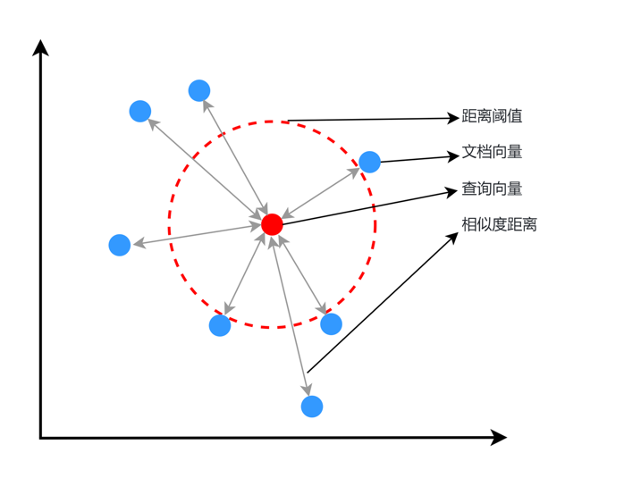

# 第24课时：Embedding 模型微调与实战

在 RAG（检索增强生成）系统中，**检索质量直接决定最终答案的准确性**。  
而检索的核心，是 **Embedding 模型**——它负责将文本转化为向量，让“语义相似”变成“向量相近”。

> 💡 然而，**通用 Embedding 模型**（如 BGE、text-embedding-ada-002）  
> - 在医疗领域，把“心肌梗死”和“心肌炎”视为相似（因都含“心肌”）；  
> - 在金融领域，无法区分“EBITDA”和“净利润”；  
> - 在法律领域，混淆“违约”与“侵权”。

> ✅ **解决方案**：**微调 Embedding 模型**，使其在你的领域中“真正理解”语义。

本课将从**零基础原理出发**，手把手教你：
1. **核心原理**：Bi-encoder 架构 + 对比学习（InfoNCE 损失）；
2. **数据构建**：如何挖掘高质量的正负样本对，尤其是**难负样本**（Hard Negatives）；
3. **实战**：构建数据、微调模型、评估 MTEB 指标。

用**通俗语言 + 公式 + 工业界案例**，让你掌握 Embedding 微调的完整闭环。

---

## 1. 为什么需要微调 Embedding 模型？

### 1.1 领域知识适配性缺陷

通用大模型（如DeepSeek-R1、GPT-4、Claude-3）在开放域知识理解上展现较强能力，但面对垂直领域时表现显著下降：

但“语义相似”在不同领域含义不同：

| 领域 | 查询 | 通用模型返回（错误） | 领域正确答案 |
|------|------|----------------------|--------------|
| 医疗 | “心肌梗死的治疗” | “心肌炎的治疗” | “急性心梗的 PCI 治疗” |
| 金融 | “如何计算 EBITDA？” | “EBITDA 是什么？” | “EBITDA = 净利润 + 利息 + 税 + 折旧 + 摊销” |
| 法律 | “合同违约赔偿” | “侵权责任赔偿” | “《民法典》第584条：违约损害赔偿” |

> ⚠️ **根本原因**：通用模型未学习**领域特有的语义边界**。

### 1.2 微调的目标：对齐任务语义空间

微调的目标是让 Embedding 模型满足：
$$
\text{sim}(E(q), E(d^+)) \gg \text{sim}(E(q), E(d^-))
$$
其中：
- $q$：用户查询；
- $d^+$：与 $q$ **任务相关**的正样本（如正确答案、支持文档）；
- $d^-$：与 $q$ **任务无关**的负样本（如错误答案、干扰文档）。



---

## 2. 核心原理：Bi-encoder 与对比学习

### 2.1 Bi-encoder 架构：高效双塔模型

Embedding 模型通常采用 **Bi-encoder**（双编码器）架构：

- **Query Encoder**：$E_q(\cdot)$，将查询 $q$ 编码为向量 $u = E_q(q)$；
- **Document Encoder**：$E_d(\cdot)$，将文档 $d$ 编码为向量 $v = E_d(d)$；
- **相似度计算**：余弦相似度
  $$
  \text{sim}(q, d) = \frac{u^\top v}{\|u\| \|v\|}
  $$

> ✅ **优势**：
> - **推理高效**：文档向量可**离线预计算**，检索时只需编码查询；
> - **可扩展**：支持亿级文档库（向量数据库）。

> ❌ **劣势**：  
> - Query 与 Doc **无交互**，无法建模细粒度对齐（此为 Reranker 的任务）。

### 2.2 对比学习：InfoNCE 损失函数

对比学习的核心思想：**拉近正样本，推开负样本**。

#### 2.2.1 样本对定义
- **正样本对**：$(q, d^+)$，如（“心梗治疗”, “阿司匹林用于急性心梗”）
- **负样本对**：$(q, d^-)$，如（“心梗治疗”, “糖尿病饮食建议”）

在 embedding 学习中，我们的目标是让：
* 语义相似的样本（正样本对，positive pair）在向量空间中更靠近。
* 语义无关或相反的样本（负样本对，negative pair）距离更远。

#### 2.2.2 InfoNCE 损失公式

对一个查询 $q$，设其正样本为 $d^+$，负样本集合为 $\{d_1^-, ..., d_{n}^-\}$，则 InfoNCE 损失为：
$$
\mathcal{L}_{\text{InfoNCE}} = -\log \frac{\exp(\text{sim}(q, d^+)/\tau)}{\exp(\text{sim}(q, d^+)/\tau) + \sum_{i=1}^{n} \exp(\text{sim}(q, d_i^-)/\tau)}
$$
其中：
- $\tau$：温度系数（通常 0.01–0.1），控制分布 sharpness；
- 分母为**所有样本**（正+负）的 softmax 归一化项。

> 🧠 **直观理解**：  
> - 若正样本相似度高、负样本相似度低 → 损失小；  
> - 若模型混淆正负 → 损失大 → 梯度反向传播 → 调整 encoder。

#### 2.2.3 多正样本扩展

实际中，一个查询可能有多个正样本 $\{d_1^+, ..., d_m^+\}$，损失可扩展为：
$$
\mathcal{L} = -\log \frac{\sum_{j=1}^m \exp(\text{sim}(q, d_j^+)/\tau)}{\sum_{j=1}^m \exp(\text{sim}(q, d_j^+)/\tau) + \sum_{i=1}^{n} \exp(\text{sim}(q, d_i^-)/\tau)}
$$

---

## 3. Embedding 数据集构建：正负样本的精细化挖掘

Embedding 微调效果的**上限由训练数据质量决定**。尤其关键的是**负样本的构建策略**。

### 3.1 正样本（Positive Pairs）构建

正样本必须满足：**语义强相关**，且**可作为任务答案的依据**。

#### 构建方法：
| 来源 | 方法 | 示例 |
|------|------|------|
| **问答对** | (问题, 答案) | (“心梗治疗”, “阿司匹林...”) |
| **标题-正文** | (标题, 段落) | (“EBITDA计算”, “EBITDA=...”) |
| **文档分块 + 摘要** | (摘要, 原文块) | (“心梗抗血小板”, “阿司匹林用于...”) |
| **指令-响应对** | (“解释XX”, “XX是指...”) | 基于 SFT 数据构造 |

> ✅ **正样本质量准则**：
> - 语义等价、强支持、无歧义；
> - 长度适中（20–200 词），避免过长稀释信号；
> - 避免模板化（如“答案是：...”）。

### 3.2 负样本（Negative Pairs）构建
负样本的作用是提供一个对比参照，让模型知道“哪些是不该靠近的”。例如当我们的query为“ChatGPT是什么？”的时候，我们的正样本的doc为“ChatGPT 是由 OpenAI 开发的语言模型，基于 Transformer 架构……”，我们的负样本的doc可以设置为“Midjourney 是一个 AI 图像生成模型……”。


负样本决定模型能否**精细区分语义边界**。分两类：

#### 3.2.1 随机负样本（Random Negatives）

- **来源**：同一批次中其他样本的文档（In-batch negatives）；
- **优点**：无需额外数据，训练效率高；
- **缺点**：太“简单”，模型学不到精细区分能力。

> ⚠️ **局限性**：  
> 模型可能只学会区分“完全无关” vs “相关”，但无法处理“似是而非”的干扰项。

#### 3.2.2 难负样本（Hard Negatives）——微调效果的关键！

> 💡 **关键洞察**：  
> 模型在部署时，最难区分的不是“完全无关”文档，而是**看似相关但实际错误**的文档。

**定义**：  
难负样本 $d^-$ 满足：
- $\text{通用语义相似度}(q, d^-)$ 较高；
- 但 $\text{任务相关性}(q, d^-) = 0$。

> 📌 **例**：
> - 查询：“心肌梗死的治疗”  
> - 难负样本：“心肌炎的治疗方案”（含“心肌”，但疾病不同）  
> - 简单负样本：“糖尿病饮食建议”（完全无关）

#### 3.2.3 正负样本数据处理
这里我们使用金融问答数据集：[virattt/financial-qa-10K](https://huggingface.co/datasets/virattt/financial-qa-10K)来进行演示：


数据处理流程：
1. 加载原始数据集
2. 生成负样本（每个样本10个负例）
3. 创建训练集/评测集分割（9:1比例）
4. 构建知识库文件

主要代码实现如下所示：
```python
def build_dataset_corpus(instruction: str, neg_num: int = 10, test_size: float = 0.1, seed: int = 1314) -> tuple:
    """Process dataset and create training/evaluation files.

    Args:
        instruction (str): Instruction template for prompts
        neg_num (int): Number of negative samples per instance
        test_size (float): Proportion of data for test split
        seed (int): Random seed for reproducibility

    Returns:
        tuple: Paths to training data, evaluation data, and knowledge base directory
    """
    # Load and preprocess dataset
    ds = load_dataset("virattt/financial-qa-10K", split="train")
    ds = ds.select_columns(column_names=["question", "context"])
    ds = ds.rename_columns({"question": "query", "context": "pos"})

    # Generate negative samples
    np.random.seed(seed)
    new_col = []
    for i in range(len(ds)):
        ids = np.random.randint(0, len(ds), size=neg_num)
        while i in ids:  # Ensure no self-match in negatives
            ids = np.random.randint(0, len(ds), size=neg_num)
        neg = [ds[int(i)]["pos"] for i in ids]
        new_col.append(neg)

    # Create dataset splits
    ds = ds.add_column("neg", new_col)

    def str_to_lst(data):
        data["pos"] = [data["pos"]]
        return data
    ds = ds.map(str_to_lst)  # Convert pos to list format
    ds = ds.add_column("prompt", [instruction] * len(ds))
    split = ds.train_test_split(test_size=test_size, shuffle=True, seed=seed)

    # Save training data
    train_data_path = build_data_path('dataset', 'train.json')
    split["train"].to_json(train_data_path)

    # Process and save evaluation data
    test = split["test"].select_columns(["query", "pos"]).rename_column("pos", "corpus")
    eval_data_path = build_data_path('dataset', 'eval.json')
    test.to_json(eval_data_path)

    # Create knowledge base
    kb_data_path = build_data_path('KB', 'knowledge_base.txt')
    corpus = "\n".join([''.join(item) for item in test['corpus']])
    with open(kb_data_path, 'w', encoding='utf-8') as f:
        f.write(corpus)

    return train_data_path, eval_data_path, os.path.dirname(kb_data_path)
```

经过处理后，训练集的一条数据如下（json文件）：
```python
{"query":"What was the total stockholder's equity (deficit) for Peloton Interactive, Inc. as of June 30, 2021?","pos":["As of June 30, 2021, Peloton Interactive, Inc.'s consolidated statements reflected a total stockholder's equity (deficit) of $1,754.1 million."],"neg":["In June 2023, the company entered into an ASR agreement to repurchase $500 million of its common stock with a completion date no later than August 2023, and in 2024, the company expects to repurchase $2.0 billion of its common stock.",...,"\u2022Overhead costs as a percentage of net sales increased 40 basis points due to wage inflation and other cost increases, partially offset by the positive scale impacts of the net sales increase and productivity savings."],"prompt":"Represent this sentence for searching relevant passages: "}
```
需要包含如下字段：
* `query`: （str）用户提问
* `pos`：（List[str]）正确答案段落
* `neg`：（List[str]）随机采样的负样本
* `prompt`: （str）指令模板

评测集的一条数据如下（json文件）：
```python
{"query":"How have certain vendors been impacted in the supply chain financing market?","corpus":["Certain vendors have been impacted by volatility in the supply chain financing market."]}
```
需要包含如下字段：
* `query`: 用户提问
* `corpus`: 对应提问的正确文本片段

知识库局部如下（txt文件）：
```bash
Certain vendors have been impacted by volatility in the supply chain financing market.
Recruitment As the demand for global technical talent continues to be competitive, we have grown our technical workforce and have been successful in attracting top talent to NVIDIA. We have attracted strong talent globally with our differentiated hiring strategies for university, professional, executive and diverse recruits. The COVID-19 pandemic created expanded hiring opportunities in new geographies and provided increased  flexibility for employees to work from locations of their choice. Our workforce is about 80% technical and about 50% hold advanced degrees.
In 2023, Moody’s Investors Service upgraded AbbVie’s senior unsecured long-term credit rating to A3 with a stable outlook from Baa1 with a positive outlook.
```


#### 3.2.4 难负样本的挑战与应对

- **噪声问题**：自动挖掘可能引入错误负样本 → 解决：人工抽检、置信度过滤；
- **分布偏移**：训练用负样本 vs 线上负样本不一致 → 解决：定期用新日志更新负样本库；
- **过拟合风险**：模型记住特定负样本 → 解决：每轮训练动态采样新负样本。

---

## 4. LazyLLM 实战：微调 Embedding 模型

> 📌 **说明**：LazyLLM 是一个支持 LLM 应用开发的框架，提供数据处理、微调、评估一体化 pipeline。

### 4.1 步骤 1：准备文本对数据

构建 JSONL 格式数据集 `train.jsonl`：
```json
{"query": "心肌梗死的典型心电图表现是什么？", "pos": ["ST段弓背向上抬高...", "病理性Q波出现..."], "neg": ["心肌炎心电图可见ST-T改变...", "房颤心电图表现为P波消失..."]}
{"query": "如何计算EBITDA？", "pos": ["EBITDA = 净利润 + 利息 + 税 + 折旧 + 摊销"], "neg": ["净利润 = 收入 - 成本 - 税", "现金流 = 经营活动现金流 + 投资活动现金流"]}
```

> ✅ **建议**：
> - 每 query 至少 1 个 pos，3–10 个 neg；
> - neg 中 50% 为难负样本，50% 为 in-batch。

### 4.2 步骤 2：微调 Embedding 模型

使用 LazyLLM 微调：

```python
embed = lazyllm.TrainableModule(embed_path)\
    .mode('finetune').trainset(train_data_path)\
    .finetune_method((
        lazyllm.finetune.flagembedding,
        {
            'launcher': lazyllm.launchers.remote(nnode=1, nproc=1, ngpus=4),
            'per_device_train_batch_size': 16,
            'num_train_epochs': 2,
        }
    ))
    
docs = Document(kb_path, embed=embed, manager=False)
docs.create_node_group(name='split_sent', transform=lambda s: s.split('\n'))
retriever = lazyllm.Retriever(doc=docs, group_name="split_sent", similarity="cosine", topk=1)
retriever.update()
```
其中：
* `embed_path`: 用于指定微调的模型；
* `train_data_path`：用于训练的数据集路径；
* `lazyllm.finetune.flagembedding`: 指定微调的框架；

关键参数：
* `ngpus=4`: 使用4张GPU进行并行训练
* `per_device_batch_size=16`: 每GPU批处理大小
* `num_train_epochs=2`: 训练2个epoch

值得注意的是，这里的代码我们不仅给了embed的微调配置参数，同时后面还将其放入到了Document中，Document注册了一个按照换行符来分割知识库文档的策略，最后还配置了Retriever作用在文档及其对应的切分方式上，并以余弦相似度作为度量工具，同时让只返回最相关的一个文本段（topk=1）。因为LazyLLM是支持一键微调、部署和推理的，所以当执行`update()`后，LazyLLM会先对embed模型进行微调，然后将微调后的模型部署起来，为Document和Retriever提供向量化。
> ✅ **技巧**：
> - batch size 越大，负样本越多，效果越好（显存允许下）；
> - 学习率：2e-5，epochs：3–5。

### 4.3 步骤  效果评测

这里我们使用上下文召回率和上下文相关度来评测我们微调后的模型，作为对照，这里我们采用bge-large-zh-v1.5来作为基模型，对照其微调前后的两个指标下的变化。

#### 评价指标的调用如下所示：
```python
from lazyllm.tools.eval import NonLLMContextRecall, ContextRelevance

def evaluate_results(data: list) -> tuple:
    """Evaluate retrieval results using multiple metrics.

    Args:
        data (list): List of retrieval results to evaluate

    Returns:
        tuple: Evaluation scores (context recall, context relevance)
    """
    recall_eval = NonLLMContextRecall(binary=False)
    relevance_eval = ContextRelevance()
    return recall_eval(data), relevance_eval(data)
```

#### 微调、部署和推理的逻辑主要如下：
```python
# Prepare dataset
train_data_path, eval_data_path, kb_path = build_dataset_corpus(
    instruction=args.instruction,
    neg_num=args.neg_num,
    test_size=args.test_size,
    seed=args.seed
)
# Deploy retrieval service
retriever = deploy_serve(
    kb_path=kb_path,
    embed_path=args.embed_path,
    train_data_path=train_data_path,
    train_flag=args.train_flag,
    per_device_batch_size=args.per_device_batch_size,
    num_epochs=args.num_epochs,
    ngpus=args.ngpus
)
# Run SFT or Evaluation
results = []
query_corpus = load_json(eval_data_path)
for item in tqdm(query_corpus, desc="Processing queries"):
    query = item['query']
    inputs = f"{args.instruction}{query}" if args.use_instruction or args.train_flag else query
    retrieved = retriever(inputs)
    results.append({
        'question': query,
        'context_retrieved': [text.get_text() for text in retrieved],
        'context_reference': item['corpus']
    })

# Save and report results
save_json(results, args.output_path)
recall_score, relevance_score = evaluate_results(results)
print(f"Evaluation Complete!\nContext Recall: {recall_score}\nContext Relevance: {relevance_score}")
```

基于上面的逻辑，我们获得如下结果：

|             | **微调前**​**bge-large-zh-v1.5** | **微调后**​**bge-large-zh-v1.5** |
| -------------- | ----------------------------------------------- | ----------------------------------------------- |
| 上下文召回率 | 78.28                                         | 88.57                                         |
| 上下文相关度 | 75.71                                         | 86.57                                         |


可以看到，在微调后，两个指标都得到了显著的提升。说明微调是有效的！整体的评估流程为：加载评测集 → 使用检索服务（微调后部署起来的服务）→ 执行批量推理 → 计算双指标。


#### 在RAG中使用微调好的Embedding模型：
```python
import os
import lazyllm

prompt = ('You will act as an AI question-answering assistant and complete a dialogue task.'
          'In this task, you need to provide your answers based on the given context and questions.')

embed = lazyllm.TrainableModule('bge-large-zh-v1.5', 'path/to/sft/bge')

documents = lazyllm.Document(dataset_path=os.path.join(os.getcwd(), "KB"), embed=embed, manager=False)
documents.create_node_group(name='split_sent', transform=lambda s: s.split('\n'))
with lazyllm.pipeline() as ppl:
    ppl.retriever = lazyllm.Retriever(
        doc=documents, group_name="split_sent", similarity="cosine", topk=1, output_format='content', join='')
    ppl.formatter = (lambda nodes, query: dict(context_str=nodes, query=query)) | lazyllm.bind(query=ppl.input)
    ppl.llm = lazyllm.OnlineChatModule(source="sensenova")\
        .prompt(lazyllm.ChatPrompter(instruction=prompt, extra_keys=['context_str']))

ppl.start()
```
---

## 5. 业界广泛使用的技术与模型

| 组件 | 主流方案 | 说明 |
|------|----------|------|
| **基础模型** | BGE-v1.5（BAAI）<br>Voyage<br>text-embedding-3 | 开源/商用 SOTA |
| **微调框架** | Sentence-Transformers<br>FlagEmbedding（BGE 官方） | 支持 InfoNCE、难负样本 |
| **评估** | MTEB<br>BEIR | 标准化 Benchmark |
| **部署** | ONNX Runtime<br>TensorRT | 加速推理 |
| **RAG 集成** | LlamaIndex<br>Haystack<br>LangChain | 支持自定义 Embedding |

> 🌟 **案例**：
> - **Notion AI**：微调 BGE 用于企业文档搜索；
> - **Amazon Kendra**：结合领域 Embedding + 精排；
> - **阿里云百炼**：支持用户上传数据微调 Embedding。

---

## 6. 总结：Embedding 微调的核心原理链

| 步骤 | 目标 | 关键技术 | 原理支撑 |
|------|------|----------|----------|
| **数据构建** | 获取高质量正负样本 | 难负样本挖掘 | 任务相关性 ≠ 通用语义 |
| **模型架构** | 高效双塔编码 | Bi-encoder | 向量相似度 ≈ 任务相关性 |
| **训练目标** | 拉近正样本，推开负样本 | InfoNCE 损失 | 对比学习 |
| **评估** | 量化检索效果 | MRR@10, NDCG@10 | 排序质量指标 |

> 🌟 **记住**：  
> **难负样本是微调效果的关键**，  
> **对比学习是让模型“学会区分”的核心**，  
> **MTEB 是验证你是否成功的标尺**。

> 下一课，我们将学习**Reranker 模型微调**——  
> 如何在 RAG 中进一步提升排序精度？