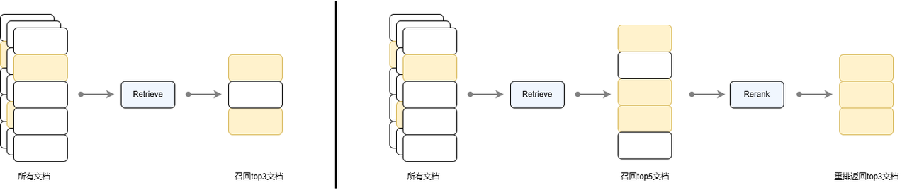

# 第25课时：Reranker 模型微调与实战

在 RAG（检索增强生成）系统中，**Retriever 模型负责初筛**（召回），  
但初筛结果往往包含大量“似是而非”的干扰项——  
例如，查询“心肌梗死的治疗”，检索返回“心肌炎治疗”“心力衰竭管理”“PCI手术流程”等。

> ✅ **Reranker**（重排序模型）正是解决这一问题的**精排利器**。  
> 它能对初筛结果进行**精细化相关性打分**，将真正相关的文档排到最前面。

本课将从**零基础原理出发**，系统讲解：
1. **核心原理**：Cross-encoder 架构 vs Bi-encoder，相关性打分机制，计算开销分析；
2. **数据构建**：如何利用 LLM 蒸馏生成高质量排序数据，Pairwise 与 Listwise 格式的区别；
3. **微调与实战**：微调 BGE-Reranker，并集成到 RAG 系统。

用**通俗语言 + 公式 + 工业界案例**，让你掌握 Reranker 从理论到落地的完整能力。

---

## 1. Reranker 的核心原理：Cross-encoder 如何弥合语义鸿沟

### 1.1 Cross-encoder 的交互机制

Reranker 采用 **Cross-encoder** 架构，其核心是将 Query 和 Document **拼接后联合输入 Transformer**：
$$
\text{input} = [\text{[CLS]} \, q \, \text{[SEP]} \, d \, \text{[SEP]}]
$$

模型通过 **全注意力机制**（Full Self-Attention）建模所有 token 之间的交互关系。

> ✅ **关键能力**：
> - 注意力头可聚焦于“心肌梗死” vs “心肌炎”的**差异词**；
> - 识别“不用于”是否定信号；
> - 建立“阿司匹林 → 抗血小板 → 心梗治疗”的**推理链**。

### 1.2 相关性打分的数学形式

Cross-encoder 输出一个标量分数：
$$
\text{score}(q, d) = W^\top h_{\text{[CLS]}} + b
$$
其中 $h_{\text{[CLS]}}$ 是 [CLS] token 的最终隐藏状态，$W, b$ 为可学习参数。

> 📌 **训练目标**：让相关文档得分显著高于不相关文档：
> $$
> \text{score}(q, d^+) - \text{score}(q, d^-) > \text{margin}
> $$

### 1.3 为什么 Cross-encoder 更有效？——信息论视角

设真实相关性为 $r^* \in \{0, 1\}$，模型估计为 $\hat{r} = \sigma(\text{score}(q, d))$。

- **Bi-encoder 的信息瓶颈**：  
  Query 和 Doc 独立编码 → 信息通道受限 → 无法恢复细粒度语义对齐。

- **Cross-encoder 的信息通道**：  
  联合编码 → 全连接注意力 → 信息通道容量大 → 能保留更多判别性特征。

从互信息角度看：
$$
I(r^*; \text{score}_{\text{cross}}) \gg I(r^*; \text{sim}_{\text{bi}})
$$
即：Cross-encoder 的输出与真实相关性具有更高的互信息。

> ✅ **实证结果**（BEIR benchmark）：
> - Bi-encoder（BGE-large）：MRR@10 ≈ 0.62  
> - + Cross-encoder（BGE-reranker）：MRR@10 ≈ **0.85**（+37%）

---

## 2. Reranker 在 RAG 流程中的作用：精排而非召回

Reranker 召回重排策略被广泛应用在搜索引擎、推荐系统、问答系统等任务中，其基本思想是：在初步检索后，通过一个额外的模型对检索结果进行再次排序以提高最终的效果。下图对比了直接使用检索器召回 top 3 文档和先通过检索器召回 top 5 文档再对其进行重排序返回 top 3 文档的流程。可见检索流程并没有对文档进行排序，只是将满足需求的 top 5 个文档返回，而通过重排序流程，可以对其进行更精细的排序，得到排序后的文档，使得更重要的文档在返回列表中更靠前。

### 2.1 两阶段流程

1. **召回阶段**（Recall）：
   - Bi-encoder 检索 top-100 文档；
   - 目标：高召回率（Recall@100 > 90%）；
   - 优势：高效（Doc 向量可预计算）。

2. **精排阶段**（Rerank）：
   - Cross-encoder 对 top-100 重排序；
   - 目标：高精度排序（MRR@10 最大化）；
   - 输出：取 top-5 送入 LLM 生成。

> 📌 **分工明确**：
> - Bi-encoder 负责“广撒网”；
> - Reranker 负责“精挑细选”。

### 2.2 计算开销与性能权衡

| 模块 | 时间复杂度 | 显存 | 适用阶段 |
|------|-------------|------|----------|
| Bi-encoder | $O(1)$（Doc 预计算） | 低 | 召回 |
| Cross-encoder | $O(k \cdot L^2)$ | 高 | 精排（$k \leq 100$） |

> ✅ **工业实践**：
> - 限制 $k=50$～100，平衡精度与延迟；
> - 使用小模型（如 `bge-reranker-base`）或 ONNX 加速；
> - 仅对高价值请求启用 Reranker。

---

## 3. Reranker 数据集构建：从 LLM 蒸馏到排序格式

Reranker 需要**相关性标签**（relevant / not relevant）或**排序标签**（rank 1, 2, 3...）。

### 3.1 利用 LLM 蒸馏生成数据（主流方法）

由于人工标注成本高，工业界广泛采用 **LLM 蒸馏**（LLM Distillation）生成训练数据：

#### 流程：
1. 从知识库中采样文档 $d$；
2. 用 LLM 生成相关查询 $q$：
   ```
   请基于以下文档生成一个用户可能提出的问题：
   文档：{d}
   问题：
   ```
3. 对每个 $q$，用 Embedding 检索 top-$n$ 文档 $\{d_1, ..., d_n\}$；
4. 用 LLM 判断每个 $(q, d_i)$ 的相关性：
   ```
   问题：{q}
   文档：{d_i}
   该文档是否直接回答了问题？（是/否）
   ```

> ✅ **优势**：
> - 自动生成海量高质量样本；
> - LLM 能理解复杂语义，标注准确率 >90%。

> 🌟 **业界案例**：
> - **Cohere**：用 GPT-4 蒸馏生成 reranker 训练数据；
> - **BGE 团队**：开源 `BAAI/LLM-Reranker-Distill` 数据集。

### 3.2 Pairwise vs Listwise 数据格式

#### 3.2.1 Pairwise（成对比较）

- **格式**：$(q, d^+, d^-)$，表示 $d^+$ 比 $d^-$ 更相关；
- **损失函数**：**Pairwise Hinge Loss**
  $$
  \mathcal{L} = \max(0, \text{margin} - [\text{score}(q, d^+) - \text{score}(q, d^-)])
  $$
- **优点**：标注简单，训练稳定。

#### 3.2.2 Listwise（列表级排序）

- **格式**：$(q, [d_1, ..., d_n], [r_1, ..., r_n])$，$r_i$ 为相关性等级；
- **损失函数**：**ListNet**
  - 真实分布：$P_{\text{true}}(d_i) = \frac{2^{r_i} - 1}{\sum_j (2^{r_j} - 1)}$
  - 模型分布：$P_{\text{model}}(d_i) = \frac{\exp(\text{score}(q, d_i))}{\sum_j \exp(\text{score}(q, d_j))}$
  - 损失 = 交叉熵：$\mathcal{L} = -\sum_i P_{\text{true}}(d_i) \log P_{\text{model}}(d_i)$
- **优点**：建模全局排序，效果更好。

> ✅ **工业选择**：  
> - **Pairwise 更常用**（简单有效）；  
> - **Listwise 用于高精度场景**（如搜索引擎）。

---

## 4. 微调与实战：微调 BGE-Reranker

LazyLLM 提供了 Reranker 组件进行重排序，分别提供了在线和离线两种重排序模型的调用途径，其中在线模型通过OnlineEmbeddingModule(type="rerank") 进行调用，离线重排模型则仍然通过 TrainableModule 进行调用。使用 Reranker 时的可调整参数有：
* name (str, default: 'ModuleReranker' ) ： 实现重排序时必须为 ModuleReranker
* model（Union[Callable, str]) ： 实现重排序的具体模型名称或可调用对象
  * Callable 情形：
    * OnlineEmbeddingModule (type="rerank")：目前支持qwen和glm的在线重排序模型，使用前需要指定 apikey
    * TrainableModule(model="str")：需要传入本地模型名称，常用的开源重排序模型为bge-reranker系列
  * str 情形：模型名称，与上 Callable 情形 TrainableModule 对应的 model 参数要求相同
* topk（int）： 最终需要返回的 k 个节点数
* output\_format（str, default: None）：输出格式，默认为None，可选值有 'content' 和 'dict'，其中 content 对应输出格式为字符串，dict 对应字典
* join（boolean, default: False）：是否联合输出的 k 个节点，当输出格式为 content 时，如果设置该值为 True，则输出一个长字符串，如果设置为 False 则输出一个字符串列表，其中每个字符串对应每个节点的文本内容。


```python
from lazyllm import OnlineEmbeddingModule, TrainableModule
# 如果您要使用在线重排模型
# 目前 LazyLLM 支持 qwen和glm 在线重排模型，使用前请指定相应的 API key。
online_rerank = OnlineEmbeddingModule(type="rerank")
reranker = Reranker('ModuleReranker', model=online_rerank, topk=3)

# 启动本地重排序模型
offline_rerank = TrainableModule('bge-reranker-large').start()
reranker = Reranker('ModuleReranker', model=offline_rerank, topk=3)
# 或者直接传入模型名称使用本地重排序模型
reranker = Reranker('ModuleReranker', model='bge-reranker-large', topk=3)
```
下面我们实现一个例子，对上述 cosine 和 bm25 检索的 6 条结果取精排后的 top 2 文档。

```python
from lazyllm import Document, Retriever, Reranker, TrainableModule

# 定义嵌入模型和重排序模型
embedding_model = TrainableModule('bge-large-zh-v1.5').start()
offline_rerank = TrainableModule('bge-reranker-large').start()

docs = Document("/path/to/your/document", embed=embedding_model)
docs.create_node_group(name='block', transform=(lambda d: d.split('\n')))

# 定义检索器
retriever = Retriever(docs, group_name="block", similarity="cosine", topk=3)

# 定义重排器
# 指定 reranker1 的输出为字典，包含 content, embedding 和 metadata 关键字
# reranker = Reranker('ModuleReranker', model=online_rerank, topk=3, output_format='dict')
# 指定 reranker2 的输出为字符串，并进行串联，未进行串联时输出为字符串列表
reranker = Reranker('ModuleReranker', model=offline_rerank, topk=3, output_format='content', join=True)

# 执行推理
query = "猴面包树有哪些功效？"
result1 = retriever(query=query)
result2 = reranker(result1, query=query)

print("余弦相似度召回结果：")
print("\n\n".join([res.get_content() for res in result1]))
print("开源重排序模型结果：")
print(result2)
```
下表是针对查询“猴面包树有哪些功效？”的召回结果，注意到余弦相似度召回结果（第一列）的顺序并不包含相似度排序信息，通常是按照其在节点组内的相对位置进行返回，而进行一次重排序得到的结果如第二列所示，可见重排序后与查询更相似的文档被排在了在更前面的位置。

|  | **余弦相似度召回结果**                                                                                                                                                      | **重排结果**                                                                                                                                                                |
| --- | ----------------------------------------------------------------------------------------------------------------------------------------------------------------------------------- | ----------------------------------------------------------------------------------------------------------------------------------------------------------------------------------- |
| 1 | 假苹婆 （学名：" "），别称七姐果、鸡冠皮、鸡冠木、山羊角、红郎伞、赛苹婆'及山木棉等，为梧桐科苹婆属半落叶乔木植物...                                                              | 猴面包树（学名：），又名-{zh-hant:猴面包树;zh-hans:猢狲树;zh-tw:猴面包树}-、非洲猴面包树、酸瓠树、猴树、旅人树、死老鼠树，是一种锦葵科猴面包树属的大型落叶乔木，原产于热带非洲... |
| 2 | 黄蝉（学名：'）别称为硬枝黄蝉、夹竹桃叶黄蝉、小花黄蝉、丛立黄蝉及黄兰蝉。为夹竹桃科黄蝉属植物...                                                                                 | 黄蝉（学名：'）别称为硬枝黄蝉、夹竹桃叶黄蝉、小花黄蝉、丛立黄蝉及黄兰蝉。为夹竹桃科黄蝉属植物...                                                                                  |
| 3 | 猴面包树（学名：），又名-{zh-hant:猴面包树;zh-hans:猢狲树;zh-tw:猴面包树}-、非洲猴面包树、酸瓠树、猴树、旅人树、死老鼠树，是一种锦葵科猴面包树属的大型落叶乔木，原产于热带非洲... | 假苹婆 （学名：" "），别称七姐果、鸡冠皮、鸡冠木、山羊角、红郎伞、赛苹婆'及山木棉等，为梧桐科苹婆属半落叶乔木植物...                                                              |

下表是在 CMRC 数据集上进行余弦相似度召回，是否启用重排序策略时召回文档的平均倒数排名（Mean Reciprocal Rank, MRR）对比。MRR用于评估检索组件返回结果的排序质量。具体计算方式如下：
* 对于每个查询 q，找到第一个相关上下文在返回结果中的排名$\text{rank}_i$
* 计算倒数排名$\frac{1}{\text{rank}_i}$
* MRR为所有查询的倒数排名的平均值：

$$
\text{MRR} = \frac{1}{N} \sum_{i=1}^N \frac{1}{\text{rank}_i}
$$
该值越接近1，表示检索组件返回的相关上下文排序越靠前。此处需要注意的是在没有使用重排序的情况下，当top k由1增长至5的过程中有明显下降的原因是检索器返回召回文段时不会进行排序，而是按节点组中节点的相对顺序进行返回。可见使用重排序策略后在提升召回率的同时提升了 MRR 指标，即重排序后的top 1 准确率可以达到 0.97.

表：使用重排序对召回结果的影响（MRR ↑）

| 方法                     | top 1<br>(recall = 0.94) | top 3<br>(recall = 0.97) | top 5<br>(recall = 0.98) |
|--------------------------|--------------------------|--------------------------|--------------------------|
| 按段落召回               | 0.9411                   | 0.6132                   | 0.4468                   |
| 按段落召回后重排序       | 0.9411                   | 0.9704                   | 0.9741                   |


## 5. 业界广泛使用的技术与模型

| 组件 | 主流方案 |
|------|----------|
| **开源模型** | BGE-Reranker, ColBERTv2 |
| **商用 API** | Cohere Rerank, Pinecone Rerank |
| **微调框架** | FlagEmbedding, Sentence-Transformers |
| **RAG 集成** | LlamaIndex, Haystack, LangChain |

> 🌟 **案例**：Notion AI、Glean、阿里云百炼均采用 Reranker 提升 RAG 精度。

---

## 6. 总结：Reranker 的核心原理链

| 问题 | 解决方案 | 原理 |
|------|----------|------|
| Bi-encoder 无法建模细粒度交互 | 使用 Cross-encoder | 联合编码 + 全注意力 |
| 语义相似 ≠ 任务相关 | 引入相关性监督信号 | Pairwise / Listwise 损失 |
| 初筛结果噪声大 | 两阶段检索 | 召回 + 精排 |
