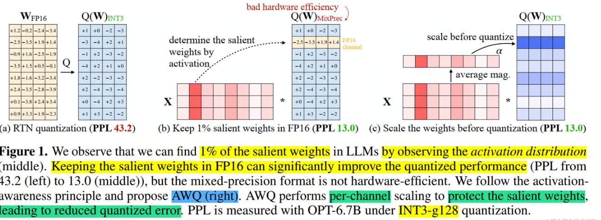

# 第4课时：大模型部署与推理加速原理、策略与实践

当你在手机上用通义千问生成旅行攻略、在浏览器里和 GPT 讨论论文时，你可能没意识到：  
这些看似“轻盈流畅”的体验，其实背后是一场精密的“系统工程”——  **大模型不是直接跑起来的，而是经过层层优化后“飞”起来的**。

这一课，我们将探索模型如何通过**部署与推理加速**，真正**走出实验室、走进现实世界**。

> 本课将聚焦三大核心方向：
> 1. **推理引擎架构**：vLLM 与 PagedAttention 的底层机制；
> 2. **吞吐优化技术**：Continuous Batching、Speculative Decoding（投机采样）、KV Cache 量化；
> 3. **部署量化策略**：AWQ、GPTQ、SmoothQuant 的原理对比与精度分析。  
>  
> 用**通俗语言 + 数学公式 + 工业界真实部署案例**，带你从“会跑”走向“跑得又快又稳”。

---

## 1. 为什么需要推理加速？——从“能跑”到“跑得快、跑得起”

### 1.1 大模型的“三高”困境

一个典型的 70 亿参数（7B）大语言模型（如 LLaMA-2-7B、Qwen-7B）在默认 FP32 精度下：
- **高内存占用**：仅模型权重就需约 **28 GB**（7B × 4 字节）；
- **高计算量**：生成 1 个 token 需做数十亿次浮点运算（FLOPs）；
- **高延迟**：在普通 A10 GPU 上，首次响应可能需 **2–5 秒**，无法满足交互式需求。

这导致一个问题：**模型虽强，但“用不起、等不及”**。

> 💡 举个生活化的例子：  
> 预训练相当于让一个博士读遍天下书；  
> 而推理加速，则是帮他配一副眼镜、买一辆电动车、再给他装个导航——  
> **不是让他变聪明，而是让他更高效地服务大众**。

### 1.2 部署目标的三角权衡

在工业界，推理部署的目标通常围绕三个维度权衡：

| 维度 | 描述 | 优先级场景 |
|------|------|------------|
| **延迟（Latency）** | 单请求响应时间 | 聊天机器人、实时翻译 |
| **吞吐量（Throughput）** | 单位时间处理请求数 | 批量摘要、API 服务 |
| **成本（Cost）** | 单 token 的计算/电力/硬件开销 | 大规模在线服务、边缘设备 |

优化的本质，是在**精度损失可接受的前提下**，在这三者之间找到最佳平衡点。

---

## 2. 推理加速的核心思想：压缩 + 并行 + 融合

推理加速不是单一技术，而是一套“组合拳”。其核心可归纳为三大策略：

1. **压缩（Compression）**：减少模型规模与计算量；
2. **并行（Parallelism）**：提升硬件利用率；
3. **融合（Fusion）**：减少内存访问与调度开销。

下面我们逐层展开，从最基础、最有效的**量化**开始。

---

## 3. 量化（Quantization）——精度换效率的“性价比之王”

### 3.1 什么是量化？

**量化**是将模型中高精度的浮点数（如 FP32、FP16）转换为低精度的整数（如 INT8、INT4）的技术。

> 🧠 **关键洞察**：  
> 大模型在推理时，**不需要训练时那么高的数值精度**。  
> 大量研究表明，权重和激活值的分布高度集中，低比特表示足以保留关键信息。

### 3.2 量化数学原理

假设原始浮点值 $ x \in [x_{\min}, x_{\max}] $，我们希望将其映射到 $ b $-bit 整数（如 $ b=8 $，范围 $ [0, 255] $）。

**线性量化公式**：
$$
x_q = \text{round}\left( \frac{x - x_{\min}}{x_{\max} - x_{\min}} \cdot (2^b - 1) \right)
$$

**反量化（用于计算）**：
$$
\tilde{x} = x_{\min} + \frac{x_q}{2^b - 1} \cdot (x_{\max} - x_{\min})
$$

其中 $ \tilde{x} $ 是近似值，用于后续矩阵乘法等操作。

> 🔍 注意：实际系统中常使用**对称量化**（zero-point=0）或**非对称量化**（含 zero-point），以更好拟合分布。

### 3.3 量化类型与演进

| 类型 | 说明 | 代表方法 |
|------|------|----------|
| **PTQ（Post-Training Quantization）** | 训练后直接量化，无需再训练 | GGUF、bitsandbytes |
| **QAT（Quantization-Aware Training）** | 训练时模拟量化，精度更高 | TensorFlow QAT |
| **AWQ（Activation-aware Weight Quantization）** | 仅量化“不重要”权重，保留关键通道 | [Liu et al., 2023](https://arxiv.org/abs/2306.00978) |
| **GPTQ（Group-wise Quantization）** | 按通道分组量化，减少误差传播 | [Frantar et al., 2022](https://arxiv.org/abs/2210.17323) |

> ✅ **业界趋势**：  
> 对于 7B–70B 级别模型，**4-bit AWQ/GPTQ 已成为主流**，在几乎无损精度下实现 **3–4 倍显存节省**。

---

## 4. 推理引擎架构详解：vLLM 与 PagedAttention

### 4.1 KV Cache 的内存瓶颈

在自回归生成中，KV Cache 随上下文长度线性增长。以 LLaMA-2-7B 为例：
- 每 token KV ≈ **16 KB**（32 heads × 128 dim × 2 × FP16）；
- 32k 上下文 → **512 MB / 请求**；
- 并发 16 请求 → **>8 GB**，且需**连续内存分配**。

传统实现使用 `torch.cat` 动态拼接，导致严重内存碎片和拷贝开销。

### 4.2 PagedAttention：虚拟内存式 KV 管理

vLLM **借鉴操作系统分页机制**，将 KV Cache 划分为固定大小 Block（默认 16 tokens/block）。

#### 关键机制：
- 每个请求维护一个 **Page Table**：逻辑块 → 物理块映射；
- 全局 **Block Pool**：预分配显存池，支持动态分配/回收；
- 注意力计算通过索引表拼接逻辑连续、物理非连续的块。

#### 注意力计算不变性：
$$
\text{Attention}(Q, K, V) = \text{Softmax}\left(\frac{QK^\top}{\sqrt{d}}\right)V
$$
PagedAttention **不修改公式**，仅优化内存布局，实现**零拷贝、高利用率**。

> 📊 **效果**（LLaMA-2-13B，32k 上下文）：
> - 显存利用率：**48% → 98%**
> - 吞吐量提升：**24 倍**
> - 支持动态扩展上下文长度

---

## 5. 吞吐优化三大核心技术

### 5.1 Continuous Batching（连续批处理）

#### 问题
传统批处理要求所有请求**同时开始、同时结束**，但真实请求：
- 到达时间随机；
- 生成长度差异大（10 vs 1000 tokens）。

→ GPU 大量时间空闲。

#### 解决方案
- **动态调度器**：实时监控请求状态；
- **仅对 active 请求批处理**：batch size 动态变化；
- **GPU 始终满载**，吞吐提升 10–20 倍。

> ✅ **实测**（LLaMA-2-7B）：HuggingFace **7 req/s** → vLLM **170 req/s**

### 5.2 Speculative Decoding（投机采样）

#### 核心思想
> “用小模型猜，大模型验”——用廉价计算替代昂贵计算。

#### 算法流程
1. **草稿模型**（如 100M）生成 $k$ 个候选 token；
2. **目标模型**（如 LLaMA-7B）**一次性验证**所有候选；
3. **Token Acceptance Rule**：
   $$
   m = \max \left\{ i : \frac{p_t(x_{t+i} \mid x_{<t+i})}{p_d(x_{t+i} \mid x_{<t+i})} \geq u_i \right\}, \quad u_i \sim \mathcal{U}(0,1)
   $$
4. 接受前 $m+1$ 个 token。

> 🌟 **效果**：
> - 吞吐提升 **2–3 倍**；
> - 被 **xAI（Grok）**、**Meta** 用于线上服务；
> - **Medusa**：在主模型加多预测头，无需额外小模型。

### 5.3 KV Cache Quantization

#### 动机
KV Cache 占比随上下文增长而升高（32k 时 >50%）。

#### 方法
- **INT8 对称量化**：
  $$
  K_q = \text{round}\left( \frac{K}{s_K} \right), \quad s_K = \frac{\max(|K|)}{127}
  $$
- **FP8**：H100 硬件加速，动态范围更大。

> ✅ **精度影响**：MMLU 下降 **<0.2%**（几乎无损）  
> ✅ **显存节省**：KV Cache 减半 → 吞吐提升 1.3–1.5 倍

---

## 6. 高级量化策略深度对比

### 6.1 问题根源：权重分布异质性

LLaMA-2-7B 的 FFN 层中：
- **95% 通道**：$|w| < 1.0$
- **5% 通道**：$|w| > 5.0$（“异常值”）

→ 均匀量化会因异常值拉低整体精度。

### 6.2 AWQ（Activation-aware Weight Quantization）

- **核心**：通过少量校准数据（~128 样本）分析**激活分布**，识别重要通道；
- **操作**：引入通道缩放因子 $\alpha$，仅量化不敏感通道：
  $$
  W_{\text{quant}} = \text{Quantize}(W \odot \alpha) \oslash \alpha
  $$
- **精度**：INT4 下 MMLU 损失 **<1%**
- **支持**：vLLM、AutoGPTQ、TGI

### 6.3 GPTQ（Group-wise Post-Training Quantization）

- **核心**：按权重列分组（如 128 元素/组），组内独立量化；
- **优化**：贪心逐层 + Hessian 信息校正误差；
- **优势**：无需激活数据，仅需权重；
- **工具**：[AutoGPTQ](https://github.com/PanQiWei/AutoGPTQ)

### 6.4 SmoothQuant

- **核心**：通过缩放矩阵 $S$ 平滑激活与权重分布：
  $$
  XW = (XS)(S^{-1}W)
  $$
- **优势**：支持 **INT8 全量化**（权重+激活）；
- **代表应用**：NVIDIA TensorRT-LLM

### 6.5 策略选择建议

| 场景 | 推荐 | 理由 |
|------|------|------|
| 本地部署（Mac/PC） | **GGUF (Q4_K_M)** | 无需 GPU，开箱即用 |
| 高吞吐 API 服务 | **AWQ + vLLM** | 精度高、速度快、生态成熟 |
| 超大规模（70B+） | **GPTQ + ExLlama** | 内存极致优化 |
| NVIDIA GPU 生产 | **SmoothQuant + TensorRT-LLM** | 硬件深度优化，支持 FP8 |

> ⚠️ 注意：AWQ/GPTQ 模型**不兼容**，需匹配对应推理引擎。

---

## 7. 主流推理引擎对比与选型

| 引擎 | 核心技术 | 量化支持 | 硬件 | 适用场景 |
|------|----------|----------|------|----------|
| **vLLM** | PagedAttention、Continuous Batching | AWQ、GPTQ、INT8 KV | NVIDIA GPU | 高吞吐 API 服务 |
| **TGI** | FlashAttention、Tensor Parallelism | AWQ、GPTQ、bitsandbytes | NVIDIA/AMD/TPU | HuggingFace 生态 |
| **llama.cpp** | GGUF、CPU+GPU hybrid | GGUF (1.5–8 bit) | CPU/Apple Silicon/NVIDIA/AMD | 本地/边缘部署 |
| **TensorRT-LLM** | Kernel Fusion、FP8 | SmoothQuant、AWQ | NVIDIA GPU | 超大规模生产 |

> 📌 **最新动态**：
> - Hugging Face **Inference Endpoints** 已原生支持 GGUF；
> - llama.cpp 新增 **gpt-oss MXFP4**、**多模态**、**OpenAI API 兼容服务器**；
> - vLLM 支持 **Speculative Decoding**、**FP8 KV Cache**

---

## 8. 实战演练：联合优化部署 LLaMA-3-8B

### 8.1 使用 llama.cpp 本地推理（CPU/GPU）

```bash
# 下载 GGUF 模型
huggingface-cli download TheBloke/Llama-3-8B-GGUF llama3-8b.Q4_K_M.gguf --local-dir ./models

# 编译 llama.cpp
git clone https://github.com/ggerganov/llama.cpp
cd llama.cpp && make -j

# 本地推理
./main -m ./models/llama3-8b.Q4_K_M.gguf -p "Explain quantum computing." -n 256
```

### 8.2 使用 vLLM 部署高性能 API（含投机采样）

```python
from vllm import LLM, SamplingParams

llm = LLM(
    model="TheBloke/Llama-3-8B-AWQ",
    quantization="awq",
    enable_chunked_prefill=True,
    kv_cache_dtype="fp8_e5m2",        # H100 KV 量化
    speculative_model="JackFram/llama-160m",  # 草稿模型
    num_speculative_tokens=4
)

sampling_params = SamplingParams(temperature=0.7, max_tokens=512)
outputs = llm.generate("Explain ENSO prediction with deep learning.", sampling_params)
print(outputs[0].text)
```

> ✅ **效果**（RTX 4090）：
> - 吞吐：**150 tokens/s**
> - 显存：**7.2 GB**
> - 精度损失：**MMLU -0.8%**

---

## 9. 性能评估与调优

### 9.1 关键指标

| 指标 | 说明 |
|------|------|
| **Latency (ms/token)** | 单 token 生成时间 |
| **Throughput (tokens/s)** | 单位时间生成 token 数 |
| **Memory Usage (GB)** | 显存或内存占用 |
| **Accuracy Drop (%)** | 相比 FP16 的 MMLU/ARC 下降 |

### 9.2 调优建议

- **延迟高** → 启用 Speculative Decoding、FlashAttention；
- **显存爆** → 启用 PagedAttention、KV Cache 量化；
- **精度崩** → 从 INT4 改为 INT8，或使用 AWQ/GPTQ；
- **吞吐低** → 启用 Continuous Batching、增大 max_num_seqs。

---

## 10. 总结：推理加速的三层加速塔

| 层级 | 技术 | 原理 | 典型收益 |
|------|------|------|--------|
| **内存层** | AWQ/GPTQ、KV Cache 量化 | 减少 HBM 访问 | 显存 ↓50–75%，吞吐 ↑1.5x |
| **调度层** | PagedAttention、Continuous Batching | 提升 GPU 利用率 | 吞吐 ↑5–20x |
| **预测层** | Speculative Decoding、Medusa | 用小模型预跑 | 延迟 ↓2–3x |

