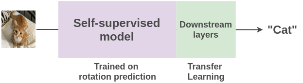

# 第7课时：预训练原理、策略与评测

在你和 ChatGPT 聊天、问 Claude 写报告、用 Qwen 生成摘要时，  
也许你会好奇：这些模型最初是怎么“学会语言”的？  
它们并不是天生会聊天，而是经历了一个漫长的“学习阶段”—— **预训练（Pre-training）**。  
现在，我们就来看看：  
一个大语言模型，是如何在没有老师、没有考试卷的情况下，靠“自学”掌握语言规律的。

## 1. 预训练是什么？与微调有什么不同

要理解大模型如何“学会语言”，首先得弄清两个关键词：**预训练（Pre-training）** 和 **微调（Fine-tuning）**。它们看似只差一步，但目标、数据和效果完全不同。

### 预训练：让模型“读懂世界”

预训练是大语言模型（LLM）最关键的学习阶段。在这一阶段，模型并不知道最终要完成什么任务，而是被直接丢进一个规模巨大的文本世界——网页、百科、小说、论文、对话……全部都是无标注文本。模型需要做的，就是在这种海量语料中自己发现规律。

它的学习方式非常简单：**通过预测下一个词，或补全被遮盖的词来学习语言结构**。

- 看到“今天阳光很___”，模型学会填上“好”；
- 看到“Attention is all ___”，它能补上“you need”。

但在这些简单预测的背后，模型其实在学习更具体、也更深层的内容：

1. **词语共现规律**（哪些词经常一起出现，如 “纽约—市长”）
2. **语法结构模式**（主谓宾、长距离依赖等）
3. **语义关联与推理倾向**（“医生—医院”“问题—解决方案”）
4. **跨段落的信息组织方式**（主题连贯、因果关系）

这些都是通过无数次预测错误→纠正→再次预测的循环中逐渐形成的。就这样，模型不断积累语言统计规律，学习语法、语义、常识甚至部分世界知识，最终形成了强大的通用语言理解与生成能力。可以说，预训练让模型“读遍天下书”，并在过程中打下了语言与知识的基础。

### 微调：让模型“懂人类的意图”

有了语言能力，还不代表模型就会“好好说话”。  
如果只经过预训练，它往往答非所问，甚至一本正经地胡说。  
于是我们需要第二步：**微调（Fine-tuning）**。

这一阶段使用的是带标签或指令的数据，让模型学会根据**任务目标**输出更合适的回答。

🌰 **举个例子**：  
- 预训练阶段：模型学会了“猫”和“狗”的语言用法；  
- 微调阶段：模型学会“当被问到‘猫和狗哪个更温顺’时，要生成有逻辑的回答”。

### 两者的核心区别

| 对比项         | 预训练（Pre-training）             | 微调（Fine-tuning / SFT）               |
|----------------|----------------------------------|----------------------------------------|
| **目标**       | 学习语言规律与知识               | 让模型执行具体任务、理解人类意图       |
| **数据类型**   | 海量无标注文本                   | 小规模有标注或指令数据                 |
| **学习方式**   | 自监督学习                       | 有监督学习                             |
| **效果**       | 掌握语言、语法、世界常识         | 学会对话、问答、分类、推理等任务       |
| **类比**       | “读遍天下书”                     | “上专业课、做实战练习”                 |

> **预训练让模型“有知识”，微调让模型“会沟通”**。  
> 两者结合，才造就了我们今天看到的 ChatGPT、Claude、通义千问等智能体。

## 2. 自监督学习的基本思路

在上一节我们提到，大模型的预训练阶段并不需要人工标注数据。那它是怎么学会语言的呢？答案就在一个关键概念里 —— **自监督学习（Self-supervised Learning）**。

顾名思义，“自监督”就是用数据自己监督自己学习。在自监督学习中，我们并不是完全没有监督信号；不同的是，这个“监督”来自于数据本身，而不是人工。如果我们通过人为制造一个预测任务，让模型从数据的特征中恢复被破坏的信息，这类设计常被称为“**伪监督任务（pseudo supervision）**”。

基于这种自监督学习的机制，大模型的预训练目标可以描述为：**通过预测任务逼近真实语言分布** $P_{\text{data}}(x)$。模型并没有显式的“语法”或“语义”概念，它只是不断调整参数，使自己在各种文本上预测正确下一个词（或被掩盖的词）的概率更高，而这样的优化过程会逼迫模型逐渐习得语言统计规律、句法结构与语义关系。

从数学角度看，一段文本序列 $x = (x_1, x_2, ..., x_T)$ 的目标是让模型的预测分布 $p_\theta(x)$ 接近真实分布，因此训练时通过最大化似然（或等价的最小化负对数似然）实现这一点。

为了使模型能计算这个概率，预训练常见的两类任务——**自回归预测**（如 GPT）和**掩码预测**（如 BERT）——将序列拆解成局部条件概率：

- **自回归模型**通过分解：  
  $$p_\theta(x) = \prod_{t=1}^T p_\theta(x_t \mid x_{<t})$$  
  来依次预测下一个词；
- **掩码语言模型**则通过预测被替换为 `[MASK]` 的词语 $p_\theta(x_i \mid x_{\setminus i})$，利用双向上下文进行推断。

无论是哪种方式，模型都必须提高正确词语的概率，而这会强制它编码语言的潜在结构：单词共现规律、句法依赖、语义一致性、长程关系和上下文逻辑，甚至世界知识（因为合适的词往往取决于现实语境）。

这种“被迫学习”的机制体现在模型内部的参数更新中：

- **词向量**会为了降低损失而被调整，使语义相近的词逐渐聚在一起；
- **注意力机制**（由 Query–Key 的相似度控制）会强化与预测相关的上下文 token，弱化无关信息，从而自动形成语法中心、指代关系或语义焦点；
- **前馈网络（FFN）**会逐渐捕获更抽象的统计模式，如实体类别、指代倾向或歧义消解线索。

最终，预测概率通过 `Softmax(W · Attention + FFN)` 计算，而为了让正确词获得更大的得分，模型只能不断优化内部表示，让注意力矩阵和高维特征真正反映语言结构。

> 因此，预训练并不是显式教模型“语法是什么、语义是什么”，而是一个**因果驱动的学习过程**：  
> 为了降低损失 → 必须提高正确词概率 → 必须捕获影响概率的真实语言结构 → 最终在参数中形成对语言的**隐式理解**。  
> **语言知识不是写进去的，而是损失函数“逼出来”的**。

### 语言模型的自监督学习

在语言任务中，思路很直接：  
我们让模型在句子里“挖坑”，再让它“填坑”。

- 例如输入：“我今天吃了（ ）饭。”  
  模型要预测被遮住的词是“早”。

在无数这样的“填空游戏”中，模型就会慢慢学会：

- 哪些词更可能连在一起？
- 句子的结构是什么？
- 上下文之间有什么逻辑关系？

### 一个跨模态的小例子

其实，自监督学习的思想并不限于语言。  
在图像领域，它同样能让模型从数据中“自我学习”。为了更直观，先举个图像领域的例子👇

假设我们把图片随机旋转 0°、90°、180° 或 270°，然后要求模型预测旋转的角度。  
相比人工去标注“猫”“狗”“汽车”这些类别，这种方式完全自动化，只需简单脚本就能生成“标签”。

于是，我们可以利用海量网络图片，让模型从中自己发现结构与模式。  
从数百万张图像中学习到特征表示后，我们可以使用**迁移学习**（Transfer Learning），将这些特征迁移到具体的监督任务上——例如猫狗分类。

> 这就像模型先学会“看图的规律”，再学“怎么分猫和狗”。

## 3. 预训练的常见任务类型

**语言建模**（Language Modeling）是所有预训练任务的核心。  
它的目标是：  
让模型根据上下文预测词语，从而理解语言的结构与逻辑。

简单理解就是：

1. 模型要能“补全”被遮掉的词；
2. 也要能“预测”接下来的词；
3. 最终形成对语义的整体把握。

这就像人类学习语言时：先理解词句，再尝试说出合理的话。预训练不是一件单一的事，而是多种任务组合在一起完成的。不同任务帮助模型学习不同的能力。下面列出几类最常见的：

### 1. 遮盖语言建模（Masked Language Modeling, MLM）

这种方式常用于像 **BERT** 这样的 Encoder 模型。  
它会随机“遮住”句子里的部分词，让模型根据上下文去填空。

- **例如**：  
  输入：“机器学习是一种（MASK）智能的方法。”  
  模型预测输出：“人工”。

通过这种方式，模型学会了如何理解上下文、捕捉语义关联。  
简单来说 —— **MLM 教模型“读懂话”**。

#### 拓展：掩码原则与训练任务

- **掩码原则**  
  在 BERT 之类的 MLM 中，并不是每个训练样本只遮盖一个词，也不是全句都遮盖。通常有一个 **掩码比例**（masking ratio），例如 **15%** 的 token 会被随机选中作为预测目标。

  **具体规则**：
  1. 对每个训练样本（通常是一个句子或句子对），随机选取 15% 的 token。
  2. 这些被选中的 token 就是“需要预测的词”。

- **掩码策略**（[BERT 原始论文](https://arxiv.org/abs/1810.04805)）
  - 80% 替换成 `[MASK]` token
  - 10% 替换成随机词
  - 10% 保持原词（依然参与计算 loss）

  这个策略可以让模型既学习 `[MASK]` 的预测，又能适应原始词的分布，防止训练时出现分布偏差。

- **训练任务**  
  一句话里多个 token 可以被 mask，比如一句话 10 个词，有 1–3 个词被选中作为 mask。每个被 mask 的 token 都是一个单独的预测目标（loss 会累加），但不是生成多个训练样本。

  - **举例**：一句话 10 个词，随机选出 2 个 token 进行 mask，这句话就生成 1 个训练样本，loss 会计算 2 个 mask 词的预测误差并累加。
  - 如果把 mask token 分开，也可以看作“2 个训练任务”，但训练时是同一个 forward/backward。

> 所以在实践中，一句话可以同时包含多个 mask token，每个 token 都有自己的预测目标；但不会对同一句话产生多个独立训练样本。

---

### 2. 因果语言建模（Causal Language Modeling, CLM）

这种方式是 **GPT 系列**使用的套路。  
它要求模型根据前文预测下一个词，也就是我们常说的“顺着往下写”。

- **例如**：  
  输入：“人工智能正在改变世界的……”  
  模型预测输出：“方式”。

这种学习方式让模型拥有自然的语言生成能力，能一口气写出连贯的段落。  
所以说 —— **CLM 教模型“会说话”**。

#### 拓展：训练任务

在 **因果语言建模**（Causal Language Modeling, CLM / 自回归 LM）中，每个训练序列通常只产生 **一个训练任务**，但这个任务包含序列中每个 token 的预测。

- **训练样本构造**  
  假设序列长度为 $T$：  
  自回归 LM 的目标是预测每个位置的下一个词：  
  $$p_\theta(x) = \prod_{t=1}^{T} p_\theta(x_t \mid x_{<t})$$  
  也就是说，序列 $x$ 被视为一个整体训练样本（一个训练任务），但在计算损失时，会对每个 token 都进行预测。

- **损失计算**  
  对整个序列，负对数似然损失为：  
  $$\mathcal{L} = -\sum_{t=1}^{T} \log p_\theta(x_t \mid x_{<t})$$  
  这里的每个 token 的预测都贡献一部分损失，所以虽然只有一个训练任务，但模型内部在序列中“练习”了多个预测。

---

## 4. 训练策略：Batch、学习率与优化器实战

模型选好了、数据也处理完了，接下来最关键的环节就是：**怎么把模型“喂饱”“喂对”**。  
预训练不是简单的“把数据塞进去”，而是一个需要耐心调节、稳扎稳打的优化过程。本节我们从三个最影响预训练效果的因素入手：**Batch Size**、**学习率**（Learning Rate）与**优化器**（Optimizer）。

### Batch Size：模型吃饭的“饭碗大小”

Batch 是每次训练中送进模型的样本数量，它直接影响模型的“学习节奏”。

- **大 Batch 的优点**
  - 训练更稳定（梯度波动更小）
  - 更适合多卡并行
  - 可以加快收敛速度（但不是必然）  
    > 如 GPT-3 使用的就是超大 batch（数十万 tokens / step）。

- **小 Batch 的优点**
  - 显存友好
  - 在某些任务上能带来更强的泛化能力
  - 对于极长文本训练更灵活

- **如何选择**？  
  一个简单的经验法则：  
  **显存够 → 大 Batch；显存紧张 → 小 Batch + 梯度累积**（Gradient Accumulation）

  **预训练中常见策略是**：
  1. 总 batch 保持大（例如 512k tokens）
  2. 但可以通过“梯度累积”分多次凑够  
     这在单机资源有限时非常实用。

---

### 学习率（Learning Rate）：模型学习速度的油门

学习率是训练过程中最容易“把模型搞崩”的参数。

- **学习率过大**
  - 模型在损失函数里“跳来跳去”，训练不收敛或直接炸掉。
- **学习率过小**
  - 模型学得像乌龟一样慢，甚至永远停留在“只会说废话”的水平。

- **预训练常用做法：Warmup + Cosine Decay**
  1. **Warmup**（热身）：
     - 前 1%～3% 的训练步数
     - 学习率从 0 线性上升到峰值
     - 让模型先适应训练，避免“开局暴毙”
  2. **Cosine Decay**（余弦退火）：
     - 随着训练推进逐渐降低学习率
     - 让模型在后期更稳、更慎重地学习

  **示意效果**：前期冲刺 → 中期稳定 → 后期慢慢收敛。

- **如何设学习率峰值**？  
  **经验参考**：
  - 中小模型（<10B）：`1e-4 ~ 3e-4`
  - 大模型（>30B）：`3e-5 ~ 1e-4`
  - 数据多时，学习率可略大；数据质量差时要更小

> **一句话总结**：小模型学快一点，大模型稳一点。

---

### 优化器（Optimizer）：让模型真的学会东西

优化器决定训练时梯度如何更新，是所有策略中“最有学问”的部分。

- **目前预训练主流：AdamW**
  - **优势**：
    1. 收敛稳定
    2. 对不同梯度尺度有较好的自适应能力
    3. 配合 weight decay 更适合长期训练
  - **绝大多数 LLM**（GPT-2/3、LLaMA、Bloom、Qwen）

- **为什么不是 SGD**？  
  SGD 更轻更简单，但在巨大参数量下收敛慢且不稳定。  
  预训练这种大工程，**稳定性永远 > 理论最优**。

- **关键超参**
  - **β1**（0.9）：控制梯度一阶动量
  - **β2**（0.95 或 0.999）：控制梯度二阶动量（越大越“平滑”）
  - **Weight Decay**（0.01）：稳定训练、减少过拟合

  > **特别注意**：  
  > 新一些的模型（如 LLaMA 系列）常用 β2 = 0.95，这样能加速大模型训练的稳定收敛。

#### 额外技巧：让训练更稳更快的小窍门

- **Gradient Clipping**  
  阻止梯度爆炸，常见上限：1.0。
- **Mixed Precision**（BF16 / FP16）  
  能省 30~40% 显存，是大模型训练的标配。
- **Checkpoint Sharding & ZeRO 优化**  
  当模型规模巨大时（几十 B 以上），必须使用 ZeRO 来把显存压力摊到多张卡上。
- **数据 Shuffle & Curriculum**  
  数据课程与优化策略配合能显著提升稳定性。

---

## 5. 模型评测与调优：困惑度与早停策略

预训练不是一口气从头跑到尾的“盲冲刺”，而是一个需要不断观察、反思和调整的过程。与后续的 SFT 阶段不同，预训练阶段的评测重点不是“模型是否听得懂人话”，而是更基础的问题：**模型是否真的在学语言**？**训练过程稳不稳定**？**泛化能力有没有跟上**？

为了回答这些问题，我们一般从三个方面入手：**指标、验证集与训练动态**。

### 核心指标：困惑度是主角，损失曲线是配角

在所有评测指标里，**困惑度**（Perplexity, PPL）无疑是预训练阶段的“C 位”，是语言模型评估中最常用的指标，用来衡量模型对文本的“困惑程度”。它本质上衡量：**模型预测每个 token 的平均不确定性**。

对文本序列 $w_1, w_2, ..., w_N$ 的困惑度定义：

$$
\text{PPL} = \exp \left( -\frac{1}{N} \sum_{i=1}^{N} \log p(w_i \mid w_{<i}) \right)
$$

其中：

1. $N$：文本中 token 的总数量；
2. $w_i$：第 $i$ 个 token；
3. $p(w_i \mid w_{<i})$：语言模型生成第 $i$ 个 token 的概率。

#### 举个例子

我们现在计算句子 “I love natural language processing .” 中第三个词 ”natural“ 的条件概率 $p(\text{natural} \mid \text{"I love"})$，假设模型的词表大小 $V = 10$（为简单起见），包含：  
`["I", "love", "natural", "language", "processing", ".", "you", "is", "a", "model"]`。

1. **Transformer 输出隐藏向量**  
   在自回归语言模型中，当预测序列中第3个位置（即第三个词）时，模型仅基于前文上下文 `["I", "love"]` 进行计算。  
   - 输入序列 `["I", "love"]` 经过 Transformer 编码器处理  
   - 模型在第 2 个位置（对应 "love" 的位置）输出最后一层隐藏状态 $h_3 \in \mathbb{R}^d$  
   - 这个 $h_3$ 向量已经编码了完整的前文语义信息 `["I", "love"]`

   > 说明：$h_3$ 代表了模型基于前文 `["I", "love"]` 对下一个词的预期表示，而非对已见词 "natural" 的编码结果。

2. **logits 计算**（线性投影）  
   用最后一层隐藏向量做线性投影得到对整个词表的打分（logits）：

   $$
   \text{logits} = W h_3 + b
   $$

   其中 $W \in \mathbb{R}^{|V| \times d}$，每一行对应词表中的一个 token 的投影向量，$b \in \mathbb{R}^{|V|}$ 是偏置。输出是长度为 $|V|$ 的向量，每个元素就是对应 token 的分数（score）。

   在本例中（已给出假设的 logits）：

   | token      | I   | love | natural | language | processing | .   | you  | is  | a    | model |
   | ---------- |-----|------|---------|----------|------------|-----|------|-----|------|-------|
   | logits     | 1.0 | 0.5  | 2.0     | 0.8      | 0.2        | 0.0 | -1.0 | 0.3 | -0.5 | 0.1   |

3. **softmax：把 logits 转成概率**  
   softmax 的定义是：

   $$
   p_i = \frac{\exp(\text{logits}_i)}{\sum_j \exp(\text{logits}_j)}
   $$

   **步骤如下**（逐项计算）：

   - 对每个 logits 做指数（exp(logits)）：

     | token      | I       | love    | natural | language | processing | .     | you    | is     | a      | model  |
     | ---------- |---------|---------|---------|----------|------------|-------|--------|--------|--------|--------|
     | exp(logit) | 2.7183  | 1.6487  | 7.3891  | 2.2255   | 1.2214     | 1.0000| 0.3679 | 1.3499 | 0.6065 | 1.1052 |

   - 求和（归一化常数 $Z$）：  
     $$
     Z = 2.7183 + 1.6487 + 7.3891 + \cdots + 1.1052 \approx 19.6232
     $$

   - 计算 $p(\text{natural} \mid \text{"I love"})$：  
     $$
     p = \frac{7.3891}{19.6232} \approx 0.376
     $$

> 基于上下文 "I love"，模型认为下一个词是 “natural” 的概率约为 **37.6%**。

> 此处仅演示计算单个词的条件概率，而**困惑度则是基于整个序列计算的**。对于整个句子 "I love natural language processing ."，需要计算：
> - $p(\text{I} \mid \text{<start>})$
> - $p(\text{love} \mid \text{"I"})$
> - ...
> - $p(\text{.} \mid \text{"I love natural language processing"})$

> **说明**：<start> 为语言模型提供了统一的序列起始点，使得 $p(\text{I} \mid \text{<start>})$ 成为技术上"有条件"但语义上接近"无条件"的第一个词概率估计。

> **PPL 值越低**，表示模型对语言分布的拟合越好。它衡量的是模型对下一个 token 的预测确定性：**PPL 越低，说明模型越能掌握语料的统计分布，也就越有“语言直觉”**。

除了 PPL，我们还会观察一些辅助指标：

1. **Training Loss**（训练损失）：看模型是否在稳步收敛，是否出现震荡或突然飙升。
2. **Validation Loss**（验证损失）：用于检验泛化能力是否跟得上训练速度。
3. **Token-Level Accuracy**：在 masked LM 或自回归任务中观察预测 token 的准确程度。
4. **Loss Curve**（损失曲线）：帮助判断 warmup、学习率调度以及 batch 设置是否合适。

> 这些指标组合在一起，基本可以描绘训练过程的健康状况。

---

### 评测数据：验证集必须“像训练集，但不是训练集”

为了公平评估模型，不会在训练集上算困惑度，而是使用 **held-out 验证集**。它的内容与训练语料分布接近，但没有出现在训练中。

**典型选择包括**：

1. **通用模型**：WikiText-103、C4 Validation、The Pile Val
2. **多语模型**：CC100、OSCAR 的 held-out 子集
3. **多模态模型**：COCO Caption Val、Flickr30k Val

此外，构建预训练基线也很重要：  
你可以定期与历史 checkpoint、同等规模的公开模型（如 GPT-NeoX、OPT、LLaMA）对比，看模型是否“跑偏”或“落后”。

---

### 训练过程监控：模型的“体检系统”必须一直开着

预训练训练周期往往非常长（一跑就是几周甚至几个月），因此保持实时监控至关重要，通常包括：

1. **滑动平均 Loss**：观察训练过程是否平稳、是否有梯度爆炸迹象。
2. **梯度范数与 LR 变化**：判断优化器是否在正常发挥。
3. **样本覆盖率、数据分布**：避免模型被某类语料“喂得太多”。
4. **tokens/s 与显存利用率**：确保训练过程高效，不浪费算力。

如果发现验证损失长时间不下降、训练突然震荡或速度异常，通常意味着需要调整：  
可能是学习率不合适、warmup 时间太短、数据质量有问题、甚至是硬件瓶颈。

---

### 早停（Early Stopping）与 Checkpoint：防止“过度训练”与“意外事故”

当验证集困惑度连续多轮原地踏步时，就可以考虑触发 **Early Stopping**。  
这不仅节省算力，也避免模型在后期“越学越糟”。

为了保证训练安全，我们还需要：

1. **定期保存 checkpoint**：包括模型参数、优化器状态、学习率调度器
2. **记录评测曲线**：方便后续（SFT、RLHF、RLAIF）阶段做横向比较
3. **恢复机制**：训练中断后能无损恢复，避免重新跑几天的噩梦

> **一句话总结就是**：  
> 好的评测体系不仅告诉你模型“学得好不好”，还会在模型“学坏了”之前提醒你。