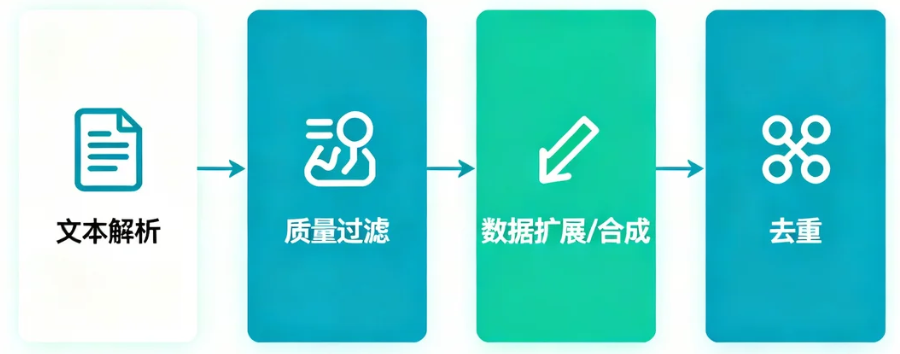
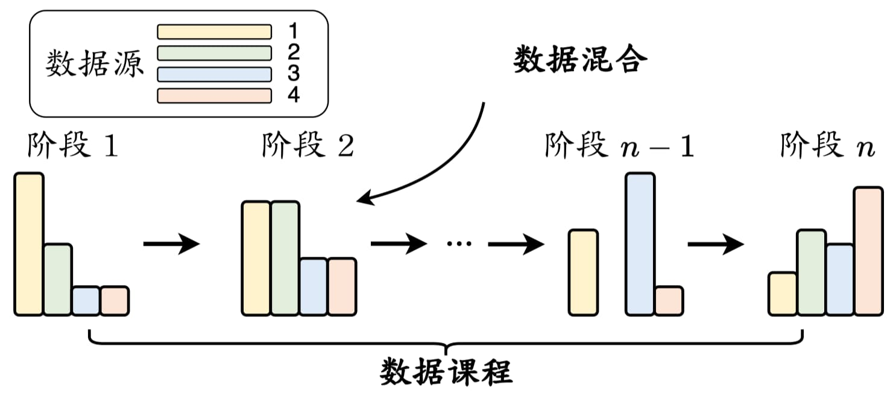
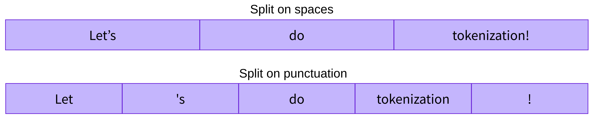
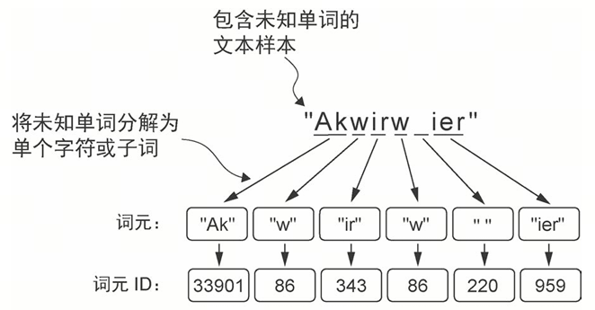

# 第8课时：预训练数据构建全流程 

## 语料来源与类型

模型的“语言世界”从哪里来？  
要让模型“学会语言”，第一步就是给它准备足够丰富的阅读材料。几乎所有现代大模型，都是在海量公开文本的混合语料上预训练的。简单来说，就是把“整个互联网的优质内容”整理成一个巨大的数据池，然后让模型从中不断预测下一个词，进而掌握语言规律。

通常，预训练数据可以分成两类：**通用文本数据**和**专用文本数据**。

1. 通用数据量最大，包括网页、书籍、百科、论坛、对话等，是模型建立基本语言能力的主力来源；  
2. 专用数据则更像“强化训练”，用于提升模型在特定任务上的表现，如多语言理解、科学推理、代码生成等。

不同大模型的训练数据比例略有不同，你可以理解为：每个模型的“知识口味表”都不太一样。

在实际预训练中，专用文本通常主要来自三大类资源：

**第一类 多语文本**  
这类数据帮助模型建立跨语言的语义桥梁。无论是中英互译、跨语言问答，还是不同语种混合的搜索与对话，多语数据都在背后提供关键支持。更重要的是，多语言文本可以明显提升数据多样性，让模型在“看世界”时不局限于单一语种，整体能力也更稳健。

**第二类 科学文本**  
为了提升模型在数学、物理、生物等领域的理解与推理能力，研究人员会收集 arXiv 论文、科学教材、研究笔记、专业网站等。这类文本虽然内容宝贵，但它们常包含数学公式、化学结构、蛋白质序列等特殊符号，因此需要额外的分词策略与预处理方式，把这些复杂结构转成模型能够“看懂”的统一格式。一旦科学文本加入训练，模型在技术解释、数学推理等任务上的表现会显著提升。

**第三类 代码语料**  
这是近几年大模型性能跃升的重要原因之一。代码通常来自 Stack Exchange、GitHub 等开源社区，结构清晰、逻辑严谨。训练代码能让模型学到“更明确的逻辑链条”，显著增强推理能力。此外，代码中的函数结构、调用关系也能强化模型的工具使用与系统性思考能力，使其在复杂任务中表现更可靠。很多团队甚至会把推理任务格式化成“伪代码”，让模型像执行程序一样一步步得出答案。

## 文本清洗与去重

在顺利收集到大规模原始语料之后，接下来要做的，就是将这堆“原石”打磨成能够直接用于预训练的高质量文本。这个阶段通常被称为“文本清洗与去重”，目标是把混杂的数据整理得更干净、更一致，也更适合模型学习。业界常用 MinerU、Auto-PDF 等工具解析文档，再搭配 Data-Juicer 这类系统化的预处理框架来构建完整的数据流水线。典型流程大致包括：文本解析 → 质量过滤 → 数据扩展/合成 → 去重，如图所示。


### 一、质量过滤

质量过滤是整个清洗流程的第一道大关，它的目标很直接：把明显不适合训练的内容筛掉。目前常用两类方法。

#### （一）基于规则的清洗方法

在大规模预训练中，清洗原始文本是第一步。规则过滤方法依赖经验与启发式规则，适合快速处理海量数据。核心思路是：删除无用或异常文本，保留高质量、语言统一的数据。

1. **语言过滤**  
   只保留目标语言文本，过滤其他语言。常见工具：langdetect、fasttext。Python 示例如下：

   ```python
   from langdetect import detect
   def is_chinese(text):
       try:
           return detect(text) == 'zh'
       except:
           return False
   ```

2. **统计特征过滤**  
   通过统计指标判断文本是否合理：
   - 文本长度（字符数、单词数）
   - 符号占比（标点或特殊符号占比）
   - 困惑度（Perplexity, PPL）评估文本“自然性”

   伪代码如下：

   ```python
   def filter_stats(text, min_len=25, max_symbol_ratio=0.1):
       words = text.split()
       symbol_count = sum(1 for c in text if not c.isalnum())
       if len(words) < min_len or symbol_count / len(text) > max_symbol_ratio:
           return False
       return True
   ```

3. **关键词/模板过滤**  
   删除网页模板、广告、短页、无意义字段。常见规则：
   - 网页数据：重复单词/句子超过 100 的文档
   - Wikipedia：少于 25 个 UTF-8 单词的页面
   - 论坛评论：点赞数低于 3 的评论

   示例如下：

   ```python
   def has_template_keywords(text, keywords=["版权", "广告", "联系我们"]):
       return any(k in text for k in keywords)
   ```

4. **隐私信息过滤**  
   去除敏感信息，避免泄露。简单规则如：正则匹配邮箱、电话、IP 等。

   ```python
   import re
   def remove_sensitive(text):
       text = re.sub(r'\b\d{3,4}[- ]?\d{7,8}\b', '', text)  # 电话
       text = re.sub(r'\b[\w.-]+@[\w.-]+\.\w+\b', '', text)    # 邮箱
       text = re.sub(r'\b\d{1,3}(?:\.\d{1,3}){3}\b', '', text) # IP
       return text
   ```

#### （二）基于分类器的清洗方法

规则过滤方法快速高效，但对于一些“灰色内容”或微妙噪声文本，规则难以覆盖。这时就可以使用分类器来判断哪些文本适合用于训练，从而提高数据质量。核心思路如下：

1. **构造训练数据**
   - 正样本：高质量文本，如 Wikipedia、公开书籍、新闻文章等
   - 负样本：噪声文本，如论坛低质评论、广告、乱码文本等
   - 目标：训练分类器判定任意文本是否适合预训练

2. **训练分类器**
   - 输入：文本（可转 token 或 embedding）
   - 输出：二分类概率 $P(\text{label}=1 \mid \text{text})$
   - 损失函数：二元交叉熵（Binary Cross Entropy），$y_i$ 是样本真实标签，$\hat{y}_i$ 是模型预测概率。

3. **文本判定**
   - 阈值策略：例如 $P > 0.8$ 视为“可用”，否则丢弃
   - 可以使用多个分类器投票，提高准确率

4. **轻量级模型**  
   训练速度非常快，对硬件要求低，适合大规模初筛任务；对短文本分类效果较好。但模型属于浅层线性结构，对复杂语义、长程依赖和细粒度噪声的识别能力有限。例如 FastText，Python 示例如下：

   ```python
   import fasttext
   # 准备数据：每行格式为 __label__1 文本内容
   # 正样本 __label__1, 负样本 __label__0
   classifier = fasttext.train_supervised('train.txt', epoch=5, lr=1.0, wordNgrams=2)
   label, prob = classifier.predict("这是待判断的文本")
   print(label, prob)
   ```

5. **可微调的预训练模型**  
   具备强大的语义理解能力，能够捕获上下文依赖、判断细微噪声，对文本质量识别更加精确。但训练慢，对标注数据依赖较大。伪代码如下：

   ```python
   from transformers import BertTokenizer, BertForSequenceClassification, Trainer, TrainingArguments
   tokenizer = BertTokenizer.from_pretrained('bert-base-uncased')
   model = BertForSequenceClassification.from_pretrained('bert-base-uncased', num_labels=2)
   # 将文本转换为 token id
   encodings = tokenizer(["文本 1","文本 2"], padding=True, truncation=True, return_tensors="pt")
   labels = torch.tensor([1,0])
   # 定义训练器
   training_args = TrainingArguments(output_dir='./results', num_train_epochs=3, per_device_train_batch_size=16)
   trainer = Trainer(model=model, args=training_args, train_dataset=Dataset(encodings, labels))
   trainer.train()
   ```

6. **闭源大模型 API**  
   无需训练即可直接获得极强理解能力，能够识别复杂噪声、低质量逻辑、隐含情绪等，适合用来做最终高质量精筛。但调用成本较高，不适合大规模数据；模型是黑箱，无法完全定制；输入输出速度有限。伪代码如下：

   ```python
   prompt = f"判断下面文本是否适合用作语言模型预训练数据，只回答 yes 或 no ：\n\n{sample_text}"
   response = gpt4_api_call(prompt)
   if response == "yes":
       keep(sample_text)
   ```

> **说明**：为了在效率与准确度之间做平衡，通常采用“先规则粗滤 → 再分类器精滤”的组合策略。甚至也会用多个分类器共同投票，以减少误判。

### 二、数据扩展

在完成初步清洗后，你会发现：有些文本虽然质量还不错，但内容信息量偏少、背景不充分、缺乏上下文。这时，我们可以通过**数据扩展**（Data Enrichment）来增强语料的“知识密度”。

数据扩展的核心思想是：  
从原始文本中抽取关键信息 → 去外部语料中检索相关内容 → 拼接回原文，形成更完整、更知识化的训练样本。

数据扩展一般包含三个关键步骤：

1. **知识点 / 关键词抽取**  
   从原文中提取最能代表其主题的词语或短短短语。常用工具：
   - jieba / pkuseg（中文关键字初筛）
   - keybert（基于 BERT 的关键词提取）
   - spaCy（英文命名实体识别）
   - 任何 embedding 模型（做向量表示取 top-k 关键词）

   伪代码如下：

   ```python
   from keybert import KeyBERT
   kw_model = KeyBERT()
   text = "人工智能模型的训练离不开高质量的数据和大规模计算资源。"
   keywords = kw_model.extract_keywords(text, top_n=5)
   print(keywords)
   ```

   输出可能类似：  
   `[("人工智能模型", 0.78), ("训练", 0.71), ("高质量数据", 0.68)]`

2. **根据关键词从开放域语料库检索相关内容**  
   常用可用数据源如下。

   | 数据源            | 特点                     |
   |-------------------|--------------------------|
   | Wikipedia dump    | 结构化、中高质量，适合作为补充知识源 |
   | Common Crawl      | 海量网络文本，覆盖面极广        |
   | 新闻语料          | 时效性强，常用于增强时序类知识     |
   | 本地 embedding 检索 | 如果你已经有自建语料，可以使用向量搜索（FAISS） |

   检索方式常用三种：
   - 关键词匹配检索（简单、快）
   - BM25 检索（效果更强）
   - 向量检索（embedding + FAISS）（扩展质量最佳）

   伪代码（embedding + FAISS）：

   ```python
   import faiss
   import numpy as np
   from sentence_transformers import SentenceTransformer
   model = SentenceTransformer('distiluse-base-multilingual-cased')
   vec = model.encode([text])
   index = faiss.read_index("wiki.index")  # 已构建好的向量库
   scores, ids = index.search(vec, k=5)
   retrieved = [wiki_texts[i] for i in ids[0]]
   ```

3. **将检索到的内容拼接回原文本**  
   在抽取到相关内容之后，只需将它们合并为更完整的训练样本。示例拼接规则（常用模板）：  
   原文：  
   `{original_text}`  
   相关补充：  
   `{retrieved_passage}`  
   扩展后的语料：  
   `{original_text} {retrieved_passage}`

   伪代码如下：

   ```python
   expanded_text = original_text + "\n\n[Related Knowledge]\n" + "\n".join(retrieved)
   ```

### 三、数据合成

在预训练阶段，除了使用真实语料，许多团队会让大语言模型（LLM）自动生成补充语料，以增强模型对知识、语义结构、语言风格的覆盖。预训练中的数据合成主要目的是：丰富语言分布、增强知识密度、补齐领域覆盖，没有严格的格式要求。

典型流程如下：  
抽取关键信息 → 构造轻量提示 → 调用 LLM 生成扩展文本 → 过滤与去重 → 标准化格式  
它能有效提升模型的语言多样性和知识广度，并显著降低人工成本。

1. **自动抽取原文关键信息**  
   为了让模型能“按原文补写内容”，需要先从真实语料中抽取结构化要素，例如事件描述、实体关系、数值/指标、关键句等，这是后续合成文本的基础。常用工具：
   - spaCy / jieba：分词、关键词提取
   - Flashrank / KeyBERT：关键词抽取
   - LLM（如 GPT/Qwen）：自动抽取关键点（更稳定）

   示例：使用 LLM 抽取关键信息

   ```python
   text = "苹果公司发布了最新的 M3 芯片，性能相比上一代提升 30%。"
   prompt = f"""
   请从以下文本中提取关键事实（不超过 5 条）：
   {text}
   """
   facts = llm(prompt)
   print(facts)
   ```

   输出一般类似”苹果发布 M3 芯片“、“性能提升 30%”，这些“关键事实”会作为下一步合成数据的输入。

2. **基于事实生成扩展文本**  
   预训练中的合成文本通常不是问答，而是：
   - 扩写（Expansion）：增加更多细节、背景、解释
   - 改写（Rewrite）：不同风格版本
   - 平行句（Paraphrase）：同义表达
   - 上下文补全（Completion）：生成更完整的段落
   - 知识增强（Knowledge Augmentation）：补充相关事实

   这些内容极其适合预训练，因为：  
   预训练目标是“预测词”，因此越多样、越连续、越自然的文本，越有助于模型学习语言结构。

   示例：基于事实扩写段落

   ```python
   facts = [
       "苹果发布了最新的 M3 芯片",
       "M3 性能比上一代提高了 30%"
   ]
   prompt = f"""
   根据以下事实生成一段 80–150 字的自然语言描述，要求风格自然、语言通顺：
   {facts}
   """
   expanded = llm(prompt)
   print(expanded)
   ```

   输出通常是可被直接用于预训练的流畅文本段落。

3. **生成平行表达**  
   为了增加多样性，可以从同一事实生成多个不同风格的表达：新闻风、科普风、口语风、技术报告风等。

   示例：自动生成多种文体

   ```python
   prompt = f"""
   请根据以下事实生成三种不同文风的改写文本：
   {facts}
   """
   variants = llm(prompt)
   print(variants)
   ```

   这种“多视角复述”非常有利于提高模型的语言泛化能力。

4. **生成知识增强语料**  
   预训练中常常希望语料包含更多背景知识，因此会让模型基于事实自动扩展：
   - 补充背景
   - 添加简单逻辑推断
   - 增加相关事件
   - 引入对比信息

   示例：知识增强生成

   ```python
   prompt = f"""
   请围绕以下事实生成一段更丰富的背景介绍，长度约 100 字：
   {facts}
   """
   aug = llm(prompt)
   print(aug)
   ```

   适用于增强“知识密度”，在科学、经济、技术类语料中非常常见。

5. **生成连续上下文**  
   真实世界中很多数据段落是不完整的，因此模型可帮助补写上下文，使语料更“像真实文章”。

   示例：补写前后文

   ```python
   prompt = f"""
   以下是一段文本的核心事实，请基于此生成一个包含起承转合的完整段落：
   {facts}
   """
   doc = llm(prompt)
   print(doc)
   ```

   这种方式生成的是连续自然语言，特别适合预训练数据格式。

> **注意事项**  
> 为了避免模型互相“抄作业”或产生重复，需要注意以下几点：  
> 1. 多样化 Prompt（避免生成模式固定）  
> 2. 混入真实语料，避免“全是模型自己写的”  
> 3. 使用规则和分类器过滤低质量生成数据  
> 4. 可以用 PPL（困惑度）筛掉明显不自然的句子  
> 合成后的数据，需要进行长度过滤、去重、格式标准化等操作。从而保证合成数据的质量，以免影响训练稳定性。

### 四、数据去重

大语言模型非常擅长“记住”训练数据——甚至擅长到有点过头。如果数据里重复样本太多，模型可能会：
1. 在训练中出现 loss 震荡甚至崩掉；
2. 生成内容时反复出现训练数据中的句式；
3. 在上下文学习中泛化能力下降；
4. 产生“双下降”现象（loss 下降 → 上升 → 再下降）。

因此，多粒度、多方法结合的去重流程几乎是所有预训练管线的必备步骤。

#### （一）句子级去重

用于删除重复句子、或者连续重复子串过长的句子。快速可用伪代码：

```python
seen = set()
result = []
for sent in sentences:
    if sent not in seen:
        result.append(sent)
        seen.add(sent)
```

#### （二）文档级去重

常见做法：把文档切成 n-gram，计算 Jaccard 相似度。公式如下：

$$
\text{Jaccard}(A, B) = \frac{|A \cap B|}{|A \cup B|}
$$

若 Jaccard > threshold（如 0.8），即可认为重复。

伪代码：

```python
def jaccard(a, b):
    return len(a & b) / len(a | b)

dups = []
for i in range(len(docs)):
    for j in range(i+1, len(docs)):
        if jaccard(set(ngrams(docs[i])), set(ngrams(docs[j]))) > 0.8:
            dups.append((i, j))
```

这种方式比句子级更严格，适合新闻、百科、技术文章等结构相似的语料。

#### （三）数据集级去重

数据集级去重关注的是整个数据集层面的重复问题，目标是在“进入文档级与句子级去重之前”，先快速排除大规模、高度重复的内容，以避免后续处理的计算量爆炸。在实际工程中，数据集级去重通常采用多阶段策略：  
**数据集级粗去重 → 文档级去重 → 句子级精细去重**

其中，数据集级去重往往使用轻量级、可扩展、高速的技术。如：
1. 文件级 Hash（MD5）
2. 文档指纹 SimHash
3. MinHash + LSH（用于网页规模语料）

这一层的目标是：极快缩小数据规模，使后续文档级、句子级去重不爆炸。

1. **基于文件级 Hash 的去重**  
   适用于：
   - 多来源语料合并
   - 下载多个版本的同一数据集
   - 原始文件中存在大量完全重复文件

   可直接使用的实战代码：

   ```python
   import hashlib, os, glob
   def file_md5(path):
       m = hashlib.md5()
       with open(path, "rb") as f:
           for chunk in iter(lambda: f.read(8192), b""):
               m.update(chunk)
       return m.hexdigest()

   unique = {}
   for f in glob.glob("dataset/**/*", recursive=True):
       if os.path.isfile(f):
           h = file_md5(f)
           if h not in unique:
               unique[h] = f    # 保留第一个文件
           else:
               os.remove(f)     # 删除重复文件
   ```

   最快速的粗去重方式，能直接清理掉完全一致的文件（例如重复下载的 JSON、TXT、HTML）。

2. **基于文档指纹（SimHash）**  
   适用于：
   - 文档内容相似但不完全一样
   - HTML 噪声、版权提示、模板头尾导致微差的文本文件
   - 海量语料（千万级）

   示例工具：py-simhash

   ```python
   from simhash import Simhash
   def fingerprint(text):
       return Simhash(text).value

   seen = {}
   retained_docs = []
   for doc in docs:
       sig = fingerprint(doc)
       bucket = sig >> 16      # 分桶，提高速度
       if bucket not in seen:
           seen[bucket] = sig
           retained_docs.append(doc)
       else:
           # 判断是否相似
           if Simhash(doc).distance(Simhash(seen[bucket])) > 5:
               retained_docs.append(doc)
   ```

   SimHash 对文本微小差异不敏感，可以只比较“相似文档”，速度极快，是 Google 用于网页去重的经典方法。

3. **基于 MinHash + LSH 的超大规模粗过滤**（TB 级语料）  
   适用于：
   - 各类网页抓取、百科 dump、社区论坛
   - 大量内容“看起来差不多”的页面
   - 无法进行逐对比较（复杂度爆炸）

   核心流程：  
   文档 → 分词 → MinHash 指纹 → LSH 索引

   可直接使用的实战模板：

   ```python
   from datasketch import MinHash, MinHashLSH
   def get_minhash(text):
       m = MinHash(num_perm=64)
       for token in text.split():
           m.update(token.encode())
       return m

   lsh = MinHashLSH(threshold=0.75, num_perm=64)
   filtered_docs = []
   for i, doc in enumerate(docs):
       mh = get_minhash(doc)
       if not lsh.query(mh):   # 未出现过相似文档
           lsh.insert(str(i), mh)
           filtered_docs.append(doc)
   ```

   能处理千万级文档，且内存消耗可控，能有效扫掉相似网页（爬虫语料非常需要）。

### 敏感内容与隐私过滤

在完成文本清洗与去重之后，下一步通常需要处理两类对模型影响极其重要的内容：**有害内容**（toxic content）与**隐私信息**（PII）。这一步虽然听起来“不太技术”，但实际上是预训练数据处理中最严格、成本最高、也最不容出错的环节。原因很简单：  
只要有一小部分“脏数据”混进训练集，模型最终的表现就会受到成倍放大的负面影响。

从实际操作上看，敏感内容过滤大致可以分为两类策略：依靠规则的启发式方法，以及依靠模型的分类器方法。二者通常配合使用。

#### （一）有害内容过滤（Toxicity Filtering）

为了避免模型学到负面的表达方式（例如侮辱、歧视、仇恨、不当暗示等），预训练阶段会进行专门的有害内容识别。  
主流方法通常基于分类器，例如：

1. 使用 Jigsaw Toxicity 等公开数据集训练一个轻量级分类器，用来检测辱骂、仇恨、威胁等文本。
2. 使用可微调的预训练模型（如 BERT）做更精细的分类，以识别“伪礼貌攻击”或“隐性偏见”之类更隐藏的风险表达。
3. 在大批量过滤阶段，甚至会调用闭源大模型的 API 做二次审核，用于低召回风险场景。

**实操示例：使用开源模型直接过滤 Toxic 文本**  
下面是一段示例 Python 代码，使用开源模型 unitary/toxic-bert 对文本做毒性判断。

```python
# 安装（若未安装）
# pip install transformers
from transformers import AutoTokenizer, AutoModelForSequenceClassification
import torch

# 1. 加载开源毒性分类器
tokenizer = AutoTokenizer.from_pretrained("unitary/toxic-bert")
model = AutoModelForSequenceClassification.from_pretrained("unitary/toxic-bert")

def is_toxic(text, threshold=0.6):
    """ 返回是否属于有害内容 """
    inputs = tokenizer(text, return_tensors="pt", truncation=True)
    logits = model(**inputs).logits
    probs = torch.softmax(logits, dim=-1)
    toxic_prob = probs[0][1].item()
    return toxic_prob > threshold

# 2. 批量过滤示例
raw_docs = [
    "You are stupid and useless.",
    "I love reading research papers.",
]
cleaned = [d for d in raw_docs if not is_toxic(d)]
print(cleaned)
# 输出 : ['I love reading research papers.']
```

分类器方法准确性高，尤其对复杂语义的识别效果明显；但成本也较高，因此通常和启发式规则结合使用。例如先用规则过滤明显低质量数据，再用分类器做深度检查。  
有效的有害内容过滤能显著降低模型输出攻击性或冒犯性语句的风险，是构建“可商用模型”必不可少的一环。

#### （二）隐私内容过滤（PII Filtering）

隐私信息是预训练数据中绕不开的大坑。  
电话号码、邮箱、身份证号、具体地址、社交账号甚至聊天记录，都经常埋在大规模爬虫数据里。如果不做清洗，模型很可能“背”下这些敏感信息，进而在回答中出现泄露式输出，这是任何产品都无法接受的。

隐私信息过滤大部分依赖**启发式方法**，原因很简单：隐私信息的结构往往非常规则，而且出现范围广、标注困难。

典型做法包括：
1. 基于正则表达式与关键词匹配：识别邮箱、IP 地址、电话号码、银行卡号等；
2. 基于模板检测：识别典型表单、订单、聊天截图等格式化内容；
3. 直接删除或替换：例如 Dolma 数据集的做法是：
   - 若文档中隐私字段较少，则将其替换成占位符（如 `[EMAIL_ADDRESS]`）；
   - 若隐私字段过多（例如超过 6 条），则直接丢弃整篇文档。

**实操示例：用正则捕获并替换常见 PII**（邮箱 / 电话 / 身份号）  
PII 全称为 Personally Identifiable Information，即可识别个人身份的信息，是任何能让人从数据中“认出你是谁”的信息。隐私字段高度结构化，是最适合用规则过滤的环节。下面是一个实战可用的 PII 过滤器：

```python
import re
# 常见 PII 的正则（可根据需要扩展）
EMAIL_REGEX = r"[a-zA-Z0-9._%+-]+@[a-zA-Z0-9.-]+\.[a-zA-Z]{2,}"
PHONE_REGEX = r"\b1[3-9]\d{9}\b"                   # 中国手机号
ID_REGEX    = r"\b\d{6}(18|19|20)?\d{2}\d{2}\d{2}\d{3}[\dXx]\b"  # 身份证 18 位简版

def scrub_pii(text):
    """ 将文本中的 PII 替换为占位符 """
    text = re.sub(EMAIL_REGEX, "[EMAIL]", text)
    text = re.sub(PHONE_REGEX, "[PHONE]", text)
    text = re.sub(ID_REGEX, "[ID_NUMBER]", text)
    return text

# 示例
raw = """
姓名：张三
邮箱：zhangsan123@example.com
电话：13912345678
身份证：110105199902152345
"""
clean = scrub_pii(raw)
print(clean)
```

输出示例：

```
姓名：张三
邮箱：[EMAIL]
电话：[PHONE]
身份证：[ID_NUMBER]
```

如果文档中 PII 字段太多（如>6条），你也可以直接丢弃：

```python
def too_much_pii(text):
    count = (
        len(re.findall(EMAIL_REGEX, text)) +
        len(re.findall(PHONE_REGEX, text)) +
        len(re.findall(ID_REGEX, text))
    )
    return count > 6
```

相比有害内容，隐私过滤的核心目标不是“提升模型能力”，而是“避免模型被监管部门罚到破产”。许多企业在这一环节会执行比公开研究更严格的策略，例如强制匿名化、模糊化或彻底拒绝包含个人信息的源数据。

#### （三）双轨策略：规则与分类器并用

与文本清洗类似，敏感内容过滤也普遍采用“双轨策略”：
1. 启发式规则负责大规模、高效率过滤：快速剔除明显不合规的数据。
2. 分类器负责高精度识别：补足规则无法处理的、更隐蔽的风险内容。

这种组合既能保证过滤效率，又能保持较高的准确性，是当前大模型预训练数据处理中最常见的工业级流程。

> **扩展阅读：小模型质量评估机制**（Data Quality Eval）  
> 在大规模预训练数据准备中，“数据质量”几乎决定了模型能力的上限。因此，在正式开训一个大模型之前，团队通常会先引入一个**小模型质量评估机制**，用中等规模（1B～7B 参数）的模型对数据进行快速试训。  
> 这一阶段的目标不是让小模型变得很强，而是用它来验证语料是否值得花几百万算力去训练。常见评估指标包括：  
> 1. 困惑度（Perplexity）：判断数据是否“好学”；  
> 2. 语义一致性：是否存在语义混乱、文本碎片、乱码等；  
> 3. 任务相关性：特定能力（如代码、数学、多语）是否得到提升。  
> 试训会在不同的数据配比、不同的数据源之间来回实验，观察性能变化，持续迭代语料结构。整个过程通常需要1–2 周，在此期间会不断进行“小规模训练 → 数据调整 → 再训练”的循环，为正式的大模型预训练打下可靠的数据质量基础。

### 数据混合与数据课程

当数据预处理完成后，接下来一个关键问题就是：这些来自不同来源的数据，应该怎么喂给模型？  
预训练不是把所有语料简单堆在一起，而是要设计合理的“数据混合比例”和“学习顺序”。这套安排就是所谓的**数据调度**（Data Scheduling），其中包括两个核心：
1. 每种数据占比多少？
2. 训练时先学什么、再学什么？


#### 数据混合

不同数据源会塑造模型的不同能力，因此混合比例非常关键。比如，LLaMA 的预训练数据中，网页文本占比超过 80%，代码数据大约 6.5%，书籍约 4.5%，科学论文约 2.5%。这样的比例让模型既有足够的通用语言能力，又具备一定的专业知识和逻辑推理能力。

甚至像 CodeGen 这样的“代码专精模型”，也仍然会保留一部分网页文本，用来确保模型不会“只会写代码、不懂人话”。

在实际训练中，数据混合比例往往基于经验或大量“小模型实验”决定，比如训练几个 1.3B 的小模型，用不同组合比较表现，再选出效果最好的配方。不过，这种方法的前提——“小模型”和“大模型”行为相似——在实践中其实未必总能成立。

一个更直接的策略是：  
**需要哪种能力，就提高相应数据的比例**。

下面是一些常见的能力类型、数据集及数据结构。

1. **语言理解能力**  
   如果是增强语言理解能力，经典预训练数据集包括 C4 (Colossal Clean Crawled Corpus)、Common Crawl、Wikipedia、BookCorpus、OpenWebText 等，示例数据结构如下(C4 风格)：

   ```json
   {
     "text": "Quantum entanglement is a physical phenomenon where particles remain connected regardless of the distance separating them.",
     "url": "https://www.some-scientific-blog.org/entanglement"
   }
   ```

2. **科学/数学推理能力**  
   如果是增强数学推理能力，经典的预训练数据集包括 ArXiv (科学论文)、PubMed (医学文献)、ProofWiki (原始文本部分) 等，常见数据结构如下(ArXiv 风格 - The Pile 子集)：

   ```json
   {
     "text": "The latest research on transformers suggests that attention mechanisms can scale up to unprecedented sizes, but the cost is still prohibitive for small labs. This paper introduces the notion of **Q-attention**, defining it as: $$Q(x) = \\sum_{i = 1}^{N} \\alpha_i \\cdot V_i $$.",
     "source": "ArXiv",
     "categories": ["cs.CL", "math.OC"]
   }
   ```

3. **代码生成能力**  
   如果是增强代码能力，经典预训练代码数据集包括 The Stack、CodeSearchNet、GitHub Public Data 等，示例预训练数据结构如下(The Stack 风格)：

   ```json
   {
     "content": "def add(a, b):\n    \"\"\"Adds two numbers together.\"\"\"\n    return a + b",
     "language": "Python",
     "path": "repo/src/utils.py",
     "license": "MIT",
     "size": 1200
   }
   ```

4. **Function Call 能力 / 工具推理能力**  
   如果是增强 Function Call 能力，常用的预训练数据集包括 ToolBench、TACO、API-Bench、OpenAI Function Calling Examples 等，示例数据结构如下：

   ```json
   {
     "prompt": "我需要查一下北京的天气，并用计算器计算 13.6 * 2.5。",
     "tools": [
       {"name": "get_weather", "description": "查天气"},
       {"name": "calculator", "description": "计算"}
     ],
     "messages": [
       {
         "role": "user",
         "content": "我需要查一下北京的天气，并用计算器计算 13.6 * 2.5。"
       },
       {
         "role": "assistant",
         "function_call": {
           "name": "get_weather",
           "arguments": {"city": "北京"}
         }
       },
       {
         "role": "tool",
         "content": "{\"temperature\": \"25°C\"}" // 模拟工具返回
       },
       {
         "role": "assistant",
         "function_call": {
           "name": "calculator",
           "arguments": {"expression": "13.6 * 2.5"}
         }
       },
       {
         "role": "tool",
         "content": "34.0"
       },
       {
         "role": "assistant",
         "content": "北京的天气是 25°C，计算结果是 34.0。"
       }
     ]
   }
   ```

5. **长上下文理解能力**  
   如果想增强长上下文理解能力，经典数据集如 G19 (Project Gutenberg Books)、BookCorpus、ArXiv Long Papers 等，示例结构(PG19/BookCorpus 风格)：

   ```json
   {
     "document_id": "book_12345",
     "document_type": "novel",
     "text": "The wind howled outside the derelict house, carrying the scent of pine and decay. Chapter one began with the protagonist, Elias, recounting the peculiar circumstances of his arrival. This narrative continued for thousands of tokens, detailing the setting and characters without interruption..."
   }
   ```

所以，想提升数学推理，就多加数学和推理相关语料；想增强代码能力，就加大代码数据占比。很多团队会采用“多阶段训练”的方式：  
**先用通用数据打基础 → 再用特定任务数据强化能力**

**实操示例**  
希望训练一个“更会写代码但依然具备自然语言能力”的模型。设定一个混合比例，伪代码如下：

```python
import random
mix_config = {
    "web": 0.70,    # 70% 网页数据
    "code": 0.25,   # 25% 代码数据
    "book": 0.05,   # 5% 书籍
}
# 假设每类数据都已是按行（sample）存储的文件
datasets = {
    "web": load_lines("./data/web.txt"),
    "code": load_lines("./data/code.txt"),
    "book": load_lines("./data/book.txt"),
}
def sample_batch(batch_size=1024):
    batch = []
    for _ in range(batch_size):
        # 按混合比例抽取类别
        r = random.random()
        if r < 0.70:
            batch.append(random.choice(datasets["web"]))
        elif r < 0.95:
            batch.append(random.choice(datasets["code"]))
        else:
            batch.append(random.choice(datasets["book"]))
    return batch

# 输出一个训练 batch
print(sample_batch(10))
```

#### 数据课程

除了配比之外，训练顺序同样重要。简单来说，就是让模型按合适的节奏逐步学习难度更高的技能，而不是一上来就丢给它最复杂的内容。目前许多数据课程研究主要集中在继续预训练（Continual Pre-training），因为预训练成本太高，而在已有模型基础上追加训练更可控。研究也表明：按技能依赖顺序安排数据，比“一次性混合所有数据”效果更好。其核心思想是：  
**让模型先学简单与基础，再逐步学习更难、更专业的数据**。

许多模型都采用先通用→后专业、先短文本→后极长文本、先多样→后高质量的方式来进行预训练的数据安排。

下面是几个典型案例：

1. **CodeLLaMA**  
   2T 通用数据 → 500B 高密度代码数据 → 100B Python 增强数据（更专业）

2. **Llemma**  
   2T 通用 → 500B 代码 → 50–200B 数学数据（高难度）  
   并保留 5% 通用数据防止 “只会数学”

3. **长上下文模型**  
   4K 上下文下训练 2.5T → 再用长上下文（16K）的 20B 数据继续训练

**实操示例：逐阶段训练**  
假设你想让模型获得更强的代码能力，但仍保持语言能力。数据课程设计如下：  
Stage 1：通用数据 1T  
Stage 2：代码数据 200B  
Stage 3：Python 增强数据 30B（难度更高）

多阶段训练的伪代码如下：

```python
train_stages = [
    ("general", "./data/general.txt", 1_000_000_000_000),
    ("code", "./data/code.txt", 200_000_000_000),
    ("python", "./data/python.txt", 30_000_000_000),
]
def train_stage(name, path, tokens):
    print(f"Training Stage: {name}")
    print(f"Data: {path}, Target tokens: {tokens}")
    for batch in data_loader(path):
        train_on_batch(batch)
        if trained_tokens() >= tokens:
            break

for name, path, tokens in train_stages:
    train_stage(name, path, tokens)
```

这就是实际工程中“多阶段训练”的基本结构。  
**数据混合决定“模型吃什么”，数据课程决定“模型怎么学”**。两者共同构成了预训练质量的关键基础，也深刻影响模型最终的能力表现。

#### 退火阶段的高质量数据配比

在完成大规模预训练、数据混合（Data Mixing）以及课程学习（Curriculum Learning）之后，很多模型训练流程都会进入一个**被刻意“放慢节奏”的阶段**——通常被称为**退火阶段（Annealing Phase）**。如果说前期训练的目标是“把模型尽可能喂大、喂广”，那么退火阶段关注的核心问题只有一个：**如何把模型“收紧”、让它真正稳定下来**。而实现这一目标的关键手段之一，就是**显著提高高质量数据在训练中的配比**。

从优化角度看，退火阶段往往伴随着学习率的逐步降低。学习率退火意味着模型参数更新幅度变小，此时每一次梯度更新都会对最终模型行为产生更直接、更长期的影响。如果在这一阶段仍然大量使用噪声较高、风格混杂或质量参差的数据，模型容易在收敛末期出现不稳定震荡，甚至发生“能力回退”。因此，**退火阶段的数据配比，本质上是在为模型的最终行为定调**。

在形式上，这种策略通常体现为：**在总 token 数不再显著增长的前提下，提高高质量数据的采样概率**。设整个训练数据集由 $K$ 个子数据源构成，每一类数据 $D_k$ 的采样概率为 $p_k(t)$，其中 $t$ 表示训练阶段。则在退火阶段，一个典型的策略是：

$$
p_k(t) = \frac{w_k(t)}{\sum_{j=1}^K w_j(t)}, \quad w_k(t) \uparrow \text{ if } D_k \in \text{High-Quality}
$$

也就是说，随着训练进入后期，高质量数据对应的权重 $w_k(t)$ 被逐步抬升，而低质量或噪声数据的权重则被压缩，甚至完全移除。这一变化往往是连续、平滑的，而不是突然切换，以避免训练分布的剧烈漂移。

那么，什么样的数据才算“高质量”？在退火阶段，这个定义通常比早期更加严格。常见的高质量数据包括：经过人工或半自动严格过滤的指令数据、高可信度的人类写作文本、结构清晰的专业语料（如代码、数学推导、技术文档）、以及与目标应用高度一致的领域数据。这类数据在语言规范性、逻辑一致性和信息密度上都显著优于网络抓取的原始语料。

一个直观的比喻是：模型在早期训练中像是在“听世界上所有人的讲话”，而到了退火阶段，它开始**只认真听那些表达清晰、逻辑严谨、观点稳定的“优质发言者”**。这种选择并不是为了扩大知识面，而是为了**固化表达方式、推理路径和价值倾向**。

在实践中，退火阶段的高质量数据配比通常会带来几个明显变化。首先，模型的困惑度（Perplexity）可能下降得更慢，甚至短期内略有回升，但下游任务表现往往更加稳定。其次，模型生成文本的风格会变得更“干净”：冗余减少，指令遵循度提高，逻辑跳跃和无关扩展明显下降。这些变化并不总能通过单一指标直接体现，却在实际使用中非常明显。

从训练动力学的角度看，退火阶段的数据选择实际上在影响模型的“有效梯度方向”。在学习率已经较低的情况下，梯度噪声的相对占比会显著上升。使用高质量、分布稳定的数据，可以显著降低梯度方差，使参数更新更加一致，从而帮助模型收敛到一个更“平滑”的解。这一点在大规模模型中尤为重要，因为参数空间巨大，后期一次不稳定更新的影响可能会被长期保留。

需要注意的是，高质量数据配比并不等同于“只用少量数据反复训练”。退火阶段仍然强调**多样性与覆盖度的底线**。例如，在代码数据中，可能仍需覆盖多种语言；在指令数据中，也需要保留不同任务类型和难度层级。区别在于，这些多样性是在“高质量子集内部”实现的，而不是依赖大量噪声数据来撑规模。

一个常见但容易被忽视的问题是：**退火阶段的数据分布必须与模型最终定位保持一致**。如果模型目标是通用对话助手，那么过度偏向某一专业领域的数据，可能会导致语言风格变得过于技术化；如果模型定位于代码或推理任务，而退火阶段仍大量使用闲聊文本，则会稀释其优势能力。因此，退火阶段的数据选择往往是训练流程中最“主观”、也最需要经验判断的一步。

在一些成熟的训练流程中，退火阶段甚至会引入类似“冻结世界”的思想：不再新增数据源，只在一个高度可信的数据池中进行重采样。这种做法的核心目标不是学习新知识，而是**压缩模型的不确定性空间**，让其在已有知识上形成更稳定的决策边界。

如果将整个训练过程视为一个从“探索”到“收敛”的连续过程，那么退火阶段的高质量数据配比，正是模型从广泛探索转向精细收敛的关键桥梁。它不追求规模上的突破，而是通过谨慎的数据选择，让模型在最后阶段学会“如何更好地使用自己已经学到的东西”。


### 分词与词表：如何让模型读懂文字

在大模型真正开始“学习语言”之前，第一步不是喂给它海量文本，而是先把所有文字切成它能理解的最小单位——**词元**（token）。这个过程就叫**分词**（Tokenization）。模型看到的并不是“我爱自然语言处理”这句话，而是一串 token ID，比如 `[314, 52, 7812, ...]`，因此分词的质量直接决定模型“读懂世界”的程度。

如今几乎所有 Transformer 模型都采用**子词分词**（Subword Tokenization），主流方法包括 BPE、WordPiece、Unigram 等。虽然直接使用开源分词器（例如 GPT-3 使用 GPT-2 的分词器）很省力，但为自己的语料定制词表往往效果更佳，尤其是当预训练数据跨语言、跨领域又跨格式时。现在主流做法基本都依赖 SentencePiece 来构建定制化分词器。

为了理解为什么子词方法这么重要，我们先快速看一下三种“经典但已被淘汰或弱化”的切分方式。

#### 按词切分（Word-based）

这种策略最直观：看到一个词就算一个 token。
  
它的问题也很直观：**词表大到离谱**。英语、中文还好，但遇到黏着语如土耳其语，一个词能有十几种变化，词表会直接爆炸。而且“run”和“running”被视为完全不同的 token，模型无法捕捉二者之间的结构关系。

为了让模型知道 token 是哪个，需要一个**词表**（Vocabulary）把 token 映射到 ID。但如果词太多，词表就会巨大；词太少，又会频繁出现 `[UNK]`（未知词），导致文本信息严重丢失。所以纯按词切分基本不再使用。

**实操示例：中文按词切分**

```python
import jieba
text = "我爱自然语言处理"
# 按词切分
tokens = list(jieba.cut(text))
print(tokens)
```

输出示例：  
`['我', '爱', '自然语言处理']`

看起来直观，但“自然语言处理”作为一个整体词，被视为单一 token。但若文本中出现罕见词，如“超分辨率重建”，分词工具可能分错。词表会迅速变大，难以覆盖所有真实语言场景，对于大模型来说，这种切分方式难以在多语言、多领域中泛化。这也是为什么现代大规模模型几乎不再使用纯按词切分。

#### 按字符切分（Character-based）

另一种极端策略是：把文本一个字母一个字母切开。

  
好处是：
1. 词表极小；
2. 几乎不会出现词表外的 token。

但坏处也很明显：
1. 字符意义太弱，把“tokenization”拆成 t-o-k-e-n-i-z-a-t-i-o-n 并不利于模型理解；
2. token 数大幅增加，同样长度的文本会产生更多 token，训练成本也更高。

中文情况稍好一些，因为汉字信息含量较高，但整体仍不如子词方法高效。

#### 按子词切分（Subword）

这是当前的主流方案，可以理解为“按需切分”：
1. 高频词 → 保留完整形式  
2. 低频词 → 拆成更常见、更稳定的子词  


例如：  
- “tokenization” → “token” + “ization”

这样模型既能保留语义，又能用更小的词表覆盖绝大部分语言现象，而且极少出现 `[UNK]`。

简单说：  
**子词方法就是“词切太碎没意义，词切太整太大，但切成几块刚刚好”**。  
这也是为什么如今几乎所有大模型（GPT、LLaMA、PaLM、Gemma 等）都依赖子词词表，并在预训练前专门适配自己的语料来构建分词器。

> **说明：未知词或生僻词如何处理**？  
> 即便词表经过精心构建，现实世界仍会不断出现各种“没人见过”的词：新术语、新热词、人名、专有名词、生僻字、多语言混合写法等等。传统按词切分方法会直接生成 `[UNK]`（未知词），但子词方法恰恰是在解决这一痛点。  
> 子词分词在处理未知词时有一个关键优势：  
> **看不懂整个词？那就拆成能看懂的子词组合。**  
> 例如：  
> 1. 新词 “超分辨率重建技术” → 超 , 分 , 辨 , 率 , 重 , 建 , 技 , 术  
> 2. 多语言混合写法 “DeepSeek-研究所” → Deep , Seek , - , 研究 , 所  
> 这意味着：即便模型从未见过某个词，它仍能靠子词组合表示出来，而不会丢失信息。  
> 这正是为什么现代大模型几乎都不再出现频繁的 `[UNK]`，也能稳健处理新词和跨领域文本。

#### BPE（Byte-Pair Encoding）

在理解了“子词切分”的理念之后，一个自然的问题是：“这些子词到底是怎么确定出来的？”最早、最经典、也最有影响力的方法，就是 **BPE**（Byte-Pair Encoding）。BPE分词器经常用于训练大语言模型，比如 GPT-2、GPT-3 和 ChatGPT 的原始模型。

由于BPE的实现相对复杂，因此我们将使用现有的 Python 开源库 `tiktoken`，它基于 Rust 的源代码非常高效地实现了 BPE 算法。与其他 Python 库类似，可以通过 Python 的 pip 安装器从终端安装 `tiktoken` 库：

```bash
pip install tiktoken
```

**实操举例：BPE 编码和解码**

```python
import tiktoken  
tokenizer = tiktoken.get_encoding("gpt2")
text = (  
    "Hello, do you like tea? <|endoftext|> In the sunlit terraces"  
     "of someunknownPlace."  
)  
integers = tokenizer.encode(text, allowed_special={"<|endoftext|>"})  
print(integers)  
```
运行上述代码，将打印以下词元 ID：
```python
[15496, 11, 466, 345, 588, 8887, 30, 220, 50256, 554, 262, 4252, 18250,  
 8812, 2114, 286, 617, 34680, 27271, 13]
```
然后，可以使用 decode 方法将词元 ID 转换回文本：
```python
strings = tokenizer.decode(integers) 
print(strings)
```
运行上述代码，将打印以下内容。
```python
Hello, do you like tea? <|endoftext|> In the sunlit terraces of someunknownPlace.
```

通过分析上述词元ID和解码后的文本，我们得出了两个重要的观察结果:
1. <|endoftext|>词元被分配了一个较大的词元 ID，即 50256。事实上，用于训练 GPT-2、GPT-3 和 ChatGPT 中使用的原始模型的 BPE 分词器的词汇总量为 50 257，这意味着 <|endoftext|>被分配了最大的词元ID。 
2. BPE分词器可以正确地编码和解码未知单词，比如“someunknownPlace”。

BPE分词器是如何做到在不使用<|unk|>词元的前提下处理任何未知词汇的呢？ BPE算法的原理是将不在预定义词汇表中的单词分解为更小的子词单元甚至单个字符，从而能够处理词汇表之外的单词。因此，得益于 BPE算法，如果分词器在分词过程中遇到不熟悉的单词，它可以将其表示为子词词元或字符序列，如图所示。


BPE 分词器会将未知单词分解为子词和单个字符。如此一来，BPE 分词器便可以解析任何单词，而无须使用特殊词元（如<|unk|>）来替换未知单词 将未知单词分解为单个字符的能力确保了分词器以及用其训练的大语言模型能够处理任何文本，即使文本中包含训练数据中不存在的单词。

简单来说，BPE 通过将频繁出现的字符合并为子词，再将频繁出现的子词合并为单词，来迭代地构建词汇表。具体来说，BPE首先将所有单个字符（如“a”“b”等）添加到词汇表中。然后，它会将频繁同时出现的字符组合合并为子词。例如，“d”和“e”可以合并为子词“de”，这是“define”“depend”“made”“hidden”等许多英语单词中的常见组合。字符和子词的合并由一个频率阈值来决定。

#### Unigram

在现代自然语言处理任务中，分词是将文本转化为可处理单元（tokens）的关键步骤。**Unigram 分词**是一种基于概率模型的子词分词方法，它通过学习词汇表中各子词出现的概率，尽可能以最优组合表示输入文本，从而兼顾词表大小与覆盖率。

Unigram 模型的核心思想是：假设文本由若干子词组成，每个子词 $w_i$ 出现的概率为 $p(w_i)$，文本序列 $x = w_1 w_2 ... w_n$ 的概率为子词概率的乘积：

$$
P(x) = \prod_{i=1}^{n} p(w_i)
$$

训练过程的目标是通过最大化训练语料的似然，学习到一套最优的子词表，使得文本的整体概率最大。与 BPE（Byte Pair Encoding）相比，Unigram 分词更灵活，因为它允许在分词时考虑概率的最优组合，而不是单纯按固定合并规则操作。

在具体应用中，Unigram 分词通常结合 **SentencePiece** 工具实现，它提供了训练、分词和去分词的完整流程。安装方式非常简单：

```bash
pip install sentencepiece
```

训练一个 Unigram 子词模型的示例：

```bash
import sentencepiece as spm

# 假设文本文件为 train.txt，每行一条训练样本
spm.SentencePieceTrainer.train(
    input='train.txt',  # 训练语料
    model_prefix='unigram_model',  # 输出模型前缀
    vocab_size=8000,   # 词表大小
    model_type='unigram',  # 使用Unigram方法
    character_coverage=1.0,  # 中文/英文可根据情况调整
    input_sentence_size=1000000,  # 使用的句子数量
    shuffle_input_sentence=True
)
```

训练完成后，会生成两个文件：

* `unigram_model.model`：模型文件，包含子词概率与分词信息；
* `unigram_model.vocab`：词表文件，列出所有子词及对应概率。

加载并使用 Unigram 模型进行分词：

```python
import sentencepiece as spm

sp = spm.SentencePieceProcessor()
sp.load('unigram_model.model')

text = "自然语言处理是人工智能的重要方向。"
tokens = sp.encode(text, out_type=str)
print("分词结果：", tokens)

# 解码回原文
decoded_text = sp.decode(tokens)
print("解码结果：", decoded_text)
```

输出示例可能为：

```
分词结果： ['▁自然', '语言', '处理', '是', '人工', '智能', '的', '重要', '方向', '。']
解码结果： 自然语言处理是人工智能的重要方向。
```

Unigram 分词的优势在于：

1. **概率驱动**：每次分词会选择最大化序列概率的子词组合，有助于提升模型对稀有词或新词的处理能力。
2. **灵活子词长度**：可以根据概率选择单字符或多字符子词，平衡词表大小与表示能力。
3. **跨语言适用**：对中文、日文等不以空格分词的语言特别适用，同时对英文也能有效处理稀有词。

在大规模语言模型训练中，Unigram 分词能显著减少 OOV（out-of-vocabulary）问题，同时保持高效的词表规模，从而兼顾训练效率与模型表达能力。实际使用中，可根据语料类型和任务需求调整 `vocab_size`、`character_coverage` 等参数，以获得最佳分词效果。

#### Vocabulary Expansion 与多语言能力

在理解了 BPE / Unigram 等分词算法“如何把文本切成 token”之后，一个不可回避的问题自然会浮现出来：**词表到底该有多大？以及，要不要为多语言专门扩充词表？**  
这并不是一个工程细节，而是直接影响模型多语言能力、训练效率乃至最终性能上限的关键设计选择。

从本质上看，Tokenizer 的词表定义了模型“可以直接理解的最小语言单元集合”。如果某种语言或符号在词表中缺乏合适的表示，它并不会让模型“看不懂”，但会迫使模型用更碎、更长的 token 序列去拼接表达。这种表达方式是**可行但低效的**，而效率的损失最终会体现在模型能力上。

**为什么词表规模会影响多语言能力？**

设一段文本 $x$ 被分词器映射为 token 序列 $(t_1, t_2, \dots, t_n)$，模型的训练目标是最小化：

$$
\mathcal{L} = - \sum_{i=1}^{n} \log p_\theta(t_i \mid t_{<i})
$$

这里的 $n$ 并不是固定的，它取决于分词方式和词表设计。  
当词表对某种语言不友好时，$n$ 会显著变大，直接带来三个连锁影响：

1. **序列变长**：同一句话在低覆盖词表下会被切成更多 token；
2. **上下文负担加重**：注意力复杂度与序列长度平方相关，$O(n^2)$；
3. **学习信号被稀释**：模型需要通过更多步骤才能学习到同一个语义单元。

这也是为什么在多语言场景下，**词表设计本身就是一种“隐式语言偏置”**。

**一个直观例子：英文 vs. 低资源语言**

以英文和藏文、阿拉伯文或部分非洲语言为例。如果词表主要基于英文语料构建：

- 英文中的常见词（`information`, `learning`, `model`）往往是单 token；
- 低资源语言中的常用词却可能被拆成 4～10 个子词甚至字符级 token。

结果是：  
同样长度、同样信息量的句子，在不同语言下对应的 token 数可能相差数倍。

这并不会让模型“完全学不会”低资源语言，但会产生一种系统性劣势：  
**模型在这些语言上的“思考路径更长、噪声更大、训练更慢”**。

**Vocabulary Expansion 的核心思想**

所谓 Vocabulary Expansion，并不是简单粗暴地“把词表变大”，而是有目的地引入**对目标语言或领域更有语义完整性的 token**，减少不必要的切分。

常见扩表动机包括：

- 引入新的自然语言（多语言扩展）；
- 引入专业领域术语（法律、医疗、代码）；
- 引入常见人名、地名、实体；
- 改善形态变化丰富语言（如土耳其语、芬兰语）的表示。

在 Unigram / BPE 框架下，扩表本质上是向候选 token 集合中加入新的子词单元，并重新调整概率分布或合并规则。

**扩表如何改善多语言表示？**

从表示学习角度看，词表扩充带来的好处并不只是 token 数量减少，更重要的是**语义边界更清晰**。

当一个常见词被表示为单 token 时：

- 它拥有一个稳定、可复用的 embedding；
- 注意力可以直接在“语义单元”级别建模；
- 梯度更新集中，学习信号更干净。

反之，如果一个词被拆成多个碎片：

- embedding 分散在多个 token 上；
- 语义需要通过组合关系间接表达；
- 对上下文建模和泛化都更困难。

这也是为什么在多语言大模型中，**合理扩表往往能在不增加模型参数的情况下，显著提升非英语语言性能**。

**扩表并非“越大越好”**

需要警惕的是，Vocabulary Expansion 也存在明显代价。

首先，词表大小 $|V|$ 直接决定 embedding 矩阵和输出投影层的规模：

$$
\text{Embedding Params} \approx |V| \times d_{\text{model}}
$$

当 $|V|$ 从 50k 增加到 200k 时，仅 embedding 层就会多出数亿参数。  
这会带来：

- 显存占用上升；
- 训练和推理中的 softmax 计算更重；
- 长尾 token 学习不充分的问题。

因此，扩表是一种**结构性 trade-off**：  
它用参数和算力，换取更好的语言覆盖与表示效率。

**常见的多语言扩表策略**

在实践中，多语言模型通常采用以下几种策略之一：

1. **联合语料构建词表**  
   将多语言语料混合，统一训练一个 tokenizer，让高频子词自然进入词表。这是最常见、也是最稳妥的方法。

2. **增量式词表扩充**  
   在已有词表基础上，为新语言或新领域追加 token，同时保留原有 token。这种方式在模型升级时非常常见。

3. **语言平衡采样**  
   在 tokenizer 训练阶段对低资源语言进行过采样，避免词表被高资源语言“挤占”。

4. **语言特定子词注入**  
   人为加入一些语言学上合理的 morpheme、词根或高频词，提高表示效率。

**一个现实中的工程权衡**

在很多开源多语言模型中，你会看到类似的设计选择：

- 通用模型：词表 50k～100k，覆盖多语言但偏向英语；
- 强多语言模型：词表 150k～250k，牺牲部分效率换取覆盖；
- 专用模型：在通用词表基础上，为特定语言或领域扩表。

这些选择背后并不存在“标准答案”，而是取决于目标用户、算力预算和应用场景。

**从 Tokenizer 设计看模型“世界观”**

从更宏观的角度看，Vocabulary Expansion 不只是工程技巧，而是一种隐含的价值判断：  
**模型被设计成“更容易理解谁的语言”**。

词表覆盖范围决定了哪些语言更容易被压缩成高效表示，哪些语言需要绕远路。  
在多语言大模型中，这种差异并不会消失，只能被缓解。

因此，在设计 tokenizer 和词表时，是否进行扩表、如何扩表，本质上是在为模型的多语言能力设定一个上限和倾向。

词表并不决定模型能不能学会一种语言，但它决定了模型**学得有多轻松、有多高效、有多公平**。
