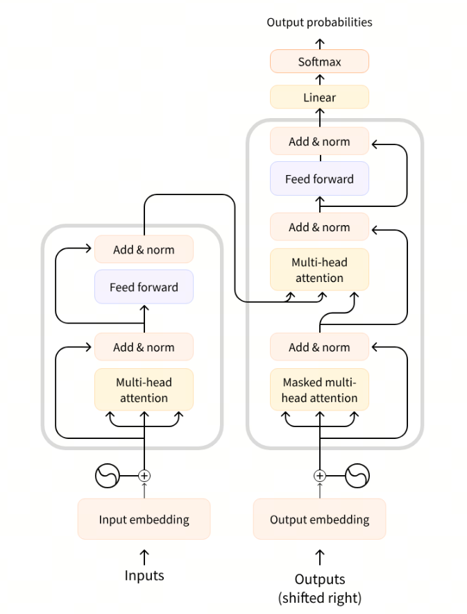
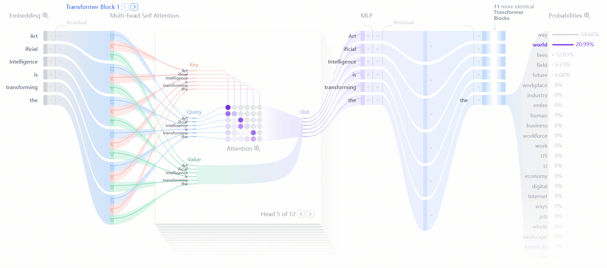
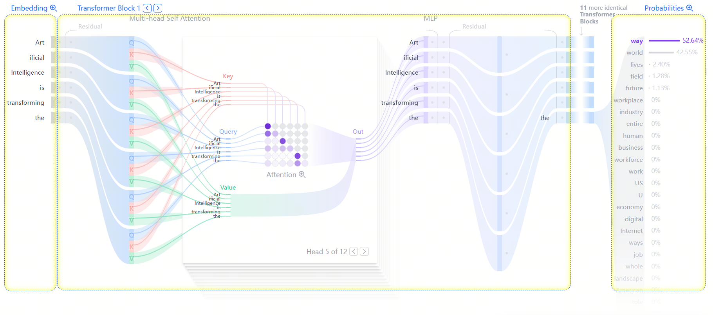
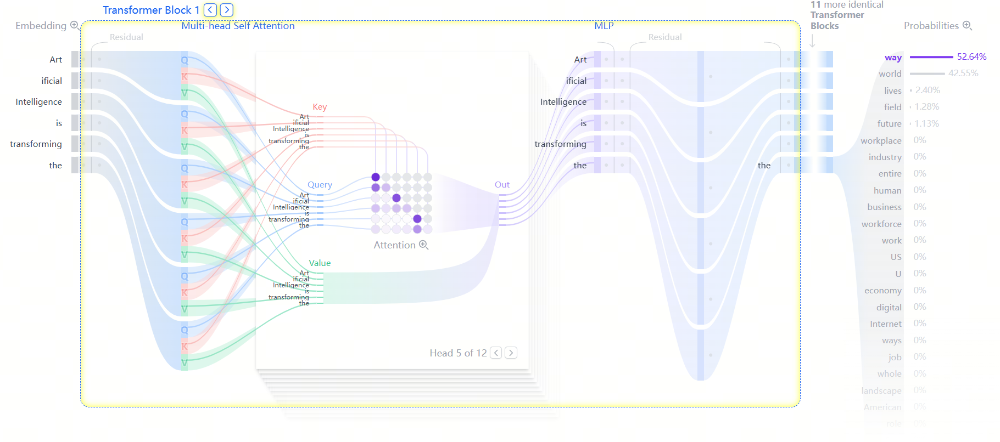
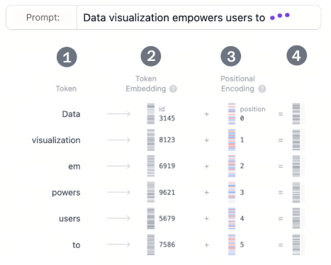
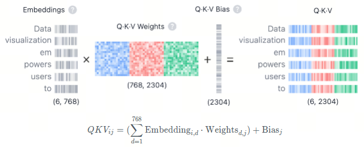
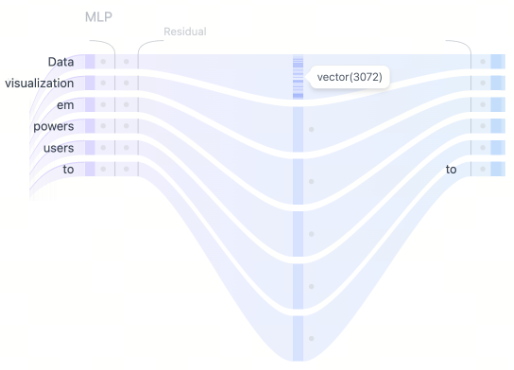
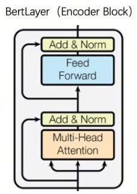
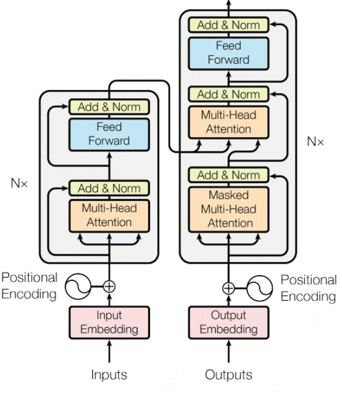

# 第1课时：Transformer 核心与 Self-Attention 深度剖析

## 1. Transformer基础入门

在聊 Transformer 之前，先想象一下：如果没有它，现代大语言模型就像一支乐队，没有指挥，每个乐器都各自为战，节奏混乱。Transformer 就是那位聪明的指挥，让模型能够同时关注每个词的位置和关系，从而谱出连贯的“语言交响曲”。

### 1.1 Transformer的诞生与核心思想

当我们第一次使用 ChatGPT 这类聊天模型时，最直观的感受往往是：你输入一个问题，它会像人在“思考”一样，一字一句地给出回答。


这种逐字生成的过程并非一次性输出完整答案，而是模型在不断基于已有上下文，预测下一个最可能出现的 token。看似自然流畅的对话背后，其实隐藏着一个极其简单、却被反复执行了数十亿次的核心问题：

> 在当前上下文条件下，下一个 token 应该是什么？

正是围绕这一问题，现代文本生成模型构建起了完整的技术体系。而支撑这一切的底层结构，正是 Transformer。

从更宏观的角度看，Transformer 并不仅仅是一个用于“聊天”的模型结构。自 2017 年 Google 在论文《Attention Is All You Need》中首次提出 Transformer 以来，它已经从根本上改变了人工智能模型的构建方式，成为深度学习领域的通用架构范式。如今，无论是 OpenAI 的 GPT 系列、Meta 的 LLaMA，还是 Google 的 Gemini，其核心都建立在 Transformer 之上。更进一步，Transformer 早已超越文本领域，被广泛应用于语音生成、图像识别、蛋白质结构预测，甚至复杂博弈与决策任务中，展现出极强的通用性。

从本质上说，文本生成类 Transformer 模型遵循的始终是同一条基本原则：**next-token prediction**。给定一段用户输入的文本，模型所做的全部工作，就是估计在当前上下文条件下，下一个 token 出现的概率分布，并从中采样或选择最优结果。这一过程被不断重复，最终形成我们所看到的连贯回答。

Transformer 真正的技术突破，正是为这一预测任务提供了一种前所未有的高效实现方式。

在 Transformer 出现之前，自然语言处理领域主要依赖循环神经网络（RNN）及其变体 LSTM、GRU 来建模序列。这类模型通过时间步逐步传递隐藏状态，天然符合语言的顺序特性，但也带来了明显限制：一方面，序列计算必须严格按顺序进行，难以并行，训练效率低；另一方面，随着文本变长，早期信息会逐渐衰减，长距离依赖难以稳定建模。

Transformer 的设计选择了完全不同的路径。它**彻底放弃了循环结构**，转而引入自注意力机制（Self-Attention），使模型能够在同一时间关注序列中的所有位置，并显式计算任意两个 token 之间的关联强度。模型不再沿着时间轴被动前进，而是主动在整个上下文中寻找“与当前预测最相关的信息”。这也是为什么，在聊天场景中，即便某个概念出现在很早的位置，模型依然能够在后续回答中准确引用并延续语义。

如果说 Transformer 解决的是“模型如何理解上下文”的问题，那么另一个几乎同期的重要工作，则回答了“模型如何学会语言”。FastAI 团队在《Universal Language Model Fine-tuning for Text Classification（ULMFiT）》中系统性地提出了迁移学习在 NLP 中的实践路径。他们证明：一个在大规模通用文本上训练好的语言模型，可以通过少量标注数据，高效迁移到具体下游任务上，并显著优于从零训练的方案。这一思想后来被概括为今天广为人知的范式：

> 预训练（Pre-training） + 微调（Fine-tuning）

Transformer 提供了强大的结构表达能力，而 ULMFiT 则证明了通用语言模型本身具有高度可迁移性。二者结合，直接催生了两类具有代表性的模型架构：

* GPT：基于 Transformer Decoder，通过自回归方式逐 token 生成文本；
* BERT：基于 Transformer Encoder，通过双向上下文建模获取语义表示。

从此，自然语言处理正式进入以 Transformer 为核心的时代。


需要特别强调的是，Transformer 真正改变游戏规则的，并不仅仅是网络结构本身，而是它所依赖的训练范式。现代大模型普遍采用自监督学习（Self-supervised Learning），训练信号直接从原始文本中自动构造，而不依赖人工逐句标注。最典型的两类预训练任务包括：

* 因果语言建模（Causal Language Modeling, CLM）：预测下一个 token；
* 遮盖语言建模（Masked Language Modeling, MLM）：预测被遮盖的词。

通过在海量语料上反复执行这些任务，模型逐渐掌握了词法、句法、语义乃至部分世界知识。从表面看，它只是不断地“猜词”；但在规模足够大、训练足够充分时，这种统计学习会自然涌现出复杂的语言理解与生成能力。

在许多教学和可视化工具中，GPT-2 这类模型常被用作理解 Transformer 的起点。例如 Transformer Explainer 所采用的 GPT-2 Small 模型，虽然只有 1.24 亿参数，远不及当前的前沿模型规模，但其内部结构、注意力机制和逐 token 生成逻辑，与今天的大模型在本质上是一致的。这也使得它成为理解 Transformer 工作原理的理想范例。

从用户熟悉的聊天体验一路回溯，Transformer 的核心思想其实可以概括为一句话：

> 用自注意力理解上下文，用自监督学习掌握语言。

正是这一思想，使得语言模型不再依赖人工规则或任务专用结构，而是通过规模化预训练获得通用能力，并不断向多模态、工具调用与复杂推理扩展。今天我们所看到的 ChatGPT、GPT-4、T5 等模型，本质上都是这一技术路线的自然延伸。

### 1.2 Encoder 与 Decoder的区别与应用

要真正理解 Transformer，就必须先搞清楚它的两个主角 —— Encoder（编码器） 和 Decoder（解码器）。

原始的 Transformer 模型结构如下图所示，Encoder 在左，Decoder 在右。



它们的关系有点像一场对话中的两种角色：

* Encoder 是那个“听懂别人说话的人”，
* 而 Decoder 是那个“把意思说出来的人”。

**Encoder：理解输入的“听者”**

Encoder 模块的任务是理解输入文本的含义。

它会把输入的每个词转换成向量，然后通过一层层的自注意力机制，让这些词互相“看见”彼此，从而捕捉上下文语义。

简单来说，Encoder 不只是逐词阅读，而是能在读到 “猫坐在垫子上” 时意识到：

* “猫” 是主语，
* “坐” 是动作，
* “垫子” 是宾语。

这就是 Transformer 最厉害的地方——它能同时关注整个句子。

而且因为它是双向注意力（Bidirectional Attention），Encoder 可以同时看到词前后的信息，因此非常适合需要“理解语义”的任务，比如：

* 文本分类（情感分析、主题识别）
* 命名实体识别（NER）
* 相似度匹配（句子对判断）

代表模型：BERT、RoBERTa、ELECTRA、DeBERTa 等。

Decoder：生成输出的“说者”

Decoder 的任务刚好相反——它负责根据已有信息生成新的文本。

它的输入通常是上一步已经生成的内容，而输出则是下一个要生成的词。

比如，当 Decoder 已经生成了“我今天”，它会尝试预测接下来该输出什么：

> “我今天 **很开心**。”

与 Encoder 不同，Decoder 使用的是自回归注意力（Auto-regressive Attention）：

它只能“看到”自己前面生成的词，而不能偷看未来的内容。

在训练时，为了防止“作弊”，我们会用一个叫 Mask（遮盖） 的机制，把未来词的信息挡住，让模型只能依靠历史内容生成下一步。

这种逐词生成的方式让 Decoder 特别适合生成类任务，比如：

* 文本续写、故事生成
* 摘要生成
* 对话回复
* 代码补全

代表模型：GPT、GPT-2、GPT-3、LLaMA、Qwen、ChatGPT 等。

**Encoder-Decoder：理解 + 生成的“翻译官”**

原始的 Transformer（2017）其实是为机器翻译设计的，因此它同时拥有 Encoder 和 Decoder 两部分。

工作原理非常直观：

* Encoder 负责理解源语言（比如英文）；
* Decoder 负责在另一种语言中生成对应句子（比如中文）。

举个例子：

输入句子 “I love apples.”

Encoder 理解到这句话的语义是 “我喜欢苹果”，

Decoder 结合上下文生成 “我喜欢苹果”。

这种架构也被称为 Seq2Seq（Sequence-to-Sequence）模型，

是连接理解与生成的桥梁，非常适合需要“输入→输出”的任务：

* 机器翻译（Translate English → Chinese）
* 文本摘要（长文 → 短摘要）
* 生成式问答（Question → Answer）

代表模型：T5、BART、FLAN-T5、M2M-100 等。

!!! tip "提示"
    Transformer 的威力，不仅在于注意力机制，更在于它灵活的结构组合。你可以只用 Encoder 来做“理解型任务”，也可以只用 Decoder 来做“生成型任务”，或者用 Encoder-Decoder 来同时理解输入并生成输出。一句话总结就是：Encoder 让模型听懂人话，Decoder 让模型说出人话。这也是所有现代大语言模型的基本结构蓝图。

---

## 2. Transformer 层级结构

在上一节中，我们从聊天机器人的直观体验出发，看到了大语言模型是如何“一个 token 接一个 token”地生成回答的。无论回答看起来多么自然流畅，在模型内部，它始终围绕着同一个核心任务运转：给定当前这句话，预测下一个最可能出现的 token。要完成这一看似简单、实则极其复杂的预测过程，如下所示：

- 输入：“Artificial Intelligence is transforming the”
- 预测下个token：“world”



Transformer 在内部构建了一套高度模块化的层级结构，几乎所有文本生成类 Transformer，都可以抽象为三个相互衔接的关键组成部分：Embedding、Transformer Block，以及最终的输出概率计算。



首先是 **Embedding 阶段**。当用户输入一段文本时，模型并不会直接“理解句子”，而是先将文本切分为更小的单位，即 token。token 可以是一个完整的词，也可以是词的一部分。每一个 token 都会被映射为一个高维向量，这个向量被称为 embedding。Embedding 的作用，是把离散的符号转换为连续的数值表示，使模型能够在向量空间中刻画词语之间的语义相似性与差异性。换句话说，在这一阶段，语言被翻译成了模型可以计算的“数学形式”。

Embedding 之后，信息会进入模型的核心计算单元——**Transformer Block**。Transformer 并不是只包含一个 Block，而是将多个结构相同的 Block 进行堆叠，每一层都会在上一层的基础上，进一步提炼和重组语义信息。正是这种逐层加工，使得模型能够从“局部词义”逐渐过渡到“整体语境理解”。

在每一个 Transformer Block 内部，又包含两个至关重要的子模块。



- 第一个是注意力机制（Attention Mechanism），它是 Transformer 的核心创新。注意力的作用，是让每一个 token 在生成自身表示时，都能够动态地参考序列中其他 token 的信息。通过注意力，模型可以判断：在当前预测任务中，哪些词更重要，哪些上下文应该被重点关注。这正是模型能够处理长距离依赖、跨句关联的根本原因，也是聊天模型在长对话中“记得住前文”的关键所在。
- 第二个子模块是前馈网络（MLP，Multilayer Perceptron）。与注意力层负责“信息在 token 之间如何流动”不同，MLP 的作用更偏向于“对单个 token 的表示进行非线性变换和细化”。它对每个 token 独立工作，增强表示的表达能力，使模型能够刻画更加复杂、抽象的语义特征。可以将注意力理解为“信息路由器”，而 MLP 则是“特征加工器”。

当输入文本依次通过多层 Transformer Block 后，每个 token 都会得到一个高度语义化的向量表示。此时，模型已经整合了上下文信息、句法结构以及潜在的语义关系。最后一步是输出概率的计算。模型会通过一个线性映射和 softmax 层，将当前上下文对应的向量表示转换为一个概率分布。这个分布覆盖整个词表，表示“下一个 token 是每一个候选 token 的可能性有多大”。模型正是基于这个概率分布，选择或采样出下一个 token，并将其追加到已有文本中，形成新的上下文。随后，同样的过程会再次执行：新的上下文被送入模型，预测下一个 token，如此循环，直到生成完整回答。

从整体上看，Transformer 并不是在“理解问题然后给出答案”，而是在不断重复一个高度结构化的过程：**将文本转为向量，通过多层注意力与非线性变换整合上下文信息，再基于概率分布预测下一个 token**。正是这一过程的高速迭代，构成了我们在聊天界面中所看到的逐字响应体验。在接下来的小节中，我们将沿着这一生成路径，逐层拆解 Transformer Block 的内部结构，具体看看注意力是如何计算的，多头机制又为何必不可少，以及残差连接与层归一化在其中扮演了怎样的稳定器角色。

### 2.1 Embedding

假设我们希望使用一个 Transformer 模型来生成文本，首先需要向模型提供一段输入提示，例如：

“Data visualization empowers users to”

然而，模型本身并不能直接“理解”字符串形式的文本。它所能处理的，是数值形式的数据。这正是 Embedding 层存在的意义：**将自然语言文本转换为模型可以计算和建模的向量表示**。

从整体流程上看，将一段输入文本转换为 embedding，通常需要经历四个步骤：

1. Tokenization（分词）
2. Token Embedding（词向量映射）
3. Positional Encoding（位置编码）
4. 生成最终 Embedding 表示

下面我们依次展开说明这四个步骤。



#### Step 1：Tokenization（分词）

Tokenization 是将输入文本拆分为更小、可处理单元的过程，这些单元被称为 token。token 可以是一个完整的词，也可以是词的一部分（子词）。

以示例文本 “Data visualization empowers users to” 为例，在 GPT-2 的分词体系中：

- “Data”
- “visualization”
- “empowers”
- “users”
- “to”

都会被映射为词表中唯一的 token（或 token 组合），每个 token 对应一个固定的 ID。需要注意的是，token 的切分方式完全由模型在训练前所使用的词表决定。以 GPT-2 为例，它的词表规模约为 50,257 个 token。一旦文本被转换为一串 token ID，模型就可以基于这些 ID 查找对应的向量表示。

#### Step 2：Token Embedding（词向量映射）

在 GPT-2（small）模型中，每一个 token 都被表示为一个 768 维的向量。所有 token 的向量共同组成一个巨大的 embedding 矩阵，其形状为：

(50,257, 768)

这意味着，仅 embedding 层本身就包含约 3900 万个可训练参数。

这个 embedding 矩阵并不是人工设计的，而是在模型训练过程中自动学习得到的。训练完成后，具有相似语义或使用场景的 token，其向量往往会在高维空间中彼此接近；而语义差异较大的 token，则会相距较远。正是这种分布式表示，使模型能够在数值空间中“感知”语言的语义结构。

#### Step 3：Positional Encoding（位置编码）

仅有 token embedding 还不够。因为 Transformer 本身不包含循环结构，也无法天然感知词语的先后顺序，因此必须显式地引入位置信息。

Embedding 层会为序列中的每一个位置提供一个位置编码，用来表示该 token 在输入序列中的相对或绝对位置。不同模型采用的位置编码方式并不相同。

在 GPT-2 中，位置编码同样是通过一个可训练的向量矩阵实现的。这些位置向量在训练过程中与 token embedding 一同被优化，从而让模型学会如何利用顺序信息。

#### Step 4：Final Embedding（最终嵌入表示）

在最后一步中，模型会将 token embedding 与对应位置的 positional encoding 进行逐元素相加，得到最终的 embedding 表示。

这个最终 embedding 同时包含了两类关键信息：

- token 的语义含义
- token 在序列中的位置信息

随后，这些 embedding 向量将作为 Transformer Block 的输入，进入注意力机制和后续的多层计算过程。正是从这一刻起，模型开始真正对“上下文关系”进行建模，并逐步为下一个 token 的预测做好准备。

### 2.2 Transformer Block

Transformer 的核心计算单元是 Transformer Block。一个标准的 Transformer Block 由两部分组成：多头自注意力（Multi-Head Self-Attention）和前馈神经网络（Multi-Layer Perceptron，MLP）。实际模型通常会将多个这样的 Block 按顺序堆叠起来，形成深层网络结构。

随着输入 token 表示从第一层 Transformer Block 逐层传递到最后一层，它们所携带的信息也在不断演化：从最初偏向词法和局部上下文的表示，逐渐转变为包含更高阶语义、跨句依赖甚至任务相关信息的抽象表示。正是这种“层层加工”的机制，使模型能够对每一个 token 建立起精细而全面的理解。

以 GPT-2（small）为例，它正是由多层这样的 Transformer Block 依次堆叠而成。

#### 多头自注意力机制（Multi-Head Self-Attention）

自注意力机制的核心作用，是让序列中的每一个 token 都能够根据上下文中其他 token 的信息来更新自身表示。换句话说，每个 token 在“看自己”的同时，也会参考其他 token，从而建立上下文依赖关系。

多头机制的引入，使模型可以从不同角度同时建模这些关系。例如，某些注意力头可能更关注局部的语法结构，而另一些则更擅长捕捉长距离的语义关联。下面我们分步骤来看多头自注意力是如何计算的。

##### Step 1：Query、Key 和 Value 的计算



对于输入序列中的每一个 token，其 embedding 向量都会被映射为三个不同的向量：Query（Q）、Key（K）和 Value（V）。这一映射通过与三组可学习的线性变换矩阵相乘并加上偏置完成，其形式可以表示为：

$$
QKV_{ij} = \left( \sum_{d=1}^{768} \text{Embedding}_{i,d} \cdot \text{Weights}_{d,j} \right) + \text{Bias}_j
$$

也就是说，同一个 token 的 embedding 会分别生成 Q、K、V 三种表示，用于后续的注意力计算。

为了直观理解 Q、K、V 的作用，可以类比为一次网页搜索过程：

- Query（Q）类似于你在搜索框中输入的查询词，代表当前 token 想要“关注什么”；
- Key（K）类似于搜索结果中每个网页的标题，用来与查询词进行匹配；
- Value（V）则对应网页的实际内容，一旦匹配成功，模型真正要读取和汇总的就是这些内容。

通过 Q、K、V 的组合，模型能够计算出不同 token 之间的相关程度，从而决定在生成表示时应当重点关注哪些位置。

##### Step 2：多头拆分（Multi-Head Splitting）

在多头自注意力中，Query、Key 和 Value 向量会被拆分成多个子空间，也就是多个注意力头。以 GPT-2（small）为例，这些向量会被拆分为若干个注意力头，每个头只负责处理 embedding 的一部分维度。

每个注意力头都会独立执行自注意力计算，从而学习不同类型的语言特征。这种并行的设计，使模型能够同时捕捉多种语法和语义模式，大幅提升表达能力。

##### Step 3：Masked Self-Attention（带掩码的自注意力）

在每一个注意力头内部，模型都会执行带掩码的自注意力计算。这一步对于文本生成模型尤为关键，因为它确保模型在预测下一个 token 时，不能访问未来的信息。


具体过程包括：

- 点积计算：将 Query 矩阵与 Key 矩阵做点积，得到一个注意力分数矩阵，用于表示序列中任意两个 token 之间的相关性；
- 缩放与掩码：对注意力分数进行缩放，并对矩阵的上三角区域施加掩码，将对应位置的值设为负无穷，从而阻止模型“偷看”尚未生成的 token；
- Softmax 与 Dropout：对掩码后的分数应用 softmax，将其转化为概率分布，使每一行的概率和为 1，并在训练时可选地使用 dropout 进行正则化。

经过这一步，模型就得到了一个只依赖历史信息的注意力权重分布。

##### Step 4：输出计算与拼接

最后，模型使用得到的注意力权重对 Value 矩阵进行加权求和，生成每个注意力头的输出表示。由于每个头关注的侧重点不同，它们的输出也会捕捉到不同层面的关系。

这些注意力头的输出会被拼接在一起，并通过一个线性变换映射回原始维度，形成多头自注意力模块的最终输出。该结果随后会进入后续的残差连接、层归一化以及 MLP 层，继续完成一次 Transformer Block 的完整计算。

#### MLP：多层感知机（Multi-Layer Perceptron）



在多头自注意力机制捕获了输入 token 之间的多样化关系之后，将各个注意力头的输出进行拼接，并送入多层感知机（MLP）层，以进一步提升模型的表示能力。MLP 模块由两次线性变换组成，中间采用 GELU 激活函数。

第一层线性变换将输入的维度扩大四倍，从 `768` 扩展到 `3072`。这一扩展步骤使模型能够将 token 表示映射到更高维的空间中，从而捕获在原始维度下难以显现的、更丰富且更复杂的特征模式。

第二层线性变换再将维度压缩回原始大小 `768`。这一压缩步骤在保留扩展阶段引入的有用非线性变换的同时，使表示重新回到一个可控的维度规模。

与自注意力机制不同，自注意力负责在不同 token 之间进行信息交互，而 MLP 则是对每个 token 独立进行处理，仅在特征空间中完成从一种表示到另一种表示的映射，从而整体上增强模型的表达能力。

### 2.3 Output Probabilities

在输入依次通过所有 Transformer 模块之后，最终的输出会被送入最后一层线性层，以为 token 预测做准备。该线性层将最终的表示投影到一个维度空间中，在这个空间里，词表中的每一个 token 都对应一个数值，称为 **logit**。由于任意一个 token 都可能成为下一个词，这一步使我们能够根据这些 logit 对所有 token 作为下一个词的可能性进行排序。随后，我们应用 **softmax** 函数，将 logit 转换为一个和为 1 的概率分布，从而可以根据各自的概率对下一个 token 进行采样。词表大小为 `50,257`。


词表中的每个 token 都会根据模型输出的 logit 被分配一个概率，这些概率决定了各个 token 成为序列中下一个词的可能性。最后一步是从该概率分布中采样生成下一个 token。在这一过程中，**temperature（温度）** 这一超参数起着至关重要的作用。从数学角度来看，这一步的操作非常简单：模型输出的 logit 会直接除以温度参数 `temperature`。

- **temperature = 1**：logit 除以 1 不会对 softmax 的输出产生任何影响。  
- **temperature < 1**：较低的温度会使概率分布更加尖锐，使模型更自信、更具确定性，从而生成更加可预测的输出。  
- **temperature > 1**：较高的温度会使概率分布更加平滑，允许生成结果中包含更多随机性，也就是常说的模型“创造力”。

此外，采样过程还可以通过 **top-k** 和 **top-p** 参数进一步优化：

- **top-k 采样**：将候选 token 限制在概率最高的前 k 个 token 中，过滤掉概率较低的选项。  
- **top-p 采样**：选择累计概率超过阈值 p 的最小 token 集合，在保证只考虑高概率 token 的同时，仍然保留一定的多样性。

通过调节 **temperature**、**top-k** 和 **top-p**，可以在确定性与多样性之间取得平衡，从而根据具体需求定制模型的生成行为。

### 2.4 辅助架构特性

Transformer 模型中包含若干辅助性的架构特性，用于提升模型的整体性能。尽管这些机制对模型性能至关重要，但相较于架构的核心概念，它们并不是理解 Transformer 工作原理的关键。**层归一化（Layer Normalization）**、**Dropout** 和 **残差连接（Residual Connections）** 是 Transformer 模型中的重要组成部分，尤其在训练阶段发挥着关键作用。层归一化能够稳定训练过程并加快模型收敛；Dropout 通过随机失活神经元来防止过拟合；残差连接则允许梯度在网络中直接传播，有助于缓解梯度消失问题。

#### 层归一化

层归一化（Layer Normalization）有助于稳定训练过程并提升收敛速度。它通过在特征维度上对输入进行归一化，确保激活值的均值和方差保持一致。这种归一化方式可以缓解内部协变量偏移问题，使模型能够更高效地学习，并降低对初始权重设置的敏感性。在每个 Transformer 块中，层归一化会被应用两次：一次位于自注意力机制之前，另一次位于 MLP 层之前。

#### Dropout

Dropout 是一种用于防止神经网络过拟合的正则化技术，在训练过程中会随机将一部分激活值（或神经元输出）置为零。这一机制促使模型学习更加鲁棒的特征，减少对某些特定神经元的依赖，从而提升网络在未见数据上的泛化能力。在模型推理阶段，Dropout 会被关闭。这在本质上等价于使用一组已训练子网络的集成，从而带来更好的模型性能。

#### 残差连接

残差连接（Residual Connections）最早由 ResNet 模型在 2015 年提出，这一架构创新极大地推动了深度学习的发展，使得训练非常深的神经网络成为可能。残差连接本质上是一种“捷径”结构，它绕过一层或多层网络，将某一层的输入直接加到该层的输出上。这种设计有助于缓解梯度消失问题，使得由多个 Transformer 块堆叠而成的深层网络更容易训练。在 GPT-2 中，每个 Transformer 块内部使用了两次残差连接，分别作用在 self-attention 子层和 MLP 子层的输出上，从而保证梯度能够更顺畅地传播，并使较早的层在反向传播过程中获得充分的更新。

#### 交互式功能

Transformer Explainer 被设计为一个交互式工具，允许用户探索 Transformer 的内部工作机制。你可以体验以下交互功能：

- 输入你自己的文本序列，观察模型如何对其进行处理并预测下一个词；同时可以查看注意力权重和中间计算过程，了解最终输出概率是如何得到的。  
- 使用 **temperature** 滑块来控制模型预测的随机性，通过调整温度值，探索如何让模型输出更加确定或更具创造性。  
- 选择 **top-k** 和 **top-p** 采样方法，以在推理阶段调整采样行为；尝试不同的参数取值，观察概率分布的变化及其对模型预测的影响。  
- 与注意力图进行交互，查看模型在输入序列中对不同 token 的关注程度；将鼠标悬停在 token 上可以高亮其对应的注意力权重，从而理解模型如何捕捉上下文信息以及词与词之间的关系。

---

## 3. 位置编码机制与序列建模能力

### 3.1 为什么 Attention 需要位置信息

在 Transformer 出现之前，序列建模这件事几乎是“顺序优先”的世界。

RNN、LSTM 这类模型，天然带着时间轴。输入从左到右流动，隐藏状态在时间步之间传递，前一个词的状态会直接影响后一个词的表示。模型不需要被提醒“顺序是什么”，因为顺序本身已经写进了计算图里。

这种结构很像听人讲故事：一句一句往下听，前文自然会留在记忆里。

Transformer 选择了一条完全不同的路。

它把整段序列一次性送进模型，所有 token 同时参与计算。没有时间步、没有状态传递，只有并行的向量运算和注意力权重的分配。效率大幅提升，但也带来了一个无法回避的问题：

> 当所有词是“同时出现”的，模型凭什么知道谁在前，谁在后？

如果什么都不做，Self-Attention 的计算在数学上是**对顺序不敏感的**。

Attention 天生是“无序”的，回忆一下 Self-Attention 的核心计算形式：

$$
\text{Attention}(Q, K, V) = \text{softmax}\left(\frac{QK^\top}{\sqrt{d_k}}\right)V
$$

这里的含义是：

* $Q$（Query）：当前 token 的查询向量
* $K$（Key）：所有 token 的键向量
* $V$（Value）：所有 token 的值向量
* $d_k$：Key 向量的维度，用于缩放防止数值过大

注意力权重完全由 $Q$ 与 $K$ 的**点积相似度**决定。

如果把一句话里的词向量打乱顺序，只要向量集合本身不变，$QK^\top$ 的结果在理论上并不会感知到“这是第几个词”。

也就是说，**Attention 关心的是“相像不相像”，而不是“先后顺序”**。

顺序一旦消失，语义就会塌陷。看一个极其简单、却足够致命的例子：

> “猫咬狗”
> “狗咬猫”

从词袋角度看，它们包含的词完全一致：猫、狗、咬。

如果模型不知道哪个词排在前面，注意力看到的只是三种语义单位之间的相互关系，却无法判断谁是施事，谁是受事。语义结构在这里直接发生翻转。

这类问题并不仅存在于中文。

* 英文中的 *“man bites dog”* 与 *“dog bites man”*
* 代码中的 `a = b - c` 与 `c - b = a`
* 数学表达式里的操作顺序

顺序一旦丢失，模型得到的将不再是“模糊理解”，而是**错误理解**。

为了解决这个问题，Transformer 引入了位置编码（Positional Encoding）。它并不是试图恢复循环结构，而是换了一种思路：

> 既然 Attention 看不到顺序，那就把“顺序”直接写进向量里。

每一个 token，在进入模型之前，都会被赋予一个与其位置相关的向量表示。最终送入模型的不是单纯的词向量，而是两部分信息的叠加：

$$
\mathbf{x}_i = \mathbf{e}_i + \mathbf{p}_i
$$

其中：

* $\mathbf{e}_i$：第 $i$ 个 token 的词向量（Token Embedding）
* $\mathbf{p}_i$：第 $i$ 个位置对应的位置编码向量
* $\mathbf{x}_i$：Transformer 实际接收的输入表示

这种设计非常“克制”。模型结构本身没有任何改动，Attention 的计算公式也保持不变，只是输入空间悄悄发生了变化。

可以用一个简化的文字示意来理解这个过程：

```
原始输入：
[猫]   [咬]   [狗]

词向量：
e1     e2     e3

位置向量：
p1     p2     p3

叠加后输入：
e1+p1  e2+p2  e3+p3
```

从这一刻开始，“猫”不再只是“猫”，而是**“出现在第 1 个位置的猫”**；
“狗”也不再只是“狗”，而是**“出现在第 3 个位置的狗”**。

注意力在计算相似度时，实际上是在这些混合了位置信息的向量之间做比较。

在 PyTorch 中，这种叠加过程往往只有一行：

```python
# token_embeddings: [seq_len, d_model]
# position_embeddings: [seq_len, d_model]

inputs = token_embeddings + position_embeddings
```

从工程实现角度看，它几乎“轻得没有存在感”。正是这一步，让 Transformer 在没有时间结构的前提下，具备了理解序列的能力。这里有一个经常被忽略的小细节。

位置编码不是拼接（concatenate），而是直接相加。这意味着：

* 模型不会被强制区分“哪一部分是位置，哪一部分是语义”
* 位置信息自然融入表示空间，由注意力机制自行决定是否使用、如何使用

这种设计让位置不再是硬规则，而是一种可学习、可忽略、可放大的信号。它既不会压制语义，也不会喧宾夺主。到这里，Attention 为什么“离不开位置”，已经变得清晰起来。Transformer 并不是不懂顺序，而是需要有人告诉它顺序以什么方式存在。位置编码正是那条连接并行计算与序列理解之间的隐形桥梁。接下来，问题自然就变成了：这些位置信息究竟该怎么编码？这正是后续章节要展开的内容。

### 3.2 绝对位置编码

当位置被正式当作一种建模对象之后，实际工程里很快形成了两条清晰的路线。它们并不是“新旧之分”，而是代表了两种不同的建模态度：**位置是规则，还是参数**。围绕这个分歧，绝对位置编码逐渐稳定为两种主流实现方式。

一种是固定位置编码，也就是最早写进《Attention Is All You Need》的正弦位置编码；另一种是可学习的位置嵌入，把“位置”本身当作模型可以调整的参数来看待。

先从固定位置编码说起。

正弦位置编码的出发点并不复杂：既然模型需要一个数值向量来表示“这是第 pos 个位置”，那就用一组规则函数来生成它。关键不在于某一个具体数值，而在于**不同位置生成的向量在整体上彼此区分，同时又保持某种连续结构**。

它的定义形式通常写成下面这样（以偶数维和奇数维成对表示）：

$$
\text{PE}_{(pos, 2k)} = \sin\left(\frac{pos}{10000^{\frac{2k}{d}}}\right)
$$

$$
\text{PE}_{(pos, 2k+1)} = \cos\left(\frac{pos}{10000^{\frac{2k}{d}}}\right)
$$

这里各个符号的含义是明确的：

* $pos$ 表示 token 在序列中的绝对位置索引，常见实现里从 0 开始计数
* $k$ 是“频率编号”，每一对 $(\sin, \cos)$ 共用一个 $k$
* $d$ 是模型的隐藏维度（embedding size），决定一共能放下多少对频率
* $\text{PE}_{(pos, i)}$ 是位置 $pos$ 在第 $i$ 个维度上的编码值

把这个公式拆开来看，其实是在做一件很有节奏感的事情：
低维使用变化缓慢的波形，高维使用变化迅速的波形，不同频率叠加在一起，构成一个唯一的“位置指纹”。

如果用文字来画一幅示意图，大致可以这样理解：

```
低维：  ——~~~~——~~~~——    （变化慢，关注远距离）
中维：  ~-~-~-~-~-~-~-~    （中等节奏）
高维：  ^^^^^^^^^^^^^^    （变化快，区分相邻位置）
```

所有这些波形在同一个向量里叠加，位置就不再是一个标量，而是一种多尺度信号。

这种设计背后还有一个很关键、但常被一笔带过的性质。利用三角函数的角和公式，可以得到：

$$
\sin(a+b) = \sin a \cos b + \cos a \sin b
$$

$$
\cos(a+b) = \cos a \cos b - \sin a \sin b
$$

这意味着什么？
如果把位置从 $pos$ 平移到 $pos+m$，新的正弦 / 余弦值可以由原来的值通过一个**固定的线性变换**得到。换句话说，对于同一对维度而言，$\text{PE}_{pos+m}$ 与 $\text{PE}_{pos}$ 之间存在稳定的线性关系。

这正是常说的那句话背后的直觉来源：
“正弦位置编码有利于模型学习相对位置信息”。

模型并不需要显式地知道 $m$ 是多少，只要注意力层学会利用这些线性结构，就能捕捉“相隔多远”这一概念。

为了让这种编码方式更具体一些，可以看一个完整的小例子。

假设句子是：

“I love natural language processing.”

分词后得到 6 个 token：

[I | love | natural | language | processing | .]

其中 “natural” 的位置索引是 $pos = 2$。为了便于展示，假设模型的隐藏维度是 $d = 8$，也就是说一共有 $d/2 = 4$ 对 $(\sin, \cos)$ 频率，对应 $k = 0, 1, 2, 3$。

逐对计算后，可以得到位置 $pos=2$ 的位置向量：

```
[
  0.9093,   -0.4161,
  0.1987,    0.9801,
  0.0200,    0.9998,
  0.0020,    0.999998
]
```

可以把它理解为：
同一个位置，被拆解成了“慢节奏—中节奏—快节奏”几组信号。低频部分帮助模型感知长距离关系，高频部分对相邻 token 的顺序变化极其敏感，中间频率则填补两者之间的尺度空白。一个向量里，同时容纳了局部与全局的位置信息。

从工程角度看，这种位置编码还有一个非常现实的优势：**它不需要任何可训练参数**。不管模型有没有见过这个长度，只要代入公式，就能算出对应的位置向量。这也是早期 Transformer 在面对更长序列时，仍然具备一定外推能力的重要原因。

不过，规则也意味着约束。一旦位置向量完全由公式决定，模型就失去了根据具体任务去“微调顺序表达”的空间。某些任务可能并不需要这么规则的频率结构，却依然被迫接受它。

正因为如此，另一种绝对位置编码方式逐渐成为主流选择——可学习的位置嵌入。

这种方式几乎没有数学花样：直接维护一个大小为 [max_len, d] 的参数矩阵，每一个位置对应一行向量。训练过程中，这些向量会和词向量、注意力权重一起被更新。

从实现上看，代码甚至比正弦编码更直观：

```python
import torch
import torch.nn as nn

position_embedding = nn.Embedding(max_len, d_model)
positions = torch.arange(seq_len)
pos_emb = position_embedding(positions)
```

这种做法的好处在于自由。模型可以根据数据分布，自行决定哪些位置更重要、哪些可以弱化，表达能力明显更强。BERT 等模型正是基于这种位置编码方式构建的。

但代价同样直接：位置表是“有限的”。训练时只见过 $[0, L)$ 的位置，推理时一旦超出这个范围，模型就会失去坐标参照。

从更抽象的层面来看，绝对位置编码无论采用哪种形式，本质都在做同一件事：**为每一个位置分配一个固定坐标**。Attention 在这个坐标系中运作，才能区分前后。

只是，当模型开始关心“两个词之间隔了多远”，而不只是“它们各自在哪个编号上”时，绝对坐标的表达方式便显得有些笨重了。这种张力，正好引出了后面要讨论的相对位置编码思想。

### 3.3 相对位置编码思想引入

当绝对位置编码被反复使用之后，一个逐渐清晰的分歧开始浮现：模型在很多时候真正关心的，并不是“你在第 37 个位置”，而是**“你离我有多远”**。在阅读一句话时，人并不会在脑中默默标注“这是第几个词”。更多时候，理解依赖的是相对关系——修饰是否相邻，主谓是否隔得很远，依赖是否跨越多个从句。对模型而言，这种“相对感”同样重要。这正是相对位置编码思想出现的背景。

相对位置编码的核心直觉可以用一句话概括：**位置不是坐标，而是关系。**

在绝对位置编码中，每个 token 被分配一个独立的位置向量 $\mathbf{p}_i$；而在相对位置编码中，模型更在意的是两个 token 之间的距离 $j - i$，而不是 $i$ 和 $j$ 本身。这在注意力机制里尤为自然。回到 Self-Attention 的计算：

$$
\text{Attention}(Q, K, V) = \text{softmax}\left(\frac{QK^\top}{\sqrt{d_k}}\right)V
$$

本质上，注意力是在问这样一个问题：“当前 token（Query）应该向哪些 token（Key）分配更多注意力？”如果两个词在语义上相关，但距离很远，模型可能需要额外的位置信息来调节这种相关性；反过来，距离很近的词，即使语义相似度一般，也往往更值得关注。相对位置编码，正是把这种“距离感”直接引入注意力权重计算中。

在早期的一些相对位置编码方案中，做法相对直接：为每一种相对距离 $r = j - i$ 引入一个独立的向量或偏置，并在计算注意力分数时加入进去。这样一来，注意力分数不再只是 $Q_i \cdot K_j$，而是变成了“语义相似度 + 距离影响”。不过，这类方法在工程上往往比较复杂，对长序列的支持也不够友好。真正让相对位置编码走向主流的，是后面两种设计思路：RoPE 和 ALiBi。

**RoPE（Rotary Position Embedding）**

RoPE 的切入点很巧妙：它并不显式地给注意力打分加偏置，而是直接作用在 Query 和 Key 向量本身。通过一种“旋转”的方式，把位置信息编码进向量的相位中。

直觉上可以这样理解：每个位置对应一个旋转角度，位置不同，旋转幅度不同；Query 和 Key 在同一套角度体系下旋转后，它们的点积结果自然会体现出相对位置信息。在数学形式上，RoPE 通常把向量按偶、奇维度分组，每一对维度看作一个二维平面，然后进行旋转变换。对于位置 $pos$ 和频率索引 $k$，定义旋转角：

$$
\theta_{pos, k} = pos \cdot \omega_k
$$

其中 $\omega_k$ 是与维度相关的频率常数，常见形式与正弦位置编码中的频率设置相似。

对某一对维度 $(x_{2k}, x_{2k+1})$，旋转后的结果为：

$$
\begin{pmatrix}
x'_{2k} \\
x'_{2k+1}
\end{pmatrix}
=
\begin{pmatrix}
\cos \theta_{pos,k} & -\sin \theta_{pos,k} \\
\sin \theta_{pos,k} & \cos \theta_{pos,k}
\end{pmatrix}
\begin{pmatrix}
x_{2k} \\
x_{2k+1}
\end{pmatrix}
$$

这里的变量含义是：

- $(x_{2k}, x_{2k+1})$：原始 Query 或 Key 向量中的一对维度  
- $\theta_{pos,k}$：与位置 $pos$ 和维度 $k$ 相关的旋转角  
- $(x'_{2k}, x'_{2k+1})$：旋转后的向量分量  

这种设计带来一个非常重要的性质：旋转后的 Query 与 Key 的点积，只与它们的相对位置差有关，而与绝对位置无关。也就是说，RoPE 在不显式引入“相对距离表”的情况下，让注意力分数天然具备了相对位置信息。这种方式计算稳定、实现简洁，在中等长度序列上表现尤为可靠，因此在 LLaMA、Qwen、GPT-NeoX 等模型中被广泛采用。

如果用文字示意来理解 RoPE：

```

同一词向量 → 不同位置 → 在不同角度被旋转
角度差 = 相对位置差
点积结果自然感知距离

```

不过，当上下文长度从几千 token 扩展到几万甚至更长时，问题并不只出现在算力或显存上，位置编码本身开始成为新的瓶颈。RoPE 的旋转角度是随位置线性增长的，一旦超过模型训练阶段见过的最大长度范围，角度分布便会显著偏离训练分布，注意力权重逐渐变得松散，模型对远距离信息的判断也随之失真。

围绕这一现象，业界提出了一系列 **RoPE Scaling** 方法，试图在**不改变模型主体结构、也不重新大规模训练**的前提下，让位置编码“延伸得更远”。这些方法在形式上往往只改动一个缩放因子，但背后隐含的假设并不相同。

其中最直观的一类做法是 **Linear Scaling**。它的核心思想是：如果模型是在最大长度 $L_{\text{train}}$ 上学到的旋转模式，那么在推理阶段面对更长的序列 $L_{\text{test}}$ 时，可以通过压缩位置编号，把超长序列重新映射回训练时熟悉的区间。

在原始 RoPE 中，第 $i$ 个位置并不是只对应**一个**旋转角，而是对每一组偶–奇维度对 $k$ 各有一个旋转角，其计算方式为：

$$
\theta_{i,k} = i \cdot \omega_k, \quad \omega_k = 10000^{-2k/d}
$$

其中，$i$ 表示 token 在序列中的位置索引（从 0 或 1 开始），$k$ 表示 RoPE 中的频率索引，对应向量的第 $k$ 组偶–奇维度对，$d$ 为该注意力头下的特征维度（与实现中 RoPE 作用的维度一致）；$\omega_k$ 是与维度相关的角频率，用于控制不同维度上的旋转速度，低频维度变化缓慢，高频维度变化更快。

在 Linear Scaling 下，位置相关的旋转角被重新缩放为：

$$
\theta_{i,k}^{\text{scaled}} = \frac{i}{s} \cdot \omega_k, \quad s = \frac{L_{\text{test}}}{L_{\text{train}}}
$$

这里，$s$ 是位置缩放系数，表示推理阶段序列长度相对于训练阶段最大长度的放大比例；$\theta_{i,k}^{\text{scaled}}$ 是缩放后的旋转角（对每组维度对 $k$ 分别计算），用于在超出训练长度的情况下生成仍位于“训练分布附近”的相位变化。

直观地看，这一做法相当于将长度为 $L_{\text{test}}$ 的位置轴按比例压缩回 $L_{\text{train}}$ 区间，使模型在更长序列上仍然接收到与训练阶段相似的相对位置信息。

```text
原始位置轴: 0 ---- 2048
扩展后位置: 0 ------------------------ 8192

Linear Scaling:
8192 上的位置 i
↓
映射回 2048 区间： i / 4
```

这种方式的最大优点是实现成本极低：只需在推理阶段对位置编号施加一个缩放系数，完全不需要修改模型权重或重新训练。在工程实践中，它往往是长上下文扩展的第一步尝试。

但相应的代价也很明显。由于所有位置被等比例压缩，远距离 token 之间的相位差被“挤在一起”，区分度随之下降。模型虽然可以“看到”更远的内容，但在处理精细的依赖关系、长链条推理或复杂逻辑时，表现往往不如原生长上下文训练的模型。因此，Linear Scaling 更适合**以覆盖范围为主的检索、摘要类任务**，而不太适合对位置关系高度敏感的精确推理场景。

**ALiBi（Attention with Linear Biases）**

与 RoPE 从“向量几何”入手不同，ALiBi（Attention with Linear Biases）走的是另一条更朴素的路线。ALiBi 的假设非常直接：**距离越远，注意力权重应该越小，而且这种衰减可以是线性的。** 在 ALiBi 中，并不修改 Query 和 Key 向量本身，而是在注意力打分阶段，为每一对 $(i, j)$ 加上一个与距离相关的偏置项：

$$
\text{score}_{i,j} = \frac{Q_i \cdot K_j}{\sqrt{d_k}} + b(i, j)
$$

其中偏置 $b(i, j)$ 通常定义为：

$$
b(i, j) = -\alpha \cdot |i - j|
$$

这里：

* $i, j$ 分别是 Query 和 Key 的位置索引
* $|i - j|$ 是它们之间的绝对距离
* $\alpha$ 是一个正数斜率，用来控制距离惩罚强度

距离越远，偏置越负，softmax 之后分到的注意力权重就越小。

ALiBi 的妙处在于，它几乎不引入额外参数，也不需要预先设定最大长度。无论序列多长，只要能计算距离，就能自然工作。这使得 ALiBi 在长文本建模和外推场景中表现得非常稳定。

从整体视角看，RoPE 和 ALiBi 虽然实现方式差异很大，但它们共享同一个理念：**位置不是静态标签，而是动态关系。** 一个通过旋转让向量“自带距离感”，一个通过偏置直接调节注意力强弱。它们都在试图回答同一个问题：在理解序列时，如何让模型更自然地感知“近”与“远”。正是在这样的思想转变下，位置编码不再只是输入阶段的一次性修饰，而逐渐成为注意力机制内部的一部分。这种变化，也为后续更长上下文、更强外推能力的模型打下了基础。

### 3.4 位置编码的外推性问题分析

当 Transformer 从“能处理句子”逐渐走向“要理解长文档、代码仓库、对话历史甚至整本书”时，一个绕不开的问题开始反复出现：**模型在训练时没见过这么长的序列，它还能正常工作吗？**

这个问题的核心，其实并不完全在注意力机制本身，而是落在了一个看似不起眼、却影响深远的设计上——**位置编码的外推性**。所谓外推性，指的是：模型在训练阶段只接触过最大长度为 $L$ 的序列，但在推理阶段面对长度 $> L$ 的输入时，是否还能合理地理解顺序与依赖关系，而不是性能突然崩塌。从绝对位置编码开始，这个问题就已经埋下了伏笔。对于**可学习的绝对位置编码**而言，外推性几乎是一个“先天缺陷”。

位置向量本质上是一个查表操作：

$$
\mathbf{p}_i \in \mathbb{R}^d,\quad i \in [0, \text{max_len})
$$

模型在训练时，只对 $[0, L)$ 范围内的位置向量进行了优化。一旦推理阶段输入的序列长度超过了这个上限，就会出现两种尴尬情况：要么直接报错（没有对应位置向量），要么通过截断、循环复用等工程手段“强行对齐”，但语义上已经失去了位置的连续性。

更关键的是，即使人为扩展了位置表，模型也**从未学过如何使用这些新位置**。在注意力层中，这些位置向量对模型来说是完全陌生的，往往会引发注意力分布异常，表现为困惑、重复、逻辑断裂等问题。因此，在实践中，基于可学习绝对位置编码的模型，通常被严格限制在训练时设定的最大上下文长度内。

正弦位置编码在理论上提供了一种更“体面”的答案。

由于正弦 / 余弦位置编码完全由公式生成，只要 $pos$ 是一个整数，就能计算出对应的位置向量。从数学角度看，位置 $L+1$ 和 $L+1000$ 并不存在“非法”问题。这也是早期很多资料中常提到的一个优点：**正弦位置编码具备天然的长度外推能力**。但在实际模型表现中，这种外推并不总是可靠。原因在于：模型虽然“能算出”这些位置向量，却**从未在这些频率组合上接受过训练信号**。当位置不断增大时，高频维度会快速震荡，低频维度则可能进入模型从未见过的取值区间，导致注意力模式发生偏移。于是，理论上的“可外推”，在工程上往往变成了“能跑，但效果不可控”。

相对位置编码的出现，正是为了缓解这种结构性矛盾。从建模视角看，相对位置编码弱化甚至抛弃了“绝对坐标”的概念，把注意力集中在**位置差**上。只要两个 token 之间的距离分布与训练阶段相似，模型就不必关心它们具体出现在第几位。

以 ALiBi 为例，注意力分数中引入的偏置项通常写成：

$$
b(i, j) = -\alpha \cdot |i - j|
$$

这里并没有“最大位置”的概念，只有距离。无论序列延长到多长，只要距离能计算，偏置就能自然生效。也正因为如此，ALiBi 在长上下文外推场景中表现得异常稳定，成为很多长文本模型的默认选择。

RoPE 则从另一个角度解决问题。通过把位置信息编码为向量空间中的旋转角度，注意力中真正起作用的是**角度差**，而不是角度本身。即便 $pos$ 变大，只要相对位置差的分布仍在模型熟悉的范围内，点积结构依然成立。这也是为什么在大量实验中，基于 RoPE 的模型在上下文扩展到训练长度数倍时，性能下降往往是渐进的，而不是断崖式的。从更宏观的角度来看，位置编码的外推性问题，本质上反映的是一个更深层的张力：**模型究竟是在记“位置编号”，还是在理解“序列关系”？** 绝对位置编码偏向前者，相对位置编码更接近后者。当前主流的大模型架构，几乎都在向“关系优先”的方向靠拢，这并非偶然，而是被长上下文需求一步步逼出来的选择。

位置编码不再只是输入阶段的一个附加项，而是直接决定了模型在“看得更远”时，能否保持理性与连贯。这一点，也正是后续位置机制设计不断演化的真正驱动力。

---

## 4. 主流模型架构演进

### 4.1 三大模型类型：BERT、GPT、T5

> **BERT 读懂世界，GPT 创造世界，T5 在理解与创造之间架起桥梁。**

在前面，我们了解了 Transformer 的两大基本结构——Encoder（理解） 和 Decoder（生成）。

接下来，就该看看这两种模块是如何在现实中“组装成模型”的。

目前所有的大语言模型，几乎都可以归入三种类型：

* BERT 系列：理解专家
* GPT 系列：生成大师
* T5 系列：全能选手

可以把它们想象成 Transformer 家族的“三兄弟”，一个擅长听懂人话，一个擅长说人话，还有一个两者兼顾。

**BERT：理解语言的专家（Encoder-only）**

BERT 的全称是 Bidirectional Encoder Representations from Transformers。听起来有点拗口，其实意思很简单：它是一个只使用 Encoder 结构的模型。



也就是说，它专注于“理解”输入文本的语义，而不负责生成内容。BERT 在训练时采用了一种叫 遮盖语言建模（Masked Language Modeling, MLM） 的方法。它会随机把句子中的部分词语用 `[MASK]` 遮住，然后让模型去猜被遮掉的词是什么。例如：

> 输入：我今天去 **[MASK]** 吃午饭。
> 
> 模型预测：我今天去 **学校** 吃午饭。

这种方式让模型能理解句子中词与词之间的关系，从而学会“语言的统计规律”。

这也是为什么 BERT 在文本分类、情感分析、实体识别、相似度匹配等任务上表现极好。

📍代表模型：

BERT、RoBERTa、ELECTRA、DeBERTa、ALBERT

📍典型任务：

情感分类、句子匹配、问答抽取（SQuAD）

**GPT：生成语言的大师（Decoder-only）**

GPT 的全称是 Generative Pre-trained Transformer。它只使用 Transformer 的 Decoder 结构，目标是生成下一个词。


它的训练方式叫 自回归语言建模（Causal Language Modeling, CLM）。举个例子：

> 输入：我今天去学校
> 
> 模型预测下一个词：上课。

GPT 通过不断地预测下一个词，逐步生成整句文本。也正因为这种方式，它非常擅长故事续写、对话生成、代码编写等任务。最早的 GPT（2018）只是在小规模数据上预训练，但从 GPT-2、GPT-3 到 ChatGPT，一路狂飙：

* 模型参数从 1 亿增长到上千亿；
* 数据量从几 GB 扩展到数万亿 token；
* 能力从语言生成拓展到推理、编程、对话、图像生成等多模态场景。

📍代表模型：

GPT、GPT-2、GPT-3、GPT-4、LLaMA、Qwen、ChatGPT

📍典型任务：

文本续写、对话、代码生成、创意写作

**T5：理解 + 生成的全能选手（Encoder-Decoder）**

T5 的全称是 Text-to-Text Transfer Transformer，它是 Transformer 世界的“通才型选手”。它采用了完整的 Encoder-Decoder 结构，能同时理解输入、生成输出。



它的最大创新在于：

把所有的 NLP 任务都统一成“文本 → 文本”的形式。

比如：

* 分类任务：输入 “句子：我今天很开心。任务：判断情感。” → 输出 “积极”；
* 翻译任务：输入 “translate English to Chinese: I love apples.” → 输出 “我喜欢苹果”；
* 摘要任务：输入 “summarize: …长文…” → 输出 “一句话总结”。

无论任务类型如何，T5 都用同样的接口形式进行训练，这让模型能共享知识，具备极高的泛化能力。

📍代表模型：

T5、FLAN-T5、mT5、BART、UL2

📍典型任务：

翻译、摘要、问答、指令生成、代码任务

### 4.2 主流大模型架构的演进路线

如果把大模型的发展看作一条时间轴，那么这条轴线背后，其实贯穿着一个始终未变的核心目标：**在算力、数据和效果之间，找到更优的平衡点**。不同模型的“架构创新”，往往并不是为了炫技，而是对当时现实约束的一种工程回应。从早期的 BERT、GPT-3，到今天的 LLaMA、Mistral、MoE、DeepSeek、Qwen3，这条演进路线大致可以拆成几个关键阶段。

首先，是 **“Transformer 范式确立 + 规模化暴力增长”阶段**。以 GPT-3 为代表，这一阶段的核心逻辑非常直接：  
> 架构不变，层数加深，宽度加大，数据和算力一起堆。

GPT-3 基本沿用了标准 Decoder-only Transformer：

- 多层 Self-Attention  
- 前馈网络（FFN）  
- 残差连接 + LayerNorm  

参数规模从几亿一路扩展到百亿、千亿级别，模型能力随之呈现出明显的“涌现现象”。这也让业界第一次真正意识到：  
在足够大的规模下，统一架构本身就具备强大的泛化潜力。

但问题同样明显：

- 训练成本指数级上升  
- 显存、通信、能耗成为硬约束  
- 推理效率开始成为瓶颈  

这直接推动了下一阶段的变化。

第二阶段，是 **“在不牺牲效果的前提下压缩成本”**。

LLaMA、Mistral、Qwen 系列可以看作这一阶段的代表。它们并没有推翻 Transformer，而是在“细节处动刀”：

- 更合理的隐藏维度与层数配比  
- 更高效的 Attention 变体（如 Grouped Query Attention）  
- 更优的数据配方与训练策略  
- 更激进的参数共享与裁剪思想  

目标很明确：  
> 用更少的参数，逼近甚至超过上一代更大的模型。

这类模型往往给人一种“工程味很重”的感觉——它们不是理论上最优的结构，但在现实资源条件下，**性价比极高**。  
也正是从这一阶段开始，“小而强”的模型开始真正进入应用场景。

第三阶段，是 **“稀疏化与条件计算：MoE 路线的回归”**。

当模型规模继续膨胀，单纯依靠 dense Transformer 已经难以为继时，MoE（Mixture of Experts）重新回到舞台中央。

MoE 的核心思想可以用一句话概括：  
> **不是每个 token 都值得用全部参数来处理。**

在 MoE 中，前馈层被替换为多个 Expert，每个 token 只会激活其中一小部分，例如 $k$ 个 Expert：

$$
\text{FFN}(x) = \sum_{i \in \mathcal{E}(x)} g_i(x)\cdot \text{Expert}_i(x)
$$

其中：

- $\mathcal{E}(x)$ 是被路由器选中的 Expert 子集  
- $g_i(x)$ 是对应的门控权重  

这样做的好处是：

- **参数规模可以非常大**  
- **实际计算量却增长有限**

DeepSeek、Mixtral 等模型正是这一思路的成熟落地版本。它们在保持推理成本可控的前提下，引入了更强的表达能力，尤其在复杂推理和专业任务中表现突出。

当然，MoE 也并非“银弹”：

- 训练和并行策略复杂  
- 负载均衡是工程难题  
- 推理部署成本更高  

它更像是一条“高性能服务器路线”，而不是普适方案。

第四阶段，是 **“为长上下文与真实应用场景服务的结构微调”**。

随着模型真正走向生产环境，新的问题浮现出来：

- 上下文越来越长  
- 多轮对话、工具调用成为常态  
- 延迟和显存直接影响用户体验  

这推动了一系列结构层面的“现实主义改造”：

- KV Cache 的深度优化  
- Attention 计算的分组与裁剪  
- 更适配长序列的位置编码设计  
- 推理友好的层归一化与并行布局  

Qwen3、最新一代 LLaMA 模型在这一点上尤为明显：  
它们并不是单纯追求指标，而是在**可部署性、稳定性与能力之间反复权衡**。

如果从更高层次回看这条演进路线，可以发现一个清晰的趋势：

> **模型架构的演进，正在从“追求更强”转向“追求更合理”。**

不是每个场景都需要最大模型，也不是每一次升级都依赖参数翻倍。真正成熟的大模型架构，往往是对“算力、数据、任务形态”的一次综合回应。这也正是后续“模型结构选型”讨论的现实基础：**没有最好的架构，只有最合适的选择。**

### 4.3 模型结构选型：谁更合适?

在准备预训练或选择微调基础模型之前，一个关键问题是：到底选哪一种 Transformer 架构？

常见选项包括：

- BERT（Bidirectional Encoder Representations from Transformers）
- GPT（Generative Pre-trained Transformer）
- T5（Text-to-Text Transfer Transformer）

三者都基于 Transformer 架构，但在用途、训练目标、结构设计上各有千秋。接下来，我们一起看看它们的“优劣势 + 适用场景”，帮你为自己的项目选出最合适的“起点”。

**BERT：专注理解的编码器**

BERT 是 “只编码器（encoder-only）” 的 Transformer 架构，能够从左到右、右到左同时“看”文本，这就使它在理解任务上极具优势。

- 优点：强大的文本理解能力，适合分类、命名实体识别、问答 (QA) 等任务。
- 劣势：因为不专门用于生成（回文、续写、长对话），它在“生成型”任务上并不是最优选择。
- 适用场景：当你的任务是“理解”更多、而生成需求较低时，比如文本分类、情感分析、实体提取、问答系统的理解模块。

**GPT：专注生成的解码器**

GPT 系列是“只解码器（decoder-only）”的架构，通常采用自回归方式（左到右地生成下一个 token），擅长“从无开始”生成连贯、高质量的文字。

- 优点：生成能力强，擅长对话、故事、代码、聊天机器人等应用场景。
- 劣势：因为只单向（从前往后）看文本，它在理解上下文、捕捉全局结构上可能比双向模型弱一些。
- 适用场景：如果你的任务是“生成”型的，例如客服机器人、写作辅助、代码生成、对话系统，那么 GPT 会更合适。

**T5：灵活的编码-解码（encoder-decoder）全能选手**

T5 采用的是“编码器 + 解码器”结构，把各种 NLP 任务都统一成 “输入文本 → 输出文本” 的形式（text-to-text）——不管你的任务是翻译、摘要、问答还是分类，统统都变成「给定一句话 → 输出一句话」。

- 优点：极高的灵活性，可以同时覆盖理解 + 生成任务，适合多任务或任务切换频繁的场景。
- 劣势：结构更复杂、参数更大、训练资源更高；如果只做一个简单理解任务，可能“食材太奢侈”。
- 适用场景：当你希望模型“理解 + 输出”能力都具备，或者希望用一个模型覆盖多种任务（如摘要、翻译 + 问答 + 对话）时，T5 是一个强有力的选择。

**《小贴士：资源消耗差异》**

| 模型结构 | 参数量（相同规模下） | 显存占用 | 训练速度 | 原因说明 |
|---------|------------------|---------|---------|---------|
| BERT（Encoder-only） | 较小（无解码器） | 较低 | 较快 | 单塔结构、仅做 MLM，不需要自回归 |
| GPT（Decoder-only） | 中等 | 中等 | 中等偏慢 | 自回归训练开销较大 |
| T5（Encoder–Decoder） | 最大 | 最高 | 最慢 | 双塔结构 + Seq2Seq 训练本身更重 |


## 参考文献

- [Transformer Explainer](https://poloclub.github.io/transformer-explainer/)
- [Pretrain LLMs](https://transformers.run/c4/c15_pretrain_llms/)
- [Transformer](https://lovefamily-ren-wang.com/2024/03/31/Transformer/index.html)
- [Language Understanding with BERT](https://cameronrwolfe.substack.com/p/language-understanding-with-bert)
- [Attention and Transformers (AIGENTS)](https://aigents.co/learn/attention-transformers)
- [Attention Is All You Need (Paper Notes)](https://kylrth.com/paper/attention-all-you-need/)
