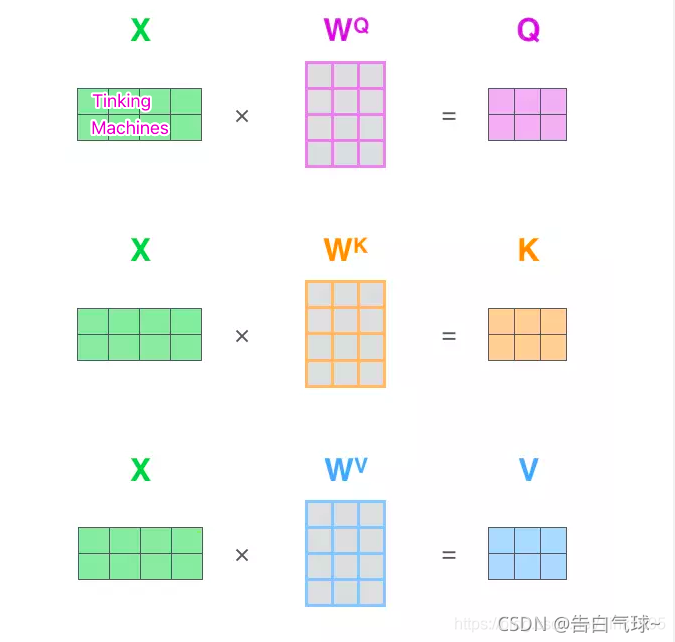
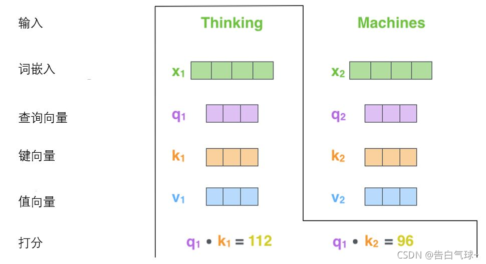
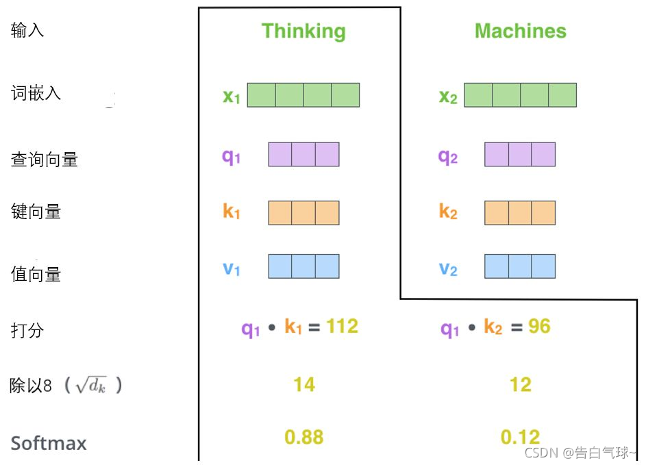
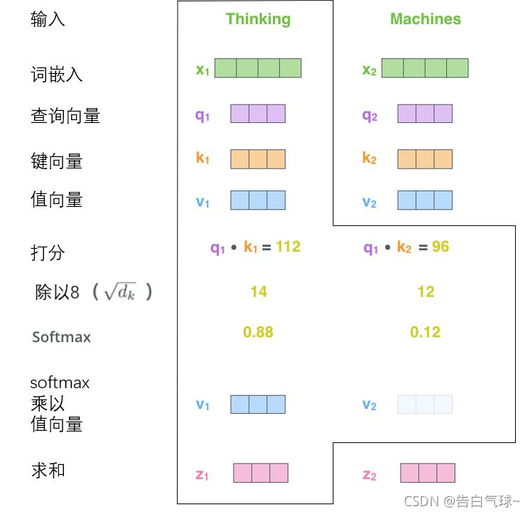
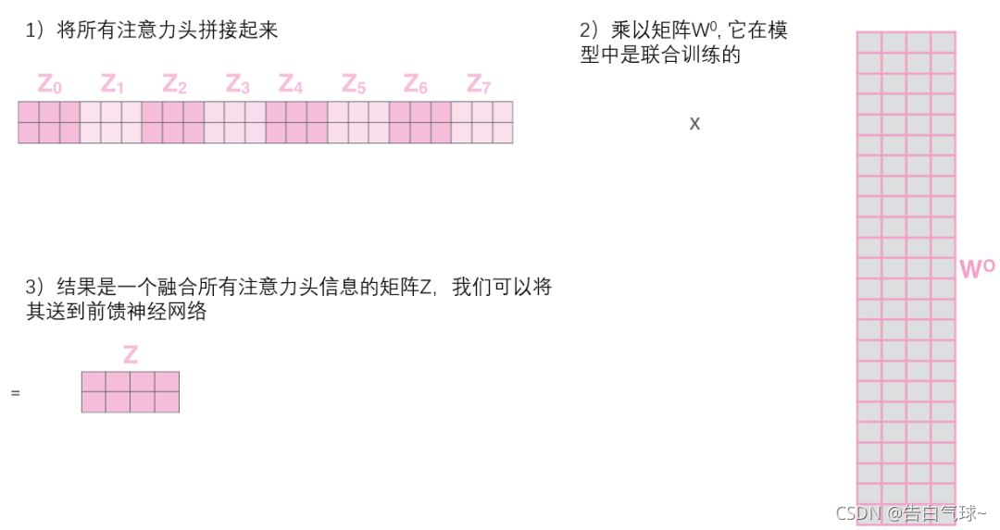
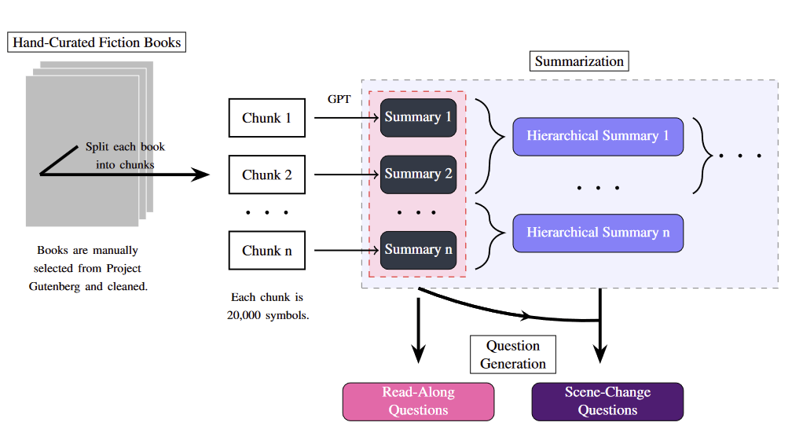
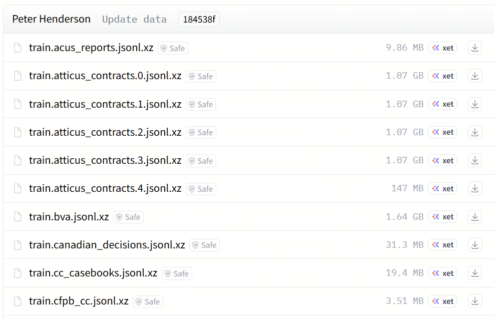
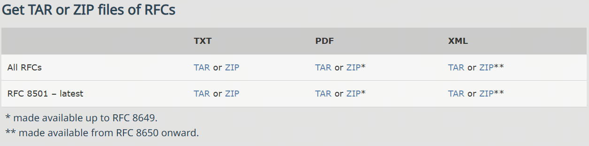

# 第1课时：Transformer 核心与 Self-Attention 深度剖析

## 1. Transformer基础入门

在聊 Transformer 之前，先想象一下：如果没有它，现代大语言模型就像一支乐队，没有指挥，每个乐器都各自为战，节奏混乱。Transformer 就是那位聪明的指挥，让模型能够同时关注每个词的位置和关系，从而谱出连贯的“语言交响曲”。

### 1.1 Transformer的诞生与核心思想

2017 年，Google 在论文 [《Attention Is All You Need》](https://arxiv.org/abs/1706.03762) 中提出了 Transformer 结构，这一设计彻底改变了自然语言处理（NLP）的发展方向。

在此之前，主流方法仍依赖循环神经网络（RNN）或长短期记忆网络（LSTM）来处理文本序列。这些模型虽然擅长捕捉时间顺序，但在处理长文本时效率低、训练困难，且无法并行化。

Transformer 的出现打破了这一瓶颈。

它完全摒弃了循环结构，改用一种名为自注意力机制（Self-Attention） 的方法，使模型能够在同一时间关注输入序列中所有位置的词，从而理解词与词之间的关系。

这种机制让模型在捕捉上下文关联时更灵活、更高效，也让训练速度实现了质的飞跃。

几乎在同一时间，FastAI 团队在论文 [《Universal Language Model Fine-tuning for Text Classification (ULMFiT)》](https://arxiv.org/abs/1801.06146) 中提出了另一项重要思路：迁移学习 (Transfer Learning)。

它展示了如何将一个在大规模数据上训练好的语言模型，迁移到下游任务（如文本分类）上，只需少量标注数据就能达到优秀效果。

这两项工作共同奠定了现代大模型的基础。

Google 的 Transformer 提供了强大的结构框架，FastAI 的 ULMFiT 则证明了“预训练 + 微调”的可行性。

二者结合，促成了两种经典模型的诞生：

* GPT（Generative Pre-trained Transformer）：基于 Transformer Decoder，用于自回归语言建模；
* BERT（Bidirectional Encoder Representations from Transformers）：基于 Transformer Encoder，用于双向上下文建模。

自此以后，NLP 进入了以 Transformer 为核心的新时代。


然而，Transformer 模型真正的突破，不仅在于结构的创新，更在于它采用了自监督学习（Self-supervised Learning） 作为训练方式。

这种方法不依赖人工标注数据，而是通过输入文本本身构造训练目标，让模型在海量语料中自主学习语言规律。

常见的两种预训练任务包括：因果语言建模（Causal Language Modeling, CLM）和遮盖语言建模（Masked Language Modeling, MLM）。这两种任务让模型在无标注环境下形成语言统计和语义理解能力，相当于“自学成才”。

不过，这种通用语言能力仍然偏向于理解层面，若要在具体任务上表现出色，还需要进一步的迁移学习与微调（Fine-tuning），即在特定任务数据上调整模型参数，使其更契合目标场景。

从结构到方法，Transformer 的核心思想可以总结为：

> **用自注意力理解上下文，用自监督学习掌握语言。**
> 这正是现代大语言模型的技术起点，也是预训练范式能够不断延展至多模态与通用智能的根基。

模型不再依赖人工特征或独立任务训练，而是通过在大规模语料上的自监督预训练，获取通用语言能力。

这一范式的成功，让“通用语言理解”真正成为可能，也为后续大模型（如 T5、GPT-3、ChatGPT）的出现奠定了技术基础。

### 1.2 Encoder 与 Decoder的区别与应用

要真正理解 Transformer，就必须先搞清楚它的两个主角 —— Encoder（编码器） 和 Decoder（解码器）。

原始的 Transformer 模型结构如下图所示，Encoder 在左，Decoder 在右。


它们的关系有点像一场对话中的两种角色：

* Encoder 是那个“听懂别人说话的人”，
* 而 Decoder 是那个“把意思说出来的人”。

**Encoder：理解输入的“听者”**

Encoder 模块的任务是理解输入文本的含义。

它会把输入的每个词转换成向量，然后通过一层层的自注意力机制，让这些词互相“看见”彼此，从而捕捉上下文语义。

简单来说，Encoder 不只是逐词阅读，而是能在读到 “猫坐在垫子上” 时意识到：

* “猫” 是主语，
* “坐” 是动作，
* “垫子” 是宾语。

这就是 Transformer 最厉害的地方——它能同时关注整个句子。

而且因为它是双向注意力（Bidirectional Attention），Encoder 可以同时看到词前后的信息，因此非常适合需要“理解语义”的任务，比如：

* 文本分类（情感分析、主题识别）
* 命名实体识别（NER）
* 相似度匹配（句子对判断）

代表模型：BERT、RoBERTa、ELECTRA、DeBERTa 等。

Decoder：生成输出的“说者”

Decoder 的任务刚好相反——它负责根据已有信息生成新的文本。

它的输入通常是上一步已经生成的内容，而输出则是下一个要生成的词。

比如，当 Decoder 已经生成了“我今天”，它会尝试预测接下来该输出什么：

> “我今天 ​**很开心**​。”

与 Encoder 不同，Decoder 使用的是自回归注意力（Auto-regressive Attention）：

它只能“看到”自己前面生成的词，而不能偷看未来的内容。

在训练时，为了防止“作弊”，我们会用一个叫 Mask（遮盖） 的机制，把未来词的信息挡住，让模型只能依靠历史内容生成下一步。

这种逐词生成的方式让 Decoder 特别适合生成类任务，比如：

* 文本续写、故事生成
* 摘要生成
* 对话回复
* 代码补全

代表模型：GPT、GPT-2、GPT-3、LLaMA、Qwen、ChatGPT 等。

**Encoder-Decoder：理解 + 生成的“翻译官”**

原始的 Transformer（2017）其实是为机器翻译设计的，因此它同时拥有 Encoder 和 Decoder 两部分。

工作原理非常直观：

* Encoder 负责理解源语言（比如英文）；
* Decoder 负责在另一种语言中生成对应句子（比如中文）。

举个例子：

输入句子 “I love apples.”

Encoder 理解到这句话的语义是 “我喜欢苹果”，

Decoder 结合上下文生成 “我喜欢苹果”。

这种架构也被称为 Seq2Seq（Sequence-to-Sequence）模型，

是连接理解与生成的桥梁，非常适合需要“输入→输出”的任务：

* 机器翻译（Translate English → Chinese）
* 文本摘要（长文 → 短摘要）
* 生成式问答（Question → Answer）

代表模型：T5、BART、FLAN-T5、M2M-100 等。

> 💡 Tips
> Transformer 的威力，不仅在于注意力机制，更在于它灵活的结构组合。 你可以只用 Encoder 来做“理解型任务”， 也可以只用 Decoder 来做“生成型任务”， 或者用 Encoder-Decoder 来同时理解输入并生成输出。  一句话总结就是： Encoder 让模型听懂人话，Decoder 让模型说出人话。 这也是所有现代大语言模型的基本结构蓝图。

---

## 2. Transformer 层级结构

要真正理解 Transformer 的工作原理，就必须走进它的内部结构，看清楚一层 Layer 是如何把输入一步步加工成更深的语义表示。下面将依次介绍每个核心组件的作用、必要性及基本工作方式，包括输入/输出嵌入、注意力机制、多头结构、残差连接、层归一化等。


### 2.1 Transformer 的关键组件

**Input/Output Embedding**

在进入 Transformer 的各层计算之前，模型首先需要将离散的文本符号转换成可计算的连续向量，这一过程由 Embedding 层完成。Embedding 的作用是把输入序列中的每个 token 映射为一个固定维度的向量，作为后续 Self-Attention 和前馈网络（FFN）的输入基础。由于模型无法直接理解 “apple”“banana” 这样的字符串，Embedding 会依据词表中每个 token 的唯一索引，从一个大小为 [词表大小 × 模型维度] 的矩阵中取出对应行向量。

例如，当模型维度为 512、词表包含 50,000 个词时，Embedding 矩阵的形状即为 50,000×512。输入 token 的索引（如 10）会直接选取该矩阵的第 10 行，得到其 d 维的连续表示。随后，这些嵌入向量与位置编码相加，形成 Transformer 第一层注意力机制的初始输入。

**Positional Encoding**

在得到每个 token 的嵌入向量后，Transformer 还需要补充一个关键要素：序列的位置信息。由于自注意力机制天然不关心顺序，它把整句话视作一个“同时可见”的集合，因此模型无法仅凭注意力机制判断 “我爱吃苹果” 和 “苹果爱吃我” 的语序差异。为了解决这一问题，Transformer 在嵌入向量上叠加了 位置编码（Positional Encoding）。位置编码与词向量具有相同的维度（如 512），但其取值完全由 token 在句子中的位置决定。对于每个位置 𝑖 ，模型会生成对应的位置向量 $𝑝_𝑖$，并与词嵌入向量 $𝑒_𝑖$ 进行逐元素相加：

$$x_i=e_i+p_i$$

得到的向量 $𝑥_𝑖$ 同时包含“词语语义”和“词语所处位置”两类信息，并作为 Transformer 每一层 Attention 的输入，使模型能够有效捕捉顺序结构。

**Self-Attention**

Self-Attention（自注意力机制）让模型在处理任意一个 token 时，都能同时参考整句中所有其他 token 的信息，从而在全局范围内捕捉上下文关系。相比 RNN 的逐步传递和 CNN 的局部卷积，自注意力不受距离限制，使模型能够轻松建立长距离依赖。具体来说，每个 token 会生成三个向量：Query（我要找什么）、Key（我能提供什么）、Value（我的实际信息）。模型通过计算当前 token 的 Query 与所有 token 的 Key 的相似度，得到一组注意力分数，并经过 softmax 转成注意力权重。最后，这些权重会对所有 Value 向量进行加权求和，形成当前 token 的输出表示。

因此，Self-Attention 的输出可以被看作“来自全句的信息混合”，但每个 token 根据语义需求分配不同的关注比例。正是这种灵活、全局、可学习的注意力机制，使得 Transformer 能够捕捉丰富的依赖关系，在多种任务中取得优异表现。

**Multi-Head Attention**

Multi-Head Attention 的设计初衷，是为了解决单一自注意力在一次计算中容易把不同类型的信息“混在一起”的局限。自注意力虽然强大，但它在同一组 Query/Key/Value 上只形成一种关注模式，容易导致复杂语义被平均化。例如在句子“苹果公司发布了新款苹果手机”中，“苹果”既可能表示公司，也可能表示水果，而单一注意力头往往难以同时捕捉这两类截然不同的语义关系。Multi-Head Attention 的做法是：把注意力分成多个并行的头，让每个头独立关注不同类型的模式，相当于“不要把所有鸡蛋放在一个篮子里”，从多个视角同时理解句子，从而获得更丰富、更精细的语义表示。工作方式如下：

1.分割与投影（Split & Project）

模型会将每个 token 的原始 Query、Key、Value（例如维度为 d\_model = 512）分别通过多组线性变换，投影到多个更低维度的子空间中。如果有 8 个注意力头，那么每个头的维度就是 $d_k = d_v = 512 / 8 = 64$ 。

这意味着每个头都拥有独立的一套 Q/K/V 投影矩阵，从而学到不同的关注模式。

2.并行计算（Parallel Attention）

在每个子空间中，每个头会独立完成一整套自注意力计算。由于不同头有不同的参数，它们会从不同角度理解当前序列，捕捉不同的语义特征与关系。

3.拼接与融合（Concat & Output Projection）

8 个注意力头分别输出 8 个维度为 64 的向量，这些向量会被拼接成 8 × 64 = 512 维的长向量。随后，模型会使用一个线性变换将这一拼接后的表示映射回 $d_{model}$（通常仍为 512），以综合所有注意力头的信息，形成最终输出。

**Masked Multi-Head Attention**

Masked Multi-Head Attention（带因果掩码的多头注意力）是解码器中最关键的约束机制之一。它的核心目标只有一个：在任何时刻，模型都只能基于已经生成的内容做判断。这并不是一个可选优化，而是自回归生成能够成立的前提条件。在语言生成任务中，模型需要按时间顺序逐词生成输出。当模型预测第 $t$ 个 token 时，理论上它只能看到序列中 $1 \sim t-1$ 的内容。如果在训练阶段允许模型访问完整目标序列，那么它实际上是在“抄答案”，学到的是一种不可复现的条件分布。一旦进入真实推理阶段，这种能力就会立刻失效。

因果掩码（causal mask）的引入，正是为了解决这一根本性不一致问题。Masked Multi-Head Attention 并没有改变多头注意力的基本结构，而是在注意力分数阶段显式注入时间顺序约束。从工程角度看，Masked Multi-Head Attention 看似只是“多加了一步 mask”，但从建模层面，它实际上定义了 Transformer 作为自回归模型的基本物理规则：未来不可见，顺序不可逆。正是这个看似简单的约束，让 Transformer 能够稳定地用于语言生成、代码生成以及各类序列建模任务。其工作方式如下：

1.注意力分数的计算

对输入序列 $X = (x_1, x_2, \dots, x_T)$，每个位置都会生成对应的 Query、Key 和 Value：
$$
Q = XW_Q,\quad K = XW_K,\quad V = XW_V
$$

注意力分数矩阵为：
$$
S = \frac{QK^\top}{\sqrt{d_k}}
$$
其中，$S_{i,j}$ 表示位置 $i$ 在计算表示时，对位置 $j$ 的相关性强弱；$d_k$ 为 Key 的维度，用于数值稳定。

2.应用因果掩码

为了阻止模型“看到未来”，会构造一个严格的下三角掩码矩阵 $M$：

$$
M_{i,j} =
\begin{cases}
0, & j \le i \
-\infty, & j > i
\end{cases}
$$

该掩码直接加到注意力分数矩阵上：

$$
S' = S + M
$$

从结构上看：

* 当前 token 可以关注自己（主对角线）
* 可以关注所有历史 token（左下区域）
* 对所有未来 token，注意力分数被强制压制为负无穷

这一步并不改变注意力的计算形式，却从根本上改变了可见信息的范围。

3.Softmax 归一化

将 $S'$ 输入 Softmax：

$$
A_{i,j} = \frac{\exp(S'*{i,j})}{\sum_k \exp(S'*{i,k})}
$$

由于 $\exp(-\infty) = 0$，所有被掩码的位置在归一化后权重严格为 0。换句话说，未来位置在数值上完全不存在，不会参与任何信息聚合。

4.加权求和

最终输出为：
$$
\text{Attention}(Q, K, V) = A V
$$

每个位置的表示，只是对“过去 + 当前”信息的重组，而不会混入任何未来信号。这保证了训练阶段与真实生成阶段在信息条件上的一致性。

**Add**

残差连接的作用是将某一层的输入向量与该层的输出向量相加。它主要有两个目的：一是缓解梯度消失问题。由于 Transformer 通常非常深（编码器和解码器各 6 层或更多），在深层网络中，梯度在反向传播时可能会变得很小，使得较早的层难以有效更新。残差连接为梯度提供了一条“高速公路”，允许梯度直接流回较早层，从而减轻梯度消失。二是保护原始信息。在没有残差连接的情况下，每层必须学习完整的变换，可能导致模型“忘记”输入的重要信息。残差连接让模型只需学习输出与输入之间的变化量，既便于训练，又能保证信息的持久性。

数学上非常简单：

$$输出=Layer(输入)+输入$$

其中 Layer 可以是自注意力层或前馈神经网络层。具体操作是，输入向量（例如词嵌入向量 + 位置编码）进入子层计算后，得到的输出立即与该子层的原始输入逐元素相加，形成最终输出。

**Norm**

层归一化的作用是对向量序列中每个样本的所有特征维度进行归一化，使其均值为 0，方差为 1。它主要有三个好处：首先，稳定训练过程。深度学习模型对每一层输入的分布非常敏感，如果输入均值和方差发生剧烈变化（内部协变量偏移），后续层需要不断适应，训练容易不稳定且收敛变慢。归一化通过调整分布，使每层输入保持稳定。其次，它允许使用更高的学习率。未经归一化的网络通常需较小学习率以防训练发散，而归一化后训练更平滑，可使用更大学习率加快收敛。最后，归一化过程引入的微小噪声还能提供轻微正则化效果，有助于防止过拟合。层归一化作用于单个样本（例如，一个词对应的向量），而不是整个批次。具体步骤如下：

1.计算均值和方差

对于输入向量 x（例如，经过残差连接后的 512 维向量），计算该向量所有维度的均值 $\mu$ 和方差 $\sigma^2$ 。

2.归一化

用均值和方差对向量进行归一化：

$$
\hat{x}_i = \frac{x - \mu}{\sqrt{\sigma^2 + \epsilon}}
$$

其中 ϵ 是一个很小的数（如 1e-5），用于防止除以零。

3.仿射变换

对归一化后的向量进行可学习的线性变换：

$$
y = \gamma*\hat{x} + \beta
$$

其中 γ 和 β 是可学习的参数向量，分别用于缩放和平移。这一步非常关键，因为它允许网络恢复归一化可能“抹去”的重要特征模式。如果归一化对某些特征不利，网络可以通过学习 γ 和 β 来近似还原原始分布，从而保留有用信息。

**Feed-Forward Network**

前馈神经网络层（Feed Forward）对自注意力输出的每个位置进行独立的非线性变换，从而增强模型的表示能力。由于自注意力机制本质上主要由线性变换和 Softmax 组成，非线性有限，前馈网络通过激活函数（如 ReLU）补充了关键的非线性能力，使模型能够拟合更复杂的函数形式。它对序列中的每个词向量独立处理、互不干扰，并可完全并行，从而对每个位置进行更深层次的特征加工。此外，前馈层通常拥有较大的中间维度，因此包含了 Transformer 中最多的参数，能够更充分地提炼自注意力聚合的上下文信息，进一步提升模型整体的表达能力。前馈网络是一个简单的两层神经网络，它对序列中每个位置的向量进行独立且相同的处理。其经典结构如下：

1.第一层（升维 + 非线性）

这一层接收来自自注意力模块的向量（例如 $d_{model} = 512$），并首先通过线性变换将其维度扩展到更大的中间维度 $d_{ff} = 2048$，相当于将表示能力放大四倍。随后通过 ReLU 或 GELU 等激活函数引入必要的非线性，使模型能够学习更复杂的映射关系。其计算形式为：hidden = ReLU(x · W1 + b1)，其中 W1 的尺寸为 `[d_model, d_ff]`。

2.第二层（降维 + 输出）

一层将第一层产生的高维 hidden 表示（2048 维）再通过一个线性层映射回原始的模型维度（512 维），以便与其他网络组件保持一致。其计算形式为：output = hidden · W2 + b2，其中 W2 的尺寸为 `[d_ff, d_model]`，负责将扩展后的表示重新压缩为最终输出。

**Linear**

Linear（全连接层）的作用是将解码器输出的高维向量映射到词汇表大小的维度，为每个位置生成在所有可能单词上的原始分数（logits），以便后续通过 Softmax 得到单词概率分布。之所以需要这一层，是因为解码器输出通常是 $d_{model}$（如 512 维），而真正的生成任务需要从数万词的词汇表中选出一个单词，线性层因此承担了将模型内部表示映射到词汇表空间的“桥梁”角色。同时，它还负责为词汇表中的每个候选词生成一个分数，表示该词作为下一个输出的可能性。此外，这个线性层本质上是一个可学习的分类器，它通过训练逐渐建立起内部表示与具体词语之间的对应关系，例如当模型生成某种语义模式时，会让“apple”的得分更高，而让无关词的得分更低。其工作方式如下：

1.输入

接收解码器的最终输出，形状为 `[batch_size, seq_len, d_model]`。例如 `[2, 10, 512]` 表示 2 个句子，每个句子 10 个单词，每个单词用 512 维向量表示。

2.线性变换

过一个权重矩阵 `W` 进行线性变换，其中 `W` 的形状为 `[d_model, vocab_size]`

3.输出

输出称为 logits（原始分数），形状为 `[batch_size, seq_len, vocab_size]`

**Softmax**

Softmax 的作用是将线性层输出的原始分数（logits）转换为一个有效的概率分布，使每个位置上所有词的概率之和为 1，从而直观表示各候选词作为下一个输出单词的可能性。由于 logits 可能为任意实数，无法直接作为概率解释，Softmax 将其规范化为 0～1 范围的概率值，并确保总和为 1，使结果具有明确的概率意义。在训练中，Softmax 输出还用于计算交叉熵损失，因此提供有效概率分布是必要条件；在推理阶段，模型也依赖 Softmax 生成的概率来选择下一个单词，无论使用贪心策略还是束搜索，最终决策都基于这一概率分布完成。其工作方式很直接：

1.输入

接收线性层输出的 logits，形状为 `[batch_size, seq_len, vocab_size]`。对于每个位置，都有一个包含词汇表中所有单词分数的向量。

2.输出

输出一个概率分布，形状与输入相同 `[batch_size, seq_len, vocab_size]。`

### 2.2 Self-Attention 计算原理

从每个编码器的输入向量（每个单词的词向量，即 Embedding，可以是任意形式的词向量，如 word2vec、GloVe、one-hot 编码）中生成三个向量：查询向量 Q、键向量 K）和值向量 V。这三个向量由词嵌入分别与权重矩阵 $W_Q$、$W_K$、$W_V$ 相乘得到。它们的维度通常比原始词向量更低（例如从 512 降到 64）。


更一般地，将所有位置得到的查询、键、值组合起来，即形成 Query、Keys、Values 三个矩阵。



计算自注意力的**第二步**是计算得分。例如，当为句子中第一个词 “Thinking” 计算自注意力时，需要让输入句子中每个单词对 “Thinking” 打分，这些分数由所有单词的键向量与该位置的查询向量进行点积得到。



**第三步**和**第四步**是将分数除以 8（键向量维度 64 的平方根），这一缩放操作可使梯度更稳定，避免内积过大。随后将缩放后的得分输入 softmax，使得模型在处理序列时能根据上下文分配注意力权重。softmax 将所有分数归一化为正值，且总和为 1。



这些 softmax 分数决定了每个单词对当前位置（如 “Thinking”）的贡献。通常当前词本身的 softmax 值最大。

**第五步**是将每个值向量与对应的 softmax 权重相乘，以突出语义相关的单词，弱化无关单词（例如被乘上一个非常小的系数）。

Softmax 函数：或称为归一化指数函数，它将每个元素压缩到 (0,1) 范围，并保证所有元素之和为 1。

**第六步**是将加权后的值向量求和，得到该位置的自注意力输出。整体计算如图所示。最终得到的自注意力输出会传入后续的前馈神经网络。



上述第二至第六步可合并为自注意力层的一条公式表达：


**自注意力层的完善 —— “多头”注意力机制**

对应整体结构图中的 Multi-Head Attention。主要区别在于：

1. 扩展了模型关注不同位置的能力。  
2. 多头注意力使用多组查询 / 键 / 值的权重矩阵（Transformer 经典实现中为 8 头），每组参数独立初始化。与普通 self-attention 相同，每组通过 $X$ 乘以 $W_Q$、$W_K$、$W_V$ 生成各自的 Query、Key、Value。  
3. Self-attention 使用一组 $W_Q$、$W_K$、$W_V$ 来生成查询、键和值，而 Multi-Head Attention 使用多组矩阵并行生成多组 $Q / K / V$，每组独立计算注意力并得到一个 $Z$ 矩阵。


前馈层只需要一个矩阵，因此会将 8 个头得到的 Z 矩阵拼接起来，再通过一个额外的权重矩阵 $W_O$（用于把多头拼接后的向量重新映射回模型的原始维度）进行线性变换。



整体流程如下图所示：


例如，在编码 “it” 这个词时，不同注意力头会关注不同的上下文。图中展示了两个注意力头：


* 一个注意力头关注 “The animal”
* 另一个注意力头关注 “tire”

这说明通过不同注意力头，模型可以捕捉 “it” 分别可能指代 animal 或 tire。

---

## 3. 位置编码机制与序列建模能力

### 3.1 为什么 Attention 需要位置信息

在 Transformer 出现之前，序列建模这件事几乎是“顺序优先”的世界。

RNN、LSTM 这类模型，天然带着时间轴。输入从左到右流动，隐藏状态在时间步之间传递，前一个词的状态会直接影响后一个词的表示。模型不需要被提醒“顺序是什么”，因为顺序本身已经写进了计算图里。

这种结构很像听人讲故事：一句一句往下听，前文自然会留在记忆里。

Transformer 选择了一条完全不同的路。

它把整段序列一次性送进模型，所有 token 同时参与计算。没有时间步、没有状态传递，只有并行的向量运算和注意力权重的分配。效率大幅提升，但也带来了一个无法回避的问题：

> 当所有词是“同时出现”的，模型凭什么知道谁在前，谁在后？

如果什么都不做，Self-Attention 的计算在数学上是**对顺序不敏感的**。

Attention 天生是“无序”的，回忆一下 Self-Attention 的核心计算形式：

$$
\text{Attention}(Q, K, V) = \text{softmax}\left(\frac{QK^\top}{\sqrt{d_k}}\right)V
$$

这里的含义是：

* $Q$（Query）：当前 token 的查询向量
* $K$（Key）：所有 token 的键向量
* $V$（Value）：所有 token 的值向量
* $d_k$：Key 向量的维度，用于缩放防止数值过大

注意力权重完全由 $Q$ 与 $K$ 的**点积相似度**决定。

如果把一句话里的词向量打乱顺序，只要向量集合本身不变，$QK^\top$ 的结果在理论上并不会感知到“这是第几个词”。

也就是说，**Attention 关心的是“相像不相像”，而不是“先后顺序”**。

顺序一旦消失，语义就会塌陷。看一个极其简单、却足够致命的例子：

> “猫咬狗”
> “狗咬猫”

从词袋角度看，它们包含的词完全一致：猫、狗、咬。

如果模型不知道哪个词排在前面，注意力看到的只是三种语义单位之间的相互关系，却无法判断谁是施事，谁是受事。语义结构在这里直接发生翻转。

这类问题并不仅存在于中文。

* 英文中的 *“man bites dog”* 与 *“dog bites man”*
* 代码中的 `a = b - c` 与 `c - b = a`
* 数学表达式里的操作顺序

顺序一旦丢失，模型得到的将不再是“模糊理解”，而是**错误理解**。

为了解决这个问题，Transformer 引入了位置编码（Positional Encoding）。它并不是试图恢复循环结构，而是换了一种思路：

> 既然 Attention 看不到顺序，那就把“顺序”直接写进向量里。

每一个 token，在进入模型之前，都会被赋予一个与其位置相关的向量表示。最终送入模型的不是单纯的词向量，而是两部分信息的叠加：

$$
\mathbf{x}_i = \mathbf{e}_i + \mathbf{p}_i
$$

其中：

* $\mathbf{e}_i$：第 $i$ 个 token 的词向量（Token Embedding）
* $\mathbf{p}_i$：第 $i$ 个位置对应的位置编码向量
* $\mathbf{x}_i$：Transformer 实际接收的输入表示

这种设计非常“克制”。模型结构本身没有任何改动，Attention 的计算公式也保持不变，只是输入空间悄悄发生了变化。

可以用一个简化的文字示意来理解这个过程：

```
原始输入：
[猫]   [咬]   [狗]

词向量：
e1     e2     e3

位置向量：
p1     p2     p3

叠加后输入：
e1+p1  e2+p2  e3+p3
```

从这一刻开始，“猫”不再只是“猫”，而是**“出现在第 1 个位置的猫”**；
“狗”也不再只是“狗”，而是**“出现在第 3 个位置的狗”**。

注意力在计算相似度时，实际上是在这些混合了位置信息的向量之间做比较。

在 PyTorch 中，这种叠加过程往往只有一行：

```python
# token_embeddings: [seq_len, d_model]
# position_embeddings: [seq_len, d_model]

inputs = token_embeddings + position_embeddings
```

从工程实现角度看，它几乎“轻得没有存在感”。正是这一步，让 Transformer 在没有时间结构的前提下，具备了理解序列的能力。这里有一个经常被忽略的小细节。

位置编码不是拼接（concatenate），而是直接相加。这意味着：

* 模型不会被强制区分“哪一部分是位置，哪一部分是语义”
* 位置信息自然融入表示空间，由注意力机制自行决定是否使用、如何使用

这种设计让位置不再是硬规则，而是一种可学习、可忽略、可放大的信号。它既不会压制语义，也不会喧宾夺主。到这里，Attention 为什么“离不开位置”，已经变得清晰起来。Transformer 并不是不懂顺序，而是需要有人告诉它顺序以什么方式存在。位置编码正是那条连接并行计算与序列理解之间的隐形桥梁。接下来，问题自然就变成了：这些位置信息究竟该怎么编码？这正是后续章节要展开的内容。

### 3.2 绝对位置编码

当位置被正式当作一种建模对象之后，实际工程里很快形成了两条清晰的路线。它们并不是“新旧之分”，而是代表了两种不同的建模态度：**位置是规则，还是参数**。围绕这个分歧，绝对位置编码逐渐稳定为两种主流实现方式。

一种是固定位置编码，也就是最早写进《Attention Is All You Need》的正弦位置编码；另一种是可学习的位置嵌入，把“位置”本身当作模型可以调整的参数来看待。

先从固定位置编码说起。

正弦位置编码的出发点并不复杂：既然模型需要一个数值向量来表示“这是第 pos 个位置”，那就用一组规则函数来生成它。关键不在于某一个具体数值，而在于**不同位置生成的向量在整体上彼此区分，同时又保持某种连续结构**。

它的定义形式通常写成下面这样（以偶数维和奇数维成对表示）：

$$
\text{PE}_{(pos, 2k)} = \sin\left(\frac{pos}{10000^{\frac{2k}{d}}}\right)
$$

$$
\text{PE}_{(pos, 2k+1)} = \cos\left(\frac{pos}{10000^{\frac{2k}{d}}}\right)
$$

这里各个符号的含义是明确的：

* $pos$ 表示 token 在序列中的绝对位置索引，常见实现里从 0 开始计数
* $k$ 是“频率编号”，每一对 $(\sin, \cos)$ 共用一个 $k$
* $d$ 是模型的隐藏维度（embedding size），决定一共能放下多少对频率
* $\text{PE}_{(pos, i)}$ 是位置 $pos$ 在第 $i$ 个维度上的编码值

把这个公式拆开来看，其实是在做一件很有节奏感的事情：
低维使用变化缓慢的波形，高维使用变化迅速的波形，不同频率叠加在一起，构成一个唯一的“位置指纹”。

如果用文字来画一幅示意图，大致可以这样理解：

```
低维：  ——~~~~——~~~~——    （变化慢，关注远距离）
中维：  ~-~-~-~-~-~-~-~    （中等节奏）
高维：  ^^^^^^^^^^^^^^    （变化快，区分相邻位置）
```

所有这些波形在同一个向量里叠加，位置就不再是一个标量，而是一种多尺度信号。

这种设计背后还有一个很关键、但常被一笔带过的性质。利用三角函数的角和公式，可以得到：

$$
\sin(a+b) = \sin a \cos b + \cos a \sin b
$$

$$
\cos(a+b) = \cos a \cos b - \sin a \sin b
$$

这意味着什么？
如果把位置从 $pos$ 平移到 $pos+m$，新的正弦 / 余弦值可以由原来的值通过一个**固定的线性变换**得到。换句话说，对于同一对维度而言，$\text{PE}*{pos+m}$ 与 $\text{PE}*{pos}$ 之间存在稳定的线性关系。

这正是常说的那句话背后的直觉来源：
“正弦位置编码有利于模型学习相对位置信息”。

模型并不需要显式地知道 $m$ 是多少，只要注意力层学会利用这些线性结构，就能捕捉“相隔多远”这一概念。

为了让这种编码方式更具体一些，可以看一个完整的小例子。

假设句子是：

“I love natural language processing.”

分词后得到 6 个 token：

[I | love | natural | language | processing | .]

其中 “natural” 的位置索引是 $pos = 2$。为了便于展示，假设模型的隐藏维度是 $d = 8$，也就是说一共有 $d/2 = 4$ 对 $(\sin, \cos)$ 频率，对应 $k = 0, 1, 2, 3$。

逐对计算后，可以得到位置 $pos=2$ 的位置向量：

```
[
  0.9093,   -0.4161,
  0.1987,    0.9801,
  0.0200,    0.9998,
  0.0020,    0.999998
]
```

可以把它理解为：
同一个位置，被拆解成了“慢节奏—中节奏—快节奏”几组信号。低频部分帮助模型感知长距离关系，高频部分对相邻 token 的顺序变化极其敏感，中间频率则填补两者之间的尺度空白。一个向量里，同时容纳了局部与全局的位置信息。

从工程角度看，这种位置编码还有一个非常现实的优势：**它不需要任何可训练参数**。不管模型有没有见过这个长度，只要代入公式，就能算出对应的位置向量。这也是早期 Transformer 在面对更长序列时，仍然具备一定外推能力的重要原因。

不过，规则也意味着约束。一旦位置向量完全由公式决定，模型就失去了根据具体任务去“微调顺序表达”的空间。某些任务可能并不需要这么规则的频率结构，却依然被迫接受它。

正因为如此，另一种绝对位置编码方式逐渐成为主流选择——可学习的位置嵌入。

这种方式几乎没有数学花样：直接维护一个大小为 $[\text{max_len}, d]$ 的参数矩阵，每一个位置对应一行向量。训练过程中，这些向量会和词向量、注意力权重一起被更新。

从实现上看，代码甚至比正弦编码更直观：

```python
import torch
import torch.nn as nn

position_embedding = nn.Embedding(max_len, d_model)
positions = torch.arange(seq_len)
pos_emb = position_embedding(positions)
```

这种做法的好处在于自由。模型可以根据数据分布，自行决定哪些位置更重要、哪些可以弱化，表达能力明显更强。BERT 等模型正是基于这种位置编码方式构建的。

但代价同样直接：位置表是“有限的”。训练时只见过 $[0, L)$ 的位置，推理时一旦超出这个范围，模型就会失去坐标参照。

从更抽象的层面来看，绝对位置编码无论采用哪种形式，本质都在做同一件事：**为每一个位置分配一个固定坐标**。Attention 在这个坐标系中运作，才能区分前后。

只是，当模型开始关心“两个词之间隔了多远”，而不只是“它们各自在哪个编号上”时，绝对坐标的表达方式便显得有些笨重了。这种张力，正好引出了后面要讨论的相对位置编码思想。

### 3.3 相对位置编码思想引入（RoPE / ALiBi）

当绝对位置编码被反复使用之后，一个逐渐清晰的分歧开始浮现：模型在很多时候真正关心的，并不是“你在第 37 个位置”，而是**“你离我有多远”**。在阅读一句话时，人并不会在脑中默默标注“这是第几个词”。更多时候，理解依赖的是相对关系——修饰是否相邻，主谓是否隔得很远，依赖是否跨越多个从句。对模型而言，这种“相对感”同样重要。这正是相对位置编码思想出现的背景。

相对位置编码的核心直觉可以用一句话概括：**位置不是坐标，而是关系。**

在绝对位置编码中，每个 token 被分配一个独立的位置向量 $\mathbf{p}_i$；而在相对位置编码中，模型更在意的是两个 token 之间的距离 $j - i$，而不是 $i$ 和 $j$ 本身。这在注意力机制里尤为自然。回到 Self-Attention 的计算：

$$
\text{Attention}(Q, K, V) = \text{softmax}\left(\frac{QK^\top}{\sqrt{d_k}}\right)V
$$

本质上，注意力是在问这样一个问题：“当前 token（Query）应该向哪些 token（Key）分配更多注意力？”如果两个词在语义上相关，但距离很远，模型可能需要额外的位置信息来调节这种相关性；反过来，距离很近的词，即使语义相似度一般，也往往更值得关注。相对位置编码，正是把这种“距离感”直接引入注意力权重计算中。

在早期的一些相对位置编码方案中，做法相对直接：为每一种相对距离 $r = j - i$ 引入一个独立的向量或偏置，并在计算注意力分数时加入进去。这样一来，注意力分数不再只是 $Q_i \cdot K_j$，而是变成了“语义相似度 + 距离影响”。不过，这类方法在工程上往往比较复杂，对长序列的支持也不够友好。真正让相对位置编码走向主流的，是后面两种设计思路：RoPE 和 ALiBi。

**RoPE（Rotary Position Embedding）**

RoPE 的切入点很巧妙：它并不显式地给注意力打分加偏置，而是直接作用在 Query 和 Key 向量本身。通过一种“旋转”的方式，把位置信息编码进向量的相位中。

直觉上可以这样理解：每个位置对应一个旋转角度，位置不同，旋转幅度不同；Query 和 Key 在同一套角度体系下旋转后，它们的点积结果自然会体现出相对位置信息。在数学形式上，RoPE 通常把向量按偶、奇维度分组，每一对维度看作一个二维平面，然后进行旋转变换。对于位置 $pos$ 和频率索引 $k$，定义旋转角：

$$
\theta_{pos, k} = pos \cdot \omega_k
$$


其中 $\omega_k$ 是与维度相关的频率常数，常见形式与正弦位置编码中的频率设置相似。

对某一对维度 $(x_{2k}, x_{2k+1})$，旋转后的结果为：

$$
\begin{pmatrix}
x'_{2k} \\
x'_{2k+1}
\end{pmatrix}
=
\begin{pmatrix}
\cos \theta_{pos,k} & -\sin \theta_{pos,k} \\
\sin \theta_{pos,k} & \cos \theta_{pos,k}
\end{pmatrix}
\begin{pmatrix}
x_{2k} \\
x_{2k+1}
\end{pmatrix}
$$

这里的变量含义是：

* $(x_{2k}, x_{2k+1})$：原始 Query 或 Key 向量中的一对维度
* $\theta_{pos,k}$：与位置 $pos$ 和维度 $k$ 相关的旋转角
* $(x'*{2k}, x'*{2k+1})$：旋转后的向量分量

这种设计带来一个非常重要的性质：旋转后的 Query 与 Key 的点积，只与它们的相对位置差有关，而与绝对位置无关。也就是说，RoPE 在不显式引入“相对距离表”的情况下，让注意力分数天然具备了相对位置信息。这种方式计算稳定、实现简洁，也非常适合长序列扩展，因此在 LLaMA、Qwen、GPT-NeoX 等模型中被广泛采用。

如果用文字示意来理解 RoPE：

```
同一词向量 → 不同位置 → 在不同角度被旋转
角度差 = 相对位置差
点积结果自然感知距离
```

**ALiBi（Attention with Linear Biases）**

与 RoPE 从“向量几何”入手不同，ALiBi（Attention with Linear Biases）走的是另一条更朴素的路线。ALiBi 的假设非常直接：**距离越远，注意力权重应该越小，而且这种衰减可以是线性的。** 在 ALiBi 中，并不修改 Query 和 Key 向量本身，而是在注意力打分阶段，为每一对 $(i, j)$ 加上一个与距离相关的偏置项：

$$
\text{score}_{i,j} = \frac{Q_i \cdot K_j}{\sqrt{d_k}} + b(i, j)
$$

其中偏置 $b(i, j)$ 通常定义为：

$$
b(i, j) = -\alpha \cdot |i - j|
$$

这里：

* $i, j$ 分别是 Query 和 Key 的位置索引
* $|i - j|$ 是它们之间的绝对距离
* $\alpha$ 是一个正数斜率，用来控制距离惩罚强度

距离越远，偏置越负，softmax 之后分到的注意力权重就越小。

ALiBi 的妙处在于，它几乎不引入额外参数，也不需要预先设定最大长度。无论序列多长，只要能计算距离，就能自然工作。这使得 ALiBi 在长文本建模和外推场景中表现得非常稳定。

从整体视角看，RoPE 和 ALiBi 虽然实现方式差异很大，但它们共享同一个理念：**位置不是静态标签，而是动态关系。** 一个通过旋转让向量“自带距离感”，一个通过偏置直接调节注意力强弱。它们都在试图回答同一个问题：在理解序列时，如何让模型更自然地感知“近”与“远”。正是在这样的思想转变下，位置编码不再只是输入阶段的一次性修饰，而逐渐成为注意力机制内部的一部分。这种变化，也为后续更长上下文、更强外推能力的模型打下了基础。

### 3.4 位置编码的外推性问题分析

当 Transformer 从“能处理句子”逐渐走向“要理解长文档、代码仓库、对话历史甚至整本书”时，一个绕不开的问题开始反复出现：**模型在训练时没见过这么长的序列，它还能正常工作吗？**

这个问题的核心，其实并不完全在注意力机制本身，而是落在了一个看似不起眼、却影响深远的设计上——**位置编码的外推性**。所谓外推性，指的是：模型在训练阶段只接触过最大长度为 $L$ 的序列，但在推理阶段面对长度 $> L$ 的输入时，是否还能合理地理解顺序与依赖关系，而不是性能突然崩塌。从绝对位置编码开始，这个问题就已经埋下了伏笔。对于**可学习的绝对位置编码**而言，外推性几乎是一个“先天缺陷”。

位置向量本质上是一个查表操作：

$$
\mathbf{p}_i \in \mathbb{R}^d,\quad i \in [0, \text{max_len})
$$

模型在训练时，只对 $[0, L)$ 范围内的位置向量进行了优化。一旦推理阶段输入的序列长度超过了这个上限，就会出现两种尴尬情况：要么直接报错（没有对应位置向量），要么通过截断、循环复用等工程手段“强行对齐”，但语义上已经失去了位置的连续性。

更关键的是，即使人为扩展了位置表，模型也**从未学过如何使用这些新位置**。在注意力层中，这些位置向量对模型来说是完全陌生的，往往会引发注意力分布异常，表现为困惑、重复、逻辑断裂等问题。因此，在实践中，基于可学习绝对位置编码的模型，通常被严格限制在训练时设定的最大上下文长度内。

正弦位置编码在理论上提供了一种更“体面”的答案。

由于正弦 / 余弦位置编码完全由公式生成，只要 $pos$ 是一个整数，就能计算出对应的位置向量。从数学角度看，位置 $L+1$ 和 $L+1000$ 并不存在“非法”问题。这也是早期很多资料中常提到的一个优点：**正弦位置编码具备天然的长度外推能力**。但在实际模型表现中，这种外推并不总是可靠。原因在于：模型虽然“能算出”这些位置向量，却**从未在这些频率组合上接受过训练信号**。当位置不断增大时，高频维度会快速震荡，低频维度则可能进入模型从未见过的取值区间，导致注意力模式发生偏移。于是，理论上的“可外推”，在工程上往往变成了“能跑，但效果不可控”。

相对位置编码的出现，正是为了缓解这种结构性矛盾。从建模视角看，相对位置编码弱化甚至抛弃了“绝对坐标”的概念，把注意力集中在**位置差**上。只要两个 token 之间的距离分布与训练阶段相似，模型就不必关心它们具体出现在第几位。

以 ALiBi 为例，注意力分数中引入的偏置项通常写成：

$$
b(i, j) = -\alpha \cdot |i - j|
$$

这里并没有“最大位置”的概念，只有距离。无论序列延长到多长，只要距离能计算，偏置就能自然生效。也正因为如此，ALiBi 在长上下文外推场景中表现得异常稳定，成为很多长文本模型的默认选择。

RoPE 则从另一个角度解决问题。通过把位置信息编码为向量空间中的旋转角度，注意力中真正起作用的是**角度差**，而不是角度本身。即便 $pos$ 变大，只要相对位置差的分布仍在模型熟悉的范围内，点积结构依然成立。这也是为什么在大量实验中，基于 RoPE 的模型在上下文扩展到训练长度数倍时，性能下降往往是渐进的，而不是断崖式的。从更宏观的角度来看，位置编码的外推性问题，本质上反映的是一个更深层的张力：**模型究竟是在记“位置编号”，还是在理解“序列关系”？** 绝对位置编码偏向前者，相对位置编码更接近后者。当前主流的大模型架构，几乎都在向“关系优先”的方向靠拢，这并非偶然，而是被长上下文需求一步步逼出来的选择。

位置编码不再只是输入阶段的一个附加项，而是直接决定了模型在“看得更远”时，能否保持理性与连贯。这一点，也正是后续位置机制设计不断演化的真正驱动力。

---

## 4. 长序列建模中的计算与存储代价

### 4.1 Self-Attention 的二次复杂度从何而来

在讨论长序列建模的资源瓶颈之前，有必要先把一个常被简化的结论拆开来看：Self-Attention 的计算复杂度是 $O(N^2)$。这并不是一个抽象的“理论标签”，而是由注意力机制的具体计算路径一步步堆出来的结果。

从最基础的形式出发，单头自注意力可以写成：

$$
\text{Attention}(Q, K, V) = \text{softmax}\left(\frac{QK^\top}{\sqrt{d_k}}\right)V
$$

设输入序列长度为 $N$，模型隐藏维度为 $d$，注意力头数为 $h$，则每个头的 Query、Key、Value 的形状分别为：

$$
Q, K, V \in \mathbb{R}^{N \times d_k}, \quad d_k = \frac{d}{h}
$$

真正决定复杂度的关键一步，并不在 softmax，也不在最后的 $V$ 加权求和，而是中间那次看似简单的矩阵乘法 $QK^\top$。这一操作会生成一个形状为：

$$
QK^\top \in \mathbb{R}^{N \times N}
$$

的注意力打分矩阵。矩阵中的每一个元素，代表序列中第 $i$ 个 token 与第 $j$ 个 token 之间的相似度。换句话说，模型在这一刻，显式地比较了序列中**任意两两位置之间的关系**。

这一步的计算量是：

$$
O(N^2 \cdot d_k)
$$

在多头注意力中，由于一共有 $h$ 个头，总体计算复杂度仍然可以近似写为：

$$
O(N^2 \cdot d)
$$

这里的 $N^2$ 项正是问题的根源。序列长度一旦增长，注意力的计算量会以平方速度放大，而不是线性增长。

复杂度之外，更容易被忽视的是**中间结果的存储代价**。

注意力打分矩阵 $QK^\top$ 并不是“算完就丢”的临时结果。在训练阶段，它需要被完整保留下来，用于后续的 softmax 计算以及反向传播时的梯度回传。这意味着，每一层、每一个注意力头，都需要显式存储一个 $N \times N$ 的矩阵。

如果用文字画一个简化的结构示意，可以理解为：

```

输入序列 (N)
↓
Q, K, V  (N × d)
↓
注意力得分矩阵 (N × N)   ← 显存压力集中点
↓
softmax + 加权求和

```

当 $N$ 从 512 增长到 2048 时，注意力矩阵的大小会直接扩大 16 倍；如果再叠加多层 Transformer，这个开销会在显存中被反复复制。很多时候，模型“跑不动”并不是算力不够，而是注意力矩阵已经先一步把显存填满了。

还需要强调的一点是，这种二次复杂度并非来自某个低效实现，而是 Self-Attention 本身的建模选择所决定的结果。注意力机制的优势，正是在于它允许任意位置之间直接建立联系；代价则是，模型必须为这种“全连接视角”付出 $N^2$ 级别的计算与存储成本。理解这一点之后，后续关于 KV Cache、稀疏注意力、线性 Attention 等技术的动机才会变得清晰：它们并不是在“优化代码细节”，而是在试图用更克制的方式，近似或削减这张 $N \times N$ 的关系网。

### 4.2 序列长度如何放大显存占用与训练成本

在实际的大模型训练中，序列长度往往是**最容易被低估、却最先触发系统瓶颈的因素**。相比模型层数或隐藏维度的线性增长，序列长度的提升会同时作用于计算图中的多个关键环节，使显存占用与训练成本呈现出明显的“非线性放大”特征。从表面上看，序列长度只是从 $N$ 变成 $2N$，但在 Transformer 的 Self-Attention 机制下，这种变化会沿着计算链路层层传导，最终放大为数倍的资源消耗。

首先，序列长度直接决定了 Attention 核心张量的规模。在一次标准的多头自注意力计算中，Query、Key、Value 的形状为：

$$
Q, K, V \in \mathbb{R}^{B \times h \times N \times d_h}
$$

其中 $B$ 为 batch size，$h$ 为注意力头数，$d_h$ 为单头维度。仅从这一步来看，显存占用似乎仍然与 $N$ 呈线性关系。但真正的拐点出现在 Attention Score 的计算阶段：

$$
A = \frac{QK^\top}{\sqrt{d_h}} \in \mathbb{R}^{B \times h \times N \times N}
$$

该矩阵显式或隐式地包含了序列中任意两个 token 之间的相关性，其规模与 $N^2$ 成正比。这意味着，当序列长度翻倍时，仅 Attention Score 一项的显存需求就会膨胀为原来的四倍。

其次，训练阶段的显存压力并不只来自前向计算本身。为了完成反向传播，框架通常需要缓存一系列中间结果，包括 Attention logits、Softmax 输出以及 Q/K/V 张量。这使得 Attention 模块的实际显存占用更接近：

$$
\text{Memory}_{attn} = O(c \cdot B \cdot h \cdot N^2)
$$

其中常数 $c$ 与具体实现方式密切相关，例如是否启用 FlashAttention、是否进行 activation checkpointing 等。在长序列设置下，即便模型参数规模保持不变，仅仅增加 $N$，也足以让训练从“刚好能跑”变成频繁 OOM。

再次，序列长度的增加会直接压缩 batch size 的可选空间。在显存预算固定的前提下，Attention 主导的近似关系可以写为：

$$
B \cdot N^2 \approx \text{const}
$$

这意味着，当 $N$ 增大时，$B$ 往往需要按平方反比缩小。实际效果是：**模型每一步看到的 token 总数下降，梯度估计方差上升，训练稳定性与收敛速度同时受到影响**。因此，长序列训练的代价不仅体现在资源消耗上，也体现在优化效率上。

从计算成本角度看，序列长度同样具有放大效应。Attention 中的大规模矩阵乘法使得单 step 的计算时间近似满足：

$$
T_{\text{step}} \propto N^2
$$

当 $N$ 较大时，GPU 的访存压力显著上升，kernel 调度效率下降，即便理论 FLOPs 仍在可接受范围内，实际吞吐（tokens / second）也会明显降低。这也是为什么长上下文训练常常表现为“显卡很满，但跑得很慢”。

这意味着序列长度在 Transformer 中扮演的是一种系统级放大器的角色：它同时作用于显存、计算时间与并行效率，是制约长文本建模能力的核心因素之一。正因为如此，后续提出的 KV Cache、FlashAttention 以及各类稀疏或线性 Attention 方法，本质上都是在不同层面上试图削弱或规避 $N^2$ 带来的连锁成本，而不是简单地“加更多算力”。

### 4.3 KV Cache：推理阶段如何绕开 $O(N^2)$ 的重复计算

在前面的分析中我们反复强调，Self-Attention 的核心瓶颈来自 $N \times N$ 级别的注意力计算。但一个经常被忽略的事实是：**在自回归推理阶段，模型并不是“从头到尾”反复做完整的注意力计算，而是在做一件高度重复的事情**。KV Cache 的出现，正是为了解决这种“重复劳动”。

在自回归生成中，模型一次只生成一个新 token。假设当前已经生成了 $t-1$ 个 token，现在要预测第 $t$ 个 token。理论上，如果完全按照标准 Self-Attention 的定义来做，那么每一步都需要重新计算长度为 $t$ 的序列注意力：

$$
\text{Attention}(Q_{1:t}, K_{1:t}, V_{1:t})
$$

这意味着：

- 第 1 步计算 $1 \times 1$
- 第 2 步计算 $2 \times 2$
- …
- 第 $t$ 步计算 $t \times t$

累积下来，总计算量为：

$$
\sum_{i=1}^{N} i^2 = O(N^3)
$$

显然，这在推理阶段是完全不可接受的。KV Cache 的核心思想非常直观：**历史 token 的 Key 和 Value 是不会再变化的，没有必要每一步都重新算一遍**。

在第 $t$ 步：

- 只需要计算当前 token 的 Query：$Q_t$
- 历史的 $K_{1:t-1}, V_{1:t-1}$ 直接从缓存中读取
- 将新产生的 $K_t, V_t$ 追加到缓存中

此时的注意力计算形式变为：

$$
\text{Attention}(Q_t, K_{1:t}, V_{1:t})
$$

对应的计算量从原来的 $t \times t$，下降为：

$$
1 \times t
$$

如果把整个生成过程串起来，总计算量变为：

$$
\sum_{t=1}^{N} t = O(N^2)
$$

也就是说，**KV Cache 把推理阶段从“立方级灾难”拉回到了“二次复杂度”**，这是它最核心的价值。

从一个更生活化的角度来看，可以把 KV Cache 理解成“做阅读理解时的笔记”。第一次读文章时，你会把每一段的要点记下来；当后面的问题出现时，你并不会重新从头再读一遍全文，而是直接翻笔记。历史 token 的 $K$ 和 $V$，就是模型提前记下来的“笔记”。

除了计算量，KV Cache 还显著改变了推理阶段的显存结构。缓存中存储的张量规模为：

$$
K, V \in \mathbb{R}^{L \times h \times N \times d_h}
$$

其中：

- $L$ 是 Transformer 层数
- $N$ 是已生成的 token 数

可以看到，**KV Cache 的显存占用是 $O(N)$ 级别增长的，而不是 $O(N^2)$**。这也是为什么在长文本推理中，显存往往“被 KV Cache 慢慢吃满”，而不是一开始就爆掉。

不过，KV Cache 并不是万能解药。它只能作用于**推理阶段**，对训练几乎无能为力。原因很简单：

- 训练阶段需要完整序列的双向或因果注意力
- 反向传播要求所有中间状态可追溯
- token 的 Query / Key / Value 在每个 step 都是“同时存在的”，无法像推理那样拆分

因此，KV Cache 本质上是一种**时间换空间、以缓存换计算**的工程优化，而不是对 Transformer 结构本身的复杂度改写。可以用一句话概括 KV Cache 的意义：

> 它并没有改变 Self-Attention 的理论复杂度上限，但让“逐 token 生成”这件事第一次在工程上变得可扩展。

也正因为如此，几乎所有现代大模型推理引擎（vLLM、TensorRT-LLM、FasterTransformer）都把 KV Cache 作为最基础、也是最关键的优化组件之一。

### 4.4 长上下文能力的现实边界与设计取舍

在理论层面，只要显存足够、算力足够，Transformer 似乎可以“无限拉长上下文”。但在真实系统中，长上下文并不是一个纯技术可行性问题，而是一个由计算、显存、数据分布与任务需求共同约束的工程取舍问题。换句话说：  “能不能做” 和 “值不值得做”，往往是两回事。

首先，最直观的边界来**自资源成本的非线性增长**。即便在引入 KV Cache 之后，训练阶段的 Self-Attention 仍然需要面对 $O(N^2)$ 的计算与显存开销。设隐藏维度为 $d$、层数为 $L$，则仅 Attention 相关的中间激活规模大致为：

$$
\text{Memory} \propto L \cdot N^2 \cdot d
$$

当序列长度 $N$ 从 4k 提升到 32k 时，并不是“多了 8 倍 token”，而是 Attention 相关开销直接膨胀 64 倍。  
这意味着：

- batch size 被迫急剧下降  
- 梯度累积步数增加，训练节奏变慢  
- 单次实验成本成倍上升  

在这种情况下，长上下文不再是“能力提升”，而是变成了“预算吞噬器”。

其次，是**有效信息密度的下降问题**。 并不是所有任务都真的需要长上下文。现实中，token 越往前，对当前预测的边际贡献往往越低。可以把注意力想象成一场会议：

- 前 200 个 token：当前发言人  
- 中间 2k token：相关讨论  
- 再往前 20k token：会议纪要、历史闲聊、甚至无关话题  

虽然模型“看得见”，但是否“看得懂、用得上”，是另一回事。  
这也是为什么在很多任务中，上下文长度翻倍，性能提升却十分有限，甚至出现退化。

第三个现实边界来自**位置编码的外推与稳定性问题**。无论是绝对位置编码、RoPE 还是 ALiBi，本质上都在回答同一个问题：  

> *“模型如何理解 token 之间的相对顺序与距离？”*

但当 $N$ 超过训练阶段常见长度时：

- RoPE 的高频角度会快速旋转，数值稳定性变差  
- ALiBi 的线性 bias 在极长距离下可能过度抑制远程 token  
- 训练中从未见过的“超长距离关系”缺乏统计支撑  

因此，**长上下文能力往往需要专门的训练策略或数据分布配合**，而不是“把 max_len 调大就行”。

再往下，是**系统层面的设计取舍**。在真实产品中，长上下文通常通过“结构化拆解”而不是“暴力堆长度”来实现，例如：

- 用 RAG 替代一次性塞入全部文档  
- 用滑动窗口（sliding window）而非全量 Attention  
- 用摘要、索引、分块记忆代替完整历史  
- 用外部存储（数据库、向量库）代替模型内部上下文  

这些方法的共同点是：**承认模型并不需要“记住一切”，而只需要“在需要时找到正确的东西”。**因此，长上下文能力的本质取舍可以总结为一句话：

> **不是“模型能支持多长”，而是“任务真正需要多长”。**

在工程实践中，最优解往往不是最大上下文窗口，而是：

- 合理的长度上限  
- 明确的上下文组织策略  
- 与任务强相关的信息选择机制  

真正成熟的系统，追求的不是“无限上下文”，而是 “有限但高效的记忆”。

---

## 5. 主流模型架构演进

### 5.1 三大模型类型：BERT、GPT、T5

> **BERT 读懂世界，GPT 创造世界，T5 在理解与创造之间架起桥梁。**

在前面，我们了解了 Transformer 的两大基本结构——Encoder（理解） 和 Decoder（生成）。

接下来，就该看看这两种模块是如何在现实中“组装成模型”的。

目前所有的大语言模型，几乎都可以归入三种类型：

* BERT 系列：理解专家
* GPT 系列：生成大师
* T5 系列：全能选手

可以把它们想象成 Transformer 家族的“三兄弟”，一个擅长听懂人话，一个擅长说人话，还有一个两者兼顾。

**BERT：理解语言的专家（Encoder-only）**

BERT 的全称是 Bidirectional Encoder Representations from Transformers。听起来有点拗口，其实意思很简单：它是一个只使用 Encoder 结构的模型。


也就是说，它专注于“理解”输入文本的语义，而不负责生成内容。BERT 在训练时采用了一种叫 遮盖语言建模（Masked Language Modeling, MLM） 的方法。它会随机把句子中的部分词语用 `[MASK]` 遮住，然后让模型去猜被遮掉的词是什么。例如：

> 输入：我今天去 **𝑀𝐴𝑆𝐾** 吃午饭。
> 
> 模型预测：我今天去 **学校** 吃午饭。

这种方式让模型能理解句子中词与词之间的关系，从而学会“语言的统计规律”。

这也是为什么 BERT 在文本分类、情感分析、实体识别、相似度匹配等任务上表现极好。

📍代表模型：

BERT、RoBERTa、ELECTRA、DeBERTa、ALBERT

📍典型任务：

情感分类、句子匹配、问答抽取（SQuAD）

**GPT：生成语言的大师（Decoder-only）**

GPT 的全称是 Generative Pre-trained Transformer。它只使用 Transformer 的 Decoder 结构，目标是生成下一个词。


它的训练方式叫 自回归语言建模（Causal Language Modeling, CLM）。举个例子：

> 输入：我今天去学校
> 
> 模型预测下一个词：上课。

GPT 通过不断地预测下一个词，逐步生成整句文本。也正因为这种方式，它非常擅长故事续写、对话生成、代码编写等任务。最早的 GPT（2018）只是在小规模数据上预训练，但从 GPT-2、GPT-3 到 ChatGPT，一路狂飙：

* 模型参数从 1 亿增长到上千亿；
* 数据量从几 GB 扩展到数万亿 token；
* 能力从语言生成拓展到推理、编程、对话、图像生成等多模态场景。

📍代表模型：

GPT、GPT-2、GPT-3、GPT-4、LLaMA、Qwen、ChatGPT

📍典型任务：

文本续写、对话、代码生成、创意写作

**T5：理解 + 生成的全能选手（Encoder-Decoder）**

T5 的全称是 Text-to-Text Transfer Transformer，它是 Transformer 世界的“通才型选手”。它采用了完整的 Encoder-Decoder 结构，能同时理解输入、生成输出。


它的最大创新在于：

把所有的 NLP 任务都统一成“文本 → 文本”的形式。

比如：

* 分类任务：输入 “句子：我今天很开心。任务：判断情感。” → 输出 “积极”；
* 翻译任务：输入 “translate English to Chinese: I love apples.” → 输出 “我喜欢苹果”；
* 摘要任务：输入 “summarize: …长文…” → 输出 “一句话总结”。

无论任务类型如何，T5 都用同样的接口形式进行训练，这让模型能共享知识，具备极高的泛化能力。

📍代表模型：

T5、FLAN-T5、mT5、BART、UL2

📍典型任务：

翻译、摘要、问答、指令生成、代码任务

### 5.2 主流大模型架构的演进路线

如果把大模型的发展看作一条时间轴，那么这条轴线背后，其实贯穿着一个始终未变的核心目标：**在算力、数据和效果之间，找到更优的平衡点**。不同模型的“架构创新”，往往并不是为了炫技，而是对当时现实约束的一种工程回应。从早期的 BERT、GPT-3，到今天的 LLaMA、Mistral、MoE、DeepSeek、Qwen3，这条演进路线大致可以拆成几个关键阶段。

首先，是 **“Transformer 范式确立 + 规模化暴力增长”阶段**。以 GPT-3 为代表，这一阶段的核心逻辑非常直接：  
> 架构不变，层数加深，宽度加大，数据和算力一起堆。

GPT-3 基本沿用了标准 Decoder-only Transformer：

- 多层 Self-Attention  
- 前馈网络（FFN）  
- 残差连接 + LayerNorm  

参数规模从几亿一路扩展到百亿、千亿级别，模型能力随之呈现出明显的“涌现现象”。这也让业界第一次真正意识到：  
在足够大的规模下，统一架构本身就具备强大的泛化潜力。

但问题同样明显：

- 训练成本指数级上升  
- 显存、通信、能耗成为硬约束  
- 推理效率开始成为瓶颈  

这直接推动了下一阶段的变化。

第二阶段，是 **“在不牺牲效果的前提下压缩成本”**。

LLaMA、Mistral、Qwen 系列可以看作这一阶段的代表。它们并没有推翻 Transformer，而是在“细节处动刀”：

- 更合理的隐藏维度与层数配比  
- 更高效的 Attention 变体（如 Grouped Query Attention）  
- 更优的数据配方与训练策略  
- 更激进的参数共享与裁剪思想  

目标很明确：  
> 用更少的参数，逼近甚至超过上一代更大的模型。

这类模型往往给人一种“工程味很重”的感觉——它们不是理论上最优的结构，但在现实资源条件下，**性价比极高**。  
也正是从这一阶段开始，“小而强”的模型开始真正进入应用场景。

第三阶段，是 **“稀疏化与条件计算：MoE 路线的回归”**。

当模型规模继续膨胀，单纯依靠 dense Transformer 已经难以为继时，MoE（Mixture of Experts）重新回到舞台中央。

MoE 的核心思想可以用一句话概括：  
> **不是每个 token 都值得用全部参数来处理。**

在 MoE 中，前馈层被替换为多个 Expert，每个 token 只会激活其中一小部分，例如 $k$ 个 Expert：

$$
\text{FFN}(x) = \sum_{i \in \mathcal{E}(x)} g_i(x)\cdot \text{Expert}_i(x)
$$

其中：

- $\mathcal{E}(x)$ 是被路由器选中的 Expert 子集  
- $g_i(x)$ 是对应的门控权重  

这样做的好处是：

- **参数规模可以非常大**  
- **实际计算量却增长有限**

DeepSeek、Mixtral 等模型正是这一思路的成熟落地版本。它们在保持推理成本可控的前提下，引入了更强的表达能力，尤其在复杂推理和专业任务中表现突出。

当然，MoE 也并非“银弹”：

- 训练和并行策略复杂  
- 负载均衡是工程难题  
- 推理部署成本更高  

它更像是一条“高性能服务器路线”，而不是普适方案。

第四阶段，是 **“为长上下文与真实应用场景服务的结构微调”**。

随着模型真正走向生产环境，新的问题浮现出来：

- 上下文越来越长  
- 多轮对话、工具调用成为常态  
- 延迟和显存直接影响用户体验  

这推动了一系列结构层面的“现实主义改造”：

- KV Cache 的深度优化  
- Attention 计算的分组与裁剪  
- 更适配长序列的位置编码设计  
- 推理友好的层归一化与并行布局  

Qwen3、最新一代 LLaMA 模型在这一点上尤为明显：  
它们并不是单纯追求指标，而是在**可部署性、稳定性与能力之间反复权衡**。

如果从更高层次回看这条演进路线，可以发现一个清晰的趋势：

> **模型架构的演进，正在从“追求更强”转向“追求更合理”。**

不是每个场景都需要最大模型，也不是每一次升级都依赖参数翻倍。真正成熟的大模型架构，往往是对“算力、数据、任务形态”的一次综合回应。这也正是后续“模型结构选型”讨论的现实基础：**没有最好的架构，只有最合适的选择。**

### 5.3 模型结构选型：谁更合适?

在准备预训练或选择微调基础模型之前，一个关键问题是：到底选哪一种 Transformer 架构？

常见选项包括：

- BERT（Bidirectional Encoder Representations from Transformers）
- GPT（Generative Pre-trained Transformer）
- T5（Text-to-Text Transfer Transformer）

三者都基于 Transformer 架构，但在用途、训练目标、结构设计上各有千秋。接下来，我们一起看看它们的“优劣势 + 适用场景”，帮你为自己的项目选出最合适的“起点”。

**BERT：专注理解的编码器**

BERT 是 “只编码器（encoder-only）” 的 Transformer 架构，能够从左到右、右到左同时“看”文本，这就使它在理解任务上极具优势。

- 优点：强大的文本理解能力，适合分类、命名实体识别、问答 (QA) 等任务。
- 劣势：因为不专门用于生成（回文、续写、长对话），它在“生成型”任务上并不是最优选择。
- 适用场景：当你的任务是“理解”更多、而生成需求较低时，比如文本分类、情感分析、实体提取、问答系统的理解模块。

**GPT：专注生成的解码器**

GPT 系列是“只解码器（decoder-only）”的架构，通常采用自回归方式（左到右地生成下一个 token），擅长“从无开始”生成连贯、高质量的文字。

- 优点：生成能力强，擅长对话、故事、代码、聊天机器人等应用场景。
- 劣势：因为只单向（从前往后）看文本，它在理解上下文、捕捉全局结构上可能比双向模型弱一些。
- 适用场景：如果你的任务是“生成”型的，例如客服机器人、写作辅助、代码生成、对话系统，那么 GPT 会更合适。

**T5：灵活的编码-解码（encoder-decoder）全能选手**

T5 采用的是“编码器 + 解码器”结构，把各种 NLP 任务都统一成 “输入文本 → 输出文本” 的形式（text-to-text）——不管你的任务是翻译、摘要、问答还是分类，统统都变成「给定一句话 → 输出一句话」。

- 优点：极高的灵活性，可以同时覆盖理解 + 生成任务，适合多任务或任务切换频繁的场景。
- 劣势：结构更复杂、参数更大、训练资源更高；如果只做一个简单理解任务，可能“食材太奢侈”。
- 适用场景：当你希望模型“理解 + 输出”能力都具备，或者希望用一个模型覆盖多种任务（如摘要、翻译 + 问答 + 对话）时，T5 是一个强有力的选择。

**《小贴士：资源消耗差异》**

| 模型结构 | 参数量（相同规模下） | 显存占用 | 训练速度 | 原因说明 |
|---------|------------------|---------|---------|---------|
| BERT（Encoder-only） | 较小（无解码器） | 较低 | 较快 | 单塔结构、仅做 MLM，不需要自回归 |
| GPT（Decoder-only） | 中等 | 中等 | 中等偏慢 | 自回归训练开销较大 |
| T5（Encoder–Decoder） | 最大 | 最高 | 最慢 | 双塔结构 + Seq2Seq 训练本身更重 |

## 6. 长文本建模基础

### 6.1 什么是长上下文问题

在日常使用中，人们往往习惯用几句话、一个段落来与模型交互。但一旦进入真实业务场景，文本的考虑单位就不再是“一句话”，而是整篇文档，甚至是一组彼此关联的文档。所谓**长上下文问题**，正是指模型在面对这类超出常规输入规模的文本时，是否还能保持稳定理解与准确推理的能力。

从技术角度看，长上下文通常有两种不同的衡量方式。一种是 **token 级长度**，即模型在一次前向计算中需要处理的 token 数量。当输入从几百 token 扩展到几千、上万甚至更高时，模型在计算和表示上的压力会呈指数级上升。另一种是 **文档级长度**，强调的是语义连续性和结构复杂度。即便 token 数量不极端，一份包含多章节、多主题、多层引用关系的文档，同样会对模型的理解能力提出更高要求。

与短上下文任务相比，长上下文问题的差异并不只体现在“文本更长”。在短文本场景中，关键信息往往集中，推理路径相对直接，模型即使出现轻微偏差，也不容易被放大。而在长文本中，信息呈现出明显的稀疏性：大量内容只是背景、铺垫或干扰，真正有价值的线索可能只占极小比例。这意味着模型需要具备更强的筛选能力，而不仅是表面上的语言流畅度。更重要的是，长上下文任务通常隐含着时间或位置依赖关系。前文中的某个定义，可能在几十页之后才再次被引用；一条关键结论，可能需要结合多个分散段落才能完整还原。如果模型无法正确理解这些跨距离关系，即使“读完了全文”，输出结果依然可能南辕北辙。

围绕这些特性，长上下文建模面临着几类典型挑战。

最常被提及的一点，是**位置信息的外推失效**。许多模型在训练阶段只接触过有限长度的文本，一旦输入长度超出训练分布，位置编码的表达能力就会迅速下降。模型可能仍然生成看似合理的文本，但对“信息出现在什么位置”这一问题的判断已经不再可靠，跨段落引用错误也随之增多。

另一个常见问题是**注意力稀释**。自注意力机制在理论上可以关注任意位置，但当序列长度不断增加时，注意力分配会变得越来越分散。模型很容易被局部上下文牵引，反复围绕近期内容展开，而忽略更早出现却至关重要的信息。这种现象在“查找某一具体事实”或“定位隐藏线索”的任务中尤为明显。

紧随其后的，是**关键信息遗忘**的问题。即便模型在早期读到了正确内容，也未必能在生成阶段将其有效保留下来。长文本中信息密度不均、主题频繁切换，很容易打断模型的内部表示，使得早期线索逐渐被后续内容覆盖。这种遗忘并非简单的记忆不足，而是表示竞争的结果。

正因为这些挑战的存在，长上下文问题并不能通过“增大输入长度”一劳永逸地解决。它要求在数据构造、模型结构、训练策略和评测方式等多个层面进行系统性的设计。本节的目的，就是为后续方法与实践提供一个清晰的背景：当文本变得足够长时，模型究竟是在与哪些困难正面交锋。


### 6.2 典型长文本数据来源

长上下文能力并不是凭空训练出来的，它高度依赖于模型在预训练或微调阶段所接触到的真实长文本数据。从来源上看，这类数据往往具有篇幅长、结构复杂、信息分布不均的共同特征，同时在语言风格和逻辑组织上也与日常对话存在明显差异。

下面从几类最具代表性的文本来源出发，梳理长文本数据在实践中的主要形态，以及业界常用的开源数据资源。

**书籍与章节级文本**

这是最早被用于长上下文建模的一类数据。与新闻或百科条目相比，书籍文本天然包含跨章节的长期依赖：人物关系、核心概念和叙事线索往往在数万字范围内逐步展开。模型若想真正“读懂”一本书，必须具备持续追踪语义状态的能力。
常见的开源来源包括：

- [Project Gutenberg](https://huggingface.co/datasets/common-pile/project_gutenberg)：该数据集收录了超过 70,000 本英文公共领域书籍（可免费使用），提供大量英文公共版权书籍，格式规范、文本干净，适合直接用于长上下文预训练或合成数据构造。
- [BookCorpusOpen (via Hugging Face)](https://huggingface.co/datasets/rojagtap/bookcorpus)：这是原始经典 BookCorpus 的开放版本，包含约 7,000 本英文小说文本（平均每个样本较长、跨章节）。BookCorpus 最早在 2015 年被引入，用于语言建模任务，可捕捉故事线索与全局上下文依赖。虽然原始 BookCorpus 的授权与分发存在争议，但 bookcorpusopen 则是经过整理的公开版本，适合研究与实验。数据结构如下：


- [PG-19 (via Hugging Face)](https://huggingface.co/datasets/emozilla/pg19)：
一个经典的书籍级长文本基准数据集，从 Project Gutenberg 图书馆提取了大量英文书籍，这些书籍发布于 1919 年之前，因此属于公共领域。该数据集的平均文档长度远超传统语料，可以作为训练模型处理整本书或章节级上下文的评估集。数据切分为 `train/validation/test`，同时包含元数据如标题和出版年份。数据结构如下：


  - [NarrativeXL](https://github.com/r-seny/narrativexl)：一个面向超长上下文阅读理解的大规模数据集，规模接近百万级（共 990,595 个问题），在同类数据集中具有显著优势。其平均文档长度超过 5 万字，远超传统阅读理解任务，对模型的长上下文建模与信息保持能力提出了更高要求。更重要的是，NarrativeXL 中的大多数问题都标注了明确的“保留需求”（retention requirement），用于指示回答问题所必须依赖的长期记忆信息，使该数据集不仅可用于阅读理解训练，也非常适合评估和分析大模型在长期记忆与长距离依赖场景下的表现。



**财报、年报与招股说明书**

金融文本是另一类极具代表性的长文档数据。财报与年报往往由多个章节组成，既包含定量表述（数字、指标），也包含大量解释性文字。关键信息分布分散，表达方式高度非结构化，非常适合用于训练“长文本 + 结构化抽取”能力。常见的开源来源包括：

- [SEC EDGAR](https://www.sec.gov/edgar/search-and-access)：这是美国证券交易委员会（SEC）公开的官方披露系统，几乎涵盖所有美国上市公司的定期财务报告。其中 10-K 为年度报告，篇幅通常在数万到十几万词不等；10-Q 为季度报告，结构与 10-K 相似但篇幅略短。这些文档具有高度固定的章节结构（如 Business, Risk Factors, MD&A, Financial Statements），但具体表述随公司和年份变化明显，非常适合用于训练模型在长文档中定位字段、跨章节整合信息的能力。EDGAR 原始数据以 HTML、TXT 等形式提供，适合做文档解析、结构化抽取与长上下文问答等任务。

- [SEC 10-K/10-Q 年报/季报数据集（非官方整理）](https://www.selectdataset.com/dataset/ab85b9f726ba3fb5f2bd6a1e5bc093d4)：该第三方汇总数据集通过爬虫和 EDGAR 提供的索引构建，将 1993–2024 年的 10-K 年度报告 按年份整理成 Parquet 文件存储格式。每条记录一般包括完整报文文本、年份、唯一标识符和统计信息，非常适合 NLP 和长文本任务使用。可作为真实长文档抽取任务的主训练语料，与结构化 XBRL 数据一并使用。

- [winterForestStump/10-K_sec_filings](https://huggingface.co/datasets/winterForestStump/10-K_sec_filings)：这个数据集收录了 自 1999 年以来约 93,500 份 SEC 10-K 年度报告，内容主要来自美国证券交易委员会（SEC）的 EDGAR 系统。每条记录都包含完整的报文文本及若干财务和披露字段（如公司名称、各部分章节内容等）。这种年报级别的数据本质上是长文档（往往超过几万词），非常适合测试模型在长上下文下的信息定位、跨章节推理与结构化抽取能力。


- [UK Companies House Annual Reports（英国公司年报公开数据）](https://download.companieshouse.gov.uk/en_output.html)：英国 Companies House 向公众开放了公司注册信息与年度财务披露数据，包括 Annual Accounts（年度财务报表） 和 Directors’ Report 等内容。相较于 SEC 报告，这些年报在语言风格和披露重点上更偏向英式财务与合规表达，但同样具备长篇幅、强结构、多章节等特征。原始数据通常以 XML、PDF 或 iXBRL 形式提供，适合用于多格式解析、跨国家财报文本建模，以及训练模型在不同监管体系下处理长上下文财务文档的能力，尤其适合作为 EDGAR 体系之外的补充对照数据集。

**法律条文与判决文书**

法律文本通常篇幅冗长、结构严谨且高度依赖上下文。单份判决往往同时包含案件事实、证据陈述、法律条文引用、历史判例比对以及最终裁决结论。信息分散在多个章节中，逻辑链条跨越全文，非常考验模型在长上下文中的一致性维护、引用定位以及跨段推理能力，是检验大模型长文档理解能力的经典数据类型。常见的开源来源包括：

- [CaseLaw Access Project (CAP)](https://case.law/)：CAP 是由哈佛法学院主导的美国判决文书开放项目，收录了 1600 年至 2018 年间超过 600 万份美国法院判决全文。单篇文书通常包含案件背景、法律争议点、引用判例以及裁决结论，文本结构高度规范但表述差异明显。该数据非常适合用于长上下文法律问答、裁判理由抽取、引用链分析以及跨段落法律推理任务，是研究法律大模型的重要基础语料来源。
- [European Court of Human Rights (ECHR)](https://huggingface.co/datasets/ecthr_cases)：该数据集整理了欧洲人权法院（ECHR）的判决文书全文，每个样本通常包含案件事实、相关法律条款、法院分析过程以及最终裁决。判决篇幅较长，且论证过程高度依赖前文事实与法律依据，常被用于研究 法律推理、长文档问答以及段落级责任判断任务。其结构清晰、逻辑严密，非常适合训练模型在长文本中保持推理一致性。
- [LexGLUE](https://huggingface.co/datasets/lex_glue)：LexGLUE 是一个面向法律 NLP 的综合基准，虽然其中部分任务为中短文本，但其 ECtHR、EUR-LEX 等子集来源于真实判决与法规原文，在实践中常被重新拼接为长文档样本。该数据集强调法律语言的精确性与逻辑约束，非常适合与完整判决文本结合，构造长上下文的法律抽取、分类与推理训练任务。
- [Pile of Law](https://huggingface.co/datasets/pile-of-law/pile-of-law)：Pile of Law 是 The Pile 数据集的法律领域子集扩展，专注于收集和整理高质量的法律文本资源，内容涵盖美国法院判决、联邦与州法规、合同文本以及各类行政与监管文件等多种法律文书类型。该数据集中的样本普遍以长文档级别存在，文本结构严谨、篇幅较长，包含大量跨段落引用与条款依赖关系，对模型的长上下文理解与信息整合能力提出了较高要求。在当前 Hugging Face 可获取的数据集中，Pile of Law 被认为是最接近 CAP（Case-and-Paragraph）风格的法律长文本数据集之一，常用于法律领域的大模型预训练、长文档建模与检索增强研究。



**技术文档与规范说明**

技术规范类文档往往强调前后一致性与术语稳定性，一个概念可能在前文定义，在后文多次引用。这类数据对于训练模型的“定义记忆”和跨章节引用能力非常关键。
常见的开源来源包括：

- [RFC 文档全集](https://www.rfc-editor.org/retrieve/bulk)：RFC 文档是互联网协议和标准的官方技术规范，单篇文档通常包含背景说明、术语定义、协议细节、安全分析与实现建议等多个章节，逻辑结构极为严谨。大量 RFC 文档长度达到数万字，是典型的长上下文技术文本。该数据非常适合用于协议理解、跨章节引用定位、技术问答以及规范一致性检查等任务。



- [arXiv 论文全文](https://huggingface.co/datasets/arxiv_pubmed)：该数据集收录了 arXiv 上的大量学术论文全文，涵盖计算机科学、物理、数学等多个领域。每篇论文通常包含摘要、引言、相关工作、方法、实验与结论等完整结构，篇幅长且信息密集。该数据集广泛用于 长上下文学术问答、章节级信息抽取、方法与结论对齐等任务，是研究模型学术阅读能力的重要语料。
- [S2ORC（Semantic Scholar Open Research Corpus）](https://huggingface.co/datasets/allenai/s2orc)：S2ORC 是由 AllenAI 发布的大规模学术论文语料库，包含数百万篇论文的全文与结构化元数据。论文被拆分为章节、段落和句子，同时保留原始结构信息，非常适合构造 超长文档理解、跨章节引用分析以及多段落联合推理任务。该数据集常用于训练具备文档级理解能力的学术型大模型。

**技术日志与系统运行记录**

日志数据通常呈现为时间序列形式，单条日志信息量有限，但长时间窗口下会累积成极长文本。关键异常往往只在某个时间点短暂出现，非常接近 Needle in a Haystack 的真实场景。
常见的开源来源包括：

- [LogHub](https://github.com/logpai/loghub)：LogHub 汇总了来自分布式系统、数据库、操作系统等多个真实环境的日志数据，覆盖 HDFS、Spark、Zookeeper 等典型系统。日志文件往往包含数十万到上百万行记录，时间跨度长、事件类型复杂。该数据集常用于异常检测、根因分析以及长序列上下文建模，是系统日志领域的经典开源资源。


- [HDFS Log Dataset](https://huggingface.co/datasets/logpai/hdfs)：这是一个经典的分布式文件系统日志数据集，记录了 Hadoop HDFS 在真实运行过程中的日志信息。单个样本通常对应长时间运行产生的日志序列，包含大量正常与异常事件。该数据集广泛用于 长序列异常检测、日志模式学习以及上下文关联分析，非常适合构造长上下文理解与事件定位任务。
- [BGL（Blue Gene/L）](https://huggingface.co/datasets/logpai/bgl)：BGL 数据集来源于 IBM Blue Gene/L 超级计算机的真实运行日志，覆盖数月的系统运行记录。日志规模巨大，异常事件稀疏且分布不均，是典型的高噪声长上下文数据。该数据集常用于研究模型在超长文本中发现稀有事件、保持时间一致性以及进行复杂状态推理的能力。

从这些数据可以看出，**长文本并不是单一形态的问题**。叙事型文本、制度性文本、技术文档和日志记录，各自考验模型的不同能力侧面。在实践中，往往需要混合多种长文本来源，才能让模型形成稳定、通用的长上下文理解能力。这些数据来源虽然领域各异，但都共享一个特点：**真正重要的信息往往并不显眼**。它们或被掩埋在大量背景描述中，或依赖跨段落、跨章节的关联才能被完整理解。正因如此，长文本数据不仅是“更长的文本”，而是对模型理解深度、记忆能力和信息筛选能力的综合考验。后续在构造训练数据和评测任务时，正是围绕这些真实文本形态，才能更准确地判断模型是否具备可靠的长上下文能力。

### 6.3 “大海捞针”问题

在长上下文相关的讨论中，“大海捞针”几乎是绕不开的一个比喻。它描述的并不是文本有多长，而是信息分布的方式：大量内容看似合理、语义通顺，却对当前任务没有直接价值，真正需要的线索只占极小一部分，并且往往出现在并不显眼的位置。模型要做的，并不是通读全文后给出一个模糊的总结，而是在复杂背景中准确抓住那根“针”。

从评测角度看，这类问题的定义其实很朴素。给模型一段足够长的文本，在其中的某个位置嵌入一条明确、可验证的关键信息，再提出一个只依赖该信息才能回答的问题。评测时关注的不是语言是否华丽，而是模型能否**稳定、准确地定位并复述那条信息**。如果“针”被放在不同位置，模型的表现却出现明显波动，就说明它对长上下文的理解仍然不可靠。

为了更直观地理解这一问题，可以看一个简单的示例。

> **简单示例**
>  
> 输入给模型的是一段约 15,000 token 的长文本，形式上模拟一份企业内部的系统运行说明文档。文档被刻意写得“很像真的”：前半部分详细介绍了系统的设计目标、架构演进和稳定性原则，中间穿插了多段关于“高可用性”“多年无重大事故”的描述，还列举了若干次 remembering 级别的小规模告警处理记录。
>  
> 在文档中部，出现了如下几段看似相关、实则容易造成干扰的信息：
>  
> > “在过去三年中，系统经历过数次短暂波动，最长一次持续约 20 分钟，未对核心业务造成影响。”  
> >  
> > “运维团队在 2020 年曾模拟过一次 30 分钟的故障演练，用于验证应急预案的有效性。”
>  
> 这些内容在语义上都与“中断时长”高度相关，却并不是问题真正指向的答案。
>  
> 接近文档结尾的位置，隐藏着真正需要被找出的那条信息：
>  
> > “需要记录的一次异常发生在 **2021 年 11 月 3 日**，由于配置错误，核心服务曾中断 **47 分钟**，该事件随后被纳入年度复盘报告。”
>  
> 随后向模型提出问题：
>  
> > “该系统历史上最长的一次核心服务中断持续了多长时间？”
>  
> 在这一设置下，模型如果只是依赖中间段落的语义相似性，很容易给出“20 分钟”或“30 分钟”这样的回答；如果被前文大量“稳定运行”的描述所影响，也可能直接回答“未发生明显中断”。只有真正通读全文、并在内部区分“演练”“轻微波动”和“真实事故”的模型，才能准确锁定那条位于文末的记录，并给出“47 分钟”这一结果。这个例子刻意加入了多层干扰信息，模拟的正是现实长文档中最常见的情况：答案并不孤立存在，而是被一堆“看起来更合理”的内容包围。模型是否具备长上下文能力，往往就在这样的细节选择中一目了然。


这个例子并不复杂，却恰好揭示了“针扎大海”测试的价值所在。短文本场景中，模型可以依赖局部上下文或高频模式蒙对答案；而在长文本中，这种策略会迅速失效。模型必须在大量无关信息中保持对关键细节的持续关注，否则就会被背景内容“带偏”。之所以这种问题被视为长上下文能力的核心测试，是因为它对模型提出了一个非常明确的要求：**是否真的在读全文，而不是只在最近的一小段文本里打转**。只要模型存在注意力过度集中、位置编码失效或信息保持不稳定的问题，这类测试几乎都会暴露出来。从失败模式来看，表现往往具有高度一致性。有些模型在“针”位于文本前半部分时表现正常，一旦位置后移，答案就开始变得含糊，甚至完全偏离问题；还有一些模型会选中语义相似、但并非目标位置的句子，给出“看起来对，其实不对”的回答。这些现象并非偶然，而是长距离依赖处理能力不足的直接体现。

也正因为如此，“大海捞针”问题并不追求复杂推理，而更像一面镜子，照出模型在面对真实长文档时的专注力与克制程度。能否稳稳地找出那根“针”，往往比生成多么流畅的文本，更能说明模型是否真正具备长上下文理解能力。


### 6.4 长文本合成数据构造方法

真实的长文本数据并不总是唾手可得。即便能够获取，标注成本和一致性问题也往往让人望而却步。正因如此，在长上下文研究和工程实践中，**合成数据**逐渐成为一种高性价比、可控性极强的选择。它并不试图伪造“完美语料”，而是围绕模型的薄弱点，有针对性地构造挑战场景。

#### Needle 注入的基本思想

在长文本合成数据中，**needle** 指的是那条“唯一有用、可被验证、直接决定答案”的关键信息。它通常语气克制、格式普通，读起来像背景说明的一部分，却承担着回答问题的全部依据。所谓 Needle 注入，本质上是一种**刻意制造信息稀疏性**的方法。做法并不复杂：先准备一段足够长、内容合理但与目标问题关系不大的文本，再将一条或多条关键信息嵌入其中。这些信息在语气和格式上并不突出，读起来像背景的一部分，却承担着“唯一正确答案”的角色。

这种设计背后的直觉很朴素——现实世界中的关键信息，往往就是这样被淹没的。合成数据并不是为了欺骗模型，而是提前复刻它在真实场景中必然会遇到的困难。

从形式上看，needle 往往满足几个条件：

- 语义明确，可被唯一验证；
- 与问题存在直接对应关系；
- 在文本中并不显眼，甚至有些“无聊”。

#### 控制插入位置与干扰密度

如果所有 needle 都固定出现在文本末尾，模型很快就能“学会套路”。真正有价值的合成数据，必须在**位置分布和干扰强度**上做文章。

插入位置通常会覆盖多个区间：

- 文档前段：测试模型是否会过早遗忘；
- 文档中段：考察对上下文切换的鲁棒性；
- 文档后段：避免模型只依赖最近上下文。

干扰密度则决定了任务的难度。常见做法是引入若干“看起来很像答案”的伪线索，比如相似的数值、相近的事件描述，甚至语义高度相关但事实不同的陈述。  
从概率角度理解，可以将文本视为一个序列，其中真正有用的信息占比极低：

$$
\text{Information Density} = \frac{\text{Needle Tokens}}{\text{Total Tokens}} \ll 1
$$

当这个比例下降时，模型必须投入更多注意力资源，才能避免被背景内容牵着走。

#### 问题与指令的自动生成

合成数据真正高效的地方，在于**问题和指令可以自动生成**。只要 needle 的内容是结构化或半结构化的，就能通过模板批量构造问答对。

例如，当 needle 是一条事件记录时：

- 文本中插入：「系统在 2022 年 6 月 18 日发生过一次 73 分钟的服务中断。」
- 自动生成的问题可以是：
    - “该系统最长的一次服务中断持续了多久？”
    - “系统是否发生过超过一小时的中断？”

在指令层面，通常会明确约束模型的行为，例如要求它只依据文本作答，或指出“不确定时应回答未知”。这种约束并不是为了限制模型，而是为了减少“编造答案”的空间。

下面是一段简化的 Python 示例，展示 needle 注入与问题生成的基本流程：

```python
import random

def inject_needle(background_paragraphs, needle_sentence):
    idx = random.randint(0, len(background_paragraphs))
    return background_paragraphs[:idx] + [needle_sentence] + background_paragraphs[idx:]

def generate_question(needle):
    if "分钟" in needle:
        return "该文档中提到的最长一次中断持续了多长时间？"
    return "文档中记录的关键事件是什么？"
```

#### 长文本训练数据格式示例

在实际训练中，长文本合成数据通常会被整理成结构清晰、便于校验的格式。下面给出一个常见的 JSON 示例，用于指令微调或评测：

```json
{
  "id": "longctx_00123",
  "instruction": "请根据以下文档回答问题，仅使用文档中的信息。",
  "input": "<LONG_DOCUMENT_TEXT>",
  "question": "该系统历史上最长的一次服务中断持续了多久？",
  "answer": "47 分钟",
  "meta": {
    "needle_position": "near_end",
    "document_length": 14832,
    "difficulty": "medium"
  }
}
```

这种格式有几个明显优势：

- 一方面，关键信息的位置和难度是可追踪的，便于后续分析模型在哪些区间更容易出错；
- 另一方面，它也为混合训练提供了空间，可以将不同长度、不同难度的数据统一管理。

在实践中，长文本合成数据很少追求“逼真到以假乱真”。真正重要的是，它是否能稳定地复现模型在真实长文档中会遇到的判断失误。只要这一点成立，这类数据就已经完成了自己的使命。

### 6.5. 长上下文窗口扩展技术

#### 位置编码与上下文长度瓶颈

当模型的输入从几百个 token 延伸到几千、上万时，最先“吃不消”的往往不是参数量，也不是算力，而是**位置信息的表达方式**。模型也许还能读完文本，却已经逐渐分不清“这句话出现在哪里”，更谈不上稳定地建立跨段落、跨章节的关联。

##### 绝对位置编码与相对位置编码

早期模型对位置的处理方式相对直接。绝对位置编码（Absolute Position Encoding）会为序列中的每一个位置分配一个固定向量，常见做法是将位置向量与词向量相加：

$$
\mathbf{x}_i = \mathbf{e}_i + \mathbf{p}_i
$$

其中 $\mathbf{e}_i$ 是第 $i$ 个 token 的词向量，$\mathbf{p}_i$ 是位置 $i$ 对应的编码。这种方式直观、实现简单，但隐含了一个前提：模型在训练阶段已经“见过”这些位置。一旦输入长度超过训练时的最大位置，新的位置向量要么不存在，要么只能通过插值或截断近似处理，效果很难令人满意。

相较之下，相对位置编码（Relative Position Encoding）关注的不是“你在第几位”，而是“你与我相差多远”。模型在计算注意力时，引入相对距离信息，使得注意力权重与 token 间距直接相关。这种设计在一定程度上缓解了长度泛化问题，但在实现复杂度和计算开销上也带来了新的挑战。

从实践角度看，相对位置编码并没有彻底解决长上下文问题，它更像是在“局部一致性”上做得更好，却仍然难以支撑超长序列的稳定外推。

##### RoPE 的工作机制

RoPE（Rotary Position Embedding）之所以成为当前主流，并不是因为它完美，而是因为它在工程与效果之间找到了一个相对平衡的点。它不再显式地把位置信息加到 token 表示上，而是通过**旋转向量空间**的方式，将位置信息隐式地融入注意力计算。

在简化后的形式中，RoPE 会对 Query 和 Key 向量施加一个与位置相关的旋转变换：

$$
\text{RoPE}(\mathbf{q}_i) = \mathbf{q}_i \cdot R(i), \quad
\text{RoPE}(\mathbf{k}_j) = \mathbf{k}_j \cdot R(j)
$$

其中 $R(i)$ 是由位置 $i$ 决定的旋转矩阵。这样一来，注意力分数自然地包含了相对位置信息：

$$
\text{Attention}(\mathbf{q}_i, \mathbf{k}_j) \propto 
\text{RoPE}(\mathbf{q}_i)^\top \text{RoPE}(\mathbf{k}_j)
$$

从直觉上理解，RoPE 并不关心“这是第 512 个 token”，而更在意“两个 token 之间隔了多远”。这也是它在中等长度扩展上表现良好的原因。

下面用一段极简的伪代码，帮助理解 RoPE 在注意力中的位置：

```python
def rope_rotate(x, pos, base=10000):
    # x: [..., dim]
    # pos: token position
    freqs = base ** (-torch.arange(0, x.shape[-1], 2) / x.shape[-1])
    angles = pos * freqs
    cos, sin = torch.cos(angles), torch.sin(angles)

    x1, x2 = x[..., 0::2], x[..., 1::2]
    return torch.cat([x1 * cos - x2 * sin,
                       x1 * sin + x2 * cos], dim=-1)
```

这段代码并不追求完整性，但足以体现 RoPE 的核心思想：位置不再是一个“加上去的标签”，而是一次几何变换。

##### 长度外推问题的根源分析

问题出现在模型被要求**走出训练分布**的时候。RoPE 在训练阶段只接触过有限范围内的角度变化，当位置继续增大，旋转角度也会线性增长。这在数学上没有问题，在表示层面却会带来严重后果。

可以用一个直观的文字示意来理解：

```
短上下文：
token A —— token B —— token C
角度差稳定，可区分

长上下文：
token A —————————— token Z
角度旋转多圈，表示开始“重叠”
```

当角度增长到足够大时，不同位置对应的旋转结果会在向量空间中发生混叠。模型表面上仍然在计算注意力，实际上却已经难以区分“很远的过去”和“相对靠近的位置”。这正是许多模型在超长输入下出现行为异常的根源。

这种外推失效并不总是以明显的错误形式出现。更多时候，它表现为一种微妙的退化：
模型开始偏向最近上下文；
早期信息仍然被“看到”，却不再被“相信”；
跨段落引用逐渐变得不稳定。

从这个角度看，上下文长度的瓶颈并不是一个单纯的工程限制，而是**位置表示与训练分布之间的不匹配**。后续各种 RoPE Scaling 方法，本质上都是在尝试修复这一断层，让模型在更长距离上，仍然保有对“位置”的可靠直觉。


#### RoPE Scaling 方法综述

当上下文长度从几千扩展到几万，问题并不只出在算力或显存上，真正的瓶颈往往藏在位置编码里。RoPE 在中短序列上表现稳定，一旦超过训练时见过的最大长度，注意力分布开始变得松散，模型对“远处信息”的判断逐渐失真。围绕这个问题，业界提出了一系列 RoPE Scaling 方法，试图在**不重新训练模型主体结构**的前提下，让位置编码“跑得更远一些”。

这些方法表面看起来只是改了一个缩放系数，背后却各自对应着不同的建模假设。

##### Linear Scaling：最直观的长度拉伸

Linear Scaling 的出发点非常朴素：
如果模型是在最大长度 $L_{\text{train}}$ 上学到的 RoPE，那么当推理长度扩展到 $L_{\text{test}}$ 时，只要把位置编号按比例压缩回训练区间，模型看到的“相对相位变化”就不会超出分布。

原始 RoPE 中，第 $i$ 个位置的旋转角度为：

$$
\theta_i = i \cdot \omega_k,\quad \omega_k = 10000^{-2k/d}
$$

Linear Scaling 直接改写为：

$$
\theta_i^{\text{scaled}} = \frac{i}{s} \cdot \omega_k,\quad s = \frac{L_{\text{test}}}{L_{\text{train}}}
$$

**文字版示意图：**

```
原始位置轴: 0 ---- 2048
扩展后位置: 0 ------------------------ 8192

Linear Scaling:
8192 上的位置 i
↓
映射回 2048 区间： i / 4
```

这种方法的好处是实现极其简单，只需在推理阶段改一个缩放因子，完全不触碰模型权重。

**PyTorch 示例（伪代码）：**

```python
def rope_theta(position_ids, base_theta, scale):
    # position_ids: [seq_len]
    scaled_pos = position_ids / scale
    return scaled_pos[:, None] * base_theta[None, :]
```

不过，Linear Scaling 也有明显的代价。所有位置被“等比例压缩”，会让远距离 token 之间的区分度下降。模型能“看到”更远的内容，但判断细节关系时容易变得模糊，更适合**信息检索类任务**，而不太适合**精确推理或长链条计算**。

##### NTK Scaling：从核方法角度重新看 RoPE

NTK Scaling 的思路更偏理论派。它并不把 RoPE 仅仅当作几何旋转，而是从 **Neural Tangent Kernel** 的角度，分析注意力在长距离下为何会退化。

在标准 RoPE 中，不同维度的频率跨度很大，高频分量在长距离下震荡剧烈，导致注意力核快速衰减。NTK Scaling 的核心做法，是**对不同频率施加不同程度的缩放**，让整体核函数在更大范围内保持平滑。

简化后的形式可以写成：

$$
\omega_k^{\text{scaled}} = \omega_k \cdot \alpha^{k / d}
$$

其中 $\alpha < 1$，低频几乎不变，高频被显著压缩。

**直观理解：**

* 低频维度：负责“粗粒度位置感”，保持稳定
* 高频维度：原本负责“精确位置信息”，在长上下文中逐渐收敛

**示意图（文字版）：**

```
频率轴（低 → 高）
|——————|——————|——————|
几乎不变   轻微压缩   明显压缩
```

NTK Scaling 在数学上更优雅，对注意力稳定性帮助明显，尤其适合**长文档推理、跨章节引用**这类需要保持逻辑连续性的任务。不过，它对实现细节要求更高，不同模型结构对缩放系数的敏感度也不一样，调参成本相对较高。

##### YaRN Scaling：工程实践中的“折中解法”

YaRN（Yet another RoPE extensioN）诞生于大量工程实践之后，它并不追求单一公式的优雅，而是试图解决一个现实问题：
**能不能在不破坏短上下文能力的前提下，把窗口拉到十几万？**

YaRN 的核心策略是**分段缩放 + 平滑过渡**：

* 在训练长度附近，RoPE 几乎不变
* 超出训练长度后，逐步引入更强的缩放
* 不同频率采用不同的插值策略

可以抽象为：

$$
\theta_i =
\begin{cases}
i \cdot \omega_k, & i \le L_{\text{train}} \
f(i) \cdot \omega_k, & i > L_{\text{train}}
\end{cases}
$$

其中 $f(i)$ 是一条连续、可导的缓慢增长函数。

**文字版示意：**

```
位置 → 
|—— 原训练区 ——|—— 平滑过渡 ——|—— 强缩放 ——|
```

在实际模型中，YaRN 往往能同时保住：

* 短对话的流畅度
* 中等长度推理的稳定性
* 超长文档的可用性

这也是为什么它在不少开源长上下文模型中成为默认选项。

##### 方法对比与适用场景

从使用体验上看，这几种方法并不存在绝对的优劣，更像是不同取向的选择：

* **Linear Scaling**：适合快速验证、信息检索、低成本扩展窗口的场景

* **NTK Scaling**：更偏研究导向，适合需要长距离逻辑一致性的推理任务

* **YaRN Scaling**：工程友好型方案，适合通用大模型和生产环境部署

在真实系统中，RoPE Scaling 往往只是长上下文能力的一环，还会与注意力稀疏化、KV Cache 管理、训练数据分布一起协同作用。单独看某一个技巧，效果往往有限，但组合起来，才能真正让模型在“长文本世界”里站稳脚跟。


#### 长窗口模型的训练与微调策略

把上下文窗口从几千拉到几万，并不只是把 `max_position_embeddings` 改大这么简单。真正决定模型是否“用得好”的，往往发生在训练阶段。训练数据怎么选、长短文本怎么混、优化目标怎么设，都会直接影响模型在真实长文档中的表现。

不少模型在 benchmark 上看起来支持 32k、64k，实际用起来却只盯着开头几段，后面的信息仿佛不存在。这类问题，几乎都能在训练策略里找到影子。

##### 继续预训练 vs 指令微调：能力从哪里来

如果把长上下文能力拆开来看，可以分成两个层面：

* **“看得远”**：模型是否能稳定处理超出原始训练长度的 token
* **“用得对”**：模型是否知道什么时候该引用远处的信息

这两点对应着两种不同的训练路径。

**继续预训练（Continual Pretraining）** 更像是在打地基。
它使用大规模、无标注的长文本数据，让模型在语言建模目标下反复接触超长序列。

目标函数仍然是标准的自回归损失：

$$
\mathcal{L}*{\text{LM}} = - \sum*{t=1}^{T} \log p(x_t \mid x_{<t})
$$

这条公式本身并不新，但在长上下文场景下，它的每一个符号都承载着额外的含义：

* $\mathcal{L}_{\text{LM}}$：整段长文本的训练损失。
  与短文本不同，这里的损失不再只反映局部语言流畅度，而是综合体现模型在跨页、跨章节条件下维持一致性的能力。

* $T$：当前样本的总 token 数。
  在长上下文训练中，$T$ 往往远大于模型最初的训练长度（例如从 2k 扩展到 16k 或 32k）。
  这也是外推问题产生的直接来源：模型从未在如此大的 $T$ 上被稳定优化过。

* $x_t$：序列中第 $t$ 个 token。
  在长文档里，$x_t$ 可能处在正文末尾、附录甚至脚注位置，其语义往往依赖很早之前的内容。

* $x_{<t}$：从第 1 个 token 到第 $t-1$ 个 token 构成的上下文。
  当 $t$ 接近 $T$ 时，这个上下文窗口已经覆盖了整篇文档，模型需要在极长的注意力路径中找到真正相关的信息。

* $p(x_t \mid x_{<t})$：模型在给定全部历史上下文的条件下，对下一个 token 的预测概率。
  在长上下文场景中，这个条件概率是否真的“用到了远处的信息”，正是模型能力高低的分水岭。

实践中常见的数据包括：章节级书籍、多页技术文档、连续的代码仓库文件、拼接后的多篇论文正文。

继续预训练的优势在于，它能真正改变模型对“长距离依赖”的内部表示方式。但代价也很现实：算力消耗大，收敛慢，对训练稳定性要求高。相比之下，指令微调（Instruction Tuning）更像是在教模型“如何使用”已有能力。
它通常建立在一个已经支持长窗口的 base model 之上，通过长指令、长上下文问答、跨段引用等数据，强化模型在实际任务中的行为模式。

一个典型样本可能长这样：

```
[系统指令]
你将阅读一份完整的技术规范，并回答后文的问题。

[上下文]
（长达数万 token 的文档）

[问题]
第 4.3 节中提到的异常处理流程，与第 2.1 节的设计假设是否存在冲突？
```

如果模型本身还“看不远”，单靠指令微调很难补救；但在地基已经稳固的前提下，它对可用性提升非常明显。

不少成熟方案会选择：**先用少量继续预训练扩展感受野，再用高质量指令数据校准行为。**


##### 长文本与短文本数据的混合比例

一个容易被忽略的事实是：**长窗口模型并不意味着只喂长文本。**

如果训练数据几乎全是超长样本，模型在短对话、简单问答上的反应往往会变慢，甚至出现不必要的啰嗦。这不是能力增强，而是分布偏移。

工程上更常见的做法是混合训练：

```
短文本（≤2k）   : 50% ~ 70%
中等文本（2k–8k）: 20% ~ 30%
长文本（≥16k）  : 10% ~ 20%
```

比例并非固定，关键在于覆盖真实使用场景。

**文字版示意图：**

```
训练批次分布
|■■■■■■■■■■■■■■■■■■■■| 短
|■■■■■■■■■           | 中
|■■■                  | 长
```

在实现层面，通常会在 dataloader 阶段完成长度分桶，再按比例采样：

```python
def sample_batch(short_pool, mid_pool, long_pool, ratios):
    r = random.random()
    if r < ratios[0]:
        return random.choice(short_pool)
    elif r < ratios[0] + ratios[1]:
        return random.choice(mid_pool)
    else:
        return random.choice(long_pool)
```

这种混合策略的好处在于：
模型既不会“忘记”短文本下的语言节奏，又能在长序列中逐渐学会保持注意力稳定。

##### 防止模型只关注前文的训练技巧

长上下文训练中，最常见也最隐蔽的问题是**前文偏置**。
模型在计算注意力时，虽然理论上能看到全部 token，但训练信号却高度集中在前半段，后文逐渐沦为“背景噪声”。

这一现象在以下场景尤为明显：

* loss 主要来自序列前 30%
* QA 数据的问题总是围绕开头段落
* 长文档中关键信息集中在固定位置

为缓解这个问题，实践中常用几种技巧。

**1. 位置打散（Position Shifting）**

同一段关键信息，在不同样本中随机放到不同位置：

```
样本 A：答案在 10%
样本 B：答案在 50%
样本 C：答案在 90%
```

这种做法迫使模型放弃“只看前面就够了”的捷径。

**2. 位置加权损失**

对后半段 token 提高 loss 权重：

$$
\mathcal{L} = \sum_{t=1}^{T} w_t \cdot \ell_t,\quad
w_t = 1 + \lambda \cdot \frac{t}{T}
$$

其中各个符号的含义如下：

* $\mathcal{L}$：加权后的总损失，用于反向传播。
  与标准损失相比，它会让模型在训练中更“在意”序列后部的预测质量。

* $\ell_t$：第 $t$ 个 token 对应的单步预测损失，通常是交叉熵。
  如果模型在文档末尾频繁预测失误，这部分损失会被显式放大。

* $w_t$：位置相关的权重系数。
  它不依赖语义内容，只与 token 在序列中的相对位置有关。

* $\lambda$：控制权重增长幅度的超参数。
  当 $\lambda = 0$ 时，公式退化为普通的无权重损失；
  $\lambda$ 越大，模型越容易被“推着”去关注后半段。

* $\frac{t}{T}$：归一化后的相对位置。
  这种设计保证了不同长度样本之间的权重分布具有可比性，避免长短样本训练行为不一致。

后部 token 的梯度更“响亮”，模型自然会分配更多注意力。

**3. 针对性构造 Long QA**

问题明确指向文档后部或跨段关系，例如：

> “请结合第 7 节的实验结果，解释第 2 节提出的假设是否成立。”

这种问题如果答不好，模型几乎无法靠前文蒙混过关。


从实践经验来看，长窗口训练更像是在调教注意力的“耐心”。结构和算法决定了模型能走多远，而训练策略决定了它愿不愿意回头、会不会遗漏沿途的信息。真正稳定可用的长上下文能力，往往是在一次次失败样本和偏置修正中慢慢磨出来的。

#### 长上下文能力评测方法

当模型宣称自己“支持 32k 甚至 128k 上下文”时，这句话本身并没有太多信息量。真正有价值的问题在于：
**它是否真的能在这么长的文本里，找到该找的内容，并且在不同位置上保持一致的判断？**

围绕这个问题，业界逐渐形成了几类相对成熟的评测方法。

##### Needle in a Haystack 测试

Needle in a Haystack 并不是一个复杂的任务，却极其“刁钻”。

它的核心设定很简单：
在一段很长、看似合理但与问题无关的文本中，悄悄塞入一小段关键信息（needle），然后观察模型能否在几乎没有提示的情况下把它找出来。

**文字版示意图：**

```
[无关背景文本..................................]
[无关背景文本..................................]
[  ← Needle：关键信息 →                     ]
[无关背景文本..................................]
[无关背景文本..................................]
```

典型评测流程包括三步：

1. 构造一段长度为 $L$ 的背景文本
2. 在位置 $p$ 插入一段长度很短的关键信息
3. 提问一个只能通过这段信息才能回答的问题

一个极简示例：

```text
背景文本：一份数万字的技术规范说明……
插入信息：该系统的默认超时时间为 37 秒。
问题：系统的默认超时时间是多少？
```

如果模型回答的是“30 秒”“60 秒”或者干脆编造一个值，说明它在长距离信息保持上已经出现问题。

在评测时，通常会系统性地改变 needle 的位置 $p$，例如放在 10%、50%、90% 的位置上，观察准确率的变化。

常见统计指标是命中率：

$$
\text{HitRate} = \frac{N_{\text{correct}}}{N_{\text{total}}}
$$

* $N_{\text{correct}}$：模型正确找出 needle 的样本数
* $N_{\text{total}}$：测试样本总数

这个指标直观、直接，也最容易暴露“看得见但想不起来”的问题。

##### 长文档问答（Long QA）

相比 Needle 测试的“单点打击”，长文档问答更接近真实使用场景。

这里的文档通常是完整的：

* 一本书的若干章节
* 一整份年报或招股说明书
* 多个法律条文拼接而成的判决依据

问题不再是简单的事实抽取，而是要求模型在不同位置之间建立联系。

**示例问题：**

> 文档中提出的风险控制策略，与后文的实际执行结果是否一致？如果存在偏差，原因是什么？

这类问题至少隐含了三件事：

* 模型需要记住前文的抽象描述
* 能在后文找到对应的实施细节
* 在两者之间进行对比与归纳

评测中常用的自动化指标包括 EM（Exact Match）和 F1，但在长 QA 场景下，它们通常只是参考。
更常见的做法是引入人工或 LLM-as-a-Judge 评分，对回答的**引用位置是否合理、推理链条是否完整**进行判断。

##### 位置敏感性与稳定性指标

很多模型在长文本中并不是“完全不行”，而是表现得极不稳定。

同一个问题，只是把关键信息从文档中部挪到末尾，回答质量就明显下滑。这类问题通常通过**位置敏感性评测**来刻画。

一个常见做法是：
对同一条样本，在不同插入位置 $p_i$ 上重复测试，得到一组性能分数 ${s_1, s_2, \dots, s_n}$。

可以用方差来衡量稳定性：

$$
\text{Var}(S) = \frac{1}{n} \sum_{i=1}^{n} (s_i - \bar{s})^2
$$

* $s_i$：needle 位于第 $i$ 个位置时的评测得分
* $\bar{s}$：所有位置得分的平均值
* $\text{Var}(S)$：得分随位置变化的波动程度

方差越大，说明模型越“挑位置”；
方差越小，模型在整个上下文范围内的行为越一致。

在工程实践中，这个指标往往比单点准确率更有参考价值。一个平均分略低但稳定的模型，往往比“偶尔惊艳、经常翻车”的模型更值得信任。

一个容易被忽略的现实：长上下文评测并不只是为了“打榜”，它更像是对模型注意力习惯的体检报告。
模型是否真的在读完整篇文档，是否愿意为后面的信息付出计算成本，这些都不会写在参数表里，只会体现在这些看似简单却反复折磨人的测试结果中。

当模型在 Needle、Long QA 和位置稳定性上同时表现平稳时，长上下文能力才算真正站得住脚。

---