# 第10课时：多模态 LLM 架构与预训练实战

在前面几讲里，我们主要讨论了“大模型如何学语言”——从文本清洗、分词、模型结构到训练策略，几乎所有步骤都围绕文字世界展开。但现实世界可不止有文本。我们获取信息的方式远比这复杂：看图、看视频、听声音、读图表、识别操作界面……语言只是其中的一部分。

于是一个自然的问题出现了：  
如果大模型只看过文字，它真的能理解我们真实世界的表达方式吗？

答案显然是不够的。于是多模态大模型（MLLM, Multimodal Large Language Model）就成了必然的发展方向。

## 1. 多模态大模型的整体架构范式

如果说纯文本大模型解决的是“如何理解和生成语言”，那么多模态大模型面对的则是一个更现实的问题：**真实世界并不是只由文字构成的**。图片、视频、语音、图表与文本长期共存，而人类在理解世界时，本身就是在不断进行跨模态的信息对齐与融合。本节将从这一现实需求出发，先整体介绍多模态大模型的架构范式，再解释它们为何必然从纯文本 LLM 演进而来。

### 1.1 从纯文本 LLM 到多模态 LLM 的演进动机

纯文本 LLM 的成功，本质上来自一个极其简洁却强大的假设：**语言可以被统一建模为 token 序列上的 Next Token Prediction 问题**。无论是问答、翻译、推理还是代码生成，只要能被表示为文本序列，Transformer + 自回归建模就能发挥作用。这一范式的成功，使得模型在“语言层面”具备了相当接近人类的表达与推理能力。

但问题也随之显现：**语言只是对世界的描述，而不是世界本身**。当任务涉及真实世界感知时，纯文本模型天然存在信息缺口。比如“这张图片里的人在做什么”“图中按钮在哪里”“这段视频是否包含危险行为”，这些问题并不是语言能力不足，而是模型根本没有接触到对应的信息源。

从工程角度看，这种缺失会带来三个明显限制。第一，模型只能依赖文本间接描述视觉或听觉信息，推理链条变长且噪声更大；第二，语言与感知之间的对齐完全依赖人类标注或描述，泛化能力受限；第三，模型无法形成跨模态的一致表示空间，导致“看不懂图”“听不懂音频”的问题不可避免。

正是在这一背景下，多模态 LLM 的演进成为必然选择。其核心目标并不是“让模型能看图”，而是更进一步：**让模型在同一语义空间中理解、对齐并推理来自不同模态的信息**。从抽象层面看，这是一次从“语言建模”走向“世界建模”的尝试。

这一转变在架构上带来了一个根本性变化：文本不再是唯一输入，模型必须处理来自不同模态的连续信号，例如图像像素、音频波形或视频帧序列。这些信号显然无法直接作为 token 输入 Transformer，因此需要引入新的组件——**模态编码器（Modality Encoder）**。

以视觉为例，图像首先由 Vision Encoder（如 ViT、ConvNet 或其变体）映射为一组视觉特征向量：

$$
\mathbf{z}_{\text{img}} = f_{\text{vision}}(I)
$$

其中 $I$ 表示原始图像，$f_{\text{vision}}$ 是视觉编码器。与此同时，文本仍然通过 Tokenizer 和词嵌入层映射为文本特征：

$$
\mathbf{z}_{\text{text}} = f_{\text{text}}(x)
$$

多模态模型真正的挑战在于：**如何让 $\mathbf{z}_{\text{img}}$ 与 $\mathbf{z}_{\text{text}}$ 在同一语义空间中“对齐”并可被统一建模**。如果二者只是简单拼接，模型往往只能学到表层相关性，难以形成稳健的跨模态推理能力。

因此，主流多模态 LLM 架构逐渐收敛到一个清晰范式：  
**模态编码器 + 对齐模块 + 语言模型主干**。其中，语言模型仍然承担“推理中枢”的角色，而其他模态的目标，是将信息尽可能以“语言可理解”的形式注入到 LLM 中。

这一设计背后其实隐含了一个重要假设：**语言空间是当前最成熟、最稳定的高层语义空间**。与其重新设计一个全新的多模态推理架构，不如将视觉、语音等信息“翻译”进语言模型已经掌握的表示体系中。这也是像 LLaVA、Qwen-VL 这类模型选择 Vision Encoder + LLM 组合路线的根本原因。

从训练角度看，这种演进同样具有现实意义。纯文本 LLM 已经通过海量数据和算力完成了高昂的预训练，多模态模型如果从零开始联合建模所有模态，成本极高且风险巨大。相反，在冻结或微调已有 LLM 的前提下，引入额外模态并进行对齐训练，可以显著降低训练门槛，同时复用已有的语言能力。

在应用层面，多模态能力的引入也改变了模型的使用方式。模型不再只是“对话系统”或“文本生成器”，而是逐步演化为一种通用接口：用户可以通过图片提问、通过图文混合指令操作系统、甚至通过视频理解复杂场景。这种能力提升并非单点改进，而是对模型交互范式的重塑。

从更长远的视角看，多模态 LLM 的出现并不是终点，而是通向更通用智能的重要一步。文本、视觉、听觉只是人类感知世界的起点，真正的挑战在于如何让模型在多模态输入中形成一致的世界表征，并在此基础上进行规划、推理与决策。而 Vision Encoder + LLM 的架构，正是当前阶段在工程可行性与能力提升之间取得的一次关键平衡。

### 1.2 Vision Encoder + LLM 的基本结构

在理解了“为什么需要多模态大模型”之后，下一步自然要回答一个更工程化、也更关键的问题：图像这种连续、高维、空间结构极强的信号，究竟是如何被“接入”一个原本只擅长处理离散 token 的语言模型中的？

目前主流多模态大模型（如 LLaVA、Qwen-VL、MiniGPT-4、InternVL 等）在结构层面已经逐渐收敛到一种相对稳定的范式，即 Vision Encoder + LLM 的双模块架构。它的理解方式可以非常直观：  让视觉模型负责“看懂世界”，让语言模型负责“理解与表达”，中间通过一层对齐模块把两种表示接起来。

从整体结构上看，多模态 LLM 通常由三部分组成：

- **视觉编码器（Vision Encoder）**：将图像转换为一串连续向量表示；
- **跨模态对齐模块（Projector / Adapter）**：将视觉特征映射到语言模型可接受的表示空间；
- **大语言模型（LLM）**：将视觉 token 与文本 token 统一建模，完成理解、推理与生成。

如果用一个简化的公式来描述这条路径，可以写成：

$$
\mathbf{z}_{\text{vision}} = f_{\text{vision}}(\text{Image}), \quad
\mathbf{h}_{\text{vision}} = g(\mathbf{z}_{\text{vision}}), \quad
\mathbf{y} \sim p_\theta(\cdot \mid \mathbf{h}_{\text{vision}}, \mathbf{x}_{\text{text}})
$$

其中 $f_{\text{vision}}$ 是视觉编码器，$g$ 是对齐映射，$p_\theta$ 则是语言模型在联合上下文下的生成分布。

**第一步：Vision Encoder 把“像素”变成“语义片段”**

视觉编码器的核心职责，并不是生成最终答案，而是将原始图像从像素空间压缩到一个**语义化的中间表示**。目前最常见的选择是 **ViT（Vision Transformer）** 或其变体，例如 CLIP ViT、SigLIP、EVA、DINOv2 等。

以 ViT 为例，一张分辨率为 $H \times W$ 的图像会被切分为大小为 $P \times P$ 的 patch，总 patch 数量为：

$$
N = \frac{H \cdot W}{P^2}
$$

每个 patch 被线性映射成一个向量，并加上位置编码，最终得到一个 patch 序列：

$$
\mathbf{Z}_0 = [\mathbf{z}_1, \mathbf{z}_2, \dots, \mathbf{z}_N]
$$

这些 patch token 经过多层自注意力后，逐渐从“局部纹理”演化为“高层语义”，例如物体、区域关系、视觉线索等。  
从多模态角度看，这一步的目标不是“分类图片”，而是**提取足够通用、可组合的视觉语义单元**。

一个重要的工程经验是：  
> 多模态 LLM 往往并不需要一个在 ImageNet 上极致优化的视觉模型，而更需要一个**对语义、结构和区域关系敏感**的视觉表示。

**第二步：对齐模块把“视觉向量”翻译成“语言能理解的形式”**

视觉编码器输出的是一组连续向量，但 LLM 接收的是一串 token embedding。两者在**分布、尺度、语义约定**上存在明显差异，因此几乎所有多模态模型都会引入一个 **Projector（投影器）或 Adapter（适配器）**。

最简单、也是最常见的形式，是一个线性映射或小型 MLP：

$$
\mathbf{h}_{\text{vision}} = W \mathbf{z}_{\text{vision}} + b
$$

或者：

$$
\mathbf{h}_{\text{vision}} = \text{MLP}(\mathbf{z}_{\text{vision}})
$$

这一步的目的不是增加模型能力，而是完成**模态对齐**：  
让视觉 token 在 embedding 空间中“看起来像”语言 token，这样它们才能被 LLM 的自注意力机制平等对待。

在实现上，视觉 token 通常会被当作一段特殊的前缀，例如：

```
<image> v1 v2 v3 ... vK </image> 请描述这张图片。
```

从语言模型的角度看，这不过是“多了一些 token”，而注意力机制会自动学习：  哪些视觉 token 与当前生成目标最相关。

**第三步：LLM 统一建模视觉与文本**

一旦视觉特征被映射到语言 embedding 空间，剩下的工作就交给 LLM。  
在 Transformer 内部，并不存在“这是图像、这是文字”的显式区分，所有 token 都进入同一套自注意力计算：

$$
\text{Attention}(Q, K, V) = \text{Softmax}\left(\frac{QK^\top}{\sqrt{d}}\right)V
$$

其中，$Q$（Query）、$K$（Key）和 $V$（Value）分别表示由输入 token 线性映射得到的查询、键和值向量；$d$ 为单个注意力头中向量的维度，用于缩放内积以稳定训练过程。无论 token 来源于图像还是文本，只要它们被投影到同一 embedding 空间，就会以完全一致的方式参与注意力权重计算和上下文聚合。

这也是 Vision Encoder + LLM 架构如此优雅的原因：  
**多模态融合并不是靠复杂的结构，而是靠统一的表示空间 + 注意力机制自然完成的。**

当模型被问到“图中这个人为什么在笑”时，它并不是先“看图再翻译”，而是在生成过程中动态地在视觉 token 与文本 token 之间建立依赖关系，完成跨模态推理。

**不同模型在这一范式下的差异**

虽然整体结构相似，但不同多模态模型在关键设计点上仍存在取舍差异：

- 有的模型冻结 Vision Encoder，仅训练 Projector 和 LLM（如早期 LLaVA）；
- 有的模型会在后期阶段联合微调视觉与语言模块；
- 有的模型使用较少视觉 token（压缩表示），有的则保留更细粒度的 patch 序列；
- 有的模型在输入端拼接视觉 token，有的在中间层注入跨注意力。

这些差异并不改变整体范式，而是在**算力、性能、稳定性与工程复杂度之间寻找平衡点**。

从工程视角看，Vision Encoder + LLM 的成功并不神秘：  它并没有发明一种全新的学习机制，而是遵循了一条极其务实的路径——  **让各自成熟的单模态模型做好自己擅长的事，然后用最小的接口把它们接起来。**

正是这种“结构简单、语义强大、可扩展性好”的特性，使得这一架构成为当前多模态大模型的事实标准，也为后续的数据构建与预训练流程打下了清晰的结构基础。

### 1.3 主流多模态架构示例（LLaVA / Qwen-VL）

在理解了 Vision Encoder + LLM 的基本组合方式之后，下一步自然会追问一个更实际的问题：**这种抽象架构在真实的大模型中是如何落地的？**  
目前业界已经形成了一些相对成熟、被广泛验证的多模态架构范式，其中最具代表性的两类，分别是以 **LLaVA** 为代表的“轻量视觉对齐型”方案，以及以 **Qwen-VL** 为代表的“深度融合型”方案。它们在结构设计、训练路径以及工程取舍上存在明显差异，也反映了多模态大模型发展过程中的两条重要路线。

先从 LLaVA 说起。  
LLaVA 的设计初衷非常明确：**在尽量不破坏已有 LLM 能力的前提下，快速赋予模型视觉理解能力**。因此，它并没有尝试从头训练一个“真正意义上的多模态 Transformer”，而是选择了一条工程上更稳妥、成本更低的路径。

在结构上，LLaVA 通常由三部分组成：  
一个冻结或半冻结的 Vision Encoder（如 CLIP Vision Transformer）、一个非常轻量的中间对齐模块（Projection / Adapter），以及一个几乎保持不变的文本 LLM（如 Vicuna、LLaMA 系列）。

视觉输入首先经过 Vision Encoder，被切分为 patch 后编码为一组视觉 token，记为  

$$
V = \{v_1, v_2, \dots, v_M\}, \quad v_i \in \mathbb{R}^{d_v}
$$

各变量含义说明如下：

- $V$：视觉编码器输出的视觉 token 集合，表示输入图像在特征空间中的离散表示  
- $v_i$：第 $i$ 个视觉 token，对应图像中某个 patch 或局部区域的语义特征  
- $M$：视觉 token 的数量，通常由图像分辨率与 Vision Encoder 的 patch 大小共同决定  
- $d_v$：视觉编码器输出的特征维度

随后，这些视觉 token 并不会直接送入 LLM，而是先通过一个线性映射或小型 MLP，将其投影到与文本 embedding 相同的维度空间：  

$$
\tilde{v}_i = W v_i + b, \quad \tilde{v}_i \in \mathbb{R}^{d_{\text{LLM}}}
$$

各变量含义说明如下：

- $W$：投影矩阵或 MLP 中的权重参数，用于将视觉特征映射到语言模型的 embedding 空间  
- $b$：投影层的偏置项  
- $\tilde{v}_i$：完成维度对齐后的视觉 token，可直接作为 LLM 的输入 token 使用  
- $d_{\text{LLM}}$：语言模型的 embedding 维度，与文本 token 的表示维度一致

完成维度对齐后，$\tilde{v}_i$ 会被当作“伪 token”拼接到文本 token 前部或特定占位符位置，与文本一起送入 LLM 的自注意力层中。对 LLM 来说，这些视觉 token 与普通文本 token 并无本质差异，它们只是序列中的一部分输入。

这种设计的一个直接好处是：**几乎不需要改动 LLM 的内部结构**。  
视觉能力的引入被严格限制在输入侧和对齐层中，大模型原本在语言建模、推理和指令跟随上的能力能够被最大程度保留。这也是 LLaVA 能够在极短时间内通过少量图文指令数据取得不错效果的重要原因。

但这种“外挂式”方案也存在明显边界。  
由于 Vision Encoder 与 LLM 在训练阶段是相对解耦的，视觉信息更多只是作为一种条件上下文被消费，而非深度参与到中间推理过程。这使得 LLaVA 在简单图文理解、视觉问答上表现良好，但在需要复杂视觉推理、多轮视觉记忆或跨模态规划的任务中，能力往往受限。

相比之下，Qwen-VL 的设计思路明显更“重”。  
它并不满足于仅在输入端对齐视觉和语言，而是试图构建一种**更深层次的多模态统一建模框架**，让视觉信息在模型内部流动得更自然、更充分。

在 Qwen-VL 中，Vision Encoder 依然是一个独立模块，但其输出不再只是简单地线性映射后“塞进” LLM。模型往往会在以下几个方面做进一步处理：

一是更精细的视觉 token 组织方式。视觉特征不仅意味着空间 patch，还可能引入位置编码、尺度编码，甚至对象级别的表示，使视觉 token 本身携带更丰富的结构信息。这使得模型在面对高分辨率图像或复杂场景时，仍能保持稳定的表示能力。

二是更深层的跨模态交互。在一些 Qwen-VL 的设计中，视觉 token 会参与到 LLM 的多层 Transformer 中，而不是只在最底层或最顶层“浅尝辄止”。这意味着在多层自注意力中，语言 token 可以多次、反复地与视觉 token 发生交互，从而形成更紧密的语义对齐。

从形式上看，模型学习的是一个联合分布：  

$$
p_\theta(y \mid x_{\text{text}}, x_{\text{image}})
$$

而不是将图像仅视为文本生成的辅助条件。视觉信息对最终输出的影响，是通过多层非线性变换逐步累积的，而非一次性注入。

三是训练策略上的差异。Qwen-VL 往往会经历更长周期、更复杂阶段的预训练流程，例如先进行大规模弱对齐（如海量 image-text pair 的 next-token 预测），再进行高质量指令数据微调，甚至引入多轮视觉对话或工具调用数据。这种训练方式成本更高，但换来的是更稳定、更通用的多模态能力。

如果用一个形象的比喻来概括两者差异：  
LLaVA 更像是“给语言模型戴了一副眼镜”，让它能看见图像；  
而 Qwen-VL 则更接近于“让模型长出视觉神经”，从结构和训练层面接受视觉作为一等公民。

这两条路线并不存在绝对的优劣之分，而是服务于不同目标和约束条件。  
在资源受限、希望快速验证多模态能力的场景下，LLaVA 式架构具有极高的性价比；在追求长期演进、复杂推理和通用多模态智能的方向上，Qwen-VL 代表的深度融合方案则更具潜力。

从更宏观的角度看，这种差异也揭示了多模态大模型发展的一个核心张力：  
一端是工程效率与成本控制，另一端是能力上限与表达自由度。不同模型在这条轴线上的取舍，最终塑造了它们在真实应用中的定位与边界。

## 2. 图文对齐与多模态预训练原理

如果说上一节解决的是“多模态模型**长什么样**”，那么从这一节开始，我们真正进入“多模态模型**是怎么学会把图和文对齐的**”。  
无论是 LLaVA、Qwen-VL，还是更复杂的多模态体系，图像最终都必须被转化为一种 **可被语言模型理解和消费的表示形式**。而这个过程的起点，就是：如何把连续的像素世界，切分、编码为离散而结构化的视觉 token。

### 2.1 图像表示：分辨率、 Patch 切分与视觉 Token

在多模态预训练中，图像并不是直接“丢进”模型的。和文本一样，图像首先需要被离散化、结构化，转化为一串可以参与 Transformer 计算的 token。  
这一步的核心目标并不是“看得多清楚”，而是 **在表达能力、计算成本与语义密度之间取得平衡**。

从最原始的形式看，一张图像可以表示为一个像素矩阵：

$$
I \in \mathbb{R}^{H \times W \times C}
$$

其中 $I$ 表示输入图像，$H$ 和 $W$ 是图像的高度与宽度，对应分辨率大小，$C$ 是通道数（通常为 3，对应 RGB）。  
直接在像素级别建模显然是不可行的：不仅 token 数量巨大，而且像素本身几乎不具备可直接利用的语义结构。

这正是 Vision Transformer（ViT）范式的切入点：  
与其逐像素处理，不如先把图像切成一块一块的 Patch。

假设我们将图像划分为大小为 $P \times P$ 的小块，其中 $P$ 表示单个 Patch 的边长，那么一张图像会被切分为  
$N = \frac{H \times W}{P^2}$ 个 Patch。这里 $N$ 表示最终生成的 Patch 数量，也即视觉 token 的数量。

每一个 Patch 记为 $I_i$，表示图像中第 $i$ 个局部区域。该 Patch 被展平（flatten）为一维向量后，通过一个线性投影映射到 $d$ 维向量空间：

$$
z_i = W \cdot \text{flatten}(I_i) + b
$$

其中 $\text{flatten}(I_i)$ 表示将第 $i$ 个 Patch 的像素矩阵拉平成向量，$W$ 是可学习的投影矩阵，$b$ 是偏置项，$d$ 是视觉 token 的特征维度。$z_i$ 即为第 $i$ 个 Patch 对应的视觉 token 表示。

这样，每个 Patch 就对应一个向量表示，这些向量按顺序组成了一串视觉 token 序列：

$$
Z = (z_1, z_2, \dots, z_N)
$$

其中 $Z$ 表示整张图像的 Patch 级表示序列，$N$ 为 token 数量。从语言模型的角度看，这个过程非常熟悉：文本通过 tokenizer 被切成 token，图像通过 Patch 切分被切成“视觉 token”。  
差别只在于，文本 token 来源于离散符号系统，而视觉 token 来源于连续像素空间。

分辨率的选择，直接决定了视觉 token 的数量，也决定了多模态模型的计算负担。  
例如：

- 使用 $224 \times 224$ 的分辨率、$P=16$ 的 Patch，此时 $H=W=224$，最终会得到 $14 \times 14 = 196$ 个视觉 token；
- 如果提升到 $448 \times 448$，在 Patch 大小不变的情况下，token 数量增长到 $28 \times 28 = 784$；
- 对于 LLM 来说，这相当于在输入序列前面额外拼接了几百个“词”。

这也是为什么在多模态系统中，分辨率并不是越高越好。  
高分辨率确实能捕捉更多细节，但同时会显著放大：

- 注意力计算成本 $O(N^2)$，其中 $N$ 为视觉 token 数；
- KV Cache 的显存占用；
- 多模态对齐阶段训练过程中的不稳定性。

在实践中，很多系统会采用折中的策略，例如：

- 在预训练或对齐阶段使用较低或中等分辨率，以控制 token 数量；
- 在指令微调或推理阶段，针对特定任务（如 OCR、表格理解、图表分析）再启用更高分辨率；
- 对图像进行裁剪、多尺度处理或区域选取，而不是一次性将整张高分辨率图像送入模型。

Patch 切分虽然解决了规模问题，但也带来了新的挑战：Patch 本身并不具备明确的语义边界，它们只是规则切分得到的网格。这意味着模型需要在后续的注意力层中，自行学会哪些 Patch 应该被聚合，哪些可以忽略。

这正是视觉编码器（Vision Encoder）存在的意义。  
无论是 ViT、ConvNet + Transformer，还是混合结构，视觉编码器的核心职责都是：  
在 Patch 级输入之上，逐层建模空间关系与上下文信息，让“像素块”逐步演化为“物体”“区域”以及它们之间的关系。

当视觉编码器输出一组高层视觉特征后，这些特征通常还会再经过一次投影操作：

$$
h_i = W_{\text{proj}} \cdot z_i
$$

其中 $h_i$ 表示最终送入语言模型的视觉 token，$W_{\text{proj}}$ 是用于对齐维度的投影矩阵。  
该映射的作用是将视觉特征空间对齐到语言模型的隐藏维度，使 $h_i$ 与文本 token 的 embedding 处在同一向量空间中。

此时，从 LLM 的角度看，视觉 token 与文本 token 在形式上已经高度一致，它们都只是同一个向量空间中的序列元素。这一设计背后隐含着一个重要假设：只要视觉 token 和文本 token 处在同一个表示空间，Transformer 就有能力通过自注意力机制学会跨模态对齐。在后续的图文对齐训练中，模型正是通过预测下一个 token、生成图像描述、回答视觉相关问题等任务，不断调整视觉 token 与文本 token 之间的相对位置关系。  
哪些 Patch 对应“猫”，哪些 Patch 对应“红色”，哪些 Patch 与“在桌子上”这样的空间关系最相关，这些映射并不是人为写死的，而是在大量图文样本中由损失函数逐步塑造出来的。

从这个角度看，Patch 切分并不仅是一个工程层面的设计选择，而是一种高度“语言模型友好”的视觉抽象方式。它让连续的视觉世界被切分为可计算的离散单元，也为后续的图文对齐、跨模态推理与生成，提供了一个统一而自然的建模起点。

### 2.2 图文对齐目标与联合建模方式

在上一节中，我们讨论了图像如何被切分为一系列视觉 token，并通过 Vision Encoder 映射到向量空间中。但仅仅“看见”图像还远远不够，多模态大模型真正的难点在于：**如何让这些视觉表示与语言表示在同一个语义体系中对齐，并能够被统一建模和推理**。这正是图文对齐（Vision-Language Alignment）与联合建模（Joint Modeling）所要解决的核心问题。

从本质上看，图文对齐并不是让图像和文本在形式上相似，而是让它们在**语义空间中可比较、可交互、可互相条件化**。模型需要学会这样一种能力：当我看到一张图片时，内部表示应当能够“自然地接上”语言模型所理解的语义流；反过来，当语言模型生成文本时，它也能够合理地依赖此前输入的视觉信息。这种能力并非来自人工规则，而是通过精心设计的训练目标和联合建模方式，在大规模数据中被逐步“逼出来”的。

在多模态预训练中，最基础、也是最常见的一类目标，是**图文对齐型对比学习目标**。其核心思想非常直观：匹配的图像—文本对在表示空间中应该彼此接近，不匹配的则应当被拉开。设图像编码器输出为 $v = f_{\text{img}}(I)$，文本编码器输出为 $t = f_{\text{text}}(x)$，对比学习的目标可以写为：

$$
\mathcal{L}_{\text{contrast}} = - \log \frac{\exp(\text{sim}(v, t)/\tau)}{\sum_{t'} \exp(\text{sim}(v, t')/\tau)}
$$

其中 $\text{sim}(\cdot)$ 通常是余弦相似度，$\tau$ 是温度系数。这个目标并不要求模型“生成”任何内容，它只要求模型回答一个问题：**这张图和这段话配不配？**。CLIP 类模型正是通过这一目标，在海量图文对中建立起强大的跨模态语义空间。

但对于多模态 LLM 来说，这只是起点，而不是终点。因为语言模型最终需要做的并不是“匹配”，而是“生成”和“推理”。因此，近年来的主流架构逐渐从纯对比对齐，转向**生成式对齐（Generative Alignment）**与**条件语言建模**。

在生成式对齐范式中，视觉 token 被直接作为语言模型的条件输入，模型的训练目标退化为一个我们已经非常熟悉的形式：**Next Token Prediction**。不同的是，这里的条件上下文不仅包括历史文本 token，还包括来自图像的视觉 token。设视觉 token 序列为 $V = (v_1, \dots, v_M)$，文本 token 序列为 $X = (x_1, \dots, x_T)$，则训练目标可以写为：

$$
p_\theta(X \mid V) = \prod_{t=1}^T p_\theta(x_t \mid V, x_{<t})
$$

这意味着，模型在预测每一个文本 token 时，都可以自由地“注意”到图像中的任意区域。图文对齐不再通过一个显式的相似度损失完成，而是隐式地体现在生成概率中：**如果模型无法正确理解图像，它就无法生成合理的文本，从而在损失函数中受到惩罚**。

这种方式带来的一个重要变化是：图像和文本不再是“并列的两种模态”，而是被统一到一个自回归建模框架中。视觉 token 在结构上变成了一种“特殊的上下文 token”，与系统提示词、历史对话处于同一信息流中。这也是为什么在 LLaVA、Qwen-VL 等模型中，我们常常能看到“把图像 embedding 当作一段前缀 token”的设计。

在联合建模方式上，主流方法大致可以分为三类。第一类是**冻结视觉编码器，仅训练对齐层和 LLM**。这种方式在早期非常流行，因为它计算成本低、训练稳定，且可以直接复用成熟的视觉模型（如 CLIP ViT）和语言模型（如 LLaMA）。图文对齐主要发生在一个轻量的投影层中，目标是将视觉表示映射到语言模型可接受的分布范围内。

第二类是**端到端联合微调视觉编码器与语言模型**。这种方式能够显著提升复杂视觉推理和细粒度对齐能力，但代价是训练成本陡增，同时对数据质量要求极高。一旦图文噪声较大，模型很容易学到错误的跨模态关联，导致“看图胡说”或语言能力退化。

第三类是近年来逐渐受到关注的**分阶段联合建模**策略：先通过对比学习或图文匹配任务进行粗对齐，再通过生成式任务进行深度融合。这种方式在实践中往往更稳健，也更符合“先建立公共语义空间，再学习复杂推理”的认知路径。

一个容易被忽视但极其重要的点在于：图文对齐的质量，很大程度上取决于**文本是否真的描述了图像中可感知的内容**。如果文本更多是抽象评论、情绪表达或背景知识，模型在生成式对齐中就会被迫“编造”视觉依据。这也是为什么在多模态预训练中，数据清洗和 caption 过滤往往比模型结构本身更关键。

从更高层次来看，图文对齐的终极目标并不是让模型“会看图”，而是让模型学会一种跨模态的条件依赖关系：哪些词的出现，依赖于图像中的哪些区域；哪些推理步骤，必须建立在视觉证据之上。这种能力并不会通过单一损失函数自动出现，而是来自对训练目标、建模方式和数据分布的共同约束。

当这些因素协同作用时，多模态 LLM 才会逐渐形成一种新的内部表征方式：视觉信息不再是外部附加条件，而是语言推理链条中的一部分。这也正是多模态模型从“看图说话”走向“看图思考”的关键一步。

### 2.3 多模态自监督与对齐训练范式

当图像被切分为一系列视觉 token、文本被表示为离散的语言 token 之后，多模态预训练面临的核心问题就变成了：**如何在没有人工精细标注的前提下，让模型学会“图”和“文”之间的对应关系**。这正是多模态自监督与对齐训练范式要解决的核心。

和纯文本大模型类似，多模态大模型的规模往往巨大、训练成本高昂，因此几乎不可能依赖人工逐条标注“这张图表示什么、那句话描述哪一块区域”。真正可行的路径，仍然是沿用自监督学习的思想，从数据本身构造监督信号，让模型在优化目标的约束下，被迫形成跨模态的对齐能力。

在当前主流多模态 LLM 中，这类训练范式大致可以归结为三条主线：**对比式对齐、自回归式联合建模，以及指令驱动的对齐微调**。它们在目标函数、信息流动方式和训练阶段中各司其职，共同构成了完整的多模态对齐路径。

第一类是以 CLIP 为代表的**对比学习式自监督对齐**。这类方法的直觉非常朴素：如果一张图片和一句文本本来就是配对出现的，那么它们在语义空间中的表示就应该“靠得更近”；反之，与其他不相关文本的距离则应当更远。形式化地说，给定一批图文对 $(I_i, T_i)$，模型通过图像编码器 $f_\phi$ 和文本编码器 $g_\theta$ 分别映射到同一向量空间中：

$$
\mathbf{v}_i = f_\phi(I_i), \quad \mathbf{u}_i = g_\theta(T_i)
$$

训练目标是最大化正样本对的相似度、最小化负样本对的相似度，通常采用 InfoNCE 形式的对比损失：

$$
\mathcal{L}_{\text{contrast}} = - \sum_i \log 
\frac{\exp(\text{sim}(\mathbf{v}_i, \mathbf{u}_i)/\tau)}
{\sum_j \exp(\text{sim}(\mathbf{v}_i, \mathbf{u}_j)/\tau)}
$$

这种方式的优势在于完全不依赖人工标注，只要有海量图文配对数据（如网页图片及其 alt-text），模型就能学会一个粗粒度但泛化性极强的跨模态语义空间。很多多模态 LLM 的视觉编码器，事实上都直接继承或初始化自 CLIP 这类模型。

不过，对比学习本身并不生成“语言”，它只解决了“看见图像后，大致知道它在说什么”的问题，而不是“如何基于图像进行推理和回答问题”。这就引出了第二类范式：**自回归式的多模态联合建模**。

在 Vision Encoder + LLM 架构中，图像在经过视觉编码器和投影层后，被转换为一串可以直接拼接到文本序列中的视觉 token。此时，整个输入可以被统一表示为一个扩展序列：

$$
x = (v_1, v_2, \dots, v_M, t_1, t_2, \dots, t_N)
$$

其中 $v_i$ 是视觉 token，$t_j$ 是文本 token。模型依然采用标准的 Next Token Prediction 目标，只不过预测的不再是“纯文本下一个词”，而是在视觉上下文和文本上下文共同条件下进行预测：

$$
\mathcal{L}_{\text{MM}} = - \sum_{k} \log p_\theta(x_k \mid x_{<k})
$$

在这种训练方式中，并没有显式告诉模型“哪一个词对应图像的哪一块区域”，但为了正确预测后续文本，模型必须学会在注意力机制中合理利用视觉 token。比如，当提示中出现“图中左侧的动物是什么颜色”时，如果模型无法在视觉 token 中定位“左侧”“动物”等相关区域，就几乎不可能生成正确答案。

这种范式的关键特点在于：**图文对齐不是通过额外损失项强行约束的，而是被语言建模目标隐式“逼出来”的**。只要训练数据足够丰富、问题形式足够多样，模型就会逐渐学会把视觉信息当作语言生成中不可或缺的一部分。

第三类范式，则更多出现在预训练后期或对齐阶段，即**指令驱动的多模态对齐训练**。在这个阶段，模型已经具备一定的视觉感知能力和语言生成能力，但两者的协同往往仍然不够稳定。例如，模型可能“看得懂图”，却回答得不够符合人类习惯，或者只描述表面信息，无法进行推理。

这时，训练数据会被组织成类似指令微调（Instruction Tuning）的形式：

```
Human: <Image> 请描述这张图片中发生的事情。
Assistant: 一名骑自行车的人正在街道上行驶，旁边有行人经过。
```

对应的训练目标依然是自回归损失，但监督信号从“自然文本共现”升级为“面向任务的期望输出”。这种范式本质上是把多模态对齐问题，嵌入到了“如何成为一个有用助手”的目标之中。模型不只学会图文对应，还学会在什么场景下该关注图像的哪一部分，以及如何用符合人类交流习惯的方式表达出来。

从训练流程上看，这三类范式往往并不是互斥的，而是分阶段协同出现：早期通过对比学习快速建立粗粒度对齐，中期通过联合建模让视觉信息真正融入语言建模过程，后期再通过指令数据精修模型的使用方式。这种分层推进的策略，在 LLaVA、Qwen-VL 等模型中都能看到清晰的影子。

一个很有意思的现象是，当训练规模足够大、任务形式足够丰富时，多模态模型往往会展现出超出设计者预期的能力。例如，模型可能在没有显式目标检测监督的情况下，学会“数清楚图中有几个物体”，或者在阅读图表时，自发形成类似人类“先看坐标轴、再看曲线”的注意力模式。这并不是因为模型被教会了这些规则，而是因为在反复的自监督和对齐训练中，**这是降低损失的最有效路径**。

从这个角度看，多模态自监督与对齐训练并不是简单地把图像“接到”语言模型上，而是一次范式层面的扩展：语言建模不再局限于文字序列，而是演化为对“多模态世界状态”的条件建模。图像、文本、指令只是不同形式的观测，而模型要做的，是在统一的表示空间中理解它们之间的因果与语义关系。

## 3. 图文数据集构建与工程实践

如果说前两节讨论的是“模型怎么接收图像、怎么理解图文关系”，那么这一节关注的就是一个更落地、也更容易踩坑的问题：**这些图文数据到底从哪里来，又是如何被真正用到预训练中的**。

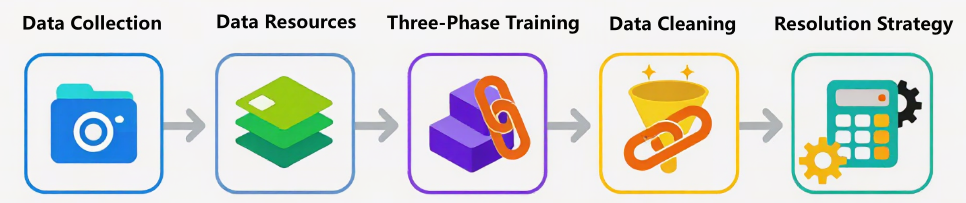

多模态模型的上限，很大程度上并不取决于 Vision Encoder 或 LLM 本身有多“先进”，而是取决于你是否拥有**规模足够、分布合理、噪声可控、语义可信**的图文数据。实际工程中，构建一个可用的 Image-Text 数据集，往往比“堆模型结构”更花时间。

### 3.1 Image-Text Pairs 数据来源

从工程视角看，图文对数据并不存在一种“完美来源”。现实中的数据来源通常可以粗略划分为三大类，它们在**规模、质量、成本和可控性**之间形成了一条非常清晰的梯度，从“免费但脏”到“昂贵但香”。

第一类是**大规模网抓数据（Web-crawled datasets）**。  
这是当前多模态预训练中最常见、也是最不可或缺的数据来源，典型代表包括 LAION-400M、LAION-2B、Conceptual Captions（CC3M / CC12M）等。这类数据通常来自对网页图片及其周边文本（如 `alt text`、标题、上下文段落）的自动抓取，再经过基础规则过滤后形成图文对。

它们最大的优势非常直接：**规模巨大**。上亿级甚至十亿级的 Image-Text Pairs，使模型得以在预训练早期快速建立视觉—语言之间的粗粒度对齐关系。模型在这一阶段学到的，往往不是精细语义，而是“图像大概对应什么样的文字分布”“视觉概念和语言 token 之间是否存在统计相关性”。

但代价同样明显。这类数据中普遍存在描述模糊、图文错配、广告噪声、模板化文本甚至完全无关的情况。用概率的语言来描述，真实语义对齐的比例往往并不高，即使经过清洗，也只能在噪声中“筛金子”。因此在工程实践中，这类数据更适合作为**视觉启蒙阶段的底座语料**，而不是能力精炼阶段的核心数据。

第二类是**人工标注数据（Human-annotated datasets）**。  
这类数据通常由人工为图片撰写高质量描述，或围绕图片设计结构化任务，典型数据集包括 COCO Captions、Flickr30k、Visual Genome、GQA、RefCOCO 等。与网抓数据相比，它们在语义准确性、描述完整度和任务一致性上有显著优势。

从模型训练的角度看，这类数据的价值并不在于“让模型看更多图片”，而在于**校准模型的理解边界**。例如，COCO Caption 能帮助模型学会如何准确描述场景，Visual Genome 强化对象—关系建模，GQA 则直接锻炼视觉推理能力。这类数据非常适合用在预训练后期或对齐阶段，用来纠正模型在大规模噪声数据中学到的“模糊对齐”。

它们的短板同样清晰：**规模有限且成本高昂**。即便是最常用的 COCO，也只有十万量级图片。这意味着它们不可能单独支撑一个多模态模型从零训练，而更像是“高质量调味剂”。

第三类是近年来快速崛起的**模型生成数据（Synthetic Image-Text Pairs）**。  
随着 GPT-4V、Gemini、Qwen-VL 等多模态模型能力的提升，使用模型为图片自动生成高质量描述、问答对甚至多轮对话，已经成为业界非常现实的选择。这类数据在成本、可控性和任务多样性之间，提供了一种新的折中方案。

从工程角度看，合成数据最大的优势在于**可定制**。你可以指定描述风格（简短 / 详细）、任务形式（caption / QA / reasoning）、语言类型，甚至人为控制难度分布。这一点在构建 OCR、多步推理、细粒度指代等数据时尤为重要。同时，它的规模可以按算力线性扩展，避免了人工标注的瓶颈。

但合成数据并非“银弹”。模型生成的数据不可避免地会带入生成模型自身的偏差，例如过度自信的描述、视觉幻觉或模式化表达。如果不加控制，模型很容易在“自我模仿”的循环中强化错误认知。因此，合成数据往往需要配合规则校验、置信度过滤或人工抽检，才能进入主训练流程。

在真实的大规模多模态预训练中，这三类数据几乎从不单独使用。更常见的做法是：

- 以**网抓数据**提供规模和覆盖面  
- 以**人工标注数据**提供高精度锚点  
- 以**合成数据**补足任务复杂度和分布空白  

这种混合策略，本质上是在用工程手段逼近一个理想目标：让模型在尽可能大的数据空间中，既能“见得多”，又能“看得准”，为后续的图文对齐和多模态推理能力打下可持续扩展的基础。

### 3.2 常见的多模态数据集

下面为经典且主流的开源数据集。这些数据集在多模态大模型的预训练、对齐和微调阶段起着至关重要的作用。

**（1）大规模网抓数据 (Web-crawled Datasets)**

这类数据是模型“视觉启蒙”的基石，主要特点是规模极大，但文本通常较为简略（如 HTML 的 Alt-text）。

- [LAION-5B / LAION-2B-en](https://huggingface.co/datasets/laion/relaion2B-en-research-safe)：LAION 系列是目前全球规模最大的开源多模态数据集。它通过抓取 Common Crawl 索引中的图片链接及关联文本，利用 CLIP 模型进行过滤，确保图文之间具有一定的余弦相似度。其中 LAION-2B-en 包含 23.2 亿个英文图文对。在工程实践中，它是训练 Stable Diffusion 或 CLIP 等模型的核心底座。虽然它包含不少噪声（如水印图、广告语），但其无与伦比的规模让模型能够学习到极广的常识分布。由于原始图片过大，HuggingFace 上通常提供的是元数据（URL 和文本），需配合 img2dataset 工具下载。

```json
{
  "url": "https://nationalbookswap.com/pbs/m/42/0942/9781887140942.jpg",
  "similarity": 0.338374, // CLIP 图文相似度分数
  "hash": -1792395005269000200,
  "pwatermark": 0.133521,
  "punsafe": 0.000775, // 可能为不适宜内容的概率
  "caption": "Universal Orlando 2012 The Ultimate Guide to the Ultimate Theme Park Adventure",
  "key": "1460705139",
  "status": "success",
  "error_message": "",
  "width": 93,
  "height": 140,
  "original_width": 93,
  "original_height": 140,
  "exif": "{}"
}
```

- [Conceptual Captions 3M (CC3M)](https://huggingface.co/datasets/google-research-datasets/conceptual_captions)：CC3M 是由 Google 发布的经典网抓数据集。它从互联网网页中抓取图片，并对其原始的 Alt-text 进行了极其严格的“概念化”处理：例如将具体的人名替换为“人”，地名替换为“地点”。这种处理使得文本更具描述性而非叙事性，非常适合训练模型学习通用的视觉概念对齐。相较于 LAION，CC3M 的质量更高，虽然规模仅为 330 万对，但它是许多多模态模型在进入指令微调前的首选预训练数据集，能够帮助模型建立稳健的视觉特征提取能力。

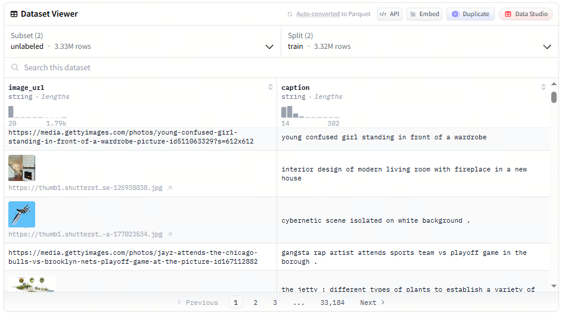

- [Conceptual Captions 12M (CC12M)](https://huggingface.co/datasets/laion/conceptual-captions-12m-webdataset)：作为 CC3M 的进阶版，CC12M 放宽了部分过滤策略，规模扩大到了 1240 万对。它的文本描述比 CC3M 更加多样且包含更多长尾词汇。在多模态模型开发中，CC12M 常被用于填补 CC3M 的规模不足，同时其信噪比仍远高于未经处理的 LAION。对于 7B 左右的中等规模多模态模型，CC12M 配合 CC3M 往往能提供足够的预训练语料，使模型对自然场景中的复杂对象（如特定品种的动植物、各种现代电子产品）产生初步认知。它是目前训练 7B 至 13B 规模多模态大模型（如 LLaVA 的预训练阶段）最常用的“第一桶金”，能够帮助模型在指令微调前建立起稳健且泛化的视觉常识理解能力，是构建高质量视觉编码器的基石语料。

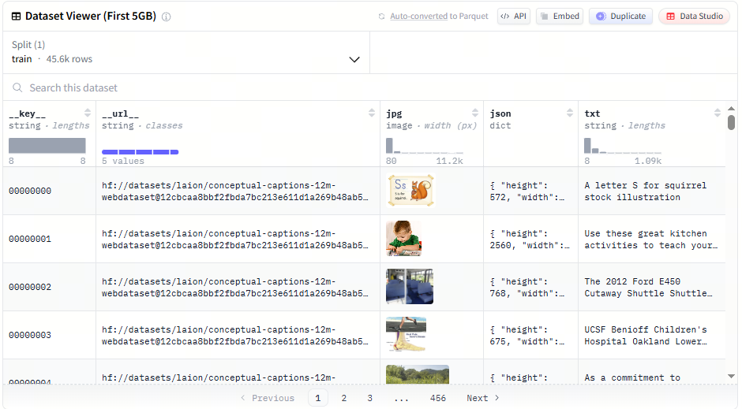

- [DataComp (CommonPool)](https://huggingface.co/datasets/mlfoundations/datacomp_1b)：DataComp 不仅仅是一个数据集，更是一个旨在寻找“最佳数据过滤策略”的基准。它包含了从 Common Crawl 提取的 12.8 亿个原始图文对（CommonPool）。该数据集的重要性在于它提供了不同规模的候选集（从 Small 到 XLarge），允许研究者在受控的环境下测试数据清洗算法。对于开发者而言，使用 DataComp 中经过精细过滤的部分（如 DataComp-1B）可以显著提升 CLIP 等对比学习模型的性能。它是目前研究“如何从网抓废料中提取黄金数据”的最前沿阵地。

```json
{
  "uid": "5812f73c27203184de03f05c83017f61",
  "url": "https://i.pinimg.com/736…6bba3a1e7ee0.jpg",
  "text": "Alameda County Fairgrounds Live Horse Racing",
  "original_width": 736,
  "original_height": 276,
  "clip_l14_similarity": 0.260254,
  "clip_b32_similarity_score": 0.310059,
  "face_bboxes": [],
  "sha256": "d27037a7a4e4c976c9bf0d2ce22aeb2dccf3a480061af1f00174e8bad21e0722"
}
```

**（2）人工标注数据 (Human-annotated Datasets)**

这类数据规模虽小（万级到十万级），但描述精准、逻辑严密，是校准模型理解边界的“高质量调味剂”。

- [COCO Captions (2017)](https://huggingface.co/datasets/lmms-lab/COCO-Caption2017)：MS-COCO 是计算机视觉领域最著名的基准。其 Caption 子集包含约 12 万张图片，每张图片由 5 名人工标注员撰写 5 条不同的描述短语。这些描述涵盖了场景中的主要物体、动作及相互关系。在 SFT（指令微调）阶段，COCO 常用作“图说”任务的标准模板。它能教会模型使用标准、客观的语言组织逻辑。虽然它无法提供海量的常识，但它对物体的边界判定和基本动作的识别准确度是网抓数据无法比拟的，是评估模型视觉感知的“金标准”。

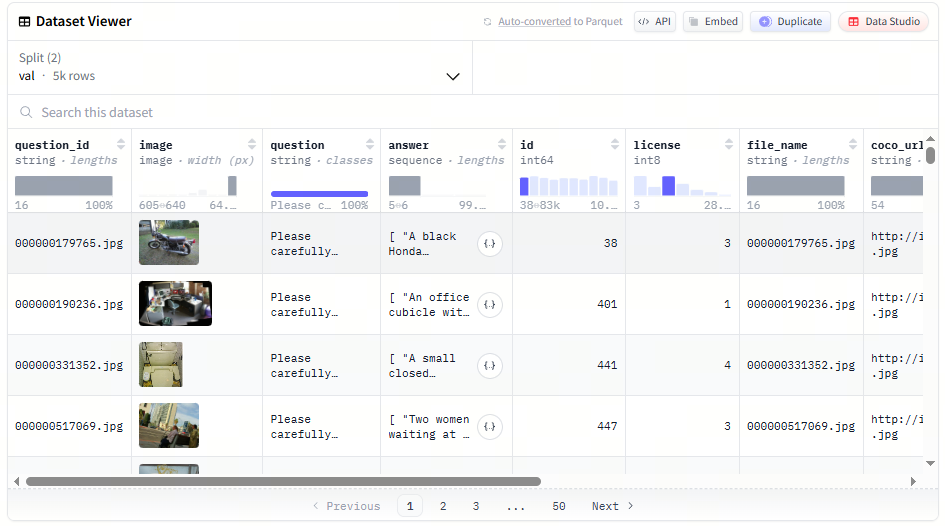

- [Visual Genome (VG)](https://huggingface.co/datasets/BoyangZ/VisualGenome_VG_100K_1_and_2)：Visual Genome 远超简单的图文对，它是一个复杂的场景图（Scene Graph）数据集。它对 10 万张图片进行了极细粒度的标注：不仅有物体标签，还有物体的属性（颜色、材质）以及物体间的相互关系（A 穿着 B，C 在 D 的上面）。总计包含超过 400 万个属性标注和 230 万个关系对。对于需要具备“细粒度理解”能力的模型，VG 是不可或缺的。微调时引入 VG 数据，可以显著改善模型在复杂场景下的“幻觉”问题，让模型学会不仅看到物体，还能理解物体间的逻辑链条。

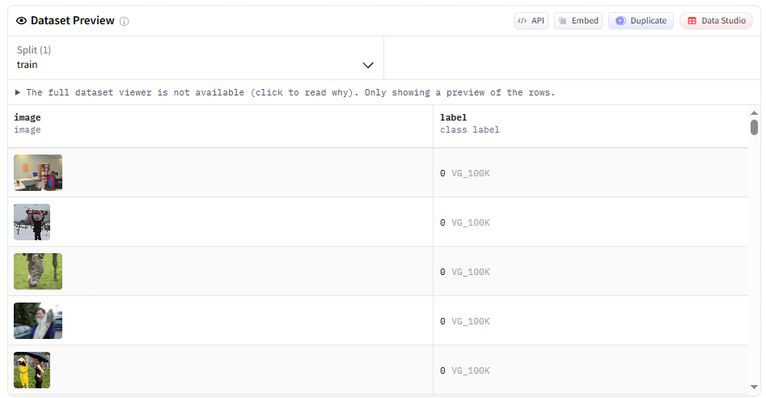

- [Flickr30k](https://huggingface.co/datasets/nlphuji/flickr30k)：Flickr30k 包含 3.1 万张来自 Flickr 网站的自然场景图片，每张图片同样配有 5 条人工编写的描述。相比 COCO，Flickr30k 的场景更加生活化，包含大量人类活动和复杂的事件描述。在多模态检索任务（Image-to-Text Retrieval）中，它是最常用的评测集之一。由于其规模较小且标注极精，它非常适合作为模型微调阶段的“冷启动”数据。开发者常利用它来训练模型对日常语义的捕捉能力，确保模型输出的语言风格贴近真实人类的观察视角。

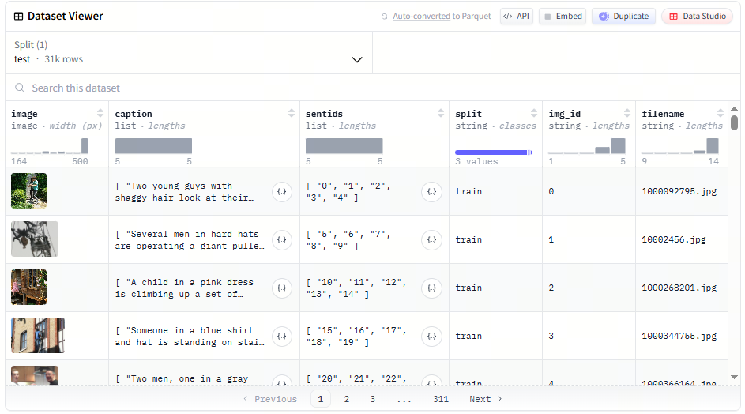

- [GQA (Geometric Question Answering)](https://huggingface.co/datasets/lmms-lab/GQA)：GQA 是基于 Visual Genome 构建的视觉问答（VQA）数据集，包含约 2200 万个针对图像内容的逻辑问题。它的独特之处在于问题具有极强的结构化和逻辑性，例如：“那个穿着红衣服的人左手拿着的东西是什么形状的？”这种多步推理任务是纯网抓数据完全无法提供的。微调 7B 模型时，引入 GQA 能极大增强模型的空间推理和属性关联能力。它是将多模态模型从简单的“图像分类器”升级为“视觉智能体”的关键一步，能有效对比微调前后的逻辑推理准确率。

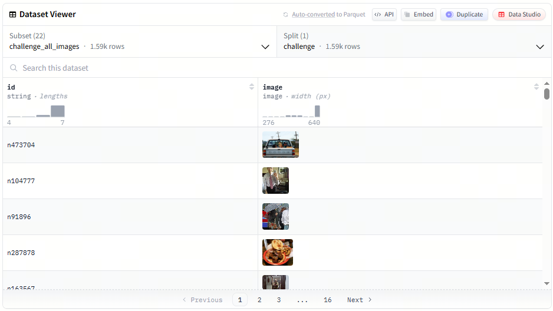

**（3）模型生成数据 (Synthetic Image-Text Pairs)**

利用现有强大模型（如 GPT-4V）对图片进行重构描述，在成本和任务多样性上具有极大优势。

- [LLaVA-Instruct-150K](https://huggingface.co/datasets/liuhaotian/LLaVA-Instruct-150K)：这是多模态指令微调（Instruction Tuning）的开山之作。研究者利用 GPT-4 对 COCO 图像的元数据（Bounding Boxes 和 Captions）进行纯文本处理，生成了 15 万条涵盖对话、细节描述和复杂推理的指令数据。该数据集证明了即使模型没“亲眼看过”原图，仅凭结构化文本描述也能合成高质量的视觉指令。这是训练 LLaVA 系列模型的核心，也是目前学术界模仿最多的合成数据模式。它能显著提升模型在对话过程中遵循复杂格式要求的能力。

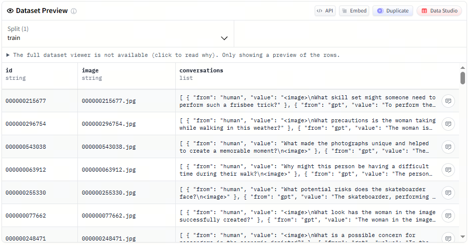

- [ShareGPT4V](https://huggingface.co/datasets/Lin-Chen/ShareGPT4V)：ShareGPT4V 是针对 Caption 质量瓶颈开发的。它利用 GPT-4V 对大量开源图片进行了重新描述，产生了极高质量、高度详细（往往长达数百字）的图文对。相比原始网抓数据中简单的“一只猫”，ShareGPT4V 会描述猫的品种、神态、背景光影及构图。在工程微调中，使用该数据集可以瞬间提升模型的“描述丰满度”。如果你发现你的模型只会回复短句，使用 ShareGPT4V 进行 SFT 往往能让模型学会如何输出细节详实、结构清晰的长文本回复。

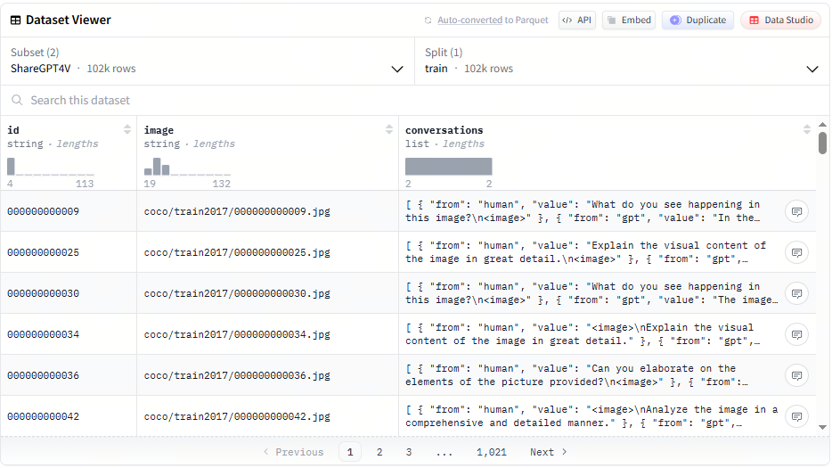

- [SVIT (Scaling Visual Instruction Tuning)](https://huggingface.co/datasets/BAAI/SVIT)：SVIT 是由智源研究院（BAAI）发布的大规模合成视觉指令数据集。它包含了通过 GPT-4V 自动生成的 470 万条问答对。其涵盖范围极广，包括对图像中实体的定位、属性描述以及常识问答。SVIT 的优势在于其“规模性”，它展示了如何通过自动化流水线替代昂贵的人工标注。对于 7-8B 规模的模型，SVIT 提供了充足的样本来训练模型处理多样化任务，特别是在中文和英文双语环境下的视觉对齐表现优异。

```json
{
  "image_id": "v_12345",
  "qa_pairs": [
    {"question": "Where is the red car located?", "answer": "The red car is at the bottom right corner, near the fire hydrant."},
    {"question": "What is the weather like?", "answer": "It appears to be a rainy day as the pavement is wet."}
  ],
  "bboxes": [{"box_2d": [120, 45, 300, 210], "label": "red car"}]
}
```

- [VQAScore-Filtered Synthetic Data (如 LLaVA-v1.5 部分)](https://huggingface.co/datasets/liuhaotian/LLaVA-Pretrain)：在 LLaVA-v1.5 及后续版本的训练中，大量使用了经过清洗的合成数据。这不仅仅是简单的生成，还包含了利用模型对生成内容进行“打分过滤”（VQAScore）。这种数据通常包含混合任务，如 OCR 提取、表格理解和复杂坐标转换。这类数据的价值在于解决特定领域的“数据孤岛”问题，例如医疗影像报告生成或工业缺陷检测。通过合成高质量、高难度的边缘案例（Corner Cases），它能有效补足模型在极端场景下的推理短板，提升字段抽取的准确率。

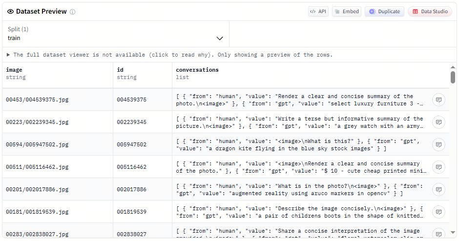

### 3.3 三阶段训练的图文数据形态

在 InternVL、Qwen-VL 等主流多模态模型中，三阶段训练并不仅仅体现为训练目标或参数解冻策略的变化，更直观、也更关键的差异体现在**图文数据“长什么样、如何被组织、以及如何参与训练”**上。从数据工程的视角来看，这三阶段几乎对应着三种完全不同的数据形态与使用逻辑：数据结构逐步复杂、语义密度持续提高、图文对齐的精度要求不断收紧。

为了更清晰地理解这种变化，下面以**同一个现实语义对象**贯穿三阶段，展示在不同训练阶段中，数据究竟会被构造成什么样子。

假设我们关注的图像内容始终是同一张图片：


> 一只橘猫趴在窗台上晒太阳，旁边放着一盆绿色植物。

第一阶段通常对应**视觉—语言对齐或对比学习阶段**，其核心数据形态是大规模、弱标注的图文对（image–text pairs）。这类数据多来自网页抓取、搜索引擎索引、图片社区或百科站点，文本往往是图片周围的标题、alt text、用户评论或上下文片段，语义噪声较大，但规模极其可观。

在这一阶段，同一张图片的数据可能长得非常简单，例如：

```json
{
  "image": "cat_on_windowsill.jpg",
  "text": "a cat by the window"
}
```

或：

```json
{
  "image": "cat_on_windowsill.jpg",
  "text": "orange cat sunlight"
}
```

甚至是主观表达：

```json
{
  "image": "cat_on_windowsill.jpg",
  "text": "My lazy cat in the afternoon"
}
```

此时，数据的重点并不在于“文本是否完整、准确地描述了图像”，而在于图像与文本之间是否存在足够强的统计相关性，使模型能够在嵌入空间中建立初步的跨模态映射关系。InternVL 在该阶段通过视觉—语言对比学习，将 InternViT 的视觉特征与 LLaMA 系列语言模型的文本特征对齐；Qwen-VL 则采用冻结语言模型、重点训练视觉编码器和跨模态模块的方式完成这一过程。

从形式上，这一阶段的数据可以抽象为：

$$
D_{\text{align}} = \{(I_i, T_i)\}_{i=1}^N
$$

其中 $I_i$ 表示图像，$T_i$ 表示与之弱相关的文本描述。允许噪声存在，但要求覆盖面足够广。一张“街景照片”配上“a busy city street”这样的简短描述，即使不精确，也足以帮助模型学会某类视觉模式大致对应怎样的语言分布。
这一阶段的数据本质上是在用规模换覆盖，为模型建立跨模态“感知基础”。

进入第二阶段，数据形态开始明显收紧，训练目标从“能把图和字对齐”转向“能基于图像生成有意义的文本”。这一阶段通常对应**视觉—语言生成训练或多任务预训练**，使用的数据不再是单一 caption，而是结构化程度更高、语义更密集的图文任务数据。

对于同一张橘猫图片，数据可能被组织为图像描述任务：

```json
{
  "image": "cat_on_windowsill.jpg",
  "instruction": "Describe the image.",
  "output": "An orange cat is lying on a windowsill, enjoying the sunlight next to a green plant."
}
```

也可能是视觉问答形式：

```json
{
  "image": "cat_on_windowsill.jpg",
  "question": "What is the cat doing?",
  "answer": "The cat is resting on the windowsill in the sunlight."
}
```

或者统一成多任务输入输出结构：

```json
{
  "image": "cat_on_windowsill.jpg",
  "input": "<image> What can you see in this picture?",
  "target": "An orange cat resting on a windowsill with sunlight and a nearby plant."
}
```

这一阶段的数据可以抽象为：

$$
D_{\text{gen}} = \{(I_i, X_i, Y_i)\}_{i=1}^N
$$

其中 $X_i$ 是任务提示或问题文本，$Y_i$ 是模型需要生成的目标输出。相比第一阶段，这类数据具有几个显著变化：文本不再是被动附着在图像周围的“背景信息”，而是主动定义任务；图像通常具有更高分辨率和更清晰的视觉细节；数据规模相对缩小，但语义一致性和标注质量显著提升。

一个直观的对比是：在第一阶段，模型只需知道“猫”这个词经常与某类视觉区域同时出现；而在第二阶段，它必须学会根据图像回答“猫在做什么”“场景发生在室内还是室外”等具体问题。这要求图文之间形成更明确的语义闭环，也标志着模型开始真正“使用”视觉信息参与语言生成。

第三阶段的数据形态进一步收紧，进入**有监督微调或指令微调阶段**。此时，图文数据的目标已经不再是单纯的对齐或生成，而是让模型以符合人类期望的方式运用其已有能力。对应的数据通常是结构化的指令式或对话式样本。

对于同一张橘猫图片，第三阶段的数据可能被包装成完整对话：

```json
{
  "image": "cat_on_windowsill.jpg",
  "conversation": [
    {
      "role": "user",
      "content": "Can you tell me what the cat is doing in this image?"
    },
    {
      "role": "assistant",
      "content": "The orange cat is lying on a windowsill, relaxing in the sunlight."
    }
  ]
}
```

也可能是多轮指令场景：

```json
{
  "image": "cat_on_windowsill.jpg",
  "conversation": [
    {
      "role": "user",
      "content": "What do you see?"
    },
    {
      "role": "assistant",
      "content": "I see an orange cat resting on a windowsill."
    },
    {
      "role": "user",
      "content": "Does the cat look active?"
    },
    {
      "role": "assistant",
      "content": "No, the cat looks calm and relaxed."
    }
  ]
}
```

在 Qwen-VL 中，这类数据大量来自 Self-Instruction 自动生成并筛选；在 InternVL 中，则结合了人工构建的对话式视觉指令数据。这一阶段的数据通常可以表示为：

$$
D_{\text{inst}} = \{(I_i, \text{instruction}_i, \text{response}_i)\}_{i=1}^N
$$

其中 $I_i$ 表示输入图像，$\text{instruction}_i$ 为用户指令或对话上下文，$\text{response}_i$ 是模型需要生成的最终回复。与第二阶段相比，变化的重点不在于任务类型，而在于**指令遵循、回答风格、多轮一致性和安全约束**。同一张图像，在第二阶段可能只需生成事实性描述，而在第三阶段则被置于更复杂的语境中，要求模型理解用户意图、维持上下文，并以自然、克制、符合预期的方式输出结果。这也是为什么这一阶段的数据规模通常最小，却需要最严格的清洗和筛选。

从整体来看，这三种数据形态之间呈现出清晰的递进关系：第一阶段通过大规模弱标注数据建立跨模态感知；第二阶段通过结构化任务数据塑造视觉到语言的生成能力；第三阶段通过指令与对话数据约束模型行为，使其更适合真实交互场景。图文数据也正是在这一过程中，从松散配对逐步演化为高度结构化、以用户需求为中心的交互样本。这种随训练阶段逐步收紧的数据设计，是三阶段训练策略在多模态模型中能够稳定奏效的重要原因之一。

### 3.4 图文对齐：模型真正“看懂”的关键

如果说多模态模型的参数规模和结构决定了“能不能学”，那么图文对齐数据的质量，决定的就是模型**到底学到了什么**。很多初学者会直觉地认为：只要把图片和文本一股脑丢给模型训练，它自然就能建立起视觉与语言之间的联系。但在实际工程中，很快就会发现一个残酷事实——**图和文并存，并不等于图和文对齐**。

多模态模型并不是在学习“图片 + 文字”的简单拼接，而是在学习一种更隐蔽也更困难的东西：**视觉信号与语言符号之间的对应关系**。模型需要知道，哪些视觉区域对应哪些词语，哪些视觉变化会导致语言描述发生改变，以及在给定文本指令时，应该关注图像中的哪一部分。这些能力并不会自动涌现，它们几乎完全依赖于图文对齐数据的设计方式。

从训练目标的角度看，图文对齐的本质是构造一种联合分布 $p(x, y)$，其中 $x$ 是图像（或视觉 token），$y$ 是文本序列。模型在训练时被迫最大化条件概率：

$$
\log p_\theta(y \mid x)
$$

或者在对比式建模中，同时约束图到文、文到图的匹配关系。这意味着：**如果对齐关系本身是模糊、错误或噪声极高的，模型唯一能学到的就是“模糊、错误或噪声”本身**。

在工程实践中，主流的图文对齐方式大致可以归纳为几种类型，它们并不是互斥的，而是往往在一个训练体系中混合使用，各自承担不同阶段、不同能力维度的训练目标。

第一类是最基础、也是规模最大的 **Caption 对齐（Image → Text）**。  
在这种设置中，一张图片对应一句或多句自然语言描述。对模型来说，这是一种“弱监督”信号：文本并不会显式标注每个词对应图像中的哪个区域，但整体语义是一致的。比如一张街景照片配上一句“一个人骑着自行车经过路口”，模型需要在大量样本中自行发现：人、自行车、路口这些概念在视觉空间中的统计对应关系。

单句 caption 往往用于模型的视觉启蒙阶段，让模型先建立起“看到什么 → 该用哪些词来描述”的粗粒度映射；多句 caption 或更长描述则能逼迫模型捕捉更多细节，例如物体属性、关系和场景信息。再进一步，像 Visual Genome 这样的区域级 caption，会显式告诉模型“这一小块区域对应这一短语”，它对局部理解、关系建模和复杂场景拆解尤为重要。

第二类是近年来越来越重要的 **指令式对齐（Instruction-style Alignment）**。  
这一类数据看起来更像对话，而不是描述。例如：“请描述图片中的主要物体”“图中这个人正在做什么”“根据图片回答问题”。从表面上看，它只是换了一种文本形式，但对模型行为的影响却非常深远。

指令式对齐本质上是在提前“预演”模型未来的使用方式。模型不再只是被动生成描述，而是需要根据语言指令主动选择关注的视觉信息。这一步非常关键，因为它让模型开始学会一种能力：**在视觉理解中进行条件选择**。同一张图，在不同指令下，关注点可能完全不同，这正是多模态对话模型与传统视觉模型的分水岭。

从训练角度看，这类数据通常仍然优化 $\log p_\theta(y \mid x, \text{instruction})$，但 instruction 的引入显著提高了条件建模的难度，也提高了模型的泛化潜力。这也是为什么很多多模态模型会在后期大量引入指令风格的数据，哪怕这些数据是通过大模型自动生成的。

第三类是更偏结构化的 **区域级对齐（Region–Text Alignment）**。  
这类数据往往来自目标检测、OCR、文档理解或 UI 理解任务。图像中不仅有文本描述，还有明确的区域框（bounding box）或布局信息，告诉模型“这个文本对应图像中的哪个位置”。这种对齐方式对模型的影响非常直接：它显著提升模型对空间结构的敏感度。

例如，在 OCR 场景中，模型需要学会从复杂背景中定位文本区域；在表格或海报理解中，模型需要理解不同区域的功能差异；在 UI 截图中，模型甚至需要区分按钮、输入框和文本标签。这些能力几乎不可能仅通过粗粒度 caption 学到，而必须依赖区域级或布局级的对齐信号。

值得注意的是，不同类型的对齐数据，对模型能力的塑造方向是不同的。  
大量 caption 数据会让模型“看得多、说得顺”，但可能对细粒度定位不敏感；大量区域对齐数据会增强结构理解，却可能牺牲生成的自然度；大量指令式数据会提升交互能力，但如果基础视觉对齐不足，模型可能只是“会说话却看不准”。

因此，在真实的多模态预训练流水线中，图文对齐从来不是单一策略，而是一种**分阶段、分能力维度的组合设计**。常见做法是：先用大规模弱对齐数据建立视觉—语言的基本锚点，再逐步引入更高质量、更强约束的数据，收紧模型的对齐空间，让它真正学会“哪些词该由哪些视觉证据支撑”。

当模型在推理阶段给出一个看似“理解图片”的回答时，背后并不是某个神奇模块突然开窍，而是这些精心设计的对齐数据，在训练过程中一次次迫使模型做出正确的对应选择。图文对齐做得越扎实，模型“看懂”的概率就越高；对齐一旦松动，模型再大，也只是在猜。

### 3.5 数据清洗、过滤与质量控制

如果说图文数据的“来源”决定了多模态模型能看到多大的世界，那么**数据清洗、过滤与质量控制**，决定的就是模型看到的是不是一个“靠谱的世界”。在真实工程中，多模态预训练的失败，往往并不是模型结构或训练策略的问题，而是数据阶段就已经悄悄埋下了隐患：图文错配、描述空泛、重复样本、低分辨率噪声图像，这些问题一旦规模化进入训练集，就会被模型“忠实地”学进去。

与纯文本相比，图文数据的质量控制复杂得多。文本质量差，最多让模型“说话没营养”；而图文对齐一旦出问题，模型会学到错误的跨模态映射，比如“看到猫却生成狗”“图中没有文字却强行 OCR”。因此，多模态数据清洗的核心目标并不是“追求完美”，而是在**规模、成本与有效性之间找到一个可接受的平衡点**。

在工程实践中，清洗与过滤通常不是一步完成的，而是一个由粗到细、层层收紧的过程。

**第一层：结构与基础合法性检查**

这一层解决的是“能不能用”的问题。最基础的检查包括：图像是否可正常解码、分辨率是否达标、文本是否为空或过短。许多公开数据集中都存在损坏图片、404 链接或极端低分辨率样本，这类数据即使保留下来，对模型几乎没有任何学习价值。

常见的规则包括：

- 图像分辨率过滤：例如要求最短边不小于 $224$，避免过度模糊的样本  
- 文本长度过滤：caption 至少包含 $n$ 个 token，防止“a photo”“image”这类无信息描述  
- 文件完整性校验：确保图片可以被 PIL / OpenCV 正常读取  

这一阶段的目标不是精细筛选，而是快速剔除明显无效的数据，通常可以过滤掉 10%～30% 的噪声样本。

以 pillow 为例，先使用 pip 进行安装：

```bash
pip install pillow tqdm
```

下面是一个最基础、可直接使用的 Python 示例，用于过滤损坏图片和低分辨率样本。

```python
from PIL import Image
from tqdm import tqdm
import os

def is_valid_image(img_path, min_size=224):
    try:
        with Image.open(img_path) as img:
            w, h = img.size
            return min(w, h) >= min_size
    except Exception:
        return False

image_dir = "images/"
valid_images = []

for fname in tqdm(os.listdir(image_dir)):
    path = os.path.join(image_dir, fname)
    if is_valid_image(path):
        valid_images.append(fname)

print(f"Valid images: {len(valid_images)}")
```

**第二层：文本质量与语言分布过滤**

在多模态数据中，文本往往比图像更“脏”。Web 抓取的 caption 中，常见问题包括广告语、乱码、模板化描述、错误语言混入等。如果模型在预训练阶段大量接触这类文本，它学到的语言分布会明显偏移，最终体现在生成质量下降或语言混乱。

这一阶段通常会引入一些轻量但有效的规则：

* 语言检测：只保留目标语言（或多语言比例受控）
* 低信息密度过滤：基于 token 多样性、重复率
* 关键词黑名单：过滤广告、URL、垃圾标签

一个常用的低成本指标是 **字符或 token 熵**。如果一句 caption 的有效信息量过低，其熵值往往明显偏小。简单形式可以表示为：

$$
H(x) = - \sum_{i} p(x_i) \log p(x_i)
$$

其中，$x$ 表示一条图文配对中的文本描述（caption），$x_i$ 为文本中第 $i$ 个字符或 token；$p(x_i)$ 表示该字符或 token 在当前文本或统计语料中的经验出现概率；$H(x)$ 为文本的信息熵，用于衡量整体信息分布的离散程度。直观上，$H(x)$ 越小，说明文本内容越集中、重复度越高，往往对应描述空洞或模板化的低质量 caption；反之，较高的熵值通常意味着更丰富、多样的表达，在数据清洗阶段可作为过滤低信息量样本的参考指标。

虽然这不是严格的语义质量度量，但在大规模过滤中非常实用。

使用 `langdetect` 进行语言过滤，使用 pip 安装：

```bash
pip install langdetect
```

下面示例展示如何结合语言检测和长度规则进行文本过滤。

```python
from langdetect import detect

def is_good_caption(text, min_len=5):
    try:
        if len(text.split()) < min_len:
            return False
        lang = detect(text)
        return lang in ["en", "zh"]
    except Exception:
        return False
```

**第三层：图文相关性与错配检测**

这是多模态数据清洗中最关键、也是最“值钱”的一层。图像和文本本身质量再高，如果它们彼此不匹配，对模型来说依然是错误监督信号。大规模数据集中，这类错配比例往往被低估，尤其是在 Web-crawled 数据中。

当前最主流、性价比最高的做法，是使用预训练的图文对齐模型（如 CLIP）进行相似度过滤。CLIP 将图像和文本映射到同一语义空间，通过余弦相似度衡量它们的一致性：

$$
\text{sim}(I, T) = \frac{f_I(I) \cdot f_T(T)}{|f_I(I)||f_T(T)|}
$$

其中，$I$ 表示输入图像，$T$ 表示与之配对的文本描述；$f_I(\cdot)$ 与 $f_T(\cdot)$ 分别为 CLIP 中的图像编码器和文本编码器，用于将图像与文本映射到同一语义嵌入空间；$f_I(I)$ 和 $f_T(T)$ 为对应的向量表示；$\cdot$ 表示向量点积，$|\cdot|$ 为向量的 $L_2$ 范数。$\text{sim}(I, T)$ 的取值范围通常在 $[-1, 1]$ 之间，数值越大表示图像与文本在语义上的一致性越强，在数据清洗中可通过设定阈值实现高效的自动过滤。

当相似度低于某个阈值时，样本被认为是潜在错配，可以直接丢弃或降权。

**一个简单的工程示例**

需要安装的包如下：

```bash
pip install torch torchvision open_clip_torch
```

简单使用代码如下：

```python
import torch
import open_clip
from PIL import Image

model, _, preprocess = open_clip.create_model_and_transforms(
    'ViT-B-32', pretrained='laion2b_s34b_b79k'
)
tokenizer = open_clip.get_tokenizer('ViT-B-32')

def clip_score(image_path, text):
    image = preprocess(Image.open(image_path)).unsqueeze(0)
    text_tokens = tokenizer([text])
    with torch.no_grad():
        img_feat = model.encode_image(image)
        txt_feat = model.encode_text(text_tokens)
        img_feat /= img_feat.norm(dim=-1, keepdim=True)
        txt_feat /= txt_feat.norm(dim=-1, keepdim=True)
        score = (img_feat @ txt_feat.T).item()
    return score
```

在真实流水线中，CLIP 分数通常不会作为“绝对裁决”，而是结合分位数或动态阈值进行筛选，以避免过度清洗带来的数据多样性损失。

**第四层：去重与近重复样本控制**

大规模图文数据中，重复问题几乎不可避免：同一张图片被多次抓取、轻微裁剪或压缩后重复出现；同一段 caption 被不同网页复制粘贴。重复数据会放大某些模式的权重，降低模型泛化能力，并浪费宝贵的算力。

图像侧常用的去重方法包括：

* 感知哈希（pHash / aHash）
* 图像 embedding 聚类
* 局部敏感哈希（LSH）

文本侧则可以采用 MinHash 或 n-gram 相似度。一个简化的文本去重示例如下：

```bash
pip install datasketch
```

安装好包后直接调用：

```python
from datasketch import MinHash

def text_minhash(text, num_perm=128):
    m = MinHash(num_perm=num_perm)
    for token in set(text.split()):
        m.update(token.encode("utf8"))
    return m
```

在多模态场景中，实践中往往采用“图像优先”的去重策略，先保证视觉多样性，再控制文本重复。

**第五层：质量打分与分层保留**

完全“非黑即白”的过滤策略并不适合多模态预训练。更成熟的做法，是为样本打上一个综合质量分数，用于后续的数据配比或课程学习。

一个简化的质量评分可以表示为：

$$
Q = \alpha \cdot \text{CLIP}(I, T) + \beta \cdot Q_{\text{text}} + \gamma \cdot Q_{\text{image}}
$$

其中不同项对应图文对齐、文本质量与图像质量。最终并不是只保留 $Q$ 最高的样本，而是按照质量区间分桶，在不同训练阶段使用不同配比。

这种“评分而非一刀切”的思路，使得数据清洗不再只是删除，而是成为后续训练策略的重要输入。

在多模态预训练中，数据清洗并不是一个“可有可无”的前处理步骤，而是决定模型是否真的能建立正确跨模态映射的核心工程环节。模型并不会主动区分哪些样本是噪声，它只会忠实地拟合你提供给它的世界。

### 3.6 分辨率策略与计算成本权衡

在多模态模型的训练中，图像分辨率看似只是一个“预处理参数”，但实际上它直接决定了视觉 token 的数量，从而深刻影响模型的计算复杂度、显存占用、收敛速度以及最终效果。很多多模态项目在早期效果不稳定、显存爆炸或训练效率低下，问题并不出在模型结构，而是出在分辨率策略选择上。

从 Vision Transformer（ViT）或其变体的视角来看，图像首先会被切分为固定大小的 patch。例如常见的 $P \times P$ patch 切分方式中，一张分辨率为 $H \times W$ 的图像会被映射为 $N$ 个视觉 token：

$$
N = \frac{H \times W}{P^2}
$$

其中，$H$ 与 $W$ 分别表示输入图像的高度与宽度，$P$ 为每个 patch 的边长。每一个视觉 token 对应图像中的一个局部区域，并被编码为固定维度的向量表示，用于后续的注意力计算。当 $P$ 固定时，$N$ 与图像分辨率呈正相关关系，分辨率的提升会显著增加 token 数量，从而带来计算复杂度和显存占用的快速上升。

更关键的是，在标准自注意力机制下，注意力计算复杂度近似为：

$$
O((N + T)^2)
$$

其中 $T$ 是文本 token 数量。当视觉 token 数量明显大于文本 token 时，模型的瓶颈几乎完全由图像分辨率决定。这也是为什么在多模态训练中，“盲目追求高分辨率”往往带来灾难性的训练成本。

但另一方面，分辨率又并非越低越好。低分辨率图像虽然计算高效，却会牺牲大量细节信息，尤其是在 OCR、文档理解、UI 理解、细粒度目标识别等任务中，模型需要依赖局部结构和小尺度纹理。如果一开始就将图像压缩得过于粗糙，模型即便训练再久，也很难补回这些信息。

因此，分辨率策略本质上是一种“信息密度”与“计算预算”之间的权衡问题，而不是单纯的工程参数调节。

在实践中，主流多模态模型通常会采用以下几类分辨率策略。

第一类是**固定分辨率策略**。这也是最简单、最稳定的做法，例如统一将所有图像 resize 到 $224 \times 224$、$336 \times 336$ 或 $448 \times 448$。这种方式的优势在于训练过程可控、batch 形状一致、实现成本低，特别适合大规模预训练阶段。它的隐含假设是：模型可以通过大量样本学习到“分辨率不足时的抽象表示”，而不是依赖精确像素级信息。

第二类是**多分辨率混合策略**。在同一个训练过程中，不同样本采用不同分辨率，例如在一个 batch 中同时包含 $224$、$336$ 和 $448$ 的图像。这种策略的直觉是：低分辨率样本帮助模型学习全局语义，高分辨率样本补充局部细节，从而提升泛化能力。这类策略常见于后期对齐或能力强化阶段，但需要在 batch padding、显存规划和吞吐稳定性上额外设计。

第三类是**动态分辨率或裁剪策略**。这类方法不直接使用整张高分辨率图像，而是通过规则或模型预测，选择关键区域进行高分辨率裁剪，其余区域保持低分辨率。这在文档理解、网页截图、复杂场景图像中尤其有效，因为真正有信息密度的区域往往只占图像的一小部分。

从训练阶段角度看，分辨率策略往往与数据阶段绑定。一个常见的实践流程是：在大规模预训练早期，使用较低分辨率以控制成本和稳定收敛；在中后期逐步引入更高分辨率样本，让模型在已有对齐能力的基础上学习细节。这种“分辨率课程学习”与文本领域中从短序列到长序列的训练逻辑是高度一致的。

在工程实现层面，分辨率策略往往需要与 patch 大小、视觉编码器结构共同考虑。例如，当 patch size 固定为 $16 \times 16$ 时，从 $224$ 提升到 $448$，token 数从 $196$ 直接上升到 $784$，注意力计算量增加约 16 倍。如果不调整 batch size 或梯度累积策略，训练几乎不可能稳定运行。

下面是一个简化的 Python 示例，展示如何在数据加载阶段实现多分辨率策略。

```bash
pip install pillow torchvision
```

安装所需包后直接使用：

```python
from PIL import Image
import random
from torchvision import transforms

resolutions = [224, 336, 448]

def random_resolution_transform():
    size = random.choice(resolutions)
    return transforms.Compose([
        transforms.Resize((size, size)),
        transforms.ToTensor(),
    ])

def load_image(path):
    img = Image.open(path).convert("RGB")
    transform = random_resolution_transform()
    return transform(img)
```

这种方式可以在不改动模型结构的前提下，让模型在训练过程中自然接触不同分辨率的数据分布。但在实际大规模训练中，通常还需要结合 bucket batching 或分组采样，避免同一 batch 内分辨率差异过大导致显存浪费。

从成本角度来看，分辨率策略往往比模型参数规模更容易“失控”。参数量增长通常是线性的、可预期的，而分辨率一旦提升，计算量和显存占用会以近乎指数的方式膨胀。因此，在多模态预训练中，一个经验性原则是：宁可用更多样本、更多 epoch，也不要轻易用更高分辨率。

当模型已经具备基本的图文对齐能力后，再通过少量高分辨率数据进行能力强化，往往比从一开始就“喂高分图”更高效。这种策略不仅节省算力，也让训练过程更稳定，避免模型在早期被大量噪声细节牵着走。

分辨率并不是越高越“看得清”，而是要让模型在合适的阶段看到“刚刚好”的信息密度，这才是多模态训练中真正成熟的工程思维。

## 4. 实例解析：InternVL / Qwen-VL 的三阶段训练

在多模态预训练中，三阶段训练策略已经成为主流做法。通过分阶段处理不同任务和数据类型，模型可以逐步学习视觉和语言的表征能力，同时保证生成能力和指令理解能力。下面我们以 InternVL 和 Qwen-VL 为例，解析它们的训练流程与数据策略。

### 4.1 InternVL 三阶段训练

#### 阶段一：视觉-语言对比训练（Vision-Language Contrastive Training）


在这一阶段，核心目标是对齐视觉编码器与语言模型的特征空间。InternViT-6B 与多语言 LLaMA-7B 在大规模、嘈杂的图文对（noisy image-text pairs）上进行对比学习。

通过对比学习，模型能够学会将图像与其对应文本在嵌入空间中靠近，而无关的图文对保持距离，从而为后续生成和推理任务打下基础。

#### 阶段二：视觉-语言生成训练（Vision-Language Generative Training）

在继承了 LLaMA-7B 权重的 QLLaMA 上，保留 InternViT-6B 和 QLLaMA 的原始权重冻结，仅训练新添加的可学习查询（learnable queries）和交叉注意力层（cross-attention layers）。

这一阶段的核心目的是增强视觉信息对语言生成的影响，使模型能够根据图像内容生成连贯、语义准确的文本。

#### 阶段三：有监督微调（Supervised Fine-Tuning）

为了强化对话和问答能力，InternVL 将视觉-语言模块通过 MLP 层与现有 LLM 解码器（如 Vicuna 或 InternLM）连接，并使用监督数据进行微调。

该阶段主要目标是提升模型在多轮对话、问答以及复杂指令任务上的表现，同时保持视觉信息的准确映射。

其使用的各阶段数据如下图所示：

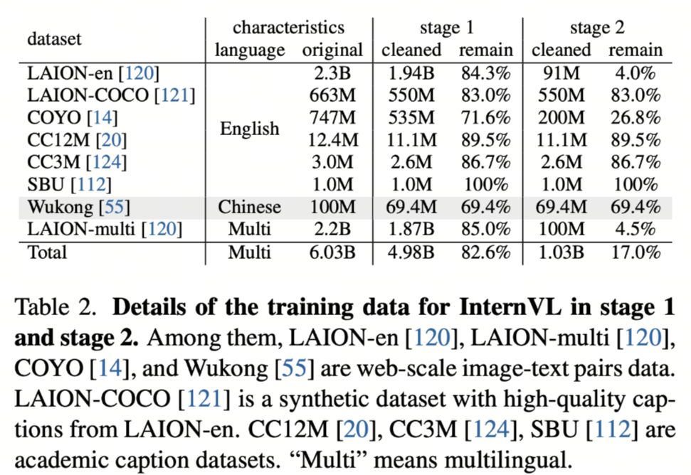

### 4.2 Qwen-VL 三阶段训练


#### 阶段一：图文对齐预训练（Pretraining）

目标是使用大量图文 Pair 对对视觉模块和 LLM 特征进行对齐。在这一阶段，LLM 模块的参数保持冻结，主要训练视觉编码器与交叉模块，使视觉特征能够有效映射到语言嵌入空间。

#### 阶段二：多任务预训练（Multi-Task Pretraining）

使用更高质量的图文多任务数据，这些数据主要来源于开源视觉语言任务（VL tasks），也包含部分自建数据集。

- 输入图片像素更高，增强模型对细节的捕捉能力  
- 全参数训练，视觉编码器与语言模块同时更新  

这一阶段的核心是让模型在多种视觉语言任务中建立泛化能力，例如图像描述、区域识别、问答等。

#### 阶段三：指令微调（Instruction Tuning）

这一阶段冻结视觉编码器模块，重点提升模型的指令遵循能力和多轮对话能力。

- 数据主要来源于大模型 Self-Instruction 自动生成  
- 通过指令数据，模型学习如何根据用户输入生成合理、连贯、指令符合的输出  
- 强化多轮交互和复杂任务处理能力  

其使用的预训练数据如下图所示：  
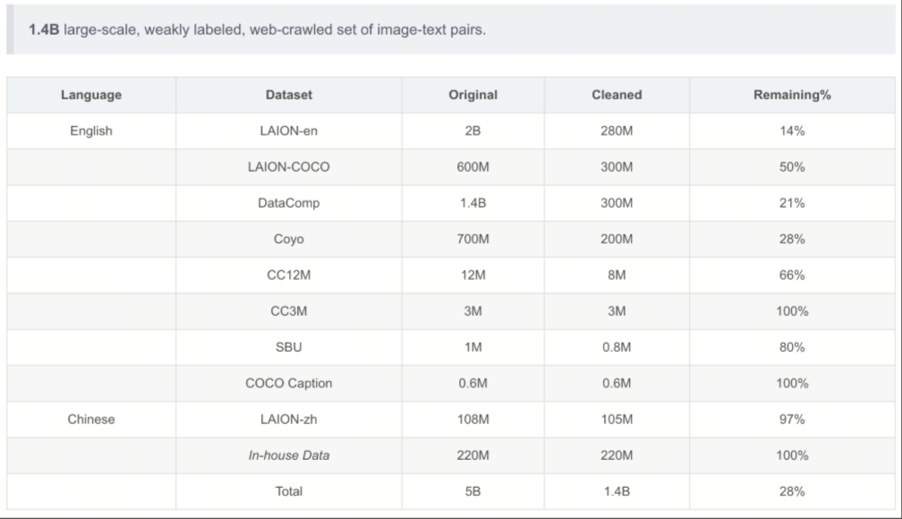
其使用的多任务训练数据如下图所示：

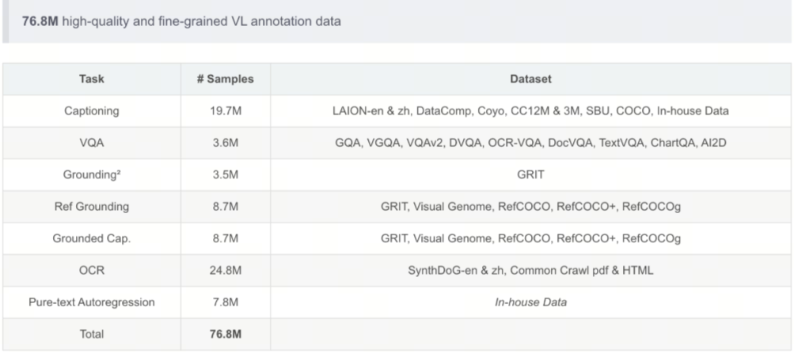

## 5. 基于 LazyLLM 的多模态预训练

### 5.1 任务定义

- 实践目标：以 [Flickr8k](https://huggingface.co/datasets/clip-benchmark/wds_flickr8k) 为数据源，经 LazyLLM 的 `build_mm_pt_pipeline` 做图像完整性检查、分辨率过滤与缩放、去重（可选 VLM 图文相关性过滤）后，得到清洗图文对；取前 3000 条作训练集、200 条作评测集。
- 训练目标：在基座 `Qwen2.5-VL-3B-Instruct` 上进行多模态继续预训练（PT），让模型更好地完成 image→caption 描述任务。
- 评测目标：对比基座与预训练模型在三类能力上的变化：
    - 对齐能力：Recall@K 代理指标（R@1 / R@5 / R@10）
    - 生成能力：CIDEr 风格分数（单参考、简化版）
    - 语义一致性：图文相似度代理分数（脚本中记为 `CLIP Score`）

### 5.2 选定资源

- 数据集：`clip-benchmark/wds_flickr8k`（Flickr8k）
    - 背景：经典图像描述数据集，每张图对应多条人工 caption。
    - 本实践读取 `train` split，将图像落盘到 `data/images/`，并取每条样本首条 caption 作为 `text`。
- 基座模型：`Qwen2.5-VL-3B-Instruct`
- 数据产物：
    - 原始记录：`data/flickr_raw.jsonl`
    - Pipeline 清洗后：`data/flickr_cleaned.jsonl`
    - 训练集：`data/flickr_train.json`
    - 评测集：`data/flickr_eval.jsonl`

数据规模（本实践配置）：

| 项目 | 数值 |
|------|------|
| 原始加载条数上限 | `SOURCE_LOAD_LIMIT`（如 4000） |
| pipeline 输出有效条数 | 视过滤结果而定（见 `data/flickr_cleaned.jsonl`） |
| 训练用图文对 | 3000 条（`cleaned[:3000]`） |
| 评测用 image→caption | 200 条（`cleaned[:200]`） |

数据结构示例：

- 原始记录（`flickr_raw.jsonl` 单行）：

```json
{
  "image_path": "./data/images/000000.jpg",
  "text": "A black dog is running after a white dog in the snow.",
  "captions": [
    "A black dog is running after a white dog in the snow.",
    "Black dog chasing brown dog through snow",
    "Two dogs chase each other across the snowy ground."
  ]
}
```

- 训练集单条（`flickr_train.json`）：

```json
{
  "image": "./data/images/000055.jpg",
  "text": "A man wearing a black hat is walking through a busy city street ."
}
```

- 评测集单条（`flickr_eval.jsonl`）：

```json
{
  "image_path": "./data/images/000055.jpg",
  "caption": "A man wearing a black hat is walking through a busy city street ."
}
```

### 5.3 数据准备与预处理

在进入模型训练之前，多模态数据的准备与清洗是一个至关重要的环节。与纯文本任务不同，这里同时涉及**图像与文本（caption）两种模态**，因此不仅需要关注文本质量，还需要保证图像本身的有效性以及图文之间的语义一致性。

整体流程可以概括为四个阶段：

> **原始数据加载 → 数据清洗（Pipeline）→ 训练集构建 → 评测集构建**

但在具体实现时，这四个阶段并不是割裂的，而是通过代码与处理逻辑逐步衔接，形成一条完整的数据流。

#### （1）原始数据加载：从数据源到“可用记录”

首先，我们需要从公开数据集中读取原始数据。本实验选用的是 Flickr8k 数据集，其每条数据通常包含：

- 一张图像（image）
- 多条描述该图像的文本（captions）

在实际加载过程中，我们并不会直接使用全部数据，而是**限制加载数量（如前 `SOURCE_LOAD_LIMIT` 条）**，以便在教学或实验环境中控制计算成本。

这一阶段的核心处理逻辑可以概括为：

```python
dataset = load_dataset('clip-benchmark/wds_flickr8k', split='train')

for item in dataset:
    img_obj = item.get('jpg') or item.get('image')
    captions_raw = item.get('caption') or item.get('txt')
```

这里有两个关键点需要理解：

* **图像字段不统一**：不同数据源中图像字段名称可能不同，因此需要做兼容处理
* **caption 可能是多条文本**：通常用换行符分隔，需要进一步拆分

在得到原始字段后，我们会进行一次“轻量筛选”：

* 去除没有图像的数据
* 去除没有有效文本描述的数据
* 将图像统一保存为本地文件路径，便于后续处理

此时，我们得到的可以理解为一批“初步可用的图文对”，但它们仍然存在以下问题：

* 图像分辨率不统一（甚至过小或损坏）
* 文本质量参差不齐
* 数据中可能存在重复样本

因此，还不能直接用于训练。

#### （2）数据清洗：构建高质量多模态样本

接下来进入数据处理的核心步骤：**Pipeline 清洗**。

在 LazyLLM 中，这一步通过 `build_mm_pt_pipeline` 自动完成。调用方式如下：

```python
ppl = build_mm_pt_pipeline(
    image_key='image_path',
    text_key='text',
    min_width=256,
    min_height=256,
    max_side=1024,
    use_dedup=True,
)
results = ppl(raw_records)
```

这一过程可以理解为一个“多阶段过滤器”，其内部大致执行了以下操作：

1. **完整性检查**：确保图像路径有效、文件可正常读取
2. **分辨率过滤**：剔除宽或高小于 `min_width` / `min_height` 的图像
3. **尺寸规范化**：将图像最长边限制在 `max_side`，避免超大图像带来的计算开销
4. **重复数据去除**：通过特征或哈希方式去除重复图像
5. （可选）**图文相关性过滤**：若提供视觉语言模型（VLM），可进一步筛掉图文不匹配的样本

这一阶段的关键目标可以总结为：

> ✅ 从“原始图文对”中筛选出“高质量、多样性、语义一致”的训练样本

值得注意的是，这一步通常会**显著减少数据量**。例如：

> 输入 4000 条原始数据 → 输出可能仅 2500 条有效样本

但这种“减少”实际上是质量提升的体现——相比数量，**数据质量对模型效果的影响更为关键**。

#### （3）训练集构建：统一为模型输入格式

在完成清洗后，我们得到的是结构化的记录列表。接下来，需要将其转化为**模型可直接使用的训练格式**。

在多模态预训练中，典型的数据形式为：

```python
train_data = [
    {
        'image': rec['image_path'],
        'text': rec['text'],
    }
    for rec in cleaned[:TRAIN_SAMPLES]
]
```

这里有两个关键设计点：

* **只保留一条 caption**：尽管原始数据中可能有多个描述，但训练时通常选取其中一条，避免重复学习同一图像
* **统一字段命名**：使用 `image` 与 `text` 作为标准输入键，便于训练框架解析

同时，我们通过 `cleaned[:TRAIN_SAMPLES]` 控制训练规模，例如选取前 3000 条样本。这种做法有助于：

* 控制训练时间
* 保证实验可复现
* 避免过拟合小规模实验环境

此时，训练数据可以理解为：

> **一组“图像 → 文本描述”的映射关系**

模型的目标，就是学习这种跨模态映射能力。

#### （4）评测集构建：面向生成与对齐任务

与训练集不同，评测集不仅用于训练后的验证，还直接决定了评测指标的计算方式。因此，其构建方式需要更加谨慎。

评测数据通常组织为：

```python
eval_samples = [
    {
        'image_path': rec['image_path'],
        'caption': rec['captions'][0],
    }
    for rec in cleaned[:EVAL_SAMPLES]
]
```

可以看到，这里与训练集的区别在于：

* 字段名改为 `image_path` 与 `caption`（更贴近评测语义）
* 明确保留“参考答案”（reference caption）

这些数据将用于后续三个核心评测任务：

* 图像 → 文本生成（caption generation）
* 图文对齐（image-text alignment）
* 语义一致性评估（embedding similarity）

为了保证评测效率，我们通常只选取较小规模（如 200 条样本），但要求：

* 覆盖不同场景
* 保证数据质量
* 与训练分布一致

这一数据准备流程不仅保证了训练效果的稳定性，也为后续的模型训练与评测提供了坚实基础。在下一节中，我们将基于这些数据，正式进入多模态模型的预训练阶段。

### 5.4 预训练流程（Alignment Stage）

- 基座模型：`Qwen2.5-VL-3B-Instruct`（`BASE_MODEL_PATH`）。
- 训练方式：LLaMA-Factory 的 PT 阶段，全参数微调，`cosine` 学习率调度，在 `data/flickr_train.json` 上做多模态续写训练（图文对，`text` 为纯 caption）。
- 输出路径：checkpoint 带时间戳保存至 `pretrain_ckpt/qwen2_5vl_3b_flickr_{timestamp}`。

关键代码（节选）：

```python
# run_flickr.py run_train()
model = lazyllm.TrainableModule(BASE_MODEL_PATH, target_path=target_path)
model.mode('finetune')\
    .trainset(TRAIN_JSON_PATH)\
    .finetune_method((finetune.llamafactory, {
        'stage': 'pt',
        'finetuning_type': 'full',
        'learning_rate': 1.2e-5,
        'cutoff_len': 512,
        'val_size': 0.05,
        'optim': 'adamw_torch_fused',
        'bf16': True,
        'fp16': False,
        'per_device_train_batch_size': 2,
        'gradient_accumulation_steps': 10,
        'num_train_epochs': 15,
        'lr_scheduler_type': 'cosine',
        'warmup_ratio': 0.1,
        'save_steps': 20,
        'logging_steps': 5,
        'resume_from_checkpoint': None,
        'save_strategy': 'steps',
        'save_total_limit': 5,
        'launcher': launchers.empty(ngpus=1),
    }))\
    .update()
```

- 主要超参：
    - `cutoff_len=512`：单条样本最大 token 长度，超过部分会被截断。
    - `per_device_train_batch_size=2`：每张 GPU 每步实际加载的样本数。
    - `gradient_accumulation_steps=10`：梯度累积步数，每 10 步执行一次参数更新。
    - `num_train_epochs=15`：完整遍历训练集的轮数。
    - `learning_rate=1.2e-5`：优化器初始学习率，控制参数更新步幅。
    - `val_size=0.05`：从训练集划分 5% 作为验证集。
    - `warmup_ratio=0.1`：训练前 10% 步数用于学习率预热。
    - `save_steps=20`：每训练 20 步保存一次 checkpoint。
    - `save_total_limit=5`：最多保留最近 5 个 checkpoint，超出部分自动清理。

### 5.5 效果验证

- 评测数据：`data/flickr_eval.jsonl`（200 条，每行 `{"image_path": path, "caption": caption}`）。
- 评测方式：对每张图生成一句描述；与 reference caption 计算简化版 CIDEr；使用模型最后一层 hidden 的均值构造图像/文本嵌入，计算图文相似度代理分数（脚本中记为 `CLIP Score`，即图像-生成文本余弦×2.5）与基于生成文本嵌入的 Recall@K 代理指标。
- 运行脚本：`run_flickr.py --mode eval`；结果保存到 `results/{timestamp}/eval_pt_flickr_metrics.json` 与 `eval_pt_flickr_results.jsonl`。

!!! note "实验备注（待完善）"
    当前结果更适合作为“流程跑通”的示意，而不是标准 benchmark，原因主要有四点：

    - 当前脚本使用 `train_recs = cleaned[:TRAIN_SAMPLES]` 和 `eval_recs = cleaned[:EVAL_SAMPLES]`，评测样本与训练样本存在重叠。
    - 当前数据来自 Flickr8k 的 `train` split；如果要做更严谨的对比，建议改用互斥划分或独立验证/测试切分。
    - 当前 `CLIP Score` 不是标准 CLIP 模型分数，而是基于同一 Qwen2.5-VL 模型最后一层 hidden 均值构造的图文相似度代理。
    - 当前 `Recall@K` 使用的是“图像嵌入 vs. 生成文本嵌入”的检索代理；`CIDEr` 也只使用单参考 caption，并采用了简化版实现。

    如果后续需要更严格的实验结论，建议在完成互斥划分后，引入标准 CLIP 模型、标准 image-to-text retrieval 协议，以及多参考 CIDEr-D 重新评测。

评测指标定义：

- CIDEr 风格分数（生成能力，单参考简化版）  
    1. 定义：对每个样本，先计算 $n=1\sim4$ 的 TF-IDF n-gram 向量余弦相似度，再做平均（简化版 CIDEr-D，无高斯平滑，且这里只使用单参考 caption）：
      $CIDEr_i=\frac{1}{4}\sum_{n=1}^{4}\frac{\mathbf{g}_i^{(n)}\cdot\mathbf{r}_i^{(n)}}{\|\mathbf{g}_i^{(n)}\|\|\mathbf{r}_i^{(n)}\|}$  
      数据集得分为：
      $CIDEr=\frac{1}{N}\sum_{i=1}^{N}CIDEr_i$
    2. 变量说明：$\mathbf{g}_i^{(n)}$ 为第 $i$ 条生成文本在 $n$-gram 上的 TF-IDF 向量，$\mathbf{r}_i^{(n)}$ 为对应参考文本向量，$N$ 为样本总数。
    3. 含义：越高越好，表示生成描述与参考描述在多阶 n-gram 重叠上更接近。

- 图文相似度代理分数（脚本中记为 `CLIP Score`）  
    1. 定义（样本级）：$s_i = 2.5 \cdot \cos(\mathbf{v}_i, \mathbf{t}_i)$  
    2. 定义（数据集平均）：$Score = \frac{1}{N}\sum_{i=1}^{N}s_i$  
    3. 变量说明：$\mathbf{v}_i$ 为第 $i$ 张图经当前 Qwen2.5-VL 模型最后一层 hidden 均值构造的图像嵌入向量，$\mathbf{t}_i$ 为该图生成文本的对应文本嵌入向量，$N$ 为评测样本数。
    4. 含义：越高越好，表示图像与生成描述在当前模型语义空间中越一致；但它不是标准 CLIP 模型分数。

- Recall@K 代理指标（对齐能力）  
    1. 定义：对每张图，取与所有**生成文本嵌入**相似度最高的前 $K$ 条；若该图对应的生成文本位于前 $K$ 中则记为命中。  
    2. 指标公式：$R@K = \frac{M_K}{N}$  
    3. 变量说明：$M_K$ 为 top-$K$ 命中数，$N$ 为样本总数。
    4. 含义：越高越好，表示图像嵌入与其对应生成文本嵌入更容易在当前语义空间中互相检索到；但它不同于标准 image-to-text retrieval 基准。

运行截图如下：

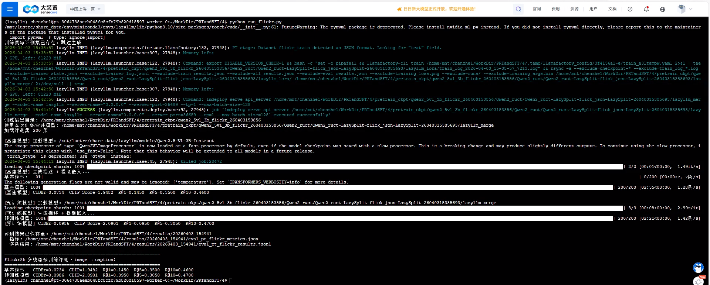

评测结果（Flickr8k 评测集 200 条）：

| 模型 | CIDEr 风格分数 | 图文相似度代理 | R@1 | R@5 | R@10 |
|------|-------|------------|-----|-----|------|
| 基座模型 | 0.0734 | 1.9482 | 0.145 | 0.350 | 0.460 |
| 预训练模型 | 0.0986 | 2.0901 | 0.095 | 0.305 | 0.470 |

结果解读：

- 预训练后 **CIDEr 风格分数** 与 **图文相似度代理分数** 均上升，分别约从 `0.0734→0.0986`、`1.9482→2.0901`，更直接反映「生成描述与参考文案的 n-gram 重合」以及「图文在当前模型语义空间中的一致性代理」在改善。
- **Recall@K 代理指标** 并非单调变好：`R@1`、`R@5` 相对基座略降（`0.145→0.095`、`0.350→0.305`），`R@10` 略升（`0.460→0.470`）。这在 PT 后并不罕见：全参或强适配会改变视觉—文本嵌入几何，top-1/top-5 检索排序对分布偏移更敏感；200 条规模下也存在一定方差。由于这里使用的是基于生成文本的检索代理而非标准检索协议，后续更适合结合独立验证集重新确认。
