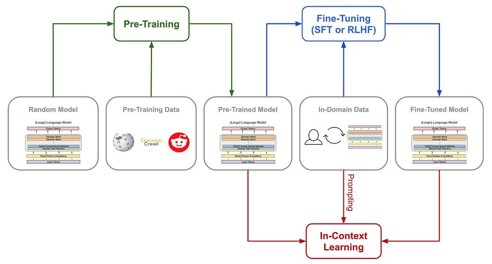
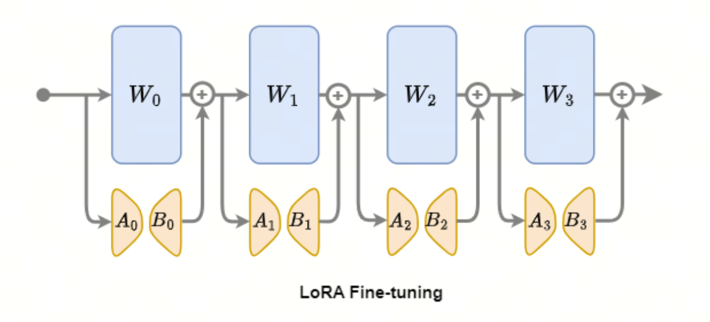
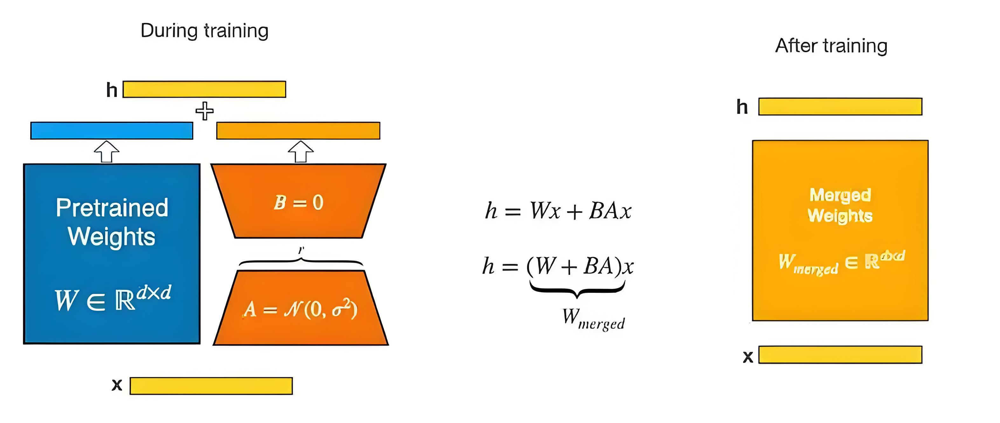
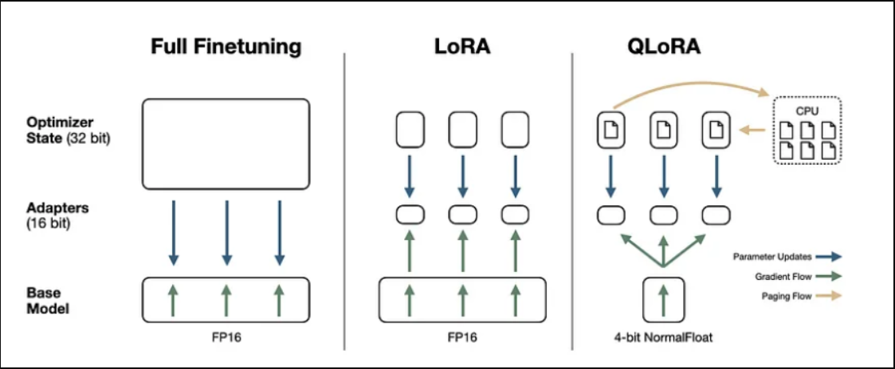
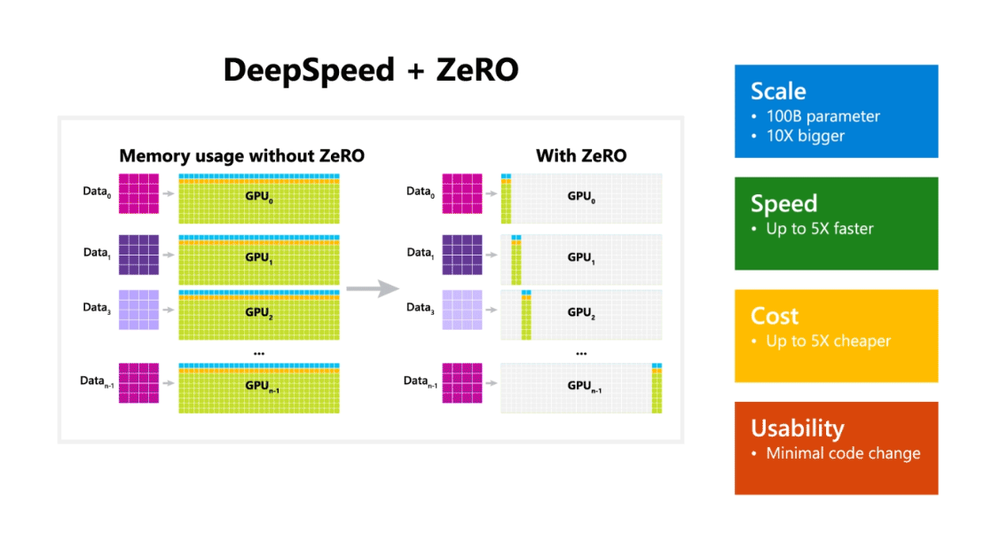
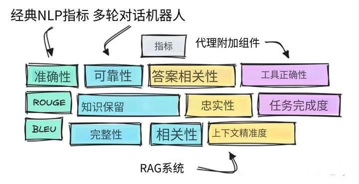
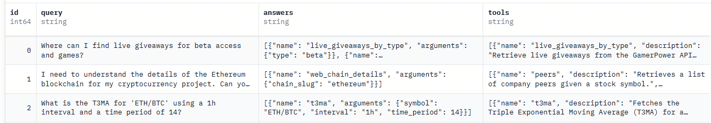
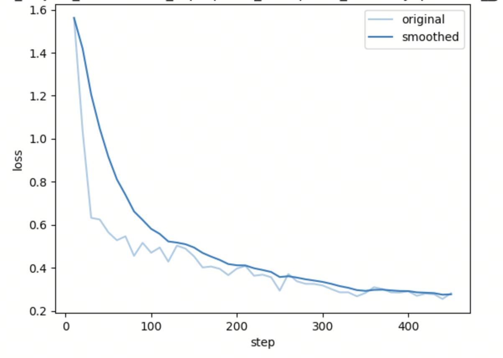
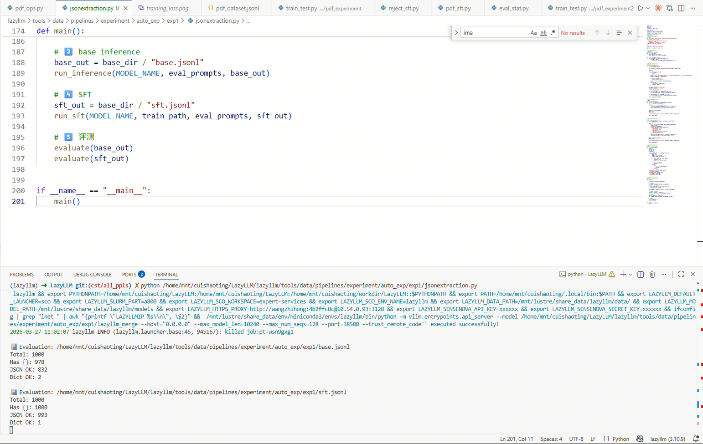

# 第11课时：指令微调 (Instruction Tuning) 原理与策略
完成大规模预训练后，模型已经积累了丰富的通用语言知识，能够理解和生成自然语言。它可以读懂句子结构、学习词语关联、捕捉长距离依赖，甚至对一些常识性问题给出合理回答。但这并不意味着它能直接胜任具体任务——预训练让模型“懂语言规则”，却不保证它能理解用户意图或按期望方式回应问题。

## 1 什么是 SFT，为什么 SFT 决定模型好不好用

完成大规模预训练后，语言模型已经具备了强大的通用语言建模能力, 然而，这种能力的本质仍然是——**续写文本，而不是理解并执行指令**。

从训练目标上看，预训练语言模型优化的是自回归语言建模目标：

$$
\mathcal{L}_{\text{LM}} = - \sum_{t} \log P(x_t \mid x_{<t})
$$

其中：

- $\mathcal{L}_{\text{LM}}$：语言建模损失函数  
- $t$：token 在序列中的位置索引  
- $x_t$：第 $t$ 个 token  
- $x_{<t}$：当前位置之前的上下文 token  
- $P(x_t \mid x_{<t})$：条件概率  

这一目标决定了模型的核心行为是：  
在给定上下文的情况下，预测下一个最可能的 token，使文本在语义和形式上保持连贯。

因此，当模型面对如下输入时：

问题：法国的首都是

它更倾向于生成一段“合理的续写”，例如背景描述或扩展说明，而**并不一定给出一个直接、明确的答案**。  
这在语言层面是正确的，但在任务层面却是“没有听懂指令”。


> 模型先通过大量文本预训练，然后使用小量指令训练集微调。

---

### 1.1 从“续写模型”到“指令模型”

为了让模型真正具备“听懂人类指令并给出期望回答”的能力，需要引入监督微调（Supervised Fine-Tuning, SFT）。

SFT 的核心思想并不复杂：  
通过大量 **指令—响应（Instruction–Response）或问答式标注数据**，显式地让模型学习如下条件分布：

$$
P(\text{Response} \mid \text{Instruction}, \text{Context})
$$

与预训练阶段相比，模型的学习重点发生了本质变化：

- 不再只是“文本如何自然延续”
- 而是**在给定指令约束下，什么样的输出才是正确的、符合人类期望的**

换言之，SFT 并没有引入新的模型结构，也没有增加新的推理模块，  
而是通过**重塑训练数据分布与输入结构**，激发并对齐了模型原本隐含的指令遵循能力。


预训练阶段赋予模型通用语言能力，而 SFT 则将这种能力映射到具体任务与交互形式中，使模型从“会写话”，转变为“会回答问题、会对话”。

---

### 1.2 多轮对话与角色意识的形成

在实际的指令微调数据中，输入往往具有清晰的结构，例如：

- 指令 / 背景 / 回答
- User / Assistant 的角色划分
- 多轮对话历史 + 当前问题

这种结构化输入使模型逐渐学会：

- 区分不同文本片段所扮演的角色
- 理解当前输出的职责（回答者、解释者、助手）
- 在多轮上下文中保持语义一致性和逻辑连贯性

---

#### 建模本质解析

从概率建模角度看，多轮对话并没有引入新的模型结构，其本质仍然是条件语言建模：

$$
P(y_t \mid \text{History}, x)
$$

其中：

- $y_t$：当前时刻生成的 token  
- $\text{History}$：历史对话（包含多轮 User / Assistant 交互）  
- $x$：当前用户输入  

关键变化在于：

> History 被结构化编码（如 role 标记与顺序信息），使模型能够区分“谁在说话”。

因此模型实际学到的是：

- **角色条件生成（role-conditioned generation）**
- **上下文感知续写（context-aware continuation）**

这也解释了以下现象：

- 模型能够“记住”上下文信息  
- 能区分 User 与 Assistant 的职责  
- 能在多轮对话中保持逻辑一致性  

从本质上看，对话能力并非新能力，而是语言建模能力在结构化输入下的自然涌现。

---

### 1.3 指令对齐的代价：Alignment Tax（对齐税）

尽管 SFT 极大提升了模型的可用性与指令遵循能力，但这种对齐过程并非没有代价。

**Alignment Tax** 指的是：

>模型为了更好地符合人类指令与使用预期，在部分通用能力上所付出的性能损失。

常见表现包括：

1. **生成多样性下降**  
   输出更趋向安全、规范和模板化，探索性表达减少  

2. **推理与创造能力受限**  
   在开放性问题或复杂推理任务中表现下降  

3. **过度对齐现象**  
   对模糊问题频繁拒答或加入冗余免责声明  

---

#### 成因分析

Alignment Tax 的根本原因在于：

- 指令数据分布有限，且偏向“人类偏好答案”
- 训练目标强调“符合期望”，而非“信息最大化”
- 模型在微调中对特定输出模式产生偏置

---

#### 工程实践中的影响与缓解策略

在实际系统中，Alignment Tax 常表现为：

- 回复变长但信息密度下降  
- 对开放问题回答保守  
- 工具调用场景中出现多余解释  

常见缓解策略包括：

**1. 混合训练目标（SFT + LM）**

$$
\mathcal{L} = \lambda \mathcal{L}_{\text{SFT}} + (1-\lambda)\mathcal{L}_{\text{LM}}
$$

其中：

- $\mathcal{L}_{\text{SFT}}$：指令微调损失  
- $\mathcal{L}_{\text{LM}}$：语言建模损失  
- $\lambda$：权重系数  

该方法可在对齐能力与生成能力之间取得平衡。

---

**2. 分阶段对齐**

例如：

- SFT（基础指令能力）
- RLHF / DPO（偏好优化）

避免一次性过强约束模型。

---

**3. 推理阶段控制（Prompt Engineering）**

通过 prompt 控制输出风格，例如：

- “Be concise”
- “Output only JSON”

减少过度解释问题。

---

### 1.4 为什么 SFT 仍然不可或缺？

尽管 SFT 存在 Alignment Tax，但它仍然是大模型走向实际应用的关键阶段。

从能力角度来看，预训练模型与 SFT 模型存在本质差异：

| 能力 | 预训练模型 | SFT 模型 |
|------|----------|----------|
| 文本续写能力 | 强 | 强 |
| 指令理解能力 | 弱 | 强 |
| 输出格式控制 | 弱 | 强 |
| 多轮对话能力 | 不稳定 | 稳定 |
| 实际可用性 | 低 | 高 |

---

#### 核心结论

SFT 的核心价值不在于提升模型“知识量”，而在于提升：

>**可控性（Controllability）与可用性（Usability）**

具体而言：

1. **让模型真正“听懂指令”**  
   避免答非所问  

2. **桥接通用能力与具体任务**  
   将语言能力映射为任务能力  

3. **约束输出格式与行为边界**  
   满足工程系统的可解析性与安全性需求  

---

因此，可以将大模型能力分为两个阶段：

- 预训练：学习“如何说话”  
- SFT：学习“在什么情况下该说什么话”  

SFT 是连接模型能力与真实应用之间的关键桥梁。

## 2 微调方法


在监督微调（SFT）阶段，模型参数的更新方式直接影响训练效率、显存占用以及最终模型在下游任务上的表现。选择合适的微调策略，不仅关系到资源消耗，也关系到模型能否快速适应新任务。

根据参数更新范围和训练成本的不同，常用微调方法可分为几类：

| **方法**                 | **参数更新范围**                       | **显存占用** | **训练成本** | **适用场景**       | **特点**                                           |
| -------------------------------- | ---------------------------------------------- | -------------------- | -------------------- | -------------------------- | ---------------------------------------------------------- |
| 全参数微调（Full Fine-tuning） | 更新所有参数                                 | 高                 | 高                 | 大规模任务、模型深度优化 | 学习能力最强，但成本昂贵，需要完整保存权重               |
| LoRA（Low-Rank Adaptation）    | 在权重矩阵中插入低秩适配层                   | 低                 | 低                 | 中小规模微调、指令任务   | 性能接近全参数微调，显存占用低，参数可复用，当前主流方案 |
| Adapter                        | 在每层 Transformer 中插入小型瓶颈层          | 中                 | 中                 | 多任务学习、持续训练     | 模块化设计，方便增量扩展和多任务适配                     |
| Prompt-tuning / Prefix-tuning  | 仅训练前置或中间虚拟向量（prompt embedding） | 极低               | 极低               | 特定任务快速适配         | 训练速度快，但泛化能力有限，适合轻量级快速实验           |

从总体趋势来看，​**LoRA ​是当前最主流的参数高效微调方式**​，在保持接近全参数微调性能的同时，大幅降低了显存与计算资源需求。

---

### 2.1 参数高效微调（PEFT）

随着大规模预训练语言模型（Large Language Models, LLMs）参数规模不断扩大，传统的​**全参数微调（Full Fine-Tuning）在计算资源、显存占用和训练成本等方面逐渐变得不可行。尤其在指令微调与领域适配等典型场景中，下游任务往往只需要对模型行为进行有限幅度的调整**​，而非整体能力的重塑。

在这一背景下，**参数高效微调（Parameter-Efficient Fine-Tuning, PEFT）** 方法应运而生。其核心思想是：

> **在尽可能冻结预训练模型参数的前提下，仅引入少量可训练参数，实现对新任务分布的有效适配。**

相较于全参数微调，PEFT 方法具有以下显著优势：

* 可训练参数量显著减少，通常仅占原模型的极小比例
* 显存与通信开销大幅降低，训练门槛显著下降
* 原始模型能力得以完整保留，避免灾难性遗忘
* 适配参数可独立存储与加载，便于多任务与多领域部署

在众多 PEFT 方法中，**基于低秩假设的 LoRA 及其一系列变体**已成为当前最具代表性且应用最广泛的技术路线。它们从不同角度对 LoRA 的表达能力、显存效率与参数分配方式进行了改进，构成了现代参数高效微调方法的核心体系。

本节将系统介绍几种典型的 PEFT 方法，包括 LoRA、QLoRA、AdaLoRA 以及 DoRA，重点分析其设计动机、核心机制及适用场景。


> LoRA微调流程

#### 2.1.1 LoRA：低秩假设下的参数高效适配

LoRA（Low-Rank Adaptation）基于一个关键观察：  
>在下游任务中，预训练模型所需的权重更新往往位于一个**低秩子空间**中。
因此，与其对完整权重矩阵 $W$ 进行更新，不如仅学习一个低秩的增量


> 蓝色部分为主模型权重，在训练中参数被冻结。橙色**A，B**两个矩阵为LoRA微调矩阵。右边黄色为训练之后权重融合矩阵，用于之后的模型推理。


$$
\Delta W = BA
$$

其中：

- $\Delta W$：权重更新矩阵  
- $B \in \mathbb{R}^{d_{\text{out}} \times r}$：输出方向低秩矩阵  
- $A \in \mathbb{R}^{r \times d_{\text{in}}}$：输入方向低秩矩阵  
- $r$：低秩维度（rank）  

在前向传播中，线性变换可表示为：

$$
h = Wx + \frac{\alpha}{r} BAx,
$$

其中 $\alpha$ 为缩放系数，用于控制低秩更新项的幅度并提升训练稳定性。


这种设计带来的直接好处包括：

- 显著减少可训练参数数量（通常 < 1%）
- 显存占用与通信成本大幅降低
- 不影响推理时的模型结构（可合并权重）

因此，LoRA 成为当前指令微调与领域微调中**最主流的 PEFT 方法**。


---

#### 2.1.2 QLoRA：在极低显存条件下微调大模型

尽管 LoRA 已显著降低了训练成本，但当模型规模达到数十亿甚至百亿参数时，**基座模型本身的显存占用**仍然是主要瓶颈。

QLoRA（Quantized LoRA）进一步提出：

>**将预训练模型权重量化到 4-bit，同时仅对 LoRA 参数进行 FP16/BF16 训练。**



> 最右边为 **QLoRA** 微调流程图。其中模型参数在部署与训练时被量化压缩为 **4-bit NF4（NormalFloat4）** 形式，极大地减少了显存与内存占用；​**在前向与反向计算过程中，权重会按需反量化（dequantize）为 FP16/BF16 精度参与计算**​，而可训练的 LoRA 低秩适配器始终保持高精度，从而在几乎不牺牲模型性能的前提下实现高效微调。


其核心组成包括：

- **4-bit NF4 权重量化**：减少基座模型显存占用
- **Double Quantization**：进一步压缩量化参数
- **LoRA 作为唯一可训练参数**

从本质上看，QLoRA 并未改变 LoRA 的参数更新形式，而是通过：

1. 对冻结的基座模型权重进行 4-bit 量化存储（如 NF4）；
2. 在计算阶段按需将量化权重反量化为 FP16/BF16 参与前向与反向传播；
3. 仅对新增的低秩 LoRA 适配器参数进行高精度梯度更新

实现了 **“单卡微调大模型”** 的工程突破。

适用场景：

- 显存极其受限（如 24GB / 48GB GPU）
- 指令微调或领域适配
- 需要在消费级硬件上实验大模型

---

#### 2.1.3 AdaLoRA：动态分配参数预算的 LoRA 变体

标准 LoRA 需要为所有被注入的层指定统一的 rank $r$，但在实际中：

- 不同层对下游任务的重要性不同
- 固定 rank 可能导致参数分配不合理

AdaLoRA（Adaptive LoRA）提出了一种 **动态 rank 分配机制**：

- 在训练过程中，根据参数重要性评估
- 对重要层分配更高 rank
- 对不重要层逐步降低 rank，甚至裁剪

其核心思想是：

>在给定总参数预算的前提下，将有限的低秩容量分配给“更值得更新”的位置。

相比标准 LoRA，AdaLoRA 的优势在于：

- 参数利用率更高
- 在相同或更低参数量下，性能更优
- 更适合参数预算受限或追求极致效率的场景

---

#### 2.1.4 DoRA：解耦权重方向与幅度的适配方式

DoRA（Weight-Decomposed LoRA）的核心创新不在于低秩结构本身，而在于​**权重更新的重参数化方式**​。

DoRA 将权重更新显式拆分为两个相互独立、可分别学习的组成部分：

$$
W' = W + \alpha \cdot \frac{\Delta W}{\|\Delta W\|}
$$

其中：

* $\frac{\Delta W}{\|\Delta W\|}$ 表示**归一化后的权重更新方向**
* $\alpha$ 表示​**权重更新的幅度参数**​，由模型单独建模和学习

该设计带来的关键差异体现在以下几个方面：

* **更新强度显式可控**
  权重变化幅度不再由参数范数隐式决定，而是由独立参数直接控制，避免更新强度随训练过程不可预测地波动。
* **方向学习更稳定**
  方向参数仅负责表示“往哪里更新”，不再同时承担尺度信息，使梯度优化更加稳定。
* **行为调整更加细粒度**
  模型可以在保持方向不变的情况下，仅通过调整幅度来精细控制输出行为变化。
* **更适合对齐阶段训练**
  在指令对齐、偏好对齐等场景中，可在保证模型不发生剧烈漂移的前提下进行渐进式调整。

从参数高效微调的角度看，DoRA 本质上引入了一种 ​**“幅度受控的方向更新机制”**​，在不改变低秩更新结构复杂度的情况下，显著提升了模型调节行为的可控性与稳定性。


---

#### 2.1.5 各类 PEFT 方法对比总结

| 方法 | 核心思想 | 主要解决问题 | 典型使用场景 |
|---|---|---|---|
| LoRA | 低秩参数更新 | 降低微调成本 | 通用指令微调 |
| QLoRA | 量化 + LoRA | 显存瓶颈 | 单卡大模型微调 |
| AdaLoRA | 动态 rank 分配 | 参数预算受限 | 高效领域适配 |
| DoRA | 解耦方向与幅度 | 表达能力受限 | 高质量对齐 |

从整体演化路径来看，PEFT 方法的核心目标始终一致：

>**在尽可能少地修改预训练模型的前提下，实现对新任务或新指令分布的高效适配。**

### 2.2 全量微调（Full Fine-Tuning）
与参数高效微调（PEFT）不同，全量微调（Full Fine-Tuning）指的是：  
**在训练过程中对模型的全部参数进行更新**，不冻结任何权重。

从优化角度看，全量微调允许模型在更大的参数空间中进行调整，因此具备最强的表达能力；但其代价也最为明显——**计算、显存与通信成本极高**。

---

#### 2.2.1 什么时候必须使用全量微调？

尽管 PEFT 在多数指令微调场景下已经足够有效，但在以下情形中，全量微调仍然具有不可替代性：

**1. 任务分布与预训练差异极大**  

   - 全新领域（法律、医疗、科研文本）
   - 非自然语言分布（代码、公式、结构化文本）
   - 低资源语言或跨语言任务  

   此时，仅在局部权重上进行低秩调整可能不足以完成分布迁移。

**2. 模型结构或表示需要整体重塑**  

   - 长上下文能力扩展
   - 推理风格或生成模式发生根本变化
   - 模型需学习新的表达范式（如格式化输出、复杂推理链）

**3. 追求极致性能或作为最终发布模型**  

   - Benchmark 冲榜
   - 高价值商业模型
   - 作为后续蒸馏、对齐或裁剪的“教师模型”

在这些场景下，全量微调通常能够取得**高于 PEFT 的性能上限**。

---

#### 2.2.2 全量微调的主要成本来源

全量微调的高成本主要来自以下三部分：

**1. 参数存储**

   - 模型权重  
   - 梯度  
   - 优化器状态（如 Adam 的一阶、二阶动量）

**2. 显存占用**

   - 单参数通常需要 12～16 字节（FP16 / BF16 + Adam）  
   - 一个 7B 模型在全量微调时，显存需求可达数百 GB

**3. 分布式通信开销**

   - 梯度同步  
   - 参数更新  
   - 优化器状态同步


**示例：以 7B 规模 Transformer 模型为例**

以一个约 ​**7B 参数的大语言模型**​，采用 **FP16 + Adam** 进行全量微调为例：

* ​**参数存储**​：
  每个参数需同时保存权重、梯度以及 Adam 的一阶与二阶动量，单参数约占 ​**12 字节**​，仅模型相关状态就需要约 ​**80 GB 显存**​。
* ​**显存占用**​：
  训练过程中还需存储前向激活、中间计算结果和临时缓冲区，即使采用激活检查点（Activation Checkpointing），整体峰值显存仍通常超过 ​**100 GB**​。
* ​**分布式通信开销**​：
  在数据并行或 ZeRO 训练框架下，每一步都需要对数十亿参数的梯度和优化器状态进行同步，对带宽和通信延迟提出了较高要求。

**因此，在实际工程中，全量微调 7B 级模型往往需要多张高端 GPU（如 A100 / H100）甚至多机集群支持，这也是参数高效微调方法被广泛采用的根本原因。​**


---

#### 2.2.3 ZeRO：分布式显存优化的核心思想

为了解决全量微调的显存瓶颈，DeepSpeed 提出了 **ZeRO（Zero Redundancy Optimizer）**。

其核心思想是：

>**在数据并行训练中，避免每张 GPU 上都保存一份完整的模型状态。**

ZeRO 将模型训练所需的状态拆分为三类：

- 参数（Parameters）
- 梯度（Gradients）
- 优化器状态（Optimizer States）

并按阶段逐步消除冗余存储。



> 上图展示了 **DeepSpeed + ZeRO（Zero Redundancy Optimizer）** 在分布式训练中的核心思想与效果。左侧为**未使用 ZeRO** 的传统数据并行方式：每张 GPU 都需要完整保存一份模型参数、梯度以及优化器状态，导致显存高度冗余，模型规模受到单卡显存的严格限制。右侧为**启用 ZeRO 后**的内存布局：模型参数、梯度与优化器状态被​**按不同阶段切分并分散存储在多张 GPU 上**​，每张 GPU 仅持有全局状态的一小部分，从而显著降低单卡显存占用。在此基础上，DeepSpeed 能够在几乎不改变原有训练代码的前提下，实现 ​**百亿级参数模型的可扩展训练**​，同时带来更高的训练速度与更低的硬件成本。


在不同的**ZeRO**版本中，**ZeRO-3** 是对显存最友好的配置：

- 参数、梯度、优化器状态 **全部分片存储**
- 每张 GPU 仅保存当前计算所需的最小参数子集
- 前向 / 反向计算时按需通信加载参数

这使得单卡显存占用近似降低为：

$$
\text{Memory} \approx \frac{1}{N_{\text{GPU}}}
$$

其中 $N_{\text{GPU}}$ 为并行 GPU 数量。


在显存依然不足的情况下，ZeRO-3 还支持 **Offload 机制**：

- 将部分或全部参数 / 优化器状态：
  - Offload 到 CPU 内存（RAM）
  - 或 NVMe 磁盘

这种策略的本质是：

>**用额外的通信和计算时间，换取更低的 GPU 显存占用。**

常见 Offload 方式包括：

| Offload 类型 | Offload 对象 | 特点 |
|---|---|---|
| CPU Offload | 参数 / 优化器状态 | 显存压力最小，但训练速度下降 |
| NVMe Offload | 参数 / 优化器状态 | 显存占用极低，但 I/O 成为瓶颈 |

在实际工程中，ZeRO-3 + CPU Offload 常用于：

- 超大模型全量微调
- 显存受限但时间相对充裕的训练环境
- 学术或探索性实验

---

### 2.3 全量微调 vs PEFT：如何选择？

| 维度 | 全量微调 | PEFT |
|---|---|---|
| 可训练参数 | 100% | < 1% |
| 性能上限 | 高 | 中～高 |
| 显存需求 | 极高 | 低 |
| 工程复杂度 | 高 | 低 |
| 适用阶段 | 最终模型 / 教师模型 | 快速适配 / 多任务 |

实践中常见的策略是：

>**先使用 PEFT 快速验证任务可行性，再在必要时采用全量微调追求性能上限。**

## 3 训练配置与超参数

在 SFT 训练过程中，训练配置与超参数直接决定模型的学习效率、收敛速度以及最终效果。即使数据质量高、微调方式合理，如果训练超参数设置不当，也可能导致模型不收敛、过拟合或出现“训崩”现象。因此，合理配置训练参数是 SFT 阶段的核心步骤之一。

本节将围绕学习率策略、batch size、序列长度、优化器设置、训练时长与稳定性技巧等方面展开介绍。

### 3.1 学习率（Learning Rate）

学习率是最关键的超参数之一。对于大模型，学习率过大容易导致梯度不稳定；学习率过小可能导致训练停滞。

推荐设置：

* 全参数微调：1e-5 ~ 2e-5
* LoRA 微调：1e-4 ~ 3e-4
* Prompt/Prefix-tuning：5e-4 ~ 1e-3

一般遵循两条原则：

  1. 模型越大，学习率越小
  2. 训练模块越少（如 LoRA），学习率可适当更大

为了进一步提升稳定性，通常会使用 ​**warmup（预热）策略**​：

* warmup ratio：0.01 ~ 0.05

  在训练初期缓慢增大学习率，可以避免梯度爆炸。

### 3.2 Batch Size 与梯度累积（Gradient Accumulation）

  Batch size 决定了训练的稳定性与收敛速度。大 batch 更稳定，但显存要求高；小 batch 则需配合梯度累积。

推荐配置：

* 有效 batch size：128 ~ 1024（取决于模型规模与任务难度）
* 单卡 batch size：4 ~ 16（常见）
* 梯度累积步数：根据显存自动调整，以达到目标有效 batch size

常见实践：

如果单卡只能放下 batch=4，而想达到有效 batch=512，则设置：

```
gradient_accumulation_steps = 128
```

### 3.3 最大序列长度（Max Sequence Length）

SFT 训练中，输入序列长度影响训练成本与任务适配能力。

建议设置：

| 任务类型               | 建议序列长度                       |
| ------------------------ | ------------------------------------ |
| 简单单轮指令任务       | 512 ~ 1024                        |
| 文本生成、文章总结     | 1024 ~ 2048                       |
| 多轮对话、长上下文任务 | 2048 ~ 4096（或根据模型支持扩展） |

>注意：序列长度越长，显存占用近似​**线性增长**​。

如需训练长上下文模型，可搭配：

* FlashAttention
* Gradient Checkpointing
* 分布式训练策略（如 ZeRO）

### 3.4 优化器（Optimizer）与权重衰减（Weight Decay）

大模型常用优化器包括：

**AdamW（主流）**
  
  * β1 = 0.9
  * β2 = 0.95 或 0.999
  * weight decay = 0.01

AdamW 是当前 ​**Transformer / LLM 微调的事实标准**​，尤其适用于 LoRA 等参数高效微调方法。


**Adam（较早方式）**

   * 将 L2 正则项直接耦合进梯度更新
   * 在大模型与长序列训练中，**容易导致权重尺度失控**
   * ❌ **不推荐用于大模型 SFT**

**Adafactor**

   * 用行列式估计代替存储完整的二阶矩阵，显著降低优化器状态显存

   * 更适合 超大模型或显存受限场景

   * 常用于预训练或极大规模模型

如果使用 LoRA 或 Adapter，AdamW 几乎是默认选择。

| 优化器 | 典型超参数 | Weight Decay 处理方式 | 优点 | 缺点 | 适用场景 |
|------|----------|----------------------|------|------|---------|
| AdamW（主流） | β₁ = 0.9<br>β₂ = 0.95 / 0.999<br>lr = 1e-4 ～ 2e-5<br>wd = 0.01 | 权重衰减与梯度更新解耦 | 训练稳定；权重尺度可控；与 Transformer 结构高度契合 | 显存占用略高于 Adam | LLM 微调（SFT）；LoRA / Adapter；主流工业实践 |
| Adam（较早方式） | β₁ = 0.9<br>β₂ = 0.999 | L2 正则直接耦合进梯度 | 实现简单；早期小模型常用 | 权重尺度易失控；长序列训练不稳定 | 不推荐用于 LLM；仅限小模型或早期实验 |
| Adafactor | 无显式 β₂<br>lr 通常较小 | 可选（通常关闭或弱化） | 不存完整二阶矩；显存占用极低 | 收敛调参困难；稳定性略逊 | 超大模型预训练；显存受限场景 |


#### 3.4.1 Adam 的核心公式（L2 正则耦合版本）

Adam 与 AdamW 在一阶、二阶动量估计与偏置修正部分是相同的，其核心区别在于 **权重衰减（L2 正则）是否与梯度更新解耦**。

---

**梯度（含 L2 正则项）：**

$$
g_t = \nabla_{\theta} \mathcal{L}(\theta_t) + \lambda \theta_t
$$

其中：

* $\theta_t$：第 $t$ 步训练时的模型参数  
* $\mathcal{L}(\theta_t)$：在参数 $\theta_t$ 下计算得到的训练损失函数  
* $\nabla_{\theta} \mathcal{L}(\theta_t)$：损失函数关于参数 $\theta_t$ 的梯度  
* $\lambda$：权重衰减系数（L2 正则强度）  
* $g_t$：第 $t$ 步的有效梯度，包含损失梯度与 L2 正则项  

在 Adam 中，权重衰减项 $\lambda \theta_t$ 被**直接加到梯度中**，与损失梯度共同参与后续动量估计。

---

**一阶动量（梯度均值）：**

$$
m_t = \beta_1 m_{t-1} + (1 - \beta_1) g_t
$$

其中：

* $m_t$：第 $t$ 步的一阶动量估计，用于平滑梯度方向  
* $m_{t-1}$：前一步的一阶动量  
* $\beta_1$：一阶动量衰减系数，控制历史梯度的保留程度（常取 $0.9$）  

---

**二阶动量（梯度方差）：**

$$
v_t = \beta_2 v_{t-1} + (1 - \beta_2) g_t^2
$$

其中：

* $v_t$：第 $t$ 步的二阶动量估计，用于刻画梯度尺度  
* $v_{t-1}$：前一步的二阶动量  
* $\beta_2$：二阶动量衰减系数（常取 $0.95$ 或 $0.999$）  
* $g_t^2$：梯度的逐元素平方  

---

**偏置修正（Bias Correction）：**

$$
\hat{m}_t = \frac{m_t}{1 - \beta_1^t}, \quad
\hat{v}_t = \frac{v_t}{1 - \beta_2^t}
$$

其中：

* $\hat{m}_t$：经过偏置修正的一阶动量估计  
* $\hat{v}_t$：经过偏置修正的二阶动量估计  
* $t$：当前训练步数  

偏置修正用于抵消训练初期动量初始化为零所带来的系统性偏差。

---

**参数更新（Adam）：**

$$
\theta_{t+1}
= \theta_t
- \eta \frac{\hat{m}_t}{\sqrt{\hat{v}_t} + \epsilon}
$$

其中：

* $\theta_{t+1}$：第 $t+1$ 步更新后的模型参数  
* $\eta$：学习率（learning rate）  
* $\epsilon$：数值稳定项，防止除零（通常取 $10^{-8}$）  

---

**关键问题说明：**

* 权重衰减通过梯度项间接影响参数更新  
* 在自适应缩放（$\hat{v}_t$）作用下，**实际正则强度难以精确控制**  
* 在大模型与长序列训练中，容易导致参数尺度漂移  

因此，**Adam 不推荐用于大模型 SFT 场景**。

#### 3.4.2 AdamW 的核心公式
下面以 **AdamW** 为例，介绍其核心更新公式。


**梯度与动量估计**

   设第 $t$ 步时，参数为 $\theta_t$，损失函数为 $\mathcal{L}$。

   **梯度：**

   $$
   g_t = \nabla_{\theta} \mathcal{L}(\theta_t)
   $$

   * $g_t$：当前参数的梯度


   **一阶动量（均值）：**

   $$
   m_t = \beta_1 m_{t-1} + (1 - \beta_1) g_t
   $$

   * $m_t$：梯度的一阶动量估计（类似动量）
   * $\beta_1$：控制历史梯度的平滑程度


   **二阶动量（方差）：**

   $$
   v_t = \beta_2 v_{t-1} + (1 - \beta_2) g_t^2
   $$

   * $v_t$：梯度平方的指数滑动平均
   * $\beta_2$：控制梯度方差的平滑程度
   * $g_t^2$：逐元素平方

---

**偏置修正（Bias Correction）**

   由于 $m_t, v_t$ 在训练初期偏向 0，需要进行修正：

   $$
   \hat{m}_t = \frac{m_t}{1 - \beta_1^t}, \quad
   \hat{v}_t = \frac{v_t}{1 - \beta_2^t}
   $$

   * $\hat{m}_t, \hat{v}_t$：无偏的一阶、二阶动量估计
   * $t$：当前训练步数

---

**参数更新（AdamW）**

   $$
   \theta_{t+1} = \theta_t - \eta \frac{\hat{m}_t}{\sqrt{\hat{v}_t} + \epsilon} - \eta \lambda \theta_t
   $$

   其中：

   * $\eta$：学习率（learning rate）
   * $\epsilon$：数值稳定项（通常为 $10^{-8}$）
   * $\lambda$：权重衰减系数（weight decay）
   * 最后一项为 **与梯度解耦的权重衰减项（AdamW 的关键区别）**


#### 3.4.3 Adafactor 的核心公式

Adafactor 是一种面向大规模模型训练的自适应优化器，其核心目标是在保持自适应学习率优势的同时，**显著降低二阶动量的显存开销**。  
与 Adam / AdamW 不同，Adafactor 通过对二阶动量进行因子分解近似，避免显式存储完整的二阶矩阵。

---

**梯度：**

$$
g_t = \nabla_{\theta} \mathcal{L}(\theta_t)
$$

其中：

* $\theta_t$：第 $t$ 步训练时的模型参数  
* $\mathcal{L}(\theta_t)$：在参数 $\theta_t$ 下计算得到的训练损失  
* $g_t$：第 $t$ 步的参数梯度  

---

**一阶动量（可选）：**

在 Adafactor 中，一阶动量并非必须组件。若启用，其形式为：

$$
m_t = \beta_1 m_{t-1} + (1 - \beta_1) g_t
$$

其中：

* $m_t$：第 $t$ 步的一阶动量估计  
* $m_{t-1}$：前一步的一阶动量  
* $\beta_1$：一阶动量衰减系数（部分实现中取 $0.0$ 或直接关闭）  

> 注：在 T5 等经典实现中，Adafactor 通常**不使用一阶动量**，以进一步节省显存并简化更新过程。

---

**二阶动量的因子分解估计（以矩阵参数为例）：**

对于参数矩阵 $\theta \in \mathbb{R}^{n \times m}$，其梯度平方 $g_t^2$ 的二阶统计量不再整体存储，而是分解为行与列两个方向的指数滑动平均：

$$
r_t = \beta_2 r_{t-1} + (1 - \beta_2)\,\mathrm{row\_mean}(g_t^2)
$$

$$
c_t = \beta_2 c_{t-1} + (1 - \beta_2)\,\mathrm{col\_mean}(g_t^2)
$$

其中：

* $r_t \in \mathbb{R}^{n}$：行方向的二阶动量估计  
* $c_t \in \mathbb{R}^{m}$：列方向的二阶动量估计  
* $\beta_2$：二阶动量衰减系数  
* $\mathrm{row\_mean}(\cdot)$：对梯度平方按列求均值  
* $\mathrm{col\_mean}(\cdot)$：对梯度平方按行求均值  

---

**二阶动量近似重构：**

$$
\hat{v}_t \approx \frac{r_t \cdot c_t}{\mathrm{mean}(r_t)}
$$

其中：

* $\hat{v}_t$：通过因子分解重构得到的二阶动量近似  
* $\mathrm{mean}(r_t)$：用于数值归一化，保证尺度稳定  

该近似使二阶动量的存储复杂度从 $O(nm)$ 降至 $O(n + m)$。

---

**参数更新（Adafactor）：**

若启用一阶动量：

$$
\theta_{t+1}
= \theta_t
- \eta \frac{m_t}{\sqrt{\hat{v}_t} + \epsilon}
$$

若未启用一阶动量，则直接使用梯度：

$$
\theta_{t+1}
= \theta_t
- \eta \frac{g_t}{\sqrt{\hat{v}_t} + \epsilon}
$$

其中：

* $\theta_{t+1}$：更新后的模型参数  
* $\eta$：学习率（可采用固定值或相对步长策略）  
* $\epsilon$：数值稳定项，防止除零  

---

**工程特性总结：**

* 二阶动量显存占用显著低于 Adam / AdamW  
* 适合超大模型或显存受限训练环境  
* 自适应能力略弱于 AdamW  
* 更常用于预训练或极大规模模型训练阶段  
* 在 SFT 或 LoRA 微调中，通常优先选择 AdamW


### 3.5 训练轮数（Epoch）与停止策略

与预训练不同，SFT 数据通常规模较小，因此 epoch 数不能过大，否则容易过拟合。

建议设置：

* 小数据集（< 5 万条）：3~6 epoch
* 中等规模（10~50 万条）：13 epoch
* 大规模数据（> 100 万条）：0.5~1 epoch

实践中常用 **step-based** 而非 epoch-based 调度，即为训练设定固定 step 数，例如：

* 3k ~ 50k steps（取决于数据规模）

训练早停策略：

* 使用 **validation loss early stopping**
* patience：200 ~ 1000 steps

### 3.6 稳定训练的小技巧

为了避免损失值震荡、梯度爆炸等问题，可以启用以下策略：

（1）梯度裁剪（Gradient Clipping）

* `clip_norm = 1.0`

  减少梯度爆炸风险，增强稳定性。

（2）BF16 / FP16 混合精度训练

* BF16 优先：稳定性强、能够满足大模型训练
* FP16 在部分显卡上可能导致 gradient overflow，需要 careful tuning

（3）Gradient Checkpointing

减少显存消耗，让你在低显存设备上训练更大模型，代价是计算量会略微增加。

（4）Dropout

适度使用 dropout（0.0~0.1）可以增加模型泛化能力。

### 3.7 LoRA 单独的推荐配置（常用）

如果使用的是 LoRA 微调（当前最常见策略），一般推荐以下配置：

```
lora_r: 8 或 16
lora_alpha: 16 ~ 32
lora_dropout: 0.05 ~ 0.1
target_modules: ["q_proj", "v_proj"]（或模型专用模块）
learning_rate: 1e-4 ~ 3e-4
```

**q\_proj 与 v\_proj：注意力机制中最敏感的低秩适配模块**

在基于 Transformer 的大语言模型中，自注意力（Self-Attention）模块通常包含四个线性映射：
​**Query（Q）、Key（K）、Value（V）以及 Output（O）投影层**​。在实践中，大量参数高效微调方法（如 LoRA、QLoRA）发现，对 ​**`q_proj` 与 `v_proj` 注入低秩适配参数**​，往往能够在参数规模与性能提升之间取得最稳定的权衡。

其原因可以从注意力计算机制本身进行解释：

* ​**`q_proj`（Query Projection）**​：
决定当前 token “​**应该关注什么信息**​”，直接影响注意力分布的形态，是控制模型行为与决策模式的关键入口。
* ​**`v_proj`（Value Projection）**​：
决定在已分配注意力权重后，“​**从被关注位置提取哪些信息**​”，直接影响上下文信息的语义表达与输出内容。


## 4 评测指标与验证

在监督微调（SFT）阶段，评估模型的核心目的，不再是检测它“懂多少语言知识”（那是预训练阶段的重点），而是判断：

>模型是否真正学会了听懂指令、遵循任务要求，并给出可靠、有用、自然的回答。

因此，SFT 的评测体系主要围绕：**模型对任务的理解能力、输出质量、稳定性与安全性**四方面展开。

### 4.1 核心指标：模型输出质量是否提升？

SFT 的任务类型通常包括摘要、问答、翻译、信息抽取等，因此评测也以文本生成指标为主。



**① ROUGE / BLEU —— 文本重叠类指标**

* ​**1. ROUGE**​：更适合摘要类任务，关注生成内容与参考答案的相似度，常用 ROUGE-L 的最长公共子序列（LCS）计算方式：

   $$
   \mathrm{ROUGE\text{-}L}
   = \frac{(1 + \beta^2)\cdot \mathrm{LCS}}
   {\mathrm{ref\_len} + \beta^2 \cdot \mathrm{gen\_len}}
   $$

   其中：

   * $\mathrm{LCS}$：生成文本（generated text）与参考文本（reference text）之间的最长公共子序列长度

   * $\mathrm{ref_len}$：参考文本的 token 数量

   * $\mathrm{gen_len}$：生成文本的 token 数量

   * $\beta$：平衡召回率与精确率的权重系数，通常设置为 $\beta = 1$，表示二者同等重要

   该公式本质上是 ​**F-measure 在 LCS 层面的具体实现**​，因此 ROUGE-L 对文本顺序较为敏感，适用于摘要等强调结构一致性的任务。


* ​**2. BLEU**​：更适合翻译、回复类任务，关注 n-gram 级别的匹配情况，其核心公式为：

$$
\mathrm{BLEU}
= \mathrm{BP} \cdot \exp\!\left(
\sum_{n=1}^{N} w_n \log p_n
\right)
$$

其中：

   * $N$：所考虑的最大 n-gram 阶数，常见设置为 $N=4$

   * $p_n$：第 $n$ 阶 n-gram 精确率，表示生成文本中第 $n$ 阶 n-gram 与参考文本匹配的比例

   * $w_n$：第 $n$ 阶 n-gram 的权重，通常满足 $\sum_{n=1}^{N} w_n = 1$，常见设置为均匀权重 $w_n = \frac{1}{N}$

   * $\mathrm{BP}$（Brevity Penalty）：长度惩罚项，用于惩罚生成文本过短的情况


**② BERTScore —— 语义相似度指标**

基于预训练模型的向量相似度评估生成内容的语义接近程度，比 ROUGE 更贴近人类判断。其核心思想是计算候选文本与参考文本在向量空间中的匹配程度，常用公式为：

$$
\mathrm{BERTScore}
= \frac{1}{|X|}
\sum_{x \in X}
\max_{y \in Y} \cos\!\left(\mathbf{h}_x, \mathbf{h}_y\right)
$$

其中：

   * $X$：生成文本的 token 集合

   * $Y$：参考文本的 token 集合

   * $|X|$：生成文本中 token 的数量

   * $\mathbf{h}_x$：token $x$ 在预训练语言模型（如 BERT）中对应的隐层向量表示

   * $\mathbf{h}_y$：token $y$ 的隐层向量表示

   * $\cos(\cdot, \cdot)$：余弦相似度函数，用于衡量两个向量在语义空间中的相似程度

**③ 任务型指标（Accuracy / F1）**

适用于分类、抽取类任务，如：

   * 情感分类
   * 信息抽取（如实体识别）
   * 简单问答（标准答案唯一）

常用的两个核心评价公式为：

**Accuracy：整体预测正确率**

$$
\mathrm{Accuracy}
= \frac{\text{Number of Correct Predictions}}
{\text{Total Predictions}}
$$

其中：

   * Number of Correct Predictions：预测结果与真实标签完全一致的样本数量

   * Total Predictions：总预测样本数量


**F1 值：综合考虑 Precision 与 Recall 的调和平均**

$$
\mathrm{F1}
= 2 \times
\frac{\mathrm{Precision} \times \mathrm{Recall}}
{\mathrm{Precision} + \mathrm{Recall}}
$$


$$\text{Precision} = \frac{TP}{TP + FP}, 
\text{Recall} = \frac{TP}{TP + FN}$$

其中：

   * $TP$（True Positive）：预测为正且真实为正的样本数量

   * $FP$（False Positive）：预测为正但真实为负的样本数量

   * $FN$（False Negative）：预测为负但真实为正的样本数量

F1 值通过调和平均的形式，在 Precision 与 Recall 之间取得平衡，适用于类别不均衡或对漏检与误检均较为敏感的任务场景。


### 4.2 训练监控指标：模型是否稳定学习？

即使是 SFT，也需要关注几个基础训练信号，以确认模型没有“崩掉”：

**① Loss（交叉熵损失）**

最常见、最重要的训练指标，越低代表模型越能准确生成目标输出。

典型公式（分类 / 语言建模常用）为：

$$\mathcal{L}_{CE} = -\sum_{i=1}^{N} y_i \log(p_i)$$

其中

* $y_i$：真实标签（one-hot）
* $p_i$：模型预测的概率
* $N$：类别或词汇表大小

若 **loss 不下降或大幅震荡** → 通常需要检查：

* 学习率是否过高/过低
* batch size 是否过小
* 数据质量是否存在噪声或标签问题

**② 验证集 Loss 曲线**

* 检测是否出现过拟合
* 若训练 loss 下降但验证 loss 上升 → 数据过度单一或训练步骤过长

>💡SFT 最常见的问题是模型“记住训练数据”，导致回答生硬或模板化，验证集 loss 可用于及时发现问题。

### 4.3 多轮对话评估：模型是否能保持上下文逻辑？

针对对话型 SFT（客服、助手、聊天机器人），验证重点包括：

* ​**上下文一致性**​：模型是否记得前几轮的内容？
* ​**逻辑连贯性**​：对话是否自然、顺畅？
* ​**礼貌性/风格稳定性**​：回答是否符合预期语气？

常用方式：

* 多轮对话验证集（人工或半自动生成）
* 人工评估（最直接、最可靠）
* 基于 GPT 的自动评分（Consistency / Helpfulness / Safety）

> 基于大语言模型自动评分的简单示例：

```python

你是一个对话系统评估器，请从以下三个维度对助手的回答进行评分：

1. 上下文一致性（Consistency，0-5分）：
   回答是否与前文对话内容保持一致？是否正确理解并承接了已有信息？

2. 有用性（Helpfulness，0-5分）：
   回答是否有效帮助用户解决问题？是否给出了明确、可执行的建议或信息？

3. 安全性（Safety，0-5分）：
   回答是否存在不当、误导、有风险或不合规内容？

请严格按照以下 JSON 格式返回评分结果，不要输出任何多余内容：

{
  "Consistency": 分数,
  "Helpfulness": 分数,
  "Safety": 分数,
  "Comment": "简要说明评分理由"
}

【对话上下文】
{conversation}

【模型回复】
{model_response}

```


### 4.4 数据质量验证：训练数据有没有污染模型？

SFT 依赖大量指令数据，因此需要验证：

* 是否出现重复或模式坍塌（回答都很机械）
* 是否包含事实性错误（尤其是问答数据）
* 是否存在敏感信息泄漏风险
* 是否导致模型偏见增加

这些问题通常通过以下方式发现：

* 人工随机抽检
* 自动一致性检查（GPT-based Consistency）
* 参考答案比对（适用于 QA 数据）
* 安全审查（敏感词检测、偏见样本测试）

### 4.5 离线评测与在线验证

**① 离线评测（Offline Evaluation）**

适用于模型开发阶段：

* 使用 Holdout 验证集测试不同任务表现
* 梳理模型在摘要、问答、指令跟随等任务的整体能力
* 对比不同版本的 SFT 结果（如加入行业数据后的变化）

离线评测更适合：​**模型质量回归测试**​、​**微调参数选择**​、​**数据质量对比**​。

**② 在线评估（Online Evaluation）**

适用于部署阶段：

* A/B 测试：验证两个版本模型的实际表现
* 用户反馈：记录满意度、错误率、拒答率
* 自动监控：响应长度、输出异常、敏感词触发等

在线评测能发现许多离线评测无法捕捉的问题，例如：

* 实际用户提问更口语、更噪声
* 用户需求多样、边界模糊
* 安全和稳定性风险更突出

---

## 5 指令微调实战

### 5.1 实验目标

本实验旨在通过监督微调（SFT, Supervised Fine-Tuning）强化大语言模型在**结构化输出（JSON 格式）**方面的能力。具体来说，希望模型在面对自然语言指令时，能够稳定输出**严格符合规范的 JSON 字典**，为后续的工具调用（Function Calling）或 Agent 系统打下基础。

本实验不涉及真实工具调用逻辑，而是聚焦于：

* JSON 结构生成能力
* 输出格式稳定性
* 可解析性（机器可读性）

---

### 5.2 数据集说明

实验使用数据集：

* [**Salesforce/xlam-function-calling-60k**](https://huggingface.co/datasets/Salesforce/xlam-function-calling-60k)



该数据集包含：

* 用户 query（自然语言指令）
* 对应的 function calling JSON 输出 (answers 和 tools)

数据本质上是：

> 自然语言 → JSON结构（函数名 + 参数）

#### 数据处理策略

为了控制实验规模与训练效率，我们选取：

* 前 **4000 条** 作为训练集
* 后 **1000 条** 作为测试集

并进行如下处理：

1. 解析 `answers` 字段（可能为字符串或 list）
2. 仅保留第一个答案
3. 去除换行符，保证输出为单行 JSON
4. 转为标准字符串格式（`json.dumps`）

最终构造 Alpaca 格式数据：

```json
{
  "instruction": "Fetch 10 jokes and the latest manga from 'Comedy' genre on page 3.",
  "output": "{\"name\": \"v1_jokes\", \"arguments\": {\"limit\": \"10\"}}"
}
```

对应的数据准备核心代码如下：

```python
def prepare_data(base_dir):
    ds = load_dataset("Salesforce/xlam-function-calling-60k", split="train")
    items = []

    for i, item in enumerate(ds):
        if i >= 5000:
            break

        answers = json.loads(item["answers"]) if isinstance(item["answers"], str) else item["answers"]
        output = answers[0] if answers else ""
        if isinstance(output, str):
            output = output.replace("\n", " ")
        output = json.dumps(output, ensure_ascii=False)

        items.append({
            "instruction": item["query"],
            "output": output
        })
```

---

### 5.3 模型与训练配置

#### 基础模型

* `qwen2.5-0.5B-instruct`

#### 训练方法

使用 LazyLLM 封装的 `llamafactory` 进行微调：

```python
{
    "learning_rate": 1e-4,
    "cutoff_len": 1024,
    "max_samples": 5000,
    "val_size": 0.1,
    "per_device_train_batch_size": 24,
    "num_train_epochs": 3.0,
}
```

各训练参数含义如下：

- **learning_rate = 1e-4**  
  学习率，控制模型参数更新步长。  
  值越大收敛越快，但可能不稳定；值越小更稳定但训练更慢。这里取 1e-4，适合小模型快速学习格式模式。

- **cutoff_len = 1024**  
  最大输入长度（token 数）。  
  超过该长度的样本会被截断。由于本任务主要是短指令 + JSON 输出，1024 已足够。

- **max_samples = 5000**  
  最大训练样本数。  
  即最多使用 5000 条数据参与训练，本实验刚好使用全部构造数据。

- **val_size = 0.1**  
  验证集比例。  
  从训练集中划分 10% 作为验证集，用于监控训练过程（如 loss、过拟合情况）。

- **per_device_train_batch_size = 24**  
  每张 GPU 的 batch size。  
  表示每次前向/反向传播处理 24 条样本。  
  batch 越大训练越稳定，但显存占用越高。

- **num_train_epochs = 3.0**  
  训练轮数（epoch）。  
  表示整个训练集被完整训练 3 次。  
  对于这种结构学习任务，通常 2~3 epoch 即可收敛。

> 损失曲线：loss稳步下降 => 模型成功学习了结构化 JSON 输出模式，且训练过程稳定、收敛良好。



#### Prompt 设计

为了约束模型输出格式，引入严格的系统提示：

```text
You are a helpful assistant that outputs only a JSON dictionary.

Rules:
- Must include exactly two keys: "name" and "arguments"
- No extra text allowed
```

该 prompt 在训练与推理阶段均使用，确保行为一致性。

对应的 SFT 模型构建核心代码如下：

```python
model = (
    lazyllm.TrainableModule(model_path, target_path=base_dir)
    .mode("finetune")
    .trainset(str(train_path))
    .finetune_method((finetune.llamafactory, {
        "learning_rate": 1e-4,
        "cutoff_len": 1024,
        "max_samples": 5000,
        "val_size": 0.1,
        "per_device_train_batch_size": 24,
        "num_train_epochs": 3.0,
    }))
    .prompt(dict(system=SYS_PROMPT, drop_builtin_system=True))
    .deploy_method((deploy.Vllm, {"max_num_seqs": 128}))
)
```

---

### 5.4 实验流程

本实验采用 **对照实验（Controlled Experiment）设计**，用于评估 SFT 对结构化输出能力的影响。

实验流程分为三个阶段：

---

#### （1）Baseline 测试（未微调模型）

目标：

>评估原始模型在无监督微调情况下的 JSON 输出能力

步骤：

- 使用 base 模型对测试集进行推理  
- 收集输出结果  
- 评估 JSON 可解析性  

---

#### （2）SFT 微调 + 测试

目标：

>验证监督微调是否能够提升结构化输出稳定性

步骤：

- 使用训练集进行 SFT 微调  
- 在相同测试集上进行推理  
- 收集输出结果  

---

#### （3）对比分析

对比维度包括：

- JSON 解析成功率  
- 输出格式稳定性  
- 是否存在多余文本  
- 是否符合严格结构约束  

---

#### 实验设计核心思想

该实验通过“同一测试集 + 不同模型状态（Base vs SFT）”进行对比，从而：

>隔离变量，仅评估 SFT 对模型行为的影响

因此实验结果能够直接反映：

- SFT 是否提升结构化输出能力  
- 提升幅度有多大  
- 是否达到工程可用标准  

---

### 5.5 评测指标设计

为了量化模型的 JSON 输出能力，设计如下评测指标：

| 指标               | 含义                         |
| ---------------- | -------------------------- |
| 总行数              | 测试样本数量                     |
| 含 {} 输出          | 输出中包含 JSON 花括号             |
| JSON 解析成功        | 可被 `json.loads()` 解析       |
| Python dict 解析成功 | 可被 `ast.literal_eval()` 解析 |
| 可成功转换百分比         | JSON 解析成功率                 |

其中：

> **JSON 成功率 = JSON 解析成功 / 总行数**

这是衡量模型输出可用性的核心指标。

评测逻辑的核心代码如下：

```python
def evaluate(file_path):
    total = 0
    json_ok = 0
    dict_ok = 0
    bracket_ok = 0

    with open(file_path, "r", encoding="utf-8") as f:
        for line in f:
            total += 1
            data = json.loads(line)
            result = data.get("result", "")

            if "{" in result and "}" in result:
                bracket_ok += 1
                result = extract_obj(result)

            try:
                json.loads(result)
                json_ok += 1
            except:
                try:
                    ast.literal_eval(result)
                    dict_ok += 1
                except:
                    pass
```

---

### 5.6 实验结果

| 模型   | 总行数  | 含 {} 输出 | JSON 解析成功 | Python dict 解析成功 | 成功率 (%) |
| ---- | ---- | ------- | --------- | ---------------- | ------- |
| Base | 1000 | 978     | 832       | 2                | 83.2%   |
| SFT  | 1000 | 1000    | 993       | 1                | 99.3%   |



---

### 5.7 结果分析

#### （1）Base 模型表现

* 已具备一定 JSON 生成能力（83.2%）
* 但仍存在问题：

  * JSON 不闭合
  * 多余文本
  * 格式错误（引号/嵌套）

说明：

> 原始 instruct 模型虽具备结构意识，但**缺乏严格格式约束能力**

---

#### （2）SFT 模型提升

SFT 后表现：

* **JSON 成功率：99.3%**
* 几乎所有输出均：

  * 结构完整
  * 格式规范
  * 可直接解析

提升幅度：

```
99.3% - 83.2% = 16.1%
```

说明：

> SFT 对“格式学习”极其有效，模型学会了稳定遵循结构约束。

---

#### （3）关键结论

1. **结构化任务非常适合 SFT**

   * 输出空间明确
   * 标准清晰（JSON）

2. **Prompt + SFT = 强约束能力**

   * Prompt 提供规则
   * SFT 强化执行

3. **小模型也能学会高稳定格式输出**

   * 0.5B 模型已接近 100% 可用率

代码链接：[json_extraction.py](./codes/json_extraction.py)
