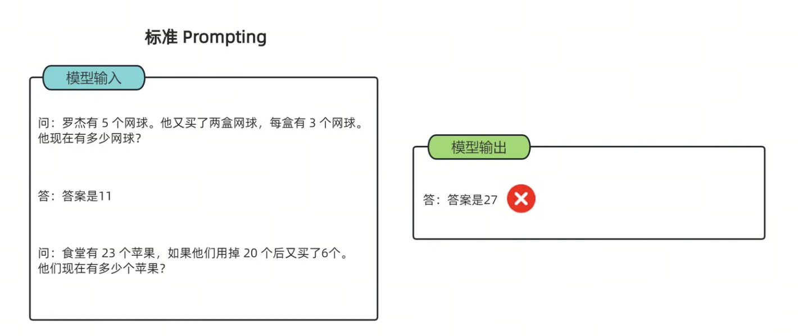
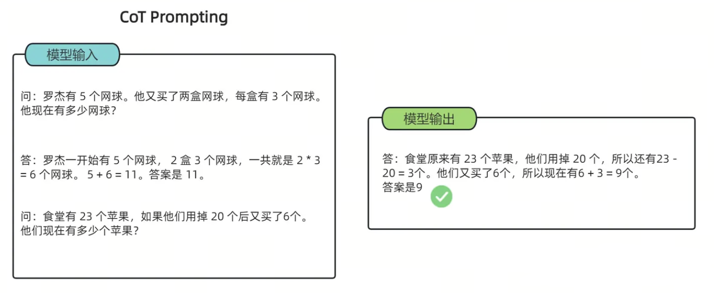
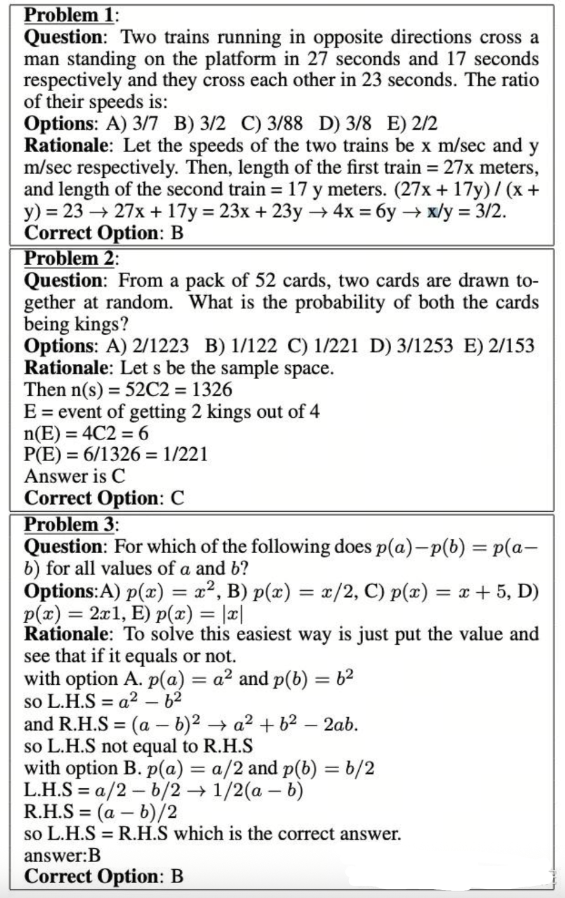
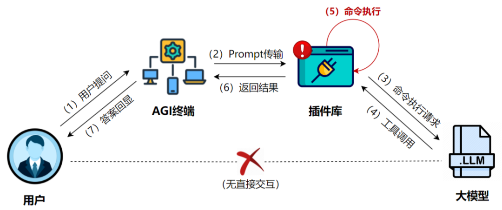

# 第15课时：推理（Reasoning）、代码与数学能力增强

**目标**：构建高质量的推理（CoT）与数学数据集，覆盖代码推理、数学公式化（LaTeX）、步骤化验证与过程验证，供垂直领域模型训练和评测使用。

---

## 1. 核心概念与目标

### 1.1 什么是推理能力（演绎、归纳、程序化）

**推理（Reasoning）** 指模型在给定输入的情况下，通过一系列中间步骤，从已知条件推导出结论的能力。在大模型中，推理并非“显式算法执行”，而是通过大量具有**中间步骤结构**的数据学习到的条件分布近似。

其常见形式包括：

### 1.1 什么是推理能力（演绎、归纳、程序化）

**推理（Reasoning）** 指模型在给定输入的情况下，通过一系列中间步骤，从已知条件推导出结论的能力。在大模型中，推理并非“显式算法执行”，而是通过大量具有**中间步骤结构**的数据学习到的条件分布近似。

其常见形式包括：

**1. 演绎推理 (Deductive Reasoning)**

- **定义**：遵循“自上而下”的逻辑，从既定的公理、定理或一般性规则出发，必然地推导出具体的结论。
- **应用场景**：数学证明、法律条文适用、逻辑谜题。
- **具体例子**：
    - **前提 A**：所有碳基生物都需要水才能生存
    - **前提 B**：人类是碳基生物
    - **推导过程**：因为人类属于碳基生物范畴，而该范畴内的个体必须满足“需要水”这一规则
    - **结论**：因此，人类需要水才能生存

**2. 归纳推理 (Inductive Reasoning)**

- **定义**：采取“自下而上”的路径，通过观察大量零散的实例或数据，总结出具有普遍意义的规律或趋势。结论具有概率性。
- **应用场景**：模式识别、科学实验发现、预测分析。
- **具体例子**：
    - **观察 1**：过去 10 年，某电商平台在 11 月的销量都出现了暴增
    - **观察 2**：今年 11 月该平台进行了大规模促销活动
    - **推导过程**：基于往年的重复性模式和今年的相似触发条件
    - **结论**：今年 11 月的销量极大概率会再次大幅提升

**3. 类比推理 (Analogical Reasoning)**

- **定义**：通过对比两个不同但结构相似的对象，将已知领域的知识迁移到未知领域。核心在于“举一反三”。
- **应用场景**：代码重构、跨行业案例分析、比喻教学。
- **具体例子**：
    - **已知场景**：在 Python 中，我们使用 `list.append()` 向列表末尾添加元素
    - **目标场景**：学习 JavaScript 的数组操作
    - **类比过程**：JavaScript 的 `Array` 对象在逻辑上等同于 Python 的 `list`
    - **迁移结论**：因此，在 JavaScript 中应该存在类似的方法，即 `array.push()`

**4. 程序化推理 (Programmatic Reasoning)**

- **定义**：模拟计算机的执行逻辑，严格按照定义的步骤、状态机或控制流（循环、分支）来处理信息。
- **应用场景**：代码执行结果预测、复杂工作流编排、算法推演。
- **具体例子**：
    - **初始状态**：`x = 10`
    - **执行指令**：`if x > 5: x = x * 2; else: x = x - 5;`
    - **推导过程**：
        - 判断条件：10 是否大于 5？是
        - 进入分支：执行 `x * 2`
        - 计算结果：10 * 2 = 20
    - **最终状态**：`x = 20`


---


### 1.2 CoT（思维链）的核心价值与形式

**Chain-of-Thought（思维链）** 是指在模型输出中显式给出从问题到答案的中间推理步骤。

* **本质**：将“隐式推理”转化为“可学习的序列结构”。
* **核心价值**：
    * **提高准确率**：显著增强复杂问题的处理能力（尤其是数学、逻辑、多跳问答）。
    * **提供可解释性**：便于调试与审计，使用户理解模型决策逻辑。
    * **支撑验证**：为后续的过程验证（Process Verification）提供具体的对象。


**常见 CoT 形式**：

* **自然语言步骤**：使用“首先…其次…因此…”等连接词叙述逻辑。
* **半结构化步骤**：采用编号列表、要点式（Bullet Points）排列。
* **程序化步骤**：利用伪代码、公式变形序列或逻辑符号进行推导。





该图通过两组实验对比，展示了如何通过改变“提示词（Prompt）”的写法来优化 AI 的逻辑推理能力：

* **标准提示 (Standard Prompting)：** 模型输入的范例中只有“问题”和“最终答案”。在这种情况下，模型处理新问题时（如苹果计算题）容易跳过逻辑，直接给出一个**错误的数值（27）**。
* **CoT 提示 (CoT Prompting)：** 模型输入的范例中包含了**具体的推理步骤**（如 $2 \times 3=6$, $5+6=11$）。这种“言传身教”引导模型学会了拆解问题，使其在回答新问题时也按步骤运算（$23-20=3$, $3+6=9$），最终得到了**正确的答案（9）**。

所以 CoT 的核心意义在于**让 AI 像人类一样“分步思考”**，从而显著提升处理复杂逻辑和数学问题的准确性。


### 1.3 目标：从“背诵答案”到“学会思考”

本阶段的核心目标是引导模型实现底层逻辑的跃迁：

* **打破记忆依赖**：从单纯依赖概率预测“下一个字”或检索训练集中的“标准答案”，转向逻辑推演。
* **构建思维路径**：通过结构化的推理数据训练，使模型具备拆解复杂任务的习惯，在面对未知任务时能自发建立逻辑链路。
* **提升泛化能力**：使模型不仅仅是“背诵”知识，而是真正“理解”规则，从而在泛化场景下具备更强的鲁棒性。

---

## 2. 行业标准基准数据集（Benchmark Datasets）

本节旨在通过分析行业公认的基准数据集，明确高质量推理数据的标注规范（Schema）与组织形式。

### 2.1 数学推理数据集

数学数据集是衡量模型逻辑严密性的金标准。其核心在于将自然语言描述转化为符号运算，并给出每一步的推导。

**一个CoT数据集的例子**



>上图数据集中，除了问题和选项之外，还提供了推理过程（Rationale）。目的是为了让模型学会如何推理得到正确选项。

**下面是几个经典的数学推理数据集：**

> 📌 **1. [GSM8K — 小学数学应用题 (Grade School Math 8K)](https://huggingface.co/datasets/openai/gsm8k)**

* **任务类别**：小学水平数学应用题，侧重多步推理。
* **特点**：包含约 8,500 道高质量题目。它是**思维链（Chain-of-Thought, CoT）**微调的鼻祖，要求模型在给出最终答案前，先输出完整的中间解题步骤。
* **Schema 示例**：
    ```json
    {
      "question": "杰克有 5 个苹果，他买了一盒苹果，里面有 2 个苹果，他又给了朋友 3 个，还剩几个？",
      "answer": "杰克开始有 5 个苹果。买了一盒后，他有 5 + 2 = 7 个苹果。给了朋友 3 个后，他剩下 7 - 3 = 4 个苹果。#### 4"
    }
    ```
    *注：`####` 后通常跟最终数值结果，方便程序自动评测。*

> 📌 **2. [MATH — 高难度数学竞赛数据集](https://huggingface.co/datasets/EleutherAI/hendrycks_math)**

* **任务类别**：高中及竞赛级数学难题（代数、几何、数论等）。
* **特点**：包含 12,500 个问题。与 GSM8K 相比，其逻辑深度和公式复杂度显著提升，是训练模型**严谨逻辑推导**和 **LaTeX 公式生成**能力的核心数据。
* **Schema 示例**：
    ```json
    {
      "problem": "求方程 $x^2 - 4x + 4 = 0$ 的解。",
      "level": "Level 2",
      "type": "Algebra",
      "solution": "我们可以将方程配方为 $(x-2)^2 = 0$。因此，$x-2 = 0$，解得 $x=2$。答案是 $2$。"
    }
    ```
> 📌 **3. [SVAMP — 算术词题变体数据集](https://huggingface.co/datasets/ChilleD/SVAMP)**

* **任务类别**：针对算术应用题的鲁棒性测试集。
* **特点**：通过对原始问题进行细微的语义改写（例如改变数字顺序、增加无关信息）来挑战模型。它专门用于解决模型通过“背题”或“关键词匹配”而非真正理解逻辑来答题的问题。
* **Schema 示例**：
    ```json
    {
      "Question": "爱德华有 58 个大理石球，他丢了 25 个，又买了 10 个新的。如果他原本还打算送给朋友 5 个（但他还没送），他现在手头有多少个？",
      "Answer": "58 - 25 + 10 = 43. #### 43"
    }
    ```
* **微调意义**：提升模型的**抗干扰能力**，确保模型在面对冗长、含有误导性信息的业务指令时，依然能提取核心数学模型。


> 📌 **4. [DeepMind Mathematics — 算法生成数学题](https://github.com/google-deepmind/mathematics_dataset)**

* **任务类别**：程序化生成的全维度数学题库（函数求导、多项式展开、单位转换等）。
* **特点**：规模庞大（数百万量级），完全由算法生成，覆盖了计算机科学中常见的数值计算逻辑。
* **Schema 示例**：
    ```json
    {
      "Question": "计算 $f(x) = 3x^2 + 2x$ 在 $x=1$ 处的导数。",
      "Answer": "首先求出导函数 $f'(x) = 6x + 2$。将 $x=1$ 代入得 $6(1) + 2 = 8$。答案是 8。"
    }
    ```
* **微调意义**：提供极致的**数据多样性**，通过海量样本让模型形成对数学算子的“直觉”，常用于大模型预训练之后的逻辑补齐阶段。


---

### 2.2 代码推理：HumanEval & MBPP

代码数据集不仅考察模型的“编写”能力，更考察其对逻辑边界、异常处理及执行流程的“推理”能力。

> 📌 **1. [HumanEval 风格样例](https://huggingface.co/datasets/openai/openai_humaneval)**

```json
{
    "task_id": "test/0",
    "prompt": "def return1():\n",
    "canonical_solution": "    return 1",
    "test": "def check(candidate):\n    assert candidate() == 1",
    "entry_point": "return1"
}
```

* **特点**：采用 **"Zero-shot Docstring-to-Code"** 模式。提示词（Prompt）中不含示例，仅提供函数签名和逻辑描述。由于它要求模型续写 `canonical_solution`，这迫使模型必须深度理解 Python 的切片、循环及递归逻辑。
* **微调意义**：侧重于**算法实现能力**。它能显著提升模型对复杂逻辑边界（如回文中心探测、最短路径搜索）的推演精度。


> 📌 **2. MBPP 风格样例**

```json
{
    'source_file': 'Benchmark Questions Verification V2.ipynb',
    'task_id': 2,
    'prompt': 'Write a function to find the shared elements from the given two lists.',
    'code': 'def similar_elements(test_tup1, test_tup2):\n  res = tuple(set(test_tup1) & set(test_tup2))\n  return (res) ',
    'test_imports': [],
    'test_list': [
        'assert set(similar_elements((3, 4, 5, 6),(5, 7, 4, 10))) == set((4, 5))',
        'assert set(similar_elements((1, 2, 3, 4),(5, 4, 3, 7))) == set((3, 4))',
        'assert set(similar_elements((11, 12, 14, 13),(17, 15, 14, 13))) == set((13, 14))'
        ]
}
```

* **特点**：采用 **"Instruction-to-Code"** 模式。更接近人类的自然对话习惯，指令（Text）通常是一个明确的任务描述。其核心特色是附带了 `test_list` 显式测试用例。
* **微调意义**：侧重于**需求对齐能力**。通过大量的 `assert` 语句训练，模型会学习到“防御性编程”意识，即生成的代码必须能够通过多种输入（包括极端值）的校验。


---

### 2.3 综合推理：BBH (Big-Bench Hard)

BBH 是从 Google 的 BIG-bench 数据集中筛选出的 23 个最具挑战性的任务。这些任务在不使用 CoT 的情况下，模型表现普遍低于人类。

#### 2.3.1 核心价值

* ​**任务多样性**​: 包含布尔表达式判断、物体追踪、形式逻辑推导等。
* ​**Few-shot 模板化**​: BBH 常提供固定的 3-shot 或 5-shot 推理模板，是训练模型遵循特定推理格式的最佳参考。

在 BBH 的微调数据中，Schema 通常被设计为 **“Input + CoT (Thought) + Target”** 结构。这种格式的精髓在于它不仅仅提供了正确答案，更提供了一套**解题模板**。

> 📌 **BBH 风格样例：[Tracking Shuffled Objects (追踪洗牌对象)](https://huggingface.co/datasets/lukaemon/bbh/viewer/tracking_shuffled_objects_three_objects)**

```json
{
  "task_name": "tracking_shuffled_objects",
  "input": "桌子上有三个杯子：1号、2号和3号。球在2号杯子里。爱丽丝交换了1号和2号杯子。鲍勃交换了2号和3号杯子。球现在在哪里？",
  "target": "3号",
  "cot_thought": [
    "1. 初始状态：球在2号杯。位置状态为：{1:空, 2:球, 3:空}。",
    "2. 第一步（爱丽丝交换1号和2号）：原本在2号的球转移到了1号。当前状态：{1:球, 2:空, 3:空}。",
    "3. 第二步（鲍勃交换2号和3号）：交换的是2号和3号，而球在1号，位置不受影响。当前状态：{1:球, 2:空, 3:空}。",
    "4. 结论：球最终在1号杯。"
  ]
}
```

* **特点**：
    * **状态追踪（State Tracking）**：要求模型在推理过程中维护一个“内部状态机”，实时更新变量信息。
    * **原子化步骤**：将复杂的逻辑拆解为不可再分的原子步骤，每一步都必须在前一步的基础上进行。
* **微调意义**：
    * **强化系统 2 思维**：训练模型进入缓慢、受控、逻辑严密的思考模式（System 2），而非基于直觉的联想（System 1）。
    * **长程逻辑保持**：通过大量的步骤训练，减少模型在处理复杂指令时的“逻辑断片”现象。


---

## 3. 高质量推理数据构建策略

==候补实践==：代码展示


### 3.1 数学推理数据构建（LaTeX + 步骤化）

数学数据的核心在于**逻辑的严密性**与​**符号的标准化**​。通过 LaTeX 规范化与过程验证，可以显著降低模型的“推理幻觉”。

#### 3.1.1 格式化要求与 LaTeX 规范

* ​**标准化表达**​：所有数学公式必须使用 LaTeX 渲染（如 $x^2 - 5x + 6 = 0$）。
* ​**Step-by-step 结构**​：解答过程需按步骤拆分，每一步应包含独立的逻辑闭环，并建议以 `\text{Step n: }` 标注。
* ​**变量对齐**​：复杂推导推荐使用 `align` 环境，确保等号对齐，便于模型学习变形规则。

​**数据样例 (JSONL)**​：


```json
{
  "id": "math-0001",
  "domain": "math",
  "difficulty": "medium",
  "latex_problem": "\\text{求方程 } x^2 - 5x + 6 = 0 \\text{ 的根。}",
  "cot": [
    "1. 确定方程系数：a=1, b=-5, c=6。",
    "2. 计算判别式：Δ = (-5)^2 - 4*1*6 = 25 - 24 = 1。",
    "3. 应用求根公式：x = (5 ± √1) / 2 = (5 ± 1) / 2。",
    "4. 得出最终解：x = 2 或 x = 3。"
  ],
  "latex_solution": "\\begin{align}\\Delta &= (-5)^2 - 4\\cdot1\\cdot6 = 1\\\\ x &= \\frac{5\\pm\\sqrt{1}}{2} = 2,3\\end{align}",
  "answer": "x=2, x=3",
  "verification": {
    "type": "numeric_check",
    "result": true,
    "evidence": "代入验证：2^2-5*2+6=0; 3^2-5*3+6=0"
  }
}
```

#### 3.1.2 过程验证（Process Verification）标记

为了确保数据的准确性，需引入自动验证机制：

* ​**符号校验**​：利用 **SymPy** 等数学引擎解析 `latex_solution`，验证步骤间的等价性。
* ​**数值替换检查**​：对变量进行随机采样代入，验证结果是否在容差范围内一致。
* ​**解算器比对**​：引入独立解算器（如 WolframAlpha API）生成的结论与标注数据进行 Cross-check。

---

### 3.2 代码推理数据构建

代码推理不只是让模型“写代码”，更重要的是让其理解​**程序执行的状态演变**​。

#### 3.2.1 核心任务类型

* ​**Bug 修复（Debugging）**​：提供错误代码 -> 定位位置 -> 给出修复方案。
* ​**输出预测（Execution Tracing）**​：提供输入与代码 -> 模拟运行逻辑 -> 预测 stdout。
* ​**执行轨迹（Execution Trace）构建**​：【新增】记录变量在每一行代码执行后的内存状态，帮助模型建立“心理模型”。

#### 3.2.2 Bug 修复示例


```json
{
  "id": "code-bug-0001",
  "domain": "code",
  "language": "python",
  "input": "def add_items(a, b):\n    for i in a:\n        a.append(i)\n    return a + b",
  "cot": [
    "该函数目标是拼接列表。但代码在遍历 a 时通过 append 修改 a，会导致无限循环。",
    "修复策略：删除多余循环，利用 Python 列表加法特性直接合并。",
    "最终代码：return a + b"
  ],
  "answer": "将函数体替换为: return a + b",
  "testcases": [{"input": "[1,2], [3]", "expected_output": "[1,2,3]"}],
  "verification": {"type": "unit_test", "result": true}
}
```

#### 3.2.3 自动化验证流程

* ​**Sandboxed Execution**​：在隔离的 Docker 容器中运行测试用例。
* ​**日志分析**​：自动捕捉运行时错误（Traceback），并将其反馈至验证字段。

**新增 — 执行轨迹（Execution Trace）数据构建**

为了帮助模型建立“程序执行的心理模型”，建议将每条样本扩展为带有详细执行轨迹的结构：

```json
{
  "id": "trace-0001",
  "language": "python",
  "code": "def sum_first_n(n):\n    s = 0\n    for i in range(1, n+1):\n        s += i\n    return s",
  "input": "n=3",
  "execution_trace": [
    {"line": 1, "vars": {}},
    {"line": 2, "vars": {"s": 0}},
    {"line": 3, "vars": {"i": 1, "s": 1}},
    {"line": 3, "vars": {"i": 2, "s": 3}},
    {"line": 3, "vars": {"i": 3, "s": 6}},
    {"line": 4, "vars": {"return": 6}}
  ],
  "cot": ["逐行展示状态变化，便于模型学习状态演化"],
  "answer": "6"
}
```

构造方法建议：在沙箱中以小步执行并记录每行的变量快照、异常与 I/O，从而把真实运行痕迹作为训练信号。

---

### 3.3 通用逻辑与常识推理构造

==后补实践==：扩展详细说说怎么构建，并附上代码。

* ​**多跳推理（Multi-hop Reasoning）**​：通过组合多个事实知识点（如：A 是 B 的导师，B 获得了 C 奖 -> A 的学生获得了 C 奖），构建需要跨越多个逻辑节点的样本。
* ​**反向推理**​：从已知结果推导前提条件，增强模型的溯因推理能力。

---


## 4. 能力提升的关键技术：数据演化与合成

本节重点回答“如何提升推理能力与鲁棒性”的实践方法，包含复杂性演化（Evol-Instruct）、拒绝采样微调（RFT）与合成数据生成器实战。

### 4.1 复杂性演化（Evol-Instruct）

==后补实践==：需要给出代码示例和结果展示。


通过自动化 Prompt 生成与变异，逐步提高问题难度与约束，达到模型“自我踩点”提升能力的目的。常见策略：

- 增加约束条件（限制步骤数、禁止使用特定方法）。
- 增加变量或实体数量（从单步到多步、多实体交互）。
- 引入干扰信息（无关事实），训练模型辨别并聚焦核心证据。

示例 Prompt 模板：

"基于以下题目，生成一个更难的变体：增加两个条件限制并且要求使用不超过 6 步推理。" 

自动化流程：生成 -> 验证（执行/数学引擎/单测） -> 增强样本加入训练池。

### 4.2 拒绝采样微调（RFT）

==后补实践==：需要给出代码示例和结果展示。

RFT（Rejection-sampling Fine-Tuning）流程简述：

1. 针对同一题目，使用基线模型生成多条 CoT 路径（N 条）。
2. 使用自动化验证器（单测、符号求解、沙箱执行）对每条路径打分和筛选。
3. 保留通过验证或评分最高的路径作为训练样本；丢弃错误或不一致路径（即“拒绝采样”）。
4. 基于筛选后的高质量 CoT 进行 SFT（监督微调），或在 RL 阶段使用被接受样本作为高质量回报信号。

该方法能显著提高模型在复杂推理上的过程一致性与最终正确率。

### 4.3 合成数据生成流程（Python 代码示例）

以下是一个用于快速批量生成 **数学推理条目** 的生成器骨架，可直接运行：


```python
import json
import uuid
from random import randint

def gen_simple_quadratic(n=50):
    dataset = []
    for _ in range(n):
        a, b, c = 1, randint(-10, 10), randint(-10, 10)
        problem = f"求方程 $x^2 + ({b})x + ({c}) = 0$ 的根。"
        
        # 构造 CoT 逻辑
        delta = b*b - 4*a*c
        cot = [
            f"1. 写出判别式：Δ = ({b})^2 - 4*{a}*{c} = {delta}。",
            "2. 根据 Δ 的符号判断根的情况。"
        ]
        
        if delta >= 0:
            r1 = round((-b + delta**0.5) / (2*a), 2)
            r2 = round((-b - delta**0.5) / (2*a), 2)
            answer = f"x1={r1}, x2={r2}"
            cot.append(f"3. 代入公式求得根为 {r1} 和 {r2}。")
        else:
            answer = "无实数根"
            cot.append("3. 由于 Δ < 0，该方程在实数范围内无解。")

        dataset.append({
            "id": str(uuid.uuid4()),
            "domain": "math",
            "input": problem,
            "cot": cot,
            "answer": answer,
            "verification": {"type": "numeric_check", "evidence": "auto-computed"}
        })
    return dataset

if __name__ == '__main__':
    data = gen_simple_quadratic(10)
    with open('synthetic_math_data.jsonl', 'w', encoding='utf8') as f:
        for item in data:
            f.write(json.dumps(item, ensure_ascii=False) + "\n")

```

**合成数据输出：**

```json
{"id": "07d107e9-02bd-469a-977c-9e72aeeaadf6", "domain": "math", "input": "求方程 $x^2 + (-7)x + (9) = 0$ 的根。", "cot": ["1. 写出判别式：Δ = (-7)^2 - 4*1*9 = 13。", "2. 根据 Δ 的符号判断根的情况。", "3. 代入公式求得根为 5.3 和 1.7。"], "answer": "x1=5.3, x2=1.7", "verification": {"type": "numeric_check", "evidence": "auto-computed"}}
{"id": "75c50fcb-20c1-4ec1-8496-0dfceb51161a", "domain": "math", "input": "求方程 $x^2 + (-5)x + (3) = 0$ 的根。", "cot": ["1. 写出判别式：Δ = (-5)^2 - 4*1*3 = 13。", "2. 根据 Δ 的符号判断根的情况。", "3. 代入公式求得根为 4.3 和 0.7。"], "answer": "x1=4.3, x2=0.7", "verification": {"type": "numeric_check", "evidence": "auto-computed"}}
{"id": "49807e7b-461b-4ff9-afa2-510e90a7b886", "domain": "math", "input": "求方程 $x^2 + (-10)x + (0) = 0$ 的根。", "cot": ["1. 写出判别式：Δ = (-10)^2 - 4*1*0 = 100。", "2. 根据 Δ 的符号判断根的情况。", "3. 代入公式求得根为 10.0 和 0.0。"], "answer": "x1=10.0, x2=0.0", "verification": {"type": "numeric_check", "evidence": "auto-computed"}}
{"id": "314839f2-c57d-46f7-af89-0e70ec2334df", "domain": "math", "input": "求方程 $x^2 + (3)x + (8) = 0$ 的根。", "cot": ["1. 写出判别式：Δ = (3)^2 - 4*1*8 = -23。", "2. 根据 Δ 的符号判断根的情况。", "3. 由于 Δ < 0，该方程在实数范围内无解。"], "answer": "无实数根", "verification": {"type": "numeric_check", "evidence": "auto-computed"}}
{"id": "1c4d3384-b771-4fa5-8607-ff08e957c09f", "domain": "math", "input": "求方程 $x^2 + (-10)x + (8) = 0$ 的根。", "cot": ["1. 写出判别式：Δ = (-10)^2 - 4*1*8 = 68。", "2. 根据 Δ 的符号判断根的情况。", "3. 代入公式求得根为 9.12 和 0.88。"], "answer": "x1=9.12, x2=0.88", "verification": {"type": "numeric_check", "evidence": "auto-computed"}}
{"id": "83717cd7-b814-4425-a56f-f1335b2b4718", "domain": "math", "input": "求方程 $x^2 + (-10)x + (3) = 0$ 的根。", "cot": ["1. 写出判别式：Δ = (-10)^2 - 4*1*3 = 88。", "2. 根据 Δ 的符号判断根的情况。", "3. 代入公式求得根为 9.69 和 0.31。"], "answer": "x1=9.69, x2=0.31", "verification": {"type": "numeric_check", "evidence": "auto-computed"}}
{"id": "68fd2a18-40ff-4700-9e92-6b066b2937dc", "domain": "math", "input": "求方程 $x^2 + (-8)x + (7) = 0$ 的根。", "cot": ["1. 写出判别式：Δ = (-8)^2 - 4*1*7 = 36。", "2. 根据 Δ 的符号判断根的情况。", "3. 代入公式求得根为 7.0 和 1.0。"], "answer": "x1=7.0, x2=1.0", "verification": {"type": "numeric_check", "evidence": "auto-computed"}}
{"id": "7cf51e86-54fc-4462-ae60-709d260afd86", "domain": "math", "input": "求方程 $x^2 + (-3)x + (0) = 0$ 的根。", "cot": ["1. 写出判别式：Δ = (-3)^2 - 4*1*0 = 9。", "2. 根据 Δ 的符号判断根的情况。", "3. 代入公式求得根为 3.0 和 0.0。"], "answer": "x1=3.0, x2=0.0", "verification": {"type": "numeric_check", "evidence": "auto-computed"}}
{"id": "1ca2b82c-3c6e-4344-b4e7-1c7cd39c6176", "domain": "math", "input": "求方程 $x^2 + (-7)x + (-5) = 0$ 的根。", "cot": ["1. 写出判别式：Δ = (-7)^2 - 4*1*-5 = 69。", "2. 根据 Δ 的符号判断根的情况。", "3. 代入公式求得根为 7.65 和 -0.65。"], "answer": "x1=7.65, x2=-0.65", "verification": {"type": "numeric_check", "evidence": "auto-computed"}}
{"id": "e1334b5d-3fb2-414d-b2d1-6a9358734637", "domain": "math", "input": "求方程 $x^2 + (6)x + (-4) = 0$ 的根。", "cot": ["1. 写出判别式：Δ = (6)^2 - 4*1*-4 = 52。", "2. 根据 Δ 的符号判断根的情况。", "3. 代入公式求得根为 0.61 和 -6.61。"], "answer": "x1=0.61, x2=-6.61", "verification": {"type": "numeric_check", "evidence": "auto-computed"}}

```

## 5. 数据处理流水线：清洗、去重、过滤

### 5.1 GitHub 代码清洗

原始代码库中充斥着重复、自动生成和低质量的文件。清洗的目标是保留“人类编写的、逻辑清晰的”代码。

#### 5.1.1 基础过滤规则

为保证数据集的整体质量与可用性，在原始代码语料进入后续处理流程之前，首先需要进行一轮**基础过滤**。该阶段的目标是快速剔除噪声样本、异常样本以及明显不适合用于建模的数据，从而降低后续清洗与建模的成本。

* **文件筛选**  
  仅保留主流、通用性强且在真实工程场景中被广泛使用的编程语言文件，例如 **Python、Java、C++、Rust、Go** 等。  
  这一规则的动机在于：
    - 主流语言拥有更成熟的编码规范和更稳定的语法结构；
    - 相关学习资源与真实项目丰富，有助于模型学习通用且可迁移的编程知识；
    - 可避免因冷门语言样本稀缺而引入分布不均或噪声过大的问题。

* **长度过滤**  
  对代码文件的整体长度进行约束，主要包括两个方面：
    - **最小长度限制**：剔除少于 **100 字符**的文件。这类文件通常仅包含零散代码片段、占位符或测试语句，缺乏完整逻辑结构，对模型学习帮助有限。
    - **单行长度限制**：剔除存在**单行超过 1000 字符**的文件。这类代码往往是经过混淆或压缩处理的自动生成代码，可读性极差，不符合自然代码分布。

* **内容特征过滤**  
  在长度和语言筛选的基础上，进一步从代码内部特征出发进行质量控制：
  
  * **代码注释比**  
    计算注释字符数在文件总字符数中的占比，并设定合理区间：
    - **注释占比 < 5%**：通常意味着代码几乎没有任何说明，变量命名随意，可读性和可维护性较差；
    - **注释占比 > 90%**：往往说明文件并非真正的可执行代码，而是文档、模板或被大段注释包裹的无效内容。  
    因此，仅保留注释比例处于合理区间的文件，有助于平衡代码可读性与实际逻辑密度。

  * **关键词过滤**  
    对代码内容进行关键词匹配，直接移除包含明显自动生成或压缩标记的文件，例如：
    - `AUTO-GENERATED`
    - `MINIFIED`
    - 以及其他常见的生成器声明或压缩工具标识  
    这些文件通常由工具批量生成，结构高度重复，缺乏人类编程风格，不利于模型学习真实的编码习惯与逻辑表达。

通过以上基础过滤规则，可以在不引入复杂语义分析的前提下，大幅降低数据噪声比例，为后续更精细的质量评估与语义级清洗奠定可靠基础。


#### 5.2 高级去重

在完成基础过滤之后，仍然可能存在大量内容高度重复或近似重复的代码文件。如果不加控制，这类样本会在训练过程中被模型反复“看到”，从而导致模型对特定代码模式的**过拟合**，削弱其泛化能力。因此，有必要在全数据范围内执行**高级去重策略**，以确保语料的多样性与信息密度。

* **精确去重**  
  对每一个代码文件计算其唯一的哈希指纹，并基于该指纹进行全局比对。具体而言，使用 **SHA-256** 等安全哈希算法，将文件的完整内容映射为固定长度的哈希值。  
    - 若两个文件的哈希值完全一致，则可以确定其内容完全相同；
    - 在这种情况下，仅保留其中一份，其余副本全部剔除。  
    精确去重能够高效、可靠地消除完全重复的数据，是全局去重流程中的第一道防线。

* **模糊去重**  
  仅依赖精确匹配无法发现“高度相似但并非完全相同”的代码，例如：
    - 同一文件的不同版本；
    - 仅修改了变量名、注释或格式的代码；
    - 来源不同但结构一致的模板化代码。  

为此，引入基于代码片段相似度的模糊去重方法。其核心思路是：

* 将代码拆分为若干特征片段；
* 通过近似集合相似度的方法估计不同文件之间的重合程度；
* 以 **Jaccard 相似度** 作为衡量标准，当相似度高于 **0.8** 时，认为两个文件在信息层面高度冗余，仅保留其中之一。  

**Jaccard 相似度（Jaccard Similarity）** 定义为两个集合交集与并集之比：

$$
\mathrm{Jaccard}(A, B)
= \frac{|A \cap B|}{|A \cup B|}
$$

其中，各变量含义如下：

- $A$：由代码文件 1 拆分得到的特征片段集合（如 token n-grams、AST 子树、代码行片段等）  
- $B$：由代码文件 2 拆分得到的特征片段集合  
- $|A \cap B|$：两个代码文件**共有**的特征片段数量，表示信息重合程度  
- $|A \cup B|$：两个代码文件特征片段的**并集**大小，表示总体信息规模  

当满足：

$$
\mathrm{Jaccard}(A, B) \ge 0.8
$$

时，认为两个代码文件在信息层面高度相似，判定为冗余样本，仅保留其中之一。

该策略能够在计算效率与去重效果之间取得良好平衡，尤其适合大规模代码语料，能有效清理不同版本的同一文件以及大量重复的工程模板代码。

通过精确去重与模糊去重的组合使用，可以在保证语料规模的同时显著提升数据多样性，从而为模型学习更加稳健、通用的编程知识提供可靠保障。

>下面展示一段去重代码示例

```python
"""
高级去重示例代码（精确去重 + 模糊去重）

说明：
- 已给定一个 list，其中每个元素是一段代码字符串
- 先使用 SHA-256 做精确去重
- 再使用 MinHash + LSH 近似计算 Jaccard 相似度
- 当 Jaccard 相似度 > 0.8 时，认为是高度重复代码并剔除

该方法常用于大规模代码语料清洗，可有效移除不同版本的同一文件
以及大量重复的模板化代码。
"""

import hashlib
from datasketch import MinHash, MinHashLSH
from itertools import combinations

# -----------------------------
# 1. 输入数据
# -----------------------------
code_list = [
    "def add(a, b):\n    return a + b",        
    "def multiply(a, b):\n    return a * b",   
    "def add(a, b):\n    return a + b",        
    "def add(a, b, c):\n    return a + b",      
]

# -----------------------------
# 2. 精确去重 (SHA-256)
# -----------------------------
def exact_dedup(codes):
    seen_hashes = {}
    kept_indices = []
    removed_exact = []

    for idx, code in enumerate(codes):
        h = hashlib.sha256(code.encode("utf-8")).hexdigest()
        if h not in seen_hashes:
            seen_hashes[h] = idx
            kept_indices.append(idx)
        else:
            removed_exact.append((idx, seen_hashes[h])) # (被删索引, 保留索引)
    return kept_indices, removed_exact

exact_kept_indices, exact_removed_log = exact_dedup(code_list)

# -----------------------------
# 11. 模糊去重 (MinHash + LSH)
# -----------------------------
def get_minhash(code, num_perm=128):
    m = MinHash(num_perm=num_perm)
    for token in code.split():
        m.update(token.encode("utf-8"))
    return m

def fuzzy_dedup(codes, indices, threshold=0.6):
    lsh = MinHashLSH(threshold=threshold, num_perm=128)
    final_kept_indices = []
    fuzzy_removed_log = []
    
    # 存储用于对比的 minhash 对象
    minhash_store = {}

    for idx in indices:
        m = get_minhash(codes[idx])
        # 查询是否有相似样本已存在于 LSH 桶中
        result = lsh.query(m)
        
        if result:
            match_idx = int(result[0])
            jac = m.jaccard(minhash_store[match_idx])
            fuzzy_removed_log.append((idx, match_idx, jac))
        else:
            lsh.insert(str(idx), m)
            minhash_store[idx] = m
            final_kept_indices.append(idx)
            
    return final_kept_indices, fuzzy_removed_log

final_indices, fuzzy_removed_log = fuzzy_dedup(code_list, exact_kept_indices)

# -----------------------------
# 4. 结果清晰打印
# -----------------------------
print("="*60)
print("去重过程报告")
print("="*60)

print(f"\n[1/2] 精确去重阶段 (SHA-256):")
for r_idx, k_idx in exact_removed_log:
    print(f"  - 移除原始索引 {r_idx}: 内容与索引 {k_idx} 完全一致")

print(f"\n[2/2] 模糊去重阶段 (LSH - Threshold 0.6):")
for r_idx, k_idx, jac in fuzzy_removed_log:
    print(f"  - 移除原始索引 {r_idx}: 相似度 {jac:.3f}，已保留相似样本 {k_idx}")

print("\n" + "="*60)
print(f"{'最终保留结果清单':^55}")
print("-" * 60)
print(f"{'原始索引':<10} | {'内容摘要 (前20位)':<25} | {'去重状态'}")
print("-" * 60)

for i in range(len(code_list)):
    content = code_list[i].replace('\n', ' ')[:20] + "..."
    if i in final_indices:
        status = "✅ [保留]"
    elif any(r[0] == i for r in exact_removed_log):
        status = "❌ [精确重复删除]"
    else:
        status = "❌ [模糊重复删除]"
    
    print(f"{i:<12} | {content:<25} | {status}")

print("-" * 60)
print(f"统计：原始总数 {len(code_list)} -> 最终保留 {len(final_indices)}")
print("="*60)

```

```text
============================================================
去重过程报告
============================================================

[1/2] 精确去重阶段 (SHA-256):
  - 移除原始索引 2: 内容与索引 0 完全一致

[2/2] 模糊去重阶段 (LSH - Threshold 0.6):
  - 移除原始索引 3: 相似度 0.680，已保留相似样本 0

============================================================
                       最终保留结果清单                        
------------------------------------------------------------
原始索引       | 内容摘要 (前20位)               | 去重状态
------------------------------------------------------------
0            | def add(a, b):     r...   | ✅ [保留]
1            | def multiply(a, b): ...   | ✅ [保留]
2            | def add(a, b):     r...   | ❌ [精确重复删除]
3            | def add(a, b, c):   ...   | ❌ [模糊重复删除]
------------------------------------------------------------
统计：原始总数 4 -> 最终保留 2
============================================================
```


### 5.3 核心流程：闭环验证系统

==后补实践==：需要代码展示。

验证驱动过滤并非依赖规则或静态特征进行一次性判断，而是构建了一个完整的**闭环验证系统**。该系统以“生成—运行—反馈”为核心思想，通过真实执行代码来检验其有效性与可用性，从而在源头上保障数据质量。这种方式能够显著减少仅在语法层面正确、但在语义或运行层面存在问题的低质量样本。

整个流程可划分为以下几个关键阶段：

1. **代码提取或生成**  
   系统首先从原始代码库中提取可独立运行的函数、脚本或模块，确保其具备明确的输入与输出形式。同时，也可以利用大语言模型自动生成解题代码或功能实现代码，用于扩充训练样本的覆盖范围。  
   这一阶段的重点在于保证代码具备可执行性与明确任务目标，而非仅作为静态文本存在。

2. **环境配置**  
   在代码执行之前，系统会自动分析其依赖关系，并为其匹配所需的运行环境与第三方库。例如，数值计算相关代码需要配置 `numpy`，数据处理代码可能依赖 `pandas`，约束求解或形式化验证任务则需要 `z3-solver` 等工具。  
   通过自动化环境配置，可以最大程度减少因依赖缺失导致的误判，并提升验证流程的成功率与稳定性。

3. **解释器执行**  
   代码将在隔离的沙箱环境中运行，以避免对宿主系统产生任何安全风险。沙箱通常限制文件系统访问、网络请求以及运行时间和内存占用，从而保证执行过程安全、可控。  
   该阶段的核心目标是观察代码在真实运行条件下的行为，而不仅仅是其表面结构是否合理。

4. **结果判定与反馈**  
   根据代码的运行结果，系统会对样本进行明确分类：  
   * **通过**：代码能够成功运行并得到合理输出，说明其逻辑完整、依赖正确，可直接进入高质量训练集，用于模型学习。  
   * **失败**：代码在执行过程中抛出异常或运行错误，系统将完整记录错误日志与调用栈信息。这些失败样本不会直接丢弃，而是被保留下来，用于构建后续的错误修复数据集，从而支持模型学习如何定位问题并进行代码修正。

通过上述闭环流程，验证驱动过滤不仅能够筛选出高质量、可执行的代码样本，还能将失败案例转化为具有训练价值的资源，实现数据利用效率的最大化。这种动态验证机制在规模化代码数据构建中尤为关键，是提升模型实际编程能力的重要基础。


---


### 5.4 代码验证：沙箱环境与单元测试生成

==后补实践==：代码展示

在基于执行结果进行数据验证的过程中，安全性始终是首要前提。任何来源不明或未经审查的代码，都可能包含恶意逻辑或资源滥用行为，若直接在本地环境中执行，将对系统稳定性和数据安全造成严重风险。




---

### 5.5 利用 Python 解释器进行动态验证

在编程类数据的质量评估中，动态验证的核心不在于代码“看起来是否正确”，而在于其**是否能够在真实解释器中成功运行并满足预期行为**。因此，单元测试的通过率成为衡量代码样本质量的关键指标。基于 Python 解释器的动态验证机制，能够从语法、语义以及运行状态多个层面对代码进行全面评估。

具体而言，该过程主要包含以下几个方面：

* **自动化测试构建**  
  针对一段待验证代码 $C$，系统会自动生成或推断其可能的输入集合 $I$，例如不同类型、不同边界条件下的参数组合。随后，通过执行过程 $Exec(C, I)$ 获取对应输出 $O$。  
  这种方式避免了人工编写测试用例的高成本，使验证流程能够大规模自动化运行，同时也有助于发现隐藏在边界条件下的逻辑错误。

* **状态一致性检查**  
  除了直接比对输出结果外，系统还会对执行前后程序的内部状态进行检查，包括关键变量的取值、内存中对象的变化以及全局状态是否被意外修改等。  
  通过状态一致性分析，可以有效识别那些“输出正确但副作用异常”的代码样本，防止不安全或不可控的实现进入训练数据。

* **异常捕获与错误类型分析**  
  在执行过程中产生的异常会被完整捕获并分类分析。通常可将其区分为两大类：  
  - **语法错误**：代码无法通过解释器解析，往往反映出模型在基础语法层面的能力不足；  
  - **运行时异常**：代码能够成功解析，但在特定输入或边界条件下触发错误，通常源于逻辑分支不完整、异常情况未处理或类型假设不成立。  

  对异常类型进行细粒度区分，有助于在数据层面对模型能力短板进行精准刻画，同时也为后续的错误修复与对齐训练提供高价值的监督信号。

通过引入 Python 解释器的动态验证机制，数据筛选过程从静态文本分析升级为基于真实执行行为的评估体系，不仅显著提升了训练数据的可靠性，也为构建更具鲁棒性的代码生成模型奠定了坚实基础。


### 5.5.1 利用求解器进行逻辑一致性验证

==后补实践==

在数学推理、协议分析或复杂算法相关的数据中，仅依赖代码的实际执行往往难以覆盖所有可能的逻辑路径，尤其是在输入空间巨大或存在隐含边界条件的情况下。为此，需要引入形式化验证工具，从“逻辑必然性”的角度对样本进行更严格的校验，以确保其在理论层面上的正确性与一致性。


#### 5.5.2 SymPy 符号验证

在数学推理与计算步骤生成类数据中，模型往往能够给出形式上看似合理的推导过程，但其中可能隐藏着细微却关键的计算错误。符号计算工具可以用于验证不同数学表达式在理论上的等价性，从而有效减少计算幻觉。

* **应用示例**  
  在模型生成的解题步骤中，常见的一类问题是表达式变形是否正确，例如判断 $x^2 - 1$ 是否等价于 $(x+1)(x-1)$。这种等价性并不依赖具体数值，而是需要在符号层面进行严格验证。

* **验证方法**  
  利用符号计算库对两个表达式进行化简，并检查其差值是否恒等为零。若化简结果为零，则说明两者在数学意义上完全等价；反之，则表明推导过程中存在错误或不完备之处。  
  通过这种方式，可以自动筛除推理链中存在不一致的样本，为高质量数学推理数据构建提供可靠保障。


通过将求解器与符号验证工具引入数据筛选流程，验证驱动过滤不仅关注代码或推理在有限示例上的表现，更强调其在全局逻辑层面的正确性。这种形式化验证手段对于构建高可信度的算法与数学推理数据集具有不可替代的作用。

#### 5.5.3 Z3 定理证明器

Z3 是一种成熟的自动定理证明器与约束求解器，适用于对程序逻辑进行形式化验证，其核心目标是判断某一性质在**所有可能输入条件下是否成立**。

* **应用场景**  
  在算法与程序验证任务中，Z3 常用于验证全局性质是否被满足。例如，在排序算法的验证中，可以检查算法是否能够在任意输入序列下都保证输出结果是有序的，而不仅仅是在有限的测试样本上表现正确。

* **验证思路与操作流程**  
  验证过程通常包括以下步骤：
  - 将代码中的关键逻辑抽象为形式化约束；
  - 明确需要验证的性质，并将其转化为逻辑公式；
  - 交由 Z3 求解器判断是否存在违反该性质的输入条件。  

  如果求解器能够找到一个使约束不成立的输入示例，则该示例被视为反例，说明原始代码或推理过程在逻辑上并非完全正确。反之，若在给定约束范围内不存在反例，则可以认为该逻辑在形式化意义上是成立的。

---


## 6. 训练与评测

本节给出训练策略与评测指标的建议，便于把高质量数据转化为模型能力提升的可度量成果。

==后补实践== 训练测评

### 6.1 训练策略建议（SFT）

- **阶段化训练**：先用高质量、易验证的样本做 SFT（supervised fine-tuning），再用 RFT / RL 方法对过程一致性进行强化。
- **Curriculum Learning**：结合 Evol-Instruct 按难度分级训练，先训练短链条的 CoT，再逐步引入多跳、符号变形与对抗样本。
- **混合目标**：结合 token-level loss 与过程一致性的二次损失（例如对中间步骤的正确性进行辅助监督）。

### 6.2 评测指标（Pass@k, 过程一致性）

- **Pass@k**：代码任务常用指标，衡量在 k 次采样中至少有一份正确实现的概率。
- **过程一致性（Process Consistency）**：衡量模型生成的 CoT 在验证器看来是否通过每一步的逻辑检查（例如中间算术、断言成立等）。
- **步骤级精确度**：对标注的每一步进行单独打分，统计正确率与错误类型分布。

### 6.3 模型训练与评测

- 制定清晰的切分：训练 / 验证 / 测试集应确保不重叠、尤其对合成数据要防止泄露。
- 对于生成任务，建议使用多种评分器（运行测试、符号比对、人类审查采样）进行混合评估。
- 定期把评估中发现的失败样本回写到生成器中，形成闭环改进。


**警告：严禁在宿主机或开发环境中直接使用 `exec()` 执行未知代码。**

为确保验证流程在安全、可控的前提下运行，实践中应构建完善的安全沙箱机制，重点包括以下几个方面：

* **容器化隔离**  
  使用容器技术将每一次验证任务与宿主系统进行严格隔离。每个任务在独立的容器实例中运行，容器之间互不影响，并默认关闭网络访问权限，从根源上防止数据外泄、恶意联网或横向攻击。  
  这种方式不仅提升了安全性，也便于在大规模并行验证场景下进行统一管理与回收。

* **资源限制**  
  对容器或执行环境施加严格的资源配额限制，包括 CPU 使用时间、可用内存上限以及最大执行时长等。  
  通过资源限制，可以有效防止死循环、指数级递归或恶意构造的逻辑炸弹导致内存溢出或 CPU 被长时间占用，从而避免宿主机性能下降甚至宕机。

* **权限最小化**  
  在沙箱内部运行解释器时，应遵循最小权限原则，使用非特权用户执行代码，禁止以 Root 身份运行。  
  同时，可进一步限制文件系统访问范围，仅开放必要的临时目录，防止代码对系统关键文件或配置进行读写操作。

通过容器隔离、资源约束与权限最小化的组合策略，可以在保证验证效果的同时，将执行未知代码所带来的安全风险控制在可接受范围之内。这类安全沙箱机制是验证驱动数据过滤体系中不可或缺的一环，也是实现规模化、自动化验证的基础保障。

---
