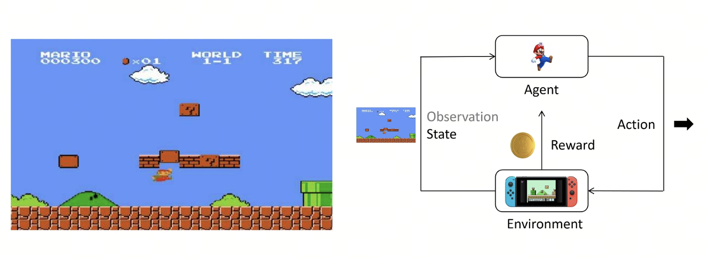
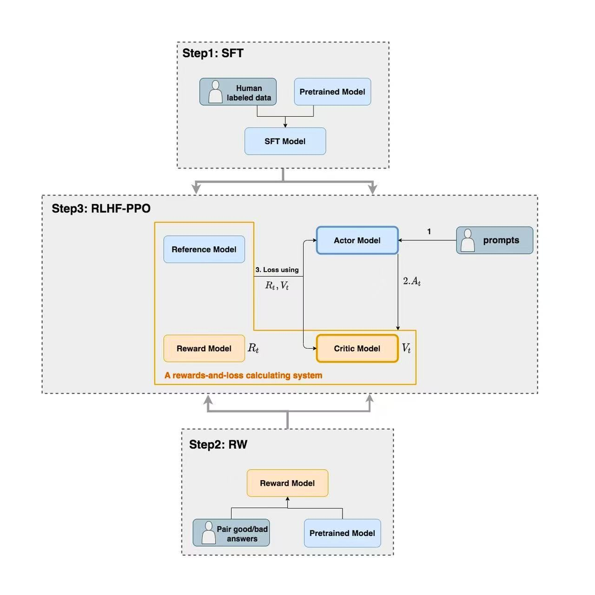
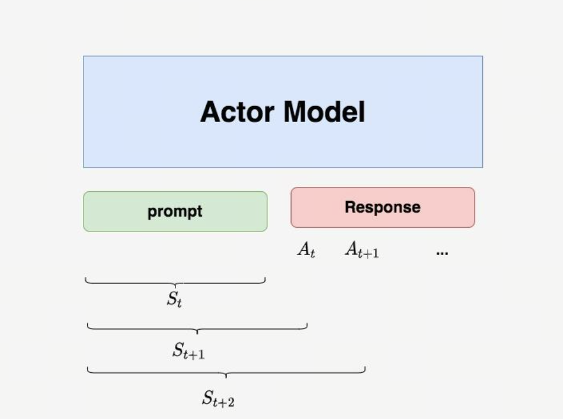
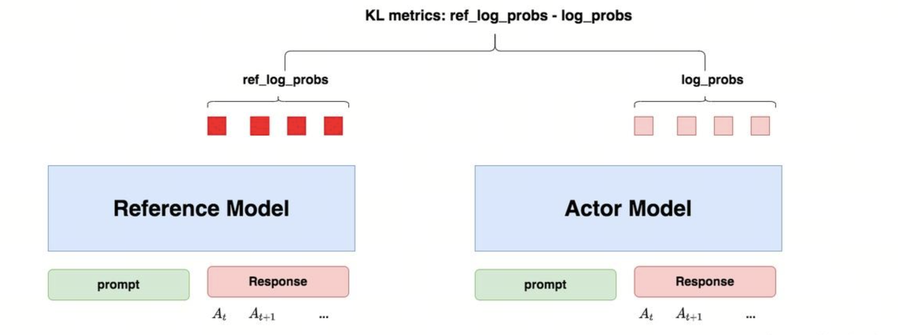
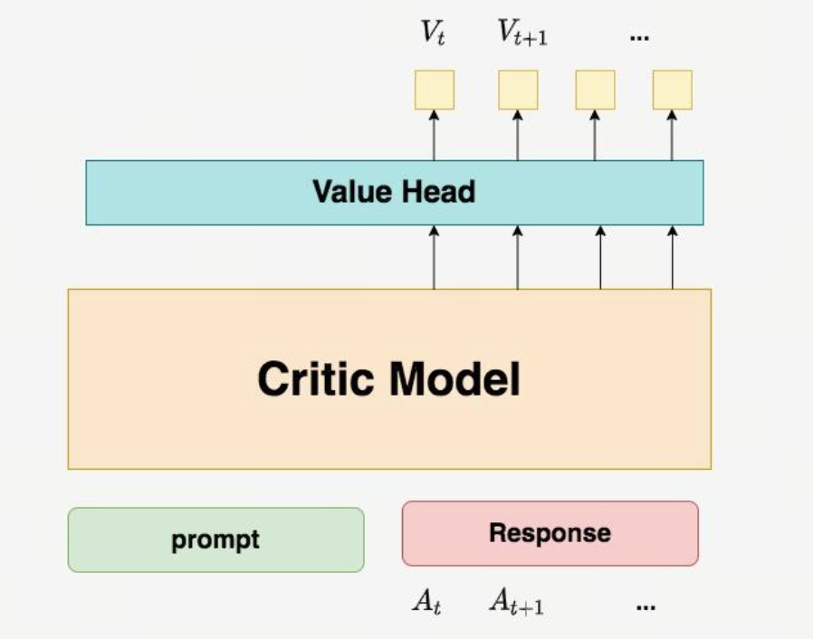
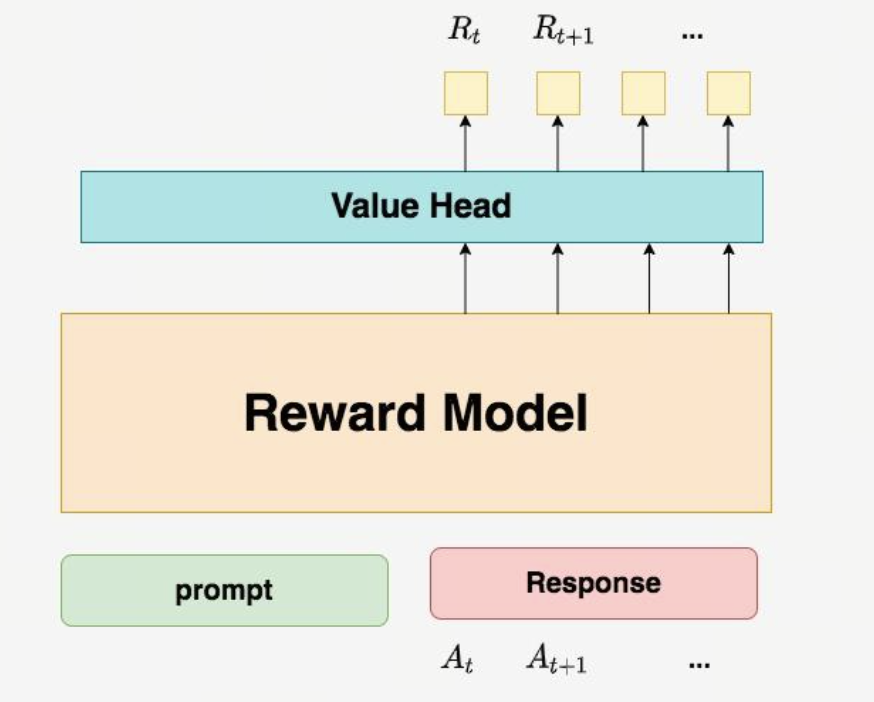
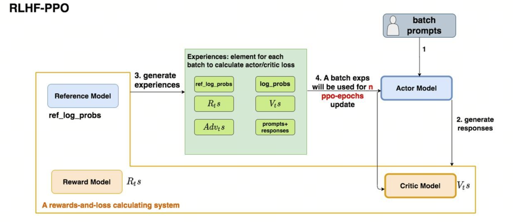

# 第15课时：对齐算法原理 (RLHF & GRPO)

## 第一部分：RLHF 基础：Reward Model (RM) 与 PPO (Proximal Policy Optimization)

### 1.1 PPO 定义与背景

**PPO（近端策略优化）** 是一种强化学习（Reinforcement Learning, RL）算法，由 OpenAI 于 2017 年提出。它属于 **策略梯度（Policy Gradient）** 方法的一种。在大模型的训练序列中（预训练 -> SFT -> 强化学习），PPO 扮演着将人类偏好注入模型的关键角色。

### 1.2 训练阶段详解

#### 1.2.1 预训练阶段 (Pre-training)
大语言模型通过在一个大型的通用数据集上通过无监督学习的方式进行预训练来学习语言的表征/初始化模型权重/学习概率分布。期望在预训练后模型能够处理大量、多种类的数据集，进而可以通过监督学习的方式来微调模型使其适应特定的任务。

#### 1.2.2 无监督学习（Unsupervised Learning）
主要研究如何让计算机在缺乏外部显式指导（即没有人工标注的标签或目标值）的情况下，通过对输入数据的统计分布、结构特征或内在联系进行建模，从而自动发现数据中隐藏的模式、结构或知识。

#### 1.2.3 监督学习（Supervised Learning）
利用一组已知类别的训练样本（即输入数据及其对应的标签）来训练模型，使其能够学习到输入与输出之间的映射关系。在监督学习中，每个训练实例都由一个输入对象（通常是向量）和一个期望的输出值（称为标签或目标）组成。

#### 1.2.4 监督微调（SFT，Supervised Fine-Tuning）
属于监督学习的范畴，是一种在预训练模型上使用小规模有标签数据集进行训练的方法。相比于预训练一个全新的模型，对已有的预训练模型进行监督微调是更快速更节省成本的途径。

#### 1.2.5 强化学习（RL）
研究智能体（Agent）如何在复杂、不确定的环境（Environment）中，通过"试错(Trial and Error) 的交互方式，学习一套最优的策略 (Policy)，以实现在长期交互过程中获得的累积奖励（Cumulative Reward）最大化。

### 1.3 强化学习核心要素

1. **智能体 (Agent)**：模型本身（比如多模态大模型）。

2. **环境 (Environment)**：外界指令、图片以及对话上下文。

3. **动作 (Action)**：模型生成的下一个 Token 或整句回复。

4. **状态 (State)**：当前对话进行到了哪一步，图片长什么样。

5. **奖励 (Reward)**：评价模型表现的分数（由 奖励模型 给出）。

用强化学习核心要素总结以下循环图： 马里奥（智能体）看到当前的屏幕画面（状态），决定向上跳跃（动作），这个动作作用于游戏世界（环境）后，顶到了砖块并获得了一枚金币（奖励），同时游戏画面更新到了下一帧(新状态）。

简单来说，结合强化学习的概念，PPO 的核心目的是：在训练智能体（Agent）时，既要让它不断学习变得更好，又要防止它步子迈得太大而“跌倒”（模型崩溃），实现奖励最大化 和 步长最小化。

### 1.4 为什么在 LLM 中如此重要？
在当代大语言模型训练中，强化学习主要应用于 RLHF (Reinforcement Learning from Human Feedback) 阶段：利用 PPO 等算法，根据奖励模型（Reward Model）提供的偏好分数，微调 SFT 后的模型，使其生成的回复在安全性、真实性和逻辑性上与人类价值观对齐。

即便 SFT 已经能让模型学会听懂指令并规范对答，PPO 阶段仍然不可或缺，主要原因如下：

A. 解决“模仿”的局限性（超越标注者）

SFT 本质上是让模型做“复读机”，学习人类给出的特定回答。但在很多复杂问题下，并没有唯一的标准答案。PPO 允许模型在广阔的可能回答空间中进行**探索（Exploration）**，通过奖励信号发现那些人类可能写不出来、但逻辑更优或更符合偏好的表述方式。

B. 更好的“对齐”人类价值观（Alignment）

人类对“好回答”的感知往往是综合的（例如：语气要诚恳、逻辑要严密、不能带有偏见）。

SFT 的局限：很难通过简单的“模仿”来教会模型这些微妙的偏好。

PPO 的优势：奖励模型可以捕捉人类复杂的偏好（如安全、诚实、有用），PPO 则利用这些打分作为导航，让模型在生成的过程中不断向这些价值观靠拢。

C. 抑制“幻觉”与提升诚实度

在 SFT 阶段，模型可能会为了模仿标注数据中的特定风格而编造事实。而在 PPO 阶段，如果奖励模型对“虚假信息”给予严厉的负分（负奖励），PPO 算法就会强制模型在遇到不确定的事实时选择说“我不知道”，从而有效减少幻觉。

## 第二部分：PPO 训练中的详细工作流程

PPO 训练可以分为三个主要阶段：生成与收集 (Rollout)、评估与打分、优化与更新。

在 PPO（Proximal Policy Optimization，近端策略优化）算法中，通常存在四个关键角色，分别是**Actor（Policy model)、Ref Model(Reference Model)、Reward Model、Critic(Value Model)**，将依次介绍各个角色在流程中发挥的作用。

### 2.1 PPO/RLHF 流程中的四个模型协作图

这张流程图展示了大语言模型（LLM）训练中经典的**强化学习人类反馈（RLHF）**三阶段过程，主要参考了 OpenAI 在 InstructGPT 中使用的经典范式。

以下是针对图中三个核心步骤的详细解释：

#### 2.1.1 Step 1: SFT (Supervised Fine-Tuning, 有监督微调)

这是训练的起点，旨在让预训练模型学会遵循人类指令。

* **输入**：预训练模型（Pretrained Model）和人工标注的数据（Human labeled data，通常是"指令-回答"对）。

* **过程**：在高质量的人工示范数据上进行微调。

* **输出**：得到 **SFT 模型**，它初步具备了对话和执行任务的能力。

#### 2.1.2 Step 2: RW (Reward Modeling, 奖励模型训练)

这一阶段是为了构建一个"打分器"，用来模拟人类的偏好。

* **输入**：SFT 后的模型生成的多个答案，由人类对这些答案进行排序或标注（Pair good/bad answers）。

* **过程**：利用这些偏好数据训练一个**奖励模型（Reward Model）**。

* **输出**：奖励模型能够对任何给定的回答输出一个标量分数（Reward），分数越高代表回答越符合人类偏好。

#### 2.1.3 Step 3: RLHF-PPO (Reinforcement Learning from Human Feedback)

这是最复杂的阶段，利用近端策略优化（PPO）算法进一步对齐模型。图中展示了四个子模型之间的协作：

* **Actor Model（演员模型）**：即正在优化的模型。它接收 Prompt（提示词），产生动作 $A_t$（即生成的文本）。

* **Reference Model（参考模型）**：通常是一个冻结参数的 SFT 模型，用于计算 KL 散度，防止 Actor 模型在强化学习过程中为了刷分而变得"面目全非"。

* **Reward Model（奖励模型）**：计算生成的回答在人类偏好下的得分 $R_t$。

* **Critic Model（评论家模型）**：预测当前状态的价值 $V_t$（期待的总奖励），帮助模型更稳定地学习。

**核心逻辑循环：**

1. **Prompts (1)** 输入到 Actor。

2. **Actor 生成回答 (2)**。

3. **系统计算 Loss (3)**：综合奖励信号 $R_t$ 和价值预测 $V_t$。通过计算出的损失函数来更新 Actor 和 Critic 模型的参数，使模型最终能够生成既符合逻辑又满足人类偏好的高质量内容。

### 2.2 阶段一：生成与收集 (Rollout)

🎯 目标：让 Policy Model 与环境互动，收集一批数据。

| 模型 | 角色 | 输入 | 输出 | 关键操作 |
| :--- | :--- | :--- | :--- | :--- |
| **Actor Model** (Policy Model) | **生成者** | Prompt (提示词) | Response (生成的回复文本) | 使用当前策略 $\pi_{\theta}$ 生成回复。参数在训练中**持续更新**，旨在最大化奖励。 |
| **Reference Model** | **锚定者** | Prompt + Response | Log Probabilities (原始对数概率) | **参数冻结**。通过计算 KL 散度约束 Actor，防止模型坍缩或过度拟合奖励模型（Reward Hacking）。 |
| **Reward Model** | **打分者** | Prompt + Response | Reward Score (奖励分) | **参数冻结**。模拟人类偏好，为生成的文本质量提供量化的反馈信号。 |
| **Critic Model** | **评估者** | Prompt + Response | State Value (状态价值 $V$) | **参数更新**。学习预测当前回复的预期收益，用于计算优势函数（Advantage）以降低方差。 |

结果： 收集到三元组：

$$ (Prompt, Response, \text{Response Log Probs from Reference Model}) $$

 

PPO生成阶段的KL约束机制 - Actor模型生成回复，Reference模型计算基准概率，两者对比产生KL惩罚，防止模型过度偏离原分布。

Rollout数据收集结果 - 展示三元组(Prompt, Response, Reference Log Probs)，为Reward Model和Critic Model的后续评估提供基础数据。

#### 2.2.1 概念解析

**什么是 Actor（行动者）？**

在标准的强化学习框架中，Actor 是负责做出决策的实体。它观察当前的环境状态 $s$，然后根据某种概率选择一个动作 $a$。

在大模型 PPO 中：Actor 就是你正在微调的那个**语言模型（LLM）**。

* 输入（状态）：用户给出的提示词（Prompt）。

* 动作（Action）：模型生成的下一个 Token（词片段）。

* 目标：Actor 的任务是学会生成那些能够获得高奖励（即人类更喜欢、更准确）的回复。

**什么是策略（Policy）？**

策略（通常用 $\pi$ 表示）是 Actor 内部的“决策逻辑”或“说明书”。它定义了在特定状态下选择某个动作的概率分布。

公式表达：$$ \pi(a|s) $$

即在状态 $s$ 下采取动作 $a$ 的概率。

在 LLM 中的体现：

1. 模型在生成文本时，会对词表中的每个词计算一个概率（Softmax 后的结果）。

2. 这个全词表的概率分布就是当前的策略。

3. 训练的目的：通过 PPO 算法不断调整模型的权重，使得“好词”的出现概率变大，“坏词”或“幻觉词”的出现概率变小。

**什么是 KL 散度？**

简单来说，KL 散度（Kullback-Leibler Divergence） 是衡量两个概率分布 $P$ 和 $Q$ 之间“差异程度”的一个指标。

在机器学习和强化学习中，我们通常用 $P$ 代表真实分布（或目标分布），用 $Q$ 代表模型预测的分布。KL 散度告诉我们：
如果我们用分布 $Q$ 来近似分布 $P$，会损失多少信息？

**数学定义：**

对于离散变量，从 $Q$ 到 $P$ 的 KL 散度定义为：

$$ D_{KL}(P \parallel Q) = \sum_{x \in X} P(x) \log \left( \frac{P(x)}{Q(x)} \right) $$

通过对数换算，它可以拆解为：

$$ D_{KL}(P \parallel Q) = \sum P(x) \log P(x) - \sum P(x) \log Q(x) $$

即：$$ D_{KL}(P \parallel Q) = \sum P(x) \log P(x) - \sum P(x) \log Q(x) $$

关键特性：不对称性

>$$ D_{KL}(P \parallel Q) \neq D_{KL}(Q \parallel P) $$

这就是为什么它被称为“散度”而不是“距离”。在训练模型时，参照物是谁非常重要。

**两个模型的关系**

* **Actor (Policy Model)**：它是我们的最终目标模型。在训练过程中，它的参数会随着优化器不断更新。它变得越来越会"讨好"奖励模型（Reward Model）。

* **Ref Model**：它是基座模型的一个备份，参数是完全冻结的。

如果只有 Actor 和 Reward Model，Actor 很快就会发现一些"捷径"。比如，如果奖励模型喜欢长句子，Actor 可能会学会一直重复无意义的词来拉长篇幅（这叫 Reward Hacking）。Ref Model 的存在是为了计算 KL 散度：它要求 Actor 在追求高分的同时，生成的概率分布不能偏离 Ref Model 太远。这保证了模型在变聪明的同时，仍然保持着人类语言的基本逻辑。

**概率对齐（Logits 计算）**

当 Actor 生成完一段话后，为了后续的训练，我们需要知道：

1. Actor Logits：针对刚刚生成的这段话，Actor 自己认为每个 Token 出现的概率是多少？

2. Ref Logits：针对同一段话，那个“没被训练过”的 Ref Model 认为每个 Token 出现的概率应该是多少？
公式化表达：

这一步会产生一个 KL 惩罚项：

如果 Actor 给某个词的概率远高于 Ref Model，这个惩罚值就会变大，抵消掉一部分奖励。

### 2.3 阶段二：评估与打分

🎯 目标：用 Reward Model 和 Value Model 给生成的数据打分。

 

Reward Model评估机制 - RM作为最终裁判，对完整Prompt+Response序列输出标量分数，代表人类偏好程度。

 

Critic Model预测机制 - VM作为实时评论员，预测当前状态的预期总收益，用于降低训练方差和计算优势函数。

#### 2.3.1 核心概念与角色定义

在 PPO 训练中，我们需要两个评分模型，它们分别代表"现实的反馈"和"预期的判断"。

**Reward Model (RM)**

* **性质**：通常是一个基于 BERT 或 Llama 的分类/回归模型，**参数冻结**（不参与训练）。

* **输入**：完整的 Prompt + Response 序列。

* **输出**：一个标量分数。

* **作用**：提供 Ground Truth（基准事实），告诉系统这条生成结果最终符合人类偏好的程度。

**Value Model (VM / Critic) —— 实时评论员**

* **性质**：与 Actor 共享大部分参数（或独立网络），**参数动态更新**。

* **输入**：当前的 Token 序列状态 $s_t$。

* **输出**：一个标量预测值 $V(s_t)$。

* **作用**：预测从当前状态 $s_t$ 开始，一直写到结束，预期能获得多少总收益。它是用来降低训练方差的关键工具。

#### 2.3.2 奖励流的构建 (The Reward Function)

在计算优势之前，我们必须定义每一步的“即时奖励” $r_t$。在 RLHF 中，即时奖励由 KL 散度惩罚 和 RM 最终打分 共同构成。

假设序列长度为 $T$，对于时间步 $t$：

$$ r_t = \begin{cases} 
-\beta \log\left(\frac{\pi_{\theta}(a_t|s_t)}{\pi_{\text{ref}}(a_t|s_t)}\right) & \text{if } t < T \\ 
R_{\text{score}} - \beta \log\left(\frac{\pi_{\theta}(a_t|s_t)}{\pi_{\text{ref}}(a_t|s_t)}\right) & \text{if } t = T 
\end{cases} $$

核心变量：

- $r_t$：即时奖励（Reward），表示在时间步 $t$ 获得的奖励值，用于后续计算优势函数

模型相关：

- $\pi_{\theta}(a_t|s_t)$：Actor模型（策略模型）在状态 $s_t$ 下选择动作 $a_t$ 的概率，由当前参数 $\theta$ 决定

- $\pi_{\text{ref}}(a_t|s_t)$：Reference模型（基准模型）在相同状态下选择相同动作的概率，参数冻结不变

状态与动作：

- $s_t$：时间步 $t$ 的状态，表示当前生成的token序列

- $a_t$：时间步 $t$ 的动作，表示在该步选择的token

控制参数：

- $\beta$：KL散度惩罚系数，控制Actor模型偏离Reference模型的惩罚强度

- $T$：序列总长度，最后一个时间步的索引

奖励得分：

- $R_{\text{score}}$：Reward Model（奖励模型）对完整序列输出的最终得分，只在序列结束时（$t = T$）出现

#### 2.3.3 三种价值估计算法的融合
有了 $r_t$ 序列后，我们如何计算每个动作的 优势 (Advantage,$\hat{A}_t$ )？优势的定义是：“实际采取的动作比平均预期好多少？”

这里融合了三种核心思想：

1.**时序差分 (Temporal Difference, TD) —— 只看眼前**

**TD 误差 ($\delta_t$)** 衡量了“当前的惊喜”。它利用 Value Model 对下一步的预测来修正当前的预测。

$$ \delta_t = \underbrace{r_t + \gamma V(s_{t+1})}_{\text{TD Target (修正后的现实)}} - \underbrace{V(s_t)}_{\text{当前的预期}} $$

- $\gamma$：折扣因子，表示**“远见程度”**。

- $\gamma \to 0$：模型只在乎当前的 KL 惩罚，不看最后得分。

- $\gamma \to 1$：模型极度重视最终的 RM 得分。

- 如果 $\delta_t > 0$：说明当前动作带来的即时奖励或未来潜力比 VM 预期的要好。

2.**蒙特卡洛估计 (Monte Carlo, MC) —— 只看结果**

MC 方法不依赖 VM 的预测，而是等到 episode 结束，把后面所有的真实奖励加起来。

$$ G_t = r_t + \gamma r_{t+1} + \gamma^2 r_{t+2} + \dots + \gamma^{T-t} r_T $$

$G_t$ 是从当前时刻一直加到结束的总回报

* 优点：无偏差（Unbiased），因为是真实发生的。

* 缺点：高方差（High Variance），生成过程随机性太强，导致训练不稳定。因为采样的随机性，有的结局好，有的结局坏。在 MC 看来这种巨大的波动会让模型训练非常不稳定，梯度的方向忽左忽右。

3.**广义优势估计 (Generalized Advantage Estimation，GAE) —— 中庸之道**

GAE 是 PPO 的核心。它通过一个参数 $\lambda$ 对 TD Error 进行指数加权平均，从而在 TD（稳定但有偏差）和 MC（真实但不稳定）之间找到平衡点。

公式如下：

$$ \hat{A}_t^{GAE} = \sum_{l=0}^{\infty} (\gamma \lambda)^l \delta_{t+l} $$

展开来看：

$$ \hat{A}_t^{GAE} = \delta_t + (\gamma \lambda)\delta_{t+1} + (\gamma \lambda)^2\delta_{t+2} + \dots $$

递归形式：

$$ \hat{A}_t^{GAE} = \delta_t + (\gamma \lambda) \hat{A}_{t+1}^{GAE} $$

* $\lambda$：GAE系数，“方差-偏差权衡”。

* $\lambda \to 0$：退化为 TD，只看一步预测，方差小，偏差大（太信赖 VM）。

* $\lambda \to 1$：退化为 MC，看所有后续奖励，无偏差，方差大（训练难收敛）。

#### 2.3.4 完整的打分与计算流程

**第一步：Rollout 与 基础数据获取**

Actor 生成完整个序列后，我们得到：

* Tokens: $s_0, s_1, \dots, s_T$

* Logits: Actor 和 Ref Model 的概率。

* Values: VM 对每一步的预测 $V(s_0), \dots, V(s_T)$。

**第二步：计算即时奖励 $r_t$**

利用 Logits 计算 KL 散度，并在最后一步加上 RM 分数。得到序列：$r_0, r_1, \dots, r_T$。

**第三步：计算 TD Error $\delta_t$**

遍历每一步，计算“惊喜值”：

$$ \delta_t = r_t + \gamma V(s_{t+1}) - V(s_t) $$

>(注：最后一步 $V(s_{T+1}) = 0$)

**第四步：递归计算 GAE**

为了高效计算，通常使用从后往前（Backward Pass）的递归公式：

$$ \hat{A}_t = \delta_t + (\gamma \lambda) \cdot \hat{A}_{t+1} $$

这是 PPO 用于更新 Actor 的最终梯度依据。

**第五步：计算 Critic 的目标值 (Returns)**

Value Model 也需要训练，它的目标是预测得更准。它的拟合目标（Target）通常是：
$$ \text{Returns}_t = \hat{A}_t + V(s_t) $$

#### 2.3.5 参数字典与物理意义
| 符号 | 参数名称 | 典型值 | 物理意义与调节影响 |
| :--- | :--- | :--- | :--- |
| $\gamma$ | 折扣因子 (Gamma) | 0.99 - 1.0 | “远见程度”。 较小值：模型只在乎当前的 KL 惩罚，不看最后得分。 较大值：模型极度重视最终的 RM 得分。 |
| $\lambda$ | GAE 系数 (Lambda) | 0.95 | “方差-偏差权衡”。 $\lambda=0$：退化为 TD。只看一步预测，方差小，偏差大（太信赖 VM）。 $\lambda=1$：退化为 MC。看所有后续奖励，无偏差，方差大（训练难收敛）。 |
| $\beta$ | KL 系数 (Beta) | 0.01 - 0.1 | “约束力度”。 值太大：模型不敢改动，训练无效。 值太小：模型为了高分会“崩坏”（输出乱码或欺骗 RM）。 |
| $V(s)$ | 状态价值 | - | “心理预期”。代表模型认为自己当前处于多有利的局面。 |
| $\delta$ | TD 误差 | - | “现实修正”。代表这一步动作让局势变好了多少（相对于预期）。 |

#### 2.3.6 总结：RM 与 VM 的区别图谱
| 维度 | Reward Model (RM) | Value Model (VM) |
| :--- | :--- | :--- |
| **核心逻辑** | 基于结果 (Outcome-based) | 基于预期 (Prediction-based) |
| **打分频率** | 每条数据 1 次 (Sparse) | 每个 Token 1 次 (Dense) |
| **信息来源** | 人类偏好数据 (训练前定死) | 自身策略的历史表现 (训练中自适应) |
| **在公式中的位置** | 构成 $r_T$ (奖励源头) | 构成 $\delta$ 和 $A_t$ (基线 Baseline) |
| **如果没有它** | 模型不知道什么是“好” | 训练方差太大，无法收敛，或者只能用简单的 MC 方法 |

### 2.4 在大模型 PPO 中的 AC 架构

#### 2.4.1 AC 架构（Actor-Critic Architecture，演员-评论家架构） 

是强化学习 RL 中目前最流行、最强大的架构模式之一。包括 PPO在内的许多现代 RL 算法，本质上都是基于 AC 架构的。

在 LLM 的 PPO 训练中，AC 架构的具体形态通常如下：

__结构：Hydra（九头蛇）模式__

由于 Actor（语言模型）和 Critic（价值评估）都需要理解文本语义，通常不会训练两个完全独立的巨大网络。

* 共享主干（Shared Backbone）：Qwen/Llama 的 Transformer 主体部分。
    
* Actor Head：原本的 lm_head（线性层），输出维度 = 词表大小（几万到十几万），用于生成。

* Critic Head (Value Head)：新增的一个线性层，输出维度 = 1，用于打分。

__交互流程__：

1. Actor 看到 Prompt，生成回答。
2. Critic 看着 Actor 生成的每一个词，预测：“目前的走势，最后大概能得 80 分。”
3. 环境 给出真实反馈（比如到了某个词，违反了规则，扣分）。
4. 计算优势（Advantage）：
        如果 A > 0：说明 Actor 表现得比 Critic 预期的好（惊喜）-> Actor 强化这个动作。
        如果 A < 0：说明 Actor 表现得比 Critic 预期的差（失望）-> Actor 抑制这个动作。
5. Critic 自我反思：根据真实结果修正自己的预测能力，争取下次猜得更准。

### 2.5 阶段三：优化与更新（Optimization）

#### 2.5.1 目标：使用 PPO 算法，根据分数调整 Policy Model。

 

在 PPO 的更新阶段，我们实际上是在计算一个总损失（Total Loss），然后通过反向传播（Backpropagation）来同时更新 Actor 和 Critic 的参数。为了便于理解，我们通常采用最小化损失的视角。

#### 2.5.2 PPO 总损失公式 (The Grand Formula)

$$ L^{Total} = \underbrace{L^{CLIP}(\theta)}_{\text{1. 策略损失 (Actor)}} + \\ c_1 \cdot \underbrace{L^{VF}(\theta)}_{\text{2. 价值损失 (Critic)}} - \ c_2 \cdot \underbrace{S[\pi_\theta](s)}_{\text{3. 熵奖励 (Entropy)}} $$

或者写作更直观的中文逻辑：

$$ 总损失 = \text{策略梯度损失 (带截断)} + \text{价值预测误差 (MSE)} - \text{探索奖励 (熵)} $$

>注意：在 RLHF 中，还有一种隐形的“第四部分”叫 KL 惩罚，但它通常已经直接扣除在奖励 $r_t$ 里了（即影响了优势函数 $A_t$ 的计算），所以不直接出现在这个梯度更新公式中。

#### 2.5.3 策略损失 (Actor Loss) —— PPO 的灵魂

这是 PPO 被称为 "Proximal"（近端）的原因。它的目标是：__让好的动作概率变大，坏的动作概率变小，但不要改得太猛__。

公式如下：

$$ L^{CLIP}(\theta) = - \mathbb{E}_t \left[ \min \left( r_t(\theta) \hat{A}_t, \\ \text{clip}(r_t(\theta), 1-\epsilon, 1+\epsilon) \hat{A}_t \right) \right] $$

让我们分情况理解这个目标函数：

__情况1：优势 $\hat{A}_t > 0$（好的动作）__

* 如果 (	heta) < 1+\epsilon$：正常增加该动作概率

* 如果 (	heta) \ge 1+\epsilon$：剪裁到 +\epsilon$，防止过度增加

__情况2：优势 $\hat{A}_t < 0$（坏的动作）__

* 如果 (	heta) > 1-\epsilon$：正常减少该动作概率

* 如果 (	heta) \le 1-\epsilon$：剪裁到 -\epsilon$，防止过度减少

| 参数符号 | 名称 | 含义 | 作用 |
| :--- | :--- | :--- | :--- |
| $\theta$ | 策略参数 | 当前正在训练的策略模型（Policy Model，Actor）的权重参数。 | 我们的目标是通过最大化 $J(\theta)$ 来优化这些参数。 |
| $\hat{\mathbb{E}}_t$ | 经验均值 | 表示对时间步 $t$ 的经验样本取平均值。 | 在 PPO 中，这通常是对 Rollout 阶段收集到的所有 Mini-Batch 样本取平均。 |
| $r_t(\theta)$ | 概率比率 (Ratio) | 新策略 $\pi_{\theta}$ 和旧策略 $\pi_{\theta_{old}}$ 之间的概率比值。 | $r_t(\theta) = \frac{\pi_{\theta}(a_t \vert s_t)}{\pi_{\theta_{old}}(a_t \vert s_t)}$ |
| $\hat{A}_t$ | 优势函数 (Advantage) | 在状态 $s_t$ 下采取行动 $a_t$ 的相对好坏程度。 | $\hat{A}_t = Q(s_t, a_t) - V(s_t)$。正值表示该行动比预期好，负值表示比预期差。 |
| $\epsilon$ | 截断超参数 (Clip) | 一个小的正值（例如 $0.1$ 或 $0.2$），用于定义策略更新的“安全区间”。 | 它定义了 $r_t(\theta)$ 允许的范围 $[1-\epsilon, 1+\epsilon]$。 |
| $\text{clip}(\dots)$ | 截断函数 | 这是一个数学函数，将 $r_t(\theta)$ 限制在 $[1-\epsilon, 1+\epsilon]$ 的范围内。 | 如果 $r_t(\theta)$ 超出这个范围，它将被强制拉回到边界值。 |
| $\min(\dots)$ | 取最小值 | PPO 截断机制的核心操作。 | 它在“原始目标”和“截断目标”之间取较小值。 |

#### 2.5.4 价值损失 (Value Loss) —— 让 Critic 更准

Actor 在努力拿高分，而 Critic (Value Model) 的任务是精准预测局面。Critic 越准，算出来的优势函数$\hat{A}_t$  就越准，Actor 学得就越稳。

这通常是一个简单的均方误差 (MSE)：

$$ L^{VF}(\theta) = \mathbb{E}_t \left[ (V_\phi(s_t) - V_t^{\text{target}})^2 \right] $$

* $V_\phi(s_t)$ ：Value Model 当前的预测值。

* $V_t^{\text{target}}$：真实的回报目标（通常是 GAE 计算后的 ）。

* $c_1$：价值损失系数（通常是 0.5 或 1.0），平衡它和策略损失的比重。

在 PPO 的损失函数计算过程中，Value 模型（Critic）的评分结果实际上会被计算 __两次__，但这两次发生在不同的阶段，且扮演着完全不同的角色。

为了理解这两次计算，我们需要区分 __数据采集（Rollout）__ 阶段和 __参数更新（Optimization）__ 阶段。

   * 在计算 $L^{CLIP}$ 时：使用的是第一次计算得到的 (s_t)$（通过 $\hat{A}_t$ 间接引入），它是固定的背景板。这一次计算的结果会通过 GAE 算法转化为 $V_t^{target}$（目标价值）和 $\hat{A}_t$（优势）。在随后的反向传播中，这些值被视为 常数（detach），不产生梯度。

   * 在计算 $L^{VF}$ 时：使用的是第二次计算得到的 \phi(s_t)$，$V_\phi(s_t)$ 是带有梯度的，它是被优化的对象。

#### 2.5.5 熵奖励 (Entropy Bonus) —— 鼓励探索

这是公式中的“惩罚项”，但在 loss 中用减号表示，所以实际上是奖励。

$$ S[\pi_\theta](s) = - \sum \pi(a|s) \log \pi(a|s) $$

__什么是熵 (Entropy)？__：衡量概率分布的“混乱程度”或“不确定性”。

- 如果模型对某个动作 100% 确定，熵 = 0。

- 如果模型在几个动作之间犹豫不决（均匀分布），熵最大。

__为什么要减去熵？（即最大化熵）__：在训练初期，我们不希望 Actor 过早地“迷信”某一个动作（过早收敛到局部最优）。通过在 Loss 里加入这一项，我们强迫模型保持一定的“随机性”和“好奇心”，去尝试那些它没试过的词。

$c_2$：熵系数（通常很小，如 0.01），随着训练进行通常会衰减。

__计算 KL 散度惩罚__:比较 Policy Model 生成的 Log Probabilities 和 Reference Model 生成的 Log Probabilities。如果差异太大，PPO 会给最终奖励 $r$ 施加一个惩罚项，确保模型在学习新策略时不会发散（防止跑偏）。

PPO 优化:最终，PPO 使用包含 截断（Clipping） 机制和 KL 惩罚 的目标函数，通过梯度下降同时更新：

- Policy Model (Actor) 的参数（使其生成更高奖励的回复）。

- Value Model (Critic) 的参数（使其能更准确地预测状态价值）。
这个三阶段循环不断重复，直到 Policy Model 的回复在满足人类偏好的同时，还能保持其基础的语言能力。

## 第三部分：直接偏好优化：DPO (Direct Preference Optimization), IPO, KTO 原理对比

随着大语言模型对齐技术的演进，传统的 PPO 流程因其训练复杂性和高资源消耗（需要维护 Actor、Critic、Ref、Reward 四个模型）而备受挑战。学术界开始探索更轻量、更稳定的替代方案，其中 DPO (Direct Preference Optimization) 及其变体 IPO 和 KTO 成为了当前最主流的研究方向。

本部分将深入剖析这三种算法的核心数学原理，对比它们的异同与适用场景。

### 3.1 DPO (Direct Preference Optimization)：化繁为简的里程碑

**DPO (直接偏好优化)** 由 Stanford 研究团队于 2023 年提出，其核心思想是跳过显式的奖励模型（Reward Model）训练，直接利用偏好数据对策略模型进行优化。

#### 核心数学原理：从 RL 到分类问题

在 RLHF 中，我们通常假设人类偏好服从 **Bradley-Terry (BT) 模型**。对于给定的输入 $x$ 和两个回答 $y_w$（Chosen，胜者）与 $y_l$（Rejected，败者），人类偏好分布 $p^*$ 可以表示为：

$$ p^*(y_w \succ y_l | x) = \frac{\exp(r^*(x, y_w))}{\exp(r^*(x, y_w)) + \exp(r^*(x, y_l))} $$

其中 $r^*(x, y)$ 是隐含的真实奖励函数。

DPO 的推导基于 RL 的最优策略公式。对于带有 KL 散度约束的奖励最大化问题，其最优策略 $\pi^*$ 与最优奖励函数 $r^*$ 存在如下解析关系：

$$ r^*(x, y) = \beta \log \frac{\pi^*(y|x)}{\pi_{\text{ref}}(y|x)} + Z(x) $$

* $\beta$：KL 惩罚系数，控制偏离参考模型的程度。

* $Z(x)$：仅与输入 $x$ 有关的配分函数（Partition Function）。

将这个关系代入 BT 模型公式，消去难算的 $Z(x)$，我们可以直接得到仅包含策略模型 $\pi_{\theta}$ 和参考模型 $\pi_{\text{ref}}$ 的目标函数：

$$ L_{\text{DPO}}(\pi_{\theta}; \pi_{\text{ref}}) = - \mathbb{E}_{(x, y_w, y_l) \sim D} \left[ \log \sigma \left( \beta \log \frac{\pi_{\theta}(y_w|x)}{\pi_{\text{ref}}(y_w|x)} - \beta \log \frac{\pi_{\theta}(y_l|x)}{\pi_{\text{ref}}(y_l|x)} \right) \right] $$

$L_{DPO}$:

- DPO 算法的损失函数值。

- 最小化该损失会增大胜出回答与失败回答之间的隐式奖励差距。

$π_θ ()$:

- 当前正在训练的目标策略模型。

- 目标是学习一个参数 $θ$，使得模型输出更符合人类偏好的 $y_w$。

$π_{ref} ()$:

- 预训练好的参考模型（通常是经过 SFT 的模型）。

- 参数在训练期间保持冻结，作为正则化的基准，防止模型产生灾难性遗忘或模式崩坏。

$(x, y_w, y_l) \sim D$:

- 数据集中的偏好对。$x$ 为输入提示词，$y_w$ 为胜出回答，$y_l$ 为失败回答。

$β (beta)$:

- 调节参数（超参数）。

- 控制对参考模型 $π_{ref}$ 偏离程度的惩罚力度。$β$ 越大，对偏离的惩罚越重，模型越保守。

$log(π_θ(y|x) / π_{ref}(y|x))$:

- 隐式奖励（Implicit Reward）。

- DPO 的核心思想：某回答的奖励与其在当前模型与参考模型间的对数概率比值成正比。

$σ (sigma)$:

- Sigmoid 激活函数。

- 将两个回答的隐式奖励差值映射到 (0, 1) 区间，将其转化为一个二分类概率问题。

$E [ log σ (...) ]$:

- 负对数似然损失。

- 通过最大化胜出项相对于失败项的优势，来优化策略。

#### DPO 的直观理解
这个公式看起来复杂，但其梯度更新的物理意义非常直观：

1.  **增加胜者概率**：如果 $\pi_{\theta}$ 对 $y_w$ 的预测概率（相对于 $\pi_{\text{ref}}$）较高，损失减小。

2.  **降低败者概率**：如果 $\pi_{\theta}$ 对 $y_l$ 的预测概率（相对于 $\pi_{\text{ref}}$）较高，损失增大。

3.  **隐式奖励**：DPO 本质上是将“奖励建模”和“策略优化”合二为一，直接通过最大似然估计来求解最优策略，从而避免了 PPO 中 Actor 和 Critic 相互拉扯的不稳定性。

#### 优缺点总结

* **优点**：

    * **极简架构**：不需要训练独立的 Reward Model，甚至不需要 Critic Model，显存占用减半。

    * **训练稳定**：本质上是一个分类任务（Cross-Entropy Loss 的变体），避免了 RL 中的高方差和超参数敏感问题。

* **缺点**：

    * **泛化性争议**：有研究指出，DPO 在分布外（OOD）数据上的泛化能力可能不如 PPO。

### 3.2 IPO (Identity Preference Optimization)：解决 DPO 的过拟合

**IPO (身份偏好优化)** 是由 Google DeepMind 提出的，旨在解决 DPO 在某些情况下容易过拟合的问题。

#### 核心数学原理：正则化的回归

DPO 的目标函数中包含 Sigmoid 函数（$\sigma$），这使得它本质上是一个分类损失。当模型对偏好数据的预测非常确信时（概率趋近于 0 或 1），梯度会消失，导致模型停止学习或对训练数据过拟合。

IPO 摒弃了 BT 模型的假设，直接通过均方误差（MSE）来约束偏好差距：

$$ L_{\text{IPO}}(\pi_{\theta}; \pi_{\text{ref}}) = \mathbb{E}_{(x, y_w, y_l) \sim D} \left[ \left( \log \frac{\pi_{\theta}(y_w|x)}{\pi_{\text{ref}}(y_w|x)} - \log \frac{\pi_{\theta}(y_l|x)}{\pi_{\text{ref}}(y_l|x)} - \frac{\tau}{2} \right)^2 \right] $$

$L_{IPO}$:

- IPO 算法的损失函数值。

- 目标是最小化这个平方误差，使模型偏好与人类偏好对齐，同时保持输出概率的正则化。

$π_θ ()$:

- 当前正在训练的目标模型（Policy Model）。

- 我们希望通过优化 θ，让模型更倾向于生成 $y_w$ 而非 $y_l$。

$π_{ref} ()$:

- 基准模型（Reference Model）。通常是 SFT（有监督微调）后的模型，且在训练过程中参数冻结。

- 作用是作为锚点，防止训练后的模型偏离原始分布太远。

$(x, y_w, y_l) \sim D$:

- 数据集 D 中的一个三元组样本。

- $x$: 输入的 Prompt（提示词）。

- $y_w$ (winner): 比较中胜出的回答（Chosen/Preferred）。

- $y_l$ (loser): 比较中失败的回答（Rejected）。

$log(π_θ(y|x) / π_{ref}(y|x))$:

- 对数比例。

- 衡量目标模型相对于基准模型在某个回答上的概率增长。

- 这一项实际上就是 DPO 中定义的隐式奖励（Implicit Reward）。

$τ/2$,是预设的奖励差值目标值:

- 超参数（控制正则化的强度）。

- 类似于 DPO 中的 beta，但在 IPO 中它直接定义了两个回答之间奖励差值的目标。

* **物理意义**：IPO 并不追求让 $y_w$ 的概率无限大、让 $y_l$ 的概率无限小。相反，它设定了一个固定的目标差距 $\tau/2$。只要 $y_w$ 和 $y_l$ 之间的对数概率差达到了这个阈值，模型就认为“足够好了”，不再继续激进地优化。

#### 优缺点总结

* **优点**：更强的正则化效果，防止模型为了迎合偏好数据而彻底遗忘预训练知识，从而避免过拟合。

* **缺点**：在某些简单任务上，收敛速度可能不如 DPO 快。

### 3.3 KTO (Kahneman-Tversky Optimization)：非成对数据的福音

**KTO (Kahneman-Tversky 优化)** 由 Contextual AI 提出，其灵感来源于行为经济学中的 **前景理论 (Prospect Theory)**。

#### 核心痛点与解决方案

DPO 和 IPO 都依赖 **成对数据 (Pairwise Data)**，即必须有 $(x, y_w, y_l)$。然而，在实际应用中，收集这种“好坏对比”数据非常昂贵。很多时候，我们只有 **点状数据 (Pointwise Data)**：即“这个回答是好的” (Thumbs Up) 或“这个回答是坏的” (Thumbs Down)，而没有直接的对比项。

KTO 的设计初衷就是直接利用这些非成对的 $(x, y, \text{label})$ 数据进行训练。

#### 核心数学原理

KTO 将损失函数定义为两部分，分别处理“好数据”和“坏数据”：

$$ L_{\text{KTO}} = \mathbb{E}_{(x, y) \sim D} \left[ w(y) \cdot \text{Loss}_{\text{KTO}}(x, y) \right] $$

$L_{KTO}$:

- KTO 算法的总体损失值。

- 该算法基于前景理论（Prospect Theory），模拟人类对“获得”与“损失”的不对称感知。

$(x, y) \sim D$:

- 数据集中的单个样本。

- x: 输入的 Prompt（提示词）。

- y: 模型的回答。注意：这里不需要 y_w 和 y_l 成对出现。

$w(y)$:

- 权重函数。

- 根据回答的标签（Desirable / Undesirable）分配不同的权重，以平衡正负样本对梯度的贡献。

$Loss_{KTO}(x, y)$，核心损失项。其内部通常包含：

- 隐式奖励计算：$r(x, y) = β · log(π_θ(y|x) / π_{ref}(y|x))$
- 价值函数变换：通过一个非线性函数（类似 Sigmoid）处理奖励值与参考点（KLD）的差。

具体损失形式利用了前景理论中的**损失厌恶 (Loss Aversion)** 原理：人类对“失去”的痛苦感远大于对“获得”的快乐感。因此，KTO 对“把好数据预测低了”和“把坏数据预测高了”赋予不同的权重惩罚。

其简化的目标函数试图让“好回答”的隐含奖励大于某个参考值，让“坏回答”的隐含奖励小于某个参考值，而无需两两配对。

#### 优缺点总结

* **优点**：

    * **数据利用率高**：可以使用海量的点状反馈数据（如用户点击的点赞/点踩），无需构建昂贵的对比数据。

    * **效果惊人**：在某些基准测试中，仅使用点状数据的 KTO 甚至能匹敌使用成对数据的 DPO。
* **缺点**：超参数调节相对复杂（如权重的平衡）。

### 3.4 算法横向对比表

| 特性 | DPO | IPO | KTO |
| :--- | :--- | :--- | :--- |
| **全称** | Direct Preference Optimization | Identity Preference Optimization | Kahneman-Tversky Optimization |
| **数据需求** | **Pairwise** (成对数据 $y_w \succ y_l$) | **Pairwise** (成对数据 $y_w \succ y_l$) | **Unpaired** (非成对数据 $y, \text{label}$) |
| **核心假设** | Bradley-Terry 模型 (Sigmoid) | 均方误差 (MSE) 正则 | 前景理论 (损失厌恶) |
| **优点** | 简单、稳定、无需显式 RM | 防止过拟合，正则化强 | 数据获取成本低，利用率高 |
| **缺点** | 可能过拟合，OOD 泛化稍弱 | 收敛速度可能较慢 | 超参数较多，调优复杂 |
| **适用场景** | 通用偏好对齐，SFT 后首选 | 数据噪声较大或易过拟合场景 | 拥有大量点赞/点踩数据，缺乏对比数据 |

---

## 第四部分：前沿技术：DeepSeek-R1 中的 GRPO (Group Relative Policy Optimization) 与强化推理能力

随着 DeepSeek-R1 等新一代模型的发布，强化学习在大模型中的应用进入了一个新的阶段：从单纯的“偏好对齐”转向“推理能力强化”。其中，**GRPO (Group Relative Policy Optimization)** 作为 DeepSeek-R1 背后的核心算法，展现了在数学、代码等推理密集型任务上的巨大潜力。

### 4.1 为什么需要 GRPO？PPO 的瓶颈

在传统的 PPO 架构中，Critic Model (Value Function) 是必不可少的。它负责预测状态价值 $V(s)$，用于计算优势函数 $A(s, a)$。

然而，Critic Model 带来了巨大的计算开销：

1.  **显存翻倍**：Critic Model 通常与 Actor Model 大小相当，这意味着训练一个 67B 的模型，实际上需要承载约 130B+ 的参数（Actor + Critic + Ref + gradients）。

2.  **训练困难**：Critic 的价值估计往往很难收敛，尤其是在长推理链（Long Chain-of-Thought）任务中，预测每一步的价值极具挑战性。

GRPO 的核心创新在于：**完全移除了 Critic Model**，直接通过“组内相对优势”来优化策略。

### 4.2 GRPO 核心原理与数学推导

GRPO (Group Relative Policy Optimization) 的核心思想是：对于同一个问题 $q$，让旧策略 $\pi_{\theta_{old}}$ 采样一组输出 $\{o_1, o_2, \dots, o_G\}$，然后通过比较这组输出内部的相对好坏来计算优势。

#### 4.2.1 算法流程

1.  **分组采样 (Group Sampling)**：

    对于每个问题 $q$，从旧策略 $\pi_{\theta_{old}}$ 中采样 $G$ 个不同的输出：

    $$ \{o_1, o_2, \dots, o_G\} \sim \pi_{\theta_{old}}(o|q) $$

2.  **奖励计算 (Reward Computation)**：

    利用环境或规则（如数学题答案校验、代码编译器）计算每个输出的奖励：

    $$ r_1, r_2, \dots, r_G $$

3.  **优势估计 (Advantage Estimation)**：

    这是 GRPO 的灵魂。它不依赖 Critic 预测基线，而是直接计算这组奖励的**均值**和**标准差**作为基线：

    $$ \text{Mean: } \bar{r} = \frac{1}{G} \sum_{i=1}^G r_i, \quad \text{Std: } \sigma = \sqrt{\frac{1}{G} \sum_{i=1}^G (r_i - \bar{r})^2} $$
    
    每个输出 $o_i$ 的优势 $A_i$ 定义为标准化后的奖励：

    $$ A_i = \frac{r_i - \bar{r}}{\sigma} $$
    
    * **直观理解**：如果某个回答的奖励高于这一组的平均水平，它的优势就是正的；反之则是负的。这就是“相对策略优化”。

4.  **策略更新 (Policy Update)**：

    利用 PPO 的裁剪损失函数，但使用上述计算出的 $A_i$：

    $$ J_{GRPO}(\theta) = \mathbb{E}_{q \sim P(Q), \{o_i\}_{i=1}^G \sim \pi_{\theta_{old}}} \left[ \frac{1}{G} \sum_{i=1}^G \left( \min \left( \frac{\pi_{\theta}(o_i|q)}{\pi_{\theta_{old}}(o_i|q)} A_i, \text{clip}(\dots) A_i \right) - \beta D_{KL}(\pi_{\theta} || \pi_{\text{ref}}) \right) \right] $$

 $J_{GRPO}(θ)$:

- GRPO 的目标函数（目标是最大化该值）。

- 它结合了策略梯度优化、重要性采样剪切（Clip）和 KL 散度约束。

$q \sim P(Q)$:

- 从问题分布 P(Q) 中采样出的提示词（Prompt）。

$\{o_i\}_{i=1}^G \sim \pi_{\theta_{old}}$

- 对于同一个问题 q，使用旧策略模型（$π_{\theta_{old}}$）并行采样生成的一组（Group）回答。

- G 表示每组样本的数量（例如 G=64）。

$\frac{\pi_{\theta}(o_i|q)}{\pi_{\theta_{old}}(o_i|q)}$

- 重要性采样权重（Importance Sampling Ratio）。

- 衡量当前更新的策略与采样时的旧策略之间的概率差异。

$A_i (优势函数 - Group Relative Advantage)$:

- GRPO 的核心：$A_i = (Reward_i - Mean(Rewards)) / Std(Rewards)$。

- 它不再依赖额外的 Critic 网络预估价值，而是通过这 G 个回答的奖励值进行归一化，得到相对好坏。

$min(..., clip(...) * A_i)$:

- 剪切项（PPO 核心逻辑）。

- 防止策略更新过快，将概率变化限制在 $[1-ε, 1+ε]$ 范围内，保证训练稳定性。

$β * {D_KL}(π_θ || π_ref)$:

- KL 散度惩罚项。

- 约束当前策略 $π_θ$ 不要偏离基准模型 $π_{ref}$（通常是 SFT 模型）太远，保持语言模型的生成质量。

$1/G * Σ$:

- 对组内所有 G 个样本的指标进行平均。

#### 4.2.2 核心优势

* **显存节省**：无需 Critic Model，显存占用大幅降低，使得在有限资源下训练超大模型（如 DeepSeek-R1-Zero）成为可能。

* **基线自适应**：通过组内平均值作为 Baseline，天然适应了不同问题的难度差异（有些问题普遍分低，有些普遍分高，相对值更能反映策略好坏）。

### 4.3 强化推理能力：从 SFT 到 R1 的进化

DeepSeek-R1 的另一个重大突破是展示了强化学习如何**自发涌现 (Emergence)** 出强大的推理能力，而不仅仅是做风格对齐。

#### 4.3.1 纯 RL 训练 (DeepSeek-R1-Zero)

DeepSeek 团队尝试了直接在 Base Model 上应用 GRPO，而不经过 SFT 阶段。

* **奖励设计**：仅使用两种简单的奖励信号：

    1.  **准确性奖励 (Accuracy Reward)**：最终答案是否通过了测试用例（LeetCode）或数学校验。

    2.  **格式奖励 (Format Reward)**：强制模型将思考过程包裹在 `<think>` 标签中。

* **结果**：模型在数千步的 RL 更新中，不仅准确率飙升，还**自学**会了诸如“自我反思”、“尝试多种解法”、“长链条推理”等高级思维模式。这证明了 RL 是激发 LLM 潜在推理能力的关键。

#### 4.3.2 冷启动数据 (Cold Start Data) 的重要性

虽然纯 RL (R1-Zero) 效果惊人，但它生成的文本可读性较差（不仅思考过程混乱，还可能混杂多语言）。

DeepSeek-R1 正式版引入了少量的**长思维链 (Long CoT) SFT 数据**作为冷启动：

1.  **SFT 阶段**：先用少量高质量的 CoT 数据微调，教会模型“如何规范地思考”和“如何优雅地输出”。

2.  **RL 阶段 (GRPO)**：在此基础上进行大规模强化学习，专注于提升解题的正确率和思维的深度。

这种 **"SFT (Format & Basic Logic) -> RL (Reasoning & Generalization)"** 的范式，成为了当前提升大模型推理能力的标准路径。

### 4.4 总结：RL在大模型时代的演变

从 PPO 到 DPO，再到 GRPO，我们见证了强化学习在大模型领域的三次跨越：

1.  **PPO 时代**：建立了 RLHF 的标准范式，引入 Critic 和 Reward Model，解决了“对齐”问题，但极其昂贵且不稳定。

2.  **DPO 时代**：通过数学推导移除 Critic 和显式 Reward Model，将 RL 问题转化为分类问题，极大降低了对齐门槛，成为开源社区首选。

3.  **GRPO 时代**：为了追求极致的推理能力（Reasoning），回归 RL 本质但移除 Critic，通过组内相对优势激发模型的自我进化能力，开启了“强化推理”的新纪元。

参考文献:

https://spinningup.openai.com/en/latest/algorithms/ppo.html

https://huggingface.co/blog/deep-rl-ppo
