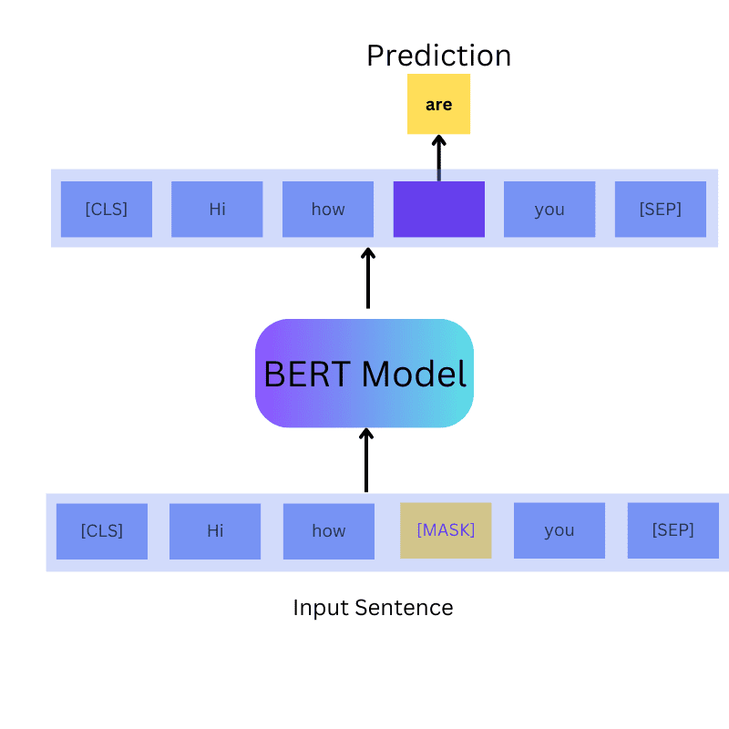
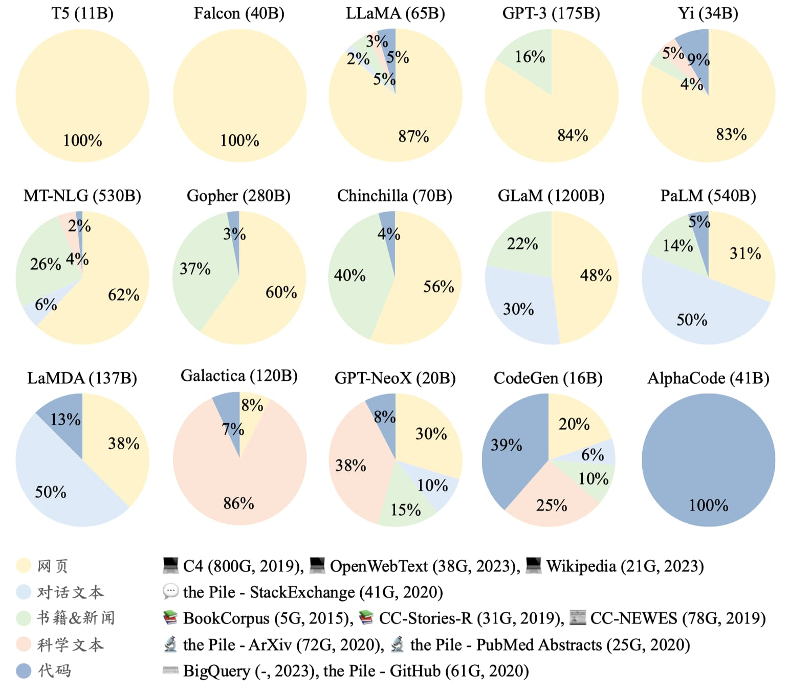

# 第15课时：推理（Reasoning）、代码与数学能力增强

目标：构建高质量的推理（CoT）与数学数据集，覆盖代码推理、数学公式化（LaTeX）、步骤化验证与过程验证，供垂直领域模型训练和评测使用。

---

## 一、课程概览

* 设计并产出可直接用于训练/微调/评估的推理与数学数据集（JSONL/TSV/CSV）。
* 制定 Chain-of-Thought（CoT）模板与注释规范，保证可解释性与可验证性。
* 为数学问题引入 LaTeX 表示、逐步推理（step-by-step）与过程校验（process verification）。
* 包含代码推理样例（bug 修复、性能分析、输出推断）并提供自动化生成、运行与验证思路。


---

## 二、相关基础知识导论

本节用于统一术语、方法论与技术背景，确保在构建推理、代码与数学数据时具有共同的认知基础。

### 2.1 大模型中的“推理能力”是什么？

**推理（Reasoning）** 指模型在给定输入的情况下，通过一系列中间步骤，从已知条件推导出结论的能力。常见形式包括：

* **演绎推理（Deductive Reasoning）**：从一般规则推导具体结论（如数学证明、逻辑题）。
* **归纳推理（Inductive Reasoning）**：从若干样例中总结规律（如模式发现）。
* **类比推理（Analogical Reasoning）**：通过相似结构进行迁移（如代码模式迁移）。
* **程序化推理（Programmatic Reasoning）**：隐式或显式地模拟程序执行流程（代码、算法）。

在大模型中，推理并非“显式算法执行”，而是通过大量具有**中间步骤结构**的数据学习到的条件分布近似。

### 2.2 Chain-of-Thought（CoT）的基本概念

**Chain-of-Thought（思维链）** 是指在模型输出中显式给出从问题到答案的中间推理步骤。

* 本质：将“隐式推理”转化为“可学习的序列结构”。
* 作用：

  * 提高复杂问题的准确率（尤其是数学、逻辑、多跳问答）。
  * 提供可解释性，便于调试与审计。
  * 为后续的过程验证（Process Verification）提供对象。


**常见 CoT 形式**：

* 自然语言步骤（"首先…其次…因此…"）
* 半结构化步骤（编号列表、要点式）
* 程序化步骤（伪代码、公式变形序列）

### 2.3 推理数据集（Reasoning Dataset）的定义与作用

**定义**：
推理数据集是指 **显式包含中间推理过程**的数据集合，不仅给出问题与最终答案，还给出从输入到输出的逻辑、计算或程序化推导路径。

**核心特征**：

* 显式中间步骤（自然语言、公式或伪代码）
* 问题 → 推理过程 → 结论 的三段式结构
* 中间过程可被人类或程序验证

**主要作用**：

1. **提升复杂问题准确率**：尤其在多跳问答、逻辑推理、数学和代码任务中效果显著。
2. **塑造模型的“思考方式”**：模型学习的不只是答案，而是如何一步步得出答案。
3. **支撑过程监督（Process Supervision）**：为 RL、Verifier、Critic 模型提供训练信号。
4. **增强可解释性与可控性**：在行业和高风险场景中尤为重要。

---

### 2.4 数学数据集（Math Dataset）的定义与作用

**定义**：
数学数据集是以**数学问题为核心对象**的数据集合，通常包含形式化表达（如 LaTeX）、逐步推导过程以及可验证的最终解。

**核心特征**：

* 问题具有明确的数学结构（变量、约束、目标）
* 推导过程遵循严格的逻辑和等价变形规则
* 结果可以通过符号或数值方式自动验证

**主要作用**：

1. **训练严谨的符号与逻辑推理能力**：数学是最强约束、最低歧义的推理领域。
2. **对齐自然语言与形式系统**：帮助模型学会在自然语言与 LaTeX / 符号系统之间切换。
3. **作为推理能力的“标尺”**：数学任务是评估模型真实推理能力的重要基准。
4. **为代码与算法能力打基础**：高质量数学推理直接迁移到算法理解和程序推理。

---

### 2.5 推理数据 vs 非推理数据（对比）

| 维度   | 非推理数据     | 推理数据                         |
| ---- | --------- | ---------------------------- |
| 中间步骤 | 无         | 有（显式 CoT / Step）             |
| 学习目标 | 输入 → 输出映射 | 过程 + 结果联合建模                  |
| 典型任务 | 分类、抽取、摘要  | 数学、代码、逻辑、多跳 QA               |
| 质量风险 | 表面拟合      | 推理幻觉（hallucinated reasoning） |

结论：**高质量推理能力 ≈ 高质量过程数据，而不仅是正确答案。**


---

### 2.4 数学推理中的关键基础

#### 2.4.1 数学问题的结构化表示

数学问题通常包含以下要素：

* **已知条件（Given）**
* **未知变量（Variables）**
* **约束或关系（Equations / Inequalities）**
* **求解目标（Objective）**

在数据集中，需要显式区分：

* 问题描述（自然语言 / LaTeX）
* 推导过程（逐步等价变形）
* 最终解（精确解 / 近似解 / 多解）

#### 2.4.2 Step-by-step 与 Process Verification

* **Step-by-step**：强调“每一步是否合理、是否可复现”。
* **Process Verification**：强调“每一步是否正确”，而不仅是最终答案。

常见验证方式：

* 数值验证（代入检查）
* 符号验证（等价变形）
* 多解一致性验证（不同方法得到同一结果）

---

### 2.5 代码推理的基础认知

#### 2.5.1 代码推理 ≠ 写代码

代码推理关注的是：

* 程序执行过程的理解（控制流、数据流）
* 状态变化的追踪（变量、堆栈、递归）
* 隐含假设与边界条件

常见代码推理能力：

* 输出预测（Execution Tracing）
* Bug 定位（Fault Localization）
* 复杂度分析（Time / Space Complexity）
* 行为等价性判断（Refactor 是否保持语义）

#### 2.5.2 程序化思维（Program Thinking）

程序化思维是一种**强结构化推理**：

* 顺序（Sequence）
* 分支（Condition）
* 循环（Iteration）
* 递归（Recursion）

高质量代码 CoT 应显式反映这些结构，而不是仅给出“直觉性解释”。

---

### 2.6 自动验证与模型训练的关系

为什么必须引入验证（Verification）：

* 推理数据比普通数据更容易“看起来合理但实际上错误”。
* 模型会学习错误的中间步骤，并在下游任务中放大。

验证的角色：

* **训练前**：过滤低质量样本
* **训练中**：作为奖励信号（RL / RLAIF / PPO）
* **训练后**：作为评测与回归测试工具

### 2.7 经典推理与数学数据集

以下是一些广泛使用的、高质量的推理与数学数据集，常被用于训练和评估具备 Chain-of-Thought 能力的大语言模型：

#### 1. **GSM8K**（Grade School Math 8K）  
- **内容**：8,500 道小学数学应用题，涉及多步算术推理。  
- **特点**：每道题配有详细的自然语言 CoT 推理步骤和最终答案。  
- **用途**：评估基础算术推理与多步逻辑能力。  
- **验证方式**：数值代入验证。

#### 2. **MATH**  
- **内容**：12,500 道高中至竞赛级数学题，涵盖代数、几何、数论、微积分等。  
- **特点**：使用 LaTeX 编写，提供完整推导过程和精确解。  
- **用途**：评估高级符号推理与形式化表达能力。  
- **验证方式**：符号等价、数值检查、多解验证。

#### 3. **TheoremQA**  
- **内容**：包含基于真实科研论文中的定理、公式和数据设计的问答对。  
- **特点**：强调从文献中提取并推理科学结论，需结合领域知识。  
- **用途**：评估科学推理与跨模态（文本+公式）理解能力。

#### 4. **AQuA**（Algebra Question Answering）  
- **内容**：约 100,000 道代数问题，源自 GRE/GMAT 等标准化考试。  
- **特点**：包含多项选择题及对应的 CoT 解释。  
- **用途**：训练多跳代数推理与选择题策略。

#### 5. **HumanEval** 与 **MBPP**（Mostly Basic Python Problems）  
- **内容**：分别为 164 道和 974 道函数级编程任务。  
- **特点**：提供函数签名、文档字符串和测试用例。  
- **用途**：评估代码生成与程序推理能力（非仅输出，而是行为正确性）。  
- **验证方式**：执行测试用例通过率（pass@k）。

#### 6. **Big-Bench Hard**（BBH）  
- **内容**：从 BIG-Bench 挑选出的 23 个最难任务，涵盖逻辑、数学、语言游戏等。  
- **特点**：任务需显式多步推理，零样本表现差，适合 CoT 微调。  
- **用途**：综合评估复杂推理能力。

#### 7. **SVAMP**（Simple Variations on Arithmetic Math Problems）  
- **内容**：为测试模型鲁棒性而设计的 1,000 道小学数学题变体。  
- **特点**：同一问题通过改写语序、单位、语境等方式生成多个版本。  
- **用途**：评估模型是否真正理解问题，而非依赖表面模式。

#### 8. **ProofWriter**  
- **内容**：基于形式逻辑规则生成的推理链数据集。  
- **特点**：提供前提、规则、结论及完整演绎步骤（如“如果 A 则 B，A 成立 → B 成立”）。  
- **用途**：训练符号逻辑与演绎推理能力。

这些数据集共同构成了当前大模型推理能力训练和评估的“标准工具箱”，在学术研究和工业实践中被广泛采用。
---


## 三、Chain-of-Thought（CoT）构造原则

### 3.1 目标与风格

* **可读性**：每一步应为完整句子或短语，避免过长的“一步式”复合句。
* **可验证性**：尽量在每步后附上可验证的小结（例如中间变量值、等式变形、断言）。
* **层次化**：若步骤内部包含子步骤，使用有序子列表或编号（在 JSON 中以数组嵌套实现）。
* **简洁但不偷工减料**：不要省略关键演算或推理链条。

### 3.2 步数与深度控制

* Easy：2–4 步；Medium：4–8 步；Hard/Expert：8+ 步。
* 每步尽量控制为 10–40 个字（中文）或 6–30 个 token（英语）以便模型逐步处理。

### 3.3 风险与排查点

* **偷步（omitted steps）**：常见导致模型学到不完整链条的错误。标注时强制要求“关键等式变形或中间结果”被写出。
* **推理跳跃（unsupported leaps）**：若一步跳到结论，要求补写理由或额外注释。

---

## 四、数学数据集构建（LaTeX + 步骤化）

### 4.1 格式化要求

* 问题与解答均用 LaTeX 表示，且 `latex_solution` 按步骤分段（每步以 `\paragraph{Step n}` 或 `\text{Step n: }` 标注）。
* 所有符号定义清楚（例如：令 $x$ 为...），复杂表达式使用 `align` 环境便于对齐和校验。

**示例条目（JSONL）**：

```json
{
  "id": "math-0001",
  "domain": "math",
  "difficulty":"medium",
  "latex_problem": "\\text{求方程 } x^2 - 5x + 6 = 0 \\",
  "cot": [
    "把方程写成标准形式：x^2 - 5x + 6 = 0。",
    "判别式为 \u0394 = (-5)^2 - 4*1*6 = 25 - 24 = 1。",
    "所以根为 (5 \pm \sqrt{1})/2 = (5 \pm 1)/2。",
    "得到 x = 2 或 x = 3 。"
  ],
  "latex_solution": "\\begin{align}\\Delta &= (-5)^2 - 4\\cdot1\\cdot6 = 1\\\\ x &= \frac{5\\pm\\sqrt{1}}{2} = 2,3\\end{align}",
  "answer": "x=2, x=3",
  "verification": {"type":"numeric_check","result":true,"evidence":"替回原方程：2^2-5*2+6=0，3^2-5*3+6=0"}
}
```

### 4.2 过程验证（Process Verification）策略

* **符号校验**：使用符号计算库（如 SymPy）去解析 `latex_solution` 并验证每一步等价变形。记录解析失败的例子供人工审查。
* **数值替换检查**：对变量取随机或边界值代入，比较左右两边是否在容差内相等。
* **独立解算器**：把问题传给另一个求解器（或数值求解流程），和给定 `answer` 做比对。

---

## 五、代码推理数据（Code Reasoning）

### 5.1 任务类型

* 输出预测（Given input & code -> predict output）
* Bug 定位与修复（Given buggy code -> identify line(s) & propose patch）
* 复杂调用/算法解释（解释复杂算法流程或推导复杂时间/空间复杂度）
* 单元测试生成（Given function -> generate edge-covering testcases）

### 5.2 示例（Bug 修复）

```json
{
  "id":"code-bug-0001",
  "domain":"code",
  "language":"python",
  "input":"def add_items(a, b):\n    for i in a:\n        a.append(i)\n    return a + b",
  "cot":[
    "函数目标应是把两个列表拼接返回。",
    "代码中在遍历列表 a 时修改 a（append），会导致无限循环或逻辑错误。",
    "正确方式是创建新列表或直接返回 a + b。",
    "因此修复是删除循环，直接 return a + b。"
  ],
  "answer":"将函数体替换为: return a + b",
  "testcases":[{"input":"[1,2], [3]","expected_output":"[1,2,3]"}],
  "verification":{"type":"unit_test","result":true}
}
```

### 5.3 自动化验证

* 为每条代码题预定义 sandboxed 运行环境（容器/受限执行器），执行提供的 testcases。
* 收集运行日志（stdout/stderr/exit_code），并把结果写入 `verification.evidence`。
* 对于非可执行的语言示例（或伪代码），使用静态分析工具或形式化检查（linter, type-checker）。

---

## 六、合成数据生成流程（代码示例）

下面给出一个可立即运行的 Python 生成器骨架（伪码/可直接运行），用于合成 CoT / Math / Code 条目：

```python
# generator.py
import json
import uuid
from random import choice, randint

def gen_simple_quadratic(n=100):
    out = []
    for i in range(n):
        a = 1
        b = randint(-10,10)
        c = randint(-10,10)
        problem = f"求方程 $x^2 + ({b})x + ({c}) = 0$ 的根。"
        # 简单求根，构造 CoT
        cot = [
            f"写出判别式：\u0394 = ({b})^2 - 4*{a}*{c}。",
            "计算判别式值并判断根的类型。",
            "按求根公式给出解。"
        ]
        # 直接求解（不考虑复杂根在示例中也可保留）
        D = b*b - 4*a*c
        if D >= 0:
            r1 = ( -b + D**0.5 )/2
            r2 = ( -b - D**0.5 )/2
            answer = f"x={r1}, x={r2}"
            verification = {"type":"numeric_check","result": True, "evidence": "computed"}
        else:
            answer = "complex roots"
            verification = {"type":"numeric_check","result": False, "evidence": "complex"}

        out.append({
            "id": str(uuid.uuid4()),
            "domain": "math",
            "difficulty":"easy",
            "input": problem,
            "cot": cot,
            "answer": answer,
            "verification": verification
        })
    return out

if __name__ == '__main__':
    data = gen_simple_quadratic(50)
    with open('math_quadratics.jsonl','w',encoding='utf8') as f:
        for item in data:
            f.write(json.dumps(item, ensure_ascii=False) + "\n")
```


---

## 七、标注/审校指南

### 7.1 标注步骤
1. **阅读题目**：理解题意并在 `metadata` 标明是否需要领域知识（如工程常识）。
2. **产出 CoT**：撰写详尽、可验证的分步思路并保证中间变量或等式可复现。
3. **最终答案**：在 `answer` 中给出唯一或多值结果（若有多解，列出全部并注明条件）。
4. **填写 verification**：运行或手动验证答案并把证据粘贴到 `evidence`。

### 7.2 质量控制（QC）
- **交叉验证**：每条样本由两名标注者独立完成，第三方审校合并冲突。
- **抽样审查**：按难度分层随机抽样 5–10% 进行人工复验。
- **自动过滤**：剔除 `verification.result == false` 的样本或把它们送到人工复审队列。

---

## 八、数据量建议与难度分配

- 初始试验集：2k–10k 条（包含 math/code/logic 各 500–3000 条），用于快速原型训练。
- 中等规模训练集：50k–200k 条，覆盖难度与题型均衡分布。
- 高质量评测集（holdout）：2k–5k 条，人工严格审校，禁止在训练集中出现重复论题。

难度分配建议（示例）：
- Easy: 40%
- Medium: 35%
- Hard: 20%
- Expert: 5%

---

## 九、评测指标与自动评分

### 9.1 常用指标
- **答案准确率（Answer Accuracy）**：标准化后的精确匹配或数值容差判断。
- **步骤正确率（Step Accuracy）**：对每一步的判定（正确/部分/错误），可以通过自动符号检验或人工评判。
- **Execution Accuracy（代码题）**：在受限执行环境中，测试用例通过比例。
- **Faithfulness / Consistency**：模型所输出的 CoT 中间结果能否被最终答案支持（例如中间计算能还原最终答案）。

### 9.2 评分工具建议
- 数学：SymPy（符号校验、等式变形验证）
- 代码：PyTest 或自建 sandbox runner（确保安全）

---

## 十、示例（多模态示例集合：Reasoning / Math / Code）

### 10.1 逻辑推理示例（CoT）

```json
{
  "id":"logic-0001",
  "domain":"logic",
  "input":"有 3 个箱子：A 只有苹果，B 只有橘子，C 苹果和橘子都有。每个箱子上的标签都写错了。你只允许从某个箱子里随便摸一个水果来确定每个箱子实际装的什么。问：你该先从哪个箱子摸？并说明理由。",
  "cot":[
    "因为每个标签都错误，所以标注为混合（C）的箱子实际上不会是混合，而是纯苹果或纯橘子。",
    "如果我从标注为混合的箱子拿到一个苹果，那么这个箱子就是苹果箱。",
    "标签错误意味着标注为苹果的不会是苹果，标注为橘子的不会是橘子。",
    "通过第一个结果可以推断剩下两个箱子的内容。"
  ],
  "answer":"先从被标为混合的箱子摸。若摸到苹果，则该箱为苹果箱；进而可以推断其余两个。",
  "verification":{"type":"logical_check","result":true}
}
```

### 10.2 代码输出预测示例

```json
{
  "id":"code-out-0001",
  "domain":"code",
  "language":"python",
  "input":"def f(n):\n    if n==0:\n        return 0\n    return n + f(n-1)\nprint(f(3))",
  "cot":["计算递归：f(0)=0, f(1)=1+f(0)=1, f(2)=2+1=3, f(3)=3+3=6"],
  "answer":"6",
  "verification":{"type":"unit_test","result":true}
}
```


## 十一、 代码数据集 (Code Data)

本章教程旨在指导如何从原始 GitHub 仓库中提取、清洗并构建出能够增强大模型（LLM）逻辑推理、代码补全及 Agent 任务规划能力的高质量数据集。

---

### 11.1 GitHub 代码清洗

原始代码库中充斥着重复、自动生成和低质量的文件。清洗的目标是保留“人类编写的、逻辑清晰的”代码。

#### 11.1.1 基础过滤规则

为保证数据集的整体质量与可用性，在原始代码语料进入后续处理流程之前，首先需要进行一轮**基础过滤**。该阶段的目标是快速剔除噪声样本、异常样本以及明显不适合用于建模的数据，从而降低后续清洗与建模的成本。

* **文件筛选**  
  仅保留主流、通用性强且在真实工程场景中被广泛使用的编程语言文件，例如 **Python、Java、C++、Rust、Go** 等。  
  这一规则的动机在于：
  - 主流语言拥有更成熟的编码规范和更稳定的语法结构；
  - 相关学习资源与真实项目丰富，有助于模型学习通用且可迁移的编程知识；
  - 可避免因冷门语言样本稀缺而引入分布不均或噪声过大的问题。

* **长度过滤**  
  对代码文件的整体长度进行约束，主要包括两个方面：
  - **最小长度限制**：剔除少于 **100 字符**的文件。这类文件通常仅包含零散代码片段、占位符或测试语句，缺乏完整逻辑结构，对模型学习帮助有限。
  - **单行长度限制**：剔除存在**单行超过 1000 字符**的文件。这类代码往往是经过混淆或压缩处理的自动生成代码，可读性极差，不符合自然代码分布。

* **内容特征过滤**  
  在长度和语言筛选的基础上，进一步从代码内部特征出发进行质量控制：
  
  * **代码注释比**  
    计算注释字符数在文件总字符数中的占比，并设定合理区间：
    - **注释占比 < 5%**：通常意味着代码几乎没有任何说明，变量命名随意，可读性和可维护性较差；
    - **注释占比 > 90%**：往往说明文件并非真正的可执行代码，而是文档、模板或被大段注释包裹的无效内容。  
    因此，仅保留注释比例处于合理区间的文件，有助于平衡代码可读性与实际逻辑密度。

  * **关键词过滤**  
    对代码内容进行关键词匹配，直接移除包含明显自动生成或压缩标记的文件，例如：
    - `AUTO-GENERATED`
    - `MINIFIED`
    - 以及其他常见的生成器声明或压缩工具标识  
    这些文件通常由工具批量生成，结构高度重复，缺乏人类编程风格，不利于模型学习真实的编码习惯与逻辑表达。

通过以上基础过滤规则，可以在不引入复杂语义分析的前提下，大幅降低数据噪声比例，为后续更精细的质量评估与语义级清洗奠定可靠基础。


#### 11.1.2 高级去重

在完成基础过滤之后，仍然可能存在大量内容高度重复或近似重复的代码文件。如果不加控制，这类样本会在训练过程中被模型反复“看到”，从而导致模型对特定代码模式的**过拟合**，削弱其泛化能力。因此，有必要在全数据范围内执行**高级去重策略**，以确保语料的多样性与信息密度。

* **精确去重**  
  对每一个代码文件计算其唯一的哈希指纹，并基于该指纹进行全局比对。具体而言，使用 **SHA-256** 等安全哈希算法，将文件的完整内容映射为固定长度的哈希值。  
  - 若两个文件的哈希值完全一致，则可以确定其内容完全相同；
  - 在这种情况下，仅保留其中一份，其余副本全部剔除。  
  精确去重能够高效、可靠地消除完全重复的数据，是全局去重流程中的第一道防线。

* **模糊去重**  
  仅依赖精确匹配无法发现“高度相似但并非完全相同”的代码，例如：
  - 同一文件的不同版本；
  - 仅修改了变量名、注释或格式的代码；
  - 来源不同但结构一致的模板化代码。  

  为此，引入基于代码片段相似度的模糊去重方法。其核心思路是：
  - 将代码拆分为若干特征片段；
  - 通过近似集合相似度的方法估计不同文件之间的重合程度；
  - 以 **Jaccard 相似度** 作为衡量标准，当相似度高于 **0.8** 时，认为两个文件在信息层面高度冗余，仅保留其中之一。  

  该策略能够在计算效率与去重效果之间取得良好平衡，尤其适合大规模代码语料，能有效清理不同版本的同一文件以及大量重复的工程模板代码。

通过精确去重与模糊去重的组合使用，可以在保证语料规模的同时显著提升数据多样性，从而为模型学习更加稳健、通用的编程知识提供可靠保障。

```python
"""
高级去重示例代码（精确去重 + 模糊去重）

说明：
- 已给定一个 list，其中每个元素是一段代码字符串
- 先使用 SHA-256 做精确去重
- 再使用 MinHash + LSH 近似计算 Jaccard 相似度
- 当 Jaccard 相似度 > 0.8 时，认为是高度重复代码并剔除

该方法常用于大规模代码语料清洗，可有效移除不同版本的同一文件
以及大量重复的模板化代码。
"""

import hashlib
from datasketch import MinHash, MinHashLSH
from itertools import combinations

# -----------------------------
# 1. 输入数据
# -----------------------------
code_list = [
    "def add(a, b):\n    return a + b",        
    "def multiply(a, b):\n    return a * b",   
    "def add(a, b):\n    return a + b",        
    "def add(a, b, c):\n    return a + b",      
]

# -----------------------------
# 2. 精确去重 (SHA-256)
# -----------------------------
def exact_dedup(codes):
    seen_hashes = {}
    kept_indices = []
    removed_exact = []

    for idx, code in enumerate(codes):
        h = hashlib.sha256(code.encode("utf-8")).hexdigest()
        if h not in seen_hashes:
            seen_hashes[h] = idx
            kept_indices.append(idx)
        else:
            removed_exact.append((idx, seen_hashes[h])) # (被删索引, 保留索引)
    return kept_indices, removed_exact

exact_kept_indices, exact_removed_log = exact_dedup(code_list)

# -----------------------------
# 11. 模糊去重 (MinHash + LSH)
# -----------------------------
def get_minhash(code, num_perm=128):
    m = MinHash(num_perm=num_perm)
    for token in code.split():
        m.update(token.encode("utf-8"))
    return m

def fuzzy_dedup(codes, indices, threshold=0.6):
    lsh = MinHashLSH(threshold=threshold, num_perm=128)
    final_kept_indices = []
    fuzzy_removed_log = []
    
    # 存储用于对比的 minhash 对象
    minhash_store = {}

    for idx in indices:
        m = get_minhash(codes[idx])
        # 查询是否有相似样本已存在于 LSH 桶中
        result = lsh.query(m)
        
        if result:
            match_idx = int(result[0])
            jac = m.jaccard(minhash_store[match_idx])
            fuzzy_removed_log.append((idx, match_idx, jac))
        else:
            lsh.insert(str(idx), m)
            minhash_store[idx] = m
            final_kept_indices.append(idx)
            
    return final_kept_indices, fuzzy_removed_log

final_indices, fuzzy_removed_log = fuzzy_dedup(code_list, exact_kept_indices)

# -----------------------------
# 4. 结果清晰打印
# -----------------------------
print("="*60)
print("去重过程报告")
print("="*60)

print(f"\n[1/2] 精确去重阶段 (SHA-256):")
for r_idx, k_idx in exact_removed_log:
    print(f"  - 移除原始索引 {r_idx}: 内容与索引 {k_idx} 完全一致")

print(f"\n[2/2] 模糊去重阶段 (LSH - Threshold 0.6):")
for r_idx, k_idx, jac in fuzzy_removed_log:
    print(f"  - 移除原始索引 {r_idx}: 相似度 {jac:.3f}，已保留相似样本 {k_idx}")

print("\n" + "="*60)
print(f"{'最终保留结果清单':^55}")
print("-" * 60)
print(f"{'原始索引':<10} | {'内容摘要 (前20位)':<25} | {'去重状态'}")
print("-" * 60)

for i in range(len(code_list)):
    content = code_list[i].replace('\n', ' ')[:20] + "..."
    if i in final_indices:
        status = "✅ [保留]"
    elif any(r[0] == i for r in exact_removed_log):
        status = "❌ [精确重复删除]"
    else:
        status = "❌ [模糊重复删除]"
    
    print(f"{i:<12} | {content:<25} | {status}")

print("-" * 60)
print(f"统计：原始总数 {len(code_list)} -> 最终保留 {len(final_indices)}")
print("="*60)

```

```
text
============================================================
去重过程报告
============================================================

[1/2] 精确去重阶段 (SHA-256):
  - 移除原始索引 2: 内容与索引 0 完全一致

[2/2] 模糊去重阶段 (LSH - Threshold 0.6):
  - 移除原始索引 3: 相似度 0.680，已保留相似样本 0

============================================================
                       最终保留结果清单                        
------------------------------------------------------------
原始索引       | 内容摘要 (前20位)               | 去重状态
------------------------------------------------------------
0            | def add(a, b):     r...   | ✅ [保留]
1            | def multiply(a, b): ...   | ✅ [保留]
2            | def add(a, b):     r...   | ❌ [精确重复删除]
3            | def add(a, b, c):   ...   | ❌ [模糊重复删除]
------------------------------------------------------------
统计：原始总数 4 -> 最终保留 2
============================================================
```
---

### 11.2 单元测试生成

仅依赖静态文本或代码表面结构，难以保证程序在真实运行环境中的正确性与鲁棒性。代码是否真正“可用”，本质上取决于其在不同输入条件下的执行结果。因此，通过**自动生成并执行单元测试**来验证代码逻辑，是提升模型推理能力与代码理解能力的核心手段之一。

通过引入执行级别的验证机制，可以有效筛选出逻辑自洽、行为正确的代码样本，从而显著提升训练数据的整体质量。

---

#### 11.2.1 单元测试生成与验证流程

整个单元测试生成与验证流程可以分为以下几个关键步骤：

1. **函数提取**  
   从完成清洗与去重后的代码语料中，自动提取具有明确输入输出关系的独立函数。  
   这类函数通常具备以下特征：
   - 位于顶层作用域，避免依赖复杂的外部状态；
   - 参数和返回值清晰，便于构造测试输入；
   - 不依赖 I/O、副作用或外部系统。  
   通过聚焦此类函数，可以最大化测试的自动化程度和稳定性。

2. **测试生成**  
   利用能力更强、推理能力更稳定的模型，为每个目标函数自动生成 **3–5 个单元测试用例**。  
   测试生成过程中采用结构化的提示策略，明确要求测试覆盖多种输入场景，包括但不限于：
   - **正常输入**：验证函数在典型使用场景下的正确性；
   - **边界条件**：如空值、极小值、极大值、单元素输入等，检验函数在极端情况下的稳定性；
   - **异常输入**：如非法参数类型、越界输入或不满足前置条件的情况，验证函数是否能合理处理错误。  
   该步骤的核心目标是通过多样化测试，尽可能暴露潜在的逻辑缺陷。

3. **沙箱执行**  
   将原始函数代码与自动生成的单元测试一起，放入受限且安全的执行环境中运行，例如：
   - 基于 Docker 的隔离容器；
   - 受控的解释执行环境（如受限权限的 Python 执行沙箱）。  
   执行结果根据测试是否全部通过进行划分：
   - **Pass**：函数在所有测试用例下均表现正确，该代码—测试对被视为高质量样本并予以保留；
   - **Fail**：任一测试失败，则说明代码存在潜在逻辑问题，该样本将进入后续处理流程，例如自动修复，或直接被舍弃。  

通过“生成—执行—筛选”的闭环流程，可以将静态代码过滤升级为基于真实行为的动态验证。

---

#### 11.2.2 利用解释器与求解器进行校验

对于数学计算或逻辑推理密集型的代码，仅依赖随机或枚举式测试仍可能存在覆盖不足的问题。为此，可以引入形式化工具，对代码逻辑进行更严格的验证。

* **符号计算库**  
  使用符号化的方式对代码表达式进行等价性验证。例如，通过符号计算工具，将函数内部的数学表达式转化为符号形式，并与目标公式进行对比，从而判断其在理论层面是否一致。这种方法尤其适用于代数运算、公式推导等场景。

* **逻辑约束求解器**  
  对包含条件判断、分支逻辑或约束条件的代码，将其抽象为形式化约束，并交由逻辑求解器进行验证。  
  通过这种方式，可以系统性地检查：
  - 是否存在无法满足的约束；
  - 是否存在隐藏的反例输入；
  - 不同分支条件是否覆盖完整输入空间。  

通过将执行验证与形式化验证相结合，可以在保证可扩展性的同时，进一步提升数据集在逻辑正确性与推理严谨性方面的上限，为后续模型训练提供更加可靠的监督信号。


---

### 11.3 代码解释与补全数据构建

在完成代码清洗、去重以及单元测试验证之后，下一步是将高质量代码样本转化为适合大模型训练的**指令–响应”数据形式**。这一过程的核心目标，是引导模型不仅能够生成代码结果，还能够像人类专家一样对代码进行理解、推理与补全，从而提升其可解释性与泛化能力。

---

#### 11.3.1 代码解释

代码解释数据主要用于训练模型对程序逻辑进行系统化分析，并显式暴露其推理过程。为此，在数据构建阶段引入包含**思维链**的结构化输出形式。

* **数据格式**  
  每条样本由输入与目标两部分组成：
  - `Input`：一段完整且可执行的源代码块；
  - `Target`：由多个层次组成的解释性文本，通常包括：
    - **逻辑概述**：用自然语言概括该代码的整体功能与设计意图；
    - **关键变量解释**：说明核心变量、参数及其在程序中的作用；
    - **逐行逻辑推演**：按照代码执行顺序，对关键语句的行为进行逐步分析。  

  这种分层式结构有助于模型在输出时形成清晰的逻辑组织，而非零散、片段化的描述。

```python
def average(nums):
    total = 0
    for n in nums:
        total += n
    return total / len(nums)
```
```
【逻辑概述】
该函数用于计算一个数值列表的平均值。它通过遍历列表累加所有元素，
最后将总和除以元素个数，得到平均结果。

【关键变量解释】
- nums：输入的数值列表，包含若干需要参与计算的元素
- total：累加器变量，用于存储当前已经累加的数值总和
- n：循环过程中当前遍历到的列表元素

【逐行逻辑推演】
1. 函数开始执行，初始化 total 为 0，用于后续累加。
2. 进入 for 循环，依次从 nums 中取出每一个元素 n。
3. 每次循环将当前元素 n 加到 total 上，更新累加结果。
4. 循环结束后，total 中保存了 nums 所有元素的总和。
5. 使用 total 除以 nums 的长度 len(nums)，计算平均值并返回结果。
```

* **作用**  
  通过在训练数据中显式引入推理过程，模型在面对复杂代码生成或修改任务时，会更倾向于先进行“思考”，再给出最终答案。这种训练方式能够显著降低代码生成中的逻辑错误率，提升模型对复杂控制流与状态变化的理解能力。

---

#### 11.3.2 完形填空

完形填空任务是训练代码补全能力的核心手段，广泛应用于智能编程助手与代码自动补全模型的训练过程中。

* **构建方法**  
  对一个完整的代码文件或函数体进行随机切分，将其划分为三个连续片段：
  - `Prefix`：代码前缀，包含已知的上下文信息；
  - `Middle`：被刻意移除的中间片段，通常包含关键逻辑；
  - `Suffix`：代码后缀，用于提供额外的上下文约束。  

  切分过程在长度和位置上保持随机性，以增强模型对不同上下文条件的适应能力。

* **训练目标**  
  模型需要在同时观察前缀与后缀的条件下，准确预测缺失的中间代码。 
  该任务迫使模型综合利用已有上下文信息，理解整体程序结构与语义约束，从而生成与上下文高度一致的代码补全结果。





通过结合代码解释与完形填空两类数据构建方式，可以同时提升模型在“理解代码”和“生成代码”两个维度上的能力，使其更接近真实开发场景中人类程序员的工作方式。


---

### 11.4 行业模型全流程训练建议

| 阶段 | 核心动作 | 关键点 |
| :--- | :--- | :--- |
| **预训练** | 大规模 FIM 数据 + 混合自然语言 | 建议代码占比 15% - 25% |
| **微调 (SFT)** | 验证过的 Code-UnitTest 对 | 强制要求模型输出过程思考 |
| **强化学习 (RLHF / DPO)** | 以测试通过率作为奖励函数 | 将执行结果 (Success / Fail) 作为反馈信号 |



## 十二、 验证驱动的数据过滤

验证驱动过滤是构建高质量推理数据集的“金标准”。它通过真实的运行环境来剔除那些逻辑错误、语法不通或包含幻觉的代码，确保模型学习到的是真正能工作的逻辑。

---

### 12.1 核心流程：闭环验证系统

验证驱动过滤并非依赖规则或静态特征进行一次性判断，而是构建了一个完整的**闭环验证系统**。该系统以“生成—运行—反馈”为核心思想，通过真实执行代码来检验其有效性与可用性，从而在源头上保障数据质量。这种方式能够显著减少仅在语法层面正确、但在语义或运行层面存在问题的低质量样本。

整个流程可划分为以下几个关键阶段：

1. **代码提取或生成**  
   系统首先从原始代码库中提取可独立运行的函数、脚本或模块，确保其具备明确的输入与输出形式。同时，也可以利用大语言模型自动生成解题代码或功能实现代码，用于扩充训练样本的覆盖范围。  
   这一阶段的重点在于保证代码具备可执行性与明确任务目标，而非仅作为静态文本存在。

2. **环境配置**  
   在代码执行之前，系统会自动分析其依赖关系，并为其匹配所需的运行环境与第三方库。例如，数值计算相关代码需要配置 `numpy`，数据处理代码可能依赖 `pandas`，约束求解或形式化验证任务则需要 `z3-solver` 等工具。  
   通过自动化环境配置，可以最大程度减少因依赖缺失导致的误判，并提升验证流程的成功率与稳定性。

3. **解释器执行**  
   代码将在隔离的沙箱环境中运行，以避免对宿主系统产生任何安全风险。沙箱通常限制文件系统访问、网络请求以及运行时间和内存占用，从而保证执行过程安全、可控。  
   该阶段的核心目标是观察代码在真实运行条件下的行为，而不仅仅是其表面结构是否合理。

4. **结果判定与反馈**  
   根据代码的运行结果，系统会对样本进行明确分类：  
   * **通过**：代码能够成功运行并得到合理输出，说明其逻辑完整、依赖正确，可直接进入高质量训练集，用于模型学习。  
   * **失败**：代码在执行过程中抛出异常或运行错误，系统将完整记录错误日志与调用栈信息。这些失败样本不会直接丢弃，而是被保留下来，用于构建后续的错误修复数据集，从而支持模型学习如何定位问题并进行代码修正。

通过上述闭环流程，验证驱动过滤不仅能够筛选出高质量、可执行的代码样本，还能将失败案例转化为具有训练价值的资源，实现数据利用效率的最大化。这种动态验证机制在规模化代码数据构建中尤为关键，是提升模型实际编程能力的重要基础。


---

### 12.2 利用 Python 解释器进行动态验证

在编程类数据的质量评估中，动态验证的核心不在于代码“看起来是否正确”，而在于其**是否能够在真实解释器中成功运行并满足预期行为**。因此，单元测试的通过率成为衡量代码样本质量的关键指标。基于 Python 解释器的动态验证机制，能够从语法、语义以及运行状态多个层面对代码进行全面评估。

具体而言，该过程主要包含以下几个方面：

* **自动化测试构建**  
  针对一段待验证代码 $C$，系统会自动生成或推断其可能的输入集合 $I$，例如不同类型、不同边界条件下的参数组合。随后，通过执行过程 $Exec(C, I)$ 获取对应输出 $O$。  
  这种方式避免了人工编写测试用例的高成本，使验证流程能够大规模自动化运行，同时也有助于发现隐藏在边界条件下的逻辑错误。

* **状态一致性检查**  
  除了直接比对输出结果外，系统还会对执行前后程序的内部状态进行检查，包括关键变量的取值、内存中对象的变化以及全局状态是否被意外修改等。  
  通过状态一致性分析，可以有效识别那些“输出正确但副作用异常”的代码样本，防止不安全或不可控的实现进入训练数据。

* **异常捕获与错误类型分析**  
  在执行过程中产生的异常会被完整捕获并分类分析。通常可将其区分为两大类：  
  - **语法错误**：代码无法通过解释器解析，往往反映出模型在基础语法层面的能力不足；  
  - **运行时异常**：代码能够成功解析，但在特定输入或边界条件下触发错误，通常源于逻辑分支不完整、异常情况未处理或类型假设不成立。  

  对异常类型进行细粒度区分，有助于在数据层面对模型能力短板进行精准刻画，同时也为后续的错误修复与对齐训练提供高价值的监督信号。

通过引入 Python 解释器的动态验证机制，数据筛选过程从静态文本分析升级为基于真实执行行为的评估体系，不仅显著提升了训练数据的可靠性，也为构建更具鲁棒性的代码生成模型奠定了坚实基础。


---

### 12.3 利用求解器进行逻辑一致性验证

在数学推理、协议分析或复杂算法相关的数据中，仅依赖代码的实际执行往往难以覆盖所有可能的逻辑路径，尤其是在输入空间巨大或存在隐含边界条件的情况下。为此，需要引入形式化验证工具，从“逻辑必然性”的角度对样本进行更严格的校验，以确保其在理论层面上的正确性与一致性。

#### 1. Z3 定理证明器

Z3 是一种成熟的自动定理证明器与约束求解器，适用于对程序逻辑进行形式化验证，其核心目标是判断某一性质在**所有可能输入条件下是否成立**。

* **应用场景**  
  在算法与程序验证任务中，Z3 常用于验证全局性质是否被满足。例如，在排序算法的验证中，可以检查算法是否能够在任意输入序列下都保证输出结果是有序的，而不仅仅是在有限的测试样本上表现正确。

* **验证思路与操作流程**  
  验证过程通常包括以下步骤：
  - 将代码中的关键逻辑抽象为形式化约束；
  - 明确需要验证的性质，并将其转化为逻辑公式；
  - 交由 Z3 求解器判断是否存在违反该性质的输入条件。  

  如果求解器能够找到一个使约束不成立的输入示例，则该示例被视为反例，说明原始代码或推理过程在逻辑上并非完全正确。反之，若在给定约束范围内不存在反例，则可以认为该逻辑在形式化意义上是成立的。

#### 2. SymPy 符号验证

在数学推理与计算步骤生成类数据中，模型往往能够给出形式上看似合理的推导过程，但其中可能隐藏着细微却关键的计算错误。符号计算工具可以用于验证不同数学表达式在理论上的等价性，从而有效减少计算幻觉。

* **应用示例**  
  在模型生成的解题步骤中，常见的一类问题是表达式变形是否正确，例如判断 $x^2 - 1$ 是否等价于 $(x+1)(x-1)$。这种等价性并不依赖具体数值，而是需要在符号层面进行严格验证。

* **验证方法**  
  利用符号计算库对两个表达式进行化简，并检查其差值是否恒等为零。若化简结果为零，则说明两者在数学意义上完全等价；反之，则表明推导过程中存在错误或不完备之处。  
  通过这种方式，可以自动筛除推理链中存在不一致的样本，为高质量数学推理数据构建提供可靠保障。


通过将求解器与符号验证工具引入数据筛选流程，验证驱动过滤不仅关注代码或推理在有限示例上的表现，更强调其在全局逻辑层面的正确性。这种形式化验证手段对于构建高可信度的算法与数学推理数据集具有不可替代的作用。


---

### 12.4 数据过滤策略：从“正确”到“优雅”

在完成动态验证与形式化验证之后，数据样本在“是否能跑通、是否在逻辑上成立”这一层面已经具备基本可靠性。然而，仅有“正确”仍不足以支撑高质量推理与代码生成模型的训练。为此，需要引入第二层更为严格的数据过滤策略，从多个维度对样本进行细化筛选，使保留下来的数据不仅正确，而且具备良好的推理结构与工程质量，实现从“能用”到“好用”的转变。

通过验证后的数据，将按照以下关键维度进行进一步过滤与评估：

| 过滤维度 | 验证手段 | 目的 |
| :--- | :--- | :--- |
| **执行正确性** | Python 解释器 / 单元测试 | 确保代码逻辑能够稳定运行，排除基础语法错误与显式运行失败的样本 |
| **逻辑严密性** | 约束求解器 / 形式化证明 | 确保程序或推理在符号层面不存在逻辑漏洞，避免仅在有限样例下成立的“偶然正确” |
| **计算准确性** | 符号计算 / 精确计算工具 | 消除大模型常见的算术错误与代数推导偏差，提升数学与推理任务的可靠性 |
| **效率验证** | 执行时间与内存分析 | 剔除时间复杂度或空间复杂度明显不合理的样本，例如死循环、无界递归或极低效实现 |

从整体流程上看，这一阶段的过滤不再以“是否错误”为唯一标准，而是综合考量代码或推理过程在正确性、完备性、稳定性以及效率上的表现。通过多维度交叉验证，可以系统性地排除那些虽然形式正确、但在实际应用中缺乏价值的样本。

最终，该策略能够构建一批在执行层面可靠、在逻辑层面严谨、在计算层面精确、在工程层面高效的数据，为模型学习更优雅、更通用的推理与编程模式提供坚实基础。


---

### 12.5 实践建议：构建安全沙箱

在基于执行结果进行数据验证的过程中，安全性始终是首要前提。任何来源不明或未经审查的代码，都可能包含恶意逻辑或资源滥用行为，若直接在本地环境中执行，将对系统稳定性和数据安全造成严重风险。


**警告：严禁在宿主机或开发环境中直接使用 `exec()` 执行未知代码。**

为确保验证流程在安全、可控的前提下运行，实践中应构建完善的安全沙箱机制，重点包括以下几个方面：

* **容器化隔离**  
  使用容器技术将每一次验证任务与宿主系统进行严格隔离。每个任务在独立的容器实例中运行，容器之间互不影响，并默认关闭网络访问权限，从根源上防止数据外泄、恶意联网或横向攻击。  
  这种方式不仅提升了安全性，也便于在大规模并行验证场景下进行统一管理与回收。

* **资源限制**  
  对容器或执行环境施加严格的资源配额限制，包括 CPU 使用时间、可用内存上限以及最大执行时长等。  
  通过资源限制，可以有效防止死循环、指数级递归或恶意构造的逻辑炸弹导致内存溢出或 CPU 被长时间占用，从而避免宿主机性能下降甚至宕机。

* **权限最小化**  
  在沙箱内部运行解释器时，应遵循最小权限原则，使用非特权用户执行代码，禁止以 Root 身份运行。  
  同时，可进一步限制文件系统访问范围，仅开放必要的临时目录，防止代码对系统关键文件或配置进行读写操作。

通过容器隔离、资源约束与权限最小化的组合策略，可以在保证验证效果的同时，将执行未知代码所带来的安全风险控制在可接受范围之内。这类安全沙箱机制是验证驱动数据过滤体系中不可或缺的一环，也是实现规模化、自动化验证的基础保障。


