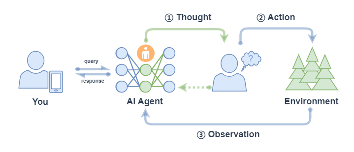

# 第16课时：Agent 能力增强指南 (Tools & Planning)

## 1. 绪论：从语言建模到代理行动的数据范式转移

大型语言模型（LLM）的发展正经历着从被动文本生成向主动代理（Agentic）行动的范式转移。这一转变的核心在于模型不再仅仅是对预训练语料库的统计复述，而是需要具备与外部环境交互、调用工具以及在复杂场景下进行长期规划的能力。然而，这种能力的习得并非模型规模扩大的自然涌现结果，而是高度依赖于特定结构化数据的监督微调（SFT）与强化学习（RL）。


当前代理AI领域面临的核心瓶颈在于“代理数据的稀缺性”。互联网上充斥着海量的人类自然语言对话，但极度缺乏高质量的“思维-行动”轨迹（Thought-Action Trajectories）。真实的API调用日志往往只包含请求与响应，缺乏决策背后的推理过程（即“为什么选择这个工具”）；而复杂的规划任务往往隐藏在人类的潜意识中，未显式地记录为数据。因此，构建能够增强Agent能力的工具调用（Tool Use）数据集、规划（Planning）数据集以及环境模拟（Environment Simulation）数据，已成为当前AI研究中最前沿且最具挑战性的工程方向。

本报告将详尽剖析代理能力增强背后的数据构建方法论，涵盖从API定义与参数生成的底层逻辑，到合成ReAct与Plan-and-Solve规划轨迹的高级策略，再到利用大模型模拟环境反馈以解决训练数据瓶颈的前沿技术。

## 2. 工具调用（Tool Use）数据构建：API定义与交互协议的结构化

工具使用能力是智能体感知的延伸，它要求模型能够理解工具的功能定义（API Schema），根据用户意图选择合适的工具，并精确生成符合协议规范的调用参数。这一能力的获得，极度依赖于高质量、覆盖广泛且结构严谨的API数据集。


### 2.1 API语料库的构建与清洗策略

构建工具调用数据集的第一步是建立一个庞大且多样化的API语料库。以ToolBench项目为例，其数据构建的基石是来自于RapidAPI Hub的16,464个真实RESTful API，涵盖了49个不同的类别 。这一规模的选择并非随意，而是为了确保模型能够通过广泛的接触（Exposure）学会泛化，而非仅仅记忆特定的API名称。   

#### 2.1.1 API筛选与质量控制

在从开放平台抓取API时，数据清洗是至关重要的环节。原始的API市场中充斥着不可用、文档缺失或响应格式混乱的接口。高质量数据集的构建通常遵循以下筛选标准：

* **可用性验证**：必须剔除那些返回404错误、鉴权极其复杂或响应为空的API。ToolBench的构建过程中，不仅抓取了API定义，还进行了实际的调用测试，确保能够获得有意义的响应数据。
* **多样性平衡**：为了防止模型对特定领域（如天气查询）过拟合，数据集必须在不同类别间保持平衡。例如，ToolBench涵盖了从“Cat API”（宠物图像获取）到“OpenWeather”（气象数据）、再到“HomeSearch”（房产搜索）等差异巨大的领域 。这种跨域分布迫使模型学习API文档的通用阅读理解能力，而非特定领域的套路。   
* **文档完整性**：API的元数据（Metadata）是模型理解工具的唯一窗口。高质量的数据集要求每个工具都必须具备清晰的tool_name（工具名）、description（功能描述）、method（调用方法，如GET/POST）以及详细的parameters（参数）定义。

#### 2.1.2 结构化定义的标准化（JSON Schema与OpenAPI）
为了让LLM能够理解工具，必须将非结构化的文档转化为结构化的Schema。当前业界通用的标准是基于JSON Schema的定义格式。在训练数据中，这些定义通常以System Prompt的形式呈现。


Gorilla 框架的研究表明，模型对API文档的理解深度直接决定了工具调用的准确率（Pass Rate）和幻觉率（Hallucination Rate）。Gorilla项目采用了自指令（Self-Instruct）范式，将原始的API文档转化为“指令-API对”（Instruction-API pairs）。其数据处理管道不仅保留了函数签名，还特别保留了参数的约束条件（如枚举值、范围限制）和默认值信息。

| 字段 | 描述 | 在Agent训练中的作用 |
| :--- | :--- | :--- |
| **Name** | API的唯一标识符 | 用于模型在多工具场景下的精确检索与路由。 |
| **Description** | 自然语言的功能描述 | 是模型进行语义匹配（Retrieval）的核心依据。高质量的描述能显著降低模型选错工具的概率。 |
| **Parameters** | 参数名、类型、必填项 | 训练模型进行“参数槽位填充”（Slot Filling）的关键。模型需学会从用户指令中提取实体并映射到此。 |
| **Response Schema** | 预期的返回结构 | 帮助模型预测工具调用的后果，并为规划下一步行动提供上下文预判。 |

### 2.2 检索增强训练（Retriever-Aware Training, RAT）
在真实的Agent应用场景中，可用工具的数量可能成千上万，远超LLM的上下文窗口限制。因此，模型不仅要学会调用工具，还要学会“检索”工具。Gorilla 项目引入了“检索增强训练”（Retriever-Aware Training, RAT）机制。


在RAT模式下，训练数据的构造发生了根本性变化：

* **传统模式**：输入 = [所有工具定义] + [用户指令]。
* **RAT模式**：输入 = [检索出的API文档片段] + [用户指令]。

这种构造方式模拟了真实的推理场景：检索器首先根据用户指令从庞大的API池中召回一小部分相关工具，然后模型基于这部分上下文进行选择。通过在训练阶段就引入检索器检索出的（包含正确和不相关）工具片段，模型被迫学会区分“相关但无用”的干扰项，从而显著提升了在开放域工具使用中的鲁棒性。研究显示，这种结合了检索感知的微调（Fine-tuning）使得Gorilla模型在API功能准确性上超越了GPT-4。

### 2.3 工具调用轨迹（Trace）的合成方法
拥有了API定义后，下一步是构建“用户指令”到“API调用”的映射数据。由于人工编写成千上万个API的调用代码极其昂贵且容易出错，目前主流的方法（如ToolBench、API-Bank）均采用基于LLM的合成数据生成管线。

#### 2.3.1 自指令（Self-Instruct）与反向生成
ToolBench 采用了改进的Self-Instruct方法。传统的Self-Instruct是让模型生成指令，而ToolBench的策略更为复杂，包含三个阶段：

1. **API采样（API Sampling）**：从API池中随机采样一组API（例如3-5个）。
2. **指令生成（Instruction Generation）**：提示（Prompt）一个强大的教师模型（如GPT-4），要求其构思一个必须使用这些API才能解决的现实场景。

    * 单工具指令：仅涉及一个API的简单查询。
    * 多工具指令：要求模型构思复杂的、需要串行或并行调用多个API的任务（例如“先查询天气，再根据天气预定适合的餐厅”）。

3. **轨迹标注（Solution Path Annotation）**：教师模型根据生成的指令，生成完整的调用代码或JSON序列。

这种“先有答案（API组合），后有问题（指令）”的反向生成逻辑，确保了训练数据的复杂度和工具覆盖率，避免了模型只生成简单的高频任务。

#### 2.3.2 深度优先搜索决策树（DFSDT）增强推理
在生成多步工具调用的轨迹时，简单的思维链（Chain-of-Thought, CoT）往往容易陷入局部最优或在中间步骤出错（例如第一个API调用失败，导致后续步骤无效）。ToolBench 引入了**深度优先搜索决策树（DFSDT）**算法来增强数据的质量。


DFSDT将工具调用过程建模为一棵决策树：

* **节点**：代表Agent的状态（State），包括当前的思考（Thought）、已执行的动作（Action）和环境反馈（Observation）。
* **边**：代表可能的下一步行动。
* **搜索策略**：教师模型不仅仅生成一条路径，而是探索多个分支。如果某个分支导致API报错或无法解决问题，模型会回溯（Backtrack）并尝试另一种参数组合或工具。
* **优选路径**：最终进入训练集的是经过搜索验证的、成功率最高的路径。

这种方法生成的训练数据包含了“探索-回溯-成功”的隐性逻辑（尽管SFT通常只保留成功路径），极大地提升了模型处理复杂多步任务的能力。相比于传统的ReAct（仅依赖单次推理），DFSDT扩展了搜索空间，使得生成的轨迹更加健壮，能够覆盖更多的边缘情况（Edge Cases）。

#### 2.3.3 基于抽象语法树（AST）的正确性验证
合成数据的致命弱点是“幻觉”——模型可能生成语法正确但参数错误的调用。Gorilla 引入了基于**抽象语法树（AST）**的评估与过滤机制 。


在验证合成的API调用时，简单的字符串匹配（Exact Match）是不可行的，因为 `func(a=1, b=2)` 和 `func(b=2, a=1)` 在语义上完全等价。AST匹配将生成的代码解析为树状结构，并检查其是否为基准（Ground Truth）AST的子树：

$$\text{AST}_{\text{gen}} \subseteq \text{AST}_{\text{GT}}$$

这种方法允许参数顺序的自由度，同时严格约束必须包含的核心参数。只有通过AST验证的轨迹才会被纳入最终的微调数据集，从而从源头上消除了因格式差异导致的噪声，确保模型学习到的是功能正确的调用范式。

## 3. 规划能力（Planning）数据构建：思维链与任务分解的合成
如果说工具调用是Agent的“手”，那么规划能力就是Agent的“脑”。规划要求模型将抽象的高层目标分解为可执行的原子步骤序列。构建规划能力数据集的核心在于显式化（Externalize）推理过程，即生成高质量的“思维轨迹”。

### 3.1 ReAct模式的数据合成：交错式的推理与行动
ReAct (Reason + Act) 是目前最主流的Agent规划范式，它要求模型在执行每一个动作之前先生成一个“Thought”（思考）。这种交错式的结构使得模型能够根据环境反馈动态调整策略。

**3.1.1 ReAct轨迹的数据结构**
一个典型的ReAct训练样本包含以下序列：

* **Instruction**：用户的最终目标（例如“找出Apple和Microsoft过去一周股价波动较大的那个”）。
* **Thought 1**：模型对自己状态的内省（“我需要先分别获取两家公司的股价历史数据”）。
* **Action 1**：具体的工具调用（get_stock_history(symbol='AAPL')）。
* **Observation 1**：环境返回的数据（“AAPL过去7天收盘价为...”）。
* **Thought 2**：基于观测的更新（“现在我已经有了Apple的数据，接下来需要获取Microsoft的数据”）。
* **Action 2**：get_stock_history(symbol='MSFT')。
* ...（循环直至完成）
* **Final Answer**：最终结论。

**3.1.2 过滤与筛选机制**
合成ReAct数据的挑战在于，模型生成的“思考”往往存在逻辑跳跃或错误。为了构建高质量数据集，通常采用“结果导向的过滤”（Outcome-based Filtering）。

1. 首先，使用强大的教师模型（如GPT-4）针对同一任务生成多个ReAct轨迹。
2. 其次，在沙箱环境中执行这些轨迹。
3. 最后，仅保留那些最终成功解决了问题（Final Answer正确）的轨迹。通过这种方式，SFT模型学习到的是“成功的思考模式”，而非错误的尝试。

在lazyllm中，ReactAgent 每一步都要有 Thought 输出，示例如下：

```python
import lazyllm
from lazyllm.tools import fc_register, ReactAgent
@fc_register("tool")
def multiply_tool(a: int, b: int) -> int:
    return a * b
@fc_register("tool")
def add_tool(a: int, b: int):
    return a + b
tools = ["multiply_tool", "add_tool"]
llm = lazyllm.OnlineChatModule(source="sensenova", model="DeepSeek-V3")
agent = ReactAgent(llm, tools)
query = "What is 20+(2*4)? Calculate step by step."
res = agent(query)
print(res)
```

### 3.2 Plan-and-Solve（P&S）模式：前后端分离的规划数据
对于长程任务，ReAct模式有时会陷入局部视野，缺乏全局观。Plan-and-Solve（或称Plan-and-Act）策略提出将“规划”与“执行”分离，这也带来了数据构建上的分离 。


* 注意： 上图中 ② Action x1 表示每次行动只执行一个子任务（不会全部将子任务执行完，区别 ReWOO的对应流程中的 ② Action xN）。

**3.2.1 Planner数据构建**
Planner模型的任务是生成一个高层计划（High-level Plan），而不涉及具体的API调用细节。

* **输入**：用户目标 + 工具描述摘要。
* **输出**：结构化的步骤列表（例如 JSON格式的步骤数组）。
* **合成方法**：提示教师模型“请将此任务分解为不超过5个的子任务，不要生成代码，只生成自然语言描述”。

**3.2.2 Executor数据构建**
Executor模型负责将Planner生成的每一个自然语言步骤转化为具体的Action。

* **输入**：当前子任务描述 + 当前环境状态 + 详细API文档。
* **输出**：精确的API调用。
* **合成方法**：这部分数据可以复用工具调用数据集（Tool Use Data），但其Condition（条件）变成了子任务描述而非原始的用户指令。

Plan-and-Act 数据集的优势在于它解耦了逻辑推理与语法生成。Planner数据专注于逻辑连贯性和任务依赖关系（Dependency Graph），而Executor数据专注于API语法的正确性。这种分层训练使得Agent in 处理极其复杂的长流程任务时表现更加稳健。

在lazyllm中，PlanAndSolveAgent由两个组件组成：首先，将整个任务分解为更小的子任务，其次，根据计划执行这些子任务。最后结果作为答案进行输出。

```python
import lazyllm
from lazyllm.tools import fc_register, PlanAndSolveAgent
@fc_register("tool")
def multiply(a: int, b: int) -> int:
    return a * b
@fc_register("tool")
def add(a: int, b: int):
    return a + b
llm = lazyllm.OnlineChatModule(source="sensenova", model="DeepSeek-V3")
tools = ["multiply", "add"]
agent = PlanAndSolveAgent(llm, tools=tools)
query = "What is 20+(2*4)? Calculate step by step."
ret = agent(query)
print(ret)
```

### 3.3 蒸馏逐步推理（Distilling Step-by-Step）
Google Research提出的Distilling Step-by-Step机制为规划数据的效能提供了理论与实验支持。该研究指出，小模型（如770M参数）之所以在推理任务上表现不佳，是因为标准SFT数据（Input -> Label）丢失了推导过程。

在构建规划数据集时，该方法主张训练数据应包含“Rationales”（基本原理/理由）。
训练目标变化：模型不再仅仅最小化 $L(y|x)$（给定输入预测输出的损失），而是最小化 $L(y, r|x)$（给定输入同时预测理由 $r$ 和输出 $y$ 的损失）。

数据增强：利用大模型生成CoT（思维链）作为 $r$，并将其作为额外的监督信号。

效果：实验表明，使用包含Rationales的数据训练的小模型，能以更少的数据量（仅需1/5）和更小的参数规模，达到甚至超越大模型的Few-shot性能。这意味着在构建Agent数据时，必须强制包含“Thought”字段，哪怕在部署时不需要输出它，它在训练阶段的梯度下降中也起到了关键的“逻辑对齐”作用。

### 3.4 思考草稿链（Chain of Draft）与数据精简
虽然详细的CoT有助于准确性，但过于冗长的思考会导致推理延迟增加。Chain of Draft (CoD) 是一种新兴的数据构建策略，旨在生成“极简主义”的规划数据 。   

数据特征：CoD数据中的“思考”部分被限制在每步5个单词以内，仅保留核心的语义锚点（Semantic Anchors）而非完整的语法句子。

构建提示：提示教师模型“Think step by step but keep a minimum draft, 5 words at most per step”。

意义：这种数据训练出的Agent在保持推理能力的同时，显著降低了Token消耗和延迟，更适合实时性要求高的工具调用场景。


## 4. 多轮对话中的状态保持（State Tracking）数据构建
Agent与环境的交互通常不是一次性的，而是多轮的。在多轮交互中，Agent必须维护一个隐式的“状态机”（State Machine）。

### 4.1 状态追踪的挑战与数据构造
多轮对话数据的核心难点在于上下文漂移（Context Drift）和信息遗忘。构建高质量的多轮数据需要刻意设计包含“跨轮次依赖”的场景。

#### 4.1.1 信息跨度（Span）与引用
SmartPlay 和 AgentBench 等基准测试特别强调了这一点 。构造数据时，需要生成这样的对话模式：   

* **Turn 1**：用户设定约束（例如“预算限制在500美元以内”）。
* **Turn 2-4**：进行一系列搜索和比较操作。
* **Turn 5**：Agent在做最终决定时，必须引用Turn 1中的约束。

**负样本构造**：为了训练模型的鲁棒性，可以故意插入“干扰项”（Distractors），例如在中间轮次提及昂贵的选项，看Agent是否会被误导而忽略最初的预算约束。

#### 4.1.2 隐层状态的显式化标注
在游戏类Benchmark（如SmartPlay中的汉诺塔或Minecraft）中，数据包含一个显式的World State（世界状态）对象。

* **数据格式**：不仅包含对话历史，还包含每一步操作后的环境快照（Snapshot）。
* **训练目标**：虽然Agent在推理时看不到内部状态，但在训练阶段，可以将“预测当前状态”作为辅助任务（Auxiliary Task），强迫模型在隐藏层中建立环境模型（World Model）。例如，训练Agent不仅输出动作，还要输出“当前盘面状态描述”。

### 4.2 API-Bank中的对话状态管理
API-Bank 数据集专注于评估Agent在多轮对话中的参数管理能力 。它定义了三个层级的能力，并据此构建数据：   


* **Level 1 (Call)**：单次调用。
* **Level 2 (Retrieve + Call)**：先检索工具再调用。
* **Level 3 (Plan + Retrieve + Call)**：在多轮对话中持续规划。

在Level 3的数据构建中，包含了大量的Slot Carryover（槽位延续）情况。例如：

* **User**: "帮我查一下北京到上海的机票。" (Slot: Origin=北京, Dest=上海)
* **Agent**: (调用API并返回结果)
* **User**: "那去广州的呢？" (Slot: Origin=北京 [Carryover], Dest=广州 [Update]) 

训练数据必须精确标注这种槽位的继承与更新逻辑，教会Agent在不完整指令中利用历史上下文补全参数。

---

### 5. 环境反馈模拟（Environment Simulation）：突破数据瓶颈
传统的Agent训练依赖于真实的执行环境（如真实的Linux终端、SQL数据库或浏览器）。然而，构建和维护这些环境极其昂贵、缓慢且脆弱（Brittle）。最新的研究趋势是利用LLM本身作为环境模拟器，生成虚拟的反馈数据。

#### 5.1 Simia框架：环境无关的轨迹合成
Simia-SFT 和 Simia-RL 提出了一种革命性的数据生成范式：LLM环境模拟器 。这种方法完全脱离了真实的API或沙箱，利用大模型的世界知识来“想象”工具执行的结果。   


**5.1.1 模拟管道（Simulation Pipeline）**

* **种子数据（Seed Data）**：从少量的人类专家轨迹开始。
* **动作预测**：待训练的Agent生成一个动作（如 Click(Button_Submit)）。
* **反馈模拟（Feedback Simulation）**：一个专门的“模拟器LLM”（Simulator LLM）接收该动作，并根据预定义的规则或常识生成反馈（如 Observation: 提交成功，页面跳转至订单详情页）。
* **轨迹闭环**：这个过程循环进行，直到任务完成。

#### 5.1.2 模拟数据的多样性与边缘情况
使用LLM模拟环境的最大优势在于可以随意生成边缘情况（Edge Cases），而这些情况在真实环境中很难复现。
错误注入：可以提示模拟器LLM生成特定的错误，如“网络超时”、“权限拒绝”、“数据库锁定”等 。   
数据结构：模拟反馈的数据结构通常包含详细的元数据，用于指导训练：
JSON

```json
{
  "action": {"tool": "read_file", "path": "/etc/shadow"},
  "simulated_feedback": {
    "status": "error",
    "error_type": "PermissionDenied",
    "message": "Permission denied: Root privileges required.",
    "retry_suggestion": "Try using sudo."
  }
}
```

这种包含retry_suggestion（重试建议）的合成数据，对于训练Agent的**自我纠错（Self-Correction）**能力至关重要。

### 5.2 代码解释器（Code Interpreter）的闭环反馈数据
OpenCodeInterpreter 项目展示了如何针对代码执行环境构建模拟数据 。 其核心数据集 Code-Feedback 包含了68,000条多轮交互数据，构建逻辑如下：   

* **代码生成**：Agent根据指令生成Python代码。
* **执行/模拟执行**：运行代码并捕获 stdout（标准输出）和 stderr（错误日志）。在某些场景下，如果代码涉及无法实际运行的外部库，则由GPT-4模拟其输出。
* **迭代精炼（Refinement）**：如果存在 stderr，Agent必须读取错误日志并生成修正后的代码。
* **数据合成**：最终的训练样本不仅包含正确的代码，还包含“错误代码 -> 编译器报错 -> 修正代码”的完整链条。这教会了Agent“调试”（Debugging）的能力，即如何利用环境反馈来修正自己的逻辑错误。

### 5.3 游戏化环境与空间推理
在SmartPlay基准中，环境反馈还包括空间和逻辑状态的变化 。   

* **空间推理数据**：在Minecraft或移动机器人任务中，数据必须包含方位的描述（如“在其左侧”、“向北移动”）。
* **不确定性模拟**：对于这就涉及概率的游戏（如老虎机Bandits），模拟数据需要包含随机性的奖励反馈，训练Agent理解概率和期望值，而不仅仅是确定性的因果关系。
---

## 6. 评估基准与指标体系
为了验证上述数据构建方法的有效性，学术界和工业界建立了一系列严格的基准测试。这些基准不仅提供了测试集，其数据格式标准也反过来指导了训练数据的构建。

| 基准名称 (Benchmark) | 核心关注点 | 数据特征与关键指标 |
|----------------------|------------|------------------|
| ToolBench | 通用工具泛化性 | 涵盖 16k+ API，使用 Pass Rate（通过率）和 Win Rate（胜率，由 GPT-4 作为裁判）作为主要指标。强调对未见过的（Unseen）工具的 Zero-shot 泛化能力。 |
| Gorilla (APIBench) | API 调用准确性与幻觉控制 | 采用 AST 子树匹配（AST Sub-tree Matching）作为核心评价指标，严格惩罚参数名的幻觉。关注 API 文档版本变更时的适应性。 |
| AgentBench | 综合代理能力 | 包含操作系统（OS）、数据库（DB）、知识图谱（KG）等 8 个不同环境。测试在异构环境中的适应性。 |
| SmartPlay | 规划与游戏智能 | 包含 6 种游戏（如汉诺塔、Minecraft）。测试空间推理、长期规划和从历史交互中学习（In-context Learning）的能力。 |
| API-Bank | 对话状态管理与规划 | 强调 “Retrieve + Plan + Call” 的完整流程。评估指标包括对话轮次的正确性（Turn-level Correctness）和 API 调用的准确性。 |
| Simia | 模拟环境下的强化学习验证 | 使用 LLM 模拟反馈训练出来的模型，在真实环境基准（如 WebShop）上的迁移性能（Transfer Performance）。 |

## 7. 结论与展望
智能体能力的增强工程，本质上是一场数据工程的革命。研究表明，单纯依赖基础模型的规模扩展（Scaling Laws）已不足以涌现出高质量的工具使用和规划能力。相反，通过精心设计的、结构化的、包含显式推理过程的合成数据， we 能够赋予中小规模模型媲美甚至超越超大模型的代理能力。

未来的数据构建将呈现以下趋势：

* **从思维链（CoT）到思维图（ToT/GoT）**：规划数据将不再局限于线性的ReAct，而是向树状（DFSDT）甚至图状结构演进，以支持更复杂的决策回溯。
* **全模拟训练（Matrix-like Training）**：随着Simia等框架的成熟，大部分Agent训练将在LLM生成的虚拟沙箱中完成，彻底摆脱对物理环境接口的依赖，实现极低成本的无限数据生成。
* **自我进化（Self-Evolution）**：Agent将具备在模拟环境中自我生成指令、自我尝试、自我评价并自我微调的能力，形成数据生成的闭环。

通过掌握上述工具定义、规划合成与环境模拟的数据构建方法论，我们可以系统性地提升LLM在垂直领域的落地能力，使其真正成为能够解决现实世界复杂问题的自主智能体。

## 8. 附录：关键数据Schema示例

### 8.1 ToolBench 训练数据格式示例
以下展示了一个典型的ToolBench训练样本，包含了工具定义、思维链和API调用 。

```json
{
  "id": "toolbench_sample_001",
  "instruction": "帮我找一家伦敦的法式餐厅，并预订今晚两人的位子。",
  "available_tools": [
    {
      "name": "search_restaurants",
      "description": "根据地点和菜系搜索餐厅。",
      "parameters": {
        "type": "object",
        "properties": {
          "location": {"type": "string", "description": "城市或区域名称"},
          "cuisine": {"type": "string", "description": "菜系类型，如French, Italian"}
        },
        "required": ["location"]
      }
    },
    {
      "name": "book_table",
      "description": "在指定餐厅预订桌位。",
      "parameters": {
        "type": "object",
        "properties": {
          "restaurant_id": {"type": "string"},
          "time": {"type": "string"},
          "party_size": {"type": "integer"}
        },
        "required": ["restaurant_id", "time"]
      }
    }
  ],
  "trajectory": [
    {
      "role": "thought",
      "content": "我需要先搜索伦敦的法式餐厅。"
    },
    {
      "role": "tool_call",
      "content": {
        "name": "search_restaurants",
        "arguments": "{\"location\": \"London\", \"cuisine\": \"French\"}"
      }
    },
    {
      "role": "thought",
      "content": "我找到了两家餐厅。我将选择Chez Pierre (ID: r123) 并预订今晚7点的两人桌。"
    },
    {
      "role": "tool_call",
      "content": {
        "name": "book_table",
        "arguments": "{\"restaurant_id\": \"r123\", \"time\": \"19:00\", \"party_size\": 2}"
      }
    }
  ]
}
```

### 8.2 Plan-and-Solve (Planner) 数据格式示例
此格式用于训练Plan-and-Act架构中的Planner模块，专注于任务分解而非具体代码 。   

```json
{
  "task_id": "plan_001",
  "input_query": "对比Apple和Microsoft过去一周的股价，并生成一份总结报告。",
  "ground_truth_plan": [
    "获取Apple过去一周的股价历史",
    "获取Microsoft过去一周的股价历史",
    "计算两家公司股价的波动率",
    "对比波动率并撰写总结报告"
  ],
  "tools_available": ["get_stock_history", "calculate_volatility", "generate_report"]
}
```

### 8.3 Simia-SFT 模拟反馈数据示例
展示了模拟器生成的包含错误信息的反馈，用于增强Agent的鲁棒性 。   
JSON

```json
{
  "action": {
    "tool": "read_file",
    "args": {"path": "/etc/config.json"}
  },
  "simulated_feedback": {
    "status": "error",
    "error_type": "PermissionDenied",
    "message": "Error: Permission denied. User does not have read access to /etc/config.json.",
    "retry_suggestion": "Try accessing a user-owned directory or check permissions."
  }
}
```