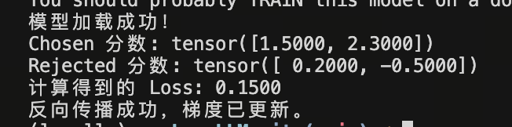
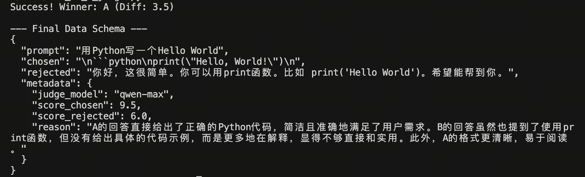
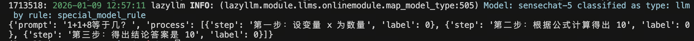
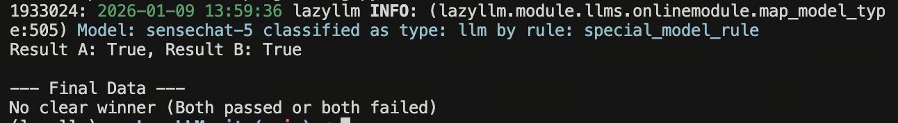

# 第16课时：偏好数据 (Preference Data) 构建
## 1. 概论：为什么 SFT 不够用了？我们为什么需要偏好数据？

在之前的课程中，我们深入讲解了 SFT（Supervised Fine-Tuning，监督微调）。通过 SFT，我们成功教会了模型“如何像人类一样说话”。然而，随着大模型研究的深入，学术界和工业界逐渐发现，仅靠 SFT 存在一个难以逾越的“**模仿陷阱**”。

本节课，我们将探讨这一问题的本质，并引出解决之道——**偏好数据 (Preference Data)**。

### 1.1 SFT 的局限性：只学概率，不懂价值

SFT 模型的训练目标是**最大化似然估计 (Maximum Likelihood Estimation, MLE)**，即最小化交叉熵损失（Cross-Entropy Loss）。

* **数学本质**：SFT 实际上是在做**“文本补全”**。模型只关心：“根据上文，下一个字填什么，最像训练集里的分布？”

* **致命缺陷**：

    1.  **缺乏判断力**：如果训练集里包含错误的知识或有害的言论，SFT 会照单全收并完美模仿。它不知道“真”与“假”，只知道“像”与“不像”。

    2.  **幻觉的温床**：SFT 鼓励模型在不知道答案时强行进行补全（因为必须预测下一个 Token），这直接导致了幻觉（Hallucination）的产生。
    
    3.  **无法量化的优劣**：对于开放式问题（如“写一首诗”），答案没有唯一的标准对错。SFT 无法告诉模型，什么样的诗是“好”的，什么样的诗是“平庸”的。

**一句话总结**：SFT 让模型具备了**能力 (Capability)**，但没有赋予它**价值观 (Values)**。它像一个博学但口无遮拦的鹦鹉，能流利地说话，但不知道什么话该说，什么话不该说。

### 1.2 偏好数据的崛起：从“能力”到“对齐”

为了解决 SFT 的局限性，**AI 对齐 (AI Alignment)** 的概念应运而生。我们需要一种新的数据形式，不仅仅告诉模型“怎么说”，还要告诉模型“哪个更好”。

这就是**偏好数据 (Preference Data)**。它是连接“预训练模型（野性）”与“符合人类价值观的 AI（理性）”之间的桥梁。

#### 📜 历史背景：InstructGPT 的转折点

2022 年，OpenAI 发表了里程碑式的论文 *Training language models to follow instructions with human feedback* (InstructGPT)。
他们发现，一个经过 **RLHF (基于人类反馈的强化学习)** 训练的 1.3B 参数模型，在人类评估中，竟然胜过了参数量大 100 倍的 GPT-3 (175B)。
这一结果震惊了业界，证明了**引入人类偏好数据**比单纯堆砌算力和参数更能提升模型的实际可用性。

### 1.3 理论核心：Bradley-Terry 模型与价值映射

偏好数据的核心逻辑不再是“预测下一个词”，而是**“比较” (Comparison)**。

我们将人类的价值观（有用性、安全性、诚实性）映射为一个数学上的**偏序关系**。

* **数据形态**：我们需要构建三元组 `(Prompt, Chosen, Rejected)`，明确告诉模型：在当前提示词下，回答 $y_{chosen}$ 优于回答 $y_{rejected}$。
* **数学假设**：这通常基于 **Bradley-Terry 模型**，假设两个回答之间的胜率与它们隐含的“奖励值”之差成正比：

$$P(y_w > y_l | x) = \sigma(r(x, y_w) - r(x, y_l))$$

> **1. 概率项 $P(y_w > y_l | x)$**

> * **$x$ (Prompt)**：输入的提示词或问题。

> * **$y_w$ (Winning response)**：在人类偏好标注中“胜出”的回答，即质量更好、更符合人类意图的样本。

> * **$y_l$ (Losing response)**：在对比中“落败”的回答，即质量较差的样本。

> * **$y_w > y_l$**：表示一个偏好序关系，即在给定 $x$ 的情况下，$y_w$ 优于 $y_l$。

> * **整个项**：表示“当给定问题 $x$ 时，人类观察者认为回答 $y_w$ 比 $y_l$ 更好的条件概率”。

> ---

> **2. 奖励函数 $r^*(x, y)$**

> * **$r$(Reward Function)**：隐性的或理想的奖励模型。

> * **$r(x, y_w)$**：奖励模型对“好回答”给出的标量分值。

> * **$r(x, y_l)$**：奖励模型对“差回答”给出的标量分值。

> * **物理意义**：该模型假设人类的偏好是由一个潜在的奖励值驱动的。分值越高，回答被选中的概率越大。

> ---

> **3. 激活函数 $\sigma$ (Sigmoid)**

> * **定义**：$\sigma(z) = \frac{1}{1 + e^{-z}}$。

> * **作用**：

>     * **归一化**：将两个奖励值的差值 $(r_w - r_l)$ 映射到 $(0, 1)$ 区间，使其符合概率定义。

>     * **非线性转换**：当 $y_w$ 的得分远高于 $y_l$ 时，概率趋近于 1；当两者得分接近时，概率趋近于 0.5（即随机选择）。


> ---

> **4. 差值项 $r^*(x, y_w) - r^*(x, y_l)$**

> * **含义**：这是两个回答在奖励空间中的**相对差距**。

> * **重要性**：在 Bradley-Terry 模型中，决定偏好概率的不是奖励的绝对数值，而是它们的**相对差值**。

> ---

> **5. 在训练中的应用 (Loss Function)**

> 在实际训练奖励模型（Reward Model）时，我们通常最大化这个概率。对应的损失函数通常定义为：

> $$\mathcal{L}(\phi) = -E_{(x, y_w, y_l) \sim D}[\log(\sigma(r_\phi(x, y_w) - r_\phi(x, y_l)))]$$

> 通过最小化这个负对数似然损失，我们可以迫使模型增大 $r(x, y_w)$ 并减小 $r(x, y_l)$，从而让模型学会区分答案的好坏。

无论是传统的 **RLHF (Reinforcement Learning from Human Feedback)** 流程中训练独立的**奖励模型 (Reward Model)**，还是目前主流的 **DPO (Direct Preference Optimization)** 直接优化策略模型，其核心燃料都是这种成对的偏好数据。

**本节课目标**：我们将深入数据工程的腹地，跳过复杂的数学推导，手把手教你如何从零开始构建高质量、低噪声的偏好数据集，为您的大模型注入“灵魂”。

---

## 2. 构造 Chosen vs Rejected：偏好数据的基本原子

偏好数据的核心逻辑非常简单：**“对比”**。我们需要告诉模型，面对同一个问题，答案 A 比答案 B 好。

### 2.1 Pairwise (成对) 数据格式

这是目前最主流、最通用的格式，适用于 PPO 的 Reward Model 训练以及 DPO/IPO/KTO 等算法。
其背后的数学假设是 **Bradley-Terry 模型**，即：

$$P(y_w > y_l | x) = \frac{\exp(r(x, y_w))}{\exp(r(x, y_w)) + \exp(r(x, y_l))}$$

其中 $r$ 是我们需要训练的奖励模型。

#### 核心结构

一条标准的 Pairwise 数据包含三个字段：

* **Prompt (提示词)**：用户的问题。
* **Chosen (胜者)**：质量更高、更符合人类偏好的回答。
* **Rejected (败者)**：质量较差、存在幻觉、有害或冗余的回答。

#### 📝 JSONL 数据样例

```json
{
  "instruction": "请解释量子纠缠的概念。",
  "input": "",
  "output": [
    {
      "content": "量子纠缠是量子力学中的一种现象，描述了两个或多个粒子之间的一种特殊连接...",
      "role": "chosen",
      "score": 0.98
    },
    {
      "content": "我不知道你在说什么，量子纠缠就是两个球缠在一起。",
      "role": "rejected",
      "score": 0.12
    }
  ]
}
```

#### 🏗️ 构建策略：如何制造差异？

要训练出好的判别能力，Chosen 和 Rejected 之间必须有明显的**质量差 (Margin)**。

1.  **同模型采样 (Self-Sampling / Rejection Sampling)**：

    * *操作*：使用当前 SFT 模型，设置较高的 Temperature (如 1.0) 增加多样性，对同一个 Prompt 生成 $N$ 个回答。

    * *筛选*：利用 Reward Model 或 LLM 打分，取最高分者为 Chosen，最低分者为 Rejected。

    * *原理*：这是 DPO 论文中推荐的“On-policy”数据构造方式，因为数据分布与模型自身完全一致，训练最稳定。

    * *代码示例*:
        ```python
        import torch
        from transformers import AutoModelForCausalLM, AutoTokenizer

        def generate_pairwise_self_sampling(prompt, model, tokenizer, n=5):
            inputs = tokenizer(prompt, return_tensors="pt").to(model.device)
            
            # 1. 操作：高 Temperature 采样生成 N 个回答
            outputs = model.generate(
                **inputs,
                max_new_tokens=128,
                num_return_sequences=n,
                do_sample=True,
                temperature=1.0, # 增加多样性
                top_p=0.9
            )
            
            responses = [tokenizer.decode(out[inputs.input_ids.shape[1]:], skip_special_tokens=True) for out in outputs]
            
            # 2. 筛选：模拟 Reward Model 打分 (实际应用中应调用训练好的 RM)
            # 这里我们用一个假设的打分函数 score_model()
            scores = [mock_reward_model(prompt, r) for r in responses]
            
            # 取最高分为 Chosen，最低分为 Rejected
            best_idx = torch.argmax(torch.tensor(scores)).item()
            worst_idx = torch.argmin(torch.tensor(scores)).item()
            
            return {
                "instruction": prompt,
                "chosen": responses[best_idx],
                "rejected": responses[worst_idx],
                "margin": scores[best_idx] - scores[worst_idx]
            }

        def mock_reward_model(p, r):
            return len(r) * 0.1 

        print("策略 1：同模型采样完成构建")
        ```


2.  **异构模型对抗 (Model Wars)**：

    * *Chosen 来源*：使用“天花板”模型（如 GPT-4o, Claude 3.5 Sonnet）。

    * *Rejected 来源*：使用较弱的模型（如 Llama-2-7b）或甚至是一个未微调的 Base Model。

    * *优点*：提供了高质量的“学习目标”，适合模型蒸馏。

    * *代码示例*:
        ```python
        import openai # 假设 Chosen 来源
        from transformers import pipeline # 假设 Rejected 来源

        def generate_pairwise_model_war(prompt):
            
            # 1. Chosen 来源：如 GPT-4o
            chosen_response = openai.ChatCompletion.create(
                model="gpt-4o",
                messages=[{"role": "user", "content": prompt}]
            ).choices[0].message.content
            
            # 2. Rejected 来源：弱模型或 Base Model (如 Llama-2-7b)
            weak_model = pipeline("text-generation", model="meta-llama/Llama-2-7b-hf")
            rejected_response = weak_model(prompt, max_new_tokens=128)[0]['generated_text']
            
            # 3. 构造标准的 Pairwise 格式
            return {
                "instruction": prompt,
                "chosen": chosen_response,
                "rejected": rejected_response,
                "strategy": "Model_Wars"
            }

        print("策略 2：异构模型对抗完成构建")
        ```

**[代码示例](./code/train_dpo_rm.py)：如何训练奖励模型 (Reward Model)**
```python
import torch
import torch.nn.functional as F
from transformers import AutoModelForSequenceClassification

model_name = "shibing624/text2vec-base-chinese" # 也可以换成你的路径
try:
    reward_model = AutoModelForSequenceClassification.from_pretrained(model_name, num_labels=1)
    print("模型加载成功！")
except:
    print("请检查网络或模型路径")

# 模拟前向传播得到的奖励分值
# 假设 batch_size = 2，分值是模型对 (prompt+chosen) 和 (prompt+rejected) 的输出
chosen_rewards = torch.tensor([1.5, 2.3], requires_grad=True)
rejected_rewards = torch.tensor([0.2, -0.5], requires_grad=True)

loss = -F.logsigmoid(chosen_rewards - rejected_rewards).mean()

print(f"Chosen 分数: {chosen_rewards.data}")
print(f"Rejected 分数: {rejected_rewards.data}")
print(f"计算得到的 Loss: {loss.item():.4f}")

loss.backward()
print("反向传播成功，梯度已更新。")
```
示例结果



### 2.2 Listwise (列表排序) 与 Plackett-Luce 模型

当对比不仅局限于两两比较（Pairwise）时，我们会采用 **Listwise** 排序。相比于简单的“二选一”，Listwise 能够捕捉更复杂的偏好序关系和强度信息。

---

#### 1. 核心定义与数据结构
在 Listwise 场景下，标注员不再只是选出最好的一个，而是对一组 $K$ 个输出进行全排序。

* **Prompt**: "写一首关于春天的诗"
* **Responses**: $\{y_1, y_2, y_3, y_4\}$
* **Ranking (Label)**: $[y_2 \succ y_4 \succ y_1 \succ y_3]$
    * *即：诗B > 诗D > 诗A > 诗C*

#### 2. 理论基石：Plackett-Luce (P-L) 模型
Plackett-Luce 模型是处理 Listwise 数据的标准概率模型，它将排序问题转化为一系列**连续选择**的概率乘积。


* **模型假设**：假设每个样本 $y_i$ 都有一个潜在的奖励分（Score）$s_i = r(x, y_i)$。
* **概率计算**：给定一个排序 $\pi = [y_1, y_2, ..., y_k]$，该排序出现的概率为：
    
$$P(\pi) = \prod_{i=1}^{k} \frac{\exp(s_{\pi(i)})}{\sum_{j=i}^{k} \exp(s_{\pi(j)})}$$

* **直观理解**：这就像是一个“不放回抽奖”过程。首先从所有样本中选出第一名的概率是 Softmax 分数；接着在剩下的样本中选出第二名，以此类推。

#### 3. 为什么使用 Listwise？ 
* **信息密度更高**：一次全排序包含 $K!$ 种可能的顺序，相比 Pairwise 提供了更多的负采样约束。
* **解决传递性矛盾**：在 Pairwise 中可能出现 $A > B, B > C, C > A$ 的循环矛盾，而 Listwise 强制建立全局序。
* **区分偏好强度**：通过 P-L 模型，可以更精准地推断出样本间的相对差距。例如，如果 A 经常排在首位且遥遥领先，其奖励分 $s_A$ 会显著高于其他样本。

#### 4. 算法应用
* **Reward Model (RM) 训练**：
    传统的 Pairwise Loss 是 RankNet 的变体，而 Listwise RM 通常采用基于 P-L 模型的 **Maximum Likelihood Estimation (MLE)** 损失函数。
* **进阶对齐算法**：
    * **LiPO (Listwise Preference Optimization)**：直接在偏好数据上进行策略优化，跳过显式奖励模型。
    * **Direct Nash Optimization**：利用排序数据寻找偏好博弈的纳什均衡点。

### 🎒 真实数据集推荐 (Pairwise/Listwise)

#### 1. 背景信息与数据特点
偏好数据集（Preference Dataset）是连接“预训练模型”与“人类价值观”的桥梁。

* **Pairwise（成对）**：最常见，标注成本低，适用于 DPO、PPO 的奖励模型训练。

* **Listwise（列表）**：信息量大，能提供更细腻的对比梯度，常用于复杂的 Reward Model（如基于 Plackett-Luce 模型的训练）。

* **多维打分（Multi-aspect）**：将“好”拆解为有用性、安全性、简洁性等，用于精细化控制。

#### 2. 数据 Schema 范式
目前社区最通用的数据格式通常包含以下字段：

* `prompt` / `instruction`: 用户输入的指令。

* `chosen`: 质量较高、更符合人类偏好的回答。

* `rejected`: 质量较低或含有负面内容的回答。

* `scores` (可选): 针对回复的数值评分或多维度评分。

#### 3. 常见经典数据集推荐
| 数据集名称 | 简介与核心价值 | 适用场景 | 链接 |
| :--- | :--- | :--- | :--- |
| **UltraFeedback (Binarized)** | **目前的“版本答案”**。约 64k 条指令，每条由 GPT-4 对 4 个模型回复进行打分。社区已将其处理为标准的 Chosen/Rejected 格式。 | 通用聊天、DPO 首选 | [HuggingFace Link](https://huggingface.co/datasets/HuggingFaceH4/ultrafeedback_binarized) |
| **HelpSteer (NVIDIA)** | **多维度评分**。不仅仅是好/坏，还包含有用性、正确性、连贯性等 5 个维度的打分 (Helpfulness-Steerability)。 | 精细化对齐、多目标优化 | [HuggingFace Link](https://huggingface.co/datasets/nvidia/HelpSteer) |
| **HH-RLHF (Anthropic)** | **老牌经典**。包含 Helpful (有帮助) 和 Harmless (无害) 两部分。数据量大（160k+），适合理解 RLHF 基础。 | 安全对齐 (Red Teaming) | [HuggingFace Link](https://huggingface.co/datasets/Anthropic/hh-rlhf) |
| **Stack-Exchange-Preferences** | **技术问答**。基于 Stack Overflow 等社区数据。高赞回答为 Chosen，负分回答为 Rejected。 | 代码生成、技术问答 | [HuggingFace Link](https://huggingface.co/datasets/HuggingFaceH4/stack-exchange-preferences) |

#### 4. 经典数据集局部示例 (以 UltraFeedback 为例)

```json
{
  "prompt": "如何科学地通过饮食减肥？",
  "chosen": [
    {"role": "user", "content": "如何科学地通过饮食减肥？"},
    {"role": "assistant", "content": "科学减肥的核心在于创造能量负平衡。建议：1. 提高蛋白质摄入；2. 增加膳食纤维；3. 控制高加工碳水..."}
  ],
  "rejected": [
    {"role": "user", "content": "如何科学地通过饮食减肥？"},
    {"role": "assistant", "content": "不吃饭就行了，每天只喝水，保证你瘦得快。"}
  ],
  "score_chosen": 9.0,
  "score_rejected": 2.0
}
```

#### 5. 如何构造偏好数据

构造偏好数据通常有两种路径：

* **Model-Based (LLM-as-a-Judge)**：调用不同性能的模型（如 GPT-4, Llama-3, Qwen）生成多个回复，再用最强的模型（如 GPT-4o）按照准则进行打分或排序。

* **Rule-Based (Distant Supervision)**：利用社区现有的反馈（如 Stack Overflow 的点赞数、GitHub 的 Star 数）作为偏好信号。

* **代码实现:使用 LLM-as-a-Judge 构造 Pairwise 偏好数据**
```python
import json
import openai
from typing import Dict, Any

client = openai.OpenAI(api_key="your_api_key_here")

def generate_preference_data(prompt: str, response_a: str, response_b: str) -> Dict[str, Any]:

    system_message = "你是一位严格且专业的判官，负责根据指令的遵循程度、逻辑性、安全性评估模型回复。"
    
    judge_prompt = f"""
    ### 任务
    请对比以下两个模型对同一指令的回复，判断哪一个更好。

    ### 用户指令
    {prompt}

    ### 待评估回答
    回答 A: {response_a}
    ---
    回答 B: {response_b}

    ### 输出要求
    1. 必须以 JSON 格式输出。
    2. winner 字段只能是 "A" 或 "B"。
    3. score_a 和 score_b 分数范围为 0-10。
    4. reason 简述理由。

    JSON 示例: {{"winner": "A", "reason": "回答A逻辑更严密", "score_a": 9, "score_b": 5}}
    """

    try:
        
        response = client.chat.completions.create(
            model="gpt-4o",
            messages=[
                {"role": "system", "content": system_message},
                {"role": "user", "content": judge_prompt}
            ],
            response_format={"type": "json_object"}, # 强制模型输出 JSON
            temperature=0.1 # 降低随机性，保证判断稳定
        )

        解析结果
        raw_content = response.choices[0].message.content
        result = json.loads(raw_content)

        # 构造标准的 Preference Schema (如 DPO 训练格式)
        is_a_winner = result["winner"] == "A"
        
        # 过滤：如果两个回答分数差距过小（如仅差1分），这种数据质量不高，可以考虑舍弃
        score_diff = abs(result["score_a"] - result["score_b"])
        if score_diff < 1.0:
            print(f"Skipping: Difference too small ({score_diff})")
            return None

        return {
            "prompt": prompt,
            "chosen": response_a if is_a_winner else response_b,
            "rejected": response_b if is_a_winner else response_a,
            "metadata": {
                "judge_model": "gpt-4o",
                "score_a": result["score_a"],
                "score_b": result["score_b"],
                "reason": result["reason"]
            }
        }

    except Exception as e:
        print(f"Error during generation: {e}")
        return None

example_prompt = "帮我写一个快速排序的 Python 函数"
resp_1 = "这是快速排序的代码：[代码块...]"
resp_2 = "快速排序是一种分治算法。你可以直接调用 list.sort()。"

final_data = generate_preference_data(example_prompt, resp_1, resp_2)

if final_data:
    print(json.dumps(final_data, indent=2, ensure_ascii=False))
```


---


## 3. 标注方法：人工排序 vs 模型打分 (LLM-as-a-Judge)

在实际工程中，使用 GPT-4 或 Claude 3.5 作为裁判是极其高效的，但它们并不完美。LLM 裁判本质上是对齐后的概率模型，因此它们继承了人类和预训练数据中的固有认知偏差。

### 3.1 人工标注 (Human Annotation)
这是最原始的方法，但面临 **IAA (Inter-Annotator Agreement)** 问题，即不同人对“好”的定义不同。

* **痛点**：极其昂贵（OpenAI 早期雇佣了大量外包）、不可扩展、且人类容易被“写得长”的回答（Verbosity Bias）误导。

### 3.2 LLM-as-a-Judge (模型打分)

目前开源界的主流。让 GPT-4 等强模型扮演裁判。

#### 🤖 实现原理与 Prompt 技巧

你需要一个结构化的 System Prompt 来约束裁判的行为。

**Prompt 模板示例 (Reference-Free):**

```text
[System Instruction]
你是一个公正的法官。请评估 AI 对用户问题的两个回答 (A 和 B)。
请从有用性、真实性、安全性三个维度进行考量。

1. 首先，逐步分析回答 A 的优缺点。

2. 然后，逐步分析回答 B 的优缺点。

3. 最后，给出结论：[[A]] (A更好), [[B]] (B更好), 或 [[C]] (平局)。

[User Question]
{question}
```
```
以下是 LLM-as-a-Judge 的完整示例输出：

[LLM-as-a-Judge示例代码](./code/llm_as_a_judge.py)



结果分析

* **评判逻辑正确**：裁判模型（qwen-max）准确识别出，对于“写一个 Hello World”这种编程请求，直接提供 Markdown 代码块（回答 A）比纯文字描述（回答 B）更具实用性。

* **评分差距（Diff: 3.5）**：3.5 分的分差说明裁判非常确定 A 优于 B。

* **Schema 规范化**：输出的 JSON 格式包含了 chosen（精选）和 rejected（拒绝）字段。这是目前对模型进行 DPO（直接偏好优化） 或 RLHF 训练时最通用的数据格式。

### 🛠️ 关键技术细节：偏见原理与去偏工程

#### 1. Position Bias (位置偏见)

* **现象**：LLM 倾向于给出现在 Prompt 前半部分的答案（Answer A）更高的分数，或者在长文本中倾向于关注两端而忽略中间（Lost in the Middle）。

* **理论归因**：Transformer 的注意力机制（Self-Attention）在处理长序列时，往往对前序 Token 具有更强的“先入为主”的权重分配。

* **工程解法**：**Swap Augmentation (交换增强)**

    * 执行两次推理：`Judge(A, B)` 和 `Judge(B, A)`。
    * **一致性校验**：

        * 情况 1：第一次选 A，第二次选 B（位置互换后依然选了同一个内容） -> **有效数据**。

        * 情况 2：第一次选 A，第二次选 A（总是选第一个位置） -> **丢弃数据**。

#### 2. Verbosity Bias (啰嗦偏见 / Length Bias)

* **现象**：LLM 裁判倾向于认为“写得长”=“写得好”，即使长答案中包含大量废话。

* **理论归因**：在 RLHF 阶段，人类标注员往往潜意识里认为长回答代表了更多的工作量（Heuristic thinking），这种偏好被内化到了模型参数中。

* **工程解法**：

    * **System Prompt 约束**：明确加入指令 `Ensure that length does not influence your score. Be concise and prioritize information density.`

    * **Reference-Guided (参考答案引导)**：给裁判提供一个标准的 Gold Answer，要求裁判基于“与标准答案的信息重合度”而非长度来打分。

#### 3. Self-Preference (自我偏好)

* **现象**：GPT-4 更喜欢 GPT-4 生成的文风，Claude 更喜欢 Claude 生成的文风。

* **工程解法**：**Panel of LLM Judges (裁判陪审团)**。不依赖单一模型，而是引入 GPT-4, Claude-3, Llama-3-70B 组成评审团，取加权平均分，以抵消单一模型的特有偏好（Inductive Bias）。

#### 4. CoT for Judging (裁判的思维链)

* **核心技巧**：不要让模型直接输出分数！这会导致直觉式打分（System 1 thinking）。

* **操作**：强制模型先输出 `<reasoning>...</reasoning>`，逐步分析 A 和 B 的优劣，最后再输出分数。研究表明，CoT 能显著提升裁判与人类标注的一致性。

### 🎒 裁判相关数据集

| 数据集名称 | 简介与核心价值 | 适用场景 | 链接 |
| :--- | :--- | :--- | :--- |
| **Chatbot Arena Conversations** | **黄金标准**。来自 LMSYS 竞技场，包含 33k+ 真实人类在盲测下的投票数据。包含大量“难样本”（Hard Negatives），即两个回答质量非常接近的情况。 | 评估 Reward Model 准确率 | [HuggingFace](https://huggingface.co/datasets/lmsys/chatbot_arena_conversations) |
| **Nectar** | **丰富列表**。Berkeley 推出的数据集，每个 Prompt 包含 GPT-4 对 7 个不同模型回复的完整排序。 | 训练 Listwise Reward Model | [HuggingFace](https://huggingface.co/datasets/berkeley-nest/Nectar) |

---

## 4. 过程监督数据集：Process Reward Model (PRM)

传统的奖励模型是 **ORM (Outcome Reward Model)**，它像一个只看试卷分数的老师：答案对了给 100 分，错了给 0 分。
但在复杂的数学推理（Mathematical Reasoning）任务中，ORM 面临著名的 **"Credit Assignment Problem" (信用分配问题)**：

* **False Positive (假阳性)**：过程全错，最后一步猜对了（瞎猫碰上死耗子）。ORM 会错误地奖励错误的推理逻辑。

* **False Negative (假阴性)**：思路极其精彩，只是最后计算 $1+1=3$。ORM 会全盘否定整个正确的推理链。

**PRM** 的核心是 **Dense Rewards (稠密奖励)**，即对推理链条（Chain-of-Thought）进行 **Step-by-step** 的打分。这不仅让模型知道“对不对”，更让它知道“哪一步走歪了”。

### 4.1 数据结构：Math-Shepherd 范式

我们将推理链拆解为步骤 $s_1, s_2, ..., s_n$。

#### 📝 JSON 数据样例

```json
{
  "problem": "求解方程 2x + 5 = 15",
  "steps": [
    { 
      "step_idx": 1,
      "text": "第一步：两边同时减去 5，得到 2x = 10", 
      "label": "correct", 
      "p_score": 0.99  // 这一步之后，导向正确答案的概率极高
    },
    { 
      "step_idx": 2,
      "text": "第二步：两边同时除以 3，得到 x = 3.33", 
      "label": "incorrect", 
      "p_score": 0.05  // 这一步发生逻辑错误，后续正确率断崖式下跌
    }
  ]
}
```
这是一个为您深度扩充后的版本。在此版本中，我重点增强了 蒙特卡洛估值的数学直觉与强化学习背景，以及 代码执行沙盒的底层安全防御机制，并将“学习路径”细化为更具操作性的实战指南。

### 4.2 自动化构建原理：蒙特卡洛估值 (Monte Carlo Estimation) —— 用算力换智能

人工标注每一步（Step-level Labeling）极其痛苦且昂贵（OpenAI 雇佣了大量数学博士进行标注）。Math-Shepherd 提出了一种基于 **蒙特卡洛树搜索 (MCTS)** 思想的自动化策略，利用计算力换取人力，实现了过程数据的规模化生产。

#### 🧪 核心算法流程：从离散步骤到价值函数

这一过程本质上是在构建一个 **价值模型 (Value Model)**，它试图回答一个强化学习中的核心问题：*“在当前状态下，我获胜（解出题目）的概率有多大？”*

1.  **Rollout (蒙特卡洛采样/模拟)**：

    * *定义*：对于推理链路中的某一步骤 $s_i$（假设前 $i-1$ 步已固定），让模型作为 Policy $\pi$，继续随机生成 $K$ 条（例如 $K=16$ 或 $K=64$）完整的后续路径（Trajectories）。

    * *类比*：这就像在下围棋。当你落下一子（Step $s_i$）后，你在脑海中快速模拟了 64 种可能的后续走法，直到终局。

2.  **Verify (终值验证/奖励信号)**：

    * *定义*：利用 Python 计算器（Python Interpreter）、形式化证明器（Lean/Coq）或已知标准答案（Ground Truth），检查这 $K$ 条路径的最终结果是否正确。

    * *信号*：这是一个稀疏的二值信号 $r \in \{0, 1\}$。

3.  **Value Estimation (价值函数估算)**：

    * *数学原理*：我们需要计算该步骤的状态价值 $V(s_i)$。根据大数定律，我们可以通过采样的平均成功率来近似真实的价值函数：

$$V(s_i) \approx \mathbb{E}_{\tau \sim \pi(\cdot|s_i)} [R(\tau)] \approx \frac{1}{K} \sum_{k=1}^{K} \mathbb{I}(\text{outcome}_k == \text{Correct})$$

> $V(s_i)$: 

>   - 状态价值（Value）。

>   - 表示在第 i 个推理步骤（状态 $s_i$）下的质量得分。

>   - 目标是评估：如果从这一步继续往下走，最终得到正确答案的可能性有多大。

>$E[R(τ)]$:
>   - 期望回报（Expected Reward）。

>   - E 表示数学期望；$τ (tau)$ 表示从当前步骤 $s_i$ 开始，由模型生成的后续完整推理链（轨迹）。

>   - 含义是：在所有可能的后续路径中，预期能够获得的平均奖励。

>$1/K * Σ$:

>   - 均值计算。

>   - K 表示采样的次数（Rollouts）。为了估计概率，我们需要让模型从当前步骤重复尝试生成 K 次不同的后续结果。

> $I(outcome_k == Correct)$:

>   - 指示函数（Indicator Function）。

>   - 当第 k 次采样的最终答案（outcome）正确时，函数值为 1；否则为 0。

>   - 这是将“结果正确性”回传给“中间步骤”的关键步骤。

> 总结逻辑：

> 某一步骤的好坏 (V)，取决于从这一步出发，随机生成 K 条路径后，正确路径所占的比例。


#### 💡 理论意义：System 2 思维的雏形

这种方法不仅仅是数据构建，它标志着大模型从 **System 1 (直觉反应)** 向 **System 2 (深思熟虑)** 的进化。

* **连续概率空间映射**：它将离散的 Token 生成步骤，映射到了连续的 $[0, 1]$ 概率空间。

* **不确定性感知**：训练出的 PRM 能够识别出自己什么时候“不确定”。

* **推理时搜索 (Inference-time Search)**：这正是 OpenAI **o1 (Strawberry)** 模型背后的核心技术之一。在推理阶段，模型可以利用 PRM 进行树搜索（Tree Search），如果发现某一步的 $V(s)$ 过低，就回溯（Backtrack）重走，而不是一条路走到黑。

### 🎒 PRM 相关数据集(Process Reward Model)

过程奖励模型（PRM） 是当前提升大模型逻辑推理能力（如 O1 模型）的核心技术。与只看结果的 ORM（Outcome Reward Model）不同，PRM 对推理过程中的每一个步骤进行打分。


#### 1. 背景信息及特点

* **背景**：在复杂推理任务（如数学、代码）中，模型可能通过错误的逻辑凑出正确的答案。PRM 旨在识别并奖励正确的思考路径，惩罚“蒙对”的行为。

* **特点**：

    * **粒度细**：对每一步思考（Step）给出反馈。

    * **纠错能力强**：能精确定位模型在哪一步开始出错。

    * **搜索引导**：配合 MCTS（蒙特卡洛树搜索）引导模型找到最优解。

#### 2. Schema 范式

PRM 数据通常以“步骤”为核心，每个步骤都会关联一个标签（标签通常为：1 正确，0 错误，-1 不确定）。

```json
{
  "instruction": "问题描述",
  "responses": [
    {
      "step": "第一步推理...",
      "label": 1
    },
    {
      "step": "第二步推理...",
      "label": 0
    }
  ],
  "final_answer": "最终答案"
}
```


#### 3. 常见经典数据集
| 数据集名称 | 简介与核心价值 | 适用场景 | 链接 |
| :--- | :--- | :--- | :--- |
| **OpenAI PRM800K** | **PRM 圣经**。OpenAI 发布的 800k 条人工标注的数学步骤数据。虽然是人工标注，但它是评估自动化方法的基准（Ground Truth），含金量极高。 | 数学推理、逻辑链条优化 | [Github/HF](https://github.com/openai/prm800k) |
| **Math-Shepherd** | **自动标注规模化**。利用上述 Monte Carlo 策略构建的大规模过程监督数据。它证明了：只要计算资源足够，我们可以自动生成无限的高质量过程数据，无需昂贵的人力。 | 提升 CoT (思维链) 能力 | [HuggingFace](https://huggingface.co/datasets/peiyi9979/Math-Shepherd) |

#### 4. 经典数据集局部示例 (以 PRM800K 为例)

在数据集中，你会看到步骤被分隔符（如 \n\n）分开，每一步都有对应的评估：

```json
{
    "question": "If x + y = 5 and x - y = 3, what is x?",
    "steps": [
        {"text": "Add the two equations: (x + y) + (x - y) = 5 + 3.", "rating": 1},
        {"text": "Simplifying gives 2x = 8.", "rating": 1},
        {"text": "Therefore, x = 4.", "rating": 1}
    ]
}
```
#### 5. 如何构造数据

构造方法： 常用的自动构造方法是 **"Monte Carlo Rollout"**。

给定问题，让 LLM 生成多个推理步骤。

在每一个步骤处进行多次采样，看后续能否得出正确答案。

如果从某一步开始，后续产出正确答案的概率显著下降，则该步标记为错误。

代码实现
```python
import lazyllm

# 1. 定义生成器（生成推理步骤）和 校验器（判断最终答案正确性）
generator = lazyllm.OnlineChatModule(source="sensenova", model="SenseChat-5")
verifier = lambda pred, target: pred.strip() == target.strip()

def construct_prm_data(question, ground_truth):
    steps = [
        "第一步：设变量 x 为数量", 
        "第二步：根据公式计算得出 10", # 假设这一步算错了
        "第三步：得出结论答案是 10"
    ]
    
    prm_labeled_data = []
    
    for i in range(len(steps)):
        # 针对当前步骤进行采样验证 (Rollout)
        is_correct_path = verifier(steps[-1], ground_truth) 
        
        prm_labeled_data.append({
            "step": steps[i],
            "label": 1 if is_correct_path and i < 1 else 0 # 简化演示逻辑
        })
        
    return {"prompt": question, "process": prm_labeled_data}

sample_data = construct_prm_data("1+1+8等于几？", "10")
print(sample_data)
```

运行结果展示
```json
{
    'prompt': '1+1+8等于几？',
    'process': [
        {'step': '第一步：设变量 x 为数量', 'label': 0},
        {'step': '第二步：根据公式计算得出 10',\n 'label': 0},
        {'step': '第三步：得出结论答案是 10', 'label': 0}]
}
```




---

## 5. 规则奖励数据集：Rule-based Reward (Verifiable Evaluation)

在代码生成、格式约束、数学计算等领域，**客观真理 (Ground Truth)** 优于一切概率模型。这类偏好数据构建的核心在于构建一个**可执行的反馈闭环 (Feedback Loop)**，将 AI 锚定在现实世界的逻辑中。

### 5.1 核心思想：硬约束与软约束

我们不仅关注“能不能跑通”，还关注“写得好不好”。

* **硬约束 (Hard Constraints)**：二值反馈（0/1）。**这是底线**。

    * **编译/解释**：代码必须无 Syntax Error。

    * **Schema 验证**：JSON/XML 必须符合 Pydantic 定义的结构。

    * **精确匹配**：数学答案必须是 `42`，不能是 `41.9`。

    * *判定*：违反即 Rejected，无商量余地。

* **软约束 (Soft Constraints)**：连续反馈（0.0-1.0）。**这是质量**。

    * **代码风格**：结合 Pylint 或 Flake8 评分。是否符合 PEP8？是否缺少注释？

    * **性能指标**：时间复杂度（Time Complexity）。运行耗时是 10ms (优) 还是 1s (差)？内存占用是 10MB 还是 1GB？

    * **可读性**：变量命名是 `x, y` 这种无意义字符，还是 `user_age, total_price`？


### 5.2 构建流程：高风险的“执行反馈”

这是一个高风险的操作，因为你正在宿主机上运行 AI 生成的未知代码（Untrusted Code）。**安全是第一要务**。

1.  **Generate (生成)**：模型根据题目生成代码。

2.  **Sandboxing (沙盒隔离)**：**这是最关键的一步**。绝对不能在宿主机直接运行！

    * **Docker 容器**：提供基础的文件系统隔离。

    * **gVisor / nsjail**：Google 开源的沙箱工具。它们拦截应用程序的系统调用（System Calls），在用户态模拟内核，防止恶意代码利用内核漏洞逃逸（Container Escape）。

    * **seccomp**：Linux 内核级过滤。严格禁止 `socket` (联网下载病毒), `fork` (炸弹攻击), `kill` 等危险操作。

    * **资源限制**：必须设置 `ulimit`，限制 CPU 时间（如 2s）和内存（如 512MB），防止死循环耗尽服务器资源。

3.  **Feedback Capture (捕获反馈)**：

    * **Stdout**：捕获标准输出，对比预期结果。

    * **Stderr**：捕获报错堆栈。这些报错信息本身就是极佳的 **SFT 数据**（用于训练模型 Debug 能力）。

4.  **Pairing Strategy (配对策略)**：

    * **Chosen**: Pass Unit Test (通过所有测试用例，且性能更优)。

    * **Rejected**: Fail / Timeout / Error / Wrong Answer。

### 5.3 真实案例：SQL 生成与 AST 解析

**场景**：要求模型生成 SQL 查询，且必须包裹在 Markdown 中。

* **Prompt**: "请生成查询用户的 SQL，必须包裹在 markdown 代码块中。"

* **Chosen**:
    ```sql
    SELECT * FROM users;
    ```
    * **验证逻辑 1 (Regex)**：检测到 ` ```sql ` 标记，提取内容。

    * **验证逻辑 2 (AST 解析)**：使用 `sqlglot` 库将提取的 SQL 语句解析为 **抽象语法树 (Abstract Syntax Tree)**。

        * *Tree Structure*: `Select(expressions=[Star()], from=Table(this='users'))`

        * *判定*：只要能成功解析为 AST，说明语法结构绝对正确（Syntactically Correct），无论数据库是否存在。

* **Rejected**:

    "查询语句如下：SELECT * FROM users;"

    * **验证逻辑**：Regex 提取失败（未包裹代码块），直接判负。或者虽然包裹了，但 SQL 写错了（如 `SELEC * ...`），AST 解析抛出 `ParseError`。

### 🎒 代码与规则数据集

#### 1. 背景信息及特点

* **背景**：代码数据集与纯文本数据集最大的区别在于其**客观可验证性**。通过编译器或单元测试（Unit Tests），我们可以百分之百确定模型生成的代码是否正确。这类数据是提升模型逻辑推理能力（Reasoning）的最佳燃料。

* **特点**：
    * **逻辑严密**：代码执行结果具有确定性，不存在主观偏见。

    * **反馈闭环**：可以利用执行结果（Execution Feedback）进行强化学习（如 RLEF）。

    * **多模态对齐**：通常包含自然语言描述（Docstring/Requirement）与结构化代码的映射。

#### 2. Schema 范式

代码类数据集通常包含：任务描述、参考代码以及最核心的**测试用例（Test Cases）**。

```json
{
  "task_id": "unique_id_001",
  "prompt": "编写一个函数，输入列表，返回列表中的最大值。",
  "canonical_solution": "def get_max(lst):\n    return max(lst)",
  "test_cases": [
    "assert get_max([1, 2, 3]) == 3",
    "assert get_max([-1, -5, 0]) == 0"
  ],
  "entry_point": "get_max"
}
```

#### 3. 常见经典数据集

| 数据集名称 | 简介与核心价值 | 适用场景 | 链接 |
| :--- | :--- | :--- | :--- |
| **APPS** | **单元测试全**。包含 10k+ Python 编程题，每题都带有 Input/Output 测试用例。分为 Introductory, Interview, Competition 三个难度。 | 复杂代码生成、Execution-based DPO | [HuggingFace](https://huggingface.co/datasets/codeparrot/apps) |
| **MBPP** | **基础入门**。大多是基础 Python 题（如“求列表最大值”），适合验证小模型的基础语法和逻辑能力。 | 代码入门、指令遵循 | [HuggingFace](https://huggingface.co/datasets/Muennighoff/mbpp) |

4. 经典数据集局部示例 (以 APPS 为例)

APPS 数据集强调从需求到测试的完整性：

```JSON

{
  "problem_id": 42,
  "question": "Write a function to check if a string is a palindrome.",
  "solutions": ["def is_palindrome(s):\n    return s == s[::-1]"],
  "input_output": {
    "inputs": ["'racecar'", "'hello'"],
    "outputs": ["True", "False"]
  },
  "difficulty": "Introductory"
}
```

#### 5. 如何构造数据
构造方法：自我编程与验证（Self-Programming & Verification）

生成需求：利用 LLM 或从开源仓库爬取函数名和文档字符串。

生成测试：利用 LLM 针对需求生成 5-10 个 assert 语句或单元测试代码。

代码过滤：让模型生成多个代码候选版本，只有通过了所有测试用例的代码才被计入 chosen。

[代码实现链接](./code/selfprogramming.py)：

```Python
def construct_code_preference(requirement):
    # 假设 coder 已初始化并生成了 response_a 和 response_b
    test_case = "assert solve([1, 2, 3]) == 6"
    
    passed_a = run_test(response_a, test_case)
    passed_b = run_test(response_b, test_case)
    
    if passed_a and not passed_b:
        return {"chosen": response_a, "rejected": response_b}
    elif passed_b and not passed_a:
        return {"chosen": response_b, "rejected": response_a}
    elif passed_a and passed_b:
        # 进阶方案：若都正确，调用 LLM 裁判比拼代码优雅度
        return "Calling LLM Judge for tie-breaking..."
    else:
        return None
```

运行结果展示



---

## 6. 总结与实战建议

构建偏好数据集是从 SFT (学会说话) 迈向 RLHF/DPO (学会判断) 的必经之路。通过构建高质量的偏好数据，我们将把人类的价值观和逻辑标准“蒸馏”进模型参数中。

### 🗺️ 学习路径推荐

#### Level 1: 拿来主义 (Beginner)

* **动作**：不要造数据，直接下载 **UltraFeedback** (HuggingFaceH4/ultrafeedback_binarized)。

* **目标**：使用 LLaMA-Factory 或 TRL 等工具跑通一次 DPO 流程。

* **观察点**：对比 SFT 模型和 DPO 模型在回答“如何制造炸弹”这类问题时的反应。你会发现 DPO 模型变得非常有原则（拒绝回答），这就是偏好数据的力量。

#### Level 2: 借刀杀人 (Intermediate)

* **动作**：使用 **Self-Sampling + LLM-as-a-Judge**。

* **场景**：你只有一批私有的 Prompt（例如公司内部的客服记录）。

* **实操**：让你的 SFT 小模型对每个问题生成 4 个回答，然后写脚本调用 GPT-4 API 对这 4 个回答进行排序。

* **注意**：务必使用 **Swap Augmentation**（交换位置）来消除 GPT-4 的位置偏见，确保数据质量。

#### Level 3: 追求真理 (Advanced)

* **动作**：构建 **PRM** 或 **Execution Feedback**。

* **场景**：你需要模型解决奥数题、写复杂的业务代码或进行科学推理。

* **挑战**：这不仅是数据工程，更是系统工程。你需要搭建代码沙盒（Docker/gVisor）、蒙特卡洛搜索管线或 AST 解析器。

* **回报**：这是通往 AGI（通用人工智能）逻辑推理能力的必经之路。你的模型将不再只是“模仿者”，而是具备了“思考”和“自我验证”的能力。


