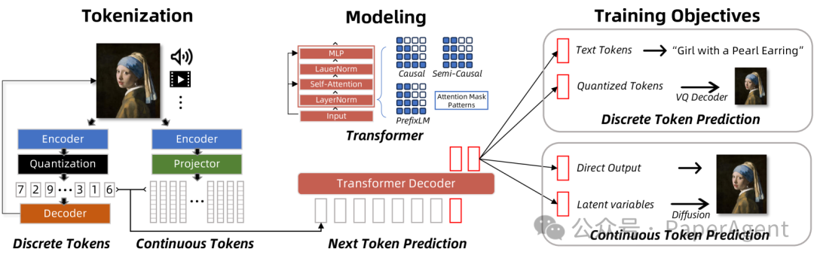
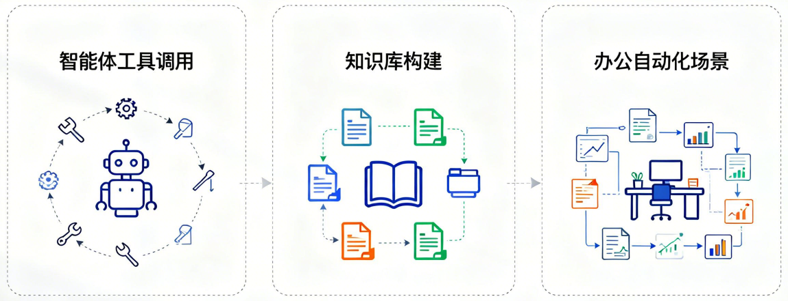

# 第17课时：结构化输出与格式对齐

## 1 本课导读

### 1.1 核心背景：从“闲聊”到“办事”

在大模型能力逐渐成熟之后，真正制约其落地价值的，往往不再是“会不会回答问题”，而是“能不能被系统可靠地使用”。在真实业务场景中，大模型并不是独立存在的对话机器人，而是需要嵌入到一整套确定性的软件系统中，与数据库、后端服务、规则引擎、自动化流程紧密协作。这一步，恰恰是从“能聊天”走向“能办事”的关键分水岭。

这里的核心矛盾在于：大语言模型本质上是一个**概率生成系统**。



在给定上下文的情况下，它生成下一个 token 的过程可以形式化为
 
$$
x_{t+
1} \sim P(x \mid x_{\le t})
$$

其中，$x_t$ 表示序列中第 $t$ 个位置的 token，$x_{\le t}$ 表示从起始位置到第 $t$ 个位置为止的全部已生成 token 序列，$x_{t+1}$ 是模型在当前上下文条件下预测的下一个 token；$P(x \mid x_{\le t})$ 表示语言模型在给定历史上下文 $x_{\le t}$ 时，对所有可能候选 token 的条件概率分布，符号“$\sim$”表示 $x_{t+1}$ 是从该概率分布中采样或选择得到的结果。

这种机制天然追求“合理”“自然”，却并不关心输出是否严格符合某种格式规范。而软件系统恰恰相反，它依赖的是高度确定、可解析、可校验的结构化接口，例如固定字段的 JSON、层级明确的 XML，或者严格类型约束的参数对象。当模型输出只多一句解释性文字、少一个右括号，甚至只是把数字写成字符串时，在人类看来可能无关紧要，但对程序而言却是“不可用”的致命错误。这也是为什么在 Agent 工具调用、函数调用、RAG 知识库构建等场景中，“格式正确率”往往比“语言是否优美”更加重要。

可以把这个问题类比为：人类在口头交流中可以模糊表达、上下文补全，但在填写表单或提交 API 请求时，每一个字段、每一种类型都必须精确无误。结构化输出，正是让大模型学会“像程序一样说话”的过程。

### 1.2 本课目标

本课的核心目标，并不是简单地教会你“让模型输出一个 JSON”，而是系统性地解决**如何让模型稳定、可控、规模化地输出高质量结构化结果**这一问题。

首先，我们会从提示层面入手，理解为什么普通自然语言指令在结构化任务中经常失效，以及如何通过明确的 Schema 描述、示例约束和边界提示，引导模型在生成阶段就“走在正确的轨道上”。你将掌握一套可复用的方法，使模型在面对不同输入时，仍然能够保持输出结构的一致性和可解析性。

其次，本课会深入到**数据层面**，讨论结构化信息抽取任务对数据集的特殊要求。相比开放式问答，这类任务更强调字段对齐、类型一致和内容可验证性。我们会讲清楚什么样的数据才算“高质量的结构化数据”，以及如何通过数据合成、自动校验和负样本设计，逐步逼近真实业务中的复杂场景。

在**训练与推理层面**，你将理解结构化能力并非“自然涌现”，而是可以通过监督微调和推理约束被显著强化的能力。例如，为什么在微调阶段强调 Schema 严格对齐，会直接影响推理时的格式遵从率；又例如，在生成阶段引入语法约束解码，本质上是在搜索空间中对非法路径进行剪枝。

最后，在**实践部分**，我们会基于 LazyLLM 给出一条完整、可落地的工程流程：从原始文本数据出发，经过 Schema 设计、数据准备、模型微调，到最终评测与效果验证。你不仅能看到“模型学会了什么”，还能清楚地理解“它为什么能学会、在哪些情况下依然会失败”。

通过这一课，你将具备把大模型安全、可靠地接入工程系统的能力，为后续更复杂的 Agent 系统、多工具协同和企业级应用打下坚实基础。

## 2 为什么需要结构化输出

### 2.1 关键应用场景

当大模型真正进入生产环境后，它面对的对象不再只是“人”，而是大量需要自动化处理的系统与流程。在这些场景中，自然语言只是输入形式，真正被下游系统消费的，几乎全部是结构化数据。结构化输出的价值，并不体现在“更好看”，而体现在“能被稳定执行”。



在智能体工具调用（Agent Tool Use）中，这一点体现得尤为明显。Agent 的核心能力并不是“想得多聪明”，而是“能不能把正确的参数传给正确的工具”。当模型需要调用一个函数时，往往必须生成一个严格符合 Schema 的 JSON 对象，例如函数名、参数列表、参数类型都不能出错。哪怕只是在 JSON 外多输出了一句解释性文本，解析就会直接失败，导致整个 Agent 流程中断。在这一场景下，模型生成行为更接近于“构造一段程序输入”，而不是“回答一个问题”。

知识库构建（RAG）是另一个高度依赖结构化输出的典型场景。真实业务中的文档往往是非结构化的，比如 PDF、Word、网页正文或扫描文本。如果只是让模型“概括一下内容”，它可以写出一段看似合理的摘要，但这些内容很难被复用。而当我们希望将文档纳入知识库，就必须把关键信息拆解为可索引、可过滤、可组合的字段，例如标题、作者、时间、章节结构、关键实体等。只有当模型输出的是稳定的结构化结果，后续的向量化、存储和检索才能形成一条可靠的流水线。

在办公自动化场景中，结构化输出几乎是隐形的基础设施。无论是从邮件中提取待办事项，从会议纪要中整理行动项，还是将日报、周报自动转化为系统表单，本质上都需要模型完成“自然语言 → 结构化记录”的转换。人类可以在模糊表述中自行理解优先级和责任人，但系统无法依赖这种隐含语义，只能依赖明确字段来驱动流程。例如，一个待办事项是否包含截止时间、负责人是否唯一、任务状态是否合法，这些都直接决定了自动化是否可行。

可以看到，在这些场景中，大模型的角色已经发生变化：它不再只是一个“语言生成器”，而是一个结构化信息生产器，是自动化系统中的上游组件。一旦输出失控，影响的不只是一次回答，而是整条业务链路。

### 2.2 主要挑战与痛点

尽管结构化输出在工程系统中至关重要，但对大模型而言，“按要求生成结构”并不是一件自然的事情。实践中，问题往往集中在以下三类，而且都具有**对人类友好、对机器致命**的特点。

**格式错误（Format Errors）**

这是最直观、也最常见的问题。模型在生成过程中，容易在结构边界处“失手”，例如括号不匹配、字段名拼写不一致，或在结构外混入解释性文本。这些错误在人眼看来几乎不影响理解，但会直接导致解析失败。

示例（期望输出）：

```json
{"name": "Alice", "age": 23}
```

模型可能输出：

```text
用户信息如下：
{"name": "Alice", "age": 23
```

问题点包括：

* JSON 外层混入自然语言文本
* 缺少右花括号
* 结果整体无法被解析器读取

**内容幻觉（Content Hallucination）**

在结构化任务中，幻觉通常不是“胡编乱造一段话”，而是模型*擅自补全 Schema 未要求或原文未提供的信息。这些内容往往“看起来合理”，但在工程语义上是明确错误的。

示例（原文只提供姓名）：

```text
Name: Alice
```

期望输出：

```json
{"name": "Alice"}
```

模型可能输出：

```json
{"name": "Alice", "age": 23, "gender": "female"}
```

问题点包括：

* 输出了 Schema 中未定义的字段
* 编造了输入中不存在的信息
* 难以通过简单规则判断其“是否可信”

在开放式问答中，这种行为可能被视为“智能补全”，但在结构化抽取中属于严重错误。

**类型不匹配（Type Mismatch）**

类型问题在工程中往往最容易被低估，却最容易引发隐蔽故障。模型并不真正理解“类型约束”，很容易在数值、字符串、枚举和数组之间自由切换。

示例（Schema 要求 `age` 为整数）：

```json
{"name": "Alice", "age": 23}
```

模型可能输出：

```json
{"name": "Alice", "age": "23"}
```

或：

```json
{"name": "Alice", "age": "twenty-three"}
```

问题点包括：

* 数字被输出为字符串
* 枚举值被替换为自然语言描述
* 单值字段被错误地包装成数组

这些错误在小规模测试中不一定立即暴露，但在写入数据库或对接下游系统时，往往会以“偶发异常”的形式出现，极大增加排查和维护成本。从根本上看，这三类问题并不是模型“不理解任务”，而是模型的生成目标与工程系统的约束目标并不一致。模型在训练时优化的是条件概率：

$$
\max_\theta \sum_t \log P_\theta(x_t \mid x_{<t})
$$

其中，$\theta$ 表示模型的可学习参数集合；$x_t$ 表示序列中第 $t$ 个位置生成的 token；$x_{<t}$ 表示在当前位置之前已经生成的所有 token 构成的上下文；$P_\theta(x_t \mid x_{<t})$ 是在参数为 $\theta$ 的模型下，给定历史上下文 $x_{<t}$ 时生成下一个 token 为 $x_t$ 的条件概率；对时间步 $t$ 的求和表示对整段序列中每一步预测的对数似然进行累积最大化，这正是自回归语言模型的基本训练目标。

也正因为如此，模型在生成时天然更关注输出在整体上是否“自然、连贯、合理”，而并不直接关心结果是否严格符合某个预定义的 Schema，或类型是否可以被程序安全校验。如果缺乏明确的结构约束、针对性的训练数据以及推理阶段的控制手段，模型往往会本能地优先保证语言流畅性，从而牺牲结构上的确定性。所以，结构化输出的难点并不在于模型是否“理解了任务”，而在于如何在生成过程中持续约束模型的行为，让它在每一次输出时都主动收敛语言表达的自由度，严格遵循既定的结构规范。这也正是后续章节反复强调 Schema 设计、数据流水线构建以及推理约束机制的根本原因。

## 3 结构化抽取的数据集生态

### 3.1 数据集结构解析

在结构化信息抽取任务中，“数据集长什么样”本身就决定了模型最终会学到什么能力。与普通对话、摘要或问答数据不同，结构化抽取数据集并不是简单地给模型一段文本、让它自由回答，而是通过精心设计的输入形式，明确告诉模型：**你现在面对的是一个受约束的生成任务**。

一个完整、规范的结构化抽取样本，通常由三部分共同构成，而不是单一的“文本输入”。

第一部分是**任务指令**，用于定义模型的角色和行为边界。例如明确这是一个信息抽取任务、要求只输出结构化结果、禁止附加解释性语言等。这一部分的作用，是在生成行为发生之前，就先“收紧”模型的自由度，让它意识到自己不是在做闲聊或写作。

第二部分是**Schema 描述**，也就是目标结构的形式化定义。Schema 可以是字段列表、JSON Schema、类 TypeScript 接口，或者带自然语言说明的结构约束。它回答的是“要抽什么、以什么结构输出”的问题，是整个样本中最关键的约束信息。Schema 的存在，等价于在输出空间中提前划定了一组合法路径，模型所有的生成都应当落在这组路径之内。

第三部分才是**原始文本**，即需要被抽取信息的非结构化内容，例如简历、新闻段落、合同条款或对话记录。模型并不是直接对文本“自由理解”，而是在 Schema 的约束下，对文本进行有目标的解析。

因此，一个更准确的抽象形式应当是：  
> Input = 任务指令 + Schema + 原始文本  
> Output = 严格符合 Schema 的 JSON

例如，在一个联系人信息抽取任务中，模型实际看到的 Prompt 可能类似于：

```text
你是一个信息抽取模型。
请根据给定的 Schema，从文本中抽取对应字段。
要求只输出 JSON，如果字段无法确定则输出 null。

Schema:
{
  "name": string,
  "phone": string,
  "school": string
}

文本:
张三毕业于北京大学，联系电话是 13800001234。
```

对应的输出必须是一个**完全可解析、无冗余内容的结构化结果**：

```json
{
  "name": "张三",
  "phone": "13800001234",
  "school": "北京大学"
}
```

这里需要特别注意的是：在结构化抽取数据集中，Prompt 本身就是训练信号的一部分。模型不仅在学习如何从文本中找信息，也在学习如何遵守指令、如何理解 Schema、以及在不确定时如何克制生成。这也是为什么同样是“抽取姓名和电话”，不同数据集训练出来的模型，在格式稳定性和幻觉控制上会有巨大差异。

从输出角度看，这类数据集还有一个显著特征：**结果高度确定**。在给定文本和 Schema 的前提下，合理输出通常是唯一或近似唯一的。这使得结构化抽取任务更适合采用字段级准确率、格式正确率等指标进行评估，而不是关注语言多样性。

理解这种数据结构，有助于在后续构建或使用数据集时避免一个常见误区：只关心“抽得对不对”，却忽略了“是不是在正确的结构约束下抽的”。而在真实工程中，后者往往比前者更重要。

### 3.2 常见开源数据集介绍

结构化抽取相关的数据集并不是“为了结构而结构”，而是在不同任务需求的推动下逐步演化形成的。从弱约束的语义三元组，到强约束、可直接执行的 SQL 或代码，再到工程化指令微调数据，这些数据集共同构成了一条清晰的能力演进路径。下面在前一版的基础上，对每一个数据集补充更完整的背景、结构特点与工程意义说明。

**一、通用信息抽取类数据集**

- [CaST (Commonly used Slot and Type)](https://huggingface.co/datasets/Babelscape/rebel-dataset)：CaST 或与其相关的 REBEL 数据集是当前关系抽取任务的基石之一。它通过对维基百科进行深度处理，将非结构化文本转化为“头实体-关系-尾实体”的三元组格式。该数据集涵盖了超过 200 种不同的关系类型，使其成为训练通用抽取模型的理想选择。在 SFT 阶段使用此数据集，可以显著提升模型在面对未知文本时识别潜在逻辑关联的能力，尤其是对于那些需要从长段落中理清人物、地点及事件关系的场景。

```json
{
  "title": "Wikipedia Article Title",
  "context": "Full text paragraph...",
  "triplets": [
    {"head": "Subject Entity", "type": "Relation Type", "tail": "Object Entity"}
  ]
}
```

- [OpenIE6 / OIE2016](https://github.com/dair-iitd/openie6)：OIE2016 是首个在大规模语料基础上构建的、包含丰富语法结构和语义关系的开放信息抽取数据集。与传统预定义关系的抽取不同，它不限制关系的类别，而是要求模型直接从句子中提取出谓语及其相关的论元（主语、宾语等）。在微调 LLM 时，该数据集能训练模型理解自然语言中的叙述结构，使其能够以“谁做了什么”的格式总结任何输入的文本。这对于构建自动化知识图谱或摘要生成工具至关重要。

```json
{
  "sentence": "The president visited the capital in 2023.",
  "extractions": [
    {"arg1": "The president", "rel": "visited", "arg2": "the capital", "tm": "in 2023"}
  ]
}
```

- [CoNLL-2003 (NER)](https://huggingface.co/datasets/eriktks/conll2003)：作为命名实体识别（NER）领域的金标准，CoNLL-2003 专注于四种核心实体：人名、地名、组织机构名以及其他杂项实体。虽然它诞生较早，但其标注的高准确性使其至今仍是微调结构化输出能力的首选。通过将此数据集转化为指令格式（例如：“请提取下文中的所有地点名”），可以训练模型对文本边界的敏感度，防止在抽取任务中出现“幻觉”或提取不完整的情况，是构建任何信息抽取系统的“第一课”。

```json
{
  "tokens": ["U.N.", "official", "Ekeus", "heads", "for", "Baghdad"],
  "ner_tags": [3, 0, 1, 0, 0, 5], // 3: B-ORG, 1: B-PER, 5: B-LOC
  "ner_labels": ["B-ORG", "O", "B-PER", "O", "O", "B-LOC"]
}
```

- [DocRED (Document-level RE)](https://huggingface.co/datasets/thunlp/docred)：传统的抽取任务往往局限于单句，而 DocRED 挑战的是文档级关系抽取。它要求模型阅读多段文字，识别跨句子的实体，并推断它们之间的隐藏关系。该数据集包含海量的标注三元组，不仅涵盖了实体识别，还涉及到了指代消解和推理。在 SFT 中引入 DocRED，可以训练模型处理长上下文的能力，使其具备在复杂背景下整理出结构化信息的能力，而非仅仅停留在字面上的简单匹配。

```json
{
  "vertexSet": [[{"name": "Entity A", "pos": [0, 2], "type": "ORG"}], [...]],
  "labels": [
    {"h": 0, "t": 1, "r": "P17", "evidence": [1, 2]} // h: head, t: tail, r: relation_id
  ],
  "sents": [["Sentence", "1", "..."], ["Sentence", "2", "..."]]
}
```

**二、垂直领域抽取数据集**

- [CMeEE (Chinese Medical Entity Extraction)](https://tianchi.aliyun.com/dataset/144495)：CMeEE 是中文医疗信息处理（CHIP）挑战赛的一部分，是目前最权威的中文医疗实体识别数据集之一。它包含了疾病、症状、药物、化验指标等九大类复杂的医学概念。医疗领域的文本通常含有大量专业术语和长难句，使用该数据集进行微调，可以极大提升 LLM 在智慧医疗助手、电子病历分析等场景下的专业度，使模型能够精准识别出医学报告中的核心要素，为后续的结构化辅助诊断打下基础。

```json
{
  "text": "患者近期出现偏头痛，建议服用布洛芬。",
  "entities": [
    {"start_idx": 5, "end_idx": 7, "type": "sym", "entity": "偏头痛"},
    {"start_idx": 11, "end_idx": 13, "type": "dru", "entity": "布洛芬"}
  ]
}
```

- [FINER (Financial Entity Recognition)](https://huggingface.co/datasets/nlpaueb/finer-139)：FINER-139 是一个针对金融领域新闻和公告设计的大规模数据集。不同于普通的 NER，它细化了多达 139 种金融相关的标签，如“营收增长率”、“资产负债项”等。金融文本通常逻辑极其严密且包含大量数字，模型需要极高的精确度才能确保提取的数据具有可用性。通过 SFT，模型可以学习到金融报表的特有语境和术语缩写，从而能够胜任自动化金融审计、研报分析和结构化财务摘要的生成工作。

```json
{
  "tokens": ["Revenue", "increased", "by", "10", "percent"],
  "ner_tags": [0, 0, 0, 45, 46], // 45-46 对应金融比例或数值标签
  "nested_entities": "..." 
}
```

- [SciERC (Scientific IE)](https://nlp.cs.washington.edu/sciIE/)：SciERC 专注于科学论文摘要的信息抽取。它包含了 500 篇 AI 领域论文的摘要，标注了科学实体（如方法、度量、任务）以及它们之间的相互关系（如“USED-FOR”、“PART-OF”）。在学术研究日益增多的今天，利用 SciERC 微调模型，可以让 AI 辅助科研人员快速梳理领域技术脉络，自动生成论文的“技术画像”，将繁杂的学术语言转化为清晰的结构化图谱。

```json
{
  "clusters": [],
  "sentences": [["Text", "of", "abstract", "..."]],
  "ner": [[[0, 1, "Method"], [5, 6, "Task"]]],
  "relations": [[[0, 1, 5, 6, "USED-FOR"]]]
}
```

- [ADE (Adverse Drug Events)](https://huggingface.co/datasets/ade-benchmark-corpus/ade_corpus_v2)：ADE Corpus V2 专门用于从医学文本中提取药物副作用（不良反应）及其相关实体。它要求模型识别出特定药物与患者产生的不良症状之间的因果关系。这种带有逻辑链条的抽取任务比单纯的分类更具挑战性。通过该数据集微调，模型在处理患者自述或医生诊疗记录时，能更敏锐地捕捉到安全隐患，是构建药物监控系统或自动化医药报告生成的关键数据来源。

```json
{
  "text": "Arthralgia occurred after taking Ribavirin.",
  "adverse_effects": [
    {"effect": "Arthralgia", "start": 0, "end": 10, "drug": "Ribavirin"}
  ]
}
```

**三、代码与查询类结构化任务数据集**

- [Spider (Complex Text-to-SQL)](https://yale-lily.github.io/spider)：Spider 是目前最广泛使用的跨域 Text-to-SQL 数据集。它包含 1 万多个查询和 200 多个复杂的数据库。与简单的任务不同，Spider 要求模型处理多表连接（JOIN）、嵌套查询以及复杂的聚合操作（GROUP BY/HAVING）。通过 Spider 进行 SFT，能让 LLM 真正理解自然语言与逻辑查询语言之间的语义映射，使非技术人员也能通过对话直接从复杂的业务数据库中调取结构化报表。

```json
{
  "question": "How many singers do we have?",
  "db_id": "concert_singer",
  "query": "SELECT count(*) FROM singer",
  "sql": {"select": [[7, [0, [0, 0, false], null]]], "from": {"table_units": [["table_unit", 1]], "conds": []}}
}
```

- [MBPP (Mostly Basic Python Problems)](https://huggingface.co/datasets/google-research-datasets/mbpp)：MBPP 包含大约 1,000 个入门级 Python 编程问题，每个问题都附带了任务描述、代码实现和用于验证的单元测试用例。不同于纯代码补全，MBPP 更侧重于“根据描述写代码”。在 SFT 过程中，MBPP 能训练模型理解功能性需求，并产出语法正确且逻辑闭环的代码块。它是提升 LLM 编程辅助能力的基础，尤其是在解决特定算法问题和基础逻辑实现方面表现出色。

```json
{
  "task_id": 1,
  "text": "Write a function to find the area of a circle.",
  "code": "import math\ndef circle_area(r):\n    return math.pi * r**2",
  "test_list": ["assert circle_area(2) == 12.566370614359172"]
}
```

- [WikiSQL](https://github.com/salesforce/WikiSQL)：WikiSQL 是 Text-to-SQL 任务的入门级大数据集，包含由维基百科表格生成的 8 万多条自然语言查询及其对应的 SQL 语句。虽然它的逻辑复杂度低于 Spider，主要侧重于单表查询（SELECT, WHERE 子句），但其巨大的数据量非常适合初步培养模型对表格结构的感知。微调后的模型能够胜任从 Excel 或简单数据表中提取、过滤信息的任务，是开发智能表格助手（Chat-with-Table）的必备素材。

```json
{
  "phase": 1,
  "question": "What is the result for the team with 3 wins?",
  "sql": {
    "sel": 2, "conds": [[0, 0, "3"]], "agg": 0
  },
  "table": {"header": ["Team", "Wins", "Result"], "rows": [["A", "3", "Win"]]}
}
```

- [CoSQA (Code Question Answering)](https://huggingface.co/datasets/gonglinyuan/CoSQA)：CoSQA 聚焦于代码搜索和自然语言问答。它包含了 2 万多对来自真实搜索引擎的查询和 Python 函数实现。这个数据集的独特之处在于它体现了人类在寻找代码解决方案时的真实提问习惯（往往是非规范、口语化的）。使用 CoSQA 微调，可以增强模型在“理解人类意图”与“检索/生成准确算法”之间的匹配能力，非常适合用于优化 IDE 插件或开发者文档的搜索体验。

```json
{
  "question": "python check if file exists",
  "code": "import os.path\nos.path.isfile(fname)",
  "docstring": "Checks if a file exists given a path...",
  "label": 1 // 1 for match, 0 for non-match
}
```

**四、指令微调与格式约束数据集**

- [OpenHermes 2.5](https://huggingface.co/datasets/teknium/OpenHermes-2.5)：OpenHermes 2.5 是目前开源界公认的高质量合成数据集，由 Teknium 整理。它汇集了超过 100 万条指令对，涵盖了数学推理、复杂代码编写、创意写作以及极其严格的格式化约束任务。该数据集的优势在于其多样性，它迫使模型学会“听话”，即严格遵守指令中的 JSON 格式要求、字数限制或特定的语气风格。它是目前许多顶级开源模型（如 Hermes 系列）能够展现出超越其参数量能力的秘密武器。

```json
{
  "instruction": "Explain quantum physics to a 5-year-old in JSON format.",
  "input": "",
  "output": "{\"explanation\": \"It's like being in two places at once...\"}",
  "source": "platypus",
  "model_name": "gpt-4"
}
```

- [UltraChat](https://huggingface.co/datasets/stingning/ultrachat)：UltraChat 是一个专注于多轮对话和复杂指令遵循的数据集。它通过自动化的方式生成了涵盖常识咨询、逻辑推理和角色扮演等多个维度的对话流。对于需要进行长流程、多步骤结构化抽取的任务，UltraChat 能训练模型保持上下文的一致性。通过此数据集微调，模型能更好地处理那种“先提取信息，再根据提取结果进行分类，最后输出指定格式报告”的复合型指令任务。

```json
{
  "id": "0",
  "data": [
    {"role": "user", "content": "How can I improve my focus?"},
    {"role": "assistant", "content": "There are several ways..."},
    {"role": "user", "content": "Can you give me a schedule?"}
  ]
}
```

- [LIMA (Less Is More for Alignment)](https://huggingface.co/datasets/GAIR/lima)：LIMA 数据集遵循“少即是多”的原则，仅包含 1,000 条经过人工极致精选的高质量样本。虽然数量不多，但每条样本都代表了人类对复杂问题的完美回答范式。在结构化任务中，LIMA 能够帮助模型摆脱冗长、重复的废话，学会以最高效、最清晰的结构回复用户。它是微调模型输出风格、提升回答质感的极佳选择，尤其适用于追求高审美、逻辑分明的指令响应场景。

```json
{
  "conversations": [
    "How do I cook a perfect steak?",
    "To cook a perfect steak, follow these steps: 1. Season... 2. Sear... 3. Rest..."
  ],
  "source": "reddit/stackexchange"
}
```

- [Self-Instruct (Instruction Following)](https://github.com/yizhongw/self-instruct)：Self-Instruct 是一种创新的数据集生成方法产物，它展示了如何引导模型自己生成多样化的指令。它包含大量涵盖了排版、改写、结构化数据转换等任务的指令对。在 SFT 中使用它，可以弥补人工标注数据在覆盖面上的不足。该数据集特别擅长训练模型的“元能力”，即让模型理解不同任务类型的本质区别，从而在面对全新的、从未见过格式约束任务时，仍能保持极高的鲁棒性和遵循度。

```json
{
  "instruction": "Categorize the following animals into mammals or reptiles.",
  "input": "Snake, Dog, Turtle, Cat",
  "output": "Mammals: Dog, Cat. Reptiles: Snake, Turtle.",
  "most_similar_instructions": ["..."]
}
```

从这些数据集可以看到，结构化抽取并不是单一任务，而是一组围绕“受约束生成”展开的能力集合。不同数据集通过不同的 Schema 设计方式，塑造了模型在结构遵循、信息对齐和生成克制性方面的行为特征，这也是它们在工程实践中长期具有参考价值的原因。

## 4 构建高质量结构化数据集的流水线

### 4.1 Step 1: Schema 设计（核心）

在结构化抽取任务中，Schema 设计几乎决定了数据集的上限。很多看似是“模型能力不足”的问题，最终都会回溯到 Schema 本身是否清晰、稳定、可执行。Schema 并不仅仅是字段列表，它实际上承担着“任务定义”的角色：哪些信息是合法的、哪些输出是被允许的、哪些情况需要保持空值或缺失。

在工程实践中，最常见的两种 Schema 表达方式是 JSON Schema 和基于 Pydantic 的数据模型。JSON Schema 更偏向协议层和跨语言表达，适合直接用于校验和接口定义；Pydantic 则更贴近 Python 工程生态，可以将数据约束、类型检查和默认值自然地融合在一起。无论采用哪一种，其目标都是一致的：让结构定义足够明确，使“正确输出”在形式上是可判断的。

设计 Schema 时，首先需要关注字段的语义边界。每一个字段都应当回答一个明确的问题，而不是承载多重含义。例如，“学校信息”与“毕业院校”在很多场景下并不等价，如果混用，模型就会在训练过程中形成模糊映射，最终导致输出不稳定。清晰的语义定义，本质上是在为模型减少歧义空间。

其次是层级设计。初学者往往倾向于构造深层嵌套的结构，试图一次性表达所有关系，但在结构化抽取任务中，过深的层级会显著增加生成难度。实践中更推荐“能扁平就扁平”，只在确有必要时引入嵌套对象或数组。扁平化结构不仅更容易生成，也更容易被校验、调试和消费。

数据类型的明确性同样关键。字段是字符串、整数、枚举还是数组，都应在 Schema 中明确给出，而不是依赖自然语言暗示。对于模型而言，类型约束是一种非常强的生成信号，它能有效减少“看起来对、实际上错”的输出情况。在某些场景下，枚举类型甚至比自由字符串更重要，因为它直接限定了合法值集合。

下面是一个简化的 Pydantic 示例，用于说明 Schema 在工程中的具体形态：

```python
from pydantic import BaseModel
from typing import List, Optional

class ResumeInfo(BaseModel):
    name: str
    phone: Optional[str]
    school: Optional[str]
    skills: List[str]

# 打印 Schema 结构
print(ResumeInfo.schema())
```

输出如下：

```bash
{'properties': {'name': {'title': 'Name', 'type': 'string'}, 'phone': {'anyOf': [{'type': 'string'}, {'type': 'null'}], 'title': 'Phone'}, 'school': {'anyOf': [{'type': 'string'}, {'type': 'null'}], 'title': 'School'}, 'skills': {'items': {'type': 'string'}, 'title': 'Skills', 'type': 'array'}}, 'required': ['name', 'phone', 'school', 'skills'], 'title': 'ResumeInfo', 'type': 'object'}
```

在工程实践中，像 `ResumeInfo.schema()` 这样的输出非常有价值。它会以结构化的方式展示每个字段的名称、类型、是否必填以及可选约束条件，既可以作为人类可读的接口文档，也可以直接作为模型提示、数据校验或自动化测试的输入依据。这个 Schema 本身就已经包含了大量隐含约束：字段是否必填、类型边界、可为空的情况。这些信息在后续的数据合成、模型微调以及推理阶段的结果校验中，都会被反复利用，从而将“结构要求”从概念层面真正落到工程实现中。

### 4.2 Step 2: 数据合成

在明确 Schema 之后，下一步往往不是立刻去人工标注数据，而是通过数据合成的方式快速构建高质量样本。尤其是在结构化抽取任务中，人工标注不仅成本高，而且很难保证结构一致性。利用强模型进行逆向生成，已经成为实践中非常常见且有效的策略。

所谓“逆向生成”，核心思路并不是先写文本再抽结构，而是反过来：先生成一个完全符合 Schema 的结构化结果，然后再构造一段自然语言文本，使其能够合理地支撑这些字段值。这样做的最大好处是，输出结构天然是合法的，几乎不会出现字段缺失或类型错误。

以简历信息抽取为例，可以先让模型生成一个合法的 JSON：

```json
{
  "name": "李明",
  "phone": "13912345678",
  "school": "清华大学",
  "skills": ["Python", "数据分析", "机器学习"]
}
```

随后，将这一结构作为条件输入，让模型反向生成一段自然语言简历文本。下面是一个简化的逆向工程示例代码，用于演示这一过程：

```python
import json
from lazyllm import OnlineChatModule

llm = OnlineChatModule()

# 已生成的结构化结果
resume_json = {
    "name": "李明",
    "phone": "13912345678",
    "school": "清华大学",
    "skills": ["Python", "数据分析", "机器学习"]
}

prompt = f"""
下面是一个简历的结构化信息（JSON），请基于这些信息生成一段自然、真实的中文简历描述文本，
要求所有字段信息都能在文本中被明确或隐含地表达出来，不要引入额外不存在的事实。

结构化信息：
{json.dumps(resume_json, ensure_ascii=False, indent=2)}
"""

text = llm(prompt)

print("=== 合成的简历文本 ===")
print(text)
```

一次典型的模型合成输出可能类似于：

```bash
=== 合成的简历文本 ===
李明，手机联系方式为13912345678。他是一位来自清华大学的高材生，拥有扎实的学术背景和丰富的实践经验。在技术技能方面，李明精通Python编程语言，具备强大的数据分析能力，同时在机器学习领域也有深入的研究和应用经验。这些技能使他能够在多个领域中发挥出色的解决问题的能力，无论是数据分析还是机器学习项目，他都能游刃有余地应对挑战。李明期待能够加入一个充满挑战与机遇的团队，以进一步发挥他的技术才能和创新能力。
```

在这种流程下，每一个样本在结构层面都是“完美的”，训练时模型只需要学习如何从文本中还原这些结构，而不必再为字段缺失、类型错误或非法 JSON 付出额外代价。在实践中，这一过程通常会被拆分为两个自动化阶段：第一阶段批量生成符合 Schema 的结构化样本；第二阶段以这些结构为条件，生成多样化的自然语言文本。通过调节生成温度、提示风格和上下文约束，可以有效提升文本多样性，避免模型只学到固定模板。需要强调的是，数据合成并不是一次性工作，而是一个可迭代的过程。早期样本可以保持字段齐全、语义清晰，帮助模型快速建立“文本—结构”映射；随着训练推进，再逐步引入缺失字段、模糊表述、顺序打乱甚至干扰信息，使数据分布更接近真实业务场景。

从概率建模的角度看，这种逆向生成方式等价于在训练数据中人为强化：

$$
P(\text{Structure} \mid \text{Text})
$$

其中，$\text{Text}$ 表示输入的自然语言文本（如一段简历描述），$\text{Structure}$ 表示与之对应的结构化表示（如符合 Schema 的 JSON 对象）。条件概率 $P$ 描述的是：在给定一段文本的前提下，模型生成某一结构化结果的可能性大小。通过逆向生成的数据合成方式，训练样本中的每一段文本几乎都只对应一个合法且完整的结构输出，这相当于在数据层面显式压缩了条件分布的熵，使模型在学习过程中更容易将文本映射到唯一、稳定的结构，而不是在多个格式或字段组合之间产生不确定性。

在此基础上，配合合理的 Schema 设计与可控的数据合成策略，可以在不依赖大规模人工标注的前提下，构建出质量稳定、约束明确的结构化抽取数据集，为后续的自动校验、微调训练和推理约束奠定坚实基础。

### 4.3 Step 3: 自动化校验与清洗

当结构化数据开始批量生成后，真正决定“这批数据能不能用”的，并不是生成模型本身，而是后续的自动化校验与清洗体系。很多结构化抽取任务在实验阶段效果看起来不错，但一旦进入规模化训练或下游系统，就会暴露出大量隐性问题：JSON 偶发不可解析、字段缺失、类型漂移、模型“看起来很合理但实际上是编造”的值。这一阶段的目标不是追求完美，而是通过工程化手段，把不可控的不确定性压缩进可控范围。

最基础的一层是语法校验，解决的是“机器能不能读”的问题。对于 JSON、YAML、XML 这类强结构输出，任何一个多余的逗号、未闭合的括号都会让样本直接失效。在流水线中，语法校验应当是最先执行的硬门槛，不通过就直接丢弃或回炉重生成，而不是进入人工修补阶段。实践中，很多团队会同时保留原始输出与解析失败日志，用于后续分析模型的格式稳定性，而不是简单地“修好就算”。

通过语法校验之后，第二层是 Schema 校验，它关心的是“结构是否符合预期”。这一步不只是检查字段是否存在，更重要的是类型一致性与约束条件。例如某个字段被定义为 `List[str]`，却偶尔被模型输出为单个字符串；某些数值字段理论上应该满足 $x \ge 0$，但模型在边界情况下输出了负值。Schema 校验的价值在于，它把原本分散在 prompt 中的隐性约束，变成了可执行、可复现的规则。

在工程实现上，JSON Schema 或 Pydantic 非常适合作为这一层的“守门人”。一个常见做法是：先解析 JSON，再用 Schema 校验器进行严格校验，失败的样本统一进入失败队列。示例如下：

```python
from pydantic import BaseModel, ValidationError
from typing import List, Optional

class PersonSchema(BaseModel):
    name: str
    age: Optional[int]
    organizations: List[str]

def validate(sample):
    try:
        obj = PersonSchema(**sample)
        return True, obj
    except ValidationError as e:
        return False, e
```

第三层是内容一致性校验，也是最容易被忽视、但对结构化抽取质量影响最大的部分。结构是对的、类型也是对的，并不意味着内容是真的。模型非常擅长在上下文模糊时“补全一个看起来合理的值”，尤其是在实体抽取、数值抽取、时间抽取等任务中。内容一致性校验的核心问题只有一个：输出的值，是否真的能在源文本中找到证据。

这一层通常需要结合规则与轻量模型共同完成。例如，对于字符串字段，可以直接检查是否为源文本的子串；对于经过归一化的值，可以先做反归一化再匹配；对于跨度型输出，可以要求模型同时输出起止位置，用 offset 对齐原文。在更复杂的场景中，也可以引入一个 verifier 模型，对“文本 + 抽取结果”进行二次判断，过滤明显不一致的样本。虽然这会引入额外成本，但相比污染整个训练集，代价是可控的。

### 4.4 Step 4: 数据增强与负样本构建

如果说前面的步骤是在“保住下限”，那么数据增强与负样本构建决定的，是模型能否学会真正可靠的抽取行为。很多结构化抽取模型在 demo 阶段表现良好，一到真实数据就开始胡乱填值，其根本原因并不是模型能力不足，而是训练数据里几乎没有“什么都不该抽取”的样本。

在真实世界中，“无结果”本身就是一种非常重要的结果。文本里可能根本不存在某类实体、某个字段信息缺失、某个问题本身就是不成立的。如果训练数据中几乎所有样本都有非空输出，模型自然会形成强烈的先验：不管有没有，都要给点东西。这正是幻觉产生的温床。

因此，负样本并不是附加项，而是结构化数据集设计中的必要组成部分。一种常见做法是，针对已有样本，系统性地构造“无法提取”的变体。例如保留 Schema 不变，但输入文本中刻意移除关键信息；或者更换查询，使其与文本主题不匹配。此时，期望输出应当是 `null`、空数组，或显式的 `not_found` 标记，而不是模型自由发挥。

在 Schema 层面，提前为这种情况预留表达空间非常重要。比起让模型输出一个空字符串，更推荐使用语义明确的结构表示，例如：

```json
{
  "entities": [],
  "found": false
}
```

这样的设计能显著降低后续系统对“异常值”的处理复杂度，同时也让模型更清楚地理解“什么都没抽到”并不是错误答案。

数据增强还可以从分布层面入手，用来提升模型的鲁棒性。例如对同一结构化目标，构造多种语言风格的输入：正式描述、口语表达、长句嵌套、跨段落信息分散；或者在不影响关键信息的前提下，引入噪声句子、插入无关实体。这样得到的数据，不是简单的数量扩充，而是在输入空间中“填洞”，避免模型只在非常窄的分布上表现良好。

在流水线实现上，增强与负样本生成往往和 Step 2 的数据合成共用一套基础设施，只是控制变量不同。可以先从结构出发，系统性枚举“信息缺失”“信息冲突”“信息模糊”的几种模式，再批量生成对应样本。只要 Schema、校验与标注规则保持一致，这类样本就可以自然地融入训练集，而不会引入额外的学习负担。

当自动化校验、内容一致性约束和负样本机制同时存在时，结构化数据集才真正具备了工程意义上的可靠性。模型不再只是学会“怎么填一个 JSON”，而是在不断被纠正中学会：什么时候该抽、抽什么、以及什么时候必须明确地什么都不抽。

## 5 提升结构化能力的训练与推理技术

如果说前一章解决的是“数据本身靠不靠谱”，那么这一章讨论的，就是在数据质量已经可控的前提下，如何系统性地提升模型对结构化任务的**内在服从性**。实践中可以明显观察到：哪怕使用同一批数据，不同训练与推理策略下，模型在 Schema 遵循度、稳定性、幻觉概率上的表现差异会非常大。这些差异并不是随机波动，而是由一整套方法论共同塑造的结果。

### 5.1 提示工程优化

在结构化抽取任务中，Prompt 并不是“随便包一层说明文字”，而是模型理解 Schema、生成边界和输出责任的第一道约束。一个设计良好的 Prompt，往往可以在不改模型、不加训练的情况下，将结构错误率直接压到一个可接受区间。

Few-shot 示例几乎是不可或缺的。相比抽象的文字说明，模型对“长什么样才算正确输出”的理解，主要来自具体样本。尤其是在字段较多、嵌套层级存在但又被刻意压扁的 Schema 中，单靠自然语言描述很容易产生歧义。Few-shot 示例的关键不在于数量，而在于覆盖典型边界情况：字段为空、数组为空、部分字段缺失但整体结构仍然合法。这些示例在无形中告诉模型，**哪些位置可以是空的，哪些位置绝对不能乱填**。

在 Schema 描述方式上，TypeScript 风格定义在实践中非常高效。相比冗长的自然语言解释，类似下面这种写法既节省 Token，又具备极强的结构暗示能力：

```ts
type Person = {
  name: string;
  age?: number;
  organizations: string[];
}
```

这里的符号本身就携带了清晰且紧凑的语义信息：`string`、`number` 表示字段的基础类型，`string[]` 表示这是一个由字符串组成的数组；而 `age` 后面的 `?` 则表示该字段是**可选的**，也就是说在合法的结构中可以存在，也可以缺失，但一旦出现就必须满足对应的类型约束。

这些符号并不是给模型“讲道理”用的，而是直接复用了模型在大量代码语料中已经反复见过的高频结构模式。模型并不需要真正理解 TypeScript 这门语言的语法规则，但在统计意义上，它已经学会了：`?` 往往意味着“可能为空或不存在”，数组标记意味着“可以有多个值”，而基础类型则约束了输出内容的形式。相比于用自然语言解释“age 是一个可选的整数类型字段”，这种半形式化、强结构暗示的写法更短、更明确，也更不容易在生成过程中被模型误解或忽略，因此在结构化输出和数据合成任务中表现得更加稳定。

此外，Prompt 中明确标注输出边界同样重要。例如要求“只输出 JSON，不要包含任何解释文字”，并配合示例展示“正确答案从哪里开始、在哪里结束”，可以显著减少模型在输出前后加说明、加总结的概率。这种约束并不优雅，但在工程上非常有效。

### 5.2 监督微调

提示工程解决的是“能不能用”的问题，而监督微调解决的是“能不能长期稳定地用”。当结构化抽取成为核心能力之一，仅靠 Prompt 是不够的，模型需要在参数层面建立起 Schema 与输出行为之间的强绑定。

监督微调的训练目标，并不是让模型“学会 JSON”，而是让它在看到某类输入时，条件反射式地进入“严格结构化输出模式”。这意味着训练数据中，结构错误、边界模糊、随意补全的情况必须被系统性清除，否则模型会学到相互冲突的信号。

在微调实践中，一个非常有效的小技巧是引入显式的边界标记，例如 `<json_start>` 与 `<json_end>`。这些标记并不属于 JSON 本身，但在训练阶段，它们为模型提供了一个清晰的“生成状态切换信号”：在标记之间，我的唯一任务就是生成符合 Schema 的内容。久而久之，模型会在内部形成一种模式感知，输出稳定性明显提升。

从损失函数的角度看，微调过程本质上仍然是在最小化负对数似然：

$$
\mathcal{L} = - \sum_{t=1}^{T} \log p(y_t \mid y_{<t}, x)
$$

其中，$x$ 表示模型的输入文本（如一段待抽取的信息描述），$y = (y_1, y_2, \dots, y_T)$ 表示对应的目标输出序列，即展开后的结构化结果；$T$ 为输出序列的总长度，$y_t$ 表示第 $t$ 个生成 token，$y_{<t}$ 表示在当前位置之前已经生成的所有 token。条件概率 $p(y_t \mid y_{<t}, x)$ 刻画的是在给定输入文本和历史生成上下文的条件下，模型生成当前 token 的概率，整个损失函数通过对所有位置的负对数似然求和，约束模型逐步生成符合目标结构的完整序列。

不同之处在于，这里的 $y_t$ 序列高度结构化，任何一个 token 的偏差，都会在后续级联放大。这也是为什么结构化任务对训练数据一致性异常敏感：一次“看似无害”的格式错误，可能会被模型学成一种合法变体。

在数据组织上，常见做法是将输入统一包装为“指令 + Schema + 文本”，输出严格限制在 JSON 区域内。长期来看，这类微调会让模型在面对陌生但形式相似的 Schema 时，也能保持较高的遵循度，而不仅仅是记住某一份固定模板。

### 5.3 推理时约束

即便经过精心 Prompt 设计和监督微调，模型在推理阶段仍然可能出现结构漂移，尤其是在长文本、多字段或低资源语言场景下。因此，推理时约束并不是“锦上添花”，而是结构化系统中的最后一道保险。

语法引导解码的核心思想，是在生成阶段直接**禁止模型走向非法路径**。实现方式通常基于一个预定义的语法状态机，最常见的形式是 Trie 树。在每一步生成时，根据当前已生成的 token 前缀，计算“接下来哪些 token 在语法上是合法的”，然后对其他 token 进行掩码。

从形式上看，模型的原始分布是：

$$
p(t \mid \text{context})
$$

其中，$t$ 表示当前一步待生成的候选 token，$\text{context}$ 表示由输入文本及已生成 token 共同构成的生成上下文。

在语法约束下，实际采样分布变为：

$$
p'(t) \propto p(t) \cdot \mathbf{1}(t \in \text{ValidTokens})
$$

$p(t \mid \text{context})$ 是模型在无任何约束下对下一个 token 的原始预测概率分布。$\text{ValidTokens}$ 表示在当前语法状态下允许出现的合法 token 集合，通常由语法状态机或 Trie 树根据已生成前缀动态给出；$\mathbf{1}(t \in \text{ValidTokens})$ 为指示函数，当 $t$ 属于合法集合时取值为 1，否则为 0。经过该指示函数加权后，得到的 $p'(t)$ 实际上是在原始分布基础上对非法 token 进行屏蔽并重新归一化后的采样分布，从而保证生成过程始终沿着语法允许的路径前进。这种方法并不会改变模型的参数，只是在解码层面收紧了搜索空间。

以 JSON 为例，当模型刚生成完一个字段名并输出冒号时，下一步在语法上只能是一个合法的值起始符号（引号、数字、`null`、`[`、`{` 等）。如果模型倾向于输出换行解释文字，这种 token 会被直接屏蔽，根本没有被采样的机会。

在工程实现上，可以先根据 JSON Schema 自动生成一个语法图，再在解码过程中动态维护状态。这类方法已经在一些库中得到实现，但即便是自定义的简化版本，也足以将解析失败率从个位数百分比压到接近零。

需要注意的是，语法引导并不能解决“内容是否真实”的问题，它只关心“形式是否合法”。因此，它必须与前文提到的内容一致性校验配合使用。前者保证模型不乱写格式，后者保证模型不乱编事实，两者缺一不可。

当提示工程、监督微调与推理时约束形成闭环时，结构化能力不再依赖模型“自觉”，而是被牢牢嵌入到训练与推理的每一个阶段中。模型在这种体系下学到的，不只是如何生成一个看起来像 JSON 的输出，而是如何在约束之内，稳定、克制且可验证地完成抽取任务。

## 6 评测指标与方法

在结构化抽取任务中，评测本身往往比训练更“工程化”。原因很简单：模型输出的不是一段可读文本，而是要被下游系统直接消费的结构数据。一次看似微小的错误，例如字段缺失、类型不匹配或隐蔽的幻觉，都可能在后续流程中被无限放大。因此，评测指标的设计目标并不是“语言是否自然”，而是**结构是否可靠、内容是否可信、失败是否可控**。

### 6.1 核心评测指标

最基础也是最直观的指标是格式错误率。它回答的是一个二值问题：模型输出是否是一个合法、可解析的结构。以 JSON 为例，只要存在括号不闭合、非法字符、键值不成对等问题，就会被直接判定为格式错误。这一指标通常不关心内容对不对，只关心“能不能被程序读进去”。在工程实践中，这是一个硬门槛，格式错误率一旦超过某个阈值，模型就不具备上线价值。

在实现层面，格式错误率的计算通常非常直接：对每条输出尝试解析，如果抛出异常则计为一次错误。假设共有 $N$ 条样本，其中 $E$ 条无法解析，则：

$$
\text{FormatErrorRate} = \frac{E}{N}
$$

这个指标的意义在于，它反映了模型在结构约束下的稳定程度，也间接体现了 Prompt、微调和推理约束是否发挥了作用。

字段级准确率是结构化抽取中最核心的内容指标。与传统文本分类或生成不同，这里不再评价“整段输出像不像答案”，而是逐字段比较预测值与参考答案是否一致。对于一个包含 $K$ 个字段的 Schema，可以分别计算每个字段的准确率，也可以汇总为整体指标。

在最简单的设定下，如果某字段预测值与标注完全一致，则记为正确，否则为错误。整体字段级准确率可以表示为：

$$
\text{FieldAcc} = \frac{1}{N \times K} \sum_{i=1}^{N} \sum_{j=1}^{K} \mathbf{1}(\hat{y}_{ij} = y_{ij})
$$

其中 $\hat{y}_{ij}$ 是第 $i$ 条样本中第 $j$ 个字段的预测结果，$y_{ij}$ 是对应的真值。需要注意的是，这里“相等”的定义必须结合字段类型来设计，例如字符串是否需要忽略空格、数字是否允许浮点误差、日期是否允许多种表示形式。

幻觉率是近年来在结构化任务中越来越受关注的指标。它关注的不是“抽得准不准”，而是模型有没有**编造不存在的信息**。在抽取任务中，幻觉往往表现为：字段看起来很合理，但在源文本中根本找不到对应证据。这类错误尤其危险，因为它们往往不会触发格式错误，也可能通过简单的字段级对齐检查。

幻觉率的一个常见定义方式是：在所有非空预测字段中，统计其值是否能在原始文本中被直接或模糊匹配到。设 $H$ 为幻觉字段数量，$P$ 为所有预测字段总数，则：

$$
\text{HallucinationRate} = \frac{H}{P}
$$

尽管这种定义较为粗糙，但在工程上非常实用，尤其适合用于对比不同模型或不同训练策略下的风险水平。

### 6.2 自动化评测实践

如果评测流程依赖人工检查，那么结构化能力几乎无法规模化迭代。因此，自动化评测脚本是结构化抽取系统的基础设施之一。一个典型的评测流程通常包括四个阶段：解析、对齐、判定和汇总。下面结合一个**简化但可直接落地的完整示例**，把这四个阶段串起来。

假设我们的任务是从文本中抽取如下 Schema：

```json
{
  "name": "string",
  "phone": "string | null",
  "school": "string | null",
  "skills": "list[string]"
}
```

并且我们已经准备好了三类数据：

* `source_text`：原始输入文本
* `pred_text`：模型输出的 JSON 字符串
* `gold_json`：人工或合成得到的标准答案（dict）

#### 一、解析阶段：结构是否合法

解析阶段只做一件事：判断模型输出是否是**合法 JSON**，并在合法时转为 Python 对象。

```python
import json

def parse_json(text):
    try:
        return json.loads(text), True
    except Exception:
        return None, False
```

在主流程中，我们通常会这样使用：

```python
pred_obj, is_valid = parse_json(pred_text)
if not is_valid:
    metrics["format_error"] += 1
    return  # 直接跳过该样本
```

这一步的关键在于**尽早失败**。任何结构不合法的输出，都不应该进入后续字段评测阶段，否则会引入噪声，甚至导致评测脚本本身崩溃。

#### 二、字段对齐：基于 Schema 的自动遍历

字段对齐的前提是 Schema 稳定且已知。实际中，Schema 通常会被写成配置或代码常量，例如：

```python
SCHEMA_FIELDS = {
    "name": "string",
    "phone": "string",
    "school": "string",
    "skills": "list"
}
```

对齐过程本质上就是：
对 Schema 中的每个字段，同时取出预测值和真值。

```python
def align_fields(pred_obj, gold_obj, schema_fields):
    aligned = {}
    for field in schema_fields:
        aligned[field] = {
            "pred": pred_obj.get(field),
            "gold": gold_obj.get(field)
        }
    return aligned
```

这样做的好处是，即使模型遗漏字段，也会显式得到 `None`，而不是悄悄跳过。

#### 三、字段级判定：类型感知的比较逻辑

字段级准确率的核心在于：**不同类型用不同的判定策略**。下面给出一个简化但实用的实现。

```python
def field_match(pred, gold, field_type):
    if gold is None:
        return pred is None

    if field_type == "string":
        if pred is None:
            return False
        return str(pred).strip() == str(gold).strip()

    if field_type == "list":
        if not isinstance(pred, list):
            return False
        return set(pred) == set(gold)

    return False
```

在主评测逻辑中：

```python
aligned = align_fields(pred_obj, gold_json, SCHEMA_FIELDS)

for field, info in aligned.items():
    field_type = SCHEMA_FIELDS[field]
    is_correct = field_match(info["pred"], info["gold"], field_type)
    metrics["field_total"][field] += 1
    if is_correct:
        metrics["field_correct"][field] += 1
```

这种写法有一个很重要的优点：
当你新增字段或修改字段类型时，只需要改 Schema，而不需要改评测主逻辑。

#### 四、幻觉检测：内容一致性校验

幻觉检测关注的是：**预测值是否能在原文中找到证据**。在工程上，通常采用“保守但可扩展”的策略。

```python
def is_hallucinated(value, source_text):
    if value is None:
        return False
    if isinstance(value, list):
        return any(str(v) not in source_text for v in value)
    return str(value) not in source_text
```

在评测循环中：

```python
for field, info in aligned.items():
    pred_val = info["pred"]
    if is_hallucinated(pred_val, source_text):
        metrics["hallucinated_fields"] += 1
    metrics["predicted_fields"] += 1
```

这类实现虽然无法覆盖指代、省略等复杂语言现象，但在对比模型版本、Prompt 或训练策略时，已经足够敏感。

#### 五、指标汇总：形成可对比的数字结果

最后，将所有中间统计量汇总为可读指标：

```python
format_error_rate = metrics["format_error"] / metrics["total_samples"]

field_acc = {
    f: metrics["field_correct"][f] / max(1, metrics["field_total"][f])
    for f in SCHEMA_FIELDS
}

hallucination_rate = (
    metrics["hallucinated_fields"] / max(1, metrics["predicted_fields"])
)
```

在真实项目中，通常还会把这些指标按以下维度切分：

* 文本长度区间（短 / 中 / 长）
* 字段类型
* 是否包含缺失字段
* 是否为负样本

这样一来，评测脚本不仅能告诉你“模型好不好”，还能回答“**模型具体是在哪些情况下开始不稳定的**”。

当解析、对齐、判定和汇总这四个阶段形成稳定流水线后，结构化抽取任务就具备了真正的工程可控性。模型训练、Prompt 调整和推理约束的效果，都可以通过同一套评测逻辑被精确捕捉，这也是结构化输出系统能够持续演进的关键所在。

## 7 LazyLLM 实战：训练一个医疗信息抽取模型

==后补实践==

### 7.1 任务定义

- 核心目标：从复杂的中文医学临床文本中准确提取三元组信息，实现非结构化医疗数据的结构化转换。
- 抽取要素：识别实体并提取 `{主体 (subject), 关系 (predicate), 客体 (object)}`。
- Schema 约束：模型输出需严格遵循 JSON 数组格式，禁止包含任何首尾解释性文字，以便下游程序直接解析。
  - 示例格式：`[{"subject": "心力衰竭", "predicate": "临床表现", "object": "呼吸困难"}]`

### 7.2 数据准备

- 数据集获取：通过 HuggingFace 数据模块接入 CMeIE 原始语料。
- Schema 转换（重要步骤）：
  - 将原始数据集中的 `spo_list`（Subject-Predicate-Object）结构，映射为 SFT 所需的 JSON Schema 定义。
  - 将多对多的实体关系转换为符合模型推理逻辑的层级嵌套格式。
- 指令构建（Instruction Construction）：
  - 系统提示词（System Prompt）：利用 Schema 定义模型角色，明确约束输出必须为特定的 JSON 字典列表。
  - 输入转换：将原始医疗文本封装进预设指令模板：“基于指定的 Schema，从以下文本中提取医疗三元组：[TEXT]”。
- 数据清洗：剔除超出上下文长度限制（如 > 512 tokens）或 Schema 字段缺失的异常样本，保留 5000 条高质量数据。

### 7.3 模型微调

- 基座模型：选用 Qwen2.5-7B-Instruct，利用其较强的中文语义理解能力。
- 微调策略（PEFT）：
  - 使用 LoRA（Low-Rank Adaptation）技术，降低显存占用并保持训练稳定。
  - 关键参数：Rank=64，Alpha=128，Target_modules=["q_proj", "k_proj", "v_proj", "o_proj"]。
- 流程管理：通过 LazyLLM 的 `finetune` 接口配置训练环境，并启动训练任务，持续监控 Loss 曲线变化。

### 7.4 效果验证

- 评测对比：
  - 微调前（Base）：记录 Qwen2.5 在零样本（Zero-shot）条件下对医学专有名词的误判情况以及输出格式的不稳定现象。
  - 微调后（SFT）：验证模型是否能够稳定识别 44 类医疗关系，并保持 JSON 输出可解析。
- 评估指标：
  - 格式遵从率：输出符合标准 JSON 格式的样本占比。
  - 字段准确率：基于 F1-Score 计算预测三元组与标准标注之间的重合度。
- 输出演示：展示模型对复杂病历文本进行一键式结构化处理的最终效果。
