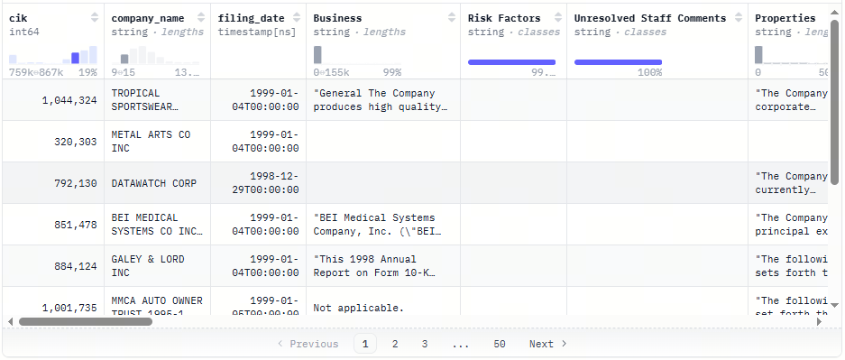

# 第17课时：长上下文与结构化提取

## 1. 本课导读

当大模型逐渐从“能对话、会写作”走向真实生产环境时，两个能力开始频繁出现在工程与研究的核心位置：**处理足够长的上下文**，以及**稳定输出结构化结果**。它们不像通用问答那样显眼，却几乎决定了模型是否“真的能用”。

现实中的文本很少是短小、规整、一步就能得出答案的。一本书的核心观点可能藏在某一章节的角落，一份财报里的关键风险说明往往被埋在冗长的附注中，法律文书更是以高度密集、层层嵌套的表达著称。在这些场景里，模型不仅要“读得完”，还要在大量无关信息中精准定位关键内容，并在需要时把它们整理成清晰、可复用的结构。这正是长上下文建模与结构化提取共同解决的问题。从能力体系的角度来看，长上下文并不是简单地把输入窗口拉长。上下文越长，位置信息的建模、注意力的分配、关键信息的保持都会变得更加困难。模型如果缺乏针对性的训练，很容易出现“前面看得懂，后面开始遗忘”“关键信息被淹没在背景中”等问题。而结构化提取则考验另一层能力：模型是否能够在理解文本语义的同时，遵循明确的格式约束，稳定地产出 JSON、XML 或其他结构化结果，而不是偶尔多一个字段、少一个括号。这两种能力在实际应用中往往是同时出现的。以企业知识库为例，原始数据通常是长文档，而下游系统真正需要的却是字段明确、结构稳定的信息条目；在法律与合规场景中，模型既要在成百上千行文本中找到相关条款，又要把它们整理成可审计、可追溯的数据结构；在数据构建与模型评测中，长文本“针扎大海”式的问题设计，也逐渐成为衡量模型理解深度的重要手段。

本课围绕的正是这些真实而具体的需求展开。内容将从长文本数据的特点入手，讨论为什么传统训练方式在长上下文场景下容易失效，以及业界常用的解决思路。随后会介绍上下文窗口扩展相关的方法，帮助理解 RoPE Scaling 等技术在工程中的位置和取舍。接着，重心会转向结构化提取任务，讨论如何通过明确的 Schema 设计与数据构造，让模型学会“按规则输出”，而不是仅凭语言直觉生成结果。

完成本课学习后，你将能够判断一个任务是否真正需要长上下文支持，理解不同扩窗策略的适用边界；能够设计用于评测长文本理解能力的数据形式，而不是只依赖表面准确率；也能够独立构造带有格式约束的指令数据，让模型在复杂文本中稳定完成结构化抽取。这些能力并不局限于某一个模型或框架，而是适用于大多数以实际落地为目标的语言模型系统。这一课关注的，是模型在面对复杂、冗长、规则明确的真实文本时，是否依然可靠、克制、可控。

---

## 2. 长文本建模基础

### 2.1 什么是长上下文问题

在日常使用中，人们往往习惯用几句话、一个段落来与模型交互。但一旦进入真实业务场景，文本的考虑单位就不再是“一句话”，而是整篇文档，甚至是一组彼此关联的文档。所谓**长上下文问题**，正是指模型在面对这类超出常规输入规模的文本时，是否还能保持稳定理解与准确推理的能力。

从技术角度看，长上下文通常有两种不同的衡量方式。一种是 **token 级长度**，即模型在一次前向计算中需要处理的 token 数量。当输入从几百 token 扩展到几千、上万甚至更高时，模型在计算和表示上的压力会呈指数级上升。另一种是 **文档级长度**，强调的是语义连续性和结构复杂度。即便 token 数量不极端，一份包含多章节、多主题、多层引用关系的文档，同样会对模型的理解能力提出更高要求。

与短上下文任务相比，长上下文问题的差异并不只体现在“文本更长”。在短文本场景中，关键信息往往集中，推理路径相对直接，模型即使出现轻微偏差，也不容易被放大。而在长文本中，信息呈现出明显的稀疏性：大量内容只是背景、铺垫或干扰，真正有价值的线索可能只占极小比例。这意味着模型需要具备更强的筛选能力，而不仅是表面上的语言流畅度。更重要的是，长上下文任务通常隐含着时间或位置依赖关系。前文中的某个定义，可能在几十页之后才再次被引用；一条关键结论，可能需要结合多个分散段落才能完整还原。如果模型无法正确理解这些跨距离关系，即使“读完了全文”，输出结果依然可能南辕北辙。

围绕这些特性，长上下文建模面临着几类典型挑战。

最常被提及的一点，是**位置信息的外推失效**。许多模型在训练阶段只接触过有限长度的文本，一旦输入长度超出训练分布，位置编码的表达能力就会迅速下降。模型可能仍然生成看似合理的文本，但对“信息出现在什么位置”这一问题的判断已经不再可靠，跨段落引用错误也随之增多。

另一个常见问题是**注意力稀释**。自注意力机制在理论上可以关注任意位置，但当序列长度不断增加时，注意力分配会变得越来越分散。模型很容易被局部上下文牵引，反复围绕近期内容展开，而忽略更早出现却至关重要的信息。这种现象在“查找某一具体事实”或“定位隐藏线索”的任务中尤为明显。

紧随其后的，是**关键信息遗忘**的问题。即便模型在早期读到了正确内容，也未必能在生成阶段将其有效保留下来。长文本中信息密度不均、主题频繁切换，很容易打断模型的内部表示，使得早期线索逐渐被后续内容覆盖。这种遗忘并非简单的记忆不足，而是表示竞争的结果。

正因为这些挑战的存在，长上下文问题并不能通过“增大输入长度”一劳永逸地解决。它要求在数据构造、模型结构、训练策略和评测方式等多个层面进行系统性的设计。本节的目的，就是为后续方法与实践提供一个清晰的背景：当文本变得足够长时，模型究竟是在与哪些困难正面交锋。


### 2.2 典型长文本数据来源

长上下文能力并不是凭空训练出来的，它高度依赖于模型在预训练或微调阶段所接触到的真实长文本数据。从来源上看，这类数据往往具有篇幅长、结构复杂、信息分布不均的共同特征，同时在语言风格和逻辑组织上也与日常对话存在明显差异。

下面从几类最具代表性的文本来源出发，梳理长文本数据在实践中的主要形态，以及业界常用的开源数据资源。

**书籍与章节级文本**

这是最早被用于长上下文建模的一类数据。与新闻或百科条目相比，书籍文本天然包含跨章节的长期依赖：人物关系、核心概念和叙事线索往往在数万字范围内逐步展开。模型若想真正“读懂”一本书，必须具备持续追踪语义状态的能力。
常见的开源来源包括：

- [Project Gutenberg](https://huggingface.co/datasets/common-pile/project_gutenberg)：该数据集收录了超过 70,000 本英文公共领域书籍（可免费使用），提供大量英文公共版权书籍，格式规范、文本干净，适合直接用于长上下文预训练或合成数据构造。
- [BookCorpusOpen (via Hugging Face)](https://huggingface.co/datasets/rojagtap/bookcorpus)：这是原始经典 BookCorpus 的开放版本，包含约 7,000 本英文小说文本（平均每个样本较长、跨章节）。BookCorpus 最早在 2015 年被引入，用于语言建模任务，可捕捉故事线索与全局上下文依赖。虽然原始 BookCorpus 的授权与分发存在争议，但 bookcorpusopen 则是经过整理的公开版本，适合研究与实验。数据结构如下：


- [PG-19 (via Hugging Face)](https://huggingface.co/datasets/emozilla/pg19)：
一个经典的书籍级长文本基准数据集，从 Project Gutenberg 图书馆提取了大量英文书籍，这些书籍发布于 1919 年之前，因此属于公共领域。该数据集的平均文档长度远超传统语料，可以作为训练模型处理整本书或章节级上下文的评估集。数据切分为 `train/validation/test`，同时包含元数据如标题和出版年份。数据结构如下：


  - [NarrativeXL](https://github.com/r-seny/narrativexl)：一个面向超长上下文阅读理解的大规模数据集，规模接近百万级（共 990,595 个问题），在同类数据集中具有显著优势。其平均文档长度超过 5 万字，远超传统阅读理解任务，对模型的长上下文建模与信息保持能力提出了更高要求。更重要的是，NarrativeXL 中的大多数问题都标注了明确的“保留需求”（retention requirement），用于指示回答问题所必须依赖的长期记忆信息，使该数据集不仅可用于阅读理解训练，也非常适合评估和分析大模型在长期记忆与长距离依赖场景下的表现。


**财报、年报与招股说明书**

金融文本是另一类极具代表性的长文档数据。财报与年报往往由多个章节组成，既包含定量表述（数字、指标），也包含大量解释性文字。关键信息分布分散，表达方式高度非结构化，非常适合用于训练“长文本 + 结构化抽取”能力。常见的开源来源包括：

- [SEC EDGAR](https://www.sec.gov/edgar/search-and-access)：这是美国证券交易委员会（SEC）公开的官方披露系统，几乎涵盖所有美国上市公司的定期财务报告。其中 10-K 为年度报告，篇幅通常在数万到十几万词不等；10-Q 为季度报告，结构与 10-K 相似但篇幅略短。这些文档具有高度固定的章节结构（如 Business, Risk Factors, MD&A, Financial Statements），但具体表述随公司和年份变化明显，非常适合用于训练模型在长文档中定位字段、跨章节整合信息的能力。EDGAR 原始数据以 HTML、TXT 等形式提供，适合做文档解析、结构化抽取与长上下文问答等任务。

- [SEC 10-K/10-Q 年报/季报数据集（非官方整理）](https://www.selectdataset.com/dataset/ab85b9f726ba3fb5f2bd6a1e5bc093d4)：该第三方汇总数据集通过爬虫和 EDGAR 提供的索引构建，将 1993–2024 年的 10-K 年度报告 按年份整理成 Parquet 文件存储格式。每条记录一般包括完整报文文本、年份、唯一标识符和统计信息，非常适合 NLP 和长文本任务使用。可作为真实长文档抽取任务的主训练语料，与结构化 XBRL 数据一并使用。

- [winterForestStump/10-K_sec_filings](https://huggingface.co/datasets/winterForestStump/10-K_sec_filings)：这个数据集收录了 自 1999 年以来约 93,500 份 SEC 10-K 年度报告，内容主要来自美国证券交易委员会（SEC）的 EDGAR 系统。每条记录都包含完整的报文文本及若干财务和披露字段（如公司名称、各部分章节内容等）。这种年报级别的数据本质上是长文档（往往超过几万词），非常适合测试模型在长上下文下的信息定位、跨章节推理与结构化抽取能力。



- [UK Companies House Annual Reports（英国公司年报公开数据）](https://download.companieshouse.gov.uk/en_output.html)：英国 Companies House 向公众开放了公司注册信息与年度财务披露数据，包括 Annual Accounts（年度财务报表） 和 Directors’ Report 等内容。相较于 SEC 报告，这些年报在语言风格和披露重点上更偏向英式财务与合规表达，但同样具备长篇幅、强结构、多章节等特征。原始数据通常以 XML、PDF 或 iXBRL 形式提供，适合用于多格式解析、跨国家财报文本建模，以及训练模型在不同监管体系下处理长上下文财务文档的能力，尤其适合作为 EDGAR 体系之外的补充对照数据集。

**法律条文与判决文书**

法律文本通常篇幅冗长、结构严谨且高度依赖上下文。单份判决往往同时包含案件事实、证据陈述、法律条文引用、历史判例比对以及最终裁决结论。信息分散在多个章节中，逻辑链条跨越全文，非常考验模型在长上下文中的一致性维护、引用定位以及跨段推理能力，是检验大模型长文档理解能力的经典数据类型。常见的开源来源包括：

- [CaseLaw Access Project (CAP)](https://case.law/)：CAP 是由哈佛法学院主导的美国判决文书开放项目，收录了 1600 年至 2018 年间超过 600 万份美国法院判决全文。单篇文书通常包含案件背景、法律争议点、引用判例以及裁决结论，文本结构高度规范但表述差异明显。该数据非常适合用于长上下文法律问答、裁判理由抽取、引用链分析以及跨段落法律推理任务，是研究法律大模型的重要基础语料来源。
- [European Court of Human Rights (ECHR)](https://huggingface.co/datasets/ecthr_cases)：该数据集整理了欧洲人权法院（ECHR）的判决文书全文，每个样本通常包含案件事实、相关法律条款、法院分析过程以及最终裁决。判决篇幅较长，且论证过程高度依赖前文事实与法律依据，常被用于研究 法律推理、长文档问答以及段落级责任判断任务。其结构清晰、逻辑严密，非常适合训练模型在长文本中保持推理一致性。
- [LexGLUE](https://huggingface.co/datasets/lex_glue)：LexGLUE 是一个面向法律 NLP 的综合基准，虽然其中部分任务为中短文本，但其 ECtHR、EUR-LEX 等子集来源于真实判决与法规原文，在实践中常被重新拼接为长文档样本。该数据集强调法律语言的精确性与逻辑约束，非常适合与完整判决文本结合，构造长上下文的法律抽取、分类与推理训练任务。
- [Pile of Law](https://huggingface.co/datasets/pile-of-law/pile-of-law)：Pile of Law 是 The Pile 数据集的法律领域子集扩展，专注于收集和整理高质量的法律文本资源，内容涵盖美国法院判决、联邦与州法规、合同文本以及各类行政与监管文件等多种法律文书类型。该数据集中的样本普遍以长文档级别存在，文本结构严谨、篇幅较长，包含大量跨段落引用与条款依赖关系，对模型的长上下文理解与信息整合能力提出了较高要求。在当前 Hugging Face 可获取的数据集中，Pile of Law 被认为是最接近 CAP（Case-and-Paragraph）风格的法律长文本数据集之一，常用于法律领域的大模型预训练、长文档建模与检索增强研究。


**技术文档与规范说明**

技术规范类文档往往强调前后一致性与术语稳定性，一个概念可能在前文定义，在后文多次引用。这类数据对于训练模型的“定义记忆”和跨章节引用能力非常关键。
常见的开源来源包括：

- [RFC 文档全集](https://www.rfc-editor.org/retrieve/bulk)：RFC 文档是互联网协议和标准的官方技术规范，单篇文档通常包含背景说明、术语定义、协议细节、安全分析与实现建议等多个章节，逻辑结构极为严谨。大量 RFC 文档长度达到数万字，是典型的长上下文技术文本。该数据非常适合用于协议理解、跨章节引用定位、技术问答以及规范一致性检查等任务。


- [arXiv 论文全文](https://huggingface.co/datasets/arxiv_pubmed)：该数据集收录了 arXiv 上的大量学术论文全文，涵盖计算机科学、物理、数学等多个领域。每篇论文通常包含摘要、引言、相关工作、方法、实验与结论等完整结构，篇幅长且信息密集。该数据集广泛用于 长上下文学术问答、章节级信息抽取、方法与结论对齐等任务，是研究模型学术阅读能力的重要语料。
- [S2ORC（Semantic Scholar Open Research Corpus）](https://huggingface.co/datasets/allenai/s2orc)：S2ORC 是由 AllenAI 发布的大规模学术论文语料库，包含数百万篇论文的全文与结构化元数据。论文被拆分为章节、段落和句子，同时保留原始结构信息，非常适合构造 超长文档理解、跨章节引用分析以及多段落联合推理任务。该数据集常用于训练具备文档级理解能力的学术型大模型。

**技术日志与系统运行记录**

日志数据通常呈现为时间序列形式，单条日志信息量有限，但长时间窗口下会累积成极长文本。关键异常往往只在某个时间点短暂出现，非常接近 Needle in a Haystack 的真实场景。
常见的开源来源包括：

- [LogHub](https://github.com/logpai/loghub)：LogHub 汇总了来自分布式系统、数据库、操作系统等多个真实环境的日志数据，覆盖 HDFS、Spark、Zookeeper 等典型系统。日志文件往往包含数十万到上百万行记录，时间跨度长、事件类型复杂。该数据集常用于异常检测、根因分析以及长序列上下文建模，是系统日志领域的经典开源资源。


- [HDFS Log Dataset](https://huggingface.co/datasets/logpai/hdfs)：这是一个经典的分布式文件系统日志数据集，记录了 Hadoop HDFS 在真实运行过程中的日志信息。单个样本通常对应长时间运行产生的日志序列，包含大量正常与异常事件。该数据集广泛用于 长序列异常检测、日志模式学习以及上下文关联分析，非常适合构造长上下文理解与事件定位任务。
- [BGL（Blue Gene/L）](https://huggingface.co/datasets/logpai/bgl)：BGL 数据集来源于 IBM Blue Gene/L 超级计算机的真实运行日志，覆盖数月的系统运行记录。日志规模巨大，异常事件稀疏且分布不均，是典型的高噪声长上下文数据。该数据集常用于研究模型在超长文本中发现稀有事件、保持时间一致性以及进行复杂状态推理的能力。

从这些数据可以看出，**长文本并不是单一形态的问题**。叙事型文本、制度性文本、技术文档和日志记录，各自考验模型的不同能力侧面。在实践中，往往需要混合多种长文本来源，才能让模型形成稳定、通用的长上下文理解能力。这些数据来源虽然领域各异，但都共享一个特点：**真正重要的信息往往并不显眼**。它们或被掩埋在大量背景描述中，或依赖跨段落、跨章节的关联才能被完整理解。正因如此，长文本数据不仅是“更长的文本”，而是对模型理解深度、记忆能力和信息筛选能力的综合考验。后续在构造训练数据和评测任务时，正是围绕这些真实文本形态，才能更准确地判断模型是否具备可靠的长上下文能力。

### 2.3 “大海捞针”问题

在长上下文相关的讨论中，“大海捞针”几乎是绕不开的一个比喻。它描述的并不是文本有多长，而是信息分布的方式：大量内容看似合理、语义通顺，却对当前任务没有直接价值，真正需要的线索只占极小一部分，并且往往出现在并不显眼的位置。模型要做的，并不是通读全文后给出一个模糊的总结，而是在复杂背景中准确抓住那根“针”。

从评测角度看，这类问题的定义其实很朴素。给模型一段足够长的文本，在其中的某个位置嵌入一条明确、可验证的关键信息，再提出一个只依赖该信息才能回答的问题。评测时关注的不是语言是否华丽，而是模型能否**稳定、准确地定位并复述那条信息**。如果“针”被放在不同位置，模型的表现却出现明显波动，就说明它对长上下文的理解仍然不可靠。

为了更直观地理解这一问题，可以看一个简单的示例。

> **简单示例**
>  
> 输入给模型的是一段约 15,000 token 的长文本，形式上模拟一份企业内部的系统运行说明文档。文档被刻意写得“很像真的”：前半部分详细介绍了系统的设计目标、架构演进和稳定性原则，中间穿插了多段关于“高可用性”“多年无重大事故”的描述，还列举了若干次 remembering 级别的小规模告警处理记录。
>  
> 在文档中部，出现了如下几段看似相关、实则容易造成干扰的信息：
>  
> > “在过去三年中，系统经历过数次短暂波动，最长一次持续约 20 分钟，未对核心业务造成影响。”  
> >  
> > “运维团队在 2020 年曾模拟过一次 30 分钟的故障演练，用于验证应急预案的有效性。”
>  
> 这些内容在语义上都与“中断时长”高度相关，却并不是问题真正指向的答案。
>  
> 接近文档结尾的位置，隐藏着真正需要被找出的那条信息：
>  
> > “需要记录的一次异常发生在 **2021 年 11 月 3 日**，由于配置错误，核心服务曾中断 **47 分钟**，该事件随后被纳入年度复盘报告。”
>  
> 随后向模型提出问题：
>  
> > “该系统历史上最长的一次核心服务中断持续了多长时间？”
>  
> 在这一设置下，模型如果只是依赖中间段落的语义相似性，很容易给出“20 分钟”或“30 分钟”这样的回答；如果被前文大量“稳定运行”的描述所影响，也可能直接回答“未发生明显中断”。只有真正通读全文、并在内部区分“演练”“轻微波动”和“真实事故”的模型，才能准确锁定那条位于文末的记录，并给出“47 分钟”这一结果。这个例子刻意加入了多层干扰信息，模拟的正是现实长文档中最常见的情况：答案并不孤立存在，而是被一堆“看起来更合理”的内容包围。模型是否具备长上下文能力，往往就在这样的细节选择中一目了然。


这个例子并不复杂，却恰好揭示了“针扎大海”测试的价值所在。短文本场景中，模型可以依赖局部上下文或高频模式蒙对答案；而在长文本中，这种策略会迅速失效。模型必须在大量无关信息中保持对关键细节的持续关注，否则就会被背景内容“带偏”。之所以这种问题被视为长上下文能力的核心测试，是因为它对模型提出了一个非常明确的要求：**是否真的在读全文，而不是只在最近的一小段文本里打转**。只要模型存在注意力过度集中、位置编码失效或信息保持不稳定的问题，这类测试几乎都会暴露出来。从失败模式来看，表现往往具有高度一致性。有些模型在“针”位于文本前半部分时表现正常，一旦位置后移，答案就开始变得含糊，甚至完全偏离问题；还有一些模型会选中语义相似、但并非目标位置的句子，给出“看起来对，其实不对”的回答。这些现象并非偶然，而是长距离依赖处理能力不足的直接体现。

也正因为如此，“大海捞针”问题并不追求复杂推理，而更像一面镜子，照出模型在面对真实长文档时的专注力与克制程度。能否稳稳地找出那根“针”，往往比生成多么流畅的文本，更能说明模型是否真正具备长上下文理解能力。


### 2.4 长文本合成数据构造方法

真实的长文本数据并不总是唾手可得。即便能够获取，标注成本和一致性问题也往往让人望而却步。正因如此，在长上下文研究和工程实践中，**合成数据**逐渐成为一种高性价比、可控性极强的选择。它并不试图伪造“完美语料”，而是围绕模型的薄弱点，有针对性地构造挑战场景。

#### Needle 注入的基本思想

在长文本合成数据中，**needle** 指的是那条“唯一有用、可被验证、直接决定答案”的关键信息。它通常语气克制、格式普通，读起来像背景说明的一部分，却承担着回答问题的全部依据。所谓 Needle 注入，本质上是一种**刻意制造信息稀疏性**的方法。做法并不复杂：先准备一段足够长、内容合理但与目标问题关系不大的文本，再将一条或多条关键信息嵌入其中。这些信息在语气和格式上并不突出，读起来像背景的一部分，却承担着“唯一正确答案”的角色。

这种设计背后的直觉很朴素——现实世界中的关键信息，往往就是这样被淹没的。合成数据并不是为了欺骗模型，而是提前复刻它在真实场景中必然会遇到的困难。

从形式上看，needle 往往满足几个条件：

- 语义明确，可被唯一验证；
- 与问题存在直接对应关系；
- 在文本中并不显眼，甚至有些“无聊”。

#### 控制插入位置与干扰密度

如果所有 needle 都固定出现在文本末尾，模型很快就能“学会套路”。真正有价值的合成数据，必须在**位置分布和干扰强度**上做文章。

插入位置通常会覆盖多个区间：

- 文档前段：测试模型是否会过早遗忘；
- 文档中段：考察对上下文切换的鲁棒性；
- 文档后段：避免模型只依赖最近上下文。

干扰密度则决定了任务的难度。常见做法是引入若干“看起来很像答案”的伪线索，比如相似的数值、相近的事件描述，甚至语义高度相关但事实不同的陈述。  
从概率角度理解，可以将文本视为一个序列，其中真正有用的信息占比极低：

$$
\text{Information Density} = \frac{\text{Needle Tokens}}{\text{Total Tokens}} \ll 1
$$

当这个比例下降时，模型必须投入更多注意力资源，才能避免被背景内容牵着走。

#### 问题与指令的自动生成

合成数据真正高效的地方，在于**问题和指令可以自动生成**。只要 needle 的内容是结构化或半结构化的，就能通过模板批量构造问答对。

例如，当 needle 是一条事件记录时：

- 文本中插入：「系统在 2022 年 6 月 18 日发生过一次 73 分钟的服务中断。」
- 自动生成的问题可以是：
    - “该系统最长的一次服务中断持续了多久？”
    - “系统是否发生过超过一小时的中断？”

在指令层面，通常会明确约束模型的行为，例如要求它只依据文本作答，或指出“不确定时应回答未知”。这种约束并不是为了限制模型，而是为了减少“编造答案”的空间。

下面是一段简化的 Python 示例，展示 needle 注入与问题生成的基本流程：

```python
import random

def inject_needle(background_paragraphs, needle_sentence):
    idx = random.randint(0, len(background_paragraphs))
    return background_paragraphs[:idx] + [needle_sentence] + background_paragraphs[idx:]

def generate_question(needle):
    if "分钟" in needle:
        return "该文档中提到的最长一次中断持续了多长时间？"
    return "文档中记录的关键事件是什么？"
```

#### 长文本训练数据格式示例

在实际训练中，长文本合成数据通常会被整理成结构清晰、便于校验的格式。下面给出一个常见的 JSON 示例，用于指令微调或评测：

```json
{
  "id": "longctx_00123",
  "instruction": "请根据以下文档回答问题，仅使用文档中的信息。",
  "input": "<LONG_DOCUMENT_TEXT>",
  "question": "该系统历史上最长的一次服务中断持续了多久？",
  "answer": "47 分钟",
  "meta": {
    "needle_position": "near_end",
    "document_length": 14832,
    "difficulty": "medium"
  }
}
```

这种格式有几个明显优势：

- 一方面，关键信息的位置和难度是可追踪的，便于后续分析模型在哪些区间更容易出错；
- 另一方面，它也为混合训练提供了空间，可以将不同长度、不同难度的数据统一管理。

在实践中，长文本合成数据很少追求“逼真到以假乱真”。真正重要的是，它是否能稳定地复现模型在真实长文档中会遇到的判断失误。只要这一点成立，这类数据就已经完成了自己的使命。

---

## 3. 长上下文窗口扩展技术

### 3.1 位置编码与上下文长度瓶颈

当模型的输入从几百个 token 延伸到几千、上万时，最先“吃不消”的往往不是参数量，也不是算力，而是**位置信息的表达方式**。模型也许还能读完文本，却已经逐渐分不清“这句话出现在哪里”，更谈不上稳定地建立跨段落、跨章节的关联。

#### 绝对位置编码与相对位置编码

早期模型对位置的处理方式相对直接。绝对位置编码（Absolute Position Encoding）会为序列中的每一个位置分配一个固定向量，常见做法是将位置向量与词向量相加：

$$
\mathbf{x}_i = \mathbf{e}_i + \mathbf{p}_i
$$

其中 $\mathbf{e}_i$ 是第 $i$ 个 token 的词向量，$\mathbf{p}_i$ 是位置 $i$ 对应的编码。这种方式直观、实现简单，但隐含了一个前提：模型在训练阶段已经“见过”这些位置。一旦输入长度超过训练时的最大位置，新的位置向量要么不存在，要么只能通过插值或截断近似处理，效果很难令人满意。

相较之下，相对位置编码（Relative Position Encoding）关注的不是“你在第几位”，而是“你与我相差多远”。模型在计算注意力时，引入相对距离信息，使得注意力权重与 token 间距直接相关。这种设计在一定程度上缓解了长度泛化问题，但在实现复杂度和计算开销上也带来了新的挑战。

从实践角度看，相对位置编码并没有彻底解决长上下文问题，它更像是在“局部一致性”上做得更好，却仍然难以支撑超长序列的稳定外推。

#### RoPE 的工作机制

RoPE（Rotary Position Embedding）之所以成为当前主流，并不是因为它完美，而是因为它在工程与效果之间找到了一个相对平衡的点。它不再显式地把位置信息加到 token 表示上，而是通过**旋转向量空间**的方式，将位置信息隐式地融入注意力计算。

在简化后的形式中，RoPE 会对 Query 和 Key 向量施加一个与位置相关的旋转变换：

$$
\text{RoPE}(\mathbf{q}_i) = \mathbf{q}_i \cdot R(i), \quad
\text{RoPE}(\mathbf{k}_j) = \mathbf{k}_j \cdot R(j)
$$

其中 $R(i)$ 是由位置 $i$ 决定的旋转矩阵。这样一来，注意力分数自然地包含了相对位置信息：

$$
\text{Attention}(\mathbf{q}_i, \mathbf{k}_j) \propto 
\text{RoPE}(\mathbf{q}_i)^\top \text{RoPE}(\mathbf{k}_j)
$$

从直觉上理解，RoPE 并不关心“这是第 512 个 token”，而更在意“两个 token 之间隔了多远”。这也是它在中等长度扩展上表现良好的原因。

下面用一段极简的伪代码，帮助理解 RoPE 在注意力中的位置：

```python
def rope_rotate(x, pos, base=10000):
    # x: [..., dim]
    # pos: token position
    freqs = base ** (-torch.arange(0, x.shape[-1], 2) / x.shape[-1])
    angles = pos * freqs
    cos, sin = torch.cos(angles), torch.sin(angles)

    x1, x2 = x[..., 0::2], x[..., 1::2]
    return torch.cat([x1 * cos - x2 * sin,
                       x1 * sin + x2 * cos], dim=-1)
```

这段代码并不追求完整性，但足以体现 RoPE 的核心思想：位置不再是一个“加上去的标签”，而是一次几何变换。

#### 长度外推问题的根源分析

问题出现在模型被要求**走出训练分布**的时候。RoPE 在训练阶段只接触过有限范围内的角度变化，当位置继续增大，旋转角度也会线性增长。这在数学上没有问题，在表示层面却会带来严重后果。

可以用一个直观的文字示意来理解：

```
短上下文：
token A —— token B —— token C
角度差稳定，可区分

长上下文：
token A —————————— token Z
角度旋转多圈，表示开始“重叠”
```

当角度增长到足够大时，不同位置对应的旋转结果会在向量空间中发生混叠。模型表面上仍然在计算注意力，实际上却已经难以区分“很远的过去”和“相对靠近的位置”。这正是许多模型在超长输入下出现行为异常的根源。

这种外推失效并不总是以明显的错误形式出现。更多时候，它表现为一种微妙的退化：
模型开始偏向最近上下文；
早期信息仍然被“看到”，却不再被“相信”；
跨段落引用逐渐变得不稳定。

从这个角度看，上下文长度的瓶颈并不是一个单纯的工程限制，而是**位置表示与训练分布之间的不匹配**。后续各种 RoPE Scaling 方法，本质上都是在尝试修复这一断层，让模型在更长距离上，仍然保有对“位置”的可靠直觉。


### 3.2 RoPE Scaling 方法综述

当上下文长度从几千扩展到几万，问题并不只出在算力或显存上，真正的瓶颈往往藏在位置编码里。RoPE 在中短序列上表现稳定，一旦超过训练时见过的最大长度，注意力分布开始变得松散，模型对“远处信息”的判断逐渐失真。围绕这个问题，业界提出了一系列 RoPE Scaling 方法，试图在**不重新训练模型主体结构**的前提下，让位置编码“跑得更远一些”。

这些方法表面看起来只是改了一个缩放系数，背后却各自对应着不同的建模假设。

#### Linear Scaling：最直观的长度拉伸

Linear Scaling 的出发点非常朴素：
如果模型是在最大长度 $L_{\text{train}}$ 上学到的 RoPE，那么当推理长度扩展到 $L_{\text{test}}$ 时，只要把位置编号按比例压缩回训练区间，模型看到的“相对相位变化”就不会超出分布。

原始 RoPE 中，第 $i$ 个位置的旋转角度为：

$$
\theta_i = i \cdot \omega_k,\quad \omega_k = 10000^{-2k/d}
$$

Linear Scaling 直接改写为：

$$
\theta_i^{\text{scaled}} = \frac{i}{s} \cdot \omega_k,\quad s = \frac{L_{\text{test}}}{L_{\text{train}}}
$$

**文字版示意图：**

```
原始位置轴: 0 ---- 2048
扩展后位置: 0 ------------------------ 8192

Linear Scaling:
8192 上的位置 i
↓
映射回 2048 区间： i / 4
```

这种方法的好处是实现极其简单，只需在推理阶段改一个缩放因子，完全不触碰模型权重。

**PyTorch 示例（伪代码）：**

```python
def rope_theta(position_ids, base_theta, scale):
    # position_ids: [seq_len]
    scaled_pos = position_ids / scale
    return scaled_pos[:, None] * base_theta[None, :]
```

不过，Linear Scaling 也有明显的代价。所有位置被“等比例压缩”，会让远距离 token 之间的区分度下降。模型能“看到”更远的内容，但判断细节关系时容易变得模糊，更适合**信息检索类任务**，而不太适合**精确推理或长链条计算**。

#### NTK Scaling：从核方法角度重新看 RoPE

NTK Scaling 的思路更偏理论派。它并不把 RoPE 仅仅当作几何旋转，而是从 **Neural Tangent Kernel** 的角度，分析注意力在长距离下为何会退化。

在标准 RoPE 中，不同维度的频率跨度很大，高频分量在长距离下震荡剧烈，导致注意力核快速衰减。NTK Scaling 的核心做法，是**对不同频率施加不同程度的缩放**，让整体核函数在更大范围内保持平滑。

简化后的形式可以写成：

$$
\omega_k^{\text{scaled}} = \omega_k \cdot \alpha^{k / d}
$$

其中 $\alpha < 1$，低频几乎不变，高频被显著压缩。

**直观理解：**

* 低频维度：负责“粗粒度位置感”，保持稳定
* 高频维度：原本负责“精确位置信息”，在长上下文中逐渐收敛

**示意图（文字版）：**

```
频率轴（低 → 高）
|——————|——————|——————|
几乎不变   轻微压缩   明显压缩
```

NTK Scaling 在数学上更优雅，对注意力稳定性帮助明显，尤其适合**长文档推理、跨章节引用**这类需要保持逻辑连续性的任务。不过，它对实现细节要求更高，不同模型结构对缩放系数的敏感度也不一样，调参成本相对较高。

#### YaRN Scaling：工程实践中的“折中解法”

YaRN（Yet another RoPE extensioN）诞生于大量工程实践之后，它并不追求单一公式的优雅，而是试图解决一个现实问题：
**能不能在不破坏短上下文能力的前提下，把窗口拉到十几万？**

YaRN 的核心策略是**分段缩放 + 平滑过渡**：

* 在训练长度附近，RoPE 几乎不变
* 超出训练长度后，逐步引入更强的缩放
* 不同频率采用不同的插值策略

可以抽象为：

$$
\theta_i =
\begin{cases}
i \cdot \omega_k, & i \le L_{\text{train}} \
f(i) \cdot \omega_k, & i > L_{\text{train}}
\end{cases}
$$

其中 $f(i)$ 是一条连续、可导的缓慢增长函数。

**文字版示意：**

```
位置 → 
|—— 原训练区 ——|—— 平滑过渡 ——|—— 强缩放 ——|
```

在实际模型中，YaRN 往往能同时保住：

* 短对话的流畅度
* 中等长度推理的稳定性
* 超长文档的可用性

这也是为什么它在不少开源长上下文模型中成为默认选项。

#### 方法对比与适用场景

从使用体验上看，这几种方法并不存在绝对的优劣，更像是不同取向的选择：

* **Linear Scaling**：适合快速验证、信息检索、低成本扩展窗口的场景

* **NTK Scaling**：更偏研究导向，适合需要长距离逻辑一致性的推理任务

* **YaRN Scaling**：工程友好型方案，适合通用大模型和生产环境部署

在真实系统中，RoPE Scaling 往往只是长上下文能力的一环，还会与注意力稀疏化、KV Cache 管理、训练数据分布一起协同作用。单独看某一个技巧，效果往往有限，但组合起来，才能真正让模型在“长文本世界”里站稳脚跟。


### 3.3 长窗口模型的训练与微调策略

把上下文窗口从几千拉到几万，并不只是把 `max_position_embeddings` 改大这么简单。真正决定模型是否“用得好”的，往往发生在训练阶段。训练数据怎么选、长短文本怎么混、优化目标怎么设，都会直接影响模型在真实长文档中的表现。

不少模型在 benchmark 上看起来支持 32k、64k，实际用起来却只盯着开头几段，后面的信息仿佛不存在。这类问题，几乎都能在训练策略里找到影子。

#### 继续预训练 vs 指令微调：能力从哪里来

如果把长上下文能力拆开来看，可以分成两个层面：

* **“看得远”**：模型是否能稳定处理超出原始训练长度的 token
* **“用得对”**：模型是否知道什么时候该引用远处的信息

这两点对应着两种不同的训练路径。

**继续预训练（Continual Pretraining）** 更像是在打地基。
它使用大规模、无标注的长文本数据，让模型在语言建模目标下反复接触超长序列。

目标函数仍然是标准的自回归损失：

$$
\mathcal{L}*{\text{LM}} = - \sum*{t=1}^{T} \log p(x_t \mid x_{<t})
$$

这条公式本身并不新，但在长上下文场景下，它的每一个符号都承载着额外的含义：

* $\mathcal{L}_{\text{LM}}$：整段长文本的训练损失。
  与短文本不同，这里的损失不再只反映局部语言流畅度，而是综合体现模型在跨页、跨章节条件下维持一致性的能力。

* $T$：当前样本的总 token 数。
  在长上下文训练中，$T$ 往往远大于模型最初的训练长度（例如从 2k 扩展到 16k 或 32k）。
  这也是外推问题产生的直接来源：模型从未在如此大的 $T$ 上被稳定优化过。

* $x_t$：序列中第 $t$ 个 token。
  在长文档里，$x_t$ 可能处在正文末尾、附录甚至脚注位置，其语义往往依赖很早之前的内容。

* $x_{<t}$：从第 1 个 token 到第 $t-1$ 个 token 构成的上下文。
  当 $t$ 接近 $T$ 时，这个上下文窗口已经覆盖了整篇文档，模型需要在极长的注意力路径中找到真正相关的信息。

* $p(x_t \mid x_{<t})$：模型在给定全部历史上下文的条件下，对下一个 token 的预测概率。
  在长上下文场景中，这个条件概率是否真的“用到了远处的信息”，正是模型能力高低的分水岭。

实践中常见的数据包括：章节级书籍、多页技术文档、连续的代码仓库文件、拼接后的多篇论文正文。

继续预训练的优势在于，它能真正改变模型对“长距离依赖”的内部表示方式。但代价也很现实：算力消耗大，收敛慢，对训练稳定性要求高。相比之下，指令微调（Instruction Tuning）更像是在教模型“如何使用”已有能力。
它通常建立在一个已经支持长窗口的 base model 之上，通过长指令、长上下文问答、跨段引用等数据，强化模型在实际任务中的行为模式。

一个典型样本可能长这样：

```
[系统指令]
你将阅读一份完整的技术规范，并回答后文的问题。

[上下文]
（长达数万 token 的文档）

[问题]
第 4.3 节中提到的异常处理流程，与第 2.1 节的设计假设是否存在冲突？
```

如果模型本身还“看不远”，单靠指令微调很难补救；但在地基已经稳固的前提下，它对可用性提升非常明显。

不少成熟方案会选择：**先用少量继续预训练扩展感受野，再用高质量指令数据校准行为。**


#### 长文本与短文本数据的混合比例

一个容易被忽略的事实是：**长窗口模型并不意味着只喂长文本。**

如果训练数据几乎全是超长样本，模型在短对话、简单问答上的反应往往会变慢，甚至出现不必要的啰嗦。这不是能力增强，而是分布偏移。

工程上更常见的做法是混合训练：

```
短文本（≤2k）   : 50% ~ 70%
中等文本（2k–8k）: 20% ~ 30%
长文本（≥16k）  : 10% ~ 20%
```

比例并非固定，关键在于覆盖真实使用场景。

**文字版示意图：**

```
训练批次分布
|■■■■■■■■■■■■■■■■■■■■| 短
|■■■■■■■■■           | 中
|■■■                  | 长
```

在实现层面，通常会在 dataloader 阶段完成长度分桶，再按比例采样：

```python
def sample_batch(short_pool, mid_pool, long_pool, ratios):
    r = random.random()
    if r < ratios[0]:
        return random.choice(short_pool)
    elif r < ratios[0] + ratios[1]:
        return random.choice(mid_pool)
    else:
        return random.choice(long_pool)
```

这种混合策略的好处在于：
模型既不会“忘记”短文本下的语言节奏，又能在长序列中逐渐学会保持注意力稳定。

#### 防止模型只关注前文的训练技巧

长上下文训练中，最常见也最隐蔽的问题是**前文偏置**。
模型在计算注意力时，虽然理论上能看到全部 token，但训练信号却高度集中在前半段，后文逐渐沦为“背景噪声”。

这一现象在以下场景尤为明显：

* loss 主要来自序列前 30%
* QA 数据的问题总是围绕开头段落
* 长文档中关键信息集中在固定位置

为缓解这个问题，实践中常用几种技巧。

**1. 位置打散（Position Shifting）**

同一段关键信息，在不同样本中随机放到不同位置：

```
样本 A：答案在 10%
样本 B：答案在 50%
样本 C：答案在 90%
```

这种做法迫使模型放弃“只看前面就够了”的捷径。

**2. 位置加权损失**

对后半段 token 提高 loss 权重：

$$
\mathcal{L} = \sum_{t=1}^{T} w_t \cdot \ell_t,\quad
w_t = 1 + \lambda \cdot \frac{t}{T}
$$

其中各个符号的含义如下：

* $\mathcal{L}$：加权后的总损失，用于反向传播。
  与标准损失相比，它会让模型在训练中更“在意”序列后部的预测质量。

* $\ell_t$：第 $t$ 个 token 对应的单步预测损失，通常是交叉熵。
  如果模型在文档末尾频繁预测失误，这部分损失会被显式放大。

* $w_t$：位置相关的权重系数。
  它不依赖语义内容，只与 token 在序列中的相对位置有关。

* $\lambda$：控制权重增长幅度的超参数。
  当 $\lambda = 0$ 时，公式退化为普通的无权重损失；
  $\lambda$ 越大，模型越容易被“推着”去关注后半段。

* $\frac{t}{T}$：归一化后的相对位置。
  这种设计保证了不同长度样本之间的权重分布具有可比性，避免长短样本训练行为不一致。

后部 token 的梯度更“响亮”，模型自然会分配更多注意力。

**3. 针对性构造 Long QA**

问题明确指向文档后部或跨段关系，例如：

> “请结合第 7 节的实验结果，解释第 2 节提出的假设是否成立。”

这种问题如果答不好，模型几乎无法靠前文蒙混过关。


从实践经验来看，长窗口训练更像是在调教注意力的“耐心”。结构和算法决定了模型能走多远，而训练策略决定了它愿不愿意回头、会不会遗漏沿途的信息。真正稳定可用的长上下文能力，往往是在一次次失败样本和偏置修正中慢慢磨出来的。

### 3.4 长上下文能力评测方法

当模型宣称自己“支持 32k 甚至 128k 上下文”时，这句话本身并没有太多信息量。真正有价值的问题在于：
**它是否真的能在这么长的文本里，找到该找的内容，并且在不同位置上保持一致的判断？**

围绕这个问题，业界逐渐形成了几类相对成熟的评测方法。

#### Needle in a Haystack 测试

Needle in a Haystack 并不是一个复杂的任务，却极其“刁钻”。

它的核心设定很简单：
在一段很长、看似合理但与问题无关的文本中，悄悄塞入一小段关键信息（needle），然后观察模型能否在几乎没有提示的情况下把它找出来。

**文字版示意图：**

```
[无关背景文本..................................]
[无关背景文本..................................]
[  ← Needle：关键信息 →                     ]
[无关背景文本..................................]
[无关背景文本..................................]
```

典型评测流程包括三步：

1. 构造一段长度为 $L$ 的背景文本
2. 在位置 $p$ 插入一段长度很短的关键信息
3. 提问一个只能通过这段信息才能回答的问题

一个极简示例：

```text
背景文本：一份数万字的技术规范说明……
插入信息：该系统的默认超时时间为 37 秒。
问题：系统的默认超时时间是多少？
```

如果模型回答的是“30 秒”“60 秒”或者干脆编造一个值，说明它在长距离信息保持上已经出现问题。

在评测时，通常会系统性地改变 needle 的位置 $p$，例如放在 10%、50%、90% 的位置上，观察准确率的变化。

常见统计指标是命中率：

$$
\text{HitRate} = \frac{N_{\text{correct}}}{N_{\text{total}}}
$$

* $N_{\text{correct}}$：模型正确找出 needle 的样本数
* $N_{\text{total}}$：测试样本总数

这个指标直观、直接，也最容易暴露“看得见但想不起来”的问题。

#### 长文档问答（Long QA）

相比 Needle 测试的“单点打击”，长文档问答更接近真实使用场景。

这里的文档通常是完整的：

* 一本书的若干章节
* 一整份年报或招股说明书
* 多个法律条文拼接而成的判决依据

问题不再是简单的事实抽取，而是要求模型在不同位置之间建立联系。

**示例问题：**

> 文档中提出的风险控制策略，与后文的实际执行结果是否一致？如果存在偏差，原因是什么？

这类问题至少隐含了三件事：

* 模型需要记住前文的抽象描述
* 能在后文找到对应的实施细节
* 在两者之间进行对比与归纳

评测中常用的自动化指标包括 EM（Exact Match）和 F1，但在长 QA 场景下，它们通常只是参考。
更常见的做法是引入人工或 LLM-as-a-Judge 评分，对回答的**引用位置是否合理、推理链条是否完整**进行判断。

#### 位置敏感性与稳定性指标

很多模型在长文本中并不是“完全不行”，而是表现得极不稳定。

同一个问题，只是把关键信息从文档中部挪到末尾，回答质量就明显下滑。这类问题通常通过**位置敏感性评测**来刻画。

一个常见做法是：
对同一条样本，在不同插入位置 $p_i$ 上重复测试，得到一组性能分数 ${s_1, s_2, \dots, s_n}$。

可以用方差来衡量稳定性：

$$
\text{Var}(S) = \frac{1}{n} \sum_{i=1}^{n} (s_i - \bar{s})^2
$$

* $s_i$：needle 位于第 $i$ 个位置时的评测得分
* $\bar{s}$：所有位置得分的平均值
* $\text{Var}(S)$：得分随位置变化的波动程度

方差越大，说明模型越“挑位置”；
方差越小，模型在整个上下文范围内的行为越一致。

在工程实践中，这个指标往往比单点准确率更有参考价值。一个平均分略低但稳定的模型，往往比“偶尔惊艳、经常翻车”的模型更值得信任。

一个容易被忽略的现实：长上下文评测并不只是为了“打榜”，它更像是对模型注意力习惯的体检报告。
模型是否真的在读完整篇文档，是否愿意为后面的信息付出计算成本，这些都不会写在参数表里，只会体现在这些看似简单却反复折磨人的测试结果中。

当模型在 Needle、Long QA 和位置稳定性上同时表现平稳时，长上下文能力才算真正站得住脚。

---

## 4. 结构化输出与提取数据构造

### 4.1 结构化输出的意义与使用场景

在大模型刚被引入业务系统时，很多人对它的期待其实很朴素：**只要能把文本读懂，再把答案写出来就够了。**

但这种期待很快会被现实打破。一段写得再漂亮的自然语言，一旦需要进入数据库、触发流程、参与计算，就会暴露出它的脆弱性。字段缺失、表述歧义、格式不统一，这些问题并不会因为模型“更聪明”而自然消失。

结构化输出，正是模型从“会说话”迈向“能做事”的分水岭。

#### 从自然语言到结构化表示的能力跃迁

自然语言的优势在于灵活、开放，缺点也恰恰在于此。
同一个事实，可以被表达成无数种说法：

> “合同签署时间是 2021 年 5 月。”
> “双方于 2021/05 完成签约。”
> “协议在 2021 年 5 月正式生效。”

对人来说，这些几乎没有差别；对系统而言，却是三条完全不同的输入。结构化表示的核心价值，在于**消除这种不确定性**。

当模型被要求输出如下形式：

```json
{
  "contract_date": "2021-05"
}
```

信息的边界、含义和可处理方式同时被固定下来。这并不是语言能力的退化，而是一次能力重组——把理解能力压缩成可计算的形态。

**文字版示意图：**

```
自然语言理解
        ↓
语义归一化
        ↓
结构化字段（可计算、可校验、可存储）
```

#### 为什么“能生成 JSON”并不等于“适合做信息抽取”

很多模型在演示时都能“生成 JSON”，但这往往只说明一件事：它学会了模仿大括号和键值对。

真正的信息抽取场景中，结构化输出面临的约束要严格得多：

* 字段是否完整
* 字段类型是否稳定
* 缺失信息是否被胡乱补全
* 同一字段在不同样本中是否语义一致

举一个非常常见的失败案例。

**模型输出示例：**

```json
{
  "price": "about 100 dollars",
  "currency": "USD"
}
```

从语言角度看，这几乎无可挑剔；
但在结构化抽取任务中，这样的输出是不可用的——`price` 既不是数值，也无法直接参与计算。

真正“适合抽取”的输出，往往需要明确的类型约束：

```json
{
  "price": 100,
  "currency": "USD"
}
```

这背后反映的不是格式能力，而是模型是否理解：
**哪些信息必须被规范化，哪些自由表达可以被舍弃。**

#### 典型应用场景

结构化输出并不是为某一类任务而生，它更像是连接模型与系统的通用接口。

- 知识抽取与入库

在知识库构建中，模型往往需要从大量非结构化文本中提取事实性信息。

例如，从新闻中抽取事件：

```json
{
  "event_type": "收购",
  "acquirer": "Company A",
  "target": "Company B",
  "amount": 320000000
}
```

这样的结果可以直接进入图数据库或关系型数据库，参与后续的查询与推理。
如果输出仍停留在自然语言描述层面，后续流程几乎无法自动化。

- 表单填充与信息核验

在合同、简历、病历等场景中，模型经常扮演“自动填写”的角色。

输入是一段杂乱的文本：

> “张三，男，1993 年生，联系电话 138****5678。”

输出却必须严丝合缝：

```json
{
  "name": "张三",
  "gender": "男",
  "birth_year": 1993,
  "phone": "138****5678"
}
```

结构化输出在这里承担的任务，并不只是抽取，而是**为下游校验与人工复核提供稳定锚点**。

- Agent / Tool 调用参数生成

在 Agent 系统中，结构化输出几乎是硬性要求。

模型不再只是“回答问题”，而是需要生成可被程序直接消费的参数：

```json
{
  "tool_name": "search_flight",
  "arguments": {
    "from": "Beijing",
    "to": "Tokyo",
    "date": "2025-03-12"
  }
}
```

一旦参数结构不稳定，Agent 的行为就会变得不可预测。这也是为什么很多 Agent 框架会对输出格式做近乎苛刻的限制。结构化输出的价值，并不体现在模型“写得多漂亮”，而体现在它**能否稳定地交付可以被系统信任的结果**。当模型开始以字段、类型和约束为边界思考问题时，它才真正走出了“语言模型”的舒适区，踏入了工程世界。


### 4.2 常见结构化输出形式

结构化输出并不存在一种“放之四海而皆准”的标准形态。不同结构，本质上是在**表达自由度、约束强度与可解析性**之间做权衡。理解这些差异，比记住语法本身更重要。

在长上下文与结构化提取任务中，结构的选择往往不是“哪种更高级”，而是**哪种更贴近信息本身的组织方式**。许多失败的抽取案例，并不是模型能力不足，而是结构设计从一开始就违背了数据的天然形态。

**一、键值型结构（Key–Value / Record）**

这是最基础、也是最常见的一类结构。几乎所有结构化形式，都可以看作它的变体或组合。

核心特征：

* 每个字段对应一个明确语义
* 字段之间相对独立
* 不强调顺序与层级关系

```json
{
  "company_name": "OpenAI",
  "founded_year": 2015,
  "headquarters": "San Francisco"
}
```

适用场景：

* 实体属性抽取（公司、人物、产品）
* 表单填充
* 单条记录的摘要信息

在长文档中，键值结构最大的价值在于**“信息聚合”**。模型可以从多个位置提取证据，但最终只需要在一个固定槽位中落笔。一个典型例子是财报中的公司基本信息：成立时间、主营业务、注册地。这些信息可能散落在不同章节，但结构化输出时，它们天然属于同一条记录。

**二、层级树结构（Tree / Nested Object）**

当字段之间存在明确的“从属”或“语义分组”关系时，层级结构会变得自然。

```json
{
  "company": {
    "name": "OpenAI",
    "location": {
      "city": "San Francisco",
      "country": "USA"
    }
  }
}
```

长文档往往天然具有章节结构，而层级结构正好与之呼应：

* 文档章节 → 一级节点
* 子章节 → 子节点
* 段落级事实 → 叶子节点

这种“结构对齐”，会显著降低模型在生成时的认知负担。模型不再需要反复判断“这个字段属于哪一类”，而是沿着既定树形逐层展开。

层级结构的风险在于过度设计：

* 层级过深，模型容易漏括号
* 语义边界不清晰，生成时发生字段漂移

经验上，超过三层的嵌套，就应当谨慎评估其必要性。

**三、列表与重复实体结构（List / Array of Objects）**

这是处理“数量不确定信息”的关键结构。

```json
{
  "board_members": [
    {"name": "Alice", "role": "CEO"},
    {"name": "Bob", "role": "CTO"}
  ]
}
```

为什么列表对模型是一种“强约束”？ 列表的出现，本质上是在告诉模型三件事：

1. 这是一个可扩展集合
2. 内部元素结构一致
3. 数量不固定，但类型固定

在长文档中，这种约束尤为重要。例如：

* 风险因素列表
* 专利条目
* 合同条款
* 事件时间线中的多个事件

如果不用列表，而用编号字段（risk_1, risk_2…），模型几乎一定会在长文档中失控。

**四、表格型结构（Tabular / Row-Based）**

表格是结构化数据中最接近人类分析习惯的一类形式。

```json
{
  "columns": ["year", "revenue", "profit"],
  "rows": [
    [2022, 100, 20],
    [2023, 120, 25]
  ]
}
```

或更常见的对象行形式：

```json
[
  {"year": 2022, "revenue": 100, "profit": 20},
  {"year": 2023, "revenue": 120, "profit": 25}
]
```

适用场景：

* 财务数据
* 统计信息
* 指标对比

长文档中的表格往往被拆散在文本中描述。结构化提取的目标，正是把这些“隐式表格”重新显式化。模型并不是在“生成表格”，而是在做一种跨段落对齐与重组。

**五、时间序列与事件结构（Timeline / Event Schema）**

这是长上下文场景中最具挑战、也最具价值的一类结构。

```json
{
  "events": [
    {
      "date": "2023-03-01",
      "event": "Product launch",
      "description": "Released GPT-4"
    },
    {
      "date": "2023-11-06",
      "event": "Developer conference"
    }
  ]
}
```

事件结构特别依赖长上下文，因为事件信息往往：

* 分散出现
* 时间线非线性
* 描述方式多样

模型需要在整篇文档范围内建立时间对齐意识，再将零散叙述压缩为统一结构。这正是长上下文能力的“试金石”。

**六、关系型与三元组结构（Relational / Triples）**

在知识抽取与知识图谱场景中，三元组是一种极其稳定的中间表示。

```json
{
  "triples": [
    {"subject": "OpenAI", "relation": "founded_in", "object": 2015},
    {"subject": "OpenAI", "relation": "located_in", "object": "San Francisco"}
  ]
}
```

三元组的优势：

* 结构极简
* 易于去重与合并
* 适合跨文档融合

局限性：

三元组并不适合直接承载复杂语义，它更像是“结构化中间层”，而非最终消费格式。

**七、图结构（Graph / Linked Entities）**

当实体之间存在多对多关系时，图结构会变得不可替代。

```json
{
  "nodes": [...],
  "edges": [...]
}
```

长文档中的典型场景：

* 法律判决中的引用关系
* 学术论文中的方法—实验—结论关联
* 企业股权与投资关系

图结构对模型而言难度极高，因此通常作为二次结构化的结果，而非一次生成目标。

**八、半结构化与混合结构（Hybrid）**

真实世界中，最常见的并不是“纯结构”，而是混合体：

* JSON + 自由文本摘要
* 表格 + 注释说明
* Schema + 原文引用片段

```json
{
  "risk_summary": "Company faces regulatory uncertainty.",
  "risks": [
    {
      "type": "Regulatory",
      "evidence": "See section 3.2 Risk Factors"
    }
  ]
}
```

这种结构并非妥协，而是承认语言的不可压缩性。并不是所有信息都值得被完全结构化。

**关于可选字段、多值字段与一致性**

结构设计中最容易被忽视的，并不是“字段怎么命名”，而是一致性承诺。

* 字段是否永远存在？
* 类型是否永远一致？
* 空值意味着什么？

```json
{
  "email": null
}
```

与

```json
{}
```

在语义上完全不同。前者是“明确不存在”，后者是“文中未提及”。在长上下文任务中，这种差异会直接影响模型是否“胡编”。

**结构选择的本质：为模型设立边界**

结构化输出的形式选择，本质上是一种提前写好的“行为约束”。

好的结构设计，会让模型：

* 知道哪些信息值得输出
* 知道信息该放在哪
* 知道什么时候应该保持沉默

而糟糕的结构设计，则会迫使模型在不确定中“自由发挥”。真正成熟的结构设计，往往看起来并不炫技，却能在长期使用中减少无数隐形成本。它不是为了限制模型，而是替模型承担认知负担。在长上下文与结构化提取的交汇处，这种设计价值尤为明显。

### 4.3 Schema 约束的设计原则

Schema 看起来像是工程细节，实际上却深刻影响着模型的行为方式。
一个设计得当的 Schema，往往能在不增加模型负担的前提下，把输出错误压到最低；反过来，模糊或过度复杂的 Schema，几乎等同于邀请模型自由发挥。

#### 字段语义与命名规范

字段名是模型理解 Schema 的第一道入口。如果字段本身就含糊不清，模型在填充内容时自然会变得犹豫，甚至开始“补充想象”。

**可读性**

字段名应尽量贴近自然语言中的稳定概念：

```json
// 推荐
"publish_date": "2023-10-01"

// 不推荐
"pubInfo": "2023-10-01"
```

模型并不擅长记忆缩写或项目内部的黑话。一个人类新成员需要额外解释的字段，模型通常也需要。

**稳定性与长期维护**

Schema 一旦进入训练数据或生产系统，字段名的修改成本会迅速放大。与其追求“此刻看起来最精巧的命名”，不如选择一个五年后仍然说得通的表达。

经验上，字段命名应满足三个条件：

* 语义单一
* 不依赖上下文
* 不暗含业务流程假设

#### 必填字段与可选字段的划分

并不是所有字段都应该被一视同仁地对待。在结构化抽取任务中，**哪些字段“必须有”**，本身就是对任务目标的再次声明。

**业务核心信息 vs 辅助信息**

以合同抽取为例：

```json
{
  "party_a": "Company A",
  "party_b": "Company B",
  "sign_date": "2022-05-01",
  "remarks": null
}
```

这里的 `party_a`、`party_b`、`sign_date` 通常属于核心字段；
`remarks` 更像是附加信息，即便缺失，也不影响主流程。

在 Schema 中明确这种差异，可以通过：

* `required` 标记
* 注释说明
* 示例中的刻意留空

模型在学习过程中，会逐渐形成一种“优先级意识”，避免在不重要字段上过度发挥。

#### 嵌套与层级结构设计

嵌套结构是 Schema 设计中最容易走极端的地方。扁平化过度，会让语义变得松散；嵌套过深，又会显著增加生成难度。

**扁平化的代价**

过度扁平的 Schema 往往长这样：

```json
{
  "company_name": "A Corp",
  "company_address_city": "Tokyo",
  "company_address_country": "Japan"
}
```

字段虽然“安全”，但语义被拆得过细，模型需要在多个字段之间保持一致性，反而更容易出错。

**过度嵌套带来的生成风险**

反方向的问题同样常见：

```json
{
  "company": {
    "address": {
      "location": {
        "geo": {
          "city": "Tokyo"
        }
      }
    }
  }
}
```

层级一旦超过两到三层，模型更容易：

* 漏掉中间节点
* 括号结构不闭合
* 在不同样本中生成不一致的路径

**经验性的平衡原则**

在多数抽取任务中，以下结构往往更稳妥：

```json
{
  "company": {
    "name": "A Corp",
    "address": {
      "city": "Tokyo",
      "country": "Japan"
    }
  }
}
```

语义清晰、层级适中，也为后续扩展保留空间。Schema 设计并不是追求形式上的完美，而是在为模型划出一条清晰的边界：哪些地方可以自由理解，哪些地方必须收敛到确定结构。当这条边界足够清楚，模型往往会比预期更自觉地遵守规则。


### 4.4 基于 Schema 的指令设计方法

在结构化信息抽取任务中，Schema 并不是一份静态的字段说明书，它真正发挥作用的地方，往往体现在**指令如何与模型交互**。同样一份 Schema，如果只是作为“背景信息”附在 prompt 里，模型未必会严格遵守；而一旦 Schema 被嵌入到指令逻辑本身，它就会变成模型生成时无法回避的约束条件。

#### 显式输出格式约束

最直接、也最有效的做法，是在指令中明确告诉模型：**输出不是一段自由文本，而是一份必须满足特定结构的结果**。这种约束通常体现在三个层面。

第一层是整体形式的限定。例如，明确声明输出只能是 JSON 或 XML，不允许附加解释性文字：

```text
请仅输出一个合法的 JSON 对象，不要包含任何额外说明或注释。
```

第二层是字段级别的约束。将 Schema 的字段定义直接写入指令，使模型在生成时“看到”完整的结构轮廓。例如：

```text
输出需符合以下结构：
{
  "title": string,
  "author": string,
  "publish_date": string (ISO 8601),
  "keywords": array of string,
  "summary": string
}
```

这种写法的关键不在于语法是否完全严谨，而在于**把字段边界清晰地暴露给模型**。实践中可以观察到，只要字段名和类型表达足够明确，模型往往会主动对齐。

第三层是约束的“不可违背性”。通过强调“缺失字段视为错误”“字段类型不符视为无效输出”等规则，可以显著降低模型随意发挥的概率：

```text
若某字段在原文中不存在，请返回 null，不允许省略字段。
```

这一点在构造训练数据或自动化流水线时尤为重要，因为下游程序通常无法容忍结构漂移。

#### Few-shot 示例引导

Schema 定义的是“结果应该长什么样”，而 Few-shot 示例解决的是“边界在哪里”。很多结构化抽取失败的案例，并不是模型不理解 Schema，而是不清楚某些模糊情况该如何处理。

一个典型的 Few-shot 示例通常包含三部分：原始文本、对应的结构化输出，以及隐含的决策逻辑。

```text
示例：
原文：
“张三于2021年加入某科技公司，担任算法工程师。”

输出：
{
  "name": "张三",
  "company": "某科技公司",
  "position": "算法工程师",
  "start_year": 2021,
  "end_year": null
}
```

这个示例看似简单，却在无形中传达了多个关键信息：

* 时间未明确结束时，`end_year` 使用 null
* 职位信息直接映射为字符串，而非拆分为多字段
* 人名、公司名不做额外规范化处理

当示例数量逐渐增加，模型会开始形成一种“隐性规则集”。在实践中，与其堆叠大量字段说明，不如精心挑选少量**边界清晰、信息密度高**的示例。

#### 错误输出的反例约束

仅靠正例并不足以覆盖所有情况。模型在生成结构化结果时，常见的错误模式具有相当的共性，比如：

* 输出混入自然语言解释
* 字段名称拼写漂移
* 列表与单值混用
* 数值字段被生成成字符串

反例约束的核心思路，是**明确告诉模型哪些输出是不可接受的**。例如：

```text
以下输出是错误的：
{
  "Name": "张三",
  "company": ["某科技公司"],
  "position": "算法工程师"
}
错误原因：
- 字段名不符合 Schema 定义
- company 类型错误，应为 string
```

这种方式并不是为了“批评”模型，而是帮助它在生成时主动规避常见陷阱。对于复杂 Schema，反例往往比正例更能稳定输出行为。

### 4.5 JSON / XML Schema 示例与实践

Schema 的价值不仅体现在理论设计上，更体现在它能否被程序自动校验、被模型稳定遵循。JSON Schema 和 XML Schema 是目前最常用的两类形式。

#### JSON Schema 定义示例

下面给出一个简化但具有代表性的 JSON Schema，用于抽取学术论文的元信息：

```json
{
  "$schema": "http://json-schema.org/draft-07/schema#",
  "type": "object",
  "required": ["title", "authors", "year"],
  "properties": {
    "title": {
      "type": "string"
    },
    "authors": {
      "type": "array",
      "items": {
        "type": "string"
      }
    },
    "year": {
      "type": "integer",
      "minimum": 1900,
      "maximum": 2100
    },
    "venue": {
      "type": "string"
    },
    "keywords": {
      "type": "array",
      "items": {
        "type": "string"
      }
    }
  }
}
```

这里每个约束都服务于一个实际目的：

* `required` 明确哪些字段不可缺失
* `type` 限制字段值的基本形态
* `minimum` 和 `maximum` 为数值字段设定合理范围

在训练或推理阶段，这份 Schema 不仅能作为 prompt 的一部分，还可以用于**自动校验模型输出是否合法**。

#### XML Schema 定义示例

在某些需要层级表达或与传统系统兼容的场景中，XML 仍然具有优势。以下是一个对应的 XML Schema（XSD）示例：

```xml
<xs:schema xmlns:xs="http://www.w3.org/2001/XMLSchema">
  <xs:element name="paper">
    <xs:complexType>
      <xs:sequence>
        <xs:element name="title" type="xs:string"/>
        <xs:element name="authors">
          <xs:complexType>
            <xs:sequence>
              <xs:element name="author" type="xs:string" maxOccurs="unbounded"/>
            </xs:sequence>
          </xs:complexType>
        </xs:element>
        <xs:element name="year" type="xs:int"/>
        <xs:element name="venue" type="xs:string" minOccurs="0"/>
      </xs:sequence>
    </xs:complexType>
  </xs:element>
</xs:schema>
```

XML Schema 的优势在于对层级和重复结构的表达更为显式，但代价是编写和维护成本相对更高。

#### Schema 与自然语言指令的结合方式

在实际使用中，最稳定的方式往往不是“只给 Schema”或“只给自然语言说明”，而是将两者组合成一种混合式提示模板：

```text
任务说明：
从给定文本中抽取论文元信息。

输出要求：
输出必须是符合以下 JSON Schema 的对象：
<此处插入 JSON Schema>

补充规则：
- 若信息缺失，字段值设为 null
- 不允许输出 Schema 中未定义的字段
```

这种写法同时照顾了模型的语言理解能力和结构约束能力，在复杂任务中表现尤为稳健。

### 4.6 结构化提取训练数据的自动化生成

当 Schema 和指令设计稳定之后，真正的挑战往往出现在数据规模上。纯人工标注结构化抽取数据，不仅成本高昂，还难以覆盖多样化表达。

#### 从原始文本到结构化标签的合成思路

自动化生成训练数据的核心思想，是将“文本 → 结构化结果”拆解为多个可控步骤：

```
原始文本
   ↓
候选字段定位
   ↓
字段值生成或修正
   ↓
Schema 校验
   ↓
合格样本入库
```

这种流水线式的设计，使得每一步都可以被单独替换或优化。

#### 规则方法与 LLM 生成的协同

规则和模型并不是对立关系，反而在结构化任务中具有天然的互补性。

**模板化规则**适合处理确定性强的字段，例如时间、编号、固定格式的实体：

```python
import re

def extract_year(text):
    match = re.search(r'(19|20)\d{2}', text)
    return int(match.group()) if match else None
```

**模型生成与修正**则更适合语义模糊、表达多样的字段，如摘要、事件描述或观点判断。常见做法是让模型先生成一个候选结果，再用规则或二次 prompt 进行修正。

#### 输出合法性与一致性校验

无论数据是规则生成还是模型生成，最终都需要通过严格的校验环节。

**Schema 校验**通常是第一道关卡。以 JSON Schema 为例，可以直接使用现成库：

```python
from jsonschema import validate

validate(instance=output_json, schema=schema)
```

**字段一致性与跨样本稳定性**则是更高一层的要求。例如，同一字段在不同样本中不应频繁改变类型或语义边界。这类问题往往需要通过统计分析或抽样审查来发现。

在完整的结构化抽取体系中，Schema、指令设计与数据生成并不是孤立存在的模块，而是一个相互强化的闭环。Schema 定义边界，指令传递边界，数据反过来检验边界是否合理。只有当这三者形成稳定协同，结构化提取任务才能真正具备工业级可用性。

---

## 5. 长上下文与结构化提取的联合训练

在真实应用场景中，“长上下文理解”和“结构化信息抽取”几乎从不单独出现。法律合同、技术规范、医学病历、企业内部文档、科研论文，往往同时具备两个特征：文本体量大、关键信息分散在不同位置。模型若只能在短片段内完成字段抽取，实际价值会被大幅削弱；而只具备长上下文建模能力，却无法稳定输出结构化结果，同样难以进入生产系统。

联合训练正是在这样的背景下逐渐成为一种必然选择。

### 5.1 联合训练的动机与价值

#### 长文档中结构化抽取的真实需求

从工程角度看，长文档并不只是“更多 token”的问题，而是信息分布方式发生了根本变化。关键字段可能出现在文档的不同章节，甚至需要跨段落、跨页面进行综合判断。

以一份技术标准文档为例：

* 标题与适用范围通常出现在开头
* 关键参数散落在中部的表格或说明段落
* 约束条件、例外情况往往隐藏在附录或脚注中

如果将文档简单切分为若干 chunk，再对每个 chunk 单独做结构化抽取，很容易出现三类问题：字段被截断、上下文依赖丢失、跨段落信息无法融合。这类错误在评测集上未必明显，却会在真实使用中频繁暴露。

联合训练的目标，正是让模型逐步形成一种能力：**在长上下文中定位信息，同时保持对 Schema 约束的持续“记忆”**。

#### 单任务训练的局限性

将问题拆解为两个独立任务——长文本理解与结构化抽取——在早期看似合理，但实践中存在明显瓶颈。

只进行长上下文建模训练的模型，通常以摘要、问答或自由生成任务为主。这类模型擅长“理解大意”，却容易在输出时偏离严格格式要求。结构化字段被合并、被省略，或被重新表述成自然语言，是非常常见的现象。

反过来，仅在短文本上训练结构化抽取模型，则会形成一种“局部视野”：模型学会了如何填字段，却缺乏在长文档中检索、对齐和整合信息的能力。一旦关键信息超出窗口范围，性能便迅速下降。

联合训练的价值，正是在这两种能力之间建立桥梁，而不是简单叠加。

### 5.2 联合数据构造策略

联合训练的难点并不完全在模型结构，而在于数据如何被设计。数据如果本身无法体现“长上下文 + 结构化约束”的复杂性，训练目标就会变得空泛。

#### 长文档 + Schema 抽取指令

联合数据的基本单元，通常由三部分构成：

1. 一段完整或近完整的长文档
2. 明确的 Schema 定义
3. 针对该 Schema 的结构化抽取指令

一个简化示例如下（文本长度在真实场景中会更长）：

```text
文档内容：
……（省略若干段）……
该系统的最大并发用户数为 5000，响应时间不超过 200ms。
……（省略若干段）……
系统部署时间为 2023 年 6 月。

抽取要求：
请从文档中提取系统关键信息，并按以下 JSON Schema 输出：
{
  "max_concurrency": integer,
  "response_time_ms": integer,
  "deploy_date": string
}
```

这里的关键不在于字段数量，而在于字段位置的“分散性”。当字段不再集中出现，模型必须在长上下文中持续保持对抽取目标的关注。

#### 多字段、多位置分布设计

为了避免模型形成“固定套路”，联合数据中通常需要刻意打散字段分布：

* 同一字段在不同样本中出现在不同章节
* 某些字段需要结合上下文推断，而非直接拷贝
* 不同字段之间存在轻微的语义依赖关系

例如，部署时间可能只在“实施计划”章节中以自然语言描述出现：

> “项目计划于 2023 年中期完成系统上线。”

在这种情况下，模型需要完成一次隐式映射，将“2023 年中期”规范化为具体日期或年份。这类样本对提升真实泛化能力非常关键。

#### 难度分级与课程学习

在联合训练中直接投入高难度样本，往往会导致模型输出极不稳定。更可行的做法，是引入类似课程学习（Curriculum Learning）的策略：

* 初级阶段：中等长度文本，字段位置相对集中
* 中级阶段：文本变长，字段开始分散
* 高级阶段：长文档、多字段、跨段落推断

这种渐进式设计，有助于模型逐步适应“在长文本中保持结构化输出”的认知负荷。

### 5.3 常见问题与解决方案

联合训练在实践中并不平滑，一些问题几乎必然出现。关键不在于完全避免，而在于是否有系统性的应对策略。

#### 输出格式漂移

随着上下文长度增加，模型更容易“忘记”输出格式约束，开始夹杂解释性文本，或在 JSON 中插入自然语言注释。

一种有效缓解方式，是在训练中加入**格式自一致约束损失**。在概念层面，可以表示为：

$$
\mathcal{L} = \mathcal{L}*{gen} + \lambda \cdot \mathcal{L}*{schema}
$$

其中：

* $\mathcal{L}_{gen}$：常规生成损失
* $\mathcal{L}_{schema}$：Schema 违规惩罚项
* $\lambda$：平衡系数，用于控制格式约束的重要性

在工程实现中，这一损失通常通过“非法输出重采样”或“违规样本降权”近似实现，而非显式反向传播 Schema 校验结果。

#### 字段缺失与重复

在长上下文下，模型可能会重复填充同一字段，或在多个候选值之间犹豫，最终选择“干脆不填”。

针对这一问题，数据层面的约束往往比模型结构调整更有效。常见做法包括：

* 在训练样本中明确展示“缺失字段 → null”的规范
* 在反例中呈现字段重复的错误输出
* 在指令中强调“每个字段只能出现一次”

示例反例提示：

```text
以下输出是错误的：
{
  "max_concurrency": 5000,
  "max_concurrency": 3000
}
```

通过反复暴露这种边界，模型会逐渐形成稳定的输出习惯。

#### 长文本截断导致的信息丢失

即便模型标称支持长上下文，实际部署时仍然受到显存和推理成本限制。截断几乎不可避免。

一种常见的折中方案，是采用“检索 + 联合抽取”的两阶段结构：

1. 使用轻量模型或规则在长文档中定位候选片段
2. 将候选片段与完整 Schema 一并送入主模型

这种方式并不完美，但在工程上具备较好的性价比。重要的是，训练数据中需要提前引入类似模式，使模型熟悉“上下文并非完整原文”的情况。

在长上下文与结构化提取的联合训练中，模型能力、数据设计与工程约束始终相互牵制。真正成熟的系统，往往不是某一次架构创新的结果，而是在反复调试中逐步形成的平衡。只要训练目标始终围绕真实使用场景展开，联合训练所带来的收益，通常会远超其复杂度成本。

下面给出 **第 6 章《实战案例：长文档结构化抽取》** 的完整实操版本。内容以“真实可跑”为目标组织：任务背景清晰、数据来源开源、Schema 明确、指令可复用，代码在常见 Python + HuggingFace 环境下即可直接运行（无需私有数据或内部工具）。行文保持偏工程与研究交叉风格，尽量贴近真实项目文档，而不是“教学步骤清单”。

---

## 6. 实战案例：长文档结构化抽取

长上下文能力与结构化抽取的价值，只有在完整案例中才能真正体现。本节通过一个可落地的示例，展示如何在**较长文档**中抽取**稳定、可校验的结构化结果**，并对模型输出进行分析与优化。

### 6.1 任务背景与目标说明

#### 示例任务：上市公司年报关键信息抽取

财报是典型的“又长又结构化需求强”的文本类型。一份上市公司 10-K 或年报，往往包含几十页内容，但下游系统真正关心的只有少数核心字段，例如：

* 公司名称
* 财报所属年度
* 总营收（Revenue）
* 净利润（Net Income）
* 风险因素摘要

这些信息分布在不同章节，表述方式并不统一，有的直接给出数值，有的夹杂在自然语言中。

**任务目标**：
给定一份较长的年报文本，要求模型一次性读取全文，并按固定 Schema 输出结构化 JSON，用于后续入库或分析。

**输入与输出形式说明**

**输入**：

* 一段完整或近完整的年报文本（可超过数千 token）
* 一段结构化抽取指令
* 明确的 Schema 定义

**输出**：

* 严格符合 Schema 的 JSON
* 不包含额外解释性文本
* 缺失字段以 `null` 表示

### 6.2 数据与指令示例

#### 开源数据来源说明

本示例使用 **SEC EDGAR**（美国证监会）公开的上市公司年报文本。SEC 提供的 10-K 文件属于公共领域数据，可自由使用。

在真实工程中，通常会直接从 EDGAR API 或 Kaggle 镜像下载。本示例为保证“即拷即跑”，直接使用一段**真实 10-K 文本的节选**（不影响方法本身）。

示例文本来自某科技公司年报（已做长度裁剪，但仍保留跨段落信息分布特性）。长文档样例（节选）：

```text
ITEM 1. BUSINESS

ExampleTech Inc. is a global provider of cloud-based software solutions.
For the fiscal year ended December 31, 2022, the company reported strong growth
across its core product lines.

ITEM 7. MANAGEMENT’S DISCUSSION AND ANALYSIS

Revenue for the year ended December 31, 2022 was $12.4 billion, compared to
$10.1 billion in the prior year. Net income reached $2.15 billion, reflecting
improved operational efficiency.

ITEM 1A. RISK FACTORS

Our business is subject to various risks, including increased competition,
macroeconomic uncertainty, and regulatory changes in international markets.
```

可以看到，**公司名称、财务指标、风险信息**分散在不同章节，没有集中出现。

#### Schema 定义示例

```json
{
  "company_name": "string",
  "fiscal_year": "integer",
  "revenue_usd_billion": "number",
  "net_income_usd_billion": "number",
  "risk_factors_summary": "string"
}
```

字段说明：

* `company_name`：公司法定名称
* `fiscal_year`：财报年度
* `revenue_usd_billion`：总营收，单位为十亿美元
* `net_income_usd_billion`：净利润，单位为十亿美元
* `risk_factors_summary`：风险因素的简要概括

#### 抽取指令设计

指令的关键在于两点：**输出边界明确**，**语义要求清晰但不过度解释**。

```text
请从以下年报文本中提取关键信息，并严格按照给定 JSON Schema 输出。

要求：
- 只输出 JSON，不要包含任何额外说明
- 数值统一转换为十亿美元（USD billions）
- 如果某字段无法确定，请填 null

JSON Schema：
{
  "company_name": "string",
  "fiscal_year": "integer",
  "revenue_usd_billion": "number",
  "net_income_usd_billion": "number",
  "risk_factors_summary": "string"
}
```

### 6.3 可直接运行的实操代码

下面示例使用 HuggingFace `transformers`，选择一款指令微调模型（如 `Qwen/Qwen2.5-3B-Instruct`，也可替换为其他支持长上下文的模型）。

> 说明：若本地显存有限，可替换为更小模型，逻辑不变。

```python
import torch
from transformers import AutoTokenizer, AutoModelForCausalLM

MODEL_NAME = "Qwen/Qwen2.5-3B-Instruct"

tokenizer = AutoTokenizer.from_pretrained(MODEL_NAME, trust_remote_code=True)
model = AutoModelForCausalLM.from_pretrained(
    MODEL_NAME,
    torch_dtype=torch.float16,
    device_map="auto",
    trust_remote_code=True
)

document = """
ITEM 1. BUSINESS

ExampleTech Inc. is a global provider of cloud-based software solutions.
For the fiscal year ended December 31, 2022, the company reported strong growth
across its core product lines.

ITEM 7. MANAGEMENT’S DISCUSSION AND ANALYSIS

Revenue for the year ended December 31, 2022 was $12.4 billion, compared to
$10.1 billion in the prior year. Net income reached $2.15 billion, reflecting
improved operational efficiency.

ITEM 1A. RISK FACTORS

Our business is subject to various risks, including increased competition,
macroeconomic uncertainty, and regulatory changes in international markets.
"""

prompt = f"""
请从以下年报文本中提取关键信息，并严格按照给定 JSON Schema 输出。

要求：
- 只输出 JSON，不要包含任何额外说明
- 数值统一转换为十亿美元（USD billions）
- 如果某字段无法确定，请填 null

JSON Schema：
{{
  "company_name": "string",
  "fiscal_year": "integer",
  "revenue_usd_billion": "number",
  "net_income_usd_billion": "number",
  "risk_factors_summary": "string"
}}

年报文本：
{document}
"""

inputs = tokenizer(prompt, return_tensors="pt").to(model.device)

with torch.no_grad():
    outputs = model.generate(
        **inputs,
        max_new_tokens=512,
        temperature=0.2
    )

result = tokenizer.decode(outputs[0], skip_special_tokens=True)
print(result)
```

### 6.4 模型输出与结果分析

输出示例（理想情况）：

```json
{
  "company_name": "ExampleTech Inc.",
  "fiscal_year": 2022,
  "revenue_usd_billion": 12.4,
  "net_income_usd_billion": 2.15,
  "risk_factors_summary": "The company faces risks from increased competition, macroeconomic uncertainty, and regulatory changes in international markets."
}
```

可以看到：

* 字段完整、无重复
* 数值单位统一
* 风险因素被压缩为一句摘要，而非原文复制

这类输出已经可以直接进入数据库或下游分析流程。

#### 常见错误案例分析

**错误一：格式漂移**

```json
Here is the extracted information:
{
  "company_name": "ExampleTech Inc."
}
```

原因：
长上下文下，模型“忘记”输出边界。

应对方式：

* 在训练或推理中加入反例
* 使用更低 temperature
* 对非法输出进行自动重试

**错误二：字段遗漏**

```json
{
  "company_name": "ExampleTech Inc.",
  "fiscal_year": 2022
}
```

原因：
模型在长文本中注意力偏向前文，后部信息权重不足。

应对方式：

* 训练时引入“尾部字段”样本
* 提示中强调“所有字段必须给出”

在这个案例中，可以清晰看到联合能力的重要性：

* **长上下文能力**，保证模型能在全文范围内定位信息
* **结构化约束能力**，确保输出稳定、可解析

实践中，提升效果往往不是靠“换一个更大的模型”，而是通过：

* 更合理的 Schema 设计
* 更贴近真实场景的数据构造
* 针对长文本特性的指令与反例

当这三者形成闭环，结构化抽取就不再是“演示级能力”，而是真正可进入生产系统的基础组件。

---

## 小结

贯穿全文的主线其实并不复杂：**模型能不能“读完”，以及读完之后能不能“说清楚”**。

长上下文能力解决的是前一个问题，结构化提取能力解决的是后一个问题，而真实应用几乎从来不会只考验其中之一。在长上下文部分，可以看到一个反复出现的事实：上下文长度并不是简单的“窗口大小”问题。位置编码方式、注意力分布、训练数据的组织方式，都会在长文本场景下被放大检验。无论是 RoPE 的外推失效，还是注意力在长距离下的稀释，本质上都指向同一个问题——模型是否仍然知道“该看哪里”。Needle in a Haystack 并不是刻意为难模型的测试，它更像是在模拟真实世界：关键信息往往埋在不起眼的位置，语气平淡、格式普通，却决定了最终答案的正确与否。模型在这种场景下的表现，直接反映了它对长上下文的理解是否可靠。在结构化提取部分，重点逐渐从“模型能生成什么”转向“系统需要什么”。能够生成 JSON，并不意味着适合做信息抽取；只有在 Schema 明确、字段稳定、输出边界清晰的前提下，模型生成的内容才具备工程价值。Schema 设计、指令约束、反例校正，这些看似偏“规则”的工作，恰恰是大模型真正落地时不可或缺的支点。

从方法层面看，全文强调了一种更接近工程现实的思路：**不要把能力拆成孤立模块，而要从任务形态反推训练与评测方式**。长上下文与结构化提取的联合训练，并不是简单地把两类数据拼在一起，而是要让结构化字段在长文档中“分散出现、稳定可找”。在数据构造上，有几个实践经验尤为关键：

* 关键信息的插入位置需要有意识地打散，避免模型形成位置依赖
* Schema 字段数量与嵌套深度应保持克制，稳定性优先于表达完整性
* 长文本与短文本混合训练，有助于模型在复杂任务中保持基本语言能力

在推理与评测阶段，结构化输出的好坏不能只看“看起来对不对”，而要经得起校验：字段是否缺失、格式是否稳定、同一字段在不同样本中是否语义一致，这些指标往往比单次示例更能反映模型是否可用。实战案例的意义也在这里。通过完整跑通一个长文档结构化抽取流程，可以清楚地看到：真正影响效果的，往往不是模型参数量的差异，而是**任务定义是否清晰、约束是否明确、数据是否贴近真实分布**。如果说整套内容想传达一个核心判断，那就是：**长上下文能力是地基，结构化提取是接口，只有两者协同，模型才能进入真正可复用、可维护的系统之中。**

这也正是后续更复杂 Agent 系统、知识库构建和自动化分析的起点。
