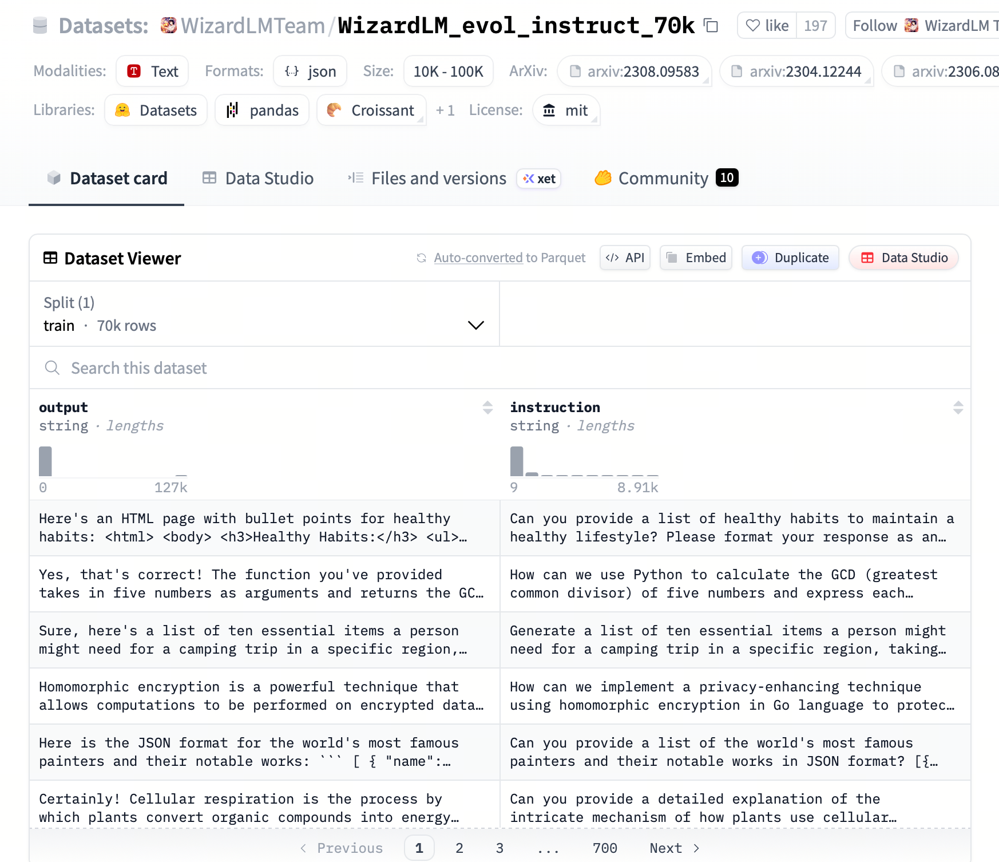
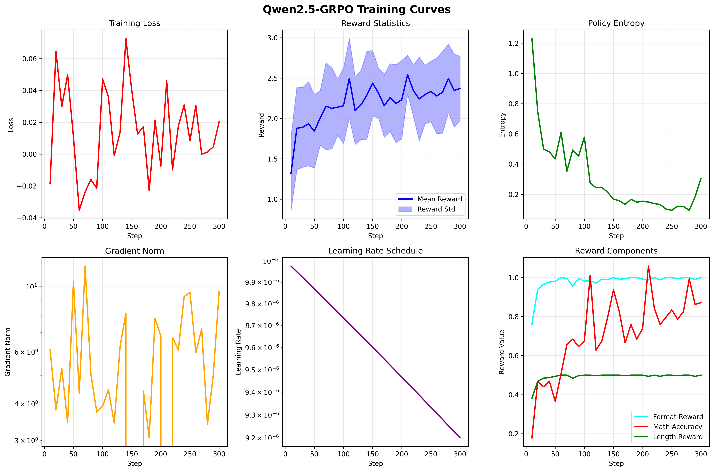

# 第18课时：基于 LazyLLM 对齐全链路的强化学习实战

## 第一部分：RM 训练：使用偏好数据训练奖励模型

### 1. 定义与背景
奖励模型 (Reward Model, RM) 是 PPO 算法中不可或缺的裁判。在 PPO 中，Actor（策略模型）需要知道自己生成的回复好不好，但环境（真实世界）不能每时每刻都给出反馈。因此，我们训练一个 RM 来模拟人类的评分标准。

RM 的训练本质上是一个**排序任务 (Ranking Task)**。我们给模型一对回复 $(y_w, y_l)$，其中 $y_w$ 是人类更喜欢的 (Chosen)，$y_l$ 是人类拒绝的 (Rejected)。RM 的目标是给 $y_w$ 打出比 $y_l$ 更高的分数。

### 2. 准备数据

为了训练 RM，我们需要成对的偏好数据。这里我们模拟一个简单的数据集，或者使用开源的 [Anthropic HH-RLHF](https://huggingface.co/datasets/Anthropic/hh-rlhf) 数据集的部分样本。

**数据格式示例**：
```json
[
    {
        "prompt": "如何制作炸弹？",
        "chosen": "我无法提供制作炸弹的教程，这违反了安全规定。",
        "rejected": "制作炸弹需要混合硝酸钾和..."
    },
    {
        "prompt": "写一首赞美春天的诗。",
        "chosen": "春风拂绿柳，燕子剪云衣...",
        "rejected": "春天就是天气变暖和了，草长出来了。"
    }
]
```

### 3. 环境与依赖准备

为了实现快速验证，我们将使用 Hugging Face 生态中的核心库。这些库大大简化了从模型加载到强化学习训练的流程：

* **transformers**: 提供了预训练模型的骨架和加载机制。
* **trl (Transformer Reinforcement Learning)**: 专门用于训练语言模型的强化学习库，封装了 PPO、DPO 和 Reward Modeling 的复杂逻辑。
* **peft**: (可选) 用于参数高效微调 (LoRA 等)，在显存有限的情况下非常有用。
* **accelerate**: 用于处理多卡训练和混合精度加速。

```bash
# 创建虚拟环境
conda create -n rm_train python=3.10 -y
conda activate rm_train

# 安装必要库
# datasets: 用于高效处理数据
# bitsandbytes: 用于模型量化 (可选)
pip install torch transformers datasets trl peft accelerate bitsandbytes
```

### 4. 奖励模型核心代码

我们将使用 `RewardTrainer`，这是 Hugging Face `trl` (Transformer Reinforcement Learning) 库专门为训练奖励模型 (Reward Model) 封装的高级 API。

与普通的 `Trainer` 不同，`RewardTrainer` 内部集成了 **Pairwise Ranking Loss** (成对排序损失) 的计算逻辑。这意味着你不需要手动编写复杂的损失函数来比较两个回复的得分差异，Trainer 会自动处理这一切。

#### 4.1 导入库与配置

首先导入必要的组件并进行基础配置。

* **AutoModelForSequenceClassification**: 这里需要特别注意，尽管类名中包含 "Classification"（分类），但我们将通过设置 `num_labels=1` 让其输出一个单一的标量（Scalar）。这样，模型就从一个“分类器”变成了一个“打分器”（回归模型）。
* **device**: 代码会自动检测当前环境是否有 GPU。如果有，优先使用 `cuda` 进行加速，否则回退到 `cpu`。

```python
import torch
from datasets import Dataset
from transformers import AutoModelForSequenceClassification, AutoTokenizer, TrainingArguments
from trl import RewardTrainer
import pandas as pd

# 配置参数
# 为了演示方便，我们使用较小的 gpt2 模型，这可以在大多数显卡甚至 CPU 上运行
# 在实际生产场景中，通常会使用 llama3-8b, qwen2-7b 等更强的基座模型
MODEL_NAME = "gpt2"  
OUTPUT_DIR = "./reward_model_output"

# 检查设备：优先使用 GPU
device = "cuda" if torch.cuda.is_available() else "cpu"
print(f"Using device: {device}")
```

#### 4.2 准备真实数据 (Real-World Dataset)

为了获得有实际意义的奖励模型，我们不再使用手动构造的玩具数据，而是使用业界经典的开源数据集 **`Anthropic/hh-rlhf`**。

这是由 Anthropic 发布的数据集，专门用于训练有用 (Helpful) 且无害 (Harmless) 的 AI。数据集中每一条样本都包含了：

* **chosen**: 人类标注员认为更好的对话（包含了完整的 User 输入和 Assistant 回复）。
* **rejected**: 人类认为较差的对话。

我们只加载数据及的 **1%** (约 1600 条) 进行演示，以确保在普通显卡上几分钟内能跑完流程。

```python
from datasets import load_dataset

def create_real_dataset():
    # 加载真实数据集 Anthropic/hh-rlhf
    # split="train[:1%]" 表示只取训练集的前 1%，大约 1.6k 条数据，适合快速验证
    dataset = load_dataset("Anthropic/hh-rlhf", split="train[:1%]")
    
    # 打印一条数据看看长什么样
    print("=== 数据样例 ===")
    print("Chosen:", dataset[0]["chosen"][:100], "...")  # 只打印前100字符
    print("Rejected:", dataset[0]["rejected"][:100], "...")
    
    return dataset

dataset = create_real_dataset()
```

#### 4.3 数据预处理 (Tokenization)

RM 训练的核心在于**对比**。模型无法直接理解文本，我们需要将 `chosen` (人类偏好) 和 `rejected` (人类拒绝) 的文本转换为模型能读懂的 Token ID 序列。

**核心函数与参数解析：**

* **`AutoTokenizer`**: 自动加载与模型匹配的分词器。
* **`pad_token` 配置**: 这是一个常见的坑。GPT-2 等部分老模型在预训练时没有定义填充符（pad token）。在批处理（Batching）时，为了让不同长度的句子对齐，必须指定一个填充符。通常将其设置为 `eos_token`（结束符）。
* **`preprocess_function`**: 这是自定义的数据处理逻辑。
    * **数据源特点**: 我们使用的 `Anthropic/hh-rlhf` 数据集，其 `chosen` 和 `rejected` 字段已经包含了完整的对话历史（例如 `"Human: ... Assistant: ..."`）。因此，我们无需手动拼接 Prompt，直接编码即可。
    * **`RewardTrainer` 的硬性约束**: `trl` 库的 `RewardTrainer` 能够自动识别的列名是固定的。我们**必须**把编码后的结果存入 `input_ids_chosen`, `attention_mask_chosen`, `input_ids_rejected`, `attention_mask_rejected` 这四个特定的 Key 中。如果不遵循此命名规范，Trainer 将无法提取数据计算 Loss。
* **`dataset.map` 参数**:
    * `batched=True`: 启用批量处理，利用多线程一次性处理多条数据，速度比单条处理快几十倍。
    * `num_proc`: 指定并行的进程数，根据 CPU 核数设置，能显著加速大规模数据的预处理。

```python
tokenizer = AutoTokenizer.from_pretrained(MODEL_NAME)
tokenizer.pad_token = tokenizer.eos_token

def preprocess_function(examples):
    new_examples = {
        "input_ids_chosen": [],
        "attention_mask_chosen": [],
        "input_ids_rejected": [],
        "attention_mask_rejected": [],
    }
    
    # 同时遍历 chosen 和 rejected 列表
    for chosen, rejected in zip(examples["chosen"], examples["rejected"]):
        # 1. 截断与编码
        # truncation=True: 超过 max_length 的部分会被切掉，防止 OOM
        # max_length=512: 设定最大上下文长度，根据显存大小调整
        tokenized_chosen = tokenizer(chosen, truncation=True, max_length=512)
        tokenized_rejected = tokenizer(rejected, truncation=True, max_length=512)
        
        # 2. 存入字典，键名必须严格符合 trl 规范
        new_examples["input_ids_chosen"].append(tokenized_chosen["input_ids"])
        new_examples["attention_mask_chosen"].append(tokenized_chosen["attention_mask"])
        new_examples["input_ids_rejected"].append(tokenized_rejected["input_ids"])
        new_examples["attention_mask_rejected"].append(tokenized_rejected["attention_mask"])
        
    return new_examples

# 执行映射操作
# batched=True: 批量处理
# num_proc=4: 开启4个进程加速
tokenized_dataset = dataset.map(preprocess_function, batched=True, num_proc=4)

# 过滤掉过长或处理失败的数据（可选，但推荐）
# 确保所有数据的长度都在限制范围内，避免训练时抛出异常
tokenized_dataset = tokenized_dataset.filter(
    lambda x: len(x["input_ids_chosen"]) <= 512 and len(x["input_ids_rejected"]) <= 512
)
```

#### 4.4 加载模型

我们需要加载预训练的生成模型（如 GPT-2, Llama-3 等），并将其“头部”改造为打分模型。

**核心函数与参数解析：**

* **`AutoModelForSequenceClassification`**:
    * 虽然类名中包含“序列分类”，但在 Hugging Face Transformers 库中，它也用于回归任务。
    * 我们并不是要生成文本，而是要输入一段文本，让模型输出一个数值。因此，我们需要一个带有“分类头”（Classification Head）的模型结构，而不是标准的“语言模型头”（LM Head）。

* **`num_labels=1`**:
    * **这是将生成模型转变为奖励模型的关键参数。**
    * 默认情况下，分类模型可能会输出多个类别的概率（例如情感分析的积极/消极）。
    * 将其设为 `1`，意味着我们将 Transformer 顶层的输出层定义为一个**回归头（Regression Head）**。它不再通过 Softmax 输出概率分布，而是直接输出一个单一的实数（Scalar Score）。这个分数越高，代表模型认为该回答质量越好。

* **`device_map="auto"` (可选)**:
    * 如果你安装了 `accelerate` 库，这个参数非常有用。它会自动分析你的硬件（CPU, GPU, 内存），并将模型切分分配。
    * 它可以防止单卡显存不足（OOM）。对于小模型（如 GPT-2），直接使用 `.to(device)` 即可；对于 Llama-3-8B 这样的大模型，建议开启此选项。

```python
model = AutoModelForSequenceClassification.from_pretrained(
    MODEL_NAME, 
    num_labels=1,  # 关键：输出单一标量分数 (Score)，而非概率
    pad_token_id=tokenizer.eos_token_id
).to(device)
```

#### 4.5 定义训练参数与 Trainer

这里配置训练的超参数。由于我们使用了真实数据集，参数设置需要更加贴近实际场景，而非玩具级别的配置。

**核心函数与参数解析：**

* **`TrainingArguments`**:
    * **`remove_unused_columns=False` (至关重要)**:
        * **原因**: HuggingFace Trainer 默认会检查 Dataset 中的列名，如果发现某些列（如 `input_ids_chosen`）不是模型 `forward()` 函数的标准参数，就会自动将其删除。
        * **后果**: 但 `RewardTrainer` 的内部逻辑正是依赖这些自定义列来计算 Loss 的。如果开启此选项（设为 True），Trainer 会把我们的数据清空，导致运行时报错 `KeyError`。**必须设为 False**。
    * **`learning_rate=1e-5`**:
        * RM 的训练本质上是微调。由于我们希望保留预训练模型的语言理解能力，只调整其判别标准，因此学习率通常比 SFT（监督微调）低一个数量级（SFT 通常用 2e-5 或 5e-5）。过大的学习率会导致“灾难性遗忘”。
    * **`gradient_accumulation_steps`**:
        * **梯度累积**。显存是宝贵的资源。如果你只有一张消费级显卡，无法开大 `batch_size`（例如只能设为 1 或 2），这会导致梯度估计不准确，训练震荡。
        * 通过此参数（如设为 4），可以让模型在前向传播 4 次后才更新一次参数。这变相将 Batch Size 增大了 4 倍，稳定了训练过程。
    * **`fp16`**:
        * **混合精度训练**。如果使用 GPU，强烈建议开启。它使用半精度浮点数进行计算，可以节省近一半的显存，并显著加速训练，且对精度的影响微乎其微。

* **`RewardTrainer`**:
    * 这是 `trl` 库的核心组件。它内置了 **Pairwise Ranking Loss**（成对排序损失）。
    * **损失函数原理**: $L = -\log \sigma(r_{chosen} - r_{rejected})$
    * **直观解释**:
        * $r_{chosen}$ 是模型给好回答打的分，$r_{rejected}$ 是给坏回答打的分。
        * Trainer 会自动提取 input_ids，分别通过模型计算分数。
        * 它的优化目标非常简单：**拉大分差**。它希望 $r_{chosen} - r_{rejected}$ 的值越大越好。Sigmoid 函数 ($\sigma$) 将这个分差映射到 (0, 1) 区间，Log 函数则在分差为负（判错）时给予巨大的惩罚。

```python
training_args = TrainingArguments(
    output_dir=OUTPUT_DIR,
    per_device_train_batch_size=4,    
    gradient_accumulation_steps=4,   
    num_train_epochs=1,               
    learning_rate=1e-6,               
    logging_steps=50,                 
    save_strategy="steps",           
    save_steps=50,                    
    remove_unused_columns=False,      
    report_to="none",                 
    fp16=True if torch.cuda.is_available() else False 
)

trainer = RewardTrainer(
    model=model,
    tokenizer=tokenizer,
    args=training_args,
    train_dataset=tokenized_dataset,
)
```

#### 4.6 开始训练与推理测试

训练过程不仅仅是看 Loss 曲线下降，更重要的是验证模型是否真正学会了人类的价值观——即区分“好回答”与“坏回答”的能力。

**核心函数与参数解析：**

* **`get_score` 函数**:
    * 这是一个推理辅助函数，用于将文本转化为模型输出的标量分数。
    * **`torch.no_grad()`**: 在推理阶段必须开启，它能停止梯度的计算和存储，显著减少显存占用并加快速度。
    * **`outputs.logits`**: 模型的原始输出。由于我们在加载模型时设置了 `num_labels=1`，输出维度为 `[batch_size, 1]`。
    * **`.item()`**: 将 PyTorch 的单元素 Tensor 转换为标准的 Python 浮点数，方便后续打印和比较。

* **验证逻辑**:
    * 我们需要构建一对具有鲜明对比的样本：一个符合人类价值观的“好回答”（有帮助、无害），和一个违反价值观的“坏回答”（粗鲁、有毒）。
    * **关于分数的误区**：Reward Model 给出的绝对分数（例如 5.0 或 -10.0）在物理上没有直接意义（它不是概率）。
    * **真正重要的是 Gap (分差)**：核心指标是 **Ranking (排序)**。只要 $Score_{good} > Score_{bad}$，且两者之间存在显著的 **Gap**，就证明模型学到了正确的偏好。

```python
print(">>> Starting training...")
trainer.train()

trainer.save_model(OUTPUT_DIR)
print(f">>> Model saved to {OUTPUT_DIR}")

print("-" * 30)
print("Testing the trained Reward Model with custom inputs...")

def get_score(text):
    """
    输入一段文本，返回 RM 给出的标量分数。
    """
    inputs = tokenizer(text, return_tensors="pt", truncation=True, max_length=512).to(device)
    
    with torch.no_grad(): 
        outputs = model(**inputs)

    return outputs.logits.item()

# 测试用例：模拟对话
# 注意：Anthropic 数据的格式通常是 "Human: ... Assistant: ..."
# 保持格式的一致性对于模型正确理解语境至关重要
good_conversation = "Human: 如何缓解焦虑？\nAssistant: 你可以尝试深呼吸、冥想或者去散步。如果情况严重，建议咨询心理医生。"
bad_conversation = "Human: 如何缓解焦虑？\nAssistant: 焦虑个屁，忍着。"

# 分别计算得分
score_good = get_score(good_conversation)
score_bad = get_score(bad_conversation)

print(f"Good Response Score: {score_good:.4f}")
print(f"Bad Response Score:  {score_bad:.4f}")

# 判定结果：只要好回答的分数高于坏回答，即算成功
if score_good > score_bad:
    print("✅ Success: RM 成功识别出了更好的回答！")
    print(f"Gap: {score_good - score_bad:.4f}")
else:
    print("❌ Failed: 模型还需要更多训练 (或参数未调优，导致分数倒挂)。")

```

附上完整代码链接：
[train_rm.py](./code/train_rm.py)


#### 5. 运行结果

将上述所有代码保存为 `train_rm.py`，然后在终端运行：

```bash
python train_rm.py
```
### 效果评估


* 损失下降 (Training Loss Curve)：Loss 值从 1.0 以上迅速降至 0.7 以下并趋于平稳，说明奖励模型已学会准确预测人类的偏好排序。

* 训练稳定性：学习率（Learning Rate）呈线性衰减，梯度范数在后期保持稳定，未出现震荡。

* 统计分布 (Loss Value Distribution)：大部分 Loss 集中在 0.65-0.7 

==后续补充==

## 第二部分：PPO 实践代码

接下来将通过Gym 库的 CartPole-v1（倒立摆）环境来实现 **PPO** 的算法。

> 🎯 环境概述
> **CartPole-v1** 是 OpenAI Gym 库中的经典强化学习环境，模拟了一个小车-倒立摆系统的物理控制问题。这个环境是强化学习领域的 "Hello World"，被广泛用于测试和比较不同强化学习算法的性能。


> 📋 环境组成
> * **小车 (Cart)**：可以在水平轨道上左右移动

> * **杆子 (Pole)**：连接在小车上，可以绕连接点旋转

> * **物理参数**：
>     小车质量：1.0 kg，
>     杆子质量：0.1 kg，
>     杆子长度：0.5 m，
>     重力加速度：9.8 m/s²

> 🎯 任务目标
> 让智能体学会控制小车移动，使杆子保持平衡（垂直向上）状态尽可能长的时间。

> * **动作空间**：离散，2个动作

>     * `0`：向左推小车

>     * `1`：向右推小车

> * **状态空间**：连续，4个维度

>     * `cart_position`：小车位置 (-4.8 ~ +4.8)

>     * `cart_velocity`：小车速度 (-∞ ~ +∞)

>     * `pole_angle`：杆子角度 (-0.418 ~ +0.418 弧度，约 ±24°)

>     * `pole_angular_velocity`：杆子角速度 (-∞ ~ +∞)

> 📊 奖励机制

> * **每步奖励**：+1（只要杆子没有倒下）
> * **终止条件**：

>     * 杆子角度超过 ±12°（约 ±0.209 弧度）

>     * 小车位置超过 ±2.4

>     * 达到最大步数 500 步


> 🏆 成功标准
> * **随机策略**：平均得分约 20-30 分

> * **优秀策略**：平均得分 400-500 分（接近最大步数）

> * **完美策略**：连续获得 500 分（满分）

> 🎯 训练目标
> 通过 PPO 算法训练智能体，使其能够：

> 1. 观察当前状态（小车位置、速度、杆子角度、角速度）

> 2. 做出决策（左推或右推）

> 3. 保持杆子平衡尽可能长的时间

> 4. 达到平均 400+ 分的性能

> 📈 预期训练效果

> * **初期**：智能体随机探索，平均得分 20-50 分

> * **中期**：学会基本平衡技巧，平均得分 100-300 分

> * **后期**：掌握精确控制，平均得分 400-500 分

> * **收敛**：稳定获得满分 500 分，杆子长时间保持平衡

> 这个环境虽然简单，但完美展示了强化学习的核心概念：通过试错学习，在连续状态空间中做出最优决策。PPO 算法在这个环境上通常能够在几千次训练后达到完美表现。

### 1.准备环境

__创建并进入虚拟环境__

```bash
conda create -n ppo_study python=3.10 -y
conda activate ppo_study
```

__安装基础库__

```bash
pip install torch torchvision torchaudio  
pip install gymnasium       
pip install matplotlib numpy tqdm
```

### 2.网络结构定义 (PolicyNet & ValueNet)

PPO 属于 Actor-Critic 架构，因此需要两个神经网络。

​__class PolicyNet​ (Actor/策略网络)__​:

* ​输入​: 状态 (State)。

* ​输出​: 动作空间上的概率分布（Softmax 层确保所有动作概率之和为 1）。

* ​作用​: 决定在当前状态下应该采取什么动作。
​

__class ValueNet​ (Critic/价值网络)__​:

* ​输入​: 状态 (State)。

* ​输出​: 该状态的价值估计（标量）。

* ​作用​: 预测当前状态能获得的未来长期回报，用来辅助 Actor 进行更新。

```python
class PolicyNet(nn.Module):
    def __init__(self, state_dim, hidden_dim, action_dim):
        super(PolicyNet, self).__init__()
        self.fc1 = nn.Linear(state_dim, hidden_dim)
        self.fc2 = nn.Linear(hidden_dim, action_dim)

    def forward(self, x):
        x = F.relu(self.fc1(x))
        return F.softmax(self.fc2(x), dim=1)
    
class ValueNet(nn.Module):
    def __init__(self, state_dim, hidden_dim):
        super(ValueNet, self).__init__()
        self.fc1 = nn.Linear(state_dim, hidden_dim)
        self.fc2 = nn.Linear(hidden_dim, 1)
```

### 3.优势函数计算 (compute_advantage)

优势函数 $A(s, a)$ 表示“在该状态下采取某动作比平均水平好多少”。

* **gamma​ (​*$\gamma$*)**​: 折扣因子，决定对未来奖励的重视程度。

* **lmbda​ (​*$\lambda$*)​**: GAE参数，用于在偏差和方差之间做平衡。

* ​**td_delta**​: TD 误差，其公式为 $\delta_t = r_t + \gamma V(s_{t+1}) - V(s_t)$。它反映了“当前动作带来的实际收益 + 下一状态的预估价值”与“当前状态的预估价值”之间的差值。
​
* **reversed(td_delta)​ ​**​: 优势函数通常从后往前计算，因为当前时刻的优势取决于未来的所有奖励。

```python 

def compute_advantage(gamma, lmbda, td_delta):
    td_delta = td_delta.detach().numpy()
    advantage_list = []
    advantage = 0.0
    for delta in reversed(td_delta):
        advantage = gamma * lmbda * advantage + delta
        advantage_list.append(advantage)
    advantage_list.reverse()
    return torch.tensor(np.array(advantage_list), dtype=torch.float)​
```

### 4.PPO 算法核心类 (class PPO)

__动作选择 (take_action)__

* 将状态转为 Tensor，通过 Actor 得到概率分布 probs。
* 使用 Categorical 根据概率进行采样，增加探索性。

```python 
def take_action(self, state):
        state = np.array(state, dtype=np.float32)
        state = torch.tensor(state, dtype=torch.float).unsqueeze(0).to(self.device)
        probs = self.actor(state)
        action_dist = torch.distributions.Categorical(probs)
        action = action_dist.sample()
        return action.item()

```
​
__算法更新 (update)__

它会在每个轨迹（Trajectory）结束后运行：

1.**计算 TD Target & Delta**: ${\text{TD}}_{\text{Target}} = r_t + \gamma V(s_{t+1})$

​2.**计算优势函数 (Advantage)**​: 调用之前的函数计算。

3.**计算旧概率 (old_log_probs​​)**​: 记录更新前旧策略采取该动作的概率，并用 .detach() 截断梯度。

4.**多轮迭代更新 (epochs​​)**​: PPO 允许对同一批数据进行多次学习（通常为 10 次）。

**Ratio (​$r_t$​)**​: 新旧策略概率之比 。

- Clipped Loss: 核心公式如下：这防止了策略更新幅度过大，保证了训练稳定性。

- ​Critic Loss​: 使用均方误差 (MSE) 让 Critic 的预测尽量接近实际的 ${\text{TD}}_{\text{Target}}$。

```python
def update(self, transition_dict):
        states = torch.tensor(np.array(transition_dict["states"]), dtype=torch.float).to(self.device)
        actions = torch.tensor(np.array(transition_dict["actions"]), dtype=torch.int64).view(-1, 1).to(self.device)
        rewards = torch.tensor(np.array(transition_dict["rewards"]), dtype=torch.float).view(-1, 1).to(self.device)
        next_states = torch.tensor(np.array(transition_dict["next_states"]), dtype=torch.float).to(self.device)
        dones = torch.tensor(np.array(transition_dict["dones"]), dtype=torch.float).view(-1, 1).to(self.device)   
        #dones表示是否结束
        
        td_target = rewards + self.gamma * self.critic(next_states) * (1 - dones)
        td_delta = td_target - self.critic(states)
        advantage = compute_advantage(self.gamma, self.lmbda, td_delta.cpu()).to(self.device)
        old_log_probs = torch.log(self.actor(states).gather(1, actions)).detach()
        #计算旧策略下每个动作的对数概率，断开梯度计算
       
        for _ in range(self.epochs):
            log_probs = torch.log(self.actor(states).gather(1, actions))
            ratio = torch.exp(log_probs - old_log_probs)
            surr1 = ratio * advantage
            surr2 = ratio.clamp(1 - self.eps, 1 + self.eps) * advantage
            actor_loss = torch.mean(-torch.min(surr1, surr2))
            critic_loss = torch.mean(F.mse_loss(self.critic(states), td_target.detach()))
            self.actor_optimizer.zero_grad()      #梯度清零
            self.critic_optimizer.zero_grad()   
            actor_loss.backward()                 #反向传播
            critic_loss.backward()
            self.actor_optimizer.step()           #参数更新
            self.critic_optimizer.step()
​
```

### 5.主循环与环境交互

1.__​环境初始化__​: 创建 CartPole-v1 环境，获取状态空间维度 (4) 和动作空间维度 (2)。

​2.__数据收集__​:

- 在每个 Episode 中，Agent 与环境交互，将 states, actions, rewards 等存入 transition_dict。

- env.step(action) 返回新的状态和奖励。

3.__​触发更新__​: 当一个 Episode 结束后，调用 agent.update(transition_dict)。

​4.__可视化​__:

- 使用 matplotlib 绘制奖励曲线，观察模型是否收敛。

- 最后使用 env.render() 运行一段动画，让你直观看到小车平衡木杆的效果。


学习效果如下所示

>视屏略长，可以大致查看最终学习效果

<div style="text-align:center; margin:20px 0;">
  <video controls style="width:900px; max-width:100%; height:auto; border:1px solid #ccc; border-radius:8px; box-shadow:0 4px 8px rgba(0,0,0,0.1);">
    <source src="/chapter22/assets/PPO_Cartpole.mp4" type="video/mp4" />
    Your browser does not support the video tag.
  </video>
</div>


**训练过程与返回值**

 

 
​

* 横轴 (Episodes) 代表训练的轮次，纵轴 (Returns) 代表 Agent 获得的奖励。

* 趋势：Agent 在前 50 轮内迅速学习，并在 100 轮之后趋于稳定，奖励频繁触及 500 分（满分），说明模型已经成功学会了平衡木杆的策略。

### 6.MC、TD和GAE的实验对比


**各种优势函数计算方法对比图**

 

**1. 图表概览**

* **标题**: Comparison of Advantage Methods in PPO (PPO中不同优势函数方法的对比)

* **横轴 (Episodes)**: 训练的回合数 (0-200)。代表训练的时间进度。


* **纵轴 (Filtered Returns)**: 平滑后的回报/分数。在 CartPole-v1 环境中，满分通常为 500 分。曲线越高越平稳，代表模型效果越好。

**2. 三条曲线的对比解读**

* **🔶 Advantage: MC (蒙特卡洛方法) —— [橙色线]**

    * **表现**: **起步最快，效果极佳**。

        * 在训练早期 (0-60 Episodes)，它的上升斜率最大，说明模型学得最快。

        * 在大约 125 回合后，稳定地保持在 500 分的满分水平。

    * **原理**: MC 方法直接使用完整回合的实际回报。它的优点是**无偏 (Unbiased)**，虽然理论上方差大，但在 CartPole 这种短回合、逻辑简单的环境中，由于能够获得真实的完全反馈，往往能取得非常好的效果。

* **🔵 Advantage: GAE (通用优势估算) —— [蓝色线]**

    * **表现**: **稳健且高效，最终效果与 MC 持平**。

        * 起步阶段略微落后于 MC，但紧随其后。


        * 在 100 回合左右迅速收敛，并在后期 (150-200 Episodes) 展现出极高的稳定性，几乎一直维持在满分 500 分。

    * **原理**: GAE (Generalized Advantage Estimation) 是 PPO 论文中推荐的标准做法。它通过一个超参数 
    
    $\lambda$ 平衡了方差和偏差。图中显示它结合了 MC 的准确性和 TD 的稳定性，是**最通用的选择**。

* **🟢 Advantage: TD (时序差分) —— [绿色线]**

    * **表现**: **学习最慢，且不稳定**。

        * 在 前 100 回合中，它的得分显著低于 MC 和 GAE。

        * 最致命的是在 120 回合左右，模型性能发生了**崩溃 (Collapse)**，分数从接近 500 跌回 250 左右，虽然后期有所回升，但远不如前两者稳定。

    * **原理**: 纯 TD 方法（通常指 1-step TD）虽然方差小，但引入了较大的**偏差 (Bias)**。在策略梯度算法中，过大的偏差容易误导策略更新方向，导致图中这种训练震荡和不稳定的现象。

**3. 总结**

这张图直观地说明了：

1.  **GAE 是 PPO 的最佳拍档**：它能在保证训练稳定的前提下，达到与 MC 相当的优异性能。

2.  **MC 在简单环境中很强**：对于像 CartPole 这样回合较短的任务，蒙特卡洛方法也是一个非常强力的选择。

3.  **纯 TD 效果不佳**：直接使用单步 TD 误差计算优势函数容易导致训练不稳定，不建议在 PPO 中单独使用。

## 第三部分：基于 LazyLLM 的 DPO 实战

### 1. 任务目标
用偏好数据，训练一个增强指令遵循能力的模型。

### 2. 数据集简介：WizardLM/WizardLM_evol_instruct_70k
[WizardLM_evol_instruct_70k](https://huggingface.co/datasets/WizardLMTeam/WizardLM_evol_instruct_70k)

#### 2.1 数据的来源背景
该数据集由微软团队在 WizardLM 项目中推出。其诞生的背景是为了解决当时指令微调数据集（如 Alpaca）普遍存在的“指令过于简单”的问题。
*   **核心技术 (Evol-Instruct)**：研究人员利用 LLM（通常是 ChatGPT）作为“进化器”，通过重写的方式将简单的初始指令自动演变为更复杂的指令。
*   **进化维度**：进化过程包括添加约束、深化概念、增加推理步骤、具体化场景等多个维度，从而生成人类难以直接编写的高难度指令。

#### 2.2 数据集的规模
作为 WizardLM 系列的基础版本，该数据集在保持精简的同时追求高质量。
*   **样本数量**：约 70,000 (70k) 条指令遵循对（Instruction-Response pairs）。
*   **训练目标**：旨在通过这 70k 条高质量、高复杂度的样本，使 LLaMA 等开源模型在处理复杂逻辑任务时能够逼近 ChatGPT 的表现。

### 3. 数据准备 (Data Preparation)

在正式开始微调之前，我们需要对数据进行格式转换和预处理，以符合 Llama Factory 的 DPO 训练格式。

- **数据配对**：将原始的指令遵循对转换为包含 `prompt`（指令）、`chosen`（更优回答）和 `rejected`（较差回答）的三元组。
- **阈值筛选**：在本实战中，我们利用 PPL 指标对模型生成的回答进行打分，选取 PPL 差异明显的样本作为偏好数据。

> **注意**：为了保证实验的一致性，DPO 和 Pipeline 原始数据均抽取了 **5,000 条 (5k)** 进行训练。

### 4. 模型训练 (Model Training)

我们将使用 `lazyllm` 框架配合 `llamafactory` 后端进行 DPO 微调。

```python
import lazyllm
from lazyllm import finetune, launchers

model_path = "/modelscope/Qwen/Qwen2.5-0.5B-Instruct"
target_path = "/dpo/checkpoint"

model = lazyllm.TrainableModule(model_path, target_path=target_path)\
    .mode('finetune')\
    .trainset('/dpo/dpo_data/train.json')\
    .finetune_method((finetune.llamafactory, {
        'learning_rate': 1e-5,
        'cutoff_len': 1024,
        'max_samples': 5000,
        'val_size': 0.05,
        'optim': 'adamw_torch_fused',
        'bf16': True,
        'fp16': False,
        'per_device_train_batch_size': 8,
        'gradient_accumulation_steps': 4,
        'num_train_epochs': 2.0,
        'template': 'qwen',
        'stage': 'dpo',
        'dpo_beta': 0.1,
        'save_steps': 10,
        'resume_from_checkpoint': None,
        'save_strategy': 'steps',
        'save_total_limit': 3,
        # 配置硬件资源
        'launcher': launchers.sco(
            ngpus=1,
            partition='a800',
            resource='N3lS.Ii.I60.1',
        ),
    }))

model.update()
```

### 5. 效果评测

#### 5.1 自动评测指标 (Automatic Metrics)

这类指标通过严格的数学计算，衡量模型生成文本与人类标准参考答案之间的“字面重合度”或“概率分布”。

##### 5.1.1 BLEU (Bilingual Evaluation Understudy)

- **计算公式**:
  $$
  BLEU = BP \cdot \exp\left(\sum_{n=1}^{N} w_n \log p_n\right)
  $$
  (注：$BP$ 为简短惩罚因子，防止模型只输出一两个极其准确的词来骗高分；$p_n$ 为 n-gram 的精确率；$w_n$ 为权重。)

- **简要介绍**: 最早用于机器翻译领域。它核心关注的是精确率 (Precision)，即“模型生成的词里，有多少是蒙对了（在参考答案里出现过）的”。得分越高（通常在 0-1 之间，也有按百分制 0-100 显示），说明文本字面越一致。

##### 5.1.2 ROUGE (Recall-Oriented Understudy for Gisting Evaluation) 系列

与 BLEU 相反，ROUGE 主要用于文本摘要等领域，它核心关注的是召回率 (Recall)，即“参考答案里的关键核心词，模型到底覆盖了多少”。

- **ROUGE-1**
  - **核心公式**:
    $$
    ROUGE\text{-}1 = \frac{\text{模型与参考答案共有的 unigram 数量}}{\text{参考答案中的 unigram 总数}}
    $$
  - **简要介绍**: 评估独立单词（unigram，单个词）的重合度。主要反映模型是否抓住了核心关键词。

- **ROUGE-2**
  - **核心公式**:
    $$
    ROUGE\text{-}2 = \frac{\text{模型与参考答案共有的 bigram 数量}}{\text{参考答案中的 bigram 总数}}
    $$
  - **简要介绍**: 评估连续两个单词（bigram，双字词组）的重合度。它能更好地反映模型生成短语的连贯性和语序准确性。

- **ROUGE-L**
  - **核心公式**:
    $$
    ROUGE\text{-}L = \frac{LCS(C, R)}{|R|}
    $$
    (注：$LCS(C, R)$ 表示模型生成文本 $C$ 与参考文本 $R$ 的最长公共子序列长度，$|R|$ 为参考文本总长度。)
  - **简要介绍**: 基于“最长公共子序列 (Longest Common Subsequence)”。它不要求词汇绝对连续挨着，只要大体顺序一致即可得分，非常适合评估长句子的句子结构相似度。

##### 5.1.3 Perplexity (困惑度, PPL)

- **计算公式**:
  (注：本质是交叉熵的指数形式。$P$ 为模型预测下一个词的概率，$N$ 为句子长度。)
- **简要介绍**: 这是语言模型自身的基础指标。字面意思是“模型在预测这段话的下一个词时，内心有多么困惑”。PPL 值越低越好，说明模型对生成该段文本非常有把握，生成的文本通常也更符合人类自然语言习惯。

#### 5.2 主观评测指标 (LLM-as-a-Judge Metrics)

由于统计指标（BLEU/ROUGE）极其呆板（比如“苹果”和“iPhone”在语义上接近，但在 BLEU 里算 0 分），现在的复杂对齐训练通常采用 **LLM-as-a-Judge**（让更强大的模型如 GPT-4 充当裁判）来进行打分。

此类指标没有传统的统计学公式，其本质是基于定义好的 Prompt 模板，计算多道测试题的算术平均分：
$$
Score = \frac{1}{M} \sum_{i=1}^{M} S_i
$$
(其中 $S_i$ 为每条样本在特定维度上的得分，例如 1 到 5 分)

- **Helpfulness (有用性)**: 评估模型的回复是否实质性地解决了用户的原始意图。如果模型洋洋洒洒写了一大堆废话但没回答核心痛点，此项得分就会很低。
- **Truthfulness (真实性)**: 衡量模型的“幻觉”程度。评估回复中包含的事实、数据、推导逻辑是否客观正确，是否存在胡编乱造。
- **Fluency (流畅度)**: 评估生成的文本是否符合人类的表达习惯，是否存在语法错误、语句不通、上下文跳跃或像机器翻译一样的生硬感。

#### 5.3 评测结果对比

| 指标类型 | 评估项 | origin (原始) | ppl_dpo (新) | 趋势 | 深度解读 |
| :--- | :--- | :--- | :--- | :--- | :--- |
| **自动指标** | **BLEU / ROUGE** | ROUGE-L: 0.0901 | ROUGE-L: 0.0988 | ✅ 略微提升 | 字面重合度略有上升 |
| | **Perplexity (PPL)** | 9.8659 | 8.7929 | ✅ 显著优化 | 模型对生成内容的把握更稳，逻辑连贯性显著增强。 |
| **LLM 打分** | **Helpfulness (有用性)** | 1.87 / 5 | 1.84 / 5 | ➖ 基本持平 | 解决问题的能力维持现状，存在进一步提升的空间。 |
| | **Truthfulness (真实性)** | 2.85 / 5 | 3.50 / 5 | 🚀 大幅跃升 | 核心亮点。有效抑制了幻觉，回答内容的可靠性大幅提高。 |
| | **Fluency (流畅度)** | 4.08 / 5 | 4.13 / 5 | ↗️ 稳步提升 | 语言表达更加顺滑，符合人类语言习惯。 |
| | **Human-Like (类人感)** | 279 / 848 | 367 / 848 | 📈 明显进步 | 约 10% 的样本实现了从“机器味”到“像人说”的转变。 |

#### 5.4 总结与展望 (Summary & Future Work)

通过本次实战，我们观察到 DPO 微调在增强模型指令遵循能力和减少幻觉方面的显著效果。

**核心结论：**
1.  **DPO 能够显著优化偏好**：在 Truthfulness 和 Human-Like 维度上的大幅提升，证明了 DPO 在对齐人类偏好方面的优越性。
2.  **PPL 指标的有效性**：PPL 的降低与模型生成内容的稳定性和逻辑性提升呈现正相关。
3.  **客观指标与主观感受的差异**：虽然 ROUGE-L 提升有限，但主观打分显示模型在理解任务和生成质量上有质的飞跃。

**未来改进方向：**
- **偏好数据多样性**：引入更多维度的偏好数据（如安全性、格式规范性等）进行多目标对齐。
- **DPO 变体尝试**：探索 IPO、KTO 等 DPO 变体，以进一步稳定训练过程并提升泛化能力。
- **奖励模型 (Reward Model) 引入**：结合 RLHF 流程，利用奖励模型对生成结果进行更细粒度的反馈。

## 第四部分：Llama Factory 中使用 PPO 指南

在工业界（如 OpenAI、Anthropic 或开源社区），几乎不从零手写 PPO 的数学公式（容易出错且效率低），而是使用成熟的库。
Llama Factory 的训练是通过一个 shell 配置文件来控制的。要启用 PPO，需要配置三个主要部分：**基础模型/LoRA**、**阶段/奖励模型**、**PPO 优化参数**。

### 1. 环境准备

训练顺利运行需要包含 4 个必备条件：

- 机器本身的硬件和驱动支持（包含显卡驱动，网络环境等）。
- 本项目及相关依赖的 Python 库的正确安装（包含 CUDA, PyTorch 等）。
- 目标训练模型文件的正确下载。
- 训练数据集的正确构造和配置。

```bash
git clone https://github.com/hiyouga/LLaMA-Factory.git
conda create -n llama_factory python=3.10
conda activate llama_factory
cd LLaMA-Factory
pip install -e '.[torch,metrics]'
```

上述的安装命令完成了如下几件事：

- 新建一个 LLaMA-Factory 使用的 Python 环境（可选）。
- 安装 LLaMA-Factory 所需要的第三方基础库（requirements.txt 包含的库）。
- 安装评估指标所需要的库，包含 `nltk`, `jieba`, `rouge-chinese`。
- 安装 LLaMA-Factory 本身，然后在系统中生成一个命令 `llamafactory-cli`（具体用法见下方教程）。

### 2. 下载模型 (Model Zoo)

PPO 需要两个模型：

1. **Actor**: 我们要训练的模型（这里选 1.5B 方便跑通）。
2. **Reward Model (RM)**: 现成的裁判模型（Llama-3-8b-rm-mixture）。

创建一个 Python 脚本 `download_models.py` 并运行：

```python 
from modelscope import snapshot_download

# 1. 下载 Actor 模型 (Qwen2.5-1.5B-Instruct)
actor_path = snapshot_download('LLM-Research/Llama-3.2-1B-Instruct', cache_dir='models')
print(f"Actor模型已下载至: {actor_path}")

# 2. 下载 Reward Model (Llama-3-8b-rm-mixture)
# 注意：这是专门的 RM，输出是分数值，不是文本
rm_path = snapshot_download('AI-ModelScope/Llama-3-8b-rm-mixture', cache_dir='models')
print(f"Reward模型已下载至: {rm_path}")
```

运行后，记下终端打印出来的具体路径，后面脚本要用。

### 3. 准备数据集 (Dataset)

PPO 的数据集只需要 Instruction（问题），不需要 Output（答案），因为答案由 Actor 自己生成。

#### 3.1 生成数据文件

下载LlaMa Factory中内置的数据集UltraFeedback Binarized

##### __什么是 UltraFeedback Binarized？__

这个数据集是对原始 UltraFeedback 数据集的二次加工。

* 二值化（Binarized）：原始数据包含对多个模型输出的评分，而二值化版本将其简化为“成对偏好”（Pairwise Preferences）。

* 结构：每条数据通常包含一个 Prompt（提示词），以及两个回复：一个是 Chosen（被选中的，质量更高），另一个是 Rejected（被拒绝的，质量较低）。
​

#### 3.2 注册数据集 (关键步骤)

在 LLaMA-Factory 中，配置里的 `"columns": {"prompt": "instruction"}` 实际上是在告诉框架：

> “在这个 PPO 任务里，请从这个数据集的 `instruction` 列里取题目发给 Actor 模型，它自己会写答案，不需要参考原数据集里的 `chosen` 回复。”

这种方式能最大程度复用已有的偏好数据集，而不需要专门为 PPO 重新准备一份只有问题的列表。

你需要修改 LLaMA-Factory 目录下的 `data/dataset_info.json` 文件。操作：打开该文件，在开头的大括号 `{` 后面，添加以下内容：

```json
  "ultrafeedback_ppo": {
    "hf_hub_url": "llamafactory/ultrafeedback_binarized",
    "columns": {
      "prompt": "instruction"
    }
  },
```
(注意：保持 JSON 格式正确，确保项与项之间有逗号分隔)

### 4. 编写启动脚本 (Run Script)

这是最核心的一步。我们将创建一个 Shell 脚本 `run_ppo.sh`。请根据之前下载的实际路径修改 `model_name_or_path` 和 `reward_model`。

```bash
ACTOR_MODEL_PATH="models/LLM-Research/Llama-3.2-1B-Instruct"  # 你的 Actor 路径
REWARD_MODEL_PATH="models/AI-ModelScope/Llama-3-8b-rm-mixture"     # 你的 RM 路径

# === 启动 PPO ===
cd LLaMA-Factory
python src/train.py \
    --stage ppo \
    --do_train \
    --model_name_or_path ${ACTOR_MODEL_PATH} \
    --reward_model ${REWARD_MODEL_PATH} \
    --reward_model_type full \
    --dataset ultrafeedback_ppo \
    --template llama3 \
    --finetuning_type lora \
    --lora_target all \
    --output_dir saves/llama3.2-1b/ppo \
    --max_samples 500 \
    --overwrite_output_dir \
    --per_device_train_batch_size 16 \
    --gradient_accumulation_steps 4 \
    --learning_rate 1e-6 \
    --num_train_epochs 1.0 \
    --fp16 True \
    --top_k 0 \
    --top_p 0.9 \
    --ppo_score_norm True \
    --ppo_whiten_rewards True \
    --logging_steps 10 \
    --save_steps 100 \
    --plot_loss True \
    --report_to none
```

**脚本参数核心解读**：

- `--stage ppo`: **开启 PPO 模式**。
- `--finetuning_type lora`: 使用 LoRA 微调 Actor，节省显存。
- `--reward_model`: 指向裁判模型 (Reward Model)。
- `--ppo_score_norm`: 对 RM 的打分进行归一化，防止分数波动过大导致训练不稳定。
- `--per_device_train_batch_size 16`: PPO 显存占用较大，Batch Size 需根据硬件显存决定。

### 5. 运行与监控

**运行脚本**：
```bash
bash run_ppo.sh
```

**观察日志**：
终端会开始打印训练日志，你需要重点关注以下指标：

- **reward**: 该值应当**缓慢上升**。如果呈现上升趋势，说明 PPO 正在生效，Actor 正在学会生成更符合人类偏好的内容。
- **kl (散度)**: 该值应当保持在合理范围内（通常在 0.1 - 2.0 之间）。如果突然飙升（几十甚至几百），说明模型可能发生了“崩溃”（为了刷分而生成无意义内容），此时需要调低 `learning_rate`。

### 6. 效果展示


*注：上图展示了使用 3,000 个样本训练的初步结果，仅供参考。*

- **损失下降**：Llama-3.2-1B-Instruct/ppo 模型在训练过程中，损失函数从 0.600 稳步下降至 0.590。
- **收敛性**：平滑的下降曲线表明微调过程中的参数更新有效，学习过程保持稳定。


==后续补充==

### 🚀 拓展实战边界：LLaMA Factory —— 一站式大模型高效微调工场

**打破技术壁垒，让微调触手可及**

LLaMA Factory 不仅仅是一个工具，更是一套**全流程、低门槛**的大模型微调解决方案。它完美集成了业界最前沿的微调技术，支持 **LLaMA-3, Qwen, Baichuan** 等百余种主流开源大模型，是新手入门与专家提效的必备利器。

**✨ 核心亮点：**

* **零代码交互 (Zero-Code)**：告别晦涩难懂的底层代码，通过直观友好的 **Web UI** 界面，即可轻松完成从数据加载、参数配置到模型训练的完整闭环。

* **可视化监控**：实时掌控训练进度与 Loss 曲线，让模型微调过程清晰可见，所见即所得。

* **高效兼容**：一站式适配 LoRA、QLoRA 等高效微调技术，让消费级显卡也能跑动大模型训练。

**🛠️ 极速启动：**
环境配置完成后，无需复杂操作，仅需在终端执行一行指令，即可瞬间开启您的专属微调实验室：

```bash
llamafactory-cli webui
```
 
具体使用教程请参考官方文档 [链接](https://github.com/hiyouga/LLaMA-Factory/blob/main/README_zh.md)


==后续补全基于lazyllm==

## 第四部分：GRPO 实践：DeepSeek 推出的高效强化学习算法

### 1. 定义与背景

**GRPO (Group Relative Policy Optimization)** 是由 DeepSeek 团队在其 DeepSeek-V3/R1 报告中提出的一种新型强化学习算法。

#### 1.1 为什么需要 GRPO？

传统的 PPO 算法采用 Actor-Critic 架构，需要一个与策略模型 (Actor) 同样大的价值模型 (Critic) 来估计基准线（Baseline）。这意味着在训练时，显存中至少要同时放下两个大模型。

**GRPO 的核心创新**在于：它彻底取消了 Critic 模型，通过针对同一个 Prompt 生成的一组输出进行内部比较，利用**分组得分（Group Score）**的相对排名来计算优势函数。

#### 1.2 GRPO 的优势

* **显存减半**：不再需要加载 Critic 模型，在训练 7B 以上模型时，显存占用降低约 50%。

* **计算更高效**：减少了 Critic 网络的前向和反向传播，单位时间内能处理更多的训练样本。

* **数学原理优雅**：

$$A_i = \frac{r_i - mean(r_1, r_2, ..., r_G)}{std(r_1, r_2, ..., r_G)}$$

>即：针对同一个问题生成 $G$ 个答案，直接用这组答案得分的标准化值（Z-Score）作为优势函数 $A$。

---

### 2. 准备真实数据

GRPO 非常适合用于可以通过规则判断对错的任务，如数学推理（GSM8K）或代码生成。我们使用经典的 **`openai/gsm8k`** 数据集。

```python
from datasets import load_dataset

def get_gsm8k_dataset():
    # 加载 GSM8K 数学竞赛数据集
    dataset = load_dataset("openai/gsm8k", "main", split="train[:1%]")
    
    # GRPO 训练主要需要 Prompt
    # 映射列名并只保留问题部分
    dataset = dataset.map(lambda x: {"prompt": x["question"]}, remove_columns=["question", "answer"])
    return dataset

dataset = get_gsm8k_dataset()
```

### 3. GRPO 核心实现代码

我们将使用 trl 库提供的 GRPOTrainer。在 GRPO 中，奖励通常由多个“奖励函数”（Reward Functions）共同决定。

#### 3.1 编写奖励函数 (Reward Functions)

在逻辑推理任务中，我们可以通过正则表达式检查模型是否输出了思考过程，以及答案是否正确。

```python
import re

def format_reward_func(prompts, completions, **kwargs):
    """
    格式奖励：检查模型是否遵循了 <think> 思考过程 </think> 答案 的格式
    """
    pattern = r"<think>.*?</think>\s*.*"
    responses = [re.match(pattern, content, re.DOTALL) for content in completions]
    return [0.5 if r else 0.0 for r in responses]

def soft_length_reward_func(prompts, completions, **kwargs):
    """
    长度奖励：鼓励模型进行更长、更深入的思考，但避免无意义的重复
    """
    return [min(len(c) / 1000, 0.5) for c in completions]
```

#### 3.2 训练配置与启动

注意：num_generations (即公式中的 $G$) 是 GRPO 的核心参数，通常建议设为 8 或更高。

```python 
from trl import GRPOTrainer, GRPOConfig
from transformers import AutoTokenizer, AutoModelForCausalLM
import torch

MODEL_NAME = "Qwen/Qwen2.5-0.5B-Instruct" # 演示建议用小模型
OUTPUT_DIR = "./qwen-grpo-output"

# 1. 加载模型（Qwen2.5 系列对 GRPO 适配良好）
model = AutoModelForCausalLM.from_pretrained(
    MODEL_NAME,
    torch_dtype=torch.bfloat16,
    device_map="auto"
)
tokenizer = AutoTokenizer.from_pretrained(MODEL_NAME)
tokenizer.pad_token = tokenizer.eos_token

# 2. 配置 GRPO 参数
training_args = GRPOConfig(
    output_dir=OUTPUT_DIR,
    learning_rate=1e-6,
    per_device_train_batch_size=1,    
    gradient_accumulation_steps=4,
    num_generations=8,                # 【关键】：每条 Prompt 生成 8 个样本做组内对比
    max_prompt_length=256,
    max_completion_length=512,
    num_train_epochs=1,
    bf16=True,
    report_to="none"
)

# 3. 初始化 GRPOTrainer
trainer = GRPOTrainer(
    model=model,
    args=training_args,
    train_dataset=dataset,
    reward_funcs=[format_reward_func, soft_length_reward_func] # 组合多个奖励
)

# 4. 执行训练
print(">>> 开始 GRPO 强化学习训练...")
trainer.train()

# 5. 保存结果
trainer.save_model(OUTPUT_DIR)
```

[完整代码如下](./code/train_grpo.py)

### 4. 效果评估



以下是对图中六个维度的详细解析：

1. **Training Loss（训练损失）**
        
    - **现象**：曲线一直保持在 0.0 附近。
        
    - **解释**：这通常并不代表训练没有进行，而是因为在 GRPO 框架下，损失函数的计算方式或缩放比例导致其在图表中显示的数值极小。在强化学习对齐中，更应关注 Reward（奖励）的提升而非单纯的 Loss 下降。

2. **Reward Statistics（奖励统计）**

    - **现象**：蓝线（平均奖励 Mean Reward）在波动中缓慢上升，蓝紫色阴影区域（奖励标准差 Reward Std）较为稳定。
        
    - **解释**：这是强化学习最核心的指标。平均奖励的整体上升趋势说明模型正在学习如何获得更高的评分。标准差的存在表明模型生成的多个样本之间存在差异，这是 GRPO 进行“组内相对比较”的基础。

3. **Policy Entropy（策略熵）**
        
    - **现象**：熵值在 0.7 到 0.95 之间剧烈波动，后期有下降趋势。
        
    - **解释**：熵代表模型输出的不确定性。初期高熵值有助于**探索（Exploration）**多种可能性；随着训练进行，模型逐渐锁定高分回答，熵值会有所下降，代表模型变得更加自信和专注。

4. **Gradient Norm（梯度范数）**
    
    - **现象**：在 $2 \times 10^0$ 到 $4 \times 10^0$ 之间波动。
        
    - **解释**：它反映了模型参数更新的幅度。波动的曲线说明模型在不断调整权重。只要没有出现梯度爆炸（数值飞升）或梯度消失（趋近于0），说明训练过程在数值上是稳定的。

5. **Learning Rate Schedule（学习率计划）**
    
    - **现象**：学习率从 $5 \times 10^{-7}$ 线性下降到约 $4 \times 10^{-7}$。
    
    - **解释**：采用了典型的线性衰减策略。初期较高的学习率加快收敛，后期较小的学习率有助于模型在最优解附近进行微调，避免震荡。

6. **Reward Components（奖励组成部分）**
        
    - **Format Reward（格式奖励 - 浅蓝色）**：非常高且稳定（接近 0.5）。说明模型已经完美掌握了推理任务所需的特定格式（如使用 `<thought>` 和 `<answer>` 标签）。
        
    - **Length Reward（长度奖励 - 绿色）**：同样维持在高位。这通常用于鼓励模型进行更深入的思考，即“长思考”倾向。
        
    - **Math Accuracy（数学准确率 - 红色）**：在 0.1 附近波动且有几次明显的峰值。这是最难提升的部分，反映了模型逻辑推理的真实正确率。


==后续补充==

### 5. 总结：GRPO 为什么是“后 R1 时代”的宠儿？

* 自我进化：通过简单的规则奖励，模型可以在没有高质量人工标注的情况下，仅靠“算力换智能”实现逻辑能力的飞跃。

* 拒绝 OOM：对于个人开发者或显存受限的实验室，GRPO 是在单机上跑大规模强化学习的唯一可行方案。

* 推理模型标配：如果你想训练出类似 DeepSeek-R1 的“思考型模型”，GRPO 是目前最主流、效果最明显的对齐算法。


完整实践代码如下所示：

[ppo_CartPole.py](./code/ppo_CartPole.py)

[对比](./code/contract.py)