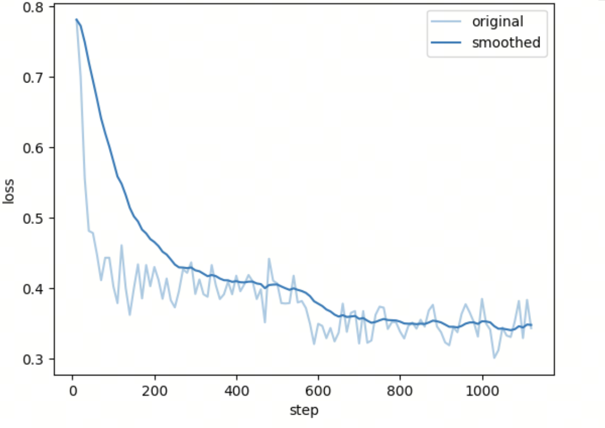
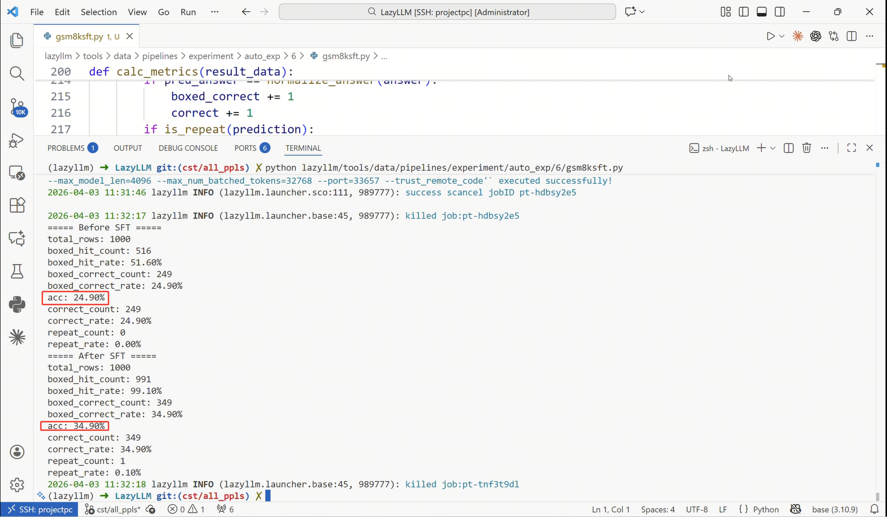
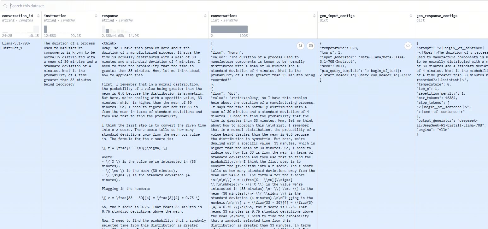
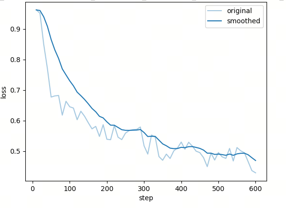
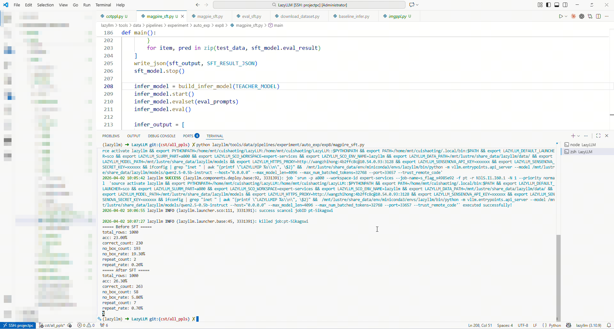
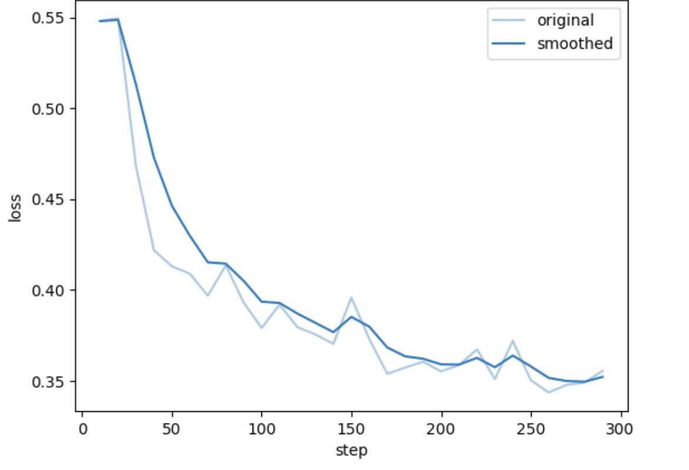
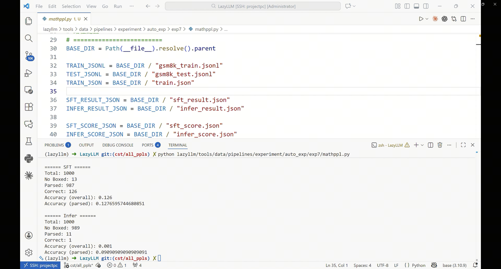
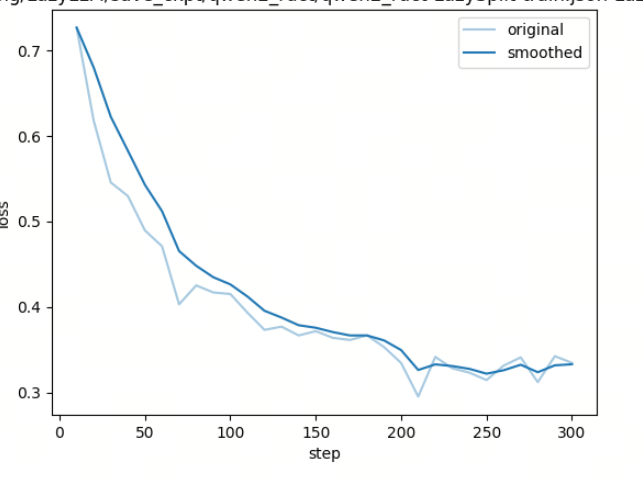
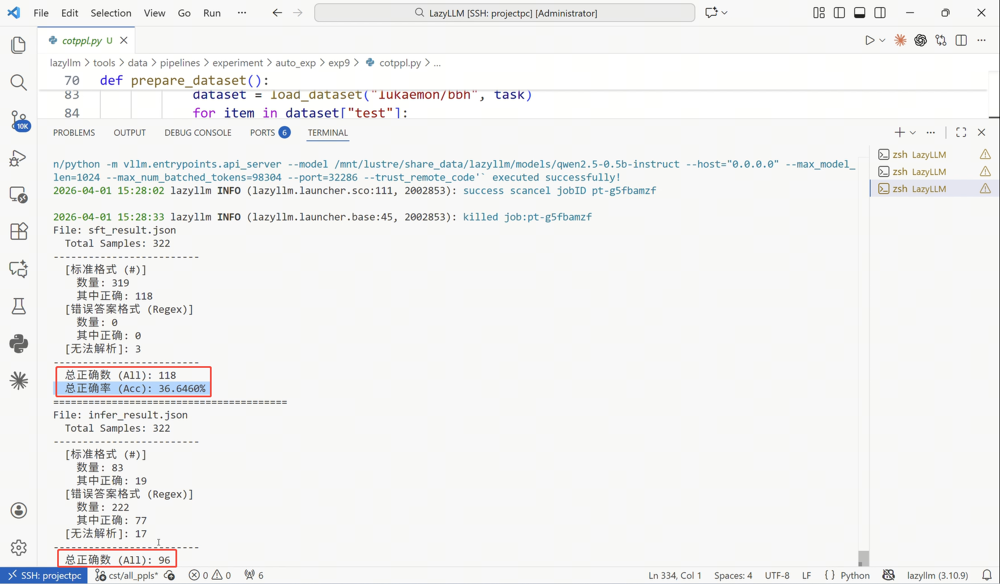

# 第19课时：推理（CoT）与数学能力增强

## 1. 核心概念与目标

### 1.1 什么是推理能力

**推理（Reasoning）** 指模型在给定输入的情况下，通过一系列中间步骤，从已知条件推导出结论的能力。在大模型中，推理并非“显式算法执行”，而是通过大量具有**中间步骤结构**的数据学习到的条件分布近似。

其常见形式包括：

**1. 演绎推理 (Deductive Reasoning)**

- **定义**：遵循“自上而下”的逻辑，从既定的公理、定理或一般性规则出发，必然地推导出具体的结论。
- **应用场景**：数学证明、法律条文适用、逻辑谜题。
- **具体例子**：
    - **前提 A**：所有碳基生物都需要水才能生存
    - **前提 B**：人类是碳基生物
    - **推导过程**：因为人类属于碳基生物范畴，而该范畴内的个体必须满足“需要水”这一规则
    - **结论**：因此，人类需要水才能生存

**2. 归纳推理 (Inductive Reasoning)**

- **定义**：采取“自下而上”的路径，通过观察大量零散的实例或数据，总结出具有普遍意义的规律或趋势。结论具有概率性。
- **应用场景**：模式识别、科学实验发现、预测分析。
- **具体例子**：
    - **观察 1**：过去 10 年，某电商平台在 11 月的销量都出现了暴增
    - **观察 2**：今年 11 月该平台进行了大规模促销活动
    - **推导过程**：基于往年的重复性模式和今年的相似触发条件
    - **结论**：今年 11 月的销量极大概率会再次大幅提升

**3. 类比推理 (Analogical Reasoning)**

- **定义**：通过对比两个不同但结构相似的对象，将已知领域的知识迁移到未知领域。核心在于“举一反三”。
- **应用场景**：代码重构、跨行业案例分析、比喻教学。
- **具体例子**：
    - **已知场景**：在 Python 中，我们使用 `list.append()` 向列表末尾添加元素
    - **目标场景**：学习 JavaScript 的数组操作
    - **类比过程**：JavaScript 的 `Array` 对象在逻辑上等同于 Python 的 `list`
    - **迁移结论**：因此，在 JavaScript 中应该存在类似的方法，即 `array.push()`

**4. 程序化推理 (Programmatic Reasoning)**

- **定义**：模拟计算机的执行逻辑，严格按照定义的步骤、状态机或控制流（循环、分支）来处理信息。
- **应用场景**：代码执行结果预测、复杂工作流编排、算法推演。
- **具体例子**：
    - **初始状态**：`x = 10`
    - **执行指令**：`if x > 5: x = x * 2; else: x = x - 5;`
    - **推导过程**：
        - 判断条件：10 是否大于 5？是
        - 进入分支：执行 `x * 2`
        - 计算结果：10 * 2 = 20
    - **最终状态**：`x = 20`

---

### 1.2 CoT（思维链）的核心价值与形式

**Chain-of-Thought（思维链）** 是指在模型输出中显式给出从问题到答案的中间推理步骤。

* **本质**：将“隐式推理”转化为“可学习的序列结构”。
* **核心价值**：
    * **提高准确率**：显著增强复杂问题的处理能力（尤其是数学、逻辑、多跳问答）。
    * **提供可解释性**：便于调试与审计，使用户理解模型决策逻辑。
    * **支撑验证**：为后续的过程验证（Process Verification）提供具体的对象。

**常见 CoT 形式**：

* **自然语言步骤**：使用“首先…其次…因此…”等连接词叙述逻辑。
* **半结构化步骤**：采用编号列表、要点式（Bullet Points）排列。
* **程序化步骤**：利用伪代码、公式变形序列或逻辑符号进行推导。


<!-- > 图片来源：https://zhuanlan.zhihu.com/p/14949386849 -->

该图通过两组实验对比，展示了如何通过改变“提示词（Prompt）”的写法来优化 AI 的逻辑推理能力：

* **标准提示 (Standard Prompting)：** 模型输入的范例中只有“问题”和“最终答案”。在这种情况下，模型处理新问题时（如苹果计算题）容易跳过逻辑，直接给出一个**错误的数值（27）**。
* **CoT 提示 (CoT Prompting)：** 模型输入的范例中包含了**具体的推理步骤**（如 $2 \times 3=6$, $5+6=11$）。这种“言传身教”引导模型学会了拆解问题，使其在回答新问题时也按步骤运算（$23-20=3$, $3+6=9$），最终得到了**正确的答案（9）**。

所以 CoT 的核心意义在于**让 AI 像人类一样“分步思考”**，从而显著提升处理复杂逻辑和数学问题的准确性。

### 1.3 目标：从“背诵答案”到“学会思考”

本阶段的核心目标是引导模型实现底层逻辑的跃迁：

* **打破记忆依赖**：从单纯依赖概率预测“下一个字”或检索训练集中的“标准答案”，转向逻辑推演。
* **构建思维路径**：通过结构化的推理数据训练，使模型具备拆解复杂任务的习惯，在面对未知任务时能自发建立逻辑链路。
* **提升泛化能力**：使模型不仅仅是“背诵”知识，而是真正“理解”规则，从而在泛化场景下具备更强的鲁棒性。

---

## 2. 推理数据集 (Reasoning Data)

### 2.1 综合推理：BBH (Big-Bench Hard)

BBH 是从 Google 的 BIG-bench 数据集中筛选出的 23 个最具挑战性的任务。这些任务在不使用 CoT 的情况下，模型表现普遍低于人类。

其核心价值表现为：

* ​**任务多样性**​: 包含布尔表达式判断、物体追踪、形式逻辑推导等。
* ​**Few-shot 模板化**​: BBH 常提供固定的 3-shot 或 5-shot 推理模板，是训练模型遵循特定推理格式的最佳参考。

在 BBH 的微调数据中，Schema 通常被设计为 **“Input + CoT (Thought) + Target”** 结构。这种格式的精髓在于它不仅仅提供了正确答案，更提供了一套**解题模板**。

> 📌 **BBH 风格样例：[Tracking Shuffled Objects (追踪洗牌对象)](https://huggingface.co/datasets/lukaemon/bbh/viewer/tracking_shuffled_objects_three_objects)**

```json
{
  "task_name": "tracking_shuffled_objects",
  "input": "桌子上有三个杯子：1号、2号和3号。球在2号杯子里。爱丽丝交换了1号和2号杯子。鲍勃交换了2号和3号杯子。球现在在哪里？",
  "target": "1号",
  "cot_thought": [
    "1. 初始状态：球在2号杯。位置状态为：{1:空, 2:球, 3:空}。",
    "2. 第一步（爱丽丝交换1号和2号）：原本在2号的球转移到了1号。当前状态：{1:球, 2:空, 3:空}。",
    "3. 第二步（鲍勃交换2号和3号）：交换的是2号和3号，而球在1号，位置不受影响。当前状态：{1:球, 2:空, 3:空}。",
    "4. 结论：球最终在1号杯。"
  ]
}
```

* **特点**：
    * **状态追踪（State Tracking）**：要求模型在推理过程中维护一个“内部状态机”，实时更新变量信息。
    * **原子化步骤**：将复杂的逻辑拆解为不可再分的原子步骤，每一步都必须在前一步的基础上进行。
* **微调意义**：
    * **强化系统 2 思维**：训练模型进入缓慢、受控、逻辑严密的思考模式（System 2），而非基于直觉的联想（System 1）。
    * **长程逻辑保持**：通过大量的步骤训练，减少模型在处理复杂指令时的“逻辑断片”现象。

### 2.2 代码推理：HumanEval & MBPP

代码数据集不仅考察模型的“编写”能力，更考察其对逻辑边界、异常处理及执行流程的“推理”能力。

> 📌 **1. [HumanEval 风格样例](https://huggingface.co/datasets/openai/openai_humaneval)**

```json
{
    "task_id": "test/0",
    "prompt": "def return1():\n",
    "canonical_solution": "    return 1",
    "test": "def check(candidate):\n    assert candidate() == 1",
    "entry_point": "return1"
}
```

* **特点**：采用 **"Zero-shot Docstring-to-Code"** 模式。提示词（Prompt）中不含示例，仅提供函数签名和逻辑描述。由于它要求模型续写 `canonical_solution`，这迫使模型必须深度理解 Python 的切片、循环及递归逻辑。
* **微调意义**：侧重于**算法实现能力**。它能显著提升模型对复杂逻辑边界（如回文中心探测、最短路径搜索）的推演精度。

> 📌 **2. MBPP 风格样例**

```json
{
    'source_file': 'Benchmark Questions Verification V2.ipynb',
    'task_id': 2,
    'prompt': 'Write a function to find the shared elements from the given two lists.',
    'code': 'def similar_elements(test_tup1, test_tup2):\n  res = tuple(set(test_tup1) & set(test_tup2))\n  return (res) ',
    'test_imports': [],
    'test_list': [
        'assert set(similar_elements((3, 4, 5, 6),(5, 7, 4, 10))) == set((4, 5))',
        'assert set(similar_elements((1, 2, 3, 4),(5, 4, 3, 7))) == set((3, 4))',
        'assert set(similar_elements((11, 12, 14, 13),(17, 15, 14, 13))) == set((13, 14))'
        ]
}
```

* **特点**：采用 **"Instruction-to-Code"** 模式。更接近人类的自然对话习惯，指令（Text）通常是一个明确的任务描述。其核心特色是附带了 `test_list` 显式测试用例。
* **微调意义**：侧重于**需求对齐能力**。通过大量的 `assert` 语句训练，模型会学习到“防御性编程”意识，即生成的代码必须能够通过多种输入（包括极端值）的校验。

### 2.3 数学推理数据集

数学数据集是衡量模型逻辑严密性的金标准。其核心在于将自然语言描述转化为符号运算，并给出每一步的推导。

**一个CoT数据集的例子**


<!-- > 图片来源：https://zhuanlan.zhihu.com/p/670300266 -->

>上图数据集中，除了问题和选项之外，还提供了推理过程（Rationale）。目的是为了让模型学会如何推理得到正确选项。

**下面是几个经典的数学推理数据集：**

> 📌 **1. [GSM8K — 小学数学应用题 (Grade School Math 8K)](https://huggingface.co/datasets/openai/gsm8k)**

* **任务类别**：小学水平数学应用题，侧重多步推理。
* **特点**：包含约 8,500 道高质量题目。它是**思维链（Chain-of-Thought, CoT）**微调的鼻祖，要求模型在给出最终答案前，先输出完整的中间解题步骤。
* **Schema 示例**：
    ```json
    {
      "question": "杰克有 5 个苹果，他买了一盒苹果，里面有 2 个苹果，他又给了朋友 3 个，还剩几个？",
      "answer": "杰克开始有 5 个苹果。买了一盒后，他有 5 + 2 = 7 个苹果。给了朋友 3 个后，他剩下 7 - 3 = 4 个苹果。#### 4"
    }
    ```
    *注：`####` 后通常跟最终数值结果，方便程序自动评测。*

> 📌 **2. [MATH — 高难度数学竞赛数据集](https://huggingface.co/datasets/EleutherAI/hendrycks_math)**

* **任务类别**：高中及竞赛级数学难题（代数、几何、数论等）。
* **特点**：包含 12,500 个问题。与 GSM8K 相比，其逻辑深度和公式复杂度显著提升，是训练模型**严谨逻辑推导**和 **LaTeX 公式生成**能力的核心数据。
* **Schema 示例**：
    ```json
    {
      "problem": "求方程 $x^2 - 4x + 4 = 0$ 的解。",
      "level": "Level 2",
      "type": "Algebra",
      "solution": "我们可以将方程配方为 $(x-2)^2 = 0$。因此，$x-2 = 0$，解得 $x=2$。答案是 $2$。"
    }
    ```
> 📌 **3. [SVAMP — 算术词题变体数据集](https://huggingface.co/datasets/ChilleD/SVAMP)**

* **任务类别**：针对算术应用题的鲁棒性测试集。
* **特点**：通过对原始问题进行细微的语义改写（例如改变数字顺序、增加无关信息）来挑战模型。它专门用于解决模型通过“背题”或“关键词匹配”而非真正理解逻辑来答题的问题。
* **Schema 示例**：
    ```json
    {
      "Question": "爱德华有 58 个大理石球，他丢了 25 个，又买了 10 个新的。如果他原本还打算送给朋友 5 个（但他还没送），他现在手头有多少个？",
      "Answer": "58 - 25 + 10 = 43. #### 43"
    }
    ```
* **微调意义**：提升模型的**抗干扰能力**，确保模型在面对冗长、含有误导性信息的业务指令时，依然能提取核心数学模型。

> 📌 **4. [DeepMind Mathematics — 算法生成数学题](https://github.com/google-deepmind/mathematics_dataset)**

* **任务类别**：程序化生成的全维度数学题库（函数求导、多项式展开、单位转换等）。
* **特点**：规模庞大（数百万量级），完全由算法生成，覆盖了计算机科学中常见的数值计算逻辑。
* **Schema 示例**：
    ```json
    {
      "Question": "计算 $f(x) = 3x^2 + 2x$ 在 $x=1$ 处的导数。",
      "Answer": "首先求出导函数 $f'(x) = 6x + 2$。将 $x=1$ 代入得 $6(1) + 2 = 8$。答案是 8。"
    }
    ```
* **微调意义**：提供极致的**数据多样性**，通过海量样本让模型形成对数学算子的“直觉”，常用于大模型预训练之后的逻辑补齐阶段。

---

## 3. 高质量推理数据构建策略

### 3.1 数学推理数据构建（LaTeX + 步骤化）

数学数据的核心在于**逻辑的严密性**与​**符号的标准化**​。通过 LaTeX 规范化与过程验证，可以显著降低模型的“推理幻觉”。

#### 3.1.1 格式化要求与 LaTeX 规范

* ​**标准化表达**​：所有数学公式必须使用 LaTeX 渲染（如 $x^2 - 5x + 6 = 0$）。
* ​**Step-by-step 结构**​：解答过程需按步骤拆分，每一步应包含独立的逻辑闭环，并建议以 `\text{Step n: }` 标注。
* ​**变量对齐**​：复杂推导推荐使用 `align` 环境，确保等号对齐，便于模型学习变形规则。

​**数据样例 (JSONL)**​：

```json
{
  "id": "math-0001",
  "domain": "math",
  "difficulty": "medium",
  "latex_problem": "\\text{求方程 } x^2 - 5x + 6 = 0 \\text{ 的根。}",
  "cot": [
    "1. 确定方程系数：a=1, b=-5, c=6。",
    "2. 计算判别式：Δ = (-5)^2 - 4*1*6 = 25 - 24 = 1。",
    "3. 应用求根公式：x = (5 ± √1) / 2 = (5 ± 1) / 2。",
    "4. 得出最终解：x = 2 或 x = 3。"
  ],
  "latex_solution": "\\begin{align}\\Delta &= (-5)^2 - 4\\cdot1\\cdot6 = 1\\\\ x &= \\frac{5\\pm\\sqrt{1}}{2} = 2,3\\end{align}",
  "answer": "x=2, x=3",
  "verification": {
    "type": "numeric_check",
    "result": true,
    "evidence": "代入验证：2^2-5*2+6=0; 3^2-5*3+6=0"
  }
}
```

#### 3.1.2 过程验证（Process Verification）标记

为了确保数据的准确性，需引入自动验证机制：

* ​**符号校验**​：利用 **SymPy** 等数学引擎解析 `latex_solution`，验证步骤间的等价性。
* ​**数值替换检查**​：对变量进行随机采样代入，验证结果是否在容差范围内一致。
* ​**解算器比对**​：引入独立解算器（如 WolframAlpha API）生成的结论与标注数据进行 Cross-check。

---

### 3.2 代码推理数据构建

代码推理不只是让模型“写代码”，更重要的是让其理解​**程序执行的状态演变**​。

#### 3.2.1 核心任务类型

* ​**Bug 修复（Debugging）**​：提供错误代码 -> 定位位置 -> 给出修复方案。
* ​**输出预测（Execution Tracing）**​：提供输入与代码 -> 模拟运行逻辑 -> 预测 stdout。
* ​**执行轨迹（Execution Trace）构建**​：记录变量在每一行代码执行后的内存状态，帮助模型建立“心理模型”。

#### 3.2.2 Bug 修复示例

```json
{
  "id": "code-bug-0001",
  "domain": "code",
  "language": "python",
  "input": "def add_items(a, b):\n    for i in a:\n        a.append(i)\n    return a + b",
  "cot": [
    "该函数目标是拼接列表。但代码在遍历 a 时通过 append 修改 a，会导致无限循环。",
    "修复策略：删除多余循环，利用 Python 列表加法特性直接合并。",
    "最终代码：return a + b"
  ],
  "answer": "将函数体替换为: return a + b",
  "testcases": [{"input": "[1,2], [3]", "expected_output": "[1,2,3]"}],
  "verification": {"type": "unit_test", "result": true}
}
```

#### 3.2.3 自动化验证流程

* ​**Sandboxed Execution**​：在隔离的 Docker 容器中运行测试用例。
* ​**日志分析**​：自动捕捉运行时错误（Traceback），并将其反馈至验证字段。

**执行轨迹（Execution Trace）数据构建**

为了帮助模型建立“程序执行的心理模型”，建议将每条样本扩展为带有详细执行轨迹的结构：

```json
{
  "id": "trace-0001",
  "language": "python",
  "code": "def sum_first_n(n):\n    s = 0\n    for i in range(1, n+1):\n        s += i\n    return s",
  "input": "n=3",
  "execution_trace": [
    {"line": 1, "vars": {}},
    {"line": 2, "vars": {"s": 0}},
    {"line": 3, "vars": {"i": 1, "s": 1}},
    {"line": 3, "vars": {"i": 2, "s": 3}},
    {"line": 3, "vars": {"i": 3, "s": 6}},
    {"line": 4, "vars": {"return": 6}}
  ],
  "cot": ["逐行展示状态变化，便于模型学习状态演化"],
  "answer": "6"
}
```

构造方法建议：在沙箱中以小步执行并记录每行的变量快照、异常与 I/O，从而把真实运行痕迹作为训练信号。

---

### 3.3 通用逻辑与常识推理构造

* ​**多跳推理（Multi-hop Reasoning）**​：通过组合多个事实知识点（如：A 是 B 的导师，B 获得了 C 奖 -> A 的学生获得了 C 奖），构建需要跨越多个逻辑节点的样本。

下面代码中定义了逻辑模板，通过执行创建函数可以生成训练集。这种训练集赋予了大模型组合多知识点的推理能力。

这段代码可以按“先定义模板，再随机填槽，最后生成样本”的顺序来理解。`TEMPLATES` 先把事实、问题、推理步骤和答案的骨架固定下来；`build_multihop_sample()` 每次随机挑选人物和奖项，把它们填入模板；最终返回的就是一条包含 `facts / question / cot / answer` 的完整训练样本。这样做的价值在于，样本表面内容在变化，但底层推理结构始终保持一致，适合批量合成多跳推理数据。

```python
TEMPLATES = [
    {
        "fact1": "{A} 是 {B} 的导师",
        "fact2": "{B} 获得了 {C} 奖",
        "question": "谁的学生获得了 {C} 奖？",
        "cot": [
            "根据事实1，{A} 是 {B} 的导师，说明 {B} 是 {A} 的学生",
            "根据事实2，{B} 获得了 {C} 奖",
            "因此，{A} 的学生获得了 {C} 奖"
        ],
        "answer": "{A} 的学生"
    }
]

import random

def build_multihop_sample():
    A = random.choice(["张三", "李四", "王五"])
    B = random.choice(["小明", "小红", "小刚"])
    C = random.choice(["国家奖", "科研奖", "优秀论文奖"])

    tpl = TEMPLATES[0]

    return {
        "facts": [
            tpl["fact1"].format(A=A, B=B),
            tpl["fact2"].format(B=B, C=C)
        ],
        "question": tpl["question"].format(C=C),
        "cot": [step.format(A=A, B=B, C=C) for step in tpl["cot"]],
        "answer": tpl["answer"].format(A=A)
    }

print(build_multihop_sample())
print(build_multihop_sample())
print(build_multihop_sample())
```

> 输出结果

```json
{'facts': ['李四 是 小红 的导师', '小红 获得了 国家奖 奖'], 'question': '谁的学生获得了 国家奖 奖？', 'cot': ['根据事实1，李四 是 小红 的导师，说明 小红 是 李四 的学生', '根据事实2，小红 获得了 国家奖 奖', '因此，李四 的学生获得了 国家奖 奖'], 'answer': '李四 的学生'}
{'facts': ['王五 是 小红 的导师', '小红 获得了 优秀论文奖 奖'], 'question': '谁的学生获得了 优秀论文奖 奖？', 'cot': ['根据事实1，王五 是 小红 的导师，说明 小红 是 王五 的学生', '根据事实2，小红 获得了 优秀论文奖 奖', '因此，王五 的学生获得了 优秀论文奖 奖'], 'answer': '王五 的学生'}
{'facts': ['王五 是 小刚 的导师', '小刚 获得了 国家奖 奖'], 'question': '谁的学生获得了 国家奖 奖？', 'cot': ['根据事实1，王五 是 小刚 的导师，说明 小刚 是 王五 的学生', '根据事实2，小刚 获得了 国家奖 奖', '因此，王五 的学生获得了 国家奖 奖'], 'answer': '王五 的学生'}

```

* ​**反向推理**​：从已知结果推导其最可能成立的前提条件，用于增强模型的溯因推理能力（即从“果”反推“因”的能力）。
> 在下述数据构造中，首先显式定义一个已知结果（Result），随后给出若干候选前提条件（Options），其中仅有一项在逻辑与常识层面上最合理地解释该结果。模型需要结合常识与因果关系，完成从结果到前提的反向推理。

```json
{
  "id": "br-0001",
  "result": "小明通过了考试",
  "question": "以下哪项最可能是前提条件？",
  "options": [
    "小明认真复习了课程内容",
    "小明当天生病缺考",
    "小明没有学习相关知识"
  ],
  "cot": [
    "通过考试通常需要具备足够的知识准备",
    "认真复习课程内容可以提高考试成绩",
    "其他选项与结果矛盾或不合理"
  ],
  "answer": "小明认真复习了课程内容"
}
```

---

## 4. 能力提升的关键技术：数据演化与合成

本节重点回答“如何提升推理能力与鲁棒性”的实践方法，包含复杂性演化（Evol-Instruct）、拒绝采样微调（RFT）与合成数据生成器实战。

### 4.1 复杂性演化（Evol-Instruct）

通过自动化 Prompt 生成与变异，逐步提高问题难度与约束，达到模型“自我踩点”提升能力的目的。常见策略：

- 增加约束条件（限制步骤数、禁止使用特定方法）。
- 增加变量或实体数量（从单步到多步、多实体交互）。
- 引入干扰信息（无关事实），训练模型辨别并聚焦核心证据。

> 代码实例

下面这个 Evol-Instruct 示例的流程其实很清楚：先写一个“问题改写模板”，再逐步往 `constraints` 里追加约束，最后把约束列表和原始问题一起喂给模型，让模型输出一个更复杂但语义核心不变的新问题。也就是说，这里不是直接人工改题，而是把“如何改题”也写成 prompt，让模型自动完成难度演化。

```python
from lazyllm import OnlineChatModule

base_template = """
你是一个问题进化（evol-instruct）Agent，需要在保持原问题核心语义不变的前提下，对问题进行复杂化改写。

改写规则：
{constraints}

原始问题：
{question}

请输出改写后的问题，不要解释。
"""

constraints = []

def add_constraint(c):
    constraints.append(c)

add_constraint("保持原问题核心语义不变")
add_constraint("增加问题的语义复杂度")
add_constraint("引入背景或隐含前提")
add_constraint("增加逻辑关系或推理要求")
add_constraint("使问题无法用一句话回答")

model = OnlineChatModule()

query = base_template.format(
    constraints="\n".join([f"- {c}" for c in constraints]),
    question="何为道？"
)

print(model(query))

```

> 重写后的query:
```
在探讨宇宙和人类存在的哲学框架内，“道”这一概念如何被理解？考虑到它在不同文化和哲学体系中的多样性和深度，我们如何解析“道”的含义，以及它如何影响我们对自然法则、道德伦理和人生目标的认识？进一步地，我们能否通过比较东西方哲学中对“道”的不同诠释，揭示出其对于指导个体行为和社会秩序的普遍价值和意义？
```

用一句话总结Evol-Instruct就是用户可以自行添加不同的限制，来让重写后的query满足需求。

### 4.2 拒绝采样微调（RFT）

RFT（Rejection-sampling Fine-Tuning）流程简述：

1. 针对同一题目，使用基线模型生成多条 CoT 路径（N 条）。
2. 使用自动化验证器（单测、符号求解、沙箱执行）对每条路径打分和筛选。
3. 保留通过验证或评分最高的路径作为训练样本；丢弃错误或不一致路径（即“拒绝采样”）。
4. 基于筛选后的高质量 CoT 进行 SFT（监督微调），或在 RL 阶段使用被接受样本作为高质量回报信号。

> 下面代码中，我们使用小的语言模型作为极限模型，让其给每个答案生成五个CoT，然后使用一个大的模型进行打分（模拟一个自动化验证器）。最终保留得分最高的CoT以用作之后微调的训练集。

如果把这段 RFT 代码拆开看，整体流程分成三步。第一步，`model_infer` 针对同一道题一次性生成多条 CoT，并尝试把模型返回结果解析成 JSON。第二步，`model_eval` 把这些 CoT 再交给更强的评审模型逐条打分。第三步，`rft` 主循环把两者串起来，对每个问题只保留分数最高的那条推理，最终汇总成训练集。换句话说，这段代码的重点不在“生成得多”，而在“生成后还要筛”，这正是 rejection sampling 的核心。

```python
import lazyllm
import json
import re
questions = [
    "2 + 3 * 4 等于多少？",
    "如果 A 是 B 的导师，B 获得了奖项，那么谁的学生获得了奖项？"
]

def model_infer(model, question, k=5):
    prompt = f"""
    请一步一步思考并给出答案。
    问题：{question}
    给出{k}个CoTs

    要求：
    - 给出清晰的推理步骤（CoT）
    - 最后给出明确答案

    # 输出格式示例
[
  {{
    "result": "cot1 ### answer"
  }},
  {{
    "result": "cot2 ### answer"
  }}
]
    """

    res = model(
    prompt,
    static_params={
        "temperature": 0.8,
        "top_p": 0.9,
        "max_tokens": 1500,
    }
)

    # 提取 JSON
    match = re.search(r'```json\s*([\s\S]*?)\s*```', res)
    json_str = match.group(1) if match else res

    try:
        data = json.loads(json_str)
    except json.JSONDecodeError:
        print("解析失败")
        return []

    cots = [item["result"] for item in data if "result" in item]

    return cots[:k]

def model_eval(model, q, CoTs):
    scores = []
    # 让模型 给cot 打分， 
    prompt = f"""
    根据问题{q}
    给下面CoTs 打分
    问题：{CoTs}
    根据cot质量评分从1-5

    # 输出格式示例
[
  {{
    "score": "score1"
  }},
  {{
    "score": "score2"
  }}
]
    """
    res = model(
    prompt,
    static_params={
        "temperature": 0.0,
        "max_tokens": 512,
    }
    )

    match = re.search(r'```json\s*([\s\S]*?)\s*```', res)
    json_str = match.group(1) if match else res

    try:
        scores_data = json.loads(json_str)
    except json.JSONDecodeError:
        print("⚠️ eval JSON 解析失败")
        return []

    scores = [int(item["score"]) for item in scores_data if "score" in item]
    return scores

def rft(baseline, questions, eval_model):
    train_set = []

    for q in questions:
        cots = model_infer(baseline, q)
        print(f"问题：{q}输出的CoTs为：\n{cots}")
        if not cots:
            continue

        scores = model_eval(eval_model, q, cots)
        if len(scores) != len(cots):
            continue

        best_idx = max(range(len(scores)), key=lambda i: scores[i])

        train_set.append({
            "question": q,
            "cot": cots[best_idx],
            "score": scores[best_idx]
        })

    return train_set

baseline_model = lazyllm.OnlineChatModule(source = "sensenova",
    model="SenseChat-Vision")
evalate_model = lazyllm.OnlineChatModule(
    source = "sensenova",
    model="SenseNova-V6-5-Pro"
)

train_set = rft(baseline_model, questions, evalate_model)

for item in train_set:
    print("======")
    print("Q:", item["question"])
    print("Score:", item["score"])
    print("CoT:", item["cot"])

```

```python

问题：2 + 3 * 4 等于多少？输出的CoTs为：
['首先，根据运算顺序规则（先乘除后加减），我们先计算3 * 4，结果是12。然后将这个结果加上2，得到14。 ### 14', '按照数学中的运算优先级，乘法在加法之前进行。所以先计算3 * 4等于12，再将2与12相加，结果是14。 ### 14', '遵循BODMAS法则（括号、指数、乘除、加减），我们先做乘法3 * 4，得到12。接着进行加法2 + 12，最终结果是14。 ### 14', '根据PEMDAS规则（括号、指数、乘除、加减），先进行乘法运算3 * 4，结果是12。然后进行加法运算2 + 12，得到14。 ### 14', '为了求解2 + 3 * 4，首先要执行乘法部分，即3 * 4等于12。然后将这个结果与2相加，得到14。 ### 14']
问题：如果 A 是 B 的导师，B 获得了奖项，那么谁的学生获得了奖项？输出的CoTs为：
['1. A 是 B 的导师，这意味着 B 是 A 的学生。\n2. 题目中提到 B 获得了奖项。\n3. 因此，A 的学生（即 B）获得了奖项。 ### A 的学生', '1. 根据题目，A 是 B 的导师。\n2. 这意味着 B 是 A 的学生。\n3. 题目进一步说明 B 获得了奖项。\n4. 所以，获得奖项的是 A 的学生。 ### A 的学生', '1. A 指导 B，所以 B 是 A 的学生。\n2. B 获得了奖项。\n3. 因此，获得奖项的人是 A 的学生。 ### A 的学生', '1. 如果 A 是 B 的导师，那么 B 必然是 A 的学生。\n2. 题目中明确指出 B 获得了奖项。\n3. 因此，获得奖项的是 A 的学生。 ### A 的学生', '1. A 是 B 的导师，这表明 B 是 A 的学生。\n2. B 获得了奖项。\n3. 因此，A 的学生获得了奖项。 ### A 的学生']
======
Q: 2 + 3 * 4 等于多少？
Score: 5
CoT: 首先，根据运算顺序规则（先乘除后加减），我们先计算3 * 4，结果是12。然后将这个结果加上2，得到14。 ### 14
======
Q: 如果 A 是 B 的导师，B 获得了奖项，那么谁的学生获得了奖项？
Score: 5
CoT: 1. A 是 B 的导师，这意味着 B 是 A 的学生。
2. 题目中提到 B 获得了奖项。
3. 因此，A 的学生（即 B）获得了奖项。 ### A 的学生

```

> 用一句话来说就是：使用基模型自己生成的高质量CoT微调自己！

### 4.3 合成数据生成流程（Python 代码示例）

以下是一个用于快速批量生成 **数学推理条目** 的生成器骨架，可直接运行：

这段生成器的执行流程也比较适合顺着读一遍。每次循环先随机生成一个一元二次方程的系数，再据此构造题目文本；随后计算判别式 `delta`，并根据 `delta >= 0` 或 `< 0` 决定是生成两个实根还是“无实数根”；最后把题目、分步 CoT、最终答案和验证信息一起写进样本字典。`__main__` 部分则负责把多条样本逐行写成 JSONL 文件，方便直接作为后续训练或清洗流水线的输入。

```python
import json
import uuid
from random import randint

def gen_simple_quadratic(n=50):
    dataset = []
    for _ in range(n):
        a, b, c = 1, randint(-10, 10), randint(-10, 10)
        problem = f"求方程 $x^2 + ({b})x + ({c}) = 0$ 的根。"

        # 构造 CoT 逻辑
        delta = b*b - 4*a*c
        cot = [
            f"1. 写出判别式：Δ = ({b})^2 - 4*{a}*{c} = {delta}。",
            "2. 根据 Δ 的符号判断根的情况。"
        ]

        if delta >= 0:
            r1 = round((-b + delta**0.5) / (2*a), 2)
            r2 = round((-b - delta**0.5) / (2*a), 2)
            answer = f"x1={r1}, x2={r2}"
            cot.append(f"3. 代入公式求得根为 {r1} 和 {r2}。")
        else:
            answer = "无实数根"
            cot.append("3. 由于 Δ < 0，该方程在实数范围内无解。")

        dataset.append({
            "id": str(uuid.uuid4()),
            "domain": "math",
            "input": problem,
            "cot": cot,
            "answer": answer,
            "verification": {"type": "numeric_check", "evidence": "auto-computed"}
        })
    return dataset

if __name__ == '__main__':
    data = gen_simple_quadratic(10)
    with open('synthetic_math_data.jsonl', 'w', encoding='utf8') as f:
        for item in data:
            f.write(json.dumps(item, ensure_ascii=False) + "\n")

```

**合成数据输出：**

```json
{"id": "07d107e9-02bd-469a-977c-9e72aeeaadf6", "domain": "math", "input": "求方程 $x^2 + (-7)x + (9) = 0$ 的根。", "cot": ["1. 写出判别式：Δ = (-7)^2 - 4*1*9 = 13。", "2. 根据 Δ 的符号判断根的情况。", "3. 代入公式求得根为 5.3 和 1.7。"], "answer": "x1=5.3, x2=1.7", "verification": {"type": "numeric_check", "evidence": "auto-computed"}}
{"id": "75c50fcb-20c1-4ec1-8496-0dfceb51161a", "domain": "math", "input": "求方程 $x^2 + (-5)x + (3) = 0$ 的根。", "cot": ["1. 写出判别式：Δ = (-5)^2 - 4*1*3 = 13。", "2. 根据 Δ 的符号判断根的情况。", "3. 代入公式求得根为 4.3 和 0.7。"], "answer": "x1=4.3, x2=0.7", "verification": {"type": "numeric_check", "evidence": "auto-computed"}}
{"id": "49807e7b-461b-4ff9-afa2-510e90a7b886", "domain": "math", "input": "求方程 $x^2 + (-10)x + (0) = 0$ 的根。", "cot": ["1. 写出判别式：Δ = (-10)^2 - 4*1*0 = 100。", "2. 根据 Δ 的符号判断根的情况。", "3. 代入公式求得根为 10.0 和 0.0。"], "answer": "x1=10.0, x2=0.0", "verification": {"type": "numeric_check", "evidence": "auto-computed"}}
{"id": "314839f2-c57d-46f7-af89-0e70ec2334df", "domain": "math", "input": "求方程 $x^2 + (3)x + (8) = 0$ 的根。", "cot": ["1. 写出判别式：Δ = (3)^2 - 4*1*8 = -23。", "2. 根据 Δ 的符号判断根的情况。", "3. 由于 Δ < 0，该方程在实数范围内无解。"], "answer": "无实数根", "verification": {"type": "numeric_check", "evidence": "auto-computed"}}
{"id": "1c4d3384-b771-4fa5-8607-ff08e957c09f", "domain": "math", "input": "求方程 $x^2 + (-10)x + (8) = 0$ 的根。", "cot": ["1. 写出判别式：Δ = (-10)^2 - 4*1*8 = 68。", "2. 根据 Δ 的符号判断根的情况。", "3. 代入公式求得根为 9.12 和 0.88。"], "answer": "x1=9.12, x2=0.88", "verification": {"type": "numeric_check", "evidence": "auto-computed"}}
{"id": "83717cd7-b814-4425-a56f-f1335b2b4718", "domain": "math", "input": "求方程 $x^2 + (-10)x + (3) = 0$ 的根。", "cot": ["1. 写出判别式：Δ = (-10)^2 - 4*1*3 = 88。", "2. 根据 Δ 的符号判断根的情况。", "3. 代入公式求得根为 9.69 和 0.31。"], "answer": "x1=9.69, x2=0.31", "verification": {"type": "numeric_check", "evidence": "auto-computed"}}
{"id": "68fd2a18-40ff-4700-9e92-6b066b2937dc", "domain": "math", "input": "求方程 $x^2 + (-8)x + (7) = 0$ 的根。", "cot": ["1. 写出判别式：Δ = (-8)^2 - 4*1*7 = 36。", "2. 根据 Δ 的符号判断根的情况。", "3. 代入公式求得根为 7.0 和 1.0。"], "answer": "x1=7.0, x2=1.0", "verification": {"type": "numeric_check", "evidence": "auto-computed"}}
{"id": "7cf51e86-54fc-4462-ae60-709d260afd86", "domain": "math", "input": "求方程 $x^2 + (-3)x + (0) = 0$ 的根。", "cot": ["1. 写出判别式：Δ = (-3)^2 - 4*1*0 = 9。", "2. 根据 Δ 的符号判断根的情况。", "3. 代入公式求得根为 3.0 和 0.0。"], "answer": "x1=3.0, x2=0.0", "verification": {"type": "numeric_check", "evidence": "auto-computed"}}
{"id": "1ca2b82c-3c6e-4344-b4e7-1c7cd39c6176", "domain": "math", "input": "求方程 $x^2 + (-7)x + (-5) = 0$ 的根。", "cot": ["1. 写出判别式：Δ = (-7)^2 - 4*1*-5 = 69。", "2. 根据 Δ 的符号判断根的情况。", "3. 代入公式求得根为 7.65 和 -0.65。"], "answer": "x1=7.65, x2=-0.65", "verification": {"type": "numeric_check", "evidence": "auto-computed"}}
{"id": "e1334b5d-3fb2-414d-b2d1-6a9358734637", "domain": "math", "input": "求方程 $x^2 + (6)x + (-4) = 0$ 的根。", "cot": ["1. 写出判别式：Δ = (6)^2 - 4*1*-4 = 52。", "2. 根据 Δ 的符号判断根的情况。", "3. 代入公式求得根为 0.61 和 -6.61。"], "answer": "x1=0.61, x2=-6.61", "verification": {"type": "numeric_check", "evidence": "auto-computed"}}

```
## 5. 验证驱动的数据过滤

### 5.1 基础过滤规则

为保证数据集的整体质量与可用性，在原始代码语料进入后续处理流程之前，首先需要进行一轮**基础过滤**。该阶段的目标是快速剔除噪声样本、异常样本以及明显不适合用于建模的数据，从而降低后续清洗与建模的成本。

* **文件筛选**  
  仅保留主流、通用性强且在真实工程场景中被广泛使用的编程语言文件，例如 **Python、Java、C++、Rust、Go** 等。  
  这一规则的动机在于：
    - 主流语言拥有更成熟的编码规范和更稳定的语法结构；
    - 相关学习资源与真实项目丰富，有助于模型学习通用且可迁移的编程知识；
    - 可避免因冷门语言样本稀缺而引入分布不均或噪声过大的问题。

* **长度过滤**  
  对代码文件的整体长度进行约束，主要包括两个方面：
    - **最小长度限制**：剔除少于 **100 字符**的文件。这类文件通常仅包含零散代码片段、占位符或测试语句，缺乏完整逻辑结构，对模型学习帮助有限。
    - **单行长度限制**：剔除存在**单行超过 1000 字符**的文件。这类代码往往是经过混淆或压缩处理的自动生成代码，可读性极差，不符合自然代码分布。

* **内容特征过滤**  
  在长度和语言筛选的基础上，进一步从代码内部特征出发进行质量控制：

  * **代码注释比**  
    计算注释字符数在文件总字符数中的占比，并设定合理区间：
    - **注释占比 < 5%**：通常意味着代码几乎没有任何说明，变量命名随意，可读性和可维护性较差；
    - **注释占比 > 90%**：往往说明文件并非真正的可执行代码，而是文档、模板或被大段注释包裹的无效内容。  
    因此，仅保留注释比例处于合理区间的文件，有助于平衡代码可读性与实际逻辑密度。

  * **关键词过滤**  
    对代码内容进行关键词匹配，直接移除包含明显自动生成或压缩标记的文件，例如：
    - `AUTO-GENERATED`
    - `MINIFIED`
    - 以及其他常见的生成器声明或压缩工具标识  
    这些文件通常由工具批量生成，结构高度重复，缺乏人类编程风格，不利于模型学习真实的编码习惯与逻辑表达。

通过以上基础过滤规则，可以在不引入复杂语义分析的前提下，大幅降低数据噪声比例，为后续更精细的质量评估与语义级清洗奠定可靠基础。

### 5.2 高级去重

在完成基础过滤之后，仍然可能存在大量内容高度重复或近似重复的代码文件。如果不加控制，这类样本会在训练过程中被模型反复“看到”，从而导致模型对特定代码模式的**过拟合**，削弱其泛化能力。因此，有必要在全数据范围内执行**高级去重策略**，以确保语料的多样性与信息密度。

* **精确去重**  
  对每一个代码文件计算其唯一的哈希指纹，并基于该指纹进行全局比对。具体而言，使用 **SHA-256** 等安全哈希算法，将文件的完整内容映射为固定长度的哈希值。  
    - 若两个文件的哈希值完全一致，则可以确定其内容完全相同；
    - 在这种情况下，仅保留其中一份，其余副本全部剔除。  
    精确去重能够高效、可靠地消除完全重复的数据，是全局去重流程中的第一道防线。

* **模糊去重**  
  仅依赖精确匹配无法发现“高度相似但并非完全相同”的代码，例如：
    - 同一文件的不同版本；
    - 仅修改了变量名、注释或格式的代码；
    - 来源不同但结构一致的模板化代码。  

为此，引入基于代码片段相似度的模糊去重方法。其核心思路是：

* 将代码拆分为若干特征片段；
* 通过近似集合相似度的方法估计不同文件之间的重合程度；
* 以 **Jaccard 相似度** 作为衡量标准，当相似度高于 **0.8** 时，认为两个文件在信息层面高度冗余，仅保留其中之一。  

**Jaccard 相似度（Jaccard Similarity）** 定义为两个集合交集与并集之比：

$$
\mathrm{Jaccard}(A, B)
= \frac{|A \cap B|}{|A \cup B|}
$$

其中，各变量含义如下：

- $A$：由代码文件 1 拆分得到的特征片段集合（如 token n-grams、AST 子树、代码行片段等）  
- $B$：由代码文件 2 拆分得到的特征片段集合  
- $|A \cap B|$：两个代码文件**共有**的特征片段数量，表示信息重合程度  
- $|A \cup B|$：两个代码文件特征片段的**并集**大小，表示总体信息规模  

当满足：

$$
\mathrm{Jaccard}(A, B) \ge 0.8
$$

时，认为两个代码文件在信息层面高度相似，判定为冗余样本，仅保留其中之一。

该策略能够在计算效率与去重效果之间取得良好平衡，尤其适合大规模代码语料，能有效清理不同版本的同一文件以及大量重复的工程模板代码。

通过精确去重与模糊去重的组合使用，可以在保证语料规模的同时显著提升数据多样性，从而为模型学习更加稳健、通用的编程知识提供可靠保障。

>下面展示一段去重代码示例

这段代码本质上是一个“两阶段去重器”。第一阶段 `exact_dedup` 用 SHA-256 做完全相同内容的精确去重，速度快、误判少；第二阶段 `fuzzy_dedup` 只在第一阶段保留下来的样本上继续做 MinHash + LSH 模糊去重，用近似相似度来找“不是完全一样、但高度相似”的代码。最后一大段 `print` 逻辑只是把整个去重过程可视化，方便我们看到每条代码到底是因为“完全重复”还是“近似重复”被移除。

```python
"""
高级去重示例代码（精确去重 + 模糊去重）

说明：
- 已给定一个 list，其中每个元素是一段代码字符串
- 先使用 SHA-256 做精确去重
- 再使用 MinHash + LSH 近似计算 Jaccard 相似度
- 当 Jaccard 相似度 > 0.8 时，认为是高度重复代码并剔除

该方法常用于大规模代码语料清洗，可有效移除不同版本的同一文件
以及大量重复的模板化代码。
"""

import hashlib
from datasketch import MinHash, MinHashLSH
from itertools import combinations

# -----------------------------
# 1. 输入数据
# -----------------------------
code_list = [
    "def add(a, b):\n    return a + b",        
    "def multiply(a, b):\n    return a * b",   
    "def add(a, b):\n    return a + b",        
    "def add(a, b, c):\n    return a + b",      
]

# -----------------------------
# 2. 精确去重 (SHA-256)
# -----------------------------
def exact_dedup(codes):
    seen_hashes = {}
    kept_indices = []
    removed_exact = []

    for idx, code in enumerate(codes):
        h = hashlib.sha256(code.encode("utf-8")).hexdigest()
        if h not in seen_hashes:
            seen_hashes[h] = idx
            kept_indices.append(idx)
        else:
            removed_exact.append((idx, seen_hashes[h])) # (被删索引, 保留索引)
    return kept_indices, removed_exact

exact_kept_indices, exact_removed_log = exact_dedup(code_list)

# -----------------------------
# 11. 模糊去重 (MinHash + LSH)
# -----------------------------
def get_minhash(code, num_perm=128):
    m = MinHash(num_perm=num_perm)
    for token in code.split():
        m.update(token.encode("utf-8"))
    return m

def fuzzy_dedup(codes, indices, threshold=0.6):
    lsh = MinHashLSH(threshold=threshold, num_perm=128)
    final_kept_indices = []
    fuzzy_removed_log = []

    # 存储用于对比的 minhash 对象
    minhash_store = {}

    for idx in indices:
        m = get_minhash(codes[idx])
        # 查询是否有相似样本已存在于 LSH 桶中
        result = lsh.query(m)

        if result:
            match_idx = int(result[0])
            jac = m.jaccard(minhash_store[match_idx])
            fuzzy_removed_log.append((idx, match_idx, jac))
        else:
            lsh.insert(str(idx), m)
            minhash_store[idx] = m
            final_kept_indices.append(idx)

    return final_kept_indices, fuzzy_removed_log

final_indices, fuzzy_removed_log = fuzzy_dedup(code_list, exact_kept_indices)

# -----------------------------
# 4. 结果清晰打印
# -----------------------------
print("="*60)
print("去重过程报告")
print("="*60)

print(f"\n[1/2] 精确去重阶段 (SHA-256):")
for r_idx, k_idx in exact_removed_log:
    print(f"  - 移除原始索引 {r_idx}: 内容与索引 {k_idx} 完全一致")

print(f"\n[2/2] 模糊去重阶段 (LSH - Threshold 0.6):")
for r_idx, k_idx, jac in fuzzy_removed_log:
    print(f"  - 移除原始索引 {r_idx}: 相似度 {jac:.3f}，已保留相似样本 {k_idx}")

print("\n" + "="*60)
print(f"{'最终保留结果清单':^55}")
print("-" * 60)
print(f"{'原始索引':<10} | {'内容摘要 (前20位)':<25} | {'去重状态'}")
print("-" * 60)

for i in range(len(code_list)):
    content = code_list[i].replace('\n', ' ')[:20] + "..."
    if i in final_indices:
        status = "✅ [保留]"
    elif any(r[0] == i for r in exact_removed_log):
        status = "❌ [精确重复删除]"
    else:
        status = "❌ [模糊重复删除]"

    print(f"{i:<12} | {content:<25} | {status}")

print("-" * 60)
print(f"统计：原始总数 {len(code_list)} -> 最终保留 {len(final_indices)}")
print("="*60)

```

```text
============================================================
去重过程报告
============================================================

[1/2] 精确去重阶段 (SHA-256):
  - 移除原始索引 2: 内容与索引 0 完全一致

[2/2] 模糊去重阶段 (LSH - Threshold 0.6):
  - 移除原始索引 3: 相似度 0.680，已保留相似样本 0

============================================================
                       最终保留结果清单                        
------------------------------------------------------------
原始索引       | 内容摘要 (前20位)               | 去重状态
------------------------------------------------------------
0            | def add(a, b):     r...   | ✅ [保留]
1            | def multiply(a, b): ...   | ✅ [保留]
2            | def add(a, b):     r...   | ❌ [精确重复删除]
3            | def add(a, b, c):   ...   | ❌ [模糊重复删除]
------------------------------------------------------------
统计：原始总数 4 -> 最终保留 2
============================================================
```

### 5.3 核心流程：闭环验证系统

验证驱动过滤并非依赖规则或静态特征进行一次性判断，而是构建了一个完整的**闭环验证系统**。该系统以“生成—运行—反馈”为核心思想，通过真实执行代码来检验其有效性与可用性，从而在源头上保障数据质量。这种方式能够显著减少仅在语法层面正确、但在语义或运行层面存在问题的低质量样本。

整个流程可划分为以下几个关键阶段：

1. **代码提取或生成**  
   系统首先从原始代码库中提取可独立运行的函数、脚本或模块，确保其具备明确的输入与输出形式。同时，也可以利用大语言模型自动生成解题代码或功能实现代码，用于扩充训练样本的覆盖范围。  
   这一阶段的重点在于保证代码具备可执行性与明确任务目标，而非仅作为静态文本存在。

2. **环境配置**  
   在代码执行之前，系统会自动分析其依赖关系，并为其匹配所需的运行环境与第三方库。例如，数值计算相关代码需要配置 `numpy`，数据处理代码可能依赖 `pandas`，约束求解或形式化验证任务则需要 `z3-solver` 等工具。  
   通过自动化环境配置，可以最大程度减少因依赖缺失导致的误判，并提升验证流程的成功率与稳定性。

3. **解释器执行**  
   代码将在隔离的沙箱环境中运行，以避免对宿主系统产生任何安全风险。沙箱通常限制文件系统访问、网络请求以及运行时间和内存占用，从而保证执行过程安全、可控。  
   该阶段的核心目标是观察代码在真实运行条件下的行为，而不仅仅是其表面结构是否合理。

4. **结果判定与反馈**  
   根据代码的运行结果，系统会对样本进行明确分类：  
   * **通过**：代码能够成功运行并得到合理输出，说明其逻辑完整、依赖正确，可直接进入高质量训练集，用于模型学习。  
   * **失败**：代码在执行过程中抛出异常或运行错误，系统将完整记录错误日志与调用栈信息。这些失败样本不会直接丢弃，而是被保留下来，用于构建后续的错误修复数据集，从而支持模型学习如何定位问题并进行代码修正。

通过上述闭环流程，验证驱动过滤不仅能够筛选出高质量、可执行的代码样本，还能将失败案例转化为具有训练价值的资源，实现数据利用效率的最大化。这种动态验证机制在规模化代码数据构建中尤为关键，是提升模型实际编程能力的重要基础。

---

### 5.4 代码验证：沙箱环境与单元测试生成

在基于执行结果进行数据验证的过程中，安全性始终是首要前提。任何来源不明或未经审查的代码，都可能包含恶意逻辑或资源滥用行为，若直接在本地环境中执行，将对系统稳定性和数据安全造成严重风险。


<!-- > 图片来源：https://www.secrss.com/articles/77720 -->

> 下面是一个结合了沙箱环境的闭环验证系统，负责验证代码数据集是否合理。

这段沙箱代码可以按“限制环境 -> 执行代码 -> 跑测试 -> 分类返回结果”的顺序理解。首先它通过 `safe_builtins` 和独立的 `global_env/local_env` 把可用能力缩到最小；然后用 `signal.alarm` 给执行过程加时间上限，防止死循环或资源滥用；接着调用 `exec` 运行待测代码，并在可选的 `test_fn` 中执行断言验证；最后根据执行结果，把样本统一归类为 `pass`、`timeout` 或具体异常类型并返回。这种写法的价值在于，后续数据过滤阶段不需要人工读代码，只要根据返回结构就能自动判断样本是否可用。

```python
import traceback
import signal
import types

class SandboxTimeout(Exception):
    pass

def timeout_handler(signum, frame):
    raise SandboxTimeout("Execution timed out")

def sandbox_run_code(code: str, test_fn=None, time_limit=2):
    """
    在受控沙箱中执行代码，并进行验证

    参数：
    - code: str，待执行的 Python 代码
    - test_fn: callable，可选，用于验证逻辑正确性的测试函数
    - time_limit: int，最大执行时间（秒）

    返回：
    - dict，包含执行状态与结果信息
    """

    # 限制可用内建函数（最小权限）
    safe_builtins = {
        "range": range,
        "len": len,
        "sum": sum,
        "min": min,
        "max": max,
        "abs": abs,
    }

    global_env = {
        "__builtins__": safe_builtins
    }
    local_env = {}

    # 设置超时信号
    signal.signal(signal.SIGALRM, timeout_handler)
    signal.alarm(time_limit)

    try:
        # 执行用户代码
        exec(code, global_env, local_env)

        # 可选：执行验证函数
        if test_fn is not None:
            test_fn(local_env)

        signal.alarm(0)  # 取消超时

        return {
            "status": "pass",
            "message": "Code executed successfully",
            "env_keys": list(local_env.keys())
        }

    except SandboxTimeout as e:
        return {
            "status": "fail",
            "error_type": "timeout",
            "error": str(e)
        }

    except Exception as e:
        return {
            "status": "fail",
            "error_type": type(e).__name__,
            "error": str(e),
            "traceback": traceback.format_exc()
        }

    finally:
        signal.alarm(0)

# =========================
# 示例：沙箱验证一段函数代码
# =========================

code_syntax_error = """
def bad_func(a, b)
    return a + b
"""

print("Case 1: Syntax Error")
print(sandbox_run_code(code_syntax_error))

code_runtime_error = """
def divide(a, b):
    return a / b
"""

def test_divide(env):
    env["divide"](10, 0)

print("\nCase 2: Runtime Error (ZeroDivisionError)")
print(sandbox_run_code(code_runtime_error, test_fn=test_divide))

code_success = """
def sum_first_n(n):
    s = 0
    for i in range(1, n + 1):
        s += i
    return s
"""

def test_sum_first_n(env):
    assert "sum_first_n" in env
    assert env == 1
    assert env == 6
    assert env == 55

print("\nCase 3: Success Case")
print(sandbox_run_code(code_success, test_fn=test_sum_first_n))

```

**输出结果：**

从这组输出可以反向看出沙箱验证的三类典型失败路径：第一类是语法错误，代码还没开始执行就被解释器拒绝；第二类是运行时错误，函数定义成功，但在测试输入下触发异常；第三类原本想展示成功用例，不过这里的 `assert env == 1` 等写法实际上把环境字典和数值直接比较了，所以仍然会失败。这也恰好说明，闭环验证不仅能抓代码错误，也能抓测试脚本本身的错误。

```python

Case 1: Syntax Error
{'status': 'fail', 'error_type': 'SyntaxError', 'error': "expected ':' (<string>, line 2)", 'traceback': 'Traceback (most recent call last):\n  File "/from-data-to-llm/docs/chapter15/code/sandbox_testing.py", line 47, in sandbox_run_code\n    exec(code, global_env, local_env)\n  File "<string>", line 2\n    def bad_func(a, b)\n                      ^\nSyntaxError: expected \':\'\n'}

Case 2: Runtime Error (ZeroDivisionError)
{'status': 'fail', 'error_type': 'ZeroDivisionError', 'error': 'division by zero', 'traceback': 'Traceback (most recent call last):\n  File "/from-data-to-llm/docs/chapter15/code/sandbox_testing.py", line 51, in sandbox_run_code\n    test_fn(local_env)\n  File "/from-data-to-llm/docs/chapter15/code/sandbox_testing.py", line 101, in test_divide\n    env["divide"](10, 0)\n  File "<string>", line 3, in divide\nZeroDivisionError: division by zero\n'}

Case 3: Success Case
{'status': 'fail', 'error_type': 'AssertionError', 'error': '', 'traceback': 'Traceback (most recent call last):\n  File "/from-data-to-llm/docs/chapter15/code/sandbox_testing.py", line 51, in sandbox_run_code\n    test_fn(local_env)\n  File "/from-data-to-llm/docs/chapter15/code/sandbox_testing.py", line 117, in test_sum_first_n\n    assert env == 1\nAssertionError\n'}

```

---

### 5.5 利用 Python 解释器进行动态验证

在编程类数据的质量评估中，动态验证的核心不在于代码“看起来是否正确”，而在于其**是否能够在真实解释器中成功运行并满足预期行为**。因此，单元测试的通过率成为衡量代码样本质量的关键指标。基于 Python 解释器的动态验证机制，能够从语法、语义以及运行状态多个层面对代码进行全面评估。

具体而言，该过程主要包含以下几个方面：

* **自动化测试构建**  
  针对一段待验证代码 $C$，系统会自动生成或推断其可能的输入集合 $I$，例如不同类型、不同边界条件下的参数组合。随后，通过执行过程 $Exec(C, I)$ 获取对应输出 $O$。  
  这种方式避免了人工编写测试用例的高成本，使验证流程能够大规模自动化运行，同时也有助于发现隐藏在边界条件下的逻辑错误。

* **状态一致性检查**  
  除了直接比对输出结果外，系统还会对执行前后程序的内部状态进行检查，包括关键变量的取值、内存中对象的变化以及全局状态是否被意外修改等。  
  通过状态一致性分析，可以有效识别那些“输出正确但副作用异常”的代码样本，防止不安全或不可控的实现进入训练数据。

* **异常捕获与错误类型分析**  
  在执行过程中产生的异常会被完整捕获并分类分析。通常可将其区分为两大类：  
  - **语法错误**：代码无法通过解释器解析，往往反映出模型在基础语法层面的能力不足；  
  - **运行时异常**：代码能够成功解析，但在特定输入或边界条件下触发错误，通常源于逻辑分支不完整、异常情况未处理或类型假设不成立。  

  对异常类型进行细粒度区分，有助于在数据层面对模型能力短板进行精准刻画，同时也为后续的错误修复与对齐训练提供高价值的监督信号。

通过引入 Python 解释器的动态验证机制，数据筛选过程从静态文本分析升级为基于真实执行行为的评估体系，不仅显著提升了训练数据的可靠性，也为构建更具鲁棒性的代码生成模型奠定了坚实基础。

### 5.6 利用求解器进行逻辑一致性验证

在数学推理、协议分析或复杂算法相关的数据中，仅依赖代码的实际执行往往难以覆盖所有可能的逻辑路径，尤其是在输入空间巨大或存在隐含边界条件的情况下。为此，需要引入形式化验证工具，从“逻辑必然性”的角度对样本进行更严格的校验，以确保其在理论层面上的正确性与一致性。

#### 5.6.1 SymPy 符号验证

在数学推理与计算步骤生成类数据中，模型往往能够给出形式上看似合理的推导过程，但其中可能隐藏着细微却关键的计算错误。符号计算工具可以用于验证不同数学表达式在理论上的等价性，从而有效减少计算幻觉。

* **应用示例**  
  在模型生成的解题步骤中，常见的一类问题是表达式变形是否正确，例如判断 $x^2 - 1$ 是否等价于 $(x+1)(x-1)$。这种等价性并不依赖具体数值，而是需要在符号层面进行严格验证。

* **验证方法**  
  利用符号计算库对两个表达式进行化简，并检查其差值是否恒等为零。若化简结果为零，则说明两者在数学意义上完全等价；反之，则表明推导过程中存在错误或不完备之处。  
  通过这种方式，可以自动筛除推理链中存在不一致的样本，为高质量数学推理数据构建提供可靠保障。

通过将求解器与符号验证工具引入数据筛选流程，验证驱动过滤不仅关注代码或推理在有限示例上的表现，更强调其在全局逻辑层面的正确性。这种形式化验证手段对于构建高可信度的算法与数学推理数据集具有不可替代的作用。

#### 5.6.2 Z3 定理证明器

Z3 是一种成熟的自动定理证明器与约束求解器，适用于对程序逻辑进行形式化验证，其核心目标是判断某一性质在**所有可能输入条件下是否成立**。

* **应用场景**  
  在算法与程序验证任务中，Z3 常用于验证全局性质是否被满足。例如，在排序算法的验证中，可以检查算法是否能够在任意输入序列下都保证输出结果是有序的，而不仅仅是在有限的测试样本上表现正确。

* **验证思路与操作流程**  
  验证过程通常包括以下步骤：
  - 将代码中的关键逻辑抽象为形式化约束；
  - 明确需要验证的性质，并将其转化为逻辑公式；
  - 交由 Z3 求解器判断是否存在违反该性质的输入条件。  

  如果求解器能够找到一个使约束不成立的输入示例，则该示例被视为反例，说明原始代码或推理过程在逻辑上并非完全正确。反之，若在给定约束范围内不存在反例，则可以认为该逻辑在形式化意义上是成立的。

#### 5.6.3 求解器的工程实践

在数据工程中，引入 SymPy 和 Z3 能够将“基于测试用例的验证”提升到“基于逻辑证明的验证”。

> SymPy 符号验证代码示例
SymPy 适用于验证数学公式推导的每一步是否正确，防止模型产生“计算幻觉”。

下面的 SymPy 示例对应的是“解析表达式 -> 做符号化简 -> 判断差值是否为 0”这条主线。也就是说，我们不是去比较两段字符串长得像不像，而是把它们先转成数学对象，再让符号系统判断它们是否真正在数学意义上等价。

```python
import sympy as sp

def verify_math_equivalence(expr1_str, expr2_str):
    """
    验证两个数学表达式在符号层面是否等价
    例如: (x + 1)**2 和 x**2 + 2*x + 1
    """
    x = sp.symbols('x')

    try:
        # 将字符串转换为 SymPy 表达式
        expr1 = sp.simplify(expr1_str)
        expr2 = sp.simplify(expr2_str)

        # 方法：检查两者之差是否化简为 0
        diff = sp.simplify(expr1 - expr2)

        if diff == 0:
            return True, "验证通过：表达式逻辑一致"
        else:
            return False, f"验证失败：差值为 {diff}"
    except Exception as e:
        return False, f"解析错误: {str(e)}"

# 实践演示
steps = [
    ("(x + 1)**2", "x**2 + 2*x + 1"),   # 正确推导
    ("sin(x)**2 + cos(x)**2", "1"),     # 三角恒等式
    ("exp(x + y)", "exp(x) * exp(y)")   # 指数法则 (需定义y)
]

for e1, e2 in steps:
    is_valid, msg = verify_math_equivalence(e1, e2)
    print(f"验证 [{e1}] == [{e2}]: {is_valid}")

```

代码输出：

```python

验证 [(x + 1)**2] == [x**2 + 2*x + 1]: True
验证 [sin(x)**2 + cos(x)**2] == [1]: True
验证 [exp(x + y)] == [exp(x) * exp(y)]: True

```

> Z3 定理证明器代码示例

Z3 适用于验证程序的全局逻辑性质。以下示例展示如何验证一个简单的“取绝对值”函数逻辑是否完备。

这段 Z3 代码的流程可以概括为“定义变量 -> 写出程序逻辑 -> 写出待证明性质 -> 反过来找反例”。代码里先用 `Int` 声明符号变量 `x` 和 `res`，再用 `If` 把“绝对值函数”的逻辑实现形式化表达出来；随后声明我们真正关心的性质 `res >= 0`；最后不是直接证明它，而是让求解器去寻找“逻辑成立但性质不成立”的情况。如果这种情况不存在，也就是 `unsat`，就说明性质对所有输入都成立。

```python
from z3 import Int, If, Solver, Not, unsat

def verify_abs_logic():
    """
    使用 Z3 验证 abs(x) 的逻辑实现是否正确
    性质：对于任意整数 x，结果 res 必须满足 res >= 0
    """
    # 1. 定义符号变量
    x = Int('x')
    res = Int('res')

    # 2. 待验证的逻辑实现 (这里是正确的逻辑)
    # 逻辑：res = (如果 x > 0 则为 x，否则为 -x)
    logic_implementation = (res == If(x > 0, x, -x))

    # 3. 明确需要验证的性质
    property_to_prove = (res >= 0)

    # 4. 核心：寻找反例 (Proof by Counterexample)
    # 原理：如果 (逻辑成立) 且 (性质不成立) 是不可满足的 (unsat)，则性质永远成立
    solver = Solver()
    solver.add(logic_implementation)
    solver.add(Not(property_to_prove))  # 试图寻找 res < 0 的情况

    print("--- 正在进行逻辑一致性验证 ---")
    check = solver.check()

    if check == unsat:
        return "✅ 验证通过：在给定约束范围内，逻辑具有完全一致性，未发现反例。"
    else:
        # 如果找到反例，提取具体的数值
        counterexample = solver.model()
        return f"❌ 验证失败：找到逻辑漏洞！当输入为 x = {counterexample[x]} 时，性质不成立。"

if __name__ == "__main__":
    result = verify_abs_logic()
    print(result)
```

代码输出：

```python

--- 正在进行逻辑一致性验证 ---
✅ 验证通过：在给定约束范围内，逻辑具有完全一致性，未发现反例。

```

---

## 6. 数学能力增强

### 6.1 数据集选择
本实验使用 **GSM8K（Grade School Math 8K）** 数据集进行数学能力增强训练。根据 `6.6` 一键启动脚本，实验从 `openai/gsm8k` 的 `main` 配置中抽取前 5000 条训练样本，并划分为：

- **训练集**：4000 条
- **测试集**：1000 条

原始样本先写入 `gsm8k_train.jsonl` 和 `gsm8k_test.jsonl`，随后再转换为 SFT 使用的 `train.json`。

### 6.2 数据预处理

脚本中对原始 GSM8K 数据的预处理格式如下：

```json
{
  "question": "Jenny has 15 apples and buys 7 more. Then she gives away 4. How many apples does she have left?",
  "answer": "18 #### 18",
  "reference": "18"
}
```

其中：

- **question** 表示数学题目文本。
- **answer** 表示原始答案字符串。
- **reference** 表示从 `answer` 里解析出的最终数值答案。

在脚本的 CoT 流水线处理后，训练数据会被转换为如下 SFT 结构：

```json
{
  "instruction": "Jenny has 15 apples and buys 7 more. Then she gives away 4. How many apples does she have left?",
  "input": "",
  "output": "Jenny starts with 15 apples. After buying 7 more, she has 22. Then she gives away 4, so 22 - 4 = 18.\n\\boxed{18}"
}
```

脚本里实际的数据准备逻辑比示意更完整，核心是先把 `####` 后的最终数值抽出来，再把原始推理改写成统一的 `\boxed{}` 形式，便于后续自动评测：

从流程上看，这里先由 `extract_gsm8k_answer` 把原始答案中的最终数值解析出来；如果解析失败，当前样本直接丢弃；如果成功，就把 `####` 前面的自然语言推理保留，并在末尾拼接统一格式的 `\boxed{最终答案}`。`prepare_dataset()` 再去实际加载训练集和测试集。这样后面的训练、推理和评测都会围绕同一套输出协议展开。

```python
def format_output(raw_answer):
    final_answer = extract_gsm8k_answer(raw_answer)
    if not final_answer:
        return None
    reasoning = raw_answer.split("####")[0].strip()
    return f"{reasoning}\n\\boxed{{{final_answer}}}"

def prepare_dataset():
    train_ds = load_dataset(DATASET_NAME, DATASET_CONFIG, split=TRAIN_SPLIT)
    test_ds = load_dataset(DATASET_NAME, DATASET_CONFIG, split=TEST_SPLIT)
```

这一步的关键意义是把 GSM8K 原始答案格式统一成训练时和评测时都可复用的结构，避免后面再做额外清洗。

### 6.3 模型选择

本实验使用 **Qwen2.5-0.5B-Instruct** 作为基础模型，并用 GSM8K 合成的数学推理数据进行监督微调。系统提示词要求模型分步求解数学问题，并在结尾输出 `\boxed{}` 包裹的最终答案。

#### 模型训练配置示例

下面这段配置可以看成“训练约束 + 数据来源 + 部署方式”三部分的组合。`SYS_PROMPT` 负责规定回答风格，要求模型解题后必须把最终答案放进 `\boxed{}`；`TrainableModule(...).mode("finetune").trainset(...)` 指定了要微调哪个底座模型、用哪份训练集；`finetune_method(...)` 里则放训练超参数；最后 `.deploy_method(deploy.Vllm, **DEPLOY_ARGS)` 表示训练完以后还会用同一套对象进入推理部署。

```python
SYS_PROMPT = """
Solve the math question;
Cover the final answer with \\boxed{}
"""

model = (
    lazyllm.TrainableModule(model_path, target_path=BASE_DIR)
    .mode("finetune")
    .trainset(str(TRAIN_JSON))
    .finetune_method(
        (
            finetune.llamafactory,
            {
                "learning_rate": 1e-4,
                "cutoff_len": 512,
                "max_samples": 10000,
                "val_size": 0.1,
                "per_device_train_batch_size": 24,
                "num_train_epochs": 2.0,
            },
        )
    )
    .prompt(dict(system=SYS_PROMPT, drop_builtin_system=True))
    .deploy_method(deploy.Vllm, **DEPLOY_ARGS)
)
```

脚本里还显式设置了部署参数，用来支持更长推理输出：

```python
DEPLOY_ARGS = {
    "max_model_len": 4096,
    "max_num_batched_tokens": 32768,
}
```

这说明该实验虽然是 GSM8K，但工程上已经按“长推理输出”来配置推理上下文，以减少 boxed 答案被截断的风险。

#### 训练策略说明
- **分步推理监督**：要求模型先输出求解过程，再输出 `\boxed{}` 包裹的最终答案。  
- **数学短上下文**：`cutoff_len=512` 足以覆盖大多数 GSM8K 题目与推理过程。  
- **样本规模**：`max_samples=10000` 为训练预留充足容量。  
- **验证集比例**：`val_size=0.1` 用于监控训练过程。  
- **批次与轮数**：`per_device_train_batch_size=24` 与 `num_train_epochs=2.0` 保证训练效率与稳定性。

#### 损失曲线


### 6.4 评分指标

根据 `6.6` 脚本，评测指标主要包括：

1. **boxed_hit_count / boxed_hit_rate**：输出是否成功包含 `\boxed{}` 的标准答案格式。
2. **boxed_correct_count / boxed_correct_rate**：命中 `\boxed{}` 后，答案是否与标准答案一致。
3. **acc / correct_count / correct_rate**：整体正确率。
4. **repeat_count / repeat_rate**：输出中是否出现明显重复。

脚本中的核心评测逻辑如下：

这一小段虽然代码不长，但代表了整个评测循环的统计骨架。它先对每条预测提取 boxed 答案，再分别累计“是否带 boxed”“boxed 是否正确”“整体是否正确”等指标。也就是说，这里不是只输出一个 accuracy，而是把格式遵循和答案正确拆开统计，方便判断模型提升到底来自“更会做题”还是“更会按格式答题”。

```python
def calc_metrics(result_data):
    total = len(result_data)
    boxed_hit = 0
    boxed_correct = 0
    correct = 0
    repeat_count = 0

    for item in result_data:
        prediction = item.get("prediction")
        answer = item.get("answer")
        pred_answer = extract_prediction_answer(prediction)

        if has_boxed_answer(prediction):
            boxed_hit += 1
        if pred_answer == normalize_answer(answer):
            boxed_correct += 1
            correct += 1
```

可以看到这里不是只看模型是否答对，还同时检查：
- 有没有稳定输出 `\boxed{}`
- boxed 中的答案是否可被标准化比较
- 是否出现了退化重复

本实验测试集总数为 **1000**，实际结果如下：

```text
===== Before SFT =====
total_rows: 1000
boxed_hit_count: 516
boxed_hit_rate: 51.60%
boxed_correct_count: 249
boxed_correct_rate: 24.90%
acc: 24.90%
correct_count: 249
correct_rate: 24.90%
repeat_count: 0
repeat_rate: 0.00%
===== After SFT =====
total_rows: 1000
boxed_hit_count: 991
boxed_hit_rate: 99.10%
boxed_correct_count: 349
boxed_correct_rate: 34.90%
acc: 34.90%
correct_count: 349
correct_rate: 34.90%
repeat_count: 1
repeat_rate: 0.10%
```



| Metric | Before SFT | After SFT | Δ (After - Before) | 总结 |
|---|---:|---:|---:|---|
| Boxed Hit Count | 516 | 991 | +475 | `\boxed{}` 标准格式输出数量大幅提升 |
| Boxed Hit Rate | 51.60% | 99.10% | +47.50% | 模型几乎完全学会按要求给出 boxed 答案 |
| Correct Count | 249 | 349 | +100 | 整体答对数量明显增加 |
| Accuracy | 24.90% | 34.90% | +10.00% | 推理能力获得实际提升 |
| Repeat Count | 0 | 1 | +1 | 重复输出仍然极少，但 SFT 后出现了极少量重复 |
| Repeat Rate | 0.00% | 0.10% | +0.10% | 解码稳定性整体保持较好 |

### 6.5 实验总结

按照 `6.6` 一键启动脚本的完整流程，模型在 GSM8K 数学任务上取得了稳定提升。最显著的变化是输出格式遵循能力：`\boxed{}` 命中率从 **51.60%** 提升到 **99.10%**。与此同时，总体准确率从 **24.90%** 提升到 **34.90%**，说明微调不仅改善了格式，还带来了真实的数学求解收益。重复输出由 **0.00%** 上升到 **0.10%**，但整体仍处于极低水平，因此当前流程的主要增益仍然集中在**格式稳定性**与**答案正确率**两个方面。

[代码链接](./code/gsm8ksft.py)

## 7. 推理能力增强

### 7.1 数据集选择

本实验使用 **Magpie-Align/Magpie-Reasoning-V2-250K-CoT-Deepseek-R1-Llama-70B** 数据集进行推理能力增强训练。该数据集由大模型蒸馏生成，包含大量 **长思维链 (Chain-of-Thought, CoT)** 推理过程，可用于提升小模型的逻辑推理能力。

该数据集的主要特点包括：

- 由 **DeepSeek-R1 / Llama-70B 等大模型生成的高质量推理过程**
- 包含完整 **思维链推理 + 最终答案**
- 适用于 **数学、逻辑推理、常识推理等任务**

在本实验中，从原始数据集中随机采样部分样本进行训练，并构建如下数据子集：

- **训练集**：2000 条样本  
- **测试集**：1000 条样本  

下图展示了数据集概览：



---

### 7.2 数据预处理

原始数据格式如下：

```json
{
"conversation_id":"Llama-3.1-70B-Instruct_12083",
"instruction":"Let \\(f(x) = 4x - 2\\). If \\(x = 1\\), what is the value of \\(f(x)\\)?",
"response":"<think> ... reasoning process ... </think> 2"
}
```

其中：

- `<think>` 标签包含 **完整推理过程**
- 标签外部分为 **最终答案**

为了适配模型微调，本实验将数据转换为 **instruction–input–output** 的 SFT 格式。处理时直接保留原始 `response` 字段作为 `output`。

处理后的数据结构如下：

```json
{
"instruction": "Let \\(f(x) = 4x - 2\\). If \\(x = 1\\), what is the value of \\(f(x)\\)?",
"input": "",
"output": "<think>\nSubstitute x=1 into the function.\n4*1-2=2\n</think>\n\\boxed{2}"
}
```

脚本中的实际转换逻辑非常直接，只保留问题和原始 `response`，不再额外拆分 `<think>` 内容：

这段代码的流程非常简单，但设计选择很明确：对每条样本只取出 `instruction` 作为输入问题，把 `response` 原样塞进 `output`，中间不再人为拆分 `<think>` 和答案部分。这样可以最大限度保留教师模型原始的推理轨迹，让学生模型直接学习完整的“长思维链 + 最终结论”输出模式。

```python
def transform_item(item):
    return {
        "instruction": item.get("instruction", ""),
        "input": "",
        "output": item.get("response", ""),
    }
```

这样做的好处是最大程度保留教师模型蒸馏出的长链路推理，避免在清洗阶段丢失有价值的中间步骤。

字段说明：

- **instruction**：问题描述  
- **input**：附加输入（本实验为空）  
- **output**：包含完整推理过程以及最终答案  

---

### 7.3 模型选择

本实验同样使用 **Qwen2.5-0.5B-Instruct** 模型进行微调，以增强其推理能力。

与数学任务不同，本实验重点训练模型：

- **生成完整思维链**
- **输出清晰的推理步骤**
- **给出结构化最终答案**

#### 模型训练配置示例

这里的模型构建流程和第 6 节类似，但重点明显更偏向长推理。代码先声明训练模式和训练集，再给出适合长 CoT 的超参数，例如更大的 `cutoff_len`、更小的 batch size；随后通过系统提示词约束模型输出风格，最后配合 `LONG_COT_DEPLOY_ARGS` 进入部署。换句话说，这套参数是在为“长回答、长推理链”专门让路。

```python
model = (
        lazyllm.TrainableModule(model_path, target_path=BASE_DIR)
        .mode("finetune")
        .trainset(str(TRAIN_JSON))
        .finetune_method(
            (
                finetune.llamafactory,
                {
                    "learning_rate": 8e-5,
                    "cutoff_len": 2048,
                    "max_samples": 3000,
                    "val_size": 0.1,
                    "per_device_train_batch_size": 8,
                    "num_train_epochs": 3.0,
                },
            )
        )
        .prompt(
            dict(
                system=SYS_PROMPT,
                drop_builtin_system=True,
            )
        )
        .deploy_method(deploy.Vllm, **LONG_COT_DEPLOY_ARGS)
    )

```

对应的长上下文部署参数如下：

```python
LONG_COT_DEPLOY_ARGS = {
    "max_model_len": 4096,
    "max_num_batched_tokens": 32768,
}
```

这组参数和 `cutoff_len=2048` 配合，体现了该实验的核心重点不是短答案对齐，而是让模型能稳定吸收和生成长 CoT。

#### 训练策略说明

- **思维链监督**：训练数据包含完整推理过程，使模型学习“问题 → 推理步骤 → 最终答案”的推理模式。  
- **长上下文支持**：推理任务通常包含较长的推理链，因此设置 `cutoff_len=2048` 以尽量完整保留推理过程。  
- **数据规模控制**：通过 `max_samples=3000` 控制训练规模，在保证训练效率的同时覆盖足够多的推理样本。  

---

#### 损失曲线



从训练曲线可以观察到：

- 训练初期损失快速下降  
- 随着训练进行逐渐稳定  
- 模型成功学习到推理模式  

---

### 7.4 评分指标

推理能力评估主要从以下几个方面进行：

1. **结构正确率**

检测输出结果含有 \boxed{} 条的数量，sft前后进行对比。

2. **答案正确率**

根据模型推理结果 \boxed{} 中的内容，与标准答案进行对比。

3. **推理稳定性**

检测因为模型能力不足，导致乱码和自我重复的条数量。
> 首先将文本按空格切分为 token 序列，然后在序列中滑动一个长度为 nnn 的窗口，检查是否存在某个长度为 nnn 的 token 片段，连续重复出现至少 min_loops 次。如果发现这样的重复模式，则判定文本为重复输出。

脚本里检测 boxed 和重复输出的关键代码如下：

这两段函数分别解决评测里的两个独立问题。`extract_box_value` 负责从模型输出中稳健地拿到最终答案，核心难点是 `\boxed{}` 内部可能仍然带括号或嵌套表达式；`is_repeat` 则把文本切成 token 后，检查是否存在长度为 `n` 的片段连续重复至少 `min_loops` 次，用来识别模型进入循环输出的退化状态。

```python
def extract_box_value(text):
    pattern = r"\\boxed\{(?P<content>(?:[^{}]+|\{(?&content)\})*)\}"
    matches = regex.findall(pattern, text)
    return matches[-1].strip() if matches else None

def is_repeat(text, n=6, min_loops=3):
    tokens = text.split()
    for i in range(len(tokens) - n * min_loops + 1):
        base = tokens[i:i + n]
        if all(tokens[i + k * n:i + (k + 1) * n] == base for k in range(1, min_loops)):
            return True
```

这里用了 `regex` 的递归匹配来提取 `\boxed{}`，比普通正则更稳，适合处理嵌套括号或复杂答案文本。

**评测结果**

```python
===== Before SFT =====
total_rows: 1000
acc: 23.30%
correct_count: 233
no_box_count: 193
no_box_rate: 19.30%
repeat_count: 2
repeat_rate: 0.20%
===== After SFT =====
total_rows: 1000
acc: 26.30%
correct_count: 263
no_box_count: 50
no_box_rate: 5.00%
repeat_count: 7
repeat_rate: 0.70%
```



| Metric | Before | After | Δ (After - Before) | 总结 |
|---|---:|---:|---:|---|
| Accuracy | 23.30% | 26.30% | +3.00% | 推理正确率有稳定提升，带来实际收益 |
| Correct Count | 233 | 263 | +30 | 答对样本数持续增加 |
| No Box Count | 193 | 50 | -143 | 结构化失败显著减少，是本次优化最大收益点 |
| No Box Rate | 19.30% | 5.00% | -14.30% | 输出格式稳定性明显增强 |
| Repeat Count | 2 | 7 | +5 | 重复问题有所增加，需要继续观察 |
| Repeat Rate | 0.20% | 0.70% | +0.50% | 解码退化略有上升，但总体占比仍较低 |

---

### 7.5 实验总结

通过使用 **Magpie Reasoning CoT 数据集**进行微调，小模型成功学习到更加稳定的推理模式。

本次优化在 1000 条样本上取得了积极效果。整体准确率从 **23.30%** 提升至 **26.30%**，答对数量从 **233** 增加到 **263**；同时无框输出比例从 **19.30%** 降至 **5.00%**，显著提高了结构化输出的稳定性。需要注意的是，重复输出比例从 **0.20%** 上升到 **0.70%**，说明模型在生成稳定性上仍有进一步优化空间。总体来看，本次微调的主要收益体现在**答案正确率提升**和**格式遵循显著增强**两个方面。

---

[代码链接](./code/magpie_sft.py)

## 8. 基于LazyPPL的数学合成流水线

在大模型训练过程中，**高质量推理数据（Reasoning Data）** 对数学能力的提升非常重要。本实验通过 LazyLLM 的流水线机制，利用 **Self-Consistency + Chain-of-Thought（CoT）推理生成** 的方式，从 GSM8K 数据集中自动构造高质量数学推理数据，并将其转换为 **SFT（Supervised Fine-Tuning）训练数据**，用于提升模型的数学推理能力。

---

### 8.1 实验目标

通过 **数学推理数据合成流水线（Math Synthetic Pipeline）** 自动生成高质量 CoT 数据，并使用这些数据对模型进行 **监督微调（SFT）**，从而提升模型的数学推理能力。

整体思路如下：

1. 使用强模型生成 **多条推理路径（Chain-of-Thought）**
2. 通过 **Self-Consistency 投票机制** 选择最可靠的推理
3. 过滤错误或异常样本
4. 转换为 **Alpaca SFT 数据格式**
5. 使用生成的数据进行模型微调

---

### 8.2 数据集

实验使用 **GSM8K 数据集**：

https://huggingface.co/datasets/openai/gsm8k

GSM8K 是数学推理领域最常用的 benchmark 之一，其数据结构如下：

```json
{
  "question": "Jenny and Mark are throwing bottle caps...",
  "answer": "21"
}
```

字段说明：

- **question**：数学问题
- **answer**：标准答案

---

### 8.3 数学数据合成流水线

完整的数据生成流水线如下：

```
SelfConsistencyCoTGenerator
        ↓
math_answer_extractor
        ↓
answer_verify
        ↓
ReasoningAnswerTokenLengthFilter
        ↓
DuplicateAnswerDetector
        ↓
wrong_filter
        ↓
to_alpaca_sft
```

整个流程包括：

1. **多路径推理生成**
2. **答案解析**
3. **正确性验证**
4. **异常数据过滤**
5. **重复推理检测**
6. **错误样本过滤**
7. **数据格式转换**

一键启动脚本里的前两步核心代码如下：

这段代码串起了第 8 节实验的入口流程。`prepare_dataset()` 先从 GSM8K 里取前 5000 条样本，再切成 4000 条训练和 1000 条测试；`run_math_cot()` 则加载教师模型，并按字段名把它接进数学 CoT 合成流水线。前者解决“数据从哪里来”，后者解决“这些数据如何被扩写成带推理链的训练样本”。

```python
def prepare_dataset():
    dataset = load_dataset("openai/gsm8k", "main")
    data = dataset["train"].select(range(5000))
    train = data.select(range(4000))
    test = data.select(range(4000, 5000))

def run_math_cot():
    teacher_model = build_teacher_model()
    pipeline = build_math_cot_pipeline(
        question_key="question",
        reference_key="reference",
        answer_key="answer",
        extracted_key="math_answer",
        verify_key="is_equal",
        cot_user_prompt=COT_USER_PROMPT,
        model=teacher_model,
        num_samples=3,
    )
```

这里最关键的是：先用大模型生成多条数学推理，再通过流水线自动完成答案提取与验证，最终只把质量更高的样本送进 SFT。

---

### 8.4 数据处理流程

#### 8.4.1 SelfConsistencyCoTGenerator

该算子用于为每个数学问题生成多条 **Chain-of-Thought（CoT）推理路径**，并通过 **Self-Consistency 投票机制**选择最终结果。

具体流程：

1. 对同一个问题生成多条推理路径（本实验 `num_samples=3`）
2. 从每条推理路径中提取最终答案
3. 使用 **多数投票（Majority Vote）** 选择出现次数最多的答案
4. 返回该答案对应的推理路径

示例：

输入数据：

```python
input = {
    'question': "Jenny and Mark are throwing bottle caps...",
    'answer': "21"
}
```

模型生成的多条推理：

```python
model raw outputs (num_samples=3) = [
    "First find ... Thus the answer is \\boxed{21}",
    "Compute the distance ... final answer \\boxed{21}",
    "Calculate result ... final answer \\boxed{18}"
]
```

经过 Self-Consistency 投票后：

```python
output = {
    'question': "Jenny and Mark are throwing bottle caps...",
    'answer': "21",
    'reasoning': "First find ... Thus the answer is \\boxed{21}"
}
```

---

#### 8.4.2 math_answer_extractor

该算子用于从推理文本中提取最终答案。

通常推理结果中会使用 `\boxed{}` 标注最终答案，该算子会解析该结构并提取其中的数值。

从流程上讲，这一步是把“长推理文本”压缩成“可比较的答案字段”。因为后面的验证模块不关心中间过程写了多少，而是需要一个可以和标准答案直接比对的最终结果，所以这里必须先做答案抽取。

输入：

```python
input = {
    'reasoning': "First find ... Thus the answer is \\boxed{21}"
}
```

输出：

```python
output = {
    'reasoning': "First find ... Thus the answer is \\boxed{21}",
    'math_answer': "21"
}
```

---

#### 8.4.3 answer_verify

该算子用于验证模型预测答案是否正确。

其方法是将 **模型预测答案** 与 **数据集中提供的标准答案** 进行比较。

它的作用可以理解为流水线里的第一道“硬门槛”。只有当抽取出的 `math_answer` 和参考答案一致时，样本才有资格进入后续训练集；否则即使推理过程看起来很像样，也会被过滤掉。

输入：

```python
input = {
    'answer': "21",
    'math_answer': "21"
}
```

输出：

```python
output = {
    'answer': "21",
    'math_answer': "21",
    'is_equal': True
}
```

---

#### 8.4.4 ReasoningAnswerTokenLengthFilter

该算子用于过滤 **推理长度异常的样本**。

原因：

- **过短推理**：可能缺少关键推理步骤
- **过长推理**：可能包含无关噪声

因此需要对推理 token 长度进行筛选，以保证数据质量。

这一层过滤的思路很像控制样本分布。太短的推理往往意味着偷步或直接猜答案，太长的推理则容易混入跑题内容、重复内容或无效展开，所以这里不是判断对错，而是在控制“什么样的推理长度更适合用来训练学生模型”。

输入：

```python
input = {
    'reasoning': "First find ... Thus the answer is \\boxed{21}"
}
```

输出：

```python
output = {
    'reasoning': "First find ... Thus the answer is \\boxed{21}"
}
```

---

#### 8.4.5 DuplicateAnswerDetector

该算子用于检测 **模型推理结果中的异常重复现象**，而不是简单的数据去重。

在大模型生成推理（Chain-of-Thought）时，常见的问题是 **重复生成（Repetition Collapse）**，例如：

```
First compute the distance.
First compute the distance.
First compute the distance.
First compute the distance.
```

或者周期性重复：

```
abcabcabcabcabc
```

这些通常是模型生成阶段的退化输出，因此需要进行过滤。

`DuplicateAnswerDetector` 主要检测三类重复模式：

##### （1）周期性重复（Periodic Repetition）

检测文本是否由某个短字符串周期性重复构成，例如：

```
123123123123
abcabcabcabc
```

如果某个子串重复次数超过阈值，则认为该样本异常。

---

##### （2）长子串重复（Long Substring Repetition）

扫描文本中固定长度的子串，并统计其出现次数。

如果某个子串重复次数超过阈值，则说明模型出现 **长片段重复生成**。

---

##### （3）句子级重复（Sentence-Level Repetition）

按照句号、问号、感叹号等标点拆分句子，并统计句子出现次数。

如果某个句子重复次数 ≥ 3，则认为推理存在明显重复。

---

输入示例：

```python
input = {
    'question': "...",
    'reasoning': "...",
    'math_answer': "21"
}
```

输出示例：

```python
output = {
    'question': "...",
    'reasoning': "...",
    'math_answer': "21",
    'duplicate': False
}
```

其中：

- `duplicate = True` 表示检测到异常重复
- `duplicate = False` 表示推理正常

该算子能够有效过滤 **循环推理、重复句子或退化输出**。

---

#### 8.4.6 wrong_filter

该算子根据 **答案验证结果** 过滤错误样本。

如果模型生成的答案与标准答案不一致，则删除该数据，仅保留正确的推理结果。

输入：

```python
input = {
    'question': "...",
    'reasoning': "...",
    'math_answer': "21",
    'is_equal': True
}
```

输出：

```python
output = {
    'question': "...",
    'reasoning': "...",
    'math_answer': "21"
}
```

---

#### 8.4.7 to_alpaca_sft

最后一步是将数据转换为 **Alpaca SFT 数据格式**。

这种格式广泛用于大模型监督微调训练。

因此，这一步并不是新增信息，而是做字段重排：把原本流水线内部使用的 `question / reasoning` 重新映射到训练框架认识的 `instruction / input / output`。经过这一步，前面清洗好的推理样本才能直接被 LlamaFactory 之类的 SFT 工具消费。

输入：

```python
input = {
    'question': "Jenny and Mark are throwing bottle caps...",
    'reasoning': "First find ... Thus the answer is \\boxed{21}"
}
```

输出：

```python
output = {
    'instruction': "Jenny and Mark are throwing bottle caps...",
    'input': "",
    'output': "First find ... Thus the answer is \\boxed{21}"
}
```

---

### 8.5 模型训练配置

生成数据后，使用 LazyLLM 调用 **LlamaFactory** 进行 SFT 微调。

系统提示词：

```python
SYS_PROMPT = """
Solve the math question;
Cover the final answer with \\boxed{}
"""
```

模型构建代码：

这段代码的流程可以概括成“加载学生模型 -> 挂训练集 -> 配微调参数 -> 绑定提示词 -> 部署推理”。与普通直接推理不同，这里模型对象既承担训练入口，也承担训练后的部署入口，因此参数组织得比较集中。

```python
def build_sft_model(model_path):
    model = (
        lazyllm.TrainableModule(model_path, target_path=BASE_DIR)
        .mode("finetune")
        .trainset(str(TRAIN_JSON))
        .finetune_method(
            (
                finetune.llamafactory,
                {
                    "learning_rate": 1e-4,
                    "cutoff_len": 512,
                    "max_samples": 10000,
                    "val_size": 0.1,
                    "per_device_train_batch_size": 24,
                    "num_train_epochs": 2.0,
                },
            )
        )
        .prompt(
            dict(
                system=SYS_PROMPT,
                drop_builtin_system=True,
            )
        )
        .deploy_method(deploy.Vllm)
    )
    return model
```

对应的教师模型构建也很重要，它决定了合成数据的上限：

教师模型这段虽然只有几行，但在整个实验里属于上游质量源头。因为第 8 节的数据不是人工标注，而是教师模型先生成 CoT，再经过验证与过滤得到的，所以教师模型越强，理论上可供筛选的高质量推理样本就越多。

```python
def build_teacher_model():
    return lazyllm.TrainableModule("qwen2.5-32b-instruct").deploy_method(
        lazyllm.deploy.vllm,
    )
```

也就是说，这个实验本质上是在用更强的教师模型为更小的学生模型制造数学推理样本。

> 损失曲线



训练配置：

- 训练轮数：2 epoch  
- 测试集：1000  

---

### 8.6 实验结果

实验评估结果如下：

```
====== SFT ======
Total: 1000
No Boxed: 13
Parsed: 987
Correct: 126
Accuracy (overall): 0.126
Accuracy (parsed): 0.1276595744680851

====== Infer ======
Total: 1000
No Boxed: 989
Parsed: 11
Correct: 1
Accuracy (overall): 0.001
Accuracy (parsed): 0.09090909090909091
```



整理后的结果如下：

| 模型 | Total | Parsed | No Boxed | Correct | Accuracy |
|-----|------|------|------|------|------|
| SFT | 1000 | 987 | 13 | 126 | 12.6% |
| Infer | 1000 | 11 | 989 | 1 | 0.1% |

脚本里的评分并不只是字符串完全相等，还加入了符号级验证：

也可以把这段逻辑理解为“先做便宜判断，再做昂贵判断”。如果预测值和标准值在字符串层面已经完全一致，就直接判对；只有字符串不一致时，才调用 `math_verify` 去解析表达式并检查数学等价性。这样既节省计算，也避免把 `1/2` 和 `0.5` 这类等价答案误判为错误。

```python
if str(pred).strip() == str(gt).strip():
    scored["score"] = 1
else:
    parsed_real = math_verify.parse(str(gt))
    parsed_llm = math_verify.parse(str(pred))
    mv = math_verify.verify(parsed_real, parsed_llm)
    scored["score"] = 1 if mv else 0
```

这意味着像等价数学表达式也有机会被判为正确，比纯文本比较更适合数学任务。

从实验结果可以观察到以下现象：

**1 SFT 微调后模型性能提升**

SFT 微调后的模型准确率达到 **12.6%**，相比 Infer 的 **0.1%** 有明显提升，说明微调至少让模型具备了基本的数学答案输出能力。

**2 输出格式稳定性提升**

SFT 模型 `\boxed{}` 缺失数量明显下降：

```
989 → 13
```

说明模型在 **输出格式遵循能力（Instruction Following）** 上有明显改善，绝大多数 SFT 输出已经能够被 `\boxed{}` 规则解析。

**3 数据合成流水线有效**

通过以下步骤可以构造高质量推理数据：

- Self-Consistency 推理生成
- 答案解析与验证
- 推理长度过滤
- 重复推理检测
- 错误样本过滤

这些机制能够有效提升最终训练数据质量。

---

### 8.7 总结

本实验展示了如何利用 LazyLLM 构建的 **数学推理数据合成流水线**，并使用生成的数据进行 SFT 微调。

核心流程包括：

1. 使用 **Self-Consistency 生成多路径推理**
2. 解析答案并进行 **正确性验证**
3. 过滤异常推理与重复输出
4. 转换为 **Alpaca SFT 格式**
5. 使用 **LlamaFactory 进行监督微调**

实验结果表明：

- 自动合成推理数据后，SFT 模型相较未微调模型有可观察的效果提升
- Self-Consistency + 数据过滤机制能够提高训练数据质量
- 当前最大收益首先体现在输出格式稳定性，其次才是最终答题准确率

这一方法为 **自动构建高质量数学能力训练数据** 提供了一种可扩展的实践方案。

---

[代码链接](./code/mathppl.py)

## 9. 基于LazyPPL的思维链合成流水线

### 9.1 实验目标

本实验利用 **LazyLLM 的思维链合成流水线**，在困难推理数据集 **BBH（Big-Bench Hard）** 上自动生成 **Chain-of-Thought（CoT）推理数据**，并使用这些数据对小模型进行 **监督微调（SFT）**，以提升模型的复杂推理能力。

整体思路如下：

1. 使用强模型为 BBH 问题生成 **多条 CoT 推理路径**
2. 通过 **Self-Consistency 投票机制**选择最可靠的推理
3. 从推理结果中提取最终答案
4. 与标准答案进行验证并过滤错误样本
5. 转换为 **Alpaca SFT 格式**
6. 使用生成的数据对小模型进行微调

---

### 9.2 数据集介绍

实验使用 **BBH（Big-Bench Hard）数据集**：

https://huggingface.co/datasets/lukaemon/bbh

BBH 是专门设计用于评估大模型复杂推理能力的数据集，包含多个困难任务，例如：

- date understanding
- logical deduction
- tracking shuffled objects
- temporal reasoning 等。

原始数据结构如下：

```json
{
  "input": "question",
  "target": "answer"
}
```

其中：

- **input**：问题文本
- **target**：标准答案

---

### 9.3 数据预处理

BBH 中包含部分 **True / False 判断题**。  
对于这类题目，即使模型随机猜测也有 **50% 的正确率**，不利于评估推理能力。因此本实验仅保留 **多选题样本**。

筛选规则如下：

这段代码的作用非常直接：它不去改写原始题目内容，而是只做两件事，一是筛掉不适合本实验的题型，二是把答案字段统一成后续流水线更容易处理的格式。

```python
for item in dataset["test"]:
    if item['target'] in ['(A)', '(B)', '(C)', '(D)', '(E)', '(F)']:
        row = {
            "task": task,
            "question": item["input"],
            "reference": item["target"][1]
        }
```

其中：

```
item["target"][1]
```

用于将 `(A)` 转换为 `A`，作为标准答案。

处理后的一条数据示例如下：

```json
{
  "task": "date_understanding",
  "question": "...",
  "reference": "B"
}
```

脚本中的实际下载逻辑如下：

相比前面的片段，这里展示的是“边下载、边过滤、边写盘”的完整工程写法。这样做的好处是可以在数据准备阶段就把无关样本排除掉，避免后面每个算子都重复判断题型。

```python
with open(BBH_JSONL, "w", encoding="utf-8") as f:
    for task in tasks:
        dataset = load_dataset("lukaemon/bbh", task)
        for item in dataset["test"]:
            if item["target"] in ['(A)','(B)','(C)','(D)','(E)','(F)']:
                row = {
                    "task": task,
                    "question": item["input"],
                    "reference": item["target"][1]
                }
```

这里体现了一个重要工程选择：直接在数据下载阶段过滤掉 True/False 题，把训练目标聚焦在更能反映推理能力的多选题上。

---

### 9.4 思维链生成流水线

本实验使用 LazyPPL 构建如下推理数据生成流水线：

```
SelfConsistencyCoTGenerator
        ↓
hash_answer_extractor
        ↓
answer_verify
        ↓
to_alpaca_sft
```

整体流程包括：

1. **多路径推理生成**
2. **答案提取**
3. **正确性验证**
4. **SFT 数据格式转换**

对应的 CoT 流水线核心代码如下：

从参数设计上看，这里把“问题字段、参考答案字段、推理结果字段、验证结果字段”全部显式命名了。这样做的好处是每一步算子之间的数据接口清晰，后续无论是插入新算子还是调试中间结果都会更方便。

```python
ppl = build_cot_pipeline(
    input_key='question',
    reference_key='reference',
    cot_key='cot_answer',
    extracted_key='llm_extracted',
    verify_key='is_equal',
    model=teacher,
    use_self_consistency=True,
    num_samples=3,
    user_prompt=USER_PROMPT,
    enable_verify=True,
    hash_answer=True,
    boxed_answer=False
)
```

这段配置决定了第 9 节实验的核心特征：不是单条推理直接拿来训练，而是先做多样采样、答案抽取和一致性验证，再保留结果。

---

### 9.5 数据处理算子

#### 9.5.1 SelfConsistencyCoTGenerator

该算子用于为同一个问题生成 **多条 CoT 推理路径**，并通过 **Self-Consistency 投票机制**选择最终结果。

具体流程：

1. 对同一个问题生成多条推理路径
2. 从每条推理路径中提取最终答案
3. 统计各答案出现次数
4. 选择 **出现次数最多的答案对应的推理路径**

示例：

```json
{
  "task": "date_understanding",
  "question": "It is 4/19/1969 today. What is the date one week ago from today in MM/DD/YYYY?\nOptions:\n(A) 03/28/1969\n(B) 04/12/1969\n(C) 04/02/1969\n(D) 03/04/1969\n(E) 02/12/1970\n(F) 04/13/1969",
  "reference": "B",
  "candidates": ["B", "B", "B"],
  "cot_answer": "To determine the date one week ago from 4/19/1969, we need to subtract 7 days from this date.\n\n1. Start with the given date: 4/19/1969.\n2. Subtract 7 days from the day part of the date:\n   - 19 - 7 = 12.\n3. The month and year remain the same since we are not crossing over into a new month or year.\n\nTherefore, one week ago from 4/19/1969 is 4/12/1969.\n\n#### B"
}
```

其中：

- `candidates` 表示多次推理得到的答案
- `cot_answer` 为最终保留的推理路径

---

#### 9.5.2 hash_answer_extractor

该算子用于从推理文本中提取最终答案。

本实验要求模型在推理末尾使用如下格式输出答案：

```
#### <LETTER>
```

例如：

```
#### B
```

看起来这个约束很简单，但它在工程上很关键。因为只要最终答案有稳定的结束标记，后续就可以用统一规则自动提取答案，而不必针对不同模型输出风格写大量特判逻辑。

算子会解析 `####` 后面的字母作为模型预测答案。

示例：

```json
{
  "llm_extracted": "B"
}
```

---

#### 9.5.3 answer_verify

该算子用于验证模型预测答案是否正确。

通过比较：

```
reference == llm_extracted
```

若相同，则保留该样本。

示例：

```json
{
  "reference": "B",
  "llm_extracted": "B",
  "is_equal": true
}
```

---

#### 9.5.4 to_alpaca_sft

该算子用于将最终数据转换为 **Alpaca SFT 格式**，用于模型监督微调。

这里本质上是在做“训练样本协议转换”。前面的流水线更关心推理生成和过滤，而到了这一步，就需要把结果整理成指令微调框架可以直接消费的 `instruction / input / output` 三段式结构。

示例：

```json
{
  "instruction": "It is 4/19/1969 today. What is the date one week ago from today in MM/DD/YYYY?\nOptions:\n(A) 03/28/1969\n(B) 04/12/1969\n(C) 04/02/1969\n(D) 03/04/1969\n(E) 02/12/1970\n(F) 04/13/1969",
  "output": "To determine the date one week ago from 4/19/1969, we need to subtract 7 days from this date...\n\n#### B",
  "input": ""
}
```

---

### 9.6 训练集与测试集构建

流水线最终生成 **3350 条推理数据**。

按照 **0.8 / 0.2** 划分数据集：

| 数据集 | 数量 |
|------|------|
| 训练集 | 2680 |
| 测试集 | 670 |

最终样本示例如下：

```json
{
  "instruction": "The following paragraphs each describe a set of three objects arranged in a fixed order...",
  "output": "Let's analyze the given information step by step...\n\n#### A"
}
```

---

### 9.7 模型微调

模型使用 LazyLLM + LlamaFactory 进行 SFT 微调。

系统提示词：

这段提示词并不复杂，但它承担了两个约束目标：第一，要求模型显式写出推理步骤；第二，强制最终答案使用统一的 `#### <LETTER>` 形式输出。前者服务于 CoT 学习，后者服务于评测与自动解析。

```python
SYS_PROMPT = """
You are a careful reasoning assistant.

Solve the following multiple-choice question step by step.

Requirements:
- Explain your reasoning clearly.
- Only one option is correct.
- Do not repeat all the options again.
- At the end output the answer strictly in the format:

#### <LETTER>

Where <LETTER> is one of A, B, C, D, E, or F.
"""

USER_PROMPT = SYS_PROMPT + "\nQuestion:\n"
```

模型构建代码：

下面这段代码可以分成三个部分理解：先声明要做 `finetune`，再挂载训练集和 LlamaFactory 的训练参数，最后补上系统提示词与部署方式。也就是说，它既包含训练配置，也包含训练完成后的推理部署入口。

```python
def build_sft_model(model_path, train_set_path):
    model = (
        lazyllm.TrainableModule(model_path)
        .mode("finetune")
        .trainset(train_set_path)
        .finetune_method(
            (
                finetune.llamafactory,
                {
                    "learning_rate": 1e-4,
                    "cutoff_len": 1024,
                    "max_samples": 10000,
                    "val_size": 0.1,
                    "per_device_train_batch_size": 24,
                    "num_train_epochs": 3.0,
                },
            )
        )
        .prompt(
            dict(
                system=SYS_PROMPT,
                drop_builtin_system=True,
            )
        )
        .deploy_method(deploy.Vllm)
    )
    return model
```

脚本里推理部署同样显式设置了上下文长度：

单独把这段参数拿出来强调，是因为很多时候模型效果下降并不是数据本身有问题，而是训练和推理时的上下文窗口、批处理 token 上限不一致，导致行为发生漂移。

```python
.deploy_method(
    deploy.Vllm,
    max_model_len=1024,
    max_num_batched_tokens=98304
)
```

这使训练和推理阶段的约束更一致，减少了“训练时学会了格式，推理时却因长度配置不同而退化”的问题。

训练配置：

- 训练轮数：3 epoch
- 训练+验证集：2680
- 测试集：670

> 损失曲线



---

### 9.8 测评指标

为了更全面评估模型表现，本实验设计了多种指标。

#### 标准格式提取数（Standard Format Count）

模型严格按照要求使用 `####` 输出答案的样本数量。

公式：

```
count(prediction contains "####")
```

---

#### 标准格式正确数（Standard Correct）

在使用标准格式的前提下，答案与 ground truth 一致的数量。

该指标衡量模型：

- **指令遵循能力**
- **逻辑推理能力**

---

#### 错误格式提取数（Wrong Format / Regex Count）

模型没有使用 `####` 标记，但推理文本中出现多个选项字母，通过 **正则表达式** 从最后一个匹配项中提取答案。

该指标表示：

> 模型虽然没有严格遵守输出格式，但仍然给出了可识别答案。

---

#### 错误格式正确数（Wrong Format Correct）

在格式错误情况下，通过正则提取出的答案仍然正确的数量。

反映模型 **推理能力存在，但指令遵循较弱** 的情况。

---

#### 解析失败数（Parse Fail）

模型既没有使用 `####` 标记，也无法通过正则提取答案的样本数量。

---

#### 总正确数（Total Correct）

公式：

```
Standard Correct + Wrong Format Correct
```

---

#### 总正确率（Accuracy）

公式：

```
Total Correct / Total Samples
```

实际评分实现中，脚本会先尝试提取标准格式答案，再退化到正则提取最后一个选项字母：

换句话说，这里实现的是一种“宽进严出”的解析策略。优先按理想格式评分，保证指标可解释；如果模型没有完全遵守格式，再用更宽松的方法兜底，尽量不浪费已经包含正确信息的预测结果。

```python
def get_answer(text):
    ans = extract_hash(text)
    if ans:
        return ans, "standard"
    ans = extract_last_option(text)
    if ans:
        return ans, "wrong_format"
    return None, "fail"
```

这种两级解析策略很实用，因为它既能衡量“是否严格遵守格式”，也能衡量“即使格式错了，模型是否至少推理对了答案”。

---

### 9.9 实验结果

```python
  Total Samples: 322
  [标准格式 (#)]
    数量: 319
    其中正确: 118
  [错误答案格式 (Regex)]
    数量: 0
    其中正确: 0
  [无法解析]: 3
  总正确数 (All): 118
  总正确率 (Acc): 36.6460%

File: infer_result.json
  Total Samples: 322
  [标准格式 (#)]
    数量: 83
    其中正确: 19
  [错误答案格式 (Regex)]
    数量: 222
    其中正确: 77
  [无法解析]: 17
  总正确数 (All): 96
  总正确率 (Acc): 29.8137%
```



结果对比如下：

| 指标 | Infer (原始推理) | SFT (微调后) | 提升 |
|-----|-----|-----|-----|
| 总正确率 | 29.81% | 36.65% | +6.83% |
| 总正确数 | 96 | 118 | +22 |
| 标准格式占比 | 25.78% | 99.07% | +73.29% |
| 标准格式正确数 | 19 | 118 | +99 |
| 错误格式占比 | 68.94% | 0.00% | -68.94% |
| 解析失败数量 | 17 | 3 | -14 |

---

**实验分析:**

#### 指令遵循能力显著提升

在原始模型中，只有 **25.78%** 的样本能够按照要求使用 `####` 输出答案；  
而 SFT 后这一比例达到 **99.07%**。

说明微调极大增强了模型对 **输出格式规范（Instruction Following）** 的理解。

---

#### 推理能力明显增强

即使将 baseline 中 **格式错误但答案正确的样本**全部计算在内，总正确数也仅为 **96**。

而 SFT 后 **标准格式正确数就达到 118**。

说明模型的 **实际解题能力** 得到了显著提升。

---

#### 模型输出稳定性增强

在 baseline 中，大量答案需要通过 **Regex 规则“抢救”** 才能解析，说明模型输出不稳定。

而 SFT 后：

```
Regex 样本：222 → 0
```

说明模型输出更加 **稳定、确定**，推理结果更容易解析。

---

### 9.10 总结

本实验展示了如何使用 **LazyPPL 构建思维链数据合成流水线**，并利用生成数据提升模型推理能力。

核心流程包括：

1. 使用 **Self-Consistency 生成多路径推理**
2. 从推理中提取最终答案
3. 进行正确性验证
4. 转换为 **Alpaca SFT 数据格式**
5. 使用 **LlamaFactory 进行微调**

实验结果表明：

- 自动生成 CoT 数据能够显著提升模型推理能力
- SFT 微调将总正确率从 **29.81%** 提升到 **36.65%**，同时将标准格式占比从 **25.78%** 提升到 **99.07%**
- 模型输出更加稳定，降低了后处理解析难度

这一方法为 **自动构建推理训练数据并提升小模型能力** 提供了一种有效的工程实践方案。

[代码链接](./code/cotppl.py)

## 参考文献

[LLM Math Benchmark如何匹配和判断答案的对错](https://zhuanlan.zhihu.com/p/670300266)

[从CoT到O1推理模型，简单聊聊LLM的Test-Time Scale Law](https://zhuanlan.zhihu.com/p/14949386849)

[安全沙箱构筑智能体防护壁垒：解码OpenAI百万悬赏背后的安全困局](https://www.secrss.com/articles/77720)
