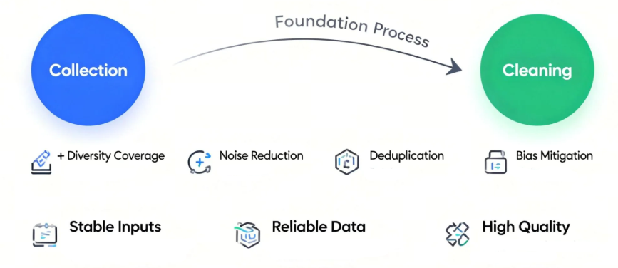
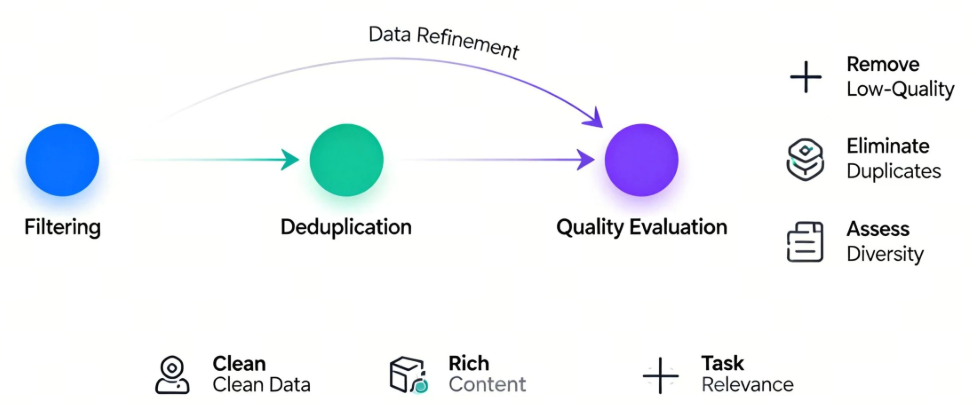
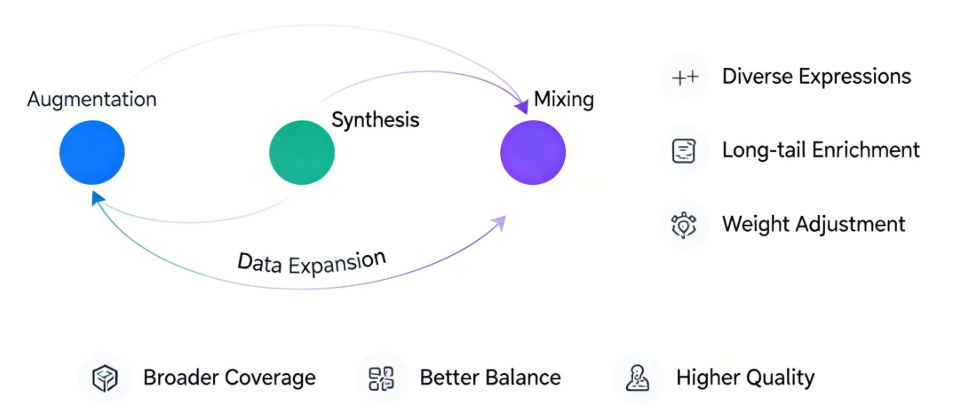
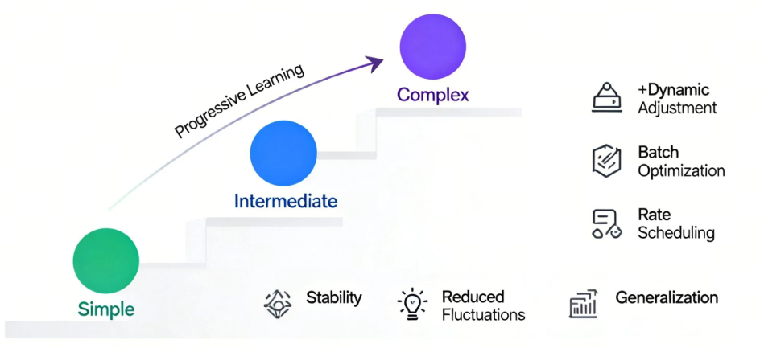
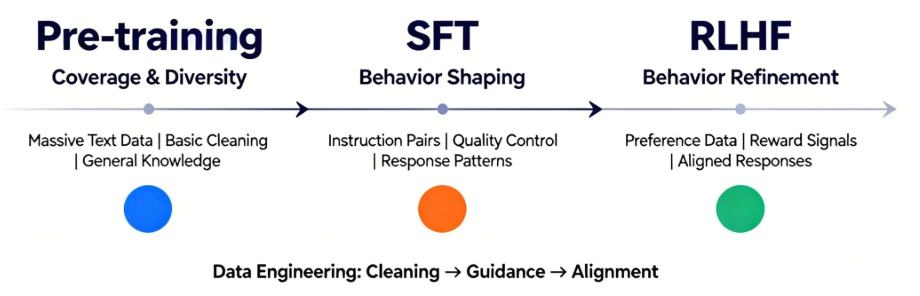

# 第2课时：LLM 训练范式与数据工程全景

## 1. LLM 训练范式全流程概览

大语言模型的训练，并不是“一次性把模型喂大”这么简单，而是一条**由能力学习到行为对齐的渐进式路径**。从最初的无监督预训练，到面向任务与人类偏好的对齐训练，每一个阶段解决的问题都不一样，也各自承担着不可替代的角色。理解这一整条训练链路，是理解现代 LLM 能力来源的关键。

整体来看，主流的大模型训练流程可以抽象为三大阶段：

这条路径的本质，是让模型先学会“语言本身”，再学会“如何按要求回答”，最后学会“怎样的回答更符合人类偏好”。

### 1.1 从 Pre-training 到对齐训练的整体路径

**（1）Pre-training：语言能力的“打地基”阶段**

预训练阶段的目标非常纯粹：  
> **让模型学会自然语言的统计规律与结构模式。**

在这一阶段，模型通常使用海量的无标注文本数据，通过自回归或掩码语言模型目标进行训练。以自回归模型为例，其核心目标函数可以写为：

$$
\mathcal{L}_{\text{pretrain}} = - \mathbb{E}_{x \sim \mathcal{D}} \sum_{t=1}^{T} \log p(x_t \mid x_{<t})
$$

- $\mathcal{D}$ 表示预训练所使用的大规模无标注文本语料分布。
- $x = (x_1, x_2, \dots, x_T)$ 是从语料中采样得到的一段长度为 $T$ 的 token 序列，$x_t$ 表示序列中第 $t$ 个 token，$x_{<t}$ 表示在当前位置之前的所有上下文 token。
- $p(x_t \mid x_{<t})$ 是模型在给定历史上下文条件下，对下一个 token 的条件概率预测。
- $\mathbb{E}_{x \sim \mathcal{D}}$ 表示对整个语料分布取期望，而负号与对数运算共同构成了负对数似然损失（Negative Log-Likelihood），用于衡量模型预测分布与真实数据分布之间的差距。

模型并不知道什么是“好回答”或“坏回答”，它只是在反复学习：  
> **在给定上下文的情况下，下一个 token 最可能是什么。**

这个阶段决定了模型的**知识广度、语言流畅度和基础推理潜力**。如果把模型类比为一个人，Pre-training 更像是“读遍图书馆”的过程——知识很多，但并不一定会按要求说话。

**（2）SFT：让模型“听懂指令”**

仅有预训练是不够的。一个只经过 Pre-training 的模型，往往会出现以下问题：

- 不知道什么时候该回答、什么时候该拒绝  
- 容易答非所问  
- 对“指令”缺乏明确响应意识  

**Supervised Fine-Tuning（SFT）** 的目标，就是通过人工标注的指令-回答数据，让模型学会“如何按人类期望的格式与方式作答”。

其训练目标与预训练类似，但数据分布发生了显著变化：

$$
\mathcal{L}_{\text{SFT}} = - \mathbb{E}_{(x,y) \sim \mathcal{D}_{\text{inst}}} \sum_{t=1}^{|y|} \log p(y_t \mid x, y_{<t})
$$

- $\mathcal{D}_{\text{inst}}$ 表示人工构建的指令数据分布，数据以 $(x, y)$ 对的形式存在。
- $x$ 为用户指令（instruction 或 prompt）。
- $y = (y_1, y_2, \dots, y_{|y|})$ 为对应的高质量人工回答序列。
- $|y|$ 表示回答序列的长度，$y_t$ 为第 $t$ 个输出 token，$y_{<t}$ 表示当前生成位置之前已经生成的回答上下文。
- $p(y_t \mid x, y_{<t})$ 是模型在给定指令 $x$ 和已有回答前缀条件下，对下一个回答 token 的预测概率。
- $\mathbb{E}_{(x,y) \sim \mathcal{D}_{\text{inst}}}$ 表示在指令数据分布上的期望，整体损失仍然采用负对数似然形式，用于约束模型在指令场景下严格学习“给定问题 → 给定答案”的映射关系。

在这一阶段，模型逐渐形成“助手人格”：  
> 看到问题就回答，语气更稳定，结构更清晰。

但需要注意的是，**SFT 只能教“标准答案”，很难教“偏好”**。模型知道“能回答什么”，却未必知道“哪种回答更好”。

**（3）对齐训练：从“能答”到“答得好”**

为了进一步贴近人类偏好，引入了对齐训练阶段，典型代表包括：

- **RLHF（Reinforcement Learning from Human Feedback）**
- **PPO / DPO / GRPO 等优化变体**

这一阶段的核心思想是：  
> **不再只告诉模型“正确答案是什么”，而是告诉它“哪个回答更受人类喜欢”。**

以 RLHF 为例，流程通常包括：

1. 人类对多个回答进行偏好排序  
2. 训练一个奖励模型 $R(x, y)$  
3. 使用强化学习最大化期望奖励：

$$
\max_{\theta} \; \mathbb{E}_{y \sim \pi_\theta(\cdot \mid x)} [ R(x, y) ]
$$

其中，各变量含义如下：

- $\theta$：模型参数，表示当前待优化的大语言模型权重。
- $x$：输入指令或上下文（prompt），通常来自真实用户问题或构造的指令数据。
- $y$：模型生成的完整回答序列，由多个 token 组成。
- $\pi_\theta(\cdot \mid x)$：参数为 $\theta$ 的策略模型，在给定输入 $x$ 条件下生成回答 $y$ 的概率分布。
- $R(x, y)$：奖励模型（Reward Model）的输出，用于衡量在给定指令 $x$ 下回答 $y$ 与人类偏好的匹配程度，数值越大表示越受偏好。
- $\mathbb{E}_{y \sim \pi_\theta(\cdot \mid x)}[\cdot]$：在当前策略模型生成分布下的期望，用于评估模型整体的平均偏好表现。

相比之下，DPO 等方法直接在概率空间中对“好回答”和“差回答”进行对比优化，避免了复杂的 RL 过程，但目标本质是一致的：  
> **让模型在多个“合理回答”中，倾向于更符合人类价值与偏好的那一个。**

**（4）整体视角：三阶段各自解决什么问题？**

从全流程视角看，这三步并不是冗余叠加，而是层层递进：

- **Pre-training**：解决“会不会说话”  
- **SFT**：解决“听不听得懂你在问什么”  
- **对齐训练**：解决“说的话你喜不喜欢、信不信任”  

如果缺少前面的地基，后续对齐几乎无从谈起；  
而如果没有对齐，模型能力再强，也可能“说得多、说得乱、说得不合时宜”。

这正是现代 LLM 训练范式的核心逻辑所在：  
> **能力来自预训练，行为来自对齐，而效果取决于二者的协同。**

### 1.2 SFT：让模型“学会听话”的关键一步

如果说预训练（Pre-training）解决的是“**模型有没有语言能力**”，那么监督微调（Supervised Fine-Tuning, SFT）解决的就是一个更现实的问题：**模型能不能按照人的要求来回答问题**。在这一阶段，大模型第一次真正开始“对齐人类意图”，也正是在这里，它从一个只会续写文本的语言模型，逐步转变为一个可交互、可指令化的助手。

从形式上看，SFT 的训练目标并不复杂。本质上，它仍然是在做条件语言建模，只不过条件不再是“前文 token”，而是被明确区分为 *指令（Instruction）*、*上下文（Context）* 与 *期望输出（Response）*。模型被要求在给定指令和上下文的前提下，最大化正确回答的似然概率：

$$
\mathcal{L}_{\text{SFT}} = - \mathbb{E}_{(x, y) \sim \mathcal{D}} \left[ \log P_\theta(y \mid x) \right]
$$

其中，各变量含义如下：

- $\mathcal{L}_{\text{SFT}}$：监督微调（SFT）阶段的训练损失函数，用于衡量模型生成回答与人工标注答案之间的差距。
- $\mathbb{E}_{(x, y) \sim \mathcal{D}}[\cdot]$：对指令数据分布 $\mathcal{D}$ 下样本对的期望，表示在整个指令数据集上的平均训练目标。
- $\mathcal{D}$：指令微调数据集（Instruction Dataset），由人工或半自动构造的“指令—回答”样本对组成。
- $x$：模型输入，通常包含用户指令（Instruction）、上下文信息（Context）或多轮对话历史。
- $y$：人类标注的理想输出（Response），代表在给定指令 $x$ 下符合人类期望的回答序列。
- $P_\theta(y \mid x)$：参数为 $\theta$ 的语言模型在给定输入 $x$ 条件下生成回答 $y$ 的条件概率。
- $\theta$：模型参数，表示当前大语言模型在 SFT 阶段需要优化的权重集合。

这一目标函数本身并不新颖，但**数据分布的变化**却带来了质的飞跃：模型第一次被系统性地暴露在“人类希望看到的回答”上，而不是互联网上自然产生的文本碎片。

从能力层面来看，SFT 至少在三个方面重塑了模型行为。第一，它让模型学会了**区分角色与边界**。在预训练阶段，模型并不知道“问题”和“回答”的区别，而 SFT 明确告诉模型：什么是用户输入，什么是你应该生成的内容，这直接决定了模型是否会胡乱续写、跑题，或者把用户输入当成待补全的文本。第二，SFT 强化了**任务跟随能力**，例如“请总结”“请翻译”“请给出步骤”“只输出 JSON”等，这些在语言建模意义上并不天然，却在指令数据中被反复强调。第三，SFT 开始塑造模型的**基本价值取向与风格偏好**，比如更礼貌、更克制、更结构化的表达方式。

一个很形象的比喻是：预训练阶段，模型像是“读遍天下书的学生”；而 SFT 阶段，则像是第一次有人坐下来，认真地教它——**“别人提问时，你应该怎么回答，什么样的回答算是好回答”**。没有这一步，模型的知识再多，也很难稳定地服务于真实用户。

但 SFT 也有非常清晰的边界。它高度依赖高质量人工标注数据，而这类数据成本极高、规模有限，决定了 SFT 不可能像预训练那样无限扩展。更重要的是，SFT 只能教会模型“**在给定示例附近做得像人**”，却很难精细地表达“哪些回答更好、哪些虽然看起来合理但不应该给出”。这也是为什么在 SFT 之后，业界普遍还需要引入 RLHF、DPO 等对齐方法，对模型行为进行更细粒度的偏好塑形。

因此，可以把 SFT 看作整个对齐训练中的**基石阶段**：它不追求极致的安全性或偏好最优，而是先解决一个最基本、却最关键的问题——让模型真正“听得懂话、答得像人”。没有这一层，后续所有复杂的对齐算法，都会失去落脚点。

### 1.3 RLHF / PPO / DPO / GRPO：对齐方法的演进与差异

在完成大规模预训练与 SFT 之后，模型已经“会说话、能办事”，但距离“说得合适、办得让人放心”仍有不小差距。现实中的用户关心的不只是“答案是否可能正确”，还包括是否**有用、礼貌、安全、符合人类偏好**。这正是对齐（Alignment）阶段存在的意义，而 RLHF 及其后续方法，正是围绕这一目标逐步演化而来的一整套技术路线。

最早被广泛采用的是 **RLHF（Reinforcement Learning from Human Feedback）**。它的核心思想并不复杂：先让人类对模型生成的多个回答进行偏好排序，再用这些排序数据训练一个**奖励模型（Reward Model, RM）**，最后把语言模型当作策略，用强化学习的方式去最大化奖励模型给出的分数。形式上，我们希望优化的目标可以写成：

$$
\max_\pi \; \mathbb{E}_{x \sim \mathcal{D},\; y \sim \pi(\cdot|x)} \left[ r_\phi(x, y) \right]
$$

其中，各变量含义如下：

- $\pi$：当前语言模型对应的策略（policy），表示在给定输入 $x$ 时生成不同回答 $y$ 的概率分布。
- $\mathcal{D}$：用于对齐训练的提示（prompt）或对话数据分布，通常来源于人工构造或真实用户交互。
- $x$：模型输入，一般为用户指令或对话上下文。
- $y$：模型在策略 $\pi$ 下生成的回答序列。
- $r_\phi(x, y)$：奖励模型（Reward Model）给出的标量奖励，用于评估回答 $y$ 在给定输入 $x$ 下符合人类偏好的程度。
- $\phi$：奖励模型的参数，通过人类偏好排序数据进行训练得到。
- $\mathbb{E}[\cdot]$：期望算子，表示在数据分布与模型生成分布上的平均奖励。

直观理解就是：**让模型多输出那些“人类更喜欢”的回答，少输出让人皱眉的内容**。

在工程实现上，RLHF 通常依赖 **PPO（Proximal Policy Optimization）** 作为优化算法。PPO 的关键在于“别一步走太猛”，它通过引入裁剪（clipping）机制，限制新策略与旧策略之间的变化幅度，目标函数形式为：

$$
\mathcal{L}_{\text{PPO}} = \mathbb{E}\left[
\min \left(
r_t(\theta) A_t,\;
\text{clip}(r_t(\theta), 1-\epsilon, 1+\epsilon) A_t
\right)
\right]
$$

在 PPO 目标函数中，各符号含义如下：

- $\mathcal{L}_{\text{PPO}}$：PPO 算法的优化目标，用于更新语言模型策略参数。
- $r_t(\theta)$：新策略与旧策略在时间步 $t$ 上的概率比，通常定义为
  $$
  r_t(\theta) = \frac{\pi_\theta(y_t \mid x_t)}{\pi_{\theta_{\text{old}}}(y_t \mid x_t)}
  $$
- $\theta$：当前语言模型（策略）的参数。
- $\theta_{\text{old}}$：更新前的策略参数，用作稳定训练的参考。
- $A_t$：优势函数（Advantage Function），衡量在状态 $x_t$ 下采取动作 $y_t$ 相对于平均策略的“好坏程度”。
- $\epsilon$：裁剪超参数（clipping threshold），用于限制策略更新幅度，防止训练不稳定。
- $\text{clip}(\cdot)$：裁剪算子，将 $r_t(\theta)$ 限制在区间 $[1-\epsilon,\; 1+\epsilon]$ 内。

它的工程含义很朴素：**模型可以学，但不要“学歪”或“学炸”**。也正因如此，PPO+RLHF 成为了 GPT-3.5、GPT-4 等模型对齐阶段的核心技术路线。

然而，RLHF 的代价同样明显：它需要训练并维护一个额外的奖励模型，引入复杂的强化学习系统，训练过程不稳定、调参成本高、算力消耗大。这些问题直接推动了下一阶段方法的出现——**DPO（Direct Preference Optimization）**。

DPO 的一个关键洞察是：**其实没必要显式训练奖励模型，也不一定非得做强化学习**。只要我们有“同一个 prompt 下，哪个回答更好”的偏好对 $(y^+, y^-)$，就可以直接在概率空间中优化模型，使其对优选回答赋予更高概率。DPO 的目标函数可以写为：

$$
\mathcal{L}_{\text{DPO}}(\pi_\theta)
=
- \mathbb{E}_{(x, y^+, y^-)} \left[
\log \sigma \left(
\beta
\left(
\log \frac{\pi_\theta(y^+ \mid x)}{\pi_{\text{ref}}(y^+ \mid x)}
-
\log \frac{\pi_\theta(y^- \mid x)}{\pi_{\text{ref}}(y^- \mid x)}
\right)
\right)
\right]
$$

其中，各变量含义如下：

- $x$：输入提示（prompt）或对话上下文，在同一个 $x$ 下比较不同回答的优劣。
- $y^+$：在人类偏好标注中被认为“更好”的回答（preferred response）。
- $y^-$：在人类偏好标注中被认为“较差”的回答（dispreferred response）。
- $\pi_\theta(\cdot \mid x)$：当前待优化的语言模型策略，参数为 $\theta$，表示在输入 $x$ 条件下生成不同回答的概率分布。
- $\theta$：当前语言模型的参数，通过 DPO 目标函数进行更新。
- $\pi_{\text{ref}}(\cdot \mid x)$：参考模型（reference policy），通常为经过 SFT 的模型，用于约束当前策略不要偏离原有语言分布过远。
- $\mathcal{L}_{\text{DPO}}$：Direct Preference Optimization 的训练目标，用于直接对人类偏好进行概率空间优化。
- $\sigma(\cdot)$：Sigmoid 函数，将实数映射到 $(0, 1)$ 区间，用于刻画“优选回答胜过劣选回答”的概率。
- $\beta$：偏好强度系数（preference strength），控制模型在拉开 $y^+$ 与 $y^-$ 概率差距时的力度；$\beta$ 越大，对偏好差异的放大越明显。
- $\mathbb{E}_{(x, y^+, y^-)}[\cdot]$：对偏好数据分布取期望，表示在所有人类标注偏好样本上的平均优化目标。

它的直觉非常直接：**让模型在“好答案”和“坏答案”之间拉开概率差距，同时不要偏离原始模型太远**。相比 RLHF，DPO 训练流程更简单、稳定性更好，也更容易大规模复现，因此在开源社区中迅速流行。

在 DPO 之后，又出现了一些更强调工程友好性与稳定性的变体，其中一个代表是 **GRPO（Grouped / Generalized Reward Preference Optimization）**。GRPO 的核心思想可以看作对“单一偏好对”的自然推广：不再只比较一好一坏的一对回答，而是**在同一个输入条件下，对一组候选回答进行分组或排序式优化**。模型的更新不再依赖单个 $(y^+, y^-)$ 对，而是利用组内相对优势信号进行整体对齐，这在多候选生成、采样式训练以及偏好标注存在噪声的场景下，往往更加稳定，也更贴近真实应用中“多个回答同时竞争”的设定。

一种常见的 GRPO 目标形式可以写为：

$$
\mathcal{L}_{\text{GRPO}}(\pi_\theta)
=
- \mathbb{E}_{x \sim \mathcal{D}}
\left[
\sum_{y_i \in \mathcal{G}(x)}
w_i \,
\log
\frac{\pi_\theta(y_i \mid x)}{\pi_{\text{ref}}(y_i \mid x)}
\right]
$$

其中，各变量含义如下：

- $x$：输入提示（prompt）或对话上下文，在同一个 $x$ 下生成并比较多个候选回答。
- $\mathcal{G}(x)$：在输入 $x$ 条件下生成的候选回答集合（group），通常包含多个不同质量或不同风格的回答。
- $y_i$：候选集合 $\mathcal{G}(x)$ 中的第 $i$ 个回答。
- $\pi_\theta(\cdot \mid x)$：当前待优化的语言模型策略，参数为 $\theta$，表示在输入 $x$ 条件下生成各候选回答的概率分布。
- $\theta$：语言模型的参数，通过 GRPO 目标函数进行更新。
- $\pi_{\text{ref}}(\cdot \mid x)$：参考模型（reference policy），通常为 SFT 后的模型，用于约束当前策略不要偏离原有语言分布过远。
- $w_i$：候选回答 $y_i$ 的权重或相对优势系数，通常由排序结果、分组标签或归一化后的奖励信号给出，用于刻画该回答在组内的相对“好坏程度”。
- $\mathcal{L}_{\text{GRPO}}$：GRPO 的训练目标函数，通过组级别的相对偏好信息对模型进行对齐。
- $\mathbb{E}_{x \sim \mathcal{D}}[\cdot]$：对训练数据分布取期望，表示在所有输入样本上的平均优化目标。

从直觉上看，GRPO 不再执着于“明确区分哪一个是正样本、哪一个是负样本”，而是**利用一组回答之间的相对排序或分组信息，整体拉开高质量回答与低质量回答的概率差距**。这种方式在偏好信号不够精细、人工排序存在噪声，或需要一次性比较多个候选答案的场景中，往往比 DPO 更鲁棒，也更容易扩展到大规模工业级训练流程中。

从整体演进脉络来看，这条路线非常清晰：

- **RLHF + PPO**：理论完整，但系统复杂、成本高；
- **DPO**：去掉奖励模型和 RL，直接优化偏好，简单高效；
- **GRPO 及其变体**：进一步适配多样化偏好结构，增强稳定性与工程可控性。

如果用一句话总结这一演进趋势，那就是：**从“强化学习驱动的对齐”，逐步走向“概率建模驱动的对齐”**。模型不再被当作需要精细操控的 RL 智能体，而是被视为一个可以通过偏好分布直接塑形的生成模型。这一转变，正在深刻影响当前大模型对齐阶段的主流实践。

## 2. 训练规模与 Chinchilla 法则

### 2.1 参数规模、数据规模与算力的三角关系

在大模型发展的早期阶段，业界一度形成了一个近乎“写进共识”的判断：**模型越大，效果越好**。参数规模被当作性能提升的最直观指标，从亿级、百亿级一路推向千亿、万亿，仿佛只要显存和算力允许，把模型不断放大就一定能带来能力跃迁。

但很快，人们在实践中遇到了一个现实而尖锐的问题：**模型并不是越大越好，至少在给定算力预算下不是这样**。一些参数规模极其庞大的模型，实际表现却不如预期，甚至被更小的模型反超。这背后暴露出的核心矛盾，并不在于架构设计，而在于**资源分配失衡**。

从训练本质上看，语言模型的学习过程可以理解为：  
用有限的参数去“吸收”有限的数据，并在有限的计算步数内不断逼近最优解。这里涉及三个紧密耦合的关键变量：

- 参数规模 $N$：决定模型的表达能力上限；
- 数据规模 $D$：以 token 数衡量，决定模型“见过多少世界”；
- 计算预算 $C$：决定模型能对这些数据进行多少次有效更新。

在 Transformer 类模型中，训练计算量可以近似写为：

$$
C \propto N \cdot D
$$

这意味着，在算力预算 $C$ 固定的前提下，参数规模 $N$ 和数据规模 $D$ 并不能同时无限增长：**增大参数，必然挤压可用于训练的数据；增加数据，也必然限制模型规模**。许多“看起来很大但效果一般”的模型，正是因为在这个三角关系中走向了极端——参数堆得过快，而数据严重跟不上。

正是在这样的背景下，DeepMind 提出了著名的 **Chinchilla 法则**。通过对大量 Transformer 语言模型的系统性实验，研究者发现：在固定计算预算下，当时许多主流模型普遍处于一种状态——**参数过多、数据不足**，即严重的欠训练（under-trained）。

Chinchilla 给出的核心结论并不复杂，却极具颠覆性：

> **在给定计算预算下，最优模型并不是参数尽可能大，而是参数规模与数据规模近似线性增长。**

在经验最优区域内，应当满足：

$$
D \approx k \cdot N
$$

其中 $k$ 是一个常数（在原始实验中量级约为 20）。这意味着，一个 100B 参数规模的模型，理想情况下需要看到数量级为数万亿 token 的训练数据，而不是“几千亿 token 就草草收工”。

如果用一个直观的类比来理解这一结论：  
给一个学生发了一本包含一万页内容的超级教材（对应超大参数模型），却只讲了前两章（对应有限的数据），结果并不会是“学生更聪明了”，而只是“他把前两章学得稍微细一点”。新增的知识容量并没有被真正利用，模型也是如此。

这一发现直接改变了后续大模型训练的工程策略。它解释了为什么在 Chinchilla 之后，一批参数规模明显小于 GPT-3 的模型（如 LLaMA 系列），却在多个下游任务上展现出更强的泛化能力——**不是模型结构更神奇，而是训练得更充分、更均衡**。在算力受限的现实条件下，用更多高质量数据去训练一个稍小的模型，往往比训练一个“吃不饱”的巨型模型更划算。

更重要的是，这一结论重新定义了“规模扩展”的工程边界：

- 算力预算 $C$ 往往是最硬的约束；
- 参数规模 $N$ 直接影响显存需求与并行策略；
- 数据规模 $D$ 则涉及长期的数据采集、清洗与治理成本。

Chinchilla 法则并不是一条精确公式，而是一种**资源配置的思维方式**：每一次扩大模型规模之前，都必须同步思考数据是否足够、算力是否匹配。否则，规模扩展只会带来效率下降，而非能力跃迁。

从这个角度看，大模型训练早已不再是“模型架构”的单点问题，而是一场关于**参数、数据与算力协同演化**的系统工程。理解并尊重这三者之间的平衡关系，是走向高性价比、可持续训练范式的第一步。

### 2.2 对实际模型训练策略的影响

Chinchilla 法则真正改变行业的地方，并不在于那条看似简单的比例关系本身，而在于它**系统性地推翻了“参数越大越好”的直觉训练范式**，迫使研究者和工程团队重新思考：在有限算力预算下，模型究竟该“长脑子”，还是该“多读书”。

在 Chinchilla 之前，大模型训练往往遵循一种近乎本能的策略：**先把模型堆大，再尽量喂数据**。但现实是，数据准备远比模型扩容困难得多——高质量语料稀缺、清洗成本高、分布控制复杂，于是很多模型在“数据吃不饱”的状态下被迫提前收敛。Chinchilla 的核心结论直接点破了这一问题：**大量模型其实是“算力过度用在参数上，而不是用在训练步数上”**。换句话说，这些模型不是不够聪明，而是“读书太少”。

这一结论对训练策略的第一层影响，是**参数规模的理性收缩**。在给定 FLOPs 预算 $C$ 的前提下，如果继续盲目扩大参数量 $N$，模型能够经历的有效训练 token 数 $D$ 必然被压缩，导致模型停留在欠训练（under-trained）区间。实践中，这意味着：与其训练一个 1T 参数、只跑几百亿 token 的模型，不如训练一个 200B～300B 参数、但完整跑完数万亿 token 的模型，后者在泛化、稳定性和下游任务迁移上往往更具优势。

第二层影响体现在**数据工程地位的显著上升**。当最优训练策略要求 $D \gg N$ 时，数据不再是“模型训练的燃料”，而是“模型能力的上限决定因素”。这直接推动了 Data-Centric AI 思想在大模型领域的落地：团队开始花更多精力在数据采集、过滤、去重、质量分层与配比设计上，而不是仅仅关注模型结构是否足够复杂。很多头部模型的性能提升，实际上并不是来自架构突破，而是来自更干净、更均衡、更多样的数据分布。

进一步来看，Chinchilla 法则也深刻影响了**训练阶段的资源分配策略**。在算力固定的情况下，团队必须在“更大的 batch、更长的序列、更深的模型、更长的训练时间”之间做取舍。Chinchilla 给出的隐含建议是：**优先保证训练步数与 token 覆盖率，其次才是模型宽度和深度**。这也是为什么近年来大量模型选择在参数规模相对克制的前提下，显著拉长训练周期，甚至通过 curriculum learning 或数据分阶段注入的方式，让模型“慢慢学”。

在工程实践中，这种转变还带来了一个非常现实的好处：**训练稳定性显著提升**。欠训练的大模型往往对初始化、学习率和优化器极其敏感，稍有不慎就会出现 loss 震荡、梯度爆炸或能力坍缩。而在 Chinchilla 建议的“数据充足区间”内训练的模型，由于梯度统计更加充分，往往更容易收敛，对超参数的容忍度也更高。这一点在超大规模分布式训练中尤为重要，因为稳定性本身就是一种隐性成本。

另一个容易被忽视但极其关键的影响，是**对“模型复用与迭代节奏”的改变**。当训练一个超大参数模型的边际收益降低后，更合理的策略往往是：在同一参数规模下反复打磨数据与训练流程，而不是频繁推翻重来。这也是为什么许多模型家族（如 LLaMA、Qwen、Mistral 系列）会选择在相对稳定的参数规模区间内，通过多代数据升级与训练策略调整来持续提升性能。Chinchilla 从理论上为这种“稳态演进”提供了坚实支撑。

从更宏观的角度看，Chinchilla 法则还重塑了**学术研究与工业落地之间的关系**。在学术环境中，算力与数据通常受限，参数扩张曾是最直观的性能提升路径；而在工业环境中，数据规模和系统工程能力反而是核心壁垒。Chinchilla 明确指出：**真正能长期提升模型能力的，是系统性的数据与训练设计能力，而不是一次性的参数豪赌**。这也解释了为什么近年来真正具有竞争力的大模型，往往来自拥有稳定数据管线和持续训练能力的团队。

最后需要强调的是，Chinchilla 法则并不是一条“万能公式”，而是一种**资源最优分配的指导思想**。它并不否认更大模型的潜力，而是提醒我们：在任何给定预算下，都存在一个更理性的参数–数据–算力平衡点。真正成熟的训练策略，不是简单地追求“更大”，而是清楚地知道：**在什么条件下，应该让模型长大；在什么条件下，应该让模型多学。**

从这个意义上说，Chinchilla 不只是一次经验规律的总结，而是大模型训练范式走向工程理性的重要标志。

## 3. Data-Centric AI：以数据为中心的训练范式

### 3.1 从 Model-Centric 到 Data-Centric 的转变

在早期的人工智能发展阶段，模型的能力几乎完全依赖于算法创新与网络架构的优化。这种“Model-Centric”思路强调提升模型复杂度、增加参数量、设计更深更宽的网络，以及精心调节学习率、优化器和正则化策略。工程师和研究者的注意力几乎全部聚焦在模型的性能提升上，而数据往往只是简单清洗或随机采样后直接用于训练。

然而，随着大规模语言模型（LLM）时代的到来，这种以模型为中心的思路逐渐显示出瓶颈。参数数量的扩张虽能短期提升性能，但对数据的依赖呈现出更为严格的要求：模型越大，数据的覆盖和质量对最终表现的影响就越显著。经验表明，即使是最先进的架构，如果训练数据不够丰富或存在系统性偏差，也难以达到预期的效果。Data-Centric AI 的理念应运而生，它主张**提升数据质量和结构，而不仅仅盯着模型参数**。

从实践角度看，Data-Centric AI 包括对数据进行精细化管理和优化，使数据本身成为性能提升的关键因素。例如，在对话型模型训练中，单纯增加模型层数和隐藏维度可能会让模型“学会更多的模式”，但如果训练语料存在偏差或重复信息，模型输出往往会反映出这些缺陷——生成的文本可能重复、偏颇或者缺乏连贯性。相比之下，通过数据清洗、去重、覆盖不足领域的扩展，以及平衡不同标签或主题的分布，模型在相同参数量下的表现往往能显著提升。

这一转变不仅体现在概念上，也反映在实际训练流程中。以传统的 Model-Centric 流程为例，训练步骤主要关注：

- 设计网络架构：选择 Transformer、LSTM 或其他结构；
- 调整优化器和超参数：如学习率、权重衰减、梯度裁剪等；
- 批量训练：增加 batch size 或迭代次数以提高模型收敛。

而 Data-Centric 思路下，训练流程更多关注数据本身的生命周期管理，核心环节包括：

1. **数据采集**：不仅追求量，更注重覆盖面和多样性。例如，在法律文本模型中，需要平衡判例、法规、合同等不同类型的数据来源；
2. **数据清洗与过滤**：去除重复、低质量或噪声样本，保证模型学习到的模式是真实可靠的；
3. **数据扩展与合成**：针对稀缺类型或长尾场景，人工生成或算法合成样本，确保模型具备泛化能力；
4. **数据去重与评估**：检查训练集与验证集是否存在泄漏，同时评估数据覆盖的完整性和均衡性；
5. **数据配比**：根据任务需求调整不同类型数据的比例，使模型不会偏向特定领域或风格。

通过这些环节，Data-Centric AI 将数据本身的质量提升到与模型设计同等重要的位置。这种方式不仅能在有限算力和参数规模下获得更高效的训练结果，还能在实际应用中减少偏差和不一致性。例如，在医学问答模型中，精准的病历语料和药物说明文本能够显著提升模型在诊疗场景下的可靠性，即使模型参数相对有限，也能生成更专业、更贴合用户需求的回答。

Data-Centric 的思路也带来了工程和科研方法上的改变。团队不再只是“堆模型”，而是更注重：

- **持续迭代数据**：每一次训练或微调都伴随对数据质量的评估和优化；
- **数据质量指标化**：引入覆盖率、标签一致性、信息熵等指标量化数据价值；
- **人机协作数据打磨**：利用标注专家、规则系统和自动化工具共同提升数据质量。

在 LLM 训练中，这种转变带来的效果是立竿见影的。模型在面对新任务时，依赖高质量、多样化的数据能够比单纯增加参数量获得更稳健的表现；在低资源场景下，通过精心设计和优化数据集，模型也能发挥出接近大规模模型的性能。这种理念进一步延伸到数据驱动的对齐训练、强化学习和微调策略，使整个训练流程从单纯追求算力消耗，变成一个**数据质量与模型能力协同优化的闭环**。

总的来说，Data-Centric AI 并不是否定模型创新，而是强调“好模型+好数据”才是长远可持续的提升路径。它让训练不再是冷冰冰的数字游戏，而是一个不断打磨数据、观察模型反应、再调整数据的动态过程。这种方法不仅提高了训练效率，也让模型输出更可靠、贴近真实世界需求，同时为后续的 SFT 和 RLHF 提供了坚实的数据基础。

### 3.2 高质量数据为何比更大的模型更重要

在大模型训练的实践中，一个不断被验证的经验法则是：**模型再大，如果数据质量不够，性能提升是有限的，甚至可能带来负面效应**。这与早期 AI 研究中普遍关注模型架构不同，Data-Centric AI 强调用高质量的数据去驱动模型能力的释放。为了理解这个现象，可以从几个角度来分析。

首先，高质量数据能够提供更清晰的信号，让模型学到真正有用的模式。假设我们有一个语言理解任务，需要训练一个问答模型。如果训练集里存在大量的拼写错误、重复样本、无关或偏颇内容，模型就会学习到这些噪声，导致在实际应用中输出不准确或不连贯的答案。即便我们将模型参数翻倍，增加数十亿的权重，也无法彻底消除这种噪声的影响，因为模型没有办法自动辨别哪些数据是可靠的，哪些是误导信息。这种情况下，数据质量的瓶颈直接限制了模型的性能上限。

高质量数据的另一个优势是**覆盖度和多样性**。在语言模型训练中，模型需要学习词汇、句法、语义、常识和领域知识的多层次信息。如果训练数据覆盖不全面，模型在长尾场景下会表现不佳。例如，一个医学问答模型如果训练数据中只包含普通健康知识，而缺少针对罕见病症或药物交互的高质量文本，模型在遇到这些问题时就会产生错误甚至危险的回答。相比之下，通过数据扩展、领域采集和精细标注，我们可以让模型在相对较小的参数规模下，也能获得较强的泛化能力。

数据质量的重要性还体现在**模型训练的效率**上。Chinchilla 法则指出，在固定计算预算下，训练数据和模型参数的比例对最终性能至关重要。公式上可以表示为：

$$
\text{Optimal Data Tokens} \propto \text{Model Parameters}^{0.5}
$$

这意味着，为了充分发挥大模型能力，训练数据必须足够丰富，覆盖模型可以学习的模式空间。如果数据质量低，即使模型参数再多，也无法充分利用这些参数的表达能力。换句话说，增加模型大小只是“增加容量”，而没有高质量数据，模型容量就像空房间，空洞而无法承载知识。

高质量数据还对下游微调（SFT）和对齐训练（RLHF/PPO/DPO）产生直接影响。在 SFT 阶段，模型通过人工标注的指令数据学会执行特定任务或“听话”。如果指令数据质量不高，模型学到的行为模式会出现偏差或不一致。在 RLHF 阶段，奖励模型（Reward Model, RM）依赖对比高低质量输出的训练数据，如果训练 RM 的数据存在噪声，整个强化学习流程可能偏离预期，导致模型学到错误的优化方向。这些链式影响再次凸显了高质量数据对整个训练流程的根本性作用。

为了更直观地理解这个问题，可以考虑一个类比：训练大模型就像建造一座高楼，模型参数是钢筋混凝土，而数据就是设计图纸。如果设计图纸混乱或缺失，钢筋再多也无法建成坚固的楼宇，甚至可能出现结构不稳的问题。相比之下，一份完整、精准的设计图可以让较少的钢筋就建成高楼，而且更加稳固和安全。

在实际工程中，高质量数据通常具有以下特征：

- **准确性**：数据本身信息正确、标签无误；
- **一致性**：同类样本之间标注规范统一，减少歧义；
- **多样性**：覆盖不同领域、不同风格、不同难度的样本，避免模型偏向单一模式；
- **代表性**：能够反映真实使用场景和边缘情况，提升泛化能力；
- **去噪声**：剔除重复、低质量或错误信息，减少模型学习的误导信号。

从工程操作角度，构建高质量数据通常涉及几个环节：数据采集、清洗、过滤、去重、扩展、评估和配比。每个环节都可能对最终模型性能产生显著影响。例如，在数据扩展阶段，通过合成样本或使用外部知识源补充训练集，可以有效弥补稀缺领域的覆盖不足；在评估环节，通过定量指标和人工审查，确保数据覆盖广泛且质量可靠。

高质量数据的重要性也体现在**训练成本优化**上。相比于盲目增加模型参数，投入时间和资源去优化数据质量，往往能在相同计算预算下获得更高的性能收益。这不仅节约了算力和存储资源，也降低了训练失败或模型输出不可控的风险。例如，对于一个 10 亿参数的模型，通过增加 20%-30% 高质量训练数据，其在下游任务的表现提升可能超过单纯增加 50% 参数所带来的收益。

综合来看，高质量数据是大模型训练的根基。它不仅影响模型的基本理解能力，还决定了模型在特定任务、长尾场景和对齐训练中的可靠性。即便面对参数爆炸的 GPT-3、Llama、Mistral 或 Qwen3，如果训练数据没有精心设计和筛选，模型的能力也可能远远低于预期。Data-Centric AI 的理念正是基于这一点：在追求更大模型的同时，更要回头打磨数据，使模型真正学会理解、表达和应用知识，而不是仅仅“记住更多参数”。

### 3.3 数据分布、噪声与偏差问题

在大模型训练中，数据的分布特性、噪声含量以及潜在偏差是决定模型表现的隐形因素。即便拥有海量数据，如果这些因素处理不当，模型最终输出仍可能出现不可预测的偏差、低质量回答，甚至放大社会不公平现象。因此，理解和管理数据分布、噪声与偏差，是构建稳健、高效 LLM 的关键一环。

首先，数据分布的偏斜问题十分常见。在现实世界中，自然语言数据往往呈现长尾分布——少数高频词或主题占据了大部分数据，而大量低频或边缘案例分布稀疏。例如，在新闻语料库中，“政治”类文章数量远高于“环境科学”或“少数族群文化”类文章。训练模型时，如果不进行平衡处理，模型容易倾向于高频类别，输出的回答可能缺乏多样性和公平性。数学上，可以用概率分布 $P(x)$ 描述训练数据的类别或样本分布，模型的优化目标通常是最大化对 $P(x)$ 下数据的拟合。然而，当 $P(x)$ 过度集中在部分类别时，模型在低频类别上的泛化能力会明显下降。

其次，噪声数据是大模型训练的常见“隐形杀手”。噪声可以来源于标注错误、自动爬取数据的质量问题、重复样本、格式错误或语义不一致等。设训练样本为 $(x_i, y_i)$，其中 $y_i$ 是标注或目标输出，如果存在一部分 $y_i$ 与真实分布 $P^*(y|x_i)$ 偏离严重，模型在学习过程中就可能被误导，使梯度更新偏向错误方向。噪声的影响不仅降低收敛速度，还可能引入系统性偏差，使模型对特定输入产生稳定错误的输出。在问答任务中，一个典型的例子是网络爬取的百科数据中存在过时或不准确的事实，如果不经过清洗，这些错误信息可能被模型吸收，导致生成结果错误甚至误导用户。

数据偏差问题则更加隐蔽且复杂。偏差可能来自于训练数据本身的社会、文化或语言习惯，也可能源于采样策略。举例来说，如果训练语料中存在性别、种族或地域上的偏向，模型在生成文本或回答问题时，往往会沿用这些偏向模式，从而在输出中体现出不公平或歧视性倾向。统计上，可以用条件分布差异度 $D_{KL}(P_{\text{train}} || P_{\text{real}})$ 来衡量训练数据与真实场景分布的偏离程度，其中 $P_{\text{train}}$ 为训练集分布，$P_{\text{real}}$ 为实际使用环境分布。偏离度越大，模型在实际应用中的风险和不可控性越高。

处理这些问题的策略主要包括以下几个方面：

1. **数据重采样与平衡**：对低频类别进行过采样或对高频类别进行欠采样，使数据分布更均匀，从而提升模型在长尾样本上的泛化能力。例如，在医学问答中，如果罕见疾病的语料占比不足，可以通过扩充数据或合成样本来平衡分布。

2. **噪声检测与过滤**：通过规则、统计或模型辅助方法识别异常样本，如语义冲突、重复、格式错误等，并将其剔除或修正。举例来说，利用嵌入相似度检测重复文本，或通过分类模型判断文本是否偏离预期主题，都是常用手段。

3. **偏差分析与调整**：通过量化指标评估数据偏差，如类别分布、语言风格、性别/种族/地域特征等，必要时采用加权或重标注方法进行校正，使训练数据更贴近目标应用场景。对于多语言或跨文化任务，可以对不同语种或地域样本进行平衡，以减少偏向单一文化或语境的输出。

4. **多阶段数据策略**：结合高质量人工标注数据与大规模自动收集数据，分阶段训练模型。高质量标注数据可用来校正模型的偏差和噪声引导，而大规模自动数据则提供覆盖范围和知识量。公式上，可以将总训练数据表示为：

$$
D_{\text{train}} = \alpha D_{\text{human}} + (1-\alpha) D_{\text{auto}}
$$

- $D_{\text{train}}$：最终用于模型训练的整体数据集，通常由多种来源的数据按一定比例组合而成。

- $D_{\text{human}}$：人工标注或人工审核的数据集，质量高、噪声低，常用于对齐目标任务分布、纠正模型偏差。

- $D_{\text{auto}}$：自动采集或模型生成的数据集，规模大、覆盖广，但通常包含一定噪声或分布偏差。

- $\alpha$：人工数据权重系数，用于控制人工标注数据在总训练数据中的占比；$\alpha$ 越大，训练越偏向高质量、低噪声数据，$\alpha$ 越小，则更强调数据规模与覆盖度。

总的来说，数据分布、噪声与偏差是大模型性能和可靠性的隐性瓶颈。忽视这些因素，模型即便参数再大，也可能在长尾、低资源或敏感场景中表现不佳。通过系统化的数据分析、清洗、平衡与校正，能够有效提升模型稳定性和输出质量，使其在实际应用中更加可靠和可控。这也是 Data-Centric AI 核心理念的重要体现：关注数据本身的价值和质量，远比单纯追求模型参数扩张来得更有实效。

## 4. 数据工程全生命周期管理

在现代大模型训练中，数据的角色已经从“支撑模型训练的原材料”提升为核心战略资源。数据工程不仅涵盖数据的采集、清洗、去重、扩展等技术操作，更涉及如何通过科学管理和策略优化，确保数据在训练过程中发挥最大价值。整个生命周期管理贯穿模型开发的始终，从源头控制数据质量，到训练阶段优化数据分布，再到后续评估和迭代，都是为了让模型在面对复杂任务时能够更加稳健和可靠。以下章节将系统梳理数据从采集到课程学习的全流程，并结合实践中的方法与经验，帮助理解大模型训练背后的数据工程逻辑。

### 4.1 数据采集与清洗：输入质量的第一道关

在大模型训练的全生命周期中，数据采集与清洗环节是基础中的基础，却也是最容易被忽视的关键环节。数据的质量直接决定了模型能够学到什么、学得多好以及能否在下游任务中稳定表现。无论是 Pre-training 阶段还是 SFT 与 RLHF 阶段，如果输入数据本身存在偏差、噪声或冗余信息，整个训练流程都可能受到严重影响。

数据采集的首要任务是**确保多样性与覆盖度**。语言模型需要处理各种词汇、句法结构、语义表达和领域知识。如果训练语料只来自单一来源，如新闻网站或维基百科，模型在特定领域或非主流表达上的能力将明显不足。因此，现代 LLM 工程通常采用多源采集策略，包括网络爬取、公开数据集、专业领域文档、问答对话、代码库以及多语种文本。采集时，需要对每个来源的数据规模、质量、版权和适用性进行评估，以保证训练语料既丰富又合法。

在采集完成后，清洗工作成为必不可少的环节。清洗不仅仅是去掉空行或格式错误，更关键的是**识别和处理噪声、重复和异常样本**。在自然语言文本中，噪声可能来自拼写错误、乱码、自动生成内容或标注错误。重复样本会导致模型过拟合某些表达模式，而异常样本则可能使模型学到错误的知识。一个典型的清洗流程可能包括以下步骤：

1. **格式标准化**：统一编码格式（如 UTF-8）、统一标点符号、移除不可打印字符。
2. **去重与相似度过滤**：利用文本哈希或嵌入向量相似度计算，剔除完全重复或高度相似的句子。例如，利用余弦相似度 $\cos(\mathbf{v}_i, \mathbf{v}_j)$ 判断两个文本向量 $\mathbf{v}_i, \mathbf{v}_j$ 是否超过阈值 $\tau$，如果 $\cos(\mathbf{v}_i, \mathbf{v}_j) > \tau$ 则认为重复。
3. **噪声检测**：通过正则表达式、规则或模型检测异常文本，如无意义字符堆、明显的拼写错误、URL 堆积或乱码文本。
4. **语义筛选**：针对特定任务或领域，剔除无关内容。例如，训练医学问答模型时，必须去掉娱乐或财经内容，确保模型专注于目标知识域。

数据清洗也需要考虑**统计分布的一致性**。采集的数据往往在词频、句长、主题类别上存在偏差，如果不进行校正，模型容易偏向高频样本而忽略长尾知识。可以通过重采样或加权方式调整训练样本的比例，使模型在各种场景下都能获得均衡训练。例如，对于类别 $c_i$ 的样本，设其数量为 $N_i$，可以定义采样权重 $w_i$ 为：

$$
w_i = \frac{1}{N_i^\alpha}, \quad \alpha \in [0,1]
$$

其中 $\alpha$ 控制平衡程度，权重越大，模型越倾向学习该类别，从而在长尾类别上得到更好的表现。

在清洗过程中，还需要特别关注**隐性偏差**。采集的文本可能反映出社会、文化或语言使用上的偏差，例如性别刻板印象、地域文化倾向或特定群体语言习惯。如果不加处理，模型可能学习并放大这些偏差。处理方式可以包括人工审核、偏差检测指标评估以及针对性数据增强。

一个生动的例子是对话数据集的清洗。假设模型训练包含大量论坛和社交平台的对话文本，如果不去掉攻击性语言或不恰当言论，模型在生成对话时可能出现攻击性或不礼貌回答。这不仅影响模型质量，也可能带来伦理和法律风险。因此，数据清洗不仅是技术工作，更是保障模型可靠性和安全性的重要措施。

总的来说，数据采集与清洗是输入质量的第一道关。一个精心设计、广泛覆盖并经过严格清洗的数据集，能够为大模型训练奠定坚实的基础，让模型在学习过程中更专注于有价值的知识，减少噪声干扰，同时降低训练过程中的不稳定性。无论模型多大、多复杂，如果数据质量不过关，其性能和可靠性都无法达到预期水平。因此，花时间打磨数据，等于为模型的成功铺路，是每个 LLM 工程师必须重视的核心环节。

### 4.2 数据过滤、去重与质量评估

在大模型训练的数据工程流程中，数据过滤、去重以及质量评估是继采集和清洗之后的重要环节，它直接决定了模型训练的稳定性、效率以及最终输出的可靠性。大量未经处理的数据往往包含噪声、重复样本、格式异常或偏离目标任务的内容，如果直接用于训练，不仅浪费算力，还可能对模型性能产生不可逆的负面影响。

数据过滤的核心目的是剔除无关或低质量样本，让训练数据更纯净、更符合模型训练目标。过滤策略通常分为以下几类：  

1. **规则型过滤**：通过正则表达式、文本长度、字符集、标点符号比例等指标剔除异常文本。例如，可以设置规则剔除连续超过 50 个相同字符的文本，或者文本长度小于 5 个 token 的无意义片段。这类方法计算效率高，适合快速清理大规模数据，但容易漏掉语义噪声，需要结合其他策略。  

2. **语义过滤**：利用嵌入向量和相似度计算，识别与目标任务语义不相关的样本。假设我们将每条文本编码为向量 $\mathbf{v}_i$，通过计算与目标领域中心向量 $\mathbf{v}_{\text{center}}$ 的余弦相似度：

$$
\cos(\mathbf{v}_i, \mathbf{v}_{\text{center}}) = \frac{\mathbf{v}_i \cdot \mathbf{v}_{\text{center}}}{\|\mathbf{v}_i\| \|\mathbf{v}_{\text{center}}\|}
$$

当 $\cos(\mathbf{v}_i, \mathbf{v}_{\text{center}})$ 小于阈值 $\tau$ 时，可以认为该样本偏离主题，需要过滤。语义过滤可以帮助模型聚焦核心领域知识，同时降低训练过程中的干扰信号。

去重是数据工程中另一项关键操作。重复样本在训练中可能导致模型对某些信息过度记忆，从而降低泛化能力。例如，如果某篇文章在训练集中出现了十次以上，模型可能倾向于重复其内容，而忽视长尾信息。去重方法通常包括：

1. **精确去重**：基于文本哈希或字符串匹配，剔除完全一致的样本。对于大规模语料，可以采用 MinHash 或 Bloom Filter 来高效检测重复。  
2. **近似去重**：利用向量相似度或局部敏感哈希（LSH）检测语义接近的文本，将重复或高度相似样本合并或剔除。例如，通过计算两条文本向量 $\mathbf{v}_i$ 和 $\mathbf{v}_j$ 的余弦相似度，如果满足：

$$
\cos(\mathbf{v}_i, \mathbf{v}_j) > 0.95
$$

则可以认为这两条文本内容高度重复，只保留一条。近似去重能够处理同义改写或轻微修改的重复内容，是保证训练数据多样性的重要手段。

质量评估则是对过滤和去重后的数据进行整体把控，确保数据既干净又有价值。常见方法包括：

1. **统计指标评估**：包括词频分布、句长分布、主题覆盖度、多样性指标等。例如，模型训练前可以计算词汇表覆盖率 $V/N$，其中 $V$ 是训练语料中的独立词数，$N$ 是总 token 数，评估词汇丰富度。  

2. **噪声检测指标**：如标注错误率、语法异常率或逻辑冲突比例。对于分类或问答数据，可以通过小规模人工审查或校验模型输出，估算噪声比例，并对高噪声源进行加权或剔除。  

3. **领域适配性评估**：衡量数据是否贴近目标任务或应用场景。通过语义嵌入或主题模型，分析训练数据与目标任务分布的距离。例如，利用 KL 散度衡量数据分布偏离：

$$
D_{KL}(P_{\text{train}} \| P_{\text{target}}) = \sum_i P_{\text{train}}(i) \log \frac{P_{\text{train}}(i)}{P_{\text{target}}(i)}
$$

各变量的定义如下：

- $V$：训练语料中的独立词（不重复词项）数量，用于衡量词汇多样性与覆盖范围。

- $N$：训练语料中的总 token 数，反映数据整体规模。

- $V/N$：词汇表覆盖率，用于评估单位 token 下的词汇丰富度，值越大表示语言表达越多样。

- $P_{\text{train}}$：训练数据在词汇、主题或语义空间上的概率分布，通常通过词频统计、主题模型或嵌入聚类估计。

- $P_{\text{target}}$：目标应用场景或下游任务的数据分布，用于刻画模型实际部署时所需适配的数据特征。

- $D_{KL}(P_{\text{train}} \| P_{\text{target}})$：KL 散度，用于衡量训练数据分布与目标分布之间的偏离程度，值越小表示数据越贴近真实应用场景。

一个生动例子是对话生成模型的训练。如果直接使用爬取的社交媒体数据，可能存在大量无意义短句、重复评论、甚至攻击性言论。通过过滤去除长度小于 5 token 的文本、去重重复内容，并利用语义嵌入筛选与目标对话场景相关的文本，模型训练时能够更快速收敛，同时生成回答更加合理、连贯和安全。

现代 LLM 工程中，过滤、去重和质量评估往往不是一次性操作，而是一个迭代闭环。初始清洗后，可以在小规模模型上进行预训练试验，通过模型输出评估数据质量，发现问题后返回数据层面调整。例如，发现模型生成中频繁出现特定错误信息，可以追溯到原始数据的噪声样本，通过进一步过滤或修正改善模型表现。

总的来说，数据过滤、去重和质量评估是训练高质量大模型的保障。它不仅减少噪声和冗余，提高训练效率，更为模型的稳健性、泛化能力和输出可靠性打下基础。通过科学的指标体系和迭代流程，工程师可以确保训练数据既干净又多样，为后续的扩展、合成和课程学习阶段奠定坚实基础。

### 4.3 数据扩展、合成与配比策略

在大模型训练的数据工程流程中，清洗和去重后的数据往往仍然存在分布不均、领域覆盖不足或长尾知识缺失的问题。为了让模型在各类任务中表现更稳定、生成能力更丰富，数据扩展（Data Augmentation）、数据合成（Data Synthesis）以及合理的配比策略成为必不可少的手段。它们不仅可以增加训练数据的多样性，还能在有限数据资源下显著提高模型的泛化能力。

数据扩展的核心思想是**在保持语义一致的前提下生成多样化的表达**。在文本领域，常用方法包括同义词替换、语序调整、模板填充、回译（Back Translation）等。例如，对于句子“我喜欢自然语言处理”，同义词替换可以得到“我热爱自然语言处理”；回译方法先将其翻译成英文“ I love natural language processing”，再翻译回中文，可能得到“我对自然语言处理很感兴趣”。这些方法能够在不改变原始语义的情况下，丰富训练数据，让模型学到更多表达方式。

文本数据合成则更倾向于**生成新的、未在原始数据中出现的样本**。随着大模型生成能力的发展，使用模型自动生成任务相关文本成为主流实践。例如，可以利用小模型生成对话样本或问答对，通过人工或模型质量评估筛选合格样本加入训练集。这种方式尤其适合在低资源场景下扩充数据。例如，在医学问答场景中，如果现有语料中只有有限的病例描述和医生问答，可以让小模型基于真实案例生成更多症状描述和问答组合，然后进行筛选和标注。生成数据的核心目标是**覆盖原始数据难以涵盖的长尾知识**，减少模型对高频模式的过度依赖。

为了控制数据分布与质量，数据配比策略成为关键环节。在多源、多类别、多任务数据混合训练中，如果不进行合理配比，模型可能被大数据源或高频样本“主导”，忽略低频、专业或长尾信息。实践中，常结合采样权重策略对不同数据源或类别进行调节，其思想与数据清洗阶段的分布校正一致。在多任务训练中，还可以通过设置和动态调整任务权重，控制不同任务数据在训练过程中的占比，使模型在各个任务上获得更加均衡、稳定的学习效果。

数据扩展、合成与配比的实施通常结合质量评估和迭代策略。例如，扩展生成的数据在加入训练集前，需要进行自动或人工评估，确保语义准确、表达自然、逻辑合理。可以利用小模型生成候选样本，然后通过大模型或人工进行打分，保留高质量样本。这种“生成—评估—筛选”闭环能够有效保证数据多样性同时不牺牲质量。

一个生动的例子是在对话生成模型的训练中。原始数据中可能包含大量日常闲聊样本，但专业领域知识不足。通过数据扩展，可以增加同义表达的闲聊文本；通过数据合成，可以生成专业问题和回答样本，如法律或医学问答。通过合理配比，将日常对话和专业问答按设定比例混合，模型在生成时既能流畅聊天，又能回答专业问题，表现出多领域能力。

在多语种训练场景中，数据扩展和配比同样关键。高资源语言的数据量远超低资源语言，如果直接混合训练，模型容易倾向高资源语言。此时，可以采用低资源语言过采样、翻译生成以及多语种配比策略，使模型在各语种上都有较均衡的能力。例如，对低资源藏语，可以使用已标注的藏语语料进行回译生成扩展样本，同时通过嵌入相似度筛选与高质量语料匹配的内容，确保扩展数据语义准确。

此外，扩展和合成数据时还需要注意**标签一致性与质量控制**。生成数据可能带来标签噪声，如果不加控制，模型可能学习错误的模式。例如，情感分类任务中，生成文本的正负情绪标签必须严格对应，否则模型在训练时容易混淆。解决方法包括模型自身评分、人工抽样校验以及自动化规则检查。

数据扩展、合成和配比策略的有效组合，能够让大模型在有限原始数据下获得更广泛的知识覆盖，同时保持数据质量和多样性。在实际训练中，工程师往往会将这一环节视为可迭代优化的过程：先生成初步扩展样本，进行质量评估和筛选，再根据模型表现调整配比和生成策略，形成一个动态优化闭环，确保模型在多样性、专业性和泛化能力之间取得平衡。

### 4.4 课程学习（Curriculum Learning）与训练稳定性

在大模型训练过程中，数据不仅仅是静态的输入，它的组织方式直接影响模型学习的效率和稳定性。课程学习（Curriculum Learning, CL）就是通过**合理安排训练样本顺序**，帮助模型逐步掌握复杂任务的一种策略。其核心理念源自人类学习经验：先掌握简单知识，再逐步过渡到复杂概念。这种方法能够缓解训练初期梯度波动过大、模型难以收敛等问题，提升训练稳定性和最终性能。

课程学习可以从多个维度设计，例如难度分层、知识粒度分层、任务复杂度分层等。对于文本生成模型，可以根据文本长度、语法复杂度、信息密度或领域专业性来划分训练阶段。例如，短句或基础对话可以作为初始阶段，让模型先学习基本语言结构和常见语义关系；中等长度文本、跨句逻辑推理或多轮对话则安排在中期阶段；高度专业或长篇篇章则放在后期阶段。数学上可以定义训练样本集合 $D$，按难度指标 $f(x)$ 排序得到课程序列：

$$
D = \{x_1, x_2, ..., x_N\}, \quad f(x_1) \le f(x_2) \le ... \le f(x_N)
$$

在训练过程中，模型从低难度样本开始逐步过渡到高难度样本，可以显著降低训练初期的损失波动 $\mathcal{L}$，提高梯度稳定性：

$$
\mathcal{L} = \mathbb{E}_{x \sim D}[\ell(\theta; x)]
$$

其中 $\ell(\theta; x)$ 表示模型在样本 $x$ 上的损失函数，$\theta$ 为模型参数。通过课程学习，损失函数的期望曲线更加平滑，训练过程更可控。

课程学习不仅仅是“简单到复杂”的线性顺序，还可以结合**动态难度调整（Dynamic Curriculum）**策略。根据模型训练状态，动态评估哪些样本对于当前模型更具挑战性，并将其优先加入训练。例如，可以利用模型预测概率 $p_\theta(y|x)$ 作为难度指标，低置信度样本被认为难度较大，而高置信度样本被视为易学：

$$
f_{\text{difficulty}}(x) = 1 - \max_y p_\theta(y|x)
$$

这种动态调整可以避免模型在初期阶段接触过多复杂样本导致梯度爆炸，同时在中后期针对弱项进行针对性强化训练，从而提高模型对长尾和稀有模式的适应能力。

训练稳定性还涉及**梯度累积与批次设计**。在课程学习框架下，可以对不同难度样本设计不同的批次大小 $B$ 和学习率 $\eta$，低难度样本使用较大批次和较高学习率快速收敛，高难度样本则使用小批次和较低学习率，减少梯度震荡。例如：

$$
\eta(x) = \eta_0 \cdot \frac{1}{1 + f_{\text{difficulty}}(x)}
$$

这种设计能够在保证学习效率的同时，降低训练初期的梯度波动。

在多任务或多模态训练场景下，课程学习不仅体现在样本难度的逐步递进，也体现在**不同任务或模态之间训练重心的动态调度**。假设模型需要同时学习文本生成任务 $T_1$ 与图像理解任务 $T_2$，如果在训练初期就同时以相同强度优化两个任务，往往会导致模型基础能力尚未稳定、梯度相互干扰，从而影响整体收敛效果。

一种常见做法是：**在训练早期提高基础任务的权重，在模型能力逐步建立后，再逐步引入复杂或跨模态任务**。这可以通过显式引入任务权重 $w_{T_i}$ 来实现，并将其直接作用于训练目标函数或采样策略中。

在损失层面，多任务训练的总体目标函数通常写为加权形式：

$$
\mathcal{L}_{\text{total}}(t) = \sum_i w_{T_i}(t)\, \mathcal{L}_{T_i}
$$

其中 $\mathcal{L}_{T_i}$ 表示第 $i$ 个任务对应的损失函数，$w_{T_i}(t)$ 控制该任务在当前训练阶段对参数更新的影响强度。通过随训练进度动态调整权重，例如：

$$
w_{T_i}(t) = \frac{\text{progress}_i(t)}{\sum_j \text{progress}_j(t)}
$$

可以在不同阶段突出不同任务的学习重点。直观上，这相当于告诉模型“当前阶段更应该关注哪类能力”。

除了直接作用于损失函数，任务权重也常用于**数据采样层面**。在多任务数据混合训练中，可以根据 $w_{T_i}$ 调整各任务数据被采样进入一个 batch 的比例，从而间接控制不同任务对模型训练的贡献强度。这种方式在大规模分布式训练中尤为常见，工程实现也更加灵活。

一个生动的例子是对话生成模型的训练过程：初期阶段主要使用短句和单轮对话数据（对应较高权重），帮助模型掌握基本回复模式；中期逐步提高多轮对话任务的权重，增强上下文建模能力；后期再提高专业问答、长文本理解与摘要任务的权重，使模型具备更强的推理与知识整合能力。通过这种方式，模型能力呈现出清晰的阶段性演进。

课程学习的实践还常与数据配比策略结合使用。可以将训练数据划分为易学 $D_{\text{easy}}$、中等 $D_{\text{medium}}$ 和困难 $D_{\text{hard}}$ 三类，并在不同训练阶段设置对应的采样比例 $[p_{\text{easy}}, p_{\text{medium}}, p_{\text{hard}}]$。随着训练推进，逐步降低易学样本比例、提高困难样本比例，使模型在保持训练稳定性的同时，不断挑战更高难度模式。

总体而言，**任务权重既是课程学习在多任务场景下的核心控制变量，也是连接训练目标、数据采样与优化稳定性的关键纽带**。通过合理设计和动态调整任务权重，模型训练可以从“同时学一切”，转变为“在合适的阶段学合适的东西”，从而显著提升训练稳定性、效率以及最终性能。

### 4.5 数据视角下的训练阶段汇总

如果从模型结构或算法角度看，大模型训练通常被划分为 Pre-training、SFT 和 RLHF 三个阶段；但如果换一个视角，从**数据工程全生命周期**来看，这三者本质上是三种完全不同的数据使用方式与处理逻辑。模型能力的演进，实际上是数据质量、数据结构和数据使用策略不断升级的结果。本节尝试从数据工程的角度，对 pt–sft–rlhf 各阶段涉及的数据处理重点进行一次系统梳理。

在 **Pre-training（预训练）阶段**，数据的核心目标是“覆盖世界”。这一阶段更关注规模与多样性，而不是精细标注或人类偏好。数据通常来源于大规模无监督或弱监督语料，包括网页文本、百科、新闻、论坛、书籍、代码库以及多语种数据。此时的数据处理重点并不在“语义是否完美”，而在于**基础可用性与统计合理性**。典型操作包括格式规范化、语言识别、去除乱码与明显噪声、文档切分、长度裁剪以及大规模去重。去重在预训练中尤为重要，因为高频重复文本会显著放大模型的记忆倾向，压缩有效信息密度。与此同时，数据配比也开始发挥作用，例如通过控制不同语言、不同领域语料的采样比例，避免模型被单一来源“灌满”。在这一阶段，数据更像是“原材料”，工程目标是让模型学会语言的基本统计规律、通用语法结构和广泛的世界知识。

进入 **SFT（Supervised Fine-Tuning）阶段**，数据的角色发生了明显变化：从“让模型学会说话”，转向“教模型如何回答问题”。SFT 数据通常是结构化的指令—响应对，包括问答、对话、多轮交互、任务说明与标准输出。这一阶段的数据规模往往远小于预训练，但质量要求显著更高。数据工程的重点也随之转移到**指令一致性、任务覆盖度与响应质量控制**。常见处理包括指令模板统一、角色规范化、回答长度与风格约束、低质量或歧义样本过滤，以及不同任务类型之间的比例控制。例如，在通用助手模型中，闲聊、事实问答、推理题和工具使用类指令如果比例失衡，模型的能力分布就会出现明显偏置。SFT 阶段的数据清洗不再只是“去噪”，而是在不断追问：这些样本是否真的在教模型“正确的行为模式”。

到了 **RLHF（Reinforcement Learning from Human Feedback）阶段**，数据工程的逻辑再次升级。这一阶段不再关心“答案是否像标准答案”，而是关心“哪个答案更让人满意”。对应的数据形态也从单一的输入—输出对，转变为**偏好数据**，即同一输入下多个回答之间的相对排序。数据处理的核心工作包括偏好采集、冲突样本识别、奖励信号稳定性分析，以及偏好分布的平衡控制。以 RLHF 中的奖励模型训练为例，人类标注数据往往存在主观差异和噪声，如果不进行一致性校验或分布校正，奖励模型可能会放大个别标注者的偏好，从而在策略优化阶段引入不稳定因素。即便在 DPO、GRPO 等不显式训练奖励模型的方法中，数据工程仍然需要确保偏好对 $(y^+, y^-)$ 的质量可靠，避免“伪偏好”误导模型更新方向。

从整体流程看，这三个阶段的数据处理并不是割裂的，而是**层层递进、相互制约**的关系。预训练阶段的数据分布决定了模型的能力上限和知识底座；SFT 阶段通过高质量指令数据，对模型行为进行初步“塑形”；RLHF 阶段则进一步在多种合理答案中施加偏好约束，让模型学会取舍与克制。数据工程在其中扮演的角色，也从“清洗与供给”，逐步演变为“引导与约束”。

一个直观的例子是对话模型的构建过程。预训练语料中可能充满口语化表达、争论甚至攻击性内容，这在预训练阶段是可以接受的；到了 SFT 阶段，这类内容往往需要被显式过滤，转而强调礼貌、清晰和任务导向；而在 RLHF 阶段，即便语义正确，如果回答语气生硬或存在潜在风险，也可能在偏好排序中被系统性压低。模型行为的变化，并不是算法突然变“聪明”，而是数据选择标准在不断收紧。

因此，在 pt–sft–rlhf 的完整链路中，数据工程并不是一个前置步骤，而是一条贯穿始终的主线。每进入一个新阶段，数据都在回答一个新的问题：是否足够广、是否足够准、是否足够“让人放心”。理解这一点，才能真正把握大模型训练中“数据驱动能力演进”的内在逻辑。
