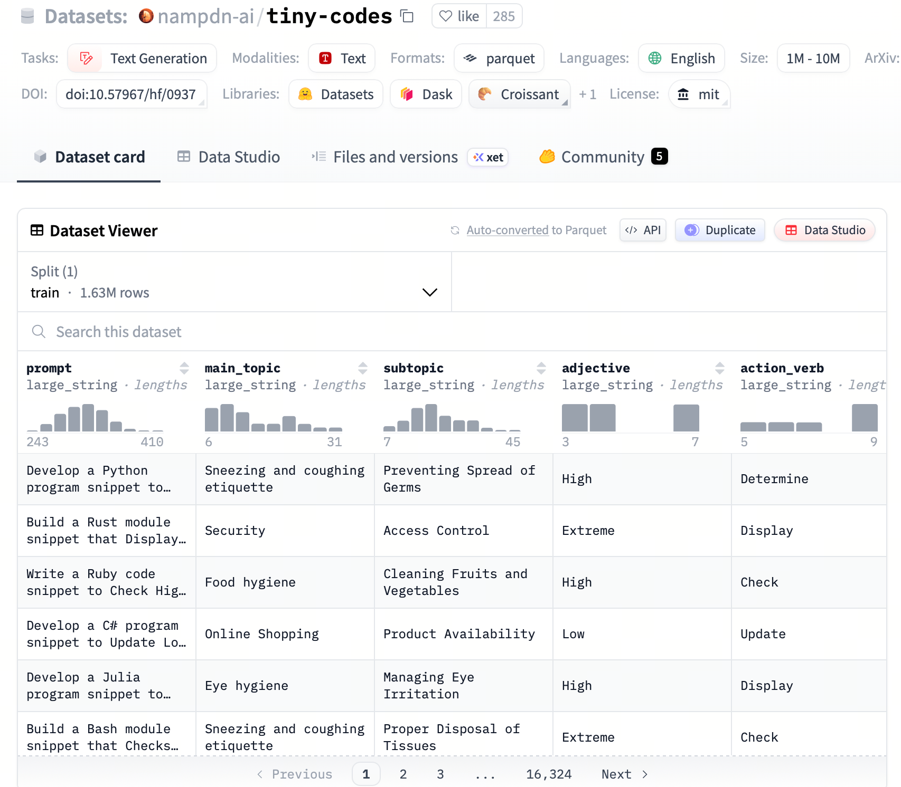
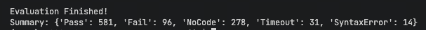
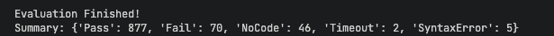
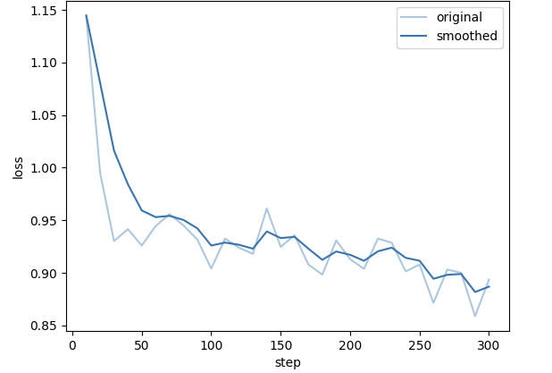
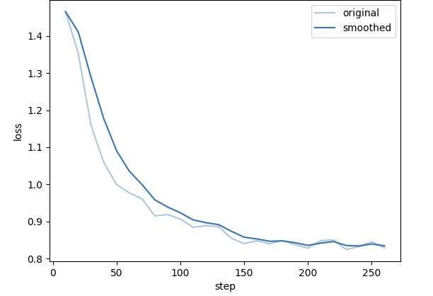
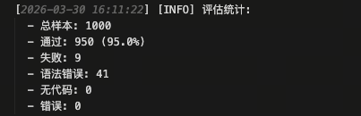

# 第20课时：代码能力增强

## 第一部分：代码数据集构建 (Code Dataset Construction)

### 1. 核心挑战与背景
代码数据与自然语言数据有着本质的区别。自然语言通常具有局部性，而代码则高度依赖于**长距离的逻辑依赖**和**严格的语法规则**。一个函数可能调用了在另一个文件中定义的类，如果模型没有先学习那个类的定义，就很难理解函数的行为。因此，构建高质量代码数据集的核心在于**保持上下文逻辑的连贯性**。

### 2. GitHub 仓库抓取策略
构建大规模代码数据集通常从 GitHub 等开源平台抓取数据。为了保证数据质量，我们需要制定严格的筛选策略：

*   **仓库筛选 (Repository Selection)**：
    *   **Stars 数量**：通常选择 Stars > 5 或 10 的仓库，以保证代码的受关注度和潜在质量。
    *   **License**：严格筛选允许商业用途的许可证（如 MIT, Apache 2.0, BSD），避免法律风险。
    *   **活跃度**：优先选择近期有提交记录的仓库。
*   **文件过滤 (File Filtering)**：
    *   **排除自动生成代码**：过滤掉 `min.js`、`pb.go` (Protocol Buffers 生成)、UI 自动生成文件等。
    *   **排除低质量文件**：过滤掉过短的文件（如少于 10 行）或过大的文件（可能是数据文件而非代码）。
    *   **敏感信息过滤**：扫描并移除 API Keys、密码、IP 地址等敏感信息。

### 3. 数据去重 (Deduplication)
代码库中存在大量的重复代码（如复制粘贴的工具类、标准库引用）。重复数据会导致模型过拟合，并降低训练效率。

*   **MinHash + LSH (Locality Sensitive Hashing)**:
    *   **原理**: 将代码文件转换为集合（Shingles），计算 Jaccard 相似度。
    *   **公式**: 给定两个集合 $A$ and $B$，Jaccard 相似度定义为：

        $$
        J(A, B) = \frac{|A \cap B|}{|A \cup B|}
        $$

    *   MinHash 算法保证了哈希碰撞的概率等于 Jaccard 相似度：

        $$
        P(h(A) = h(B)) = J(A, B)
        $$

    *   **应用**: 我们可以设置一个阈值（如 0.8），过滤掉相似度高于该阈值的文件。

#### 伪代码实现：MinHash 去重流程

```python
# 1. 将文档分词并转换为 Shingles 集合
def get_shingles(text, k=5):
    return set([text[i:i+k] for i in range(len(text)-k+1)])

# 2. 计算 MinHash 签名
def compute_minhash_signature(shingles, num_hashes=128):
    signature = []
    for i in range(num_hashes):
        # 使用不同的哈希函数映射集合
        min_hash_val = min([hash_func(s, i) for s in shingles])
        signature.append(min_hash_val)
    return signature

# 3. LSH 分桶 (Bucketing)
def lsh_bucketing(signatures, bands=16, rows=8):
    buckets = defaultdict(list)
    for doc_id, sig in signatures.items():
        for b in range(bands):
            # 将签名切分为 bands，每份包含 rows 行
            band_sig = tuple(sig[b*rows : (b+1)*rows])
            buckets[(b, band_sig)].append(doc_id)
    return buckets

# 4. 候选对筛选与 Jaccard 验证
# 在同一个桶里的文档被视为候选相似对，再进行精确 Jaccard 计算
```


### 4. 依赖解析与拓扑排序 (Dependency Parsing & Topological Sorting)
这是代码数据处理中最关键的一步。为了让模型像人类开发者一样“先看定义，再看使用”，我们需要按照依赖关系对文件进行排序。

#### 原理说明
假设项目中有三个文件：

- **utils.py**: 定义了一些基础工具函数。
- **model.py**: 导入了 `utils.py` 并定义了核心类。
- **train.py**: 导入了 `model.py` 进行训练。

如果我们将它们拼接成一个长序列喂给模型，理想的顺序应该是 `utils.py` -> `model.py` -> `train.py`。
从概率角度看，我们的目标是最大化序列生成的似然概率：

$$
P(\text{Codebase}) = P(f_1) \cdot P(f_2 \mid f_1) \cdot P(f_3 \mid f_1, f_2) \cdots
$$

如果 $f_2$ 依赖 $f_1$，那么先学习 $f_1$ 能够显著提高预测 $f_2$ 的概率 $P(f_2 \mid f_1)$。

#### 代码实战：简易拓扑排序
我们可以使用 Python 的 `networkx` 库来实现这一逻辑。

```python
import networkx as nx
import re
from typing import List, Tuple

def parse_imports(file_content: str) -> List[str]:
    """
    简易的正则解析，提取 Python import 语句中的模块名。
    实际场景中应使用 AST (抽象语法树) 进行更精准的解析。
    """
    # 匹配 'import module' 或 'from module import ...'
    imports = re.findall(r'^(?:from|import)\s+(\w+)', file_content, re.MULTILINE)
    return imports

def topological_sort_files(files: dict) -> List[str]:
    """
    对文件进行拓扑排序。
    :param files: 字典，key为文件名，value为文件内容
    :return: 排序后的文件名列表
    """
    dag = nx.DiGraph()
    
    # 1. 构建图的节点
    for filename in files:
        dag.add_node(filename)
        
    # 2. 构建依赖边
    for filename, content in files.items():
        imported_modules = parse_imports(content)
        for module in imported_modules:
            # 假设模块名即为文件名（简化处理）
            dependency_file = f"{module}.py"
            if dependency_file in files and dependency_file != filename:
                # 依赖文件 -> 当前文件 (先有依赖，后有当前)
                dag.add_edge(dependency_file, filename)
    
    # 3. 执行拓扑排序
    try:
        # topological_sort 返回的是生成器，转为 list
        sorted_files = list(nx.topological_sort(dag))
        return sorted_files
    except nx.NetworkXUnfeasible:
        # 如果存在循环依赖（A依B，B依A），则无法进行完美拓扑排序
        # 此时可以回退到按文件名排序或保留部分顺序
        print("Warning: Cyclic dependency detected, fallback to default order.")
        return list(files.keys())

# --- 测试示例 ---
code_files = {
    "train.py": "from model import MyModel\n...",
    "utils.py": "def help(): pass",
    "model.py": "import utils\nclass MyModel: pass"
}

sorted_order = topological_sort_files(code_files)
print("Sorted Order:", sorted_order) 
# 输出应为: ['utils.py', 'model.py', 'train.py']
```

## 第二部分：预训练策略 (Pre-training Strategy)

### 1. Fill-in-the-Middle (FIM) 任务设计
传统的语言模型预训练（Causal Language Modeling, CLM）是**从左到右**生成的。其目标是最大化似然函数：

$$
\mathcal{L}_{\text{CLM}} = - \sum_{t} \log P(x_t \mid x_{<t})
$$

然而，在编程助手的实际应用中，用户经常需要在**代码中间**插入一段逻辑（In-filling）。如果模型只学过从左到右预测，它就无法利用**光标之后**的代码信息（即 $x_{>t}$）。

**FIM (Fill-in-the-Middle)** 任务正是为了解决这个问题。它将训练数据随机切分为三部分：前缀 (Prefix)、中间 (Middle)、后缀 (Suffix)。
模型的目标变为在给定 Prefix 和 Suffix 的情况下，生成 Middle：

$$
P(\text{Middle} \mid \text{Prefix}, \text{Suffix})
$$

### 2. 变换模式 (Transformation Modes)
FIM 通常有两种主要的拼接模式（PSM 和 SPM），并通过特殊的 Sentinel Tokens（哨兵符）来引导模型。

* **PSM (Prefix-Suffix-Middle)**:
  - **格式**: `<PRE> Prefix <SUF> Suffix <MID> Middle <EOT>`
  - **Attention Mask**: 模型在生成 Middle 时，可以同时 attend 到 Prefix 和 Suffix。
  - **应用场景**: 典型的代码补全场景。

* **SPM (Suffix-Prefix-Middle)**:
  - **格式**: `<SUF> Suffix <PRE> Prefix <MID> Middle <EOT>`
  - **优势**: 这种模式在某些研究（如 CodeGeeX, StarCoder）中被证明能进一步提升性能，因为模型被迫先理解上下文（Suffix），再结合前文（Prefix）进行生成。

#### FIM 的 Attention 机制
在 FIM 模式下，Attention Mask 矩阵不再是严格的下三角矩阵。

*   Prefix 和 Suffix 之间通常是**双向可见**的（或者至少 Prefix 对 Suffix 可见）。
*   Middle 部分只能看到 Prefix 和 Suffix，但不能看到 Middle 自身的未来 Token（保持自回归性质）。

#### 数据格式示例
假设原始代码是：
```python
def add(a, b):
    return a + b
```

我们将其切分为：
*   Prefix: `def add(a, b):\n`
*   Middle: `    return a + b`
*   Suffix: `\n` (或更多后续代码)

转换后的训练样本（PSM 模式）：
```text
<PRE>def add(a, b):
<SUF>
<MID>    return a + b
```

在训练时，我们只计算 `<MID>` 之后 tokens 的 Loss，即：

$$
\mathcal{L}_{\text{FIM}} = - \sum_{i \in \text{Middle}} \log P(x_i \mid \text{Prefix}, \text{Suffix}, x_{<i \in \text{Middle}})
$$

## 第三部分：指令微调 (Instruction Fine-tuning)

### 1. 构造代码数据
为了让模型成为一个好的“编程助手”，我们需要通过指令微调（SFT）来激发它的对话和交互能力。数据主要分为三类：

*   **代码生成 (Code Generation)**: "请写一个 Python 函数实现快速排序。"
*   **代码解释 (Code Explanation)**: "这段 C++ 代码是做什么的？请解释每一行。"
*   **代码转换/翻译 (Code Translation)**: "将这段 Java 代码重写为 Python。"

### 2. 单元测试生成 (Unit Test Generation)
这是提升代码可靠性的关键一步。我们要求模型不仅生成代码，还要生成**验证该代码的单元测试**。这迫使模型思考边界条件和预期行为。

**数据样例**：
```json
{
    "instruction": "编写一个函数计算斐波那契数列的第 n 项，并编写测试用例。",
    "input": "",
    "output": "```python\ndef fibonacci(n):\n    if n <= 1: return n\n    return fibonacci(n-1) + fibonacci(n-2)\n\n# Unit Tests\nassert fibonacci(0) == 0\nassert fibonacci(1) == 1\nassert fibonacci(10) == 55\nprint('All tests passed')\n```"
}
```

## 第四部分：执行反馈 (Execution Feedback)

### 1. 强化学习环境 (Code RL)
在代码领域，我们有一个天然的“裁判”：**编译器 (Compiler)** 或 **解释器 (Interpreter)**。不同于自然语言依赖人类的主观评分（RLHF），代码可以通过是否编译通过、是否通过单元测试来获得客观的反馈。

我们可以构建一个强化学习循环：

1.  **Actor**: 模型生成代码。
2.  **Environment**: 沙箱环境（Sandbox）运行代码。
3.  **Feedback**:
    - **编译错误** -> 负奖励 (Negative Reward)
    - **运行时错误** -> 较小的负奖励
    - **通过单元测试** -> 正奖励 (Positive Reward)

### 2. 基于执行反馈的 Reward 设计
我们可以设计一个简单的奖励函数来指导模型优化。

```python
def calculate_reward(code_snippet: str, test_cases: list) -> float:
    """
    模拟代码执行环境的奖励计算
    """
    try:
        # 1. 静态检查 (Syntax Check)
        compile(code_snippet, '<string>', 'exec')
    except SyntaxError:
        return -1.0  # 语法错误，重罚

    # 2. 动态执行与测试
    passed_tests = 0
    try:
        # 危险：实际生产中必须在 Docker 沙箱中运行！
        exec_globals = {}
        exec(code_snippet, exec_globals) 
        
        solution = exec_globals.get('solution')
        if not solution:
            return -0.5 
            
        for test_input, expected_output in test_cases:
            if solution(test_input) == expected_output:
                passed_tests += 1
    except Exception:
        return -0.5 

    # 3. 计算最终奖励 (Pass Rate)
    pass_rate = passed_tests / len(test_cases)
    return pass_rate
```

通过 PPO 算法，我们可以最大化这个 `pass_rate`，从而训练出一个不仅“会说话”，而且“写出的代码能跑通”的模型。

## 第五部分：实战演练：基于 tiny-codes 的代码模型训练 (Practical Drill)

本部分将通过一个具体的任务——基于 `tiny-codes` 数据集微调小型语言模型（SLMs），来演示如何训练一个增强代码能力的模型。

### 1. 任务目标
利用高质量的合成代码指令数据，训练一个参数量较小但具备类似 GPT-4 代码编写能力的模型。

### 2. 数据集简介：tiny-codes
*   **数据集地址**: [nampdn-ai/tiny-codes](https://huggingface.co/datasets/nampdn-ai/tiny-codes)



*   **来源背景**:
    *   **目标**: 专为微调 SLMs 设计，使其具备强大的代码能力。
    *   **合成数据**: 大部分数据由 GPT-4 等大模型生成，保证了代码规范性和详细的注释。
    *   **多语言支持**: 涵盖 Python, JavaScript, C++, Java, Go 等主流语言。
    *   **任务多样性**: 包含代码补全、解释、算法实现、单元测试生成等。
*   **数据集规模**:
    *   **总条数**: 约 160k 条（tiny-codes-v1）。
    *   **Token 密度**: 优化了代码与自然语言的比例，防止丢失自然语言能力。
    *   **实验设置**: 在本次实战 pipeline 中，我们选取 **5,000 条**作为 Python语言原始训练数据，并保留 **1,000 条**（与 SFT 分布一致）作为评估数据 (Eval)。
*   **数据结构**: 标准 JSONL 格式。
    *   `instruction`: 用户的具体要求（如“请用 Python 写一个计算斐波那契数列的函数”）。
    *   `input`: （可选）背景上下文或代码片段。
    *   `output`: 模型的回答，包含代码实现及解释。
    *   `programming_language`: 编程语言标签。

### 3. 数据处理流程 (Data Processing Pipeline)
为了从原始数据中提取出高质量的训练样本，我们需要经过一系列算子的处理。

#### 3.1 涉及算子介绍

##### 3.1.1 CodeInstructionGenerator (指令标准化算子)

*   **功能**: 将不规则的用户输入重写为标准的 Python 开发任务格式（简洁描述 + 函数骨架）。
*   **示例**:
    *   **输入**: “帮我写个函数，算斐波那契数列，用 Python。”
    *   **输出**:
        ```python
        def solution(n):
            """Calculate Fibonacci."""
            ...
        ```

##### 3.1.2 ScriptSynthesizer (脚本合成算子)

*   **功能**: 扮演高级工程师，根据指令生成完整的、可运行的 Python 代码。
*   **示例**:
    *   **输入**: "Write a Python function to calculate the Fibonacci sequence."
    *   **输出**:
        ```python
        def solution(n):
            if n <= 1: return n
            return solution(n-1) + solution(n-2)
        ```

##### 3.1.3 LogicIntegrityAuditor (逻辑完整性审计算子)

*   **功能**: 自动化审查员，评估代码与指令的一致性，给出评分 (0-10) 和反馈。
*   **输出**: `quality_score`, `feedback`。

##### 3.1.4 ThresholdSieve (阈值筛选算子)

*   **功能**: 根据 `quality_score` 过滤数据。
*   **逻辑**: 若分数在 `[min_score, max_score]` 之间，保留数据；否则丢弃。

##### 3.1.5 CodeFeedbackFormatter (反馈格式化算子)

*   **功能**: 将清洗后的数据格式化为标准的 SFT 训练集格式（`instruction`/`input`/`output` 三元组）。
*   **示例**:
    ```json
    {
      "instruction": "Build a Python module snippet that Checks Extreme Travel: Local Attractions for Engineer for Beginners. Incorporate if/else or switch/case statements to handle different cases based on the Responsibility. Ensure your control flow is well-documented with comments explaining your approach.",
      "input": "",
      "output": "def recommend_attractions(responsibility):\n    \"\"\"Recommend extreme travel attractions for engineers based on their responsibility.\n    \n    Args:\n        responsibility: A string representing the engineer's field (e.g., 'civil', 'software').\n        \n    Returns:\n        List of recommended attractions.\n    \"\"\"\n    attractions = []\n    \n    # Handle different engineering responsibilities\n    if responsibility == 'civil':\n        # Civil engineers might be interested in infrastructure\n        attractions.append(\"Local Bridges and Dams\")\n        attractions.append(\"Historic Construction Sites\")\n    elif responsibility == 'software':\n        # Software engineers might enjoy tech-focused experiences\n        attractions.append(\"Tech Museums\")\n        attractions.append(\"Hackathon Spaces\")\n    elif responsibility == 'mechanical':\n        # Mechanical engineers could appreciate industrial sites\n        attractions.append(\"Factory Tours\")\n        attractions.append(\"Machinery Exhibits\")\n    else:\n        # Default for other engineering fields\n        attractions.append(\"Engineering Landmarks\")\n        attractions.append(\"Science Centers\")\n    \n    return attractions"
    }
    ```

#### 3.2 Pipeline 代码实现

```python
from lazyllm import pipeline
from lazyllm.tools.data import codegen_ops


def build_codegen_pipeline(model, input_key='messages', min_score=7, max_score=10):
    with pipeline() as ppl:
        ppl.code_instruction_generator = codegen_ops.CodeInstructionGenerator(
            model=model,
            input_key=input_key,
            output_key='instruction'
        )

        ppl.script_synthesizer = codegen_ops.ScriptSynthesizer(
            model=model,
            input_key='instruction',
            output_key='new_code'
        )

        ppl.logic_integrity_auditor = codegen_ops.LogicIntegrityAuditor(
            model=model,
            input_instruction_key='instruction',
            input_code_key='new_code',
            output_score_key='quality_score',
            output_feedback_key='feedback'
        )

        ppl.threshold_sieve = codegen_ops.ThresholdSieve(
            min_score=min_score,
            max_score=max_score,
            input_score_key='quality_score',
            output_key='quality_score_filter_label'
        )

        ppl.code_feedback_formatter = codegen_ops.CodeFeedbackFormatter(
            instruction_key='messages',
            input_code_key='new_code',
            feedback_key='feedback',
            output_key='formatted_data'
        )

    return ppl
```

通过上述 Pipeline 处理后，我们得到了格式统一、逻辑清晰且经过质量筛选的高质量代码指令数据。这些数据已经准备好直接用于后续的监督微调（SFT）阶段，能够显著提升模型在代码生成任务上的表现。

### 4. 模型训练 (Model Training)
我们将使用 `lazyllm` 框架进行模型微调。`lazyllm` 提供了高度封装的接口，可以轻松切换微调后端（如 Llama-Factory）并支持多种启动器（Launchers）。

```python
import lazyllm 
from lazyllm import finetune, deploy, launchers 

# 1. 配置模型路径与保存路径
model_path = "/model/modelscope/Qwen/Qwen2.5-0.5B-Instruct" 
target_path = "/code_sft/checkpoint"

# 2. 定义训练模块
model = lazyllm.TrainableModule(model_path, target_path=target_path)\ 
    .mode('finetune')\ 
    .trainset('/path/to/codegen.json')\ 
    .finetune_method((finetune.llamafactory, { 
        'learning_rate': 1e-4, 
        'cutoff_len': 4096, 
        'max_samples': 5000, 
        'val_size': 0.02, 
        'optim': 'adamw_torch_fused', 
        'bf16': True, 
        'fp16': False, 
        'per_device_train_batch_size': 8, 
        'gradient_accumulation_steps': 4, 
        'num_train_epochs': 2.0, 
        'template': 'qwen', 
        'stage': 'sft', 
        'save_steps': 10, 
        'resume_from_checkpoint': None, 
        'save_strategy': 'steps', 
        'save_total_limit': 3, 
        # 使用 sco 启动器配置硬件资源
        'launcher': launchers.sco( 
            ngpus=1, 
            partition='a800', 
            resource='N3lS.Ii.I60.1', 
        ), 
    })) 

# 3. 启动训练（执行 update 会触发底层的微调任务）
model.update()
```

### 5. 效果评测 (Effect Evaluation)

#### 5.1 核心评测指标
1.  **Pass@k (通过率)**: 评估代码生成最权威的指标。$\text{Pass@1}$ 衡量单次生成的正确率。
    *   公式: $\text{Pass@k} = \mathbb{E}_{\text{Problems}} \left[ 1 - \frac{\binom{n-c}{k}}{\binom{n}{k}} \right]$
    *   说明: 本实验中 $\text{Pass@1} = 99.1\%$，显示极强的准确性。
2.  **PPL (Perplexity, 困惑度)**: 衡量模型预测的不确定性。低 PPL 意味着更少的语法错误和更规范的代码。
    *   公式: $\text{PPL}(X) = \exp\left( -\frac{1}{N} \sum_{i=1}^{N} \ln P(x_i | x_{<i}) \right)$
3.  **FCR (Format Compliance Rate, 格式遵循率)**: 模型输出是否严格符合 Markdown 格式规则。
    *   公式: $\text{FCR} = \frac{N_{\text{Total}} - N_{\text{NoCode}}}{N_{\text{Total}}} \times 100\%$
4.  **SER (Syntax Error Rate, 语法错误率)**: 代码静态分析通过率，反映对编程语言语法的掌握。
    *   公式: $\text{SER} = \frac{N_{\text{SyntaxError}}}{N_{\text{Total}}} \times 100\%$
5.  **RSR (Runtime Success Rate, 运行时成功率)**: 排除格式和语法错误后，逻辑正确的比例。
    *   公式: $\text{RSR} = \frac{N_{\text{Pass}}}{N_{\text{Total}} - N_{\text{NoCode}} - N_{\text{SyntaxError}}} \times 100\%$

#### 5.2 评测结果对比

**1. 微调前测评**



**2. 微调后测评**



*以及对应的损失函数图像：*



**3. Pipeline 生成的数据微调**


*以及对应的损失函数图像：*



**表 1: 微调前后模型生成质量对比 (绝对数量)**

| 评估指标 | 微调前 (Before SFT) | 第一次微调后 (After SFT v1) | pipeline数据微调后 (ppl_sft) | 最终变化 (对比初始) | 备注 |
| :--- | :--- | :--- | :--- | :--- | :--- |
| **通过 (Pass)** | 581 | 877 | 991 | **+410 (↑70.5%)** | 逻辑近乎完美 |
| **失败 (Fail)** | 96 | 70 | 2 | - | - |
| **语法错误 (SyntaxError)** | 14 | 5 | 7 | - | 保持极低水平 |
| **未提取代码 (NoCode)** | 278 | 46 | 0 | - | 格式完全对齐 |
| **超时 (Timeout)** | 31 | 2 | 0 | - | 死循环彻底消失 |
| **总计处理样本数** | 1000 | 1000 | 1000 | - | - |

**表 2: 核心指标综合分析**

| 评估指标 | 符号 | 微调前 (Before) | 微调后 (v1) | PPL微调后 (Current) | 指标意义 |
| :--- | :--- | :--- | :--- | :--- | :--- |
| **PPL** | $PP$ | ~12.50 | ~1.80 | **1.08** | 越小代表预测越笃定 |
| **通过率** | $Pass@1$ | 58.1% | 87.7% | **99.1%** | 核心逻辑正确性 |
| **格式遵循率** | $FCR$ | 72.2% | 95.4% | **100%** | 提取脚本的兼容性 |
| **语法错误率** | $SER$ | 1.4% | 0.5% | **0.7%** | 静态语法准确性 |
| **逻辑错误率** | $Fail$ | 9.6% | 7.0% | **0.2%** | 业务逻辑偏差 |

#### 5.3 总结与展望 (Summary & Future Work)

通过本次实战，我们见证了代码模型能力的显著跃升。从最初只有 **58.1%** 的通过率，到经过 `LazyLLM` Pipeline 精细化数据清洗和微调后的 **99.1%**，模型不仅学会了如何编写正确的 Python 代码，更在**指令遵循**和**逻辑严密性**上达到了准工业级水平。

**核心结论：**

1. **数据质量决定上限**：通过 `LogicIntegrityAuditor` 过滤出的高质量数据，比原始合成数据在提升逻辑准确性上更有效。
2. **格式对齐是基础**：`CodeFeedbackFormatter` 确保了模型输出能被 100% 正确提取，彻底解决了“复读机”或输出格式混乱的问题。
3. **PPL 与性能强相关**：PPL 从 12.5 降至 1.08，直观反映了模型对编程任务从“困惑”到“精通”的转变。

**未来改进方向：**

- **多语言泛化**：目前侧重于 Python，未来可将 Pipeline 扩展至 C++、Java 等更多主流语言。
- **强化学习引入**：结合 RSR (运行时成功率) 作为 Reward，利用 PPO 算法进一步压榨模型的逻辑极限。
- **长序列优化**：针对跨文件依赖的复杂项目，探索更高效的拓扑排序和 Context 注入策略。


## 一键启动脚本

为了方便快速复现实验，我们提供了包含 Pipeline 的[一键运行脚本](./code/run.py)和跳过 Pipeline 的[直接 SFT 脚本](./code/run_sft.py)。下面的说明以 `run.py` 为准，它整合了数据下载、Pipeline 处理、SFT 训练、评测集推理和代码评估五个阶段。

### 文件结构

```
code/
├── run.py          # 推荐入口：包含 Pipeline 的完整流程
├── run_sft.py      # 直接使用原始训练集进行 SFT
├── run.sh          # 旧版 shell 包装脚本
├── Dockerfile      # Docker 代码评测环境
├── data/           # 运行后自动生成
├── models/         # 运行后自动生成
├── output/         # 运行后自动生成
└── logs/           # 运行后自动生成
```

### 配置步骤

脚本会自动检测已安装的 `lazyllm` 包路径，无需手动配置。如需覆盖默认配置，可通过以下方式：

1. **（可选）修改 `run.py` 顶部默认配置**：

```python
PIPELINE_MODEL = 'Qwen/Qwen3-30B-A3B-Instruct-2507'  # Pipeline 模型
SFT_MODEL = 'Qwen/Qwen2.5-0.5B-Instruct'              # SFT 基础模型

VLLM_MAX_MODEL_LEN = 4096
VLLM_GPU_MEMORY_UTILIZATION = 0.8
VLLM_MAX_NUM_SEQS = 16
VLLM_MAX_NUM_BATCHED_TOKENS = 16384
VLLM_RESPONSE_MAX_TOKENS = 1536
INFERENCE_WORKERS = 8
EVAL_WORKERS = 8
```

2. **或通过命令行参数覆盖配置**：

```bash
python run.py \
    --pipeline-model "/path/to/pipeline/model" \
    --sft-model "/path/to/sft/base/model" \
    --vllm-max-model-len 4096 \
    --vllm-gpu-memory-utilization 0.8 \
    --vllm-max-num-seqs 16 \
    --vllm-max-num-batched-tokens 16384 \
    --vllm-response-max-tokens 1536 \
    --inference-workers 8 \
    --eval-workers 8
```

> **注意**：如需使用本地 LazyLLM 源码（非 pip 安装），可通过 `--lazyllm-path` 指定路径：
> ```bash
> python run.py --lazyllm-path /path/to/lazyllm
> ```

3. **构建 Docker 评测镜像**：

```bash
cd from-data-to-llm/docs/chapter20/code
docker build -t python-sandbox .
```

4. **运行完整流程**：

```bash
python run.py
```

### 命令行参数说明

| 参数 | 说明 | 示例 |
|------|------|------|
| `--lazyllm-path` | LazyLLM库路径 | `--lazyllm-path /path/to/lazyllm` |
| `--pipeline-model` | Pipeline模型路径 | `--pipeline-model /path/to/model` |
| `--sft-model` | SFT基础模型路径 | `--sft-model /path/to/base/model` |
| `--data-dir` | 数据目录 | `--data-dir /data/mydata` |
| `--model-dir` | 模型目录 | `--model-dir /models/mymodel` |
| `--output-dir` | 输出目录 | `--output-dir /output/myoutput` |
| `--log-dir` | 日志目录 | `--log-dir /logs/mylogs` |
| `--vllm-max-model-len` | 推理阶段 vLLM 的 `max_model_len` | `--vllm-max-model-len 4096` |
| `--vllm-gpu-memory-utilization` | 推理阶段 vLLM 的显存利用率 | `--vllm-gpu-memory-utilization 0.8` |
| `--vllm-max-num-seqs` | 推理阶段 vLLM 的并发序列数 | `--vllm-max-num-seqs 16` |
| `--vllm-max-num-batched-tokens` | 推理阶段 vLLM 的批量 token 上限 | `--vllm-max-num-batched-tokens 16384` |
| `--vllm-response-max-tokens` | 单次推理最大输出 token 数 | `--vllm-response-max-tokens 1536` |
| `--inference-workers` | 推理阶段线程并发数 | `--inference-workers 8` |
| `--eval-workers` | 代码评估阶段线程并发数 | `--eval-workers 8` |
| `--skip-steps` | 跳过指定步骤 | `--skip-steps 1,2` |
| `--only-step` | 只运行指定步骤 | `--only-step 3` |

### 使用示例

```bash
# 查看帮助
python run.py --help

# 直接运行完整流程（使用默认配置或自动检测）
python run.py

# 指定模型路径运行
python run.py \
    --pipeline-model /model/pipeline \
    --sft-model /model/qwen

# 使用本地 LazyLLM 源码运行
python run.py --lazyllm-path /path/to/lazyllm

# 只运行第3步（SFT训练）
python run.py --only-step 3

# 跳过第1、2步（数据下载和处理）
python run.py --skip-steps 1,2

# 调整推理与评测并发
python run.py \
    --vllm-response-max-tokens 2048 \
    --inference-workers 12 \
    --eval-workers 12

# 指定所有目录
python run.py \
    --data-dir /data/code \
    --model-dir /models/code \
    --output-dir /output/code \
    --log-dir /logs/code
```

### 脚本流程说明

| 步骤 | 功能 | 输出 |
|------|------|------|
| 1. 下载数据 | 从 Hugging Face 流式加载 `nampdn-ai/tiny-codes`，筛选 6000 条 Python 样本，并切分为 5000 条训练集和 1000 条评测集 | `data/train_python.json`（5000 条）<br>`data/eval_python.json`（1000 条） |
| 2. Pipeline处理 | 使用 `lazyllm.tools.data.pipelines.codegen_pipelines.build_codegen_pipeline` 对全部训练样本做数据增强和质量筛选 | `data/codegen.json` |
| 3. SFT训练 | 使用 LLaMA-Factory 对基础模型进行 SFT 微调，输出到 `models/checkpoint/` | `models/checkpoint/` |
| 4. 评测集推理 | 自动查找 `models/` 下最新的 `lazyllm_merge` 目录，按配置的 vLLM 参数和并发数执行推理 | `output/inference_results.json` |
| 5. 代码评估 | 从模型输出中提取代码，在 `python-sandbox` Docker 镜像中执行，并统计 `Pass / Fail / SyntaxError / NoCode / Error` | `output/evaluation_report.csv` |

### 日志说明

脚本会自动创建 `logs/` 目录（可通过 `--log-dir` 指定），并生成带时间戳的日志文件：

```
logs/
└── run_20240115_143022.log    # 格式: run_YYYYMMDD_HHMMSS.log
```

日志中会记录每个步骤的执行状态、样本处理进度、vLLM 配置、评测汇总和错误信息，便于排查问题。

### 注意事项

- **LazyLLM 路径**：脚本会自动检测已安装的 `lazyllm` 包。如需使用本地源码，可通过 `--lazyllm-path` 参数指定。
- **模型路径检查**：脚本启动时会校验模型路径（`PIPELINE_MODEL`、`SFT_MODEL`）是否存在。
- **数据缓存**：每个步骤都会检查目标文件或目录是否存在，存在则自动跳过；如需重跑请先删除对应输出。
- **数据规模**：脚本固定收集 6000 条 Python 样本，其中 5000 条用于训练、1000 条用于评测。
- **Pipeline范围**：第 2 步会处理 `train_python.json` 中的全部训练样本，不是只取其中一部分。
- **推理依赖**：第 4 步要求 `models/` 下存在训练后导出的 `lazyllm_merge` 目录，否则推理阶段会直接失败。
- **评估环境**：第 5 步依赖名为 `python-sandbox` 的 Docker 镜像；容器使用 `--network none`、`--memory 128m`，单条样本超时 10 秒。
- **并发设置**：默认 `inference_workers=8`、`eval_workers=8`，可通过命令行参数覆盖。
- **依赖要求**：需预先安装 `lazyllm`、`datasets`，并准备可用于训练和推理的 GPU 资源，以及可用的 Docker 环境。

## 实测结果补充（仅供参考）

基于一键启动的 PPL 流程，数据增强阶段最终生成了 **4987** 条可用于训练的高质量样本。随后使用这些数据完成微调，并在 **1000** 条评测样本上执行 Docker 沙箱评估，最终结果如下：

- **Pass**: 950
- **Fail**: 9
- **SyntaxError**: 41
- **NoCode**: 0
- **Error**: 0
- **通过率**: 95.0%

下图展示了评测阶段的最终统计结果：



这组结果说明，经过 PPL 数据增强后，模型在代码可执行性上已经具备较强稳定性。主要剩余问题集中在少量语法错误样本，而不是大规模的无代码输出或运行时异常。
