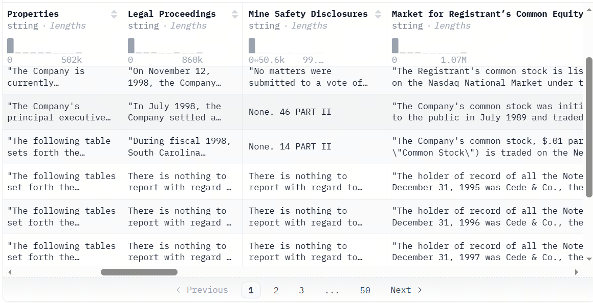
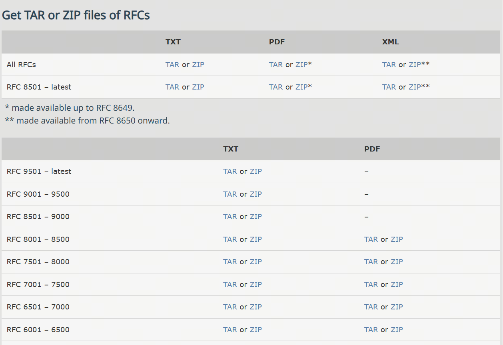
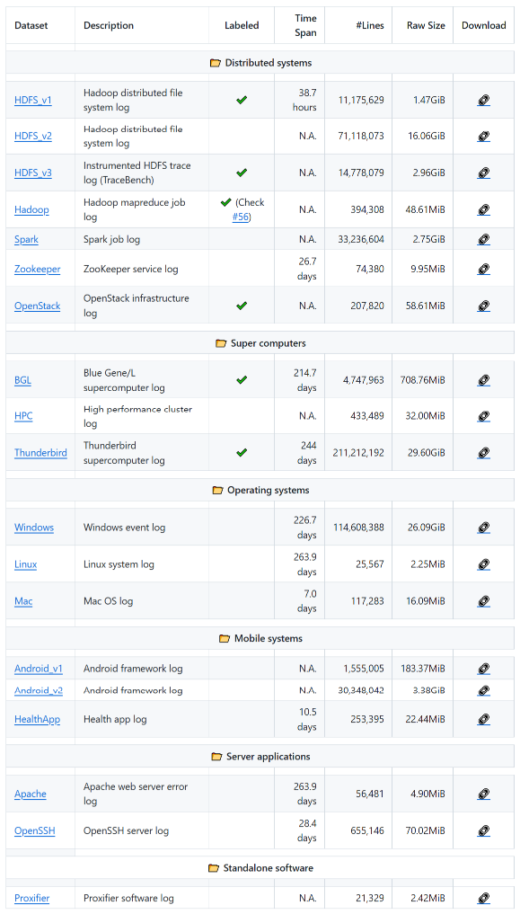
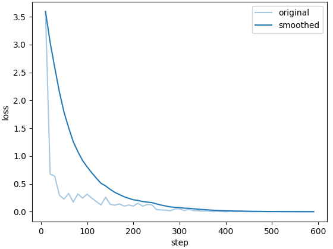
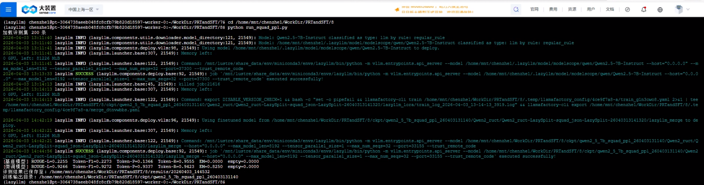

# 第21课时：长上下文能力增强

想象一下，你把一份几十页的文档丢给模型，它却像赶时间一样只看了前两段就开始作答。本课时就来解决这个“读得多、找不准”的经典问题：我们会一起拆解**如何构建长文本数据**、**如何合成“针扎大海”类训练样本**、以及**如何在模型与系统层面提升长上下文处理能力并完成评测**。整节内容从理论一路走到工程实操，读完就能直接接入后续实验脚本开跑。

---

## 1. 长上下文问题与能力边界

在日常使用中，人们往往习惯用几句话、一个段落来与模型交互。但一旦进入真实业务场景，文本的考虑单位就不再是“一句话”，而是整篇文档，甚至是一组彼此关联的文档。所谓**长上下文问题**，正是指模型在面对这类超出常规输入规模的文本时，是否还能保持稳定理解与准确推理的能力。

从技术角度看，长上下文通常有两种不同的衡量方式。一种是 **token 级长度**，即模型在一次前向计算中需要处理的 token 数量。当输入从几百 token 扩展到几千、上万甚至更高时，模型在计算和表示上的压力会快速上升；对于标准自注意力而言，其主要计算与显存开销通常近似呈二次增长。另一种是 **文档级长度**，强调的是语义连续性和结构复杂度。即便 token 数量不极端，一份包含多章节、多主题、多层引用关系的文档，同样会对模型的理解能力提出更高要求。

与短上下文任务相比，长上下文问题的差异并不只体现在“文本更长”。在短文本场景中，关键信息往往集中，推理路径相对直接，模型即使出现轻微偏差，也不容易被放大。而在长文本中，信息呈现出明显的稀疏性：大量内容只是背景、铺垫或干扰，真正有价值的线索可能只占极小比例。这意味着模型需要具备更强的筛选能力，而不仅是表面上的语言流畅度。更重要的是，长上下文任务通常隐含着时间或位置依赖关系。前文中的某个定义，可能在几十页之后才再次被引用；一条关键结论，可能需要结合多个分散段落才能完整还原。如果模型无法正确理解这些跨距离关系，即使“读完了全文”，输出结果依然可能南辕北辙。

围绕这些特性，长上下文建模面临着几类典型挑战。

最常被提及的一点，是**位置信息的外推失效**。许多模型在训练阶段只接触过有限长度的文本，一旦输入长度超出训练分布，位置编码的表达能力就会迅速下降。模型可能仍然生成看似合理的文本，但对“信息出现在什么位置”这一问题的判断已经不再可靠，跨段落引用错误也随之增多。

另一个常见问题是**注意力稀释**。自注意力机制在理论上可以关注任意位置，但当序列长度不断增加时，注意力分配会变得越来越分散。模型很容易被局部上下文牵引，反复围绕近期内容展开，而忽略更早出现却至关重要的信息。这种现象在“查找某一具体事实”或“定位隐藏线索”的任务中尤为明显。

紧随其后的，是**关键信息遗忘**的问题。即便模型在早期读到了正确内容，也未必能在生成阶段将其有效保留下来。长文本中信息密度不均、主题频繁切换，很容易打断模型的内部表示，使得早期线索逐渐被后续内容覆盖。这种遗忘并非简单的记忆不足，而是表示竞争的结果。

正因为这些挑战的存在，长上下文问题并不能通过“增大输入长度”一劳永逸地解决。它要求在数据构造、模型结构、训练策略和评测方式等多个层面进行系统性的设计。本节的目的，就是为后续方法与实践提供一个清晰的背景：当文本变得足够长时，模型究竟是在与哪些困难正面交锋。

---

## 2. 长文本数据构建：来源、组织与质量控制

### 2.1 典型长文本来源

长上下文能力并不是凭空训练出来的，它高度依赖于模型在预训练或微调阶段所接触到的真实长文本数据。从来源上看，这类数据往往具有篇幅长、结构复杂、信息分布不均的共同特征，同时在语言风格和逻辑组织上也与日常对话存在明显差异。

下面从几类最具代表性的文本来源出发，梳理长文本数据在实践中的主要形态，以及业界常用的开源数据资源。

**书籍与章节级文本**

这是最早被用于长上下文建模的一类数据。与新闻或百科条目相比，书籍文本天然包含跨章节的长期依赖：人物关系、核心概念和叙事线索往往在数万字范围内逐步展开。模型若想真正“读懂”一本书，必须具备持续追踪语义状态的能力。
常见的开源来源包括：

- [Project Gutenberg](https://huggingface.co/datasets/common-pile/project_gutenberg)：该数据集收录了超过 70,000 本英文公共领域书籍（可免费使用），提供大量英文公共版权书籍，格式规范、文本干净，适合直接用于长上下文预训练或合成数据构造。
- [BookCorpusOpen (via Hugging Face)](https://huggingface.co/datasets/rojagtap/bookcorpus)：这是原始经典 BookCorpus 的开放版本，包含约 7,000 本英文小说文本（平均每个样本较长、跨章节）。BookCorpus 最早在 2015 年被引入，用于语言建模任务，可捕捉故事线索与全局上下文依赖。虽然原始 BookCorpus 的授权与分发存在争议，但 bookcorpusopen 则是经过整理的公开版本，适合研究与实验。数据结构如下：

```json
{
  "text": "i wish i had a better answer to that question ....."
}
```

- [PG-19 (via Hugging Face)](https://huggingface.co/datasets/emozilla/pg19)：
一个经典的书籍级长文本基准数据集，从 Project Gutenberg 图书馆提取了大量英文书籍，这些书籍发布于 1919 年之前，因此属于公共领域。该数据集的平均文档长度远超传统语料，可以作为训练模型处理整本书或章节级上下文的评估集。数据切分为 `train/validation/test`，同时包含元数据如标题和出版年份。数据结构如下：

```json
{
  "short_book_title": "The Bible Both Testaments King James Version",
  "publication_date": 1611,
  "url": "http://www.gutenberg.org/ebooks/10",
  "text": "\n\n\n\n\n\n\n\n\n\n\n\n\n\nThe Old Testament of the King James Version......."
}
```

  - [NarrativeXL](https://github.com/r-seny/narrativexl)：一个面向超长上下文阅读理解的大规模数据集，规模接近百万级（共 990,595 个问题），在同类数据集中具有显著优势。其平均文档长度超过 5 万字，远超传统阅读理解任务，对模型的长上下文建模与信息保持能力提出了更高要求。更重要的是，NarrativeXL 中的大多数问题都标注了明确的“保留需求”（retention requirement），用于指示回答问题所必须依赖的长期记忆信息，使该数据集不仅可用于阅读理解训练，也非常适合评估和分析大模型在长期记忆与长距离依赖场景下的表现。

**财报、年报与招股说明书**

金融文本是另一类极具代表性的长文档数据。财报与年报往往由多个章节组成，既包含定量表述（数字、指标），也包含大量解释性文字。关键信息分布分散，表达方式高度非结构化，非常适合用于训练“长文本 + 结构化抽取”能力。常见的开源来源包括：

- [SEC EDGAR](https://www.sec.gov/edgar/search-and-access)：这是美国证券交易委员会（SEC）公开的官方披露系统，几乎涵盖所有美国上市公司的定期财务报告。其中 10-K 为年度报告，篇幅通常在数万到十几万词不等；10-Q 为季度报告，结构与 10-K 相似但篇幅略短。这些文档具有高度固定的章节结构（如 Business, Risk Factors, MD&A, Financial Statements），但具体表述随公司和年份变化明显，非常适合用于训练模型在长文档中定位字段、跨章节整合信息的能力。EDGAR 原始数据以 HTML、TXT 等形式提供，适合做文档解析、结构化抽取与长上下文问答等任务。

- [SEC 10-K/10-Q 年报/季报数据集（非官方整理）](https://www.selectdataset.com/dataset/ab85b9f726ba3fb5f2bd6a1e5bc093d4)：该第三方汇总数据集通过爬虫和 EDGAR 提供的索引构建，将 1993–2024 年的 10-K 年度报告 按年份整理成 Parquet 文件存储格式。每条记录一般包括完整报文文本、年份、唯一标识符和统计信息，非常适合 NLP 和长文本任务使用。可作为真实长文档抽取任务的主训练语料，与结构化 XBRL 数据一并使用。

- [winterForestStump/10-K_sec_filings](https://huggingface.co/datasets/winterForestStump/10-K_sec_filings)：这个数据集收录了 自 1999 年以来约 93,500 份 SEC 10-K 年度报告，内容主要来自美国证券交易委员会（SEC）的 EDGAR 系统。每条记录都包含完整的报文文本及若干财务和披露字段（如公司名称、各部分章节内容等）。这种年报级别的数据本质上是长文档（往往超过几万词），非常适合测试模型在长上下文下的信息定位、跨章节推理与结构化抽取能力。



- [UK Companies House Annual Reports（英国公司年报公开数据）](https://download.companieshouse.gov.uk/en_output.html)：英国 Companies House 向公众开放了公司注册信息与年度财务披露数据，包括 Annual Accounts（年度财务报表） 和 Directors’ Report 等内容。相较于 SEC 报告，这些年报在语言风格和披露重点上更偏向英式财务与合规表达，但同样具备长篇幅、强结构、多章节等特征。原始数据通常以 XML、PDF 或 iXBRL 形式提供，适合用于多格式解析、跨国家财报文本建模，以及训练模型在不同监管体系下处理长上下文财务文档的能力，尤其适合作为 EDGAR 体系之外的补充对照数据集。

**法律条文与判决文书**

法律文本通常篇幅冗长、结构严谨且高度依赖上下文。单份判决往往同时包含案件事实、证据陈述、法律条文引用、历史判例比对以及最终裁决结论。信息分散在多个章节中，逻辑链条跨越全文，非常考验模型在长上下文中的一致性维护、引用定位以及跨段推理能力，是检验大模型长文档理解能力的经典数据类型。常见的开源来源包括：

- [CaseLaw Access Project (CAP)](https://case.law/)：CAP 是由哈佛法学院主导的美国判决文书开放项目，收录了 1600 年至 2018 年间超过 600 万份美国法院判决全文。单篇文书通常包含案件背景、法律争议点、引用判例以及裁决结论，文本结构高度规范但表述差异明显。该数据非常适合用于长上下文法律问答、裁判理由抽取、引用链分析以及跨段落法律推理任务，是研究法律大模型的重要基础语料来源。
- [European Court of Human Rights (ECHR)](https://huggingface.co/datasets/ecthr_cases)：该数据集整理了欧洲人权法院（ECHR）的判决文书全文，每个样本通常包含案件事实、相关法律条款、法院分析过程以及最终裁决。判决篇幅较长，且论证过程高度依赖前文事实与法律依据，常被用于研究 法律推理、长文档问答以及段落级责任判断任务。其结构清晰、逻辑严密，非常适合训练模型在长文本中保持推理一致性。
- [LexGLUE](https://huggingface.co/datasets/lex_glue)：LexGLUE 是一个面向法律 NLP 的综合基准，虽然其中部分任务为中短文本，但其 ECtHR、EUR-LEX 等子集来源于真实判决与法规原文，在实践中常被重新拼接为长文档样本。该数据集强调法律语言的精确性与逻辑约束，非常适合与完整判决文本结合，构造长上下文的法律抽取、分类与推理训练任务。
- [Pile of Law](https://huggingface.co/datasets/pile-of-law/pile-of-law)：Pile of Law 是 The Pile 数据集的法律领域子集扩展，专注于收集和整理高质量的法律文本资源，内容涵盖美国法院判决、联邦与州法规、合同文本以及各类行政与监管文件等多种法律文书类型。该数据集中的样本普遍以长文档级别存在，文本结构严谨、篇幅较长，包含大量跨段落引用与条款依赖关系，对模型的长上下文理解与信息整合能力提出了较高要求。在当前 Hugging Face 可获取的数据集中，Pile of Law 被认为是最接近 CAP（Case-and-Paragraph）风格的法律长文本数据集之一，常用于法律领域的大模型预训练、长文档建模与检索增强研究。

**技术文档与规范说明**

技术规范类文档往往强调前后一致性与术语稳定性，一个概念可能在前文定义，在后文多次引用。这类数据对于训练模型的“定义记忆”和跨章节引用能力非常关键。
常见的开源来源包括：

- [RFC 文档全集](https://www.rfc-editor.org/retrieve/bulk)：RFC 文档是互联网协议和标准的官方技术规范，单篇文档通常包含背景说明、术语定义、协议细节、安全分析与实现建议等多个章节，逻辑结构极为严谨。大量 RFC 文档长度达到数万字，是典型的长上下文技术文本。该数据非常适合用于协议理解、跨章节引用定位、技术问答以及规范一致性检查等任务。



- [arXiv 论文全文](https://huggingface.co/datasets/arxiv_pubmed)：该数据集收录了 arXiv 上的大量学术论文全文，涵盖计算机科学、物理、数学等多个领域。每篇论文通常包含摘要、引言、相关工作、方法、实验与结论等完整结构，篇幅长且信息密集。该数据集广泛用于 长上下文学术问答、章节级信息抽取、方法与结论对齐等任务，是研究模型学术阅读能力的重要语料。
- [S2ORC（Semantic Scholar Open Research Corpus）](https://huggingface.co/datasets/allenai/s2orc)：S2ORC 是由 AllenAI 发布的大规模学术论文语料库，包含数百万篇论文的全文与结构化元数据。论文被拆分为章节、段落和句子，同时保留原始结构信息，非常适合构造 超长文档理解、跨章节引用分析以及多段落联合推理任务。该数据集常用于训练具备文档级理解能力的学术型大模型。

**技术日志与系统运行记录**

日志数据通常呈现为时间序列形式，单条日志信息量有限，但长时间窗口下会累积成极长文本。关键异常往往只在某个时间点短暂出现，非常接近 Needle in a Haystack 的真实场景。
常见的开源来源包括：

- [LogHub](https://github.com/logpai/loghub)：LogHub 汇总了来自分布式系统、数据库、操作系统等多个真实环境的日志数据，覆盖 HDFS、Spark、Zookeeper 等典型系统。日志文件往往包含数十万到上百万行记录，时间跨度长、事件类型复杂。该数据集常用于异常检测、根因分析以及长序列上下文建模，是系统日志领域的经典开源资源。



- [HDFS Log Dataset](https://huggingface.co/datasets/logpai/hdfs)：这是一个经典的分布式文件系统日志数据集，记录了 Hadoop HDFS 在真实运行过程中的日志信息。单个样本通常对应长时间运行产生的日志序列，包含大量正常与异常事件。该数据集广泛用于 长序列异常检测、日志模式学习以及上下文关联分析，非常适合构造长上下文理解与事件定位任务。
- [BGL（Blue Gene/L）](https://huggingface.co/datasets/logpai/bgl)：BGL 数据集来源于 IBM Blue Gene/L 超级计算机的真实运行日志，覆盖数月的系统运行记录。日志规模巨大，异常事件稀疏且分布不均，是典型的高噪声长上下文数据。该数据集常用于研究模型在超长文本中发现稀有事件、保持时间一致性以及进行复杂状态推理的能力。

从这些数据可以看出，**长文本并不是单一形态的问题**。叙事型文本、制度性文本、技术文档和日志记录，各自考验模型的不同能力侧面。在实践中，往往需要混合多种长文本来源，才能让模型形成稳定、通用的长上下文理解能力。这些数据来源虽然领域各异，但都共享一个特点：**真正重要的信息往往并不显眼**。它们或被掩埋在大量背景描述中，或依赖跨段落、跨章节的关联才能被完整理解。正因如此，长文本数据不仅是“更长的文本”，而是对模型理解深度、记忆能力和信息筛选能力的综合考验。后续在构造训练数据和评测任务时，正是围绕这些真实文本形态，才能更准确地判断模型是否具备可靠的长上下文能力。

### 2.2 长文本数据组织策略

仅有数据来源还不够，组织方式直接影响训练有效性。常见策略包括：

- 章节级切分后重组，保留跨段依赖。
- 关键段与干扰段混排，显式提高检索难度。
- 保留位置、章节、长度、难度等元信息，支持后续误差分析。

可用信息密度指标描述关键线索稀疏程度：

$$
\text{Information Density} = \frac{\text{Key Tokens}}{\text{Total Tokens}}
$$

变量说明：

- $\text{Key Tokens}$：任务真正依赖的关键信息 token 数。
- $\text{Total Tokens}$：输入总 token 数。

当该比例很低时，模型需要更强的检索与抑噪能力。

### 2.3 数据质量控制要点

长数据构建建议至少做三类质量控制：

1. **字段有效性**：非空且可解析。
2. **去重控制**：避免数据重复采样引入过拟合。
3. **可回答性检查**：答案应可由上下文直接推断，降低监督噪声。

这些规则直接决定微调是在“学习能力”还是“学习噪声”。

---

## 3. 合成长数据：Needle In A Haystack 与自动化构造

### 3.1 “大海捞针”问题本质

Needle In A Haystack 的核心不是“长”，而是**信息极度不均匀**：大量文本是背景，决定答案的关键线索（needle）很少、且位置不固定。

标准评测流程通常是：

1. 准备长背景文本。
2. 在某个位置插入可验证关键事实。
3. 提一个只能依赖该事实回答的问题。

命中率可定义为：

$$
\text{HitRate} = \frac{N_{\text{correct}}}{N_{\text{total}}}
$$

变量说明：

- $N_{\text{correct}}$：正确命中 needle 的样本数。
- $N_{\text{total}}$：测试样本总数。

这类测试的价值在于，它能快速暴露模型是否真正“读到并保留了远程关键信息”。

### 3.2 合成数据构造方法

合成长数据的关键步骤包括：

- **needle 注入**：插入唯一可验证事实。
- **位置打散**：关键事实随机放在前/中/后位置。
- **干扰增强**：加入语义相近但事实不同的伪线索。
- **问题模板化生成**：自动批量构造问答样本。

可用如下密度公式近似描述任务难度：

$$
\text{Information Density} = \frac{\text{Needle Tokens}}{\text{Total Tokens}} \ll 1
$$

公式含义：该指标衡量长文档中“真正有用信息”的占比，值越小表示干扰越强、检索难度越高。

变量说明：

- $\text{Needle Tokens}$：关键事实（needle）对应的 token 数。
- $\text{Total Tokens}$：整段输入文本的 token 总数。

下面给出简化伪代码：

```python
import random


def inject_needle(background_paragraphs, needle_sentence):
    idx = random.randint(0, len(background_paragraphs))
    return (
        background_paragraphs[:idx]
        + [needle_sentence]
        + background_paragraphs[idx:]
    )


def generate_question(needle):
    if '分钟' in needle:
        return '该文档中提到的最长一次中断持续了多长时间？'
    return '文档中记录的关键事件是什么？'
```

### 3.3 样本格式与可分析性

推荐在样本中保留可分析元信息（needle 位置、文档长度、难度），便于按位置分桶评测。典型格式：

```json
{
  "id": "longctx_00123",
  "instruction": "请根据以下文档回答问题，仅使用文档中的信息。",
  "input": "<LONG_DOCUMENT_TEXT>",
  "question": "该系统历史上最长的一次服务中断持续了多久？",
  "answer": "47 分钟",
  "meta": {
    "needle_position": "near_end",
    "document_length": 14832,
    "difficulty": "medium"
  }
}
```

这种结构有两个直接收益：一是可追踪位置敏感性，二是可按难度做误差归因，避免只看总体平均分。

---

## 4. 长上下文建模与评测方法

### 4.1 长窗口建模：RoPE 扩展与训练策略

长上下文建模的关键瓶颈之一是位置编码。以 RoPE 为例，其核心思想是对 $Q, K$ 施加与位置相关的旋转变换：

$$
\text{RoPE}(q_i) = q_i R(i), \quad \text{RoPE}(k_j) = k_j R(j)
$$

变量说明：

- $q_i, k_j$：第 $i/j$ 个位置的 Query/Key 向量。
- $R(i)$：由位置 $i$ 决定的旋转矩阵。

当推理长度超出训练分布时，常见扩展路线包括：

- **Linear Scaling**：等比例压缩位置索引，实现简单但远距区分度下降。
- **NTK Scaling**：按频率维度做更细粒度缩放，长距稳定性更好但调参敏感。
- **YaRN**：分段缩放并平滑过渡，兼顾短文本能力和超长可用性。

训练层面通常建议“继续预训练 + 指令微调”或高质量长样本 SFT，并用长短样本混合采样，避免模型只偏向某一长度分布。

### 4.2 长序列计算代价与 KV Cache

标准自注意力为：

$$
\text{Attention}(Q, K, V) = \text{softmax}\left(\frac{QK^\top}{\sqrt{d_k}}\right)V
$$

公式含义：先计算 Query 与 Key 的相关性分数，再经 softmax 归一化得到注意力权重，最后对 Value 做加权求和，得到当前位置的上下文表示。

变量说明：

- $Q$：Query 矩阵，表示当前位置要“检索什么”。
- $K$：Key 矩阵，表示各位置可被匹配的特征。
- $V$：Value 矩阵，表示各位置可被聚合的内容。
- $d_k$：单头 Key 向量维度，用于缩放分数防止数值过大。

其中 $QK^\top \in \mathbb{R}^{N \times N}$，因此计算与显存随序列长度呈二次增长：

$$
\text{Complexity} = O(N^2 \cdot d)
$$

变量说明：

- $N$：序列长度。
- $d$：隐藏维度。
- $d_k$：单头维度。

训练阶段还需保存中间激活用于反向传播，显存压力会进一步放大。推理阶段可通过 KV Cache 避免反复重算历史 token 的 $K, V$，即在第 $t$ 步只计算当前 Query 与历史缓存交互：

$$
\text{Attention}(Q_t, K_{1:t}, V_{1:t})
$$

公式含义：在第 $t$ 个生成步，只用当前 token 的 Query 与历史累计的 Key/Value 交互，从而减少重复计算。

变量说明：

- $Q_t$：第 $t$ 步当前 token 的 Query。
- $K_{1:t}$：从第 1 到第 $t$ 个位置的 Key 缓存。
- $V_{1:t}$：从第 1 到第 $t$ 个位置的 Value 缓存。

这能显著降低重复计算，是长文本推理落地的关键工程优化。

### 4.3 显存友好注意力：分块、Flash 与 Ring Attention

上一节的复杂度分析针对**数学形式**；工程上还要解决**单卡显存带宽与容量**以及**多卡如何切分长序列**的问题。下列方法与 RoPE 外推、数据构造等正交，常组合使用。

**FlashAttention（及 FlashAttention-2 等分块实现）**  
将注意力按块（tile）在 GPU 片上存储中完成 softmax 与加权，尽量减少对高带宽显存（HBM）的反复读写。其**输出与标准注意力一致**（在数值误差范围内），但能在相同硬件上支撑**更长的有效序列**或更大 batch，是大模型训练与推理中的事实标准组件之一。

**Ring Attention（环形注意力）**  
面向**极长序列训练**：将 $Q,K,V$ 在**序列维**上切分到多张 GPU，各卡只常驻本段的 $Q$ 与对应的 $K,V$ 子块；通过**环形通信**依次把各段的 $K,V$ 绕环传递，使每张卡在本地完成分块注意力并累加贡献，从而在**不显式构造完整 $N\times N$ 分数矩阵驻留单卡**的前提下完成全局注意力。常与上述分块/Flash 思路结合，用于**序列并行**场景（与 Tensor Parallel、Pipeline Parallel 解决的是不同维度）。同类思路还包括按块切分的分布式注意力变体，具体实现因框架而异。

**其他常见补充（仅列名目）**  
- **稀疏或局部注意力**（滑动窗口、稀释全局 token 等）：以结构先验换复杂度，适合特定架构。  
- **推理侧 KV 管理**（如分页式 KV Cache）：在**不改动注意力公式**的前提下提高显存利用率与吞吐，与 Ring Attention 面向的「训练期跨卡切序列」问题相邻但侧重不同。

理解这些层次有助于阅读开源训练栈：RoPE/数据决定「模型敢看多长」，Flash/Ring 等决定「在既定长度下**能不能在现有集群上跑得动**」。

### 4.4 长窗口训练技巧与评测体系

长窗口模型并不意味着只喂超长样本。实践中常采用短/中/长样本混合训练，兼顾短文本流畅性与长距离推理稳定性。

同时，可通过位置打散或位置加权损失缓解“前文偏置”：

$$
\mathcal{L} = \sum_{t=1}^{T} w_t \cdot \ell_t, \quad
w_t = 1 + \lambda \cdot \frac{t}{T}
$$

公式含义：通过给不同位置的 token 损失分配不同权重，让模型在训练时更关注后半段信息，缓解“只盯前文”的偏置。

变量说明：

- $\ell_t$：第 $t$ 个 token 的单步损失。
- $w_t$：位置相关权重。
- $\lambda$：权重增长系数。
- $T$：序列长度。

评测建议至少覆盖三类：

1. **Needle 命中测试**：定位与检索能力。
2. **Long QA**：跨段整合与一致性推理能力。
3. **位置稳定性测试**：同问题在不同位置下的性能波动。

位置稳定性可用方差衡量：

$$
\text{Var}(S) = \frac{1}{n}\sum_{i=1}^{n}(s_i-\bar{s})^2
$$

公式含义：衡量同一任务在不同信息位置下的得分波动，方差越小表示模型越稳定、位置鲁棒性越好。

变量说明：

- $s_i$：needle 位于第 $i$ 个位置时的得分。
- $\bar{s}$：各位置得分均值。
- $n$：位置采样数。

方差越小，说明模型对位置信息越鲁棒。实际系统里，稳定性通常比单点高分更关键。

### 4.5 长上下文能力的现实边界

长上下文并不是“窗口越大越好”，而是“任务需要多长、系统愿意付出多少成本”的平衡。现实边界主要来自三点：

1. **资源成本非线性增长**：长序列会显著放大显存、训练时长与实验成本。
2. **有效信息密度下降**：长度增加不等于有效信息同步增加，收益可能递减。
3. **外推稳定性风险**：超出训练分布后，位置表示与注意力行为可能退化。

因此，成熟系统通常采用“有限但高效的记忆”策略：合理窗口上限 + 上下文组织策略 + 信息选择机制，而不是盲目堆长度。

---

## 5. LazyLLM 实战与评测：SQuAD 2.0 长上下文 Pipeline

这一章是整节课最“能跑起来”的部分。前面我们讨论了长上下文为什么难、数据怎么构造、评测怎么做；这里把这些理论真正落在一个可复现实验上：[`./code/run_squad_ppl.py`](./code/run_squad_ppl.py)。你可以把它理解为一条完整的工程链路，从短文本出发，经过可控扩写与长上下文重组，最后进入 LoRA-SFT 微调与对比评测。

### 5.1 任务目标

本实验以 SQuAD 2.0 为基础数据源，构建“短上下文 QA -> 长上下文 QA -> SFT 微调”的完整链路。核心思路不是直接在原始短 context 上微调，而是先通过 LazyLLM 的 `build_long_context_pipeline` 完成上下文扩写与重组，再在长上下文样本上做 LoRA-SFT，从而提升模型在长文本问答场景中的信息定位与整合能力。

### 5.2 数据集简介

#### 5.2.1 数据来源与任务性质

- 数据集：[SQuAD 2.0](https://huggingface.co/datasets/rajpurkar/squad_v2)（脚本优先加载 `squad_v2`，失败回退 `rajpurkar/squad_v2`）。
- 原始特点：单条样本上下文较短，属于经典短文本阅读理解任务。
- 本实验定位：通过 pipeline 人工构造长上下文训练样本，使训练目标与长上下文应用场景对齐。

#### 5.2.2 数据规模与关键配置

| 项目 | 数值 |
|---|---|
| 原始采样上限 | SOURCE_LOAD_LIMIT = 4000 |
| 训练样本数 | TRAIN_SAMPLES = 3000 |
| 评测样本数 | EVAL_SAMPLES = 200 |
| 训练窗口 | TRAIN_CONTEXT_WINDOW = 8192 |
| pipeline 扩写模型 | qwen2.5-32b-instruct |

#### 5.2.3 数据中间文件

| 文件 | 含义 |
|---|---|
| `data/squad_raw.jsonl` | 进入 pipeline 前的原始样本（去重 + 过滤后） |
| `data/squad_ppl_long.jsonl` | pipeline 产出的长上下文样本 |
| `data/squad_ppl_train.json` | SFT 训练集（Alpaca 格式） |
| `data/squad_ppl_eval.jsonl` | 评测集（保留多参考答案字段） |

### 5.3 数据结构与字段说明

#### 5.3.1 原始样本（`squad_raw.jsonl`）

```json
{
  "context": "Beyoncé Giselle Knowles-Carter (/biːˈjɒnseɪ/ bee-YON-say) (born September 4, 1981) is an American singer, songwriter, record producer and actress. Born and raised in Houston, Texas, she performed in various singing and dancing competitions as a child, and rose to fame in the late 1990s as lead singer of R&B girl-group Destiny's Child. Managed by her father, Mathew Knowles, the group became one of the world's best-selling girl groups of all time. Their hiatus saw the release of Beyoncé's debut album, Dangerously in Love (2003), which established her as a solo artist worldwide, earned five Grammy Awards and featured the Billboard Hot 100 number-one singles \"Crazy in Love\" and \"Baby Boy\".",
  "question": "When did Beyonce start becoming popular?",
  "answer": "in the late 1990s",
  "gold_answers": [
    "in the late 1990s"
  ]
}
```

- `context`：原始短上下文段落。
- `question`：问题。
- `answer`：主监督答案（首答案）。
- `gold_answers`：多参考答案集合，用于评测时“取最优分”。

#### 5.3.2 长上下文样本（`squad_ppl_long.jsonl`）

```json
{
  "context": "LeToya Luckett and Roberson became unhappy with Mathew's managing of the band and eventually were replaced by Farrah Franklin and Michelle Williams. Beyoncé experienced depression following the split with Luckett and Roberson after being publicly blamed by the media, critics, and blogs for its cause. Her long-standing boyfriend left her at this time. The depression was so severe it lasted for a couple of years, during which she occasionally kept herself in her bedroom for days and refused to eat anything. Beyoncé stated that she struggled to speak about her depression because Destiny's Child had just won their first Grammy Award and she feared no one would take her seriously. Beyoncé would later speak of her mother as the person who helped her fight it. Franklin was dismissed, leaving just Beyoncé, Rowland, and Williams.",
  "long_context": "The nickel-hydrogen battery,....（省略）during this period.",
  "question": "What mental health issue did Beyonce go through?",
  "answer": "depression",
  "gold_answers": [
    "depression"
  ]
}
```

- `context`：原有的上下文（即正例段）。
- `long_context`：扩写并拼接后的长文本（含正例段与干扰段）。
- `question` / `answer`：保持与原样本语义一致。
- `gold_answers`：从原始样本回填，保证评测一致性。

#### 5.3.3 训练 / 评测格式

`squad_ppl_train.json`：只保留 `instruction/input/output`，用于训练。

```json
{
  "instruction": "You are a reading comprehension assistant. Read the following document carefully and answer the question based solely on the information provided in the document. Give a concise and accurate answer.",
  "input": "Document:\nSeason three of American Idol ...（省略） did Schwarzenegger hold a special election?",
  "output": "November"
}
```

`squad_ppl_eval.jsonl`：保留 `gold_answers/question`，用于评测与误差分析。

```json
{
  "instruction": "You are a reading comprehension assistant. Read the following document carefully and answer the question based solely on ...（省略） game, its cup successes, and its passionate rivalry with Portsmouth F.C. all contribute to its unique identity and enduring appeal.\n\nQuestion: How many people are admitted to HHC institutions annually?",
  "output": "225,000",
  "gold_answers": [
    "225,000"
  ],
  "question": "How many people are admitted to HHC institutions annually?"
}
```

### 5.4 数据处理流程

#### 5.4.1 流程概览

1. 从 SQuAD 2.0 读取样本。
2. 过滤空字段、按 `context` 去重、取前 4000 条并落盘。
3. 用 32B 模型做 context 扩写，再重组为长上下文。
4. 映射为 SFT 格式，随机打散后取前 3000 条作为训练候选，再从其中抽样 200 条作评测。

这条链路的关键是：先把样本难度从“短文本定位”提升到“长文本检索 + 理解”，再进行微调。

#### 5.4.2 核心函数 1：原始样本过滤与去重

```python
def _context_dedup_key(context: str) -> str:
    return re.sub(r'\s+', ' ', context.strip())


def _load_squad_raw(limit: int) -> List[Dict]:
    records, seen_ctx = [], set()
    for item in dataset:
        if len(records) >= limit:
            break
        answers = item.get('answers', {})
        answer_texts = answers.get('text', []) if isinstance(answers, dict) else []
        if not answer_texts:
            continue
        rec = {
            'context': item['context'].strip(),
            'question': item['question'].strip(),
            'answer': answer_texts[0].strip(),
            'gold_answers': [a.strip() for a in answer_texts if a.strip()],
        }
        if not rec['context'] or not rec['question'] or not rec['answer']:
            continue
        key = _context_dedup_key(rec['context'])
        if key in seen_ctx:
            continue
        seen_ctx.add(key)
        records.append(rec)
```

这一步保证 pipeline 输入“有效且不重复”，避免同一 `context` 重复扩写造成样本冗余和训练偏置。

#### 5.4.3 核心函数 2：pipeline 调用

```python
ppl = build_long_context_pipeline(
    llm=llm,
    context_key='context',
    question_key='question',
    answer_key='answer',
    expanded_key='expanded_context',
    long_context_key='long_context',
    expansion_prompt=PPL_EXPANSION_PROMPT,
    num_distractors=3,
    passage_sep='\n\n',
    seed=42,
)
results = ppl(records)
```

这里使用了 LazyLLM 中的 `build_long_context_pipeline`，通过显式传入 `expansion_prompt` 约束扩写质量和目标长度（700-1100 词），减少“幻觉扩写”对训练信号的污染。

#### 5.4.4 核心函数 3：SFT 映射与数据划分

```python
def _to_sft(rec: Dict) -> Optional[Dict]:
    long_ctx = rec.get('long_context', '').strip()
    question = rec.get('question', '').strip()
    answer = rec.get('answer', '').strip()
    if not long_ctx or not question or not answer:
        return None
    context_block = CONTEXT_TEMPLATE.format(context=long_ctx, question=question)
    return {
        'instruction': INSTRUCTION,
        'input': context_block,
        'output': answer,
        'gold_answers': rec.get('gold_answers', [answer]),
        'question': question,
    }
```

`_to_sft` 负责统一训练输入模板；后续固定随机种子做打散与抽样，使当前脚本的数据处理流程可复现。

#### 5.4.5 核心函数 4：数据准备主流程编排

```python
def prepare_dataset():
    os.makedirs(DATA_DIR, exist_ok=True)
    if os.path.exists(TRAIN_JSON_PATH) and os.path.exists(EVAL_JSONL_PATH):
        print('训练集与评测集已存在，跳过生成')
        return

    if os.path.exists(PPL_JSONL_PATH):
        print(f'长上下文数据已存在，直接加载: {PPL_JSONL_PATH}')
        records = _load_ppl_records()
    else:
        raw = _load_squad_raw(SOURCE_LOAD_LIMIT)
        if not raw:
            print('无有效原始数据，退出')
            return
        records = _run_long_context_pipeline(raw)

    if not records:
        print('无有效长上下文记录，退出')
        return

    rows = [_to_sft(r) for r in records]
    rows = [r for r in rows if r is not None]
    random.seed(42)
    random.shuffle(rows)

    train_list = rows[:TRAIN_SAMPLES]
    eval_indices = random.sample(
        range(len(train_list)), min(EVAL_SAMPLES, len(train_list))
    )
    eval_list = [train_list[i] for i in sorted(eval_indices)]
```

这段代码把“是否重复处理数据”的工程细节明确落地：优先复用已落盘数据，只有缺文件时才重新跑 pipeline；随后统一做 SFT 映射、随机打散与固定随机种子抽样，保证流程可复现。

### 5.5 模型训练

- 基座：Qwen2.5-7B-Instruct
- 方式：LLaMA-Factory + LoRA-SFT
- 上下文窗口：8192

关键训练代码：

```python
model.finetune_method((finetune.llamafactory, {
    'stage': 'sft',
    'finetuning_type': 'lora',
    'lora_rank': 16,
    'lora_alpha': 32,
    'learning_rate': 1e-4,
    'cutoff_len': TRAIN_CONTEXT_WINDOW,
    'val_size': 0.05,
    'per_device_train_batch_size': 1,
    'gradient_accumulation_steps': 8,
    'num_train_epochs': 5,
    'lr_scheduler_type': 'cosine',
    'warmup_ratio': 0.1,
    'save_steps': 50,
    'logging_steps': 10,
    'save_strategy': 'steps',
    'save_total_limit': 5,
    'launcher': launchers.empty(ngpus=1),
}))
```

参数说明：

- `stage='sft'`：采用监督微调阶段，目标是学习“长上下文 + 问题 -> 答案”的映射。
- `finetuning_type='lora'`：参数高效微调，仅训练低秩适配层，降低显存与训练成本。
- `lora_rank=16`：LoRA 低秩矩阵维度，控制可学习容量；数值越大容量越高、开销也更高。
- `lora_alpha=32`：LoRA 缩放系数，配合 rank 调整更新强度。
- `learning_rate=1e-4`：优化步长；较高学习率更快但不稳，该值兼顾收敛速度与稳定性。
- `cutoff_len=8192`：单样本最大输入长度（token），与本实验长上下文目标对齐。
- `val_size=0.05`：从训练数据划出 5% 作为验证集，用于监控训练趋势与泛化风险。
- `per_device_train_batch_size=1`：每张卡每步处理 1 条样本，适配 8k 输入下的显存约束。
- `gradient_accumulation_steps=8`：梯度累积 8 步形成等效更大 batch，稳定优化过程。
- `num_train_epochs=5`：训练轮次，控制对数据的学习充分度与过拟合风险平衡。
- `lr_scheduler_type='cosine'`：余弦学习率衰减，前期探索、后期平滑收敛。
- `warmup_ratio=0.1`：前 10% 步数做学习率预热，减少训练初期震荡。
- `save_steps=50`：每 50 步保存一次 checkpoint，便于回溯与中断恢复。
- `logging_steps=10`：每 10 步记录一次日志，便于观察 loss 变化。
- `save_strategy='steps'`：按训练步数而不是 epoch 保存模型。
- `save_total_limit=5`：最多保留 5 个 checkpoint，控制磁盘占用。
- `launcher=launchers.empty(ngpus=1)`：单卡训练启动方式，明确资源配置与执行入口。

训练中的 Loss 曲线如下：



这一训练段与前面数据流程是串联的：输入使用长上下文 SFT 数据，输出是 LoRA checkpoint，随后进入当前脚本定义的 eval 集上做对照验证。

### 5.6 效果评测

评测在同一 eval 集上比较“基座 vs 微调”，并在多参考答案上取最优分。

核心函数：多参考最优聚合。

```python
def _compute_metrics(samples: List[Dict], preds: List[str]) -> Dict[str, float]:
    n = len(samples)
    total_rl = total_tf1 = total_tp = total_tr = total_em = 0.0
    empty_count = 0
    for i, sample in enumerate(samples):
        pred = preds[i] if i < len(preds) else ''
        if not pred or not pred.strip():
            empty_count += 1
            continue
        gold_answers = sample.get('gold_answers') or [sample.get('output', '')]
        rl, tp, tr, tf1, em = _best_scores(pred, gold_answers)
        total_rl += rl
        total_tf1 += tf1
        total_tp += tp
        total_tr += tr
        total_em += em
    return {
        'rouge_l': total_rl / n,
        'token_f1': total_tf1 / n,
        'token_precision': total_tp / n,
        'token_recall': total_tr / n,
        'exact_match': total_em / n,
        'empty_pred_rate': empty_count / n,
        'num_samples': n,
    }
```

先对每条样本在 `gold_answers` 上取最优，再做全局平均，更符合生成式 QA 的多参考评测惯例。

假设第 $i$ 条样本预测为 $\hat{y}_i$，参考答案集合为 $\mathcal{G}_i$，样本数为 $N$。设 `norm(·)` 表示归一化文本，`tok(·)` 表示 token 序列。

（1）ROUGE-L

$$
\text{ROUGE-L}=\frac{1}{N}\sum_{i=1}^N \max_{y\in\mathcal{G}_i} F_{LCS}(\hat{y}_i,y)
$$

变量说明：

- $N$：评测样本总数。
- $\hat{y}_i$：第 $i$ 条样本的模型预测答案。
- $\mathcal{G}_i$：第 $i$ 条样本的参考答案集合（多参考）。
- $y$：$\mathcal{G}_i$ 中的某一个参考答案。
- $F_{LCS}(\hat{y}_i,y)$：基于最长公共子序列计算得到的 F1 分数。

公式含义：对每条样本，先在多参考答案中取与预测文本最长公共子序列（LCS）F1 的最优值，再在全体样本上求平均，反映生成答案与参考答案的序列级重合程度。

（2）Token Precision / Recall / F1

$$
\text{Token-F1}=\frac{1}{N}\sum_{i=1}^N F1_i,\quad \text{Token-P}=\frac{1}{N}\sum_{i=1}^N P_i,\quad \text{Token-R}=\frac{1}{N}\sum_{i=1}^N R_i
$$

变量说明：

- $P_i$：第 $i$ 条样本的 token Precision。
- $R_i$：第 $i$ 条样本的 token Recall。
- $F1_i$：第 $i$ 条样本的 token F1。
- $N$：评测样本总数。

公式含义：在 token 粒度比较预测与参考答案的重叠程度，其中 Precision 看“预测有多少是对的”，Recall 看“参考有多少被找回”，F1 综合两者。

（3）Exact Match（EM）

$$
EM_i =
\begin{cases}
1, & \exists y\in\mathcal{G}_i,\ \text{norm}(\hat{y}_i)=\text{norm}(y) \\
0, & \text{otherwise}
\end{cases}
$$

变量说明：

- $EM_i$：第 $i$ 条样本的严格匹配结果。
- $\hat{y}_i$：第 $i$ 条样本的预测答案。
- $\mathcal{G}_i$：第 $i$ 条样本参考答案集合。
- $\text{norm}(\cdot)$：文本归一化函数（如大小写、标点和多空白处理）。

公式含义：如果预测答案与任一参考答案在归一化后完全一致，则该样本记为 1，否则记为 0；它衡量严格匹配能力。

（4）Empty Prediction Rate

$$
\text{EmptyRate}=\frac{1}{N}\sum_{i=1}^N \mathbf{1}\left[\hat{y}_i=\varnothing\right]
$$

变量说明：

- $N$：评测样本总数。
- $\hat{y}_i$：第 $i$ 条样本预测答案。
- $\varnothing$：空输出。
- $\mathbf{1}[\cdot]$：示性函数，条件为真取 1，否则取 0。

公式含义：统计模型输出空答案的比例，反映模型在当前任务设置下的可用性与稳定性。

下面给出评测指标计算的核心代码。这段代码对应“多参考取最优 + 全局平均”的实现逻辑：

```python
def _best_scores(
    pred: str,
    gold_answers: List[str],
) -> Tuple[float, float, float, float, float]:
    best_rl = best_tf1 = best_em = 0.0
    best_tp = best_tr = 0.0
    for gold in gold_answers:
        rl = _rouge_l_f1(pred, gold)
        tp, tr, tf1 = _token_f1_triplet(pred, gold)
        em = 1.0 if _normalize(pred) == _normalize(gold) else 0.0
        if rl > best_rl:
            best_rl = rl
        if tf1 > best_tf1:
            best_tf1 = tf1
            best_tp = tp
            best_tr = tr
        if em > best_em:
            best_em = em
    return best_rl, best_tp, best_tr, best_tf1, best_em


def _compute_metrics(
    samples: List[Dict],
    preds: List[str],
) -> Dict[str, float]:
    n = len(samples)
    total_rl = total_tf1 = total_tp = total_tr = total_em = 0.0
    empty_count = 0
    for i, sample in enumerate(samples):
        pred = preds[i] if i < len(preds) else ''
        if not pred or not pred.strip():
            empty_count += 1
            continue
        gold_answers = sample.get('gold_answers') or [sample.get('output', '')]
        rl, tp, tr, tf1, em = _best_scores(pred, gold_answers)
        total_rl += rl
        total_tf1 += tf1
        total_tp += tp
        total_tr += tr
        total_em += em
    return {
        'rouge_l': total_rl / n,
        'token_f1': total_tf1 / n,
        'token_precision': total_tp / n,
        'token_recall': total_tr / n,
        'exact_match': total_em / n,
        'empty_pred_rate': empty_count / n,
        'num_samples': n,
    }
```

这段实现可以分成两层：第一层是 `_best_scores`，对每条样本在 `gold_answers` 上逐个打分并取最优；第二层是 `_compute_metrics`，把每条样本的最优分做全局平均，最终得到 ROUGE-L、Token-P/R/F1、EM 和 EmptyRate。

### 5.7 实验结果

运行截图如下：



运行的结果文件会自动保存在 `results/{timestamp}/eval_squad_ppl_metrics.json` 中。

| 模型 | ROUGE-L | Token-F1 | Token-P | Token-R | EM | Empty |
|---|---:|---:|---:|---:|---:|---:|
| 基座模型 | 0.2255 | 0.2273 | 0.1366 | 0.9555 | 0.0000 | 0.0000 |
| 微调模型 | 0.9266 | 0.9272 | 0.9337 | 0.9423 | 0.8250 | 0.0000 |

结果分析：从指标上看，微调模型相对基座仍是整体跃迁：ROUGE-L、Token-F1 与 EM 均大幅提高，说明在「抽取式问答 + 长上下文」设定下，监督微调显著增强了答案定位与表述质量。基座一侧 Token-R 偏高而 Token-P 偏低，往往对应生成片段偏长、与参考答案在 token 上有重叠但冗余较多；微调后 Token-P 与 Token-R 一并提升到约 0.93–0.94，F1 与之匹配，表明输出更紧凑、与标准答案对齐更好。EM 达到 0.825（200 条样本上的平均精确匹配率），说明多数样本可与参考答案完全一致或等价命中。Empty 仍为 0，无空输出，稳定性良好。

需要注意的是，由于当前脚本中的 eval 集来自训练候选集内部，上述结果更适合用于说明流程有效，而不是作为最终泛化能力结论；若后续采用严格互斥切分，分数可能会与当前结果存在明显差异。

---

如果把长上下文训练比作一次“文档寻宝”，那本章已经把藏宝图、工具箱和通关路线都交到你手里了：从数据构造到模型微调，再到指标验证，整条链路已经打通。接下来最值得做的事，就是亲手跑一遍脚本；当你看到模型真的能在长文本里稳稳找到答案时，前面那些看似抽象的概念会突然变得非常具体，甚至有点上瘾。
