# 第23课时：Agent 能力增强指南 (Tools & Planning)

## 1. 绪论：为什么要提升 Agent 能力

随着人工智能技术的演进，我们正处于一个关键的转折点：从单纯的语言建模迈向具备自主行动能力的智能体（Agent）。这一跨越不仅代表了技术能力的提升，更深刻地改变了人机交互的本质。提升 Agent 能力的必要性，根植于对更复杂、更动态任务处理需求的渴望，以及当前模型在面对真实世界交互时所暴露出的局限性。

### 1.1 从 Chatbot 到 Agent 的范式转移

大型语言模型（LLM）的发展正经历着一场深刻的范式转移，即从“被动文本生成者（Chatbot）”向“主动行动代理（Agent）”的进化。

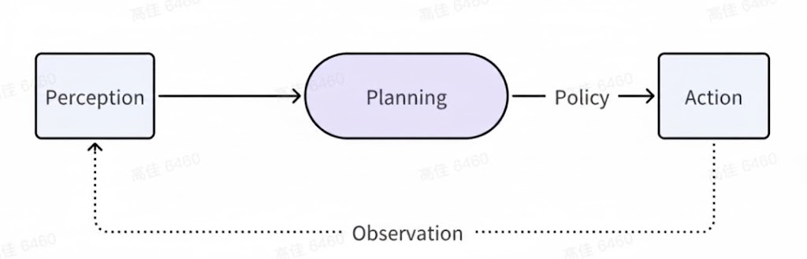

* **能力的跃迁**：传统的 Chatbot 依赖于“下一个词预测”的统计规律，擅长信息检索与文本续写，本质上是对预训练语料库的复述。而 Agent 则要求模型具备**具身认知（Embodied Cognition）**的雏形，即能够感知上下文环境、进行逻辑推理、做出决策并执行动作。这要求模型从封闭的参数世界走向开放的外部环境，具备调用工具（Tool Use）、读取实时数据以及影响物理或数字世界的能力。

* **交互模式的变革**：交互不再局限于“用户提问-模型回答”的单轮或多轮对话，而是演变为“目标设定-自主规划-执行反馈-迭代修正”的闭环过程。Agent 需要在复杂场景下进行长期规划（Long-term Planning），能够分解模糊指令为一系列可执行的原子步骤，并根据环境反馈动态调整策略。这种能力的习得，并非简单扩大模型参数规模就能自然涌现（Emergent），而是需要根本性的架构优化与训练范式调整。

### 1.2 核心瓶颈：高质量“思维-行动”数据的稀缺性

尽管 Agent 的愿景宏大，但当前该领域面临着一个严峻的“阿喀琉斯之踵”——**高质量代理数据的极度稀缺**。

* **数据的本质差异**：互联网上虽然充斥着海量的人类自然语言对话（如 Reddit、Wikipedia），但这些大多是静态的陈述性知识。训练 Agent 所需的，是高质量的**“思维-行动”轨迹（Thought-Action Trajectories）**。这类数据不仅包含“做了什么（Action）”，更关键的是包含了“为什么这么做（Thought/Reasoning）”以及“做的结果是什么（Observation）”。

* **隐性知识的获取难题**：

    * **缺失的推理过程**：现实世界中的 API 调用日志或操作记录往往只包含枯燥的请求与响应（Input/Output），缺乏决策背后的推理链条（Chain of Thought）。例如，一位工程师选择特定的 SQL 查询语句，其背后的逻辑判断（如索引优化、表关联逻辑）往往隐藏在潜意识中，未被显式记录。

    * **环境交互的不可复制性**：复杂的规划任务往往依赖于特定的环境状态。缺乏对环境反馈（Environment Feedback）的精准模拟，使得模型难以学习如何在失败中自我修正。

* **工程挑战**：因此，如何构建包含丰富推理过程的**工具调用数据集（Tool Use Dataset）、多步规划数据集（Planning Dataset）以及高保真的环境模拟数据**，已成为当前打破 Agent 能力天花板的最前沿且最具挑战性的工程方向。这直接决定了 AI 能否从“纸上谈兵”走向“知行合一”。

## 2. 常见 Agent 数据集与形态

在 Agent 能力的“军备竞赛”中，数据集决定了模型的上限。不同于传统的问答数据，Agent 数据集强调**工具的定义**、**多步推理的轨迹**以及**环境的反馈**。本节将通过概览主流数据集、剖析数据解剖结构以及拆解构建流水线，为您揭示 Agent 训练数据的全貌。

### 2.1 Agent能力经典数据集汇总

当前开源社区涌现了多个具有里程碑意义的 Agent 数据集，它们侧重点各异，涵盖了从通用 API 调用到特定领域（如 OS 操作、数据库查询）的多种场景。
🛠️ 工具调用能力 (Tool Use) 经典数据集

| 数据集名称 | 核心特点 | 规模 | 应用场景 | 关键贡献 |
| :--- | :--- | :--- | :--- | :--- |
| [ToolBench](https://github.com/OpenBMB/ToolBench) | 涵盖16k+真实API，DFS算法构建推理路径 | 126k+轨迹 | 通用工具调用、多步指令 | 广度优先的API覆盖 |
| [Gorilla](https://github.com/ShishirPatil/gorilla) | 减少API幻觉，精确参数匹配 | 16k+样本 | 代码生成、ML模型调用 | API准确性优先 |
| [API-Bank](https://www.google.com/search?q=https://github.com/xuyuzhuang7/API-Bank) | 完整评估系统，工具使用三层级 | 73种API | 对话系统API调用评估 | 首个具备评估基准 |
| [ToolAlpaca](https://github.com/tangqiaoyu/ToolAlpaca) | 指令微调数据，585个工具 | 52k样本 | 指令跟随工具调用 | 低资源模型适配 |
| [ToolQA](https://www.google.com/search?q=https://github.com/m3research/ToolQA) | 问答式工具调用，复杂推理 | 10k+样本 | 多跳推理工具使用 | 结合推理和工具调用 |
| [RESTBench](https://www.google.com/search?q=https://github.com/THUDM/RESTBench) | RESTful API调用，参数生成 | 8k+样本 | Web服务集成 | 标准化API调用格式 |

🧠 规划能力 (Planning) 经典数据集

| 数据集名称 | 核心特点 | 规模 | 应用场景 | 关键贡献 |
| :--- | :--- | :--- | :--- | :--- |
| [AgentInstruct](https://www.google.com/search?q=https://github.com/THUDM/AgentInstruct) | GPT-4合成，操作系统/数据库交互 | 1.8k+核心种子 | 操作系统控制、文件处理 | 高质量合成数据 |
| [WebArena](https://webarena.dev/) | 真实Web环境，完整任务规划 | 812个任务 | Web自动化、电商操作 | 端到端Web代理 |
| [Mind2Web](https://www.google.com/search?q=https://github.com/osunlp/Mind2Web) | 真实网页操作，DOM元素定位 | 2k+任务 | 浏览器自动化 | Web代理基础 |
| [HotpotQA](https://hotpotqa.github.io/) | 多跳推理问答，需要规划搜索路径 | 113k样本 | 多文档推理规划 | 式信息检索 |
| [StrategyQA](https://allenai.org/data/strategyqa) | 隐式推理，策略性问题解决 | 2.8k样本 | 复杂推理规划 | 需要外部知识的规划 |
| [Bamboogle](https://www.google.com/search?q=https://github.com/nyu-mll/bamboogle) | 搜索引擎交互，查询规划 | 3.2k样本 | 信息搜索规划 | 搜索引擎代理 |

🌐 环境模拟 (Environment Simulation) 经典数据集

| 数据集名称 | 核心特点 | 规模 | 应用场景 | 关键贡献 |
| :--- | :--- | :--- | :--- | :--- |
| [ALFWorld](https://github.com/alfworld/alfworld) | 文字版虚拟家居，文字指令执行 | 6k+任务 | 家居任务规划 | 文字化环境模拟 |
| [ScienceWorld](https://github.com/allenai/scienceworld) | 科学实验模拟，多领域推理 | 14k+任务 | 科学发现、实验规划 | 复杂科学推理环境 |
| [BabyAI](https://github.com/mila-iqia/babyai) | 网格世界，基础规划技能 | 24个关卡类型 | 基础RL规划 | 分层学习规划能力 |
| [ALFRED](https://askforalfred.com/) | 虚拟家居，完整任务执行 | 25k+指令 | 日常家居任务 | 视觉-语言-动作对齐 |
| [VirtualHome](http://virtual-home.org/) | 家居环境模拟，程序化执行 | 2.8k+程序 | 日常生活规划 | 程序化环境描述 |
| [PDDL规划基准](https://github.com/AI-Planning/pddl-generators) | 符号化规划，标准问题集 | 数千问题 | 经典规划问题 | 规划算法评估标准 |

📚 综合能力 (Multi-capability) 经典数据集

| 数据集名称 | 核心特点 | 规模 | 应用场景 | 关键贡献 |
| :--- | :--- | :--- | :--- | :--- |
| [AgentBench](https://github.com/THUDM/AgentBench) | 8个环境，全面能力评估 | 1k+评估样本 | Agent能力全面评估 | 多维度能力基准 |
| [WebShop](https://webshop-pnlp.github.io/) | 电商网站，购物任务 | 12k+产品 | 电商决策规划 | 真实电商环境 |
| [IGLU](https://iglu-contest.net/) | Minecraft协作建造 | 4k+对话 | 多智能体协作规划 | 协作式任务规划 |
| [Crafter](https://github.com/danijar/crafter) | Minecraft生存，长期规划 | 开放式环境 | 长期生存规划 | 开放世界规划 |

🎯 各能力数据集的应用建议

* **工具调用能力**
    * 入门: API-Bank, Gorilla
    * 进阶: ToolBench, ToolAlpaca
    * 专业: WebArena, RESTBench
* **规划能力**
    * 基础规划: HotpotQA, StrategyQA
    * 环境规划: ALFWorld, ScienceWorld
    * Web规划: Mind2Web, WebShop
* **环境模拟**
    * 文字环境: ALFWorld, BabyAI
    * 视觉环境: ALFRED, VirtualHome
    * 科学环境: ScienceWorld, Crafter

### 2.2 数据集长什么样？

一个标准的 Agent 训练样本（SFT Data Instance）通常由 JSON 格式承载，它必须包含“上下文（工具定义）”与“时序轨迹（交互历史）”两大部分。

**核心字段解析：**

1.  **Instruction (用户指令)**：用户的原始意图，可能是模糊的（如“帮我订一张去上海的票”）。

2.  **Tools / Schema (工具库)**：模型当前可用的 API 定义，通常遵循 OpenAI Function Call 或 JSON Schema 标准，包含函数名、描述、参数类型。

3.  **Trajectory (交互轨迹)**：这是训练的核心，由 `Thought` (思维)、`Action` (行动) 和 `Observation` (观察/环境反馈) 交替构成的链条。

**具体的“思维-行动”数据案例：**

*场景：用户询问当前英伟达（NVDA）的股价并计算 100 股的总价值。*

```json
{
  "id": "trade_agent_001",
  "instruction": "我想知道现在买100股英伟达需要多少钱？",
  "tools": [
    {
      "name": "get_stock_price",
      "description": "获取指定股票代码的实时价格",
      "parameters": {
        "type": "object",
        "properties": {
          "symbol": {"type": "string", "description": "股票代码，如 AAPL, NVDA"}
        },
        "required": ["symbol"]
      }
    }
  ],
  "trajectory": [
    {
      "role": "model",
      "content": null,
      "function_call": {
        "thought": "用户需要计算100股英伟达的总价。首先，我需要获取英伟达当前的单股价格。英伟达的代码是NVDA。",
        "name": "get_stock_price",
        "arguments": "{\"symbol\": \"NVDA\"}"
      }
    },
    {
      "role": "tool",
      "name": "get_stock_price",
      "content": "{\"price\": 120.50, \"currency\": \"USD\", \"timestamp\": \"2023-10-27T10:00:00Z\"}" 
      // ^ 这是 Observation (环境反馈)，是传统文本数据集最缺乏的部分
    },
    {
      "role": "model",
      "content": "根据最新数据，英伟达（NVDA）的当前股价为 120.50 美元。因此，购买 100 股需要的总金额为 120.50 * 100 = 12,050 美元。"
    }
  ]
}
```

### 2.3 数据构建的标准流水线

鉴于人工标注 Agent 数据（特别是编写正确的 API 调用代码和详细的推理步骤）成本极高且难以规模化，业界目前已确立了 **"Model-synthesized, Human-verified"（模型合成，机器/人工校验）** 的主流范式。该流水线旨在通过闭环反馈机制，自动化生成高质量、高复杂度的“思维-行动”轨迹。

#### 数据构建流程图解

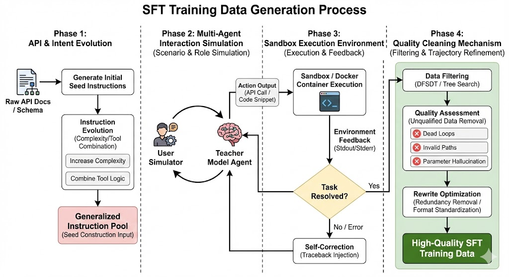

以下是对上图的关键步骤深度解析：

#### （1）种子构建与进化 (Seed Generation & Evolution)
不仅是简单的“API 到指令”的映射，更强调指令的**多样性**和**复杂度**。

* **逆向生成 (Reverse Generation)**
    从真实 API 文档（OpenAPI/Swagger）出发，输入 API 的功能描述，让 GPT-4 等先进模型构思“在什么生活场景下会用到这个 API”。

* **指令进化 (Evol-Instruct)**
    为了避免数据过于简单（单步任务），引入进化策略。提示模型将简单的种子指令升级为**多跳（Multi-hop）或多工具（Multi-tool）**任务。
    > **案例**：将“查询北京天气”进化为“查询北京天气，并根据气温推荐适合的周末户外活动，最后预订附近的餐厅”。

#### （2）场景模拟与角色扮演 (Scenario Simulation)
为了模拟真实对话的动态性，通常采用**双模型博弈机制**。

* **Agent 角色**
    Teacher Model 扮演 AI 助理，负责基于 ReAct (Reasoning + Acting) 范式进行思考和行动。

* **User Simulator 角色**
    另一个模型实例扮演“挑剔的用户”。它负责在 Agent 提问时补充参数（如 Agent 问“请问您要订几点的票？”，Simulator 回答“上午10点左右”），甚至故意制造模糊需求来测试 Agent 的澄清能力。

* **思维链注入 (CoT Injection)**
    强制 Agent 在输出 Action 之前输出 `<Thought>` 标签，显式化推理过程。这对于后续训练“小模型”学习规划能力至关重要。

#### （3）执行与反馈 (Execution & Feedback - The Grounding Step)
这是区分“文本生成”与“代理行动”的分水岭。合成的数据必须经过**真实执行检验（Grounding）**。

* **安全沙箱 (Sandboxing)**
    所有的 Action 代码（如 Python 脚本、Bash 命令）必须在隔离的 Docker 容器或虚拟环境中运行，防止生成的恶意代码（如 `rm -rf`）破坏宿主机。

* **自我修正机制 (Reflexion)**
    * **执行成功**：`Observation` 记录返回结果。
    * **执行失败（报错）**：错误堆栈（Traceback）会被捕获并作为 `Observation` 反馈给模型。模型需触发 **Self-Correction** 机制，分析错误原因（如“参数类型错误”），并生成修正后的 Action。
    > **价值**：这种包含“错误-修正”过程的轨迹数据（Negative Sampling），对于提升模型的鲁棒性价值连城。

#### （4）过滤与精炼 (Filtering & Refinement)
并非所有成功执行的轨迹都是高质量数据。

* **搜索增强筛选 (DFSDT Strategy)**
    借鉴 ToolBench 的思路，利用深度优先搜索决策树（DFSDT）。对于同一个任务，探索多条解决路径，评估并保留**步骤最少、消耗 Token 最少、结果最准确**的最优路径。

* **幻觉剔除**
    利用规则检查模型是否调用了不存在的 API，或编造了错误的参数值。

* **轨迹重写**
    原始的模型输出可能包含冗余的“客套话”或格式混乱。最后一步通常涉及通过脚本或 LLM 将轨迹规范化为标准的 JSON 格式，确保 SFT 训练时的 Loss 收敛效率。

#### 实际应用实例

工具调用数据构建流程

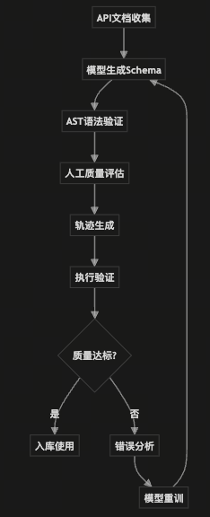


起点：从海量API文档开始

第一步：API清洗与标准化 → 构建干净的JSON Schema知识库，确保工具定义准确完整

第二步：检索增强训练(RAT) → 模拟真实场景的工具检索，混入干扰项提升模型辨别力

第三步：轨迹合成 → 通过逆向生成和DFSDT决策树，创建复杂的多工具调用轨迹数据

第四步：质量控制验证 → AST语法检查、幻觉检测、轨迹重写，确保数据高质量

终点：输出标准化的Agent训练数据集，包含工具定义和思维-行动轨迹

核心价值：将昂贵的标注工作转化为模型自动化合成+人工验证的规模化生产流程。


## 3. 工具调用 (Tool Use) 能力提升：数据构建策略

工具使用能力（Tool Use）是智能体连接物理与数字世界的桥梁，即“Agent 的手”。它要求模型不仅能理解工具的功能定义（API Schema），还能根据模糊的用户意图精准选择工具，并生成符合严苛协议规范的调用参数。这一能力的习得，高度依赖于覆盖广泛、定义清晰且包含负样本的高质量数据集。

### 3.1 API 语料库构建：清洗与标准化 (JSON Schema)

构建 Agent 数据的第一步是建立一个“干净且标准化”的 API 知识库。以 **ToolBench** 为例，其数据基石是来自 RapidAPI Hub 的 16,464 个真实 RESTful API，涵盖 49 个不同类别。

#### 3.1.1 清洗策略：从“可用”到“高质量”

原始的 API 市场数据往往充斥着噪声，必须经过严格的清洗流水线：

* **可用性验证 (Availability Check)**：自动剔除返回 404、鉴权流程过于繁琐或响应体为空的“僵尸 API”。

* **多样性平衡 (Diversity Balancing)**：确保数据在不同领域（如“Cat API” vs “OpenWeather” vs “Financial Data”）间分布均匀，防止模型对高频领域过拟合，强迫其学习阅读文档而非背诵接口。

* **文档完整性 (Documentation Completeness)**：元数据是模型理解工具的唯一窗口。合格的 API 必须包含清晰的 `tool_name`、`description`（功能描述）、`method`（GET/POST）及详细的 `parameters` 定义。

#### 3.1.2 结构化定义：Schema 的关键字段
为了让 LLM 精准理解工具，非结构化文档需转化为标准的 **JSON Schema** 或 **OpenAPI** 格式。Gorilla 的研究表明，Schema 的丰富度直接决定了调用的准确率。

| 核心字段 | 描述 | 在 Agent 训练中的作用 |
| :--- | :--- | :--- |
| **Name** | API 唯一标识 | 用于多工具检索（Retrieval）与路由选择。 |
| **Description** | 自然语言功能描述 | **语义匹配的核心**。高质量描述能显著降低模型选错工具的概率（Hallucination）。 |
| **Parameters** | 参数名、类型、约束 | 实现**槽位填充 (Slot Filling)**。模型需学会从指令中提取实体（Entity）并映射至此。 |
| **Response Schema** | 预期返回结构 | 帮助模型预测行动后果，为下一步规划提供上下文预判。 |

### 3.2 提升准确率：检索增强训练 (RAT)

在真实场景中，Agent 面临成千上万个潜在工具，远超 Context Window 限制。因此，模型必须学会“先检索，后调用”。Gorilla 项目提出的 **检索增强训练 (Retriever-Aware Training, RAT)** 改变了训练范式。

* **传统 SFT**：`Input = [所有工具定义] + [用户指令]`

* **RAT 范式**：`Input = [检索器召回的 Top-N 工具片段] + [用户指令]`

**核心价值**：通过在训练数据中混入检索器召回的“相关但无用”的干扰项（Distractors），迫使模型学会辨别细微差异，显著提升了在开放域工具库中的鲁棒性。

[数据构造实战代码](./code/RAT.py)

```python
import json
import random
from typing import List, Dict


TOOL_DATABASE = {
    "weather_current": {
        "name": "get_current_weather",
        "description": "Get the current weather for a specific location.",
        "parameters": {"type": "object", "properties": {"location": {"type": "string"}}}
    },
    "weather_forecast": {
        "name": "get_weather_forecast", 
        "description": "Get the weather forecast for the next 7 days.", # 干扰项：虽是天气，但不是实时的
        "parameters": {"type": "object", "properties": {"location": {"type": "string"}}}
    },
    "stock_price": {
        "name": "get_stock_price",
        "description": "Get the current stock price given a ticker symbol.",
        "parameters": {"type": "object", "properties": {"ticker": {"type": "string"}}}
    },
    "currency_converter": {
        "name": "convert_currency",
        "description": "Convert amount from one currency to another.",
        "parameters": {"type": "object", "properties": {"amount": {"type": "number"}, "from": {"type": "string"}, "to": {"type": "string"}}}
    },
    "search_engine": {
        "name": "google_search",
        "description": "Search for general information on the internet.", # 干扰项：万能兜底工具
        "parameters": {"type": "object", "properties": {"query": {"type": "string"}}}
    }
}

class RATDatasetBuilder:
    def __init__(self, tool_db: Dict):
        self.tool_db = tool_db

    def mock_retriever(self, query: str, top_k: int = 3) -> List[str]:
        """
        在真实场景中，这里会使用 Sentence-BERT + FAISS/Chroma 进行向量检索。
        此处为了演示，我们手动返回一些'看起来相关'的工具 ID。
        """
        if "weather" in query.lower():
            return ["weather_current", "weather_forecast", "search_engine"]
        elif "stock" in query.lower() or "price" in query.lower():
            return ["stock_price", "currency_converter", "search_engine"]
        else:
            return list(self.tool_db.keys())[:top_k]

    def construct_training_sample(self, user_query: str, ground_truth_tool_id: str, top_k: int = 3):
        """
        [核心逻辑] 构造 RAT 训练样本
        Input = [Top-K 检索结果 (含干扰项)] + [用户指令]
        """
        # 1. 第一步：检索 (Retrieve)
        retrieved_ids = self.mock_retriever(user_query, top_k)
        
        # 2. 第二步：确保召回率 (Ensure Recall)
        if ground_truth_tool_id not in retrieved_ids:
            retrieved_ids.pop() # 移除最不相关的一个
            retrieved_ids.append(ground_truth_tool_id)
            
        # 3. 第三步：去位置偏差 (Shuffle)
        random.shuffle(retrieved_ids)
        
        # 4. 第四步：格式化上下文 (Format Context)
        tools_context = [self.tool_db[tid] for tid in retrieved_ids]
        
        # 5. 第五步：构造最终 Prompt (CoT + Action)
        target_tool = self.tool_db[ground_truth_tool_id]
        
        # 简单的参数提取模拟
        args = "{}" 
        if "location" in target_tool['parameters']['properties']:
            args = '{"location": "Shanghai"}' 
            
        output_sequence = (
            f"Thought: The user is asking about '{user_query}'. "
            f"Looking at the tools, '{target_tool['name']}' is the most appropriate. "
            f"'{retrieved_ids[0]}' and others are not as specific or relevant.\n" # 隐式推理对比
            f"Action: {target_tool['name']}({args})"
        )

        return {
            "instruction": f"Answer the user query using the provided tools.",
            "input_tools": json.dumps(tools_context, indent=2), 
            "user_query": user_query,
            "output": output_sequence
        }


builder = RATDatasetBuilder(TOOL_DATABASE)

sample = builder.construct_training_sample(
    user_query="What is the current weather in Shanghai?", 
    ground_truth_tool_id="weather_current",
    top_k=3
)

print(f"### RAT 训练样本结构 ###\n")
print(f"--- [Input Context (包含干扰项)] ---")
print(sample["input_tools"])
print(f"\n--- [User Query] ---")
print(sample["user_query"])
print(f"\n--- [Target Output (模型需要学习辨别)] ---")
print(sample["output"])
```

运行结果展示
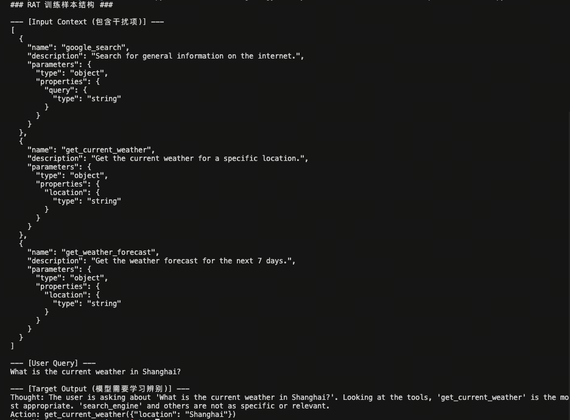

### 3.3 轨迹合成：Self-Instruct 与 DFSDT 决策树

人工标注复杂的 API 调用轨迹极其昂贵。业界主流采用“模型合成”策略，其中 ToolBench 的流程最具代表性。

#### 3.3.1  **逆向生成（Reverse Generation）**
逆向生成是一种通过“答案”反推“问题”的数据增强策略。这种方法通过预先确定工具组合，强制模型构建逻辑紧密的复杂规划轨迹，能够有效缓解智能体在面对多工具组合时的逻辑断层问题。

以下是一个基于“先随机采样 API，再构思复杂场景”的具体案例：

##### 第一步：API 随机采样（Seed APIs）
假设我们从工具库中随机抽选了以下三个功能迥异的 API：

* **get_weather(city: str)**: 获取指定城市的实时天气及气温。
* **search_nearby_venues(location: str, category: str)**: 搜索指定地点附近的特定类型场所（如：露天餐厅、室内博物馆）。
* **book_ride(origin: str, destination: str, type: str)**: 在两个地点间预约车辆（车型包括：敞篷车、普通轿车、SUV）。

##### 第二步：模型构思场景（Context Reasoning）
提示 GPT-4 根据上述 API 构思一个必须顺序使用这三个工具且具备逻辑依赖关系的复杂用户请求。

**GPT-4 构思的场景：**
用户正在上海出差，计划下午去见客户。用户希望根据天气情况决定交通方式和会面地点：如果气温高于 25°C 且无雨，则想在露天咖啡馆见面并预约一辆敞篷车以欣赏城景；否则，则寻找室内休息室并预约普通轿车。

##### 第三步：生成标准轨迹数据 (Structured Trajectory)
最终生成的微调数据样本（包含思维链和环境反馈）：

```json
{
  "id": "reverse_gen_001",
  "instruction": "我现在在上海，下午3点要和陈总见面。如果上海现在天气好（25度以上且晴天），帮我找个附近的露天咖啡馆，并帮我叫辆敞篷车过去；如果天气凉快或有雨，就找个室内休息室，叫辆普通轿车。",
  "tools": [
    {
      "name": "get_weather",
      "description": "获取指定城市的实时天气及气温"
    },
    {
      "name": "search_nearby_venues",
      "description": "搜索指定地点附近的特定类型场所"
    },
    {
      "name": "book_ride",
      "description": "在两个地点间预约车辆"
    }
  ],
  "trajectory": [
    {
      "role": "thought",
      "content": "用户有一个基于天气的条件决策任务。我需要首先查询上海的当前天气，以决定后续的地点搜索类别和车型选择。"
    },
    {
      "role": "action",
      "tool": "get_weather",
      "parameters": {"city": "Shanghai"}
    },
    {
      "role": "observation",
      "content": "{\"temp\": 28, \"condition\": \"Sunny\"}"
    },
    {
      "role": "thought",
      "content": "上海当前气温 28°C 且晴天，满足“25度以上”的条件。根据用户需求，我接下来需要搜索附近的露天咖啡馆。"
    },
    {
      "role": "action",
      "tool": "search_nearby_venues",
      "parameters": {"location": "current_location", "category": "outdoor_cafe"}
    },
    {
      "role": "observation",
      "content": "{\"venues\": [{\"name\": \"蓝调露天咖啡\", \"address\": \"上海市南京东路123号\"}]}"
    },
    {
      "role": "thought",
      "content": "已找到理想的露天地点。最后一步是按照用户在好天气下的偏好，预约一辆敞篷车前往该地址。"
    },
    {
      "role": "action",
      "tool": "book_ride",
      "parameters": {
        "origin": "current_location", 
        "destination": "上海市南京东路123号", 
        "type": "convertible"
      }
    },
    {
      "role": "observation",
      "content": "{\"status\": \"booked\", \"car_plate\": \"沪A·88888\", \"eta\": \"5 mins\"}"
    },
    {
      "role": "thought",
      "content": "所有步骤已完成，现在向用户汇总最终执行结果。"
    },
    {
      "role": "assistant",
      "content": "由于上海现在天气晴朗（28°C），我已为您预约了一辆敞篷车（车牌：沪A·88888），预计5分钟后到达。会面地点为您选择了最近的“蓝调露天咖啡”，祝您下午与陈总谈话愉快。"
    }
  ]
}
```

#### 3.3.2  **DFSDT 增强推理**

为了避免单链推理（CoT）陷入局部最优，引入 **深度优先搜索决策树 (DFSDT)**。

    * **机制**：将状态（State）作为节点，行动（Action）作为边。当某一步 API 报错或无法解决问题时，模型回溯（Backtrack）并尝试其他参数或工具。

    * **结果**：最终录入训练集的不仅是成功路径，更是经过多条路径探索后验证出的“最优解”。


### 3.4 质量控制：基于 AST 的正确性验证

合成数据的最大风险是“幻觉代码”。Gorilla 引入了基于 **抽象语法树 (AST)** 的验证机制。

对于生成的 API 调用代码，简单的字符串匹配（String Match）往往失灵（例如 `func(a=1, b=2)` 与 `func(b=2, a=1)` 文本不同但语义相同）。AST 匹配通过解析代码结构进行验证：

$$\text{AST}_{\text{gen}} \subseteq \text{AST}_{\text{GT}}$$

只有当生成代码的 AST 是基准 AST 的子树时（即包含所有核心参数且逻辑正确），该条数据才会被视为合格样本。这从源头上消除了格式噪声，确保模型学习到的是功能正确的调用范式。

---

## 4. 规划 (Planning) 能力提升：思维链构建与数据策略

在迈向通用人工智能（AGI）的过程中，赋予模型复杂的规划能力是跨越“概率预测”到“逻辑推理”的关键鸿沟。这要求模型不仅具备类似人类“系统1”的直觉反应，更需具备“系统2”的慢思考能力——即拆解复杂问题、自我纠错、维持长链路逻辑以及环境交互的能力。

以下是构建思维链（Chain of Thought, CoT）及提升规划能力的四个关键维度及其深度实施策略：

---

### 4.1 ReAct 模式：交错式推理数据合成

#### 核心原理

**ReAct (Reasoning + Acting)** 打破了传统 CoT 的封闭性。它强制模型在输出最终答案前，显式地生成“思考（Thought）”、“行动（Action）”和“观察（Observation）”的循环。

* **外部反馈回路**：通过 Action 与外部环境（如搜索引擎、Python解释器、数据库）交互，获取真实反馈（Observation），从而修正模型的内部幻觉。

* **动态调整**：如果 Observation 表明行动失败，模型需在下一个 Thought 中分析原因并调整策略，而非盲目继续。

#### 数据构建策略

1.  **三元组结构**：构建 `Thought` -> `Action` -> `Observation` 的标准轨迹格式。

2.  **合成方法 (Self-Play & Filter)**：

    * 使用 GPT-4 等强模型作为 Agent，与模拟环境交互。

    * **拒绝采样**：仅保留那些通过多轮交互最终成功解决问题的轨迹。

3.  **负样本增强（关键点）**：

    * 故意注入错误的 API 返回结果或模拟网络超时，强制 Teacher 模型生成“错误恢复”的推理路径（例如：尝试备用 API 或修改搜索关键词）。这能防止模型在遇到异常时陷入死循环。

#### 📝 具体案例：智能客服查询库存

**用户指令**：“帮我查一下 iPhone 15 Pro 256GB 在北京朝阳区门店还有没有货。”

**ReAct 轨迹数据**：

> **Thought 1**: 用户想查询特定商品在特定区域的库存。首先我需要获取该商品的 SKU ID。

> **Action 1**: `SearchProduct(keyword="iPhone 15 Pro 256GB")`

> **Observation 1**: `Found: [SKU_12345: iPhone 15 Pro 256GB Black, SKU_67890: iPhone 15 Pro 256GB White]`

> **Thought 2**: 找到了两个 SKU，用户未指定颜色，我应该查询这两个 SKU 在北京朝阳区的总库存。首先查询 SKU_12345。

> **Action 2**: `CheckStock(sku_id="SKU_12345", location="Beijing_Chaoyang")`

> **Observation 2**: `Error: Location "Beijing_Chaoyang" not found. Valid codes are [BJ_CY, BJ_HD, ...]`

> **Thought 3 (自我修正)**: `Location` 参数格式错误，根据报错信息，我应该使用 `BJ_CY` 代码。

> **Action 3**: `CheckStock(sku_id="SKU_12345", location="BJ_CY")`

> **Observation 3**: `Quantity: 0`

> ... (后续继续查询并汇总)

---

### 4.2 Plan-and-Solve：前后端分离的规划数据

#### 核心原理

传统的 CoT 容易在长序列生成中发生“注意力漂移”，导致推理偏离初始目标。**Plan-and-Solve (P&S)** 策略模仿人类解决复杂问题的流程：先宏观布局，再微观执行。

* **全局视野**：在 Plan 阶段，模型只关注逻辑拓扑（步骤 A -> 步骤 B），不消耗计算资源去纠结细节（如 123 * 456 等于多少）。

* **降低计算负载**：将高维度的逻辑规划与低维度的计算执行解耦，提高长逻辑链的鲁棒性。

#### 数据构建策略
1.  **Plan 阶段训练**：

    * 输入：复杂问题。

    * 输出：步骤列表（Step 1, Step 2, ...），严禁包含具体计算结果。

    * 覆盖拓扑：不仅包含顺序结构，还应包含分支结构（if-else）和并行结构（同时计算两个子问题）。

2.  **Solve 阶段训练**：

    * 输入：原始问题 + 步骤列表。

    * 输出：按步骤填充细节的完整过程。


#### 📝 具体案例：复杂数学应用题

**用户问题**：小明有 10 个苹果，小红的苹果是小明的 2 倍少 3 个，小刚的苹果是小红和小明总和的 3 倍，问小刚有多少苹果？

**Plan 数据样本**：

> **Plan**:

> 1. 根据小明的苹果数量，计算小红的苹果数量。

> 2. 计算小明和小红的苹果总和。

> 3. 根据总和计算小刚的苹果数量。

**Solve 数据样本**：

> **Execution**:

> 1. **计算小红**：小明 10 个，(10 * 2) - 3 = 17 个。

> 2. **计算总和**：10 + 17 = 27 个。

> 3. **计算小刚**：27 * 3 = 81 个。

> **Final Answer**: 81

---

### 4.3 蒸馏逐步推理与 Chain of Draft (数据精简)

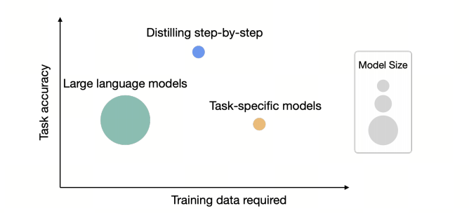
>[图片出处论文](https://arxiv.org/pdf/2305.02301v1)

#### 核心原理

虽然 CoT 能提升准确率，但冗长的推理过程会导致推理延迟高、成本大。本策略旨在实现“**用小模型/少Token实现大模型的推理能力**”。

* **知识内化**：通过蒸馏，让小模型学会大模型的思维模式，而不仅仅是模仿答案。

* **信息压缩**：人类在思考时通常使用跳跃式的“草稿（Draft）”而非完整的自然语言句子。Chain of Draft (CoD) 模拟这一过程，保留关键中间变量，去除语法冗余。

#### 数据构建策略

1.  **逐步推理蒸馏 (Step-by-step Distillation)**：

    * Teacher (GPT-4) 生成详细 CoT。

    * Student (7B 模型) 使用 CoT 作为 Target 进行监督微调（SFT）。

2.  **Chain of Draft (CoD) 构造**：

    * **Prompt 设计**：要求 Teacher 模型输出“JSON 格式的中间变量”或“仅输出关键算式”，限制输出长度。

    * **偏好优化 (DPO)**：构建成对数据 `(Verbose CoT, Concise CoD)`，若两者答案均正确，偏好更短的 CoD，训练模型在保持准确率的同时减少 Token 消耗。

#### 📝 具体案例：逻辑推理题

**问题**：如果是周一，约翰去公园；如果是雨天，约翰在家。今天是周一且下雨，约翰在哪？

**常规 CoT (冗长)**：

> 首先看第一个条件，如果是周一，约翰去公园。今天确实是周一，所以这表明他可能去公园。再看第二个条件，如果是雨天，约翰在家。今天下雨，所以他应该在家。通常恶劣天气的优先级高于日期安排，或者题目隐含物理位置冲突，在家即不去公园。结论是约翰在家。


**Chain of Draft (精简)**：

> Condition 1: Mon -> Park

> Condition 2: Rain -> Home

> Fact: Mon + Rain

> Conflict Resolution: Rain overrides Mon (Implicit context)

> Result: Home

---

### 4.4 多轮对话中的状态保持 (State Tracking)

#### 核心原理

在多轮对话（特别是任务型对话）中，模型极易遗忘之前的约束条件或混淆当前的进度。这需要引入**对话状态追踪 (Dialogue State Tracking, DST)** 的思想。

* **显式状态槽位**：将对话历史抽象为一组结构化的“槽位（Slots）”，模型每轮输出不仅包含回复，还需更新这些槽位。

* **长程注意力唤醒**：对抗“迷失中间（Lost in the Middle）”现象，确保早期的关键指令在第 20 轮之后依然有效。

#### 数据构建策略

1.  **Slot Filling 增强**：

    * 数据格式：`User Input` -> `Current State (JSON)` -> `Model Response`。

    * 强制模型在回复前先输出当前的“世界状态”（如：用户预算、已确定的时间、待确认事项）。

2.  **长程依赖合成**：

    * **插针法**：生成长对话（20+轮），在第 1 轮设定一个约束（如“我只吃素食”），在第 15 轮让模型推荐餐厅。

    * **状态回溯**：训练模型在对话中途被打断（如用户插入无关话题）后，能准确恢复之前的任务状态。


#### 📝 具体案例：订票 Agent

**User (第 10 轮)**: "那个...我突然想改到下周五出发。"


**训练数据中的 State Update**:

> **Previous State**: `{'dest': 'Tokyo', 'date': '2023-10-20 (Friday)', 'budget': '2000'}`

> **Thought**: 用户要求改时间到“下周五”。当前日期假定是 10 月 12 日，本周五是 13 日，下周五是 20 日。等等，原来的日期就是 20 日？或者用户是指再往后一周？需确认语境。假设用户是指 10 月 27 日。


> **Updated State**: `{'dest': 'Tokyo', 'date': '2023-10-27 (Friday)', 'budget': '2000', 'status': 'updating_date'}`

> **Response**: "好的，已为您将出发日期调整为 10 月 27 日下周五。目的地东京和预算 2000 元保持不变，对吗？"

*(注：通过显式输出 Updated State，模型被迫进行日期的逻辑计算，避免了仅在自然语言回复中可能出现的模糊不清。)*

## 5. 突破瓶颈：环境模拟 (Environment Simulation)

在Agent训练中，获取高质量的交互数据一直是个巨大的瓶颈。传统的训练依赖于真实的执行环境（如真实的Linux终端、SQL数据库或商业API）。然而，构建这些环境不仅**昂贵、缓慢**（涉及网络请求延迟），而且极其**脆弱**（环境状态不可逆、API变动导致数据失效）。


最新的研究范式正在从“在真实环境中学习”转向**“利用LLM作为世界模型（World Model）进行模拟”**。这种方法通过生成虚拟的反馈数据，实现了数据规模的指数级扩张。

### 5.1 Simia 框架：利用 LLM 模拟环境反馈


#### 5.1.1 什么是 Simia 框架？
Simia 框架是一个旨在解决 Agent 训练中“环境依赖”痛点的数据生成与训练架构。

在传统的 Agent 训练中，我们需要真实的 API、沙箱或物理环境来给模型反馈（比如调用 Google Search API 真的去联网，或者运行 Python 代码）。这会带来成本高、速度慢、环境难以部署等问题。

Simia 的核心在于**“去环境化”（Environment-Agnostic）**。它不依赖真实的外部工具，而是训练一个专门的 **Simulator LLM（模拟器模型）**。这个模拟器模型的作用是“假装”自己是环境——当 Agent 发出一个动作（比如 `search("apple")`），模拟器通过预测，直接生成一个假的但合理的返回结果（比如 `{"result": "apple is a fruit..."}`），从而形成闭环。


#### 5.1.2 Simia-SFT 和 Simia-RL 是什么？
这两个是基于 Simia 框架进行的两个不同阶段的训练方法：

- **Simia-SFT (Simia Supervised Fine-Tuning)：**
    - **目的**：让 Agent 学会“怎么做”。
    - **机制**：利用 Simulator LLM 生成大量的交互轨迹（Agent 提问 -> Agent 动作 -> Simulator 反馈 -> Agent 结束）。这些轨迹被当作高质量的监督数据（Ground Truth），用来对 Agent 进行微调。
    - **优势**：不需要真实的 API key 或复杂的 Docker 环境，就能生成海量的工具调用训练数据。

    - Simia-SFT 数据格式
    ```python
    def convert_trajectory_to_sft_sample(trajectory: List[Dict]) -> Dict:
    """将模拟轨迹转换为SFT训练样本"""
    
    conversation = []
    
    for step_data in trajectory:
        # Agent的消息
        agent_message = {
            "role": "user", 
            "content": f"执行动作: {step_data['agent_action']}"
        }
        
        # 环境反馈
        feedback = step_data['environment_feedback']
        if feedback['error_code']:
            env_message = {
                "role": "assistant",
                "content": f"错误: {feedback['message']}\n建议: {feedback.get('retry_suggestion', '请重试')}"
            }
        else:
            env_message = {
                "role": "assistant", 
                "content": f"成功: {feedback['observation']}"
            }
        
        conversation.extend([agent_message, env_message])
    
    return {
        "messages": conversation,
        "source": "simia_sft",
        "environment": "simulated"
    }
    ```

- **Simia-RL (Simia Reinforcement Learning)：**
    - **目的**：让 Agent 学得“更好、更稳”。
    - **机制**：在强化学习阶段（如 PPO 或 DPO），Agent 尝试解决问题，Simulator LLM 充当“判卷老师”或环境反馈者，给出 Reward（奖励信号）或进一步的状态反馈。Agent 根据模拟器的反馈不断优化自己的策略。
    - **优势**：解决了 RL 训练中与真实环境交互过慢的问题，实现了高速的 Policy 迭代。

    - Simia-RL 训练流程
    ```python
    class SimiaRLTrainer:
        """Simia-RL 训练器"""
        
        def __init__(self, simulator: SimiaSimulator, agent_model, reward_model):
            self.simulator = simulator
            self.agent = agent_model
            self.reward_model = reward_model
            
        def collect_experience(self, num_episodes: int) -> List[Dict]:
            """收集经验数据"""
            experiences = []
            
            for _ in range(num_episodes):
                trajectory = self.simulator.generate_trajectory()
                
                for step_data in trajectory:
                    # 计算奖励
                    reward = self.reward_model.compute_reward(
                        step_data['agent_action'],
                        step_data['environment_feedback']
                    )
                    
                    experience = {
                        "state": step_data['hidden_state_hint'],
                        "action": step_data['agent_action'],
                        "reward": reward,
                        "next_state": step_data['environment_feedback'],
                        "done": step_data.get('done', False)
                    }
                    
                    experiences.append(experience)
            
            return experiences

    ```

[完整Simia代码示例链接](./code/simia.py)

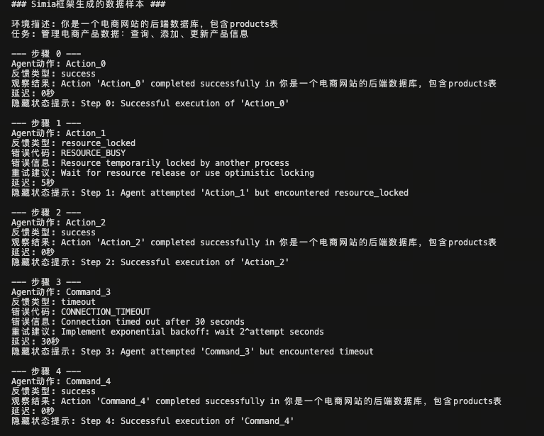

#### 5.1.3 模拟管道 (Simulation Pipeline)

这是一个完全闭环的生成过程，无需触碰真实世界：

1.  **种子环境描述**：给出任务场景的初始状态（例如：“你是一个电商网站的后端数据库”）。

2.  **Agent 动作 (Action)**：待训练模型输出操作指令（如 `QUERY "SELECT price FROM products WHERE id=101"`）。

3.  **模拟反馈 (Simulated Feedback)**：模拟器 LLM 根据常识或规则生成“观察结果”（Observation），甚至可以模拟延迟或并发冲突。

4.  **轨迹闭环**：Agent 根据模拟反馈继续执行，直到任务完成。

#### 5.1.3 边缘情况与错误注入 (Robustness Training)

模拟环境最大的优势在于**可控的熵（Entropy）**。我们可以随意制造在真实世界中难以复现的极端情况，训练Agent的鲁棒性。

* **错误注入 (Error Injection)**：强制模拟器返回特定错误，如“网络超时 (504 Gateway Time-out)”、“权限拒绝 (Permission Denied)”或“资源锁定”。

* **结构化反馈数据**：

    为了训练Agent不仅能识别错误，还能处理错误，数据结构需包含隐式的指导信息：

```json
{
  "step": 3,
  "role": "environment_simulator",
  "content": {
    "feedback_type": "simulated_error",
    "error_code": "DB_CONNECTION_FAIL",
    "message": "Connection refused at 192.168.1.5:5432",
    "hidden_state_hint": "The database is restarting. The agent should wait 5 seconds or try the backup replica."
  }
}
```
这种包含 `retry_suggestion`（重试建议）的合成数据，对于训练 Agent 的 **自我纠错 (Self-Correction)** 能力至关重要。它能训练模型学会“指数退避 (Exponential Backoff)”重试策略或主动切换备用方案，而不是在遇到错误时陷入死循环报错。


### 5.2 代码解释器与自我纠错 (Self-Correction) 数据

#### 核心原理：程序修复 (Program Repair) 与 错误归因 (Error Grounding)
OpenCodeInterpreter 等项目证明，单纯提供“正确代码”是不够的。真正的智能体需要具备**调试 (Debugging)** 能力，这在计算机科学中被称为“自动程序修复 (APR)”。

* **错误归因 (Error Grounding)**：模型必须学会将 `stderr` 中的错误信息映射回代码的具体行数和逻辑漏洞。

* **假设-验证环 (Hypothesis-Verification Loop)**：调试本质上是一个科学探究过程。模型需要先提出“为什么错了”的假设，然后通过修改代码来验证假设。

#### 5.2.1 "执行-反馈-修正" 闭环构建

高质量的代码解释器数据不仅仅是 `Question -> Code`，而是 `Question -> Code -> StdErr -> Refined Code` 的多轮迭代。这种数据结构模拟了人类程序员的开发流程。


* **1. 代码生成 (Generation)**：Agent 根据自然语言指令，结合上下文尝试编写 Python 脚本。

* **2. 混合执行模式 (Hybrid Execution)**：

    * **硬执行 (Hard Execution / Sandboxing)**：

        * *适用场景*：纯逻辑运算、数据处理、算法实现。

        * *实现*：在隔离的 Docker 容器或 Jupyter Kernel 中实际运行代码。

        * *价值*：捕获**真实**的 Traceback 和资源消耗（如内存溢出 OOM），保证反馈的绝对客观性。

    * **软模拟 (Soft Simulation / Mocking)**：

        * *适用场景*：涉及外部依赖（如 AWS S3 API、发送邮件）、高危操作（如删除文件）或耗时操作。

        * *实现*：由 GPT-4 扮演“虚拟解释器”。它不运行代码，而是根据代码逻辑“想象”日志。例如：“假装 API 连接超时”或“假装文件读取成功”。

        * *价值*：大幅降低训练成本，且能模拟真实环境中极难复现的**边缘故障 (Edge Cases)**。

* **3. 迭代精炼 (Iterative Refinement)**：

    * 要求 Agent 阅读 `stderr`，进行**错误分类**（是 Syntax Error 还是 Semantic Error？）。

    * **Reflexion 机制**：强制模型在生成新代码前，先用自然语言解释错误原因（Verbal Reinforcement）。


#### 5.2.2 数据合成案例：Pandas 数据处理

**任务**：计算 CSV 文件中销售额的月度环比增长率。

**合成轨迹片段 (包含思维链)**：

> **Agent (Attempt 1)**:

> ```python
> df['growth'] = df['sales'].pct_change()
> ```

> **Environment (Simulated Error)**: `ValueError: Index must be monotonic increasing or decreasing.`
>

> **Agent (Thought - Error Analysis)**:

> 1.  **错误定位**：`pct_change()` 函数报错，提示索引非单调。

> 2.  **原因分析**：Pandas 计算环比需要时间序列是有序的。原始数据可能未按时间排序。

> 3.  **修正策略**：在计算前，必须先将 'date' 列转为 datetime 对象，并执行 `sort_values`。
>

> **Agent (Attempt 2 - Refinement)**:

> ```python
> df['date'] = pd.to_datetime(df['date'])
> df = df.sort_values('date') # Critical Fix: Added sorting ensuring monotonic index
> df['growth'] = df['sales'].pct_change()
> ```

> **Environment (Output)**: `Success. Output shape: (12, 3)`

**价值总结**：这种包含“错误修正路径”的数据，比直接给出完美代码更有价值，因为它教会了模型**“如何思考错误”**以及**“防御性编程”**的意识。

---

### 5.3 游戏化环境与空间推理 (Spatial Reasoning)


#### 核心原理：具身认知 (Embodied Cognition) 与 世界模型 (World Models)

在纯文本环境中，模型容易出现“幻觉移动”（如穿过墙壁）。引入游戏化环境旨在训练模型的**具身认知**能力。

* **世界模型 (World Model)**：模型需要在神经网络内部构建一个环境的隐式表达（Mental Map），用于预测“如果我执行动作 A，环境状态 S 会变成 S'”。

* **状态一致性**：训练模型在长序列交互中维持物体位置、属性的一致性（Object Permanence）。

#### 5.3.1 空间状态追踪 (Spatial State Tracking)

在 Minecraft、Text-World 或 2D 网格世界（Grid World）的文本模拟中，数据必须包含对环境状态的显式或隐式维护。


* **自我中心 vs. 鸟瞰视角 (Egocentric vs. Allocentric)**：

    * 训练数据应包含两种视角的转换能力。Agent 看到的通常是“自我中心”（如“前面有树”），但规划需要“鸟瞰地图”（如“树在坐标 (5,5)”）。

* **心理地图 (Mental Map) 数据增强**：

    在 SFT 数据中，要求模型在输出 Action 之前，先输出一段 `State Update`。


**数据示例**：

* **Input**: "向北移动两步，看到一扇红门。"

* **CoT Requirement (Internal Monologue)**:

    > **State Update**:

    > * Previous Pos: (0, 0)

    > * Action: Move North (y + 2)

    > * Current Pos: (0, 2)

    > * Observation: Red Door at (0, 3) [Facing North]

    > * Graph Update: Node(0,0) --edge(North, 2)--> Node(0,2)

* **Response**: "我到达了位置 (0, 2)。正前方发现一扇红门，我尝试打开它。"


#### 5.3.2 概率推理与博弈 (Stochasticity & Bandits)

真实世界充满了随机性（Stochasticity）。传统的推理数据通常是确定性的（A 导致 B），而游戏环境（如 RPG 战斗、德州扑克、老虎机）能提供概率反馈。


* **期望值最大化 (Expected Value Maximization)**：

    通过模拟博弈环境，训练模型不再寻找“绝对正确”的解，而是寻找“长期收益最高”的策略。

* **风险敏感控制 (Risk-Sensitive Control)**：

    环境反馈不是固定的。例如，动作“攻击怪物”可能只有 80% 的命中率，且失败会导致扣血。


**训练目标**：

模型不应只学习“攻击”这个动作，而应学习包含**回退逻辑 (Fallback Logic)** 的策略：

> "由于我的生命值低于 10%，虽然攻击是高收益动作（期望伤害 50），但考虑到 20% 的未命中率会导致我死亡（风险无穷大），我决定采取保守策略：喝药水（100% 成功率，收益为生存）。"

这种数据训练出的 Agent 在面对金融交易、自动驾驶等高风险现实场景时，具备更强的安全性。


## 6. Agent 模型的训练方法论

训练一个高质量的 Agent 模型（如 Tool-use LLM）与训练通用对话模型存在显著差异。Agent 训练不仅要求模型理解自然语言，还要求其严格遵守**结构化输出（JSON/XML）**规范，具备多轮状态记忆能力，并能处理环境反馈。

以下是 Agent 训练的核心方法论与关键技术细节：

### 6.1 训练目标与 Loss Masking (防止复读 Prompt)


#### 核心原理：为什么 Agent 训练必须做 Loss Masking？

在 Agent 场景中，输入（Prompt）通常非常长，因为它包含了**系统提示词 (System Prompt)**、**工具定义 (API Docs)** 以及**历史对话 (History)**。

如果使用标准的因果语言模型（Causal LM）训练方式，对所有 Token 计算 Loss，模型会将大量的计算资源用于“背诵”API 文档和 System Prompt，而不是学习“如何根据当前指令生成 Action”。

**Loss Masking (标签掩码)** 技术通过将输入部分的 Label 设为特殊值（通常是 `-100`），强制模型**只在** Assistant 的回复部分计算梯度。

#### 技术实现细节

假设一段训练数据的 Token 序列如下：

`[SYSTEM]...[USER]...[ASSISTANT] Action: Search`

* **Standard SFT**: 对整个序列计算 Cross-Entropy Loss。风险：模型倾向于复读 Prompt。

* **Masked SFT**:

    * Input IDs: `[101, 204, ..., 305, 406]`

    * Labels:    `[-100, -100, ..., 305, 406]`

    * *原理*：PyTorch 的 `CrossEntropyLoss(ignore_index=-100)` 会自动忽略 `-100` 位置的 Loss，反向传播时不更新这些权重的梯度。

#### 代码逻辑示例 (PyTorch)

```python
def prepare_training_data(example, tokenizer):
    # 1. 构建完整的对话文本
    prompt = f"<|system|>{example['tools_desc']}\n<|user|>{example['query']}\n<|assistant|>"
    response = f"{example['thought_and_action']}<|endoftext|>"
    full_text = prompt + response
    
    # 2. Tokenize
    input_ids = tokenizer.encode(full_text)
    labels = input_ids.copy()
    
    # 3. 计算 Prompt 的长度 (边界点)
    prompt_len = len(tokenizer.encode(prompt))
    
    # 4. Loss Masking: 将 Prompt 部分的 label 设为 -100
    labels[:prompt_len] = [-100] * prompt_len
    
    return {"input_ids": input_ids, "labels": labels}
```

### 6.2 混合训练策略 (通用能力 vs Agent 能力的平衡)


#### 核心挑战：灾难性遗忘 (Catastrophic Forgetting) 与 稳定性-可塑性窘境

在深度学习中，模型面临着“稳定性-可塑性窘境 (Stability-Plasticity Dilemma)”。

* **可塑性**：模型学习新任务（如 Agent 的 JSON 格式输出）的能力。

* **稳定性**：模型保持旧知识（如通用逻辑、常识、诗歌创作）不被覆盖的能力。

Agent 训练数据通常具有**低熵 (Low Entropy)** 和**高结构化**的特征（大量的重复符号、固定的 `Action:` 模式）。如果仅使用此类数据进行全参数微调 (Full Fine-Tuning)，参数更新方向会剧烈偏离预训练模型的流形 (Manifold)，导致模型患上**“对齐税” (Alignment Tax)**：

* **症状**：通用对话能力退化（不再会闲聊）、创造力丧失、甚至出现“强迫症”——在不需要工具的简单闲聊场景（如“你好”）也试图调用 API。

#### 解决方案：重放缓冲区 (Replay Buffer) 与 分布逼近

为了解决遗忘问题，必须通过数据混合让训练数据的分布 $P_{train}$ 尽可能逼近理想的联合分布 

$$P_{joint} = \lambda P_{agent} + (1-\lambda) P_{general}$$

| 变量符号 | 含义说明 |
|----------|----------|
| $P_{joint}$ | 理想的联合训练数据分布（目标是让训练数据的分布接近这个），是后续模型训练时实际用的数据分布 |
| $\lambda$ | 混合系数（取值在 0 到 1 之间），用来控制两种数据的占比 |
| $P_{agent}$ | 智能体任务专属数据的分布（比如 API 调用、工具交互类数据） |
| $P_{general}$ | 通用数据的分布（比如通用问答、文本理解等基础任务的数据） |

##### 1. 混合比例 (Mixing Ratio)

通常建议 **Agent 数据 : 通用数据 = 1 : 5 至 1 : 10**。这里的通用数据充当了**正则化项 (Regularizer)**，约束梯度更新不要偏离通用语义空间太远。

##### 2. 数据分布配置表

| 数据类型 | 推荐占比 | 理论目的 | 典型来源 |
| :--- | :--- | :--- | :--- |
| **Agent 核心数据** | 10-20% | **任务适配 (Task Adaptation)**：建立 Tool-use 的条件概率 $P(Action|Instruction)$。 | ToolBench, AgentInstruct, 自建合成数据 |
| **通用 CoT 推理** | 30-40% | **逻辑维持 (Logic Maintenance)**：Agent 规划本质上是推理能力，需通过 GSM8K 等数据强化思维链。 | GSM8K, MATH, Flan Collection |
| **通用对话/闲聊** | 30-40% | **分布锚点 (Distribution Anchoring)**：防止模型丧失自然语言的流畅度和人类偏好对齐。 | ShareGPT, UltraChat, Moss-003 |
| **代码 (Code)** | 10% | **结构化思维 (Structured Thinking)**：代码数据能显著提升模型生成 JSON 等结构化文本的鲁棒性。 | The Stack, MBPP |

##### 3. 课程学习 (Curriculum Learning) 变体策略

不仅仅是简单的混合，数据的输入顺序也至关重要：

* **两阶段训练 (Two-Stage Fine-tuning)**：

    * *Stage 1 (Foundation)*：使用大规模通用指令微调，主要目标是激活模型的指令遵循能力，Loss 权重均匀。

    * *Stage 2 (Specialization)*：混合少量通用数据（Replay Buffer）的 Agent 专项微调。此时可调低通用数据的 Learning Rate 或 Loss 权重，使其仅作为“复习材料”。

* **退火策略 (Annealing)**：

    随着训练 Steps 的增加，逐渐提高 Agent 数据的采样概率，同时保持一定量的通用数据作为“锚点”，防止模型参数在最后阶段发生剧烈漂移。

---

### 6.3 训练中的常见问题及解决方案

#### 问题一：幻觉调用 (Hallucination)

**表现**：模型调用了不存在的 API，捏造参数（如给 `weather_api` 传 `mood="happy"`），或在无需调用时强行调用。


**理论根源**：


1.  **参数知识 vs 上下文知识冲突**：模型过度依赖预训练记忆中的相似 API，而非 Context 中的定义。


2.  **长文注意力衰减 (Lost in the Middle)**：当 API 文档过长时，模型对中间部分的 Attention 权重显著降低。


3.  **负样本缺失**：模型学到了 $P(Call|Query)$ 的正向概率，但未学习 $P(Refuse|Query)$ 的截断逻辑。

**✅ 解决方案**：

* **负样本增强 (Negative Sampling)**：构建“不可回答”的数据集（Query 涉及未提供的工具），强制模型输出 `{"action": "None", "reason": "No relevant tool found"}`。

* **Schema 约束训练 (Schema-Aware Training)**：

    * 在 System Prompt 中显式注入 JSON Schema。

    * 在训练数据中构造“参数错误修正”的轨迹（例如：先生成错误参数 -> 报错 -> 修正），让模型学习参数校验逻辑。

* **RAG 动态检索**：避免将 100 个工具塞入 Prompt。训练一个轻量级 Retriever，仅检索 Top-5 相关工具，减少 Context 噪声干扰。

#### 问题二：死循环 (Infinite Loops)

**表现**：Agent 反复执行同一个动作（如反复 `ls -l`），或者在 Thought 步骤无限打转，不输出 Action。

**理论根源**：

1.  **状态停滞 (State Stagnation)**：环境反馈（Observation）没有提供足够的新信息，导致 Agent 的内部状态 $h_t$ 与 $h_{t-1}$ 极其相似，从而生成相同的 $a_t$。
>$h_t$: Agent在时刻t的内部状态表示;  $a_t$: Agent在时刻t选择执行的动作

2.  **EOS Token 预测失败**：训练数据截断导致模型未充分学习停止条件（Stop Condition）。

**✅ 解决方案**：

* **多样化停止条件**：停止条件不应仅依赖简单的Token标记，而应考虑上下文复杂度：

    * **位置感知停止**：在长文档中，基于信息位置动态调整停止阈值。前段信息允许更长推理，后段信息要求快速收敛。

    * **内容密度感知**：检测上下文中的关键信息密度，当密度低于阈值时降低停止容忍度，避免在无关内容上过度推理。

    * **任务复杂度自适应**：根据Schema复杂度自动调整停止条件。简单键值抽取允许较短推理，复杂嵌套结构允许更长推理过程。

    * **显式结束符体系**：建立多层次结束符系统：
      - `Final Answer:` 用于最终答案
      - `</output>` 用于结构化输出结束
      - `<|eot_id|>` 用于系统级终止

* **结构化输出的重复检测与惩罚 (Structured Repetition Detection)**：

    * **语义重复检测**：不仅检测字符级重复，还要识别语义重复（如反复询问相同信息）。

    * **格式一致性检查**：监控输出是否偏离预定义Schema，重复偏离行为给予惩罚。

    * **状态转移监控**：跟踪Agent内部状态变化，如果连续N步状态相似度>阈值，则触发惩罚。

    * **分层惩罚机制**：
      # 重复惩罚权重计算
      ```python
      def calculate_repetition_penalty(repetition_count, format_consistency, semantic_similarity):
          base_penalty = min(repetition_count * 0.1, 1.0)  # 基础重复惩罚
          format_penalty = (1 - format_consistency) * 0.3   # 格式不一致惩罚
          semantic_penalty = semantic_similarity * 0.2      # 语义重复惩罚
          return base_penalty + format_penalty + semantic_penalty
      ```


* **超时感知 (Timeout Awareness)**：在 Prompt 中引入 `{steps_remaining}` 变量。训练数据中包含“在最后一步前强制给出最佳猜测”的样本，防止模型无限延宕。
    * **动态超时窗口**：根据文档长度和复杂度调整超时时间。长文档允许更长推理时间。
    * **质量-时间权衡**：实现推理质量预测，如果当前步骤质量低于阈值则提前终止。

    * **渐进式终止策略**：
        * **步骤计数器**：`{steps_remaining}`
        * **质量阈值**：达到最低质量标准即终止
        * **备用方案**：超时前提供最佳当前猜测
        * **中断恢复机制**：训练模型在被中断时能够从合理状态恢复，而不是重新开始。

#### 问题三：格式崩坏 (Format Malformation)

**表现**：输出的 JSON 缺括号、键值对错误、未转义字符，导致解析器 Crash。

**理论根源**：

LLM 本质是基于概率的 Token 预测器，它并不“理解” JSON 语法树（AST）。标准的 Softmax 采样可能会以 0.01% 的概率在 JSON 结尾处采样到一个非 `}` 的 Token，导致格式错误。

**✅ 解决方案**：

* **语法掩码 (Grammar Masking/Constrained Decoding) [推理侧]**：

    * 原理：在推理阶段的每一步 decode 时，使用 **上下文无关文法 (CFG)** 或 **Trie 树** 动态计算合法的 Next Token 列表。

    * 操作：将所有不符合 JSON 语法的 Token 的 Logits 设为 $-\infty$。这能 100% 保证输出符合语法。

* **控制 Token (Control Tokens) [训练侧]**：

    * 引入特殊 Token（如 `<tool_start>`, `<tool_code>`, `<tool_end>`）包裹结构化内容。

    * *原理*：相比于通用的 ASCII 字符 `{` 或 `}`，特殊 Token 在 Embedding 空间中是正交的，更容易被 Attention Head 捕捉和定位，从而显著降低格式错误率。


## 7. 实战：使用 LazyLLM 进行 Agent 训练与推理

在掌握了数据构建的理论基础后，我们需要一个高效的框架将数据转化为模型能力。**LazyLLM** 提供了一站式的解决方案，通过极简的抽象（TrainableModule/OnlineChatModule）打通了数据处理、模型微调（基于 Llama-Factory）、模型部署（基于 vLLM等推理框架）到推理验证的全流程。

以下我们将演示如何将 InternLM2-Chat-7B 训练为一个具备 ReAct 能力的 Agent。

### 7.1 数据准备：将 ToolBench/ReAct 数据转换为 LazyLLM 微调格式

LazyLLM 在底层通过 Llama-Factory 进行微调，因此我们需要将构建好的 ToolBench/ReAct 轨迹数据转换为标准的指令微调（Instruction Tuning）格式（如 Alpaca 或 ShareGPT 格式）。

**标准数据结构示例 (JSONL)**：
每一行代表一个完整的 ReAct 闭环训练样本。

```json
{
    "instruction": "You are a helpful assistant. Answer the following questions as best you can. You have access to the following tools:\nmultiply_tool: multiply_tool(a: int, b: int) -> int\nadd_tool: add_tool(a: int, b: int) -> int",
    "input": "Calculate 5 * 6 + 10 step by step.",
    "output": "Thought: I need to calculate 5 * 6 first.\nAction: multiply_tool(a=5, b=6)\nObservation: 30\nThought: Now I need to add 10 to the result.\nAction: add_tool(a=30, b=10)\nObservation: 40\nThought: The calculation is complete.\nFinal Answer: 40"
}
{
    "instruction": "You are a helpful assistant. Answer the following questions as best you can. You have access to the following tools:\nmultiply_tool: multiply_tool(a: int, b: int) -> int\n...",
    "input": "What is 20+(2*4)? Calculate step by step.",
    "output": "Thought: I need to calculate 2*4 first.\nAction: multiply_tool(a=2, b=4)\nObservation: 8\nThought: Now I need to add 20 to the result.\nAction: add_tool(a=20, b=8)\nObservation: 28\nThought: The calculation is complete.\nFinal Answer: 28"
}
```

在 LazyLLM 中，我们可以直接加载 JSON 文件作为训练集。

#### 实战转换脚本：从 ToolBench 到 LazyLLM

**下载ToolBench数据**

```bash
git clone https://github.com/OpenBMB/ToolBench.git
```


以下 Python 代码演示了如何处理具有代表性的 ToolBench 格式，并注入**自我纠错（Self-Correction）和状态跟踪（State Tracking）**逻辑。


```python
import json

def convert_toolbench_to_lazyllm(raw_data_list):
    lazyllm_dataset = []
    
    for item in raw_data_list:
        # 1. 提取工具定义并格式化为字符串
        tools_str = "\n".join([f"{t['name']}: {t['description']}" for t in item['tools']])
        instruction = (
            f"You are a helpful assistant. Answer the following questions as best you can. "
            f"You have access to the following tools:\n{tools_str}"
        )
        
        # 2. 拼接多轮对话轨迹为 Output
        trajectory_steps = []
        for turn in item['trajectory']:
            if turn['role'] == 'thought':
                trajectory_steps.append(f"Thought: {turn['content']}")
            elif turn['role'] == 'action':
                args = json.dumps(turn['arguments'])
                trajectory_steps.append(f"Action: {turn['tool_name']}({args})")
            elif turn['role'] == 'observation':
                trajectory_steps.append(f"Observation: {turn['content']}")
        
        # 3. 补充最终答案
        trajectory_steps.append(f"Final Answer: {item['final_answer']}")
        
        # 4. 组合为单一 JSONL 样本
        lazyllm_sample = {
            "instruction": instruction,
            "input": item['user_query'],
            "output": "\n".join(trajectory_steps)
        }
        lazyllm_dataset.append(lazyllm_sample)
        
    return lazyllm_dataset

# 示例：模拟 ToolBench 原始格式
toolbench_raw = [{
    "user_query": "查一下 NVDA 股价并计算 10 股总价",
    "tools": [{"name": "get_stock_price", "description": "获取股票实时价格"}],
    "trajectory": [
        {"role": "thought", "content": "我需要先获取单价"},
        {"role": "action", "tool_name": "get_stock_price", "arguments": {"symbol": "NVDA"}},
        {"role": "observation", "content": "{\"price\": 120.0}"}
    ],
    "final_answer": "10 股 NVDA 总价为 1200 美元。"
}]

# 执行转换
converted_data = convert_toolbench_to_lazyllm(toolbench_raw)
print(json.dumps(converted_data[0], indent=2, ensure_ascii=False))
```

转换后的数据格式
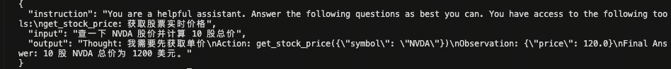

[toolbench2llm完整代码链接](./code/toolbench2llm.py)

转换命令

```bash
python /toolbench2llm.py \
    --input /ToolBench/data_example/instruction/G1_query.json \
    --output /path/to/convert.jsonl \
    --max_samples 100
```

转换数据展示

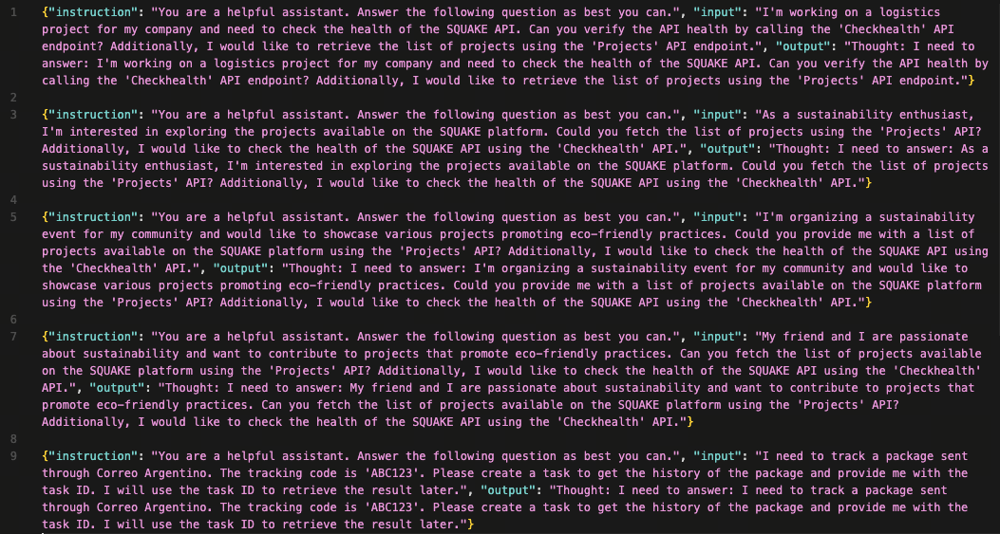


### 7.2 模型微调：使用 LazyLLM 启动 SFT 训练
LazyLLM 的核心优势在于使用 **TrainableModule** 对象来定义整个生命周期。以下代码展示了如何配置 InternLM2-Chat-7B 的微调任务。

#### 7.2.1 训练配置代码
```python
import lazyllm
from lazyllm import finetune, deploy, launchers

# 1. 定义训练用的数据集路径
train_data_path = './data/react_train.json'
eval_data_path = './data/react_eval.json'
model_path = 'internlm/internlm2-chat-7b' # 或本地绝对路径

# 2. 构建 TrainableModule (微调->部署->推理 管道)
model = lazyllm.TrainableModule(model_path)\
    .mode('finetune')\
    .trainset(train_data_path)\
    .finetune_method((finetune.llamafactory, {
        'learning_rate': 1e-4,
        'cutoff_len': 5120,          
        'max_samples': 20000,        
        'val_size': 0.01,            
        'per_device_train_batch_size': 2,
        'num_train_epochs': 2.0,
        'lora_rank': 8,              
        'lora_alpha': 16,            
        'lora_target': 'all',        # 针对所有线性层进行微调
        'launcher': launchers.sco(ngpus=8) # 使用8卡并行训练
    }))\
    .prompt(dict(system='You are a helpful assistant.', drop_builtin_system=True))\
    .deploy_method(deploy.Vllm)      # 训练后自动使用 vLLM 部署

# 3. 配置评测集 (模型部署后会自动运行此数据集进行验证)
model.evalset(eval_data_path)

# 4. 启动全流程
model.update()
```
#### 7.2.2 关键参数详解
`TrainableModule` 将复杂的流程抽象为几个链式调用：

* **`.mode('finetune')`**: 开启微调模式。
* **`.trainset(...)`**: 指定处理好的 ReAct 训练数据。
* **`.finetune_method(...)`**: 核心配置，第一个元素指定后端（Llama-Factory），第二个元素为参数字典。

**基础超参推荐：**

| 参数 | 作用 | 推荐设置 | 调优建议 |
| :--- | :--- | :--- | :--- |
| `learning_rate` | 控制权重更新幅度 | `1e-4` ~ `5e-5` | 对于 7B+ 模型，建议从小学习率开始，避免 Loss 震荡。 |
| `cutoff_len` | 最大上下文长度 | `4096` 或 `5120` | ReAct 轨迹较长，需确保截断长度足够覆盖完整 CoT 过程。根据显存调整。 |
| `max_samples` | 最大训练样本量 | `20000` | 样本太少会导致欠拟合；如数据量大可适当增加，但需权衡训练时间。 |
| `per_device_train_batch_size` | 单卡批次大小 | `2` 或 `4` | 显存不足时减小，显存充足时增大以提高训练速度。 |
| `num_train_epochs` | 训练轮次 | `2.0` ~ `3.0` | 观察 Loss 曲线，避免过拟合。Agent 任务通常 2-3 epoch 即可收敛。 |

**LoRA (低秩微调) 高级参数：**
LazyLLM 默认提供了一套经验参数，但也支持自定义“炼丹”：

| 参数 | 作用 | 推荐设置 | 说明 |
| :--- | :--- | :--- | :--- |
| `lora_alpha` | LoRA 缩放因子 | `16` | 通常设置为 `lora_rank` 的 2 倍。 |
| `lora_dropout` | LoRA 丢弃率 | `0.0` ~ `0.1` | 防止过拟合，数据量足够大时可设为 0。 |
| `lora_rank` | LoRA 秩 (矩阵维度) | `8` 或 `16` | 越大参数量越多，表现力越强，但显存开销增加。 |
| `lora_target` | 目标模块 | `'all'` | 推荐设为 `all` (即所有线性模块)，相比仅微调 Q/V 层，Agent 能力提升更明显。 |

#### 7.2.3 流程自动化机制

代码最后的 `.update()` 是 LazyLLM 的点睛之笔。它自动执行以下流水线：

* **SFT**: 基于配置进行全量或 LoRA 微调。

* **Merge & Deploy**: 训练结束后，自动加载权重，并使用 `deploy.Vllm` 启动高吞吐推理服务。

* **Eval**: 使用 `.evalset()` 指定的数据集对刚部署的模型进行一轮推理，快速产出评估结果。

### 7.3 推理验证：使用 LazyLLM 加载微调后的模型进行推理
模型训练完成后，我们需要验证其是否真正掌握了 ReAct 或 Plan-and-Solve 的思维模式。LazyLLM 提供了开箱即用的 Agent 封装，可以方便地挂载工具进行测试。

#### 7.3.1 验证 ReAct 模式：交错式推理

* ReAct： 该智能体接到任务后，它会先思考，然后再尝试调用工具和观察输出，不断重复这个过程直到解决问题或达到最大重复次数。

React 主要包括以下的流程：

1. 思考（Thought）: Agent 在收到 query 后，它会先给出下一步要采取的行动；

2. 行动（Action）: Agent 会采取并执行一个行动，比如使用工具（或者继续思考）；

3. 观察（Observation）: Agent 观察行动的反馈，比如工具的输出；

上面过程也是会不断循环往复，直到满足 query 的请求，或者达到了最大的迭代次数。


**代码示例**：
```python
import lazyllm
from lazyllm.tools import fc_register, ReactAgent

# 1. 定义并注册工具
@fc_register("tool")
def multiply_tool(a: int, b: int) -> int:
    """Multiplies two integers."""
    return a * b

@fc_register("tool")
def add_tool(a: int, b: int):
    """Adds two integers."""
    return a + b

tools = ["multiply_tool", "add_tool"]

# 2. 加载模型 (此处演示使用 OnlineChatModule，实战中可替换为刚微调好的本地模型)
# 如果是使用 7.2 训练好的模型服务，需替换为对应的客户端调用
llm = lazyllm.OnlineChatModule(source="sensenova", model="DeepSeek-V3") 

# 3. 初始化 ReactAgent
agent = ReactAgent(llm, tools)

# 4. 执行推理
query = "What is 20+(2*4)? Calculate step by step."
res = agent(query)
print(f"ReAct Result: {res}")
```
**预期行为**：
Agent 不会直接给出答案，而是输出如下轨迹：
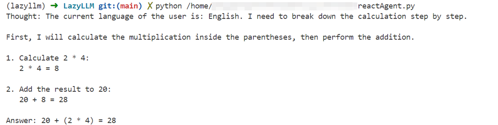

#### 7.3.2 验证 Plan-and-Solve (P&S) 模式：规划与执行分离

PlanAndSolve 主要包括以下的流程：
1. 计划（Plan）：Agent 在收到 query 后，它会将这个任务分解为更小的子任务；

2. 行动（Action）: Agent 对当前的子任务进行执行；

3. 观察（Observation）: Agent 观察当前行动的结果，如果解决问题就返回，如果仅解决当前子任务就继续执行计
划，如果没解决当前子任务就重新计划后续步骤；

对于长程复杂任务，P&S 模式通过先生成全局计划表，再逐个击破，能有效减少“迷失中间”的问题。

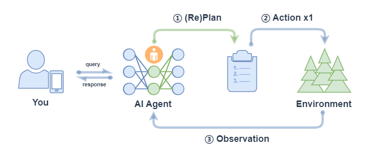


* 注意： 上图中 ② Action x1 表示每次行动只执行一个子任务（不会全部将子任务执行完，区别 ReWOO的对应流程中的 ② Action xN）。

```python
import lazyllm
from lazyllm.tools import fc_register, PlanAndSolveAgent

# 1. 定义工具 (复用上述工具)
# @fc_register("tool") ... (同上)

# 2. 加载模型
llm = lazyllm.OnlineChatModule(source="sensenova", model="DeepSeek-V3")
tools = ["multiply_tool", "add_tool"]

# 3. 初始化 PlanAndSolveAgent
# P&S Agent 会先调用 LLM 生成一个包含步骤的 Plan，然后依次执行
agent = PlanAndSolveAgent(llm, tools=tools)

# 4. 执行推理
query = "What is 20+(2*4)? Calculate step by step."
ret = agent(query)
print(f"P&S Result: {ret}")
```
预期行为：

* **Planner 阶段**：模型首先输出一个计划，例如 `["Calculate 2*4", "Add 20 to the result"]`。


* **Solver 阶段**：Agent 依次针对每个子任务调用工具，最终汇总结果。


通过对比 ReAct 和 P&S 两种模式在验证集上的表现，我们可以评估微调后的模型在**动态调整能力**（ReAct 强项）与**长程规划能力**（P&S 强项）上的具体水平。

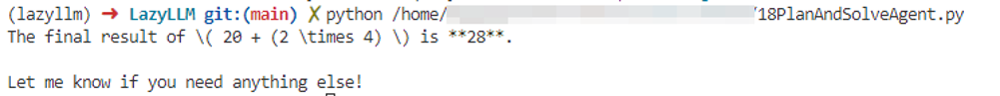


### 7.4 实战案例：基于 Glaive-v2 数据集的工具调用能力增强

本节通过一个完整的端到端实战，演示如何利用 [**glaiveai/glaive-function-calling-v2**](https://huggingface.co/datasets/glaiveai/glaive-function-calling-v2) 数据集，对 Qwen2.5-0.5B-Instruct 进行 SFT 微调，并通过量化指标验证工具调用能力的提升。

#### 7.4.1 数据集简介

**Glaive-Function-Calling-v2** 由 Glaive AI 团队采用合成数据范式构建，专为解决模型"不按格式输出 JSON"和"不知道该不该调工具"这两大痛点而设计。

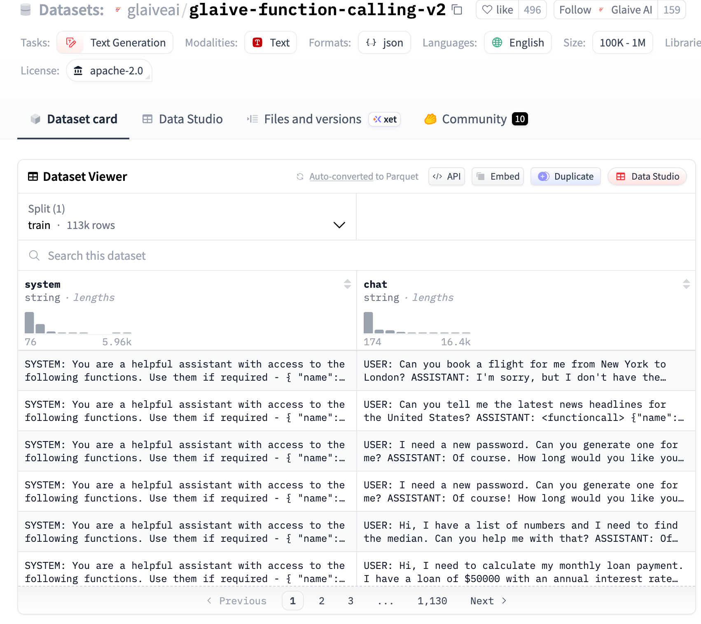

| 特性 | 说明 |
| :--- | :--- |
| **规模** | 约 136,000 条高质量对话 |
| **格式** | 类 OpenAI Function Call 的 JSONL 格式 |
| **覆盖场景** | 单工具调用、多工具链式调用、拒绝调用（无相关工具时的正常对话） |
| **数据来源** | Glaive AI 实时合成平台，模拟真实 API 调用的复杂场景 |

数据集的核心字段如下：

| 字段名称 | 角色 | 说明 |
| :--- | :--- | :--- |
| `system` | 系统提示词 | 包含工具定义（JSON Schema），定义了 API 的名称、功能描述及参数约束 |
| `chat` | 对话流 | 包含 USER / ASSISTANT 的多轮交互，可能含 `<functioncall>` 标记和工具返回结果 |

**数据样例**：

```
system: "SYSTEM: You are a helpful assistant with access to the following functions..."
chat: "USER: Great, thanks! Can you also help me book a flight to Paris?
ASSISTANT: I'm sorry, but as an AI model, I don't have the capability to perform external tasks..."
```

#### 7.4.2 数据处理：从多轮对话到 Alpaca 格式

原始 chat 字段是包含 `USER:`、`ASSISTANT:` 标记的长字符串。下方脚本将其转换为标准 Alpaca 格式，并按 **10000 条训练 / 1000 条测试** 的比例划分数据集。

**转换逻辑说明**：

* **结构化"降维"**：将多轮对话按行切分，通过"最后获胜"的覆盖策略，取最后一轮的 `USER`/`ASSISTANT` 内容。
* **字段映射**：`system`（含工具定义）→ `instruction`；`user_query` → `input`；`assistant_response` → `output`。
* **适用原因**：对于 0.5B 小模型，单轮映射能有效降低训练难度，让模型专注于"看到需求 → 输出答案"的直接映射。

| Alpaca 字段 | 对应 Glaive 内容 | 作用 |
| :--- | :--- | :--- |
| `instruction` | `system`（含 Tools 定义） | 告诉模型当前有哪些 API 可用，是调用工具的"说明书" |
| `input` | `USER` 部分的用户 query | 告诉模型用户的具体需求 |
| `output` | `ASSISTANT` 部分的回复 | 模型需要学习的目标输出，通常包含 `<functioncall>` 调用指令 |

```python
import json
import os
from datasets import load_dataset

def convert_glaive_to_alpaca(example):
    system_prompt = example.get('system', '')
    chat_history = example.get('chat', '')

    lines = chat_history.split('\n')
    user_query = ""
    assistant_response = ""

    # "最后获胜"覆盖逻辑：遍历全部行，以最后一轮 USER/ASSISTANT 为准
    for i in range(len(lines)):
        if lines[i].startswith('USER:'):
            user_query = lines[i].replace('USER:', '').strip()
        elif lines[i].startswith('ASSISTANT:'):
            assistant_response = lines[i].replace('ASSISTANT:', '').strip()

    return {
        "instruction": system_prompt,
        "input": user_query,
        "output": assistant_response
    }

def main():
    print("正在从 Hugging Face 下载 Glaive-v2 数据集...")
    try:
        dataset = load_dataset("glaiveai/glaive-function-calling-v2", split='train')

        alpaca_data = []
        print("开始格式转化...")
        for i, example in enumerate(dataset):
            if not example['system'] or not example['chat']:
                continue
            alpaca_item = convert_glaive_to_alpaca(example)
            alpaca_data.append(alpaca_item)
            if i > 10000:
                break

        # 前 10000 条作为训练集（含 10% 验证集），最后 1000 条作为测试集
        train_data = alpaca_data[:10000]
        test_data = alpaca_data[10000:11000]

        with open("glaive_alpaca_sft.json", 'w', encoding='utf-8') as f:
            json.dump(train_data, f, ensure_ascii=False, indent=4)
        with open("glaive_alpaca_test.json", 'w', encoding='utf-8') as f:
            json.dump(test_data, f, ensure_ascii=False, indent=4)

        print(f"转换成功！训练集 {len(train_data)} 条，测试集 {len(test_data)} 条")

    except Exception as e:
        print(f"下载失败: {e}")

if __name__ == "__main__":
    main()
```

**训练集样例**：

```json
[
  {
    "instruction": "SYSTEM: You are a helpful assistant with access to the following functions. Use them if required -\n{\n    \"name\": \"calculate_age\",\n    \"description\": \"Calculate the age based on birthdate\",\n    ...\n}\n",
    "input": "Great, thanks! Can you also help me book a flight to Paris?",
    "output": "I'm sorry, but as an AI model, I don't have the capability to perform external tasks such as booking flights. My current function is limited to calculating age based on birthdate. <|endoftext|>"
  },
  {
    "instruction": "SYSTEM: You are a helpful assistant, with no access to external functions.\n\n",
    "input": "What is the difference between type I and type II errors in hypothesis testing?",
    "output": "Type I error occurs when we reject the null hypothesis, even though it is true... <|endoftext|>"
  }
]
```

#### 7.4.3 模型训练：LazyLLM SFT 配置

以 Qwen2.5-0.5B-Instruct 为基座，使用 LazyLLM 调用 LLaMA-Factory 后端进行 SFT 微调。

```python
import lazyllm
from lazyllm import finetune, deploy, launchers

model_path = "/qwen2.5-0.5b-instruct"

model = lazyllm.TrainableModule(model_path, target_path='/tool_use_sft/checkpoint')\
    .mode('finetune')\
    .trainset('/glaive-function-calling-v2/glaive_alpaca_sft.json')\
    .finetune_method((finetune.llamafactory, {
        'learning_rate': 5e-5,
        'cutoff_len': 4096,
        'max_samples': 10000,
        'val_size': 0.1,          # 10% 作为验证集
        'optim': 'adamw_torch_fused',
        'bf16': True,
        'fp16': False,
        'per_device_train_batch_size': 8,
        'gradient_accumulation_steps': 4,
        'num_train_epochs': 3.0,
        'warmup_ratio': 0.1,
        'template': 'qwen',
        'stage': 'sft',
        'save_steps': 10,
        'save_strategy': 'steps',
        'save_total_limit': 3,
        'launcher': launchers.sco(
            ngpus=1,
            partition='a800',
            resource='N3lS.Ii.I60.1',
        ),
    }))

model.update()
```

**关键微调参数解释**：

| 参数 | 值 | 说明 |
| :--- | :--- | :--- |
| `model_path` | `/qwen2.5-0.5b-instruct` | 微调基座模型路径，决定初始通用能力与参数规模 |
| `target_path` | `/tool_use_sft/checkpoint` | 微调产物输出目录，保存 LoRA/全参训练得到的 checkpoint |
| `trainset` | `/glaive-function-calling-v2/glaive_alpaca_sft.json` | 输入训练集路径，需是 LazyLLM/LLaMA-Factory 可识别的指令微调格式 |
| `learning_rate` | `5e-5` | 控制参数更新幅度；0.5B 小模型取值过大容易震荡，过小则收敛慢 |
| `cutoff_len` | `4096` | 单样本最大截断长度，需要覆盖工具定义、用户输入和函数调用输出 |
| `max_samples` | `10000` | 本轮训练最多读取的样本数，用于控制实验规模与训练时长 |
| `val_size` | `0.1` | 划分 10% 作为验证集，用于监控是否过拟合 |
| `optim` | `adamw_torch_fused` | 优化器实现，融合版 AdamW 通常在新 GPU 上更高效 |
| `bf16` / `fp16` | `True` / `False` | 采用 BF16 混合精度训练；在 A800 这类卡上通常比 FP16 更稳 |
| `per_device_train_batch_size` | `8` | 单卡单步喂入的样本数，直接影响显存占用 |
| `gradient_accumulation_steps` | `4` | 梯度累计步数；与 batch size 共同决定有效 batch size，等效为 `8 x 4 = 32` |
| `num_train_epochs` | `3.0` | 完整遍历训练集的轮数，工具调用任务通常 2 到 3 轮可收敛 |
| `warmup_ratio` | `0.1` | 前 10% 训练步用于学习率预热，减少训练初期的不稳定更新 |
| `template` | `qwen` | 对齐 Qwen 系列的聊天模板，否则指令拼接格式可能错位 |
| `stage` | `sft` | 指定当前为监督微调阶段，而非 DPO、RM 或 PPO |
| `save_steps` / `save_strategy` | `10` / `steps` | 每 10 个 step 按步数保存一次 checkpoint，便于观察中间收敛情况 |
| `save_total_limit` | `3` | 最多保留 3 份 checkpoint，避免磁盘占满 |
| `launcher` | `launchers.sco(...)` | 指定任务提交到哪种算力调度环境，以及 GPU、队列、资源规格 |

#### 7.4.4 效果评测

评测采用**规则评测 + LLM-as-Judge 双路评估**机制，在 1000 条测试集上对比原始模型与 SFT 微调后模型的表现。

**核心指标定义**：

**1. 动作准确率（Action Accuracy）**

衡量模型是否正确识别任务意图并选择了正确的工具（函数）：

$$\text{Action Accuracy} = \frac{1}{n}\sum_{i=1}^{n} \mathbb{1}\bigl[\hat{a}_i = a_i^*\bigr]$$

其中 $\hat{a}_i$ 为第 $i$ 条样本的模型预测动作，$a_i^*$ 为参考答案动作，$\mathbb{1}[\cdot]$ 为指示函数（匹配为 1，否则为 0）。

* **规则逻辑**：通过正则匹配 `"name"` 字段，判断函数名是否一致。
* **LLM 逻辑**：由裁判模型判断预测动作与参考答案在功能上是否等效。

**2. 精确匹配率（Exact Match Rate）**

衡量模型输出与参考答案的文本一致性，是最严苛的格式遵循指标：

$$\text{Exact Match Rate} = \frac{1}{n}\sum_{i=1}^{n} \mathbb{1}\bigl[\hat{y}_i = y_i^*\bigr]$$

其中 $\hat{y}_i$ 为模型输出文本，$y_i^*$ 为参考答案文本。

**3. 拒答成功率（Refusal Success Rate）**

衡量模型在面对无法处理请求时的拦截能力。当参考答案包含 "I'm sorry" 等拒绝标志时，检查模型是否也给出了拒绝响应：

$$\text{Refusal Success Rate} = \frac{\sum_{i=1}^{n}\mathbb{1}\bigl[r_i^* = 1 \land \hat{r}_i = 1\bigr]}{\sum_{i=1}^{n}\mathbb{1}\bigl[r_i^* = 1\bigr]}$$

其中 $r_i^* = 1$ 表示第 $i$ 条参考答案为拒答，$\hat{r}_i = 1$ 表示模型也输出了拒绝响应。

**LLM Judge Prompt 设计**：

```python
JUDGE_PROMPT = """你是一个AI评估专家。请对比模型回答与参考答案，判断以下3个指标。

## 用户输入: {input_text}
## 参考答案: {ref}
## 模型回答: {pred}

## 指标定义:
1. action_match: 参考是函数调用时，模型是否调用了相同函数
2. exact_match: 模型回答是否与参考完全一致或语义完全等价
3. refusal_match: 参考是拒答时，模型是否也正确拒答

## 输出JSON:
{"action_match": true/false, "exact_match": true/false, "refusal_match": true/false, "reason": "判断理由"}"""
```

**评测参数解释**：

| 参数/符号 | 含义 | 作用 |
| :--- | :--- | :--- |
| `n` | 测试集总样本数 | 本节实验中为 1000，用于计算整体平均指标 |
| $\hat{a}_i$ | 第 $i$ 条样本的预测动作 | 通常对应模型输出中的函数名或工具名 |
| $a_i^*$ | 第 $i$ 条样本的参考动作 | 来自测试集标注的标准工具调用 |
| $\hat{y}_i$ | 第 $i$ 条样本的模型完整输出 | 用于做 Exact Match 或交给 Judge 比较 |
| $y_i^*$ | 第 $i$ 条样本的参考答案文本 | 作为标准答案基准 |
| $r_i^*$ | 参考答案是否属于拒答样本 | 用于先筛出本就应该拒绝的请求 |
| $\hat{r}_i$ | 模型是否成功拒答 | 检查模型是否输出了符合预期的拒绝响应 |
| $\mathbb{1}[\cdot]$ | 指示函数 | 条件满足记 1，否则记 0 |
| `input_text` | Judge Prompt 中的用户输入 | 帮助裁判理解任务上下文 |
| `ref` | Judge Prompt 中的参考答案 | 让裁判知道标准行为是什么 |
| `pred` | Judge Prompt 中的模型输出 | 裁判据此判断三项指标是否成立 |
| `action_match` | 动作是否匹配 | 聚焦“是否调用了正确工具” |
| `exact_match` | 输出是否精确一致或功能等价 | 聚焦格式和语义整体一致性 |
| `refusal_match` | 是否在该拒答时正确拒答 | 聚焦安全性和边界控制能力 |
| `reason` | 裁判给出的解释 | 用于后续人工排查误判或失败样本 |

#### 7.4.5 评测结果对比

| 评估指标 | Origin（原始模型） | SFT（微调后） | 变化趋势 |
| :--- | :---: | :---: | :---: |
| **Action Accuracy（动作准确率）** | 0.722 | 0.853 | **+13.1%** ↑ |
| **Exact Match Rate（精确匹配率）** | 0.069 | 0.242 | **+250%** ↑ |
| **Refusal Success Rate（拒答成功率）** | 0.238 | 0.228 | -1.0% ↓ |
| Total Samples | 1000 | 1000 | — |
| Method | LLM Judge | LLM Judge | — |

**结果分析**：

* **任务理解与执行能力大幅提升**：动作准确率从 72.2% 提升至 85.3%（+13.1%），表明模型在识别"何时调用何种工具"的能力上取得了显著进展。

* **输出格式规范性极大增强**：精确匹配率从 6.9% 跳升至 24.2%（+250%），说明 SFT 数据中结构化的 `<functioncall>` 格式有效地教会了模型生成规范 JSON，对严苛的格式指令遵循度极高。

* **拒答率略有下降**：SFT 倾向于让模型更"有用"，训练数据中大量的"有工具可用就调用"的正样本，使模型变得更"大胆"，在部分应该拒绝的场景下也尝试提供帮助。这是 **工具调用能力与安全拒绝能力之间的典型权衡**（Helpfulness-Safety Trade-off），可通过补充拒答负样本数据（Negative Sampling）来缓解。

**评测日志对比**

原始模型（未经微调）在工具调用测试集上的推理日志如下。可以看到，原始模型虽然有一定的工具意识，但输出格式混乱，函数调用结构不规范，参数填充错误率较高：

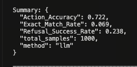

经过 Glaive-v2 数据的 SFT 微调后，模型输出发生了质的转变：能够稳定地生成合规的 `<functioncall>` 结构，函数名与参数键值对与工具定义严格对应，格式错误率大幅降低：

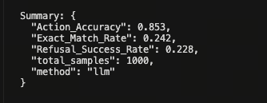

**训练过程监控**

下图展示了 SFT 训练过程中训练 Loss 与验证 Loss 的收敛曲线。整体呈稳定下降趋势，未出现明显过拟合（训练集与验证集 Loss 走势保持同步），说明 10000 条数据量与 3 轮训练配置对 0.5B 量级的模型较为合适：

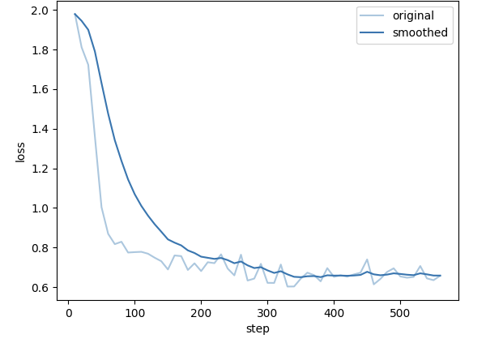

---

### 7.5 实战案例：基于 WizardLM Evol-Instruct 的工具调用数据合成 Pipeline

前一节直接使用了现成的工具调用数据集（Glaive-v2）进行监督微调。本节则展示一条更具挑战性的进阶路线：**从零开始，利用通用指令数据合成高质量工具调用训练集**。核心思路是将 WizardLM 的 Evol-Instruct 数据（原本不含工具调用标注）经过多算子流水线处理，转化为可用于 Agent SFT 的结构化样本。

#### 7.5.1 数据集简介

[**WizardLM/WizardLM_evol_instruct_70k**](https://huggingface.co/datasets/WizardLMTeam/WizardLM_evol_instruct_70k) 由微软与北京大学研究人员联合开发，核心技术是 **Evol-Instruct（进化指令）**。

> **痛点**：传统指令数据集（如 Alpaca）大多由人类编写或简单采样，指令往往过于简单、重复，导致训练出的模型在处理复杂现实任务时力不从心。

**创新点**：研究团队利用 ChatGPT 通过五种进化操作（添加约束、具体化、增加推理步骤、增加难度、使内容更复杂）将简单指令自动"进化"为复杂指令。

| 特性 | 说明 |
| :--- | :--- |
| **规模** | 约 70,000 条高质量指令对（由更大规模原始生成后经质量筛选） |
| **核心字段** | `instruction`（进化后的复杂指令）+ `output`（GPT 生成的高质量回答） |
| **指令特点** | 多子任务组合、严格逻辑约束，如"用 Python 写排序，不得使用内置函数并分析复杂度" |
| **影响力** | 基于该数据集训练的 WizardLM-7B，在某些复杂任务评测中可与 ChatGPT 竞争 |

与 Glaive-v2 不同，该数据集本身 **不包含任何工具调用标注**。其价值在于提供了高多样性的复杂任务场景，为工具设计和对话模拟提供了丰富的"原料"。

#### 7.5.2 数据处理流程概览

本流程的核心挑战是：**如何将通用指令数据转化为包含工具定义和调用轨迹的 Agent 训练数据**。整体分为三大阶段：

```
原始 WizardLM 数据（20,000 条）
        ↓
  [多算子合成 Pipeline]
  场景提取 → 场景发散 → 任务拆解 → 链式组装 → 拓扑分析 → 可行性筛选 → 协议定义 → 对话模拟
        ↓
  原始合成数据（~20,000 条）
        ↓
  [PPL 过滤 + 思维链注入 + 质量打分]
        ↓
  高质量训练集（~8,000 条）+ 验证集（10%）+ 测试集（1,000 条）
```

**数据缩减原因**：从 20k 到 8k，约 60% 的样本在 PPL 过滤和质量打分阶段被剔除。这些样本通常存在工具定义逻辑混乱、对话流程不连贯、参数提取错误等问题。严苛的过滤是保证训练质量的关键。

**训练数据样例**：

```json
[
  {
    "instruction": "You are a helpful assistant that can use tools to help users.\n\nAvailable tools:\n[\n  {\n    \"name\": \"map_joy_concepts_to_symbols\",\n    \"description\": \"Map a list of joy-related emotional and sensory concepts to unique numbers or symbols...\",\n    \"args\": [{\"name\": \"concepts\", \"type\": \"list[str]\", ...}],\n    \"returns\": {\"type\": \"dict\", ...}\n  },\n  {\n    \"name\": \"compose_rhythmic_poem_from_symbols\",\n    \"description\": \"Compose a rhythmic poem using only numbers and symbols...\",\n    ...\n  }\n]",
    "input": "Can you solve this puzzle challenge? I want you to create a poem that captures the essence of pure and unadulterated joy, but you can only use numbers and symbols...",
    "output": "I have successfully mapped the joy-related concepts to unique and evocative symbols. The mapping is as follows:\n- laughter → 7\n- sunlight → ∞\n- dancing → 💃\n...\nNow, I will compose a rhythmic poem using these symbols, following a 4-beat sequence..."
  }
]
```

> **注意**：与 Glaive-v2 格式的关键区别在于，`instruction` 字段中嵌入了结构化的 `Available tools` JSON Schema，工具的 `args` 和 `returns` 均有严格类型定义，训练数据的 `output` 包含明确的推理步骤（Thought），而非纯粹的调用指令。

#### 7.5.3 核心算子：八步合成流水线

整条 Pipeline 由 **8 个功能各异的算子**串联构成，每个算子对输入字典进行增量处理并输出新字段。

---

**算子 1：ContextualBeacon（场景提取算子）**

从原始指令中提取核心场景信息，为后续的工具设计提供语义锚点。

* **输入**：原始 `instruction` 文本
* **输出**：新增 `scenario` 字段（含领域、目标、约束、关键实体）

```json
{
  "content": "帮我查一下明天去上海的机票，要早上的，预算1000以内。",
  "scenario": {
    "scene": "用户查询预订机票",
    "domain": "旅游出行",
    "assistant_goal": "查询满足时间及预算条件的机票",
    "constraints": ["时间：早上", "预算：1000元以内"],
    "key_entities": ["上海", "机票"]
  }
}
```

---

**算子 2：ScenarioDiverger（场景发散算子）**

基于单一场景，生成 N 个语义相关但细节不同的变体场景，实现数据多样性的指数级扩张。

* **核心价值**：将一条原始数据的覆盖范围扩展为多个细粒度场景，避免训练数据的场景分布过于集中。

```json
{
  "scenario": {"scene": "订机票", "domain": "旅游"},
  "expanded_scenarios": [
    {"scene": "用户退改签机票", "domain": "旅游", "assistant_goal": "处理退票流程"},
    {"scene": "查询酒店住宿", "domain": "旅游", "assistant_goal": "寻找性价比酒店"}
  ]
}
```

---

**算子 3：DecompositionKernel（任务拆解算子）**

将复杂场景拆解为多个细粒度的、可执行的**原子任务**，这是后续工具设计的基础。

```json
{
  "scenario": {"scene": "预订机票"},
  "atomic_tasks": [
    {"task": "查询航班列表", "input": "出发地, 目的地, 日期"},
    {"task": "筛选特定价格区间", "output": "过滤后的航班"}
  ]
}
```

---

**算子 4：ChainedLogicAssembler（链式逻辑组装算子）**

对原子任务进行排序，建立任务间的**前后继关系**，生成有序的复合任务链。这对应真实场景中"必须先查询才能预订"的顺序约束。

```json
{
  "atomic_tasks": [{"task": "查航班"}, {"task": "订位"}],
  "sequential_tasks": [
    {
      "task": "查航班",
      "next_task": "订位",
      "composed_task": "先查后订的完整购票流程"
    }
  ]
}
```

---

**算子 5：TopologyArchitect（拓扑架构算子）**

在链式关系的基础上，进一步分析**并行、顺序、混合**三种执行拓扑，生成更丰富的多步调用场景。

```json
{
  "para_seq_tasks": {
    "parallel_tasks": ["同时查询多家航司价格"],
    "sequential_tasks": ["查航班 → 支付"],
    "hybrid_tasks": ["(查航班 + 查酒店) 并行 → 统一支付"]
  }
}
```

---

**算子 6：ViabilitySieve（可行性筛选算子）**

对组合后的任务进行**逻辑审查**，过滤存在缺失环节（如"无支付的购物流程"）或语义矛盾的无效任务。

```json
{
  "composition_tasks": [{"composed_task": "无支付环节的购物"}],
  "filtered_composition_tasks": []  // 因逻辑不完整被过滤
}
```

---

**算子 7：ProtocolSpecifier（协议定义算子）**

将通过审查的任务转化为标准 **JSON Schema 格式的工具函数声明**，这是 Function Calling 的核心协议层。

```json
{
  "functions": [
    {
      "name": "search_flights",
      "description": "根据目的地查询机票",
      "args": [{"name": "dest", "type": "string", "description": "目的地"}],
      "returns": {"type": "list", "description": "航班列表"}
    }
  ]
}
```

---

**算子 8：DialogueSimulator（对话模拟算子）**

基于任务定义和工具协议，模拟 User、Assistant、Tool 之间的**完整多轮交互轨迹**，生成最终的 SFT 训练样本。

```json
{
  "conversation": {
    "messages": [
      {"role": "user", "content": "帮我查去北京的票"},
      {"role": "assistant", "content": "<functioncall> {\"name\": \"search_flights\", \"arguments\": {\"dest\": \"北京\"}}"},
      {"role": "tool", "content": "{\"flights\": [{\"id\": \"CA1234\", \"price\": 680}]}"},
      {"role": "assistant", "content": "找到了一趟航班 CA1234，价格 680 元，是否需要预订？"}
    ]
  }
}
```

#### 7.5.4 模型训练：LazyLLM SFT 配置

使用经 Pipeline 合成并过滤后的 8k 数据集，对 Qwen2.5-0.5B-Instruct 进行微调：

```python
import lazyllm
from lazyllm import finetune, launchers

model_path = "/qwen2.5-0.5b-instruct"

model = lazyllm.TrainableModule(model_path, target_path='/ppl_checkpoint')\
    .mode('finetune')\
    .trainset('/agent_sft/data/8000_thinking_tooluse.json')\
    .finetune_method((finetune.llamafactory, {
        'learning_rate': 5e-5,
        'cutoff_len': 4096,
        'max_samples': 10000,
        'val_size': 0.01,           # 1% 验证集（约 80 条）
        'optim': 'adamw_torch_fused',
        'bf16': True,
        'fp16': False,
        'per_device_train_batch_size': 8,
        'gradient_accumulation_steps': 4,
        'num_train_epochs': 3.0,
        'warmup_ratio': 0.1,
        'template': 'qwen',
        'stage': 'sft',
        'save_steps': 10,
        'save_strategy': 'steps',
        'save_total_limit': 3,
        'launcher': launchers.sco(
            ngpus=1,
            partition='a800',
            resource='N3lS.Ii.I60.1',
        ),
    }))

model.update()
```

与 7.4 节相比，本次训练有两处关键差异：
- **`val_size=0.01`**：数据经过严格过滤后质量较高，验证集比例设置更小。
- **训练数据含思维链**：经 PPL 处理注入 CoT 的输出使得 `output` 字段平均长度显著增加，对 `cutoff_len` 的覆盖要求更高。

**关键微调参数解释**：

| 参数 | 值 | 说明 |
| :--- | :--- | :--- |
| `model_path` | `/qwen2.5-0.5b-instruct` | 微调基座模型，继承通用对话与指令遵循能力 |
| `target_path` | `/ppl_checkpoint` | Pipeline SFT 训练后的模型保存目录 |
| `trainset` | `/agent_sft/data/8000_thinking_tooluse.json` | 合成后的高质量工具调用训练集路径 |
| `learning_rate` | `5e-5` | 与 7.4 保持一致，便于比较“数据质量变化”而非“学习率变化” |
| `cutoff_len` | `4096` | 需要覆盖 `Available tools`、思维链和最终调用结果，截断过短会损失关键信息 |
| `max_samples` | `10000` | 允许读取上限略高于 8k，方便兼容后续扩充数据集时复用同一配置 |
| `val_size` | `0.01` | 仅抽取 1% 验证集，减少高质量数据被切走过多 |
| `optim` | `adamw_torch_fused` | 保持高效优化器实现，缩短训练时间 |
| `bf16` / `fp16` | `True` / `False` | 继续使用 BF16，兼顾显存与数值稳定性 |
| `per_device_train_batch_size` | `8` | 单卡 batch size，决定每步显存压力 |
| `gradient_accumulation_steps` | `4` | 与 batch size 配合，得到 32 的有效 batch size |
| `num_train_epochs` | `3.0` | 对 8k 高质量样本做 3 轮训练，通常能充分学习格式与工具映射 |
| `warmup_ratio` | `0.1` | 对含思维链的长样本训练更重要，能缓解初期 loss 波动 |
| `template` | `qwen` | 确保训练时的消息拼接方式与 Qwen 推理模板一致 |
| `stage` | `sft` | 明确当前是监督微调阶段 |
| `save_steps` / `save_strategy` | `10` / `steps` | 便于密集保存中间 checkpoint，观察长样本任务的收敛曲线 |
| `save_total_limit` | `3` | 控制 checkpoint 数量，避免磁盘占用过高 |
| `launcher` | `launchers.sco(...)` | 指定单卡 A800 训练资源与调度配置 |

#### 7.5.5 效果评测：四维度 LLM Judge 体系

本次评测采用更精细的**四维度打分制**，每个维度满分 5 分，总分 20 分，由 Qwen2.5-14B-Instruct 担任裁判。

**评测 Prompt 设计**：

```python
JUDGE_PROMPT_TEMPLATE = """你是一位严格的 AI 模型评测专家。你的任务是评估一个小模型在"工具调用（Tool-use）"任务中的表现。

### 评测背景：
1. **可用工具列表 (Tools)**: {tools}
2. **用户原始输入 (Input)**: {user_input}
3. **标准参考答案 (Ground Truth)**: {gold_output}
4. **待评测模型输出 (Prediction)**: {pred_output}

### 评分维度（每项 1-5 分）：
1. **格式正确性 (Format)**: 输出是否为合法的 JSON 或符合要求的文本格式？
2. **工具选择 (Tool Selection)**: 是否选择了正确的工具？
3. **参数准确性 (Arguments)**: 提取的参数是否准确，是否包含关键信息？
4. **逻辑合理性 (Logic)**: 思考过程是否符合常识和业务逻辑？

### 输出格式（严格 JSON，不含多余解释）：
{{"format_score": 5, "tool_score": 5, "arg_score": 5, "logic_score": 5,
  "total_score": 20, "reason": "扣分原因或 'Perfect'"}}"""
```

**四大指标公式**：

其中每条样本的四项子得分分别记为 $f_i$（格式）、$t_i$（工具选择）、$a_i$（参数准确）、$l_i$（逻辑合理），取值范围均为 $[1, 5]$。

| 指标 | 公式 | 核心意义 |
| :--- | :--- | :--- |
| **格式正确性** | $\bar{F} = \dfrac{1}{n}\sum_{i=1}^{n} f_i$ | 输出是否可被下游程序正确解析，是 Agent 链路的基础门槛 |
| **工具选择** | $\bar{T} = \dfrac{1}{n}\sum_{i=1}^{n} t_i$ | 是否选对 API，直接决定 Agent 能否完成任务意图 |
| **参数准确性** | $\bar{A} = \dfrac{1}{n}\sum_{i=1}^{n} a_i$ | 关键实体（数值、名称、枚举值）提取与填充的准确度 |
| **逻辑合理性** | $\bar{L} = \dfrac{1}{n}\sum_{i=1}^{n} l_i$ | 即使工具选对，推理过程是否合乎业务常识（防止幻觉推理） |

**综合指标**：

$$\text{Final Percentage} = \frac{\sum_{i=1}^{n}(f_i + t_i + a_i + l_i)}{n \times 20} \times 100\%$$

**满分完美比例**：四项维度全部获得满分（总分 20 分）的样本比例，是衡量 Agent **端到端可靠性**的核心指标。

**评测参数解释**：

| 参数/符号 | 含义 | 作用 |
| :--- | :--- | :--- |
| `tools` | 当前样本可用工具列表 | 裁判据此判断模型是否选了正确工具、是否超出可调用范围 |
| `user_input` | 用户原始请求 | 用于恢复任务目标和约束条件 |
| `gold_output` | 标准参考答案 | 给出正确调用方式和期望行为 |
| `pred_output` | 待评测模型输出 | 裁判基于它打四个子分数 |
| `format_score` | 格式正确性分数 | 看 JSON、字段结构、输出协议是否合规 |
| `tool_score` | 工具选择分数 | 看调用的是不是正确函数 |
| `arg_score` | 参数准确性分数 | 看参数名、参数值、关键实体是否提取正确 |
| `logic_score` | 逻辑合理性分数 | 看调用顺序、解释过程、业务常识是否成立 |
| `total_score` | 四项分数求和 | 单条样本满分 20 分，用于整体平均与排序 |
| `reason` | 扣分原因 | 用于定位错因，例如工具错选、参数漏填、格式崩坏 |
| `n` | 测试集样本数 | 用于计算四项均分和最终百分比 |
| $f_i$ | 第 $i$ 条样本的格式分 | 衡量输出能否被程序稳定消费 |
| $t_i$ | 第 $i$ 条样本的工具选择分 | 衡量“是否选对工具” |
| $a_i$ | 第 $i$ 条样本的参数分 | 衡量“参数是否填对” |
| $l_i$ | 第 $i$ 条样本的逻辑分 | 衡量“推理和执行是否合理” |
| `Final Percentage` | 总体百分制得分 | 将平均总分从 20 分映射到 100% |
| 满分完美比例 | `total_score = 20` 的样本占比 | 反映端到端完全正确的稳定性 |

#### 7.5.6 评测结果对比

在 1000 条测试集上，对比原始 Qwen2.5-0.5B-Instruct 与 SFT 专项训练后模型的四维度得分：

| 评测维度（满分 5） | Origin（原始模型） | SFT（专项训练后） | 提升幅度 |
| :--- | :---: | :---: | :---: |
| **格式正确性** | 4.18 | 4.80 | +0.62 |
| **工具选择** | 2.32 | 4.15 | **+1.83（大幅跃升）** |
| **参数准确性** | 3.07 | 4.12 | +1.05 |
| **逻辑合理性** | 3.30 | 4.19 | +0.89 |
| **总分平均（满分 20）** | 12.87（64.36%） | 17.27（86.33%） | **+4.40（+21.97%）** |
| **满分完美比例** | 4.44% | 23.11% | **+18.67%（约 5 倍）** |

**结果深度分析**：

**1. 工具选择能力的核心蜕变**

工具选择是提升最显著的维度（2.32 → 4.15，+1.83）。原始模型在面对 `Available tools` 的 JSON Schema 定义时"无所适从"，无法建立"用户需求 → 工具函数"的映射关系。Pipeline 合成的数据天然包含了大量"场景 → 工具"的强对齐样本，使 0.5B 模型建立起了初步的生产力工具调用能力。

**2. 满分完美比例的指数级跃升**

完美比例从 4.44% 提升至 23.11%（约 **5 倍**），这是衡量 Agent 可靠性的核心信号。对于小模型而言，单点指标提升容易，但同时维持格式、选表、参数、逻辑全对极难。23% 的完美率标志着模型从"不可用"跨越到了"初步可用"的门槛。

**3. 格式与参数的高度稳定性**

格式得分达到 4.80（接近满分），参数准确率也提升至 4.12，说明经过含思维链的结构化数据微调后，模型对特定语法槽位（JSON 括号、键值对）的填充表现出极强稳定性——这正是 Section 6.1 中 Loss Masking 技术发挥效果的体现。

**4. 与 Glaive-v2 方案的横向对比**

| 对比维度 | Glaive-v2 方案（7.4） | WizardLM Pipeline 方案（7.5） |
| :--- | :---: | :---: |
| 数据来源 | 现成工具调用数据集 | 通用指令数据 + 合成算子 |
| 训练样本量 | 10,000 条 | 8,000 条（严格过滤） |
| 核心指标（Action Accuracy） | 85.3% | — |
| 综合评分（4 维度总分） | — | 86.33% |
| 拒答能力 | 略有下降 | 逻辑合理性维度隐性覆盖 |
| 数据构建成本 | 低（直接使用） | 高（需要 Pipeline 设计） |
| 可复用性 | 场景固定 | **可扩展至任意领域** |

两种方案各有侧重：Glaive-v2 方案简单高效，适合快速验证；WizardLM Pipeline 方案成本更高，但具备**数据领域可控性**——通过替换种子数据集，可定向合成金融、医疗、法律等垂直领域的工具调用训练数据。

**实验日志对比**

下图展示了原始 Qwen2.5-0.5B-Instruct 模型（未经任何工具调用微调）在 1000 条测试集上的推理日志。可以明显观察到，原始模型虽能理解用户意图，但面对 `Available tools` 的 JSON Schema 定义时，往往绕过工具调用，直接给出自然语言回答，或生成格式混乱的伪 JSON，无法被下游程序解析：

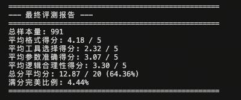

经过 WizardLM Pipeline 合成的 8k 数据进行 SFT 训练后，模型的输出发生了显著变化：不仅能稳定识别何时应调用工具、调用哪个工具，而且输出的 JSON 参数结构规范、键值对提取准确，工具选择得分从 2.32 大幅跃升至 4.15：

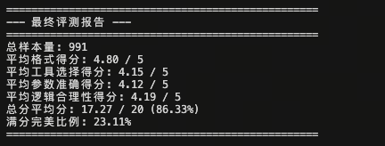

**训练过程监控**

下图为本次 Pipeline SFT 实验的训练损失曲线。相较于 Glaive-v2 方案，本次训练数据因注入了思维链（CoT），平均样本长度更长，导致前期 Loss 下降略慢；但在约 1/3 训练进程后曲线趋于平稳，训练集与验证集 Loss 走势高度吻合，说明 8k 条高质量合成数据在 3 个 epoch 内未出现过拟合现象，数据多样性对模型泛化能力起到了有效支撑：

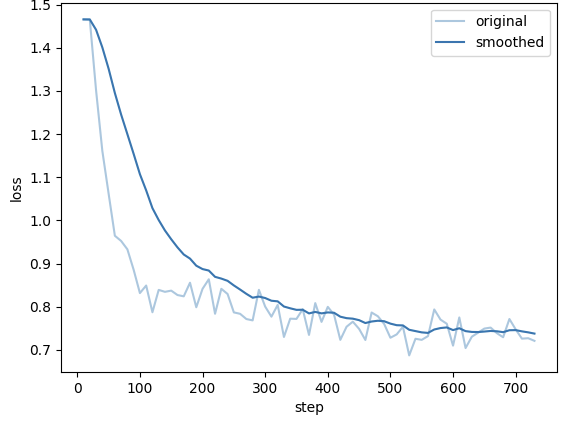


---

## 8. 评估基准与指标体系 (Evaluation Benchmarks & Metrics)

评估 Agent 的能力远比评估传统 LLM（只看下一个 Token 预测准确率）复杂。Agent 的评估必须关注**执行结果（Outcome）**、**过程逻辑（Process）**以及**格式规范性（Format）**。

### 8.1 核心指标：从结果到结构的深度度量

#### 1. Pass Rate (通过率) & Pass@k

**原理深度解析**：

Pass Rate 是衡量 Agent **功能正确性**的最直接指标。

* **Unit Test Pass Rate**: 对于代码生成或数学任务，通过运行单元测试用例的比例。

* **Execution Pass Rate**: 对于工具调用任务，API 是否成功返回了非 Error 结果，且结果包含了用户所需的信息。

* **Pass@k**: 由于 LLM 具有随机性（Temperature > 0），通常会生成 $k$ 个解决方案。如果其中至少有 1 个通过测试，则视为 Pass。公式如下：

    $$Pass@k = 1 - \frac{\binom{n-c}{k}}{\binom{n}{k}}$$

    其中 $n$ 是总采样次数，$c$ 是正确的次数。


**📝 案例分析：Python 代码 Agent**

* **任务**: "写一个函数计算斐波那契数列的第 n 项。"

* **评估**:

    * Agent 生成了代码 `def fib(n): ...`

    * **测试集**: `assert fib(1)==1`, `assert fib(10)==55`...

    * **结果**: 如果所有 assert 均通过，Pass Rate = 1.0；否则为 0.0。

#### 2. Win Rate (胜率) 与 LLM-as-a-Judge

**原理深度解析**：

对于开放式任务（如“帮我策划一次旅行”），没有唯一的标准答案。此时采用 **成对比较 (Pairwise Comparison)** 方法。

* **机制**: 引入一个更强的模型（如 GPT-4-Turbo）作为裁判（Judge）。

* **输入**: Prompt + 模型 A 的轨迹 + 模型 B 的轨迹。

* **输出**: A 胜、B 胜或平局 (Tie)。

* **Bradley-Terry 模型**: 将胜率转化为 Elo 分数，用于量化能力差距。


**📝 案例分析：旅行策划 Agent**

* **Prompt**: "帮我安排东京三日游。"


* **模型 A**: 给出了具体景点和交通路线，但遗漏了餐饮。

* **模型 B**: 给出了景点、餐饮和大致预算。

* **GPT-4 Judge**: "模型 B 考虑更全面，且包含预算估算，因此 B 胜。" -> **Win Rate (B vs A) +1**。

#### 3. AST Match (抽象语法树匹配)

**原理深度解析**：

Agent 输出通常是结构化的（Code, JSON, SQL）。传统的**字符串匹配 (String Matching)** 或 **BLEU/ROUGE** 分数在这里完全失效。

* **问题**: `{"a": 1, "b": 2}` 和 `{"b": 2, "a": 1}` 在字符串层面不相等，但在 JSON 语义层面完全一致。

* **解决方案**: 将文本解析为 **抽象语法树 (AST)** 或 **字典对象**，比较其结构和键值对，忽略空格、顺序和换行符的差异。


**📝 案例分析：API 调用参数校验**

* **Ground Truth (标准答案)**:

    ```json
    {"tool": "search", "args": {"query": "apple price", "limit": 5}}
    ```

* **Agent 输出**:

    ```json
    {
      "tool": "search",
      "args": {
        "limit": 5,
        "query": "apple price"
      }
    }
    ```

* **评估逻辑 (Python 伪代码)**:

    ```python
    import json
    # 字符串比较 -> False (顺序不同)
    print(pred_str == gold_str) 
    
    # AST/Object 比较 -> True (语义相同)
    def ast_match(pred, gold):
        try:
            return json.loads(pred) == json.loads(gold)
        except:
            return False
    ```
    *如果使用 AST Match，该 Agent 被判定为正确；若用字符串匹配则被误判为错误。*

---

### 8.2 主流榜单：多维度的能力测试场


#### 1. ToolBench：工具使用能力的试金石

**核心侧重**：**API 检索与调用**。

ToolBench 构建了一个包含 16,000+ 真实 API 的环境，重点测试 Agent 在极度复杂的工具空间中的表现。

* **测评维度**:

    1.  **Tool Selection**: 能否从 100 个候选工具中选出正确的那个？（考察 Retriever 能力）

    2.  **Argument Filling**: 参数是否填对？（考察 Schema 理解能力）

    3.  **Solvability**: 最终是否解决了用户问题？（通过 `ToolEval` 自动化评估器判定）

* **典型场景**: "我想买一个能在雨天用的防水背包，请帮我搜索 Amazon 上评分大于 4.5 的商品并按价格排序。"


#### 2. AgentBench：综合性 LLM-as-Agent 评测

**核心侧重**：**全能性 (Holistic Capabilities)**。

它不仅仅测工具，还测 Agent 在不同环境下的生存能力。它包含 8 个不同的子环境：

* **OS (操作系统)**: 在 Linux Shell 中执行 Bash 命令（如文件管理、正则搜索）。

* **DB (数据库)**: 编写 SQL 语句查询数据库。

* **KG (知识图谱)**: 在知识图谱上进行多跳推理。

* **LTP (横向思维谜题)**: 玩这就涉及逻辑陷阱的游戏。

* **Householding**: 在虚拟家庭环境（AlfWorld）中控制机器人做家务。

* **指标**: 主要是 Success Rate (SR) 和 Steps (完成任务所需的步数，越少越好)。


#### 3. SmartPlay：游戏化与长程规划

**核心侧重**：**空间推理与长期策略**。

SmartPlay 使用游戏（如 Minecraft, RPG 游戏, 逻辑解谜）作为测试床。与 ToolBench 只需要一步调用不同，SmartPlay 的任务通常需要 10-50 步连续操作。

* **关键挑战**:

    * **Soft Skills**: 探索能力（不陷入死循环）、地图记忆能力。


    * **Objective Hierarchy**: 理解主线任务（打败魔王）需要先完成支线任务（寻找钥匙）。

* **核心指标**:

    * **Completion Rate**: 游戏通关率。

    * **Efficiency**: 同样通关，谁用的步数更少？谁消耗的虚拟金币更少？

#### 📊 榜单对比总结

| 榜单名称 | 核心任务类型 | 评估方式 | 适用场景 |
| :--- | :--- | :--- | :--- |
| **ToolBench** | API 调用、工具链组合 | ToolEval (GPT-4 Judge) | 开发 SaaS 助手、插件系统 |
| **AgentBench** | OS操作、SQL、家务、常识 | 确定性脚本 + 结果校验 | 评估通用 Agent 的综合智力 |
| **SmartPlay** | 游戏、迷宫、开放世界 | 游戏引擎状态监测 | 机器人规划、复杂决策系统 |


## 9. 结论与展望：迈向自主智能的终极图景

智能体（Agent）能力的增强工程，本质上是一场**数据工程的深刻革命**。当前的研究与实践表明，单纯依赖基础模型的参数规模扩展（Scaling Laws）已不足以自然涌现出高质量的工具使用、复杂规划及自我纠错能力。

**“参数量决定了模型的智力上限，而高质量的Agent数据决定了模型解决实际问题的下限。”**

通过精心设计的、结构化的、包含显式推理过程的合成数据，我们正在打破大模型的垄断，赋予中小规模模型（7B-70B）媲美甚至超越闭源超大模型的代理能力。展望未来，Agent 数据构建与训练将呈现三大核心趋势：

### 9.1 推理拓扑的升维：从思维链 (CoT) 到思维图 (ToT/GoT)

未来的规划数据将不再局限于线性的 ReAct 模式，而是向更符合复杂决策逻辑的图状结构演进。

* **非线性决策**：现实世界的决策往往不是单向的。**Tree of Thoughts (ToT)** 和 **Graph of Thoughts (GoT)** 数据格式将允许模型在推理过程中进行“分支探索”、“回溯（Backtracking）”和“剪枝”。

* **多路径聚合**：模型将学会生成多种可能的解决方案，并在中间步骤通过“投票”或“验证”机制，将不同路径的优势整合成最优解（Best-of-N Selection），而非一条路走到黑。

* **蒙特卡洛树搜索 (MCTS) 的内化**：训练数据将包含类似 AlphaGo 的搜索轨迹，教导模型在行动前进行“思维模拟”，评估未来几步的期望回报。


### 9.2 全模拟训练 (The "Matrix" Paradigm)：零成本的经验获取

随着 Simia、Text-World 等框架的成熟，Agent 的训练场将从物理世界全面转移至 **LLM 生成的虚拟沙箱**。

* **摆脱物理约束**：在虚拟环境中，模型可以模拟“删除根目录”、“搞垮数据库”或“因错误操作导致资金归零”的极端后果，而无需承担现实风险。

* **时间折叠**：通过并行化模拟，Agent 可以在一天内经历人类操作员需要数年才能积累的交互场景（Corner Cases），实现经验的超速积累。

* **Sim2Real (虚实迁移)**：未来的核心挑战将是如何保证虚拟环境的反馈机制足够真实，使得在“矩阵”中训练的 Agent 能够无缝迁移到现实世界的 API 和物理设备中。

### 9.3 自我进化 (Self-Evolution)：AlphaZero 时刻的到来

Agent 训练的终极目标是摆脱对人类标注数据的依赖，实现**自主数据闭环 (Autonomous Data Flywheel)**。

* **自我指令生成 (Self-Instruct)**：Agent 根据对领域的理解，自动生成数以万计的任务指令，覆盖人类未曾设想的边缘场景。

* **自我博弈与互评 (Self-Play & Peer-Review)**：引入“执行者”与“批评家”双 Agent 架构。执行者尝试解决问题，批评家根据结果提供奖励信号。通过强化学习（RL），系统在没有人类干预的情况下不断自我迭代。

* **超越人类示范**：当 Agent 能够通过环境反馈（如代码运行通过率、游戏分数）直接学习时，它将不再受限于人类专家的水平，从而涌现出超越人类的解决策略（Superhuman Strategies）。


### 结语

我们正处于从“被动知识引擎（Chatbot）”向“主动行动者（Agent）”跨越的关键历史节点。掌握**工具定义的标准化**、**规划数据的图结构化**以及**环境模拟的自动化**，是通往通用人工智能（AGI）的必经之路。

未来的 Agent，将不再仅仅是回答问题的助手，而是能够真正理解意图、拆解目标、在动态环境中生存并持续进化的**自主智能实体**。


## 一键启动 Tool Use Pipeline

为便于快速复现 Tool Use 数据生成、SFT 训练与评测流程，我们提供了 [run_tooluse_pipeline.py](./code/run_tooluse_pipeline.py) 一键脚本。该脚本会串联数据准备、Pipeline 合成、SFT 训练、评测推理和 LLM-as-Judge 五个阶段。

### 文件结构

```
code/
├── run_tooluse_pipeline.py    # Tool Use Pipeline 一键脚本
└── run_sft.py                 # 经典数据集 SFT 基线脚本
```

### 配置步骤

1. **修改脚本顶部占位符**（编辑 `run_tooluse_pipeline.py` 顶部变量）：

```python
SFT_BASE_MODEL = '/path/to/sft/base/model'
LAZYLLM_PATH = '/path/to/lazyllm'
PIPELINE_MODEL = '/path/to/pipeline/model'
JUDGE_MODEL = '/path/to/judge/model'
```

2. **运行完整流程**：

```bash
cd from-data-to-llm/docs/chapter23/code
python run_tooluse_pipeline.py
```

3. **按需通过命令行覆盖默认配置**：

```bash
python run_tooluse_pipeline.py \
  --lazyllm-path /path/to/lazyllm \
  --pipeline-model /path/to/pipeline/model \
  --sft-base-model /path/to/sft/base/model \
  --judge-model /path/to/judge/model \
  --train-num-samples 20000 \
  --eval-num-samples 1000
```

### 默认数据源

脚本第一步会直接从 Hugging Face 下载数据，而不再依赖本地 `load_data.py` 生成中间文件：

| 数据用途 | 默认来源 | 说明 |
|------|------|------|
| 原始训练集 | `WizardLM/WizardLM_evol_instruct_70k` | 默认读取 `train` split，并通过 `https://hf-mirror.com` 下载 |
| 原始评测集 | `rirqing/tool_use` | 自动扫描数据集仓库文件并选择合适的评测文件下载 |

如果需要自定义数据源，可使用以下参数：

```bash
python run_tooluse_pipeline.py \
  --train-dataset-repo WizardLM/WizardLM_evol_instruct_70k \
  --train-dataset-split train \
  --train-dataset-endpoint https://hf-mirror.com \
  --eval-dataset-repo rirqing/tool_use \
  --eval-dataset-file data/test.jsonl
```

### 脚本流程说明

| 步骤 | 功能 | 输出 |
|------|------|------|
| 1. 数据准备 | 从 Hugging Face 下载 WizardLM 训练集与 `rirqing/tool_use` 评测集，并统一转换为脚本内部格式 | `data/tooluse_raw_train.json` (训练数据)<br>`data/tooluse_raw_eval.jsonl` (评测数据) |
| 2. Pipeline处理 | 使用 Tool Use Pipeline 生成 SFT 训练数据 | `data/train_tooluse_sft.json` |
| 3. SFT训练 | 使用 LLaMA-Factory 进行监督微调 | `models/tooluse_sft_checkpoint/` |
| 4. 推理测试 | 在评测集上运行推理 | `output/inference_results.json` |
| 5. 结果评测 | 使用 LLM-as-Judge 评估 Tool Use 能力 | `output/tooluse_evaluation.json` |

### 输出目录结构

```
code/
├── data/
│   ├── tooluse_raw_train.json      # 原始训练数据
│   ├── tooluse_raw_eval.jsonl      # 原始评测数据
│   └── train_tooluse_sft.json      # Pipeline生成的SFT数据
├── models/
│   └── tooluse_sft_checkpoint/     # 训练好的模型
└── output/
    ├── inference_results.json      # 推理结果
    └── tooluse_evaluation.json     # 评测报告
```

### 注意事项

- **数据缓存**：每个步骤会检查输出文件是否已存在且格式正确，若存在则直接跳过；如需重跑，请删除对应输出文件
- **步骤控制**：可使用 `--only-step` 只运行单个步骤，或使用 `--skip-steps 1,3` 跳过指定步骤
- **Pipeline参数**：可通过 `--pipeline-tasks`、`--pipeline-turns`、`--pipeline-min-completeness-score`、`--pipeline-min-feasibility-score` 调整数据合成强度与过滤阈值
- **训练与评测参数**：可通过 `--sft-epochs`、`--sft-learning-rate`、`--sft-batch-size`、`--judge-workers` 等参数覆盖默认配置
- **评测指标**：包括格式正确性、工具选择、参数准确性、逻辑合理性四个维度，每项 0-5 分，总分 20 分
- **依赖要求**：需预先安装 `lazyllm`、`datasets`、`huggingface_hub`，并准备可用的 GPU 资源
