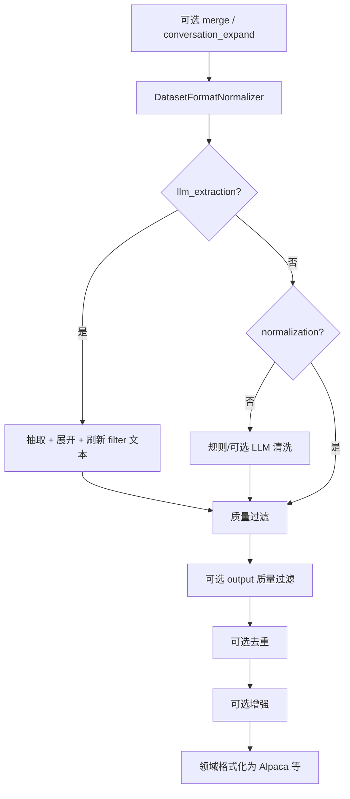
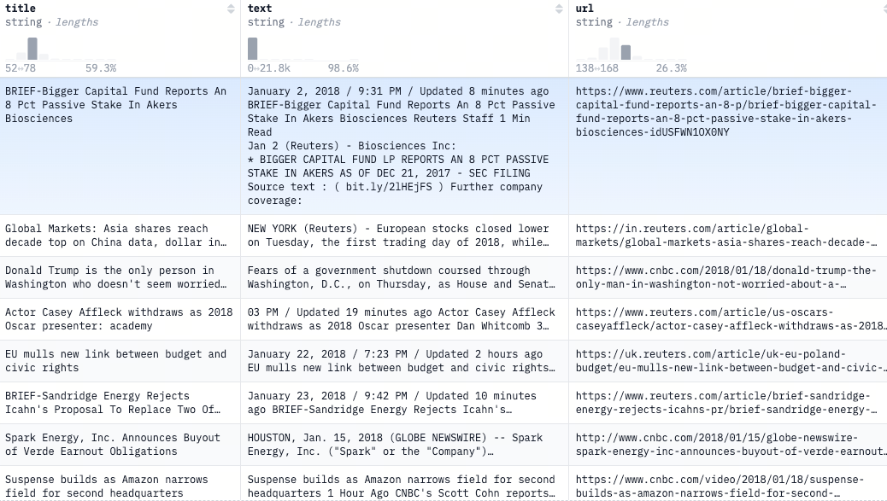
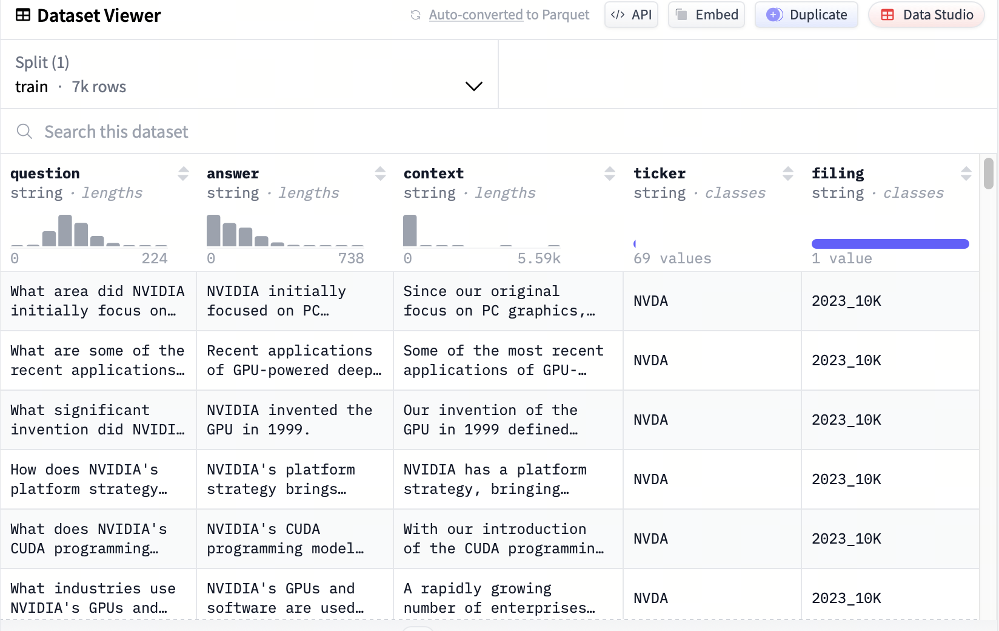
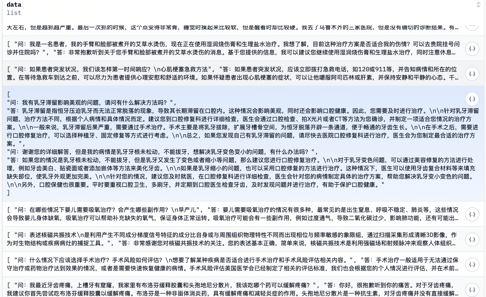

# 第24课时：行业领域模型实战（Industry Domain Training）

当你问通用大模型“心肌梗死的典型心电图表现是什么？”、“上市公司年报中的‘非经常性损益’如何计算？”或“如何起草一份有效的房屋租赁合同？”时，  
它可能会给出**听起来合理但细节错误甚至危险的回答**。

原因很简单：**通用大模型没有专门学习过医疗、金融、法律等垂直领域的知识**。

> ✅ 本课将手把手教你：如何让一个通用大模型“变身”为行业专家！  
> 聚焦以下核心环节：

> 1. **行业数据集准备**：清洗、脱敏、融合知识图谱；
> 2. **继续预训练（CPT）**：领域知识注入的训练策略与数据配比；
> 3. **领域指令数据集构建与微调（SFT）**：教会模型“按业务逻辑说话”；

本教程面向**零基础初学者**，用**通俗语言 + 关键公式 + 真实案例**，让你掌握工业级领域模型训练全流程。

---

## 1. 为什么需要行业领域模型？

### 1.1 通用模型的“知识盲区”

通用大模型（如 LLaMA、Qwen、ChatGLM）在公开网页上训练，具备广泛常识，但在专业领域存在：

- **知识陈旧**：训练数据截止于 2023 年，无法回答 2024 年新药审批；
- **细节错误**：混淆“心房颤动”与“室性心动过速”；
- **缺乏结构**：不能按法律条文框架组织答案；
- **安全风险**：可能泄露训练数据中的患者信息。

其语言先验（language prior）无法准确刻画专业领域中的术语、句式、逻辑结构；直接使用会导致**高预测不确定性**（即高困惑度）和**语义幻觉**。
> 💡 **类比**：通用模型像“百科全书式大学生”，而行业模型是“持证律师/主治医师/注册会计师”。

### 1.2 行业模型的核心目标

| 目标 | 实现方式 |
|------|----------|
| **知识准确** | 注入最新、权威的行业语料 |
| **表达专业** | 遵循行业术语、格式、逻辑 |
| **安全合规** | 数据脱敏、避免幻觉、可追溯 |
| **业务对齐** | 理解真实工作流（如病历书写、财报分析） |

---

## 2. 行业数据集准备：从原始数据到高质量语料

### 2.1 数据来源示例

| 领域 | 典型数据源 |
|------|------------|
| **医疗** | 电子病历（EMR）、医学指南（如 UpToDate）、PubMed 文献、临床试验报告 |
| **法律** | 裁判文书、法律条文、合同模板、律师问答 |
| **金融** | 上市公司财报、研报、招股书、监管文件（如 SEC filings）、财经新闻 |

> ⚠️ **注意**：行业数据往往包含**敏感信息**（如患者姓名、身份证号、交易金额），必须**严格脱敏**。

### 2.2 数据长什么样？

#### **法律领域**
- **Pile-Law**  
    - **来源**：The Pile 数据集中的法律子集，包含法院判决、法律评论、法规文本。  
    - **格式**：纯文本（`.txt`）  
    - **示例片段**：
      ```
      UNITED STATES DISTRICT COURT
      SOUTHERN DISTRICT OF NEW YORK
      ...
      Plaintiff alleges that Defendant violated Section 10(b) of the Securities Exchange Act...
      ```

- **CaseLaw**（Harvard Law School）  
    - **来源**：美国联邦与州法院数百万份裁判文书。  
    - **格式**：JSON，含 `case_id`, `court`, `date`, `text` 等字段。  
    - **示例**：
      ```json
      {
        "case_id": "123456",
        "court": "Supreme Court of California",
        "date": "2023-05-15",
        "text": "IN THE SUPREME COURT OF CALIFORNIA\n...\nThe defendant's motion to dismiss is granted."
      }
      ```

#### **学术/科研领域**
- **S2ORC **(Semantic Scholar Open Research Corpus)  
    - **来源**：8100 万篇学术论文，覆盖 CS、医学、物理等。  
    - **格式**：JSONL，每篇含 `paper_id`, `title`, `abstract`, `body_text`（带段落结构）。  
    - **示例**：
      ```json
      {
        "paper_id": "abcd1234",
        "title": "Attention Is All You Need",
        "abstract": "The dominant sequence transduction models...",
        "body_text": [
          {"section": "Introduction", "text": "Recurrent models typically factor..."},
          {"section": "Model Architecture", "text": "We propose the Transformer..."}
        ]
      }
      ```

#### **金融领域**
- **FinGPT**  
    - **来源**：上市公司财报、研报、财经新闻。  
    - **格式**：  
        - 财报：PDF 原始文件 + 结构化 JSON（含 `revenue`, `net_income`, `EBITDA` 等字段）；  
        - 研报：Markdown（保留标题、列表、表格）。  
    - **财报 JSON 示例**：
      ```json
      {
        "company": "Apple Inc.",
        "fiscal_year": 2023,
        "net_income": 96995000000,
        "EBITDA": 130541000000,
        "currency": "USD"
      }
      ```

- **FiQA**（Financial Opinion Mining and QA）  
    - **来源**：金融论坛问答、分析师评论。  
    - **格式**：JSON，含 `question`, `answer`, `sentiment`。  
    - **示例**：
      ```json
      {
        "question": "Is Tesla overvalued?",
        "answer": "Based on P/E ratio of 60x, it appears overvalued relative to peers.",
        "sentiment": "negative"
      }
      ```

- **Financial Q&A - 10k**
    - **来源**：公司财务报告的10,000个问答对。  
    - **格式**：JSON，含 `question`, `answer`, `content`, `ticker`, `filing`。  
    - **示例**：
      ```json
      {
        "question": "What area did NVIDIA initially focus on before expanding to other computationally intensive fields?",
        "answer": "NVIDIA initially focused on PC graphics.",
        "content": "Since our original focus on PC graphics, we have expanded to several other large and important compu...",
        "ticker":"NVDA",
        "filing":"2023_10K"
      }
      ```

#### **医疗领域**
- **MIMIC-III/IV**（Medical Information Mart for Intensive Care）  

    - **来源**：去标识化的 ICU 病历（含生命体征、用药、诊断）。  
    - **格式**：多个 CSV 表（`patients.csv`, `diagnoses_icd.csv`, `notes.csv`）。  
    - **`notes.csv` 示例**：
      ```
      row_id,subject_id,hadm_id,charttime,category,text
      1,10001,145834,2130-05-05 09:00:00,Discharge summary,"Final Diagnosis: Acute myocardial infarction..."
      ```

- **PubMed**  

    - **来源**：生物医学文献摘要。  
    - **格式**：XML（MEDLINE）或 JSON（via `biopython`）。  
    - **JSON 示例**：
      ```json
      {
        "title": "Aspirin in the treatment of acute myocardial infarction",
        "abstract": "Aspirin reduces mortality in patients with suspected AMI...",
        "mesh_terms": ["Aspirin", "Myocardial Infarction", "Anticoagulants"]
      }
      ```


### 2.3 工业级数据处理流水线（Pipeline）

1. **清洗**：
    - 去除 HTML 标签、乱码、广告；
    - 语言过滤（仅保留中文/英文）。
    - 代码示例
    ```python
    import re
    from langdetect import detect

    def clean_text(text: str, target_lang: str = "zh") -> str:
        # 1. 去除 HTML 标签
        text = re.sub(r"<[^>]+>", "", text)
        # 2. 保留中英文、数字、基础标点
        text = re.sub(r"[^\u4e00-\u9fa5a-zA-Z0-9\s.,;:!?。，；：！？\n\-—()（）]", " ", text)
        # 3. 多空格归一
        text = re.sub(r"\s+", " ", text).strip()
        # 4. 语言过滤（可选）
        try:
            if detect(text) != target_lang:
                return ""
        except:
            return ""
        return text
    ```

2. **去重**：
    - 使用 **MinHash** 计算文本相似度：
      $$
      \text{sim}(D_1, D_2) \approx \frac{\text{相同哈希值数量}}{\text{总哈希函数数量}}
      $$
    - 相似度 >0.95 判为重复，避免模型成为“复读机”。
    - 代码示例
    ```python
    from datasketch import MinHash, MinHashLSH

    # 初始化 LSH
    lsh = MinHashLSH(threshold=0.95, num_perm=128)
    minhashes = {}

    def add_to_lsh(doc_id: str, text: str):
        # 分词（简单按空格/字）
        tokens = list(text) if is_chinese(text) else text.split()
        m = MinHash(num_perm=128)
        for token in tokens:
            m.update(token.encode("utf8"))
        minhashes[doc_id] = m
        lsh.insert(doc_id, m)

    def is_duplicate(doc_id: str) -> bool:
        m = minhashes[doc_id]
        results = lsh.query(m)
        return len(results) > 1  # 自己也在内，>1 表示有重复

    # 使用示例
    docs = [("doc1", "心肌梗死的治疗..."), ("doc2", "心肌梗死的治疗...")]
    for doc_id, text in docs:
        add_to_lsh(doc_id, text)
        if is_duplicate(doc_id):
            print(f"{doc_id} 是重复文档，跳过")
    ```
3. **脱敏**（医疗/金融必备）：
    - 识别 PII（个人身份信息）：姓名、身份证、病历号；
    - 替换为占位符：`[PATIENT_NAME]`、`[ID_NUMBER]`。
    - 代码示例
    ```python
    import spacy
    from spacy.lang.zh import Chinese

    # 加载中文 NER 模型（需提前安装：python -m spacy download zh_core_web_sm）
    nlp = Chinese()
    nlp.add_pipe("ner")

    # 自定义医疗/金融实体规则
    ruler = nlp.add_pipe("entity_ruler", before="ner")
    patterns = [
        {"label": "ID_NUMBER", "pattern": [{"SHAPE": "ddddddddddddddxx"}]},  # 身份证
        {"label": "PHONE", "pattern": [{"TEXT": {"REGEX": r"1[3-9]\d{9}"}}]},  # 手机号
        {"label": "MEDICAL_RECORD", "pattern": [{"TEXT": "病历号"}, {"IS_DIGIT": True}]},
    ]

    ruler.add_patterns(patterns)

    def anonymize(text: str) -> str:
        doc = nlp(text)
        for ent in doc.ents:
            if ent.label_ in ["PERSON", "ID_NUMBER", "PHONE", "MEDICAL_RECORD"]:
                text = text.replace(ent.text, f"[{ent.label_}]")
        return text

    # 示例
    raw = "患者张三（病历号：MR20240501）电话 13800138000，诊断为心梗。"
    print(anonymize(raw))
    # 输出：患者[PATIENT_NAME]（病历号：[MEDICAL_RECORD]）电话 [PHONE]，诊断为心梗。
    ```

4. **合成**（扩充指令数据）：
    - **Self-Instruct**：用 GPT-4 根据专业文档生成指令-响应对；
    - 示例提示：
      ```
      基于以下医学指南，生成一个医生可能被问到的问题及专业回答：
      指南：STEMI 患者首选直接 PCI。
      ```

### 2.4 LazyLLM 领域数据 Pipeline（与代码对齐）

本节与 LazyLLM 源码中的两条主线一致：**无标注长文本**走继续预训练链路，**指令/对话**走监督微调链路。对应模块分别为 `lazyllm.tools.data.pipelines.domain_pretrain_pipelines` 与 `domain_finetune_pipelines`。

#### 2.4.1 继续预训练：`domain_pretrain_pipelines`

**功能开关常量** `DOMAIN_PRETRAIN_FEATURES` 包含：

| 开关 | 含义 |
|------|------|
| `field_normalization` | 字段映射、多字段拼接、回退字段，统一写入 `content_key` |
| `text_normalization` | Unicode 规范化、编码修复、空白归一 |
| `sensitive_info_cleaning` | 电话、邮箱、IP、银行卡等敏感信息替换 |
| `language_filter` | 按目标语言占比过滤文档 |
| `domain_keyword_filter` | 领域关键词命中 / 密度过滤 |
| `domain_relevance_scorer` | 加权关键词得分，低于阈值丢弃 |
| `ngram_repetition_filter` | N-gram 重复比例过滤，抑制模板化复读 |

**`build_domain_pretrain_pipeline`** 按固定顺序串联上述可选项（字段与文本规范化、脱敏为默认开启；语言/关键词/相关性按需开启），最后接 **N-gram 重复过滤**。

**`build_text_pt_pipeline`** 在单一 `content_key` 上执行「通用预训练清洗包」：空内容、HTML/实体/表情、字符/词/句规模、特殊字符与水印、身份证/JS/Lorem 等启发式过滤、符号比例、停用词与词表多样性、词黑名单、**MinHash 去重**，以及 **`TokenChunker`** 按 `min_tokens` / `max_tokens` 切块。

**`build_text_pt_plus_domain_pretrain_pipeline`** 将二者组合：**先**领域增强（`build_domain_pretrain_pipeline`），**再**通用 PT 管线；中英文默认的 `min_chars` / `min_words` / `min_tokens` 略有不同（中文阈值更宽松），便于中文语料保留更多片段。


#### 2.4.2 监督微调：`domain_finetune_pipelines`

**功能开关常量** `DOMAIN_FINETUNE_FEATURES` 包含：

| 开关 | 含义 |
|------|------|
| `normalization` | `DatasetFormatNormalizer`：多格式数据统一为带 `instruction`/`input`/`output` 的结构 |
| `adaptive_normalization` | `LLMFieldMapper`：用 LLM 做字段映射（需传入 `options['llm']`） |
| `conversation_expand` | `ConversationListExpander`：如 HuatuoGPT 的 `data` 列表拆成多条 QA |
| `llm_extraction` | `LLMDataExtractor` + `SampleExpander`：从长文本抽 QA 等并展开为多行 |
| `deduplication` | `hash` 或 `minhash`（由 `options['dedup_method']` 控制） |
| `augmentation` | `query_rewrite` / `synonym_replace` 等（需 `augment_methods` 与 LLM） |
| `llm_cleaning` | 规则清洗后可选 LLM 清洗（仅当**未**开启 normalization，避免结构化样本被当字符串清掉） |
| `output_quality_filter` | 对 `output` 最短长度、输入输出长度比等约束 |

**编排要点**（`build_domain_finetune_pipeline`）：

- 可选 **`merge_context_question`**：把 `context` 与 `question` 拼进同一字段（医疗/阅读理解类数据常用）。
- **归一化开启时**会跳过纯字符串的 `build_text_cleaning_pipeline`（源码中会打日志说明），质量过滤作用在拼接后的 `_filter_text` 上。
- 过滤类型由 `filters_config` 列表驱动，内置类型包括 `word_count`、`char_count`、`target_language`、`stop_word`、`unique_word`、`null_content`、`output_min_length`、`output_input_ratio` 等。
- 末端 **`DomainFormatAlpaca` / `ShareGPT` / `ChatML` / `Raw`** 输出到 `output_key`（如 `formatted_text`）。
- **`build_train_test_split_pipeline`**：`TrainValTestSplitter` 划分 train/validation/test。



**辅助构建函数**（可按需单独使用）：`build_text_cleaning_pipeline`、`build_source_to_content_pipeline`（文件/URL → Markdown → 正文）、`build_quality_filter_pipeline`、`build_llm_extraction_pipeline`、`build_domain_formatting_pipeline`、`build_data_augmentation_pipeline`。

---

## 3. 阶段一：继续预训练（CPT）——注入领域知识

### 3.1 原理：领域自适应（Domain Adaptation）

CPT 的目标是让模型**适应领域语言分布** $P_{\text{dom}}(x)$，而非通用分布 $P_{\text{gen}}(x)$。  
通过最小化领域语言建模损失：

$$
\mathcal{L}_{\text{CPT}} = -\mathbb{E}_{x \sim P_{\text{dom}}} \left[ \sum_t \log p_\theta(x_t \mid x_{<t}) \right]
$$

其中各符号含义如下：

- $\mathcal{L}_{\text{CPT}}$：继续预训练的损失函数值；
- $P_{\text{dom}}(x)$：**目标领域**（如医疗、金融、法律）中自然语言文本的概率分布；
- $x = (x_1, x_2, ..., x_T)$：一条来自领域语料的完整文本序列，长度为 $T$；
- $x_t$：序列中第 $t$ 个 token（词或子词）；
- $x_{<t} = (x_1, x_2, ..., x_{t-1})$：在预测第 $t$ 个 token 前的上下文；
- $p_\theta(x_t \mid x_{<t})$：由当前模型参数 $\theta$ 定义的条件概率，表示模型预测 $x_t$ 的置信度；
- $\mathbb{E}_{x \sim P_{\text{dom}}}[\cdot]$：对从领域分布 $P_{\text{dom}}$ 中采样的所有文本 $x$ 取期望（即平均损失）；
- $\theta$：待更新的模型参数（通常在通用模型预训练参数基础上微调）。

> ✅ **效果**：调整模型内部表示，使“心肌梗死”“EBITDA”等术语的嵌入更靠近相关概念。

### 3.2 预训练核心要点速查表（Quick Recap）

继续预训练（CPT）是将通用大模型“专业化”的第一步。为帮助读者快速掌握关键要点，现将核心信息整合如下：

| 维度 | 关键内容 | 说明 |
|------|----------|------|
| **目标** | 使模型适应领域语言分布 $P_{\text{dom}}(x)$ | 让“心肌梗死”“EBITDA”等术语的表示更贴近领域语义 |
| **训练目标** | 最小化领域语言建模损失：<br>$$\mathcal{L}_{\text{CPT}} = -\mathbb{E}_{x \sim P_{\text{dom}}} \left[ \sum_t \log p_\theta(x_t \mid x_{<t}) \right]$$ | 与通用预训练形式相同，但数据来自领域语料 |
| **数据要求** | 高质量、无标注、纯文本 | 推荐 Markdown 格式，保留标题层级与段落结构 |
| **混合策略** | $\mathcal{D}_{\text{mix}} = 0.8 \cdot \mathcal{D}_{\text{dom}} + 0.2 \cdot \mathcal{D}_{\text{gen}}$ | 防止灾难性遗忘，80/20 为成熟领域推荐比例 |
| **Tokenizer** | 通常**无需扩充** | LLaMA/Qwen 等 tokenizer 已覆盖大部分专业词汇；仅在含大量新符号（如化学式）时谨慎扩充 |
| **训练配置** | - 学习率：`2e-5`<br>- Epochs：1–2<br>- Batch：大 batch（如 512k tokens）<br>- 优化器：AdamW（β2=0.95） | 学习率比初始预训练低 5–10 倍 |
| **评估指标** | **领域困惑度**（PPL） | 越低越好；同时监控通用 benchmark（如 MMLU）防止遗忘 |
| **典型效果** | - 领域 PPL ↓30%<br>- C-Eval/CMMLU 得分 ↑15–25% | 模型“看懂”领域文档，为 SFT 奠定知识基础 |

> ✅ **一句话总结**：  
> CPT 不是重新训练，而是“定向微调语言能力”——用领域语料微调模型，使其“读得懂专业文献”，但**还不知道如何回答业务问题**（此为 SFT 的任务）。

### 3.3 关键策略

- **混合比例**：  
  为防止**灾难性遗忘**，混合通用数据：

$$
  \mathcal{D}_{\text{mix}} = 0.8 \cdot \mathcal{D}_{\text{dom}} + 0.2 \cdot \mathcal{D}_{\text{gen}}
$$

其中各符号含义如下：

  - $\mathcal{D}_{\text{mix}}$：混合训练数据集，用于 CPT；
  - $\mathcal{D}_{\text{dom}}$：**领域数据集**，包含来自目标领域的高质量文本（如医学指南、财报、法律条文）；
  - $\mathcal{D}_{\text{gen}}$：**通用数据集**，通常为原始预训练语料的子集（如 Wikipedia、Common Crawl）或公开通用语料（如 The Pile）；
  - 系数 $0.8$ 和 $0.2$：**混合比例**，表示每 batch 数据中 80% 来自领域数据，20% 来自通用数据；


- **Tokenizer 扩充**？  

    - **通常不需要**：LLaMA/Qwen 等模型的 tokenizer 已覆盖大部分专业词汇；
    - **例外**：若领域含大量新符号（如化学式、代码），可扩充 vocab，但需谨慎（破坏预训练表示）。

### 3.4 数据集构建

- 来源：清洗后的领域语料（如 10 万篇医学文献）；
- 格式：纯文本，按 2048 tokens 切分；
- 规模：建议 ≥1B tokens（7B 模型）。
- 代码示例：构建医学领域 CPT 数据集
  ```python
  import os
  import json
  import re
  from transformers import AutoTokenizer
  from tqdm import tqdm

  # Step 1: 初始化 tokenizer（与目标模型一致）
  tokenizer = AutoTokenizer.from_pretrained("meta-llama/Llama-3-8B")

  # Step 2: 定义清洗函数（保留中文/英文、数字、基础标点）
  def clean_text(text: str) -> str:
      # 去除 HTML / XML 标签
      text = re.sub(r"<[^>]+>", "", text)
      # 仅保留中英文、数字、标点、换行
      text = re.sub(r"[^\u4e00-\u9fa5a-zA-Z0-9\s.,;:!?。，；：！？\n\-—()（）]", " ", text)
      # 多空格归一
      text = re.sub(r"\s+", " ", text).strip()
      return text

  # Step 3: 遍历原始语料目录，清洗并合并为大文本流
  raw_dir = "./medical_corpus_raw/"        # 原始文件目录（.txt/.md/.json）
  output_file = "./cpt_medical.txt"        # 输出纯文本

  with open(output_file, "w", encoding="utf-8") as fout:
      for filename in tqdm(os.listdir(raw_dir), desc="Processing files"):
          filepath = os.path.join(raw_dir, filename)
          if not filepath.endswith((".txt", ".md", ".json")):
              continue
          
          # 读取文件
          if filename.endswith(".json"):
              with open(filepath, "r", encoding="utf-8") as f:
                  try:
                      data = json.load(f)
                      text = data.get("text", "")  # 假设字段为 "text"
                  except:
                      continue
          else:
              with open(filepath, "r", encoding="utf-8", errors="ignore") as f:
                  text = f.read()
          
          # 清洗并写入
          cleaned = clean_text(text)
          if len(cleaned) > 50:  # 过滤过短文本
              fout.write(cleaned + "\n\n")  # 段落间保留空行

  print(f"✅ 原始语料清洗完成，输出至: {output_file}")

  # Step 4: 按 2048 tokens 切分

  # 读取清洗后的大文本
  with open(output_file, "r", encoding="utf-8") as f:
      full_text = f.read()

  # 按换行/段落切分（保留语义边界）
  paragraphs = full_text.split("\n\n")

  # 拼接成 2048-token 块
  block_size = 2048
  current_block = []
  blocks = []

  for para in tqdm(paragraphs, desc="Tokenizing and chunking"):
      if not para.strip():
          continue
      # Tokenize 段落
      tokens = tokenizer(para, add_special_tokens=False)["input_ids"]
      current_block.extend(tokens)
      
      # 若超过 block_size，截断并保存
      while len(current_block) >= block_size:
          blocks.append(current_block[:block_size])
          current_block = current_block[block_size:]

  # 保存为纯文本（每块一行，token 用空格连接，LazyLLM 可直接读取）
  cpt_dataset_file = "./cpt_medical_dataset.txt"
  with open(cpt_dataset_file, "w", encoding="utf-8") as f:
      for block in blocks:
          # 转回文本（保留原始字形）
          text_block = tokenizer.decode(block, skip_special_tokens=True)
          f.write(text_block + "\n")

  print(f"✅ 数据集构建完成！共 {len(blocks)} 块，约 {len(blocks) * block_size / 1e9:.2f}B tokens")
  ```


### 3.5 LazyLLM 实战代码

以下示例演示如何用 `TrainableModule` 串联「微调 → 部署 → 评测」。

```python
import lazyllm
from lazyllm import finetune, deploy, launchers

model = lazyllm.TrainableModule(model_path)\
    .mode('finetune')\
    .trainset(train_data_path)\
    .finetune_method((finetune.llamafactory, {
        'learning_rate': 1e-4,
        'cutoff_len': 5120,
        'max_samples': 20000,
        'val_size': 0.01,
        'per_device_train_batch_size': 2,
        'num_train_epochs': 2.0,
        'launcher': launchers.sco(ngpus=8)
    }))\
    .prompt(dict(system='You are a helpful assistant.', drop_builtin_system=True))\
    .deploy_method(deploy.Vllm)
model.evalset(eval_data)
model.update()
```
上面代码中，使用LazyLLM的`TrainableModule`来实现：微调->部署->推理:

* 模型配置：
    * `model_path`指定了我们要微调的模型，这里我们用Internlm2-Chat-7B，直接指定其所在路径即可；

* 微调配置：
    * `.mode`设置了启动微调模式`finetune`；
    * `.trainset `设置了训练用的数据集路径，这里用到的就是我们前面处理好的训练集；
    * `.finetune_method` 设置了用哪个微调框架及其参数，这里传入了一个元组（只能设置两个元素）：
      * 第一个元素指定了使用的微调框架是Llama-Factory：`finetune.llamafactory`
      * 第二个元素是一个字典，包含了对该微调框架的参数配置；

* 推理配置：
    * `.prompt `设置了推理时候用的Prompt，注意，这里为了和微调的Prompt中的system字段保持一致，所以开启`drop_builtin_system`以将原system-prompt给替换为\`You are a helpful assistant.\`
    * `.deploy_method `设置了部署用的推理框架，这里指定了vLLM这个推理框架；
* 评测配置：
    * 这里通过`.evalset`来配置了我们之前处理好的评测集；
* 启动任务：
    * `.update` 触发任务的开始：模型先进行微调，微调完成后模型会部署起来，部署好后会自动使用评测集全部都过一遍推理以获得结果；


LazyLLM 除了可以便捷进行模型微调，还提供了专用于领域数据处理的 pipeline。下面以金融领域为例，展示如何使用 LazyLLM 实现完整的继续预训练流程。完整代码见 [domain_pt](./code/domain_pt_ppl.py)。

**数据集简介**：示例脚本默认使用 Hugging Face 上的 [`ashraq/financial-news-articles`](https://huggingface.co/datasets/ashraq/financial-news-articles)。原始语料来自 Kaggle 的 **US Financial News Articles**，经用户 **ashraq** 整理后发布；全量约 **306,242** 篇英文金融新闻文章，适合作为财经领域 CPT 的演示语料（可通过 `--dataset_name`、`--local_path` 等参数替换为其他来源）。
```python
    train_file = os.path.join(args.output_dir, 'train.json')
    eval_file_path = os.path.join(args.output_dir, 'eval.jsonl')

    if args.build_dataset:
        print('>>> 步骤 1：加载文本数据')
        raw_items = load_text_data(
            dataset_name=args.dataset_name,
            split=args.split,
            max_samples=args.max_samples,
            content_key=args.content_key,
            local_path=args.local_path,
        )
        print(f'\n>>> 步骤 2：Pipeline 处理（规范化 → 过滤 → 去重 → 分块）')
        print(f'    启用功能: {", ".join([k for k, v in enabled.items() if v])}')

        result = build_pretrain_dataset(
            raw_items=raw_items,
            domain=args.domain,
            content_key=args.content_key,
            output_dir=args.output_dir,
            language=args.language,
            domain_keywords=args.domain_keywords,
            enabled=enabled,
            options=options,
            eval_seed=args.eval_seed,
            eval_ratio=args.eval_ratio,
            eval_from_train=args.eval_from_train,
        )
        train_file = result['train_file']
        eval_file_path = result['eval_file']
        total_chunks = result['total_chunks']
        print(f'预训练数据集构建完成！共生成 {total_chunks} 个分块')

    if args.eval_quality:
        if not os.path.exists(train_file):
            print(f'\n错误：分块文件不存在，请先运行 --build_dataset 生成 {train_file}')
            return
        print(f'\n>>> 质量评估：分块数据统计')
        evaluate_chunk_quality(
            chunk_file=train_file,
            max_samples=args.max_eval_samples,
            output_dir=args.output_dir,
        )

    if args.train_flag:
        if not os.path.exists(train_file):
            print(f'\n错误：预训练数据不存在，请先运行 --build_dataset 生成 {train_file}')
            return
        print(f'\n>>> 步骤 3：执行 LLM 预训练')
        run_pretrain(
            pretrain_data_path=train_file,
            base_model=args.base_model,
            train_target_path=args.train_target_path,
            num_epochs=args.num_epochs,
            per_device_batch_size=args.per_device_batch_size,
            learning_rate=args.learning_rate,
            gradient_accumulation_steps=args.gradient_accumulation_steps,
            cutoff_len=args.cutoff_len,
            warmup_ratio=args.warmup_ratio,
            ngpus=args.ngpus,
            save_steps=args.save_steps,
            logging_steps=args.train_logging_steps,
            save_total_limit=args.save_total_limit,
            train_launcher=args.train_launcher,
            sco_partition=args.sco_partition,
            sco_resource=args.sco_resource,
        )

    if args.eval_model:
        eval_file = args.eval_chunk_file or eval_file_path
        pretrained_path = './models/financial_pt/lazyllm_merge'
        if not os.path.isfile(eval_file):
            print(f'\n错误：评测集不存在: {eval_file}，请先运行 --build_dataset 或指定 --eval_chunk_file')
            return
        evaluate_pretrained_model(
            base_model_path=args.base_model,
            pretrained_model_path=pretrained_path,
            eval_jsonl_path=eval_file,
            output_dir=args.output_dir,
            max_eval_samples=args.eval_max_ppl_samples or MAX_EVAL_SAMPLES_DEFAULT,
            max_new_tokens=args.eval_max_new_tokens,
            ppl_max_length=EVAL_MAX_LENGTH,
            gen_batch_size=EVAL_GEN_BATCH_SIZE,
            ppl_mode=args.ppl_mode,
        )

    if not args.build_dataset and not args.train_flag and not args.eval_quality and not args.eval_model:
        print('请指定 --build_dataset / --train_flag / --eval_quality / --eval_model 至少其一')
        print('示例：python domain_pt_ppl.py --build_dataset --max_samples 1000')
        print('      python domain_pt_ppl.py --eval_model --pretrained_model /path/to/pretrained')
```

## 4. 阶段二：监督微调（SFT）——学习业务逻辑

### 4.1 原理：从“续写”变成“问答”

通用模型的训练目标是**自回归续写**：

$$
p_\theta(y \mid x) \quad \text{（给定前文，预测下文）}
$$

  - $x = (x_1, x_2, ..., x_m)$：输入上下文（前文），例如一段文章或对话历史；
  - $y = (y_1, y_2, ..., y_n)$：模型需要生成的后续文本（下文）；
  - $p_\theta(y \mid x)$：在模型参数 $\theta$ 下，生成序列 $y$ 的条件概率；
  - $\theta$：模型全部可训练参数（通常在预训练阶段已固定大部分知识）。

SFT 将其转化为**条件生成**：

$$
p_\theta(y \mid \text{instruction}, \text{input}) \quad \text{（按指令生成答案）}
$$

  - $\text{instruction}$：明确的任务指令，例如 “作为一名心内科医生，请解释心肌梗死的治疗原则”；
  - $\text{input}$：可选的附加上下文（如患者主诉、合同条款），若无则为空；
  - $y$：专家撰写的**标准答案**，严格遵循业务规范（如医疗 SOAP 格式、法律三段论）；
  - $p_\theta(y \mid \text{instruction}, \text{input})$：模型在给定指令和输入下生成标准答案的概率。

> ✅ **关键**：教会模型**遵循业务逻辑**（如法律三段论、医疗 SOAP 格式）。

### 4.2 构建优质数据集
下面我们以 **financial-qa-10K** 为例讲解输出处理过程，该数据集仅包含 `train` 拆分（split），因此需在本地进行训练/验证集划分，以支持模型开发与效果评估。

整个数据构建流程由以下五个核心函数协同完成：

##### 1. `load_data(data_path)`

该函数用于从指定路径加载已保存的 JSON 格式数据集。虽然在当前流程中主要用于调试或二次加载，但其设计保证了数据读取的通用性与可复用性。

```python
def load_data(data_path):
    """Load JSON data from specified file path"""
    with open(data_path, 'r') as file:
        dataset = json.load(file)
    return dataset
```

##### 2. `build_data_path(file_name)`

为确保数据存储路径的一致性与可维护性，该函数在项目根目录下自动创建 `data/` 子目录（若不存在），并返回目标文件的完整路径。

```python
def build_data_path(file_name):
    """Construct data storage path and ensure directory exists"""
    data_root = os.path.join(os.getcwd(), 'data')
    if not os.path.exists(data_root):
        os.makedirs(data_root)
    save_path = os.path.join(data_root, file_name)
    return save_path
```

##### 3. `build_eval_data(data)`

评估数据集需保留原始语义结构，便于后续使用标准指标（如 Exact Match、F1 Score）进行自动评测。该函数从原始样本中提取 `context`、`question` 和 `answer` 字段，并统一重命名为 `answers`（兼容多答案格式）。

```python
def build_eval_data(data):
    """Extract necessary fields for evaluation dataset"""
    extracted_data = []
    for item in data:
        extracted_item = {
            "context": item["context"],
            "question": item["question"],
            "answers": item["answer"]  # 直接使用 answer 字段
        }
        extracted_data.append(extracted_item)
    return extracted_data
```

> **说明**：尽管原始字段名为 `answer`（单数），此处仍将其映射为 `answers`（复数），以兼容后续可能引入的多参考答案场景。

##### 4. `build_train_data(data)`

训练数据需适配指令微调（Instruction Tuning）范式。为此，我们采用预定义的提示模板 `template`，将上下文与问题融合为自然语言指令，模型则学习从该指令生成对应答案。

```python
def build_train_data(data):
    """Format training data using predefined template"""
    extracted_data = []
    for item in data:
        extracted_item = {
            "instruction": template.format(context=item["context"], question=item["question"]),
            "input": "",
            "output": item["answer"]
        }
        extracted_data.append(extracted_item)
    return extracted_data
```

> **模板示例**（假设）：
> ```python
> template = "根据以下金融背景信息回答问题：\n背景：{context}\n问题：{question}"
> ```
> 此设计使模型明确区分“指令”与“输入”，符合主流微调框架（如 LLaMA-Factory、Alpaca 格式）的数据要求。

##### 5. `get_dataset(data_name, rebuild=False, test_size=0.1)`

这是整个流程的主控函数，负责协调数据下载、划分、转换与持久化：

- 若 `train_set.json` 或 `eval_set.json` 不存在，或用户显式设置 `rebuild=True`，则从 Hugging Face Hub 加载原始数据集；
- 自动检测是否存在 `test` 拆分：若存在，则直接使用；否则从 `train` 中按 `test_size`（默认 10%）进行随机划分（固定随机种子 `seed=42` 以保证可复现性）；
- 分别调用 `build_train_data` 与 `build_eval_data` 进行格式转换；
- 将结果保存至 `data/train_set.json` 和 `data/eval_set.json`。

```python
def get_dataset(data_name, rebuild=False, test_size=0.1):
    """Get or rebuild dataset from HuggingFace hub
    
    If dataset only has 'train' split, automatically split into train/test sets.
    """
    train_path = build_data_path('train_set.json')
    eval_path = build_data_path('eval_set.json')
    if not os.path.exists(train_path) or not os.path.exists(eval_path) or rebuild:
        dataset = datasets.load_dataset(data_name)
        if 'test' in dataset:
            test_data = dataset['test']
            train_data = dataset['train']
        else:
            split_dataset = dataset['train'].train_test_split(test_size=test_size, seed=42)
            train_data = split_dataset['train']
            test_data = split_dataset['test']
        save_res(build_eval_data(test_data), eval_path)
        save_res(build_train_data(train_data), train_path)
    return train_path, eval_path
```

> **注**：`save_res()` 为辅助函数（未在代码块中展示），用于将 Python 对象序列化为 JSON 文件。

---

#### 输出结果

执行 `get_dataset("FinGPT/financial-qa-10K")` 后，将在项目目录下生成如下结构：

```
your_project/
├── data/
│   ├── train_set.json   # 指令微调格式，含 instruction/output
│   └── eval_set.json    # 评估格式，含 context/question/answers
└── ...
```

这两个文件可直接用于：
- **训练阶段**：作为 LLM 微调框架（如 LLaMA-Factory、LazyLLM）的输入；
- **评估阶段**：配合自定义评测脚本，计算模型在金融问答任务上的准确率。


### 4.3 常规数据处理 + LazyLLM 实战代码 
LazyLLM支持微调、部署、推理一条龙，但如果已微调好一个大模型，想直接使用它应该怎么办呢？很简单：其中的base_model不变，用target_path指定微调好的模型路径即可，这里我们先展示如何使用常规数据方法并结合LazyLLM进行模型微调如下所示：

完整代码见 [sft_llm](./code/sft_llm.py)。

```python
import os
import lazyllm

 model = lazyllm.TrainableModule(model_path)\
            .mode('finetune')\
            .trainset(train_data_path)\
            .finetune_method((finetune.llamafactory, {
                'learning_rate': 1e-4,
                'cutoff_len': 5120,
                'max_samples': 20000,
                'val_size': 0.01,
                'per_device_train_batch_size': 2,
                'num_train_epochs': 2.0,
                'launcher': launchers.sco(ngpus=1)
            }))\
            .prompt(dict(system='You are a helpful assistant.', drop_builtin_system=True))\
            .deploy_method(deploy.Vllm)
        model.evalset(eval_data)
        if mode == 'local_train':
            model.update()  # Auto: Start fine-tuning -> Launch inference service -> Run evaluation
        else:
            model.start()  # Start inference service
            model.eval()  # Run evaluation
        eval_res = model.eval_result
```

### 4.4 LazyLLM 领域数据处理 + LazyLLM 实战

下面以医疗领域为例，展示如何用 LazyLLM 做较完整的数据清洗与格式统一，并完成 **监督微调（SFT）** 全流程。完整代码见 [medical_domain_ft](./code/medical_domain_ft_ppl.py)。

**数据集简介**

- **数据形态**：**HuatuoGPT** 医疗问答数据集HuatuoGPT。样本由 **患者案例叙述** 与 **医生侧问答/回复** 等内容组成，经 `data` 等字段组织为可解析的文本与对话结构，便于展开为指令微调格式。
- **数据规模**：全量约 **26 万** 条量级文本样本；书中实验为控制算力与迭代成本，常 **`--max_samples 20000`** 取前 **2 万条** 参与构建，再按 `train_ratio` / `validation_ratio` / `test_ratio` 划分训练集、验证集与测试集（全量跑法则去掉 `max_samples` 限制即可）。


| 步骤 | 实现要点 |
|------|----------|
| 数据加载 | `load_huatuo`：`datasets.load_dataset`，可选 `max_samples` 试跑 |
| 核心 Pipeline | `enabled` 含 `conversation_expand`、`normalization`、`deduplication`、`output_quality_filter`；`filters_config` 使用偏医疗的字符下限与空内容过滤 |
| 微调 | `run_finetune`：`finetune.auto` + `launchers.remote`，Alpaca 三字段写入 `trainset` |
| 效果对比 | `evaluate_llm_effect`：基座与微调模型对同一批 prompt 推理，**嵌入余弦相似度**（默认 `BAAI/bge-large-zh-v1.5`）对比模型输出与标准答案 |

命令行典型用法：`--build_dataset`、`--build_dataset --train_flag`、`--eval_test`（可与 `--finetuned_model_path` 指向已训好权重）。

```python
 llm = lazyllm.TrainableModule(args.base_model)
    train_file = os.path.join(args.output_dir, 'medical_train.jsonl')
    test_file = os.path.join(args.output_dir, 'medical_test.jsonl')

    if args.build_dataset:
        print('>>> 步骤 1：从 HuggingFace 加载 HuatuoGPT-sft-data-v1')
        raw_items = load_huatuo(
            dataset_name=args.dataset_name,
            split=args.split,
            max_samples=args.max_samples,
        )
        print('\n>>> 步骤 2：Pipeline 处理（归一化 → 过滤 → 去重 → 格式化 → 划分）')
        paths = build_medical_dataset(
            raw_items=raw_items,
            output_format=args.output_format,
            train_ratio=args.train_ratio,
            validation_ratio=args.validation_ratio,
            test_ratio=args.test_ratio,
            output_dir=args.output_dir,
            llm=llm,
        )
        train_file = paths['train_file']
        test_file = paths.get('test_file', test_file)
        counts = paths['counts']
        print(f'数据集构建完成！train={counts["train"]}, validation={counts["validation"]}, test={counts["test"]}')

    finetuned_model = None
    if args.train_flag:
        if not os.path.exists(train_file):
            print('\n错误：训练数据不存在，请先运行 --build_dataset')
            return
        eval_data = None
        if args.eval_test and os.path.isfile(test_file):
            eval_data, _ = build_eval_data_from_test(
                test_file, args.max_eval_samples, default_instruction=MEDICAL_INSTRUCTION_ZH
            )
        print('\n>>> 步骤 3：执行 LLM 微调')
        finetuned_model = run_finetune(
            base_model=args.base_model,
            train_data_path=train_file,
            output_dir=os.path.join(args.output_dir, 'finetuned_model'),
            num_epochs=args.num_epochs,
            per_device_batch_size=args.per_device_batch_size,
            learning_rate=args.learning_rate,
            gradient_accumulation_steps=args.gradient_accumulation_steps,
            cutoff_len=args.cutoff_len,
            warmup_ratio=args.warmup_ratio,
            ngpus=args.ngpus,
            eval_data=eval_data,
        )

    if args.eval_test:
        if not os.path.isfile(test_file):
            print(f'\n错误：测试集不存在，请先运行 --build_dataset 生成 {test_file}')
            return
        finetuned_for_eval = finetuned_model
        if finetuned_for_eval is None and args.finetuned_model_path:
            finetuned_for_eval = args.finetuned_model_path
        if finetuned_for_eval is None:
            p = os.path.join(args.output_dir, 'finetuned_model')
            if os.path.exists(p):
                finetuned_for_eval = p
        print('\n>>> 效果测试：微调前 vs 微调后（Cosine 语义相似度）')
        evaluate_llm_effect(
            test_file=test_file,
            base_model=args.base_model,
            finetuned_model=finetuned_for_eval,
            max_eval_samples=args.max_eval_samples,
            output_dir=args.output_dir,
            default_instruction=MEDICAL_INSTRUCTION_ZH,
        )

    if not args.build_dataset and not args.train_flag and not args.eval_test:
        print('请指定 --build_dataset / --train_flag / --eval_test 至少其一')
        print('示例：python medical_domain_ft_ppl.py --build_dataset --max_samples 500')
```
## 5. 效果评估

为全面衡量微调后大语言模型在垂直领域任务上的性能，本系统设计了一套多维度的自动评估方案。**继续预训练（PT）** 与 **监督微调（FT）** 的评估目标不同，应选用不同指标：

| 阶段 | 典型 | 主指标 | 含义 |
|------|----------|--------|------|
| **PT** | **3.6** `domain_pt_ppl.py` 中 `evaluate_pretrained_model` | **交叉熵损失**、**困惑度（PPL）** | 语言建模是否更贴合领域语料分布 |
| **FT** | **4.4** `medical_domain_ft_ppl.py` 中 `evaluate_llm_effect` | **余弦相似度（CosSim）** | 生成答案与参考答案在语义向量空间中是否接近 |

PT 脚本还可报告续写 **BLEU-2 F1** 等生成类辅助指标；FT 若对接金融问答示例代码（如 [sft_llm](./code/sft_llm.py)），可额外使用 **Exact Match**、**Origin Score** 等任务相关指标，本节不再展开。

---

### 5.1 继续预训练（PT）：交叉熵损失与困惑度

**定义**：PT 阶段模型学习目标为下一词预测。对一条 token 序列 \(x = (x_1,\ldots,x_T)\)，在长度有效的监督位置上平均 **负对数似然** 即为常用 **loss**；其指数化为 **困惑度 PPL**。数值上 **loss 越低、PPL 越低**，表示模型对领域文本的预测越自信、越一致。

设单条样本在参与反传的 token 位置集合上，模型输出分布为 \(p_\theta\)，真实下一词为 \(x_t\)，则该样本损失可写为：

\[
\ell_i = -\frac{1}{|\mathcal{T}_i|} \sum_{t \in \mathcal{T}_i} \log p_\theta(x_t \mid x_{<t})
\]

其中 \(\mathcal{T}_i\) 为第 \(i\) 条样本中计入损失的 token 下标集合（实现上常对 `prefix` 部分 mask 掉，仅对 `continuation` 计 loss，即 **条件 PPL**；也可对整段文本计 loss，即 **无条件 PPL**，见脚本 `--ppl_mode`）。

在 \(N\) 条评测样本上，按 token 数加权或按样本平均可得到整体 **平均 loss** \(\bar{\ell}\)。**困惑度**定义为：

\[
\text{PPL} = \exp(\bar{\ell})
\]

> **注意**：实现中可能对过大 loss 做截断再取 exp，以避免数值溢出；对比 **基座模型** 与 **CPT 后模型** 时应在同一评测集、同一 `ppl_mode` 下进行。

---

### 5.2 监督微调（FT）：余弦相似度

**定义**：FT 关注「指令 + 上下文 → 答案」是否对齐参考答案。配套医疗 SFT 脚本将模型输出与标准答案分别送入**句向量模型**（如 `BAAI/bge-large-zh-v1.5`），在向量空间比较方向一致性，对措辞变化不敏感。

**计算流程**：

1. 用同一嵌入模型分别编码预测 \(\hat{y}_i\) 与参考答案 \(y_i\)；
2. 计算两向量的余弦相似度并可在 \([0,1]\) 上截断；
3. 对 \(N\) 条样本取算术平均，得到 **平均余弦相似度**。

**公式**：设 \(\mathbf{v}_{\hat{y}_i}\)、\(\mathbf{v}_{y_i}\) 分别为 \(\hat{y}_i\)、\(y_i\) 的嵌入向量，则

\[
s_i^{\text{cos}} = \frac{\mathbf{v}_{\hat{y}_i} \cdot \mathbf{v}_{y_i}}{\|\mathbf{v}_{\hat{y}_i}\| \cdot \|\mathbf{v}_{y_i}\|}, \qquad
\text{CosSim} = \frac{1}{N} \sum_{i=1}^{N} s_i^{\text{cos}}
\]

值越接近 \(1\)，表示语义越接近参考答案。

---

### 5.3 评估流程与产出

**PT（`evaluate_pretrained_model`）**

1. 读取 `eval.jsonl` 中 `prefix` + `continuation` 样本；
2. 对基座与（可选）CPT 后模型分别前向计算 loss，汇总 **平均 loss** 与 **PPL**；
3. 可选：以 `prefix` 为提示做续写，与 `continuation` 对比得 **BLEU-2 F1**；
4. 指标与逐条结果写入 `eval_runs/` 下 JSON / JSONL。

**FT（`evaluate_llm_effect` / `calculate_score`）**

1. 构造与训练一致的 prompt 列表，分别用基座与微调模型推理；
2. 批量调用嵌入模块，逐条算 **余弦相似度**，对比微调前后 **平均 CosSim**；
3. 可将明细写入 `medical_eval_detail_before.json`、`medical_eval_detail_after.json` 等。

---

### 5.4 输出结果

以下为同一基座 **Qwen2.5-0.5B-Instruct** 上的示意数值，便于对照阅读。

**PT（继续预训练评测）**

| 模型 | PPL | loss |
|------|-----|------|
| 基座模型 | 13.63 | 2.61 |
| 预训练模型 | 11.16 | 2.41 |

**FT（医疗 SFT，余弦相似度）**

| 阶段 | Cosine Score |
|------|--------------|
| 微调前（基座） | 79.92% |
| 微调后 | 83.99% |

---

## 6. 总结：行业模型训练三步法

| 阶段 | 目标 | 关键技术 | 原理支撑 |
|------|------|----------|----------|
| **数据准备** | 构建安全、高质量、结构化语料 | 脱敏、清洗、知识图谱融合 | 信息完整性 + 隐私保护 |
| **继续预训练** | 注入领域知识，调整内部表示 | 80/20 数据配比、低学习率 | 语言建模目标 $\mathcal{L}_{\text{LM}}$ |
| **指令微调** | 教会模型按业务逻辑输出 | 专家编写、角色化指令 | 任务对齐 + 知识激活 $\mathcal{L}_{\text{SFT}}$ |
