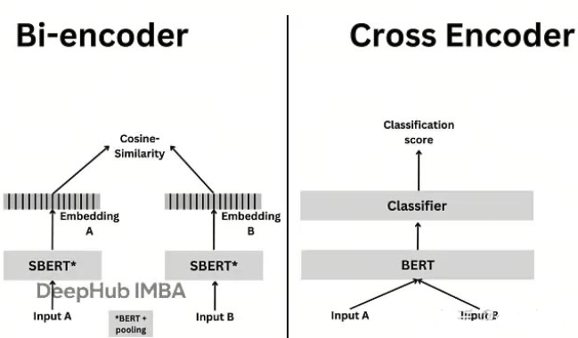

# 第25课时：Reranker 模型微调与实战

在 RAG（检索增强生成）系统中，**Retriever 模型负责初筛**（召回），  
但初筛结果往往包含大量“似是而非”的干扰项——  
例如，查询“心肌梗死的治疗”，检索返回“心肌炎治疗”“心力衰竭管理”“PCI手术流程”等。

> ✅ **Reranker**（重排序模型）正是解决这一问题的**精排利器**。  
> 它能对初筛结果进行**精细化相关性打分**，将真正相关的文档排到最前面。

本课将从**零基础原理出发**，系统讲解：

1. **核心原理**：Cross-encoder 架构 vs Bi-encoder，相关性打分机制，计算开销分析；
2. **数据构建**：如何利用 LLM 蒸馏生成高质量排序数据，Pairwise 与 Listwise 格式的区别；
3. **微调与实战**：微调 BGE-Reranker，并集成到 RAG 系统。

用**通俗语言 + 公式 + 工业界案例**，让你掌握 Reranker 从理论到落地的完整能力。

---

## 1. Reranker 的核心原理：Cross-encoder 如何弥合语义鸿沟

### 1.1 Cross-encoder 的交互机制


Cross-encoder 通过将 Query 和 Document 拼接后联合输入 Transformer（如 MacBERT），利用其强大的自注意力机制实现深度语义交互，再通过 Classifier 输出相关性概率，从而在重排序任务中获得远超 Bi-encoder 的精度。

Reranker 采用 **Cross-encoder** 架构，其核心是将 Query 和 Document **拼接后联合输入 Transformer**：
$$
\text{input} = [\text{[CLS]} \, q \, \text{[SEP]} \, d \, \text{[SEP]}]
$$

- $q$：用户输入的查询文本，例如 “心肌梗死的治疗”；
- $d$：从检索器（Retriever）返回的候选文档片段，例如 “阿司匹林不用于心肌炎”；
- **[CLS]**：特殊的分类 token（Classification token），位于序列开头，其最终隐藏状态常用于表示整个序列的语义；
- **[SEP]**：分隔符 token（Separator token），用于分隔查询和文档两个部分；
- $\text{input}$：拼接后的完整输入序列，作为 Transformer 的输入。

模型通过 **全注意力机制**（Full Self-Attention）建模所有 token 之间的交互关系。

> ✅ **关键能力**：

> - 注意力头可聚焦于“心肌梗死” vs “心肌炎”的**差异词**；
> - 识别“不用于”是否定信号；
> - 建立“阿司匹林 → 抗血小板 → 心梗治疗”的**推理链**。

### 1.2 相关性打分的数学形式

Cross-encoder 输出一个标量分数：
$$
\text{score}(q, d) = W^\top h_{\text{[CLS]}} + b
$$
其中 $h_{\text{[CLS]}}$ 是 [CLS] token 的最终隐藏状态，$W, b$ 为可学习参数。

- $h_{\text{[CLS]}} \in \mathbb{R}^h$：Transformer 编码器输出的 [CLS] token 的隐藏向量，维度为 $h$（例如 $h = 768$）；
- $W \in \mathbb{R}^h$：可学习的权重向量，用于将隐藏状态投影为标量；
- $b \in \mathbb{R}$：可学习的偏置项；
- $\text{score}(q, d) \in \mathbb{R}$：标量分数，表示查询 $q$ 与文档 $d$ 的相关性程度，值越大表示越相关。

> 📌 **训练目标**：让相关文档得分显著高于不相关文档：
> $$
> \text{score}(q, d^+) - \text{score}(q, d^-) > \text{margin}
> $$

### 1.3 回顾：Bi-encoder 架构及其局限性
在 Embedding 检索阶段，我们通常采用 **Bi-encoder**（双编码器）架构。其核心思想是将查询（Query）$q$ 与候选文档（Document）$d$ **独立编码**为稠密向量，再通过向量相似度衡量相关性：

- **Query Encoder**：$u = E_q(q)$，将查询 $q$ 映射为向量 $u \in \mathbb{R}^d$；
- **Document Encoder**：$v = E_d(d)$，将文档 $d$ 映射为向量 $v \in \mathbb{R}^d$；
- **相似度计算**：使用余弦相似度：
  $$
  \text{sim}(q, d) = \frac{u^\top v}{\|u\| \|v\|}
  $$

> ✅ **优势**：  
> - 文档向量 $v$ 可**离线预计算**，检索效率极高；  
> - 支持亿级知识库的近似最近邻搜索（ANN）。

> ❌ **根本局限**：  
> - **无交互机制**：$q$ 与 $d$ 的编码过程完全独立，无法建模细粒度语义对齐；  
> - **无法识别否定、术语差异、逻辑依赖**：  
>   - 例：查询“心梗治疗” 与 文档“心肌炎治疗”  
>     → 因共享“心肌”“治疗”等词，Bi-encoder 给出高相似度，**但任务上完全无关**。

因此，Bi-encoder 适合**高召回**（Recall），但**排序精度**（Ranking Precision）不足。

### 1.4 为什么 Cross-encoder 更有效？——信息论视角


从上图可以看到：
Bi-encoder 是“有损压缩”：独立编码相当于把 Query 和 Doc 分别压缩成低维向量，再通过简单相似度比较。这个过程丢失了大量交互信息 → 信息通道容量小 → 无法恢复完整语义对齐 → 估计误差大。
Cross-encoder 是“无损通道”：
联合编码允许模型在原始文本层面进行充分交互，保留了所有潜在判别信号 → 信息通道容量大 → 能更准确逼近真实相关性  → 估计更准。

设真实相关性为 $r^* \in \{0, 1\}$，模型估计为 $\hat{r} = \sigma(\text{score}(q, d))$。

- **Bi-encoder 的信息瓶颈**：  
  Query 和 Doc 独立编码 → 信息通道受限 → 无法恢复细粒度语义对齐。

- **Cross-encoder 的信息通道**：  
  联合编码 → 全连接注意力 → 信息通道容量大 → 能保留更多判别性特征。

从互信息角度看：

$$
I(r^*; \text{score}_{\text{cross}}) \gg I(r^*; \text{sim}_{\text{bi}})
$$

其中：

- $I(r^*; \text{score}_{\text{cross}})$：Cross-encoder 打分与真实标签的互信息；
- $I(r^*; \text{sim}_{\text{bi}})$：Bi-encoder 相似度与真实标签的互信息；
- 符号 $\gg$ 表示“远大于”。
即：Cross-encoder 的输出与真实相关性具有更高的互信息。

> ✅ **实证结果**（BEIR benchmark）：

> - Bi-encoder（BGE-large）：MRR@10 ≈ 0.62  
> - Cross-encoder（BGE-reranker）：MRR@10 ≈ **0.85**（+37%）

---

## 2. Reranker 在 RAG 流程中的作用：精排而非召回

Reranker 召回重排策略被广泛应用在搜索引擎、推荐系统、问答系统等任务中，其基本思想是：在初步检索后，通过一个额外的模型对检索结果进行再次排序以提高最终的效果。下图对比了直接使用检索器召回 top 3 文档和先通过检索器召回 top 5 文档再对其进行重排序返回 top 3 文档的流程。可见检索流程并没有对文档进行排序，只是将满足需求的 top 5 个文档返回，而通过重排序流程，可以对其进行更精细的排序，得到排序后的文档，使得更重要的文档在返回列表中更靠前。


### 2.1 两阶段流程

1. **召回阶段**（Recall）：

    - Bi-encoder 检索 top-100 文档；
    - 目标：高召回率（Recall@100 > 90%）；
    - 优势：高效（Doc 向量可预计算）。

2. **精排阶段**（Rerank）：

    - Cross-encoder 对 top-100 重排序；
    - 目标：高精度排序（MRR@10 最大化）；
    - 输出：取 top-5 送入 LLM 生成。

> 📌 **分工明确**：

> - Bi-encoder 负责“广撒网”；
> - Reranker 负责“精挑细选”。

### 2.2 计算开销与性能权衡

| 模块 | 时间复杂度 | 显存 | 适用阶段 |
|------|-------------|------|----------|
| Bi-encoder | $O(1)$（Doc 预计算） | 低 | 召回 |
| Cross-encoder | $O(k \cdot L^2)$ | 高 | 精排（$k \leq 100$） |

> ✅ **工业实践**：

> - 限制 $k=50$～100，平衡精度与延迟；
> - 使用小模型（如 `bge-reranker-base`）或 ONNX 加速；
> - 仅对高价值请求启用 Reranker。

### 2.3 业界经典 Reranker 微调数据集

| 数据集 | 领域 | 规模 | 特点 | Schema |
|--------|------|------|------|--------|
| **MS MARCO** | 通用搜索 | 500k query-doc pairs | Bing 搜索日志，人工标注相关性 | `{"query": str, "positive": str, "negatives": List[str]}` |
| **MIRACL** | 多语言 | 18 语言 × 12 领域 | 跨语言检索，含医疗、科技等 | `{"query": str, "positive_passages": List[str], "language": str}` |
| **C-Eval**（中文）| 多领域 | 14k | 包含医学、法律、金融等子集，适合构建中文 Reranker | `{"question": str, "answer": str, "distractors": List[str]}` |
| **FiQA** | 金融 | 6k | 金融问答，负样本多为“看似专业但错误”的干扰项 | `{"question": str, "relevant": str, "irrelevant": List[str]}` |
| **LLM-Reranker-Distill**（BGE）| 通用 | 1M+ | 用 GPT-4 蒸馏生成，覆盖 100+ 子任务 | `{"query": str, "pos": str, "neg": str}` |

> 🌟 **关键特点**：

> - **MS MARCO**：最广泛使用的英文 Reranker 基准，负样本通过 BM25 + Hard Negative Mining 构建；
> - **C-Eval**（中文）：含 52 个学科，`distractors` 字段天然提供**难负样本**；
> - **LLM-Reranker-Distill**：由 BGE 团队开源，使用 LLM 自动生成高质量 Pairwise 数据，是当前 SOTA 微调数据源。

---

## 3. Reranker 数据集构建：从 LLM 蒸馏到排序格式

Reranker 需要**相关性标签**（relevant / not relevant）或**排序标签**（rank 1, 2, 3...）。

### 3.1 利用 LLM 蒸馏生成数据（主流方法）

由于人工标注成本高，工业界广泛采用 **LLM 蒸馏**（LLM Distillation）生成训练数据：

#### 流程：

1. 从知识库中采样文档 $d$；
2. 用 LLM 生成相关查询 $q$：
   ```
   请基于以下文档生成一个用户可能提出的问题：
   文档：{d}
   问题：
   ```
3. 对每个 $q$，用 Embedding 检索 top-$n$ 文档 $\{d_1, ..., d_n\}$；
4. 用 LLM 判断每个 $(q, d_i)$ 的相关性：
   ```
   问题：{q}
   文档：{d_i}
   该文档是否直接回答了问题？（是/否）
   ```
#### 代码示例

以下代码演示如何使用 LazyLLM 框架完成蒸馏流程：

```python
import json
from lazyllm import RAGDocument, deploy

# Step 1: 加载知识库（例如医学指南 PDF）
embed = lazyllm.TrainableModule('bge-large-zh-v1.5', 'path/to/sft/bge')

documents = lazyllm.Document(dataset_path=os.path.join(os.getcwd(), "KB"), embed=embed, manager=False)
retriever = lazyllm.Retriever(doc=documents, group_name="CoarseChunk", similarity="bm25_chinese", topk=10) 

# Step 2: 部署本地 LLM（用于蒸馏）
llm = lazyllm.OnlineChatModule(source="sensenova", model="SenseChat-5-1202")

# Step 3: 蒸馏生成训练数据
rerank_samples = []  # 获取所有分块文档

for d in documents[:1000]:  # 采样 1000 个文档
    # 3.1 生成查询 q
    prompt_q = f"请基于以下文档生成一个用户可能提出的问题：\n文档：{d}\n问题："
    q = llm(prompt_q).strip()

    # 3.2 用 Embedding 检索 top-10 候选
    candidates = retriever(q)

    # 3.3 判断每个候选是否相关
    positives = []
    negatives = []
    for cand in candidates:
        prompt_judge = (
            f"问题：{q}\n文档：{cand}\n"
            "该文档是否直接回答了问题？请仅回答“是”或“否”。"
        )
        judgment = llm(prompt_judge).strip()
        if judgment == "是":
            positives.append(cand)
        else:
            negatives.append(cand)
    
    # 3.4 构造 Pairwise 样本（每个正样本配一个难负样本）
    for pos in positives[:1]:  # 取第一个正样本
        for neg in negatives[:1]:  # 取第一个负样本（通常为 top 检索结果中的干扰项）
            rerank_samples.append({
                "query": q,
                "positive": pos,
                "negative": neg
            })

# Step 4: 保存为 LazyLLM 兼容的 Reranker 训练格式
with open("rerank_distill.jsonl", "w", encoding="utf-8") as f:
    for sample in rerank_samples:
        f.write(json.dumps(sample, ensure_ascii=False) + "\n")

print(f"成功生成 {len(rerank_samples)} 条 Reranker 训练样本")
```
> ✅ **优势**：

> - 自动生成海量高质量样本；
> - LLM 能理解复杂语义，标注准确率 >90%。

> 🌟 **业界案例**：

> - **Cohere**：用 GPT-4 蒸馏生成 reranker 训练数据；
> - **BGE 团队**：开源 `BAAI/LLM-Reranker-Distill` 数据集。

### 3.2 Pairwise vs Listwise 数据格式

#### 3.2.1 Pairwise（成对比较）

- **格式**：$(q, d^+, d^-)$，表示 $d^+$ 比 $d^-$ 更相关；
- **损失函数**：**Pairwise Hinge Loss**
  $$
  \mathcal{L} = \max(0, \text{margin} - [\text{score}(q, d^+) - \text{score}(q, d^-)])
  $$
- **优点**：标注简单，训练稳定。

#### 3.2.2 Listwise（列表级排序）

- **格式**：$(q, [d_1, ..., d_n], [r_1, ..., r_n])$，$r_i$ 为相关性等级；
- **损失函数**：**ListNet**
    - 真实分布：$P_{\text{true}}(d_i) = \frac{2^{r_i} - 1}{\sum_j (2^{r_j} - 1)}$
    - 模型分布：$P_{\text{model}}(d_i) = \frac{\exp(\text{score}(q, d_i))}{\sum_j \exp(\text{score}(q, d_j))}$
    - 损失 = 交叉熵：$\mathcal{L} = -\sum_i P_{\text{true}}(d_i) \log P_{\text{model}}(d_i)$
- **优点**：建模全局排序，效果更好。

| 方法       | 适用场景                             | 典型算法                          | 局限性                               |
|------------|--------------------------------------|-----------------------------------|--------------------------------------|
| Pairwise   | 需要明确相对顺序的场景（如搜索）       | RankNet、BPR、FM Pairwise         | 对标注噪声敏感，无法直接优化 NDCG 等全局指标 |
| Listwise   | 全局优化排序（如推荐列表、问答精排）   | LambdaMART、ListNet、AdaRank      | 计算复杂度高，依赖完整候选列表数据     |

---

## 4. 微调与实战：微调 BGE-Reranker ==后补实践==

LazyLLM 提供了 Reranker 组件进行重排序，分别提供了在线和离线两种重排序模型的调用途径，其中在线模型通过OnlineEmbeddingModule(type="rerank") 进行调用，离线重排模型则仍然通过 TrainableModule 进行调用。使用 Reranker 时的可调整参数有：

* name (str, default: 'ModuleReranker' ) ： 实现重排序时必须为 ModuleReranker
* model（Union[Callable, str]) ： 实现重排序的具体模型名称或可调用对象
  * Callable 情形：
    * OnlineEmbeddingModule (type="rerank")：目前支持qwen和glm的在线重排序模型，使用前需要指定 apikey
    * TrainableModule(model="str")：需要传入本地模型名称，常用的开源重排序模型为bge-reranker系列
  * str 情形：模型名称，与上 Callable 情形 TrainableModule 对应的 model 参数要求相同
* topk（int）： 最终需要返回的 k 个节点数
* output\_format（str, default: None）：输出格式，默认为None，可选值有 'content' 和 'dict'，其中 content 对应输出格式为字符串，dict 对应字典
* join（boolean, default: False）：是否联合输出的 k 个节点，当输出格式为 content 时，如果设置该值为 True，则输出一个长字符串，如果设置为 False 则输出一个字符串列表，其中每个字符串对应每个节点的文本内容。

下面我们使用TrainableModule实现对bge-reranker-base的微调
```python
import lazyllm
from lazyllm import Reranker, TrainableModule
# 1. 构造训练数据 
def build_rerank_samples():
    return [
        {
            "query": "什么是RAG",
            "doc": "RAG是一种结合检索与生成的模型架构",
            "label": 1.0
        },
        {
            "query": "什么是RAG",
            "doc": "RAG依赖向量数据库进行召回",
            "label": 0.0
        },
        {
            "query": "什么是RAG",
            "doc": "香蕉是一种水果",
            "label": 0.0
        }
    ]
# 或者直接加载json数据，指定数据路径即可
rerank_data = build_rerank_samples()

# 2. 定义模型路径
rerank_path = "bge-reranker-base"     # 预训练 reranker
save_path = "./finetuned_reranker"    # 保存微调权重

# 3. 构建 TrainableModule
m = TrainableModule(rerank_path, save_path) \
    .mode('finetune') \
    .trainset(rerank_data)

# 4. 启动本地微调的重排序模型
offline_rerank = m.start()
reranker = Reranker('ModuleReranker', model=offline_rerank, topk=3)
```

## 5. 业界广泛使用的技术与模型

| 组件 | 主流方案 |
|------|----------|
| **开源模型** | BGE-Reranker, ColBERTv2 |
| **商用 API** | Cohere Rerank, Pinecone Rerank |
| **微调框架** | FlagEmbedding, Sentence-Transformers |
| **RAG 集成** | LazyLLM，LlamaIndex, Haystack, LangChain |


---

## 6. 总结：Reranker 的核心原理链

| 问题 | 解决方案 | 原理 |
|------|----------|------|
| Bi-encoder 无法建模细粒度交互 | 使用 Cross-encoder | 联合编码 + 全注意力 |
| 语义相似 ≠ 任务相关 | 引入相关性监督信号 | Pairwise / Listwise 损失 |
| 初筛结果噪声大 | 两阶段检索 | 召回 + 精排 |
