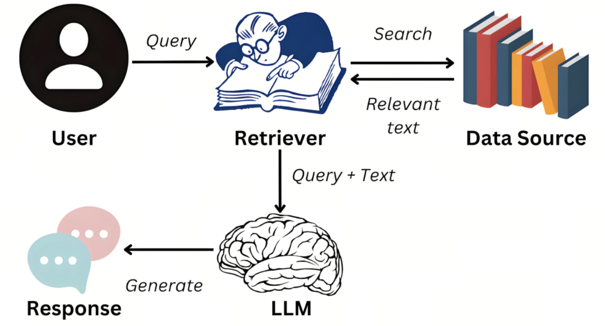
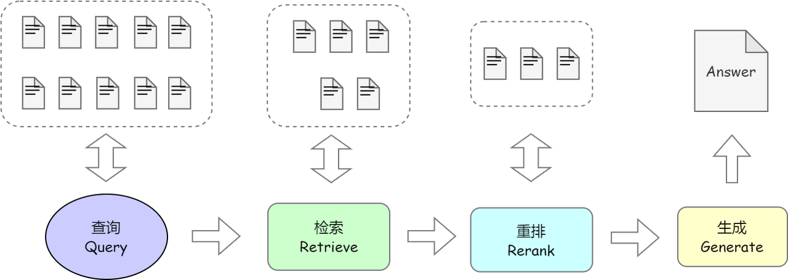
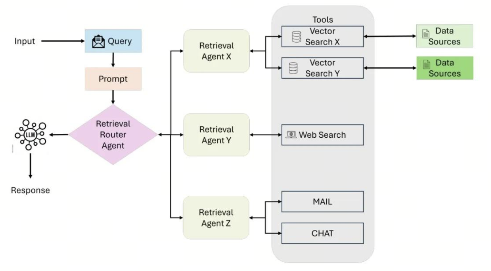
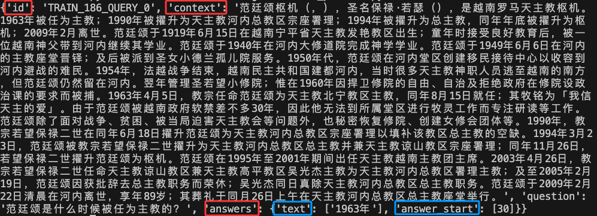
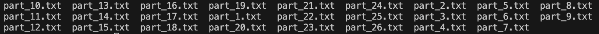
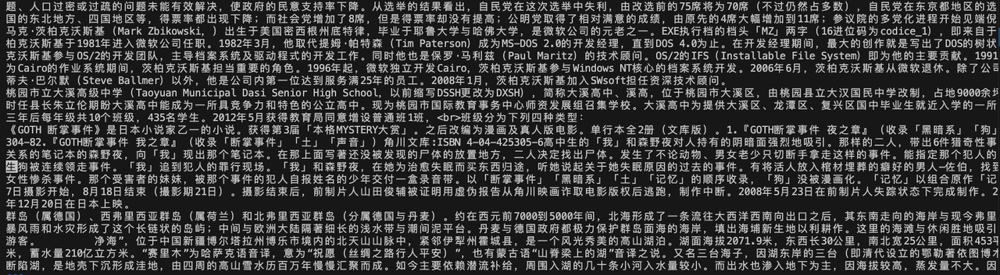

# 第25课时：RAG 架构原理与数据处理

在前面的课程中，我们系统学习了如何通过**预训练**和**监督微调**将通用大模型“专业化”。然而，即便经过精心微调，模型依然存在两个**无法回避的根本局限**：

1. **知识固化**：模型的知识截止于训练数据，无法回答 2024 年新政策、新药审批、最新财报等动态信息；  
2. **幻觉风险**：当问题超出训练分布（如“公司最新报销制度”），模型会“自信胡说”，而非诚实承认“我不知道”。

> 💡 **问题本质**：微调让模型“**记住**”了知识，但无法让它“**查资料**”。

> ✅ **RAG**（Retrieval-Augmented Generation，检索增强生成）正是解决这一问题的**工业级标准方案**。  
> 它不依赖模型内部记忆，而是**实时从外部知识库中检索最新、最相关的信息**，再让模型基于这些“证据”生成答案。

RAG 的核心思想是：**让模型从“闭卷考试”变为“开卷答题”**。

但要让 RAG 真正可靠，仅靠“随便查点资料”远远不够。  
**通用 Embedding 和 Reranker 在专业领域会严重失效**——  
- 医疗查询“心梗治疗”可能召回“心肌炎”文档；  
- 法律问题“违约赔偿”可能被“侵权责任”干扰。

> 🔑 **因此，构建高质量 RAG 系统必须微调两个关键组件**：
> 1. **Embedding 模型**：让检索理解“任务相关性”，而非仅“语义相似”；
> 2. **Reranker 模型**：对初筛结果精细排序，确保高相关文档排在最前。

本课将从**理论原理出发**，系统讲解：

1. **RAG 的核心范式**：为何能解决幻觉与时效性？RAG vs Long Context 谁更优？
2. **RAG 三阶段架构**：检索（Retrieval）、增强（Augmentation）、生成（Generation）；
3. **数据处理实战**：如何用 Agent 智能解析文档、生成摘要、注入元数据；以及 知识库清洗：多源归一、格式转换、分块、LLM 精炼与多跳 QA 生成；
4. **微调的必要性**：为何必须微调 Embedding 与 Reranker？如何构建训练数据？

用**通俗语言 + 公式 + 真实案例**，带你掌握 RAG 从理论到落地的核心逻辑。

---

## 1. RAG 的核心范式：为什么需要它？

### 1.1 大模型的根本缺陷：幻觉与知识固化

大语言模型（LLM）通过在万亿级 token 上的预训练，学习了人类语言的统计规律。其生成过程可形式化为：
$$
y = \arg\max_{y_{1:T}} \prod_{t=1}^T p_\theta(y_t \mid y_{<t}, x)
$$

- $y = (y_1, y_2, ..., y_T)$：模型生成的完整输出序列（如一段回答）；
- $x$：用户输入的查询（prompt）；
- $y_{<t} = (y_1, ..., y_{t-1})$：在生成第 $t$ 个 token 前已生成的部分；
- $p_\theta(\cdot \mid \cdot)$：由模型参数 $\theta$ 定义的条件概率分布；
- $\theta$：模型在**训练截止日**（如 2023 年 10 月）前的数据上学习到的参数。


> ❌ **问题**：  
> - 若 $x$ 涉及新事件（如 2024 年政策），$p_\theta(y \mid x)$ 无真实依据 → 模型“合理推测” → **幻觉**；  
> - 即使知识存在，若训练数据稀疏，模型也可能记错 → **事实错误**；  
> - 模型无法区分“知道”和“不知道”，总是给出**自信但错误**的回答。

### 1.2 RAG 的核心思想：外挂可信知识源

RAG（检索增强生成，Retrieval-Augmented Generation）是一种结合信息检索（Retrieval）和文本生成（Generation）的技术，旨在提高大型语言模型（大模型）的准确性和实用性。通过在生成文本前检索外部知识库中的相关信息，RAG 可以让大模型在回答问题时结合最新、最相关的数据，从而减少幻觉现象，并提升答案的专业性和时效性。 


由 [Lewis et al., 2020](https://arxiv.org/abs/2005.11401) 提出，其核心是将生成过程重构为：
$$
y = G\left(x, \mathcal{R}(x; \mathcal{D})\right)
$$

- $x$：用户查询；
- $\mathcal{D} = \{d_1, d_2, ..., d_N\}$：外部知识库，包含 $N$ 个文档（如公司政策、医学指南、财报）；
- $\mathcal{R}(x; \mathcal{D}) = \{d_{i_1}, d_{i_2}, ..., d_{i_k}\}$：检索模块 $\mathcal{R}$ 根据查询 $x$ 从 $\mathcal{D}$ 中返回的 top-$k$ 最相关文档（通常 $k=3\sim10$）；
- $G$：生成模型（如 LLaMA、GPT），**仅基于检索到的上下文 $\mathcal{R}(x; \mathcal{D})$ 和查询 $x$ 生成答案 $y$**。


> ✅ **优势**：
 
> - **知识可实时更新**：只需更新 $\mathcal{D}$，无需重训模型；
> - **答案可溯源**：附上参考文档，提升可信度；
> - **幻觉率显著下降**：实测可从 30%+ 降至 <10%；
> - **模型轻量化**：可用小模型（如 LLaMA-3-8B） + 高质量知识库，替代大模型。

### 1.3 RAG vs Long Context：谁更优？

随着 LLM 支持 128K+ 上下文（如 **Claude 3.5 Sonnet**、**Qwen-Max**、**LLaMA-3-70B-Instruct**），有人问：**“既然能塞进所有文档，为何还要 RAG？”**

#### 对比维度：

| 维度 | RAG | Long Context |
|------|-----|----------------|
| **知识时效性** | ✅ 实时更新 | ❌ 训练后固定 |
| **计算效率** | ✅ 仅处理 top-$k$ 文档（$O(k)$） | ❌ 全文档参与 attention（$O(n^2)$） |
| **注意力质量** | ✅ 聚焦高相关片段 | ❌ 长文档中关键信息易被稀释 |
| **可解释性** | ✅ 可展示检索来源 | ❌ 黑箱，无法追溯 |
| **部署成本** | ✅ 知识库与模型解耦，支持增量更新 | ❌ 每次更新需重加载长上下文 |
| **硬件要求** | ✅ 可在消费级 GPU 运行 | ❌ 需 A100/H100 支持长上下文 |

> 📊 **实证研究**（[“Lost in the Middle”, 2023](https://arxiv.org/abs/2307.03172)）：

> - LLM 对长上下文中**开头和结尾**的内容更敏感，**中间信息召回率 <40%**；  
> - 即使上下文达 100K，关键事实若位于中间，仍易被忽略；  
> - 长上下文显著增加显存占用（128K 上下文需 40GB+）。

> ✅ **业界共识**（Google、Meta、阿里云）：  

> - **RAG 仍是生产系统首选**，尤其适用于客服、法律、医疗等**事实密集、需溯源**的场景；  
> - **Long Context 适合单篇长文档理解**（如合同分析、论文阅读）。

---

## 2. RAG 架构拆解：检索 → 增强 → 生成 

RAG 系统由三大模块组成，每一模块均有**工业级实现方案**。

### 2.1 Retrieval（检索）：从海量文档中找“最相关”
用户输入问题后，系统会基于该输入在外部知识库或向量数据库中检索相关内容。通常使用语义搜索（Semantic Search）或 BM25、Dense Retrieval（DPR）、Embedding-based Retrieval 等技术来匹配最相关的文档片段。
#### 2.1.1 流程与公式

1. **索引构建**：将知识库 $\mathcal{D}$ 分块为 $\{c_1, ..., c_M\}$，对每块 $c_j$ 计算 embedding：
   $$
   v_j = E_{\text{emb}}(c_j)
   $$
    - $c_j$：第 $j$ 个文本块（chunk）；
    - $E_{\text{emb}}(\cdot)$：Embedding 模型（如 BGE）；
    - $v_j \in \mathbb{R}^d$：$c_j$ 的 $d$ 维向量表示（如 $d=1024$）。

2. **查询编码**：$q = E_{\text{emb}}(x)$；
    - $x$：用户查询；
    - $q \in \mathbb{R}^d$：查询的向量表示。
3. **相似度搜索**（近似最近邻，ANN）：
   $$
   \mathcal{R}_k(x) = \underset{j}{\text{top-}k} \ \frac{q^\top v_j}{\|q\| \|v_j\|}
   $$
    - $q^\top v_j$：向量点积；
    - $\|q\|, \|v_j\|$：向量的 L2 范数；
    - $\frac{q^\top v_j}{\|q\| \|v_j\|}$：余弦相似度（范围 $[-1, 1]$）；
    - $\text{top-}k$：返回相似度最高的 $k$ 个文档块。

> 🔍 **关键**：检索质量直接决定 RAG 上限。

#### 2.1.2 当前主流技术栈

| 组件 | 通用方案 | 领域优化方案 |
|------|----------|--------------|
| **Embedding 模型** | OpenAI `text-embedding-3-large`<br>BAAI `bge-large-en-v1.5`<br>`voyage-lite-02-instruct` | 微调 BGE（医疗/法律/金融）<br>Instruction-tuned embedding（如 `bge-large-1.5-instruct`） |
| **向量数据库** | **Pinecone**（托管服务，易用）<br>**Milvus**（开源，支持 GPU 加速）<br>**Qdrant**（Rust 实现，低延迟）<br>**Chroma**（轻量，适合本地） | **Weaviate**（支持属性过滤 + 图结构）<br>**Elasticsearch + Vector**（混合搜索） |
| **检索增强** | **HyDE**（Hypothetical Document Embeddings）<br>**Multi-query retrieval**（生成多个查询） | **Query2Doc**（用 LLM 生成伪文档）<br>**Decomposed Retrieval**（将复杂问题拆解） |

> 🌟 **业界案例**：

> - **Notion AI**：使用 BGE + Pinecone 构建企业知识库；
> - **Glean**：支持元数据过滤 + 权限控制的 RAG 系统；
> - **LazyLLM**：高度集成化，以极低的成本构建 RAG 系统。

#### 2.1.3 检索评估指标

- **Recall@k**：top-k 中是否包含相关文档；
- **MRR@k**（Mean Reciprocal Rank）：相关文档的平均排名倒数；
- **Hit Rate**：至少命中一个相关文档的比例。

> ✅ **目标**：Recall@10 > 80%，MRR@10 > 0.6。

#### 2.1.4 基于LazyLLM实现Retriever
下面这行代码声明检索组件需要在 doc 这个文档中的 Coarse chunk 节点组利用 bm25\_chinese 相似度进行检索，最终返回相似度最高的 3 个节点。
```python
from lazyllm import Retriever

# 传入绝对路径
doc = Document("/path/to/content/docs/")

# 使用Retriever组件，传入文档doc，节点组名称这里采用内置切分策略"CoarseChunk"，相似度计算函数bm25_Chinese
retriever = Retriever(doc, group_name=Document.CoarseChunk, similarity="bm25_chinese", topk=3)

# 调用retriever组件，传入query
retriever_result = retriever("your query")      

# 打印结果，用get_content()方法打印具体的内容
print(retriever_result[0].get_content())
```

### 2.2 Augmentation（增强）：将检索结果“喂”给生成模型
检索到的文本内容会作为额外的上下文，与用户输入一起提供给 大模型。这一阶段涉及 Prompt 设计，确保大模型在生成回答时充分利用检索到的信息，而非仅依赖其内部知识。
#### 2.2.1 基础增强

将检索结果拼接为 prompt：
```
参考以下信息回答问题：
---
{d_{i1}}
{d_{i2}}
...
---
问题：{x}
回答：
```

> ✅ **关键作用**：为生成模型提供**显式上下文证据**，约束其输出范围。

#### 2.2.2 高级增强策略

| 策略 | 描述 |
|------|------|
| **重排序**（Reranking） | 用 Cross-Encoder 对 top-100 结果精排 | 
| **压缩**（Compression） | 用 LLM 提取检索结果中的关键句 |
| **路由**（Routing） | 根据问题类型选择不同知识库 |
| **元数据过滤** | 仅检索特定来源/类别的文档 |

> 📌 **Reranker 公式**：
> $$
> \text{score}(q, d) = \text{Reranker}([q; d])
> $$
> 其中 `[q; d]` 表示拼接，Cross-Encoder 能建模**细粒度交互**，比双塔模型更准。

### 2.3 Generation（生成）：基于证据生成答案


该流程图展示了知识库问答的关键流程：知识库中共有10 个片段，Retrieval 阶段 召回 5 个 相关片段，重排序后筛选出 3 个，最终由大模型结合筛选内容生成回答。整体流程体现了检索增强生成（RAG）的核心思想，即先通过检索获取相关知识并融入Prompt，使大模型参考后生成更合理的回答。相比单纯依赖大模型，RAG 结合`“检索+生成”`，利用向量数据库高效召回知识，并通过大模型生成答案，从而降低幻觉风险，增强知识时效性，并减少微调需求，提升模型的适应能力。

有了检索到的内容，结合我们提问的问题，将二者共同输入给生成组件，即可得我们想要的答案。这里的生成组件就是大模型,接下来我们将以线上大模型为例说明lazyllm是如何调用大模型的。

LazyLLM 通过 OnlineChatModule 统一调用线上大模型接口，不管您使用的OpenAPI接口还是SenseNova接口，或者是其他平台提供的接口，LazyLLM均为您进行了规范的参数封装，您只需要根据自己的需求将平台和模型名称等参数传给对应的模块即可：
```python
llm_prompt = "你是一只小猫，每次回答完问题都要加上喵喵喵"
llm = lazyllm.OnlineChatModule(source="sensenova", model="SenseChat-5-1202").prompt(llm_prompt)
print(llm("早上好！"))
```

---

## 3. 数据处理：构建高质量 RAG 知识库

RAG 效果 = **70% 数据质量 + 30% 模型能力**。原始文档需经过**智能处理**才能入库。

### 3.1 传统分块的局限

直接按固定长度（如 512 字）切分会导致：

  - **信息割裂**：关键句被切断（如“EBITDA = 净利润 + 利息 + 税 + 折旧 + 摊销”被切成两段）；
  - **噪声混入**：页眉页脚、广告、页码等无关内容；
  - **信息稀释**：长段落中关键信息占比低，embedding 被平均。

因此需要在**分块前**做多源归一与格式统一、在**分块后**做 LLM 精炼去噪与可选的多跳 QA 增强。LazyLLM 的 **knowledge_cleaning** 模块即针对上述环节提供了一整套可组合算子（见 3.4 节）。

### 3.2 基于 Agent 的智能文档处理

使用 **Agent 框架**（如 **LazyLLM**、**LlamaIndex**、**Unstructured.io**）自动化以下流程：


其中 **LazyLLM** 中提供了一整套**知识库清洗（KBC, Knowledge Base Cleaning）**算子，覆盖「多源归一 → 格式转换 → 分块 → 精炼 → 多跳 QA 生成 → QA 抽取」全流程，可与 RAG 检索、微调数据制备无缝衔接。下一小节将具体展开其能力与用法。

### 3.3 构建知识库
我们将从[cmrc2018](https://huggingface.co/datasets/hfl/cmrc2018)原始数据集开始，为大家讲解如何基于此数据集构建我们的RAG知识库。

CMRC 2018（Chinese Machine Reading Comprehension 2018）[1] 数据集是一个中文阅读理解数据集，用于中文机器阅读理解的跨度提取数据集，以增加该领域的语言多样性。数据集由人类专家在维基百科段落上注释的近20,000个真实问题组成。旨在推动中文机器阅读理解（MRC）任务的发展。其数据集的基本格式如下图所示：


对于每条数据，包括`id`，`context`，`question`以及`answers`四个字段，其中id是当前数据的编号，context是一段文字性描述，涉及历史、新闻、小说等各领域，answer包括两部分，一部分是`answer_start`，标志答案从哪个`context`中的token开始，另一部分是text，代表了针对question给出的答案，此答案由人类专家给出，上图中有两个答案，代表人类专家1和人类专家2分别给出，以此来保证答案的准确性。

我们仅使用`context`部分内容作为知识库，这样在后续评测RAG的效果时，我们就可以选择同一条数据当中`context`对应的`question`作为query输入，通过比较RAG中检索组件根据`question`召回的结果与RAG中生成组件与原本的`answers`，就可以对RAG系统的好坏做出评价。下面是相应的代码：
```python
def create_KB(dataset):
    '''基于测试集中的context字段创建一个知识库，每10条数据为一个txt，最后不足10条的也为一个txt'''
    Context = []
    for i in dataset:
        Context.append(i['context'])
    Context = list(set(Context))  # 去重后获得256个语料

    # 计算需要的文件数
    chunk_size = 10
    total_files = (len(Context) + chunk_size - 1) // chunk_size  # 向上取整

    # 创建文件夹data_kb保存知识库语料
    os.makedirs("data_kb", exist_ok=True) 

    # 按 10 条数据一组写入多个文件
    for i in range(total_files):
        chunk = Context[i * chunk_size : (i + 1) * chunk_size]  # 获取当前 10 条数据
        file_name = f"./data_kb/part_{i+1}.txt"  # 生成文件名
        with open(file_name, "w", encoding="utf-8") as f:
            f.write("\n".join(chunk))  # 以换行符分隔写入文件

# 调用create_KB()创建知识库
create_KB(dataset['test'])
# 展示其中一个txt文件中的内容
with open('data_kb/part_1.txt') as f:
    print(f.read())
```
上述代码执行完成后，您的当前目录下将多出一个`data_kb`文件夹，里面包括若干个txt文件：



文件中的内容大致如下：



### 3.4 LazyLLM 知识库清洗

在构建 RAG 知识库时，原始文档往往包含大量噪声：多余 HTML 标签、页眉页脚、不一致的标点与格式、个人敏感信息等。**LazyLLM 的 knowledge_cleaning 模块**提供可组合的算子，对多源文档进行「归一 → 转 Markdown → 分块 → LLM 精炼 → 多跳 QA 增强」，产出高质量、可直接用于检索与微调的数据。

#### 3.4.1 多源归一与格式转换

| 算子 | 作用 |
|------|------|
| **FileOrURLNormalizer** | 统一输入来源：支持本地文件（PDF、HTML/XML、TXT/MD、图片）和 URL（网页链接、PDF 链接），输出 `_type`（pdf/html/text）、`_raw_path` 或 `_url`、以及目标 Markdown 路径 `_output_path`。 |
| **HTMLToMarkdownConverter** | 对 `_type=html` 的条目，用 **trafilatura** 抓取 URL 或解析本地 HTML/XML，提取正文并转为 Markdown，写入 `_output_path`。 |
| **PDFToMarkdownConverterAPI** | 对 `_type=pdf` 的条目，调用 **MinerU** 服务（支持 VLM 引擎）将 PDF 解析为 Markdown，便于后续分块与精炼。 |

适用场景：企业内网文档、爬虫抓取的网页、上传的 PDF/Word 等，先归一为「路径 + 类型」，再按类型选择 HTML 或 PDF 转 Markdown，为后续分块和清洗提供统一输入。

#### 3.4.2 文本加载与分块

| 算子 | 作用 |
|------|------|
| **KBCLoadText** | 从 `text_path` 指定的 txt/md/xml/json/jsonl 文件加载文本，输出 `_text_content`；json/jsonl 支持从 `text`/`content`/`body` 等字段抽取。 |
| **KBCChunkText** | 按 **token/sentence/semantic/recursive** 等策略分块，可配置 `chunk_size`、`chunk_overlap`、`tokenizer_name`（如 `bert-base-uncased`），输出 `_chunks` 列表。 |
| **KBCSaveChunks** | 将 `_chunks` 保存为 JSON（每项为 `raw_chunk`），并回写 `chunk_path`。 |
| **KBCExpandChunks** | 将一条记录中的多个 chunk（`_chunks`）展开为多条记录，每条一个 `raw_chunk`，便于后续逐条送入 LLM 精炼。 |

这样即可在「加载 → 分块 → 保存」或「分块 → 展开」两条流水线中灵活组合，与 3.3 节中「按 context 构建知识库」的思路一致，并支持更细粒度的 token/句子/段落级切分。

#### 3.4.3 文档精炼（LLM 清洗）

原始分块常含多余标签、乱码、不一致标点和敏感信息。**DocRefinementPrompt + LLM** 对每个 chunk 做「精炼」：

- **标签**：删除无关 HTML/XML 标签，保留 `<table>`、`<code>`、`<formula>` 等语义标签。
- **字符与结构**：统一引号、省略号、横线；保持段落/列表/代码缩进；控制空行。
- **引用**：图片改为占位（如 `[Image: alt_text]`），签名改为 `[Signature]`。
- **事实与安全**：不改写事实与数字；对 PII 脱敏，涉密/违法内容用占位替换（如 `〖SEC∶classified〗`）。

| 算子 | 作用 |
|------|------|
| **KBCGenerateCleanedTextSingle** | 单条模式：对当前条目的 `raw_chunk` 调用 LLM，输出 `_cleaned_response`，配合后处理提取 `<cleaned_start>`～`<cleaned_end>` 间内容得到 `cleaned_chunk`。 |
| **KBCLoadRAWChunkFile** + **KBCGenerateCleanedText** + **KBCSaveCleaned** | 批量模式：从 JSON/JSONL 的 `chunk_path` 加载 `raw_chunk` 列表，逐条精炼后写回 `raw_chunk` + `cleaned_chunk` 的 JSON，并保存到 `cleaned_chunk_path`。 |

精炼后的 `cleaned_chunk` 更适合做 Embedding 与检索，同时降低无关符号对语义的干扰。

#### 3.4.4 多跳 QA 生成与增强

在已清洗的 chunk 上，可进一步生成「多跳」问答对，用于 RAG 评测或检索/阅读模型微调：

| 算子 | 作用 |
|------|------|
| **KBCLoadChunkFile** | 从 `chunk_path` 加载 JSON/JSONL（需含 `cleaned_chunk` 等字段）。 |
| **KBCPreprocessText** | 按 `min_length`/`max_length` 过滤 chunk，避免过短或过长。 |
| **KBCExtractInfoPairs** | 按句切分（中/英文），抽取「前提 → 中间句 → 结论」三元组，作为多跳推理的上下文。 |
| **KBCGenerateMultiHopQA** | 使用 **MultiHopQABuilderPrompt** 与 LLM，基于三元组生成多跳问答对。 |
| **KBCSaveEnhanced** | 将生成的 QA 对与原始 chunk 合并，写回带 `qa_pairs` 的 enhanced 文件（如 `*_enhanced.json`）。 |

得到的 enhanced 数据既可直接用于 RAG 的检索评估（query 用 question，标准答案用 answer），也可作为 SFT 数据参与微调。

#### 3.4.5 QA 抽取与微调格式

若数据中已含 QA（如 enhanced 文件中的 `QA_pairs`），可用以下算子转为模型训练格式：

| 算子 | 作用 |
|------|------|
| **KBCLoadQAData** | 从当前条目或 `enhanced_chunk_path`/`cleaned_chunk_path`/`chunk_path` 中读取 `QA_pairs`，输出 `_qa_data`。 |
| **KBCExtractQAPairs** | 将 `_qa_data` 中的每对 question/answer 转为指定键（如 `instruction`/`input`/`output`），便于接入 LazyLLM 的 SFT 或 RAG 微调流水线。 |


### 3.5 基于 LazyLLM 构建基础 RAG 知识库

在介绍完相关功能后，我们使用 LazyLLM 实际构建一个基础的 RAG 知识库，完整代码见 [rag_kb_build](./code/rag_kb_build.py)。整体流程为：**收集源文件 → 分块流水线 →（可选）LLM 清洗 → 导出为知识库目录 → 可选检索演示**。

首先我们从指定目录（默认 `sources_dir`）收集所有 `.txt` / `.md`，构造 `[{"text_path": path}, ...]`，交给 **分块流水线**。分块流水线对应 3.4.2 节的 KBCLoadText → KBCChunkText → KBCSaveChunks，将每个源文件切为多个 `raw_chunk` 并落盘为 JSON（如 `chunks/xxx_chunk.json`）。

```python
ppl = build_batch_chunk_generator_pipeline(
    input_key="text_path", output_key="chunk_path", output_dir=str(chunk_out),
    chunk_size=chunk_size, chunk_overlap=chunk_overlap,
    split_method="recursive", tokenizer_name="bert-base-uncased",
)
data_list = [{"text_path": str(p)} for p in text_paths]
results = ppl(data_list)
```

接下来如果传入 `--do_clean`，那我们使用 **批量清洗流水线**（3.4.3 节）对数据进行清洗：从 JSON 加载 `raw_chunk`，经 LLM + DocRefinementPrompt 得到 `cleaned_chunk`，写回 `cleaned/` 下。未开启时直接使用原始分块结果。

```python
ppl = build_batch_kbc_pipeline(
    input_key="chunk_path", output_key="cleaned_chunk_path",
    llm=llm, lang=args.lang, output_dir=str(clean_out),
)
results = ppl([{"chunk_path": p} for p in chunk_paths])
```

无论是仅分块还是清洗后的结果，都通过 **导出函数** 写回为 `kb_content/` 下的若干 `.txt` 文件：按源文件维度，把该文件对应的所有 chunk（`raw_chunk` 或 `cleaned_chunk`）用双换行拼接成一个 txt，便于 `Document(dataset_path=kb_content)` 按文件加载。

```python
# 从每个 chunk 的 JSON 里取 raw_chunk 或 cleaned_chunk，按源文件合并为一份 txt
chunks = [rec.get(chunk_key) or rec.get("raw_chunk", "") for rec in data if ...]
out_file.write_text("\n\n".join(chunks), encoding="utf-8")
```

在导出完成后，用 LazyLLM 的 Document 指向 `kb_content` 目录，再构造 Retriever（如 `CoarseChunk` + `bm25_chinese`），对示例 query 做一次检索并打印首条摘要，用于验证知识库与检索链路是否正常。

```python
doc = lazyllm.Document(dataset_path=str(kb_path))
retriever = lazyllm.Retriever(doc=doc, group_name=lazyllm.Document.CoarseChunk,
                              similarity='bm25_chinese', topk=3)
demo_result = retriever('玉山箭竹生长在哪里？')
```

运行方式示例：`python rag_kb_build.py --output_dir ./rag_kb`（仅分块）；加 `--do_clean` 可启用 LLM 清洗（需配置好 LazyLLM 可用 LLM）。

---

## 4. RAG实战：基于LazyLLM实现基础RAG
我们仅使用LazyLLM中三个组件Document，Retriever，大模型，即可简单快速的构建一个RAG系统。下面我们简单介绍一下这三个核心组件：

  * Document 组件：负责文档加载与管理，使用时只需指定文档地址即可实现加载和存储文档。
  * Retriever 组件：负责实现 RAG 系统的检索功能，使用时需要指定在哪个文档库进行检索，以何种方式进行检索以及返回多少条检索结果等。
  * 大模型（LLM）：负责根据检索到的文档进行答复，简单情况下只需输入用户查询和检索组件检索到的文档即可。LazyLLM 提供了 TrainableModule 和 OnlineChatModule 分别支持本地模型和在线模型的统一调用，用户无需关注内部细节，可以自由切换不同模型。
    
  将这三个组件的使用串联在一起，我们就得到了最简单的RAG，代码如下：

```python
import lazyllm

# 文档加载
documents = lazyllm.Document(dataset_path="/content/docs")

# 检索组件定义
retriever = lazyllm.Retriever(doc=documents, group_name="CoarseChunk", similarity="bm25_chinese", topk=3) 

# 生成组件定义
llm = lazyllm.OnlineChatModule(source="sensenova", model="SenseChat-5-1202")

# prompt 设计
prompt = 'You will act as an AI question-answering assistant and complete a dialogue task. In this task, you need to provide your answers based on the given context and questions.'
llm.prompt(lazyllm.ChatPrompter(instruction=prompt, extra_keys=['context_str']))

# 推理
query = "为我介绍下玉山箭竹"    
# 将Retriever组件召回的节点全部存储到列表doc_node_list中
doc_node_list = retriever(query=query)
# 将query和召回节点中的内容组成dict，作为大模型的输入
res = llm({"query": query, "context_str": "".join([node.get_content() for node in doc_node_list])})

print(f'With RAG Answer: {res}')
```
最终我们可以得到的结果如下
```text
With RAG Answer： 玉山箭竹（学名：Fargesia yushanensis），属于禾本科箭竹属，是竹亚科中的一个种类。它主要分布在中国台湾地区，尤其是在玉山国家公园一带，因此得名。玉山箭竹是台湾高山地区特有的竹种之一，适应高海拔的寒冷环境，通常生长，
在海拔2500米至3500米之间的山区。
*形态特征：*
玉山箭竹是一种小型到中型的竹子，其茎秆直立，丛生，高度一般在1米到3米之间，直径约0.5厘米至1.5厘米。它的节间较短，节处略微隆起。叶片较小，星披针形，边缘有细小的锯齿。
料牛态习性：林
玉山箭竹耐寒性强，能在低温和积雪覆盖的环境中生存，它们通常形成密集的竹丛，为高山地区的土壤保持和水源涵养提供重要的生态功能。此外，玉山箭竹也是高山动物的重要食物来源之一。
料保护状况：*
由于玉山箭竹生长在特定的高山环境中，其分布范围有限，因此对于生态系统的平衡具有重要意义。然而，由于气候变化和人类活动的影响，玉山箭竹的生存环境面临着威胁、因此，保护玉山箭竹及其生态环境显得尤为重要。
*应用价值：*
虽然玉山箭竹在商业上的应用价值不高，但它在生态保护和科学研究方面具有重要的价值。
```

## 5. 微调的必要性：为什么通用 Embedding 不够用？

### 5.1 通用 Embedding 的领域错配

通用 embedding 模型在**通用语料**上训练，其语义空间满足：
$$
\text{sim}(E(a), E(b)) \approx \text{通用语境下的语义相似度}
$$


但在专业领域，**任务相关性 ≠ 语义相似度**。

> 📌 **例**（金融领域）：

> - 查询：“如何计算 EBITDA？”
> - 通用 embedding 返回：“EBITDA 是一种盈利指标”（语义相关）
> - **任务所需**是：“EBITDA = 净利润 + 利息 + 税 + 折旧 + 摊销”（公式）

二者在通用空间中距离较远，导致**召回失败**。

### 5.2 通用 Reranker 的语义盲区

通用 Reranker（如 `bge-reranker-large`）在通用问答对（如 MS MARCO）上训练，擅长判断：
> “这篇文档是否回答了‘巴黎人口是多少？’”

但**无法理解专业逻辑**：

> 📌 **例**（医疗领域）：
> - **查询** $q$：“阿司匹林是否用于心肌梗死？”
> - **文档 A**（正确）：“阿司匹林是 STEMI 的标准抗血小板药物。”
> - **文档 B**（干扰）：“阿司匹林不用于心肌炎。”

通用 Reranker 可能给 B 更高分，因为：
- “阿司匹林”“心肌”等词高度重叠；
- 无法识别“心肌炎 ≠ 心肌梗死”；
- 无法理解“不用于”是否定信号。

> ❌ **后果**：  
> - 高相关文档被排后；  
> - LLM 优先看到错误信息；  
> - 最终答案错误。

---

### 5.3 为什么必须微调？

#### ✅ Embedding 微调的必要性

**目标**：让模型学习**任务相关性**，而非**通用语义相似度**。

- **领域术语对齐**：  
  将“心肌梗死”与“PCI”“阿司匹林”拉近，与“心肌炎”推开。
- **公式/代码敏感**：  
  让“EBITDA = ...”比“EBITDA 是指标”更接近查询。
- **效果**：  
  在医疗/金融/法律数据集上，**MRR@10 提升 15–25%**，显著改善召回质量。

#### ✅ Reranker 微调的必要性

**目标**：让模型理解**专业语义边界**与**业务逻辑**。

- **细粒度判别**：  
  区分“心肌梗死” vs “心肌炎”、“违约” vs “侵权”；
- **否定与约束识别**：  
  理解“禁用”“不推荐”“需排除”等关键信号；
- **效果**：  
  在专业 RAG 场景中，**NDCG@5 提升 20–50%**，确保 top-3 文档高度相关。

---

### 5.4 Embedding 微调：对齐任务语义空间

通过**对比学习**（Contrastive Learning）微调 embedding 模型，使其在领域内满足：
$$
\text{sim}(E(q), E(d^+)) \gg \text{sim}(E(q), E(d^-))
$$

- $q$：查询；
- $d^+$：与 $q$ **任务相关**的正样本文档；
- $d^-$：与 $q$ **任务无关**的负样本文档；
- $E(\cdot)$：微调后的 embedding 模型；
- $\text{sim}(a, b) = \frac{a^\top b}{\|a\| \|b\|}$：余弦相似度。

#### 损失函数（InfoNCE）：
$$
\mathcal{L} = -\log \frac{\exp(\text{sim}(q, d^+)/\tau)}{\sum_{d' \in \mathcal{D}^- \cup \{d^+\}} \exp(\text{sim}(q, d')/\tau)}
$$

- $\tau > 0$：温度系数（通常 0.01–0.1），控制分布 sharpness；
- $\mathcal{D}^- = \{d_1^-, ..., d_n^-\}$：负样本集合；
- 分母为**所有样本**（1 个正 + $n$ 个负）的 softmax 归一化项。

> ✅ **工具**：
> - **Sentence-Transformers**：支持 `MultipleNegativesRankingLoss`
> - **FlagEmbedding**：BGE 官方微调脚本

> 🌟 **效果**：在医疗问答数据集上，微调 BGE 可使 **MRR@10 提升 15–25%**。

### 5.5 Reranker 微调：精细化排序

Retriever 返回 top-100 后，用**交叉编码器**（Cross-Encoder）做精排：
$$
\text{score}(q, d) = \text{Reranker}([q; d])
$$

- $[q; d]$：拼接后的输入序列；
- $\text{Reranker}(\cdot)$：Cross-Encoder 模型；
- $\text{score}(q, d)$：标量相关性分数，用于排序。

> 🌟 **业界方案**

> - **LazyLLM**：覆盖从 EMBedding 到 RAG 全流程组件，可直接调用Embedding 与 Reranker 等模块实现相关功能；
> - **Cohere Rerank**：商业 reranker API，支持多语言；
> - **LLM-based Reranker**：用 LLM 判断“这段是否回答了问题？”（如 GPT-4）；
> - **ColBERTv2**：支持 late interaction，平衡效率与精度。

---

## 6. 总结：RAG 的工业级技术栈全景

| 模块 | 主流技术/模型 | 说明 |
|------|----------------|------|
| **Embedding** | BGE-v1.5, Voyage, text-embedding-3 | 开源/商用 embedding 模型 |
| **向量数据库** | Milvus, Pinecone, Qdrant | 支持亿级向量、GPU 加速 |
| **文档处理** | Unstructured.io, LazyLLM，LlamaIndex | 智能分块 + 元数据增强 |
| **生成模型** | LLaMA-3（via `llama.cpp`）, Claude 3.5, GPT-4o | 本地/云部署可选 |
| **Reranker** | BGE-Reranker, Cohere Rerank | 精排提升准确率 |
| **框架** | LazyLLM， LlamaIndex,  LangChain | 提供端到端 RAG 流水线 |

> 🌟 **记住**：  
> RAG 不是“把文档丢给模型”，而是**构建一个可信、高效、可解释的知识检索-生成系统**。  
> **数据质量 > 模型大小，任务对齐 > 通用能力**。

> 下一课，我们将学习**RAG 中Embedding模型的微调**——  

## 参考文献

- [Agentic RAG: Turning Your RAG Pipeline Into a Thinking System](https://medium.com/@jinglemind.dev/agentic-rag-turning-your-rag-pipeline-into-a-thinking-system-6a63ac776795)