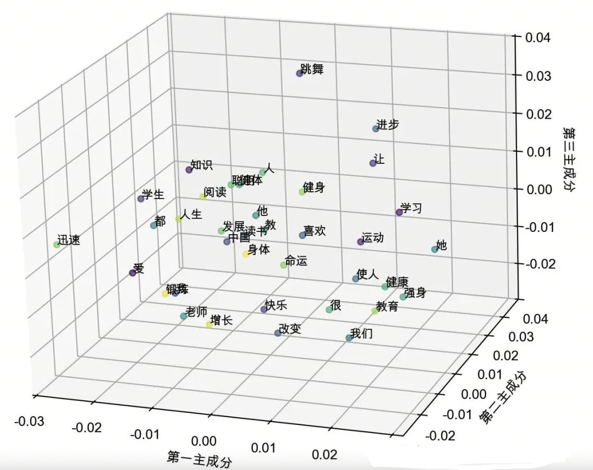
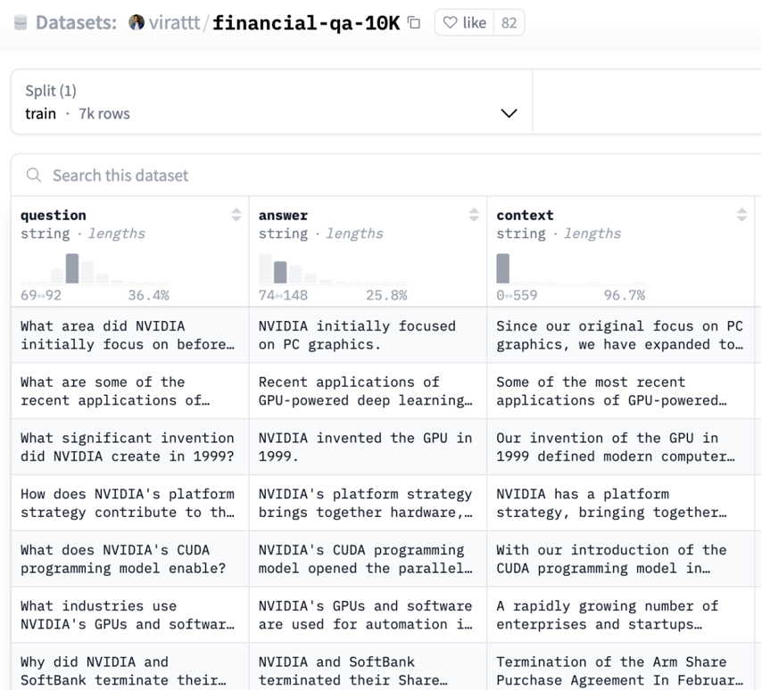

# 第26课时：Embedding 模型微调与实战 
在RAG（Retrieval-Augmented Generation）系统中，Embedding模型承担着关键作用：


**Embedding 模型**——它负责将文本转化为向量，让“语义相似”变成“向量相近”。

> 💡 然而，**通用 Embedding 模型**（如 BGE、text-embedding-ada-002） 

> - 在医疗领域，把“心肌梗死”和“心肌炎”视为相似（因都含“心肌”）；  
> - 在金融领域，无法区分“EBITDA”和“净利润”；  
> - 在法律领域，混淆“违约”与“侵权”。

> ✅ **解决方案**：**微调 Embedding 模型**，使其在你的领域中“真正理解”语义。

本课将从**零基础原理出发**，手把手教你：

1. **核心原理**：Bi-encoder 架构 + 对比学习（InfoNCE 损失）；
2. **数据构建**：如何挖掘高质量的正负样本对，尤其是**难负样本**（Hard Negatives）；
3. **LazyLLM 实战**：构建数据、微调模型、评估 MTEB 指标。

用**通俗语言 + 公式 + 工业界案例**，让你掌握 Embedding 微调的完整闭环。

## 1. 为什么需要微调 Embedding 模型？

### 1.1 通用 Embedding 的“语义错位”

通用 Embedding 模型在**海量通用语料**（如网页、百科）上训练，其学习目标是：
> “让语义相似的句子在向量空间中靠近”


但“语义相似”在不同领域含义不同：

| 领域 | 查询 | 通用模型返回（错误） | 领域正确答案 |
|------|------|----------------------|--------------|
| 医疗 | “心肌梗死的治疗” | “心肌炎的治疗” | “急性心梗的 PCI 治疗” |
| 金融 | “如何计算 EBITDA？” | “EBITDA 是什么？” | “EBITDA = 净利润 + 利息 + 税 + 折旧 + 摊销” |
| 法律 | “合同违约赔偿” | “侵权责任赔偿” | “《民法典》第584条：违约损害赔偿” |

> ⚠️ **根本原因**：通用模型未学习**领域特有的语义边界**。

### 1.2 微调的目标：对齐任务语义空间

微调的目标是让 Embedding 模型满足：
$$
\text{sim}(E(q), E(d^+)) \gg \text{sim}(E(q), E(d^-))
$$
其中：

- $q$：用户查询；
- $d^+$：与 $q$ **任务相关**的正样本（如正确答案、支持文档）；
- $d^-$：与 $q$ **任务无关**的负样本（如错误答案、干扰文档）。

> ✅ **效果**：在医疗问答数据集上，微调 BGE 可使 **MRR@10 提升 20%+**。

---

## 2. 核心原理：Bi-encoder 与对比学习

### 2.1 Bi-encoder 架构：高效双塔模型

Embedding 模型通常采用 **Bi-encoder**（双编码器）架构：

- **Query Encoder**：记为 $E_q(\cdot)$，是一个神经网络（通常为 Transformer），用于将用户查询 $q$ 编码为一个稠密向量 $u$，即：
  $$
  u = E_q(q)
  $$
  其中：
    - $q$：用户输入的查询文本（如“心肌梗死的治疗”）；
    - $E_q(\cdot)$：查询编码器函数；
    - $u \in \mathbb{R}^d$：查询的 $d$ 维向量表示（如 $d = 768$ 或 $1024$）。

- **Document Encoder**：记为 $E_d(\cdot)$，是另一个神经网络（可与 $E_q$ 共享权重或独立），用于将文档 $d$ 编码为向量 $v$，即：
  $$
  v = E_d(d)
  $$
  其中：
    - $d$：知识库中的一个文档片段（如“阿司匹林是心肌梗死的标准抗血小板药物”）；
    - $E_d(\cdot)$：文档编码器函数；
    - $v \in \mathbb{R}^d$：文档的 $d$ 维向量表示。

- **相似度计算**：使用**余弦相似度**衡量查询与文档的相关性：
  $$
  \text{sim}(q, d) = \frac{u^\top v}{\|u\| \|v\|}
  $$
  其中：
    - $u^\top v$：向量 $u$ 与 $v$ 的点积（内积）；
    - $\|u\| = \sqrt{u^\top u}$：向量 $u$ 的 L2 范数（欧几里得长度）；
    - $\|v\|$：向量 $v$ 的 L2 范数；
    - $\text{sim}(q, d) \in [-1, 1]$，值越接近 1 表示语义越相似。


> ✅ **优势**：

> - **推理高效**：文档向量可**离线预计算**，检索时只需编码查询；
> - **可扩展**：支持亿级文档库（向量数据库）。

> ❌ **劣势**： 

> - Query 与 Doc **无交互**，无法建模细粒度对齐（此为 Reranker 的任务）。

### 2.2 对比学习：InfoNCE 损失函数

对比学习的核心思想：**拉近正样本，推开负样本**。

#### 2.2.1 样本对定义
- **正样本对** $(q, d^+)$：查询 $q$ 与一个**任务相关**的文档 $d^+$，例如：
    - $q =$ “心梗治疗”
    - $d^+ =$ “阿司匹林用于急性心肌梗死的抗血小板治疗”
    - 二者在**任务语义上强相关**（$d^+$ 可直接回答 $q$）。

- **负样本对** $(q, d^-)$：查询 $q$ 与一个**任务无关**的文档 $d^-$，例如：
    - $d^- =$ “糖尿病患者的饮食建议”
    - 二者在任务上无关，即使文本表面有部分词汇重叠。


#### 2.2.2 InfoNCE 损失公式

对一个查询 $q$，设其正样本为 $d^+$，负样本集合为 $\{d_1^-, ..., d_{n}^-\}$，则 InfoNCE 损失为：

$$
\mathcal{L}_{\text{InfoNCE}} = -\log \frac{\exp(\text{sim}(q, d^+)/\tau)}{\exp(\text{sim}(q, d^+)/\tau) + \sum_{i=1}^{n} \exp(\text{sim}(q, d_i^-)/\tau)}
$$

其中：

- $\mathcal{L}_{\text{InfoNCE}}$：单个查询 $q$ 对应的 InfoNCE 损失值；
- $\text{sim}(q, d^+)$：查询 $q$ 与正样本 $d^+$ 的余弦相似度；
- $\text{sim}(q, d_i^-)$：查询 $q$ 与第 $i$ 个负样本 $d_i^-$ 的余弦相似度；
- $\exp(\cdot)$：自然指数函数；
- $\tau > 0$：**温度系数**（temperature），通常取值在 $0.01$ 到 $0.1$ 之间，用于控制 softmax 分布的“尖锐程度”：
  - $\tau$ 越小，正样本的权重越集中，训练越激进；
  - $\tau$ 越大，分布越平滑，训练越稳定；
- 分母：包含 **1 个正样本 + $n$ 个负样本**，共 $n+1$ 项，构成 softmax 归一化分母；
- 整体形式等价于：最大化正样本在所有候选样本中的 softmax 概率。


> 🧠 **直观理解**：  

> - 若正样本相似度高、负样本相似度低 → 损失小；  
> - 若模型混淆正负 → 损失大 → 梯度反向传播 → 调整 encoder。

#### 2.2.3 多正样本扩展

实际中，一个查询可能有多个正样本 $\{d_1^+, ..., d_m^+\}$，损失可扩展为：
$$
\mathcal{L} = -\log \frac{\sum_{j=1}^m \exp(\text{sim}(q, d_j^+)/\tau)}{\sum_{j=1}^m \exp(\text{sim}(q, d_j^+)/\tau) + \sum_{i=1}^{n} \exp(\text{sim}(q, d_i^-)/\tau)}
$$

- 分子：所有正样本的指数相似度之和；
- 分母：所有正样本 + 所有负样本的指数相似度之和；
- 此形式适用于**多答案场景**（如开放域问答、多文档支持）。
---

## 3. Embedding 数据集构建：正负样本的精细化挖掘

Embedding 微调效果的**上限由训练数据质量决定**。尤其关键的是**负样本的构建策略**。

### 3.1 正样本（Positive Pairs）构建

正样本必须满足：**语义强相关**，且**可作为任务答案的依据**。

#### 构建方法：
| 来源 | 方法 | 示例 |
|------|------|------|
| **问答对** | (问题, 答案) | (“心梗治疗”, “阿司匹林...”) |
| **标题-正文** | (标题, 段落) | (“EBITDA计算”, “EBITDA=...”) |
| **文档分块 + 摘要** | (摘要, 原文块) | (“心梗抗血小板”, “阿司匹林用于...”) |
| **指令-响应对** | (“解释XX”, “XX是指...”) | 基于 SFT 数据构造 |

代码示例如下：

```python
# 示例：基于 SFT 指令数据自动提取正样本对
import json

sft_data = [
    {
        "instruction": "解释心肌梗死的治疗原则",
        "input": "",
        "output": "STEMI 患者若 120 分钟内可 PCI，首选直接 PCI；否则溶栓。"
    },
    {
        "instruction": "如何计算 EBITDA？",
        "input": "",
        "output": "EBITDA = 净利润 + 利息 + 税 + 折旧 + 摊销"
    }
]

positive_pairs = []
for item in sft_data:
    query = item["instruction"] + (": " + item["input"] if item["input"] else "")
    pos = item["output"]
    positive_pairs.append({"query": query, "pos": pos})

# 输出格式（JSONL）
with open("embedding_positives.jsonl", "w") as f:
    for pair in positive_pairs:
        f.write(json.dumps(pair, ensure_ascii=False) + "\n")
```


> ✅ **正样本质量准则**：

> - 语义等价、强支持、无歧义；
> - 长度适中（20–200 词），避免过长稀释信号；
> - 避免模板化（如“答案是：...”）。

### 3.2 负样本（Negative Pairs）构建

负样本决定模型能否**精细区分语义边界**。分两类：

#### 3.2.1 随机负样本（Random Negatives）

- **来源**：同一批次中其他样本的文档（In-batch negatives）；
- **优点**：无需额外数据，训练效率高；
- **缺点**：太“简单”，模型学不到精细区分能力。

> ⚠️ **局限性**：  
> 模型可能只学会区分“完全无关” vs “相关”，但无法处理“似是而非”的干扰项。

#### 3.2.2 难负样本（Hard Negatives）——微调效果的关键！

> 💡 **关键洞察**：  
> 模型在部署时，最难区分的不是“完全无关”文档，而是**看似相关但实际错误**的文档。

**定义**：  
难负样本 $d^-$ 满足：

- $\text{通用语义相似度}(q, d^-)$ 较高；
- 但 $\text{任务相关性}(q, d^-) = 0$。

**挖掘代码示例**：
```python
import lazyllm

# 1. 用通用 Embedding 检索候选
embed = lazyllm.TrainableModule('bge-large-zh-v1.5', 'path/to/sft/bge')

documents = lazyllm.Document(dataset_path=os.path.join(os.getcwd(), "KB"), embed=embed, manager=False)

# 2. 对每个 query 检索 top-20
retriever = lazyllm.Retriever(doc=documents, group_name="CoarseChunk", similarity="bm25_chinese", topk=20) 
query = "心肌梗死的治疗"
candidates = retriever(query=query)

# 3. 人工或 LLM 过滤出难负样本（保留语义相似但任务无关的）
hard_negatives = []
for doc in candidates:
    if "心肌炎" in doc.text or "心包炎" in doc.text:  # 关键词规则示例
        hard_negatives.append(doc.text)

# 4. 构建最终训练样本
sample = {
    "query": query,
    "pos": "阿司匹林是 STEMI 的标准抗血小板药物",
    "neg": hard_negatives[:5]  # 取前5个难负样本
}
```
> 📌 **例**：

> - 查询：“心肌梗死的治疗”  
> - 难负样本：“心肌炎的治疗方案”（含“心肌”，但疾病不同）  
> - 简单负样本：“糖尿病饮食建议”（完全无关）

### 3.3 业界经典 Embedding 微调数据集

| 数据集 | 领域 | 规模 | 特点 | Schema |
|--------|------|------|------|--------|
| **FiQA** | 金融 | 6k query-doc 对 | 金融论坛 QA，含投资建议 | `{"question": str, "answer": str, "label": int}` |
| **SciDocs** | 学术 | 1k 文档对 | 科研论文引用关系（相关/不相关） | `{"title1": str, "title2": str, "rel": 0/1}` |
| **NQ**（Natural Questions）| 通用 | 100k | Google 搜索日志，需从长文档中找答案 | `{"question": str, "long_answer": str}` |
| **HotpotQA** | 多跳推理 | 90k | 需跨多文档推理 | `{"question": str, "supporting_facts": List[str]}` |
| **C-Eval**（中文）| 多领域 | 14k | 包含医学、法律、金融等子集 | `{"question": str, "answer": str, "subject": str}` |

> 🌟 **关键特点**：

> - **FiQA**：负样本多为“看似专业但无关”的金融术语，是**天然的难负样本来源**；
> - **C-Eval**（中文）：含 52 个细粒度学科，适合构建**中文领域 Embedding**；
> - **HotpotQA**：支持**多正样本**训练（多个 supporting facts）。


## 4. LazyLLM 实战：微调 Embedding 模型

### 4.1 数据准备

这里我们使用金融问答数据集：[virattt/financial-qa-10K](https://huggingface.co/datasets/virattt/financial-qa-10K)来进行演示：



数据处理流程：

1. 加载原始数据集
2. 生成负样本（每个样本10个负例）
3. 创建训练集/评测集分割（9:1比例）
4. 构建知识库文件

主要代码实现如下所示：

```python
def build_dataset_corpus(instruction: str, neg_num: int = 10, test_size: float = 0.1, seed: int = 1314) -> tuple:
    """Process dataset and create training/evaluation files.

    Args:
        instruction (str): Instruction template for prompts
        neg_num (int): Number of negative samples per instance
        test_size (float): Proportion of data for test split
        seed (int): Random seed for reproducibility

    Returns:
        tuple: Paths to training data, evaluation data, and knowledge base directory
    """
    # Load and preprocess dataset
    ds = load_dataset("virattt/financial-qa-10K", split="train")
    ds = ds.select_columns(column_names=["question", "context"])
    ds = ds.rename_columns({"question": "query", "context": "pos"})

    # Generate negative samples
    np.random.seed(seed)
    new_col = []
    for i in range(len(ds)):
        ids = np.random.randint(0, len(ds), size=neg_num)
        while i in ids:  # Ensure no self-match in negatives
            ids = np.random.randint(0, len(ds), size=neg_num)
        neg = [ds[int(i)]["pos"] for i in ids]
        new_col.append(neg)

    # Create dataset splits
    ds = ds.add_column("neg", new_col)

    def str_to_lst(data):
        data["pos"] = [data["pos"]]
        return data
    ds = ds.map(str_to_lst)  # Convert pos to list format
    ds = ds.add_column("prompt", [instruction] * len(ds))
    split = ds.train_test_split(test_size=test_size, shuffle=True, seed=seed)

    # Save training data
    train_data_path = build_data_path('dataset', 'train.json')
    split["train"].to_json(train_data_path)

    # Process and save evaluation data
    test = split["test"].select_columns(["query", "pos"]).rename_column("pos", "corpus")
    eval_data_path = build_data_path('dataset', 'eval.json')
    test.to_json(eval_data_path)

    # Create knowledge base
    kb_data_path = build_data_path('KB', 'knowledge_base.txt')
    corpus = "\n".join([''.join(item) for item in test['corpus']])
    with open(kb_data_path, 'w', encoding='utf-8') as f:
        f.write(corpus)

    return train_data_path, eval_data_path, os.path.dirname(kb_data_path)
```

经过处理后，训练集的一条数据如下（json文件）：

```python
{"query":"What was the total stockholder's equity (deficit) for Peloton Interactive, Inc. as of June 30, 2021?","pos":["As of June 30, 2021, Peloton Interactive, Inc.'s consolidated statements reflected a total stockholder's equity (deficit) of $1,754.1 million."],"neg":["In June 2023, the company entered into an ASR agreement to repurchase $500 million of its common stock with a completion date no later than August 2023, and in 2024, the company expects to repurchase $2.0 billion of its common stock.",...,"\u2022Overhead costs as a percentage of net sales increased 40 basis points due to wage inflation and other cost increases, partially offset by the positive scale impacts of the net sales increase and productivity savings."],"prompt":"Represent this sentence for searching relevant passages: "}
```

需要包含如下字段：

* `query`: （str）用户提问
* `pos`：（List[str]）正确答案段落
* `neg`：（List[str]）随机采样的负样本
* `prompt`: （str）指令模板

评测集的一条数据如下（json文件）：

```python
{"query":"How have certain vendors been impacted in the supply chain financing market?","corpus":["Certain vendors have been impacted by volatility in the supply chain financing market."]}
```
需要包含如下字段：

* `query`: 用户提问
* `corpus`: 对应提问的正确文本片段

知识库局部如下（txt文件）：

```bash
Certain vendors have been impacted by volatility in the supply chain financing market.
Recruitment As the demand for global technical talent continues to be competitive, we have grown our technical workforce and have been successful in attracting top talent to NVIDIA. We have attracted strong talent globally with our differentiated hiring strategies for university, professional, executive and diverse recruits. The COVID-19 pandemic created expanded hiring opportunities in new geographies and provided increased  flexibility for employees to work from locations of their choice. Our workforce is about 80% technical and about 50% hold advanced degrees.
In 2023, Moody’s Investors Service upgraded AbbVie’s senior unsecured long-term credit rating to A3 with a stable outlook from Baa1 with a positive outlook.
```


### 4.2 微调过程

通过LazyLLM框架进行分布式微调：

```python
embed = lazyllm.TrainableModule(embed_path)\
    .mode('finetune').trainset(train_data_path)\
    .finetune_method((
        lazyllm.finetune.flagembedding,
        {
            'launcher': lazyllm.launchers.remote(nnode=1, nproc=1, ngpus=4),
            'per_device_train_batch_size': 16,
            'num_train_epochs': 2,
        }
    ))
    
docs = Document(kb_path, embed=embed, manager=False)
docs.create_node_group(name='split_sent', transform=lambda s: s.split('\n'))
retriever = lazyllm.Retriever(doc=docs, group_name="split_sent", similarity="cosine", topk=1)
retriever.update()
```

这里代码和前面使用LazyLLM的`TrainableModule`来对LLM进行微调的配置是一致的：

* `embed_path`: 用于指定微调的模型；
* `train_data_path`：用于训练的数据集路径；
* `lazyllm.finetune.flagembedding`: 指定微调的框架；

关键参数：

* `ngpus=4`: 使用4张GPU进行并行训练
* `per_device_batch_size=16`: 每GPU批处理大小
* `num_train_epochs=2`: 训练2个epoch

值得注意的是，这里的代码我们不仅给了embed的微调配置参数，同时后面还将其放入到了Document中，Document注册了一个按照换行符来分割知识库文档的策略，最后还配置了Retriever作用在文档及其对应的切分方式上，并以余弦相似度作为度量工具，同时让只返回最相关的一个文本段（topk=1）。因为LazyLLM是支持一键微调、部署和推理的，所以当执行`update()`后，LazyLLM会先对embed模型进行微调，然后将微调后的模型部署起来，为Document和Retriever提供向量化。

### 4.3 效果评测

这里我们使用前面教程介绍过的上下文召回率和上下文相关度来评测我们微调后的模型，作为对照，这里我们采用

bge-large-zh-v1.5来作为基模型，对照其微调前后的两个指标下的变化。

评价指标的调用如下所示：

```python
from lazyllm.tools.eval import NonLLMContextRecall, ContextRelevance

def evaluate_results(data: list) -> tuple:
    """Evaluate retrieval results using multiple metrics.

    Args:
        data (list): List of retrieval results to evaluate

    Returns:
        tuple: Evaluation scores (context recall, context relevance)
    """
    recall_eval = NonLLMContextRecall(binary=False)
    relevance_eval = ContextRelevance()
    return recall_eval(data), relevance_eval(data)
```

微调、部署和推理的逻辑主要如下：

```python
# Prepare dataset
train_data_path, eval_data_path, kb_path = build_dataset_corpus(
    instruction=args.instruction,
    neg_num=args.neg_num,
    test_size=args.test_size,
    seed=args.seed
)
# Deploy retrieval service
retriever = deploy_serve(
    kb_path=kb_path,
    embed_path=args.embed_path,
    train_data_path=train_data_path,
    train_flag=args.train_flag,
    per_device_batch_size=args.per_device_batch_size,
    num_epochs=args.num_epochs,
    ngpus=args.ngpus
)
# Run SFT or Evaluation
results = []
query_corpus = load_json(eval_data_path)
for item in tqdm(query_corpus, desc="Processing queries"):
    query = item['query']
    inputs = f"{args.instruction}{query}" if args.use_instruction or args.train_flag else query
    retrieved = retriever(inputs)
    results.append({
        'question': query,
        'context_retrieved': [text.get_text() for text in retrieved],
        'context_reference': item['corpus']
    })

# Save and report results
save_json(results, args.output_path)
recall_score, relevance_score = evaluate_results(results)
print(f"Evaluation Complete!\nContext Recall: {recall_score}\nContext Relevance: {relevance_score}")
```
基于上面的逻辑，我们获得如下结果：

|             | **微调前**​**bge-large-zh-v1.5** | **微调后**​**bge-large-zh-v1.5** |
| -------------- | ----------------------------------------------- | ----------------------------------------------- |
| 上下文召回率 | 78.28                                         | 88.57                                         |
| 上下文相关度 | 75.71                                         | 86.57                                         |

可以看到，在微调后，两个指标都得到了显著的提升。说明微调是有效的！整体的评估流程为：加载评测集 → 使用检索服务（微调后部署起来的服务）→ 执行批量推理 → 计算双指标。


### 4.4 在RAG中使用微调好的Embedding模型

和使用微调好的LLM类似，这里我们也可以使用微调好的Embedding模型，如下所示：

```python
import os
import lazyllm

prompt = ('You will act as an AI question-answering assistant and complete a dialogue task.'
          'In this task, you need to provide your answers based on the given context and questions.')

embed = lazyllm.TrainableModule('bge-large-zh-v1.5', 'path/to/sft/bge')

documents = lazyllm.Document(dataset_path=os.path.join(os.getcwd(), "KB"), embed=embed, manager=False)
documents.create_node_group(name='split_sent', transform=lambda s: s.split('\n'))
with lazyllm.pipeline() as ppl:
    ppl.retriever = lazyllm.Retriever(
        doc=documents, group_name="split_sent", similarity="cosine", topk=1, output_format='content', join='')
    ppl.formatter = (lambda nodes, query: dict(context_str=nodes, query=query)) | lazyllm.bind(query=ppl.input)
    ppl.llm = lazyllm.OnlineChatModule(source="sensenova")\
        .prompt(lazyllm.ChatPrompter(instruction=prompt, extra_keys=['context_str']))

ppl.start()
```
## 5 效果评测

评估指标由两项关键指标：**上下文召回率（Context Recall）** 和 **上下文相关性（Context Relevance）**组成。这两项指标均由 LazyLLM 提供的 `NonLLMContextRecall` 与 `ContextRelevance` 工具实现，无需调用大语言模型即可完成高效、客观的评估。

---

### 5.1 评估指标定义与公式

#### 1. **上下文召回率（Context Recall）**

**定义**：衡量检索系统是否成功召回了与问题相关的**全部必要信息**。在本任务中，每个问题对应一个标准参考上下文（`corpus`），召回率反映该参考上下文是否被完整包含在检索结果中。

由于参考上下文通常为单一段落，而检索结果返回 top-1 文本块（`topk=1`），因此此处的召回率退化为**精确匹配或包含判断**。

**计算方式** ：

设第 \( i \) 个样本的参考上下文为 \( C_i^{\text{ref}} \)，检索到的上下文为 \( C_i^{\text{ret}} \)，则其召回得分 \( r_i \) 定义为：

\[
r_i = 
\begin{cases}
1, & \text{if } C_i^{\text{ref}} \subseteq C_i^{\text{ret}} \quad \text{或} \quad C_i^{\text{ret}} \supseteq C_i^{\text{ref}} \\
0, & \text{otherwise}
\end{cases}
\]


整体上下文召回率为：

\[
\text{Context Recall} = \frac{1}{N} \sum_{i=1}^{N} r_i
\]

其中 \( N \) 为评估集样本数。

---

#### 2. **上下文相关性（Context Relevance）**

**定义**：衡量检索到的上下文与原始问题在语义上的相关程度。即使未完全召回标准答案上下文，只要检索内容与问题主题高度相关，仍可获得较高分数。

**实现机制**：
- 利用嵌入模型（如 `bge-large-zh-v1.5`）分别对**问题**和**检索到的上下文**进行编码；
- 计算二者嵌入向量的**余弦相似度**作为相关性得分。

**公式**：

设问题 \( q_i \) 的嵌入向量为 \( \mathbf{v}_{q_i} \)，检索上下文 \( c_i^{\text{ret}} \) 的嵌入向量为 \( \mathbf{v}_{c_i} \)，则相关性得分 \( s_i \) 为：

\[
s_i = \frac{\mathbf{v}_{q_i} \cdot \mathbf{v}_{c_i}}{\|\mathbf{v}_{q_i}\| \cdot \|\mathbf{v}_{c_i}\|}
\]

整体上下文相关性得分为：

\[
\text{Context Relevance} = \frac{1}{N} \sum_{i=1}^{N} s_i
\]

取值范围为 \([0, 1]\)，值越高表示检索内容与问题越相关。

> **关键点**：该指标不依赖标准答案上下文，仅需问题与检索结果，因此更能反映检索系统在开放场景下的泛化能力。

---

### 5.2 评估流程

评估流程在 `main()` 函数中执行，具体步骤如下：

1. **加载评估数据**：从 `eval.json` 中读取 `query`（问题）和 `corpus`（标准参考上下文）；
2. **执行检索**：
    - 若启用指令微调（`--train_flag`）或显式使用指令（`--use_instruction`），则在查询前拼接提示模板；
    - 调用 `retriever(inputs)` 获取 top-1 检索结果；
3. **构建评估输入**：将每条样本组织为：
   ```python
   {
     'question': query,
     'context_retrieved': [retrieved_text],
     'context_reference': [reference_context]
   }
   ```
4. **调用评估器**：
    - `NonLLMContextRecall` 计算召回率；
    - `ContextRelevance` 计算相关性；
5. **保存结果**：
    - 详细结果存入 `eval_res.json`；
    - 聚合得分按是否微调分别标记为 `9ft_score_*` 或 `9origin_score_*`，写入 `embed_eval_results.jsonl`。

---

### 5.3 输出结果

```
Evaluation Complete!
Context Recall: 0.788 -> 0.892
Context Relevance: 0.762 -> 0.874
```


## 6. 总结：Embedding 微调的核心原理链

| 步骤 | 目标 | 关键技术 | 原理支撑 |
|------|------|----------|----------|
| **数据构建** | 获取高质量正负样本 | 难负样本挖掘 | 任务相关性 ≠ 通用语义 |
| **模型架构** | 高效双塔编码 | Bi-encoder | 向量相似度 ≈ 任务相关性 |
| **训练目标** | 拉近正样本，推开负样本 | InfoNCE 损失 | 对比学习 |
| **评估** | 量化检索效果 | MRR@10, NDCG@10 | 排序质量指标 |