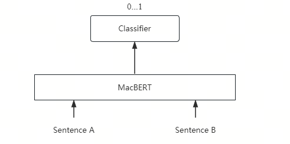
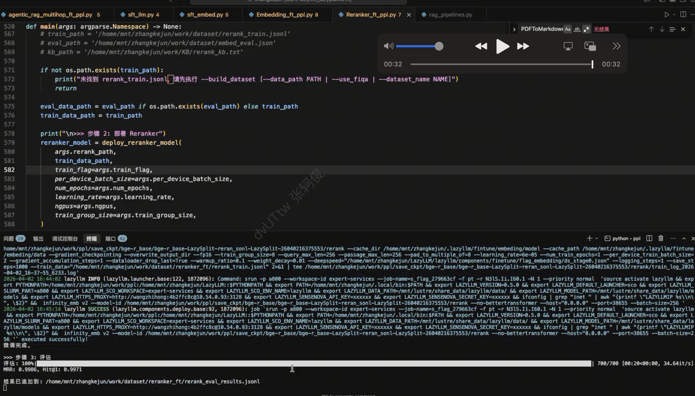
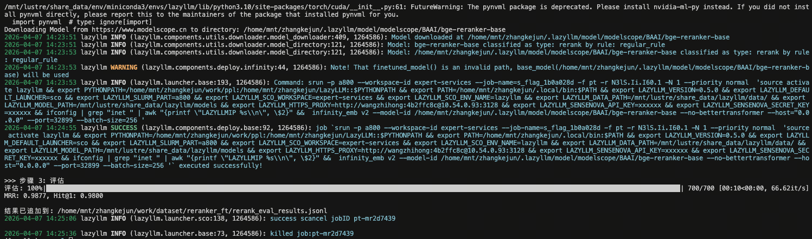

# 第27课时：Reranker 模型微调与实战

在 RAG（检索增强生成）系统中，**Retriever 模型负责初筛**（召回），  
但初筛结果往往包含大量“似是而非”的干扰项——  
例如，查询“心肌梗死的治疗”，检索返回“心肌炎治疗”“心力衰竭管理”“PCI手术流程”等。

> ✅ **Reranker**（重排序模型）正是解决这一问题的**精排利器**。  
> 它能对初筛结果进行**精细化相关性打分**，将真正相关的文档排到最前面。

本课将从**零基础原理出发**，系统讲解：

1. **核心原理**：Cross-encoder 架构 vs Bi-encoder，相关性打分机制，计算开销分析；
2. **数据构建**：如何利用 LLM 蒸馏生成高质量排序数据，Pairwise 与 Listwise 格式的区别；
3. **微调与实战**：微调 BGE-Reranker，并集成到 RAG 系统。

用**通俗语言 + 公式 + 工业界案例**，让你掌握 Reranker 从理论到落地的完整能力。

---

## 1. Reranker 的核心原理：Cross-encoder 如何弥合语义鸿沟

### 1.1 Cross-encoder 的交互机制



Cross-encoder 通过将 Query 和 Document 拼接后联合输入 Transformer（如 MacBERT），利用其强大的自注意力机制实现深度语义交互，再通过 Classifier 输出相关性概率，从而在重排序任务中获得远超 Bi-encoder 的精度。

Reranker 采用 **Cross-encoder** 架构，其核心是将 Query 和 Document **拼接后联合输入 Transformer**：
$$
\text{input} = [\text{[CLS]} \, q \, \text{[SEP]} \, d \, \text{[SEP]}]
$$

- $q$：用户输入的查询文本，例如 “心肌梗死的治疗”；
- $d$：从检索器（Retriever）返回的候选文档片段，例如 “阿司匹林不用于心肌炎”；
- **[CLS]**：特殊的分类 token（Classification token），位于序列开头，其最终隐藏状态常用于表示整个序列的语义；
- **[SEP]**：分隔符 token（Separator token），用于分隔查询和文档两个部分；
- $\text{input}$：拼接后的完整输入序列，作为 Transformer 的输入。

模型通过 **全注意力机制**（Full Self-Attention）建模所有 token 之间的交互关系。

> ✅ **关键能力**：

> - 注意力头可聚焦于“心肌梗死” vs “心肌炎”的**差异词**；
> - 识别“不用于”是否定信号；
> - 建立“阿司匹林 → 抗血小板 → 心梗治疗”的**推理链**。

### 1.2 相关性打分的数学形式

Cross-encoder 输出一个标量分数：
$$
\text{score}(q, d) = W^\top h_{\text{[CLS]}} + b
$$
其中 $h_{\text{[CLS]}}$ 是 [CLS] token 的最终隐藏状态，$W, b$ 为可学习参数。

- $h_{\text{[CLS]}} \in \mathbb{R}^h$：Transformer 编码器输出的 [CLS] token 的隐藏向量，维度为 $h$（例如 $h = 768$）；
- $W \in \mathbb{R}^h$：可学习的权重向量，用于将隐藏状态投影为标量；
- $b \in \mathbb{R}$：可学习的偏置项；
- $\text{score}(q, d) \in \mathbb{R}$：标量分数，表示查询 $q$ 与文档 $d$ 的相关性程度，值越大表示越相关。

> 📌 **训练目标**：让相关文档得分显著高于不相关文档：
> $$
> \text{score}(q, d^+) - \text{score}(q, d^-) > \text{margin}
> $$

### 1.3 回顾：Bi-encoder 架构及其局限性
在 Embedding 检索阶段，我们通常采用 **Bi-encoder**（双编码器）架构。其核心思想是将查询（Query）$q$ 与候选文档（Document）$d$ **独立编码**为稠密向量，再通过向量相似度衡量相关性：

- **Query Encoder**：$u = E_q(q)$，将查询 $q$ 映射为向量 $u \in \mathbb{R}^d$；
- **Document Encoder**：$v = E_d(d)$，将文档 $d$ 映射为向量 $v \in \mathbb{R}^d$；
- **相似度计算**：使用余弦相似度：
  $$
  \text{sim}(q, d) = \frac{u^\top v}{\|u\| \|v\|}
  $$

> ✅ **优势**：  
> - 文档向量 $v$ 可**离线预计算**，检索效率极高；  
> - 支持亿级知识库的近似最近邻搜索（ANN）。

> ❌ **根本局限**：  
> - **无交互机制**：$q$ 与 $d$ 的编码过程完全独立，无法建模细粒度语义对齐；  
> - **无法识别否定、术语差异、逻辑依赖**：  
>   - 例：查询“心梗治疗” 与 文档“心肌炎治疗”  
>     → 因共享“心肌”“治疗”等词，Bi-encoder 给出高相似度，**但任务上完全无关**。

因此，Bi-encoder 适合**高召回**（Recall），但**排序精度**（Ranking Precision）不足。

### 1.4 为什么 Cross-encoder 更有效？——信息论视角
（来源：Cross Encoders, Bi Encoders & Re-rankers ）

从上图可以看到：
Bi-encoder 是“有损压缩”：独立编码相当于把 Query 和 Doc 分别压缩成低维向量，再通过简单相似度比较。这个过程丢失了大量交互信息 → 信息通道容量小 → 无法恢复完整语义对齐 → 估计误差大。
Cross-encoder 是“无损通道”：
联合编码允许模型在原始文本层面进行充分交互，保留了所有潜在判别信号 → 信息通道容量大 → 能更准确逼近真实相关性  → 估计更准。

设真实相关性为 $r^* \in \{0, 1\}$，模型估计为 $\hat{r} = \sigma(\text{score}(q, d))$。

- **Bi-encoder 的信息瓶颈**：  
  Query 和 Doc 独立编码 → 信息通道受限 → 无法恢复细粒度语义对齐。

- **Cross-encoder 的信息通道**：  
  联合编码 → 全连接注意力 → 信息通道容量大 → 能保留更多判别性特征。

从互信息角度看：

$$
I(r^*; \text{score}_{\text{cross}}) \gg I(r^*; \text{sim}_{\text{bi}})
$$

其中：

- $I(r^*; \text{score}_{\text{cross}})$：Cross-encoder 打分与真实标签的互信息；
- $I(r^*; \text{sim}_{\text{bi}})$：Bi-encoder 相似度与真实标签的互信息；
- 符号 $\gg$ 表示“远大于”。
即：Cross-encoder 的输出与真实相关性具有更高的互信息。

> ✅ **实证结果**（BEIR benchmark）：

> - Bi-encoder（BGE-large）：MRR@10 ≈ 0.62  
> - Cross-encoder（BGE-reranker）：MRR@10 ≈ **0.85**（+37%）

---

## 2. Reranker 在 RAG 流程中的作用：精排而非召回

Reranker 召回重排策略被广泛应用在搜索引擎、推荐系统、问答系统等任务中，其基本思想是：在初步检索后，通过一个额外的模型对检索结果进行再次排序以提高最终的效果。下图对比了直接使用检索器召回 top 3 文档和先通过检索器召回 top 5 文档再对其进行重排序返回 top 3 文档的流程。可见检索流程并没有对文档进行排序，只是将满足需求的 top 5 个文档返回，而通过重排序流程，可以对其进行更精细的排序，得到排序后的文档，使得更重要的文档在返回列表中更靠前。


### 2.1 两阶段流程

1. **召回阶段**（Recall）：

    - Bi-encoder 检索 top-100 文档；
    - 目标：高召回率（Recall@100 > 90%）；
    - 优势：高效（Doc 向量可预计算）。

2. **精排阶段**（Rerank）：

    - Cross-encoder 对 top-100 重排序；
    - 目标：高精度排序（MRR@10 最大化）；
    - 输出：取 top-5 送入 LLM 生成。

> 📌 **分工明确**：

> - Bi-encoder 负责“广撒网”；
> - Reranker 负责“精挑细选”。

### 2.2 计算开销与性能权衡

| 模块 | 时间复杂度 | 显存 | 适用阶段 |
|------|-------------|------|----------|
| Bi-encoder | $O(1)$（Doc 预计算） | 低 | 召回 |
| Cross-encoder | $O(k \cdot L^2)$ | 高 | 精排（$k \leq 100$） |

> ✅ **工业实践**：

> - 限制 $k=50$～100，平衡精度与延迟；
> - 使用小模型（如 `bge-reranker-base`）或 ONNX 加速；
> - 仅对高价值请求启用 Reranker。

### 2.3 业界经典 Reranker 微调数据集

| 数据集 | 领域 | 规模 | 特点 | Schema |
|--------|------|------|------|--------|
| **MS MARCO** | 通用搜索 | 500k query-doc pairs | Bing 搜索日志，人工标注相关性 | `{"query": str, "positive": str, "negatives": List[str]}` |
| **MIRACL** | 多语言 | 18 语言 × 12 领域 | 跨语言检索，含医疗、科技等 | `{"query": str, "positive_passages": List[str], "language": str}` |
| **C-Eval**（中文）| 多领域 | 14k | 包含医学、法律、金融等子集，适合构建中文 Reranker | `{"question": str, "answer": str, "distractors": List[str]}` |
| **FiQA** | 金融 | 6k | 金融问答，负样本多为“看似专业但错误”的干扰项 | `{"question": str, "relevant": str, "irrelevant": List[str]}` |
| **LLM-Reranker-Distill**（BGE）| 通用 | 1M+ | 用 GPT-4 蒸馏生成，覆盖 100+ 子任务 | `{"query": str, "pos": str, "neg": str}` |

> 🌟 **关键特点**：

> - **MS MARCO**：最广泛使用的英文 Reranker 基准，负样本通过 BM25 + Hard Negative Mining 构建；
> - **C-Eval**（中文）：含 52 个学科，`distractors` 字段天然提供**难负样本**；
> - **LLM-Reranker-Distill**：由 BGE 团队开源，使用 LLM 自动生成高质量 Pairwise 数据，是当前 SOTA 微调数据源。

---

## 3. Reranker 数据集构建

Reranker 的训练数据需要包含**查询**、**正样本文档**和**负样本文档**。FlagEmbedding Reranker 的标准数据格式为：

```json
{"query": "查询文本", "pos": ["正样本文档1", ...], "neg": ["负样本文档1", "负样本文档2", ...]}
```

> 📌 **关键参数**：`train_group_size` 决定每个训练批次的样本组成，默认为 8（1个正样本 + 7个负样本），因此 `neg` 列表通常包含 7 个负样本。

### 3.1 从公开数据集构建（推荐入门）

以下代码展示如何从 HuggingFace 数据集构建 Reranker 训练数据：

```python
import json
import numpy as np
from tqdm import tqdm
from datasets import load_dataset

def build_rerank_dataset_from_huggingface(
    dataset_name: str = "virattt/financial-qa-10K",
    neg_num: int = 7,        # 负样本数量（配合 train_group_size=8）
    test_size: float = 0.1,
    seed: int = 1314
):
    """从 HuggingFace 数据集构建 Reranker 训练数据"""
    
    # 1. 加载数据集
    ds = load_dataset(dataset_name, split="train")
    ds = ds.select_columns(column_names=["question", "context"])
    ds = ds.rename_columns({"question": "query", "context": "pos"})
    
    # 2. 转换 pos 为列表格式（FlagEmbedding 要求）
    def str_to_lst(data):
        data["pos"] = [data["pos"]]
        return data
    ds = ds.map(str_to_lst)
    
    # 3. 划分训练集和测试集
    split = ds.train_test_split(test_size=test_size, shuffle=True, seed=seed)
    
    # 4. 构建负样本池（从训练集的其他样本中采样）
    train_corpus_list = [item[0] for item in split["train"]["pos"]]
    
    # 5. 为每个样本生成负样本
    np.random.seed(seed)
    train_data = []
    for item in tqdm(split["train"], desc="生成负样本"):
        # 随机采样负样本
        neg_indices = np.random.randint(0, len(train_corpus_list), size=neg_num * 2)
        neg = [train_corpus_list[idx] for idx in neg_indices]
        
        # 确保负样本不包含正样本
        pos_text = item["pos"][0]
        neg = [n for n in neg if n != pos_text][:neg_num]
        
        # 构造 Reranker 数据格式
        train_data.append({
            "query": item["query"],
            "pos": item["pos"],      # List[str]
            "neg": neg               # List[str]
        })
    
    # 6. 保存为 JSONL 格式
    with open("rerank_train.jsonl", "w", encoding="utf-8") as f:
        for item in train_data:
            f.write(json.dumps(item, ensure_ascii=False) + "\n")
    
    print(f"成功生成 {len(train_data)} 条 Reranker 训练样本")
    return "rerank_train.jsonl"
```

### 3.2 利用 LLM 蒸馏生成数据（进阶方法）

当需要更高质量的训练数据时，可采用 **LLM 蒸馏**方法生成**难负样本**（Hard Negatives）：

#### 3.2.1 流程

1. 从知识库中采样文档 $d$；
2. 用 LLM 生成相关查询 $q$；
3. 对每个 $q$，用 Embedding 检索 top-$n$ 候选文档；
4. 用 LLM 判断每个候选的相关性，区分正负样本。

#### 3.2.2 代码示例

```python
import json
import lazyllm

# Step 1: 初始化检索组件
embed = lazyllm.TrainableModule('BAAI/bge-large-zh-v1.5')
documents = lazyllm.Document(dataset_path="KB", embed=embed, manager=False)
retriever = lazyllm.Retriever(
    doc=documents, group_name="CoarseChunk", 
    similarity="bm25_chinese", topk=10
)

# Step 2: 部署 LLM（用于蒸馏）
llm = lazyllm.OnlineChatModule(source="sensenova", model="SenseChat-5-1202")

# Step 3: 蒸馏生成训练数据
rerank_samples = []
neg_num = 7  # 负样本数量

for d in documents[:1000]:  # 采样文档
    # 3.1 生成查询
    prompt_q = f"请基于以下文档生成一个用户可能提出的问题：\n文档：{d}\n问题："
    query = llm(prompt_q).strip()

    # 3.2 检索候选文档
    candidates = retriever(query)

    # 3.3 用 LLM 判断相关性
    positives, negatives = [], []
    for cand in candidates:
        prompt_judge = (
            f"问题：{query}\n文档：{cand}\n"
            "该文档是否直接回答了问题？请仅回答"是"或"否"。"
        )
        if llm(prompt_judge).strip() == "是":
            positives.append(cand)
        else:
            negatives.append(cand)
    
    # 3.4 构造训练样本（FlagEmbedding 格式）
    if positives and len(negatives) >= neg_num:
        rerank_samples.append({
            "query": query,
            "pos": positives[:1],           # 取第一个正样本
            "neg": negatives[:neg_num]      # 取前 neg_num 个难负样本
        })

# Step 4: 保存为 JSONL 格式
with open("rerank_distill.jsonl", "w", encoding="utf-8") as f:
    for sample in rerank_samples:
        f.write(json.dumps(sample, ensure_ascii=False) + "\n")

print(f"成功生成 {len(rerank_samples)} 条 Reranker 训练样本")
```

> ✅ **LLM 蒸馏的优势**：
>
> - 自动生成海量高质量样本；
> - LLM 能理解复杂语义，标注准确率 >90%；
> - 生成的负样本是**难负样本**（检索返回但不相关），训练效果更好。

> 🌟 **业界案例**：

> - **Cohere**：用 GPT-4 蒸馏生成 reranker 训练数据；
> - **BGE 团队**：开源 `BAAI/LLM-Reranker-Distill` 数据集。

### 3.3 Pairwise vs Listwise 数据格式

#### 3.3.1 Pairwise（成对比较）

- **格式**：$(q, d^+, d^-)$，表示 $d^+$ 比 $d^-$ 更相关；
- **损失函数**：**Pairwise Hinge Loss**
  $$
  \mathcal{L} = \max(0, \text{margin} - [\text{score}(q, d^+) - \text{score}(q, d^-)])
  $$
- **优点**：标注简单，训练稳定。

#### 3.3.2 Listwise（列表级排序）

- **格式**：$(q, [d_1, ..., d_n], [r_1, ..., r_n])$，$r_i$ 为相关性等级；
- **损失函数**：**ListNet**
    - 真实分布：$P_{\text{true}}(d_i) = \frac{2^{r_i} - 1}{\sum_j (2^{r_j} - 1)}$
    - 模型分布：$P_{\text{model}}(d_i) = \frac{\exp(\text{score}(q, d_i))}{\sum_j \exp(\text{score}(q, d_j))}$
    - 损失 = 交叉熵：$\mathcal{L} = -\sum_i P_{\text{true}}(d_i) \log P_{\text{model}}(d_i)$
- **优点**：建模全局排序，效果更好。

| 方法       | 适用场景                             | 典型算法                          | 局限性                               |
|------------|--------------------------------------|-----------------------------------|--------------------------------------|
| Pairwise   | 需要明确相对顺序的场景（如搜索）       | RankNet、BPR、FM Pairwise         | 对标注噪声敏感，无法直接优化 NDCG 等全局指标 |
| Listwise   | 全局优化排序（如推荐列表、问答精排）   | LambdaMART、ListNet、AdaRank      | 计算复杂度高，依赖完整候选列表数据     |


### 3.4 基于 LazyLLM 构建数据集

除了 Embedding 模型，LazyLLM 还提供了专用于构建高质量 **Reranker（重排序）模型** 微调数据集的 **Pipeline**。Reranker 模型的效果高度依赖于难负样本（Hard Negatives）的质量，该工具链旨在简化数据预处理流程，用户仅需使用简单的代码，即可自动化构建出效果优秀的训练数据集。


Pipeline 内置了三个关键处理阶段的算子，覆盖从数据划分到格式转换的全流程：

| 算子名称 | 功能描述 | 支持模式/特性 |
| :--- | :--- | :--- |
| **RerankerTrainTestSplitter**<br>*(数据集切分)* | 对输入数据进行随机打乱，并按指定比例分割为训练集和测试集。 | • 支持自定义分割比例<br>• 确保评估数据的独立性 |
| **embedding_hard_negative_miner**<br>*(难负样本挖掘)* | 挖掘高难度负样本，提升 Reranker 模型对相似文本的区分能力。 | • **BM25**：基于关键词匹配<br>• **语义相似度**：基于向量距离<br>• **混合方式**：结合上述两种途径 |
| **reranker_data_formatter**<br>*(数据格式化)* | 将处理后的数据转换为主流 Reranker 框架所需的训练格式。 | • **FlagReranker** 格式<br>• **CrossEncoder** 格式<br>• **Pairwise** 格式 |

下面我们简单展示一下如何使用 reranker_pipelines 完成：划分 → 难负样本挖掘 → 格式化 → 保存。完整代码([reranker_ppl](from-data-to-llm/docs/chapter27/code/Reranker_ft_ppl.py))
```python
def build_dataset_with_pipelines(
    raw_items: List[dict],
    corpus_texts: Optional[List[str]] = None,
    neg_num: int = 7,
    test_size: float = 0.1,
    seed: int = 1314,
    mining_strategy: str = "random",
    output_format: str = "flagreranker",
    train_group_size: int = 8,
    embedding_serving=None,
    bm25_ratio: float = 0.5,
    output_subdir: str = "dataset",
) -> Tuple[str, str, str]:
    if not raw_items:
        raise ValueError("raw_items 为空，请先通过 load_from_fiqa / load_from_user_data / load_from_huggingface 加载")
    if corpus_texts is None:
        corpus_texts = list({p for item in raw_items for p in (item.get("pos") or [])})

    print("\n" + "=" * 60)
    print("Reranker Pipeline: 划分 → 难负样本 → 格式化 → 保存")
    print("=" * 60)
    print(f"\n>>> 输入: {len(raw_items)} 条，语料 {len(corpus_texts)} 篇")

    # ----- Step 1: 划分 train / test -----
    print("\n>>> Step 1: 划分 train / test (RerankerTrainTestSplitter)")

    splitter = RerankerTrainTestSplitter(test_size=test_size, seed=seed)
    mixed = splitter(raw_items)

    train_items = [x for x in mixed if x.get("split") == "train"]
    test_items = [x for x in mixed if x.get("split") == "test"]
    print(f"训练 {len(train_items)} 条，测试 {len(test_items)} 条")

    # ----- Step 3: 难负样本挖掘 -----
    print(f"\n>>> Step 2: 难负样本挖掘 (策略: {mining_strategy})")

    test_corpus = list(set(item["pos"][0] for item in test_items if item.get("pos")))
    use_corpus = corpus_texts

    hard_neg_fn = build_reranker_hard_neg_pipeline(
        input_query_key="query",
        input_pos_key="pos",
        output_neg_key="neg",
        corpus=use_corpus,
        mining_strategy=mining_strategy,
        num_negatives=neg_num,
        embedding_serving=embedding_serving,
        bm25_ratio=bm25_ratio,
        seed=seed,
    )
    train_items_with_neg = hard_neg_fn(train_items)
    print(f"难负样本挖掘完成: {len(train_items_with_neg)} 条")

    print(f"\n>>> Step 3: 数据格式化 (格式: {output_format})")

    def _flatten_and_write(formatter_result: List, out_path: str) -> int:
        flat = []
        for x in formatter_result:
            if isinstance(x, list):
                flat.extend(x)
            else:
                flat.append(x)
        Path(out_path).parent.mkdir(parents=True, exist_ok=True)
        with open(out_path, "w", encoding="utf-8") as f:
            for item in flat:
                if isinstance(item, dict) and item:
                    f.write(json.dumps(item, ensure_ascii=False) + "\n")
        return len(flat)

    formatter_ppl = build_reranker_dataformatter_pipeline(
        input_query_key="query",
        input_pos_key="pos",
        input_neg_key="neg",
        output_format=output_format,
        train_group_size=train_group_size,
    )
    train_data_path = build_data_path(output_subdir, "rerank_train.jsonl")
    formatted_train = formatter_ppl(train_items_with_neg)
    n_train = _flatten_and_write(formatted_train, train_data_path)
    print(f"训练数据: {n_train} 条 → {train_data_path}")

    import random
    random.seed(seed)
    eval_data_path = build_data_path(output_subdir, "rerank_eval.jsonl")
    with open(eval_data_path, "w", encoding="utf-8") as f:
        for item in test_items:
            pos_set = set(item.get("pos", []))
            candidates = [doc for doc in test_corpus if doc not in pos_set]
            neg = random.sample(candidates, min(neg_num, len(candidates))) if candidates else []
            f.write(json.dumps({
                "query": item.get("query", ""),
                "corpus": item.get("pos", []),
                "neg": neg,
            }, ensure_ascii=False) + "\n")
    print(f"评估数据: {len(test_items)} 条 → {eval_data_path}")

    kb_path = build_data_path("KB", "rerank_kb.txt")
    with open(kb_path, "w", encoding="utf-8") as f:
        f.write("\n".join(test_corpus))
    print(f"知识库: {len(test_corpus)} 篇 → {kb_path}")
    print("\n数据集构建完成！")
    return train_data_path, eval_data_path, os.path.dirname(kb_path)
```

---

## 4. 微调与实战：微调 BGE-Reranker

LazyLLM 提供了 Reranker 组件进行重排序，分别提供了在线和离线两种重排序模型的调用途径，其中在线模型通过 `OnlineEmbeddingModule(type="rerank")` 进行调用，离线重排模型则仍然通过 `TrainableModule` 进行调用。

### 4.1 Reranker 组件参数详解

使用 Reranker 时的可调整参数包括：

| 参数 | 类型 | 默认值 | 说明 |
|------|------|--------|------|
| **name** | str | `'ModuleReranker'` | 实现重排序时必须为 ModuleReranker |
| **model** | Union[Callable, str] | - | 实现重排序的具体模型名称或可调用对象 |
| **topk** | int | - | 最终需要返回的 k 个节点数 |
| **output_format** | str | `None` | 输出格式，可选值有 `'content'` 和 `'dict'` |
| **join** | boolean | `False` | 是否联合输出的 k 个节点（仅当 output_format='content' 时有效） |

#### model 参数的两种使用方式：

1. **Callable 情形**：
   - `OnlineEmbeddingModule(type="rerank")`：目前支持 qwen 和 glm 的在线重排序模型，使用前需要指定 apikey
   - `TrainableModule(model="str")`：需要传入本地模型名称，常用的开源重排序模型为 bge-reranker 系列

2. **str 情形**：直接传入模型名称，与 Callable 情形中 `TrainableModule` 对应的 model 参数要求相同

#### output_format 参数说明：
- `None` 或省略：返回原始格式（通常是元组列表 `[(index, score), ...]`）
- `'content'`：返回字符串格式，当 `join=True` 时输出一个长字符串，`join=False` 时输出字符串列表
- `'dict'`：返回字典格式，包含文档内容和得分信息

### 4.2 微调前的准备工作

在开始微调前，需要完成以下准备工作：

#### 4.2.1 数据准备
Reranker 微调需要的数据格式为 FlagEmbedding 标准格式：

```json
{"query": "查询文本", "pos": ["正样本文档1"], "neg": ["负样本文档1", "负样本文档2", ...]}
```

通常建议 `neg` 列表包含 7 个负样本，以配合默认的 `train_group_size=8`（1个正样本 + 7个负样本）。

#### 4.2.2 环境配置
确保已安装 LazyLLM 框架及相关依赖：

```bash
pip install lazyllm
# 如果需要 GPU 训练，确保安装正确版本的 PyTorch 和 CUDA
```

#### 4.2.3 选择预训练模型
常用的开源 Reranker 模型包括：

| 模型名称 | 参数量 | 语言 | 特点 |
|----------|--------|------|------|
| `BAAI/bge-reranker-base` | 110M | 中英双语 | 平衡性能与速度，推荐首选 |
| `BAAI/bge-reranker-large` | 340M | 中英双语 | 更高精度，计算开销更大 |
| `BAAI/bge-reranker-v2-m3` | 110M | 多语言 | 支持 100+ 语言，跨语言检索 |

### 4.3 微调参数详解

微调 Reranker 时，以下参数对最终效果影响显著：

| 参数 | 推荐值 | 说明 |
|------|--------|------|
| **per_device_train_batch_size** | 2-8 | 每个 GPU 的批次大小，取决于 GPU 显存 |
| **num_train_epochs** | 1-3 | 训练轮数，通常 1-2 轮即可收敛 |
| **learning_rate** | 2e-5 ~ 1e-4 | 学习率，推荐从 5e-5 开始尝试 |
| **train_group_size** | 8 | 训练组大小（1正 + 7负），与数据格式对应 |
| **query_max_len** | 256 | 查询最大长度，超过部分截断 |
| **passage_max_len** | 256 | 文档最大长度，超过部分截断 |
| **ngpus** | 1~8 | 使用的 GPU 数量，加速训练 |

> 📌 **关键参数说明**：

> - **train_group_size**：决定了每个训练批次的样本构成。例如 `train_group_size=8` 表示每个训练批次包含 1 个正样本和 7 个负样本，这与数据集中 `neg` 列表的长度（通常为 7）相匹配。

> - **query_max_len** 和 **passage_max_len**：Cross-encoder 需要将查询和文档拼接后输入模型，因此需要限制两者长度以控制总序列长度。通常设置 256+256=512，不超过模型的最大上下文长度（如 BERT 的 512）。

### 4.4 完整微调示例

下面我们展示一个完整的 BGE-Reranker 微调流程，包含数据准备、模型微调、效果评估三个步骤。

#### 步骤 1：数据准备（以 FiQA 金融问答数据集为例）

```python
import lazyllm
from lazyllm.tools.dataset import build_rerank_dataset_from_fiqa

# 构建 Reranker 训练数据
train_data_path, eval_data_path, kb_path = build_rerank_dataset_from_fiqa(
    queries_file="dataset/fiqa/queries.jsonl",
    corpus_file="dataset/fiqa/corpus.jsonl",
    train_file="dataset/fiqa/train.tsv",
    neg_num=7,        # 负样本数量（配合 train_group_size=8）
    test_size=0.1,    # 10% 作为测试集
    seed=1314
)

print(f"训练数据: {train_data_path}")
print(f"评估数据: {eval_data_path}")
print(f"知识库路径: {kb_path}")
```

#### 步骤 2：配置并启动微调

```python
import lazyllm
from lazyllm import finetune, launchers

# 微调参数配置
rerank_path = "BAAI/bge-reranker-base"  # 预训练模型
per_device_batch_size = 4               # 每个 GPU 批次大小
num_epochs = 2                          # 训练轮数
learning_rate = 5e-5                    # 学习率
ngpus = 1                               # GPU 数量
train_group_size = 8                    # 训练组大小

print(f"{'='*60}")
print(f"开始微调 Reranker 模型: {rerank_path}")
print(f"{'='*60}")

# 创建可微调的 Reranker 模型
reranker_model = lazyllm.TrainableModule(rerank_path) \
    .mode('finetune') \
    .trainset(train_data_path) \
    .finetune_method((
        finetune.auto,
        {
            'launcher': launchers.sco(ngpus=ngpus),
            'per_device_train_batch_size': per_device_batch_size,
            'num_train_epochs': num_epochs,
            'learning_rate': learning_rate,
            'train_group_size': train_group_size,
            'query_max_len': 256,
            'passage_max_len': 256,
            # 可选：添加权重衰减和梯度累积
            'weight_decay': 0.01,
            'gradient_accumulation_steps': 2,
        }
    ))

# 启动微调
print("\n开始微调 Reranker 模型...")
reranker_model.update()  # 执行微调
print("微调完成！")
```


> 📚 **完整代码参考**：[reranker_finetune.py](./code/reranker_finetune.py) 提供了从数据准备到评估的完整可运行代码。

## 5. 业界广泛使用的技术与模型

| 组件 | 主流方案 |
|------|----------|
| **开源模型** | BGE-Reranker, ColBERTv2 |
| **商用 API** | Cohere Rerank, Pinecone Rerank |
| **微调框架** | FlagEmbedding, Sentence-Transformers |
| **RAG 集成** | LazyLLM，LlamaIndex, Haystack, LangChain |


---

## 6. 效果评测

Reranker 在检索增强生成（RAG）流程中扮演关键角色：它接收初步检索的候选文档（包括正样本和负样本），通过更精细的语义匹配对结果重新排序，从而提升最终输入给大模型的上下文质量。

为此，我们设计了基于 **MRR（Mean Reciprocal Rank）** 和 **Hit Rate（命中率）** 的评估方案，以衡量 Reranker 对正样本的排序优先级能力。

---

### 6.1 评估指标定义与公式

#### 1. **MRR（Mean Reciprocal Rank，平均倒数排名）**

**定义**：MRR 衡量在所有查询中，**第一个相关（正样本）文档的排名倒数**的平均值。该指标对高排名的正样本赋予更高权重，特别适用于“找到一个正确答案即可”的场景（如问答系统）。

**计算公式**：

设共有 \( N \) 个查询样本，对于第 \( i \) 个查询，其第一个正样本在 Reranker 输出中的排名为 \( \text{rank}_i \)（从 1 开始计数），则 MRR 定义为：

\[
\text{MRR} = \frac{1}{N} \sum_{i=1}^{N} \frac{1}{\text{rank}_i}
\]

若某查询未返回任何正样本，则 \( \frac{1}{\text{rank}_i} = 0 \)。

> **特点**：MRR 对排名敏感——正样本排在第 1 位得分为 1.0，第 2 位为 0.5，第 3 位为 0.333，依此类推。因此，MRR 越高，说明 Reranker 越能将相关文档排在前列。

---

#### 2. **Hit Rate（命中率，@Top-K）**

**定义**：在 Top-K 检索结果中，至少包含一个正样本的比例。反映系统在有限展示位（如 Top-1）下“是否命中正确答案”的能力。

**计算公式**：

设 \( \mathbb{I}_i \) 为指示函数，当第 \( i \) 个查询的 Top-K 结果中包含至少一个正样本时取值为 1，否则为 0，则 Hit Rate 为：

\[
\text{Hit@K} = \frac{1}{N} \sum_{i=1}^{N} \mathbb{I}_i
\]

在本实现中，默认使用 `topk=1`，即计算 **Hit@1**，等价于“首条结果是否为正样本”。

> **应用场景**：在金融问答等高精度场景中，通常仅使用 Top-1 文档作为上下文，因此 Hit@1 是核心业务指标。

---

### 6.2 评估流程说明

函数 `evaluate_reranker_direct` 执行以下步骤：

1. **加载评估数据**：从 `eval_data_path` 读取每条样本，包含：
    - `query`：用户问题；
    - `corpus`：正样本文档列表（通常为单元素列表）；
    - `neg`：负样本文档列表（由 `build_dataset_corpus` 随机采样生成）。
2. **构建候选集**：将正样本与负样本合并为 `all_docs`，作为 Reranker 的输入文档池。
3. **调用 Reranker**：
    - 输入 `query` 与 `all_docs`；
    - 获取按相关性降序排列的 `(index, score)` 列表，其中 `index` 对应 `all_docs` 中的位置。
4. **计算指标**：
    - 遍历排序结果，找到**第一个正样本**（即 `index < len(pos_docs)`）；
    - 记录其排名 `rank`，累加 `1/rank` 到 MRR；
    - 若 `rank <= topk`，则命中计数 +1。
5. **归一化输出**：返回平均 MRR 与 Hit Rate。

> **关键假设**：正样本在 `all_docs` 中位于前 `len(pos_docs)` 位置（代码中 `pos_docs + neg_docs` 保证此顺序）。

---

### 6.3 输出结果




| 评估指标 | **LazyLLM 数据构建** (推荐) | | **常规数据构建** (基准) | |
| :--- | :---: | :---: | :---: | :---: |
|                | **微调前** | **微调后** | **微调前** | **微调后** |
| **MRR** | 98.96 | 99.86 | 95.55 | 97.19 |
| **Hit@1** | 98.14 | 99.71 | 92.36 | 94.90 |

---


## 7. 总结：Reranker 的核心原理链

| 问题 | 解决方案 | 原理 |
|------|----------|------|
| Bi-encoder 无法建模细粒度交互 | 使用 Cross-encoder | 联合编码 + 全注意力 |
| 语义相似 ≠ 任务相关 | 引入相关性监督信号 | Pairwise / Listwise 损失 |
| 初筛结果噪声大 | 两阶段检索 | 召回 + 精排 |
