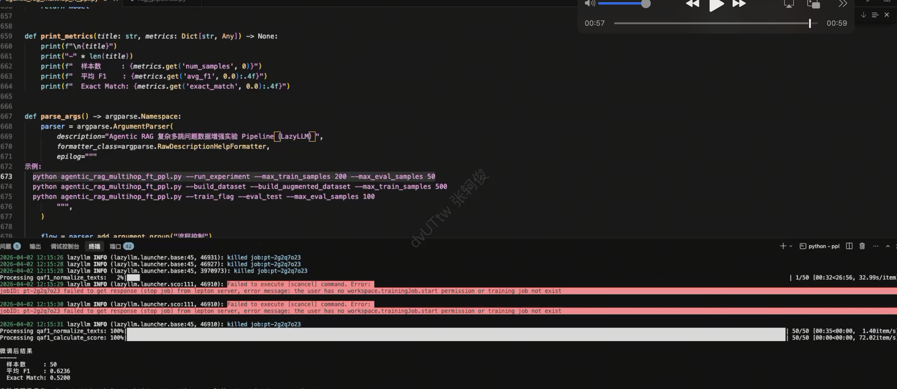

# 第28课时：Agentic RAG 与多跳数据增强

在 RAG（检索增强生成）系统里，用户常问需要**跨多条证据**才能回答的问题——例如先确认「某乐队的主唱是谁」，再根据该人物推断「其出生地所属国家」。  
若只做**一次检索、一次阅读**，模型要么漏掉第二跳事实，要么把两段里各取一半拼成错误结论。

> ✅ **Agentic RAG** 在工业与学术讨论中，通常指：让大模型在**规划、调用工具、根据中间结果修正策略**上扮演更主动的角色，而不只是被动接收检索片段。  
> 另一条同样重要的路线是：**在数据侧**用多阶段、可校验的合成流程，造出「像多跳、像会检验」的监督样本，再与原始数据一起微调——本课将**原理、背景、LazyLLM Pipeline 与可落地的微调流程**串成一条链。

本课将从**零基础背景**出发，系统讲解：

1. **RAG 代际与多跳难点**：朴素 RAG → 高级/模块化 RAG → Agentic RAG；多跳 QA 的信息结构；
2. **数据合成三板斧**：Atomic（原子）、Depth（深度）、Width（宽度）各自对应的推理形态与质量控制；
3. **有依据标签与指令微调**：Grounding 约束、常见训练超参与评测指标（F1、EM）；
4. **LazyLLM 实战**：用 `atomic_rag_pipeline` 等生成增强 JSONL，以 `TrainableModule` + `finetune.auto` 做指令微调，并在同一验证集上对比多跳表现。

用**通俗叙述 + 关键公式 + 表格对照 + 关键代码**，帮助你在多跳场景下把「Agentic 思想」落到**可训练、可对比**的实验闭环里。

---

## 背景知识：从 RAG 到 Agentic 与自省式检索

### RAG 在解决什么问题，瓶颈在哪里

**检索增强生成（RAG）**把外部知识以「检索到的片段 + 用户问题」的形式交给语言模型，缓解纯参数记忆的时效性不足与幻觉风险。

| 形态 | 典型流程 | 优势 | 典型瓶颈 |
|------|-----------|------|----------|
| **朴素 RAG** | 查询 → 检索 top-$k$ → 拼上下文 → 生成 | 实现简单、易部署 | 单次检索；噪声段落易误导生成 |
| **高级 RAG** | + 查询改写、混合检索、重排序（参见第27课） | 单次检索质量更高 | 仍多为「一条流水线」，难应对多跳整合 |
| **模块化 RAG** | 路由、检索、重排、生成可替换 | 易 A/B 与工程迭代 | 需自行编排策略 |
| **Agentic RAG（常见含义）** | LLM 决定何时检索、用何工具、是否改写查询 | 可处理复杂任务与动态纠错 | 延迟、成本、编排复杂度上升 |

早期 **朴素 RAG** 多是固定流水线：查库 → 拼上下文 → 生成；一旦召回噪声大或问题需要多步整合，单次检索往往不够。  
**高级 RAG** 在工程上引入查询改写、混合检索、重排序等；**模块化 RAG** 把组件拆开便于替换。到了 **Agentic RAG**，讨论重心常转向：**谁在何时决定检索、用什么工具、如何根据中间结果调整策略**——即把 LLM 当作能规划、能调用工具、能根据反馈修正路径的控制器。

### 多跳问答：为何是「硬骨头」

**多跳 QA** 指必须结合**多个事实或段落**才能回答的问题。可粗略理解为：答案依赖的推理链长度 $L>1$，每一步可能对应不同句子或文档。

公开基准如 **HotpotQA** 常提供维基风格段落与**支持句标注**，评测除答案正确性外，也关注模型是否用到正确证据。对 RAG 而言，难点包括：

- **召回**：需要覆盖多个相关片段（与第27课「高召回」目标一致）；
- **阅读**：在长上下文中完成**指代消解**（「该公司」指谁）、**数值与实体对齐**；
- **推理**：在片段之间建立**桥接关系**（实体—关系—实体），避免「单段幻觉」或张冠李戴。

> 📌 **直觉**：多跳不是「把 top-$k$ 拼长一点」就能解决，而是要在训练分布中**反复出现**「需要整合多处证据」的题型；这正是数据增强要补上的缺口。


### 数据合成：为何值得单独讲

高质量 RAG / 多跳训练数据往往稀缺、标注昂贵。**自动合成 QA** 若不经筛选，容易混入：

- **可召回问题**：模型不查文档也能凭常识猜对，对「学检索边界」帮助有限；
- **上下文—答案不对齐**：标签无法由给定文本严格推出，微调会强化幻觉。

因此业界常强调：**可验证性**、**难度分层**（原子 / 链式 / 综合），以及 **无文档试答、分解检查、分数过滤** 等手段——与上文「自省」在精神上相通，只是落实为**造数据时的质量控制**。

---

## 1. 核心直觉：数据侧如何体现「规划」与「把关」

可以把复杂问答拆成两类能力：**先想清楚要问什么、证据在哪**（近似规划），以及**答案是否真被材料支撑**（近似反思与把关）。在**数据增强范式**里，这两类能力被**迁移到合成流水线**中：

- **规划感**：先产出细粒度事实问答（Atomic），再向「更深的关系链」或「更宽的跨片段综合题」扩展（Depth / Width），使训练分布覆盖「单点—链式—综合」多种形态。
- **把关感**：在关键步骤用模型做**交叉检验**（例如：不给文档时能否答对——若能，则可能不依赖材料，样本价值偏低），并对深度题、综合题再做**可解性与一致性**方面的检查，减少噪声进入训练集。
- **有依据作答**：为需要长上下文的题目生成标准答案时，明确要求**只根据给定材料**回答；材料不足则宁可不答，避免凭空编造，保证标签与上下文对齐。

这样训练出的模型，更习惯在**给定段落**上做整合与推理，与多跳评测设定一致。

### 1.1 三种合成形态与认知类比

| 形态 | 直觉 | 训练分布上的作用 |
|------|------|-------------------|
| **Atomic** | 单文档、单事实，一问一答 | 夯实「读一句、答一点」的可验证性 |
| **Depth** | 沿 identifier / 关系链向外扩 | 增加「多步推理链」类问题 |
| **Width** | 合并多条原子 QA 为综合题 | 增加「跨片段整合」类问题，贴近多跳 |

---

## 2. 任务与数据：以多跳数据集为载体

典型设置是使用 **HotpotQA（fullwiki 配置）** 多跳数据集：每条样本包含问题、短答案，以及若干维基段落作为上下文。！[alt text](./assets/28.1.png)

监督学习采用常见的 **指令 + 上下文与问题 + 短答案** 格式。下面是一种与教学实验兼容的**逻辑结构**（字段名可随框架调整）：

```json
{
  "instruction": "你是一个多跳问答助手。请严格依据给定上下文回答问题；若需跨句整合证据，请先综合相关事实再给出简洁答案。",
  "input": "上下文：\n……\n\n问题：……",
  "output": "短答案文本"
}
```

增强样本常按来源打上类别标记（如原始、原子、深度、宽度），便于事后分析哪一类对指标贡献更大。

---

## 3. LazyLLM三类数据合成：从原子事实到深与广

### 3.1 Atomic：原子问答

从单个文档出发，识别主题性标识与可验证的小结论，再生成**针对性强、可检查**的问题。流水线中通常包含：生成与清洗问题、用**无文档试答**筛掉「不查文档也能猜对」的条目，并基于原文整理**金标答案**。这一步产出的数据最适合打牢「读材料再说话」的基本功，也是后续 Width 阶段的「种子」来源之一。

> ✅ **无文档试答的直观含义**：令模型在**看不到文档**的条件下回答问题；若仍答对，则该题可能过度依赖参数知识，作为「强依赖检索」的训练样本价值下降——与 IR 问题筛选的常见思路一致。

### 3.2 Depth：深度追问

在标识符与关系上做**多轮自顶向下扩展**：先找到更泛的父级主题与关系，再生成需要**沿关系链多想一步**才能回答的问题。每一轮可配合**子集/一致性检查**与**问题质量验证**，避免生成空泛或无法落地的深度题。深度题的标签答案建议在**同一文档上下文**内用**有依据提示**生成，保证与可见证据一致。

### 3.3 Width：宽度综合

把若干相邻或相关的原子问答**合并**成一道覆盖更广的综合题，再检验综合题能否**合理分解**回子问题、答案是否自洽。通过后再根据内部评分阈值过滤。综合题往往需要**拼接多段文本**作为上下文，并用有依据方式生成最终短答案（可辅以子答案作为提示），从而模拟「跨段整合」的多跳形态。

### 3.4 合并训练集

将上述增强结果与**仅用原始支持段落构造的基线样本**合并，并做去重，得到一份更丰富的微调语料。实践上建议**保留基线样本**，避免分布完全被合成数据带偏。

---

## 4. 有依据答案：让标签站得住脚

对 Depth、Width 等步骤中「模型新提出的问题」，需要自动生成与材料一致的参考答案。做法是使用明确的**仅依据上下文**的指令：若上下文不包含答案，则输出未知或空，并在后处理中丢弃无效条。这与 Atomic 阶段「从文档提炼金标」的目标一致，都是为了**同一套可检验的 Grounding 标准**。

从目标看，这与 Self-RAG 中「生成是否被材料支持」的关切**方向一致**；在数据增强路径中，常见实现是**提示约束 + 后处理过滤**，而非单独训练一个支持度分类头——工程上更简单，也易于与现有指令微调流程对接。

---

## 5. 训练与评测闭环

### 5.1 微调：在合并语料上做指令微调

在合并后的语料上做指令微调时，下列超参在实践中影响较大（具体取值依显存与基座模型而定）。

| 参数维度 | 常见取值范围 | 说明 |
|----------|----------------|------|
| **训练轮数** | 1～5 | 数据量小易过拟合，可配合早停 |
| **学习率** | $10^{-5}$ 量级 | 过大易破坏预训练知识 |
| **截断长度（cutoff）** | 如 1024～4096 | 需覆盖「上下文 + 问题」总长 |
| **批次与梯度累积** | 依显存调整 | 等效大 batch 稳定训练 |

建议流程是：**先在验证集上测基座 → 再训增强后的模型 → 同集复测**，对比指标变化，并抽样阅读错误类型（事实遗漏、指代错误、过度推断等）。

### 5.2 评测指标：F1 与 Exact Match

多跳问答公开工作常报告 **Token-level F1** 与 **Exact Match（EM）**，便于横向对比。

设标准答案词序列与预测词序列经规范化后为 $A = (a_1,\ldots,a_m)$、$P = (p_1,\ldots,p_n)$，记公共词袋计数（ multiset 意义下）对应的 precision / recall，则 F1 为二者的调和平均。直观上，F1 对**部分正确**的答案比 EM 更宽容。

**Exact Match** 则在规范化字符串完全一致时记为命中：

$$
\text{EM} = \frac{1}{N} \sum_{i=1}^{N} \mathbb{1}\big[\text{norm}(\hat{y}_i) = \text{norm}(y_i)\big]
$$

其中 $y_i$ 为第 $i$ 条标准答案，$\hat{y}_i$ 为模型预测，$\text{norm}(\cdot)$ 通常包含大小写、标点、冠词等规范化（具体与评测脚本一致）。

> 📌 **读指标**：EM 更严，适合衡量「一字不差」类任务；F1 更平滑，适合看整体趋势。实验报告中建议**两者同时给出**。

---

## 6. LazyLLM 实战：Pipeline 数据与多跳指令微调

下面我们具体说明 **LazyLLM 如何串联「数据合成 → 合并 JSONL → 微调 → 评测」**，从而在固定验证集上提升 **F1 / EM**，强化模型在**长上下文内整合证据**的能力。完整代码见([agentic_rag](./code/agentic_rag_multihop_ft_ppl.py))

### 6.1 依赖与 Pipeline 入口

脚本从 `lazyllm.tools.data.pipelines.rag_pipelines` 引入三类合成流水线及 QA 评测流水线，用于生成增强样本并在评测阶段计算 F1：

```python
import lazyllm
from lazyllm import finetune, launchers
from lazyllm.tools.data.pipelines.rag_pipelines import (
    atomic_rag_pipeline,
    depth_qa_pipeline,
    qa_evaluation_pipeline,
    width_qa_pipeline,
)
```

实验主流程会加载 HotpotQA、构造支持文档列表，再依次调用 `atomic_rag_pipeline`、`depth_qa_pipeline`、`width_qa_pipeline`（内部已封装标识符抽取、问题生成、验证与过滤等算子），将结果与原始训练样本合并为 **`merged_train.jsonl`**（字段为 `instruction` / `input` / `output` 的指令微调格式）。

### 6.2 最小示例：单文档上跑通 Atomic 合成

在理解完整实验前，可先用**单条文档**走通 Atomic 流水线，确认环境与基座可读：

```python
import lazyllm
from lazyllm.tools.data.pipelines.rag_pipelines import atomic_rag_pipeline

llm = lazyllm.TrainableModule("Qwen/Qwen2.5-7B-Instruct")  # 或本地路径
ppl = atomic_rag_pipeline(
    llm=llm,
    input_key="text",
    max_per_task=5,
    max_question=5,
    llm_verify_filter_threshold=1,
)
source_docs = [
    {
        "text": "龙美术馆于 2025 年 4 月 28 日至 6 月 15 日举办当代艺术主题展览。",
        "title": "龙美术馆",
        "source_doc_id": "doc_0",
    }
]
results = ppl(source_docs)
# results 中通常含 question、answer/refined_answer、text 等字段，可再格式化为 JSONL 训练行
```

将多条文档批量送入同一 `ppl`，即可得到一批**原子级 QA**；Depth / Width 则在更多文档与 Atomic 种子之上扩展深度题与综合题（完整逻辑见上述脚本中的 `build_augmented_training_data`）。

### 6.3 核心代码：用 `TrainableModule` 做指令微调

合并后的 `merged_train.jsonl` 作为 `trainset`，通过 **`finetune.auto`** 交给 LazyLLM 统一微调入口。下面是与脚本一致的 **`run_finetune`** 核心实现（含学习率、截断长度、梯度累积与 warmup 等）：

```python
def run_finetune(
    base_model: str,
    train_data_path: str,
    output_dir: str,
    num_epochs: int,
    per_device_batch_size: int,
    learning_rate: float,
    gradient_accumulation_steps: int,
    cutoff_len: int,
    warmup_ratio: float,
    ngpus: int,
):
    print(f'\n{"=" * 72}')
    print("开始微调（Agentic RAG 多跳增强实验）")
    print(f"  基座模型: {base_model}")
    print(f"  训练数据: {train_data_path}")
    print(f"  输出目录: {output_dir}")
    print(
        f"  epochs={num_epochs}, lr={learning_rate}, batch={per_device_batch_size}, "
        f"grad_accum={gradient_accumulation_steps}, cutoff_len={cutoff_len}, warmup_ratio={warmup_ratio}"
    )
    print(f'{"=" * 72}\n')

    model = (
        lazyllm.TrainableModule(base_model)
        .mode("finetune")
        .trainset(train_data_path)
        .finetune_method(
            (
                finetune.auto,
                {
                    "launcher": launchers.remote(nnode=1, nproc=1, ngpus=ngpus),
                    "num_train_epochs": num_epochs,
                    "per_device_train_batch_size": per_device_batch_size,
                    "learning_rate": learning_rate,
                    "gradient_accumulation_steps": gradient_accumulation_steps,
                    "cutoff_len": cutoff_len,
                    "warmup_ratio": warmup_ratio,
                },
            )
        )
    )
    model.update()
    print("微调完成！")
    return model
```


### 6.4 一键实验与效果对比

脚本支持**先评测基座、再训练、再评测**，从而在**同一验证集**上直接对比多跳指标（脚本内用 `qa_evaluation_pipeline` 计算平均 F1，并统计 EM）：

```bash
python agentic_rag_multihop_ft_ppl.py --run_experiment --max_train_samples 200 --max_eval_samples 200
```

典型产出包括：`merged_train.jsonl`（原始 + Atomic/Depth/Width 增强）、`finetuned_model/`（微调权重）、`eval_before.json` / `eval_after.json`（基线与微调后明细）、`experiment_summary.json`（汇总指标与路径）。

下面是一次完整跑通后（验证集 **50** 条），基座(Qwen2.5-14b)与微调后同集对比：



| 阶段 | 样本数 | 平均 F1 | Exact Match |
|------|--------|---------|-------------|
| **基座模型** | 50 | 0.077 | 0.0 |
| **微调后** | 50 | 0.623 | 0.52 |

可见在同一验证集上，**平均 F1 与 EM 均大幅提升**：F1 从约 **0.07** 升至约 **0.62**，EM 从 **0%** 升至 **52%**，表明模型在给定上下文中做**多跳式阅读与短答**的能力明显增强。

---

## 7. 与更广义的 Agentic RAG 的关系

许多系统还会在**推理时**接入搜索引擎、向量库等工具，并学习**何时检索、如何改写查询**；有的工作会构造带**检索与反思标记**的序列数据。本课聚焦**数据增强 + 有依据标签 + 监督微调**这一条主线，先把「多形态、可校验」的训练数据与评测闭环跑通。

它与**推理侧**的 Agentic RAG（工具调用、多轮检索）互补：**先**让模型在静态上下文中练好整合与推理，**再**叠加检索策略与工具，往往是稳妥的迭代顺序。与第27课的 **Reranker** 结合时，典型系统形态是「召回 → 精排 → 将 top 文档拼上下文 → 多跳阅读生成」，数据侧增强负责让生成器更适应长证据推理。

---

## 8. 业界常见组件与框架（参考）

| 层次 | 常见选项 | 备注 |
|------|----------|------|
| **编排与 Agent** | LangGraph、LangChain Agent、LlamaIndex Agent | 适合实现多步检索与分支 |
| **数据与流水线** | LazyLLM `atomic_rag_pipeline`、`depth_qa_pipeline`、`width_qa_pipeline` 等 | 与「造数据 + 验证」衔接 |
| **评测基准** | HotpotQA、2WikiMultiHopQA 等 | 多跳难度与数据形态各异 |
| **生成模型** | 开源指令模型（如 Qwen、Llama 系等） | 微调需注意许可证与截断长度 |

---

## 9. 总结：Agentic RAG 数据增强的核心链条

| 问题 | 思路 | 在本课范式中的落点 |
|------|------|-------------------|
| 单次 RAG 难以覆盖多跳 | 增加「链式 + 综合」题型分布 | Depth / Width |
| 合成数据噪声大、可召回 | 过滤与验证 | 无文档试答、分解/一致性检查、阈值过滤 |
| 标签与材料不一致 | 强约束 Grounding | 仅依据上下文的答案生成与丢弃规则 |
| 效果可量化 | 固定验证集与标准指标 | F1、EM；基座 vs 微调对比 |

---

