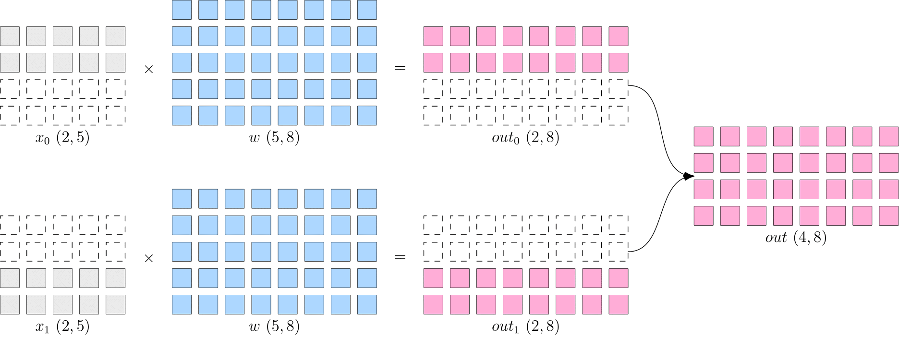
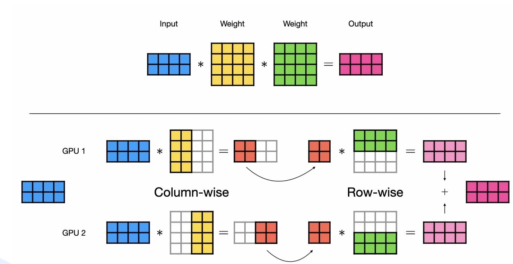
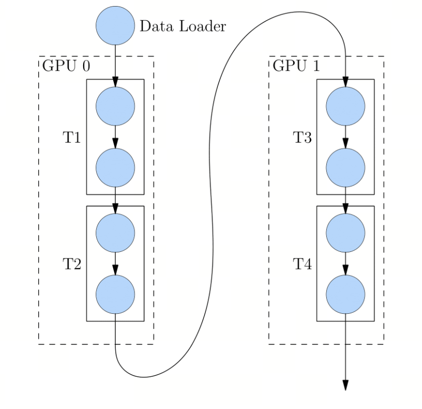
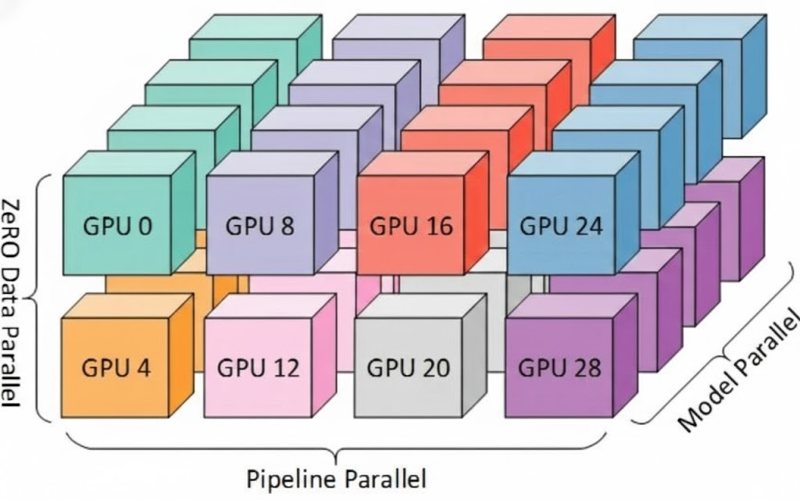

# 第3课时：分布式训练技术概览

## 背景介绍：跨越“显存墙”与“时间墙”

在大模型（LLM）爆发的今天，AI 工程师面临的战场已经彻底改变。如果我们把训练模型比作建造摩天大楼，那么单张 GPU（即便是目前地表最强的 NVIDIA H100 80GB）已经从“全能工兵”变成了仅仅是一块“砖”。

为什么分布式训练从“选修课”变成了“必修课”？我们需要从两个残酷的物理瓶颈说起：

### 核心痛点 1：装不下（显存墙）

很多初学者误以为：模型参数量 10B（100亿），用 FP16 存储不是才 20GB 吗？80GB 的显卡怎么会不够？

这是一个巨大的误区。在训练过程中，**模型参数（Weights）仅仅是显存占用的冰山一角**。

让我们算一笔账（以 Adam 优化器 + 混合精度训练为例）：

* **模型参数**：1 份 FP16 权重 → **2 Bytes**

* **梯度 (Gradients)**：1 份 FP16 梯度 → **2 Bytes**

* **优化器状态 (Optimizer States)**：Adam 需要维护动量(Momentum)和方差(Variance)的 FP32 副本 → **12 Bytes**

* **中间激活值 (Activations)**：前向传播产生的中间结果，主要取决于 Context Length（上下文长度）和 Batch Size → **动态且巨大**

**结论**：每训练 1 个参数，至少需要 **16~20 Bytes** 的静态显存。

> **实例**：训练一个 **175B (GPT-3 级)** 的模型，光是静态显存就需要 **3.5 TB**。

> 而一张 H100 只有 **80 GB**。

> 这意味着，为了把模型“塞进”显存，我们至少需要 **44 张 H100** 完美拼接在一起，这还没算计算时的临时开销。

### 核心痛点 2：等不起（时间墙）

假设你有无限显存的魔法 GPU，但算力不变。

* 训练 Llama-3-70B 这样级别的模型，通常需要消耗约 $10^{24}$ FLOPs 的计算量。

* 一张 H100 在实际训练中的有效算力大约是 300~400 TFLOPS。

* **计算结果**：用单卡跑完这趟训练，大约需要 **100 年**。

没有人能等一个世纪来看 Loss 曲线。为了将训练时间压缩到 **几周甚至几天**，我们需要成千上万张 GPU 并行计算。

### 本节课目标

当 GPU 数量从 1 增加到 10000 时，系统的复杂度是指数级上升的。

* 如何让 1000 张卡计算同一个模型，而不互相打架？

* 如何避免 GPU 算 1 毫秒，却要等网络传输 10 毫秒（通信瓶颈）？

* 当显存不够时，是切分数据、切分层、还是切分张量？

本节课我们将深入黑盒内部，解析多张 GPU 是如何像一个**精密配合的集团军**一样协作的，带你读懂 DDP、FSDP、DeepSpeed 这些技术名词背后的战术逻辑。

---

## 1. 通信原语与硬件基础：分布式训练的“语言”与“道路”

分布式训练的核心挑战在于：多张 GPU 之间如何高效、准确地同步信息（如梯度、参数、优化器状态）。这种同步机制构建在高性能计算（HPC）领域的标准通信动作（Communication Primitives）之上，并依赖于底层的物理连接带宽。

在深度学习领域，我们通常使用 **NVIDIA NCCL (NVIDIA Collective Communications Library)** 作为底层的通信后端，它针对 PCIe、NVLink 和 InfiniBand 进行了深度优化。

### 1.1 三大核心通信原语 (Communication Primitives)

当我们在 PyTorch 中调用 `dist.all_reduce` 时，底层并非简单的“发送-接收”，而是执行了一系列高度优化的集合通信算法（如 Ring-based 或 Tree-based 算法）。

#### 1. **AllReduce（全归约）：同步的总和**
* **定义与原理**：

    * **语义**：系统中的每个 GPU 都持有一个张量 $T_i$，操作结束后，所有 GPU 都会得到相同的张量 $T_{sum} = \text{Op}(T_0, T_1, ..., T_n)$，其中 $\text{Op}$ 通常是 Sum（求和）、Mean（求平均）或 Max（求最大值）。

    * **实现机制**：在 Ring-AllReduce 算法中，该操作实际上由两个步骤组成：**ReduceScatter**（归约并分发） +**AllGather**（全收集）。首先将数据分块并归约，使每张卡拥有一部分最终结果，然后再将这些结果广播给所有卡。

* **关键应用场景**：

    * **DDP (Distributed Data Parallel)** 的核心生命线。在反向传播结束后，每张卡计算出的梯度是基于局部数据（Local Batch）的。必须通过 AllReduce 对所有卡的梯度求平均，确保所有卡使用相同的梯度进行参数更新，从而保证模型副本的一致性。

* **形象比喻**：大家各自清点手中的现金（计算局部梯度），然后通过一个快速的传递网络，最后每个人手中的账本都记录了所有人的现金总额（全局梯度）。

#### 2. **AllGather（全收集）：碎片的拼接**
* **定义与原理**：

    * **语义**：每个 GPU 持有一部分数据 $D_i$（通常是张量的不同切片），操作结束后，所有 GPU 都会收到所有其他 GPU 的数据，并将它们拼接成一个完整的张量 $D_{full} = [D_0, D_1, ..., D_n]$。

    * **数据流向**：$1 \to N$ 的广播的集合版。相当于每张卡都做了一次 Broadcast，最终每张卡都拥有了全局完整数据。

* **关键应用场景**：

    * **FSDP (Fully Sharded Data Parallel)** 的**前向传播**。在 FSDP 中，大模型的权重被切分存储在不同 GPU 上（以节省显存）。当计算流转到第 $k$ 层时，所有 GPU 需要通过 AllGather 从邻居那里“借”来该层的剩余参数，临时拼凑出完整的第 $k$ 层参数进行计算，算完即弃（释放显存）。

#### 3. **ReduceScatter（归约并分发）：求和后切分**

* **定义与原理**：
    
    * **语义**：它是 AllGather 的逆操作，也是 AllReduce 的一部分。所有 GPU 都有一个完整的张量（或者张量列表），系统对这些张量进行规约（如求和），但结果**不完整分发**，而是将结果切分成 $N$ 块，第 $i$ 张 GPU 只拿走第 $i$ 块结果。

    * **优势**：相比于 AllReduce，它减少了后续的广播步骤，显著降低了通信量。

* **关键应用场景**：

    * **FSDP 的反向传播**。当每张卡计算完梯度后，不需要获得完整的全局梯度（那样会爆显存）。每张卡只需要获得**它自己负责更新的那一部分参数**对应的梯度总和。因此，梯度在聚合的同时就被切分了。

---

### 1.2 硬件拓扑：NVLink 与 InfiniBand

通信原语是软件层面的“语言”，而物理连线则是数据传输的“道路”。道路的宽窄（带宽）和拥堵程度（延迟）直接决定了训练的木桶效应。

#### 1. **NVLink 与 NVSwitch (机内高速互联)**

* **技术定位**：解决单台服务器内部（Intra-node）GPU 之间的通信瓶颈。

* **技术指标**：

    * **NVLink**：一种高带宽、低延迟的点对点互连技术。第四代 NVLink（H100）的双向带宽高达 **900 GB/s**，是 PCIe Gen5 的 7 倍以上。

    * **NVSwitch**：如果说 NVLink 是光纤，NVSwitch 就是全光交换机。它允许服务器内的 8 张 GPU 以“全互联（All-to-All）”的方式通信，任意两张 GPU 之间都可以直接传输数据，无需 CPU 参与。

* **对训练的影响**：

    * **决定模型并行 (TP) 的上限**：在张量并行（Tensor Parallelism）中，每一层的矩阵乘法都需要在 GPU 间同步中间结果。这种通信频率极高，必须依赖 NVLink 的超高带宽，否则 GPU 会因等待数据而严重空转。

#### 2. **InfiniBand (IB) / RoCE (机间互联)**

* **技术定位**：解决多台服务器之间（Inter-node）的通信问题，构建万卡集群的基石。

* **核心技术：RDMA (Remote Direct Memory Access)**：

    * 传统的 TCP/IP 网络通信需要 CPU 参与数据拷贝（内存 $\leftrightarrow$ CPU $\leftrightarrow$ 网卡），延迟极高。

    * **RDMA** 允许 GPU 的显存数据直接通过网卡传输到远程服务器的 GPU 显存中，**完全绕过 CPU 和操作系统内核**，实现微秒级的超低延迟。

* **主要协议**：

    * **InfiniBand (IB)**：专为高性能计算设计的原生网络协议，具有极高的吞吐量（如 NDR 400Gbps）和极低的延迟，但成本较高。

    * **RoCE (RDMA over Converged Ethernet)**：在以太网上实现 RDMA，成本较低，是目前高性价比集群的主流选择。

* **对训练的影响**：

    * **决定数据并行 (DP/FSDP) 与流水线并行 (PP) 的扩展性**。当集群扩展到千卡规模时，梯度同步的开销主要由机间网络决定。如果网络拓扑设计不佳（如收敛比过高），通信将成为绝对瓶颈。

### 1.3 进阶原理：通信与计算的重叠 (Communication-Computation Overlap)

在理想的分布式训练中，我们希望通信是“隐形”的。

* **原理**：GPU 具有独立的计算单元（CUDA Cores/Tensor Cores）和数据传输引擎（Copy Engines）。

* **流水线优化**：在反向传播过程中，PyTorch DDP 会将梯度分桶（Bucketing）。当第 $N$ 层的梯度计算完成时，立即触发异步的 AllReduce 传输，与此同时，计算单元继续计算第 $N-1$ 层的梯度。

* **目标**：只要**计算梯度的时间 > 传输梯度的时间**，通信延迟就被完全“掩盖”了，实现了 1+1 < 2 的时间开销。这也是为什么在慢速网络下，增加模型计算密度（如增加 Batch Size）反而能提升并行效率的原因。

---

## 2. 并行策略详解：如何拆解庞然大物

为了将参数量高达数千亿的大模型装入有限的显存并高效训练，我们需要在不同维度上对模型和数据进行拆解，这俗称“切蛋糕”。根据拆解维度的不同，业界演化出了三种主流的并行范式。

### 2.1 数据并行：从冗余到极致切分 (DDP vs FSDP)

这是最基础也最常用的并行方式，其核心思想是**增加计算节点以提升吞吐量**（通过增大 Global Batch Size）。

#### **DDP (Distributed Data Parallel)**

将数据 $x$ 进行切分，而每个设备上的模型 $w$ 是完整的、一致的。如下图所示，$x$ 被按照第0维度平均切分到2个设备上，两个设备上都有完整的 $w$。

这样，在两台设备上，分别得到的输出，都只是逻辑上输出的一半（形状为 $2 \times 8$），将两个设备上的输出拼接到一起，才能得到逻辑上完整的输出。

* **核心原理**：**“模型复制，数据切分”**。

    * 在训练开始前，将完整的模型参数广播（Broadcast）到每一张 GPU 上。

    * 在训练过程中，每张卡读取不同的数据分片（Micro-Batch）进行前向和反向传播。

    * **梯度同步**：反向传播结束后，各卡通过 `AllReduce` 原语对梯度进行累加求和，确保所有卡使用完全相同的梯度更新参数。

    * **通信优化**：为了掩盖通信延迟，DDP 采用了**分桶（Bucketing）**机制。即不必等所有梯度都算完再通信，而是算完一层（或积攒一定量）就立即发送，实现计算与通信的流水线重叠。

* **瓶颈**：**显存冗余**。对于 $N$ 张卡，模型参数、优化器状态和梯度被存储了 $N$ 份。这导致单卡显存成为模型规模的硬上限。

* **适用场景**：中小规模模型（如 ResNet, BERT, Llama-7B），或显存极其充裕的场景。

#### **FSDP (Fully Sharded Data Parallel)**

* **核心原理**：**“切分一切，按需重组”**。基于微软 ZeRO (Zero Redundancy Optimizer) 算法的思想。

    * 它打破了 DDP 的冗余，将**模型参数 (Parameters)**、**梯度 (Gradients)** 和 **优化器状态 (Optimizer States)** 全部均匀切分（Shard）并散布到所有 GPU 上。单卡不再持有完整模型。

* **运行逻辑（通信换显存）**：

    1.  **前向传播 (Forward)**：当计算流转到第 $k$ 层时，当前 GPU 发现自己只有 $1/N$ 的参数。它立即触发 `AllGather` 通信，从其他 $N-1$ 张卡拉取剩余参数，在本地重组出完整的第 $k$ 层。计算完成后，**立即释放**非本地参数，腾出显存。

    2.  **反向传播 (Backward)**：同理，先 `AllGather` 完整参数计算梯度。计算完成后，立即执行 `ReduceScatter`，将梯度归约并分发回各自负责的 GPU，随后删除完整的梯度副本。

* **适用场景**：超大模型训练。它是目前微调 Llama-3-70B/405B 等巨型模型的标准方案，能将显存利用率推向极致。

### 2.2 模型并行：突破单卡算力与显存限制 (TP 与 PP)

当单层网络的参数量过大（超出单卡显存），或者网络过深时，单纯的数据并行已无法运行，必须对模型本身进行切割。

#### 2.2.1 **TP (Tensor Parallelism / 张量并行)**

* **切分逻辑**：**层内切分（Intra-layer）**。利用矩阵运算的结合律，将一个巨大的矩阵乘法拆分到多张卡上并行计算。

* **实现细节（以 Transformer 为例）**：

    * **列并行 (Column Parallel)**：将权重矩阵 $W$ 按列切分。输入 $X$ 广播给所有卡，每张卡计算 $X \times W_i$，得到部分输出。

    * **行并行 (Row Parallel)**：将权重矩阵 $W$ 按行切分。输入 $X$ 也需要按列切分，每张卡计算 $X_i \times W_i$，最后通过 `AllReduce` 累加结果。

    * **Megatron-LM 架构**：通常在 MLP 层和 Attention 层采用“先列并行，后行并行”的组合，这样可以消除两次矩阵乘法中间的通信同步，只需在两头进行通信。

* **特点**：**高频通信**。TP 在每一层的计算过程中都会发生通信。因此，它对带宽和延迟极其敏感，必须部署在拥有 **NVLink** 的同一台服务器内部。通常 TP Size $\le$ 8。

#### 2.2.2 **PP (Pipeline Parallelism / 流水线并行)**

该流程图描绘了深度学习模型在两个 GPU 之间的分布执行逻辑，展示了数据流如何跨设备传递。

* 核心组件

    * **Data Loader (数据加载器)**：位于顶部，负责将原始数据分批次（Batch）输入到计算流水线中。

    * **GPU 0 & GPU 1**：代表两个独立的计算设备。模型被分割成不同的部分，分别部署在这些设备上。

    * **T1, T2, T3, T4 (模型层/模块)**：

        * **T1 & T2**：部署在 **GPU 0** 上。数据首先进入 T1，处理后传递给 T2。

        * **T3 & T4**：部署在 **GPU 1** 上。接收来自前一个 GPU 的中间输出并继续计算。

* 数据流向

    1. **输入阶段**：数据从 `Data Loader` 流入 `GPU 0` 的第一个模块 `T1`。

    2. **设备内传递**：在 `GPU 0` 内部，数据从 `T1` 线性流向 `T2`。

    3. **跨设备通信 (Cross-Device Communication)**：这是图中最显著的特征。一条长曲线箭头表示 `T2` 的输出被发送到了 `GPU 1` 的 `T3` 输入端。这通常涉及显存到显存（P2P）的数据拷贝。

    4. **输出阶段**：数据在 `GPU 1` 内部经过 `T3` 和 `T4` 处理后，从底部流出（通常进入 Loss 计算或下一轮迭代）。

* **切分逻辑**：**层间切分 (Inter-layer)**。将深层模型按层切成多个阶段 (Stage)，每个 Stage 放置在不同的 GPU 上。

    * 例如 60 层的模型，GPU1 负责 Layer 1-15，GPU2 负责 Layer 16-30，以此类推。数据像流水线产品一样在 GPU 之间流动。

* **痛点**：**流水线气泡 (Pipeline Bubble)**。

    * 由于依赖关系，下游 GPU (Device $i+1$) 必须等待上游 GPU (Device $i$) 计算完传输激活值后才能开始工作。这导致训练开始和结束阶段存在大量的 GPU 空转时间，称为“气
    泡”。

* **优化策略**：

    * **1F1B (One-Forward-One-Backward)**：通过交替执行前向和反向传播，减少显存占用。

    * **Micro-Batch**：将一个大 Batch 切分为多个微批次，尽快填满流水线，减小气泡占比。

* **特点**：通信量较小（仅传输边界层的 Activation），适合跨机通信（Inter-node）。

### 2.3 混合并行策略

对于 GPT-4 级别的万亿参数模型，单一策略往往顾此失彼。业界通常采用 **3D 并行**，结合上述策略的优势，构建一个立体的并行立方体。

#### **3D 并行 (DP + TP + PP)**

* **拓扑映射逻辑**：依据硬件带宽层级进行映射。

    1.  **最内层 (TP)**：利用单机内部最高的 **NVLink** 带宽，放置张量并行 (Tensor Parallelism)。

    2.  **中间层 (DP/FSDP)**：在 TP 组之间，或者跨机的小范围内，利用相对较高的带宽进行数据并行。

    3.  **最外层 (PP)**：利用机间网络 (**InfiniBand/RoCE**)，将模型流水线跨越多个机柜或节点。

* **优势**：最大化计算效率，最小化通信瓶颈。

#### **MoE 专家并行 (Expert Parallelism, EP)**

* **原理**：针对 **Mixture of Experts (混合专家)** 架构（如 Mixtral 8x7B, DeepSeek-MoE）。

    * MoE 模型包含一个**门控网络 (Gate)** 和多个**专家网络 (Experts)**。对于每个 Token，Gate 只会激活少数几个专家进行计算（稀疏激活）。

* **并行逻辑**：
    * 将不同的“专家”网络放置在不同的 GPU 上。

    * **All-to-All 通信**：当 GPU1 上的 Token 被路由到 GPU2 上的专家时，需要进行点对点的全交换通信。这是一种通过网络交换 Token 数据的并行模式。

* **挑战**：**负载均衡**。如果某个话题（如“编程”）太热门，导致所有 Token 都涌向同一个专家，该 GPU 会过载，而其他 GPU 空闲。需要配合辅助 Loss 进行负载平衡。

---

## 3. 显存优化技术：压榨每一字节

除了并行，我们还需要算法级的优化来节省显存。

### 3.1 ZeRO 系列 (Zero Redundancy Optimizer)

微软 DeepSpeed 提出的分片策略，FSDP 就是 ZeRO-3 的 PyTorch 原生实现。

* **ZeRO-1**：仅切分 **Optimizer States**（占显存大头，约占模型权重的 2-3 倍）。收益最高，通信开销最小。

* **ZeRO-2**：切分 Optimizer States + **Gradients**。

* **ZeRO-3**：切分 Optimizer States + Gradients + **Parameters**。显存占用降至最低，但通信开销最大。

### 3.2 FlashAttention-2/3

* **痛点**：Transformer 的 Attention 机制显存占用随序列长度呈平方级增长 $O(N^2)$。

* **原理**：通过 **Tiling（分块计算）** 和 **IO 感知**，在 SRAM（GPU 片上高速缓存）中完成计算，减少对 HBM（显存）的读写次数。

* **效果**：不仅省显存，训练速度通常能提升 2-4 倍。

### 3.3 Gradient Checkpointing (重计算)

* **原理**：**时间换空间**。

    * **常规**：前向传播时保存所有中间层的激活值（Activation），供反向传播使用。显存占用极大。

    * **重计算**：前向传播时不保存中间激活值，只保存几个关键节点。反向传播用到时，**重新计算**一遍前向过程。

* **代价**：计算量增加约 33%，但显存可节省 50% 以上，是训练长序列（Long Context）的必备技术。

### 3.4 CPU Offload

* **原理**：显存不够，内存来凑。将暂时不用的参数或优化器状态“卸载”到 CPU 内存（RAM）中，计算时再加载回 GPU。

* **代价**：PCIe 传输速度远慢于显存，会显著拖慢训练速度，通常作为显存不足时的保底手段。

---

## 4. 分布式对数据的影响：不仅仅是分发

分布式环境改变了数据的流动方式，直接影响训练效果。

### 4.1 Global Batch Size (GBS) 缩放规律

* **公式**：$GBS = \text{Micro Batch Size} \times \text{Gradient Accumulation} \times \text{Data Parallel Size}$

* **影响**：
    * GBS 决定了梯度的稳定性。GBS 越大，梯度越稳，但训练越慢（收敛所需的 Step 变少，但每个 Step 计算量变大）。

    * **线性缩放律**：当 GBS 增大时，通常需要线性增加学习率（Learning Rate），直到达到临界点。

### 4.2 Micro Batch 与流水线填充

为了解决 Pipeline Parallelism 中的“气泡”问题，我们不一次性塞入一个大 Batch，而是把它切成很多个小 **Micro Batch**。

* **流水线填充**：让 GPU1 处理完 Micro Batch 1 立即传给 GPU2，同时紧接着处理 Micro Batch 2。这样流水线就被“填满”了，减少了空转。

### 4.3 数据分片 (Sharding) 与断点续训 (Checkpointing)

* **Sharding**：在多卡训练时，必须确保 DataLoader 的 `Sampler` 是分布式的。即：GPU 0 读第 1-100 条数据，GPU 1 必须读第 101-200 条数据，不能重复。

* **Checkpointing**：

    * **Sharded Checkpoint**：每张卡只保存自己显存里的那部分参数切片（速度快，但文件是碎的）。

    * **Merged Checkpoint**：保存时自动合并成一个完整的权重文件（方便推理，但慢）。

    * **关键点**：恢复训练时，不仅要加载权重，还要加载 **RNG state (随机数种子)**，确保数据读取顺序和 Dropout 行为与中断前一致，否则 Loss 会剧烈震荡。

---

### 本章总结

分布式训练是一场精密的“多兵种联合作战”。

| 技术组件 | 军事比喻 | 解决的核心问题 | 具体作用描述 |
|---------|---------|---------------|-------------|
| **NVLink** | 特种部队（TP）的单兵作战能力 | 通信延迟与带宽限制 | 提供高速GPU间通信，支撑张量并行（Tensor Parallelism）的高效协作 |
| **FSDP/ZeRO** | 后勤补给（显存）的存储难题 | 显存容量不足 | 实现参数分片存储，突破单卡显存限制，支持大规模模型训练 |
| **FlashAttention** | 战术执行（计算）的速度 | 计算效率与内存访问 | 优化注意力机制计算，显著提升训练速度并减少显存占用 |
| **Checkpoint** | 存档点，保证意外发生后都能整装待发 | 训练中断恢复 | 定期保存训练状态，支持断点续训，确保训练过程的可靠性和连续性 |

这种多兵种联合作战的架构设计，让分布式训练从"理论可能"变为"工程可行"，支撑了当今大模型训练的整个生态。