# 基于Agent的数据处理
本章中我们将深入介绍什么是Agent，以及如何使用Agent作为工人搭建自动化数据处理流水线。

## 1. Agent 概述
### 1.1 基本概念

首先 Agent 是什么？中文中常见翻译为：代理人。我们要做一件事，一般有两种方式，自己一步一步来达成；另外就是找个人，这个人就叫做代理人，我们全权授权给代理人而不用关心他怎么做，只管他能帮我们达到目的。前者我们需要操心每个细节，而后者我们可以坐享其成。所以 Agent 的一个特点就是：不需要我们去关心达成某个任务的细节，而只需要放心把任务交给他，让他去帮我们达成。

回到 AI 智能体（AI Agent），AI Agent 一般被认为是一个具有特定角色和任务的 LLM，它可以访问记忆和外部工具。但我觉得 AI 智能体更像是一个人，我们请来的代理人。我更愿意把它比作一个有着高度专业能力的人——专家。LLM 是其大脑，借助他聪明的大脑，他可以自动规划步骤，结合反馈反复采取行动（比如调用工具）来解决手头的任务，整个过程不需要我们操心，我们只需要放权让他去做就好！

想象你是一位国王，当你想扩张领土的时候，你并不需要自己亲力亲为，你只需要找代理人——你的大将（即：带兵作战的专家），放权让大将去做，他自己会规划作战计划（规划）、调兵遣将（调用工具）、冲锋陷阵（采取行动）。你只需要等待他凯旋的好消息。这个大将就像是我们的 AI 智能体。

### 1.2 基本组件

一个 AI Agent 主要由下面组件构成：

* LLM：这个是智能体的大脑，对应大将军的大脑；
* 记忆（Memory）：智能体的记忆，对应了大将军对某个领土扩张任务从开始到结束的所有记忆，甚至是之前的战斗记忆；
* 规划（Planning）：智能体可以进行反思、自我批评、自动路由（采取行动）等，对应了国王放权给大将军，让他能按照自己的想法去达成任务；
* 工具（Tools）：是智能体可以调用的工具，对应大将军可以调用的兵力，可以使用的武器等等；

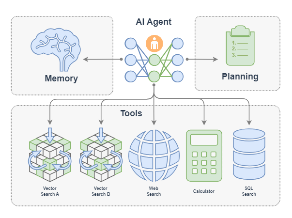

## 2. Agent 策略

AI Agent 有很多类型的工作流程，这里介绍几种常见的工作流程：Function Call Agent、ReAct、PlanAndSolve 以及 ReWOO。AI 智能体的工作流程主要就是其行为模式，就像是一个人做事的行为习惯：

* Function Call Agent：在该智能体接到任务后，它会不断尝试以各种参数调用工具和观察输出，直到解决问题或达到最大重复次数。
* ReAct： 该智能体接到任务后，它会先思考，然后再尝试调用工具和观察输出，不断重复这个过程直到解决问题或达到最大重复次数。
* PlanAndSolve：该智能体接到任务后，会先计划把任务分解，然后尝试解决当前步骤任务，根据当前步骤的结果来继续执行任务或者重新计划后面的任务，直到任务被解决或达到最大重复次数。
* ReWOO: 该智能体接到任务后，也会先计划把任务分解，然后将所有步骤全部执行完毕，综合所有步骤的结果来进行反馈。

### 2.1 Function Call Agent

Function Call Agent 主要包括以下的流程：

1. 行动（Action）：Agent 收到一个 query 后，它会直接行动，比如去调用某个工具；
2. 观察（Observation）: Agent 观察到行动的反馈，比如工具的输出。

上面过程会不断循环往复，如果观察到行动的反馈没问题，满足了 query 的要求，或者达到了最大的迭代次数，那么 Agent 会退出并返回结果 response。

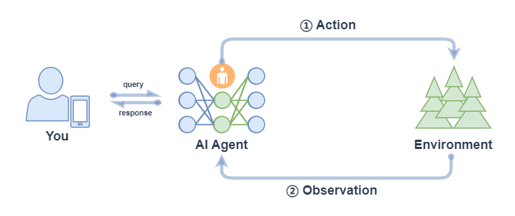

我们可以在LazyLLM中使用AI Agent，首先定义工具，然后把定义好的工具注册进 LazyLLM 中，之后就可以定义模型，并使用 FunctionCall Agent：

```python
from typing import Literal
import json
import lazyllm
from lazyllm.tools import fc_register, FunctionCall, FunctionCallAgent
@fc_register("tool")
def get_current_weather(location: str, unit: Literal["fahrenheit", "celsius"] = "fahrenheit"):
    ...
@fc_register("tool")
def get_n_day_weather_forecast(location: str, num_days: int, unit: Literal["celsius", "fahrenheit"] = 'fahrenheit'):
    ...
llm = lazyllm.TrainableModule("internlm2-chat-20b").start()  # or llm = lazyllm.OnlineChatModule()
tools = ["get_current_weather", "get_n_day_weather_forecast"]
fc = FunctionCall(llm, tools)
query = "What's the weather like today in celsius in Tokyo and Paris."
ret = fc(query)
print(f"ret: {ret}")
agent = FunctionCallAgent(llm, tools)
ret = agent(query)
print(f"ret: {ret}")
```

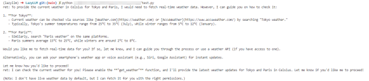

### 2.2 ReAct

React 主要包括以下的流程：

1. 思考（Thought）: Agent 在收到 query 后，对当前状态的推理分析然后给出下一步要采取的行动；
2. 行动（Action）: Agent 会采取并执行一个行动，比如使用工具（或者继续思考）；
3. 观察（Observation）: Agent 观察行动的反馈，比如工具的输出；

上面过程也是会不断循环往复，直到满足 query 的请求，或者达到了最大的迭代次数。

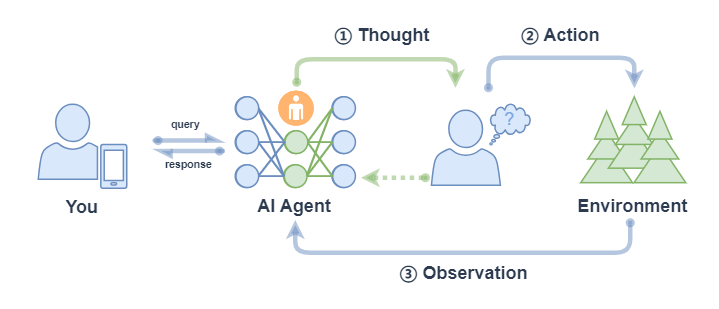

ReactAgent 执行流程和 FunctionCallAgent 的执行流程一样，唯一区别是 prompt 不同，并且 ReactAgent 每一步都要有 Thought 输出，而普通 FunctionCallAgent 可能只有工具调用的信息输出，没有 content 内容。示例如下：

```python
import lazyllm
from lazyllm.tools import fc_register, ReactAgent
@fc_register("tool")
def multiply_tool(a: int, b: int) -> int:
    return a * b
@fc_register("tool")
def add_tool(a: int, b: int):
    return a + b
tools = ["multiply_tool", "add_tool"]
llm = lazyllm.OnlineChatModule(source="sensenova", model="DeepSeek-V3")
agent = ReactAgent(llm, tools)
query = "What is 20+(2*4)? Calculate step by step."
res = agent(query)
print(res)
```

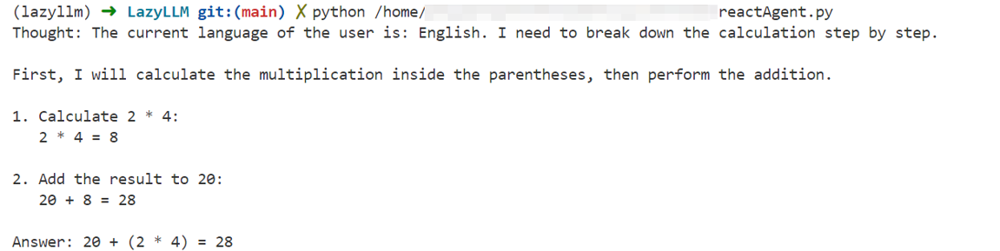

### 2.3 PlanAndSolve

PlanAndSolve 主要包括以下的流程：

1. 计划（Plan）：Agent 在收到 query 后，它会将这个任务分解为更小的子任务；
2. 行动（Action）: Agent 对当前的子任务进行执行；
3. 观察（Observation）: Agent 观察当前行动的结果，如果解决问题就返回，如果仅解决当前子任务就继续执行计划，如果没解决当前子任务就重新计划后续步骤；

与ReAct agent的不同是：**Plan-and-Solve 是“先把所有步骤想好再做”，而 ReAct 是“边做边想、根据结果随时调整下一步”。**

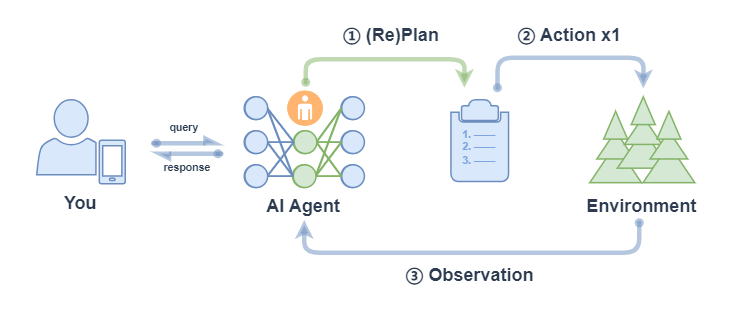

\* 注意： 上图中 ② Action x1 表示每次行动只执行一个子任务（不会全部将子任务执行完，区别于 ReWOO的对应流程中的 ② Action xN）。

PlanAndSolveAgent 由两个组件组成：首先，将整个任务分解为更小的子任务，其次，根据计划执行这些子任务。最后结果作为答案进行输出。

```python
import lazyllm
from lazyllm.tools import fc_register, PlanAndSolveAgent
@fc_register("tool")
def multiply(a: int, b: int) -> int:
    return a * b
@fc_register("tool")
def add(a: int, b: int):
    return a + b
llm = lazyllm.OnlineChatModule(source="sensenova", model="DeepSeek-V3")
tools = ["multiply", "add"]
agent = PlanAndSolveAgent(llm, tools=tools)
query = "What is 20+(2*4)? Calculate step by step."
ret = agent(query)
print(ret)
```

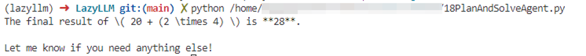

### 2.4 ReWOO

ReWOO (Reasoning WithOut Observation) 主要包括以下流程：

1. 计划（Plan）：Agent 在收到 query 后，它会生成一个计划表，计划表中包含了这个任务分解的更小子任务，子任务间的执行结果用占位符表示；
2. 行动（Action）: Agent 对每个子任务依次进行执行（调用工具），将结果都填入计划表的占位符中；
3. 解决（Solve）: Agent 观察所有行动的反馈，将结果response返回给用户；

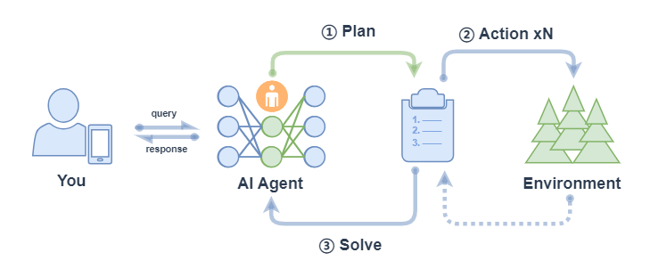

ReWOOAgent 包含三个部分：Planner 、 Worker 和 Solver。其中， Planner 使用可预见推理能力为复杂任务创建解决方案蓝图； Worker 通过工具调用来与环境交互，并将实际证据或观察结果填充到指令中； Solver 处理所有计划和证据以制定原始任务或问题的解决方案。

```python
import lazyllm
from lazyllm import fc_register, ReWOOAgent, deploy
import wikipedia
@fc_register("tool")
def WikipediaWorker(input: str):
    try:
        evidence = wikipedia.page(input).content
        evidence = evidence.split("\n\n")[0]
    except wikipedia.PageError:
        evidence = f"Could not find [{input}]. Similar: {wikipedia.search(input)}"
    except wikipedia.DisambiguationError:
        evidence = f"Could not find [{input}]. Similar: {wikipedia.search(input)}"
    return evidence
@fc_register("tool")
def LLMWorker(input: str):
    llm = lazyllm.OnlineChatModule(stream=False)
    query = f"Respond in short directly with no extra words.\n\n{input}"
    response = llm(query, llm_chat_history=[])
    return response
tools = ["WikipediaWorker", "LLMWorker"]
llm = lazyllm.TrainableModule("Qwen2-72B-Instruct-AWQ").deploy_method(deploy.vllm).start()
agent = ReWOOAgent(llm, tools=tools)
query = "What is the name of the cognac house that makes the main ingredient in The Hennchata?"
ret = agent(query)
print(ret)
```


让我们简单总结如下：

| | Function Call Agent | ReAct | PlanAndSolve | ReWOO |
| :--- | :--- | :--- | :--- | :--- |
| **工作流程** | 最大循环次数内循环：<br><br>- 试参调用工具；<br>- 观察工具输出，完成任务就结束循环。 | 最大循环次数内循环：<br><br>- 思考；<br>- 试参调用工具；<br>- 观察工具输出，完成任务就结束循环。 | 最大循环次数内循环：<br><br>- （重）计划并分解任务；<br>- 调用工具解决当前子任务；<br>- 观察工具输出，确定是否完成子任务，完成整个任务就结束循环 | - 计划并分解任务；<br>- 调用工具逐步解决所有子任务；<br>- 综合所有步骤结果进行反馈 |
| **工作特点** | 简单直接，思考过程不可见 | 引入思考环节，思考可见 | 强调任务的分解和任务的动态调整 | 强调整体规划和综合反馈 |

### 2.5 简化Agent工作流程

在Agent开发中，重复造轮子、工具接口不统一、上下文管理复杂等问题让开发流程冗长且低效。为了解决这些难点，我们可以通过“​**MCP协议**​+**​LazyLLM”​**的框架，提升开发效率、降低门槛，让开发者能专注于核心业务和创新设计，从而推动大模型应用更快落地。

#### 2.5.1 MCP协议的基本概念

**​MCP（Model Context Protocol，模型上下文协议）​**是由Anthropic公司于2024年11月推出的一种​**开放标准协议**​，旨在让大语言模型能够“无缝连接”外部工具和数据源。

简单来说，MCP就是为了解决开头那些痛点而生的“标准化利器”。一个更形象的比喻是：​**MCP 相当于 AI 应用的USB-C接口**​。

正如USB-C统一了不同品牌电子设备的充电和数据接口一样，MCP则标准化了​**AI与外部世界交互的方式**​，使得模型能够以**标准化**的形式**高效调用**数据库、工具和网络搜索等多种资源，从而实现​**模型与外部系统的高效联动**​。

换句话说，过去每接入一个新工具就头大的“接口不统一”问题，有了MCP后就像使用统一接口的外设一样，​**插上就能用**​。这样一来，​**无需二次开发**​，多种数据库、Web API、文件系统、GitHub…海量而强大的功能统统都可以通过这一个协议​**轻松接入**​。

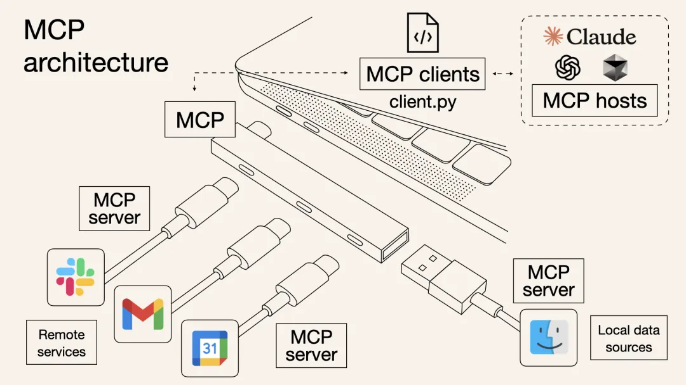

以前，想让AI Agent查天气、读PDF、执行Python代码，可能需要针对每个功能写一堆集成代码，其中包含工具的描述、入参等等，并封装成“工具（Tool）”给到模型；而有了MCP，只需要把符合需求的MCP服务器接上，模型就会自动知道有什么工具可用、该如何调用，并且输入输出格式也是统一好的。

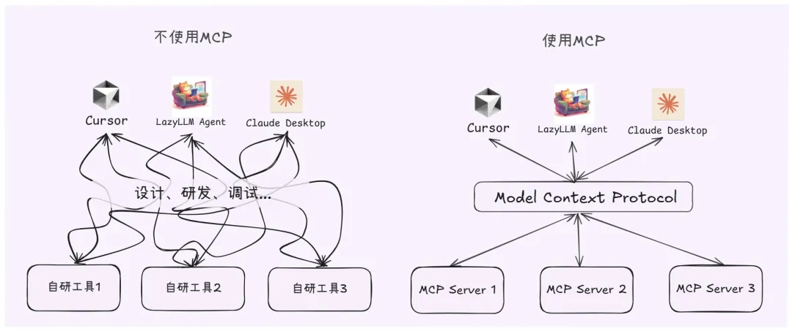

整个过程就像给笔记本电脑插上**扩展坞的**瞬间，额外冒出HDMI、SD卡、网线等接口等**繁琐的对接细节**由协议帮你搞定，从此开发者无需关心那些转换过程。因此，MCP的出现**大幅提升了AI Agent应用开发的效率。**

#### 2.5.2 MCP的技术架构

从技术架构上看，MCP遵循的是典型的​**客户端-服务器模型**​，它把AI应用的**内部逻辑和外部扩展功能解耦**为三个核心模块：

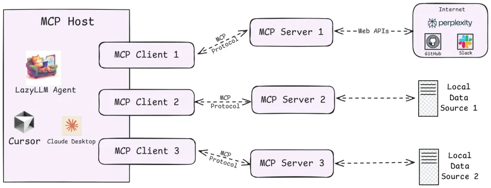

1. **Host（主机）**

    指运行AI应用（类似支持AI对话的IDE插件如Cursor、桌面应用如Claude Desktop以及我们所创建的智能体应用）本身的​**宿主环境**​。Host负责​**提供AI交互环境**​，并在内部​**启动MCP Client**​。

2. **Client（客户端）**

    运行在Host内部的客户端，它与MCP Server建立连接，充当AI应用和外部世界沟通的​**桥梁**​。MCP客户端维持与服务器的 1:1 连接，当AI模型需要调用工具或获取数据时，都是由Client按照协议与Server通信来完成。

3. **Server（服务器）**

    MCP服务器提供具体的功能和数据，相当于AI大脑可以远程调用的​**外设**​。一个服务器上通常会暴露几类内容供AI使用：

    * Tools（工具）：允许大模型调用的功能函数。例如代码执行、网页浏览、发送邮件等，这些能力都可以作为可调用的工具由Server打包并提供给AI。
    * Resources（资源）：给大模型提供的数据或内容。例如数据库记录、文件内容、浏览网页截图等，Server可以将这些外部数据通过协议发送给AI应用，以充当LLM的上下文。
    * Prompts（提示模板）：预设的可复用提示词模板或交互工作流。Server可以储存一些常用提示词，按需提供给AI，避免每次都从零编写复杂提示。

更多MCP技术架构的细节可查阅：[文档](https://modelcontextprotocol.io/docs/concepts/architecture)

通过上述架构，过去东拼西凑解决的难题，现在有了明确的协议规范可循，那么，MCP、Agent、LLM、Tool Call...这些名词之间到底有什么关系？

* **LLM**是Agent的​**​“大脑”​**​，能够根据输入信息（如系统提示词、用户指令、历史对话信息、可用工具集信息等），输出对应的文字内容，其中可能是阶段性的工具调用信息，也有可能是任务完成后的最终输出内容。
* **Tool Call**是LLM经过大量训练后具备的一种​**工具调用能力**​，这种能力允许LLM能够综合历史信息和可用工具信息，动态决策并输出格式化的工具调用指令（决定使用哪个工具、工具调用时具体传入什么参数），通过这种指令指导Agent正确的完成工具调用，从而实现特定动作（如操作文件、执行代码）、获取必要信息（如返回网页爬虫结果）。
* **MCP Server**则是遵循MCP协议的​**工具供应商**​，其提供给Agent强大的工具集，以供LLM辨识并执行Tool Call，同时接收Agent给到的Tool Call指令安全地与外部资源进行交互，以实现特定动作或返回特定信息。
* **Agent**作为智能体应用与用户交互的​**唯一入口**​，在接收到任务指令后，会有序地调用LLM、各种工具，以完成任务。

#### 2.5.3 实践：在LazyLLM中使用MCP

针对MCP，LazyLLM提供了两种接入方式：**直接接入**和​**部署并远程接入**​。

* **​直接接入：​**将指定MCP Server的启动配置直接给到lazyllm.tools.MCPClient，以Stdio模式启动Server，并获取Agent可调用的工具集。
* **​部署并远程接入：​**针对一些资源占用高，或者期望启动的MCP Server可复用的场景，LazyLLM支持MCP Server的一键部署，只需一行命令，便可以将MCP Server单独启动，随后便可以SSE模式远程接入MCP Server。

具体来说，步骤如下：

1. 配置LazyLLM所需要的所有依赖

    首先参考: [文档](https://docs.lazyllm.ai/zh-cn/latest/) 的Getting started部分，安装LazyLLM并完成环境配置。

    同时，由于MCP Server的使用依赖Node.js和npm，可参考: [文档](https://nodejs.org/en/download) 完成最新版本的安装和配置。

2. 利用已有的MCP服务

    若需接入已有的 MCP 服务（如高德地图的地理位置服务），可通过 LazyLLM 的 MCPClient 工具直接连接，无需自行部署 Server。

    SSE URL 接入（以高德 MCP 为例）：

    无需启动本地 Server，直接通过服务提供商提供的 SSE 长连接 URL 配置 Client。需将”xxx”替换为自己的key。

    （创建key：[链接](https://lbs.amap.com/api/mcp-server/create-project-and-key)）

    ```python
    import lazyllm
    from lazyllm.tools.agent import ReactAgent
    from lazyllm.tools import MCPClient
    mcp_configs = {
        "amap_mcp": {
            "url": "http://mcp.amap.com/sse?key=xxx"
        }
    }
    client = MCPClient(command_or_url=mcp_configs["amap_mcp"]["url"])
    llm = lazyllm.OnlineChatModule(source='qwen', model='qwen-max-latest', stream=False)
    agent = ReactAgent(llm=llm.share(), tools=client.get_tools(), max_retries=15)
    print(agent("查询北京的天气"))
    ```

    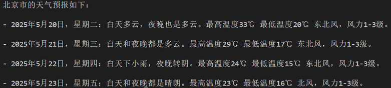


    我们选择一个文件管理 MCP Server 并获取启动配置：

    ```yaml
    {  
        "mcpServers": {    
            "filesystem": {     
                "command": "npx",      
                "args": [        
                    "-y",        
                    "@modelcontextprotocol/server-filesystem",        
                    "/Users/username/Desktop"      
                ]    
            }  
        }
    }
    ```

    注意，如果你是Windows系统，command需要使用"cmd"，同时启动参数开头需要加上"/c"。启动配置会有些变化：

    ```yaml
    {  
        "mcpServers": {    
            "filesystem": {     
                "command": "cmd",      
                "args": [
                    "/c", 
                    "npx",         
                    "-y",        
                    "@modelcontextprotocol/server-filesystem",        
                    "/Users/username/Desktop"      
                ]    
            }  
        }
    }
    ```

3. MCP接入

    随后便可使用LazyLLM的MCPClient工具实现MCP Server的接入（这里的路径示例/xxx/xxx/xxx）

    ```python
    import lazyllm
    from lazyllm.tools import MCPClient
    config = {"command": "npx", "args": ["-y", "@modelcontextprotocol/server-filesystem", "/xxx/xxx/xxx"]}
    client = MCPClient(command_or_url=config["command"], args=config["args"], env=config.get("env"))
    ```

4. 工具集获取

    ```python
    >>> tools = client.get_tools()
    Secure MCP Filesystem Server running on stdio
    Allowed directories: [ '/Users/username/Desktop' ]
    >>> tools
    [<function generate_lazyllm_tool.<locals>.dynamic_lazyllm_func at 0x7f269cad11c0>, <function generate_lazyllm_tool.<locals>.dynamic_lazyllm_func at 0x7f269c91e520>, <function generate_lazyllm_tool.<locals>.dynamic_lazyllm_func at 0x7f269c91d800>, <function generate_lazyllm_tool.<locals>.dynamic_lazyllm_func at 0x7f269c91d8a0>, <function generate_lazyllm_tool.<locals>.dynamic_lazyllm_func at 0x7f269c91e5c0>, <function generate_lazyllm_tool.<locals>.dynamic_lazyllm_func at 0x7f269c91e0c0>, <function generate_lazyllm_tool.<locals>.dynamic_lazyllm_func at 0x7f269c91d940>, <function generate_lazyllm_tool.<locals>.dynamic_lazyllm_func at 0x7f269c91e480>, <function generate_lazyllm_tool.<locals>.dynamic_lazyllm_func at 0x7f269c91db20>, <function generate_lazyllm_tool.<locals>.dynamic_lazyllm_func at 0x7f269c91da80>, <function generate_lazyllm_tool.<locals>.dynamic_lazyllm_func at 0x7f269c91dda0>]
    ```

    ​**代码讲解**​：调用client.get\_tools()可以获取当前连接的MCP Server中所有的工具（在异步环境中，以下代码改为tools = await client.aget\_tools()即可）。同时，LazyLLM支持开发者通过传入工具名称列表至方法的方式获取特定的工具集，例如client.get\_tools(["tool\_name1", "tool\_name2"])。

5. 工具调用

    ​**代码讲解**​：遍历从MCP Server获取的tools，其中每个成员都是一个函数。每个功能函数都有函数名（​**name**​）、函数描述（​**doc**​，包含了功能描与参数描述）以及入参声明（​**annotations**​），调用对应函数时，只需要传入正确的参数即可。下面给出两个函数调用的例子：

    * 调用文件读取工具read\_file，传入所需入参path，即可获取读取文件后的返回信息；
    * 调用获取有权限路径工具list\_allowed\_directories，该工具无需任何入参，传入空即可获得工具返回。

    ```python
    >>> for t in tools:
    ...     print(f"\nTool name:\n{t.__name__}\nTool desc:\n{t.__doc__}\nTool params:\n{t.__annotations__}\n")
    ... 
    Tool name:
    read_file
    Tool desc:
    Read the complete contents of a file from the file system. Handles various text encodings and provides detailed error messages if the file cannot be read. Use this tool when you need to examine the contents of a single file. Only works within allowed directories.
    Args:    
        path (str): type: string.
    Tool params:
    {'path': <class 'str'>}
    Tool name:
    write_file
    Tool desc:
    Create a new file or completely overwrite an existing file with new content. Use with caution as it will overwrite existing files without warning. Handles text content with proper encoding. Only works within allowed directories.
    Args:    
        path (str): type: string.    
        content (str): type: string.
    Tool params:
    {'path': <class 'str'>, 'content': <class 'str'>}
    ......
    Tool name:
    list_allowed_directories
    Tool desc:
    Returns the list of directories that this server is allowed to access. Use this to understand which directories are available before trying to access files.
    Args:    
        No parameters.
    Tool params:
    {}
    ```

    ```python
    >>> t1 = tools[0]
    >>> t1.__name__
    'read_file'
    >>> t1(path="xxx/xxx/xxx/test.md")
    Secure MCP Filesystem Server running on stdio
    Allowed directories: [ 'xxx/xxx/xxx' ]
    'Tool call result:\nReceived text message:\nThis is a test file for LazyLLM and MCP.\n\nEnd\n'
    >>> t2 = tools[-1]
    >>> t2.__name__
    'list_allowed_directories'
    >>> t2()
    Secure MCP Filesystem Server running on stdio
    Allowed directories: [ 'xxx/xxx/xxx' ]
    'Tool call result:\nReceived text message:\nAllowed directories:\n/xxx/xxx/xxx'
    ```


6. 一键部署MCP Server

    选择浏览器工具 [playwright](https://github.com/microsoft/playwright-mcp )，获取配置信息：

    ```yaml
    {  
        "mcpServers": {    
            "playwright": {      
                "command": "npx",      
                "args": [        
                    "@playwright/mcp@latest"     
                ]    
            }  
        }
    }
    ```

    在命令行中只需要使用“lazyllm deploy mcp\_server xxxxxx”命令，并配置host、port，即可完成MCP Server的部署。由于linux环境没有GUI，这里演示Windows环境下的启动命令：

    ```bash
    lazyllm deploy mcp_server --sse-port 11238 cmd -- /c npx @playwright/mcp@latest
    ```

    启动后如下所示：

    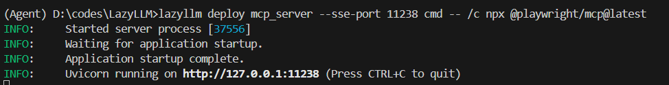

    **接入部署完成的MCP Server**

    我们可以在其他程序中传入url，以SSE的方式接入MCP Server，注意，这里的url需要加上'/sse'，否则无法正常运行：

    ```python
    >>> config = {"url": "http://127.0.0.1:11238/sse"}
    >>> client = MCPClient(command_or_url=config["url"])
    ```

    用以上方式接入MCP Server后，具体的工具获取、工具调用方式与直接接入保持一致。

7. LazyLLM调用MCP工具

    步骤 1：获取工具列表

    ```python
    tools = client.get_tools()  # 同步获取
    # 或 tools = await client.aget_tools()  # 异步环境
    ```

    步骤 2：查看工具详情

    ```python
    for t in tools:
        print(f"Tool name: {t.__name__}")
        print(f"Tool desc: {t.__doc__}")
        print(f"Tool params: {t.__annotations__}\n")
    ```

    步骤 3：调用MCP工具

    以读取文件工具为例，假设 tools[0] 为 read\_file

    ```python
    t1 = tools[0]
    result = t1(path="xxx/xxx/xxx/test.md")
    ```

    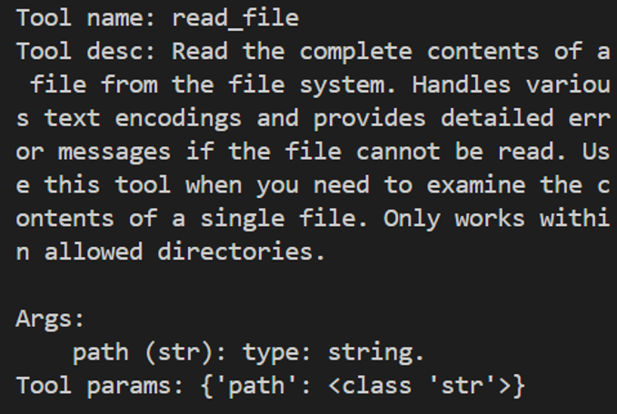

8. LazyLLM+MCP智能体Demo

    接下来我们使用filesystem+playwright，结合LazyLLM的Agent模块，创建一个智能体：

    ```python
    import lazyllm
    from lazyllm.tools.agent 
    import ReactAgent
    from lazyllm.tools import MCPClient
    if __name__ == "__main__":    
        mcp_configs = {        
            "file_system": {            
                "command": "cmd",            
                "args": [                
                    "/c",                
                    "npx",                
                    "-y",                
                    "@modelcontextprotocol/server-filesystem",                
                    "./"            
                ]        
            },        
            "play_wright": {            
                "url": "http://127.0.0.1:11244/sse"        
            }    
        }    
    client1 = MCPClient(command_or_url=mcp_configs["file_system"]["command"], args=mcp_configs["file_system"]["args"])    
    client2 = MCPClient(command_or_url=mcp_configs["play_wright"]["url"])    
    llm = lazyllm.OnlineChatModule(source="deepseek")    
    agent = ReactAgent(llm=llm.share(), tools=client1.get_tools()+client2.get_tools(), max_retries=15)    
    print(agent("浏览谷歌新闻，并写一个今日新闻简报，以markdown格式保存至本地。"))
    ```

通过本次实践，我们可以了解到，MCP Server的出现直接省去了Agent开发环节中工具研发和调试的成本，​**大大提升了研发效率**​。LazyLLM对于MCP提供了灵活的接入方式，让开发者使用MCP的​**成本大大降低**​。

总结：在大模型时代，​**开发效率就是核心竞争力**​。从头造轮子或许可以练手，但在真正落地AI应用的过程中，我们更应该把宝贵的时间和脑力，留给真正创造价值的部分——如业务逻辑设计、用户体验优化、创新交互方式等，而不是重复造工具、上下文拼接等基础组件。

**MCP** 提供了一套高效、统一的​**标准协议**​；**LazyLLM** 则提供了一套​**灵活的MCP接入方案**​，让每一个开发者都能轻松上手，快速构建属于自己的智能Agent应用，从而站在**社区和开源生态**的“肩膀”上看得更远、做得更多。

## 3. Agent 数据处理

<!-- ：利用 Multi-Agent 系统进行数据清洗、标注和审查。 -->

### 3.1 核心思想

在大模型时代，​**数据质量决定模型上限**​。但高质量数据的构建本身是一项极其复杂、繁琐且容易出错的工作：
数据来源多样、格式不统一、噪声多、标注主观性强，仅靠人工或单一脚本流程，往往效率低、成本高、且难以规模化。

这正是 **Agent 数据处理** 发挥价值的地方。

如果说在任务执行中，Agent 像是“替我们打仗的大将军”，
那么在数据处理阶段，​**Multi-Agent 系统更像是一支分工明确的专业团队**​：
有人负责清洗数据，有人负责理解和标注，有人负责审核与质检，彼此协作、相互校验，最终交付一批“可直接用于训练或微调的高质量数据”。

### 3.2 为什么需要 Agent 来做数据处理？

传统数据处理流程通常是​**线性的、规则驱动的**​：

> 规则过滤 → 人工抽样检查 → 人工修正 → 再跑一遍脚本

而 Agent 驱动的数据处理是​**智能化、自治式的**​：

* 能理解语义，而不仅是匹配规则
* 能根据反馈反复修正自己的处理策略
* 能在不确定场景下做出“类人判断”
* 能将复杂流程拆解为多个可协作的子任务

这使得 Agent 特别适合处理 **指令数据、对话数据、多模态数据、弱标注数据** 等复杂数据形态。

### 3.3 Multi-Agent 数据处理架构

在 Agent 数据处理中，我们通常不会只使用一个 Agent，而是构建一个 ​**Multi-Agent 协作系统**​，每个 Agent 扮演不同角色：

* **数据清洗 Agent（Cleaner Agent）**
* **数据标注 Agent（Annotator Agent）**
* **数据审查 Agent（Reviewer / Judge Agent）**
* （可选）**调度 Agent（Coordinator / Manager Agent）**

它们共同组成一条“智能数据流水线”。

可以类比为一个出版社：

* 清洗 Agent：编辑，负责剔除低质量稿件
* 标注 Agent：作者或校对，负责补充结构和标签
* 审查 Agent：审稿专家，负责最终质量把关

### 3.4 数据清洗（Cleaning）

**数据清洗 Agent** 的目标是：

> 去掉“明显不该留下的数据”，并修复“有潜力但存在问题的数据”。

典型能力包括：

* 识别并过滤：
    * 无意义文本（乱码、重复、占位符）
    * 与任务无关的内容
    * 明显错误或冲突的信息
* 结构修复：
    * 不完整的问答对
    * JSON / 指令格式不规范的数据
* 语义级去重：
    * 表面不同、语义高度相似的数据

与规则脚本不同，Agent 清洗依赖的是 ​**LLM 的语义理解能力**​，能判断“这条数据值不值得留下”，而不仅是“是否满足某个 if 条件”。

### 3.5 数据标注（Annotation）

**数据标注 Agent** 更像是一位“理解任务目标的专家”。

它并不是机械地贴标签，而是基于上下文和任务定义进行​**语义驱动的标注**​，例如：

* 指令数据：
    * 推断用户真实意图
    * 补全或改写模糊指令
* 对话数据：
    * 标注角色（user / assistant）
    * 区分 reasoning、tool-call、final-answer
* 多模态 / 任务型数据：
    * 对齐输入与输出
    * 生成中间解释或 Chain-of-Thought（如需要）

在 Multi-Agent 系统中，多个标注 Agent 还可以 ​**交叉标注同一数据**​，为后续审查提供对比依据。

### 3.6 数据审查（Review / Audit）

**数据审查 Agent** 是整个流程中的“质量守门人”。

它不负责生成数据，而是回答一个核心问题：

> 这条数据，**是否真的适合进入训练集？**

典型审查维度包括：

* 语义正确性（是否存在事实或逻辑错误）
* 任务对齐性（是否真正符合训练目标）
* 难度与信息密度（是否过于简单或冗余）
* 潜在风险（偏见、幻觉、违规内容等）

在实践中，审查 Agent 常被设计为：

* 更严格的 prompt
* 或使用不同模型（如更强或更保守的 LLM）
  以避免“自己给自己打高分”的问题。

### 3.7 Agent 数据处理的优势总结

相比传统数据流水线，Agent 数据处理具备以下优势：

* ​**自动化 + 智能化**​：减少人工参与，但不牺牲质量
* ​**可扩展性强**​：天然适合大规模数据构建
* ​**任务自适应**​：同一套框架可迁移到不同任务
* ​**质量可控**​：通过多 Agent 交叉验证提升可靠性

从本质上看，Agent 数据处理并不是“用 AI 写数据”，
而是 ​**用一群有分工、有判断力的智能体，替我们完成一整套专业的数据工程工作**​。

这正是 Multi-Agent 在数据构建领域最具现实价值、也最容易落地的应用场景之一。

## 4. LazyLLM Agent实战
### 4.1 自动化数据合成与自我验证

为降低人工标注成本并提升 SFT（Supervised Fine-Tuning）数据的质量与一致性，我们设计了一条 **“生成 + 自检（Self-Verification）”** 的自动化数据构建流水线。该流程基于 LazyLLM 框架，通过 Agent 调度多个工具函数，实现对合成数据的可控生成与自动纠错。

#### 4.1.1 整体流程概述

该数据流水线由三个核心阶段组成：

1. **数据合成（Data Synthesis）**
   根据原始文本自动生成一个问答（QA）对；
2. **自我验证与修正（Self-Correction）**
   检查生成的 QA 是否严格来源于原文，必要时进行修正；
3. **Agent 调度执行**
   通过 ReactAgent 强制执行“先生成、再自检”的调用顺序，确保流程稳定可控。

整体流程如下所示：

```
原始文本
   ↓
data_synthesis（QA 生成）
   ↓
self_correction（一致性校验）
   ↓
高质量 QA 数据（用于 SFT）
```

**1. QA 生成工具：负责把原文转换为结构化问答**

```python
@fc_register("tool")
def data_synthesis(content: str) -> dict:
    q = f"""
    Generate a QA pair based on the user's input.
    The output format must be JSON with `query` and `answer`.
    user's input: {content}
    """
    response = llm(q)
    match = re.search(r'(\{[\s\S]*?\})', response)
    json_str = match.group(1) if match else response
    return json5.loads(json_str)
```

这里最重要的不是 prompt 写得多复杂，而是两点：

- 用工具函数把“生成 QA”封装成一个独立动作，便于 Agent 调度。
- 强制输出 JSON，再通过 `json5.loads` 解析，方便后续直接进入数据流水线。

**2. 自我修正工具：负责检查 QA 是否真的来自原文**

```python
@fc_register("tool")
def self_correction(qa_pair: dict, content: str) -> dict:
    q = f"""
    Check whether the QA pair is generated based on the input content.
    If the QA pair is valid, output the original QA pair.
    Otherwise, regenerate it.
    generated_pair: {qa_pair}
    user's input: {content}
    """
    response = llm(q)
    match = re.search(r'(\{[\s\S]*?\})', response)
    json_str = match.group(1) if match else response
    judge = json5.loads(json_str)
    return qa_pair if judge['query'] == qa_pair['query'] else judge
```

这一步相当于给生成结果加一道“质检”：

- 如果 QA 没有偏离原文，就原样保留。
- 如果引入了额外信息，就让模型返回修正版。

**3. Agent 编排：强制执行“先生成，再校验”**

```python
tools = ["data_synthesis", "self_correction"]
agent = ReactAgent(llm=llm, tools=tools, max_retries=5)
```

这里的重点是 `ReactAgent` 不只是“会调用工具”，而是能按照提示词中的流程约束来完成多步动作。

**4. 入口 Prompt：把执行顺序写死**

```python
agent_prompt = f"""
你是一个数据构建 Agent，需要完成「生成 + 自检」的数据流水线。

规则：
- 你必须先调用 data_synthesis
- 然后必须调用 self_correction
- 最终只返回修正后的 QA 结果

原始文本：
{content}
"""
result = agent(agent_prompt)
```

这一段决定了整个流程为什么稳定：不是让模型“自由发挥”，而是明确规定调用顺序、输出目标和最终产物。

输入原始文本：

> LazyLLM 是一款高性能的开源人工智能框架。

代码输出结果：

```python
请输入原文本：
LazyLLM是一款高性能的开源人工智能框架。

模型启动：


QA对生成工具被调用，生成结果为：
{'query': 'LazyLLM开源人工智能框架有哪些特点和优势？', 'answer': 'LazyLLM开源人工智能框架以其高性能和开源特性受到广泛关注。它可能具备高效的数据处理能力、灵活的模型构建接口、丰富的工具集以及活跃的社区支持等优势。用户可以自由地使用、修改和分发框架的代码，从而加速自身的AI项目开发。'}


自我修正function被调用：
QA对未被修改
```


在自我修正阶段，模型判断该 QA ​**未引入原文外信息**​，因此直接通过，无需修改。

---

#### 4.1.2 QA 数据合成机制

在 `data_synthesis` 工具函数中，模型被明确要求：

* **仅基于输入文本生成 QA**
* **以结构化 JSON 格式输出**
* 输出字段严格限定为：
  ```json
  {
    "query": "...",
    "answer": "..."
  }
  ```

这一设计有两个目的：

1. ​**避免模型自由发挥**​，减少幻觉（Hallucination）；
2. ​**便于后处理与数据落盘**​，可直接用于 SFT 数据集构建。

生成阶段关注的是 *覆盖性* 与 ​*可读性*​，而非绝对正确性，因此需要下一阶段的自我校验。


#### 4.1.3 自我验证与自动纠错

`self_correction` 工具承担的是 **数据质量守门员（Data Gatekeeper）** 的角色。

其核心逻辑是：

* 将「生成的 QA 对」与「原始文本」同时输入模型；
* 要求模型判断该 QA 是否​**严格可由原文推出**​；
* 若存在以下问题之一，则重新生成 QA：
    * 问题超出原文信息范围
    * 答案引入原文未提及的细节
    * 表述模糊或推断过度

这种“模型自我审查模型”的方式，本质上是一种 **Self-Refinement / Self-Verification** 策略，在合成数据构建中被证明可以显著提升数据可靠性。


#### 4.1.4 Agent 级流程约束（ReAct）

通过 `ReactAgent`，我们对模型行为施加了​**强约束执行顺序**​：

```text
必须先调用 data_synthesis
然后必须调用 self_correction
最终只返回修正后的 QA
```

这避免了两类常见问题：

* ❌ 模型直接输出最终答案，跳过中间步骤
* ❌ QA 未经校验即进入训练集

Agent 的存在，使得该流程具备以下优点：

* ​**可解释性强**​：每一步都有明确函数调用日志
* ​**可扩展性好**​：后续可加入打分、去重、难度评估等模块
* ​**工程友好**​：天然适配大规模数据流水线


完整可运行代码见：[代码链接](./code/synthesis_correction.py)


### 4.2 微调数据集中QA对修正
在实际构建指令微调（SFT）数据时，常见的问题是 ​**QA 对与原始内容（Content）语义不一致**​，例如回答与事实冲突、答非所问或由模板误生成等。这类低质量样本若直接用于训练，将显著影响模型的收敛质量与泛化能力。

为此，我们设计了一个基于 **LazyLLM** 的 Agent ​​，用于在数据进入微调阶段前，对 QA 样本进行 ​**自动评估与重写**​。


#### 4.2.1 核心思想

该 Agent 将 QA 数据修正过程建模为一个 ​**“评估 → 反馈 → 重写” 的闭环控制流程**​：

* ​**评估（Evaluate）**​：判断当前 QA 是否严格基于原始 Content 生成；
* ​**修正（Regenerate）**​：当评估失败时，重新生成符合 Content 的 QA；
* ​**终止条件**​：一旦 QA 通过一致性校验，即停止迭代并输出结果。

整个流程由 Agent 自动调度，无需人工介入。


如果后续不保留上面的完整实现，建议至少保留下面几个关键片段。它们基本已经能说明 `4.2.1` 的核心思想。

**1. 重写工具：当 QA 不合格时，直接基于 content 重新生成**

```python
@fc_register("tool")
def regenerate_row(row: Dict[str, Any]) -> Dict[str, Any]:
    q = f"""
    Generate a QA pair strictly based on the following content.
    Return JSON only.
    Content:
    {row["content"]}
    """
    resp = llm(q)
    match = re.search(r'\{[\s\S]*?\}', resp)
    data = json5.loads(match.group(0))
    data["content"] = row["content"]
    return data
```

这段代码的重点是：

- `regenerate_row` 不尝试“局部修补”原答案，而是直接基于 `content` 重写一条新的 QA。
- 输出被强制约束为 JSON，方便后续继续进入自动处理链路。

**2. 评估工具：只负责判断是否严格来源于原文**

```python
@fc_register("tool")
def evaluate_row(row: Dict[str, Any]) -> bool:
    q = f"""
    Answer True or False ONLY.
    Is the QA pair strictly derived from the content?
    Row:
    {json.dumps(row, ensure_ascii=False)}
    """
    resp = llm(q).lower()
    return "true" in resp
```

这里把“生成”和“评估”明确拆成两个原子动作：

- `evaluate_row` 只做判定，不负责改写。
- `regenerate_row` 只做重写，不负责决策。

这种职责拆分会让 Agent 的行为更稳定，也更容易排查问题。

**3. 外部控制器：用 FSM 保证流程一定是先评估，再决定是否重写**

> 这里的 **FSM** 指的是 Finite State Machine（有限状态机）。下面的代码完成了一个“简化版 FSM”，用来强制约束 LLM 的行为流程。

```python
def agent_loop(row: Dict[str, Any]) -> Dict[str, Any]:
    current = row
    while True:
        prompt = SYSTEM_PROMPT + "\nCurrent row:\n" + json.dumps(current, ensure_ascii=False)
        action = json.loads(llm(prompt))

        if action["type"] == "tool_call" and action["name"] == "evaluate_row":
            ok = evaluate_row(**action["arguments"])
            if ok:
                return current
            current = regenerate_row(row=current)

        elif action["type"] == "tool_call" and action["name"] == "regenerate_row":
            current = regenerate_row(**action["arguments"])

        elif action["type"] == "final":
            return action["row"]
```

这一段是整个例子的真正核心，因为它把 LLM 放在“决策者”位置，把工具放在“执行者”位置：

- LLM 决定下一步做什么。
- 工具负责执行确定动作。
- `current` 负责保存当前最新版本的 QA 数据。

因此，`4.2.1` 的本质不是“让模型随便改数据”，而是用 **外部有限状态机（FSM）** 约束模型，只允许它在“评估 / 重写 / 结束”这几个动作之间切换。

**4. 最终入口：对单条样本执行闭环修正**

```python
result = agent_loop(input_list[0])
print(json.dumps(result, ensure_ascii=False, indent=2))
```

虽然入口只有两行，但它体现了完整的数据修复闭环：输入一条可能有问题的 QA，输出一条经过一致性校验后的 QA。


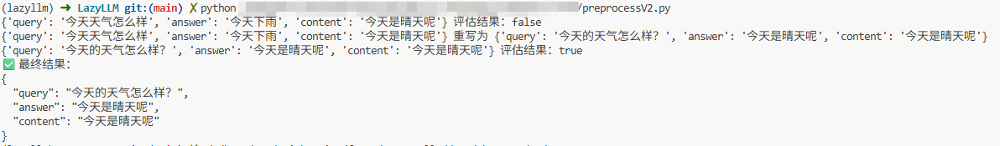


#### 4.2.2 Agent 架构设计

该 Agent 采用了 **控制器-执行器（Controller-Executor）** 架构，通过有限状态机（FSM）的思想确保流程的严谨性。

**关键组件**

* ​**Decision Agent (控制器)**​：由 `SYSTEM_PROMPT` 驱动的 LLM，负责根据当前状态决定是“继续评估”、“调用重写”还是“完成退出”。
* ​**Atomic Tools (原子工具)**​：
    * `evaluate_row`: 充当“裁判”，进行语义一致性检测。
    * `regenerate_row`: 充当“编辑”，负责基于 Content 重新创作。
* ​**State Management (状态管理)**​：通过 `agent_loop` 中的 `current` 变量维护当前处理的数据版本。

**逻辑流程图**

1. ​**输入**​：原始 QA 对及上下文（Content）。
2. ​**评估**​：Agent 首先触发 `evaluate_row`。
3. ​**分支**​：
    * 若评估为 `True`：Agent 发送 `final` 信号，流程结束。
    * 若评估为 `False`：Agent 触发 `regenerate_row`。
4. ​**循环**​：重写后的数据再次进入评估环节，直到满足一致性要求。


#### 4.2.3 运行示例分析

以输入 `{'query': '今天天气怎么样', 'answer': '今天下雨', 'content': '今天是晴天呢'}` 为例：

| **轮次** | **动作** | **输入 Answer** | **评估结果** | **后续操作**           |  
| ---------------- | ---------------- | ----------------------- | -------------------- | ------------------------------ |
| 1              | 评估           | 今天下雨              | False              | 识别到与 Content（晴天）冲突 |
| 2              | 重写           | 今天是晴天            | -                  | 基于 Content 生成新 Answer   |
| 3              | 评估           | 今天是晴天            | True               | 逻辑自洽，准备输出           |
| 4              | 完成           | 输出结果              | -                  | 返回修正后的 JSON            |


#### 4.2.4 方法定位

从系统角度看，该方法本质上是一个：

> **由 Agent 控制的、带反馈的数据质量修正流水线（Feedback-driven Dataflow）**

在工程实现上，它是数据处理流水线；
在方法论层面，它已经具备完整的 ​**Agent 行为闭环**​，可作为微调数据构建阶段的一个独立模块。

#### 4.2.5 代码链接

[代码链接](./code/preprocessV2.py)


## 5. 多智能体联动训练集构造流水线

本节基于一个**可运行的真实工程示例**，系统性地说明如何从一段原始自然语言文本中，自动构造可直接用于大模型微调（SFT / 推理增强）的高质量训练数据。整个流程采用**多智能体协作 + 外部确定性控制（FSM）**的设计范式，避免对单一模型“自觉行为”的依赖。

### 5.1 整体目标

该流水线的目标是：  
从**原始字符串输入（paragraph）**中，自动生成一组结构化样本，每个样本包含：

- `content`：原始文本片段  
- `query`：严格由 content 派生的问题  
- `answer`：严格由 content 支持的答案  
- `cot`：基于 content 的推理链（Chain-of-Thought）

最终输出的数据可直接用于：

- 指令微调（Instruction Tuning）
- 推理能力增强（CoT Distillation）
- Agent 数据构造与蒸馏
- 数据自监督质量控制实验


### 5.2 系统角色划分（多智能体视角）

整个系统中并不存在一个“全能 Agent”，而是通过**功能解耦**形成多个角色明确的子智能体（工具）：

1. **生成智能体（generate_row）**  
   负责从给定内容中生成 QA 对。

2. **评估智能体（evaluate_row）**  
   负责判定生成的 QA 是否严格来源于内容，充当“裁判”。

3. **解释智能体（add_cot）**  
   在 QA 被验证通过后，生成基于内容的推理链。

4. **控制器（agent_manager）**  
   外部有限状态机（FSM），负责流程调度、重试控制与终止条件判断。

这种设计确保了：  
> 决策在代码中，生成在模型中，正确性由工具约束。


### 5.3 流水线执行流程（逐步说明）

#### Step 1：文本切块（split_chunk）

- 输入：一段原始 paragraph
- 操作：按行切分为多个最小语义单元
- 目的：将长文本拆解为可控粒度，避免跨句推理与信息混杂

输出示例：
- “今天天气很好，阳光明媚。”
- “小明今年十八岁，是一名大学生。”
- “LazyLLM是一款高性能的开源人工智能框架。”


#### Step 2：QA 生成（generate_row）

- 输入：`{"content": chunk}`
- 行为：
    - 要求模型**只能基于 content 生成**
    - 强制 JSON 输出结构
- 结果：
    - 得到一个初始的 `query + answer + content` 组合

此阶段只关注“生成能力”，**不假设结果一定正确**。


#### Step 3：一致性评估与自修复（evaluate_row + regenerate）

- evaluate_row：
    - 模型被限制只能输出 True / False
    - 判断 QA 是否完全由 content 支持
- agent_manager：
    - 若返回 False，则重新调用 generate_row
    - 最多重试 3 次，防止死循环

这一阶段构成了一个**最小自我修复闭环**：

生成 → 判断 → 修正 → 再判断

从工程角度看，这是一个“弱监督但强约束”的自动清洗机制。


#### Step 4：推理链补全（add_cot）

- 前提：QA 已被判定为严格正确
- 行为：
    - 生成一个解释“为什么这个答案可以从 content 得出”的 CoT
    - 明确要求：推理过程必须基于 content，不允许引入外部知识
- 结果：
    - 样本从 “QA 对” 升级为 “QA + 推理链”

该步骤使数据从**普通指令数据**跃迁为**推理增强数据**。


### 5.4 稳定性与工程保障机制

为保证流水线在真实环境中的可用性，系统引入了以下工程级设计：

1. **统一重试机制（call_llm_with_retry）**
    - 每一次 LLM 调用最多重试 5 次
    - 防止瞬时网络 / 服务异常导致流程中断

2. **外部 FSM 控制**
    - 所有流程跳转由 Python 代码控制
    - 不依赖模型“是否愿意调用工具”

3. **结构化输出约束**
    - 所有关键步骤均要求 JSON 输出
    - 降低解析不确定性，增强可复现性


### 5.5 最终数据形态与示例特征

最终输出的数据统一具有如下结构：

- 信息完全可追溯到原始 content
- QA 与 CoT 语义一致
- 不包含模型幻觉或隐式外部知识
- 可直接用于微调或蒸馏

从示例输出可以看到：

- 简单事实类文本 → 简洁 CoT
- 复合问题 → 多步解释 CoT
- 定义类文本 → 直接抽取式推理

这使得同一流水线可同时覆盖不同难度层级的数据构造需求。

### 5.6 代码与输出

[代码链接](./code/multiagent.py)

**1. 统一调用封装：给所有 LLM 步骤提供重试能力**

```python
def call_llm_with_retry(prompt: str, retries: int = 5) -> str:
    last_err = None
    for _ in range(retries):
        try:
            return llm(prompt)
        except Exception as e:
            last_err = e
            time.sleep(0.5)
    raise last_err
```

这一步虽然简单，但很关键，因为整条流水线依赖多次 LLM 调用。没有统一重试机制，任意一步瞬时失败都会让整批数据处理中断。

**2. 生成工具：先从 content 生成 QA**

```python
@fc_register("tool")
def generate_row(row: Dict[str, Any]) -> Dict[str, Any]:
    q = f"""
    Generate a QA pair strictly based on the following content.
    Return JSON only.
    Content:
    {row["content"]}
    """
    resp = call_llm_with_retry(q)
    match = re.search(r'\{[\s\S]*?\}', resp)
    data = json5.loads(match.group(0))
    data["content"] = row["content"]
    return data
```

这里的作用是把原始文本片段转换成结构化样本，得到最基本的 `query + answer + content`。

**3. 评估与补全：先判定 QA 是否可靠，再追加 CoT**

```python
@fc_register("tool")
def evaluate_row(row: Dict[str, Any]) -> bool:
    q = f"""
    Answer True or False ONLY.
    Is the QA pair strictly derived from the content?
    Row:
    {json.dumps(row, ensure_ascii=False)}
    """
    resp = call_llm_with_retry(q).lower()
    return "true" in resp

@fc_register("tool")
def add_cot(row: Dict[str, Any]) -> Dict[str, Any]:
    q = f"""
    Return JSON only.
    Add a concise step-by-step reasoning (CoT) explaining how the answer is derived.
    Row:
    {json.dumps(row, ensure_ascii=False)}
    """
    resp = call_llm_with_retry(q)
    match = re.search(r'\{[\s\S]*?\}', resp)
    data = json5.loads(match.group(0))
    row = dict(row)
    row["cot"] = data["cot"]
    return row
```

这两步分别承担“裁判”和“解释器”角色：

- `evaluate_row` 负责过滤不可靠的 QA。
- `add_cot` 只在 QA 已经通过验证后执行，把样本升级为可用于推理训练的数据。

**4. 外部控制器：把多个工具串成完整闭环**

```python
def agent_manager(paragraph: str) -> list:
    chunks = split_chunk(paragraph)
    results = []
    for chunk in chunks:
        if not chunk.strip():
            continue
        row = {"content": chunk}
        row = generate_row(row)
        for _ in range(3):
            ok = evaluate_row(row=row)
            if ok:
                break
            row = generate_row(row)
        row = add_cot(row=row)
        results.append(row)
    return results
```


> 输出：

===
但凡涉及输出的，使用```bash```包裹
===

```python
{'content': '今天天气很好，阳光明媚。'} 重写为 {'query': '今天的天气怎么样？', 'answer': '今天天气很好，阳光明媚。', 'content': '今天天气很好，阳光明媚。'}
{'query': '今天的天气怎么样？', 'answer': '今天天气很好，阳光明媚。', 'content': '今天天气很好，阳光明媚。'} 评估结果：true
添加 CoT: {'query': '今天的天气怎么样？', 'answer': '今天天气很好，阳光明媚。', 'content': '今天天气很好，阳光明媚。', 'cot': '用户询问今天的天气情况，根据提供的文本内容，直接提取相关信息，即今天天气很好，阳光明媚。'}
{'content': '小明今年十八岁，是一名大学生。'} 重写为 {'query': '小明今年多大了？他是做什么的？', 'answer': '小明今年十八岁，是一名大学生。', 'content': '小明今年十八岁，是一名大学生。'}
{'query': '小明今年多大了？他是做什么的？', 'answer': '小明今年十八岁，是一名大学生。', 'content': '小明今年十八岁，是一名大学生。'} 评估结果：true
添加 CoT: {'query': '小明今年多大了？他是做什么的？', 'answer': '小明今年十八岁，是一名大学生。', 'content': '小明今年十八岁，是一名大学生。', 'cot': "1. The query asks for two pieces of information: Xiao Ming's age and his occupation. 2. The content provided directly states that Xiao Ming is eighteen years old and is a university student. 3. Therefore, the answer can be directly extracted from the content without the need for additional inference or calculation."}
{'content': 'LazyLLM是一款高性能的开源人工智能框架。'} 重写为 {'query': 'LazyLLM是什么？', 'answer': 'LazyLLM是一款高性能的开源人工智能框架。', 'content': 'LazyLLM是一款高性能的开源人工智能框架。'}
{'query': 'LazyLLM是什么？', 'answer': 'LazyLLM是一款高性能的开源人工智能框架。', 'content': 'LazyLLM是一款高性能的开源人工智能框架。'} 评估结果：true
添加 CoT: {'query': 'LazyLLM是什么？', 'answer': 'LazyLLM是一款高性能的开源人工智能框架。', 'content': 'LazyLLM是一款高性能的开源人工智能框架。', 'cot': "1. The user's query is asking for the definition or explanation of 'LazyLLM'. 2. The provided content directly answers the query by stating that 'LazyLLM是一款高性能的开源人工智能框架'. 3. There is no need for additional information or interpretation beyond the given content to answer the query."}
✅ 最终结果：
[
  {
    "query": "今天的天气怎么样？",
    "answer": "今天天气很好，阳光明媚。",
    "content": "今天天气很好，阳光明媚。",
    "cot": "用户询问今天的天气情况，根据提供的文本内容，直接提取相关信息，即今天天气很好，阳光明媚。"
  },
  {
    "query": "小明今年多大了？他是做什么的？",
    "answer": "小明今年十八岁，是一名大学生。",
    "content": "小明今年十八岁，是一名大学生。",
    "cot": "1. The query asks for two pieces of information: Xiao Ming's age and his occupation. 2. The content provided directly states that Xiao Ming is eighteen years old and is a university student. 3. Therefore, the answer can be directly extracted from the content without the need for additional inference or calculation."
  },
  {
    "query": "LazyLLM是什么？",
    "answer": "LazyLLM是一款高性能的开源人工智能框架。",
    "content": "LazyLLM是一款高性能的开源人工智能框架。",
    "cot": "1. The user's query is asking for the definition or explanation of 'LazyLLM'. 2. The provided content directly answers the query by stating that 'LazyLLM是一款高性能的开源人工智能框架'. 3. There is no need for additional information or interpretation beyond the given content to answer the query."
  }
]

```


## 6. PDF 数据处理流水线（Pdf2Qa Pipeline）

本节介绍基于 LazyLLM 的 PDF 数据处理流程。该流程将原始 PDF 文档逐步转换为可用于模型训练的标准化数据（SFT 格式），并支持图文多模态扩展。

---

### 6.1 总体流程

===
丰富6.1节内容
===

```
PDF → 文本解析 → Chunk合并 → 图片提取 → QA生成 → QA评分 → 数据过滤 → 格式转换
```

---

### 6.2 数据处理步骤

#### 1️⃣ Pdf2Qa.PdfProcessor（PDF解析 + 分块 + 图片处理）

功能：

- 调用 Mineru 服务解析 PDF 文档
- 转换为 Markdown 文本
- 按 `max_chunk_chars` 合并小文本块（chunk）
- 提取 Markdown 中的图片路径
- 自动下载图片并进行 resize
- 建立文本与图片的对应关系

输出结构：

```json
{
  "chunk": "文本内容",
  "image_path": ["./pdf_images/xxx.png"]
}
```

说明：

- 若无图片：`image_path` 为空字符串或空列表
- chunk 为后续 QA 生成的基本单位

---

#### 2️⃣ Pdf2Qa.ImageToVQA（QA生成）

功能：

- 基于：
    - 文本 chunk
    - 图片（可选）

- 生成用于监督微调（SFT）的问答对

特点：

- 支持纯文本 / 多模态输入
- 可通过 prompt 控制生成质量与风格

输出结构：

```json
{
  "chunk": "文本内容",
  "image_path": ["./pdf_images/xxx.png", "./pdf_images/xxx2.png"],
  "instruction": "问题",
  "output": "答案"
}
```

---

#### 3️⃣ Pdf2Qa.PdfQAScorer（QA质量评分）

功能：

- 输入：
    - 原文 chunk
    - 图片（可选）
    - QA 对
- 判断 QA 是否严格来源于原文内容

评分规则：

- 符合原文语义 → 1
- 不符合 → 0

输出结构：

```json
{
  "chunk": "...",
  "image_path": [...],
  "instruction": "...",
  "output": "...",
  "score": 1
}
```

---

#### 4️⃣ QA过滤（qa_score_filter / multi_features_filter）

功能：

- 根据评分结果筛选数据
- 过滤低质量 QA（score < threshold）

效果：

- 提升数据一致性
- 减少 hallucination 数据进入训练集

---

#### 5️⃣ 格式转换（SFT / 多模态）

根据训练目标，转换为不同格式：

#### ✔ 单模态（文本 SFT）

```json
{
  "instruction": "问题",
  "input": "文本chunk",
  "output": "答案"
}
```

---

#### ✔ 多模态（VQA / Chat 格式）

通过：

- `Pdf2Qa.vqa_to_chat_format`
- `Text2qa.to_alpaca_sft`

可生成包含图片路径的对话格式数据，用于视觉语言模型（VLM）训练。

> 多模态Chat格式：

```json

{
"messages": [
    {"role": "user", "content": "<image>诊断报告中的系数比较图展示了哪些估计方法和置信区间？"}, 
    {"role": "assistant", "content": "系数比较图展示了普通最小二乘法（OLS）和两阶段最小二乘法（2SLS）的点估计，并且包括了分析、bootstrap-c、bootstrap-t、tF以及Anderson-Rubin置信区间。"}
    ], 
"images": ["/xxxxx/pdf_experiment/pdfs/images/9fc1b845e4f12f7e0bca556871ed9e50009343012a4d63757d5bab2bbfaec1a3.jpg"]
}
```

> 纯文本Alpaca格式：

```json

{
    "instruction": "反射机制在AI代理中的作用是什么？", 
    "input": "6. Reflexive and Self-Critique Mechanisms: AI Agents xxxx", 
    "output": "反射机制使AI代理具备自我评估的能力，通过二次推理过程对已完成的任务进行自我批评，从而提高鲁棒性并降低错误率。此外，对于具有能动性的AI，反射机制还扩展到代理之间的相互评估，例如验证器代理可以审查总结器代理的工作，以确保协作质量控制和增强可信度。这种机制还支持迭代改进和适应性重新规划，特别是在与记忆日志或反馈队列集成时。"
}
```

---

### 6.3 Pipeline 特点

该数据流水线具备以下能力：

- 自动从 PDF 构建训练数据
- 语义级 chunk 切分（控制上下文长度）
- 文本与图片自动对齐
- QA 自动生成与质量控制
- 支持单模态与多模态训练数据

---

### 6.4 输出结果

===
丰富一下，最好给一个输出示例。
===

最终输出为可直接用于模型训练的数据：

- JSON 格式
- 支持 train / test 切分
- 可用于：
    - 指令微调（SFT）
    - 多模态训练（VLM）
    - RAG 数据构建

### 6.5 PPL运行代码

该代码用于构建并执行一个完整的 PDF → QA 数据生成流水线（pipeline），实现从原始 PDF 到结构化训练数据的自动转换。

关键参数说明：

- `mineru_api`：PDF解析服务地址
- `max_chunk_chars`：控制每个文本块长度
- `qa_user_prompt`：QA生成策略
- `chat_format=False`：
    - False → 生成纯文本 SFT 数据（Alpaca格式）
    - True → 生成多模态对话数据（含图片）
- `context_key='chunk'`：QA生成时使用的上下文字段


```python
generator_prompt = f'''
你是一个用于构建训练数据的助手，需要基于给定的图像或文本内容，生成一个xxxx
只能输出 JSON，不能包含任何额外说明或解释
'''
# ====== 构建 pipeline ======
ppl = build_pdf2qa_pipeline(
    model=model, 
    mineru_api="http://10.119.30.80:20234",
    image_output_folder=output_folder,
    chunk_key='chunk',
    image_key='image_path',
    qa_user_prompt=generator_prompt,
    max_chunk_chars=1000,
    chat_format=False, # 控制数据格式: 训练和推理的时候不给图片 False 使用纯文本 alpaca sft格式；
    context_key='chunk'

)
```

### 6.6 PDF处理流水线与微调

[代码链接](./code/pdfppl.py)

前面 `6.1 ~ 6.5` 已经介绍了 PDF2QA 流水线的核心组件，这里补充看一下完整脚本 [pdfppl.py](./code/pdfppl.py) 是如何把这些步骤串起来的。

这个脚本的主线非常直接，可以概括为：

> 下载 PDF → 生成 QA 数据 → 划分训练/测试集 → SFT 微调 → 基座模型对比推理 → 评分模型打分 → 统计结果

对应主流程代码如下：

```python
def main():
    MODEL_PATH = "Qwen2.5-VL-32B-Instruct"
    SFT_BASE_MODEL = "qwen1.5-0.5b-chat"
    SCORE_MODEL = "qwen2.5-14b-instruct"

    generate_model = lazyllm.TrainableModule(MODEL_PATH)
    train_data, test_data = generate_qa_from_pdfs(generate_model)

    sft_model = build_sft_model(SFT_BASE_MODEL, TRAIN_JSON)
    infer_model = build_infer_model(SFT_BASE_MODEL)

    score_predictions_with_model(sft_output, scorer_model, SFT_SCORE_JSON)
    score_predictions_with_model(infer_output, scorer_model, INFER_SCORE_JSON)

    analyze_scores(SFT_SCORE_JSON)
    analyze_scores(INFER_SCORE_JSON)
```

其中几个关键函数分别承担不同职责：

- `generate_qa_from_pdfs()`：调用 `build_pdf2qa_pipeline`，把 PDF 自动转换为问答数据，并随机切分为训练集与测试集。
- `build_sft_model()`：基于训练集构建微调模型，使用 `llamafactory` 完成 SFT。
- `build_infer_model()`：加载同一个基座模型做原始推理，作为对照组。
- `score_predictions_with_model()`：再引入一个打分模型，对 “标准答案 vs 模型预测” 做 `0 / 0.5 / 1` 评分。
- `analyze_scores()`：统计平均分和分布，用来直观看 SFT 前后的质量差异。

从工程角度看，这段代码的价值在于它不是只“生成数据”，而是形成了一个完整闭环：

1. 用多模态模型从 PDF 中抽取训练样本。
2. 用这些样本微调小模型。
3. 让微调模型和原始模型在同一测试集上生成答案。
4. 用统一评分器做自动评测。
5. 输出分数分布，方便判断数据构造是否真正带来收益。

因此，`pdfppl.py` 更像是一个 **端到端实验脚本**：前半段解决“训练数据从哪来”，后半段解决“微调后有没有变好”。


> 结果
```python
📊 File: .../sft_score_result.json
Total: 133
Average score: 0.5526
Distribution:
  0.0: 14 (10.53%)
  0.5: 91 (68.42%)
  1.0: 28 (21.05%)

📊 File: .../infer_score_result.json
Total: 133
Average score: 0.4361
Distribution:
  0.0: 28 (21.05%)
  0.5: 94 (70.68%)
  1.0: 11 (8.27%)
```
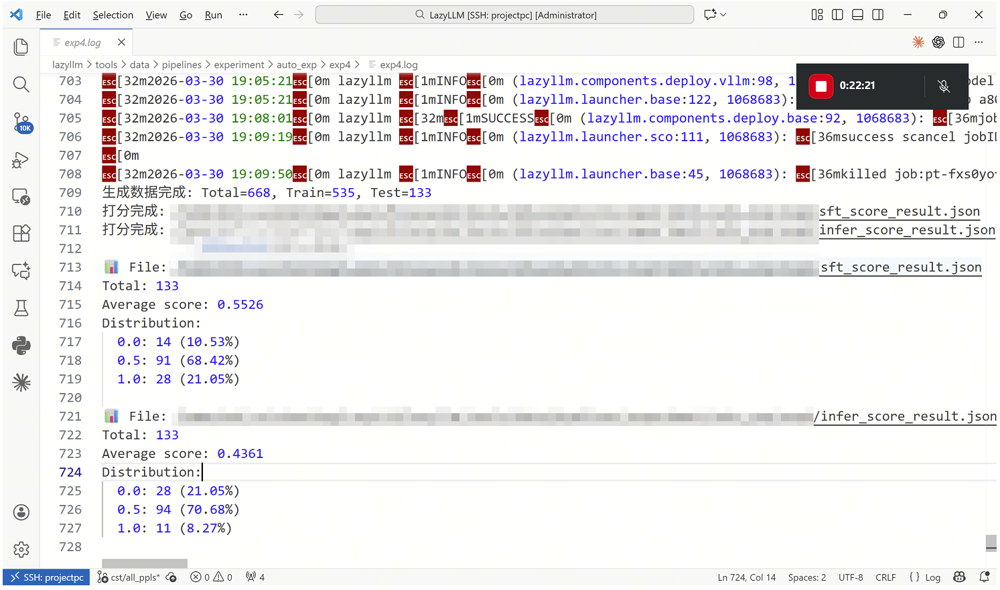

从评分结果可以看到，SFT 模型的平均分从 **0.4361** 提升到 **0.5526**，说明基于 PDF 自动构造的数据确实带来了可观收益。进一步看分布，SFT 后 **满分样本占比**从 **8.27%** 提升到 **21.05%**，而 **完全错误样本占比**从 **21.05%** 降到 **10.53%**，说明模型不仅整体回答质量更高，而且明显减少了完全答偏的情况。

与此同时，两组结果中 `0.5` 分样本仍然占多数，这也说明当前流程已经能稳定提升“部分正确”与“基本可用”的回答质量，但距离大量产出高置信、高完整度答案还有优化空间。也就是说，这条 PDF 数据处理流水线已经验证了方向有效，后续仍可继续从 **PDF 解析质量、QA 生成提示词、训练样本规模和评分标准** 等方面进一步增强效果。
