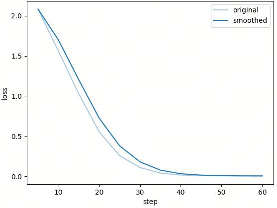

# 第 6 课时：基于 LazyLLM 的数据—训练—评测全流程实践

## 1 任务目标  

在本课时中，我们将围绕“**数据驱动的大模型迭代闭环**”展开实践，重点构建一条完整的流程：

> **数据清洗 → 数据合成（Phi-4 风格）→ 继续预训练 → 模型评测 → 推理应用**

与传统预训练不同，本课引入一个关键步骤：**数据合成（Data Synthesis）**

具体来说，我们并不是直接使用原始文本进行训练，而是借助大模型，将文本自动转化为 **Question–Answer（QA）结构数据**，从而增强语义信息密度。这种方式正是近年来 Phi-4 等模型采用的重要策略之一。

在完成训练后，我们将基于统一的评测任务（prefix → continuation），从三个维度对模型进行分析：

- **PPL（困惑度）**：衡量模型的概率建模能力  
- **Loss（交叉熵）**：衡量拟合真实分布的程度  
- **BLEU（2-gram）**：衡量生成文本与参考文本的重合程度  

通过这一过程，你将掌握：

- 如何用 LazyLLM 构建完整数据—模型闭环  
- 如何通过“数据合成”提升模型训练质量  
- 如何设计合理的评测体系验证模型效果  

---

## 2 数据流：从原始文本到 Phi-4 风格数据

### 2.1 来源背景  

本实验选用的数据集为：

- **名称**：WikiText（语言模型预训练数据集），常用版本为 `wikitext-2-raw-v1`。  

WikiText 数据集由研究社区整理发布，来源于维基百科中的高质量文章，专门用于语言模型（Language Modeling）任务的研究与评测。与早期经过强清洗的语料不同，WikiText 保留了较完整的文本结构与上下文信息，因此更适合作为连续文本建模的基础语料。

与一般结构化数据（如问答数据、标注数据）相比，WikiText 的特点在于：

- 文本来源规范，语言表达相对严谨  
- 以段落形式组织，具备较强的上下文连续性  
- 不包含显式标注信息（如标签、问答对等）  

在本实验中，我们主要使用其中的**原始文本字段（`text`）**，将其作为语言模型的基础训练语料。

```json
{
  "text": "Senjō no Valkyria 3 : Unrecorded Chronicles ( Japanese : 戦場のヴァルキュリア3 , lit . Valkyria of the Battlefield 3 ) , commonly referred to as Valkyria Chronicles III outside Japan , is a tactical role @-@...."
}
```

这种处理方式更加贴近预训练阶段的核心目标，即：

> **通过大规模连续文本学习语言分布与上下文依赖关系**

然而，需要注意的是，纯文本数据虽然能够有效支持语言建模，但仍存在一定局限性：

- 缺乏显式语义结构（如“问题—答案”关系）  
- 难以直接用于复杂推理或问答类任务  
- 语义信息分散，模型学习效率相对较低  

因此，在后续流程中，我们将基于这些原始文本，引入**数据合成（Data Synthesis）策略**，将其转化为更具结构化特征的训练数据，从而进一步提升模型的语义建模能力与实际应用效果。

### 2.2 数据获取

在完成数据来源确定之后，由于原始语料往往来源复杂，包含格式噪声、重复内容甚至无效文本。如果不加处理直接用于训练，不仅会降低模型学习效率，还可能引入偏差。因此，我们直接使用已经清洗分块的 wikitext 文本作为本次实验的数据源（通过 LazyLLM 的 `built_pt_text_pipeline` 实现，可参考第9讲）。干净的数据示例如下：

```json
{
  "uid": "20260316143650_55db881fd2bb4b4baa85f2626860f9d1",
  "content": "This ammunition, and that which I brought with me, was rapidly prepared for use at the Laboratory established at the Little Rock Arsenal for that purpose. As illustrating as the pitiful scarcity of material in the country, the fact may be stated that it was found necessary to use public documents of the State Library for cartridge paper. Gunsmiths were employed or conscripted, tools purchased or impressed, and the repair of the damaged guns I brought with me and about an equal number found at Little Rock commenced at once. But, after inspecting the work and observing the spirit of the men I decided that a garrison 500 strong could hold out against Fitch and that I would lead the remainder—about 1500—to Gen'l Rust as soon as shotguns and rifles could be obtained from Little Rock instead of pikes and lances, with which most of them were armed. Two days elapsed before the change could be effected.",
  "meta_data": {
    "index": 0,
    "total": 1,
    "length": 926
  }
}
```

在实现上，可以通过如下方式读取文本内容：

```python
def _load_source_chunks(limit=None):
    if not os.path.exists(SOURCE_JSONL_PATH):
        raise FileNotFoundError(f'源数据不存在: {SOURCE_JSONL_PATH}')
    contexts = []
    with open(SOURCE_JSONL_PATH, 'r', encoding='utf-8') as f:
        for line in f:
            if limit and len(contexts) >= limit:
                break
            line = line.strip()
            if not line:
                continue
            rec = json.loads(line)
            content = (rec.get('content') or rec.get('text') or '').strip()
            if content:
                contexts.append(content)
    print(f'加载源 chunk: 共 {len(contexts)} 条（来源: {SOURCE_JSONL_PATH}）')
    return contexts
```

从代码可以看出，这一步主要完成了三件事情：

* **字段抽取**：优先从 `content` 或 `text` 字段中获取正文内容
* **空值过滤**：跳过空行或无效记录
* **数量控制**：通过 `limit` 参数限制数据规模，便于实验快速迭代


### 2.3 数据合成

在获得高质量文本块之后，我们进入本课的关键环节：**数据合成（Data Synthesis）**。

如果直接使用纯文本进行预训练，模型虽然可以学习语言分布，但其学习到的知识往往是“隐式”的，难以在具体任务（如问答、推理）中直接体现。因此，我们引入一种更具结构化的信息形式——**Phi-4 风格的问答数据（QA Pair）**。

其核心思想是：

> **利用大模型，将连续文本转化为“问题—答案”的结构化知识表达**

在 LazyLLM 框架中，这一过程可以通过预定义的数据流水线自动完成。例如：

```python
ppl = build_phi4_pt_pipeline(
    context_key='context',
    image_key=None,
    llm=llm,
    num_qa=NUM_QA,
)

data = [{'context': ctx} for ctx in contexts]
results = ppl(data)
```

这里的执行逻辑可以理解为：

1. 将每一段文本封装为 `{"context": ...}` 的结构
2. 输入到大模型驱动的数据合成流水线中
3. 自动生成若干组与该文本相关的问答对

例如，对于一段百科文本，模型可能生成如下结构化内容（示意）：

```text
Question: What is the significance of the Early Dynastic Period?
Answer: It marks the beginning of recorded history in ancient Egypt.
```

相比原始文本，这种数据形式具有几个显著优势：

* **语义显式化**：文本中的关键信息被提炼为明确的问题与答案
* **结构标准化**：统一为 QA 格式，便于模型学习“输入—输出”映射
* **任务对齐**：更贴近下游应用（如问答、对话、知识检索等）

从本质上看，这一过程可以视为一种“知识蒸馏”：

> 原始文本 → 语义理解 → 结构化表达（QA）

也可以用一句话概括：

> **Phi-4 风格数据 = 原始文本 + 大模型生成的结构化语义信息**

需要注意的是，这一步虽然依赖大模型生成，但并不是简单的“数据扩充”，而是对语料进行了一次**语义层面的重构**。其结果不仅增加了数据量，更重要的是提升了数据的“信息密度”和“可学习性”。

在完成数据合成后，我们就得到了一个兼具**语言连续性**与**任务结构性**的数据集，这为后续的模型训练与评测打下了坚实基础。

接下来，我们将基于这些数据，进入模型训练阶段，构建完整的训练—推理闭环。

### 2.4 构造训练数据

将 QA 对整理为训练格式：

```python
train_texts = [
    {'text': f'Question: {q}\nAnswer: {a}'}
    for q, a in train_pairs
]
```

最终训练数据形式为：

```text
Question: xxx
Answer: xxx
```

👉 这一设计的关键意义在于：

| 类型      | 特点     |
| ------- | ------ |
| 纯文本 PT  | 学习语言分布 |
| QA 合成数据 | 学习语义关系 |

因此，这种方法可以理解为：

> **“预训练 + 指令学习”的融合形式**

---

## 3 模型训练

使用 LazyLLM 封装接口进行训练：

```python
model = lazyllm.TrainableModule(BASE_MODEL_PATH, target_path=target_path)

model.mode('finetune')\
    .trainset(TRAIN_JSON_PATH)\
    .finetune_method((finetune.llamafactory, {
        'stage': 'pt',
        'finetuning_type': 'full',
        'learning_rate': 3e-5,
        'cutoff_len': 512,
        'val_size': 0.05,
        'optim': 'adamw_torch_fused',
        'bf16': True,
        'fp16': False,
        'per_device_train_batch_size': 8,
        'gradient_accumulation_steps': 4,
        'num_train_epochs': 20,
        'lr_scheduler_type': 'cosine',
        'warmup_ratio': 0.1,
        'save_steps': 20,
        'logging_steps': 5,
        'resume_from_checkpoint': None,
        'save_strategy': 'steps',
        'save_total_limit': 5,
        'launcher': launchers.empty(ngpus=1),
    }))\
    .update()
```

上述代码中，`TrainableModule(BASE_MODEL_PATH, target_path=…)` 指定基座权重与本次训练输出目录；`mode('finetune')` 进入继续预训练/微调管线；`trainset(TRAIN_JSON_PATH)` 指向 LazyLLM 可读的训练数据；`finetune_method((finetune.llamafactory, {…}))` 表示由 LLaMA-Factory 执行，花括号内为与 Hugging Face `TrainingArguments` 对齐的字段；`update()` 按当前配置真正拉起训练。

**主要参数：**

* `stage`：`pt` 表示继续预训练阶段（因果语言建模，不做指令模板封装）。
* `finetuning_type`：`full` 表示全参数更新（非 LoRA 等参数高效微调）。
* `learning_rate`：优化器步长，此处为 `3e-5`。
* `cutoff_len`：单条样本截断长度（token），超长从右侧截断。
* `val_size`：从训练集中划出的验证集比例（如 `0.05` 表示约 5%）。
* `optim`：优化器实现，`adamw_torch_fused` 为 fused AdamW（需环境支持）。
* `bf16` / `fp16`：混合精度；`bf16=True` 在支持 BF16 的 GPU 上常用于稳定训练，`fp16=False` 关闭 FP16。
* `per_device_train_batch_size`：每块 GPU 上的 batch 大小。
* `gradient_accumulation_steps`：梯度累积步数；等效 batch ≈ `per_device_train_batch_size × 累积步数 × GPU 数`。
* `num_train_epochs`：训练轮数。
* `lr_scheduler_type`：学习率调度，`cosine` 为余弦退火。
* `warmup_ratio`：Warmup 占全部优化步数的比例。
* `save_steps`：每多少 *优化步* 保存一次检查点（与 `save_strategy` 配合）。
* `logging_steps`：每多少步打印/记录日志。
* `resume_from_checkpoint`：`None` 表示从头训练；可改为检查点路径以断点续训。
* `save_strategy`：`steps` 表示按步数保存（而非仅按 epoch）。
* `save_total_limit`：最多保留最近若干个检查点，超出则删旧留新。
* `launcher`：LazyLLM 进程/资源启动方式；`launchers.empty(ngpus=1)` 表示单机单卡本地训练。

训练中的 Loss 曲线如下：



整个流程可以理解为：

> **加载模型 → 输入数据 → 配置训练 → 更新参数**

---

## 4 模型评测与推理

### 4.1 构造评测任务

评测数据采用：

```json
{
  "prefix": "Question...",
  "continuation": "Answer..."
}
```

即：

> 输入问题 → 预测答案

### 4.2 PPL 与 Loss

困惑度定义如下：

$$
\mathrm{PPL} = \exp(\bar{L})
$$

其中平均损失可写为：

$$
\bar{L} = - \frac{1}{N} \sum_{t=1}^{N} \log p(y_t \mid y_{<t}, x)
$$

变量说明：

* $N$：参与计算损失的 token 数。
* $y_t$：第 $t$ 个目标 token。
* $y_{<t}$：第 $t$ 个 token 之前的目标前缀。
* $x$：输入上下文（这里可理解为 Question）。
* $p(\cdot)$：模型给出的条件概率。

代码实现如下：

```python
with torch.no_grad():
    out = model(input_ids=input_ids, labels=labels)
    loss = out.loss.item()

ppl = torch.exp(torch.tensor(loss)).item()
```

👉 解释：

* PPL 越低 → 模型越确定
* Loss 越低 → 拟合越好

---

### 4.3 生成评测（BLEU）

生成答案：

```python
gen = model.generate(**enc, generation_config=gen_config)
```

然后计算 2-gram 重合（以生成序列与参考序列的 2-gram 集合做比较）：

$$
\mathrm{Precision} = \frac{M}{G}, \quad
\mathrm{Recall} = \frac{M}{R}
$$

$$
\mathrm{F1} = \frac{2 \cdot \mathrm{Precision} \cdot \mathrm{Recall}}
{\mathrm{Precision} + \mathrm{Recall}}
$$

变量说明（简要）：

* $M$：匹配到的 2-gram 数量。
* $G$：生成答案中的 2-gram 总数。
* $R$：参考答案中的 2-gram 总数。

👉 作用：

> 衡量“生成是否像参考答案”

### 4.4 评测结果

本次评测共评估 200 条样本。预训练前后的结果对比如下：

| 模型 | PPL | Loss | BLEU |
| --- | --- | --- | --- |
| base | $15.18$ | $2.72$ | $0.682$ |
| pt | $5.26$ | $1.66$ | $0.646$ |

对比变化（pt 相对 base）：

* PPL 下降约 $65.4\%$（$15.18 \rightarrow 5.26$）
* Loss 下降约 $39.0\%$（$2.72 \rightarrow 1.66$）
* BLEU 下降约 $5.3\%$（$0.682 \rightarrow 0.646$）

结果解读：

* PPL 与 Loss 明显下降，说明模型在该分布上的条件建模能力显著增强。
* BLEU 小幅回落，说明“更像参考答案”的 n-gram 重合度没有同步提升。
* 这类现象通常意味着：模型更擅长预测分布，但生成风格与参考答案模板仍存在差异。

---

## 5 本章小结

本章围绕 LazyLLM，展示了构建完整 LLM 实践链路的全过程。首先，在**数据流**方面，我们通过数据合成将原始文本转化为结构化的 Phi-4 风格问答数据，从“无结构数据”变为可直接用于模型训练的语义结构数据，本质上是**利用大模型生成训练数据（Data Synthesis）**。其次，在**模型流**方面，同一框架完成了训练、评测与部署，有效降低了工程复杂度。再者，在**评测体系**上，我们结合多指标进行衡量：PPL 用于评估语言建模能力，Loss 衡量概率拟合程度，BLEU 用于检查生成质量。最核心的思想在于：**数据质量不等于原始数据本身的质量，而在于数据的构造方式**。通过 Phi-4 风格数据合成，我们不仅提升了语义建模能力，也使训练方式更贴近实际应用，同时加快了模型迭代效率。本章完成了一个完整的**数据 → 模型 → 应用**闭环流程，并为后续扩展提供了基础，例如引入 RAG（检索增强）、多语言数据合成或多模态数据扩展，从而构建更复杂、更实用的大模型系统。
