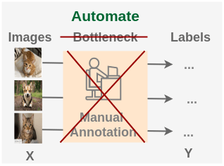
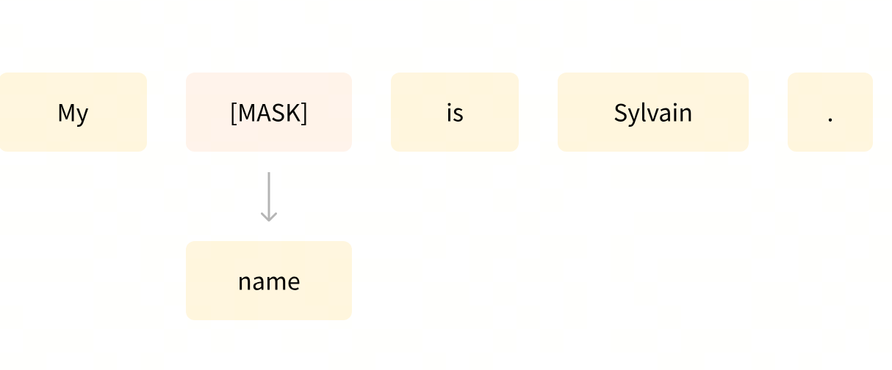
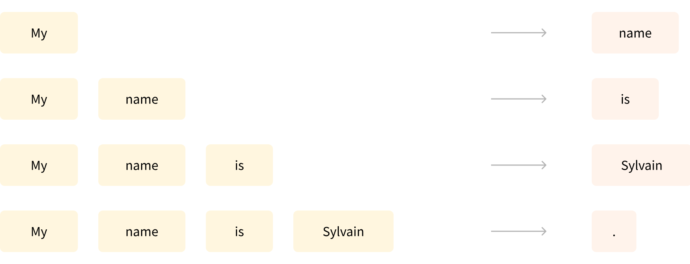

# 第7课时：预训练原理、策略与评测

在你和 ChatGPT 聊天、问 Claude 写报告、用 Qwen 生成摘要时，  
也许你会好奇：这些模型最初是怎么“学会语言”的？  
它们并不是天生会聊天，而是经历了一个漫长的“学习阶段”—— **预训练（Pre-training）**。  
现在，我们就来看看：  
一个大语言模型，是如何在没有老师、没有考试卷的情况下，靠“自学”掌握语言规律的。

## 1. 预训练原理与核心机制

在进入具体的训练原理之前，有必要先理解预训练和微调在大语言模型生命周期中的地位。预训练奠定了模型的语言理解能力基础，而微调则将这种通用能力引向特定任务应用。这一组合不仅提升了模型的泛化能力，也确保了在不同应用场景下的表现稳定和可靠。

### 1.1 预训练与微调概览

在大语言模型的世界里，预训练和微调构成了整个模型成长的两大支柱。预训练可以理解为模型的“基础教育阶段”，在这个阶段，模型接触的是海量、通用的文本数据。它的目标是让模型掌握语言的基本规律、语义关系以及统计模式，而不特定针对任何具体任务。微调则是模型的“职业培训阶段”，在这一阶段，模型会通过较小且高质量的任务相关数据进行训练，使其能够在特定应用场景下表现出更精准的能力。

预训练的核心在于自监督学习（Self-Supervised Learning），这意味着模型不需要人工标注数据，而是通过从文本自身构建预测任务来学习语言规律。例如，在因果语言建模（Causal Language Modeling, CLM）中，模型需要根据前文预测下一个词，训练目标可以形式化为最大化下一个 token 出现的概率：

$$
\mathcal{L}_{\text{CLM}}(\theta) = - \sum_{t=1}^T \log P_\theta(x_t | x_{<t})
$$

其中 $x_t$ 表示序列中的第 $t$ 个 token，$x_{<t}$ 表示其之前的所有 token，$\theta$ 是模型参数。通过不断调整 $\theta$，模型逐渐学会从上下文中推断最可能出现的词汇，这也是 Transformer 模型能够生成连贯文本的基础。

微调阶段则聚焦于特定任务，如问答、摘要生成、代码补全或情感分析。微调通常使用监督学习，提供输入-输出对 $(x, y)$，优化目标是最小化损失函数，例如交叉熵损失：

$$
\mathcal{L}_{\text{FT}}(\theta) = - \sum_{(x,y) \in D} \log P_\theta(y|x)
$$

这里 $D$ 是微调数据集，模型参数 $\theta$ 可以从预训练得到的权重初始化，再根据任务数据进行更新。这种策略的优点在于，即便微调数据量有限，模型也能借助预训练阶段积累的丰富语言知识快速适应新任务。

一个生动的例子是对话生成模型。预训练阶段，模型接触来自网络的大量文本，学会语言模式和常识知识，例如“猫会喵叫”或“水会流下坡”。微调阶段，则可能使用客服对话数据，使模型能够准确理解用户问题并生成适宜回复。如果没有预训练，即使有微调数据，模型也可能因为缺乏语言基础而生成不自然或逻辑混乱的回答。

值得注意的是，预训练与微调之间的界限并不是绝对的。在实际工程中，很多大型模型采用阶段性训练策略：先进行通用预训练，再针对领域或任务进行持续预训练（Continual Pretraining），最后再做微调。这种做法可以让模型在专业领域中表现更稳健，同时保留广泛的语言能力。例如在医学文本处理场景中，模型先经过通用语料的预训练，再用医学文献进行领域适应性训练，最终在医疗问答或病历摘要任务上微调，效果往往远优于直接微调通用模型。

除了训练策略本身，预训练与微调的计算资源分配也是一个重要考量。预训练通常需要海量算力，尤其是参数规模达到数十亿甚至上千亿时，需要使用分布式训练和混合精度计算来加速训练，同时减少显存压力。微调阶段则相对轻量，但在高精度或任务复杂度高的场景下，也可能需要梯度累积、学习率调度以及混合优化器策略来保证训练稳定性。例如，使用 AdamW 优化器并结合余弦退火学习率调度，可以在微调阶段快速收敛，同时减少过拟合风险。

从数据角度来看，预训练强调规模和多样性，微调强调任务相关性和高质量标注。预训练的数据可能涵盖新闻、维基百科、论坛帖子、书籍、代码等多种文本，而微调数据则严格筛选，保证其符合下游任务的语义需求。例如，在代码生成任务中，预训练语料可能是开源 GitHub 仓库，而微调数据可能来自高质量、有完整文档的函数和脚本。这种数据策略的搭配，使模型在生成文本时既具语言通用性，又具有任务适应性。

在模型架构层面，预训练和微调策略也密切相关。Transformer 的多头自注意力机制可以高效捕捉长距离依赖，使模型在预训练阶段学习全局语义结构；在微调阶段，这种全局语义能力能够被快速迁移到具体任务中，无需重新设计模型结构。再结合如 MoE（Mixture of Experts）这样的扩展架构，可以在预训练阶段利用专家路由提高模型容量，同时在微调阶段仅激活相关专家，进一步节约计算资源。

总的来看，预训练与微调构成了大语言模型训练的核心闭环。预训练提供广泛的语言理解能力和通用知识储备，微调则将这些能力聚焦于具体任务，实现精细化和高质量的输出。这个过程不仅体现了训练范式的设计智慧，也反映了数据、计算资源与模型架构的深度协同，是现代 LLM 训练不可或缺的基石。

### 1.2 自监督学习与 Next Token Prediction

在上一节我们提到，大模型的预训练阶段并不需要人工标注数据。它之所以能够理解语言，核心就在于自监督学习（Self-supervised Learning）。顾名思义，自监督就是模型利用数据本身产生监督信号，而不是依赖外部人工标注。通过人为设计的预测任务，让模型从数据中恢复被遮蔽或隐藏的信息，这类任务通常称为“伪监督任务（pseudo supervision）”。

在语言模型中，最核心的自监督任务就是 **Next Token Prediction（NTP）**。NTP 的核心思想非常直观：给定一句话的前半部分，让模型预测下一个最可能出现的词。通过不断预测下一个词，模型被迫学习语言的统计规律、句法结构和语义关系。

从数学上看，设文本序列为 $x = (x_1, x_2, ..., x_T)$，NTP 训练目标是最大化条件概率：

$$
p_\theta(x) = \prod_{t=1}^T p_\theta(x_t \mid x_{<t})
$$

训练时通常通过最小化负对数似然（NLL）实现：

$$
\mathcal{L}(\theta) = - \sum_{t=1}^T \log p_\theta(x_t \mid x_{<t})
$$

这里，$p_\theta(x_t \mid x_{<t})$ 表示在前文上下文 $x_{<t}$ 已知的情况下，模型预测下一个词 $x_t$ 的概率。通过优化这个损失，模型逐步捕获：

- **短程依赖**：词汇搭配和固定表达；
- **长程依赖**：句子和段落的上下文逻辑；
- **语义一致性**：预测的词与上下文语义匹配；
- **现实知识**：根据语言和常识选择合理词。

与传统自监督任务类似，NTP 是自监督理念的具体实现，但更直观、目标明确。它迫使模型不断调整内部表示，使词向量、注意力矩阵和前馈网络（FFN）有效编码语言结构：

- **词向量优化**：语义接近的词向量在高维空间聚集；
- **注意力机制**：模型自动聚焦与预测相关的上下文 token；
- **前馈网络（FFN）**：捕捉抽象统计模式，如实体类别、指代倾向或上下文逻辑。

在实际训练中，这个过程就像在不断玩“填坑游戏”。例如输入句子：

```

我今天吃了（ ）饭。

```

模型需要预测被遮住的词可能是“早”。通过海量类似任务，模型逐渐学会：

- 哪些词更可能连在一起；
- 句子结构和语法规律；
- 上下文逻辑和潜在语义关系。

NTP 思想也可以推广到其他模态。例如图像领域，可以将图片随机旋转 0°、90°、180° 或 270°，要求模型预测旋转角度，无需人工标注，仅靠数据本身生成“伪标签”：



经过大规模训练后，模型学到的特征可迁移到具体任务，例如猫狗分类：


通过这种方式，NTP 让模型在语言文本中形成**隐式语言理解**，而自监督学习保证了这一方法可以无监督地扩展到各种数据场景，实现大规模高效学习。

### 1.3 MoE 路由机制简介与优势

在大模型的不断扩张中，参数量的增加带来了表达能力的大幅提升，但也带来了计算和存储上的巨大挑战。**Mixture of Experts（MoE）** 路由机制应运而生，它的核心思想是“**不是每个 token 都需要经过整个模型，而是由专家模块动态选择最相关的部分进行计算**”，从而实现稀疏激活、降低计算成本，同时保留模型的高容量。

MoE 模型将网络划分为多个“专家”（Experts），每个专家本质上是一个完整的子网络（例如一组前馈层或 Transformer 块）。对于每个输入 token，路由器（Router）会计算一个权重向量 $g(x) \in \mathbb{R}^E$，表示该 token 与每个专家的匹配程度，其中 $E$ 是专家数量：

$$
g(x) = \text{Router}(x), \quad \sum_{i=1}^{E} g_i(x) = 1
$$

在前向计算时，通常只选择权重最大的前 $k$ 个专家进行实际计算（Top-k routing），这样大部分专家保持闲置，从而大幅减少计算量。例如，当 $E=64$ 且 $k=2$ 时，每个 token 仅激活两个专家，而其余 62 个专家保持不参与计算，**参数量巨大但计算量保持相对可控**。

MoE 的优势不仅在于**稀疏激活减少计算开销**，还在于**能力聚焦**：不同专家可以专注于处理不同类型的输入模式。例如在语言模型中：

- 一些专家专门处理长距离依赖或复杂语法结构；
- 一些专家专门处理特定语义场景，如问答或命名实体识别；
- 还有专家专注于低频或高阶组合词的统计规律。

这种分工让模型在有限计算资源下获得“超大容量”，并且具备较强的泛化能力。

MoE 的训练中存在几个关键技术点：

1. **负载均衡（Load Balancing）**  
   为防止少数专家被过度激活而其他专家闲置，训练时会加入负载均衡损失：
   $$
   \mathcal{L}_{\text{load}} = \text{CV}^2(g(x)) 
   $$
   其中 $\text{CV}^2$ 表示权重分布的方差平方。这个项鼓励路由器均匀分配 token 到各个专家，提高模型稳定性和效率。

2. **路由噪声（Routing Noise）**  
   为了增加专家选择的多样性，训练阶段会对路由权重加入轻微噪声，避免路由器陷入局部最优，确保每个专家都有机会学习不同类型的模式。

3. **梯度传播（Backpropagation）**  
   由于只有部分专家被激活，梯度只流向被选中的专家及路由器，使计算量与参数量解耦，实现大规模参数训练而不会爆炸性增加显存。

一个直观的类比是：**MoE 就像一个大型公司，每个部门（专家）都有擅长的任务，每位员工（token）只去找最适合自己需求的部门工作**，这样整个公司能够处理更多任务而不浪费资源。

在实际应用中，MoE 架构被多个顶尖模型采用：

- **Switch Transformer**：通过 Top-1 路由实现每个 token 仅激活一个专家；
- **GLaM**：使用 Top-2 路由，平衡稀疏激活与表达能力；
- **DeepSeek** 等新一代大模型，也将 MoE 与多模态、RAG 等技术结合，实现高效大模型服务。

MoE 机制使模型在参数量数百亿甚至上千亿的情况下仍能高效训练与推理，尤其适合处理**长文本、大规模语料或多任务场景**。通过专家的稀疏选择，模型既保持了强大的表达能力，又大幅降低了每次前向和反向计算的负担，为大规模 LLM 的实用化提供了可行路径。

---

## 2. 预训练的常见任务类型

**语言建模**（Language Modeling）是所有预训练任务的核心。  
它的目标是：  
让模型根据上下文预测词语，从而理解语言的结构与逻辑。

简单理解就是：

1. 模型要能“补全”被遮掉的词；
2. 也要能“预测”接下来的词；
3. 最终形成对语义的整体把握。

这就像人类学习语言时：先理解词句，再尝试说出合理的话。预训练不是一件单一的事，而是多种任务组合在一起完成的。不同任务帮助模型学习不同的能力。下面列出几类最常见的：

### 2.1 遮盖语言建模

遮盖语言建模（Masked Language Modeling, MLM）这种方式常用于像 **BERT** 这样的 Encoder 模型。  
它会随机“遮住”句子里的部分词，让模型根据上下文去填空。


- **例如**：  
  输入：“机器学习是一种（MASK）智能的方法。”  
  模型预测输出：“人工”。

通过这种方式，模型学会了如何理解上下文、捕捉语义关联。  
简单来说 —— **MLM 教模型“读懂话”**。

**拓展：掩码原则与训练任务**

- **掩码原则**  
  在 BERT 之类的 MLM 中，并不是每个训练样本只遮盖一个词，也不是全句都遮盖。通常有一个 **掩码比例**（masking ratio），例如 **15%** 的 token 会被随机选中作为预测目标。

    **具体规则**：

      1. 对每个训练样本（通常是一个句子或句子对），随机选取 15% 的 token。
      2. 这些被选中的 token 就是“需要预测的词”。

- **掩码策略**（[BERT 原始论文](https://arxiv.org/abs/1810.04805)）

    - 80% 替换成 `[MASK]` token
    - 10% 替换成随机词
    - 10% 保持原词（依然参与计算 loss）

  这个策略可以让模型既学习 `[MASK]` 的预测，又能适应原始词的分布，防止训练时出现分布偏差。

- **训练任务**  
  一句话里多个 token 可以被 mask，比如一句话 10 个词，有 1–3 个词被选中作为 mask。每个被 mask 的 token 都是一个单独的预测目标（loss 会累加），但不是生成多个训练样本。

    - **举例**：一句话 10 个词，随机选出 2 个 token 进行 mask，这句话就生成 1 个训练样本，loss 会计算 2 个 mask 词的预测误差并累加。
    - 如果把 mask token 分开，也可以看作“2 个训练任务”，但训练时是同一个 forward/backward。

> 所以在实践中，一句话可以同时包含多个 mask token，每个 token 都有自己的预测目标；但不会对同一句话产生多个独立训练样本。

### 2.2 因果语言建模

因果语言建模（Causal Language Modeling, CLM）这种方式是 **GPT 系列**使用的套路。  
它要求模型根据前文预测下一个词，也就是我们常说的“顺着往下写”。



- **例如**：  
  输入：“人工智能正在改变世界的……”  
  模型预测输出：“方式”。

这种学习方式让模型拥有自然的语言生成能力，能一口气写出连贯的段落。  
所以说 —— **CLM 教模型“会说话”**。

**拓展：训练任务**

在 **因果语言建模**（Causal Language Modeling, CLM / 自回归 LM）中，每个训练序列通常只产生 **一个训练任务**，但这个任务包含序列中每个 token 的预测。

- **训练样本构造**  
  假设序列长度为 $T$：  
  自回归 LM 的目标是预测每个位置的下一个词：  
  
$$p_\theta(x) = \prod_{t=1}^{T} p_\theta(x_t \mid x_{<t})$$  
  
  也就是说，序列 $x$ 被视为一个整体训练样本（一个训练任务），但在计算损失时，会对每个 token 都进行预测。

- **损失计算**  
  对整个序列，负对数似然损失为：  

$$\mathcal{L} = -\sum_{t=1}^{T} \log p_\theta(x_t \mid x_{<t})$$

  这里的每个 token 的预测都贡献一部分损失，所以虽然只有一个训练任务，但模型内部在序列中“练习”了多个预测。

### 2.3 多任务与混合任务训练策略

在大模型预训练中，单一任务（如自回归或掩码预测）往往难以覆盖语言的全貌，尤其是在模型被期望同时具备多种能力时。**多任务（Multi-task）与混合任务（Mixture-of-Objectives, MoO）训练策略**因此成为提升模型泛化与适应能力的重要手段。核心思想是：让模型在训练过程中同时面对不同类型的预测任务，从而学会更丰富的语言结构、语义关联与推理能力。

多任务训练的实现通常分为两类：

1.**统一输入输出格式（Unified Input/Output）**  
   所有任务共享同一个模型参数，通过在输入中加入任务指示（Task Prompt）或特殊标记，让模型根据上下文理解当前任务类型。例如：
$$
\text{Input: } \underbrace{[TASK\_MASKED\_LM]}_\text{任务指示} \text{ The cat sat on the [MASK].}
$$

   模型知道这是掩码语言建模任务；而在自回归预测任务中：
$$
\text{Input: } \underbrace{[TASK\_NEXT\_TOKEN]}_\text{任务指示} \text{ The cat sat on the }
$$
   模型则需要预测下一个词。通过统一的输入输出框架，模型可以在不同任务之间共享表示，提高参数利用率和泛化能力。

2.**混合损失函数（Mixture-of-Objectives）**  
   对于同时存在的多种任务，我们定义总损失为各任务损失的加权和：

$$
\mathcal{L}_{\text{total}} = \sum_{i=1}^N \lambda_i \mathcal{L}_i
$$

其中 $\mathcal{L}_i$ 是第 $i$ 个任务的损失，$\lambda_i$ 是对应的权重系数，控制不同任务在训练中的贡献度。权重的选择可以固定，也可以通过动态调节（Dynamic Loss Weighting）根据任务难度或梯度大小自动调整，实现更平衡的学习。

采用多任务或混合任务策略带来多个优势：

- **增强泛化能力**：模型在训练中接触更多样的语料和任务，减少对单一任务的过拟合，提高对未知任务的适应性。
- **跨任务知识迁移**：例如在掩码语言模型中学到的语法规律，可以帮助自回归任务在生成句子时更自然；在问答任务中学到的推理能力，也可辅助摘要或翻译任务。
- **提高样本效率**：同一批数据可以同时用于多个任务训练，降低数据收集成本。

一个具体的应用例子是 **T5 模型**。T5 将各种 NLP 任务统一为文本到文本的形式，例如：

- 文本分类任务：`Input: "sst2 sentence: I love this movie." → Output: "positive"`  
- 翻译任务：`Input: "translate English to German: Hello world." → Output: "Hallo Welt."`  
- 摘要任务：`Input: "summarize: <文章文本>" → Output: "<摘要文本>"`  

通过这种统一的多任务训练，T5 不仅在各类下游任务中表现出色，还显著提升了迁移学习能力。

在训练过程中，模型还需要处理**任务间梯度冲突**问题。不同任务可能对同一参数产生相反梯度，从而影响收敛。解决方案包括：

- **梯度投影（Gradient Projection）**：通过约束梯度方向，减少冲突；  
- **动态任务调度（Curriculum over Tasks）**：按难度或任务相关性顺序安排训练；  
- **专用任务适配器（Task-specific Adapter）**：在共享主干参数的基础上增加小型任务专用模块，使共享知识和任务特定知识分离。

在混合任务训练中，模型也会遇到**标签分布不平衡**的问题。例如问答任务样本稀少，而语言建模任务样本庞大，容易导致模型偏向 LM 任务。解决方式可以通过**加权采样（Weighted Sampling）**或**任务重采样（Task Resampling）**进行平衡，保证每个任务在训练中得到合理关注。

多任务训练与混合任务策略的实际效果非常显著：它不仅提高了模型在下游任务的表现，还让大模型更具鲁棒性。例如在 GPT 系列和 BLOOM 等开源大模型的训练中，通过加入多任务训练，模型在问答、推理、摘要、翻译等任务上均获得了明显提升，同时显著减少了单任务训练时容易出现的过拟合和偏差。

> 可以将多任务训练理解为“让模型成为通才而非专才”：不同任务间的信息交叉流动，使模型在面对未知任务时也能表现出自然、合理的输出，体现出大模型真正的通用性与灵活性。

---

## 3. 训练策略与调优

在大模型的训练过程中，光有海量数据和强大模型还不够，更重要的是如何让训练过程高效且稳定。这涉及到一系列策略调优：从学习率的动态调整（如 Cosine Decay 或 Warmup + Step Decay）、优化器的选择（AdamW、Lion 等）、到梯度裁剪防止梯度爆炸，每一个环节都会直接影响模型的收敛速度和最终性能。本节将逐一解析这些关键策略，以及它们在实际训练中的应用技巧。

### 3.1 学习率调度方法

在大规模模型训练中，学习率的选择和调整是训练稳定性与最终性能的关键因素。一个过大的学习率容易导致梯度爆炸，训练过程不稳定；而过小的学习率则会导致收敛过慢，模型可能在局部最优停滞。为了在训练初期快速收敛，同时在后期稳定精细优化，学习率调度（Learning Rate Scheduling）成为不可或缺的策略。

**Cosine Decay**

Cosine Decay 是一种在训练过程中逐步降低学习率的策略，其特点是下降曲线呈余弦形状，而非线性衰减或阶梯下降。这种方法能够在训练初期保持较高学习率以快速探索参数空间，在后期平滑降低学习率以精细优化模型参数。其数学表达式为：

$$
\eta_t = \eta_\text{min} + \frac{1}{2}(\eta_\text{max} - \eta_\text{min}) \left(1 + \cos\left(\frac{t}{T} \pi\right)\right)
$$

其中，$\eta_t$ 为第 $t$ 步的学习率，$\eta_\text{max}$ 与 $\eta_\text{min}$ 分别是最大和最小学习率，$T$ 是总训练步数。曲线在训练初期缓慢下降，随后逐渐平滑接近 $\eta_\text{min}$，这种设计有助于模型在训练后期稳定收敛，减少振荡。

在实际训练中，通常会结合 **warm-up 阶段**：先从非常小的学习率逐渐升至 $\eta_\text{max}$，再进入余弦衰减阶段。这样做的好处是避免初始参数更新过大导致梯度爆炸，同时给模型提供平稳的收敛路径。例如，在 GPT 系列训练中，前几千步使用 warm-up 提升学习率，然后采用 Cosine Decay 平滑下降到最小值。

**Warmup + Step Decay (WSD)**

WSD 是另一种常用的调度策略，结合了 warm-up 和分段衰减（step decay）。其核心思想是：训练初期采用较小学习率逐步升至目标值，然后每隔一定训练步数或 epoch 将学习率按比例降低，公式如下：

$$
\eta_t = 
\begin{cases}
\eta_\text{start} + (\eta_\text{target} - \eta_\text{start}) \frac{t}{t_\text{warmup}}, & t \le t_\text{warmup} \\
\eta_\text{target} \cdot \gamma^{\lfloor \frac{t - t_\text{warmup}}{s} \rfloor}, & t > t_\text{warmup}
\end{cases}
$$

其中，$t_\text{warmup}$ 表示 warm-up 步数，$s$ 为 step 大小，$\gamma$ 是衰减因子。WSD 的优点是结构清晰，容易控制每次衰减幅度，同时保持训练初期稳定。缺点是衰减方式不如 Cosine 平滑，可能在某些训练阶段出现学习率跳跃导致收敛抖动。

**实战中的选择**

- 对于超大模型（如 GPT-3、LLaMA、Qwen 系列），**Cosine Decay + Warmup** 是更常见的选择，因为它平滑衰减，结合了 warmup，减少训练后期振荡，尤其在大批量训练时表现更稳健。
- 对于中小规模模型或实验性任务，**WSD** 可以快速验证不同学习率组合的效果，尤其在有限资源下，容易控制训练节奏。

一个生动的比喻是：学习率就像踩油门。初期想快速提速，就需要较高的油门（大学习率）；训练后期希望稳稳停在目的地，就要慢慢踩下油门（衰减学习率）。Cosine Decay 就像渐进的刹车，让车平稳停下；WSD 则像踩下档位式刹车，有时会有轻微颠簸，但操作简单直接。

结合实际经验，很多团队会同时监控 **梯度范数、loss 变化与训练稳定性**，根据反馈动态调整 warm-up 步数、最大最小学习率以及衰减策略，从而达到最佳训练效果。

### 3.2 优化器选择与配置

在深度学习训练中，优化器的选择和配置直接决定了模型能否高效收敛以及训练过程的稳定性。对于大型语言模型（LLM），梯度更新不仅涉及上亿甚至数千亿的参数，还要兼顾长序列带来的梯度噪声和非平稳性，因此选对优化器显得尤为重要。

最常用的优化器之一是 **AdamW**。它在经典 Adam 的基础上引入了权重衰减（Weight Decay），有效解决了权重在训练过程中的过拟合问题。AdamW 的核心更新公式为：

$$
\begin{aligned}
m_t &= \beta_1 m_{t-1} + (1 - \beta_1) g_t \\
v_t &= \beta_2 v_{t-1} + (1 - \beta_2) g_t^2 \\
\hat{m}_t &= \frac{m_t}{1 - \beta_1^t} \\
\hat{v}_t &= \frac{v_t}{1 - \beta_2^t} \\
\theta_{t+1} &= \theta_t - \eta \frac{\hat{m}_t}{\sqrt{\hat{v}_t} + \epsilon} - \eta \lambda \theta_t
\end{aligned}
$$

其中，$g_t$ 表示当前梯度，$m_t$ 和 $v_t$ 分别是一阶和二阶矩的指数加权平均，$\beta_1, \beta_2$ 是动量衰减系数，$\eta$ 是学习率，$\lambda$ 是权重衰减系数。通过对梯度的一阶和二阶信息进行自适应调整，AdamW 能够在训练初期快速下降，并在训练后期保持稳定。

相比之下，**Lion** 是近年来提出的一种基于符号梯度（Sign-based Gradient）的优化器，它通过仅保留梯度的方向信息而非幅度来更新参数，使得训练更加鲁棒且收敛速度加快。Lion 的核心思想是：

$$
\begin{aligned}
m_{t+1} &= \beta_1 m_t + (1 - \beta_1) g_t \\
\theta_{t+1} &= \theta_t - \eta \, \text{sign}(m_{t+1})
\end{aligned}
$$

其中 $\text{sign}(\cdot)$ 表示保留向量每个维度的正负号，而忽略其大小。通过这种方式，Lion 能够在大规模参数空间中减少震荡，尤其适合 Transformer 和 MoE 模型的训练。

在实际训练中，优化器的配置不仅包括选择哪一个，还涉及一些重要参数的调节：

- **学习率 $\eta$**：需要结合预热策略（Warmup）和衰减策略（Cosine Decay / Step Decay）动态调整，以兼顾训练稳定性和收敛速度；
- **动量系数 $\beta_1, \beta_2$**：对梯度历史信息的平滑程度，过大可能导致模型收敛迟缓，过小则容易出现震荡；
- **权重衰减 $\lambda$**：防止模型参数过大，保持泛化能力；
- **梯度裁剪（Gradient Clipping）**：在长序列和大模型训练中尤其重要，可防止梯度爆炸，通常使用范数裁剪（如 $\|g\|_2 \leq 1.0$）。

举个生动的例子：假设我们训练一个 70 亿参数的 GPT 模型，在长文本上进行自回归预测，如果使用普通 SGD，梯度波动会非常剧烈，训练几步就可能导致 loss 崩掉。而使用 AdamW 或 Lion，再配合梯度裁剪和学习率调度，模型就像在高速公路上行驶的汽车，既有动力加速，又能稳住方向盘，安全高效地驶向收敛目标。

此外，优化器选择还需考虑计算资源和硬件特点。例如在 GPU 显存受限时，Lion 的符号梯度更新占用内存更少，可以支持更大 batch 或更长序列训练。AdamW 则在多数情况下表现稳定，尤其适合中大型模型的预训练阶段。

最终，优化器的调优是一门结合理论与经验的艺术：不同模型结构、不同数据规模和序列长度都可能对参数设置产生显著影响。因此，训练工程师需要反复实验、监控梯度和 loss 曲线，找到最适合当前任务和硬件环境的组合，才能让模型既高效又稳健地学习语言模式。

### 3.3 梯度裁剪与训练稳定性

在大模型训练中，尤其是 Transformer 或 MoE 架构下，梯度爆炸和训练不稳定问题非常常见。由于模型参数量巨大，序列长度长，反向传播计算出的梯度可能会出现极端值，导致权重更新过大，从而使 loss 曲线震荡剧烈甚至直接发散。这种情况下，梯度裁剪（Gradient Clipping）成为训练稳定性的关键手段。

梯度裁剪的核心思想很直观：当梯度超过设定阈值时，将其缩放到合理范围内，保证每一步更新不会过大。常用的裁剪方式主要有两种：

1. **基于范数的裁剪（Norm Clipping）**  
   对整个梯度向量的 $L_2$ 范数进行裁剪，如果梯度向量 $g$ 的范数 $\|g\|_2$ 超过阈值 $c$，则按比例缩放：
   $$
   g \gets g \cdot \frac{c}{\max(c, \|g\|_2)}
   $$
   这种方法能够保持梯度方向不变，只调整幅度，从而稳定参数更新。

2. **基于分量的裁剪（Value Clipping）**  
   将每个梯度分量限制在 $[-c, c]$ 范围内：
   $$
   g_i \gets \text{clip}(g_i, -c, c)
   $$
   尽管简单，但在高维参数空间中可能导致梯度方向偏离真实优化方向，因此在大模型训练中通常不如范数裁剪流行。

梯度裁剪的作用不仅仅是防止 loss 崩掉，还能改善训练动态。以长序列自回归任务为例，如果不裁剪梯度，长程依赖信息传递时容易导致梯度爆炸；一旦爆炸，注意力矩阵和前馈网络的权重更新过大，模型难以学习稳定的语言模式。而通过裁剪，可以在保证训练有效性的同时抑制极端梯度，使网络逐步收敛。

值得注意的是，梯度裁剪需要与优化器和学习率策略结合考虑。例如，使用 AdamW 或 Lion 时，梯度裁剪应在梯度更新之前进行，保证自适应调整和符号梯度更新的稳定性。此外，裁剪阈值的选择也需根据模型规模、序列长度和 batch 大小调整，过小会限制模型学习能力，过大则无法有效抑制梯度爆炸。

一个生动的比喻是：训练大模型就像驾车在山路上行驶，梯度爆炸就像油门踩过猛，车速瞬间失控，而梯度裁剪就像限速装置，可以让车辆在陡坡上稳健前行，同时不影响整体速度。

在实践中，梯度裁剪常配合以下策略使用：

- **梯度累积（Gradient Accumulation）**：通过在多步中累积梯度再更新，减少显存压力，同时与裁剪结合，保证更新幅度合理。
- **混合精度训练（Mixed Precision）**：在 FP16 或 BF16 下训练，减少内存占用，但可能引入数值不稳定，通过裁剪可以降低溢出风险。
- **学习率预热与衰减（Warmup & Decay）**：预热阶段梯度可能过小，裁剪阈值可适当调低，确保训练初期稳定；衰减阶段可结合裁剪减少训练震荡。

通过合理配置梯度裁剪，训练工程师能够在处理长序列、大模型时保持 loss 曲线平稳，避免模型在初期或中期因极端梯度而偏离收敛轨迹，同时也有助于模型捕捉长程依赖和复杂语言模式，实现稳定高效的训练。

---

## 4. 模型评测与性能分析

预训练不是一口气从头跑到尾的“盲冲刺”，而是一个需要不断观察、反思和调整的过程。与后续的 SFT 阶段不同，预训练阶段的评测重点不是“模型是否听得懂人话”，而是更基础的问题：**模型是否真的在学语言**？**训练过程稳不稳定**？**泛化能力有没有跟上**？

为了回答这些问题，我们一般从三个方面入手：**指标、基准评测与策略**。

### 4.1 Perplexity (PPL) 指标与解读

在所有评测指标里，**困惑度**（Perplexity, PPL）无疑是预训练阶段的“C 位”，是语言模型评估中最常用的指标，用来衡量模型对文本的“困惑程度”。它本质上衡量：**模型预测每个 token 的平均不确定性**。

对文本序列 $w_1, w_2, ..., w_N$ 的困惑度定义：

$$
\text{PPL} = \exp \left( -\frac{1}{N} \sum_{i=1}^{N} \log p(w_i \mid w_{<i}) \right)
$$

其中：

1. $N$：文本中 token 的总数量；
2. $w_i$：第 $i$ 个 token；
3. $p(w_i \mid w_{<i})$：语言模型生成第 $i$ 个 token 的概率。

**举个例子**

我们现在计算句子 “I love natural language processing .” 中第三个词 ”natural“ 的条件概率 $p(\text{natural} \mid \text{"I love"})$，假设模型的词表大小 $V = 10$（为简单起见），包含：  
`["I", "love", "natural", "language", "processing", ".", "you", "is", "a", "model"]`。

1. **Transformer 输出隐藏向量**  
   在自回归语言模型中，当预测序列中第3个位置（即第三个词）时，模型仅基于前文上下文 `["I", "love"]` 进行计算。  
   - 输入序列 `["I", "love"]` 经过 Transformer 编码器处理  
   - 模型在第 2 个位置（对应 "love" 的位置）输出最后一层隐藏状态 $h_3 \in \mathbb{R}^d$  
   - 这个 $h_3$ 向量已经编码了完整的前文语义信息 `["I", "love"]`

   > 说明：$h_3$ 代表了模型基于前文 `["I", "love"]` 对下一个词的预期表示，而非对已见词 "natural" 的编码结果。

2. **logits 计算**（线性投影）  
   用最后一层隐藏向量做线性投影得到对整个词表的打分（logits）：

   $$
   \text{logits} = W h_3 + b
   $$

   其中 $W \in \mathbb{R}^{|V| \times d}$，每一行对应词表中的一个 token 的投影向量，$b \in \mathbb{R}^{|V|}$ 是偏置。输出是长度为 $|V|$ 的向量，每个元素就是对应 token 的分数（score）。

   在本例中（已给出假设的 logits）：

   | token      | I   | love | natural | language | processing | .   | you  | is  | a    | model |
   | ---------- |-----|------|---------|----------|------------|-----|------|-----|------|-------|
   | logits     | 1.0 | 0.5  | 2.0     | 0.8      | 0.2        | 0.0 | -1.0 | 0.3 | -0.5 | 0.1   |

3. **softmax：把 logits 转成概率**  
   softmax 的定义是：

   $$
   p_i = \frac{\exp(\text{logits}_i)}{\sum_j \exp(\text{logits}_j)}
   $$

   **步骤如下**（逐项计算）：

   - 对每个 logits 做指数（exp(logits)）：

     | token      | I       | love    | natural | language | processing | .     | you    | is     | a      | model  |
     | ---------- |---------|---------|---------|----------|------------|-------|--------|--------|--------|--------|
     | exp(logit) | 2.7183  | 1.6487  | 7.3891  | 2.2255   | 1.2214     | 1.0000| 0.3679 | 1.3499 | 0.6065 | 1.1052 |

   - 求和（归一化常数 $Z$）：  
     $$
     Z = 2.7183 + 1.6487 + 7.3891 + \cdots + 1.1052 \approx 19.6232
     $$

   - 计算 $p(\text{natural} \mid \text{"I love"})$：  
     $$
     p = \frac{7.3891}{19.6232} \approx 0.376
     $$

> 基于上下文 "I love"，模型认为下一个词是 “natural” 的概率约为 **37.6%**。

> 此处仅演示计算单个词的条件概率，而**困惑度则是基于整个序列计算的**。对于整个句子 "I love natural language processing ."，需要计算：
> - $p(\text{I} \mid \text{<start>})$
> - $p(\text{love} \mid \text{"I"})$
> - ...
> - $p(\text{.} \mid \text{"I love natural language processing"})$

> **说明**：<start> 为语言模型提供了统一的序列起始点，使得 $p(\text{I} \mid \text{<start>})$ 成为技术上"有条件"但语义上接近"无条件"的第一个词概率估计。

> **PPL 值越低**，表示模型对语言分布的拟合越好。它衡量的是模型对下一个 token 的预测确定性：**PPL 越低，说明模型越能掌握语料的统计分布，也就越有“语言直觉”**。

除了 PPL，我们还会观察一些辅助指标：

1. **Training Loss**（训练损失）：看模型是否在稳步收敛，是否出现震荡或突然飙升。
2. **Validation Loss**（验证损失）：用于检验泛化能力是否跟得上训练速度。
3. **Token-Level Accuracy**：在 masked LM 或自回归任务中观察预测 token 的准确程度。
4. **Loss Curve**（损失曲线）：帮助判断 warmup、学习率调度以及 batch 设置是否合适。

> 这些指标组合在一起，基本可以描绘训练过程的健康状况。

### 4.2 下游任务基准评测

在大模型的预训练完成后，评估其能力和实用性是不可或缺的一步。除了常规的困惑度（Perplexity, PPL）指标可以衡量模型在语言预测上的准确性，更多研究和工业实践倾向于通过下游任务基准来评估模型的综合能力。这些下游任务不仅考察语言理解和生成，还涉及推理、数学计算、编程能力等多方面综合技能，能够更全面地反映模型的实际价值。

一个典型的评测套件是 **MMLU（Massive Multitask Language Understanding）**，它包含了从高中到大学水平的 57 个学科任务，包括历史、法律、心理学、物理等多个领域。每个任务都设计了多选题或简答题，模型需要理解题目背景并生成正确答案。在数学形式上，如果模型预测正确，记作 $y_\text{pred} = y_\text{true}$，否则 $y_\text{pred} \neq y_\text{true}$。MMLU 的最终得分通常以准确率（Accuracy）衡量：

$$
\text{Accuracy} = \frac{\sum_{i=1}^N \mathbb{1}[y_\text{pred}^{(i)} = y_\text{true}^{(i)}]}{N}
$$

其中 $N$ 为测试题目总数，$\mathbb{1}$ 是指示函数。这一指标能够直观地反映模型在多学科知识理解上的掌握程度。

另一个常用评测是 **GSM8K（Grade School Math 8K）**，专注于小学到初中难度的数学问题。GSM8K 的题目设计强调多步推理能力，而不仅仅是单步答案。模型需要按步骤生成推理过程，并最终得出答案。这里，我们不仅考察最终答案是否正确，也可以通过自动或人工方式评估生成推理的合理性。在实践中，很多研究会将模型生成的步骤与标准答案进行逐步比对，从而计算严格准确率或部分正确率。

在编程能力评测方面，**HumanEval** 提供了一套 Python 编程题目，每个题目都包括函数描述、输入输出示例以及隐藏测试用例。模型需要根据描述生成正确的函数实现。评测方法一般通过执行生成代码，并检查所有测试用例是否通过：

$$
\text{Pass@k} = \frac{\text{题目中至少有一条生成代码通过所有测试的次数}}{\text{题目总数}}
$$

Pass@k 考虑模型生成多条候选解的情况，能够衡量模型在生成正确代码的概率分布上的表现。例如，如果我们给模型同一题目生成 10 条代码，其中 3 条通过所有测试，那么 Pass@10 = 0.3。通过这种评测方式，可以对模型的编程推理能力和生成健壮性有定量分析。

这些下游任务基准评测有几个显著特点：

1. **跨领域能力验证**：不同任务涉及知识、推理、数学、逻辑和编程等多个维度，能够检验模型综合能力。
2. **激励模型多样化能力**：单一 PPL 无法反映模型在复杂推理任务中表现，而多任务评测能够揭示模型强项与短板。
3. **可用于模型迭代与调优**：通过下游任务反馈，研究人员可以判断是否需要调整训练策略、数据质量或模型结构。例如，在 GSM8K 上成绩偏低可能提示推理能力不足，需增加链式推理训练任务。

实践中，通常会将预训练模型在这些基准上进行零样本（Zero-shot）、少样本（Few-shot）和全监督微调（Fine-tuning）评测，以全面了解模型在不同应用场景下的性能。零样本评测考察模型泛化能力，少样本评测关注快速适应能力，而全监督微调则体现模型在特定任务上最优表现。

通过对 MMLU、GSM8K 和 HumanEval 等任务的系统评测，研究人员能够形成对模型知识理解、逻辑推理和生成能力的多维度认知，为后续优化、部署或针对特定场景的微调提供数据支持和策略依据。

### 4.3 评测策略与结果解读

在完成模型在下游任务上的初步评测后，下一步就是设计合理的评测策略并对结果进行解读。评测策略不仅决定了实验的科学性和可比性，也直接影响到对模型能力的判断和后续改进方向。

一个完整的评测策略通常包括以下几个核心方面：**评测模式选择**、**指标设定**以及**结果分析方法**。首先是评测模式。根据任务性质不同，可以选择零样本（Zero-shot）、少样本（Few-shot）或全监督微调（Fine-tuning）模式。零样本模式要求模型在没有任何额外标注的情况下直接完成任务，能够体现模型的泛化能力。例如在 MMLU 上，模型面对历史或法律问题时是否能仅凭预训练知识给出正确答案。少样本模式则在每个任务提供少量样本作为提示，考察模型快速适应能力，如 GPT-3 使用 k-shot 提示学习来解决数学推理问题。全监督微调模式则允许在特定任务上进行充分训练，以获得模型在该任务的最优表现，常用于 HumanEval 等编程任务。

其次是指标设定。不同任务有不同的评价标准。MMLU 主要使用准确率（Accuracy）来衡量模型对选择题或简答题的掌握程度：

$$
\text{Accuracy} = \frac{\sum_{i=1}^N \mathbb{1}[y_\text{pred}^{(i)} = y_\text{true}^{(i)}]}{N}
$$

GSM8K 关注多步推理问题的正确答案率，同时可以结合部分正确率（Partial Credit）评估模型推理过程的合理性。HumanEval 则使用 Pass@k 来评估生成代码的正确率和多样性：

$$
\text{Pass@k} = \frac{\text{题目中至少有一条生成代码通过所有测试的次数}}{\text{题目总数}}
$$

在指标选择上，需要注意与实际应用场景的匹配。例如，如果模型是面向教育应用的数学推理任务，单纯的最终答案正确率可能不足以反映推理过程的完整性和可解释性，适合引入链式推理准确率或步骤完整性指标。

评测结果的解读是最容易被忽视但又极为关键的环节。对于准确率或 Pass@k 等量化指标，需要结合任务难度、数据分布和评测模式进行多角度分析。例如，模型在零样本 MMLU 上取得 45% 的准确率，看似不高，但如果该任务涉及高校及专业领域问题，这一成绩可能已经超过大多数未经微调的 baseline 模型。又如，在 HumanEval 中 Pass@1 可能较低，但 Pass@10 显著提升，说明模型生成能力强且多样化，但单次生成的不确定性较大。

为了获得更直观的理解，通常会将结果与基准模型（Baseline）或同类模型进行对比，结合差异化分析，揭示模型在不同领域、不同任务类型上的优势与劣势。例如，GPT 系列模型可能在自然语言理解任务上表现优异，但在逻辑推理或编程任务上需要更多推理提示或微调。通过对比，还能发现模型在特定学科或问题类型上存在系统偏差，这有助于指导后续数据增强或训练策略调整。

另一个关键点是**结果可视化**。使用热力图、柱状图或散点图呈现模型在各任务或学科的表现，可以快速发现表现分布的规律与异常。例如，在 MMLU 不同学科上的准确率热力图，可以清晰看到模型在 STEM 类学科表现突出，而在人文社科领域可能略低。这种可视化不仅便于研究人员理解模型特性，也为向非技术管理层或应用团队汇报提供直观依据。

评测策略还应考虑统计显著性和鲁棒性。单次测试结果可能受随机初始化、样本顺序或模型生成的不确定性影响，因此通常会进行多次评测并计算平均值及方差，确保结论具有可靠性。例如在 HumanEval 上，可以重复生成 10 次候选解，统计 Pass@k 平均值和标准差，从而获得更稳健的模型性能估计。

最后，对评测结果的深入解读有助于形成闭环反馈机制。通过分析模型在不同任务上的成功率、错误类型和推理链表现，研究团队可以针对性地优化数据、调整模型结构或训练策略。例如，如果 GSM8K 上多步推理错误集中在单位换算或逻辑条件分支环节，就可以有针对性地设计数据增强或推理训练任务，提高模型在实际应用中的可靠性与准确性。
