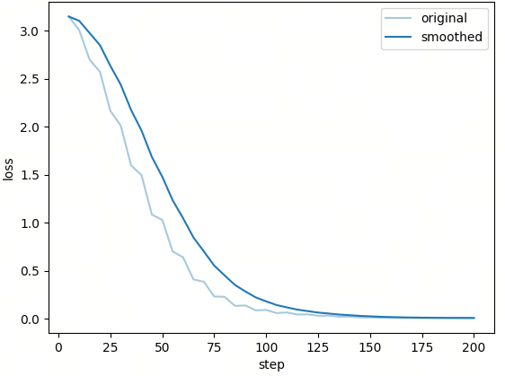
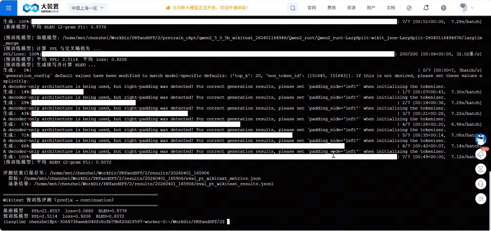

# 第9课时：基于 LazyLLM 的预训练全链路实战

## 1 任务目标

本部分围绕“**继续预训练（Pre-Training, PT）**”这一核心任务展开，通过一条完整、可执行且具备工程可复现性的实践链路，串联起**数据准备 → 训练启动 → 推理与评测**三大关键环节。与偏重理论推导的内容不同，本节更强调“从原始文本到评测结论”的全过程演进，让读者不仅知道“要做什么”，更清楚“每一步为什么这样做”。

在本实验中，我们选用 HuggingFace 上的 `wikitext-2-raw-v1` 作为数据源。该数据集的一个重要特点是：它并不包含显式的任务标签（如问答或分类标签），而是以**连续自然文本**的形式存在。这恰好对应了语言模型预训练的本质目标——学习自然语言的概率分布。因此，它非常适合作为 PT 实验的入门数据。

围绕这一目标，本节将重点引导完成以下三项核心能力：

- 如何借助 LazyLLM 的数据流水线，对原始文本进行**清洗、过滤、分块与去重等**
- 如何将处理后的文本组织为**可直接用于 LLaMA-Factory 的预训练数据格式**
- 如何构建 `prefix → continuation` 的评测任务，并基于该任务完成自动化评估

在评测阶段，我们主要关注三类指标：

- **PPL（Perplexity，困惑度）**：衡量模型对后续文本的不确定性
- **交叉熵 Loss**：衡量模型预测分布与真实分布的偏差
- **2-gram F1（BLEU 风格重合指标）**：衡量生成文本与参考文本的局部重合程度

通过这一整套流程，可以逐步建立起一个清晰的认知：

> **预训练并不是“喂数据 → 跑训练”这么简单，而是一条从数据分布建模到生成效果验证的完整闭环。**

---

## 2 数据准备

### 2.1 来源背景

本实验使用的数据集为 [`wikitext`](https://huggingface.co/datasets/Salesforce/wikitext) 的 `wikitext-2-raw-v1` 配置，并取 `train` split 作为输入语料。之所以选择它，是因为它提供的是较为连续、篇章化的自然文本，这比问答对或对话数据更贴近预训练阶段真正要学习的对象，也就是**自然语言本身的分布规律**。

在正式进入处理流程之前，先对原始数据进行“前览”，理解输入数据的基本形态：

```python
dataset = load_dataset('wikitext', 'wikitext-2-raw-v1', split='train')
raw_texts = []
for row in dataset:
    if len(raw_texts) >= RAW_LOAD_SAMPLES:
        break
    t = row.get('text', '')
    if t and isinstance(t, str) and t.strip():
        raw_texts.append(t.strip())
```

这段代码的逻辑可以概括为：

* 从数据集中逐条读取文本
* 过滤空行与无效字符串
* 控制加载规模（例如前 10000 条）

此时，如果抽取一条数据进行观察，其结构大致为：

```json
{
  "text": "In Egyptian belief , names express the fundamental nature of the things to which they refer . In keeping with this belief , the names of deities often relate to their roles or origins . The name of the predatory goddess Sekhmet means \"powerful one\" , the name of the mysterious god Amun means \"hidden one\" , and the name of the goddess Nekhbet , who was worshipped in the city of Nekheb , means..."
}
```

可以看到，数据已经是自然语言文本，但尚未经过统一长度控制、噪声过滤或分块处理，因此还不能直接用于训练。

### 2.2 数据处理

接下来进入数据准备的核心阶段：将原始文本转化为模型可稳定消费的训练样本。

为了先把“每一步会得到多大规模的数据”讲清楚，先给出总览：

| 构造阶段 | 数据形态 | 数量规模 | 主要限制条件 |
| --- | --- | --- | --- |
| 原始读取 | 原始文本条目 | 最多 10000 条 | 仅保留非空文本（`RAW_LOAD_SAMPLES=10000`） |
| 清洗与分块 | 结构化 chunk | 不固定（由过滤与切块共同决定） | `min_chars=100`、`max_chars=100000`、`min_tokens=100`、`max_tokens=1024`，并执行规则清洗与去重 |
| 训练样本构造 | 纯文本样本 | 最多 3000 条 | 从清洗后 chunk 取前 `TRAIN_SAMPLES=3000` 条 |
| 评测样本构造 | `prefix→continuation` 样本 | 最多 200 条 | 从清洗后 chunk 取前 `EVAL_SAMPLES=200` 条，再按句边界切分（`PREFIX_RATIO=0.6`） |

数据处理采用的核心能力是 LazyLLM 提供的文本预处理流水线：

```python
from lazyllm.tools.data.pipelines.pt_data_ppl import build_text_pt_pipeline
```

真正的处理逻辑并不是一大段孤立代码，而是围绕几个约束逐步展开的：

```python
ppl = build_text_pt_pipeline(
    content_key='content',
    language='en',
    min_chars=100,
    max_chars=100000,
    max_tokens=1024,
    min_tokens=100,
)
data = [{'content': text} for text in raw_texts]
chunks = ppl(data)
```

在这一段里，输入规模的上限是 10000 条非空文本；而输出的 chunk 数量不设固定值，会随着过滤强度和文本切分结果波动。也就是说，清洗后的规模通常小于等于输入文本条数，但在“长文本被切成多个块”时也可能出现总块数增加。

这并不是简单地调用一个函数，而是触发了一条**多阶段的数据处理链路**。可以结合参数理解其内部逻辑：

* `content_key`：指定文本字段来源，明确“哪一列参与训练”
* `min_chars / max_chars`：控制文本字符长度范围，过滤极短或过长样本
* `language='en'`：辅助文本结构识别（如句子、词边界）
* `min_tokens / max_tokens`：控制分块后样本的 token 粒度长度

整个流程可以分为以下几个阶段：

1. **基础筛选**：剔除明显不合格文本（过短、过长、空文本）
2. **规则清洗**：去除异常符号、格式残留等噪声
3. **去重处理**：降低重复样本比例，提升数据多样性
4. **规范化处理**：统一文本格式（空格、标点等）
5. **Token 分块**：将长文本切分为适合模型训练的片段

这一流程的核心逻辑可以概括为：

> **先通过长度与语言约束筛掉低质量数据，再进行规则清洗与去重提升数据质量，最后通过 token 切分将数据转换为适合模型训练的标准化输入形式。**

当流水线跑完之后，一条处理后的样本大致会变成这样：

```json
{
  "uid": "20260316143650_d030de5f07c8487e8da76ac1eac3c8d3",
  "content": "The first written evidence of deities in Egypt comes from the Early Dynastic Period (c. 3100–2686 BC). Deities must have emerged sometime in the preceding Predynastic Period (before 3100 BC) and grown out of prehistoric religious beliefs. Predynastic artwork depicts a variety of animal and human figures. Some of these images, such as stars and cattle, are reminiscent of important features of Egyptian religion in later times, but in most cases there is not enough evidence to say whether the images are connected with deities. As Egyptian society grew more sophisticated, clearer signs of religious activity appeared. The earliest known temples appeared in the last centuries of the predynastic era, along with images that resemble the iconographies of known deities: the falcon that represents Horus and several other gods, the crossed arrows that stand for Neith, and the enigmatic \"Set animal\" that represents Set.",
  "meta_data": {
    "index": 0,
    "total": 1,
    "length": 943
  }
}
```

此时可以看到，数据已经从“原始文本”演化为“结构化训练单元”，为后续训练做好准备。它不再只是原始 `text`，而是多了 `uid`、清洗后的 `content` 和元信息 `meta_data`。其中 `uid` 用于唯一标识样本，`content` 是真正参与训练和评测的正文，`meta_data` 则记录了长度等附加信息，方便后续排查和分析。

在完成清洗与分块之后，下一步是构造**预训练样本**。避免引入复杂结构，而是保留了 PT 最常见、也最容易理解的样式：每条样本只保留一段文本。

对应代码是：

```python
texts = [c.get('content', c.get('text', '')) for c in train_chunks]
json.dump([{'text': t} for t in texts], f, ensure_ascii=False, indent=2)
```

训练样本构造阶段的数量限制非常明确：取 3000 条。如果清洗后样本不足 3000，则按实际可用数量写入。

上述流程意味着，训练阶段最终吃到的数据，本质上只是一个“文本列表”，单条样本为：

```json
{
  "text": "The first written evidence of deities in Egypt comes from the Early Dynastic Period ..."
}
```

这种结构的核心意义在于：

> 模型面对的是连续文本，其目标是在上下文条件下预测下一个 token，而不是拟合标签。

为了评估模型能力，需要将连续文本转换为条件生成任务。我们需要把一段连续文本拆成“已知前文”和“真实后文”，这样才能比较模型在给定条件下的续写能力。

因此，将评测任务设计成：

> 给定前文 `prefix`，预测真实后续 `continuation`

评测样本的数量同样有明确上限：取 200 条清洗后文本进入切分流程；若可用样本不足 200，则按实际数量构造。为了让切分更自然，没有生硬地按字符中点一刀切，而是优先寻找靠近目标比例的句子边界：

```python
target_pos = int(n * target_ratio)
pattern = re.compile(f'[{re.escape(SENTENCE_END_CHARS)}]')
matches = list(pattern.finditer(text))
```

其中， `n` 表示整段文本长度，`target_ratio` 表示希望切分点大致落在全文的比例位置，而 `SENTENCE_END_CHARS = '.!?;\n'` 用于定义英文语料中的句子边界候选。这样切出来的 `prefix` 和 `continuation` 通常比“硬切半段”更符合自然语言结构。

切分完成后，一条评测样本可以前览为：

```json
{
  "prefix": "Through contact with neighboring civilizations , the Egyptians also adopted foreign deities . ...",
  "continuation": "In Greek and Roman times , from 332 BC to the early centuries AD , deities from across the Mediterranean world were revered in Egypt ..."
}
```

注意，我们仍然先展示“数据长什么样”，这样更容易先理解任务本身：所谓评测，不是额外找来一个新数据集，而是把处理后的连续文本进一步转成一个**条件续写任务**。

现在，数据准备的逻辑就完整了。它不是“下载一个数据集，然后得到几个文件”这么简单，而是经历了下面这条更自然的链路：

> 原始文本前览 → LazyLLM 流水线清洗与分块 → 训练文本组织 → `prefix → continuation` 评测样本构造

---

## 3 训练启动

完成数据准备后，进入训练阶段。需要强调的是，“启动训练”不只是把一堆参数写在配置里，而是要把**基座模型、训练数据、训练策略和实验产物管理**真正串起来。

本课示例默认使用的基座模型是 `Qwen2.5-0.5B-Instruct`。训练开始时，先由 `TrainableModule` 接管模型与输出目录：

```python
model = lazyllm.TrainableModule(BASE_MODEL_PATH, target_path=target_path)
model.mode('finetune').trainset(TRAIN_JSON_PATH)
```

这两行其实已经交代了训练入口的核心关系：`BASE_MODEL_PATH` 指向基座模型，`target_path` 指向本轮实验的输出目录，而 `TRAIN_JSON_PATH` 则是前一阶段整理好的训练语料入口。也就是说，数据准备阶段不是孤立存在的，它会在这里被真正消费。

接下来，通过 LazyLLM 调用 LLaMA-Factory 的 PT 模式：

```python
model = lazyllm.TrainableModule(BASE_MODEL_PATH, target_path=target_path)
model.mode('finetune')\
    .trainset(TRAIN_JSON_PATH)\
    .finetune_method((finetune.llamafactory, {
        'stage': 'pt',
        'finetuning_type': 'full',
        'learning_rate': 3e-5,
        'cutoff_len': 512,
        'val_size': 0.05,
        'optim': 'adamw_torch_fused',
        'bf16': True,
        'fp16': False,
        'per_device_train_batch_size': 8,
        'gradient_accumulation_steps': 4,
        'num_train_epochs': 20,
        'lr_scheduler_type': 'cosine',
        'warmup_ratio': 0.1,
        'save_steps': 20,
        'logging_steps': 5,
        'resume_from_checkpoint': None,
        'save_strategy': 'steps',
        'save_total_limit': 5,
        'launcher': launchers.empty(ngpus=1),
    }))\
    .update()
```

其中，`stage='pt'` 明确表示当前是继续预训练，而不是监督微调；`finetuning_type='full'` 说明采用全参数更新；`cutoff_len=512` 控制单条样本的训练长度；`per_device_train_batch_size=8` 配合 `gradient_accumulation_steps=4` 用来在有限显存下保持较稳定的有效 batch；`lr_scheduler_type='cosine'` 和 `warmup_ratio=0.1` 则帮助训练在前期更平滑地进入收敛阶段。

也正因为这些配置已经被封装在统一流程中，训练任务才可以被真正“一键拉起”：

```bash
python run_wikitext.py --mode=train
```

如果改成 `--mode=full`，流程还会在训练结束后自动衔接评测阶段。这样一来，“训练启动”就不只是“展示训练代码”，而是给出一个**可执行的训练入口**。

与此同时，训练过程本身也是可监控的。比如设置了：

```python
'logging_steps': 5,
'save_steps': 20,
'save_strategy': 'steps',
'save_total_limit': 5,
```

这些配置的作用并不抽象。`logging_steps` 决定训练日志多久打印一次，`save_steps` 决定 checkpoint 多久保存一次，`save_total_limit` 则限制保留的检查点数量，避免实验目录无限膨胀。也就是说，不仅能“把训练跑起来”，还可以在训练过程中观察 Loss 变化和 checkpoint 节奏。

训练的 Loss 曲线如下：



为了避免多次实验互相覆盖，每轮训练都会单独创建带时间戳的输出目录：

```python
timestamp = datetime.now().strftime('%y%m%d%H%M%S')
target_path = os.path.join(
    PRETRAIN_CKPT_DIR,
    f'qwen2_5_0_5b_wikitext_{timestamp}'
)
```

训练完成后，流程还会继续查找合并后的模型目录，供后续评测直接复用。于是这一节真正想传达的不是“参数很多”，而是：

> **前面准备好的文本数据，会被送入 PT 训练；训练结束后，又会自然衔接到下一步评测。**

---

## 4 推理与评测

完成训练后，最后是推理与评测。这一节不只是展示几个样例，而是要回答一个更硬的问题：**模型到底有没有学到 Wikitext 的文本分布？**

评测既可以单独执行：

```bash
python run_wikitext.py --mode=eval
```

也可以直接随着完整流程一起执行：

```bash
python run_wikitext.py --mode=full
```

如果没有手动指定 PT 模型路径，就会优先使用最近一次训练生成的合并模型，这样数据准备、训练、评测三段流程就自然接上了。

### 4.1 评测指标

在评测阶段，模型面对的依然不是一道“问答题”，而是一道条件续写题：给定一段 `prefix`，让模型生成后续文本，再把生成结果与真实 `continuation` 对照起来。

这种设计有两个好处。第一，它保留了预训练任务的本质，即“根据已有上下文预测后续内容”；第二，它同时允许从**概率建模**和**生成表现**两个角度看模型。

**（1）PPL 与 Loss：模型是否更会“接着写”**

为了衡量模型对真实后文的预测能力，计算 loss 时会把前缀部分屏蔽掉：

```python
labels = input_ids.clone()
labels[:, :prefix_len] = -100
```

这两行代码的含义是：模型虽然看到了完整输入，但只有 `continuation` 对应的位置会真正参与损失计算。因此，评估的重点不再是“模型能不能复述整段文本”，而是“在给定前文后，它能不能更准确地预测后续内容”。

平均损失可以写成：

$$\bar{L} = -\frac{1}{N}\sum_{i=1}^{N}\log p_\theta(w_i \mid w_{<i})$$

其中，$\bar{L}$ 表示整个评测集上 continuation 部分的平均交叉熵损失，$N$ 表示参与计算的 token 总数，$w_i$ 表示第 $i$ 个目标 token，$w_{<i}$ 表示它之前的上下文，而 $p_\theta$ 表示模型在参数 $\theta$ 下给出的条件概率。也就是说，这个公式衡量的是：模型给真实后文打出的概率到底高不高。

在此基础上，困惑度定义为：

$$\mathrm{PPL} = \exp(\bar{L})$$

其中 `exp` 表示指数运算，因此 PPL 可以理解为把平均损失重新映射回“模型有多困惑”的尺度。PPL 越低，说明模型面对真实后文时越不困惑；Loss 越低，则说明模型给正确 token 的概率分配越合理。

在代码里，这个过程对应的是：

```python
with torch.no_grad():
    out = model(input_ids=input_ids, labels=labels)
    loss = out.loss.item()
ppl = torch.exp(torch.tensor(loss)).item()
```

所以，PPL 与 Loss 主要回答的是一个偏“内部建模能力”的问题：**模型是否更会按照目标语料的分布去续写。**

**（2）2-gram F1：生成结果像不像参考后文**

仅看 PPL 与 Loss 还不够，因为概率建模能力变强，并不一定意味着模型生成出来的表述一定和参考文本足够接近。因此，还会让模型基于 `prefix` 直接做一次生成：

```python
gen = model.generate(**enc, generation_config=gen_config)
pred_ids = gen[i, prefix_lens[i]:]
pred = tokenizer.decode(pred_ids, skip_special_tokens=True)
```

这里的生成策略也不是完全默认，而是显式指定了 `max_new_tokens=256`、`temperature=0.5`、`top_p=0.9` 和 `repetition_penalty=1.05`。这些参数共同决定了模型生成时“放开到什么程度”。例如，`max_new_tokens` 控制最多生成多少新 token，`temperature` 决定采样分布有多平滑，`top_p` 表示只在累计概率达到阈值的候选集合内采样，而 `repetition_penalty` 用来抑制重复输出。

生成完成后，会把生成文本和参考后文做 2-gram 层面的匹配。并记生成文本的 2-gram 集合为 $G_2$，参考文本的 2-gram 集合为 $R_2$，那么：

$$
\mathrm{Precision} = \frac{|G_2 \cap R_2|}{|G_2|}
$$

表示生成出的 2-gram 里，有多少比例也出现在参考文本中；

$$
\mathrm{Recall} = \frac{|G_2 \cap R_2|}{|R_2|}
$$

表示参考文本中的 2-gram，有多少被生成结果覆盖到了；

最后再通过

$$
F_1 = \frac{2 \cdot \mathrm{Precision} \cdot \mathrm{Recall}}{\mathrm{Precision} + \mathrm{Recall}}
$$

把二者综合起来。这里的 $F_1$ 就是采用的 2-gram F1 分数；它和 BLEU 一样关注局部重合，但当前实现本身并不是标准 BLEU，而是更偏向一个 BLEU 风格的重合指标。

### 4.2 评测结果

下面是一次实际运行得到的指标结果：

| 模型 | PPL | Loss | 2-gram F1 |
| ---- | ---- | ---- | ---- |
| 基座模型 | 21.4557 | 3.0660 | 0.9778 |
| 预训练模型 | 2.5114 | 0.9208 | 0.8072 |

运行截图如下：



这组结果很有代表性。首先，PPL 从 `21.4557` 降到 `2.5114`，Loss 从 `3.0660` 降到 `0.9208`，说明预训练模型对 Wikitext 风格文本的后续分布学得更好了。也就是说，在“给定前文，预测真实后文”这个问题上，它的内部建模能力明显增强。

但另一方面，2-gram F1 却从 `0.9778` 降到了 `0.8072`。这并不一定说明模型变差了，更可能说明在当前采样式生成配置下，模型虽然更懂目标分布，却未必会输出与参考后文局部片段高度一致的表述。换句话说，**会建模**和**会复现参考表达**并不是完全等价的两件事。

这也是为什么不能只看单一指标。PPL 与 Loss 更适合判断 PT 是否真的让模型学到了目标语料分布；2-gram F1 则更像是从输出表面观察生成文本与参考文本“像不像”。二者结合，才能让结论更稳。

!!! note "实验备注（待完善）"
    当前结果更适合作为“流程跑通”的示意，而不是严格 benchmark，原因主要有三点：

    - 当前脚本使用 `train_chunks = chunks[:TRAIN_SAMPLES]` 和 `eval_chunks = chunks[:EVAL_SAMPLES]`，评测样本与训练样本存在前缀重叠，后续建议改成互斥划分后重新生成结果。
    - 当前数据来自 `wikitext-2-raw-v1` 的 `train` split；如果要做更严谨的对比，建议改用独立的验证/测试切分，避免把训练语料再拿来做效果结论。
    - 脚本与结果文件中仍沿用 `bleu` 字段名，但其实现实际是字符级 2-gram F1 风格分数，不应直接等同为标准 BLEU。

    如果后续希望更纯粹地观察继续预训练对语言建模能力的影响，也可以考虑把基座模型替换为同系列 Base 模型，而不是 Instruct 版本。

评测结束后，流程不会只在终端里打印几行数字，而是会同时沉淀汇总结果与逐条明细。这样做的价值在于：你不仅知道“整体指标变了多少”，还可以回过头去看某一条样本上，基座模型和 PT 模型到底分别生成了什么。

因此，本讲最后形成的并不是一个零散的演示，而是一条完整闭环：

> **构造评测样本 → 计算 PPL/Loss → 生成续写 → 计算 2-gram F1 → 保存汇总与逐条结果**

---

## 附录

### 『一键启动』

为了方便实践和复现，本实验提供了“一键启动”方式，通过一条命令即可完成全部流程（[完整代码链接](./code/run_wikitext.py)）：

```bash
python run_wikitext.py --mode=full
```

该命令会依次完成：

1. 加载 Wikitext 原始文本并经由 LazyLLM pipeline 清洗、过滤、去重和分块
2. 生成 PT 训练集与 `prefix → continuation` 评测集
3. 启动 LLaMA-Factory 全参数预训练
4. 基于基座模型与预训练模型执行推理与评测
5. 自动保存指标汇总与逐条结果

如果只想单独运行某个阶段，也可以使用：

```bash
python run_wikitext.py --mode=prepare
python run_wikitext.py --mode=train
python run_wikitext.py --mode=eval
```

### 『数据产物』

以下路径均相对于 `run_wikitext.py` 所在目录（即实验代码目录）。当执行 `--mode=full` 时，流程会依次完成「数据准备 → 预训练 → 推理评测」三个阶段，并在每一阶段生成对应的中间或最终产物；若单独运行某一模式（如 `prepare` / `train` / `eval`），则仅生成该阶段及其依赖步骤所需的文件。

| 阶段 | 路径 / 文件 | 简要说明 |
| ---- | ----------- | -------- |
| 数据准备 | `data/wikitext_cleaned.jsonl` | 通过 LazyLLM 数据流水线处理后的中间语料，每行为一条清洗、去重并按 token 切分后的文本块（chunk），包含 `content` 与元信息字段，用于后续构建训练与评测数据。 |
| 数据准备 | `data/wikitext_train.json` | 继续预训练所使用的训练集，JSON 数组结构，每条样本为 `{"text": "..."}`，由处理后的 chunk 抽取得到，供 LLaMA-Factory 在 `stage=pt` 模式下直接使用。 |
| 数据准备 | `data/wikitext_eval.jsonl` | 评测集文件（JSONL 格式），每行包含一条 `prefix` 与 `continuation`，由连续文本按句子边界切分得到，用于后续 PPL、Loss 与 2-gram F1 的统一评测。 |
| 预训练 | `pretrain_ckpt/qwen2_5_0_5b_wikitext_<yymmddHHMMSS>/` | 单次预训练任务的输出目录，以时间戳区分不同实验轮次；目录下包含训练过程中的 checkpoint、日志以及框架生成的中间文件。 |
| 预训练 | 上述目录中的 `lazyllm_merge/`（递归查找） | 训练完成后自动合并得到的整模型权重目录；在未显式指定 `--pt_model_path` 时，评测阶段默认加载该目录作为预训练模型输入。 |
| 评测 | `results/<YYYYMMDD_HHMMSS>/eval_pt_wikitext_metrics.json` | 汇总指标文件，记录评测样本总数以及基座模型与预训练模型的整体 PPL、Loss 与 `bleu` 字段；其中 `bleu` 在当前脚本里实际对应字符级 2-gram F1 风格分数（若未提供 PT 模型，则 `pt` 字段为 `null`）。 |
| 评测 | `results/<YYYYMMDD_HHMMSS>/eval_pt_wikitext_results.jsonl` | 逐条评测结果明细，每行对应一条样本，包含 prefix 长度、continuation 长度，以及基座/预训练模型在该样本上的 PPL、loss、生成续写片段与 `bleu` 分数；这里的 `bleu` 同样应理解为 2-gram F1 风格指标，便于误差分析与案例回溯。 |

在流程控制上，有如下几个细节需要注意：

- 若 `wikitext_train.json` 与 `wikitext_eval.jsonl` 已存在，则再次执行 `prepare` 时会直接跳过数据构建阶段；这意味着 `wikitext_cleaned.jsonl` 也不会被重新生成。
- 如果希望基于新的 pipeline 配置重建 `wikitext_cleaned.jsonl`、训练集或评测集，需要先删除已有的 `wikitext_train.json` / `wikitext_eval.jsonl`，或调整脚本中的跳过逻辑。
- 预训练阶段的输出目录始终带有时间戳，从而支持多轮实验并行存在，便于横向对比不同参数配置下的训练效果；
- 评测阶段同样采用时间戳目录保存结果，使得每一次评测结果都可以独立追溯。

从整体上看，这些数据产物并不是零散存在的文件集合，而是围绕一条清晰的实验链路逐步生成的：

> **原始文本 → 清洗分块（cleaned）→ 训练集 / 评测集 → 预训练模型 → 指标汇总与逐条分析结果**

理解这一结构，有助于在后续调试、复现实验或扩展任务时，快速定位问题所在，并对不同阶段的结果进行有针对性的分析。

---

## 本章小结

本课围绕继续预训练（PT）实践，完整串联了数据准备、训练启动与推理评测三大环节。从原始文本出发，通过 LazyLLM 数据流水线完成清洗与分块，再构造训练文本与 `prefix → continuation` 评测样本，使训练目标与评测方式保持一致；随后借助 LLaMA-Factory 启动预训练，实现模型、数据与训练策略的一体化衔接；最后从 PPL、Loss 与 2-gram F1 两个视角评估模型能力，分别刻画概率建模效果与生成表现。整个流程形成了“数据处理 → 模型训练 → 生成评测 → 结果分析”的闭环，也表明继续预训练并非单一训练步骤，而是一项以数据分布建模为核心的系统性工程。在后续学习中，可以在此基础上进一步尝试更大规模语料、更复杂的数据构造方式，或引入指令微调、多模态扩展等能力，从而逐步拓展这一“预训练闭环”的应用边界。
